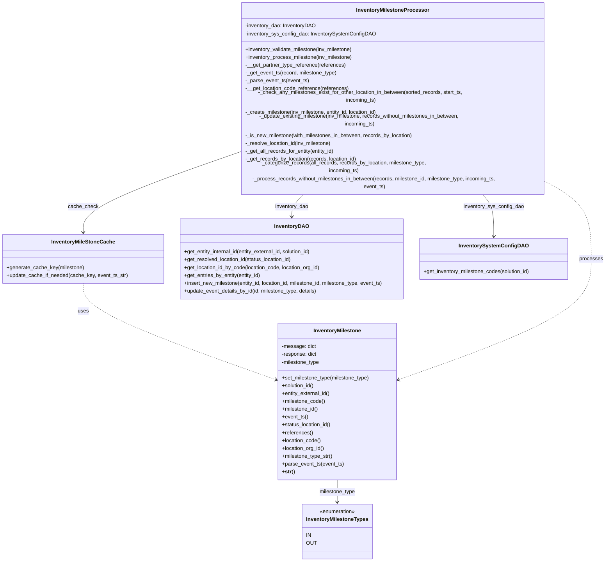

# Diagram: entity_core/entity_service/entity_inventory/entity_inventory_service/service/inventory_processor/inventory_milestone_processor.py


> Auto-generated by Obscura crawlers

## Diagram 1



### SVG

<svg id="container" width="1861.5078125" xmlns="http://www.w3.org/2000/svg" class="classDiagram" height="1636" viewBox="0 0 1861.5078125 1636" role="graphics-document document" aria-roledescription="class"><style>#container{font-family:"trebuchet ms",verdana,arial,sans-serif;font-size:16px;fill:#333;}@keyframes edge-animation-frame{from{stroke-dashoffset:0;}}@keyframes dash{to{stroke-dashoffset:0;}}#container .edge-animation-slow{stroke-dasharray:9,5!important;stroke-dashoffset:900;animation:dash 50s linear infinite;stroke-linecap:round;}#container .edge-animation-fast{stroke-dasharray:9,5!important;stroke-dashoffset:900;animation:dash 20s linear infinite;stroke-linecap:round;}#container .error-icon{fill:#552222;}#container .error-text{fill:#552222;stroke:#552222;}#container .edge-thickness-normal{stroke-width:1px;}#container .edge-thickness-thick{stroke-width:3.5px;}#container .edge-pattern-solid{stroke-dasharray:0;}#container .edge-thickness-invisible{stroke-width:0;fill:none;}#container .edge-pattern-dashed{stroke-dasharray:3;}#container .edge-pattern-dotted{stroke-dasharray:2;}#container .marker{fill:#333333;stroke:#333333;}#container .marker.cross{stroke:#333333;}#container svg{font-family:"trebuchet ms",verdana,arial,sans-serif;font-size:16px;}#container p{margin:0;}#container g.classGroup text{fill:#9370DB;stroke:none;font-family:"trebuchet ms",verdana,arial,sans-serif;font-size:10px;}#container g.classGroup text .title{font-weight:bolder;}#container .nodeLabel,#container .edgeLabel{color:#131300;}#container .edgeLabel .label rect{fill:#ECECFF;}#container .label text{fill:#131300;}#container .labelBkg{background:#ECECFF;}#container .edgeLabel .label span{background:#ECECFF;}#container .classTitle{font-weight:bolder;}#container .node rect,#container .node circle,#container .node ellipse,#container .node polygon,#container .node path{fill:#ECECFF;stroke:#9370DB;stroke-width:1px;}#container .divider{stroke:#9370DB;stroke-width:1;}#container g.clickable{cursor:pointer;}#container g.classGroup rect{fill:#ECECFF;stroke:#9370DB;}#container g.classGroup line{stroke:#9370DB;stroke-width:1;}#container .classLabel .box{stroke:none;stroke-width:0;fill:#ECECFF;opacity:0.5;}#container .classLabel .label{fill:#9370DB;font-size:10px;}#container .relation{stroke:#333333;stroke-width:1;fill:none;}#container .dashed-line{stroke-dasharray:3;}#container .dotted-line{stroke-dasharray:1 2;}#container #compositionStart,#container .composition{fill:#333333!important;stroke:#333333!important;stroke-width:1;}#container #compositionEnd,#container .composition{fill:#333333!important;stroke:#333333!important;stroke-width:1;}#container #dependencyStart,#container .dependency{fill:#333333!important;stroke:#333333!important;stroke-width:1;}#container #dependencyStart,#container .dependency{fill:#333333!important;stroke:#333333!important;stroke-width:1;}#container #extensionStart,#container .extension{fill:transparent!important;stroke:#333333!important;stroke-width:1;}#container #extensionEnd,#container .extension{fill:transparent!important;stroke:#333333!important;stroke-width:1;}#container #aggregationStart,#container .aggregation{fill:transparent!important;stroke:#333333!important;stroke-width:1;}#container #aggregationEnd,#container .aggregation{fill:transparent!important;stroke:#333333!important;stroke-width:1;}#container #lollipopStart,#container .lollipop{fill:#ECECFF!important;stroke:#333333!important;stroke-width:1;}#container #lollipopEnd,#container .lollipop{fill:#ECECFF!important;stroke:#333333!important;stroke-width:1;}#container .edgeTerminals{font-size:11px;line-height:initial;}#container .classTitleText{text-anchor:middle;font-size:18px;fill:#333;}#container .label-icon{display:inline-block;height:1em;overflow:visible;vertical-align:-0.125em;}#container .node .label-icon path{fill:currentColor;stroke:revert;stroke-width:revert;}#container :root{--mermaid-font-family:"trebuchet ms",verdana,arial,sans-serif;}</style><g><defs><marker id="container_class-aggregationStart" class="marker aggregation class" refX="18" refY="7" markerWidth="190" markerHeight="240" orient="auto"><path d="M 18,7 L9,13 L1,7 L9,1 Z"></path></marker></defs><defs><marker id="container_class-aggregationEnd" class="marker aggregation class" refX="1" refY="7" markerWidth="20" markerHeight="28" orient="auto"><path d="M 18,7 L9,13 L1,7 L9,1 Z"></path></marker></defs><defs><marker id="container_class-extensionStart" class="marker extension class" refX="18" refY="7" markerWidth="190" markerHeight="240" orient="auto"><path d="M 1,7 L18,13 V 1 Z"></path></marker></defs><defs><marker id="container_class-extensionEnd" class="marker extension class" refX="1" refY="7" markerWidth="20" markerHeight="28" orient="auto"><path d="M 1,1 V 13 L18,7 Z"></path></marker></defs><defs><marker id="container_class-compositionStart" class="marker composition class" refX="18" refY="7" markerWidth="190" markerHeight="240" orient="auto"><path d="M 18,7 L9,13 L1,7 L9,1 Z"></path></marker></defs><defs><marker id="container_class-compositionEnd" class="marker composition class" refX="1" refY="7" markerWidth="20" markerHeight="28" orient="auto"><path d="M 18,7 L9,13 L1,7 L9,1 Z"></path></marker></defs><defs><marker id="container_class-dependencyStart" class="marker dependency class" refX="6" refY="7" markerWidth="190" markerHeight="240" orient="auto"><path d="M 5,7 L9,13 L1,7 L9,1 Z"></path></marker></defs><defs><marker id="container_class-dependencyEnd" class="marker dependency class" refX="13" refY="7" markerWidth="20" markerHeight="28" orient="auto"><path d="M 18,7 L9,13 L14,7 L9,1 Z"></path></marker></defs><defs><marker id="container_class-lollipopStart" class="marker lollipop class" refX="13" refY="7" markerWidth="190" markerHeight="240" orient="auto"><circle stroke="black" fill="transparent" cx="7" cy="7" r="6"></circle></marker></defs><defs><marker id="container_class-lollipopEnd" class="marker lollipop class" refX="1" refY="7" markerWidth="190" markerHeight="240" orient="auto"><circle stroke="black" fill="transparent" cx="7" cy="7" r="6"></circle></marker></defs><g class="root"><g class="clusters"></g><g class="edgePaths"><path d="M934.58,512L927.907,518.167C921.233,524.333,907.886,536.667,901.213,548C894.539,559.333,894.539,569.667,894.539,574.833L894.539,580" id="id_InventoryMilestoneProcessor_InventoryDAO_1" class="edge-thickness-normal edge-pattern-solid relation" style=";;;" data-edge="true" data-et="edge" data-id="id_InventoryMilestoneProcessor_InventoryDAO_1" data-points="W3sieCI6OTM0LjU4MDIyMDA0NzU3NzksInkiOjUxMn0seyJ4Ijo4OTQuNTM5MDYyNSwieSI6NTQ5fSx7IngiOjg5NC41MzkwNjI1LCJ5Ijo1ODZ9XQ==" marker-end="url(#container_class-dependencyEnd)"></path><path d="M1480.006,512L1486.679,518.167C1493.353,524.333,1506.7,536.667,1513.373,558C1520.047,579.333,1520.047,609.667,1520.047,624.833L1520.047,640" id="id_InventoryMilestoneProcessor_InventorySystemConfigDAO_2" class="edge-thickness-normal edge-pattern-solid relation" style=";;;" data-edge="true" data-et="edge" data-id="id_InventoryMilestoneProcessor_InventorySystemConfigDAO_2" data-points="W3sieCI6MTQ4MC4wMDU3MTc0NTI0MjIyLCJ5Ijo1MTJ9LHsieCI6MTUyMC4wNDY4NzUsInkiOjU0OX0seyJ4IjoxNTIwLjA0Njg3NSwieSI6NjQ2fV0=" marker-end="url(#container_class-dependencyEnd)"></path><path d="M251.957,784L251.957,798.167C251.957,812.333,251.957,840.667,350.964,889.864C449.972,939.062,647.987,1009.124,746.994,1044.155L846.002,1079.186" id="id_InventoryMileStoneCache_InventoryMilestone_3" class="edge-thickness-normal edge-pattern-dashed relation" style=";;;" data-edge="true" data-et="edge" data-id="id_InventoryMileStoneCache_InventoryMilestone_3" data-points="W3sieCI6MjUxLjk1NzAzMTI1LCJ5Ijo3ODR9LHsieCI6MjUxLjk1NzAzMTI1LCJ5Ijo4Njl9LHsieCI6ODUxLjY1ODIwMzEyNSwieSI6MTA4MS4xODcxMDY5MTQzMTYyfV0=" marker-end="url(#container_class-dependencyEnd)"></path><path d="M1034.838,1386L1034.838,1392.167C1034.838,1398.333,1034.838,1410.667,1034.838,1422C1034.838,1433.333,1034.838,1443.667,1034.838,1448.833L1034.838,1454" id="id_InventoryMilestone_InventoryMilestoneTypes_4" class="edge-thickness-normal edge-pattern-solid relation" style=";;;" data-edge="true" data-et="edge" data-id="id_InventoryMilestone_InventoryMilestoneTypes_4" data-points="W3sieCI6MTAzNC44Mzc4OTA2MjUsInkiOjEzODZ9LHsieCI6MTAzNC44Mzc4OTA2MjUsInkiOjE0MjN9LHsieCI6MTAzNC44Mzc4OTA2MjUsInkiOjE0NjB9XQ==" marker-end="url(#container_class-dependencyEnd)"></path><path d="M729.191,404.631L649.652,428.693C570.113,452.754,411.035,500.877,331.496,538.105C251.957,575.333,251.957,601.667,251.957,614.833L251.957,628" id="id_InventoryMilestoneProcessor_InventoryMileStoneCache_5" class="edge-thickness-normal edge-pattern-solid relation" style=";;;" data-edge="true" data-et="edge" data-id="id_InventoryMilestoneProcessor_InventoryMileStoneCache_5" data-points="W3sieCI6NzI5LjE5MTQwNjI1LCJ5Ijo0MDQuNjMxMTY3MDQ2OTMyMX0seyJ4IjoyNTEuOTU3MDMxMjUsInkiOjU0OX0seyJ4IjoyNTEuOTU3MDMxMjUsInkiOjYzNH1d" marker-end="url(#container_class-dependencyEnd)"></path><path d="M1685.395,486.352L1707.449,496.794C1729.503,507.235,1773.611,528.117,1795.665,565.225C1817.719,602.333,1817.719,655.667,1817.719,709C1817.719,762.333,1817.719,815.667,1718.711,877.364C1619.704,939.062,1421.689,1009.124,1322.681,1044.155L1223.674,1079.186" id="id_InventoryMilestoneProcessor_InventoryMilestone_6" class="edge-thickness-normal edge-pattern-dashed relation" style=";;;" data-edge="true" data-et="edge" data-id="id_InventoryMilestoneProcessor_InventoryMilestone_6" data-points="W3sieCI6MTY4NS4zOTQ1MzEyNSwieSI6NDg2LjM1MjQxNzk0NTk3Nzh9LHsieCI6MTgxNy43MTg3NSwieSI6NTQ5fSx7IngiOjE4MTcuNzE4NzUsInkiOjcwOX0seyJ4IjoxODE3LjcxODc1LCJ5Ijo4Njl9LHsieCI6MTIxOC4wMTc1NzgxMjUsInkiOjEwODEuMTg3MTA2OTE0MzE2Mn1d" marker-end="url(#container_class-dependencyEnd)"></path></g><g class="edgeLabels"><g class="edgeLabel" transform="translate(894.5390625, 549)"><g class="label" data-id="id_InventoryMilestoneProcessor_InventoryDAO_1" transform="translate(-51.875, -12)"><foreignObject width="103.75" height="24"><div xmlns="http://www.w3.org/1999/xhtml" class="labelBkg" style="display: table-cell; white-space: nowrap; line-height: 1.5; max-width: 200px; text-align: center;"><span class="edgeLabel"><p>inventory_dao</p></span></div></foreignObject></g></g><g class="edgeLabel" transform="translate(1520.046875, 549)"><g class="label" data-id="id_InventoryMilestoneProcessor_InventorySystemConfigDAO_2" transform="translate(-92.90625, -12)"><foreignObject width="185.8125" height="24"><div xmlns="http://www.w3.org/1999/xhtml" class="labelBkg" style="display: table-cell; white-space: nowrap; line-height: 1.5; max-width: 200px; text-align: center;"><span class="edgeLabel"><p>inventory_sys_config_dao</p></span></div></foreignObject></g></g><g class="edgeLabel" transform="translate(251.95703125, 869)"><g class="label" data-id="id_InventoryMileStoneCache_InventoryMilestone_3" transform="translate(-16.4921875, -12)"><foreignObject width="32.984375" height="24"><div xmlns="http://www.w3.org/1999/xhtml" class="labelBkg" style="display: table-cell; white-space: nowrap; line-height: 1.5; max-width: 200px; text-align: center;"><span class="edgeLabel"><p>uses</p></span></div></foreignObject></g></g><g class="edgeLabel" transform="translate(1034.837890625, 1423)"><g class="label" data-id="id_InventoryMilestone_InventoryMilestoneTypes_4" transform="translate(-55.7421875, -12)"><foreignObject width="111.484375" height="24"><div xmlns="http://www.w3.org/1999/xhtml" class="labelBkg" style="display: table-cell; white-space: nowrap; line-height: 1.5; max-width: 200px; text-align: center;"><span class="edgeLabel"><p>milestone_type</p></span></div></foreignObject></g></g><g class="edgeLabel" transform="translate(251.95703125, 549)"><g class="label" data-id="id_InventoryMilestoneProcessor_InventoryMileStoneCache_5" transform="translate(-45.6015625, -12)"><foreignObject width="91.203125" height="24"><div xmlns="http://www.w3.org/1999/xhtml" class="labelBkg" style="display: table-cell; white-space: nowrap; line-height: 1.5; max-width: 200px; text-align: center;"><span class="edgeLabel"><p>cache_check</p></span></div></foreignObject></g></g><g class="edgeLabel" transform="translate(1817.71875, 709)"><g class="label" data-id="id_InventoryMilestoneProcessor_InventoryMilestone_6" transform="translate(-35.7890625, -12)"><foreignObject width="71.578125" height="24"><div xmlns="http://www.w3.org/1999/xhtml" class="labelBkg" style="display: table-cell; white-space: nowrap; line-height: 1.5; max-width: 200px; text-align: center;"><span class="edgeLabel"><p>processes</p></span></div></foreignObject></g></g></g><g class="nodes"><g class="node default" id="classId-InventoryMilestoneTypes-0" transform="translate(1034.837890625, 1544)"><g class="basic label-container"><path d="M-103.9609375 -84 L103.9609375 -84 L103.9609375 84 L-103.9609375 84" stroke="none" stroke-width="0" fill="#ECECFF" style=""></path><path d="M-103.9609375 -84 C-56.43722402508149 -84, -8.913510550162982 -84, 103.9609375 -84 M-103.9609375 -84 C-35.0751189827525 -84, 33.810699534495 -84, 103.9609375 -84 M103.9609375 -84 C103.9609375 -33.56046790973291, 103.9609375 16.879064180534186, 103.9609375 84 M103.9609375 -84 C103.9609375 -17.733743923376906, 103.9609375 48.53251215324619, 103.9609375 84 M103.9609375 84 C53.933616550795485 84, 3.906295601590969 84, -103.9609375 84 M103.9609375 84 C50.69031634115987 84, -2.5803048176802577 84, -103.9609375 84 M-103.9609375 84 C-103.9609375 34.06931756352568, -103.9609375 -15.861364872948641, -103.9609375 -84 M-103.9609375 84 C-103.9609375 40.18007022531631, -103.9609375 -3.6398595493673866, -103.9609375 -84" stroke="#9370DB" stroke-width="1.3" fill="none" stroke-dasharray="0 0" style=""></path></g><g class="annotation-group text" transform="translate(-55.5546875, -60)"><g class="label" style="" transform="translate(0,-12)"><foreignObject width="111.109375" height="24"><div xmlns="http://www.w3.org/1999/xhtml" style="display: table-cell; white-space: nowrap; line-height: 1.5; max-width: 161px; text-align: center;"><span class="nodeLabel markdown-node-label" style=""><p>«enumeration»</p></span></div></foreignObject></g></g><g class="label-group text" transform="translate(-91.9609375, -36)"><g class="label" style="font-weight: bolder" transform="translate(0,-12)"><foreignObject width="183.921875" height="24"><div xmlns="http://www.w3.org/1999/xhtml" style="display: table-cell; white-space: nowrap; line-height: 1.5; max-width: 231px; text-align: center;"><span class="nodeLabel markdown-node-label" style=""><p>InventoryMilestoneTypes</p></span></div></foreignObject></g></g><g class="members-group text" transform="translate(-91.9609375, 12)"><g class="label" style="" transform="translate(0,-12)"><foreignObject width="15.65625" height="24"><div xmlns="http://www.w3.org/1999/xhtml" style="display: table-cell; white-space: nowrap; line-height: 1.5; max-width: 66px; text-align: center;"><span class="nodeLabel markdown-node-label" style=""><p>IN</p></span></div></foreignObject></g><g class="label" style="" transform="translate(0,12)"><foreignObject width="29.9375" height="24"><div xmlns="http://www.w3.org/1999/xhtml" style="display: table-cell; white-space: nowrap; line-height: 1.5; max-width: 81px; text-align: center;"><span class="nodeLabel markdown-node-label" style=""><p>OUT</p></span></div></foreignObject></g></g><g class="methods-group text" transform="translate(-91.9609375, 84)"></g><g class="divider" style=""><path d="M-103.9609375 -12 C-26.52187874710161 -12, 50.91718000579678 -12, 103.9609375 -12 M-103.9609375 -12 C-45.55563657852201 -12, 12.849664342955975 -12, 103.9609375 -12" stroke="#9370DB" stroke-width="1.3" fill="none" stroke-dasharray="0 0" style=""></path></g><g class="divider" style=""><path d="M-103.9609375 60 C-48.99875478518861 60, 5.963427929622782 60, 103.9609375 60 M-103.9609375 60 C-21.938813111265176 60, 60.08331127746965 60, 103.9609375 60" stroke="#9370DB" stroke-width="1.3" fill="none" stroke-dasharray="0 0" style=""></path></g></g><g class="node default" id="classId-InventoryMilestone-1" transform="translate(1034.837890625, 1146)"><g class="basic label-container"><path d="M-183.1796875 -240 L183.1796875 -240 L183.1796875 240 L-183.1796875 240" stroke="none" stroke-width="0" fill="#ECECFF" style=""></path><path d="M-183.1796875 -240 C-51.990058338540564 -240, 79.19957082291887 -240, 183.1796875 -240 M-183.1796875 -240 C-48.810645053870445 -240, 85.55839739225911 -240, 183.1796875 -240 M183.1796875 -240 C183.1796875 -64.01597236807115, 183.1796875 111.9680552638577, 183.1796875 240 M183.1796875 -240 C183.1796875 -68.3633564339346, 183.1796875 103.2732871321308, 183.1796875 240 M183.1796875 240 C79.9422141378028 240, -23.295259224394414 240, -183.1796875 240 M183.1796875 240 C39.235670387369254 240, -104.70834672526149 240, -183.1796875 240 M-183.1796875 240 C-183.1796875 103.96184716154931, -183.1796875 -32.07630567690137, -183.1796875 -240 M-183.1796875 240 C-183.1796875 64.90245420806926, -183.1796875 -110.19509158386148, -183.1796875 -240" stroke="#9370DB" stroke-width="1.3" fill="none" stroke-dasharray="0 0" style=""></path></g><g class="annotation-group text" transform="translate(0, -216)"></g><g class="label-group text" transform="translate(-70.765625, -216)"><g class="label" style="font-weight: bolder" transform="translate(0,-12)"><foreignObject width="141.53125" height="24"><div xmlns="http://www.w3.org/1999/xhtml" style="display: table-cell; white-space: nowrap; line-height: 1.5; max-width: 190px; text-align: center;"><span class="nodeLabel markdown-node-label" style=""><p>InventoryMilestone</p></span></div></foreignObject></g></g><g class="members-group text" transform="translate(-171.1796875, -168)"><g class="label" style="" transform="translate(0,-12)"><foreignObject width="104.421875" height="24"><div xmlns="http://www.w3.org/1999/xhtml" style="display: table-cell; white-space: nowrap; line-height: 1.5; max-width: 162px; text-align: center;"><span class="nodeLabel markdown-node-label" style=""><p>-message: dict</p></span></div></foreignObject></g><g class="label" style="" transform="translate(0,12)"><foreignObject width="108.34375" height="24"><div xmlns="http://www.w3.org/1999/xhtml" style="display: table-cell; white-space: nowrap; line-height: 1.5; max-width: 166px; text-align: center;"><span class="nodeLabel markdown-node-label" style=""><p>-response: dict</p></span></div></foreignObject></g><g class="label" style="" transform="translate(0,36)"><foreignObject width="117.921875" height="24"><div xmlns="http://www.w3.org/1999/xhtml" style="display: table-cell; white-space: nowrap; line-height: 1.5; max-width: 175px; text-align: center;"><span class="nodeLabel markdown-node-label" style=""><p>-milestone_type</p></span></div></foreignObject></g></g><g class="methods-group text" transform="translate(-171.1796875, -72)"><g class="label" style="" transform="translate(0,-12)"><foreignObject width="271.59375" height="24"><div xmlns="http://www.w3.org/1999/xhtml" style="display: table-cell; white-space: nowrap; line-height: 1.5; max-width: 329px; text-align: center;"><span class="nodeLabel markdown-node-label" style=""><p>+set_milestone_type(milestone_type)</p></span></div></foreignObject></g><g class="label" style="" transform="translate(0,12)"><foreignObject width="100.578125" height="24"><div xmlns="http://www.w3.org/1999/xhtml" style="display: table-cell; white-space: nowrap; line-height: 1.5; max-width: 158px; text-align: center;"><span class="nodeLabel markdown-node-label" style=""><p>+solution_id()</p></span></div></foreignObject></g><g class="label" style="" transform="translate(0,36)"><foreignObject width="149.609375" height="24"><div xmlns="http://www.w3.org/1999/xhtml" style="display: table-cell; white-space: nowrap; line-height: 1.5; max-width: 207px; text-align: center;"><span class="nodeLabel markdown-node-label" style=""><p>+entity_external_id()</p></span></div></foreignObject></g><g class="label" style="" transform="translate(0,60)"><foreignObject width="133" height="24"><div xmlns="http://www.w3.org/1999/xhtml" style="display: table-cell; white-space: nowrap; line-height: 1.5; max-width: 190px; text-align: center;"><span class="nodeLabel markdown-node-label" style=""><p>+milestone_code()</p></span></div></foreignObject></g><g class="label" style="" transform="translate(0,84)"><foreignObject width="112.4375" height="24"><div xmlns="http://www.w3.org/1999/xhtml" style="display: table-cell; white-space: nowrap; line-height: 1.5; max-width: 170px; text-align: center;"><span class="nodeLabel markdown-node-label" style=""><p>+milestone_id()</p></span></div></foreignObject></g><g class="label" style="" transform="translate(0,108)"><foreignObject width="79.9375" height="24"><div xmlns="http://www.w3.org/1999/xhtml" style="display: table-cell; white-space: nowrap; line-height: 1.5; max-width: 137px; text-align: center;"><span class="nodeLabel markdown-node-label" style=""><p>+event_ts()</p></span></div></foreignObject></g><g class="label" style="" transform="translate(0,132)"><foreignObject width="152.15625" height="24"><div xmlns="http://www.w3.org/1999/xhtml" style="display: table-cell; white-space: nowrap; line-height: 1.5; max-width: 210px; text-align: center;"><span class="nodeLabel markdown-node-label" style=""><p>+status_location_id()</p></span></div></foreignObject></g><g class="label" style="" transform="translate(0,156)"><foreignObject width="94.015625" height="24"><div xmlns="http://www.w3.org/1999/xhtml" style="display: table-cell; white-space: nowrap; line-height: 1.5; max-width: 151px; text-align: center;"><span class="nodeLabel markdown-node-label" style=""><p>+references()</p></span></div></foreignObject></g><g class="label" style="" transform="translate(0,180)"><foreignObject width="120.46875" height="24"><div xmlns="http://www.w3.org/1999/xhtml" style="display: table-cell; white-space: nowrap; line-height: 1.5; max-width: 178px; text-align: center;"><span class="nodeLabel markdown-node-label" style=""><p>+location_code()</p></span></div></foreignObject></g><g class="label" style="" transform="translate(0,204)"><foreignObject width="131.578125" height="24"><div xmlns="http://www.w3.org/1999/xhtml" style="display: table-cell; white-space: nowrap; line-height: 1.5; max-width: 189px; text-align: center;"><span class="nodeLabel markdown-node-label" style=""><p>+location_org_id()</p></span></div></foreignObject></g><g class="label" style="" transform="translate(0,228)"><foreignObject width="157.25" height="24"><div xmlns="http://www.w3.org/1999/xhtml" style="display: table-cell; white-space: nowrap; line-height: 1.5; max-width: 215px; text-align: center;"><span class="nodeLabel markdown-node-label" style=""><p>+milestone_type_str()</p></span></div></foreignObject></g><g class="label" style="" transform="translate(0,252)"><foreignObject width="189.390625" height="24"><div xmlns="http://www.w3.org/1999/xhtml" style="display: table-cell; white-space: nowrap; line-height: 1.5; max-width: 247px; text-align: center;"><span class="nodeLabel markdown-node-label" style=""><p>+parse_event_ts(event_ts)</p></span></div></foreignObject></g><g class="label" style="" transform="translate(0,276)"><foreignObject width="38.6875" height="24"><div xmlns="http://www.w3.org/1999/xhtml" style="display: table-cell; white-space: nowrap; line-height: 1.5; max-width: 126px; text-align: center;"><span class="nodeLabel markdown-node-label" style=""><p>+<strong>str</strong>()</p></span></div></foreignObject></g></g><g class="divider" style=""><path d="M-183.1796875 -192 C-55.27375835763179 -192, 72.63217078473642 -192, 183.1796875 -192 M-183.1796875 -192 C-80.31584706721715 -192, 22.547993365565702 -192, 183.1796875 -192" stroke="#9370DB" stroke-width="1.3" fill="none" stroke-dasharray="0 0" style=""></path></g><g class="divider" style=""><path d="M-183.1796875 -96 C-65.27514628354656 -96, 52.62939493290688 -96, 183.1796875 -96 M-183.1796875 -96 C-101.21557469716211 -96, -19.251461894324223 -96, 183.1796875 -96" stroke="#9370DB" stroke-width="1.3" fill="none" stroke-dasharray="0 0" style=""></path></g></g><g class="node default" id="classId-InventoryMileStoneCache-2" transform="translate(251.95703125, 709)"><g class="basic label-container"><path d="M-243.95703125 -75 L243.95703125 -75 L243.95703125 75 L-243.95703125 75" stroke="none" stroke-width="0" fill="#ECECFF" style=""></path><path d="M-243.95703125 -75 C-128.35760002254003 -75, -12.758168795080053 -75, 243.95703125 -75 M-243.95703125 -75 C-134.42582558165037 -75, -24.894619913300772 -75, 243.95703125 -75 M243.95703125 -75 C243.95703125 -31.616227149301295, 243.95703125 11.76754570139741, 243.95703125 75 M243.95703125 -75 C243.95703125 -36.28452507304671, 243.95703125 2.430949853906583, 243.95703125 75 M243.95703125 75 C76.8355055854835 75, -90.286020079033 75, -243.95703125 75 M243.95703125 75 C140.86706493445726 75, 37.77709861891452 75, -243.95703125 75 M-243.95703125 75 C-243.95703125 38.49500850818391, -243.95703125 1.9900170163678155, -243.95703125 -75 M-243.95703125 75 C-243.95703125 16.163214999419473, -243.95703125 -42.67357000116105, -243.95703125 -75" stroke="#9370DB" stroke-width="1.3" fill="none" stroke-dasharray="0 0" style=""></path></g><g class="annotation-group text" transform="translate(0, -51)"></g><g class="label-group text" transform="translate(-93.2421875, -51)"><g class="label" style="font-weight: bolder" transform="translate(0,-12)"><foreignObject width="186.484375" height="24"><div xmlns="http://www.w3.org/1999/xhtml" style="display: table-cell; white-space: nowrap; line-height: 1.5; max-width: 234px; text-align: center;"><span class="nodeLabel markdown-node-label" style=""><p>InventoryMileStoneCache</p></span></div></foreignObject></g></g><g class="members-group text" transform="translate(-231.95703125, -3)"></g><g class="methods-group text" transform="translate(-231.95703125, 27)"><g class="label" style="" transform="translate(0,-12)"><foreignObject width="236.015625" height="24"><div xmlns="http://www.w3.org/1999/xhtml" style="display: table-cell; white-space: nowrap; line-height: 1.5; max-width: 293px; text-align: center;"><span class="nodeLabel markdown-node-label" style=""><p>+generate_cache_key(milestone)</p></span></div></foreignObject></g><g class="label" style="" transform="translate(0,12)"><foreignObject width="370.671875" height="24"><div xmlns="http://www.w3.org/1999/xhtml" style="display: table-cell; white-space: nowrap; line-height: 1.5; max-width: 428px; text-align: center;"><span class="nodeLabel markdown-node-label" style=""><p>+update_cache_if_needed(cache_key, event_ts_str)</p></span></div></foreignObject></g></g><g class="divider" style=""><path d="M-243.95703125 -27 C-140.95591685632013 -27, -37.95480246264026 -27, 243.95703125 -27 M-243.95703125 -27 C-97.51868014244519 -27, 48.91967096510962 -27, 243.95703125 -27" stroke="#9370DB" stroke-width="1.3" fill="none" stroke-dasharray="0 0" style=""></path></g><g class="divider" style=""><path d="M-243.95703125 -3 C-99.2016884003983 -3, 45.55365444920341 -3, 243.95703125 -3 M-243.95703125 -3 C-118.70338151965596 -3, 6.550268210688074 -3, 243.95703125 -3" stroke="#9370DB" stroke-width="1.3" fill="none" stroke-dasharray="0 0" style=""></path></g></g><g class="node default" id="classId-InventoryMilestoneProcessor-3" transform="translate(1207.29296875, 260)"><g class="basic label-container"><path d="M-478.1015625 -252 L478.1015625 -252 L478.1015625 252 L-478.1015625 252" stroke="none" stroke-width="0" fill="#ECECFF" style=""></path><path d="M-478.1015625 -252 C-251.77569520321518 -252, -25.449827906430357 -252, 478.1015625 -252 M-478.1015625 -252 C-273.50888048713625 -252, -68.91619847427256 -252, 478.1015625 -252 M478.1015625 -252 C478.1015625 -149.91197577652534, 478.1015625 -47.82395155305068, 478.1015625 252 M478.1015625 -252 C478.1015625 -71.68666283635599, 478.1015625 108.62667432728801, 478.1015625 252 M478.1015625 252 C222.58915378431757 252, -32.92325493136485 252, -478.1015625 252 M478.1015625 252 C218.0010740445095 252, -42.09941441098101 252, -478.1015625 252 M-478.1015625 252 C-478.1015625 67.00956899528973, -478.1015625 -117.98086200942055, -478.1015625 -252 M-478.1015625 252 C-478.1015625 93.4917690781692, -478.1015625 -65.0164618436616, -478.1015625 -252" stroke="#9370DB" stroke-width="1.3" fill="none" stroke-dasharray="0 0" style=""></path></g><g class="annotation-group text" transform="translate(0, -228)"></g><g class="label-group text" transform="translate(-106.6875, -228)"><g class="label" style="font-weight: bolder" transform="translate(0,-12)"><foreignObject width="213.375" height="24"><div xmlns="http://www.w3.org/1999/xhtml" style="display: table-cell; white-space: nowrap; line-height: 1.5; max-width: 261px; text-align: center;"><span class="nodeLabel markdown-node-label" style=""><p>InventoryMilestoneProcessor</p></span></div></foreignObject></g></g><g class="members-group text" transform="translate(-466.1015625, -180)"><g class="label" style="" transform="translate(0,-12)"><foreignObject width="217.3125" height="24"><div xmlns="http://www.w3.org/1999/xhtml" style="display: table-cell; white-space: nowrap; line-height: 1.5; max-width: 275px; text-align: center;"><span class="nodeLabel markdown-node-label" style=""><p>-inventory_dao: InventoryDAO</p></span></div></foreignObject></g><g class="label" style="" transform="translate(0,12)"><foreignObject width="396.03125" height="24"><div xmlns="http://www.w3.org/1999/xhtml" style="display: table-cell; white-space: nowrap; line-height: 1.5; max-width: 453px; text-align: center;"><span class="nodeLabel markdown-node-label" style=""><p>-inventory_sys_config_dao: InventorySystemConfigDAO</p></span></div></foreignObject></g></g><g class="methods-group text" transform="translate(-466.1015625, -108)"><g class="label" style="" transform="translate(0,-12)"><foreignObject width="333.703125" height="24"><div xmlns="http://www.w3.org/1999/xhtml" style="display: table-cell; white-space: nowrap; line-height: 1.5; max-width: 391px; text-align: center;"><span class="nodeLabel markdown-node-label" style=""><p>+inventory_validate_milestone(inv_milestone)</p></span></div></foreignObject></g><g class="label" style="" transform="translate(0,12)"><foreignObject width="331.671875" height="24"><div xmlns="http://www.w3.org/1999/xhtml" style="display: table-cell; white-space: nowrap; line-height: 1.5; max-width: 389px; text-align: center;"><span class="nodeLabel markdown-node-label" style=""><p>+inventory_process_milestone(inv_milestone)</p></span></div></foreignObject></g><g class="label" style="" transform="translate(0,36)"><foreignObject width="307.65625" height="24"><div xmlns="http://www.w3.org/1999/xhtml" style="display: table-cell; white-space: nowrap; line-height: 1.5; max-width: 365px; text-align: center;"><span class="nodeLabel markdown-node-label" style=""><p>-__get_partner_type_reference(references)</p></span></div></foreignObject></g><g class="label" style="" transform="translate(0,60)"><foreignObject width="282.0625" height="24"><div xmlns="http://www.w3.org/1999/xhtml" style="display: table-cell; white-space: nowrap; line-height: 1.5; max-width: 339px; text-align: center;"><span class="nodeLabel markdown-node-label" style=""><p>-_get_event_ts(record, milestone_type)</p></span></div></foreignObject></g><g class="label" style="" transform="translate(0,84)"><foreignObject width="194.890625" height="24"><div xmlns="http://www.w3.org/1999/xhtml" style="display: table-cell; white-space: nowrap; line-height: 1.5; max-width: 252px; text-align: center;"><span class="nodeLabel markdown-node-label" style=""><p>-_parse_event_ts(event_ts)</p></span></div></foreignObject></g><g class="label" style="" transform="translate(0,108)"><foreignObject width="316.828125" height="24"><div xmlns="http://www.w3.org/1999/xhtml" style="display: table-cell; white-space: nowrap; line-height: 1.5; max-width: 374px; text-align: center;"><span class="nodeLabel markdown-node-label" style=""><p>-__get_location_code_reference(references)</p></span></div></foreignObject></g><g class="label" style="" transform="translate(0,132)"><foreignObject width="729.6875" height="24"><div xmlns="http://www.w3.org/1999/xhtml" style="display: table-cell; white-space: nowrap; line-height: 1.5; max-width: 787px; text-align: center;"><span class="nodeLabel markdown-node-label" style=""><p>-_check_any_milestones_exist_for_other_location_in_between(sorted_records, start_ts, incoming_ts)</p></span></div></foreignObject></g><g class="label" style="" transform="translate(0,156)"><foreignObject width="411.328125" height="24"><div xmlns="http://www.w3.org/1999/xhtml" style="display: table-cell; white-space: nowrap; line-height: 1.5; max-width: 469px; text-align: center;"><span class="nodeLabel markdown-node-label" style=""><p>-_create_milestone(inv_milestone, entity_id, location_id)</p></span></div></foreignObject></g><g class="label" style="" transform="translate(0,180)"><foreignObject width="721.890625" height="24"><div xmlns="http://www.w3.org/1999/xhtml" style="display: table-cell; white-space: nowrap; line-height: 1.5; max-width: 779px; text-align: center;"><span class="nodeLabel markdown-node-label" style=""><p>-_update_existing_milestone(inv_milestone, records_without_milestones_in_between, incoming_ts)</p></span></div></foreignObject></g><g class="label" style="" transform="translate(0,204)"><foreignObject width="518.890625" height="24"><div xmlns="http://www.w3.org/1999/xhtml" style="display: table-cell; white-space: nowrap; line-height: 1.5; max-width: 576px; text-align: center;"><span class="nodeLabel markdown-node-label" style=""><p>-_is_new_milestone(with_milestones_in_between, records_by_location)</p></span></div></foreignObject></g><g class="label" style="" transform="translate(0,228)"><foreignObject width="267.03125" height="24"><div xmlns="http://www.w3.org/1999/xhtml" style="display: table-cell; white-space: nowrap; line-height: 1.5; max-width: 324px; text-align: center;"><span class="nodeLabel markdown-node-label" style=""><p>-_resolve_location_id(inv_milestone)</p></span></div></foreignObject></g><g class="label" style="" transform="translate(0,252)"><foreignObject width="275.578125" height="24"><div xmlns="http://www.w3.org/1999/xhtml" style="display: table-cell; white-space: nowrap; line-height: 1.5; max-width: 333px; text-align: center;"><span class="nodeLabel markdown-node-label" style=""><p>-_get_all_records_for_entity(entity_id)</p></span></div></foreignObject></g><g class="label" style="" transform="translate(0,276)"><foreignObject width="344.3125" height="24"><div xmlns="http://www.w3.org/1999/xhtml" style="display: table-cell; white-space: nowrap; line-height: 1.5; max-width: 402px; text-align: center;"><span class="nodeLabel markdown-node-label" style=""><p>-_get_records_by_location(records, location_id)</p></span></div></foreignObject></g><g class="label" style="" transform="translate(0,300)"><foreignObject width="608.890625" height="24"><div xmlns="http://www.w3.org/1999/xhtml" style="display: table-cell; white-space: nowrap; line-height: 1.5; max-width: 666px; text-align: center;"><span class="nodeLabel markdown-node-label" style=""><p>-_categorize_records(all_records, records_by_location, milestone_type, incoming_ts)</p></span></div></foreignObject></g><g class="label" style="" transform="translate(0,324)"><foreignObject width="825.515625" height="24"><div xmlns="http://www.w3.org/1999/xhtml" style="display: table-cell; white-space: nowrap; line-height: 1.5; max-width: 883px; text-align: center;"><span class="nodeLabel markdown-node-label" style=""><p>-_process_records_without_milestones_in_between(records, milestone_id, milestone_type, incoming_ts, event_ts)</p></span></div></foreignObject></g></g><g class="divider" style=""><path d="M-478.1015625 -204 C-132.45617516108405 -204, 213.1892121778319 -204, 478.1015625 -204 M-478.1015625 -204 C-225.80810556086266 -204, 26.485351378274686 -204, 478.1015625 -204" stroke="#9370DB" stroke-width="1.3" fill="none" stroke-dasharray="0 0" style=""></path></g><g class="divider" style=""><path d="M-478.1015625 -132 C-241.39443376204036 -132, -4.687305024080729 -132, 478.1015625 -132 M-478.1015625 -132 C-205.3530504999867 -132, 67.39546150002661 -132, 478.1015625 -132" stroke="#9370DB" stroke-width="1.3" fill="none" stroke-dasharray="0 0" style=""></path></g></g><g class="node default" id="classId-InventoryDAO-4" transform="translate(894.5390625, 709)"><g class="basic label-container"><path d="M-348.625 -123 L348.625 -123 L348.625 123 L-348.625 123" stroke="none" stroke-width="0" fill="#ECECFF" style=""></path><path d="M-348.625 -123 C-148.99726742153774 -123, 50.630465156924515 -123, 348.625 -123 M-348.625 -123 C-98.5720149360832 -123, 151.4809701278336 -123, 348.625 -123 M348.625 -123 C348.625 -72.48171754589211, 348.625 -21.963435091784206, 348.625 123 M348.625 -123 C348.625 -31.26895308318103, 348.625 60.46209383363794, 348.625 123 M348.625 123 C180.9592839093401 123, 13.293567818680174 123, -348.625 123 M348.625 123 C175.59315903796858 123, 2.5613180759371517 123, -348.625 123 M-348.625 123 C-348.625 63.649317015188494, -348.625 4.298634030376988, -348.625 -123 M-348.625 123 C-348.625 38.11030235852857, -348.625 -46.77939528294286, -348.625 -123" stroke="#9370DB" stroke-width="1.3" fill="none" stroke-dasharray="0 0" style=""></path></g><g class="annotation-group text" transform="translate(0, -99)"></g><g class="label-group text" transform="translate(-50.25, -99)"><g class="label" style="font-weight: bolder" transform="translate(0,-12)"><foreignObject width="100.5" height="24"><div xmlns="http://www.w3.org/1999/xhtml" style="display: table-cell; white-space: nowrap; line-height: 1.5; max-width: 149px; text-align: center;"><span class="nodeLabel markdown-node-label" style=""><p>InventoryDAO</p></span></div></foreignObject></g></g><g class="members-group text" transform="translate(-336.625, -51)"></g><g class="methods-group text" transform="translate(-336.625, -21)"><g class="label" style="" transform="translate(0,-12)"><foreignObject width="399.59375" height="24"><div xmlns="http://www.w3.org/1999/xhtml" style="display: table-cell; white-space: nowrap; line-height: 1.5; max-width: 457px; text-align: center;"><span class="nodeLabel markdown-node-label" style=""><p>+get_entity_internal_id(entity_external_id, solution_id)</p></span></div></foreignObject></g><g class="label" style="" transform="translate(0,12)"><foreignObject width="334.59375" height="24"><div xmlns="http://www.w3.org/1999/xhtml" style="display: table-cell; white-space: nowrap; line-height: 1.5; max-width: 392px; text-align: center;"><span class="nodeLabel markdown-node-label" style=""><p>+get_resolved_location_id(status_location_id)</p></span></div></foreignObject></g><g class="label" style="" transform="translate(0,36)"><foreignObject width="422" height="24"><div xmlns="http://www.w3.org/1999/xhtml" style="display: table-cell; white-space: nowrap; line-height: 1.5; max-width: 479px; text-align: center;"><span class="nodeLabel markdown-node-label" style=""><p>+get_location_id_by_code(location_code, location_org_id)</p></span></div></foreignObject></g><g class="label" style="" transform="translate(0,60)"><foreignObject width="238.328125" height="24"><div xmlns="http://www.w3.org/1999/xhtml" style="display: table-cell; white-space: nowrap; line-height: 1.5; max-width: 296px; text-align: center;"><span class="nodeLabel markdown-node-label" style=""><p>+get_entries_by_entity(entity_id)</p></span></div></foreignObject></g><g class="label" style="" transform="translate(0,84)"><foreignObject width="623" height="24"><div xmlns="http://www.w3.org/1999/xhtml" style="display: table-cell; white-space: nowrap; line-height: 1.5; max-width: 680px; text-align: center;"><span class="nodeLabel markdown-node-label" style=""><p>+insert_new_milestone(entity_id, location_id, milestone_id, milestone_type, event_ts)</p></span></div></foreignObject></g><g class="label" style="" transform="translate(0,108)"><foreignObject width="413.15625" height="24"><div xmlns="http://www.w3.org/1999/xhtml" style="display: table-cell; white-space: nowrap; line-height: 1.5; max-width: 471px; text-align: center;"><span class="nodeLabel markdown-node-label" style=""><p>+update_event_details_by_id(id, milestone_type, details)</p></span></div></foreignObject></g></g><g class="divider" style=""><path d="M-348.625 -75 C-151.721827938022 -75, 45.18134412395602 -75, 348.625 -75 M-348.625 -75 C-149.57484012080081 -75, 49.47531975839837 -75, 348.625 -75" stroke="#9370DB" stroke-width="1.3" fill="none" stroke-dasharray="0 0" style=""></path></g><g class="divider" style=""><path d="M-348.625 -51 C-187.08529629219478 -51, -25.545592584389567 -51, 348.625 -51 M-348.625 -51 C-90.69501227041644 -51, 167.23497545916712 -51, 348.625 -51" stroke="#9370DB" stroke-width="1.3" fill="none" stroke-dasharray="0 0" style=""></path></g></g><g class="node default" id="classId-InventorySystemConfigDAO-5" transform="translate(1520.046875, 709)"><g class="basic label-container"><path d="M-226.8828125 -63 L226.8828125 -63 L226.8828125 63 L-226.8828125 63" stroke="none" stroke-width="0" fill="#ECECFF" style=""></path><path d="M-226.8828125 -63 C-54.36123457409684 -63, 118.16034335180632 -63, 226.8828125 -63 M-226.8828125 -63 C-79.29327467573123 -63, 68.29626314853755 -63, 226.8828125 -63 M226.8828125 -63 C226.8828125 -29.89816164308266, 226.8828125 3.2036767138346818, 226.8828125 63 M226.8828125 -63 C226.8828125 -14.243699606619067, 226.8828125 34.512600786761865, 226.8828125 63 M226.8828125 63 C121.66898790177594 63, 16.45516330355187 63, -226.8828125 63 M226.8828125 63 C109.87572043676639 63, -7.131371626467228 63, -226.8828125 63 M-226.8828125 63 C-226.8828125 34.79647553487994, -226.8828125 6.592951069759877, -226.8828125 -63 M-226.8828125 63 C-226.8828125 36.422143618546976, -226.8828125 9.844287237093951, -226.8828125 -63" stroke="#9370DB" stroke-width="1.3" fill="none" stroke-dasharray="0 0" style=""></path></g><g class="annotation-group text" transform="translate(0, -39)"></g><g class="label-group text" transform="translate(-99.734375, -39)"><g class="label" style="font-weight: bolder" transform="translate(0,-12)"><foreignObject width="199.46875" height="24"><div xmlns="http://www.w3.org/1999/xhtml" style="display: table-cell; white-space: nowrap; line-height: 1.5; max-width: 246px; text-align: center;"><span class="nodeLabel markdown-node-label" style=""><p>InventorySystemConfigDAO</p></span></div></foreignObject></g></g><g class="members-group text" transform="translate(-214.8828125, 9)"></g><g class="methods-group text" transform="translate(-214.8828125, 39)"><g class="label" style="" transform="translate(0,-12)"><foreignObject width="330.03125" height="24"><div xmlns="http://www.w3.org/1999/xhtml" style="display: table-cell; white-space: nowrap; line-height: 1.5; max-width: 387px; text-align: center;"><span class="nodeLabel markdown-node-label" style=""><p>+get_inventory_milestone_codes(solution_id)</p></span></div></foreignObject></g></g><g class="divider" style=""><path d="M-226.8828125 -15 C-89.99495005067897 -15, 46.89291239864207 -15, 226.8828125 -15 M-226.8828125 -15 C-60.876199518972754 -15, 105.13041346205449 -15, 226.8828125 -15" stroke="#9370DB" stroke-width="1.3" fill="none" stroke-dasharray="0 0" style=""></path></g><g class="divider" style=""><path d="M-226.8828125 9 C-61.46730783752278 9, 103.94819682495444 9, 226.8828125 9 M-226.8828125 9 C-121.21145021584105 9, -15.540087931682109 9, 226.8828125 9" stroke="#9370DB" stroke-width="1.3" fill="none" stroke-dasharray="0 0" style=""></path></g></g></g></g></g></svg>

## Diagram 2

```mermaid
flowchart LR
    A[Receive InventoryMilestone message]
    B[Extract solution_id, entity_id, milestone_id, event_ts, type]
    C{Validate milestone config via InventorySystemConfigDAO}
    D{Resolve location via InventoryDAO}
    E[Get entity internal id via InventoryDAO]
    F[Get all records for entity]
    G[Filter records by resolved location]
    H{Records at location?}
    I[Insert new milestone (insert_new_milestone)]
    J[Categorize records into with/without milestones in between]
    K{All records have milestones in between?}
    L[Insert new milestone (insert_new_milestone)]
    M[Process records without milestones in between]
    N[For each record: if incoming_ts >= existing_ts -> ignore]
    O[Else -> update_event_details_by_id]
    P[End]

    A --> B --> C
    C -- invalid --> P
    C -- valid --> D
    D -- not found --> P
    D -- found --> E --> F --> G --> H
    H -- no --> I --> P
    H -- yes --> J --> K
    K -- yes --> L --> P
    K -- no --> M --> N
    N -- newer_or_equal --> P
    N -- older --> O --> P
```

> SVG rendering failed for this diagram.
