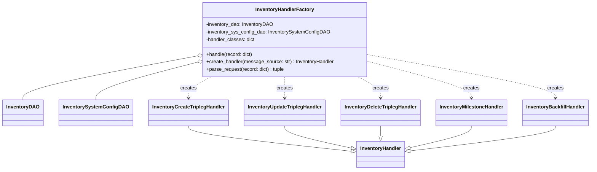

# Diagram: entity_core/entity_service/entity_inventory/entity_inventory_service/service/inventory_processor/inventory_processor_factory.py


> Auto-generated by Obscura crawlers

## Diagram 1



### SVG

<svg id="container" width="1850.765625" xmlns="http://www.w3.org/2000/svg" class="classDiagram" height="548" viewBox="0 0 1850.765625 548" role="graphics-document document" aria-roledescription="class"><style>#container{font-family:"trebuchet ms",verdana,arial,sans-serif;font-size:16px;fill:#333;}@keyframes edge-animation-frame{from{stroke-dashoffset:0;}}@keyframes dash{to{stroke-dashoffset:0;}}#container .edge-animation-slow{stroke-dasharray:9,5!important;stroke-dashoffset:900;animation:dash 50s linear infinite;stroke-linecap:round;}#container .edge-animation-fast{stroke-dasharray:9,5!important;stroke-dashoffset:900;animation:dash 20s linear infinite;stroke-linecap:round;}#container .error-icon{fill:#552222;}#container .error-text{fill:#552222;stroke:#552222;}#container .edge-thickness-normal{stroke-width:1px;}#container .edge-thickness-thick{stroke-width:3.5px;}#container .edge-pattern-solid{stroke-dasharray:0;}#container .edge-thickness-invisible{stroke-width:0;fill:none;}#container .edge-pattern-dashed{stroke-dasharray:3;}#container .edge-pattern-dotted{stroke-dasharray:2;}#container .marker{fill:#333333;stroke:#333333;}#container .marker.cross{stroke:#333333;}#container svg{font-family:"trebuchet ms",verdana,arial,sans-serif;font-size:16px;}#container p{margin:0;}#container g.classGroup text{fill:#9370DB;stroke:none;font-family:"trebuchet ms",verdana,arial,sans-serif;font-size:10px;}#container g.classGroup text .title{font-weight:bolder;}#container .nodeLabel,#container .edgeLabel{color:#131300;}#container .edgeLabel .label rect{fill:#ECECFF;}#container .label text{fill:#131300;}#container .labelBkg{background:#ECECFF;}#container .edgeLabel .label span{background:#ECECFF;}#container .classTitle{font-weight:bolder;}#container .node rect,#container .node circle,#container .node ellipse,#container .node polygon,#container .node path{fill:#ECECFF;stroke:#9370DB;stroke-width:1px;}#container .divider{stroke:#9370DB;stroke-width:1;}#container g.clickable{cursor:pointer;}#container g.classGroup rect{fill:#ECECFF;stroke:#9370DB;}#container g.classGroup line{stroke:#9370DB;stroke-width:1;}#container .classLabel .box{stroke:none;stroke-width:0;fill:#ECECFF;opacity:0.5;}#container .classLabel .label{fill:#9370DB;font-size:10px;}#container .relation{stroke:#333333;stroke-width:1;fill:none;}#container .dashed-line{stroke-dasharray:3;}#container .dotted-line{stroke-dasharray:1 2;}#container #compositionStart,#container .composition{fill:#333333!important;stroke:#333333!important;stroke-width:1;}#container #compositionEnd,#container .composition{fill:#333333!important;stroke:#333333!important;stroke-width:1;}#container #dependencyStart,#container .dependency{fill:#333333!important;stroke:#333333!important;stroke-width:1;}#container #dependencyStart,#container .dependency{fill:#333333!important;stroke:#333333!important;stroke-width:1;}#container #extensionStart,#container .extension{fill:transparent!important;stroke:#333333!important;stroke-width:1;}#container #extensionEnd,#container .extension{fill:transparent!important;stroke:#333333!important;stroke-width:1;}#container #aggregationStart,#container .aggregation{fill:transparent!important;stroke:#333333!important;stroke-width:1;}#container #aggregationEnd,#container .aggregation{fill:transparent!important;stroke:#333333!important;stroke-width:1;}#container #lollipopStart,#container .lollipop{fill:#ECECFF!important;stroke:#333333!important;stroke-width:1;}#container #lollipopEnd,#container .lollipop{fill:#ECECFF!important;stroke:#333333!important;stroke-width:1;}#container .edgeTerminals{font-size:11px;line-height:initial;}#container .classTitleText{text-anchor:middle;font-size:18px;fill:#333;}#container .label-icon{display:inline-block;height:1em;overflow:visible;vertical-align:-0.125em;}#container .node .label-icon path{fill:currentColor;stroke:revert;stroke-width:revert;}#container :root{--mermaid-font-family:"trebuchet ms",verdana,arial,sans-serif;}</style><g><defs><marker id="container_class-aggregationStart" class="marker aggregation class" refX="18" refY="7" markerWidth="190" markerHeight="240" orient="auto"><path d="M 18,7 L9,13 L1,7 L9,1 Z"></path></marker></defs><defs><marker id="container_class-aggregationEnd" class="marker aggregation class" refX="1" refY="7" markerWidth="20" markerHeight="28" orient="auto"><path d="M 18,7 L9,13 L1,7 L9,1 Z"></path></marker></defs><defs><marker id="container_class-extensionStart" class="marker extension class" refX="18" refY="7" markerWidth="190" markerHeight="240" orient="auto"><path d="M 1,7 L18,13 V 1 Z"></path></marker></defs><defs><marker id="container_class-extensionEnd" class="marker extension class" refX="1" refY="7" markerWidth="20" markerHeight="28" orient="auto"><path d="M 1,1 V 13 L18,7 Z"></path></marker></defs><defs><marker id="container_class-compositionStart" class="marker composition class" refX="18" refY="7" markerWidth="190" markerHeight="240" orient="auto"><path d="M 18,7 L9,13 L1,7 L9,1 Z"></path></marker></defs><defs><marker id="container_class-compositionEnd" class="marker composition class" refX="1" refY="7" markerWidth="20" markerHeight="28" orient="auto"><path d="M 18,7 L9,13 L1,7 L9,1 Z"></path></marker></defs><defs><marker id="container_class-dependencyStart" class="marker dependency class" refX="6" refY="7" markerWidth="190" markerHeight="240" orient="auto"><path d="M 5,7 L9,13 L1,7 L9,1 Z"></path></marker></defs><defs><marker id="container_class-dependencyEnd" class="marker dependency class" refX="13" refY="7" markerWidth="20" markerHeight="28" orient="auto"><path d="M 18,7 L9,13 L14,7 L9,1 Z"></path></marker></defs><defs><marker id="container_class-lollipopStart" class="marker lollipop class" refX="13" refY="7" markerWidth="190" markerHeight="240" orient="auto"><circle stroke="black" fill="transparent" cx="7" cy="7" r="6"></circle></marker></defs><defs><marker id="container_class-lollipopEnd" class="marker lollipop class" refX="1" refY="7" markerWidth="190" markerHeight="240" orient="auto"><circle stroke="black" fill="transparent" cx="7" cy="7" r="6"></circle></marker></defs><g class="root"><g class="clusters"></g><g class="edgePaths"><path d="M603.578,182.126L514.69,199.271C425.802,216.417,248.026,250.709,159.138,274.021C70.25,297.333,70.25,309.667,70.25,315.833L70.25,322" id="id_InventoryHandlerFactory_InventoryDAO_1" class="edge-thickness-normal edge-pattern-solid relation" style=";;;" data-edge="true" data-et="edge" data-id="id_InventoryHandlerFactory_InventoryDAO_1" data-points="W3sieCI6NjIwLjUxNTYyNSwieSI6MTc4Ljg1ODUxODE4NDM0ODd9LHsieCI6NzAuMjUsInkiOjI4NX0seyJ4Ijo3MC4yNSwieSI6MzIyfV0=" marker-start="url(#container_class-aggregationStart)"></path><path d="M603.846,202.604L552.244,216.337C500.642,230.069,397.438,257.535,345.836,277.434C294.234,297.333,294.234,309.667,294.234,315.833L294.234,322" id="id_InventoryHandlerFactory_InventorySystemConfigDAO_2" class="edge-thickness-normal edge-pattern-solid relation" style=";;;" data-edge="true" data-et="edge" data-id="id_InventoryHandlerFactory_InventorySystemConfigDAO_2" data-points="W3sieCI6NjIwLjUxNTYyNSwieSI6MTk4LjE2Nzk1NzgzNTA3NDc2fSx7IngiOjI5NC4yMzQzNzUsInkiOjI4NX0seyJ4IjoyOTQuMjM0Mzc1LCJ5IjozMjJ9XQ==" marker-start="url(#container_class-aggregationStart)"></path><path d="M581.047,406L581.047,410.167C581.047,414.333,581.047,422.667,666.589,436.284C752.131,449.901,923.215,468.803,1008.758,478.253L1094.3,487.704" id="id_InventoryCreateTriplegHandler_InventoryHandler_3" class="edge-thickness-normal edge-pattern-solid relation" style=";;;" data-edge="true" data-et="edge" data-id="id_InventoryCreateTriplegHandler_InventoryHandler_3" data-points="W3sieCI6NTgxLjA0Njg3NSwieSI6NDA2fSx7IngiOjU4MS4wNDY4NzUsInkiOjQzMX0seyJ4IjoxMTExLjQ0NTMxMjUsInkiOjQ4OS41OTgzNTEwNDY2OTg5fV0=" marker-end="url(#container_class-extensionEnd)"></path><path d="M884.18,406L884.18,410.167C884.18,414.333,884.18,422.667,919.25,434.58C954.32,446.494,1024.461,461.987,1059.531,469.734L1094.601,477.481" id="id_InventoryUpdateTriplegHandler_InventoryHandler_4" class="edge-thickness-normal edge-pattern-solid relation" style=";;;" data-edge="true" data-et="edge" data-id="id_InventoryUpdateTriplegHandler_InventoryHandler_4" data-points="W3sieCI6ODg0LjE3OTY4NzUsInkiOjQwNn0seyJ4Ijo4ODQuMTc5Njg3NSwieSI6NDMxfSx7IngiOjExMTEuNDQ1MzEyNSwieSI6NDgxLjIwMTY3OTM3MzU4MzR9XQ==" marker-end="url(#container_class-extensionEnd)"></path><path d="M1187.492,406L1187.492,410.167C1187.492,414.333,1187.492,422.667,1187.492,428.125C1187.492,433.583,1187.492,436.167,1187.492,437.458L1187.492,438.75" id="id_InventoryDeleteTriplegHandler_InventoryHandler_5" class="edge-thickness-normal edge-pattern-solid relation" style=";;;" data-edge="true" data-et="edge" data-id="id_InventoryDeleteTriplegHandler_InventoryHandler_5" data-points="W3sieCI6MTE4Ny40OTIxODc1LCJ5Ijo0MDZ9LHsieCI6MTE4Ny40OTIxODc1LCJ5Ijo0MzF9LHsieCI6MTE4Ny40OTIxODc1LCJ5Ijo0NTZ9XQ==" marker-end="url(#container_class-extensionEnd)"></path><path d="M1474.602,406L1474.602,410.167C1474.602,414.333,1474.602,422.667,1442.224,434.389C1409.847,446.111,1345.092,461.222,1312.715,468.778L1280.338,476.334" id="id_InventoryMilestoneHandler_InventoryHandler_6" class="edge-thickness-normal edge-pattern-solid relation" style=";;;" data-edge="true" data-et="edge" data-id="id_InventoryMilestoneHandler_InventoryHandler_6" data-points="W3sieCI6MTQ3NC42MDE1NjI1LCJ5Ijo0MDZ9LHsieCI6MTQ3NC42MDE1NjI1LCJ5Ijo0MzF9LHsieCI6MTI2My41MzkwNjI1LCJ5Ijo0ODAuMjUzNjU5ODYzOTQ1Nn1d" marker-end="url(#container_class-extensionEnd)"></path><path d="M1739.609,406L1739.609,410.167C1739.609,414.333,1739.609,422.667,1663.118,436.116C1586.627,449.565,1433.645,468.129,1357.154,477.411L1280.663,486.694" id="id_InventoryBackfillHandler_InventoryHandler_7" class="edge-thickness-normal edge-pattern-solid relation" style=";;;" data-edge="true" data-et="edge" data-id="id_InventoryBackfillHandler_InventoryHandler_7" data-points="W3sieCI6MTczOS42MDkzNzUsInkiOjQwNn0seyJ4IjoxNzM5LjYwOTM3NSwieSI6NDMxfSx7IngiOjEyNjMuNTM5MDYyNSwieSI6NDg4Ljc3MTYzMTkyODIzMDh9XQ==" marker-end="url(#container_class-extensionEnd)"></path><path d="M652.486,248L640.579,254.167C628.673,260.333,604.86,272.667,592.953,284C581.047,295.333,581.047,305.667,581.047,310.833L581.047,316" id="id_InventoryHandlerFactory_InventoryCreateTriplegHandler_8" class="edge-thickness-normal edge-pattern-dashed relation" style=";;;" data-edge="true" data-et="edge" data-id="id_InventoryHandlerFactory_InventoryCreateTriplegHandler_8" data-points="W3sieCI6NjUyLjQ4NTgxODA3MzI0ODQsInkiOjI0OH0seyJ4Ijo1ODEuMDQ2ODc1LCJ5IjoyODV9LHsieCI6NTgxLjA0Njg3NSwieSI6MzIyfV0=" marker-end="url(#container_class-dependencyEnd)"></path><path d="M884.18,248L884.18,254.167C884.18,260.333,884.18,272.667,884.18,284C884.18,295.333,884.18,305.667,884.18,310.833L884.18,316" id="id_InventoryHandlerFactory_InventoryUpdateTriplegHandler_9" class="edge-thickness-normal edge-pattern-dashed relation" style=";;;" data-edge="true" data-et="edge" data-id="id_InventoryHandlerFactory_InventoryUpdateTriplegHandler_9" data-points="W3sieCI6ODg0LjE3OTY4NzUsInkiOjI0OH0seyJ4Ijo4ODQuMTc5Njg3NSwieSI6Mjg1fSx7IngiOjg4NC4xNzk2ODc1LCJ5IjozMjJ9XQ==" marker-end="url(#container_class-dependencyEnd)"></path><path d="M1116.011,248L1127.924,254.167C1139.838,260.333,1163.665,272.667,1175.579,284C1187.492,295.333,1187.492,305.667,1187.492,310.833L1187.492,316" id="id_InventoryHandlerFactory_InventoryDeleteTriplegHandler_10" class="edge-thickness-normal edge-pattern-dashed relation" style=";;;" data-edge="true" data-et="edge" data-id="id_InventoryHandlerFactory_InventoryDeleteTriplegHandler_10" data-points="W3sieCI6MTExNi4wMTA4OTc2OTEwODI4LCJ5IjoyNDh9LHsieCI6MTE4Ny40OTIxODc1LCJ5IjoyODV9LHsieCI6MTE4Ny40OTIxODc1LCJ5IjozMjJ9XQ==" marker-end="url(#container_class-dependencyEnd)"></path><path d="M1147.844,198.111L1202.303,212.593C1256.763,227.074,1365.682,256.037,1420.142,275.685C1474.602,295.333,1474.602,305.667,1474.602,310.833L1474.602,316" id="id_InventoryHandlerFactory_InventoryMilestoneHandler_11" class="edge-thickness-normal edge-pattern-dashed relation" style=";;;" data-edge="true" data-et="edge" data-id="id_InventoryHandlerFactory_InventoryMilestoneHandler_11" data-points="W3sieCI6MTE0Ny44NDM3NSwieSI6MTk4LjExMTMyMTM1MzkwNDc3fSx7IngiOjE0NzQuNjAxNTYyNSwieSI6Mjg1fSx7IngiOjE0NzQuNjAxNTYyNSwieSI6MzIyfV0=" marker-end="url(#container_class-dependencyEnd)"></path><path d="M1147.844,176.391L1246.471,194.493C1345.099,212.594,1542.354,248.797,1640.982,272.065C1739.609,295.333,1739.609,305.667,1739.609,310.833L1739.609,316" id="id_InventoryHandlerFactory_InventoryBackfillHandler_12" class="edge-thickness-normal edge-pattern-dashed relation" style=";;;" data-edge="true" data-et="edge" data-id="id_InventoryHandlerFactory_InventoryBackfillHandler_12" data-points="W3sieCI6MTE0Ny44NDM3NSwieSI6MTc2LjM5MTE4NjgxMjE4MzJ9LHsieCI6MTczOS42MDkzNzUsInkiOjI4NX0seyJ4IjoxNzM5LjYwOTM3NSwieSI6MzIyfV0=" marker-end="url(#container_class-dependencyEnd)"></path></g><g class="edgeLabels"><g class="edgeLabel"><g class="label" data-id="id_InventoryHandlerFactory_InventoryDAO_1" transform="translate(0, 0)"><foreignObject width="0" height="0"><div xmlns="http://www.w3.org/1999/xhtml" class="labelBkg" style="display: table-cell; white-space: nowrap; line-height: 1.5; max-width: 200px; text-align: center;"><span class="edgeLabel"></span></div></foreignObject></g></g><g class="edgeLabel"><g class="label" data-id="id_InventoryHandlerFactory_InventorySystemConfigDAO_2" transform="translate(0, 0)"><foreignObject width="0" height="0"><div xmlns="http://www.w3.org/1999/xhtml" class="labelBkg" style="display: table-cell; white-space: nowrap; line-height: 1.5; max-width: 200px; text-align: center;"><span class="edgeLabel"></span></div></foreignObject></g></g><g class="edgeLabel"><g class="label" data-id="id_InventoryCreateTriplegHandler_InventoryHandler_3" transform="translate(0, 0)"><foreignObject width="0" height="0"><div xmlns="http://www.w3.org/1999/xhtml" class="labelBkg" style="display: table-cell; white-space: nowrap; line-height: 1.5; max-width: 200px; text-align: center;"><span class="edgeLabel"></span></div></foreignObject></g></g><g class="edgeLabel"><g class="label" data-id="id_InventoryUpdateTriplegHandler_InventoryHandler_4" transform="translate(0, 0)"><foreignObject width="0" height="0"><div xmlns="http://www.w3.org/1999/xhtml" class="labelBkg" style="display: table-cell; white-space: nowrap; line-height: 1.5; max-width: 200px; text-align: center;"><span class="edgeLabel"></span></div></foreignObject></g></g><g class="edgeLabel"><g class="label" data-id="id_InventoryDeleteTriplegHandler_InventoryHandler_5" transform="translate(0, 0)"><foreignObject width="0" height="0"><div xmlns="http://www.w3.org/1999/xhtml" class="labelBkg" style="display: table-cell; white-space: nowrap; line-height: 1.5; max-width: 200px; text-align: center;"><span class="edgeLabel"></span></div></foreignObject></g></g><g class="edgeLabel"><g class="label" data-id="id_InventoryMilestoneHandler_InventoryHandler_6" transform="translate(0, 0)"><foreignObject width="0" height="0"><div xmlns="http://www.w3.org/1999/xhtml" class="labelBkg" style="display: table-cell; white-space: nowrap; line-height: 1.5; max-width: 200px; text-align: center;"><span class="edgeLabel"></span></div></foreignObject></g></g><g class="edgeLabel"><g class="label" data-id="id_InventoryBackfillHandler_InventoryHandler_7" transform="translate(0, 0)"><foreignObject width="0" height="0"><div xmlns="http://www.w3.org/1999/xhtml" class="labelBkg" style="display: table-cell; white-space: nowrap; line-height: 1.5; max-width: 200px; text-align: center;"><span class="edgeLabel"></span></div></foreignObject></g></g><g class="edgeLabel" transform="translate(581.046875, 285)"><g class="label" data-id="id_InventoryHandlerFactory_InventoryCreateTriplegHandler_8" transform="translate(-26.171875, -12)"><foreignObject width="52.34375" height="24"><div xmlns="http://www.w3.org/1999/xhtml" class="labelBkg" style="display: table-cell; white-space: nowrap; line-height: 1.5; max-width: 200px; text-align: center;"><span class="edgeLabel"><p>creates</p></span></div></foreignObject></g></g><g class="edgeLabel" transform="translate(884.1796875, 285)"><g class="label" data-id="id_InventoryHandlerFactory_InventoryUpdateTriplegHandler_9" transform="translate(-26.171875, -12)"><foreignObject width="52.34375" height="24"><div xmlns="http://www.w3.org/1999/xhtml" class="labelBkg" style="display: table-cell; white-space: nowrap; line-height: 1.5; max-width: 200px; text-align: center;"><span class="edgeLabel"><p>creates</p></span></div></foreignObject></g></g><g class="edgeLabel" transform="translate(1187.4921875, 285)"><g class="label" data-id="id_InventoryHandlerFactory_InventoryDeleteTriplegHandler_10" transform="translate(-26.171875, -12)"><foreignObject width="52.34375" height="24"><div xmlns="http://www.w3.org/1999/xhtml" class="labelBkg" style="display: table-cell; white-space: nowrap; line-height: 1.5; max-width: 200px; text-align: center;"><span class="edgeLabel"><p>creates</p></span></div></foreignObject></g></g><g class="edgeLabel" transform="translate(1474.6015625, 285)"><g class="label" data-id="id_InventoryHandlerFactory_InventoryMilestoneHandler_11" transform="translate(-26.171875, -12)"><foreignObject width="52.34375" height="24"><div xmlns="http://www.w3.org/1999/xhtml" class="labelBkg" style="display: table-cell; white-space: nowrap; line-height: 1.5; max-width: 200px; text-align: center;"><span class="edgeLabel"><p>creates</p></span></div></foreignObject></g></g><g class="edgeLabel" transform="translate(1739.609375, 285)"><g class="label" data-id="id_InventoryHandlerFactory_InventoryBackfillHandler_12" transform="translate(-26.171875, -12)"><foreignObject width="52.34375" height="24"><div xmlns="http://www.w3.org/1999/xhtml" class="labelBkg" style="display: table-cell; white-space: nowrap; line-height: 1.5; max-width: 200px; text-align: center;"><span class="edgeLabel"><p>creates</p></span></div></foreignObject></g></g></g><g class="nodes"><g class="node default" id="classId-InventoryHandlerFactory-0" transform="translate(884.1796875, 128)"><g class="basic label-container"><path d="M-263.6640625 -120 L263.6640625 -120 L263.6640625 120 L-263.6640625 120" stroke="none" stroke-width="0" fill="#ECECFF" style=""></path><path d="M-263.6640625 -120 C-80.24251203173225 -120, 103.1790384365355 -120, 263.6640625 -120 M-263.6640625 -120 C-89.98865153599019 -120, 83.68675942801963 -120, 263.6640625 -120 M263.6640625 -120 C263.6640625 -40.13186048331325, 263.6640625 39.736279033373506, 263.6640625 120 M263.6640625 -120 C263.6640625 -54.07202177686645, 263.6640625 11.8559564462671, 263.6640625 120 M263.6640625 120 C136.5336985989561 120, 9.403334697912186 120, -263.6640625 120 M263.6640625 120 C76.1736687698793 120, -111.3167249602414 120, -263.6640625 120 M-263.6640625 120 C-263.6640625 29.44697725564393, -263.6640625 -61.10604548871214, -263.6640625 -120 M-263.6640625 120 C-263.6640625 57.80877941088334, -263.6640625 -4.3824411782333215, -263.6640625 -120" stroke="#9370DB" stroke-width="1.3" fill="none" stroke-dasharray="0 0" style=""></path></g><g class="annotation-group text" transform="translate(0, -96)"></g><g class="label-group text" transform="translate(-90.640625, -96)"><g class="label" style="font-weight: bolder" transform="translate(0,-12)"><foreignObject width="181.28125" height="24"><div xmlns="http://www.w3.org/1999/xhtml" style="display: table-cell; white-space: nowrap; line-height: 1.5; max-width: 229px; text-align: center;"><span class="nodeLabel markdown-node-label" style=""><p>InventoryHandlerFactory</p></span></div></foreignObject></g></g><g class="members-group text" transform="translate(-251.6640625, -48)"><g class="label" style="" transform="translate(0,-12)"><foreignObject width="217.3125" height="24"><div xmlns="http://www.w3.org/1999/xhtml" style="display: table-cell; white-space: nowrap; line-height: 1.5; max-width: 275px; text-align: center;"><span class="nodeLabel markdown-node-label" style=""><p>-inventory_dao: InventoryDAO</p></span></div></foreignObject></g><g class="label" style="" transform="translate(0,12)"><foreignObject width="396.03125" height="24"><div xmlns="http://www.w3.org/1999/xhtml" style="display: table-cell; white-space: nowrap; line-height: 1.5; max-width: 453px; text-align: center;"><span class="nodeLabel markdown-node-label" style=""><p>-inventory_sys_config_dao: InventorySystemConfigDAO</p></span></div></foreignObject></g><g class="label" style="" transform="translate(0,36)"><foreignObject width="157.0625" height="24"><div xmlns="http://www.w3.org/1999/xhtml" style="display: table-cell; white-space: nowrap; line-height: 1.5; max-width: 215px; text-align: center;"><span class="nodeLabel markdown-node-label" style=""><p>-handler_classes: dict</p></span></div></foreignObject></g></g><g class="methods-group text" transform="translate(-251.6640625, 48)"><g class="label" style="" transform="translate(0,-12)"><foreignObject width="150.640625" height="24"><div xmlns="http://www.w3.org/1999/xhtml" style="display: table-cell; white-space: nowrap; line-height: 1.5; max-width: 208px; text-align: center;"><span class="nodeLabel markdown-node-label" style=""><p>+handle(record: dict)</p></span></div></foreignObject></g><g class="label" style="" transform="translate(0,12)"><foreignObject width="412.6875" height="24"><div xmlns="http://www.w3.org/1999/xhtml" style="display: table-cell; white-space: nowrap; line-height: 1.5; max-width: 471px; text-align: center;"><span class="nodeLabel markdown-node-label" style=""><p>+create_handler(message_source: str) : InventoryHandler</p></span></div></foreignObject></g><g class="label" style="" transform="translate(0,36)"><foreignObject width="253.96875" height="24"><div xmlns="http://www.w3.org/1999/xhtml" style="display: table-cell; white-space: nowrap; line-height: 1.5; max-width: 311px; text-align: center;"><span class="nodeLabel markdown-node-label" style=""><p>+parse_request(record: dict) : tuple</p></span></div></foreignObject></g></g><g class="divider" style=""><path d="M-263.6640625 -72 C-57.49349273497293 -72, 148.67707703005414 -72, 263.6640625 -72 M-263.6640625 -72 C-157.74978224990758 -72, -51.83550199981519 -72, 263.6640625 -72" stroke="#9370DB" stroke-width="1.3" fill="none" stroke-dasharray="0 0" style=""></path></g><g class="divider" style=""><path d="M-263.6640625 24 C-155.31500874781813 24, -46.965954995636224 24, 263.6640625 24 M-263.6640625 24 C-105.43184996832497 24, 52.80036256335006 24, 263.6640625 24" stroke="#9370DB" stroke-width="1.3" fill="none" stroke-dasharray="0 0" style=""></path></g></g><g class="node default" id="classId-InventoryDAO-1" transform="translate(70.25, 364)"><g class="basic label-container"><path d="M-62.25 -42 L62.25 -42 L62.25 42 L-62.25 42" stroke="none" stroke-width="0" fill="#ECECFF" style=""></path><path d="M-62.25 -42 C-33.96246369681365 -42, -5.6749273936273 -42, 62.25 -42 M-62.25 -42 C-36.28465616572606 -42, -10.319312331452132 -42, 62.25 -42 M62.25 -42 C62.25 -22.448071299871145, 62.25 -2.8961425997422907, 62.25 42 M62.25 -42 C62.25 -13.308890074105275, 62.25 15.38221985178945, 62.25 42 M62.25 42 C18.17663292459892 42, -25.89673415080216 42, -62.25 42 M62.25 42 C20.3262228830583 42, -21.5975542338834 42, -62.25 42 M-62.25 42 C-62.25 20.88621311854509, -62.25 -0.22757376290982023, -62.25 -42 M-62.25 42 C-62.25 17.205568656849128, -62.25 -7.588862686301745, -62.25 -42" stroke="#9370DB" stroke-width="1.3" fill="none" stroke-dasharray="0 0" style=""></path></g><g class="annotation-group text" transform="translate(0, -18)"></g><g class="label-group text" transform="translate(-50.25, -18)"><g class="label" style="font-weight: bolder" transform="translate(0,-12)"><foreignObject width="100.5" height="24"><div xmlns="http://www.w3.org/1999/xhtml" style="display: table-cell; white-space: nowrap; line-height: 1.5; max-width: 149px; text-align: center;"><span class="nodeLabel markdown-node-label" style=""><p>InventoryDAO</p></span></div></foreignObject></g></g><g class="members-group text" transform="translate(-50.25, 30)"></g><g class="methods-group text" transform="translate(-50.25, 60)"></g><g class="divider" style=""><path d="M-62.25 6 C-22.849080951294994 6, 16.551838097410013 6, 62.25 6 M-62.25 6 C-16.14762717320798 6, 29.95474565358404 6, 62.25 6" stroke="#9370DB" stroke-width="1.3" fill="none" stroke-dasharray="0 0" style=""></path></g><g class="divider" style=""><path d="M-62.25 24 C-30.459919628671273 24, 1.3301607426574549 24, 62.25 24 M-62.25 24 C-27.668181790340256 24, 6.913636419319488 24, 62.25 24" stroke="#9370DB" stroke-width="1.3" fill="none" stroke-dasharray="0 0" style=""></path></g></g><g class="node default" id="classId-InventorySystemConfigDAO-2" transform="translate(294.234375, 364)"><g class="basic label-container"><path d="M-111.734375 -42 L111.734375 -42 L111.734375 42 L-111.734375 42" stroke="none" stroke-width="0" fill="#ECECFF" style=""></path><path d="M-111.734375 -42 C-54.13217025501373 -42, 3.4700344899725337 -42, 111.734375 -42 M-111.734375 -42 C-50.907269914641 -42, 9.919835170718002 -42, 111.734375 -42 M111.734375 -42 C111.734375 -17.632417414936903, 111.734375 6.735165170126194, 111.734375 42 M111.734375 -42 C111.734375 -21.68170986642128, 111.734375 -1.3634197328425586, 111.734375 42 M111.734375 42 C25.40766536120229 42, -60.91904427759542 42, -111.734375 42 M111.734375 42 C58.09787497290789 42, 4.461374945815777 42, -111.734375 42 M-111.734375 42 C-111.734375 15.550100726564896, -111.734375 -10.899798546870208, -111.734375 -42 M-111.734375 42 C-111.734375 17.89210067173587, -111.734375 -6.215798656528257, -111.734375 -42" stroke="#9370DB" stroke-width="1.3" fill="none" stroke-dasharray="0 0" style=""></path></g><g class="annotation-group text" transform="translate(0, -18)"></g><g class="label-group text" transform="translate(-99.734375, -18)"><g class="label" style="font-weight: bolder" transform="translate(0,-12)"><foreignObject width="199.46875" height="24"><div xmlns="http://www.w3.org/1999/xhtml" style="display: table-cell; white-space: nowrap; line-height: 1.5; max-width: 246px; text-align: center;"><span class="nodeLabel markdown-node-label" style=""><p>InventorySystemConfigDAO</p></span></div></foreignObject></g></g><g class="members-group text" transform="translate(-99.734375, 30)"></g><g class="methods-group text" transform="translate(-99.734375, 60)"></g><g class="divider" style=""><path d="M-111.734375 6 C-58.33863398362143 6, -4.942892967242855 6, 111.734375 6 M-111.734375 6 C-40.49342355795622 6, 30.74752788408756 6, 111.734375 6" stroke="#9370DB" stroke-width="1.3" fill="none" stroke-dasharray="0 0" style=""></path></g><g class="divider" style=""><path d="M-111.734375 24 C-48.185636126581294 24, 15.363102746837413 24, 111.734375 24 M-111.734375 24 C-53.04227728065689 24, 5.64982043868622 24, 111.734375 24" stroke="#9370DB" stroke-width="1.3" fill="none" stroke-dasharray="0 0" style=""></path></g></g><g class="node default" id="classId-InventoryHandler-3" transform="translate(1187.4921875, 498)"><g class="basic label-container"><path d="M-76.046875 -42 L76.046875 -42 L76.046875 42 L-76.046875 42" stroke="none" stroke-width="0" fill="#ECECFF" style=""></path><path d="M-76.046875 -42 C-29.011765645483678 -42, 18.023343709032645 -42, 76.046875 -42 M-76.046875 -42 C-17.91459439329376 -42, 40.21768621341248 -42, 76.046875 -42 M76.046875 -42 C76.046875 -21.102219537535582, 76.046875 -0.2044390750711642, 76.046875 42 M76.046875 -42 C76.046875 -9.183159427989807, 76.046875 23.633681144020386, 76.046875 42 M76.046875 42 C18.525774614653024 42, -38.99532577069395 42, -76.046875 42 M76.046875 42 C29.176703899401915 42, -17.69346720119617 42, -76.046875 42 M-76.046875 42 C-76.046875 13.625049969307756, -76.046875 -14.749900061384487, -76.046875 -42 M-76.046875 42 C-76.046875 10.845981598509955, -76.046875 -20.30803680298009, -76.046875 -42" stroke="#9370DB" stroke-width="1.3" fill="none" stroke-dasharray="0 0" style=""></path></g><g class="annotation-group text" transform="translate(0, -18)"></g><g class="label-group text" transform="translate(-64.046875, -18)"><g class="label" style="font-weight: bolder" transform="translate(0,-12)"><foreignObject width="128.09375" height="24"><div xmlns="http://www.w3.org/1999/xhtml" style="display: table-cell; white-space: nowrap; line-height: 1.5; max-width: 178px; text-align: center;"><span class="nodeLabel markdown-node-label" style=""><p>InventoryHandler</p></span></div></foreignObject></g></g><g class="members-group text" transform="translate(-64.046875, 30)"></g><g class="methods-group text" transform="translate(-64.046875, 60)"></g><g class="divider" style=""><path d="M-76.046875 6 C-16.750602700046535 6, 42.54566959990693 6, 76.046875 6 M-76.046875 6 C-28.34060808521484 6, 19.36565882957032 6, 76.046875 6" stroke="#9370DB" stroke-width="1.3" fill="none" stroke-dasharray="0 0" style=""></path></g><g class="divider" style=""><path d="M-76.046875 24 C-16.237865147308632 24, 43.571144705382736 24, 76.046875 24 M-76.046875 24 C-17.68334174763269 24, 40.68019150473462 24, 76.046875 24" stroke="#9370DB" stroke-width="1.3" fill="none" stroke-dasharray="0 0" style=""></path></g></g><g class="node default" id="classId-InventoryCreateTriplegHandler-4" transform="translate(581.046875, 364)"><g class="basic label-container"><path d="M-125.078125 -42 L125.078125 -42 L125.078125 42 L-125.078125 42" stroke="none" stroke-width="0" fill="#ECECFF" style=""></path><path d="M-125.078125 -42 C-40.5880046795711 -42, 43.9021156408578 -42, 125.078125 -42 M-125.078125 -42 C-44.708569390571725 -42, 35.66098621885655 -42, 125.078125 -42 M125.078125 -42 C125.078125 -21.188582517686015, 125.078125 -0.3771650353720304, 125.078125 42 M125.078125 -42 C125.078125 -19.62904476790306, 125.078125 2.7419104641938787, 125.078125 42 M125.078125 42 C30.19443611515581 42, -64.68925276968838 42, -125.078125 42 M125.078125 42 C38.338369268314466 42, -48.40138646337107 42, -125.078125 42 M-125.078125 42 C-125.078125 8.635256253713365, -125.078125 -24.72948749257327, -125.078125 -42 M-125.078125 42 C-125.078125 17.206941001886257, -125.078125 -7.586117996227486, -125.078125 -42" stroke="#9370DB" stroke-width="1.3" fill="none" stroke-dasharray="0 0" style=""></path></g><g class="annotation-group text" transform="translate(0, -18)"></g><g class="label-group text" transform="translate(-113.078125, -18)"><g class="label" style="font-weight: bolder" transform="translate(0,-12)"><foreignObject width="226.15625" height="24"><div xmlns="http://www.w3.org/1999/xhtml" style="display: table-cell; white-space: nowrap; line-height: 1.5; max-width: 273px; text-align: center;"><span class="nodeLabel markdown-node-label" style=""><p>InventoryCreateTriplegHandler</p></span></div></foreignObject></g></g><g class="members-group text" transform="translate(-113.078125, 30)"></g><g class="methods-group text" transform="translate(-113.078125, 60)"></g><g class="divider" style=""><path d="M-125.078125 6 C-54.881172971391535 6, 15.315779057216929 6, 125.078125 6 M-125.078125 6 C-48.39285592646249 6, 28.292413147075024 6, 125.078125 6" stroke="#9370DB" stroke-width="1.3" fill="none" stroke-dasharray="0 0" style=""></path></g><g class="divider" style=""><path d="M-125.078125 24 C-47.41936753849298 24, 30.239389923014045 24, 125.078125 24 M-125.078125 24 C-42.63393018872077 24, 39.81026462255846 24, 125.078125 24" stroke="#9370DB" stroke-width="1.3" fill="none" stroke-dasharray="0 0" style=""></path></g></g><g class="node default" id="classId-InventoryUpdateTriplegHandler-5" transform="translate(884.1796875, 364)"><g class="basic label-container"><path d="M-128.0546875 -42 L128.0546875 -42 L128.0546875 42 L-128.0546875 42" stroke="none" stroke-width="0" fill="#ECECFF" style=""></path><path d="M-128.0546875 -42 C-48.1177515263754 -42, 31.8191844472492 -42, 128.0546875 -42 M-128.0546875 -42 C-69.7152284820223 -42, -11.37576946404458 -42, 128.0546875 -42 M128.0546875 -42 C128.0546875 -15.535958706899386, 128.0546875 10.928082586201228, 128.0546875 42 M128.0546875 -42 C128.0546875 -20.570069578748264, 128.0546875 0.8598608425034726, 128.0546875 42 M128.0546875 42 C33.24256175439527 42, -61.56956399120946 42, -128.0546875 42 M128.0546875 42 C42.02639075315767 42, -44.00190599368466 42, -128.0546875 42 M-128.0546875 42 C-128.0546875 12.411425646624135, -128.0546875 -17.17714870675173, -128.0546875 -42 M-128.0546875 42 C-128.0546875 23.624898372744873, -128.0546875 5.249796745489746, -128.0546875 -42" stroke="#9370DB" stroke-width="1.3" fill="none" stroke-dasharray="0 0" style=""></path></g><g class="annotation-group text" transform="translate(0, -18)"></g><g class="label-group text" transform="translate(-116.0546875, -18)"><g class="label" style="font-weight: bolder" transform="translate(0,-12)"><foreignObject width="232.109375" height="24"><div xmlns="http://www.w3.org/1999/xhtml" style="display: table-cell; white-space: nowrap; line-height: 1.5; max-width: 280px; text-align: center;"><span class="nodeLabel markdown-node-label" style=""><p>InventoryUpdateTriplegHandler</p></span></div></foreignObject></g></g><g class="members-group text" transform="translate(-116.0546875, 30)"></g><g class="methods-group text" transform="translate(-116.0546875, 60)"></g><g class="divider" style=""><path d="M-128.0546875 6 C-27.132927451261054 6, 73.78883259747789 6, 128.0546875 6 M-128.0546875 6 C-60.43820725745287 6, 7.178272985094253 6, 128.0546875 6" stroke="#9370DB" stroke-width="1.3" fill="none" stroke-dasharray="0 0" style=""></path></g><g class="divider" style=""><path d="M-128.0546875 24 C-67.77234278210521 24, -7.489998064210425 24, 128.0546875 24 M-128.0546875 24 C-49.64145258136048 24, 28.771782337279035 24, 128.0546875 24" stroke="#9370DB" stroke-width="1.3" fill="none" stroke-dasharray="0 0" style=""></path></g></g><g class="node default" id="classId-InventoryDeleteTriplegHandler-6" transform="translate(1187.4921875, 364)"><g class="basic label-container"><path d="M-125.2578125 -42 L125.2578125 -42 L125.2578125 42 L-125.2578125 42" stroke="none" stroke-width="0" fill="#ECECFF" style=""></path><path d="M-125.2578125 -42 C-44.50776531631412 -42, 36.24228186737176 -42, 125.2578125 -42 M-125.2578125 -42 C-46.98272338166365 -42, 31.292365736672707 -42, 125.2578125 -42 M125.2578125 -42 C125.2578125 -12.052992957713737, 125.2578125 17.894014084572525, 125.2578125 42 M125.2578125 -42 C125.2578125 -11.131364566022263, 125.2578125 19.737270867955473, 125.2578125 42 M125.2578125 42 C68.78805527127042 42, 12.318298042540846 42, -125.2578125 42 M125.2578125 42 C28.78823574876894 42, -67.68134100246212 42, -125.2578125 42 M-125.2578125 42 C-125.2578125 11.281440468953491, -125.2578125 -19.437119062093018, -125.2578125 -42 M-125.2578125 42 C-125.2578125 21.47307748718451, -125.2578125 0.9461549743690227, -125.2578125 -42" stroke="#9370DB" stroke-width="1.3" fill="none" stroke-dasharray="0 0" style=""></path></g><g class="annotation-group text" transform="translate(0, -18)"></g><g class="label-group text" transform="translate(-113.2578125, -18)"><g class="label" style="font-weight: bolder" transform="translate(0,-12)"><foreignObject width="226.515625" height="24"><div xmlns="http://www.w3.org/1999/xhtml" style="display: table-cell; white-space: nowrap; line-height: 1.5; max-width: 274px; text-align: center;"><span class="nodeLabel markdown-node-label" style=""><p>InventoryDeleteTriplegHandler</p></span></div></foreignObject></g></g><g class="members-group text" transform="translate(-113.2578125, 30)"></g><g class="methods-group text" transform="translate(-113.2578125, 60)"></g><g class="divider" style=""><path d="M-125.2578125 6 C-33.45097432855749 6, 58.355863842885014 6, 125.2578125 6 M-125.2578125 6 C-56.92896437387894 6, 11.399883752242118 6, 125.2578125 6" stroke="#9370DB" stroke-width="1.3" fill="none" stroke-dasharray="0 0" style=""></path></g><g class="divider" style=""><path d="M-125.2578125 24 C-57.504376129130804 24, 10.249060241738391 24, 125.2578125 24 M-125.2578125 24 C-49.01156371950552 24, 27.234685060988966 24, 125.2578125 24" stroke="#9370DB" stroke-width="1.3" fill="none" stroke-dasharray="0 0" style=""></path></g></g><g class="node default" id="classId-InventoryMilestoneHandler-7" transform="translate(1474.6015625, 364)"><g class="basic label-container"><path d="M-111.8515625 -42 L111.8515625 -42 L111.8515625 42 L-111.8515625 42" stroke="none" stroke-width="0" fill="#ECECFF" style=""></path><path d="M-111.8515625 -42 C-41.97935103971365 -42, 27.892860420572703 -42, 111.8515625 -42 M-111.8515625 -42 C-27.555955796270467 -42, 56.739650907459065 -42, 111.8515625 -42 M111.8515625 -42 C111.8515625 -10.921406915368266, 111.8515625 20.15718616926347, 111.8515625 42 M111.8515625 -42 C111.8515625 -17.230174734793156, 111.8515625 7.539650530413688, 111.8515625 42 M111.8515625 42 C48.41302182841367 42, -15.025518843172662 42, -111.8515625 42 M111.8515625 42 C40.57706424061814 42, -30.697434018763715 42, -111.8515625 42 M-111.8515625 42 C-111.8515625 20.984925012913518, -111.8515625 -0.030149974172964278, -111.8515625 -42 M-111.8515625 42 C-111.8515625 19.420082872719256, -111.8515625 -3.1598342545614884, -111.8515625 -42" stroke="#9370DB" stroke-width="1.3" fill="none" stroke-dasharray="0 0" style=""></path></g><g class="annotation-group text" transform="translate(0, -18)"></g><g class="label-group text" transform="translate(-99.8515625, -18)"><g class="label" style="font-weight: bolder" transform="translate(0,-12)"><foreignObject width="199.703125" height="24"><div xmlns="http://www.w3.org/1999/xhtml" style="display: table-cell; white-space: nowrap; line-height: 1.5; max-width: 248px; text-align: center;"><span class="nodeLabel markdown-node-label" style=""><p>InventoryMilestoneHandler</p></span></div></foreignObject></g></g><g class="members-group text" transform="translate(-99.8515625, 30)"></g><g class="methods-group text" transform="translate(-99.8515625, 60)"></g><g class="divider" style=""><path d="M-111.8515625 6 C-60.69766089927144 6, -9.54375929854288 6, 111.8515625 6 M-111.8515625 6 C-24.355940447660956 6, 63.13968160467809 6, 111.8515625 6" stroke="#9370DB" stroke-width="1.3" fill="none" stroke-dasharray="0 0" style=""></path></g><g class="divider" style=""><path d="M-111.8515625 24 C-34.10059506913221 24, 43.65037236173558 24, 111.8515625 24 M-111.8515625 24 C-52.926145636180884 24, 5.999271227638232 24, 111.8515625 24" stroke="#9370DB" stroke-width="1.3" fill="none" stroke-dasharray="0 0" style=""></path></g></g><g class="node default" id="classId-InventoryBackfillHandler-8" transform="translate(1739.609375, 364)"><g class="basic label-container"><path d="M-103.15625 -42 L103.15625 -42 L103.15625 42 L-103.15625 42" stroke="none" stroke-width="0" fill="#ECECFF" style=""></path><path d="M-103.15625 -42 C-40.62016970247112 -42, 21.915910595057767 -42, 103.15625 -42 M-103.15625 -42 C-60.8819223467262 -42, -18.6075946934524 -42, 103.15625 -42 M103.15625 -42 C103.15625 -18.507088131225736, 103.15625 4.985823737548529, 103.15625 42 M103.15625 -42 C103.15625 -24.709909071844194, 103.15625 -7.4198181436883885, 103.15625 42 M103.15625 42 C58.41669950982968 42, 13.677149019659353 42, -103.15625 42 M103.15625 42 C48.32416065399872 42, -6.507928692002565 42, -103.15625 42 M-103.15625 42 C-103.15625 18.59948081241432, -103.15625 -4.801038375171359, -103.15625 -42 M-103.15625 42 C-103.15625 14.620715157761538, -103.15625 -12.758569684476925, -103.15625 -42" stroke="#9370DB" stroke-width="1.3" fill="none" stroke-dasharray="0 0" style=""></path></g><g class="annotation-group text" transform="translate(0, -18)"></g><g class="label-group text" transform="translate(-91.15625, -18)"><g class="label" style="font-weight: bolder" transform="translate(0,-12)"><foreignObject width="182.3125" height="24"><div xmlns="http://www.w3.org/1999/xhtml" style="display: table-cell; white-space: nowrap; line-height: 1.5; max-width: 231px; text-align: center;"><span class="nodeLabel markdown-node-label" style=""><p>InventoryBackfillHandler</p></span></div></foreignObject></g></g><g class="members-group text" transform="translate(-91.15625, 30)"></g><g class="methods-group text" transform="translate(-91.15625, 60)"></g><g class="divider" style=""><path d="M-103.15625 6 C-48.4687847566076 6, 6.218680486784805 6, 103.15625 6 M-103.15625 6 C-33.99413250545723 6, 35.16798498908554 6, 103.15625 6" stroke="#9370DB" stroke-width="1.3" fill="none" stroke-dasharray="0 0" style=""></path></g><g class="divider" style=""><path d="M-103.15625 24 C-48.078170137007234 24, 6.999909725985532 24, 103.15625 24 M-103.15625 24 C-49.31544130282614 24, 4.525367394347725 24, 103.15625 24" stroke="#9370DB" stroke-width="1.3" fill="none" stroke-dasharray="0 0" style=""></path></g></g></g></g></g></svg>

## Diagram 2

```mermaid
flowchart LR
    Record[Record (dict)]
    Record --> ParseRequest[parse_request(record)]
    ParseRequest --> ParseBody[json.loads(record.body)]
    ParseBody --> RawAttributes[raw MessageAttributes]
    RawAttributes --> Attributes[parse MessageAttributes if str]
    ParseBody --> RawMessage[raw Message]
    RawMessage --> Message[parse Message if str]
    ParseRequest --> Output["message_source, message"]
    Output --> CheckHandler{handler_class exists?}
    CheckHandler -- Yes --> CreateHandler[create_handler(message_source)]
    CheckHandler -- No --> Error[ValueError: Handler not implemented]
    CreateHandler --> HandlerInstance[handler = handler_class(inventory_dao, inventory_sys_config_dao)]
    HandlerInstance --> HandlerCall[handler.handle(message)]
    HandlerCall --> Return[return handler.handle(message)]
    Error --> ReturnError[raises ValueError]
```

> SVG rendering failed for this diagram.
