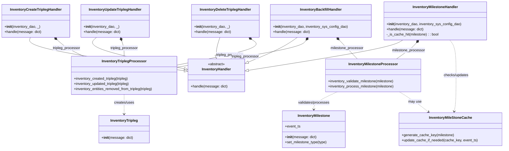
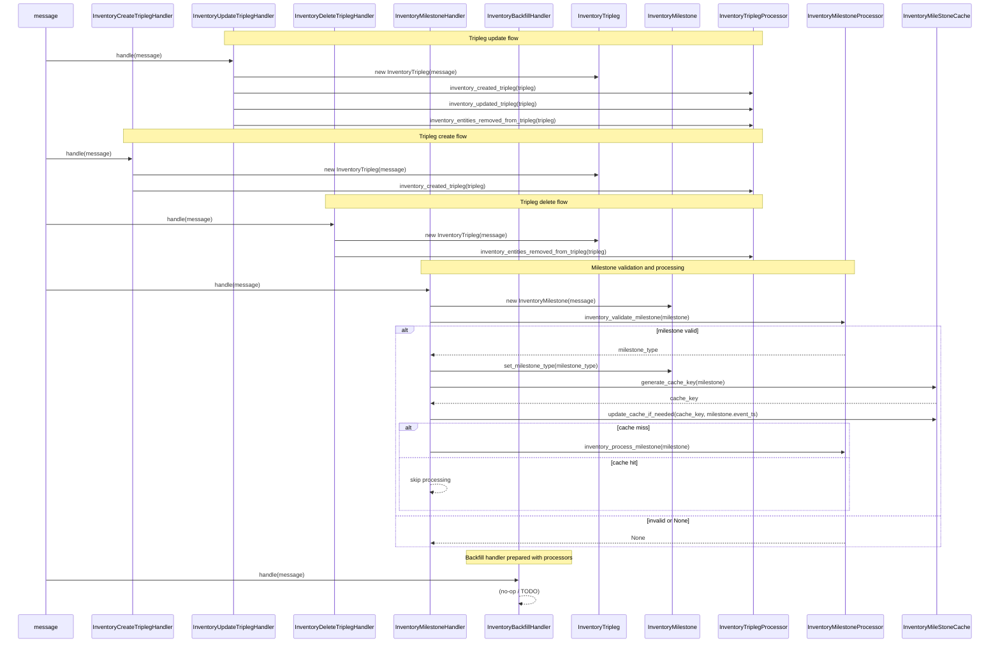

# Diagram: entity_core/entity_service/entity_inventory/entity_inventory_service/service/inventory_processor/inventory_processor_handler.py

> Auto-generated by Obscura crawlers

## Diagram 1

### SVG

<svg id="container" width="2275.01171875" xmlns="http://www.w3.org/2000/svg" class="classDiagram" height="680" viewBox="0 0 2275.01171875 680" role="graphics-document document" aria-roledescription="class"><g><defs><marker id="container_class-aggregationStart" class="marker aggregation class" refX="18" refY="7" markerWidth="190" markerHeight="240" orient="auto"><path d="M 18,7 L9,13 L1,7 L9,1 Z"></path></marker></defs><defs><marker id="container_class-aggregationEnd" class="marker aggregation class" refX="1" refY="7" markerWidth="20" markerHeight="28" orient="auto"><path d="M 18,7 L9,13 L1,7 L9,1 Z"></path></marker></defs><defs><marker id="container_class-extensionStart" class="marker extension class" refX="18" refY="7" markerWidth="190" markerHeight="240" orient="auto"><path d="M 1,7 L18,13 V 1 Z"></path></marker></defs><defs><marker id="container_class-extensionEnd" class="marker extension class" refX="1" refY="7" markerWidth="20" markerHeight="28" orient="auto"><path d="M 1,1 V 13 L18,7 Z"></path></marker></defs><defs><marker id="container_class-compositionStart" class="marker composition class" refX="18" refY="7" markerWidth="190" markerHeight="240" orient="auto"><path d="M 18,7 L9,13 L1,7 L9,1 Z"></path></marker></defs><defs><marker id="container_class-compositionEnd" class="marker composition class" refX="1" refY="7" markerWidth="20" markerHeight="28" orient="auto"><path d="M 18,7 L9,13 L1,7 L9,1 Z"></path></marker></defs><defs><marker id="container_class-dependencyStart" class="marker dependency class" refX="6" refY="7" markerWidth="190" markerHeight="240" orient="auto"><path d="M 5,7 L9,13 L1,7 L9,1 Z"></path></marker></defs><defs><marker id="container_class-dependencyEnd" class="marker dependency class" refX="13" refY="7" markerWidth="20" markerHeight="28" orient="auto"><path d="M 18,7 L9,13 L14,7 L9,1 Z"></path></marker></defs><defs><marker id="container_class-lollipopStart" class="marker lollipop class" refX="13" refY="7" markerWidth="190" markerHeight="240" orient="auto"><circle stroke="black" fill="transparent" cx="7" cy="7" r="6"></circle></marker></defs><defs><marker id="container_class-lollipopEnd" class="marker lollipop class" refX="1" refY="7" markerWidth="190" markerHeight="240" orient="auto"><circle stroke="black" fill="transparent" cx="7" cy="7" r="6"></circle></marker></defs><g class="root"><g class="clusters"></g><g class="edgePaths"><path d="M134.645,170L131.897,178.167C129.149,186.333,123.652,202.667,240.057,228.026C356.461,253.386,594.766,287.772,713.919,304.965L833.071,322.158" id="id_InventoryCreateTriplegHandler_InventoryHandler_1" class="edge-thickness-normal edge-pattern-solid relation" style=";;;" data-edge="true" data-et="edge" data-id="id_InventoryCreateTriplegHandler_InventoryHandler_1" data-points="W3sieCI6MTM0LjY0NDk3MjI3ODIyNTgsInkiOjE3MH0seyJ4IjoxMTguMTU2MjUsInkiOjIxOX0seyJ4Ijo4NTAuMTQ0NTMxMjUsInkiOjMyNC42MjE2NTUwMzc2MTQ1fV0=" marker-end="url(#container_class-extensionEnd)"></path><path d="M432.939,170L423.988,178.167C415.038,186.333,397.137,202.667,463.856,226.517C530.575,250.367,681.914,281.734,757.584,297.417L833.254,313.101" id="id_InventoryUpdateTriplegHandler_InventoryHandler_2" class="edge-thickness-normal edge-pattern-solid relation" style=";;;" data-edge="true" data-et="edge" data-id="id_InventoryUpdateTriplegHandler_InventoryHandler_2" data-points="W3sieCI6NDMyLjkzODkwMTgzOTcxNzc0LCJ5IjoxNzB9LHsieCI6Mzc5LjIzNjMyODEyNSwieSI6MjE5fSx7IngiOjg1MC4xNDQ1MzEyNSwieSI6MzE2LjYwMTU2OTYxNTc5MDJ9XQ==" marker-end="url(#container_class-extensionEnd)"></path><path d="M994,170L991.252,178.167C988.504,186.333,983.008,202.667,980.26,216.125C977.512,229.583,977.512,240.167,977.512,245.458L977.512,250.75" id="id_InventoryDeleteTriplegHandler_InventoryHandler_3" class="edge-thickness-normal edge-pattern-solid relation" style=";;;" data-edge="true" data-et="edge" data-id="id_InventoryDeleteTriplegHandler_InventoryHandler_3" data-points="W3sieCI6OTk0LjAwMDQ0MTAyODIyNTksInkiOjE3MH0seyJ4Ijo5NzcuNTExNzE4NzUsInkiOjIxOX0seyJ4Ijo5NzcuNTExNzE4NzUsInkiOjI2OH1d" marker-end="url(#container_class-extensionEnd)"></path><path d="M1820.925,182L1810.622,188.167C1800.32,194.333,1779.716,206.667,1663.214,229.682C1546.713,252.697,1334.314,286.394,1228.115,303.242L1121.916,320.09" id="id_InventoryMilestoneHandler_InventoryHandler_4" class="edge-thickness-normal edge-pattern-solid relation" style=";;;" data-edge="true" data-et="edge" data-id="id_InventoryMilestoneHandler_InventoryHandler_4" data-points="W3sieCI6MTgyMC45MjQ2NjI5Mjg0MjczLCJ5IjoxODJ9LHsieCI6MTc1OS4xMTEzMjgxMjUsInkiOjIxOX0seyJ4IjoxMTA0Ljg3ODkwNjI1LCJ5IjozMjIuNzkzMzIyNDg4MTg2NTZ9XQ==" marker-end="url(#container_class-extensionEnd)"></path><path d="M1344.215,170L1332.814,178.167C1321.412,186.333,1298.609,202.667,1261.375,221.572C1224.14,240.478,1172.474,261.955,1146.641,272.694L1120.807,283.433" id="id_InventoryBackfillHandler_InventoryHandler_5" class="edge-thickness-normal edge-pattern-solid relation" style=";;;" data-edge="true" data-et="edge" data-id="id_InventoryBackfillHandler_InventoryHandler_5" data-points="W3sieCI6MTM0NC4yMTUwODAwMTUxMjEsInkiOjE3MH0seyJ4IjoxMjc1LjgwNjY0MDYyNSwieSI6MjE5fSx7IngiOjExMDQuODc4OTA2MjUsInkiOjI5MC4wNTM5NzIxMjAxODgzfV0=" marker-end="url(#container_class-extensionEnd)"></path><path d="M254.823,181.627L261.65,187.856C268.477,194.085,282.13,206.542,301.94,218.938C321.751,231.333,347.718,243.667,360.702,249.833L373.686,256" id="id_InventoryCreateTriplegHandler_InventoryTriplegProcessor_6" class="edge-thickness-normal edge-pattern-solid relation" style=";;;" data-edge="true" data-et="edge" data-id="id_InventoryCreateTriplegHandler_InventoryTriplegProcessor_6" data-points="W3sieCI6MjQyLjA4MDYyOTQxMDI4MjI2LCJ5IjoxNzB9LHsieCI6Mjk1Ljc4MzIwMzEyNSwieSI6MjE5fSx7IngiOjM3My42ODYxMjk2NjIyOTg0LCJ5IjoyNTZ9XQ==" marker-start="url(#container_class-compositionStart)"></path><path d="M545.876,186.349L547.707,191.791C549.539,197.233,553.201,208.116,555.032,219.725C556.863,231.333,556.863,243.667,556.863,249.833L556.863,256" id="id_InventoryUpdateTriplegHandler_InventoryTriplegProcessor_7" class="edge-thickness-normal edge-pattern-solid relation" style=";;;" data-edge="true" data-et="edge" data-id="id_InventoryUpdateTriplegHandler_InventoryTriplegProcessor_7" data-points="W3sieCI6NTQwLjM3NDU1ODk3MTc3NDEsInkiOjE3MH0seyJ4Ijo1NTYuODYzMjgxMjUsInkiOjIxOX0seyJ4Ijo1NTYuODYzMjgxMjUsInkiOjI1Nn1d" marker-start="url(#container_class-compositionStart)"></path><path d="M1137.969,180.045L1147.033,186.537C1156.097,193.03,1174.225,206.015,1117.921,225.262C1061.617,244.51,930.881,270.02,865.513,282.775L800.145,295.53" id="id_InventoryDeleteTriplegHandler_InventoryTriplegProcessor_8" class="edge-thickness-normal edge-pattern-solid relation" style=";;;" data-edge="true" data-et="edge" data-id="id_InventoryDeleteTriplegHandler_InventoryTriplegProcessor_8" data-points="W3sieCI6MTEyMy45NDUwNzYyMzQ4NzksInkiOjE3MH0seyJ4IjoxMTkyLjM1MzUxNTYyNSwieSI6MjE5fSx7IngiOjgwMC4xNDQ1MzEyNSwieSI6Mjk1LjUyOTc1ODMzNzQwNTZ9XQ==" marker-start="url(#container_class-compositionStart)"></path><path d="M1384.583,183.979L1380.363,189.815C1376.142,195.652,1367.701,207.326,1270.294,227.564C1172.888,247.801,986.516,276.603,893.33,291.003L800.145,305.404" id="id_InventoryBackfillHandler_InventoryTriplegProcessor_9" class="edge-thickness-normal edge-pattern-solid relation" style=";;;" data-edge="true" data-et="edge" data-id="id_InventoryBackfillHandler_InventoryTriplegProcessor_9" data-points="W3sieCI6MTM5NC42OTA3NjA0NTg2NjkzLCJ5IjoxNzB9LHsieCI6MTM1OS4yNTk3NjU2MjUsInkiOjIxOX0seyJ4Ijo4MDAuMTQ0NTMxMjUsInkiOjMwNS40MDQwMjg5NDY0OTA5fV0=" marker-start="url(#container_class-compositionStart)"></path><path d="M1879.615,195.039L1876.156,199.032C1872.696,203.026,1865.778,211.013,1850.924,223.173C1836.07,235.333,1813.282,251.667,1801.887,259.833L1790.493,268" id="id_InventoryMilestoneHandler_InventoryMilestoneProcessor_10" class="edge-thickness-normal edge-pattern-solid relation" style=";;;" data-edge="true" data-et="edge" data-id="id_InventoryMilestoneHandler_InventoryMilestoneProcessor_10" data-points="W3sieCI6MTg5MC45MDkxNzk2ODc1LCJ5IjoxODJ9LHsieCI6MTg1OC44NTkzNzUsInkiOjIxOX0seyJ4IjoxNzkwLjQ5MjYxMjc3NzIxNzgsInkiOjI2OH1d" marker-start="url(#container_class-compositionStart)"></path><path d="M1534.273,182.337L1540.244,188.448C1546.216,194.558,1558.159,206.779,1571.753,221.056C1585.348,235.333,1600.594,251.667,1608.218,259.833L1615.841,268" id="id_InventoryBackfillHandler_InventoryMilestoneProcessor_11" class="edge-thickness-normal edge-pattern-solid relation" style=";;;" data-edge="true" data-et="edge" data-id="id_InventoryBackfillHandler_InventoryMilestoneProcessor_11" data-points="W3sieCI6MTUyMi4yMTYwNDA4MjY2MTMsInkiOjE3MH0seyJ4IjoxNTcwLjEwMTU2MjUsInkiOjIxOX0seyJ4IjoxNjE1Ljg0MDcxMDA1NTQ0MzcsInkiOjI2OH1d" marker-start="url(#container_class-compositionStart)"></path><path d="M556.863,430L556.863,436.167C556.863,442.333,556.863,454.667,556.863,469.5C556.863,484.333,556.863,501.667,556.863,510.333L556.863,519" id="id_InventoryTriplegProcessor_InventoryTripleg_12" class="edge-thickness-normal edge-pattern-dashed relation" style=";;;" data-edge="true" data-et="edge" data-id="id_InventoryTriplegProcessor_InventoryTripleg_12" data-points="W3sieCI6NTU2Ljg2MzI4MTI1LCJ5Ijo0MzB9LHsieCI6NTU2Ljg2MzI4MTI1LCJ5Ijo0Njd9LHsieCI6NTU2Ljg2MzI4MTI1LCJ5Ijo1MjV9XQ==" marker-end="url(#container_class-dependencyEnd)"></path><path d="M1522.08,418L1504.247,426.167C1486.415,434.333,1450.749,450.667,1432.917,464C1415.084,477.333,1415.084,487.667,1415.084,492.833L1415.084,498" id="id_InventoryMilestoneProcessor_InventoryMilestone_13" class="edge-thickness-normal edge-pattern-dashed relation" style=";;;" data-edge="true" data-et="edge" data-id="id_InventoryMilestoneProcessor_InventoryMilestone_13" data-points="W3sieCI6MTUyMi4wODAwNzgxMjUsInkiOjQxOH0seyJ4IjoxNDE1LjA4Mzk4NDM3NSwieSI6NDY3fSx7IngiOjE0MTUuMDgzOTg0Mzc1LCJ5Ijo1MDR9XQ==" marker-end="url(#container_class-dependencyEnd)"></path><path d="M2033.241,182L2037.988,188.167C2042.735,194.333,2052.229,206.667,2056.976,233.5C2061.723,260.333,2061.723,301.667,2061.723,343C2061.723,384.333,2061.723,425.667,2060.344,453.021C2058.965,480.375,2056.207,493.749,2054.828,500.436L2053.449,507.124" id="id_InventoryMilestoneHandler_InventoryMileStoneCache_14" class="edge-thickness-normal edge-pattern-dashed relation" style=";;;" data-edge="true" data-et="edge" data-id="id_InventoryMilestoneHandler_InventoryMileStoneCache_14" data-points="W3sieCI6MjAzMy4yNDA2NzU0MDMyMjU5LCJ5IjoxODJ9LHsieCI6MjA2MS43MjI2NTYyNSwieSI6MjE5fSx7IngiOjIwNjEuNzIyNjU2MjUsInkiOjM0M30seyJ4IjoyMDYxLjcyMjY1NjI1LCJ5Ijo0Njd9LHsieCI6MjA1Mi4yMzc4MjkyODcxOSwieSI6NTEzfV0=" marker-end="url(#container_class-dependencyEnd)"></path><path d="M1804.269,418L1817.164,426.167C1830.058,434.333,1855.848,450.667,1877.783,465.885C1899.719,481.103,1917.801,495.207,1926.842,502.258L1935.883,509.31" id="id_InventoryMilestoneProcessor_InventoryMileStoneCache_15" class="edge-thickness-normal edge-pattern-dashed relation" style=";;;" data-edge="true" data-et="edge" data-id="id_InventoryMilestoneProcessor_InventoryMileStoneCache_15" data-points="W3sieCI6MTgwNC4yNjkyMzE5ODA4NDY4LCJ5Ijo0MTh9LHsieCI6MTg4MS42MzY3MTg3NSwieSI6NDY3fSx7IngiOjE5NDAuNjE0MzE0MzA3ODUxMSwieSI6NTEzfV0=" marker-end="url(#container_class-dependencyEnd)"></path></g><g class="edgeLabels"><g class="edgeLabel"><g class="label" data-id="id_InventoryCreateTriplegHandler_InventoryHandler_1" transform="translate(0, 0)"><foreignObject width="0" height="0">

</foreignObject></g></g><g class="edgeLabel"><g class="label" data-id="id_InventoryUpdateTriplegHandler_InventoryHandler_2" transform="translate(0, 0)"><foreignObject width="0" height="0">

</foreignObject></g></g><g class="edgeLabel"><g class="label" data-id="id_InventoryDeleteTriplegHandler_InventoryHandler_3" transform="translate(0, 0)"><foreignObject width="0" height="0">

</foreignObject></g></g><g class="edgeLabel"><g class="label" data-id="id_InventoryMilestoneHandler_InventoryHandler_4" transform="translate(0, 0)"><foreignObject width="0" height="0">

</foreignObject></g></g><g class="edgeLabel"><g class="label" data-id="id_InventoryBackfillHandler_InventoryHandler_5" transform="translate(0, 0)"><foreignObject width="0" height="0">

</foreignObject></g></g><g class="edgeLabel" transform="translate(295.783203125, 219)"><g class="label" data-id="id_InventoryCreateTriplegHandler_InventoryTriplegProcessor_6" transform="translate(-63.453125, -12)"><foreignObject width="126.90625" height="24">

tripleg_processor

</foreignObject></g></g><g class="edgeLabel" transform="translate(556.86328125, 219)"><g class="label" data-id="id_InventoryUpdateTriplegHandler_InventoryTriplegProcessor_7" transform="translate(-63.453125, -12)"><foreignObject width="126.90625" height="24">

tripleg_processor

</foreignObject></g></g><g class="edgeLabel" transform="translate(1037.54374, 249.20725)"><g class="label" data-id="id_InventoryDeleteTriplegHandler_InventoryTriplegProcessor_8" transform="translate(-63.453125, -12)"><foreignObject width="126.90625" height="24">

tripleg_processor

</foreignObject></g></g><g class="edgeLabel" transform="translate(1109.58137, 257.58457)"><g class="label" data-id="id_InventoryBackfillHandler_InventoryTriplegProcessor_9" transform="translate(-63.453125, -12)"><foreignObject width="126.90625" height="24">

tripleg_processor

</foreignObject></g></g><g class="edgeLabel" transform="translate(1844.56953, 229.24185)"><g class="label" data-id="id_InventoryMilestoneHandler_InventoryMilestoneProcessor_10" transform="translate(-75.453125, -12)"><foreignObject width="150.90625" height="24">

milestone_processor

</foreignObject></g></g><g class="edgeLabel" transform="translate(1569.58346, 218.46983)"><g class="label" data-id="id_InventoryBackfillHandler_InventoryMilestoneProcessor_11" transform="translate(-75.453125, -12)"><foreignObject width="150.90625" height="24">

milestone_processor

</foreignObject></g></g><g class="edgeLabel" transform="translate(556.86328125, 467)"><g class="label" data-id="id_InventoryTriplegProcessor_InventoryTripleg_12" transform="translate(-46.578125, -12)"><foreignObject width="93.15625" height="24">

creates/uses

</foreignObject></g></g><g class="edgeLabel" transform="translate(1415.083984375, 467)"><g class="label" data-id="id_InventoryMilestoneProcessor_InventoryMilestone_13" transform="translate(-72.390625, -12)"><foreignObject width="144.78125" height="24">

validates/processes

</foreignObject></g></g><g class="edgeLabel" transform="translate(2061.72265625, 343)"><g class="label" data-id="id_InventoryMilestoneHandler_InventoryMileStoneCache_14" transform="translate(-57.8203125, -12)"><foreignObject width="115.640625" height="24">

checks/updates

</foreignObject></g></g><g class="edgeLabel" transform="translate(1874.54717, 462.5099)"><g class="label" data-id="id_InventoryMilestoneProcessor_InventoryMileStoneCache_15" transform="translate(-29.8984375, -12)"><foreignObject width="59.796875" height="24">

may use

</foreignObject></g></g></g><g class="nodes"><g class="node default" id="classId-InventoryHandler-0" transform="translate(977.51171875, 343)"><g class="basic label-container"><path d="M-127.3671875 -75 L127.3671875 -75 L127.3671875 75 L-127.3671875 75" stroke="none" stroke-width="0" fill="#ECECFF" style=""></path><path d="M-127.3671875 -75 C-58.231613290866875 -75, 10.90396091826625 -75, 127.3671875 -75 M-127.3671875 -75 C-45.88693043057627 -75, 35.59332663884746 -75, 127.3671875 -75 M127.3671875 -75 C127.3671875 -41.57450775950749, 127.3671875 -8.14901551901498, 127.3671875 75 M127.3671875 -75 C127.3671875 -23.91924680854536, 127.3671875 27.16150638290928, 127.3671875 75 M127.3671875 75 C74.61448623862339 75, 21.861784977246757 75, -127.3671875 75 M127.3671875 75 C55.97445321426527 75, -15.418281071469465 75, -127.3671875 75 M-127.3671875 75 C-127.3671875 17.27694510987697, -127.3671875 -40.44610978024606, -127.3671875 -75 M-127.3671875 75 C-127.3671875 19.42926492445401, -127.3671875 -36.14147015109198, -127.3671875 -75" stroke="#9370DB" stroke-width="1.3" fill="none" stroke-dasharray="0 0" style=""></path></g><g class="annotation-group text" transform="translate(-38.609375, -51)"><g class="label" style="" transform="translate(0,-12)"><foreignObject width="77.21875" height="24">

«abstract»

</foreignObject></g></g><g class="label-group text" transform="translate(-64.046875, -27)"><g class="label" style="font-weight: bolder" transform="translate(0,-12)"><foreignObject width="128.09375" height="24">

InventoryHandler

</foreignObject></g></g><g class="members-group text" transform="translate(-115.3671875, 21)"></g><g class="methods-group text" transform="translate(-115.3671875, 51)"><g class="label" style="" transform="translate(0,-12)"><foreignObject width="166.6875" height="24">

+handle(message: dict)

</foreignObject></g></g><g class="divider" style=""><path d="M-127.3671875 -3 C-37.49907274573833 -3, 52.36904200852334 -3, 127.3671875 -3 M-127.3671875 -3 C-41.38553859233224 -3, 44.59611031533552 -3, 127.3671875 -3" stroke="#9370DB" stroke-width="1.3" fill="none" stroke-dasharray="0 0" style=""></path></g><g class="divider" style=""><path d="M-127.3671875 21 C-62.79216984155899 21, 1.7828478168820254 21, 127.3671875 21 M-127.3671875 21 C-57.1296139571746 21, 13.107959585650804 21, 127.3671875 21" stroke="#9370DB" stroke-width="1.3" fill="none" stroke-dasharray="0 0" style=""></path></g></g><g class="node default" id="classId-InventoryCreateTriplegHandler-1" transform="translate(159.8828125, 95)"><g class="basic label-container"><path d="M-151.8828125 -75 L151.8828125 -75 L151.8828125 75 L-151.8828125 75" stroke="none" stroke-width="0" fill="#ECECFF" style=""></path><path d="M-151.8828125 -75 C-74.11231471290172 -75, 3.6581830741965575 -75, 151.8828125 -75 M-151.8828125 -75 C-36.84167103942754 -75, 78.19947042114492 -75, 151.8828125 -75 M151.8828125 -75 C151.8828125 -31.931963049639187, 151.8828125 11.136073900721627, 151.8828125 75 M151.8828125 -75 C151.8828125 -23.908829428521656, 151.8828125 27.182341142956687, 151.8828125 75 M151.8828125 75 C37.94331958120313 75, -75.99617333759375 75, -151.8828125 75 M151.8828125 75 C41.07343268241263 75, -69.73594713517474 75, -151.8828125 75 M-151.8828125 75 C-151.8828125 20.505799131361343, -151.8828125 -33.988401737277314, -151.8828125 -75 M-151.8828125 75 C-151.8828125 39.55838196722435, -151.8828125 4.116763934448699, -151.8828125 -75" stroke="#9370DB" stroke-width="1.3" fill="none" stroke-dasharray="0 0" style=""></path></g><g class="annotation-group text" transform="translate(0, -51)"></g><g class="label-group text" transform="translate(-113.078125, -51)"><g class="label" style="font-weight: bolder" transform="translate(0,-12)"><foreignObject width="226.15625" height="24">

InventoryCreateTriplegHandler

</foreignObject></g></g><g class="members-group text" transform="translate(-139.8828125, -3)"></g><g class="methods-group text" transform="translate(-139.8828125, 27)"><g class="label" style="" transform="translate(0,-12)"><foreignObject width="162.921875" height="24">

+<strong>init</strong>(inventory_dao, _)

</foreignObject></g><g class="label" style="" transform="translate(0,12)"><foreignObject width="166.6875" height="24">

+handle(message: dict)

</foreignObject></g></g><g class="divider" style=""><path d="M-151.8828125 -27 C-38.11359918939779 -27, 75.65561412120442 -27, 151.8828125 -27 M-151.8828125 -27 C-58.205827620624945 -27, 35.47115725875011 -27, 151.8828125 -27" stroke="#9370DB" stroke-width="1.3" fill="none" stroke-dasharray="0 0" style=""></path></g><g class="divider" style=""><path d="M-151.8828125 -3 C-89.14010889667409 -3, -26.397405293348186 -3, 151.8828125 -3 M-151.8828125 -3 C-39.99211633197841 -3, 71.89857983604318 -3, 151.8828125 -3" stroke="#9370DB" stroke-width="1.3" fill="none" stroke-dasharray="0 0" style=""></path></g></g><g class="node default" id="classId-InventoryUpdateTriplegHandler-2" transform="translate(515.13671875, 95)"><g class="basic label-container"><path d="M-153.37109375 -75 L153.37109375 -75 L153.37109375 75 L-153.37109375 75" stroke="none" stroke-width="0" fill="#ECECFF" style=""></path><path d="M-153.37109375 -75 C-78.59052216877235 -75, -3.809950587544705 -75, 153.37109375 -75 M-153.37109375 -75 C-48.627823721648326 -75, 56.11544630670335 -75, 153.37109375 -75 M153.37109375 -75 C153.37109375 -15.254193678408598, 153.37109375 44.491612643182805, 153.37109375 75 M153.37109375 -75 C153.37109375 -16.919200008999177, 153.37109375 41.16159998200165, 153.37109375 75 M153.37109375 75 C70.09382832336772 75, -13.183437103264566 75, -153.37109375 75 M153.37109375 75 C60.60529906733498 75, -32.160495615330035 75, -153.37109375 75 M-153.37109375 75 C-153.37109375 20.438293164861136, -153.37109375 -34.12341367027773, -153.37109375 -75 M-153.37109375 75 C-153.37109375 17.815768710876767, -153.37109375 -39.368462578246465, -153.37109375 -75" stroke="#9370DB" stroke-width="1.3" fill="none" stroke-dasharray="0 0" style=""></path></g><g class="annotation-group text" transform="translate(0, -51)"></g><g class="label-group text" transform="translate(-116.0546875, -51)"><g class="label" style="font-weight: bolder" transform="translate(0,-12)"><foreignObject width="232.109375" height="24">

InventoryUpdateTriplegHandler

</foreignObject></g></g><g class="members-group text" transform="translate(-141.37109375, -3)"></g><g class="methods-group text" transform="translate(-141.37109375, 27)"><g class="label" style="" transform="translate(0,-12)"><foreignObject width="162.921875" height="24">

+<strong>init</strong>(inventory_dao, _)

</foreignObject></g><g class="label" style="" transform="translate(0,12)"><foreignObject width="166.6875" height="24">

+handle(message: dict)

</foreignObject></g></g><g class="divider" style=""><path d="M-153.37109375 -27 C-66.82971911518084 -27, 19.711655519638327 -27, 153.37109375 -27 M-153.37109375 -27 C-70.25761626815655 -27, 12.855861213686893 -27, 153.37109375 -27" stroke="#9370DB" stroke-width="1.3" fill="none" stroke-dasharray="0 0" style=""></path></g><g class="divider" style=""><path d="M-153.37109375 -3 C-77.90965348056142 -3, -2.448213211122834 -3, 153.37109375 -3 M-153.37109375 -3 C-57.14933565700217 -3, 39.07242243599566 -3, 153.37109375 -3" stroke="#9370DB" stroke-width="1.3" fill="none" stroke-dasharray="0 0" style=""></path></g></g><g class="node default" id="classId-InventoryDeleteTriplegHandler-3" transform="translate(1019.23828125, 95)"><g class="basic label-container"><path d="M-151.97265625 -75 L151.97265625 -75 L151.97265625 75 L-151.97265625 75" stroke="none" stroke-width="0" fill="#ECECFF" style=""></path><path d="M-151.97265625 -75 C-33.222149262354705 -75, 85.52835772529059 -75, 151.97265625 -75 M-151.97265625 -75 C-85.28190170508947 -75, -18.591147160178934 -75, 151.97265625 -75 M151.97265625 -75 C151.97265625 -41.31418474722572, 151.97265625 -7.628369494451434, 151.97265625 75 M151.97265625 -75 C151.97265625 -32.255974934195535, 151.97265625 10.48805013160893, 151.97265625 75 M151.97265625 75 C56.329544818199764 75, -39.31356661360047 75, -151.97265625 75 M151.97265625 75 C60.53686561226138 75, -30.89892502547724 75, -151.97265625 75 M-151.97265625 75 C-151.97265625 15.643434262419412, -151.97265625 -43.71313147516118, -151.97265625 -75 M-151.97265625 75 C-151.97265625 18.831511008061504, -151.97265625 -37.33697798387699, -151.97265625 -75" stroke="#9370DB" stroke-width="1.3" fill="none" stroke-dasharray="0 0" style=""></path></g><g class="annotation-group text" transform="translate(0, -51)"></g><g class="label-group text" transform="translate(-113.2578125, -51)"><g class="label" style="font-weight: bolder" transform="translate(0,-12)"><foreignObject width="226.515625" height="24">

InventoryDeleteTriplegHandler

</foreignObject></g></g><g class="members-group text" transform="translate(-139.97265625, -3)"></g><g class="methods-group text" transform="translate(-139.97265625, 27)"><g class="label" style="" transform="translate(0,-12)"><foreignObject width="162.921875" height="24">

+<strong>init</strong>(inventory_dao, _)

</foreignObject></g><g class="label" style="" transform="translate(0,12)"><foreignObject width="166.6875" height="24">

+handle(message: dict)

</foreignObject></g></g><g class="divider" style=""><path d="M-151.97265625 -27 C-57.465828732689076 -27, 37.04099878462185 -27, 151.97265625 -27 M-151.97265625 -27 C-38.640476660897065 -27, 74.69170292820587 -27, 151.97265625 -27" stroke="#9370DB" stroke-width="1.3" fill="none" stroke-dasharray="0 0" style=""></path></g><g class="divider" style=""><path d="M-151.97265625 -3 C-33.29572458321442 -3, 85.38120708357116 -3, 151.97265625 -3 M-151.97265625 -3 C-46.329058736086026 -3, 59.31453877782795 -3, 151.97265625 -3" stroke="#9370DB" stroke-width="1.3" fill="none" stroke-dasharray="0 0" style=""></path></g></g><g class="node default" id="classId-InventoryMilestoneHandler-4" transform="translate(1966.26953125, 95)"><g class="basic label-container"><path d="M-232.05859375 -87 L232.05859375 -87 L232.05859375 87 L-232.05859375 87" stroke="none" stroke-width="0" fill="#ECECFF" style=""></path><path d="M-232.05859375 -87 C-104.12807021157654 -87, 23.802453326846916 -87, 232.05859375 -87 M-232.05859375 -87 C-56.50902675682099 -87, 119.04054023635803 -87, 232.05859375 -87 M232.05859375 -87 C232.05859375 -38.248574738121164, 232.05859375 10.502850523757672, 232.05859375 87 M232.05859375 -87 C232.05859375 -38.07127496684812, 232.05859375 10.857450066303755, 232.05859375 87 M232.05859375 87 C110.17348459965795 87, -11.711624550684093 87, -232.05859375 87 M232.05859375 87 C50.35165689823606 87, -131.35527995352788 87, -232.05859375 87 M-232.05859375 87 C-232.05859375 37.70824117585048, -232.05859375 -11.583517648299036, -232.05859375 -87 M-232.05859375 87 C-232.05859375 40.717270763238346, -232.05859375 -5.565458473523307, -232.05859375 -87" stroke="#9370DB" stroke-width="1.3" fill="none" stroke-dasharray="0 0" style=""></path></g><g class="annotation-group text" transform="translate(0, -63)"></g><g class="label-group text" transform="translate(-99.8515625, -63)"><g class="label" style="font-weight: bolder" transform="translate(0,-12)"><foreignObject width="199.703125" height="24">

InventoryMilestoneHandler

</foreignObject></g></g><g class="members-group text" transform="translate(-220.05859375, -15)"></g><g class="methods-group text" transform="translate(-220.05859375, 15)"><g class="label" style="" transform="translate(0,-12)"><foreignObject width="340.265625" height="24">

+<strong>init</strong>(inventory_dao, inventory_sys_config_dao)

</foreignObject></g><g class="label" style="" transform="translate(0,12)"><foreignObject width="166.6875" height="24">

+handle(message: dict)

</foreignObject></g><g class="label" style="" transform="translate(0,36)"><foreignObject width="238.40625" height="24">

-_is_cache_hit(milestone) : : bool

</foreignObject></g></g><g class="divider" style=""><path d="M-232.05859375 -39 C-123.35999960341891 -39, -14.661405456837826 -39, 232.05859375 -39 M-232.05859375 -39 C-117.5475314814192 -39, -3.036469212838398 -39, 232.05859375 -39" stroke="#9370DB" stroke-width="1.3" fill="none" stroke-dasharray="0 0" style=""></path></g><g class="divider" style=""><path d="M-232.05859375 -15 C-107.2639442804149 -15, 17.53070518917019 -15, 232.05859375 -15 M-232.05859375 -15 C-135.63475843126233 -15, -39.210923112524654 -15, 232.05859375 -15" stroke="#9370DB" stroke-width="1.3" fill="none" stroke-dasharray="0 0" style=""></path></g></g><g class="node default" id="classId-InventoryBackfillHandler-5" transform="translate(1448.921875, 95)"><g class="basic label-container"><path d="M-227.7109375 -75 L227.7109375 -75 L227.7109375 75 L-227.7109375 75" stroke="none" stroke-width="0" fill="#ECECFF" style=""></path><path d="M-227.7109375 -75 C-82.80228969135658 -75, 62.106358117286845 -75, 227.7109375 -75 M-227.7109375 -75 C-124.7447863199464 -75, -21.7786351398928 -75, 227.7109375 -75 M227.7109375 -75 C227.7109375 -16.83200337373757, 227.7109375 41.33599325252486, 227.7109375 75 M227.7109375 -75 C227.7109375 -17.58421353360133, 227.7109375 39.83157293279734, 227.7109375 75 M227.7109375 75 C107.1285875944962 75, -13.453762311007608 75, -227.7109375 75 M227.7109375 75 C87.69591403815957 75, -52.31910942368086 75, -227.7109375 75 M-227.7109375 75 C-227.7109375 37.74872079031021, -227.7109375 0.49744158062041777, -227.7109375 -75 M-227.7109375 75 C-227.7109375 41.13423883996852, -227.7109375 7.268477679937035, -227.7109375 -75" stroke="#9370DB" stroke-width="1.3" fill="none" stroke-dasharray="0 0" style=""></path></g><g class="annotation-group text" transform="translate(0, -51)"></g><g class="label-group text" transform="translate(-91.15625, -51)"><g class="label" style="font-weight: bolder" transform="translate(0,-12)"><foreignObject width="182.3125" height="24">

InventoryBackfillHandler

</foreignObject></g></g><g class="members-group text" transform="translate(-215.7109375, -3)"></g><g class="methods-group text" transform="translate(-215.7109375, 27)"><g class="label" style="" transform="translate(0,-12)"><foreignObject width="340.265625" height="24">

+<strong>init</strong>(inventory_dao, inventory_sys_config_dao)

</foreignObject></g><g class="label" style="" transform="translate(0,12)"><foreignObject width="166.6875" height="24">

+handle(message: dict)

</foreignObject></g></g><g class="divider" style=""><path d="M-227.7109375 -27 C-54.24708790880794 -27, 119.21676168238412 -27, 227.7109375 -27 M-227.7109375 -27 C-76.90200075242561 -27, 73.90693599514879 -27, 227.7109375 -27" stroke="#9370DB" stroke-width="1.3" fill="none" stroke-dasharray="0 0" style=""></path></g><g class="divider" style=""><path d="M-227.7109375 -3 C-59.563010500206246 -3, 108.58491649958751 -3, 227.7109375 -3 M-227.7109375 -3 C-46.87360987497277 -3, 133.96371775005446 -3, 227.7109375 -3" stroke="#9370DB" stroke-width="1.3" fill="none" stroke-dasharray="0 0" style=""></path></g></g><g class="node default" id="classId-InventoryTriplegProcessor-6" transform="translate(556.86328125, 343)"><g class="basic label-container"><path d="M-243.28125 -87 L243.28125 -87 L243.28125 87 L-243.28125 87" stroke="none" stroke-width="0" fill="#ECECFF" style=""></path><path d="M-243.28125 -87 C-111.35568056748414 -87, 20.569888865031714 -87, 243.28125 -87 M-243.28125 -87 C-65.09628320436067 -87, 113.08868359127865 -87, 243.28125 -87 M243.28125 -87 C243.28125 -27.97158300071304, 243.28125 31.05683399857392, 243.28125 87 M243.28125 -87 C243.28125 -46.42391155383081, 243.28125 -5.847823107661625, 243.28125 87 M243.28125 87 C74.48086087355782 87, -94.31952825288437 87, -243.28125 87 M243.28125 87 C106.72187854502411 87, -29.837492909951777 87, -243.28125 87 M-243.28125 87 C-243.28125 44.6623428782326, -243.28125 2.3246857564652004, -243.28125 -87 M-243.28125 87 C-243.28125 27.71022010902896, -243.28125 -31.57955978194208, -243.28125 -87" stroke="#9370DB" stroke-width="1.3" fill="none" stroke-dasharray="0 0" style=""></path></g><g class="annotation-group text" transform="translate(0, -63)"></g><g class="label-group text" transform="translate(-96.359375, -63)"><g class="label" style="font-weight: bolder" transform="translate(0,-12)"><foreignObject width="192.71875" height="24">

InventoryTriplegProcessor

</foreignObject></g></g><g class="members-group text" transform="translate(-231.28125, -15)"></g><g class="methods-group text" transform="translate(-231.28125, 15)"><g class="label" style="" transform="translate(0,-12)"><foreignObject width="252.15625" height="24">

+inventory_created_tripleg(tripleg)

</foreignObject></g><g class="label" style="" transform="translate(0,12)"><foreignObject width="258.625" height="24">

+inventory_updated_tripleg(tripleg)

</foreignObject></g><g class="label" style="" transform="translate(0,36)"><foreignObject width="366.203125" height="24">

+inventory_entities_removed_from_tripleg(tripleg)

</foreignObject></g></g><g class="divider" style=""><path d="M-243.28125 -39 C-120.69648653271635 -39, 1.8882769345673012 -39, 243.28125 -39 M-243.28125 -39 C-64.91303598220838 -39, 113.45517803558323 -39, 243.28125 -39" stroke="#9370DB" stroke-width="1.3" fill="none" stroke-dasharray="0 0" style=""></path></g><g class="divider" style=""><path d="M-243.28125 -15 C-84.55834706769488 -15, 74.16455586461024 -15, 243.28125 -15 M-243.28125 -15 C-61.76487494076471 -15, 119.75150011847057 -15, 243.28125 -15" stroke="#9370DB" stroke-width="1.3" fill="none" stroke-dasharray="0 0" style=""></path></g></g><g class="node default" id="classId-InventoryMilestoneProcessor-7" transform="translate(1685.849609375, 343)"><g class="basic label-container"><path d="M-217.453125 -75 L217.453125 -75 L217.453125 75 L-217.453125 75" stroke="none" stroke-width="0" fill="#ECECFF" style=""></path><path d="M-217.453125 -75 C-115.1231488763226 -75, -12.793172752645205 -75, 217.453125 -75 M-217.453125 -75 C-74.3410751388385 -75, 68.77097472232299 -75, 217.453125 -75 M217.453125 -75 C217.453125 -35.81859699201257, 217.453125 3.3628060159748543, 217.453125 75 M217.453125 -75 C217.453125 -38.88925684075499, 217.453125 -2.7785136815099776, 217.453125 75 M217.453125 75 C48.089177810449 75, -121.274769379102 75, -217.453125 75 M217.453125 75 C44.94763023592756 75, -127.55786452814488 75, -217.453125 75 M-217.453125 75 C-217.453125 15.682981182141319, -217.453125 -43.63403763571736, -217.453125 -75 M-217.453125 75 C-217.453125 35.645797405356014, -217.453125 -3.708405189287973, -217.453125 -75" stroke="#9370DB" stroke-width="1.3" fill="none" stroke-dasharray="0 0" style=""></path></g><g class="annotation-group text" transform="translate(0, -51)"></g><g class="label-group text" transform="translate(-106.6875, -51)"><g class="label" style="font-weight: bolder" transform="translate(0,-12)"><foreignObject width="213.375" height="24">

InventoryMilestoneProcessor

</foreignObject></g></g><g class="members-group text" transform="translate(-205.453125, -3)"></g><g class="methods-group text" transform="translate(-205.453125, 27)"><g class="label" style="" transform="translate(0,-12)"><foreignObject width="304.21875" height="24">

+inventory_validate_milestone(milestone)

</foreignObject></g><g class="label" style="" transform="translate(0,12)"><foreignObject width="302.1875" height="24">

+inventory_process_milestone(milestone)

</foreignObject></g></g><g class="divider" style=""><path d="M-217.453125 -27 C-116.30522089701702 -27, -15.157316794034045 -27, 217.453125 -27 M-217.453125 -27 C-43.526103896220405 -27, 130.4009172075592 -27, 217.453125 -27" stroke="#9370DB" stroke-width="1.3" fill="none" stroke-dasharray="0 0" style=""></path></g><g class="divider" style=""><path d="M-217.453125 -3 C-77.16120540193512 -3, 63.13071419612976 -3, 217.453125 -3 M-217.453125 -3 C-116.73604048441516 -3, -16.018955968830312 -3, 217.453125 -3" stroke="#9370DB" stroke-width="1.3" fill="none" stroke-dasharray="0 0" style=""></path></g></g><g class="node default" id="classId-InventoryTripleg-8" transform="translate(556.86328125, 588)"><g class="basic label-container"><path d="M-112.6015625 -63 L112.6015625 -63 L112.6015625 63 L-112.6015625 63" stroke="none" stroke-width="0" fill="#ECECFF" style=""></path><path d="M-112.6015625 -63 C-52.39028847880733 -63, 7.820985542385344 -63, 112.6015625 -63 M-112.6015625 -63 C-43.255233413975844 -63, 26.09109567204831 -63, 112.6015625 -63 M112.6015625 -63 C112.6015625 -29.22859807367945, 112.6015625 4.5428038526411, 112.6015625 63 M112.6015625 -63 C112.6015625 -21.469158649447266, 112.6015625 20.061682701105468, 112.6015625 63 M112.6015625 63 C52.631103896543124 63, -7.339354706913753 63, -112.6015625 63 M112.6015625 63 C50.71681576567489 63, -11.167930968650225 63, -112.6015625 63 M-112.6015625 63 C-112.6015625 31.30340096694062, -112.6015625 -0.39319806611875663, -112.6015625 -63 M-112.6015625 63 C-112.6015625 13.469743194693088, -112.6015625 -36.060513610613825, -112.6015625 -63" stroke="#9370DB" stroke-width="1.3" fill="none" stroke-dasharray="0 0" style=""></path></g><g class="annotation-group text" transform="translate(0, -39)"></g><g class="label-group text" transform="translate(-60.4375, -39)"><g class="label" style="font-weight: bolder" transform="translate(0,-12)"><foreignObject width="120.875" height="24">

InventoryTripleg

</foreignObject></g></g><g class="members-group text" transform="translate(-100.6015625, 9)"></g><g class="methods-group text" transform="translate(-100.6015625, 39)"><g class="label" style="" transform="translate(0,-12)"><foreignObject width="140.765625" height="24">

+<strong>init</strong>(message: dict)

</foreignObject></g></g><g class="divider" style=""><path d="M-112.6015625 -15 C-33.63769626606441 -15, 45.32616996787118 -15, 112.6015625 -15 M-112.6015625 -15 C-42.17227647253705 -15, 28.2570095549259 -15, 112.6015625 -15" stroke="#9370DB" stroke-width="1.3" fill="none" stroke-dasharray="0 0" style=""></path></g><g class="divider" style=""><path d="M-112.6015625 9 C-51.03641224138978 9, 10.528738017220434 9, 112.6015625 9 M-112.6015625 9 C-50.84353485377159 9, 10.914492792456826 9, 112.6015625 9" stroke="#9370DB" stroke-width="1.3" fill="none" stroke-dasharray="0 0" style=""></path></g></g><g class="node default" id="classId-InventoryMilestone-9" transform="translate(1415.083984375, 588)"><g class="basic label-container"><path d="M-143.3359375 -84 L143.3359375 -84 L143.3359375 84 L-143.3359375 84" stroke="none" stroke-width="0" fill="#ECECFF" style=""></path><path d="M-143.3359375 -84 C-68.87152570093099 -84, 5.592886098138024 -84, 143.3359375 -84 M-143.3359375 -84 C-50.66147725203031 -84, 42.01298299593938 -84, 143.3359375 -84 M143.3359375 -84 C143.3359375 -40.99823536235046, 143.3359375 2.003529275299087, 143.3359375 84 M143.3359375 -84 C143.3359375 -39.96606479939296, 143.3359375 4.06787040121408, 143.3359375 84 M143.3359375 84 C58.01168960996992 84, -27.31255828006016 84, -143.3359375 84 M143.3359375 84 C62.51413287439969 84, -18.307671751200616 84, -143.3359375 84 M-143.3359375 84 C-143.3359375 30.753478805468802, -143.3359375 -22.493042389062396, -143.3359375 -84 M-143.3359375 84 C-143.3359375 20.51968785877702, -143.3359375 -42.96062428244596, -143.3359375 -84" stroke="#9370DB" stroke-width="1.3" fill="none" stroke-dasharray="0 0" style=""></path></g><g class="annotation-group text" transform="translate(0, -60)"></g><g class="label-group text" transform="translate(-70.765625, -60)"><g class="label" style="font-weight: bolder" transform="translate(0,-12)"><foreignObject width="141.53125" height="24">

InventoryMilestone

</foreignObject></g></g><g class="members-group text" transform="translate(-131.3359375, -12)"><g class="label" style="" transform="translate(0,-12)"><foreignObject width="69.578125" height="24">

+event_ts

</foreignObject></g></g><g class="methods-group text" transform="translate(-131.3359375, 36)"><g class="label" style="" transform="translate(0,-12)"><foreignObject width="140.765625" height="24">

+<strong>init</strong>(message: dict)

</foreignObject></g><g class="label" style="" transform="translate(0,12)"><foreignObject width="191.90625" height="24">

+set_milestone_type(type)

</foreignObject></g></g><g class="divider" style=""><path d="M-143.3359375 -36 C-31.206015798821596 -36, 80.92390590235681 -36, 143.3359375 -36 M-143.3359375 -36 C-73.27572655833792 -36, -3.2155156166758445 -36, 143.3359375 -36" stroke="#9370DB" stroke-width="1.3" fill="none" stroke-dasharray="0 0" style=""></path></g><g class="divider" style=""><path d="M-143.3359375 12 C-41.07521175585967 12, 61.18551398828066 12, 143.3359375 12 M-143.3359375 12 C-46.7616478125865 12, 49.812641874826994 12, 143.3359375 12" stroke="#9370DB" stroke-width="1.3" fill="none" stroke-dasharray="0 0" style=""></path></g></g><g class="node default" id="classId-InventoryMileStoneCache-10" transform="translate(2036.7734375, 588)"><g class="basic label-container"><path d="M-230.23828125 -75 L230.23828125 -75 L230.23828125 75 L-230.23828125 75" stroke="none" stroke-width="0" fill="#ECECFF" style=""></path><path d="M-230.23828125 -75 C-109.7828136830211 -75, 10.672653883957793 -75, 230.23828125 -75 M-230.23828125 -75 C-118.75823967919983 -75, -7.278198108399664 -75, 230.23828125 -75 M230.23828125 -75 C230.23828125 -19.548560380136877, 230.23828125 35.902879239726246, 230.23828125 75 M230.23828125 -75 C230.23828125 -28.330085023136768, 230.23828125 18.339829953726465, 230.23828125 75 M230.23828125 75 C93.84299984097757 75, -42.55228156804486 75, -230.23828125 75 M230.23828125 75 C97.41778760290214 75, -35.402706044195725 75, -230.23828125 75 M-230.23828125 75 C-230.23828125 16.1200086640239, -230.23828125 -42.7599826719522, -230.23828125 -75 M-230.23828125 75 C-230.23828125 42.66810571218904, -230.23828125 10.336211424378078, -230.23828125 -75" stroke="#9370DB" stroke-width="1.3" fill="none" stroke-dasharray="0 0" style=""></path></g><g class="annotation-group text" transform="translate(0, -51)"></g><g class="label-group text" transform="translate(-93.2421875, -51)"><g class="label" style="font-weight: bolder" transform="translate(0,-12)"><foreignObject width="186.484375" height="24">

InventoryMileStoneCache

</foreignObject></g></g><g class="members-group text" transform="translate(-218.23828125, -3)"></g><g class="methods-group text" transform="translate(-218.23828125, 27)"><g class="label" style="" transform="translate(0,-12)"><foreignObject width="236.015625" height="24">

+generate_cache_key(milestone)

</foreignObject></g><g class="label" style="" transform="translate(0,12)"><foreignObject width="343.234375" height="24">

+update_cache_if_needed(cache_key, event_ts)

</foreignObject></g></g><g class="divider" style=""><path d="M-230.23828125 -27 C-73.95453493040662 -27, 82.32921138918675 -27, 230.23828125 -27 M-230.23828125 -27 C-85.72382521995937 -27, 58.79063081008127 -27, 230.23828125 -27" stroke="#9370DB" stroke-width="1.3" fill="none" stroke-dasharray="0 0" style=""></path></g><g class="divider" style=""><path d="M-230.23828125 -3 C-64.45233358821736 -3, 101.33361407356529 -3, 230.23828125 -3 M-230.23828125 -3 C-81.48772432682838 -3, 67.26283259634323 -3, 230.23828125 -3" stroke="#9370DB" stroke-width="1.3" fill="none" stroke-dasharray="0 0" style=""></path></g></g></g></g></g></svg>

## Diagram 2

### SVG

<svg id="container" width="2861" xmlns="http://www.w3.org/2000/svg" height="1858" viewBox="-50 -10 2861 1858" role="graphics-document document" aria-roledescription="sequence"><g><rect x="2557" y="1772" fill="#eaeaea" stroke="#666" width="204" height="65" name="Cache" rx="3" ry="3" class="actor actor-bottom"></rect><text x="2659" y="1804.5" dominant-baseline="central" alignment-baseline="central" class="actor actor-box" style="text-anchor: middle; font-size: 16px; font-weight: 400;"><tspan x="2659" dy="0">InventoryMileStoneCache</tspan></text></g><g><rect x="2276" y="1772" fill="#eaeaea" stroke="#666" width="231" height="65" name="MilestoneProcessor" rx="3" ry="3" class="actor actor-bottom"></rect><text x="2391.5" y="1804.5" dominant-baseline="central" alignment-baseline="central" class="actor actor-box" style="text-anchor: middle; font-size: 16px; font-weight: 400;"><tspan x="2391.5" dy="0">InventoryMilestoneProcessor</tspan></text></g><g><rect x="2016" y="1772" fill="#eaeaea" stroke="#666" width="210" height="65" name="TriplegProcessor" rx="3" ry="3" class="actor actor-bottom"></rect><text x="2121" y="1804.5" dominant-baseline="central" alignment-baseline="central" class="actor actor-box" style="text-anchor: middle; font-size: 16px; font-weight: 400;"><tspan x="2121" dy="0">InventoryTriplegProcessor</tspan></text></g><g><rect x="1806" y="1772" fill="#eaeaea" stroke="#666" width="160" height="65" name="Milestone" rx="3" ry="3" class="actor actor-bottom"></rect><text x="1886" y="1804.5" dominant-baseline="central" alignment-baseline="central" class="actor actor-box" style="text-anchor: middle; font-size: 16px; font-weight: 400;"><tspan x="1886" dy="0">InventoryMilestone</tspan></text></g><g><rect x="1606" y="1772" fill="#eaeaea" stroke="#666" width="150" height="65" name="Tripleg" rx="3" ry="3" class="actor actor-bottom"></rect><text x="1681" y="1804.5" dominant-baseline="central" alignment-baseline="central" class="actor actor-box" style="text-anchor: middle; font-size: 16px; font-weight: 400;"><tspan x="1681" dy="0">InventoryTripleg</tspan></text></g><g><rect x="1355" y="1772" fill="#eaeaea" stroke="#666" width="201" height="65" name="BackfillHandler" rx="3" ry="3" class="actor actor-bottom"></rect><text x="1455.5" y="1804.5" dominant-baseline="central" alignment-baseline="central" class="actor actor-box" style="text-anchor: middle; font-size: 16px; font-weight: 400;"><tspan x="1455.5" dy="0">InventoryBackfillHandler</tspan></text></g><g><rect x="1087" y="1772" fill="#eaeaea" stroke="#666" width="218" height="65" name="MilestoneHandler" rx="3" ry="3" class="actor actor-bottom"></rect><text x="1196" y="1804.5" dominant-baseline="central" alignment-baseline="central" class="actor actor-box" style="text-anchor: middle; font-size: 16px; font-weight: 400;"><tspan x="1196" dy="0">InventoryMilestoneHandler</tspan></text></g><g><rect x="793" y="1772" fill="#eaeaea" stroke="#666" width="244" height="65" name="DeleteHandler" rx="3" ry="3" class="actor actor-bottom"></rect><text x="915" y="1804.5" dominant-baseline="central" alignment-baseline="central" class="actor actor-box" style="text-anchor: middle; font-size: 16px; font-weight: 400;"><tspan x="915" dy="0">InventoryDeleteTriplegHandler</tspan></text></g><g><rect x="493" y="1772" fill="#eaeaea" stroke="#666" width="250" height="65" name="UpdateHandler" rx="3" ry="3" class="actor actor-bottom"></rect><text x="618" y="1804.5" dominant-baseline="central" alignment-baseline="central" class="actor actor-box" style="text-anchor: middle; font-size: 16px; font-weight: 400;"><tspan x="618" dy="0">InventoryUpdateTriplegHandler</tspan></text></g><g><rect x="200" y="1772" fill="#eaeaea" stroke="#666" width="243" height="65" name="CreateHandler" rx="3" ry="3" class="actor actor-bottom"></rect><text x="321.5" y="1804.5" dominant-baseline="central" alignment-baseline="central" class="actor actor-box" style="text-anchor: middle; font-size: 16px; font-weight: 400;"><tspan x="321.5" dy="0">InventoryCreateTriplegHandler</tspan></text></g><g><rect x="0" y="1772" fill="#eaeaea" stroke="#666" width="150" height="65" name="Msg" rx="3" ry="3" class="actor actor-bottom"></rect><text x="75" y="1804.5" dominant-baseline="central" alignment-baseline="central" class="actor actor-box" style="text-anchor: middle; font-size: 16px; font-weight: 400;"><tspan x="75" dy="0">message</tspan></text></g><g><line id="actor10" x1="2659" y1="65" x2="2659" y2="1772" class="actor-line 200" stroke-width="0.5px" stroke="#999" name="Cache"></line><g id="root-10"><rect x="2557" y="0" fill="#eaeaea" stroke="#666" width="204" height="65" name="Cache" rx="3" ry="3" class="actor actor-top"></rect><text x="2659" y="32.5" dominant-baseline="central" alignment-baseline="central" class="actor actor-box" style="text-anchor: middle; font-size: 16px; font-weight: 400;"><tspan x="2659" dy="0">InventoryMileStoneCache</tspan></text></g></g><g><line id="actor9" x1="2391.5" y1="65" x2="2391.5" y2="1772" class="actor-line 200" stroke-width="0.5px" stroke="#999" name="MilestoneProcessor"></line><g id="root-9"><rect x="2276" y="0" fill="#eaeaea" stroke="#666" width="231" height="65" name="MilestoneProcessor" rx="3" ry="3" class="actor actor-top"></rect><text x="2391.5" y="32.5" dominant-baseline="central" alignment-baseline="central" class="actor actor-box" style="text-anchor: middle; font-size: 16px; font-weight: 400;"><tspan x="2391.5" dy="0">InventoryMilestoneProcessor</tspan></text></g></g><g><line id="actor8" x1="2121" y1="65" x2="2121" y2="1772" class="actor-line 200" stroke-width="0.5px" stroke="#999" name="TriplegProcessor"></line><g id="root-8"><rect x="2016" y="0" fill="#eaeaea" stroke="#666" width="210" height="65" name="TriplegProcessor" rx="3" ry="3" class="actor actor-top"></rect><text x="2121" y="32.5" dominant-baseline="central" alignment-baseline="central" class="actor actor-box" style="text-anchor: middle; font-size: 16px; font-weight: 400;"><tspan x="2121" dy="0">InventoryTriplegProcessor</tspan></text></g></g><g><line id="actor7" x1="1886" y1="65" x2="1886" y2="1772" class="actor-line 200" stroke-width="0.5px" stroke="#999" name="Milestone"></line><g id="root-7"><rect x="1806" y="0" fill="#eaeaea" stroke="#666" width="160" height="65" name="Milestone" rx="3" ry="3" class="actor actor-top"></rect><text x="1886" y="32.5" dominant-baseline="central" alignment-baseline="central" class="actor actor-box" style="text-anchor: middle; font-size: 16px; font-weight: 400;"><tspan x="1886" dy="0">InventoryMilestone</tspan></text></g></g><g><line id="actor6" x1="1681" y1="65" x2="1681" y2="1772" class="actor-line 200" stroke-width="0.5px" stroke="#999" name="Tripleg"></line><g id="root-6"><rect x="1606" y="0" fill="#eaeaea" stroke="#666" width="150" height="65" name="Tripleg" rx="3" ry="3" class="actor actor-top"></rect><text x="1681" y="32.5" dominant-baseline="central" alignment-baseline="central" class="actor actor-box" style="text-anchor: middle; font-size: 16px; font-weight: 400;"><tspan x="1681" dy="0">InventoryTripleg</tspan></text></g></g><g><line id="actor5" x1="1455.5" y1="65" x2="1455.5" y2="1772" class="actor-line 200" stroke-width="0.5px" stroke="#999" name="BackfillHandler"></line><g id="root-5"><rect x="1355" y="0" fill="#eaeaea" stroke="#666" width="201" height="65" name="BackfillHandler" rx="3" ry="3" class="actor actor-top"></rect><text x="1455.5" y="32.5" dominant-baseline="central" alignment-baseline="central" class="actor actor-box" style="text-anchor: middle; font-size: 16px; font-weight: 400;"><tspan x="1455.5" dy="0">InventoryBackfillHandler</tspan></text></g></g><g><line id="actor4" x1="1196" y1="65" x2="1196" y2="1772" class="actor-line 200" stroke-width="0.5px" stroke="#999" name="MilestoneHandler"></line><g id="root-4"><rect x="1087" y="0" fill="#eaeaea" stroke="#666" width="218" height="65" name="MilestoneHandler" rx="3" ry="3" class="actor actor-top"></rect><text x="1196" y="32.5" dominant-baseline="central" alignment-baseline="central" class="actor actor-box" style="text-anchor: middle; font-size: 16px; font-weight: 400;"><tspan x="1196" dy="0">InventoryMilestoneHandler</tspan></text></g></g><g><line id="actor3" x1="915" y1="65" x2="915" y2="1772" class="actor-line 200" stroke-width="0.5px" stroke="#999" name="DeleteHandler"></line><g id="root-3"><rect x="793" y="0" fill="#eaeaea" stroke="#666" width="244" height="65" name="DeleteHandler" rx="3" ry="3" class="actor actor-top"></rect><text x="915" y="32.5" dominant-baseline="central" alignment-baseline="central" class="actor actor-box" style="text-anchor: middle; font-size: 16px; font-weight: 400;"><tspan x="915" dy="0">InventoryDeleteTriplegHandler</tspan></text></g></g><g><line id="actor2" x1="618" y1="65" x2="618" y2="1772" class="actor-line 200" stroke-width="0.5px" stroke="#999" name="UpdateHandler"></line><g id="root-2"><rect x="493" y="0" fill="#eaeaea" stroke="#666" width="250" height="65" name="UpdateHandler" rx="3" ry="3" class="actor actor-top"></rect><text x="618" y="32.5" dominant-baseline="central" alignment-baseline="central" class="actor actor-box" style="text-anchor: middle; font-size: 16px; font-weight: 400;"><tspan x="618" dy="0">InventoryUpdateTriplegHandler</tspan></text></g></g><g><line id="actor1" x1="321.5" y1="65" x2="321.5" y2="1772" class="actor-line 200" stroke-width="0.5px" stroke="#999" name="CreateHandler"></line><g id="root-1"><rect x="200" y="0" fill="#eaeaea" stroke="#666" width="243" height="65" name="CreateHandler" rx="3" ry="3" class="actor actor-top"></rect><text x="321.5" y="32.5" dominant-baseline="central" alignment-baseline="central" class="actor actor-box" style="text-anchor: middle; font-size: 16px; font-weight: 400;"><tspan x="321.5" dy="0">InventoryCreateTriplegHandler</tspan></text></g></g><g><line id="actor0" x1="75" y1="65" x2="75" y2="1772" class="actor-line 200" stroke-width="0.5px" stroke="#999" name="Msg"></line><g id="root-0"><rect x="0" y="0" fill="#eaeaea" stroke="#666" width="150" height="65" name="Msg" rx="3" ry="3" class="actor actor-top"></rect><text x="75" y="32.5" dominant-baseline="central" alignment-baseline="central" class="actor actor-box" style="text-anchor: middle; font-size: 16px; font-weight: 400;"><tspan x="75" dy="0">message</tspan></text></g></g><g></g><defs><symbol id="computer" width="24" height="24"><path transform="scale(.5)" d="M2 2v13h20v-13h-20zm18 11h-16v-9h16v9zm-10.228 6l.466-1h3.524l.467 1h-4.457zm14.228 3h-24l2-6h2.104l-1.33 4h18.45l-1.297-4h2.073l2 6zm-5-10h-14v-7h14v7z"></path></symbol></defs><defs><symbol id="database" fill-rule="evenodd" clip-rule="evenodd"><path transform="scale(.5)" d="M12.258.001l.256.004.255.005.253.008.251.01.249.012.247.015.246.016.242.019.241.02.239.023.236.024.233.027.231.028.229.031.225.032.223.034.22.036.217.038.214.04.211.041.208.043.205.045.201.046.198.048.194.05.191.051.187.053.183.054.18.056.175.057.172.059.168.06.163.061.16.063.155.064.15.066.074.033.073.033.071.034.07.034.069.035.068.035.067.035.066.035.064.036.064.036.062.036.06.036.06.037.058.037.058.037.055.038.055.038.053.038.052.038.051.039.05.039.048.039.047.039.045.04.044.04.043.04.041.04.04.041.039.041.037.041.036.041.034.041.033.042.032.042.03.042.029.042.027.042.026.043.024.043.023.043.021.043.02.043.018.044.017.043.015.044.013.044.012.044.011.045.009.044.007.045.006.045.004.045.002.045.001.045v17l-.001.045-.002.045-.004.045-.006.045-.007.045-.009.044-.011.045-.012.044-.013.044-.015.044-.017.043-.018.044-.02.043-.021.043-.023.043-.024.043-.026.043-.027.042-.029.042-.03.042-.032.042-.033.042-.034.041-.036.041-.037.041-.039.041-.04.041-.041.04-.043.04-.044.04-.045.04-.047.039-.048.039-.05.039-.051.039-.052.038-.053.038-.055.038-.055.038-.058.037-.058.037-.06.037-.06.036-.062.036-.064.036-.064.036-.066.035-.067.035-.068.035-.069.035-.07.034-.071.034-.073.033-.074.033-.15.066-.155.064-.16.063-.163.061-.168.06-.172.059-.175.057-.18.056-.183.054-.187.053-.191.051-.194.05-.198.048-.201.046-.205.045-.208.043-.211.041-.214.04-.217.038-.22.036-.223.034-.225.032-.229.031-.231.028-.233.027-.236.024-.239.023-.241.02-.242.019-.246.016-.247.015-.249.012-.251.01-.253.008-.255.005-.256.004-.258.001-.258-.001-.256-.004-.255-.005-.253-.008-.251-.01-.249-.012-.247-.015-.245-.016-.243-.019-.241-.02-.238-.023-.236-.024-.234-.027-.231-.028-.228-.031-.226-.032-.223-.034-.22-.036-.217-.038-.214-.04-.211-.041-.208-.043-.204-.045-.201-.046-.198-.048-.195-.05-.19-.051-.187-.053-.184-.054-.179-.056-.176-.057-.172-.059-.167-.06-.164-.061-.159-.063-.155-.064-.151-.066-.074-.033-.072-.033-.072-.034-.07-.034-.069-.035-.068-.035-.067-.035-.066-.035-.064-.036-.063-.036-.062-.036-.061-.036-.06-.037-.058-.037-.057-.037-.056-.038-.055-.038-.053-.038-.052-.038-.051-.039-.049-.039-.049-.039-.046-.039-.046-.04-.044-.04-.043-.04-.041-.04-.04-.041-.039-.041-.037-.041-.036-.041-.034-.041-.033-.042-.032-.042-.03-.042-.029-.042-.027-.042-.026-.043-.024-.043-.023-.043-.021-.043-.02-.043-.018-.044-.017-.043-.015-.044-.013-.044-.012-.044-.011-.045-.009-.044-.007-.045-.006-.045-.004-.045-.002-.045-.001-.045v-17l.001-.045.002-.045.004-.045.006-.045.007-.045.009-.044.011-.045.012-.044.013-.044.015-.044.017-.043.018-.044.02-.043.021-.043.023-.043.024-.043.026-.043.027-.042.029-.042.03-.042.032-.042.033-.042.034-.041.036-.041.037-.041.039-.041.04-.041.041-.04.043-.04.044-.04.046-.04.046-.039.049-.039.049-.039.051-.039.052-.038.053-.038.055-.038.056-.038.057-.037.058-.037.06-.037.061-.036.062-.036.063-.036.064-.036.066-.035.067-.035.068-.035.069-.035.07-.034.072-.034.072-.033.074-.033.151-.066.155-.064.159-.063.164-.061.167-.06.172-.059.176-.057.179-.056.184-.054.187-.053.19-.051.195-.05.198-.048.201-.046.204-.045.208-.043.211-.041.214-.04.217-.038.22-.036.223-.034.226-.032.228-.031.231-.028.234-.027.236-.024.238-.023.241-.02.243-.019.245-.016.247-.015.249-.012.251-.01.253-.008.255-.005.256-.004.258-.001.258.001zm-9.258 20.499v.01l.001.021.003.021.004.022.005.021.006.022.007.022.009.023.01.022.011.023.012.023.013.023.015.023.016.024.017.023.018.024.019.024.021.024.022.025.023.024.024.025.052.049.056.05.061.051.066.051.07.051.075.051.079.052.084.052.088.052.092.052.097.052.102.051.105.052.11.052.114.051.119.051.123.051.127.05.131.05.135.05.139.048.144.049.147.047.152.047.155.047.16.045.163.045.167.043.171.043.176.041.178.041.183.039.187.039.19.037.194.035.197.035.202.033.204.031.209.03.212.029.216.027.219.025.222.024.226.021.23.02.233.018.236.016.24.015.243.012.246.01.249.008.253.005.256.004.259.001.26-.001.257-.004.254-.005.25-.008.247-.011.244-.012.241-.014.237-.016.233-.018.231-.021.226-.021.224-.024.22-.026.216-.027.212-.028.21-.031.205-.031.202-.034.198-.034.194-.036.191-.037.187-.039.183-.04.179-.04.175-.042.172-.043.168-.044.163-.045.16-.046.155-.046.152-.047.148-.048.143-.049.139-.049.136-.05.131-.05.126-.05.123-.051.118-.052.114-.051.11-.052.106-.052.101-.052.096-.052.092-.052.088-.053.083-.051.079-.052.074-.052.07-.051.065-.051.06-.051.056-.05.051-.05.023-.024.023-.025.021-.024.02-.024.019-.024.018-.024.017-.024.015-.023.014-.024.013-.023.012-.023.01-.023.01-.022.008-.022.006-.022.006-.022.004-.022.004-.021.001-.021.001-.021v-4.127l-.077.055-.08.053-.083.054-.085.053-.087.052-.09.052-.093.051-.095.05-.097.05-.1.049-.102.049-.105.048-.106.047-.109.047-.111.046-.114.045-.115.045-.118.044-.12.043-.122.042-.124.042-.126.041-.128.04-.13.04-.132.038-.134.038-.135.037-.138.037-.139.035-.142.035-.143.034-.144.033-.147.032-.148.031-.15.03-.151.03-.153.029-.154.027-.156.027-.158.026-.159.025-.161.024-.162.023-.163.022-.165.021-.166.02-.167.019-.169.018-.169.017-.171.016-.173.015-.173.014-.175.013-.175.012-.177.011-.178.01-.179.008-.179.008-.181.006-.182.005-.182.004-.184.003-.184.002h-.37l-.184-.002-.184-.003-.182-.004-.182-.005-.181-.006-.179-.008-.179-.008-.178-.01-.176-.011-.176-.012-.175-.013-.173-.014-.172-.015-.171-.016-.17-.017-.169-.018-.167-.019-.166-.02-.165-.021-.163-.022-.162-.023-.161-.024-.159-.025-.157-.026-.156-.027-.155-.027-.153-.029-.151-.03-.15-.03-.148-.031-.146-.032-.145-.033-.143-.034-.141-.035-.14-.035-.137-.037-.136-.037-.134-.038-.132-.038-.13-.04-.128-.04-.126-.041-.124-.042-.122-.042-.12-.044-.117-.043-.116-.045-.113-.045-.112-.046-.109-.047-.106-.047-.105-.048-.102-.049-.1-.049-.097-.05-.095-.05-.093-.052-.09-.051-.087-.052-.085-.053-.083-.054-.08-.054-.077-.054v4.127zm0-5.654v.011l.001.021.003.021.004.021.005.022.006.022.007.022.009.022.01.022.011.023.012.023.013.023.015.024.016.023.017.024.018.024.019.024.021.024.022.024.023.025.024.024.052.05.056.05.061.05.066.051.07.051.075.052.079.051.084.052.088.052.092.052.097.052.102.052.105.052.11.051.114.051.119.052.123.05.127.051.131.05.135.049.139.049.144.048.147.048.152.047.155.046.16.045.163.045.167.044.171.042.176.042.178.04.183.04.187.038.19.037.194.036.197.034.202.033.204.032.209.03.212.028.216.027.219.025.222.024.226.022.23.02.233.018.236.016.24.014.243.012.246.01.249.008.253.006.256.003.259.001.26-.001.257-.003.254-.006.25-.008.247-.01.244-.012.241-.015.237-.016.233-.018.231-.02.226-.022.224-.024.22-.025.216-.027.212-.029.21-.03.205-.032.202-.033.198-.035.194-.036.191-.037.187-.039.183-.039.179-.041.175-.042.172-.043.168-.044.163-.045.16-.045.155-.047.152-.047.148-.048.143-.048.139-.05.136-.049.131-.05.126-.051.123-.051.118-.051.114-.052.11-.052.106-.052.101-.052.096-.052.092-.052.088-.052.083-.052.079-.052.074-.051.07-.052.065-.051.06-.05.056-.051.051-.049.023-.025.023-.024.021-.025.02-.024.019-.024.018-.024.017-.024.015-.023.014-.023.013-.024.012-.022.01-.023.01-.023.008-.022.006-.022.006-.022.004-.021.004-.022.001-.021.001-.021v-4.139l-.077.054-.08.054-.083.054-.085.052-.087.053-.09.051-.093.051-.095.051-.097.05-.1.049-.102.049-.105.048-.106.047-.109.047-.111.046-.114.045-.115.044-.118.044-.12.044-.122.042-.124.042-.126.041-.128.04-.13.039-.132.039-.134.038-.135.037-.138.036-.139.036-.142.035-.143.033-.144.033-.147.033-.148.031-.15.03-.151.03-.153.028-.154.028-.156.027-.158.026-.159.025-.161.024-.162.023-.163.022-.165.021-.166.02-.167.019-.169.018-.169.017-.171.016-.173.015-.173.014-.175.013-.175.012-.177.011-.178.009-.179.009-.179.007-.181.007-.182.005-.182.004-.184.003-.184.002h-.37l-.184-.002-.184-.003-.182-.004-.182-.005-.181-.007-.179-.007-.179-.009-.178-.009-.176-.011-.176-.012-.175-.013-.173-.014-.172-.015-.171-.016-.17-.017-.169-.018-.167-.019-.166-.02-.165-.021-.163-.022-.162-.023-.161-.024-.159-.025-.157-.026-.156-.027-.155-.028-.153-.028-.151-.03-.15-.03-.148-.031-.146-.033-.145-.033-.143-.033-.141-.035-.14-.036-.137-.036-.136-.037-.134-.038-.132-.039-.13-.039-.128-.04-.126-.041-.124-.042-.122-.043-.12-.043-.117-.044-.116-.044-.113-.046-.112-.046-.109-.046-.106-.047-.105-.048-.102-.049-.1-.049-.097-.05-.095-.051-.093-.051-.09-.051-.087-.053-.085-.052-.083-.054-.08-.054-.077-.054v4.139zm0-5.666v.011l.001.02.003.022.004.021.005.022.006.021.007.022.009.023.01.022.011.023.012.023.013.023.015.023.016.024.017.024.018.023.019.024.021.025.022.024.023.024.024.025.052.05.056.05.061.05.066.051.07.051.075.052.079.051.084.052.088.052.092.052.097.052.102.052.105.051.11.052.114.051.119.051.123.051.127.05.131.05.135.05.139.049.144.048.147.048.152.047.155.046.16.045.163.045.167.043.171.043.176.042.178.04.183.04.187.038.19.037.194.036.197.034.202.033.204.032.209.03.212.028.216.027.219.025.222.024.226.021.23.02.233.018.236.017.24.014.243.012.246.01.249.008.253.006.256.003.259.001.26-.001.257-.003.254-.006.25-.008.247-.01.244-.013.241-.014.237-.016.233-.018.231-.02.226-.022.224-.024.22-.025.216-.027.212-.029.21-.03.205-.032.202-.033.198-.035.194-.036.191-.037.187-.039.183-.039.179-.041.175-.042.172-.043.168-.044.163-.045.16-.045.155-.047.152-.047.148-.048.143-.049.139-.049.136-.049.131-.051.126-.05.123-.051.118-.052.114-.051.11-.052.106-.052.101-.052.096-.052.092-.052.088-.052.083-.052.079-.052.074-.052.07-.051.065-.051.06-.051.056-.05.051-.049.023-.025.023-.025.021-.024.02-.024.019-.024.018-.024.017-.024.015-.023.014-.024.013-.023.012-.023.01-.022.01-.023.008-.022.006-.022.006-.022.004-.022.004-.021.001-.021.001-.021v-4.153l-.077.054-.08.054-.083.053-.085.053-.087.053-.09.051-.093.051-.095.051-.097.05-.1.049-.102.048-.105.048-.106.048-.109.046-.111.046-.114.046-.115.044-.118.044-.12.043-.122.043-.124.042-.126.041-.128.04-.13.039-.132.039-.134.038-.135.037-.138.036-.139.036-.142.034-.143.034-.144.033-.147.032-.148.032-.15.03-.151.03-.153.028-.154.028-.156.027-.158.026-.159.024-.161.024-.162.023-.163.023-.165.021-.166.02-.167.019-.169.018-.169.017-.171.016-.173.015-.173.014-.175.013-.175.012-.177.01-.178.01-.179.009-.179.007-.181.006-.182.006-.182.004-.184.003-.184.001-.185.001-.185-.001-.184-.001-.184-.003-.182-.004-.182-.006-.181-.006-.179-.007-.179-.009-.178-.01-.176-.01-.176-.012-.175-.013-.173-.014-.172-.015-.171-.016-.17-.017-.169-.018-.167-.019-.166-.02-.165-.021-.163-.023-.162-.023-.161-.024-.159-.024-.157-.026-.156-.027-.155-.028-.153-.028-.151-.03-.15-.03-.148-.032-.146-.032-.145-.033-.143-.034-.141-.034-.14-.036-.137-.036-.136-.037-.134-.038-.132-.039-.13-.039-.128-.041-.126-.041-.124-.041-.122-.043-.12-.043-.117-.044-.116-.044-.113-.046-.112-.046-.109-.046-.106-.048-.105-.048-.102-.048-.1-.05-.097-.049-.095-.051-.093-.051-.09-.052-.087-.052-.085-.053-.083-.053-.08-.054-.077-.054v4.153zm8.74-8.179l-.257.004-.254.005-.25.008-.247.011-.244.012-.241.014-.237.016-.233.018-.231.021-.226.022-.224.023-.22.026-.216.027-.212.028-.21.031-.205.032-.202.033-.198.034-.194.036-.191.038-.187.038-.183.04-.179.041-.175.042-.172.043-.168.043-.163.045-.16.046-.155.046-.152.048-.148.048-.143.048-.139.049-.136.05-.131.05-.126.051-.123.051-.118.051-.114.052-.11.052-.106.052-.101.052-.096.052-.092.052-.088.052-.083.052-.079.052-.074.051-.07.052-.065.051-.06.05-.056.05-.051.05-.023.025-.023.024-.021.024-.02.025-.019.024-.018.024-.017.023-.015.024-.014.023-.013.023-.012.023-.01.023-.01.022-.008.022-.006.023-.006.021-.004.022-.004.021-.001.021-.001.021.001.021.001.021.004.021.004.022.006.021.006.023.008.022.01.022.01.023.012.023.013.023.014.023.015.024.017.023.018.024.019.024.02.025.021.024.023.024.023.025.051.05.056.05.06.05.065.051.07.052.074.051.079.052.083.052.088.052.092.052.096.052.101.052.106.052.11.052.114.052.118.051.123.051.126.051.131.05.136.05.139.049.143.048.148.048.152.048.155.046.16.046.163.045.168.043.172.043.175.042.179.041.183.04.187.038.191.038.194.036.198.034.202.033.205.032.21.031.212.028.216.027.22.026.224.023.226.022.231.021.233.018.237.016.241.014.244.012.247.011.25.008.254.005.257.004.26.001.26-.001.257-.004.254-.005.25-.008.247-.011.244-.012.241-.014.237-.016.233-.018.231-.021.226-.022.224-.023.22-.026.216-.027.212-.028.21-.031.205-.032.202-.033.198-.034.194-.036.191-.038.187-.038.183-.04.179-.041.175-.042.172-.043.168-.043.163-.045.16-.046.155-.046.152-.048.148-.048.143-.048.139-.049.136-.05.131-.05.126-.051.123-.051.118-.051.114-.052.11-.052.106-.052.101-.052.096-.052.092-.052.088-.052.083-.052.079-.052.074-.051.07-.052.065-.051.06-.05.056-.05.051-.05.023-.025.023-.024.021-.024.02-.025.019-.024.018-.024.017-.023.015-.024.014-.023.013-.023.012-.023.01-.023.01-.022.008-.022.006-.023.006-.021.004-.022.004-.021.001-.021.001-.021-.001-.021-.001-.021-.004-.021-.004-.022-.006-.021-.006-.023-.008-.022-.01-.022-.01-.023-.012-.023-.013-.023-.014-.023-.015-.024-.017-.023-.018-.024-.019-.024-.02-.025-.021-.024-.023-.024-.023-.025-.051-.05-.056-.05-.06-.05-.065-.051-.07-.052-.074-.051-.079-.052-.083-.052-.088-.052-.092-.052-.096-.052-.101-.052-.106-.052-.11-.052-.114-.052-.118-.051-.123-.051-.126-.051-.131-.05-.136-.05-.139-.049-.143-.048-.148-.048-.152-.048-.155-.046-.16-.046-.163-.045-.168-.043-.172-.043-.175-.042-.179-.041-.183-.04-.187-.038-.191-.038-.194-.036-.198-.034-.202-.033-.205-.032-.21-.031-.212-.028-.216-.027-.22-.026-.224-.023-.226-.022-.231-.021-.233-.018-.237-.016-.241-.014-.244-.012-.247-.011-.25-.008-.254-.005-.257-.004-.26-.001-.26.001z"></path></symbol></defs><defs><symbol id="clock" width="24" height="24"><path transform="scale(.5)" d="M12 2c5.514 0 10 4.486 10 10s-4.486 10-10 10-10-4.486-10-10 4.486-10 10-10zm0-2c-6.627 0-12 5.373-12 12s5.373 12 12 12 12-5.373 12-12-5.373-12-12-12zm5.848 12.459c.202.038.202.333.001.372-1.907.361-6.045 1.111-6.547 1.111-.719 0-1.301-.582-1.301-1.301 0-.512.77-5.447 1.125-7.445.034-.192.312-.181.343.014l.985 6.238 5.394 1.011z"></path></symbol></defs><defs><marker id="arrowhead" refX="7.9" refY="5" markerUnits="userSpaceOnUse" markerWidth="12" markerHeight="12" orient="auto-start-reverse"><path d="M -1 0 L 10 5 L 0 10 z"></path></marker></defs><defs><marker id="crosshead" markerWidth="15" markerHeight="8" orient="auto" refX="4" refY="4.5"><path fill="none" stroke="#000000" stroke-width="1pt" d="M 1,2 L 6,7 M 6,2 L 1,7" style="stroke-dasharray: 0, 0;"></path></marker></defs><defs><marker id="filled-head" refX="15.5" refY="7" markerWidth="20" markerHeight="28" orient="auto"><path d="M 18,7 L9,13 L14,7 L9,1 Z"></path></marker></defs><defs><marker id="sequencenumber" refX="15" refY="15" markerWidth="60" markerHeight="40" orient="auto"><circle cx="15" cy="15" r="6"></circle></marker></defs><g><rect x="593" y="75" fill="#EDF2AE" stroke="#666" width="1553" height="39" class="note"></rect><text x="1370" y="80" text-anchor="middle" dominant-baseline="middle" alignment-baseline="middle" class="noteText" dy="1em" style="font-size: 16px; font-weight: 400;"><tspan x="1370">Tripleg update flow</tspan></text></g><g><rect x="296.5" y="364" fill="#EDF2AE" stroke="#666" width="1849.5" height="39" class="note"></rect><text x="1221" y="369" text-anchor="middle" dominant-baseline="middle" alignment-baseline="middle" class="noteText" dy="1em" style="font-size: 16px; font-weight: 400;"><tspan x="1221">Tripleg create flow</tspan></text></g><g><rect x="890" y="557" fill="#EDF2AE" stroke="#666" width="1256" height="39" class="note"></rect><text x="1518" y="562" text-anchor="middle" dominant-baseline="middle" alignment-baseline="middle" class="noteText" dy="1em" style="font-size: 16px; font-weight: 400;"><tspan x="1518">Tripleg delete flow</tspan></text></g><g><rect x="1171" y="750" fill="#EDF2AE" stroke="#666" width="1245.5" height="39" class="note"></rect><text x="1794" y="755" text-anchor="middle" dominant-baseline="middle" alignment-baseline="middle" class="noteText" dy="1em" style="font-size: 16px; font-weight: 400;"><tspan x="1794">Milestone validation and processing</tspan></text></g><g><line x1="1112" y1="1228" x2="2402.5" y2="1228" class="loopLine"></line><line x1="2402.5" y1="1228" x2="2402.5" y2="1474" class="loopLine"></line><line x1="1112" y1="1474" x2="2402.5" y2="1474" class="loopLine"></line><line x1="1112" y1="1228" x2="1112" y2="1474" class="loopLine"></line><line x1="1112" y1="1326" x2="2402.5" y2="1326" class="loopLine" style="stroke-dasharray: 3, 3;"></line><polygon points="1112,1228 1162,1228 1162,1241 1153.6,1248 1112,1248" class="labelBox"></polygon><text x="1137" y="1241" text-anchor="middle" dominant-baseline="middle" alignment-baseline="middle" class="labelText" style="font-size: 16px; font-weight: 400;">alt</text><text x="1782.25" y="1246" text-anchor="middle" class="loopText" style="font-size: 16px; font-weight: 400;"><tspan x="1782.25">[cache miss]</tspan></text><text x="1757.25" y="1344" text-anchor="middle" class="loopText" style="font-size: 16px; font-weight: 400;">[cache hit]</text></g><g><line x1="1102" y1="943" x2="2670" y2="943" class="loopLine"></line><line x1="2670" y1="943" x2="2670" y2="1577" class="loopLine"></line><line x1="1102" y1="1577" x2="2670" y2="1577" class="loopLine"></line><line x1="1102" y1="943" x2="1102" y2="1577" class="loopLine"></line><line x1="1102" y1="1489" x2="2670" y2="1489" class="loopLine" style="stroke-dasharray: 3, 3;"></line><polygon points="1102,943 1152,943 1152,956 1143.6,963 1102,963" class="labelBox"></polygon><text x="1127" y="956" text-anchor="middle" dominant-baseline="middle" alignment-baseline="middle" class="labelText" style="font-size: 16px; font-weight: 400;">alt</text><text x="1911" y="961" text-anchor="middle" class="loopText" style="font-size: 16px; font-weight: 400;"><tspan x="1911">[milestone valid]</tspan></text><text x="1886" y="1507" text-anchor="middle" class="loopText" style="font-size: 16px; font-weight: 400;">[invalid or None]</text></g><g><rect x="1294.5" y="1587" fill="#EDF2AE" stroke="#666" width="322" height="39" class="note"></rect><text x="1456" y="1592" text-anchor="middle" dominant-baseline="middle" alignment-baseline="middle" class="noteText" dy="1em" style="font-size: 16px; font-weight: 400;"><tspan x="1456">Backfill handler prepared with processors</tspan></text></g><text x="345" y="129" text-anchor="middle" dominant-baseline="middle" alignment-baseline="middle" class="messageText" dy="1em" style="font-size: 16px; font-weight: 400;">handle(message)</text><line x1="76" y1="162" x2="614" y2="162" class="messageLine0" stroke-width="2" stroke="none" marker-end="url(#arrowhead)" style="fill: none;"></line><text x="1148" y="177" text-anchor="middle" dominant-baseline="middle" alignment-baseline="middle" class="messageText" dy="1em" style="font-size: 16px; font-weight: 400;">new InventoryTripleg(message)</text><line x1="619" y1="210" x2="1677" y2="210" class="messageLine0" stroke-width="2" stroke="none" marker-end="url(#arrowhead)" style="fill: none;"></line><text x="1368" y="225" text-anchor="middle" dominant-baseline="middle" alignment-baseline="middle" class="messageText" dy="1em" style="font-size: 16px; font-weight: 400;">inventory_created_tripleg(tripleg)</text><line x1="619" y1="258" x2="2117" y2="258" class="messageLine0" stroke-width="2" stroke="none" marker-end="url(#arrowhead)" style="fill: none;"></line><text x="1368" y="273" text-anchor="middle" dominant-baseline="middle" alignment-baseline="middle" class="messageText" dy="1em" style="font-size: 16px; font-weight: 400;">inventory_updated_tripleg(tripleg)</text><line x1="619" y1="306" x2="2117" y2="306" class="messageLine0" stroke-width="2" stroke="none" marker-end="url(#arrowhead)" style="fill: none;"></line><text x="1368" y="321" text-anchor="middle" dominant-baseline="middle" alignment-baseline="middle" class="messageText" dy="1em" style="font-size: 16px; font-weight: 400;">inventory_entities_removed_from_tripleg(tripleg)</text><line x1="619" y1="354" x2="2117" y2="354" class="messageLine0" stroke-width="2" stroke="none" marker-end="url(#arrowhead)" style="fill: none;"></line><text x="197" y="418" text-anchor="middle" dominant-baseline="middle" alignment-baseline="middle" class="messageText" dy="1em" style="font-size: 16px; font-weight: 400;">handle(message)</text><line x1="76" y1="451" x2="317.5" y2="451" class="messageLine0" stroke-width="2" stroke="none" marker-end="url(#arrowhead)" style="fill: none;"></line><text x="1000" y="466" text-anchor="middle" dominant-baseline="middle" alignment-baseline="middle" class="messageText" dy="1em" style="font-size: 16px; font-weight: 400;">new InventoryTripleg(message)</text><line x1="322.5" y1="499" x2="1677" y2="499" class="messageLine0" stroke-width="2" stroke="none" marker-end="url(#arrowhead)" style="fill: none;"></line><text x="1220" y="514" text-anchor="middle" dominant-baseline="middle" alignment-baseline="middle" class="messageText" dy="1em" style="font-size: 16px; font-weight: 400;">inventory_created_tripleg(tripleg)</text><line x1="322.5" y1="547" x2="2117" y2="547" class="messageLine0" stroke-width="2" stroke="none" marker-end="url(#arrowhead)" style="fill: none;"></line><text x="494" y="611" text-anchor="middle" dominant-baseline="middle" alignment-baseline="middle" class="messageText" dy="1em" style="font-size: 16px; font-weight: 400;">handle(message)</text><line x1="76" y1="644" x2="911" y2="644" class="messageLine0" stroke-width="2" stroke="none" marker-end="url(#arrowhead)" style="fill: none;"></line><text x="1297" y="659" text-anchor="middle" dominant-baseline="middle" alignment-baseline="middle" class="messageText" dy="1em" style="font-size: 16px; font-weight: 400;">new InventoryTripleg(message)</text><line x1="916" y1="692" x2="1677" y2="692" class="messageLine0" stroke-width="2" stroke="none" marker-end="url(#arrowhead)" style="fill: none;"></line><text x="1517" y="707" text-anchor="middle" dominant-baseline="middle" alignment-baseline="middle" class="messageText" dy="1em" style="font-size: 16px; font-weight: 400;">inventory_entities_removed_from_tripleg(tripleg)</text><line x1="916" y1="740" x2="2117" y2="740" class="messageLine0" stroke-width="2" stroke="none" marker-end="url(#arrowhead)" style="fill: none;"></line><text x="634" y="804" text-anchor="middle" dominant-baseline="middle" alignment-baseline="middle" class="messageText" dy="1em" style="font-size: 16px; font-weight: 400;">handle(message)</text><line x1="76" y1="837" x2="1192" y2="837" class="messageLine0" stroke-width="2" stroke="none" marker-end="url(#arrowhead)" style="fill: none;"></line><text x="1540" y="852" text-anchor="middle" dominant-baseline="middle" alignment-baseline="middle" class="messageText" dy="1em" style="font-size: 16px; font-weight: 400;">new InventoryMilestone(message)</text><line x1="1197" y1="885" x2="1882" y2="885" class="messageLine0" stroke-width="2" stroke="none" marker-end="url(#arrowhead)" style="fill: none;"></line><text x="1792" y="900" text-anchor="middle" dominant-baseline="middle" alignment-baseline="middle" class="messageText" dy="1em" style="font-size: 16px; font-weight: 400;">inventory_validate_milestone(milestone)</text><line x1="1197" y1="933" x2="2387.5" y2="933" class="messageLine0" stroke-width="2" stroke="none" marker-end="url(#arrowhead)" style="fill: none;"></line><text x="1795" y="993" text-anchor="middle" dominant-baseline="middle" alignment-baseline="middle" class="messageText" dy="1em" style="font-size: 16px; font-weight: 400;">milestone_type</text><line x1="2390.5" y1="1026" x2="1200" y2="1026" class="messageLine1" stroke-width="2" stroke="none" marker-end="url(#arrowhead)" style="stroke-dasharray: 3, 3; fill: none;"></line><text x="1540" y="1041" text-anchor="middle" dominant-baseline="middle" alignment-baseline="middle" class="messageText" dy="1em" style="font-size: 16px; font-weight: 400;">set_milestone_type(milestone_type)</text><line x1="1197" y1="1074" x2="1882" y2="1074" class="messageLine0" stroke-width="2" stroke="none" marker-end="url(#arrowhead)" style="fill: none;"></line><text x="1926" y="1089" text-anchor="middle" dominant-baseline="middle" alignment-baseline="middle" class="messageText" dy="1em" style="font-size: 16px; font-weight: 400;">generate_cache_key(milestone)</text><line x1="1197" y1="1122" x2="2655" y2="1122" class="messageLine0" stroke-width="2" stroke="none" marker-end="url(#arrowhead)" style="fill: none;"></line><text x="1929" y="1137" text-anchor="middle" dominant-baseline="middle" alignment-baseline="middle" class="messageText" dy="1em" style="font-size: 16px; font-weight: 400;">cache_key</text><line x1="2658" y1="1170" x2="1200" y2="1170" class="messageLine1" stroke-width="2" stroke="none" marker-end="url(#arrowhead)" style="stroke-dasharray: 3, 3; fill: none;"></line><text x="1926" y="1185" text-anchor="middle" dominant-baseline="middle" alignment-baseline="middle" class="messageText" dy="1em" style="font-size: 16px; font-weight: 400;">update_cache_if_needed(cache_key, milestone.event_ts)</text><line x1="1197" y1="1218" x2="2655" y2="1218" class="messageLine0" stroke-width="2" stroke="none" marker-end="url(#arrowhead)" style="fill: none;"></line><text x="1792" y="1278" text-anchor="middle" dominant-baseline="middle" alignment-baseline="middle" class="messageText" dy="1em" style="font-size: 16px; font-weight: 400;">inventory_process_milestone(milestone)</text><line x1="1197" y1="1311" x2="2387.5" y2="1311" class="messageLine0" stroke-width="2" stroke="none" marker-end="url(#arrowhead)" style="fill: none;"></line><text x="1197" y="1371" text-anchor="middle" dominant-baseline="middle" alignment-baseline="middle" class="messageText" dy="1em" style="font-size: 16px; font-weight: 400;">skip processing</text><path d="M 1197,1404 C 1257,1394 1257,1434 1197,1424" class="messageLine1" stroke-width="2" stroke="none" marker-end="url(#arrowhead)" style="stroke-dasharray: 3, 3; fill: none;"></path><text x="1795" y="1534" text-anchor="middle" dominant-baseline="middle" alignment-baseline="middle" class="messageText" dy="1em" style="font-size: 16px; font-weight: 400;">None</text><line x1="2390.5" y1="1567" x2="1200" y2="1567" class="messageLine1" stroke-width="2" stroke="none" marker-end="url(#arrowhead)" style="stroke-dasharray: 3, 3; fill: none;"></line><text x="764" y="1641" text-anchor="middle" dominant-baseline="middle" alignment-baseline="middle" class="messageText" dy="1em" style="font-size: 16px; font-weight: 400;">handle(message)</text><line x1="76" y1="1674" x2="1451.5" y2="1674" class="messageLine0" stroke-width="2" stroke="none" marker-end="url(#arrowhead)" style="fill: none;"></line><text x="1457" y="1689" text-anchor="middle" dominant-baseline="middle" alignment-baseline="middle" class="messageText" dy="1em" style="font-size: 16px; font-weight: 400;">(no-op / TODO)</text><path d="M 1456.5,1722 C 1516.5,1712 1516.5,1752 1456.5,1742" class="messageLine1" stroke-width="2" stroke="none" marker-end="url(#arrowhead)" style="stroke-dasharray: 3, 3; fill: none;"></path></svg>
