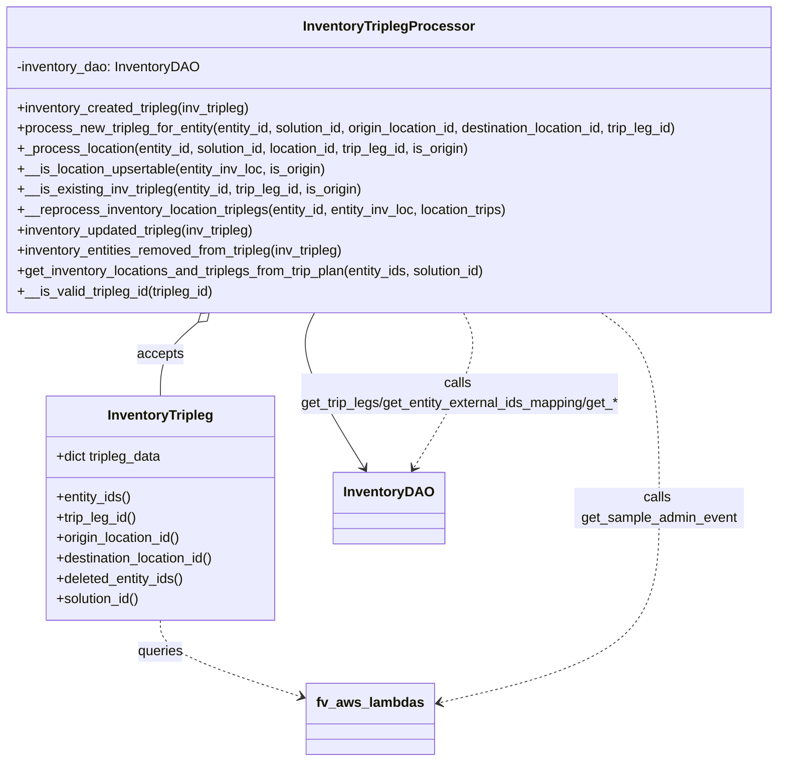
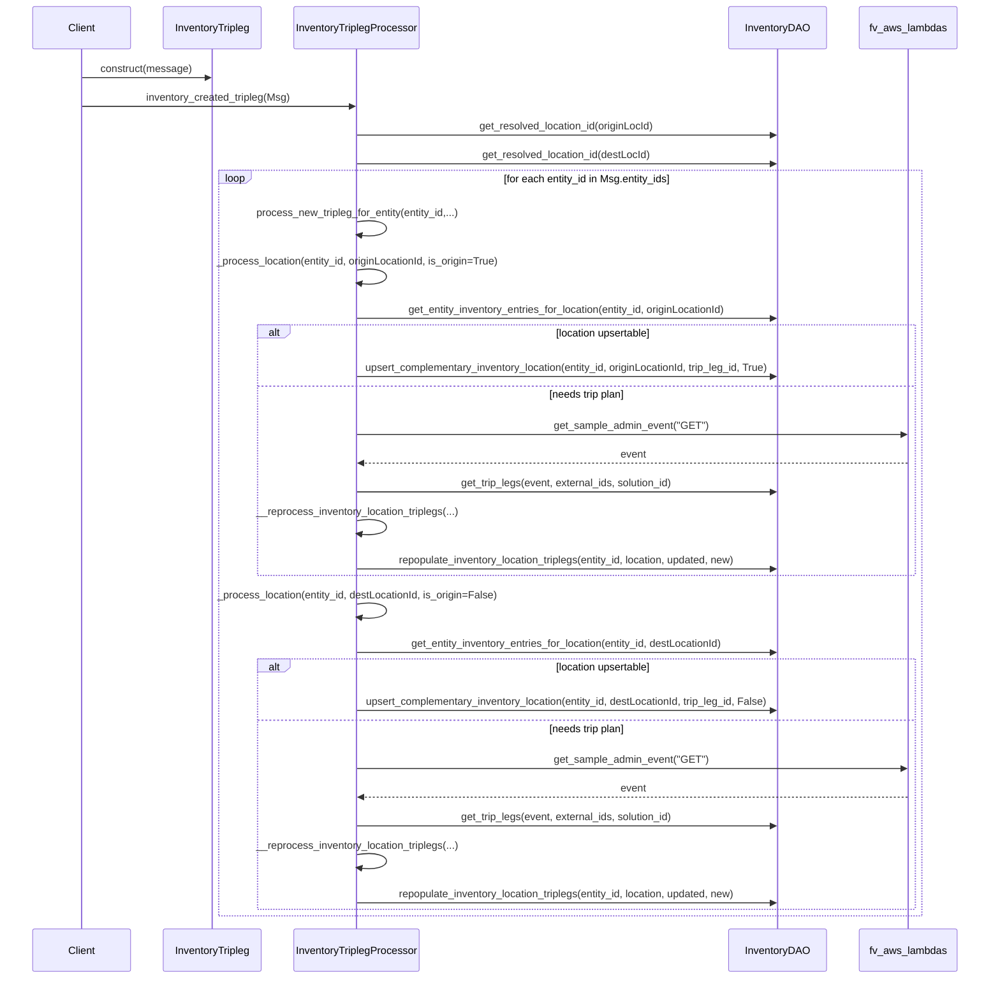

# Diagram: entity_core/entity_service/entity_inventory/entity_inventory_service/service/inventory_processor/inventory_tripleg_processor.py

> Auto-generated by Obscura crawlers

## Diagram 1

### SVG

<svg id="container" width="941.546875" xmlns="http://www.w3.org/2000/svg" class="classDiagram" height="896" viewBox="0 0 941.546875 896" role="graphics-document document" aria-roledescription="class"><g><defs><marker id="container_class-aggregationStart" class="marker aggregation class" refX="18" refY="7" markerWidth="190" markerHeight="240" orient="auto"><path d="M 18,7 L9,13 L1,7 L9,1 Z"></path></marker></defs><defs><marker id="container_class-aggregationEnd" class="marker aggregation class" refX="1" refY="7" markerWidth="20" markerHeight="28" orient="auto"><path d="M 18,7 L9,13 L1,7 L9,1 Z"></path></marker></defs><defs><marker id="container_class-extensionStart" class="marker extension class" refX="18" refY="7" markerWidth="190" markerHeight="240" orient="auto"><path d="M 1,7 L18,13 V 1 Z"></path></marker></defs><defs><marker id="container_class-extensionEnd" class="marker extension class" refX="1" refY="7" markerWidth="20" markerHeight="28" orient="auto"><path d="M 1,1 V 13 L18,7 Z"></path></marker></defs><defs><marker id="container_class-compositionStart" class="marker composition class" refX="18" refY="7" markerWidth="190" markerHeight="240" orient="auto"><path d="M 18,7 L9,13 L1,7 L9,1 Z"></path></marker></defs><defs><marker id="container_class-compositionEnd" class="marker composition class" refX="1" refY="7" markerWidth="20" markerHeight="28" orient="auto"><path d="M 18,7 L9,13 L1,7 L9,1 Z"></path></marker></defs><defs><marker id="container_class-dependencyStart" class="marker dependency class" refX="6" refY="7" markerWidth="190" markerHeight="240" orient="auto"><path d="M 5,7 L9,13 L1,7 L9,1 Z"></path></marker></defs><defs><marker id="container_class-dependencyEnd" class="marker dependency class" refX="13" refY="7" markerWidth="20" markerHeight="28" orient="auto"><path d="M 18,7 L9,13 L14,7 L9,1 Z"></path></marker></defs><defs><marker id="container_class-lollipopStart" class="marker lollipop class" refX="13" refY="7" markerWidth="190" markerHeight="240" orient="auto"><circle stroke="black" fill="transparent" cx="7" cy="7" r="6"></circle></marker></defs><defs><marker id="container_class-lollipopEnd" class="marker lollipop class" refX="1" refY="7" markerWidth="190" markerHeight="240" orient="auto"><circle stroke="black" fill="transparent" cx="7" cy="7" r="6"></circle></marker></defs><g class="root"><g class="clusters"></g><g class="edgePaths"><path d="M380.525,368L376.43,376.167C372.335,384.333,364.146,400.667,374.212,431.156C384.277,461.644,412.597,506.289,426.757,528.611L440.917,550.933" id="id_InventoryTriplegProcessor_InventoryDAO_1" class="edge-thickness-normal edge-pattern-solid relation" style=";;;" data-edge="true" data-et="edge" data-id="id_InventoryTriplegProcessor_InventoryDAO_1" data-points="W3sieCI6MzgwLjUyNDczMzg5NzM3OTksInkiOjM2OH0seyJ4IjozNTUuOTU3MDMxMjUsInkiOjQxN30seyJ4Ijo0NDQuMTMwOTU2NDkxNzEyNywieSI6NTU2fV0=" marker-end="url(#container_class-dependencyEnd)"></path><path d="M243.933,379.114L236.438,385.429C228.943,391.743,213.954,404.371,206.459,418.852C198.965,433.333,198.965,449.667,198.965,457.833L198.965,466" id="id_InventoryTriplegProcessor_InventoryTripleg_2" class="edge-thickness-normal edge-pattern-solid relation" style=";;;" data-edge="true" data-et="edge" data-id="id_InventoryTriplegProcessor_InventoryTripleg_2" data-points="W3sieCI6MjU3LjEyNDc2MTE4OTk1NjMsInkiOjM2OH0seyJ4IjoxOTguOTY0ODQzNzUsInkiOjQxN30seyJ4IjoxOTguOTY0ODQzNzUsInkiOjQ2Nn1d" marker-start="url(#container_class-aggregationStart)"></path><path d="M198.965,730L198.965,736.167C198.965,742.333,198.965,754.667,228.224,769.957C257.483,785.248,316,803.495,345.259,812.619L374.518,821.743" id="id_InventoryTripleg_fv_aws_lambdas_3" class="edge-thickness-normal edge-pattern-dashed relation" style=";;;" data-edge="true" data-et="edge" data-id="id_InventoryTripleg_fv_aws_lambdas_3" data-points="W3sieCI6MTk4Ljk2NDg0Mzc1LCJ5Ijo3MzB9LHsieCI6MTk4Ljk2NDg0Mzc1LCJ5Ijo3Njd9LHsieCI6MzgwLjI0NjA5Mzc1LCJ5Ijo4MjMuNTI4ODAyMjY5NjQzNX1d" marker-end="url(#container_class-dependencyEnd)"></path><path d="M728.556,368L740.252,376.167C751.948,384.333,775.339,400.667,787.035,439C798.73,477.333,798.73,537.667,798.73,596C798.73,654.333,798.73,710.667,753.979,749.039C709.227,787.411,619.724,807.822,574.973,818.027L530.221,828.232" id="id_InventoryTriplegProcessor_fv_aws_lambdas_4" class="edge-thickness-normal edge-pattern-dashed relation" style=";;;" data-edge="true" data-et="edge" data-id="id_InventoryTriplegProcessor_fv_aws_lambdas_4" data-points="W3sieCI6NzI4LjU1NjI1NjgyMzE0NDIsInkiOjM2OH0seyJ4Ijo3OTguNzMwNDY4NzUsInkiOjQxN30seyJ4Ijo3OTguNzMwNDY4NzUsInkiOjU5OH0seyJ4Ijo3OTguNzMwNDY4NzUsInkiOjc2N30seyJ4Ijo1MjQuMzcxMDkzNzUsInkiOjgyOS41NjY0NjA2OTE4OTQ4fV0=" marker-end="url(#container_class-dependencyEnd)"></path><path d="M561.022,368L565.117,376.167C569.211,384.333,577.401,400.667,567.335,431.156C557.27,461.644,528.95,506.289,514.79,528.611L500.63,550.933" id="id_InventoryTriplegProcessor_InventoryDAO_5" class="edge-thickness-normal edge-pattern-dashed relation" style=";;;" data-edge="true" data-et="edge" data-id="id_InventoryTriplegProcessor_InventoryDAO_5" data-points="W3sieCI6NTYxLjAyMjE0MTEwMjYyLCJ5IjozNjh9LHsieCI6NTg1LjU4OTg0Mzc1LCJ5Ijo0MTd9LHsieCI6NDk3LjQxNTkxODUwODI4NzMsInkiOjU1Nn1d" marker-end="url(#container_class-dependencyEnd)"></path></g><g class="edgeLabels"><g class="edgeLabel" transform="translate(385.36312, 463.35664)"><g class="label" data-id="id_InventoryTriplegProcessor_InventoryDAO_1" transform="translate(-16.4921875, -12)"><foreignObject width="32.984375" height="24">

uses

</foreignObject></g></g><g class="edgeLabel" transform="translate(198.96484375, 417)"><g class="label" data-id="id_InventoryTriplegProcessor_InventoryTripleg_2" transform="translate(-27.421875, -12)"><foreignObject width="54.84375" height="24">

accepts

</foreignObject></g></g><g class="edgeLabel" transform="translate(198.96484375, 767)"><g class="label" data-id="id_InventoryTripleg_fv_aws_lambdas_3" transform="translate(-27.2421875, -12)"><foreignObject width="54.484375" height="24">

queries

</foreignObject></g></g><g class="edgeLabel" transform="translate(798.73046875, 598)"><g class="label" data-id="id_InventoryTriplegProcessor_fv_aws_lambdas_4" transform="translate(-100, -24)"><foreignObject width="200" height="48">

calls get_sample_admin_event

</foreignObject></g></g><g class="edgeLabel" transform="translate(556.18375, 463.35664)"><g class="label" data-id="id_InventoryTriplegProcessor_InventoryDAO_5" transform="translate(-193.140625, -24)"><foreignObject width="386.28125" height="48">

calls get_trip_legs/get_entity_external_ids_mapping/get_*

</foreignObject></g></g></g><g class="nodes"><g class="node default" id="classId-InventoryTripleg-0" transform="translate(198.96484375, 598)"><g class="basic label-container"><path d="M-137.8203125 -132 L137.8203125 -132 L137.8203125 132 L-137.8203125 132" stroke="none" stroke-width="0" fill="#ECECFF" style=""></path><path d="M-137.8203125 -132 C-58.072509375135056 -132, 21.67529374972989 -132, 137.8203125 -132 M-137.8203125 -132 C-82.1308188973264 -132, -26.441325294652813 -132, 137.8203125 -132 M137.8203125 -132 C137.8203125 -36.52276559794197, 137.8203125 58.95446880411606, 137.8203125 132 M137.8203125 -132 C137.8203125 -46.70568744390137, 137.8203125 38.58862511219726, 137.8203125 132 M137.8203125 132 C66.20646205097411 132, -5.407388398051779 132, -137.8203125 132 M137.8203125 132 C64.32150278363382 132, -9.177306932732364 132, -137.8203125 132 M-137.8203125 132 C-137.8203125 47.76486673598035, -137.8203125 -36.4702665280393, -137.8203125 -132 M-137.8203125 132 C-137.8203125 73.96397905351452, -137.8203125 15.927958107029028, -137.8203125 -132" stroke="#9370DB" stroke-width="1.3" fill="none" stroke-dasharray="0 0" style=""></path></g><g class="annotation-group text" transform="translate(0, -108)"></g><g class="label-group text" transform="translate(-60.4375, -108)"><g class="label" style="font-weight: bolder" transform="translate(0,-12)"><foreignObject width="120.875" height="24">

InventoryTripleg

</foreignObject></g></g><g class="members-group text" transform="translate(-125.8203125, -60)"><g class="label" style="" transform="translate(0,-12)"><foreignObject width="128.0625" height="24">

+dict tripleg_data

</foreignObject></g></g><g class="methods-group text" transform="translate(-125.8203125, -12)"><g class="label" style="" transform="translate(0,-12)"><foreignObject width="89.703125" height="24">

+entity_ids()

</foreignObject></g><g class="label" style="" transform="translate(0,12)"><foreignObject width="96.203125" height="24">

+trip_leg_id()

</foreignObject></g><g class="label" style="" transform="translate(0,36)"><foreignObject width="150.3125" height="24">

+origin_location_id()

</foreignObject></g><g class="label" style="" transform="translate(0,60)"><foreignObject width="191.203125" height="24">

+destination_location_id()

</foreignObject></g><g class="label" style="" transform="translate(0,84)"><foreignObject width="153.140625" height="24">

+deleted_entity_ids()

</foreignObject></g><g class="label" style="" transform="translate(0,108)"><foreignObject width="100.578125" height="24">

+solution_id()

</foreignObject></g></g><g class="divider" style=""><path d="M-137.8203125 -84 C-78.38481974475815 -84, -18.949326989516308 -84, 137.8203125 -84 M-137.8203125 -84 C-30.614657582073903 -84, 76.5909973358522 -84, 137.8203125 -84" stroke="#9370DB" stroke-width="1.3" fill="none" stroke-dasharray="0 0" style=""></path></g><g class="divider" style=""><path d="M-137.8203125 -36 C-42.06891256379281 -36, 53.682487372414386 -36, 137.8203125 -36 M-137.8203125 -36 C-67.33710405584183 -36, 3.1461043883163313 -36, 137.8203125 -36" stroke="#9370DB" stroke-width="1.3" fill="none" stroke-dasharray="0 0" style=""></path></g></g><g class="node default" id="classId-InventoryTriplegProcessor-1" transform="translate(470.7734375, 188)"><g class="basic label-container"><path d="M-462.7734375 -180 L462.7734375 -180 L462.7734375 180 L-462.7734375 180" stroke="none" stroke-width="0" fill="#ECECFF" style=""></path><path d="M-462.7734375 -180 C-223.43693442833182 -180, 15.899568643336352 -180, 462.7734375 -180 M-462.7734375 -180 C-114.46587059890624 -180, 233.84169630218753 -180, 462.7734375 -180 M462.7734375 -180 C462.7734375 -102.90012885275614, 462.7734375 -25.80025770551228, 462.7734375 180 M462.7734375 -180 C462.7734375 -100.72437566359854, 462.7734375 -21.448751327197073, 462.7734375 180 M462.7734375 180 C271.6800499119979 180, 80.58666232399582 180, -462.7734375 180 M462.7734375 180 C251.17601468220337 180, 39.57859186440675 180, -462.7734375 180 M-462.7734375 180 C-462.7734375 58.39128931984824, -462.7734375 -63.21742136030352, -462.7734375 -180 M-462.7734375 180 C-462.7734375 56.70628319750574, -462.7734375 -66.58743360498852, -462.7734375 -180" stroke="#9370DB" stroke-width="1.3" fill="none" stroke-dasharray="0 0" style=""></path></g><g class="annotation-group text" transform="translate(0, -156)"></g><g class="label-group text" transform="translate(-96.359375, -156)"><g class="label" style="font-weight: bolder" transform="translate(0,-12)"><foreignObject width="192.71875" height="24">

InventoryTriplegProcessor

</foreignObject></g></g><g class="members-group text" transform="translate(-450.7734375, -108)"><g class="label" style="" transform="translate(0,-12)"><foreignObject width="217.3125" height="24">

-inventory_dao: InventoryDAO

</foreignObject></g></g><g class="methods-group text" transform="translate(-450.7734375, -60)"><g class="label" style="" transform="translate(0,-12)"><foreignObject width="281.328125" height="24">

+inventory_created_tripleg(inv_tripleg)

</foreignObject></g><g class="label" style="" transform="translate(0,12)"><foreignObject width="805.1875" height="24">

+process_new_tripleg_for_entity(entity_id, solution_id, origin_location_id, destination_location_id, trip_leg_id)

</foreignObject></g><g class="label" style="" transform="translate(0,36)"><foreignObject width="547.5625" height="24">

+_process_location(entity_id, solution_id, location_id, trip_leg_id, is_origin)

</foreignObject></g><g class="label" style="" transform="translate(0,60)"><foreignObject width="369.78125" height="24">

+__is_location_upsertable(entity_inv_loc, is_origin)

</foreignObject></g><g class="label" style="" transform="translate(0,84)"><foreignObject width="414.546875" height="24">

+__is_existing_inv_tripleg(entity_id, trip_leg_id, is_origin)

</foreignObject></g><g class="label" style="" transform="translate(0,108)"><foreignObject width="591.265625" height="24">

+__reprocess_inventory_location_triplegs(entity_id, entity_inv_loc, location_trips)

</foreignObject></g><g class="label" style="" transform="translate(0,132)"><foreignObject width="287.796875" height="24">

+inventory_updated_tripleg(inv_tripleg)

</foreignObject></g><g class="label" style="" transform="translate(0,156)"><foreignObject width="395.375" height="24">

+inventory_entities_removed_from_tripleg(inv_tripleg)

</foreignObject></g><g class="label" style="" transform="translate(0,180)"><foreignObject width="568.0625" height="24">

+get_inventory_locations_and_triplegs_from_trip_plan(entity_ids, solution_id)

</foreignObject></g><g class="label" style="" transform="translate(0,204)"><foreignObject width="236.15625" height="24">

+__is_valid_tripleg_id(tripleg_id)

</foreignObject></g></g><g class="divider" style=""><path d="M-462.7734375 -132 C-122.74648966619435 -132, 217.2804581676113 -132, 462.7734375 -132 M-462.7734375 -132 C-134.37062488703236 -132, 194.03218772593527 -132, 462.7734375 -132" stroke="#9370DB" stroke-width="1.3" fill="none" stroke-dasharray="0 0" style=""></path></g><g class="divider" style=""><path d="M-462.7734375 -84 C-169.7998443873518 -84, 123.17374872529638 -84, 462.7734375 -84 M-462.7734375 -84 C-238.47903327140236 -84, -14.184629042804715 -84, 462.7734375 -84" stroke="#9370DB" stroke-width="1.3" fill="none" stroke-dasharray="0 0" style=""></path></g></g><g class="node default" id="classId-InventoryDAO-2" transform="translate(470.7734375, 598)"><g class="basic label-container"><path d="M-62.25 -42 L62.25 -42 L62.25 42 L-62.25 42" stroke="none" stroke-width="0" fill="#ECECFF" style=""></path><path d="M-62.25 -42 C-14.52267419648701 -42, 33.20465160702598 -42, 62.25 -42 M-62.25 -42 C-35.34411888796162 -42, -8.438237775923241 -42, 62.25 -42 M62.25 -42 C62.25 -17.713702207195016, 62.25 6.572595585609967, 62.25 42 M62.25 -42 C62.25 -9.438621139171339, 62.25 23.122757721657322, 62.25 42 M62.25 42 C27.749735514124374 42, -6.750528971751251 42, -62.25 42 M62.25 42 C16.43352130996452 42, -29.382957380070962 42, -62.25 42 M-62.25 42 C-62.25 21.74570324715708, -62.25 1.4914064943141625, -62.25 -42 M-62.25 42 C-62.25 16.79977593374531, -62.25 -8.400448132509382, -62.25 -42" stroke="#9370DB" stroke-width="1.3" fill="none" stroke-dasharray="0 0" style=""></path></g><g class="annotation-group text" transform="translate(0, -18)"></g><g class="label-group text" transform="translate(-50.25, -18)"><g class="label" style="font-weight: bolder" transform="translate(0,-12)"><foreignObject width="100.5" height="24">

InventoryDAO

</foreignObject></g></g><g class="members-group text" transform="translate(-50.25, 30)"></g><g class="methods-group text" transform="translate(-50.25, 60)"></g><g class="divider" style=""><path d="M-62.25 6 C-21.473151534078156 6, 19.30369693184369 6, 62.25 6 M-62.25 6 C-21.860162354341256 6, 18.52967529131749 6, 62.25 6" stroke="#9370DB" stroke-width="1.3" fill="none" stroke-dasharray="0 0" style=""></path></g><g class="divider" style=""><path d="M-62.25 24 C-19.96448360504842 24, 22.321032789903157 24, 62.25 24 M-62.25 24 C-30.732357490604407 24, 0.7852850187911855 24, 62.25 24" stroke="#9370DB" stroke-width="1.3" fill="none" stroke-dasharray="0 0" style=""></path></g></g><g class="node default" id="classId-fv_aws_lambdas-3" transform="translate(452.30859375, 846)"><g class="basic label-container"><path d="M-72.0625 -42 L72.0625 -42 L72.0625 42 L-72.0625 42" stroke="none" stroke-width="0" fill="#ECECFF" style=""></path><path d="M-72.0625 -42 C-18.882120601491287 -42, 34.298258797017425 -42, 72.0625 -42 M-72.0625 -42 C-41.073604426011784 -42, -10.084708852023574 -42, 72.0625 -42 M72.0625 -42 C72.0625 -22.929229397537046, 72.0625 -3.8584587950740925, 72.0625 42 M72.0625 -42 C72.0625 -24.160195677560555, 72.0625 -6.32039135512111, 72.0625 42 M72.0625 42 C20.56404264181395 42, -30.934414716372103 42, -72.0625 42 M72.0625 42 C29.995349618496796 42, -12.071800763006408 42, -72.0625 42 M-72.0625 42 C-72.0625 9.091663240515942, -72.0625 -23.816673518968116, -72.0625 -42 M-72.0625 42 C-72.0625 14.623454025537136, -72.0625 -12.753091948925729, -72.0625 -42" stroke="#9370DB" stroke-width="1.3" fill="none" stroke-dasharray="0 0" style=""></path></g><g class="annotation-group text" transform="translate(0, -18)"></g><g class="label-group text" transform="translate(-60.0625, -18)"><g class="label" style="font-weight: bolder" transform="translate(0,-12)"><foreignObject width="120.125" height="24">

fv_aws_lambdas

</foreignObject></g></g><g class="members-group text" transform="translate(-60.0625, 30)"></g><g class="methods-group text" transform="translate(-60.0625, 60)"></g><g class="divider" style=""><path d="M-72.0625 6 C-18.166194116191136 6, 35.73011176761773 6, 72.0625 6 M-72.0625 6 C-24.75429428971229 6, 22.553911420575417 6, 72.0625 6" stroke="#9370DB" stroke-width="1.3" fill="none" stroke-dasharray="0 0" style=""></path></g><g class="divider" style=""><path d="M-72.0625 24 C-41.443666535611285 24, -10.824833071222578 24, 72.0625 24 M-72.0625 24 C-23.8817017711306 24, 24.2990964577388 24, 72.0625 24" stroke="#9370DB" stroke-width="1.3" fill="none" stroke-dasharray="0 0" style=""></path></g></g></g></g></g></svg>

## Diagram 2

### SVG

<svg id="container" width="1600" xmlns="http://www.w3.org/2000/svg" height="1584" viewBox="-50 -10 1600 1584" role="graphics-document document" aria-roledescription="sequence"><g><rect x="1350" y="1498" fill="#eaeaea" stroke="#666" width="150" height="65" name="FV" rx="3" ry="3" class="actor actor-bottom"></rect><text x="1425" y="1530.5" dominant-baseline="central" alignment-baseline="central" class="actor actor-box" style="text-anchor: middle; font-size: 16px; font-weight: 400;"><tspan x="1425" dy="0">fv_aws_lambdas</tspan></text></g><g><rect x="1150" y="1498" fill="#eaeaea" stroke="#666" width="150" height="65" name="DAO" rx="3" ry="3" class="actor actor-bottom"></rect><text x="1225" y="1530.5" dominant-baseline="central" alignment-baseline="central" class="actor actor-box" style="text-anchor: middle; font-size: 16px; font-weight: 400;"><tspan x="1225" dy="0">InventoryDAO</tspan></text></g><g><rect x="411" y="1498" fill="#eaeaea" stroke="#666" width="210" height="65" name="Proc" rx="3" ry="3" class="actor actor-bottom"></rect><text x="516" y="1530.5" dominant-baseline="central" alignment-baseline="central" class="actor actor-box" style="text-anchor: middle; font-size: 16px; font-weight: 400;"><tspan x="516" dy="0">InventoryTriplegProcessor</tspan></text></g><g><rect x="211" y="1498" fill="#eaeaea" stroke="#666" width="150" height="65" name="Msg" rx="3" ry="3" class="actor actor-bottom"></rect><text x="286" y="1530.5" dominant-baseline="central" alignment-baseline="central" class="actor actor-box" style="text-anchor: middle; font-size: 16px; font-weight: 400;"><tspan x="286" dy="0">InventoryTripleg</tspan></text></g><g><rect x="0" y="1498" fill="#eaeaea" stroke="#666" width="150" height="65" name="Client" rx="3" ry="3" class="actor actor-bottom"></rect><text x="75" y="1530.5" dominant-baseline="central" alignment-baseline="central" class="actor actor-box" style="text-anchor: middle; font-size: 16px; font-weight: 400;"><tspan x="75" dy="0">Client</tspan></text></g><g><line id="actor4" x1="1425" y1="65" x2="1425" y2="1498" class="actor-line 200" stroke-width="0.5px" stroke="#999" name="FV"></line><g id="root-4"><rect x="1350" y="0" fill="#eaeaea" stroke="#666" width="150" height="65" name="FV" rx="3" ry="3" class="actor actor-top"></rect><text x="1425" y="32.5" dominant-baseline="central" alignment-baseline="central" class="actor actor-box" style="text-anchor: middle; font-size: 16px; font-weight: 400;"><tspan x="1425" dy="0">fv_aws_lambdas</tspan></text></g></g><g><line id="actor3" x1="1225" y1="65" x2="1225" y2="1498" class="actor-line 200" stroke-width="0.5px" stroke="#999" name="DAO"></line><g id="root-3"><rect x="1150" y="0" fill="#eaeaea" stroke="#666" width="150" height="65" name="DAO" rx="3" ry="3" class="actor actor-top"></rect><text x="1225" y="32.5" dominant-baseline="central" alignment-baseline="central" class="actor actor-box" style="text-anchor: middle; font-size: 16px; font-weight: 400;"><tspan x="1225" dy="0">InventoryDAO</tspan></text></g></g><g><line id="actor2" x1="516" y1="65" x2="516" y2="1498" class="actor-line 200" stroke-width="0.5px" stroke="#999" name="Proc"></line><g id="root-2"><rect x="411" y="0" fill="#eaeaea" stroke="#666" width="210" height="65" name="Proc" rx="3" ry="3" class="actor actor-top"></rect><text x="516" y="32.5" dominant-baseline="central" alignment-baseline="central" class="actor actor-box" style="text-anchor: middle; font-size: 16px; font-weight: 400;"><tspan x="516" dy="0">InventoryTriplegProcessor</tspan></text></g></g><g><line id="actor1" x1="286" y1="65" x2="286" y2="1498" class="actor-line 200" stroke-width="0.5px" stroke="#999" name="Msg"></line><g id="root-1"><rect x="211" y="0" fill="#eaeaea" stroke="#666" width="150" height="65" name="Msg" rx="3" ry="3" class="actor actor-top"></rect><text x="286" y="32.5" dominant-baseline="central" alignment-baseline="central" class="actor actor-box" style="text-anchor: middle; font-size: 16px; font-weight: 400;"><tspan x="286" dy="0">InventoryTripleg</tspan></text></g></g><g><line id="actor0" x1="75" y1="65" x2="75" y2="1498" class="actor-line 200" stroke-width="0.5px" stroke="#999" name="Client"></line><g id="root-0"><rect x="0" y="0" fill="#eaeaea" stroke="#666" width="150" height="65" name="Client" rx="3" ry="3" class="actor actor-top"></rect><text x="75" y="32.5" dominant-baseline="central" alignment-baseline="central" class="actor actor-box" style="text-anchor: middle; font-size: 16px; font-weight: 400;"><tspan x="75" dy="0">Client</tspan></text></g></g><g></g><defs><symbol id="computer" width="24" height="24"><path transform="scale(.5)" d="M2 2v13h20v-13h-20zm18 11h-16v-9h16v9zm-10.228 6l.466-1h3.524l.467 1h-4.457zm14.228 3h-24l2-6h2.104l-1.33 4h18.45l-1.297-4h2.073l2 6zm-5-10h-14v-7h14v7z"></path></symbol></defs><defs><symbol id="database" fill-rule="evenodd" clip-rule="evenodd"><path transform="scale(.5)" d="M12.258.001l.256.004.255.005.253.008.251.01.249.012.247.015.246.016.242.019.241.02.239.023.236.024.233.027.231.028.229.031.225.032.223.034.22.036.217.038.214.04.211.041.208.043.205.045.201.046.198.048.194.05.191.051.187.053.183.054.18.056.175.057.172.059.168.06.163.061.16.063.155.064.15.066.074.033.073.033.071.034.07.034.069.035.068.035.067.035.066.035.064.036.064.036.062.036.06.036.06.037.058.037.058.037.055.038.055.038.053.038.052.038.051.039.05.039.048.039.047.039.045.04.044.04.043.04.041.04.04.041.039.041.037.041.036.041.034.041.033.042.032.042.03.042.029.042.027.042.026.043.024.043.023.043.021.043.02.043.018.044.017.043.015.044.013.044.012.044.011.045.009.044.007.045.006.045.004.045.002.045.001.045v17l-.001.045-.002.045-.004.045-.006.045-.007.045-.009.044-.011.045-.012.044-.013.044-.015.044-.017.043-.018.044-.02.043-.021.043-.023.043-.024.043-.026.043-.027.042-.029.042-.03.042-.032.042-.033.042-.034.041-.036.041-.037.041-.039.041-.04.041-.041.04-.043.04-.044.04-.045.04-.047.039-.048.039-.05.039-.051.039-.052.038-.053.038-.055.038-.055.038-.058.037-.058.037-.06.037-.06.036-.062.036-.064.036-.064.036-.066.035-.067.035-.068.035-.069.035-.07.034-.071.034-.073.033-.074.033-.15.066-.155.064-.16.063-.163.061-.168.06-.172.059-.175.057-.18.056-.183.054-.187.053-.191.051-.194.05-.198.048-.201.046-.205.045-.208.043-.211.041-.214.04-.217.038-.22.036-.223.034-.225.032-.229.031-.231.028-.233.027-.236.024-.239.023-.241.02-.242.019-.246.016-.247.015-.249.012-.251.01-.253.008-.255.005-.256.004-.258.001-.258-.001-.256-.004-.255-.005-.253-.008-.251-.01-.249-.012-.247-.015-.245-.016-.243-.019-.241-.02-.238-.023-.236-.024-.234-.027-.231-.028-.228-.031-.226-.032-.223-.034-.22-.036-.217-.038-.214-.04-.211-.041-.208-.043-.204-.045-.201-.046-.198-.048-.195-.05-.19-.051-.187-.053-.184-.054-.179-.056-.176-.057-.172-.059-.167-.06-.164-.061-.159-.063-.155-.064-.151-.066-.074-.033-.072-.033-.072-.034-.07-.034-.069-.035-.068-.035-.067-.035-.066-.035-.064-.036-.063-.036-.062-.036-.061-.036-.06-.037-.058-.037-.057-.037-.056-.038-.055-.038-.053-.038-.052-.038-.051-.039-.049-.039-.049-.039-.046-.039-.046-.04-.044-.04-.043-.04-.041-.04-.04-.041-.039-.041-.037-.041-.036-.041-.034-.041-.033-.042-.032-.042-.03-.042-.029-.042-.027-.042-.026-.043-.024-.043-.023-.043-.021-.043-.02-.043-.018-.044-.017-.043-.015-.044-.013-.044-.012-.044-.011-.045-.009-.044-.007-.045-.006-.045-.004-.045-.002-.045-.001-.045v-17l.001-.045.002-.045.004-.045.006-.045.007-.045.009-.044.011-.045.012-.044.013-.044.015-.044.017-.043.018-.044.02-.043.021-.043.023-.043.024-.043.026-.043.027-.042.029-.042.03-.042.032-.042.033-.042.034-.041.036-.041.037-.041.039-.041.04-.041.041-.04.043-.04.044-.04.046-.04.046-.039.049-.039.049-.039.051-.039.052-.038.053-.038.055-.038.056-.038.057-.037.058-.037.06-.037.061-.036.062-.036.063-.036.064-.036.066-.035.067-.035.068-.035.069-.035.07-.034.072-.034.072-.033.074-.033.151-.066.155-.064.159-.063.164-.061.167-.06.172-.059.176-.057.179-.056.184-.054.187-.053.19-.051.195-.05.198-.048.201-.046.204-.045.208-.043.211-.041.214-.04.217-.038.22-.036.223-.034.226-.032.228-.031.231-.028.234-.027.236-.024.238-.023.241-.02.243-.019.245-.016.247-.015.249-.012.251-.01.253-.008.255-.005.256-.004.258-.001.258.001zm-9.258 20.499v.01l.001.021.003.021.004.022.005.021.006.022.007.022.009.023.01.022.011.023.012.023.013.023.015.023.016.024.017.023.018.024.019.024.021.024.022.025.023.024.024.025.052.049.056.05.061.051.066.051.07.051.075.051.079.052.084.052.088.052.092.052.097.052.102.051.105.052.11.052.114.051.119.051.123.051.127.05.131.05.135.05.139.048.144.049.147.047.152.047.155.047.16.045.163.045.167.043.171.043.176.041.178.041.183.039.187.039.19.037.194.035.197.035.202.033.204.031.209.03.212.029.216.027.219.025.222.024.226.021.23.02.233.018.236.016.24.015.243.012.246.01.249.008.253.005.256.004.259.001.26-.001.257-.004.254-.005.25-.008.247-.011.244-.012.241-.014.237-.016.233-.018.231-.021.226-.021.224-.024.22-.026.216-.027.212-.028.21-.031.205-.031.202-.034.198-.034.194-.036.191-.037.187-.039.183-.04.179-.04.175-.042.172-.043.168-.044.163-.045.16-.046.155-.046.152-.047.148-.048.143-.049.139-.049.136-.05.131-.05.126-.05.123-.051.118-.052.114-.051.11-.052.106-.052.101-.052.096-.052.092-.052.088-.053.083-.051.079-.052.074-.052.07-.051.065-.051.06-.051.056-.05.051-.05.023-.024.023-.025.021-.024.02-.024.019-.024.018-.024.017-.024.015-.023.014-.024.013-.023.012-.023.01-.023.01-.022.008-.022.006-.022.006-.022.004-.022.004-.021.001-.021.001-.021v-4.127l-.077.055-.08.053-.083.054-.085.053-.087.052-.09.052-.093.051-.095.05-.097.05-.1.049-.102.049-.105.048-.106.047-.109.047-.111.046-.114.045-.115.045-.118.044-.12.043-.122.042-.124.042-.126.041-.128.04-.13.04-.132.038-.134.038-.135.037-.138.037-.139.035-.142.035-.143.034-.144.033-.147.032-.148.031-.15.03-.151.03-.153.029-.154.027-.156.027-.158.026-.159.025-.161.024-.162.023-.163.022-.165.021-.166.02-.167.019-.169.018-.169.017-.171.016-.173.015-.173.014-.175.013-.175.012-.177.011-.178.01-.179.008-.179.008-.181.006-.182.005-.182.004-.184.003-.184.002h-.37l-.184-.002-.184-.003-.182-.004-.182-.005-.181-.006-.179-.008-.179-.008-.178-.01-.176-.011-.176-.012-.175-.013-.173-.014-.172-.015-.171-.016-.17-.017-.169-.018-.167-.019-.166-.02-.165-.021-.163-.022-.162-.023-.161-.024-.159-.025-.157-.026-.156-.027-.155-.027-.153-.029-.151-.03-.15-.03-.148-.031-.146-.032-.145-.033-.143-.034-.141-.035-.14-.035-.137-.037-.136-.037-.134-.038-.132-.038-.13-.04-.128-.04-.126-.041-.124-.042-.122-.042-.12-.044-.117-.043-.116-.045-.113-.045-.112-.046-.109-.047-.106-.047-.105-.048-.102-.049-.1-.049-.097-.05-.095-.05-.093-.052-.09-.051-.087-.052-.085-.053-.083-.054-.08-.054-.077-.054v4.127zm0-5.654v.011l.001.021.003.021.004.021.005.022.006.022.007.022.009.022.01.022.011.023.012.023.013.023.015.024.016.023.017.024.018.024.019.024.021.024.022.024.023.025.024.024.052.05.056.05.061.05.066.051.07.051.075.052.079.051.084.052.088.052.092.052.097.052.102.052.105.052.11.051.114.051.119.052.123.05.127.051.131.05.135.049.139.049.144.048.147.048.152.047.155.046.16.045.163.045.167.044.171.042.176.042.178.04.183.04.187.038.19.037.194.036.197.034.202.033.204.032.209.03.212.028.216.027.219.025.222.024.226.022.23.02.233.018.236.016.24.014.243.012.246.01.249.008.253.006.256.003.259.001.26-.001.257-.003.254-.006.25-.008.247-.01.244-.012.241-.015.237-.016.233-.018.231-.02.226-.022.224-.024.22-.025.216-.027.212-.029.21-.03.205-.032.202-.033.198-.035.194-.036.191-.037.187-.039.183-.039.179-.041.175-.042.172-.043.168-.044.163-.045.16-.045.155-.047.152-.047.148-.048.143-.048.139-.05.136-.049.131-.05.126-.051.123-.051.118-.051.114-.052.11-.052.106-.052.101-.052.096-.052.092-.052.088-.052.083-.052.079-.052.074-.051.07-.052.065-.051.06-.05.056-.051.051-.049.023-.025.023-.024.021-.025.02-.024.019-.024.018-.024.017-.024.015-.023.014-.023.013-.024.012-.022.01-.023.01-.023.008-.022.006-.022.006-.022.004-.021.004-.022.001-.021.001-.021v-4.139l-.077.054-.08.054-.083.054-.085.052-.087.053-.09.051-.093.051-.095.051-.097.05-.1.049-.102.049-.105.048-.106.047-.109.047-.111.046-.114.045-.115.044-.118.044-.12.044-.122.042-.124.042-.126.041-.128.04-.13.039-.132.039-.134.038-.135.037-.138.036-.139.036-.142.035-.143.033-.144.033-.147.033-.148.031-.15.03-.151.03-.153.028-.154.028-.156.027-.158.026-.159.025-.161.024-.162.023-.163.022-.165.021-.166.02-.167.019-.169.018-.169.017-.171.016-.173.015-.173.014-.175.013-.175.012-.177.011-.178.009-.179.009-.179.007-.181.007-.182.005-.182.004-.184.003-.184.002h-.37l-.184-.002-.184-.003-.182-.004-.182-.005-.181-.007-.179-.007-.179-.009-.178-.009-.176-.011-.176-.012-.175-.013-.173-.014-.172-.015-.171-.016-.17-.017-.169-.018-.167-.019-.166-.02-.165-.021-.163-.022-.162-.023-.161-.024-.159-.025-.157-.026-.156-.027-.155-.028-.153-.028-.151-.03-.15-.03-.148-.031-.146-.033-.145-.033-.143-.033-.141-.035-.14-.036-.137-.036-.136-.037-.134-.038-.132-.039-.13-.039-.128-.04-.126-.041-.124-.042-.122-.043-.12-.043-.117-.044-.116-.044-.113-.046-.112-.046-.109-.046-.106-.047-.105-.048-.102-.049-.1-.049-.097-.05-.095-.051-.093-.051-.09-.051-.087-.053-.085-.052-.083-.054-.08-.054-.077-.054v4.139zm0-5.666v.011l.001.02.003.022.004.021.005.022.006.021.007.022.009.023.01.022.011.023.012.023.013.023.015.023.016.024.017.024.018.023.019.024.021.025.022.024.023.024.024.025.052.05.056.05.061.05.066.051.07.051.075.052.079.051.084.052.088.052.092.052.097.052.102.052.105.051.11.052.114.051.119.051.123.051.127.05.131.05.135.05.139.049.144.048.147.048.152.047.155.046.16.045.163.045.167.043.171.043.176.042.178.04.183.04.187.038.19.037.194.036.197.034.202.033.204.032.209.03.212.028.216.027.219.025.222.024.226.021.23.02.233.018.236.017.24.014.243.012.246.01.249.008.253.006.256.003.259.001.26-.001.257-.003.254-.006.25-.008.247-.01.244-.013.241-.014.237-.016.233-.018.231-.02.226-.022.224-.024.22-.025.216-.027.212-.029.21-.03.205-.032.202-.033.198-.035.194-.036.191-.037.187-.039.183-.039.179-.041.175-.042.172-.043.168-.044.163-.045.16-.045.155-.047.152-.047.148-.048.143-.049.139-.049.136-.049.131-.051.126-.05.123-.051.118-.052.114-.051.11-.052.106-.052.101-.052.096-.052.092-.052.088-.052.083-.052.079-.052.074-.052.07-.051.065-.051.06-.051.056-.05.051-.049.023-.025.023-.025.021-.024.02-.024.019-.024.018-.024.017-.024.015-.023.014-.024.013-.023.012-.023.01-.022.01-.023.008-.022.006-.022.006-.022.004-.022.004-.021.001-.021.001-.021v-4.153l-.077.054-.08.054-.083.053-.085.053-.087.053-.09.051-.093.051-.095.051-.097.05-.1.049-.102.048-.105.048-.106.048-.109.046-.111.046-.114.046-.115.044-.118.044-.12.043-.122.043-.124.042-.126.041-.128.04-.13.039-.132.039-.134.038-.135.037-.138.036-.139.036-.142.034-.143.034-.144.033-.147.032-.148.032-.15.03-.151.03-.153.028-.154.028-.156.027-.158.026-.159.024-.161.024-.162.023-.163.023-.165.021-.166.02-.167.019-.169.018-.169.017-.171.016-.173.015-.173.014-.175.013-.175.012-.177.01-.178.01-.179.009-.179.007-.181.006-.182.006-.182.004-.184.003-.184.001-.185.001-.185-.001-.184-.001-.184-.003-.182-.004-.182-.006-.181-.006-.179-.007-.179-.009-.178-.01-.176-.01-.176-.012-.175-.013-.173-.014-.172-.015-.171-.016-.17-.017-.169-.018-.167-.019-.166-.02-.165-.021-.163-.023-.162-.023-.161-.024-.159-.024-.157-.026-.156-.027-.155-.028-.153-.028-.151-.03-.15-.03-.148-.032-.146-.032-.145-.033-.143-.034-.141-.034-.14-.036-.137-.036-.136-.037-.134-.038-.132-.039-.13-.039-.128-.041-.126-.041-.124-.041-.122-.043-.12-.043-.117-.044-.116-.044-.113-.046-.112-.046-.109-.046-.106-.048-.105-.048-.102-.048-.1-.05-.097-.049-.095-.051-.093-.051-.09-.052-.087-.052-.085-.053-.083-.053-.08-.054-.077-.054v4.153zm8.74-8.179l-.257.004-.254.005-.25.008-.247.011-.244.012-.241.014-.237.016-.233.018-.231.021-.226.022-.224.023-.22.026-.216.027-.212.028-.21.031-.205.032-.202.033-.198.034-.194.036-.191.038-.187.038-.183.04-.179.041-.175.042-.172.043-.168.043-.163.045-.16.046-.155.046-.152.048-.148.048-.143.048-.139.049-.136.05-.131.05-.126.051-.123.051-.118.051-.114.052-.11.052-.106.052-.101.052-.096.052-.092.052-.088.052-.083.052-.079.052-.074.051-.07.052-.065.051-.06.05-.056.05-.051.05-.023.025-.023.024-.021.024-.02.025-.019.024-.018.024-.017.023-.015.024-.014.023-.013.023-.012.023-.01.023-.01.022-.008.022-.006.023-.006.021-.004.022-.004.021-.001.021-.001.021.001.021.001.021.004.021.004.022.006.021.006.023.008.022.01.022.01.023.012.023.013.023.014.023.015.024.017.023.018.024.019.024.02.025.021.024.023.024.023.025.051.05.056.05.06.05.065.051.07.052.074.051.079.052.083.052.088.052.092.052.096.052.101.052.106.052.11.052.114.052.118.051.123.051.126.051.131.05.136.05.139.049.143.048.148.048.152.048.155.046.16.046.163.045.168.043.172.043.175.042.179.041.183.04.187.038.191.038.194.036.198.034.202.033.205.032.21.031.212.028.216.027.22.026.224.023.226.022.231.021.233.018.237.016.241.014.244.012.247.011.25.008.254.005.257.004.26.001.26-.001.257-.004.254-.005.25-.008.247-.011.244-.012.241-.014.237-.016.233-.018.231-.021.226-.022.224-.023.22-.026.216-.027.212-.028.21-.031.205-.032.202-.033.198-.034.194-.036.191-.038.187-.038.183-.04.179-.041.175-.042.172-.043.168-.043.163-.045.16-.046.155-.046.152-.048.148-.048.143-.048.139-.049.136-.05.131-.05.126-.051.123-.051.118-.051.114-.052.11-.052.106-.052.101-.052.096-.052.092-.052.088-.052.083-.052.079-.052.074-.051.07-.052.065-.051.06-.05.056-.05.051-.05.023-.025.023-.024.021-.024.02-.025.019-.024.018-.024.017-.023.015-.024.014-.023.013-.023.012-.023.01-.023.01-.022.008-.022.006-.023.006-.021.004-.022.004-.021.001-.021.001-.021-.001-.021-.001-.021-.004-.021-.004-.022-.006-.021-.006-.023-.008-.022-.01-.022-.01-.023-.012-.023-.013-.023-.014-.023-.015-.024-.017-.023-.018-.024-.019-.024-.02-.025-.021-.024-.023-.024-.023-.025-.051-.05-.056-.05-.06-.05-.065-.051-.07-.052-.074-.051-.079-.052-.083-.052-.088-.052-.092-.052-.096-.052-.101-.052-.106-.052-.11-.052-.114-.052-.118-.051-.123-.051-.126-.051-.131-.05-.136-.05-.139-.049-.143-.048-.148-.048-.152-.048-.155-.046-.16-.046-.163-.045-.168-.043-.172-.043-.175-.042-.179-.041-.183-.04-.187-.038-.191-.038-.194-.036-.198-.034-.202-.033-.205-.032-.21-.031-.212-.028-.216-.027-.22-.026-.224-.023-.226-.022-.231-.021-.233-.018-.237-.016-.241-.014-.244-.012-.247-.011-.25-.008-.254-.005-.257-.004-.26-.001-.26.001z"></path></symbol></defs><defs><symbol id="clock" width="24" height="24"><path transform="scale(.5)" d="M12 2c5.514 0 10 4.486 10 10s-4.486 10-10 10-10-4.486-10-10 4.486-10 10-10zm0-2c-6.627 0-12 5.373-12 12s5.373 12 12 12 12-5.373 12-12-5.373-12-12-12zm5.848 12.459c.202.038.202.333.001.372-1.907.361-6.045 1.111-6.547 1.111-.719 0-1.301-.582-1.301-1.301 0-.512.77-5.447 1.125-7.445.034-.192.312-.181.343.014l.985 6.238 5.394 1.011z"></path></symbol></defs><defs><marker id="arrowhead" refX="7.9" refY="5" markerUnits="userSpaceOnUse" markerWidth="12" markerHeight="12" orient="auto-start-reverse"><path d="M -1 0 L 10 5 L 0 10 z"></path></marker></defs><defs><marker id="crosshead" markerWidth="15" markerHeight="8" orient="auto" refX="4" refY="4.5"><path fill="none" stroke="#000000" stroke-width="1pt" d="M 1,2 L 6,7 M 6,2 L 1,7" style="stroke-dasharray: 0, 0;"></path></marker></defs><defs><marker id="filled-head" refX="15.5" refY="7" markerWidth="20" markerHeight="28" orient="auto"><path d="M 18,7 L9,13 L14,7 L9,1 Z"></path></marker></defs><defs><marker id="sequencenumber" refX="15" refY="15" markerWidth="60" markerHeight="40" orient="auto"><circle cx="15" cy="15" r="6"></circle></marker></defs><g><line x1="349.5" y1="516" x2="1436" y2="516" class="loopLine"></line><line x1="1436" y1="516" x2="1436" y2="924" class="loopLine"></line><line x1="349.5" y1="924" x2="1436" y2="924" class="loopLine"></line><line x1="349.5" y1="516" x2="349.5" y2="924" class="loopLine"></line><line x1="349.5" y1="614" x2="1436" y2="614" class="loopLine" style="stroke-dasharray: 3, 3;"></line><polygon points="349.5,516 399.5,516 399.5,529 391.1,536 349.5,536" class="labelBox"></polygon><text x="375" y="529" text-anchor="middle" dominant-baseline="middle" alignment-baseline="middle" class="labelText" style="font-size: 16px; font-weight: 400;">alt</text><text x="917.75" y="534" text-anchor="middle" class="loopText" style="font-size: 16px; font-weight: 400;"><tspan x="917.75">[location upsertable]</tspan></text><text x="892.75" y="632" text-anchor="middle" class="loopText" style="font-size: 16px; font-weight: 400;">[needs trip plan]</text></g><g><line x1="349.5" y1="1060" x2="1436" y2="1060" class="loopLine"></line><line x1="1436" y1="1060" x2="1436" y2="1468" class="loopLine"></line><line x1="349.5" y1="1468" x2="1436" y2="1468" class="loopLine"></line><line x1="349.5" y1="1060" x2="349.5" y2="1468" class="loopLine"></line><line x1="349.5" y1="1158" x2="1436" y2="1158" class="loopLine" style="stroke-dasharray: 3, 3;"></line><polygon points="349.5,1060 399.5,1060 399.5,1073 391.1,1080 349.5,1080" class="labelBox"></polygon><text x="375" y="1073" text-anchor="middle" dominant-baseline="middle" alignment-baseline="middle" class="labelText" style="font-size: 16px; font-weight: 400;">alt</text><text x="917.75" y="1078" text-anchor="middle" class="loopText" style="font-size: 16px; font-weight: 400;"><tspan x="917.75">[location upsertable]</tspan></text><text x="892.75" y="1176" text-anchor="middle" class="loopText" style="font-size: 16px; font-weight: 400;">[needs trip plan]</text></g><g><line x1="286" y1="267" x2="1446" y2="267" class="loopLine"></line><line x1="1446" y1="267" x2="1446" y2="1478" class="loopLine"></line><line x1="286" y1="1478" x2="1446" y2="1478" class="loopLine"></line><line x1="286" y1="267" x2="286" y2="1478" class="loopLine"></line><polygon points="286,267 336,267 336,280 327.6,287 286,287" class="labelBox"></polygon><text x="311" y="280" text-anchor="middle" dominant-baseline="middle" alignment-baseline="middle" class="labelText" style="font-size: 16px; font-weight: 400;">loop</text><text x="891" y="285" text-anchor="middle" class="loopText" style="font-size: 16px; font-weight: 400;"><tspan x="891">[for each entity_id in Msg.entity_ids]</tspan></text></g><text x="179" y="80" text-anchor="middle" dominant-baseline="middle" alignment-baseline="middle" class="messageText" dy="1em" style="font-size: 16px; font-weight: 400;">construct(message)</text><line x1="76" y1="113" x2="282" y2="113" class="messageLine0" stroke-width="2" stroke="none" marker-end="url(#arrowhead)" style="fill: none;"></line><text x="294" y="128" text-anchor="middle" dominant-baseline="middle" alignment-baseline="middle" class="messageText" dy="1em" style="font-size: 16px; font-weight: 400;">inventory_created_tripleg(Msg)</text><line x1="76" y1="161" x2="512" y2="161" class="messageLine0" stroke-width="2" stroke="none" marker-end="url(#arrowhead)" style="fill: none;"></line><text x="869" y="176" text-anchor="middle" dominant-baseline="middle" alignment-baseline="middle" class="messageText" dy="1em" style="font-size: 16px; font-weight: 400;">get_resolved_location_id(originLocId)</text><line x1="517" y1="209" x2="1221" y2="209" class="messageLine0" stroke-width="2" stroke="none" marker-end="url(#arrowhead)" style="fill: none;"></line><text x="869" y="224" text-anchor="middle" dominant-baseline="middle" alignment-baseline="middle" class="messageText" dy="1em" style="font-size: 16px; font-weight: 400;">get_resolved_location_id(destLocId)</text><line x1="517" y1="257" x2="1221" y2="257" class="messageLine0" stroke-width="2" stroke="none" marker-end="url(#arrowhead)" style="fill: none;"></line><text x="517" y="317" text-anchor="middle" dominant-baseline="middle" alignment-baseline="middle" class="messageText" dy="1em" style="font-size: 16px; font-weight: 400;">process_new_tripleg_for_entity(entity_id,...)</text><path d="M 517,350 C 577,340 577,380 517,370" class="messageLine0" stroke-width="2" stroke="none" marker-end="url(#arrowhead)" style="fill: none;"></path><text x="517" y="395" text-anchor="middle" dominant-baseline="middle" alignment-baseline="middle" class="messageText" dy="1em" style="font-size: 16px; font-weight: 400;">_process_location(entity_id, originLocationId, is_origin=True)</text><path d="M 517,428 C 577,418 577,458 517,448" class="messageLine0" stroke-width="2" stroke="none" marker-end="url(#arrowhead)" style="fill: none;"></path><text x="869" y="473" text-anchor="middle" dominant-baseline="middle" alignment-baseline="middle" class="messageText" dy="1em" style="font-size: 16px; font-weight: 400;">get_entity_inventory_entries_for_location(entity_id, originLocationId)</text><line x1="517" y1="506" x2="1221" y2="506" class="messageLine0" stroke-width="2" stroke="none" marker-end="url(#arrowhead)" style="fill: none;"></line><text x="869" y="566" text-anchor="middle" dominant-baseline="middle" alignment-baseline="middle" class="messageText" dy="1em" style="font-size: 16px; font-weight: 400;">upsert_complementary_inventory_location(entity_id, originLocationId, trip_leg_id, True)</text><line x1="517" y1="599" x2="1221" y2="599" class="messageLine0" stroke-width="2" stroke="none" marker-end="url(#arrowhead)" style="fill: none;"></line><text x="969" y="659" text-anchor="middle" dominant-baseline="middle" alignment-baseline="middle" class="messageText" dy="1em" style="font-size: 16px; font-weight: 400;">get_sample_admin_event("GET")</text><line x1="517" y1="692" x2="1421" y2="692" class="messageLine0" stroke-width="2" stroke="none" marker-end="url(#arrowhead)" style="fill: none;"></line><text x="972" y="707" text-anchor="middle" dominant-baseline="middle" alignment-baseline="middle" class="messageText" dy="1em" style="font-size: 16px; font-weight: 400;">event</text><line x1="1424" y1="740" x2="520" y2="740" class="messageLine1" stroke-width="2" stroke="none" marker-end="url(#arrowhead)" style="stroke-dasharray: 3, 3; fill: none;"></line><text x="869" y="755" text-anchor="middle" dominant-baseline="middle" alignment-baseline="middle" class="messageText" dy="1em" style="font-size: 16px; font-weight: 400;">get_trip_legs(event, external_ids, solution_id)</text><line x1="517" y1="788" x2="1221" y2="788" class="messageLine0" stroke-width="2" stroke="none" marker-end="url(#arrowhead)" style="fill: none;"></line><text x="517" y="803" text-anchor="middle" dominant-baseline="middle" alignment-baseline="middle" class="messageText" dy="1em" style="font-size: 16px; font-weight: 400;">__reprocess_inventory_location_triplegs(...)</text><path d="M 517,836 C 577,826 577,866 517,856" class="messageLine0" stroke-width="2" stroke="none" marker-end="url(#arrowhead)" style="fill: none;"></path><text x="869" y="881" text-anchor="middle" dominant-baseline="middle" alignment-baseline="middle" class="messageText" dy="1em" style="font-size: 16px; font-weight: 400;">repopulate_inventory_location_triplegs(entity_id, location, updated, new)</text><line x1="517" y1="914" x2="1221" y2="914" class="messageLine0" stroke-width="2" stroke="none" marker-end="url(#arrowhead)" style="fill: none;"></line><text x="517" y="939" text-anchor="middle" dominant-baseline="middle" alignment-baseline="middle" class="messageText" dy="1em" style="font-size: 16px; font-weight: 400;">_process_location(entity_id, destLocationId, is_origin=False)</text><path d="M 517,972 C 577,962 577,1002 517,992" class="messageLine0" stroke-width="2" stroke="none" marker-end="url(#arrowhead)" style="fill: none;"></path><text x="869" y="1017" text-anchor="middle" dominant-baseline="middle" alignment-baseline="middle" class="messageText" dy="1em" style="font-size: 16px; font-weight: 400;">get_entity_inventory_entries_for_location(entity_id, destLocationId)</text><line x1="517" y1="1050" x2="1221" y2="1050" class="messageLine0" stroke-width="2" stroke="none" marker-end="url(#arrowhead)" style="fill: none;"></line><text x="869" y="1110" text-anchor="middle" dominant-baseline="middle" alignment-baseline="middle" class="messageText" dy="1em" style="font-size: 16px; font-weight: 400;">upsert_complementary_inventory_location(entity_id, destLocationId, trip_leg_id, False)</text><line x1="517" y1="1143" x2="1221" y2="1143" class="messageLine0" stroke-width="2" stroke="none" marker-end="url(#arrowhead)" style="fill: none;"></line><text x="969" y="1203" text-anchor="middle" dominant-baseline="middle" alignment-baseline="middle" class="messageText" dy="1em" style="font-size: 16px; font-weight: 400;">get_sample_admin_event("GET")</text><line x1="517" y1="1236" x2="1421" y2="1236" class="messageLine0" stroke-width="2" stroke="none" marker-end="url(#arrowhead)" style="fill: none;"></line><text x="972" y="1251" text-anchor="middle" dominant-baseline="middle" alignment-baseline="middle" class="messageText" dy="1em" style="font-size: 16px; font-weight: 400;">event</text><line x1="1424" y1="1284" x2="520" y2="1284" class="messageLine1" stroke-width="2" stroke="none" marker-end="url(#arrowhead)" style="stroke-dasharray: 3, 3; fill: none;"></line><text x="869" y="1299" text-anchor="middle" dominant-baseline="middle" alignment-baseline="middle" class="messageText" dy="1em" style="font-size: 16px; font-weight: 400;">get_trip_legs(event, external_ids, solution_id)</text><line x1="517" y1="1332" x2="1221" y2="1332" class="messageLine0" stroke-width="2" stroke="none" marker-end="url(#arrowhead)" style="fill: none;"></line><text x="517" y="1347" text-anchor="middle" dominant-baseline="middle" alignment-baseline="middle" class="messageText" dy="1em" style="font-size: 16px; font-weight: 400;">__reprocess_inventory_location_triplegs(...)</text><path d="M 517,1380 C 577,1370 577,1410 517,1400" class="messageLine0" stroke-width="2" stroke="none" marker-end="url(#arrowhead)" style="fill: none;"></path><text x="869" y="1425" text-anchor="middle" dominant-baseline="middle" alignment-baseline="middle" class="messageText" dy="1em" style="font-size: 16px; font-weight: 400;">repopulate_inventory_location_triplegs(entity_id, location, updated, new)</text><line x1="517" y1="1458" x2="1221" y2="1458" class="messageLine0" stroke-width="2" stroke="none" marker-end="url(#arrowhead)" style="fill: none;"></line></svg>
