# Diagram: entity_core/entity_service/entity_inventory/entity_inventory_service/service/location_organization_visibility/get_visible_locations.py


> Auto-generated by Obscura crawlers

## Diagram 1

```mermaid
classDiagram
    class Location {
      - id
      - location_id
      - code
      - name
      - time_zone
      + to_dict()
    }

    class SingleLocationStrategy {
      <<interface>>
      + get_location(org_fv_id, location_id, request_id)
    }

    class MultipleLocationsStrategy {
      <<interface>>
      + get_locations(event, org_fv_id, request_id)
    }

    class ShipperSingleLocationStrategy {
      - location_service
      + get_location(org_fv_id, location_id, request_id)
    }

    class CarrierPartnerSingleLocationStrategy {
      - location_service
      - inventory_location_grant_dao
      + get_location(org_fv_id, location_id, request_id)
    }

    class ShipperMultipleLocationsStrategy {
      - location_service
      + get_locations(event, org_fv_id, request_id)
    }

    class CarrierPartnerMultipleLocationsStrategy {
      - location_service
      - inventory_location_grant_dao
      + get_locations(event, org_fv_id, request_id)
      - _remove_pagination_info_from_event(event)
      - _build_empty_response()
      - _build_meta_response(total_pages, page_number, total_count)
      - _fetch_and_filter_locations(event, location_ids)
      - _get_location_ids(org_fv_id)
      - _apply_search_filter(qsp, locations)
      - _fetch_locations(event, qsp, location_ids)
      - _flatten_location(loc)
    }

    class InventoryLocationGrantDAO {
      + is_organization_granted_location(org_fv_id, location_id)
      + get_location_ids_by_organization_fv_id(org_fv_id)
    }

    class InvokinatorOrganization {
      + get_organization_by_fv_id(event, org_fv_id)
      + get_organization_by_id(event, organization_id)
    }

    class InvokinatorLocation {
      + invoke_get_location(event, qsp)
    }

    class Auth {
      + get_organization_id(event)
      + get_user_id(event)
      + Feature
    }

    class LocationVisibility {
      - location_service
      - inventory_location_grant_dao
      + get_visible_locations_for_an_org(event)
      - _get_org_type(event)
      - _get_single_location_strategy(org_type)
      - _get_multiple_locations_strategy(org_type)
      - _get_visible_location(event, org_fv_id, location_id, org_type, request_id)
      - _get_visible_locations(event, org_fv_id, org_type, request_id)
      - _parse_request(event)
    }

    SingleLocationStrategy <|-- ShipperSingleLocationStrategy
    SingleLocationStrategy <|-- CarrierPartnerSingleLocationStrategy
    MultipleLocationsStrategy <|-- ShipperMultipleLocationsStrategy
    MultipleLocationsStrategy <|-- CarrierPartnerMultipleLocationsStrategy

    ShipperSingleLocationStrategy --> Location : creates/returns
    CarrierPartnerSingleLocationStrategy --> InventoryLocationGrantDAO : uses
    CarrierPartnerSingleLocationStrategy --> Location : creates/returns
    ShipperMultipleLocationsStrategy --> InvokinatorLocation : invokes
    CarrierPartnerMultipleLocationsStrategy --> InventoryLocationGrantDAO : uses
    CarrierPartnerMultipleLocationsStrategy --> Location : creates/returns
    LocationVisibility --> ShipperSingleLocationStrategy : selects/uses
    LocationVisibility --> CarrierPartnerSingleLocationStrategy : selects/uses
    LocationVisibility --> ShipperMultipleLocationsStrategy : selects/uses
    LocationVisibility --> CarrierPartnerMultipleLocationsStrategy : selects/uses
    LocationVisibility --> InvokinatorOrganization : queries org
    LocationVisibility --> InvokinatorLocation : may invoke
    LocationVisibility --> Auth : uses for auth info
```



### SVG

<svg id="container" width="3214.1953125" xmlns="http://www.w3.org/2000/svg" class="classDiagram" height="1076" viewBox="0 0 3214.1953125 1076" role="graphics-document document" aria-roledescription="class"><style>#container{font-family:"trebuchet ms",verdana,arial,sans-serif;font-size:16px;fill:#333;}@keyframes edge-animation-frame{from{stroke-dashoffset:0;}}@keyframes dash{to{stroke-dashoffset:0;}}#container .edge-animation-slow{stroke-dasharray:9,5!important;stroke-dashoffset:900;animation:dash 50s linear infinite;stroke-linecap:round;}#container .edge-animation-fast{stroke-dasharray:9,5!important;stroke-dashoffset:900;animation:dash 20s linear infinite;stroke-linecap:round;}#container .error-icon{fill:#552222;}#container .error-text{fill:#552222;stroke:#552222;}#container .edge-thickness-normal{stroke-width:1px;}#container .edge-thickness-thick{stroke-width:3.5px;}#container .edge-pattern-solid{stroke-dasharray:0;}#container .edge-thickness-invisible{stroke-width:0;fill:none;}#container .edge-pattern-dashed{stroke-dasharray:3;}#container .edge-pattern-dotted{stroke-dasharray:2;}#container .marker{fill:#333333;stroke:#333333;}#container .marker.cross{stroke:#333333;}#container svg{font-family:"trebuchet ms",verdana,arial,sans-serif;font-size:16px;}#container p{margin:0;}#container g.classGroup text{fill:#9370DB;stroke:none;font-family:"trebuchet ms",verdana,arial,sans-serif;font-size:10px;}#container g.classGroup text .title{font-weight:bolder;}#container .nodeLabel,#container .edgeLabel{color:#131300;}#container .edgeLabel .label rect{fill:#ECECFF;}#container .label text{fill:#131300;}#container .labelBkg{background:#ECECFF;}#container .edgeLabel .label span{background:#ECECFF;}#container .classTitle{font-weight:bolder;}#container .node rect,#container .node circle,#container .node ellipse,#container .node polygon,#container .node path{fill:#ECECFF;stroke:#9370DB;stroke-width:1px;}#container .divider{stroke:#9370DB;stroke-width:1;}#container g.clickable{cursor:pointer;}#container g.classGroup rect{fill:#ECECFF;stroke:#9370DB;}#container g.classGroup line{stroke:#9370DB;stroke-width:1;}#container .classLabel .box{stroke:none;stroke-width:0;fill:#ECECFF;opacity:0.5;}#container .classLabel .label{fill:#9370DB;font-size:10px;}#container .relation{stroke:#333333;stroke-width:1;fill:none;}#container .dashed-line{stroke-dasharray:3;}#container .dotted-line{stroke-dasharray:1 2;}#container #compositionStart,#container .composition{fill:#333333!important;stroke:#333333!important;stroke-width:1;}#container #compositionEnd,#container .composition{fill:#333333!important;stroke:#333333!important;stroke-width:1;}#container #dependencyStart,#container .dependency{fill:#333333!important;stroke:#333333!important;stroke-width:1;}#container #dependencyStart,#container .dependency{fill:#333333!important;stroke:#333333!important;stroke-width:1;}#container #extensionStart,#container .extension{fill:transparent!important;stroke:#333333!important;stroke-width:1;}#container #extensionEnd,#container .extension{fill:transparent!important;stroke:#333333!important;stroke-width:1;}#container #aggregationStart,#container .aggregation{fill:transparent!important;stroke:#333333!important;stroke-width:1;}#container #aggregationEnd,#container .aggregation{fill:transparent!important;stroke:#333333!important;stroke-width:1;}#container #lollipopStart,#container .lollipop{fill:#ECECFF!important;stroke:#333333!important;stroke-width:1;}#container #lollipopEnd,#container .lollipop{fill:#ECECFF!important;stroke:#333333!important;stroke-width:1;}#container .edgeTerminals{font-size:11px;line-height:initial;}#container .classTitleText{text-anchor:middle;font-size:18px;fill:#333;}#container .label-icon{display:inline-block;height:1em;overflow:visible;vertical-align:-0.125em;}#container .node .label-icon path{fill:currentColor;stroke:revert;stroke-width:revert;}#container :root{--mermaid-font-family:"trebuchet ms",verdana,arial,sans-serif;}</style><g><defs><marker id="container_class-aggregationStart" class="marker aggregation class" refX="18" refY="7" markerWidth="190" markerHeight="240" orient="auto"><path d="M 18,7 L9,13 L1,7 L9,1 Z"></path></marker></defs><defs><marker id="container_class-aggregationEnd" class="marker aggregation class" refX="1" refY="7" markerWidth="20" markerHeight="28" orient="auto"><path d="M 18,7 L9,13 L1,7 L9,1 Z"></path></marker></defs><defs><marker id="container_class-extensionStart" class="marker extension class" refX="18" refY="7" markerWidth="190" markerHeight="240" orient="auto"><path d="M 1,7 L18,13 V 1 Z"></path></marker></defs><defs><marker id="container_class-extensionEnd" class="marker extension class" refX="1" refY="7" markerWidth="20" markerHeight="28" orient="auto"><path d="M 1,1 V 13 L18,7 Z"></path></marker></defs><defs><marker id="container_class-compositionStart" class="marker composition class" refX="18" refY="7" markerWidth="190" markerHeight="240" orient="auto"><path d="M 18,7 L9,13 L1,7 L9,1 Z"></path></marker></defs><defs><marker id="container_class-compositionEnd" class="marker composition class" refX="1" refY="7" markerWidth="20" markerHeight="28" orient="auto"><path d="M 18,7 L9,13 L1,7 L9,1 Z"></path></marker></defs><defs><marker id="container_class-dependencyStart" class="marker dependency class" refX="6" refY="7" markerWidth="190" markerHeight="240" orient="auto"><path d="M 5,7 L9,13 L1,7 L9,1 Z"></path></marker></defs><defs><marker id="container_class-dependencyEnd" class="marker dependency class" refX="13" refY="7" markerWidth="20" markerHeight="28" orient="auto"><path d="M 18,7 L9,13 L14,7 L9,1 Z"></path></marker></defs><defs><marker id="container_class-lollipopStart" class="marker lollipop class" refX="13" refY="7" markerWidth="190" markerHeight="240" orient="auto"><circle stroke="black" fill="transparent" cx="7" cy="7" r="6"></circle></marker></defs><defs><marker id="container_class-lollipopEnd" class="marker lollipop class" refX="1" refY="7" markerWidth="190" markerHeight="240" orient="auto"><circle stroke="black" fill="transparent" cx="7" cy="7" r="6"></circle></marker></defs><g class="root"><g class="clusters"></g><g class="edgePaths"><path d="M244.515,255.812L240.639,272.677C236.764,289.541,229.013,323.271,228.791,364.302C228.569,405.333,235.877,453.667,239.531,477.833L243.185,502" id="id_SingleLocationStrategy_ShipperSingleLocationStrategy_1" class="edge-thickness-normal edge-pattern-solid relation" style=";;;" data-edge="true" data-et="edge" data-id="id_SingleLocationStrategy_ShipperSingleLocationStrategy_1" data-points="W3sieCI6MjQ4LjM3ODIxODEwMjMzMTYsInkiOjIzOX0seyJ4IjoyMjEuMjYxNzE4NzUsInkiOjM1N30seyJ4IjoyNDMuMTg0NTExODA4NzU1NzYsInkiOjUwMn1d" marker-start="url(#container_class-extensionStart)"></path><path d="M396.019,248.37L424.002,266.475C451.986,284.58,507.953,320.79,560.885,361.062C613.817,401.333,663.714,445.667,688.662,467.833L713.611,490" id="id_SingleLocationStrategy_CarrierPartnerSingleLocationStrategy_2" class="edge-thickness-normal edge-pattern-solid relation" style=";;;" data-edge="true" data-et="edge" data-id="id_SingleLocationStrategy_CarrierPartnerSingleLocationStrategy_2" data-points="W3sieCI6MzgxLjUzNTU1MDkyMjkyNzQsInkiOjIzOX0seyJ4Ijo1NjMuOTE5OTIxODc1LCJ5IjozNTd9LHsieCI6NzEzLjYxMDc2MTA4ODcwOTYsInkiOjQ5MH1d" marker-start="url(#container_class-extensionStart)"></path><path d="M1588.838,247.829L1619.377,266.024C1649.916,284.219,1710.994,320.61,1771.587,362.972C1832.18,405.333,1892.287,453.667,1922.341,477.833L1952.394,502" id="id_MultipleLocationsStrategy_ShipperMultipleLocationsStrategy_3" class="edge-thickness-normal edge-pattern-solid relation" style=";;;" data-edge="true" data-et="edge" data-id="id_MultipleLocationsStrategy_ShipperMultipleLocationsStrategy_3" data-points="W3sieCI6MTU3NC4wMTg0MDc5NTAxMjk2LCJ5IjoyMzl9LHsieCI6MTc3Mi4wNzIyNjU2MjUsInkiOjM1N30seyJ4IjoxOTUyLjM5NDM1MTIzODQ3OTIsInkiOjUwMn1d" marker-start="url(#container_class-extensionStart)"></path><path d="M1319.889,248.49L1292.438,266.575C1264.987,284.66,1210.084,320.83,1190.63,345.082C1171.176,369.333,1187.17,381.667,1195.167,387.833L1203.164,394" id="id_MultipleLocationsStrategy_CarrierPartnerMultipleLocationsStrategy_4" class="edge-thickness-normal edge-pattern-solid relation" style=";;;" data-edge="true" data-et="edge" data-id="id_MultipleLocationsStrategy_CarrierPartnerMultipleLocationsStrategy_4" data-points="W3sieCI6MTMzNC4yOTQwNzE4MTAyMzMyLCJ5IjoyMzl9LHsieCI6MTE1NS4xODE2NDA2MjUsInkiOjM1N30seyJ4IjoxMjAzLjE2NDM1MDUxODQzMzEsInkiOjM5NH1d" marker-start="url(#container_class-extensionStart)"></path><path d="M254.07,646L254.07,670.167C254.07,694.333,254.07,742.667,270.656,781.478C287.242,820.289,320.413,849.577,336.999,864.222L353.584,878.866" id="id_ShipperSingleLocationStrategy_Location_5" class="edge-thickness-normal edge-pattern-solid relation" style=";;;" data-edge="true" data-et="edge" data-id="id_ShipperSingleLocationStrategy_Location_5" data-points="W3sieCI6MjU0LjA3MDMxMjUsInkiOjY0Nn0seyJ4IjoyNTQuMDcwMzEyNSwieSI6NzkxfSx7IngiOjM1OC4wODIwMzEyNSwieSI6ODgyLjgzNzQxMjEyNjUzNzd9XQ==" marker-end="url(#container_class-dependencyEnd)"></path><path d="M951.406,658L989.209,680.167C1027.012,702.333,1102.618,746.667,1166.88,782.053C1231.141,817.439,1284.057,843.879,1310.515,857.099L1336.973,870.318" id="id_CarrierPartnerSingleLocationStrategy_InventoryLocationGrantDAO_6" class="edge-thickness-normal edge-pattern-solid relation" style=";;;" data-edge="true" data-et="edge" data-id="id_CarrierPartnerSingleLocationStrategy_InventoryLocationGrantDAO_6" data-points="W3sieCI6OTUxLjQwNjEyMzk5MTkzNTUsInkiOjY1OH0seyJ4IjoxMTc4LjIyNDYwOTM3NSwieSI6NzkxfSx7IngiOjEzNDIuMzM5ODgxMDcwODYsInkiOjg3M31d" marker-end="url(#container_class-dependencyEnd)"></path><path d="M726.598,658L705.077,680.167C683.556,702.333,640.513,746.667,604.42,782.65C568.326,818.633,539.182,846.266,524.61,860.082L510.038,873.899" id="id_CarrierPartnerSingleLocationStrategy_Location_7" class="edge-thickness-normal edge-pattern-solid relation" style=";;;" data-edge="true" data-et="edge" data-id="id_CarrierPartnerSingleLocationStrategy_Location_7" data-points="W3sieCI6NzI2LjU5ODE2MDI4MjI1OCwieSI6NjU4fSx7IngiOjU5Ny40NzA3MDMxMjUsInkiOjc5MX0seyJ4Ijo1MDUuNjgzNTkzNzUsInkiOjg3OC4wMjY3NTEyNzY4MTkxfV0=" marker-end="url(#container_class-dependencyEnd)"></path><path d="M2041.934,646L2041.934,670.167C2041.934,694.333,2041.934,742.667,2155.833,787.634C2269.733,832.601,2497.533,874.202,2611.432,895.002L2725.332,915.802" id="id_ShipperMultipleLocationsStrategy_InvokinatorLocation_8" class="edge-thickness-normal edge-pattern-solid relation" style=";;;" data-edge="true" data-et="edge" data-id="id_ShipperMultipleLocationsStrategy_InvokinatorLocation_8" data-points="W3sieCI6MjA0MS45MzM1OTM3NSwieSI6NjQ2fSx7IngiOjIwNDEuOTMzNTkzNzUsInkiOjc5MX0seyJ4IjoyNzMxLjIzNDM3NSwieSI6OTE2Ljg4MDM1MDc3MzU2NDd9XQ==" marker-end="url(#container_class-dependencyEnd)"></path><path d="M1661.08,754L1668.771,760.167C1676.462,766.333,1691.843,778.667,1681.645,797.91C1671.447,817.153,1635.669,843.306,1617.78,856.383L1599.891,869.459" id="id_CarrierPartnerMultipleLocationsStrategy_InventoryLocationGrantDAO_9" class="edge-thickness-normal edge-pattern-solid relation" style=";;;" data-edge="true" data-et="edge" data-id="id_CarrierPartnerMultipleLocationsStrategy_InventoryLocationGrantDAO_9" data-points="W3sieCI6MTY2MS4wODAxNzcxMzEzMzYzLCJ5Ijo3NTR9LHsieCI6MTcwNy4yMjQ2MDkzNzUsInkiOjc5MX0seyJ4IjoxNTk1LjA0Njg4NzQ0MDI4NjYsInkiOjg3M31d" marker-end="url(#container_class-dependencyEnd)"></path><path d="M1116.164,725.64L1093.145,736.533C1070.126,747.426,1024.089,769.213,923.303,802.461C822.517,835.709,666.984,880.419,589.217,902.773L511.45,925.128" id="id_CarrierPartnerMultipleLocationsStrategy_Location_10" class="edge-thickness-normal edge-pattern-solid relation" style=";;;" data-edge="true" data-et="edge" data-id="id_CarrierPartnerMultipleLocationsStrategy_Location_10" data-points="W3sieCI6MTExNi4xNjQwNjI1LCJ5Ijo3MjUuNjM5NTM0MTkwMzI3N30seyJ4Ijo5NzguMDUwNzgxMjUsInkiOjc5MX0seyJ4Ijo1MDUuNjgzNTkzNzUsInkiOjkyNi43ODU0MjI1ODIwNTI1fV0=" marker-end="url(#container_class-dependencyEnd)"></path><path d="M1935.619,198.391L1696.066,224.826C1456.514,251.261,977.408,304.13,711.404,354.068C445.399,404.005,392.495,451.01,366.043,474.512L339.591,498.015" id="id_LocationVisibility_ShipperSingleLocationStrategy_11" class="edge-thickness-normal edge-pattern-solid relation" style=";;;" data-edge="true" data-et="edge" data-id="id_LocationVisibility_ShipperSingleLocationStrategy_11" data-points="W3sieCI6MTkzNS42MTkxNDA2MjUsInkiOjE5OC4zOTE0MjE3NDk4MjE5fSx7IngiOjQ5OC4zMDI3MzQzNzUsInkiOjM1N30seyJ4IjozMzUuMTA1OTU0NzgxMTA2LCJ5Ijo1MDJ9XQ==" marker-end="url(#container_class-dependencyEnd)"></path><path d="M1935.619,215.956L1794.61,239.463C1653.601,262.97,1371.583,309.985,1202.619,355.049C1033.655,400.112,977.746,443.224,949.792,464.78L921.837,486.336" id="id_LocationVisibility_CarrierPartnerSingleLocationStrategy_12" class="edge-thickness-normal edge-pattern-solid relation" style=";;;" data-edge="true" data-et="edge" data-id="id_LocationVisibility_CarrierPartnerSingleLocationStrategy_12" data-points="W3sieCI6MTkzNS42MTkxNDA2MjUsInkiOjIxNS45NTU2Nzc2MjM1NDMyNH0seyJ4IjoxMDg5LjU2NDQ1MzEyNSwieSI6MzU3fSx7IngiOjkxNy4wODYwNjM1MDgwNjQ1LCJ5Ijo0OTB9XQ==" marker-end="url(#container_class-dependencyEnd)"></path><path d="M2247.275,320L2247.275,326.167C2247.275,332.333,2247.275,344.667,2225.094,374.274C2202.913,403.881,2158.551,450.761,2136.37,474.202L2114.189,497.642" id="id_LocationVisibility_ShipperMultipleLocationsStrategy_13" class="edge-thickness-normal edge-pattern-solid relation" style=";;;" data-edge="true" data-et="edge" data-id="id_LocationVisibility_ShipperMultipleLocationsStrategy_13" data-points="W3sieCI6MjI0Ny4yNzUzOTA2MjUsInkiOjMyMH0seyJ4IjoyMjQ3LjI3NTM5MDYyNSwieSI6MzU3fSx7IngiOjIxMTAuMDY1NDM0MTg3Nzg4LCJ5Ijo1MDJ9XQ==" marker-end="url(#container_class-dependencyEnd)"></path><path d="M1935.619,275.219L1897.425,288.849C1859.231,302.48,1782.843,329.74,1737.76,348.91C1692.676,368.08,1678.897,379.16,1672.007,384.7L1665.118,390.24" id="id_LocationVisibility_CarrierPartnerMultipleLocationsStrategy_14" class="edge-thickness-normal edge-pattern-solid relation" style=";;;" data-edge="true" data-et="edge" data-id="id_LocationVisibility_CarrierPartnerMultipleLocationsStrategy_14" data-points="W3sieCI6MTkzNS42MTkxNDA2MjUsInkiOjI3NS4yMTkyOTkzODYwNTk5Nn0seyJ4IjoxNzA2LjQ1NTA3ODEyNSwieSI6MzU3fSx7IngiOjE2NjAuNDQxODU2Mjc4ODAxOSwieSI6Mzk0fV0=" marker-end="url(#container_class-dependencyEnd)"></path><path d="M2499.561,320L2509.534,326.167C2519.507,332.333,2539.453,344.667,2549.426,373.5C2559.398,402.333,2559.398,447.667,2559.398,470.333L2559.398,493" id="id_LocationVisibility_InvokinatorOrganization_15" class="edge-thickness-normal edge-pattern-solid relation" style=";;;" data-edge="true" data-et="edge" data-id="id_LocationVisibility_InvokinatorOrganization_15" data-points="W3sieCI6MjQ5OS41NjEzNzY3MDAxMjk2LCJ5IjozMjB9LHsieCI6MjU1OS4zOTg0Mzc1LCJ5IjozNTd9LHsieCI6MjU1OS4zOTg0Mzc1LCJ5Ijo0OTl9XQ==" marker-end="url(#container_class-dependencyEnd)"></path><path d="M2558.932,229.528L2659.977,250.773C2761.022,272.018,2963.113,314.509,3064.158,371.921C3165.203,429.333,3165.203,501.667,3165.203,574C3165.203,646.333,3165.203,718.667,3139.762,769.988C3114.321,821.31,3063.438,851.62,3037.997,866.774L3012.556,881.929" id="id_LocationVisibility_InvokinatorLocation_16" class="edge-thickness-normal edge-pattern-solid relation" style=";;;" data-edge="true" data-et="edge" data-id="id_LocationVisibility_InvokinatorLocation_16" data-points="W3sieCI6MjU1OC45MzE2NDA2MjUsInkiOjIyOS41Mjc2NTk3NDY0OTkzfSx7IngiOjMxNjUuMjAzMTI1LCJ5IjozNTd9LHsieCI6MzE2NS4yMDMxMjUsInkiOjU3NH0seyJ4IjozMTY1LjIwMzEyNSwieSI6NzkxfSx7IngiOjMwMDcuNDAxMzczNDA3NjQzNCwieSI6ODg1fV0=" marker-end="url(#container_class-dependencyEnd)"></path><path d="M2558.932,247.738L2626.707,265.948C2694.482,284.159,2830.032,320.579,2897.807,359.956C2965.582,399.333,2965.582,441.667,2965.582,462.833L2965.582,484" id="id_LocationVisibility_Auth_17" class="edge-thickness-normal edge-pattern-solid relation" style=";;;" data-edge="true" data-et="edge" data-id="id_LocationVisibility_Auth_17" data-points="W3sieCI6MjU1OC45MzE2NDA2MjUsInkiOjI0Ny43MzgxMzE5NDU1MjA3Nn0seyJ4IjoyOTY1LjU4MjAzMTI1LCJ5IjozNTd9LHsieCI6Mjk2NS41ODIwMzEyNSwieSI6NDkwfV0=" marker-end="url(#container_class-dependencyEnd)"></path></g><g class="edgeLabels"><g class="edgeLabel"><g class="label" data-id="id_SingleLocationStrategy_ShipperSingleLocationStrategy_1" transform="translate(0, 0)"><foreignObject width="0" height="0"><div xmlns="http://www.w3.org/1999/xhtml" class="labelBkg" style="display: table-cell; white-space: nowrap; line-height: 1.5; max-width: 200px; text-align: center;"><span class="edgeLabel"></span></div></foreignObject></g></g><g class="edgeLabel"><g class="label" data-id="id_SingleLocationStrategy_CarrierPartnerSingleLocationStrategy_2" transform="translate(0, 0)"><foreignObject width="0" height="0"><div xmlns="http://www.w3.org/1999/xhtml" class="labelBkg" style="display: table-cell; white-space: nowrap; line-height: 1.5; max-width: 200px; text-align: center;"><span class="edgeLabel"></span></div></foreignObject></g></g><g class="edgeLabel"><g class="label" data-id="id_MultipleLocationsStrategy_ShipperMultipleLocationsStrategy_3" transform="translate(0, 0)"><foreignObject width="0" height="0"><div xmlns="http://www.w3.org/1999/xhtml" class="labelBkg" style="display: table-cell; white-space: nowrap; line-height: 1.5; max-width: 200px; text-align: center;"><span class="edgeLabel"></span></div></foreignObject></g></g><g class="edgeLabel"><g class="label" data-id="id_MultipleLocationsStrategy_CarrierPartnerMultipleLocationsStrategy_4" transform="translate(0, 0)"><foreignObject width="0" height="0"><div xmlns="http://www.w3.org/1999/xhtml" class="labelBkg" style="display: table-cell; white-space: nowrap; line-height: 1.5; max-width: 200px; text-align: center;"><span class="edgeLabel"></span></div></foreignObject></g></g><g class="edgeLabel" transform="translate(254.0703125, 791)"><g class="label" data-id="id_ShipperSingleLocationStrategy_Location_5" transform="translate(-56.359375, -12)"><foreignObject width="112.71875" height="24"><div xmlns="http://www.w3.org/1999/xhtml" class="labelBkg" style="display: table-cell; white-space: nowrap; line-height: 1.5; max-width: 200px; text-align: center;"><span class="edgeLabel"><p>creates/returns</p></span></div></foreignObject></g></g><g class="edgeLabel" transform="translate(1143.94525, 770.89954)"><g class="label" data-id="id_CarrierPartnerSingleLocationStrategy_InventoryLocationGrantDAO_6" transform="translate(-16.4921875, -12)"><foreignObject width="32.984375" height="24"><div xmlns="http://www.w3.org/1999/xhtml" class="labelBkg" style="display: table-cell; white-space: nowrap; line-height: 1.5; max-width: 200px; text-align: center;"><span class="edgeLabel"><p>uses</p></span></div></foreignObject></g></g><g class="edgeLabel" transform="translate(617.9806, 769.87501)"><g class="label" data-id="id_CarrierPartnerSingleLocationStrategy_Location_7" transform="translate(-56.359375, -12)"><foreignObject width="112.71875" height="24"><div xmlns="http://www.w3.org/1999/xhtml" class="labelBkg" style="display: table-cell; white-space: nowrap; line-height: 1.5; max-width: 200px; text-align: center;"><span class="edgeLabel"><p>creates/returns</p></span></div></foreignObject></g></g><g class="edgeLabel" transform="translate(2041.93359375, 791)"><g class="label" data-id="id_ShipperMultipleLocationsStrategy_InvokinatorLocation_8" transform="translate(-27.5859375, -12)"><foreignObject width="55.171875" height="24"><div xmlns="http://www.w3.org/1999/xhtml" class="labelBkg" style="display: table-cell; white-space: nowrap; line-height: 1.5; max-width: 200px; text-align: center;"><span class="edgeLabel"><p>invokes</p></span></div></foreignObject></g></g><g class="edgeLabel" transform="translate(1675.0105, 814.54797)"><g class="label" data-id="id_CarrierPartnerMultipleLocationsStrategy_InventoryLocationGrantDAO_9" transform="translate(-16.4921875, -12)"><foreignObject width="32.984375" height="24"><div xmlns="http://www.w3.org/1999/xhtml" class="labelBkg" style="display: table-cell; white-space: nowrap; line-height: 1.5; max-width: 200px; text-align: center;"><span class="edgeLabel"><p>uses</p></span></div></foreignObject></g></g><g class="edgeLabel" transform="translate(815.29282, 837.78597)"><g class="label" data-id="id_CarrierPartnerMultipleLocationsStrategy_Location_10" transform="translate(-56.359375, -12)"><foreignObject width="112.71875" height="24"><div xmlns="http://www.w3.org/1999/xhtml" class="labelBkg" style="display: table-cell; white-space: nowrap; line-height: 1.5; max-width: 200px; text-align: center;"><span class="edgeLabel"><p>creates/returns</p></span></div></foreignObject></g></g><g class="edgeLabel" transform="translate(498.302734375, 357)"><g class="label" data-id="id_LocationVisibility_ShipperSingleLocationStrategy_11" transform="translate(-45.6171875, -12)"><foreignObject width="91.234375" height="24"><div xmlns="http://www.w3.org/1999/xhtml" class="labelBkg" style="display: table-cell; white-space: nowrap; line-height: 1.5; max-width: 200px; text-align: center;"><span class="edgeLabel"><p>selects/uses</p></span></div></foreignObject></g></g><g class="edgeLabel" transform="translate(1405.17314, 304.38542)"><g class="label" data-id="id_LocationVisibility_CarrierPartnerSingleLocationStrategy_12" transform="translate(-45.6171875, -12)"><foreignObject width="91.234375" height="24"><div xmlns="http://www.w3.org/1999/xhtml" class="labelBkg" style="display: table-cell; white-space: nowrap; line-height: 1.5; max-width: 200px; text-align: center;"><span class="edgeLabel"><p>selects/uses</p></span></div></foreignObject></g></g><g class="edgeLabel" transform="translate(2247.275390625, 357)"><g class="label" data-id="id_LocationVisibility_ShipperMultipleLocationsStrategy_13" transform="translate(-45.6171875, -12)"><foreignObject width="91.234375" height="24"><div xmlns="http://www.w3.org/1999/xhtml" class="labelBkg" style="display: table-cell; white-space: nowrap; line-height: 1.5; max-width: 200px; text-align: center;"><span class="edgeLabel"><p>selects/uses</p></span></div></foreignObject></g></g><g class="edgeLabel" transform="translate(1793.23247, 326.03216)"><g class="label" data-id="id_LocationVisibility_CarrierPartnerMultipleLocationsStrategy_14" transform="translate(-45.6171875, -12)"><foreignObject width="91.234375" height="24"><div xmlns="http://www.w3.org/1999/xhtml" class="labelBkg" style="display: table-cell; white-space: nowrap; line-height: 1.5; max-width: 200px; text-align: center;"><span class="edgeLabel"><p>selects/uses</p></span></div></foreignObject></g></g><g class="edgeLabel" transform="translate(2559.3984375, 357)"><g class="label" data-id="id_LocationVisibility_InvokinatorOrganization_15" transform="translate(-41.1640625, -12)"><foreignObject width="82.328125" height="24"><div xmlns="http://www.w3.org/1999/xhtml" class="labelBkg" style="display: table-cell; white-space: nowrap; line-height: 1.5; max-width: 200px; text-align: center;"><span class="edgeLabel"><p>queries org</p></span></div></foreignObject></g></g><g class="edgeLabel" transform="translate(3165.203125, 574)"><g class="label" data-id="id_LocationVisibility_InvokinatorLocation_16" transform="translate(-40.9921875, -12)"><foreignObject width="81.984375" height="24"><div xmlns="http://www.w3.org/1999/xhtml" class="labelBkg" style="display: table-cell; white-space: nowrap; line-height: 1.5; max-width: 200px; text-align: center;"><span class="edgeLabel"><p>may invoke</p></span></div></foreignObject></g></g><g class="edgeLabel" transform="translate(2965.58203125, 357)"><g class="label" data-id="id_LocationVisibility_Auth_17" transform="translate(-64.015625, -12)"><foreignObject width="128.03125" height="24"><div xmlns="http://www.w3.org/1999/xhtml" class="labelBkg" style="display: table-cell; white-space: nowrap; line-height: 1.5; max-width: 200px; text-align: center;"><span class="edgeLabel"><p>uses for auth info</p></span></div></foreignObject></g></g></g><g class="nodes"><g class="node default" id="classId-Location-0" transform="translate(431.8828125, 948)"><g class="basic label-container"><path d="M-73.80078125 -120 L73.80078125 -120 L73.80078125 120 L-73.80078125 120" stroke="none" stroke-width="0" fill="#ECECFF" style=""></path><path d="M-73.80078125 -120 C-25.500347028117645 -120, 22.80008719376471 -120, 73.80078125 -120 M-73.80078125 -120 C-35.30391577483709 -120, 3.1929497003258263 -120, 73.80078125 -120 M73.80078125 -120 C73.80078125 -24.692596746941973, 73.80078125 70.61480650611605, 73.80078125 120 M73.80078125 -120 C73.80078125 -44.00374878317501, 73.80078125 31.992502433649975, 73.80078125 120 M73.80078125 120 C21.403336146532325 120, -30.99410895693535 120, -73.80078125 120 M73.80078125 120 C41.021352279451854 120, 8.241923308903708 120, -73.80078125 120 M-73.80078125 120 C-73.80078125 27.567861376355992, -73.80078125 -64.86427724728802, -73.80078125 -120 M-73.80078125 120 C-73.80078125 54.53987822785707, -73.80078125 -10.920243544285853, -73.80078125 -120" stroke="#9370DB" stroke-width="1.3" fill="none" stroke-dasharray="0 0" style=""></path></g><g class="annotation-group text" transform="translate(0, -96)"></g><g class="label-group text" transform="translate(-31.3515625, -96)"><g class="label" style="font-weight: bolder" transform="translate(0,-12)"><foreignObject width="62.703125" height="24"><div xmlns="http://www.w3.org/1999/xhtml" style="display: table-cell; white-space: nowrap; line-height: 1.5; max-width: 112px; text-align: center;"><span class="nodeLabel markdown-node-label" style=""><p>Location</p></span></div></foreignObject></g></g><g class="members-group text" transform="translate(-61.80078125, -48)"><g class="label" style="" transform="translate(0,-12)"><foreignObject width="24.78125" height="24"><div xmlns="http://www.w3.org/1999/xhtml" style="display: table-cell; white-space: nowrap; line-height: 1.5; max-width: 82px; text-align: center;"><span class="nodeLabel markdown-node-label" style=""><p>- id</p></span></div></foreignObject></g><g class="label" style="" transform="translate(0,12)"><foreignObject width="92.25" height="24"><div xmlns="http://www.w3.org/1999/xhtml" style="display: table-cell; white-space: nowrap; line-height: 1.5; max-width: 150px; text-align: center;"><span class="nodeLabel markdown-node-label" style=""><p>- location_id</p></span></div></foreignObject></g><g class="label" style="" transform="translate(0,36)"><foreignObject width="45.65625" height="24"><div xmlns="http://www.w3.org/1999/xhtml" style="display: table-cell; white-space: nowrap; line-height: 1.5; max-width: 103px; text-align: center;"><span class="nodeLabel markdown-node-label" style=""><p>- code</p></span></div></foreignObject></g><g class="label" style="" transform="translate(0,60)"><foreignObject width="51.203125" height="24"><div xmlns="http://www.w3.org/1999/xhtml" style="display: table-cell; white-space: nowrap; line-height: 1.5; max-width: 109px; text-align: center;"><span class="nodeLabel markdown-node-label" style=""><p>- name</p></span></div></foreignObject></g><g class="label" style="" transform="translate(0,84)"><foreignObject width="85.734375" height="24"><div xmlns="http://www.w3.org/1999/xhtml" style="display: table-cell; white-space: nowrap; line-height: 1.5; max-width: 143px; text-align: center;"><span class="nodeLabel markdown-node-label" style=""><p>- time_zone</p></span></div></foreignObject></g></g><g class="methods-group text" transform="translate(-61.80078125, 96)"><g class="label" style="" transform="translate(0,-12)"><foreignObject width="72.65625" height="24"><div xmlns="http://www.w3.org/1999/xhtml" style="display: table-cell; white-space: nowrap; line-height: 1.5; max-width: 130px; text-align: center;"><span class="nodeLabel markdown-node-label" style=""><p>+ to_dict()</p></span></div></foreignObject></g></g><g class="divider" style=""><path d="M-73.80078125 -72 C-35.63041723861923 -72, 2.539946772761539 -72, 73.80078125 -72 M-73.80078125 -72 C-29.515338008703004 -72, 14.770105232593991 -72, 73.80078125 -72" stroke="#9370DB" stroke-width="1.3" fill="none" stroke-dasharray="0 0" style=""></path></g><g class="divider" style=""><path d="M-73.80078125 72 C-35.23043854296041 72, 3.3399041640791864 72, 73.80078125 72 M-73.80078125 72 C-24.02521201833747 72, 25.75035721332506 72, 73.80078125 72" stroke="#9370DB" stroke-width="1.3" fill="none" stroke-dasharray="0 0" style=""></path></g></g><g class="node default" id="classId-SingleLocationStrategy-1" transform="translate(265.61328125, 164)"><g class="basic label-container"><path d="M-231.7578125 -75 L231.7578125 -75 L231.7578125 75 L-231.7578125 75" stroke="none" stroke-width="0" fill="#ECECFF" style=""></path><path d="M-231.7578125 -75 C-48.42623652080994 -75, 134.90533945838013 -75, 231.7578125 -75 M-231.7578125 -75 C-97.09709078715375 -75, 37.56363092569251 -75, 231.7578125 -75 M231.7578125 -75 C231.7578125 -28.489126701937863, 231.7578125 18.021746596124274, 231.7578125 75 M231.7578125 -75 C231.7578125 -30.41677592803093, 231.7578125 14.16644814393814, 231.7578125 75 M231.7578125 75 C113.80696846142325 75, -4.143875577153494 75, -231.7578125 75 M231.7578125 75 C108.02558730943912 75, -15.706637881121765 75, -231.7578125 75 M-231.7578125 75 C-231.7578125 22.123551515146097, -231.7578125 -30.752896969707805, -231.7578125 -75 M-231.7578125 75 C-231.7578125 42.029324144022034, -231.7578125 9.058648288044068, -231.7578125 -75" stroke="#9370DB" stroke-width="1.3" fill="none" stroke-dasharray="0 0" style=""></path></g><g class="annotation-group text" transform="translate(-41.015625, -51)"><g class="label" style="" transform="translate(0,-12)"><foreignObject width="82.03125" height="24"><div xmlns="http://www.w3.org/1999/xhtml" style="display: table-cell; white-space: nowrap; line-height: 1.5; max-width: 132px; text-align: center;"><span class="nodeLabel markdown-node-label" style=""><p>«interface»</p></span></div></foreignObject></g></g><g class="label-group text" transform="translate(-84.84375, -27)"><g class="label" style="font-weight: bolder" transform="translate(0,-12)"><foreignObject width="169.6875" height="24"><div xmlns="http://www.w3.org/1999/xhtml" style="display: table-cell; white-space: nowrap; line-height: 1.5; max-width: 216px; text-align: center;"><span class="nodeLabel markdown-node-label" style=""><p>SingleLocationStrategy</p></span></div></foreignObject></g></g><g class="members-group text" transform="translate(-219.7578125, 21)"></g><g class="methods-group text" transform="translate(-219.7578125, 51)"><g class="label" style="" transform="translate(0,-12)"><foreignObject width="354.671875" height="24"><div xmlns="http://www.w3.org/1999/xhtml" style="display: table-cell; white-space: nowrap; line-height: 1.5; max-width: 412px; text-align: center;"><span class="nodeLabel markdown-node-label" style=""><p>+ get_location(org_fv_id, location_id, request_id)</p></span></div></foreignObject></g></g><g class="divider" style=""><path d="M-231.7578125 -3 C-96.15434812781359 -3, 39.44911624437282 -3, 231.7578125 -3 M-231.7578125 -3 C-73.86802930943594 -3, 84.02175388112812 -3, 231.7578125 -3" stroke="#9370DB" stroke-width="1.3" fill="none" stroke-dasharray="0 0" style=""></path></g><g class="divider" style=""><path d="M-231.7578125 21 C-56.910445329186786 21, 117.93692184162643 21, 231.7578125 21 M-231.7578125 21 C-53.538028915282524 21, 124.68175466943495 21, 231.7578125 21" stroke="#9370DB" stroke-width="1.3" fill="none" stroke-dasharray="0 0" style=""></path></g></g><g class="node default" id="classId-MultipleLocationsStrategy-2" transform="translate(1448.13671875, 164)"><g class="basic label-container"><path d="M-220.59765625 -75 L220.59765625 -75 L220.59765625 75 L-220.59765625 75" stroke="none" stroke-width="0" fill="#ECECFF" style=""></path><path d="M-220.59765625 -75 C-101.98974330697065 -75, 16.618169636058695 -75, 220.59765625 -75 M-220.59765625 -75 C-120.8720484285758 -75, -21.14644060715159 -75, 220.59765625 -75 M220.59765625 -75 C220.59765625 -22.355282980056316, 220.59765625 30.289434039887368, 220.59765625 75 M220.59765625 -75 C220.59765625 -19.228545931452977, 220.59765625 36.542908137094045, 220.59765625 75 M220.59765625 75 C88.14844129343706 75, -44.30077366312588 75, -220.59765625 75 M220.59765625 75 C112.00772230329144 75, 3.4177883565828893 75, -220.59765625 75 M-220.59765625 75 C-220.59765625 23.48820276195051, -220.59765625 -28.023594476098978, -220.59765625 -75 M-220.59765625 75 C-220.59765625 34.321628875649566, -220.59765625 -6.3567422487008685, -220.59765625 -75" stroke="#9370DB" stroke-width="1.3" fill="none" stroke-dasharray="0 0" style=""></path></g><g class="annotation-group text" transform="translate(-41.015625, -51)"><g class="label" style="" transform="translate(0,-12)"><foreignObject width="82.03125" height="24"><div xmlns="http://www.w3.org/1999/xhtml" style="display: table-cell; white-space: nowrap; line-height: 1.5; max-width: 132px; text-align: center;"><span class="nodeLabel markdown-node-label" style=""><p>«interface»</p></span></div></foreignObject></g></g><g class="label-group text" transform="translate(-96.2109375, -27)"><g class="label" style="font-weight: bolder" transform="translate(0,-12)"><foreignObject width="192.421875" height="24"><div xmlns="http://www.w3.org/1999/xhtml" style="display: table-cell; white-space: nowrap; line-height: 1.5; max-width: 239px; text-align: center;"><span class="nodeLabel markdown-node-label" style=""><p>MultipleLocationsStrategy</p></span></div></foreignObject></g></g><g class="members-group text" transform="translate(-208.59765625, 21)"></g><g class="methods-group text" transform="translate(-208.59765625, 51)"><g class="label" style="" transform="translate(0,-12)"><foreignObject width="320.984375" height="24"><div xmlns="http://www.w3.org/1999/xhtml" style="display: table-cell; white-space: nowrap; line-height: 1.5; max-width: 378px; text-align: center;"><span class="nodeLabel markdown-node-label" style=""><p>+ get_locations(event, org_fv_id, request_id)</p></span></div></foreignObject></g></g><g class="divider" style=""><path d="M-220.59765625 -3 C-94.22654410008118 -3, 32.14456804983763 -3, 220.59765625 -3 M-220.59765625 -3 C-75.68622433463321 -3, 69.22520758073358 -3, 220.59765625 -3" stroke="#9370DB" stroke-width="1.3" fill="none" stroke-dasharray="0 0" style=""></path></g><g class="divider" style=""><path d="M-220.59765625 21 C-114.81085309665771 21, -9.024049943315418 21, 220.59765625 21 M-220.59765625 21 C-118.10302113961212 21, -15.60838602922425 21, 220.59765625 21" stroke="#9370DB" stroke-width="1.3" fill="none" stroke-dasharray="0 0" style=""></path></g></g><g class="node default" id="classId-ShipperSingleLocationStrategy-3" transform="translate(254.0703125, 574)"><g class="basic label-container"><path d="M-246.0703125 -72 L246.0703125 -72 L246.0703125 72 L-246.0703125 72" stroke="none" stroke-width="0" fill="#ECECFF" style=""></path><path d="M-246.0703125 -72 C-142.9850952010974 -72, -39.89987790219482 -72, 246.0703125 -72 M-246.0703125 -72 C-86.21879106801143 -72, 73.63273036397715 -72, 246.0703125 -72 M246.0703125 -72 C246.0703125 -27.59413800416474, 246.0703125 16.81172399167052, 246.0703125 72 M246.0703125 -72 C246.0703125 -38.50713266530232, 246.0703125 -5.014265330604644, 246.0703125 72 M246.0703125 72 C84.42297742631726 72, -77.22435764736548 72, -246.0703125 72 M246.0703125 72 C100.39140546438583 72, -45.28750157122835 72, -246.0703125 72 M-246.0703125 72 C-246.0703125 20.5921348056332, -246.0703125 -30.8157303887336, -246.0703125 -72 M-246.0703125 72 C-246.0703125 20.611413215129275, -246.0703125 -30.77717356974145, -246.0703125 -72" stroke="#9370DB" stroke-width="1.3" fill="none" stroke-dasharray="0 0" style=""></path></g><g class="annotation-group text" transform="translate(0, -48)"></g><g class="label-group text" transform="translate(-113.46875, -48)"><g class="label" style="font-weight: bolder" transform="translate(0,-12)"><foreignObject width="226.9375" height="24"><div xmlns="http://www.w3.org/1999/xhtml" style="display: table-cell; white-space: nowrap; line-height: 1.5; max-width: 272px; text-align: center;"><span class="nodeLabel markdown-node-label" style=""><p>ShipperSingleLocationStrategy</p></span></div></foreignObject></g></g><g class="members-group text" transform="translate(-234.0703125, 0)"><g class="label" style="" transform="translate(0,-12)"><foreignObject width="128.96875" height="24"><div xmlns="http://www.w3.org/1999/xhtml" style="display: table-cell; white-space: nowrap; line-height: 1.5; max-width: 186px; text-align: center;"><span class="nodeLabel markdown-node-label" style=""><p>- location_service</p></span></div></foreignObject></g></g><g class="methods-group text" transform="translate(-234.0703125, 48)"><g class="label" style="" transform="translate(0,-12)"><foreignObject width="354.671875" height="24"><div xmlns="http://www.w3.org/1999/xhtml" style="display: table-cell; white-space: nowrap; line-height: 1.5; max-width: 412px; text-align: center;"><span class="nodeLabel markdown-node-label" style=""><p>+ get_location(org_fv_id, location_id, request_id)</p></span></div></foreignObject></g></g><g class="divider" style=""><path d="M-246.0703125 -24 C-71.99192971829271 -24, 102.08645306341458 -24, 246.0703125 -24 M-246.0703125 -24 C-84.82176909371881 -24, 76.42677431256237 -24, 246.0703125 -24" stroke="#9370DB" stroke-width="1.3" fill="none" stroke-dasharray="0 0" style=""></path></g><g class="divider" style=""><path d="M-246.0703125 24 C-96.33789238503391 24, 53.39452772993218 24, 246.0703125 24 M-246.0703125 24 C-112.57354334444952 24, 20.923225811100963 24, 246.0703125 24" stroke="#9370DB" stroke-width="1.3" fill="none" stroke-dasharray="0 0" style=""></path></g></g><g class="node default" id="classId-CarrierPartnerSingleLocationStrategy-4" transform="translate(808.15234375, 574)"><g class="basic label-container"><path d="M-258.01171875 -84 L258.01171875 -84 L258.01171875 84 L-258.01171875 84" stroke="none" stroke-width="0" fill="#ECECFF" style=""></path><path d="M-258.01171875 -84 C-142.02093252251765 -84, -26.03014629503531 -84, 258.01171875 -84 M-258.01171875 -84 C-91.53791941265797 -84, 74.93587992468406 -84, 258.01171875 -84 M258.01171875 -84 C258.01171875 -38.47654570574315, 258.01171875 7.046908588513702, 258.01171875 84 M258.01171875 -84 C258.01171875 -32.14589248415351, 258.01171875 19.708215031692987, 258.01171875 84 M258.01171875 84 C56.02023033467586 84, -145.97125808064828 84, -258.01171875 84 M258.01171875 84 C153.7622071322212 84, 49.512695514442356 84, -258.01171875 84 M-258.01171875 84 C-258.01171875 26.184097003877987, -258.01171875 -31.631805992244026, -258.01171875 -84 M-258.01171875 84 C-258.01171875 47.86112161205581, -258.01171875 11.722243224111622, -258.01171875 -84" stroke="#9370DB" stroke-width="1.3" fill="none" stroke-dasharray="0 0" style=""></path></g><g class="annotation-group text" transform="translate(0, -60)"></g><g class="label-group text" transform="translate(-137.3515625, -60)"><g class="label" style="font-weight: bolder" transform="translate(0,-12)"><foreignObject width="274.703125" height="24"><div xmlns="http://www.w3.org/1999/xhtml" style="display: table-cell; white-space: nowrap; line-height: 1.5; max-width: 318px; text-align: center;"><span class="nodeLabel markdown-node-label" style=""><p>CarrierPartnerSingleLocationStrategy</p></span></div></foreignObject></g></g><g class="members-group text" transform="translate(-246.01171875, -12)"><g class="label" style="" transform="translate(0,-12)"><foreignObject width="128.96875" height="24"><div xmlns="http://www.w3.org/1999/xhtml" style="display: table-cell; white-space: nowrap; line-height: 1.5; max-width: 186px; text-align: center;"><span class="nodeLabel markdown-node-label" style=""><p>- location_service</p></span></div></foreignObject></g><g class="label" style="" transform="translate(0,12)"><foreignObject width="228.015625" height="24"><div xmlns="http://www.w3.org/1999/xhtml" style="display: table-cell; white-space: nowrap; line-height: 1.5; max-width: 285px; text-align: center;"><span class="nodeLabel markdown-node-label" style=""><p>- inventory_location_grant_dao</p></span></div></foreignObject></g></g><g class="methods-group text" transform="translate(-246.01171875, 60)"><g class="label" style="" transform="translate(0,-12)"><foreignObject width="354.671875" height="24"><div xmlns="http://www.w3.org/1999/xhtml" style="display: table-cell; white-space: nowrap; line-height: 1.5; max-width: 412px; text-align: center;"><span class="nodeLabel markdown-node-label" style=""><p>+ get_location(org_fv_id, location_id, request_id)</p></span></div></foreignObject></g></g><g class="divider" style=""><path d="M-258.01171875 -36 C-58.74841647439058 -36, 140.51488580121884 -36, 258.01171875 -36 M-258.01171875 -36 C-53.975277752496396 -36, 150.0611632450072 -36, 258.01171875 -36" stroke="#9370DB" stroke-width="1.3" fill="none" stroke-dasharray="0 0" style=""></path></g><g class="divider" style=""><path d="M-258.01171875 36 C-109.77723566375107 36, 38.45724742249786 36, 258.01171875 36 M-258.01171875 36 C-80.24169794064576 36, 97.52832286870847 36, 258.01171875 36" stroke="#9370DB" stroke-width="1.3" fill="none" stroke-dasharray="0 0" style=""></path></g></g><g class="node default" id="classId-ShipperMultipleLocationsStrategy-5" transform="translate(2041.93359375, 574)"><g class="basic label-container"><path d="M-234.91015625 -72 L234.91015625 -72 L234.91015625 72 L-234.91015625 72" stroke="none" stroke-width="0" fill="#ECECFF" style=""></path><path d="M-234.91015625 -72 C-140.25313337734542 -72, -45.59611050469081 -72, 234.91015625 -72 M-234.91015625 -72 C-98.13648190716444 -72, 38.637192435671125 -72, 234.91015625 -72 M234.91015625 -72 C234.91015625 -30.731100017197903, 234.91015625 10.537799965604194, 234.91015625 72 M234.91015625 -72 C234.91015625 -30.28809891324601, 234.91015625 11.42380217350798, 234.91015625 72 M234.91015625 72 C97.9201887296806 72, -39.06977879063879 72, -234.91015625 72 M234.91015625 72 C51.1276372238859 72, -132.6548818022282 72, -234.91015625 72 M-234.91015625 72 C-234.91015625 37.11427712604457, -234.91015625 2.2285542520891397, -234.91015625 -72 M-234.91015625 72 C-234.91015625 29.35952083661823, -234.91015625 -13.280958326763539, -234.91015625 -72" stroke="#9370DB" stroke-width="1.3" fill="none" stroke-dasharray="0 0" style=""></path></g><g class="annotation-group text" transform="translate(0, -48)"></g><g class="label-group text" transform="translate(-124.8359375, -48)"><g class="label" style="font-weight: bolder" transform="translate(0,-12)"><foreignObject width="249.671875" height="24"><div xmlns="http://www.w3.org/1999/xhtml" style="display: table-cell; white-space: nowrap; line-height: 1.5; max-width: 295px; text-align: center;"><span class="nodeLabel markdown-node-label" style=""><p>ShipperMultipleLocationsStrategy</p></span></div></foreignObject></g></g><g class="members-group text" transform="translate(-222.91015625, 0)"><g class="label" style="" transform="translate(0,-12)"><foreignObject width="128.96875" height="24"><div xmlns="http://www.w3.org/1999/xhtml" style="display: table-cell; white-space: nowrap; line-height: 1.5; max-width: 186px; text-align: center;"><span class="nodeLabel markdown-node-label" style=""><p>- location_service</p></span></div></foreignObject></g></g><g class="methods-group text" transform="translate(-222.91015625, 48)"><g class="label" style="" transform="translate(0,-12)"><foreignObject width="320.984375" height="24"><div xmlns="http://www.w3.org/1999/xhtml" style="display: table-cell; white-space: nowrap; line-height: 1.5; max-width: 378px; text-align: center;"><span class="nodeLabel markdown-node-label" style=""><p>+ get_locations(event, org_fv_id, request_id)</p></span></div></foreignObject></g></g><g class="divider" style=""><path d="M-234.91015625 -24 C-125.48454186876253 -24, -16.058927487525068 -24, 234.91015625 -24 M-234.91015625 -24 C-129.67770147433805 -24, -24.4452466986761 -24, 234.91015625 -24" stroke="#9370DB" stroke-width="1.3" fill="none" stroke-dasharray="0 0" style=""></path></g><g class="divider" style=""><path d="M-234.91015625 24 C-56.14099460444069 24, 122.62816704111862 24, 234.91015625 24 M-234.91015625 24 C-121.97463641383005 24, -9.03911657766011 24, 234.91015625 24" stroke="#9370DB" stroke-width="1.3" fill="none" stroke-dasharray="0 0" style=""></path></g></g><g class="node default" id="classId-CarrierPartnerMultipleLocationsStrategy-6" transform="translate(1436.59375, 574)"><g class="basic label-container"><path d="M-320.4296875 -180 L320.4296875 -180 L320.4296875 180 L-320.4296875 180" stroke="none" stroke-width="0" fill="#ECECFF" style=""></path><path d="M-320.4296875 -180 C-166.38881942031554 -180, -12.347951340631084 -180, 320.4296875 -180 M-320.4296875 -180 C-93.98862171132865 -180, 132.4524440773427 -180, 320.4296875 -180 M320.4296875 -180 C320.4296875 -60.234141487657425, 320.4296875 59.53171702468515, 320.4296875 180 M320.4296875 -180 C320.4296875 -104.72793604835658, 320.4296875 -29.455872096713165, 320.4296875 180 M320.4296875 180 C100.81973707882602 180, -118.79021334234795 180, -320.4296875 180 M320.4296875 180 C182.8324280710562 180, 45.2351686421124 180, -320.4296875 180 M-320.4296875 180 C-320.4296875 38.91975231420432, -320.4296875 -102.16049537159137, -320.4296875 -180 M-320.4296875 180 C-320.4296875 79.78512153610916, -320.4296875 -20.429756927781682, -320.4296875 -180" stroke="#9370DB" stroke-width="1.3" fill="none" stroke-dasharray="0 0" style=""></path></g><g class="annotation-group text" transform="translate(0, -156)"></g><g class="label-group text" transform="translate(-148.71875, -156)"><g class="label" style="font-weight: bolder" transform="translate(0,-12)"><foreignObject width="297.4375" height="24"><div xmlns="http://www.w3.org/1999/xhtml" style="display: table-cell; white-space: nowrap; line-height: 1.5; max-width: 341px; text-align: center;"><span class="nodeLabel markdown-node-label" style=""><p>CarrierPartnerMultipleLocationsStrategy</p></span></div></foreignObject></g></g><g class="members-group text" transform="translate(-308.4296875, -108)"><g class="label" style="" transform="translate(0,-12)"><foreignObject width="128.96875" height="24"><div xmlns="http://www.w3.org/1999/xhtml" style="display: table-cell; white-space: nowrap; line-height: 1.5; max-width: 186px; text-align: center;"><span class="nodeLabel markdown-node-label" style=""><p>- location_service</p></span></div></foreignObject></g><g class="label" style="" transform="translate(0,12)"><foreignObject width="228.015625" height="24"><div xmlns="http://www.w3.org/1999/xhtml" style="display: table-cell; white-space: nowrap; line-height: 1.5; max-width: 285px; text-align: center;"><span class="nodeLabel markdown-node-label" style=""><p>- inventory_location_grant_dao</p></span></div></foreignObject></g></g><g class="methods-group text" transform="translate(-308.4296875, -36)"><g class="label" style="" transform="translate(0,-12)"><foreignObject width="320.984375" height="24"><div xmlns="http://www.w3.org/1999/xhtml" style="display: table-cell; white-space: nowrap; line-height: 1.5; max-width: 378px; text-align: center;"><span class="nodeLabel markdown-node-label" style=""><p>+ get_locations(event, org_fv_id, request_id)</p></span></div></foreignObject></g><g class="label" style="" transform="translate(0,12)"><foreignObject width="336.34375" height="24"><div xmlns="http://www.w3.org/1999/xhtml" style="display: table-cell; white-space: nowrap; line-height: 1.5; max-width: 394px; text-align: center;"><span class="nodeLabel markdown-node-label" style=""><p>- _remove_pagination_info_from_event(event)</p></span></div></foreignObject></g><g class="label" style="" transform="translate(0,36)"><foreignObject width="194.53125" height="24"><div xmlns="http://www.w3.org/1999/xhtml" style="display: table-cell; white-space: nowrap; line-height: 1.5; max-width: 252px; text-align: center;"><span class="nodeLabel markdown-node-label" style=""><p>- _build_empty_response()</p></span></div></foreignObject></g><g class="label" style="" transform="translate(0,60)"><foreignObject width="468.140625" height="24"><div xmlns="http://www.w3.org/1999/xhtml" style="display: table-cell; white-space: nowrap; line-height: 1.5; max-width: 526px; text-align: center;"><span class="nodeLabel markdown-node-label" style=""><p>- _build_meta_response(total_pages, page_number, total_count)</p></span></div></foreignObject></g><g class="label" style="" transform="translate(0,84)"><foreignObject width="354.515625" height="24"><div xmlns="http://www.w3.org/1999/xhtml" style="display: table-cell; white-space: nowrap; line-height: 1.5; max-width: 412px; text-align: center;"><span class="nodeLabel markdown-node-label" style=""><p>- _fetch_and_filter_locations(event, location_ids)</p></span></div></foreignObject></g><g class="label" style="" transform="translate(0,108)"><foreignObject width="216.09375" height="24"><div xmlns="http://www.w3.org/1999/xhtml" style="display: table-cell; white-space: nowrap; line-height: 1.5; max-width: 273px; text-align: center;"><span class="nodeLabel markdown-node-label" style=""><p>- _get_location_ids(org_fv_id)</p></span></div></foreignObject></g><g class="label" style="" transform="translate(0,132)"><foreignObject width="267.875" height="24"><div xmlns="http://www.w3.org/1999/xhtml" style="display: table-cell; white-space: nowrap; line-height: 1.5; max-width: 325px; text-align: center;"><span class="nodeLabel markdown-node-label" style=""><p>- _apply_search_filter(qsp, locations)</p></span></div></foreignObject></g><g class="label" style="" transform="translate(0,156)"><foreignObject width="312.296875" height="24"><div xmlns="http://www.w3.org/1999/xhtml" style="display: table-cell; white-space: nowrap; line-height: 1.5; max-width: 370px; text-align: center;"><span class="nodeLabel markdown-node-label" style=""><p>- _fetch_locations(event, qsp, location_ids)</p></span></div></foreignObject></g><g class="label" style="" transform="translate(0,180)"><foreignObject width="165.484375" height="24"><div xmlns="http://www.w3.org/1999/xhtml" style="display: table-cell; white-space: nowrap; line-height: 1.5; max-width: 223px; text-align: center;"><span class="nodeLabel markdown-node-label" style=""><p>- _flatten_location(loc)</p></span></div></foreignObject></g></g><g class="divider" style=""><path d="M-320.4296875 -132 C-95.50312454825749 -132, 129.42343840348502 -132, 320.4296875 -132 M-320.4296875 -132 C-151.48475139121282 -132, 17.46018471757435 -132, 320.4296875 -132" stroke="#9370DB" stroke-width="1.3" fill="none" stroke-dasharray="0 0" style=""></path></g><g class="divider" style=""><path d="M-320.4296875 -60 C-145.93588080168726 -60, 28.557925896625477 -60, 320.4296875 -60 M-320.4296875 -60 C-176.16817183196733 -60, -31.906656163934656 -60, 320.4296875 -60" stroke="#9370DB" stroke-width="1.3" fill="none" stroke-dasharray="0 0" style=""></path></g></g><g class="node default" id="classId-InventoryLocationGrantDAO-7" transform="translate(1492.4453125, 948)"><g class="basic label-container"><path d="M-273.23046875 -75 L273.23046875 -75 L273.23046875 75 L-273.23046875 75" stroke="none" stroke-width="0" fill="#ECECFF" style=""></path><path d="M-273.23046875 -75 C-102.42769952888432 -75, 68.37506969223136 -75, 273.23046875 -75 M-273.23046875 -75 C-79.10596011505771 -75, 115.01854851988458 -75, 273.23046875 -75 M273.23046875 -75 C273.23046875 -31.848603230256842, 273.23046875 11.302793539486316, 273.23046875 75 M273.23046875 -75 C273.23046875 -33.121317662072826, 273.23046875 8.757364675854348, 273.23046875 75 M273.23046875 75 C69.77696464798615 75, -133.6765394540277 75, -273.23046875 75 M273.23046875 75 C115.30182207284258 75, -42.626824604314834 75, -273.23046875 75 M-273.23046875 75 C-273.23046875 42.58482612979096, -273.23046875 10.169652259581923, -273.23046875 -75 M-273.23046875 75 C-273.23046875 22.724982705582363, -273.23046875 -29.550034588835274, -273.23046875 -75" stroke="#9370DB" stroke-width="1.3" fill="none" stroke-dasharray="0 0" style=""></path></g><g class="annotation-group text" transform="translate(0, -51)"></g><g class="label-group text" transform="translate(-101.7734375, -51)"><g class="label" style="font-weight: bolder" transform="translate(0,-12)"><foreignObject width="203.546875" height="24"><div xmlns="http://www.w3.org/1999/xhtml" style="display: table-cell; white-space: nowrap; line-height: 1.5; max-width: 251px; text-align: center;"><span class="nodeLabel markdown-node-label" style=""><p>InventoryLocationGrantDAO</p></span></div></foreignObject></g></g><g class="members-group text" transform="translate(-261.23046875, -3)"></g><g class="methods-group text" transform="translate(-261.23046875, 27)"><g class="label" style="" transform="translate(0,-12)"><foreignObject width="420.6875" height="24"><div xmlns="http://www.w3.org/1999/xhtml" style="display: table-cell; white-space: nowrap; line-height: 1.5; max-width: 478px; text-align: center;"><span class="nodeLabel markdown-node-label" style=""><p>+ is_organization_granted_location(org_fv_id, location_id)</p></span></div></foreignObject></g><g class="label" style="" transform="translate(0,12)"><foreignObject width="375.5" height="24"><div xmlns="http://www.w3.org/1999/xhtml" style="display: table-cell; white-space: nowrap; line-height: 1.5; max-width: 433px; text-align: center;"><span class="nodeLabel markdown-node-label" style=""><p>+ get_location_ids_by_organization_fv_id(org_fv_id)</p></span></div></foreignObject></g></g><g class="divider" style=""><path d="M-273.23046875 -27 C-107.75176454347104 -27, 57.72693966305792 -27, 273.23046875 -27 M-273.23046875 -27 C-114.81843084891614 -27, 43.59360705216773 -27, 273.23046875 -27" stroke="#9370DB" stroke-width="1.3" fill="none" stroke-dasharray="0 0" style=""></path></g><g class="divider" style=""><path d="M-273.23046875 -3 C-127.79987025307963 -3, 17.630728243840736 -3, 273.23046875 -3 M-273.23046875 -3 C-88.74500965044055 -3, 95.7404494491189 -3, 273.23046875 -3" stroke="#9370DB" stroke-width="1.3" fill="none" stroke-dasharray="0 0" style=""></path></g></g><g class="node default" id="classId-InvokinatorOrganization-8" transform="translate(2559.3984375, 574)"><g class="basic label-container"><path d="M-232.5546875 -75 L232.5546875 -75 L232.5546875 75 L-232.5546875 75" stroke="none" stroke-width="0" fill="#ECECFF" style=""></path><path d="M-232.5546875 -75 C-113.10132494995742 -75, 6.352037600085168 -75, 232.5546875 -75 M-232.5546875 -75 C-86.54134287235914 -75, 59.472001755281724 -75, 232.5546875 -75 M232.5546875 -75 C232.5546875 -17.724651782123885, 232.5546875 39.55069643575223, 232.5546875 75 M232.5546875 -75 C232.5546875 -15.014900231256519, 232.5546875 44.97019953748696, 232.5546875 75 M232.5546875 75 C97.92242931220491 75, -36.709828875590176 75, -232.5546875 75 M232.5546875 75 C69.08558513694643 75, -94.38351722610713 75, -232.5546875 75 M-232.5546875 75 C-232.5546875 25.134517430055922, -232.5546875 -24.730965139888156, -232.5546875 -75 M-232.5546875 75 C-232.5546875 15.353412660354607, -232.5546875 -44.293174679290786, -232.5546875 -75" stroke="#9370DB" stroke-width="1.3" fill="none" stroke-dasharray="0 0" style=""></path></g><g class="annotation-group text" transform="translate(0, -51)"></g><g class="label-group text" transform="translate(-88.8125, -51)"><g class="label" style="font-weight: bolder" transform="translate(0,-12)"><foreignObject width="177.625" height="24"><div xmlns="http://www.w3.org/1999/xhtml" style="display: table-cell; white-space: nowrap; line-height: 1.5; max-width: 225px; text-align: center;"><span class="nodeLabel markdown-node-label" style=""><p>InvokinatorOrganization</p></span></div></foreignObject></g></g><g class="members-group text" transform="translate(-220.5546875, -3)"></g><g class="methods-group text" transform="translate(-220.5546875, 27)"><g class="label" style="" transform="translate(0,-12)"><foreignObject width="327.109375" height="24"><div xmlns="http://www.w3.org/1999/xhtml" style="display: table-cell; white-space: nowrap; line-height: 1.5; max-width: 384px; text-align: center;"><span class="nodeLabel markdown-node-label" style=""><p>+ get_organization_by_fv_id(event, org_fv_id)</p></span></div></foreignObject></g><g class="label" style="" transform="translate(0,12)"><foreignObject width="352.296875" height="24"><div xmlns="http://www.w3.org/1999/xhtml" style="display: table-cell; white-space: nowrap; line-height: 1.5; max-width: 410px; text-align: center;"><span class="nodeLabel markdown-node-label" style=""><p>+ get_organization_by_id(event, organization_id)</p></span></div></foreignObject></g></g><g class="divider" style=""><path d="M-232.5546875 -27 C-50.173753032255945 -27, 132.2071814354881 -27, 232.5546875 -27 M-232.5546875 -27 C-76.59486341226605 -27, 79.3649606754679 -27, 232.5546875 -27" stroke="#9370DB" stroke-width="1.3" fill="none" stroke-dasharray="0 0" style=""></path></g><g class="divider" style=""><path d="M-232.5546875 -3 C-102.04897809007886 -3, 28.456731319842277 -3, 232.5546875 -3 M-232.5546875 -3 C-65.90823865603147 -3, 100.73821018793706 -3, 232.5546875 -3" stroke="#9370DB" stroke-width="1.3" fill="none" stroke-dasharray="0 0" style=""></path></g></g><g class="node default" id="classId-InvokinatorLocation-9" transform="translate(2901.640625, 948)"><g class="basic label-container"><path d="M-170.40625 -63 L170.40625 -63 L170.40625 63 L-170.40625 63" stroke="none" stroke-width="0" fill="#ECECFF" style=""></path><path d="M-170.40625 -63 C-56.33035928877487 -63, 57.745531422450256 -63, 170.40625 -63 M-170.40625 -63 C-98.23054028944912 -63, -26.054830578898247 -63, 170.40625 -63 M170.40625 -63 C170.40625 -34.12015795865831, 170.40625 -5.2403159173166145, 170.40625 63 M170.40625 -63 C170.40625 -25.42578464120397, 170.40625 12.148430717592063, 170.40625 63 M170.40625 63 C92.2277679985772 63, 14.049285997154414 63, -170.40625 63 M170.40625 63 C46.215666349392734 63, -77.97491730121453 63, -170.40625 63 M-170.40625 63 C-170.40625 31.463569258483513, -170.40625 -0.07286148303297324, -170.40625 -63 M-170.40625 63 C-170.40625 33.21377158310808, -170.40625 3.4275431662161537, -170.40625 -63" stroke="#9370DB" stroke-width="1.3" fill="none" stroke-dasharray="0 0" style=""></path></g><g class="annotation-group text" transform="translate(0, -39)"></g><g class="label-group text" transform="translate(-73.46875, -39)"><g class="label" style="font-weight: bolder" transform="translate(0,-12)"><foreignObject width="146.9375" height="24"><div xmlns="http://www.w3.org/1999/xhtml" style="display: table-cell; white-space: nowrap; line-height: 1.5; max-width: 195px; text-align: center;"><span class="nodeLabel markdown-node-label" style=""><p>InvokinatorLocation</p></span></div></foreignObject></g></g><g class="members-group text" transform="translate(-158.40625, 9)"></g><g class="methods-group text" transform="translate(-158.40625, 39)"><g class="label" style="" transform="translate(0,-12)"><foreignObject width="243.34375" height="24"><div xmlns="http://www.w3.org/1999/xhtml" style="display: table-cell; white-space: nowrap; line-height: 1.5; max-width: 301px; text-align: center;"><span class="nodeLabel markdown-node-label" style=""><p>+ invoke_get_location(event, qsp)</p></span></div></foreignObject></g></g><g class="divider" style=""><path d="M-170.40625 -15 C-86.94104144565071 -15, -3.4758328913014225 -15, 170.40625 -15 M-170.40625 -15 C-46.15317061211795 -15, 78.0999087757641 -15, 170.40625 -15" stroke="#9370DB" stroke-width="1.3" fill="none" stroke-dasharray="0 0" style=""></path></g><g class="divider" style=""><path d="M-170.40625 9 C-53.61887632097091 9, 63.168497358058175 9, 170.40625 9 M-170.40625 9 C-92.42699206053848 9, -14.447734121076962 9, 170.40625 9" stroke="#9370DB" stroke-width="1.3" fill="none" stroke-dasharray="0 0" style=""></path></g></g><g class="node default" id="classId-Auth-10" transform="translate(2965.58203125, 574)"><g class="basic label-container"><path d="M-123.62890625 -84 L123.62890625 -84 L123.62890625 84 L-123.62890625 84" stroke="none" stroke-width="0" fill="#ECECFF" style=""></path><path d="M-123.62890625 -84 C-41.060409099725476 -84, 41.50808805054905 -84, 123.62890625 -84 M-123.62890625 -84 C-27.00709477990226 -84, 69.61471669019548 -84, 123.62890625 -84 M123.62890625 -84 C123.62890625 -18.90317064193833, 123.62890625 46.19365871612334, 123.62890625 84 M123.62890625 -84 C123.62890625 -41.10440908936817, 123.62890625 1.7911818212636632, 123.62890625 84 M123.62890625 84 C46.841482273000636 84, -29.945941703998727 84, -123.62890625 84 M123.62890625 84 C50.001005715972326 84, -23.626894818055348 84, -123.62890625 84 M-123.62890625 84 C-123.62890625 34.70575733537336, -123.62890625 -14.588485329253274, -123.62890625 -84 M-123.62890625 84 C-123.62890625 21.4685226127809, -123.62890625 -41.0629547744382, -123.62890625 -84" stroke="#9370DB" stroke-width="1.3" fill="none" stroke-dasharray="0 0" style=""></path></g><g class="annotation-group text" transform="translate(0, -60)"></g><g class="label-group text" transform="translate(-17.0078125, -60)"><g class="label" style="font-weight: bolder" transform="translate(0,-12)"><foreignObject width="34.015625" height="24"><div xmlns="http://www.w3.org/1999/xhtml" style="display: table-cell; white-space: nowrap; line-height: 1.5; max-width: 84px; text-align: center;"><span class="nodeLabel markdown-node-label" style=""><p>Auth</p></span></div></foreignObject></g></g><g class="members-group text" transform="translate(-111.62890625, -12)"><g class="label" style="" transform="translate(0,-12)"><foreignObject width="66.296875" height="24"><div xmlns="http://www.w3.org/1999/xhtml" style="display: table-cell; white-space: nowrap; line-height: 1.5; max-width: 124px; text-align: center;"><span class="nodeLabel markdown-node-label" style=""><p>+ Feature</p></span></div></foreignObject></g></g><g class="methods-group text" transform="translate(-111.62890625, 36)"><g class="label" style="" transform="translate(0,-12)"><foreignObject width="206.25" height="24"><div xmlns="http://www.w3.org/1999/xhtml" style="display: table-cell; white-space: nowrap; line-height: 1.5; max-width: 264px; text-align: center;"><span class="nodeLabel markdown-node-label" style=""><p>+ get_organization_id(event)</p></span></div></foreignObject></g><g class="label" style="" transform="translate(0,12)"><foreignObject width="146.296875" height="24"><div xmlns="http://www.w3.org/1999/xhtml" style="display: table-cell; white-space: nowrap; line-height: 1.5; max-width: 204px; text-align: center;"><span class="nodeLabel markdown-node-label" style=""><p>+ get_user_id(event)</p></span></div></foreignObject></g></g><g class="divider" style=""><path d="M-123.62890625 -36 C-26.711136654963312 -36, 70.20663294007338 -36, 123.62890625 -36 M-123.62890625 -36 C-38.573995151792886 -36, 46.48091594641423 -36, 123.62890625 -36" stroke="#9370DB" stroke-width="1.3" fill="none" stroke-dasharray="0 0" style=""></path></g><g class="divider" style=""><path d="M-123.62890625 12 C-44.38010268195603 12, 34.868700886087936 12, 123.62890625 12 M-123.62890625 12 C-44.33223401443034 12, 34.96443822113932 12, 123.62890625 12" stroke="#9370DB" stroke-width="1.3" fill="none" stroke-dasharray="0 0" style=""></path></g></g><g class="node default" id="classId-LocationVisibility-11" transform="translate(2247.275390625, 164)"><g class="basic label-container"><path d="M-311.65625 -156 L311.65625 -156 L311.65625 156 L-311.65625 156" stroke="none" stroke-width="0" fill="#ECECFF" style=""></path><path d="M-311.65625 -156 C-114.63140254211126 -156, 82.39344491577748 -156, 311.65625 -156 M-311.65625 -156 C-160.7874693900601 -156, -9.918688780120192 -156, 311.65625 -156 M311.65625 -156 C311.65625 -52.80803811853245, 311.65625 50.3839237629351, 311.65625 156 M311.65625 -156 C311.65625 -40.210731047628315, 311.65625 75.57853790474337, 311.65625 156 M311.65625 156 C184.64785925937494 156, 57.63946851874988 156, -311.65625 156 M311.65625 156 C81.17034864975057 156, -149.31555270049887 156, -311.65625 156 M-311.65625 156 C-311.65625 52.39210031422108, -311.65625 -51.215799371557836, -311.65625 -156 M-311.65625 156 C-311.65625 87.81359573448091, -311.65625 19.627191468961826, -311.65625 -156" stroke="#9370DB" stroke-width="1.3" fill="none" stroke-dasharray="0 0" style=""></path></g><g class="annotation-group text" transform="translate(0, -132)"></g><g class="label-group text" transform="translate(-63.140625, -132)"><g class="label" style="font-weight: bolder" transform="translate(0,-12)"><foreignObject width="126.28125" height="24"><div xmlns="http://www.w3.org/1999/xhtml" style="display: table-cell; white-space: nowrap; line-height: 1.5; max-width: 174px; text-align: center;"><span class="nodeLabel markdown-node-label" style=""><p>LocationVisibility</p></span></div></foreignObject></g></g><g class="members-group text" transform="translate(-299.65625, -84)"><g class="label" style="" transform="translate(0,-12)"><foreignObject width="128.96875" height="24"><div xmlns="http://www.w3.org/1999/xhtml" style="display: table-cell; white-space: nowrap; line-height: 1.5; max-width: 186px; text-align: center;"><span class="nodeLabel markdown-node-label" style=""><p>- location_service</p></span></div></foreignObject></g><g class="label" style="" transform="translate(0,12)"><foreignObject width="228.015625" height="24"><div xmlns="http://www.w3.org/1999/xhtml" style="display: table-cell; white-space: nowrap; line-height: 1.5; max-width: 285px; text-align: center;"><span class="nodeLabel markdown-node-label" style=""><p>- inventory_location_grant_dao</p></span></div></foreignObject></g></g><g class="methods-group text" transform="translate(-299.65625, -12)"><g class="label" style="" transform="translate(0,-12)"><foreignObject width="299.796875" height="24"><div xmlns="http://www.w3.org/1999/xhtml" style="display: table-cell; white-space: nowrap; line-height: 1.5; max-width: 357px; text-align: center;"><span class="nodeLabel markdown-node-label" style=""><p>+ get_visible_locations_for_an_org(event)</p></span></div></foreignObject></g><g class="label" style="" transform="translate(0,12)"><foreignObject width="163.875" height="24"><div xmlns="http://www.w3.org/1999/xhtml" style="display: table-cell; white-space: nowrap; line-height: 1.5; max-width: 221px; text-align: center;"><span class="nodeLabel markdown-node-label" style=""><p>- _get_org_type(event)</p></span></div></foreignObject></g><g class="label" style="" transform="translate(0,36)"><foreignObject width="300.203125" height="24"><div xmlns="http://www.w3.org/1999/xhtml" style="display: table-cell; white-space: nowrap; line-height: 1.5; max-width: 358px; text-align: center;"><span class="nodeLabel markdown-node-label" style=""><p>- _get_single_location_strategy(org_type)</p></span></div></foreignObject></g><g class="label" style="" transform="translate(0,60)"><foreignObject width="325.171875" height="24"><div xmlns="http://www.w3.org/1999/xhtml" style="display: table-cell; white-space: nowrap; line-height: 1.5; max-width: 383px; text-align: center;"><span class="nodeLabel markdown-node-label" style=""><p>- _get_multiple_locations_strategy(org_type)</p></span></div></foreignObject></g><g class="label" style="" transform="translate(0,84)"><foreignObject width="536.171875" height="24"><div xmlns="http://www.w3.org/1999/xhtml" style="display: table-cell; white-space: nowrap; line-height: 1.5; max-width: 594px; text-align: center;"><span class="nodeLabel markdown-node-label" style=""><p>- _get_visible_location(event, org_fv_id, location_id, org_type, request_id)</p></span></div></foreignObject></g><g class="label" style="" transform="translate(0,108)"><foreignObject width="454.015625" height="24"><div xmlns="http://www.w3.org/1999/xhtml" style="display: table-cell; white-space: nowrap; line-height: 1.5; max-width: 511px; text-align: center;"><span class="nodeLabel markdown-node-label" style=""><p>- _get_visible_locations(event, org_fv_id, org_type, request_id)</p></span></div></foreignObject></g><g class="label" style="" transform="translate(0,132)"><foreignObject width="173.15625" height="24"><div xmlns="http://www.w3.org/1999/xhtml" style="display: table-cell; white-space: nowrap; line-height: 1.5; max-width: 231px; text-align: center;"><span class="nodeLabel markdown-node-label" style=""><p>- _parse_request(event)</p></span></div></foreignObject></g></g><g class="divider" style=""><path d="M-311.65625 -108 C-139.46549136318967 -108, 32.72526727362066 -108, 311.65625 -108 M-311.65625 -108 C-148.92031258758993 -108, 13.815624824820134 -108, 311.65625 -108" stroke="#9370DB" stroke-width="1.3" fill="none" stroke-dasharray="0 0" style=""></path></g><g class="divider" style=""><path d="M-311.65625 -36 C-114.75282785273544 -36, 82.15059429452913 -36, 311.65625 -36 M-311.65625 -36 C-149.80232743246094 -36, 12.051595135078117 -36, 311.65625 -36" stroke="#9370DB" stroke-width="1.3" fill="none" stroke-dasharray="0 0" style=""></path></g></g></g></g></g></svg>

## Diagram 2

```mermaid
flowchart TD
    A[Receive event] --> B[Extract requestId & log]
    B --> C[parse request: _parse_request(event)]
    C --> D{org_fv_id present and valid?}
    D -- no --> E[auth.get_organization_id(event) & invokinator_organization.get_organization_by_id]
    D -- yes --> F[invokinator_organization.get_organization_by_fv_id -> _get_org_type]
    E --> G[Determine org_fv_id and org_type]
    F --> G
    G --> H{location_id present?}
    H -- yes --> I[_get_visible_location]
    I --> J[_get_single_location_strategy(org_type)]
    J --> K[strategy.get_location(org_fv_id, location_id, request_id)]
    K --> L[make_response(location_data)]
    H -- no --> M[_get_visible_locations]
    M --> N[_get_multiple_locations_strategy(org_type)]
    N --> O[strategy.get_locations(event, org_fv_id, request_id)]
    O --> P[make_response({meta, data})]
    L --> Q[Return response]
    P --> Q
    subgraph ErrorHandling
      R[Exception caught] --> S[handle_exception(e, request_id)]
      S --> Q
    end
    K -->|raises| R
    O -->|raises| R
```

> SVG rendering failed for this diagram.
