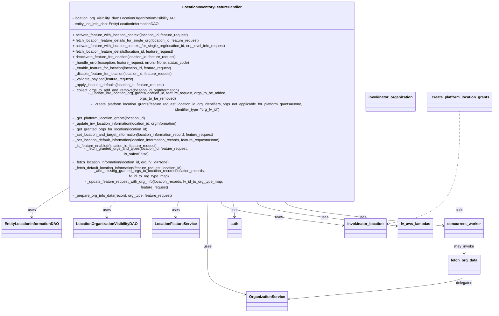

# Diagram: entity_core/entity_service/entity_inventory/entity_inventory_service/service/location_organization_visibility/location_information.py


> Auto-generated by Obscura crawlers

## Diagram 1



### SVG

<svg id="container" width="2106.9296875" xmlns="http://www.w3.org/2000/svg" class="classDiagram" height="1234" viewBox="0 0 2106.9296875 1234" role="graphics-document document" aria-roledescription="class"><style>#container{font-family:"trebuchet ms",verdana,arial,sans-serif;font-size:16px;fill:#333;}@keyframes edge-animation-frame{from{stroke-dashoffset:0;}}@keyframes dash{to{stroke-dashoffset:0;}}#container .edge-animation-slow{stroke-dasharray:9,5!important;stroke-dashoffset:900;animation:dash 50s linear infinite;stroke-linecap:round;}#container .edge-animation-fast{stroke-dasharray:9,5!important;stroke-dashoffset:900;animation:dash 20s linear infinite;stroke-linecap:round;}#container .error-icon{fill:#552222;}#container .error-text{fill:#552222;stroke:#552222;}#container .edge-thickness-normal{stroke-width:1px;}#container .edge-thickness-thick{stroke-width:3.5px;}#container .edge-pattern-solid{stroke-dasharray:0;}#container .edge-thickness-invisible{stroke-width:0;fill:none;}#container .edge-pattern-dashed{stroke-dasharray:3;}#container .edge-pattern-dotted{stroke-dasharray:2;}#container .marker{fill:#333333;stroke:#333333;}#container .marker.cross{stroke:#333333;}#container svg{font-family:"trebuchet ms",verdana,arial,sans-serif;font-size:16px;}#container p{margin:0;}#container g.classGroup text{fill:#9370DB;stroke:none;font-family:"trebuchet ms",verdana,arial,sans-serif;font-size:10px;}#container g.classGroup text .title{font-weight:bolder;}#container .nodeLabel,#container .edgeLabel{color:#131300;}#container .edgeLabel .label rect{fill:#ECECFF;}#container .label text{fill:#131300;}#container .labelBkg{background:#ECECFF;}#container .edgeLabel .label span{background:#ECECFF;}#container .classTitle{font-weight:bolder;}#container .node rect,#container .node circle,#container .node ellipse,#container .node polygon,#container .node path{fill:#ECECFF;stroke:#9370DB;stroke-width:1px;}#container .divider{stroke:#9370DB;stroke-width:1;}#container g.clickable{cursor:pointer;}#container g.classGroup rect{fill:#ECECFF;stroke:#9370DB;}#container g.classGroup line{stroke:#9370DB;stroke-width:1;}#container .classLabel .box{stroke:none;stroke-width:0;fill:#ECECFF;opacity:0.5;}#container .classLabel .label{fill:#9370DB;font-size:10px;}#container .relation{stroke:#333333;stroke-width:1;fill:none;}#container .dashed-line{stroke-dasharray:3;}#container .dotted-line{stroke-dasharray:1 2;}#container #compositionStart,#container .composition{fill:#333333!important;stroke:#333333!important;stroke-width:1;}#container #compositionEnd,#container .composition{fill:#333333!important;stroke:#333333!important;stroke-width:1;}#container #dependencyStart,#container .dependency{fill:#333333!important;stroke:#333333!important;stroke-width:1;}#container #dependencyStart,#container .dependency{fill:#333333!important;stroke:#333333!important;stroke-width:1;}#container #extensionStart,#container .extension{fill:transparent!important;stroke:#333333!important;stroke-width:1;}#container #extensionEnd,#container .extension{fill:transparent!important;stroke:#333333!important;stroke-width:1;}#container #aggregationStart,#container .aggregation{fill:transparent!important;stroke:#333333!important;stroke-width:1;}#container #aggregationEnd,#container .aggregation{fill:transparent!important;stroke:#333333!important;stroke-width:1;}#container #lollipopStart,#container .lollipop{fill:#ECECFF!important;stroke:#333333!important;stroke-width:1;}#container #lollipopEnd,#container .lollipop{fill:#ECECFF!important;stroke:#333333!important;stroke-width:1;}#container .edgeTerminals{font-size:11px;line-height:initial;}#container .classTitleText{text-anchor:middle;font-size:18px;fill:#333;}#container .label-icon{display:inline-block;height:1em;overflow:visible;vertical-align:-0.125em;}#container .node .label-icon path{fill:currentColor;stroke:revert;stroke-width:revert;}#container :root{--mermaid-font-family:"trebuchet ms",verdana,arial,sans-serif;}</style><g><defs><marker id="container_class-aggregationStart" class="marker aggregation class" refX="18" refY="7" markerWidth="190" markerHeight="240" orient="auto"><path d="M 18,7 L9,13 L1,7 L9,1 Z"></path></marker></defs><defs><marker id="container_class-aggregationEnd" class="marker aggregation class" refX="1" refY="7" markerWidth="20" markerHeight="28" orient="auto"><path d="M 18,7 L9,13 L1,7 L9,1 Z"></path></marker></defs><defs><marker id="container_class-extensionStart" class="marker extension class" refX="18" refY="7" markerWidth="190" markerHeight="240" orient="auto"><path d="M 1,7 L18,13 V 1 Z"></path></marker></defs><defs><marker id="container_class-extensionEnd" class="marker extension class" refX="1" refY="7" markerWidth="20" markerHeight="28" orient="auto"><path d="M 1,1 V 13 L18,7 Z"></path></marker></defs><defs><marker id="container_class-compositionStart" class="marker composition class" refX="18" refY="7" markerWidth="190" markerHeight="240" orient="auto"><path d="M 18,7 L9,13 L1,7 L9,1 Z"></path></marker></defs><defs><marker id="container_class-compositionEnd" class="marker composition class" refX="1" refY="7" markerWidth="20" markerHeight="28" orient="auto"><path d="M 18,7 L9,13 L1,7 L9,1 Z"></path></marker></defs><defs><marker id="container_class-dependencyStart" class="marker dependency class" refX="6" refY="7" markerWidth="190" markerHeight="240" orient="auto"><path d="M 5,7 L9,13 L1,7 L9,1 Z"></path></marker></defs><defs><marker id="container_class-dependencyEnd" class="marker dependency class" refX="13" refY="7" markerWidth="20" markerHeight="28" orient="auto"><path d="M 18,7 L9,13 L14,7 L9,1 Z"></path></marker></defs><defs><marker id="container_class-lollipopStart" class="marker lollipop class" refX="13" refY="7" markerWidth="190" markerHeight="240" orient="auto"><circle stroke="black" fill="transparent" cx="7" cy="7" r="6"></circle></marker></defs><defs><marker id="container_class-lollipopEnd" class="marker lollipop class" refX="1" refY="7" markerWidth="190" markerHeight="240" orient="auto"><circle stroke="black" fill="transparent" cx="7" cy="7" r="6"></circle></marker></defs><g class="root"><g class="clusters"></g><g class="edgePaths"><path d="M233.875,732.732L216.78,742.11C199.685,751.488,165.495,770.244,148.4,784.789C131.305,799.333,131.305,809.667,131.305,814.833L131.305,820" id="id_LocationInventoryFeatureHandler_EntityLocationInformationDAO_1" class="edge-thickness-normal edge-pattern-solid relation" style=";;;" data-edge="true" data-et="edge" data-id="id_LocationInventoryFeatureHandler_EntityLocationInformationDAO_1" data-points="W3sieCI6MjMzLjg3NSwieSI6NzMyLjczMjM2NTgwODI5Mzh9LHsieCI6MTMxLjMwNDY4NzUsInkiOjc4OX0seyJ4IjoxMzEuMzA0Njg3NSwieSI6ODI2fV0=" marker-end="url(#container_class-dependencyEnd)"></path><path d="M481.099,752L474.538,758.167C467.977,764.333,454.856,776.667,448.295,788C441.734,799.333,441.734,809.667,441.734,814.833L441.734,820" id="id_LocationInventoryFeatureHandler_LocationOrganizationVisibilityDAO_2" class="edge-thickness-normal edge-pattern-solid relation" style=";;;" data-edge="true" data-et="edge" data-id="id_LocationInventoryFeatureHandler_LocationOrganizationVisibilityDAO_2" data-points="W3sieCI6NDgxLjA5ODgyMTQzOTQ4NjUsInkiOjc1Mn0seyJ4Ijo0NDEuNzM0Mzc1LCJ5Ijo3ODl9LHsieCI6NDQxLjczNDM3NSwieSI6ODI2fV0=" marker-end="url(#container_class-dependencyEnd)"></path><path d="M739.869,752L737.598,758.167C735.327,764.333,730.784,776.667,728.513,788C726.242,799.333,726.242,809.667,726.242,814.833L726.242,820" id="id_LocationInventoryFeatureHandler_LocationFeatureService_3" class="edge-thickness-normal edge-pattern-solid relation" style=";;;" data-edge="true" data-et="edge" data-id="id_LocationInventoryFeatureHandler_LocationFeatureService_3" data-points="W3sieCI6NzM5Ljg2ODc2MzM3MTAyNywieSI6NzUyfSx7IngiOjcyNi4yNDIxODc1LCJ5Ijo3ODl9LHsieCI6NzI2LjI0MjE4NzUsInkiOjgyNn1d" marker-end="url(#container_class-dependencyEnd)"></path><path d="M860.276,752L860.001,758.167C859.725,764.333,859.175,776.667,858.9,796C858.625,815.333,858.625,841.667,858.625,868C858.625,894.333,858.625,920.667,858.625,947C858.625,973.333,858.625,999.667,858.625,1026C858.625,1052.333,858.625,1078.667,889.465,1100.656C920.306,1122.645,981.986,1140.29,1012.827,1149.113L1043.667,1157.935" id="id_LocationInventoryFeatureHandler_OrganizationService_4" class="edge-thickness-normal edge-pattern-solid relation" style=";;;" data-edge="true" data-et="edge" data-id="id_LocationInventoryFeatureHandler_OrganizationService_4" data-points="W3sieCI6ODYwLjI3NTYyNDYxNzk3MDYsInkiOjc1Mn0seyJ4Ijo4NTguNjI1LCJ5Ijo3ODl9LHsieCI6ODU4LjYyNSwieSI6ODY4fSx7IngiOjg1OC42MjUsInkiOjk0N30seyJ4Ijo4NTguNjI1LCJ5IjoxMDI2fSx7IngiOjg1OC42MjUsInkiOjExMDV9LHsieCI6MTA0OS40MzU1NDY4NzUsInkiOjExNTkuNTg1NTQ2NDYzMzUzNX1d" marker-end="url(#container_class-dependencyEnd)"></path><path d="M940.327,752L941.379,758.167C942.431,764.333,944.535,776.667,1034.363,794.039C1124.19,811.412,1301.742,833.824,1390.518,845.029L1479.293,856.235" id="id_LocationInventoryFeatureHandler_invokinator_location_5" class="edge-thickness-normal edge-pattern-solid relation" style=";;;" data-edge="true" data-et="edge" data-id="id_LocationInventoryFeatureHandler_invokinator_location_5" data-points="W3sieCI6OTQwLjMyNzE3OTQ3NzM4MzksInkiOjc1Mn0seyJ4Ijo5NDYuNjM4NjcxODc1LCJ5Ijo3ODl9LHsieCI6MTQ4NS4yNDYwOTM3NSwieSI6ODU2Ljk4NjcwODg1ODc4NDR9XQ==" marker-end="url(#container_class-dependencyEnd)"></path><path d="M988.518,752L990.369,758.167C992.22,764.333,995.921,776.667,997.772,788C999.623,799.333,999.623,809.667,999.623,814.833L999.623,820" id="id_LocationInventoryFeatureHandler_auth_6" class="edge-thickness-normal edge-pattern-solid relation" style=";;;" data-edge="true" data-et="edge" data-id="id_LocationInventoryFeatureHandler_auth_6" data-points="W3sieCI6OTg4LjUxODM0Njk1OTA0NjQsInkiOjc1Mn0seyJ4Ijo5OTkuNjIzMDQ2ODc1LCJ5Ijo3ODl9LHsieCI6OTk5LjYyMzA0Njg3NSwieSI6ODI2fV0=" marker-end="url(#container_class-dependencyEnd)"></path><path d="M1086.894,752L1090.375,758.167C1093.857,764.333,1100.82,776.667,1203.636,794.476C1306.451,812.285,1505.119,835.57,1604.453,847.213L1703.787,858.855" id="id_LocationInventoryFeatureHandler_fv_aws_lambdas_7" class="edge-thickness-normal edge-pattern-solid relation" style=";;;" data-edge="true" data-et="edge" data-id="id_LocationInventoryFeatureHandler_fv_aws_lambdas_7" data-points="W3sieCI6MTA4Ni44OTM4NDM1OTcxODgyLCJ5Ijo3NTJ9LHsieCI6MTEwNy43ODMyMDMxMjUsInkiOjc4OX0seyJ4IjoxNzA5Ljc0NjA5Mzc1LCJ5Ijo4NTkuNTUzODIzMzczNDQ3Mn1d" marker-end="url(#container_class-dependencyEnd)"></path><path d="M1203.517,752L1208.932,758.167C1214.347,764.333,1225.176,776.667,1340.907,794.465C1456.639,812.263,1677.271,835.526,1787.588,847.157L1897.904,858.788" id="id_LocationInventoryFeatureHandler_concurrent_worker_8" class="edge-thickness-normal edge-pattern-solid relation" style=";;;" data-edge="true" data-et="edge" data-id="id_LocationInventoryFeatureHandler_concurrent_worker_8" data-points="W3sieCI6MTIwMy41MTY4OTUyNDc1NTUsInkiOjc1Mn0seyJ4IjoxMjM2LjAwNTg1OTM3NSwieSI6Nzg5fSx7IngiOjE5MDMuODcxMDkzNzUsInkiOjg1OS40MTc2MDUzMDUyMDg2fV0=" marker-end="url(#container_class-dependencyEnd)"></path><path d="M1985.27,910L1985.27,916.167C1985.27,922.333,1985.27,934.667,1985.27,946C1985.27,957.333,1985.27,967.667,1985.27,972.833L1985.27,978" id="id_concurrent_worker_fetch_org_data_9" class="edge-thickness-normal edge-pattern-dashed relation" style=";;;" data-edge="true" data-et="edge" data-id="id_concurrent_worker_fetch_org_data_9" data-points="W3sieCI6MTk4NS4yNjk1MzEyNSwieSI6OTEwfSx7IngiOjE5ODUuMjY5NTMxMjUsInkiOjk0N30seyJ4IjoxOTg1LjI2OTUzMTI1LCJ5Ijo5ODR9XQ==" marker-end="url(#container_class-dependencyEnd)"></path><path d="M1962.625,422L1962.625,483.167C1962.625,544.333,1962.625,666.667,1913.125,737.857C1863.626,809.047,1764.626,829.094,1715.126,839.118L1665.627,849.141" id="id__create_platform_location_grants_invokinator_location_10" class="edge-thickness-normal edge-pattern-dashed relation" style=";;;" data-edge="true" data-et="edge" data-id="id__create_platform_location_grants_invokinator_location_10" data-points="W3sieCI6MTk2Mi42MjUsInkiOjQyMn0seyJ4IjoxOTYyLjYyNSwieSI6Nzg5fSx7IngiOjE2NTkuNzQ2MDkzNzUsInkiOjg1MC4zMzIxMjE3OTQ2NzkyfV0=" marker-end="url(#container_class-dependencyEnd)"></path><path d="M1985.27,1068L1985.27,1074.167C1985.27,1080.333,1985.27,1092.667,1858.741,1110.586C1732.212,1128.506,1479.155,1152.012,1352.626,1163.765L1226.097,1175.518" id="id_fetch_org_data_OrganizationService_11" class="edge-thickness-normal edge-pattern-solid relation" style=";;;" data-edge="true" data-et="edge" data-id="id_fetch_org_data_OrganizationService_11" data-points="W3sieCI6MTk4NS4yNjk1MzEyNSwieSI6MTA2OH0seyJ4IjoxOTg1LjI2OTUzMTI1LCJ5IjoxMTA1fSx7IngiOjEyMjAuMTIzMDQ2ODc1LCJ5IjoxMTc2LjA3MjYyMzU1NTgwNzd9XQ==" marker-end="url(#container_class-dependencyEnd)"></path></g><g class="edgeLabels"><g class="edgeLabel" transform="translate(131.3046875, 789)"><g class="label" data-id="id_LocationInventoryFeatureHandler_EntityLocationInformationDAO_1" transform="translate(-16.4921875, -12)"><foreignObject width="32.984375" height="24"><div xmlns="http://www.w3.org/1999/xhtml" class="labelBkg" style="display: table-cell; white-space: nowrap; line-height: 1.5; max-width: 200px; text-align: center;"><span class="edgeLabel"><p>uses</p></span></div></foreignObject></g></g><g class="edgeLabel" transform="translate(441.734375, 789)"><g class="label" data-id="id_LocationInventoryFeatureHandler_LocationOrganizationVisibilityDAO_2" transform="translate(-16.4921875, -12)"><foreignObject width="32.984375" height="24"><div xmlns="http://www.w3.org/1999/xhtml" class="labelBkg" style="display: table-cell; white-space: nowrap; line-height: 1.5; max-width: 200px; text-align: center;"><span class="edgeLabel"><p>uses</p></span></div></foreignObject></g></g><g class="edgeLabel" transform="translate(726.2421875, 789)"><g class="label" data-id="id_LocationInventoryFeatureHandler_LocationFeatureService_3" transform="translate(-16.4921875, -12)"><foreignObject width="32.984375" height="24"><div xmlns="http://www.w3.org/1999/xhtml" class="labelBkg" style="display: table-cell; white-space: nowrap; line-height: 1.5; max-width: 200px; text-align: center;"><span class="edgeLabel"><p>uses</p></span></div></foreignObject></g></g><g class="edgeLabel" transform="translate(858.625, 947)"><g class="label" data-id="id_LocationInventoryFeatureHandler_OrganizationService_4" transform="translate(-16.4921875, -12)"><foreignObject width="32.984375" height="24"><div xmlns="http://www.w3.org/1999/xhtml" class="labelBkg" style="display: table-cell; white-space: nowrap; line-height: 1.5; max-width: 200px; text-align: center;"><span class="edgeLabel"><p>uses</p></span></div></foreignObject></g></g><g class="edgeLabel" transform="translate(1197.32291, 820.64308)"><g class="label" data-id="id_LocationInventoryFeatureHandler_invokinator_location_5" transform="translate(-16.4921875, -12)"><foreignObject width="32.984375" height="24"><div xmlns="http://www.w3.org/1999/xhtml" class="labelBkg" style="display: table-cell; white-space: nowrap; line-height: 1.5; max-width: 200px; text-align: center;"><span class="edgeLabel"><p>uses</p></span></div></foreignObject></g></g><g class="edgeLabel" transform="translate(999.623046875, 789)"><g class="label" data-id="id_LocationInventoryFeatureHandler_auth_6" transform="translate(-16.4921875, -12)"><foreignObject width="32.984375" height="24"><div xmlns="http://www.w3.org/1999/xhtml" class="labelBkg" style="display: table-cell; white-space: nowrap; line-height: 1.5; max-width: 200px; text-align: center;"><span class="edgeLabel"><p>uses</p></span></div></foreignObject></g></g><g class="edgeLabel" transform="translate(1387.66429, 821.80382)"><g class="label" data-id="id_LocationInventoryFeatureHandler_fv_aws_lambdas_7" transform="translate(-16.4921875, -12)"><foreignObject width="32.984375" height="24"><div xmlns="http://www.w3.org/1999/xhtml" class="labelBkg" style="display: table-cell; white-space: nowrap; line-height: 1.5; max-width: 200px; text-align: center;"><span class="edgeLabel"><p>uses</p></span></div></foreignObject></g></g><g class="edgeLabel" transform="translate(1545.45442, 821.62728)"><g class="label" data-id="id_LocationInventoryFeatureHandler_concurrent_worker_8" transform="translate(-16.4921875, -12)"><foreignObject width="32.984375" height="24"><div xmlns="http://www.w3.org/1999/xhtml" class="labelBkg" style="display: table-cell; white-space: nowrap; line-height: 1.5; max-width: 200px; text-align: center;"><span class="edgeLabel"><p>uses</p></span></div></foreignObject></g></g><g class="edgeLabel" transform="translate(1985.26953125, 947)"><g class="label" data-id="id_concurrent_worker_fetch_org_data_9" transform="translate(-42.796875, -12)"><foreignObject width="85.59375" height="24"><div xmlns="http://www.w3.org/1999/xhtml" class="labelBkg" style="display: table-cell; white-space: nowrap; line-height: 1.5; max-width: 200px; text-align: center;"><span class="edgeLabel"><p>may_invoke</p></span></div></foreignObject></g></g><g class="edgeLabel" transform="translate(1962.625, 789)"><g class="label" data-id="id__create_platform_location_grants_invokinator_location_10" transform="translate(-16.4453125, -12)"><foreignObject width="32.890625" height="24"><div xmlns="http://www.w3.org/1999/xhtml" class="labelBkg" style="display: table-cell; white-space: nowrap; line-height: 1.5; max-width: 200px; text-align: center;"><span class="edgeLabel"><p>calls</p></span></div></foreignObject></g></g><g class="edgeLabel" transform="translate(1985.26953125, 1105)"><g class="label" data-id="id_fetch_org_data_OrganizationService_11" transform="translate(-35.0390625, -12)"><foreignObject width="70.078125" height="24"><div xmlns="http://www.w3.org/1999/xhtml" class="labelBkg" style="display: table-cell; white-space: nowrap; line-height: 1.5; max-width: 200px; text-align: center;"><span class="edgeLabel"><p>delegates</p></span></div></foreignObject></g></g></g><g class="nodes"><g class="node default" id="classId-LocationInventoryFeatureHandler-0" transform="translate(876.87109375, 380)"><g class="basic label-container"><path d="M-642.99609375 -372 L642.99609375 -372 L642.99609375 372 L-642.99609375 372" stroke="none" stroke-width="0" fill="#ECECFF" style=""></path><path d="M-642.99609375 -372 C-240.2529619013511 -372, 162.49016994729777 -372, 642.99609375 -372 M-642.99609375 -372 C-308.61785296442935 -372, 25.760387821141308 -372, 642.99609375 -372 M642.99609375 -372 C642.99609375 -85.26203665815967, 642.99609375 201.47592668368065, 642.99609375 372 M642.99609375 -372 C642.99609375 -204.5264578395842, 642.99609375 -37.05291567916839, 642.99609375 372 M642.99609375 372 C382.92208210023375 372, 122.8480704504675 372, -642.99609375 372 M642.99609375 372 C136.2661940927659 372, -370.4637055644682 372, -642.99609375 372 M-642.99609375 372 C-642.99609375 101.78919541312291, -642.99609375 -168.42160917375418, -642.99609375 -372 M-642.99609375 372 C-642.99609375 128.59328662395185, -642.99609375 -114.81342675209629, -642.99609375 -372" stroke="#9370DB" stroke-width="1.3" fill="none" stroke-dasharray="0 0" style=""></path></g><g class="annotation-group text" transform="translate(0, -348)"></g><g class="label-group text" transform="translate(-122.7734375, -348)"><g class="label" style="font-weight: bolder" transform="translate(0,-12)"><foreignObject width="245.546875" height="24"><div xmlns="http://www.w3.org/1999/xhtml" style="display: table-cell; white-space: nowrap; line-height: 1.5; max-width: 294px; text-align: center;"><span class="nodeLabel markdown-node-label" style=""><p>LocationInventoryFeatureHandler</p></span></div></foreignObject></g></g><g class="members-group text" transform="translate(-630.99609375, -300)"><g class="label" style="" transform="translate(0,-12)"><foreignObject width="460.3125" height="24"><div xmlns="http://www.w3.org/1999/xhtml" style="display: table-cell; white-space: nowrap; line-height: 1.5; max-width: 518px; text-align: center;"><span class="nodeLabel markdown-node-label" style=""><p>- location_org_visibility_dao: LocationOrganizationVisibilityDAO</p></span></div></foreignObject></g><g class="label" style="" transform="translate(0,12)"><foreignObject width="382.265625" height="24"><div xmlns="http://www.w3.org/1999/xhtml" style="display: table-cell; white-space: nowrap; line-height: 1.5; max-width: 440px; text-align: center;"><span class="nodeLabel markdown-node-label" style=""><p>- entity_loc_info_dao: EntityLocationInformationDAO</p></span></div></foreignObject></g></g><g class="methods-group text" transform="translate(-630.99609375, -228)"><g class="label" style="" transform="translate(0,-12)"><foreignObject width="512.15625" height="24"><div xmlns="http://www.w3.org/1999/xhtml" style="display: table-cell; white-space: nowrap; line-height: 1.5; max-width: 570px; text-align: center;"><span class="nodeLabel markdown-node-label" style=""><p>+ activate_feature_with_location_context(location_id, feature_request)</p></span></div></foreignObject></g><g class="label" style="" transform="translate(0,12)"><foreignObject width="557.953125" height="24"><div xmlns="http://www.w3.org/1999/xhtml" style="display: table-cell; white-space: nowrap; line-height: 1.5; max-width: 615px; text-align: center;"><span class="nodeLabel markdown-node-label" style=""><p>+ fetch_location_feature_details_for_single_org(location_id, feature_request)</p></span></div></foreignObject></g><g class="label" style="" transform="translate(0,36)"><foreignObject width="673.296875" height="24"><div xmlns="http://www.w3.org/1999/xhtml" style="display: table-cell; white-space: nowrap; line-height: 1.5; max-width: 731px; text-align: center;"><span class="nodeLabel markdown-node-label" style=""><p>+ activate_feature_with_location_context_for_single_org(location_id, org_level_info_request)</p></span></div></foreignObject></g><g class="label" style="" transform="translate(0,60)"><foreignObject width="448.234375" height="24"><div xmlns="http://www.w3.org/1999/xhtml" style="display: table-cell; white-space: nowrap; line-height: 1.5; max-width: 506px; text-align: center;"><span class="nodeLabel markdown-node-label" style=""><p>+ fetch_location_feature_details(location_id, feature_request)</p></span></div></foreignObject></g><g class="label" style="" transform="translate(0,84)"><foreignObject width="456.890625" height="24"><div xmlns="http://www.w3.org/1999/xhtml" style="display: table-cell; white-space: nowrap; line-height: 1.5; max-width: 514px; text-align: center;"><span class="nodeLabel markdown-node-label" style=""><p>+ deactivate_feature_for_location(location_id, feature_request)</p></span></div></foreignObject></g><g class="label" style="" transform="translate(0,108)"><foreignObject width="510.40625" height="24"><div xmlns="http://www.w3.org/1999/xhtml" style="display: table-cell; white-space: nowrap; line-height: 1.5; max-width: 568px; text-align: center;"><span class="nodeLabel markdown-node-label" style=""><p>- _handle_error(exception, feature_request, errors=None, status_code)</p></span></div></foreignObject></g><g class="label" style="" transform="translate(0,132)"><foreignObject width="437.640625" height="24"><div xmlns="http://www.w3.org/1999/xhtml" style="display: table-cell; white-space: nowrap; line-height: 1.5; max-width: 495px; text-align: center;"><span class="nodeLabel markdown-node-label" style=""><p>- _enable_feature_for_location(location_id, feature_request)</p></span></div></foreignObject></g><g class="label" style="" transform="translate(0,156)"><foreignObject width="440.9375" height="24"><div xmlns="http://www.w3.org/1999/xhtml" style="display: table-cell; white-space: nowrap; line-height: 1.5; max-width: 498px; text-align: center;"><span class="nodeLabel markdown-node-label" style=""><p>- _disable_feature_for_location(location_id, feature_request)</p></span></div></foreignObject></g><g class="label" style="" transform="translate(0,180)"><foreignObject width="267.765625" height="24"><div xmlns="http://www.w3.org/1999/xhtml" style="display: table-cell; white-space: nowrap; line-height: 1.5; max-width: 325px; text-align: center;"><span class="nodeLabel markdown-node-label" style=""><p>- _validate_payload(feature_request)</p></span></div></foreignObject></g><g class="label" style="" transform="translate(0,204)"><foreignObject width="408.125" height="24"><div xmlns="http://www.w3.org/1999/xhtml" style="display: table-cell; white-space: nowrap; line-height: 1.5; max-width: 465px; text-align: center;"><span class="nodeLabel markdown-node-label" style=""><p>- _apply_location_defaults(location_id, feature_request)</p></span></div></foreignObject></g><g class="label" style="" transform="translate(0,228)"><foreignObject width="471.59375" height="24"><div xmlns="http://www.w3.org/1999/xhtml" style="display: table-cell; white-space: nowrap; line-height: 1.5; max-width: 529px; text-align: center;"><span class="nodeLabel markdown-node-label" style=""><p>- _collect_orgs_to_add_and_remove(location_id, orgInformation)</p></span></div></foreignObject></g><g class="label" style="" transform="translate(0,252)"><foreignObject width="768.171875" height="24"><div xmlns="http://www.w3.org/1999/xhtml" style="display: table-cell; white-space: nowrap; line-height: 1.5; max-width: 826px; text-align: center;"><span class="nodeLabel markdown-node-label" style=""><p>- _update_inv_location_org_grants(location_id, feature_request, orgs_to_be_added, orgs_to_be_removed)</p></span></div></foreignObject></g><g class="label" style="" transform="translate(0,276)"><foreignObject width="1139.21875" height="24"><div xmlns="http://www.w3.org/1999/xhtml" style="display: table-cell; white-space: nowrap; line-height: 1.5; max-width: 1197px; text-align: center;"><span class="nodeLabel markdown-node-label" style=""><p>- _create_platform_location_grants(feature_request, location_id, org_identifiers, orgs_not_applicable_for_platform_grants=None, identifier_type="org_fv_id")</p></span></div></foreignObject></g><g class="label" style="" transform="translate(0,300)"><foreignObject width="326.03125" height="24"><div xmlns="http://www.w3.org/1999/xhtml" style="display: table-cell; white-space: nowrap; line-height: 1.5; max-width: 383px; text-align: center;"><span class="nodeLabel markdown-node-label" style=""><p>- _get_platform_location_grants(location_id)</p></span></div></foreignObject></g><g class="label" style="" transform="translate(0,324)"><foreignObject width="470.71875" height="24"><div xmlns="http://www.w3.org/1999/xhtml" style="display: table-cell; white-space: nowrap; line-height: 1.5; max-width: 528px; text-align: center;"><span class="nodeLabel markdown-node-label" style=""><p>- _update_inv_location_information(location_id, orgInformation)</p></span></div></foreignObject></g><g class="label" style="" transform="translate(0,348)"><foreignObject width="331.34375" height="24"><div xmlns="http://www.w3.org/1999/xhtml" style="display: table-cell; white-space: nowrap; line-height: 1.5; max-width: 389px; text-align: center;"><span class="nodeLabel markdown-node-label" style=""><p>- _get_granted_orgs_for_location(location_id)</p></span></div></foreignObject></g><g class="label" style="" transform="translate(0,372)"><foreignObject width="631.015625" height="24"><div xmlns="http://www.w3.org/1999/xhtml" style="display: table-cell; white-space: nowrap; line-height: 1.5; max-width: 688px; text-align: center;"><span class="nodeLabel markdown-node-label" style=""><p>- _set_location_and_target_information(location_information_record, feature_request)</p></span></div></foreignObject></g><g class="label" style="" transform="translate(0,396)"><foreignObject width="658.125" height="24"><div xmlns="http://www.w3.org/1999/xhtml" style="display: table-cell; white-space: nowrap; line-height: 1.5; max-width: 715px; text-align: center;"><span class="nodeLabel markdown-node-label" style=""><p>- _set_location_default_information(location_information_records, feature_request=None)</p></span></div></foreignObject></g><g class="label" style="" transform="translate(0,420)"><foreignObject width="372.765625" height="24"><div xmlns="http://www.w3.org/1999/xhtml" style="display: table-cell; white-space: nowrap; line-height: 1.5; max-width: 430px; text-align: center;"><span class="nodeLabel markdown-node-label" style=""><p>- _is_feature_enabled(location_id, feature_request)</p></span></div></foreignObject></g><g class="label" style="" transform="translate(0,444)"><foreignObject width="558.65625" height="24"><div xmlns="http://www.w3.org/1999/xhtml" style="display: table-cell; white-space: nowrap; line-height: 1.5; max-width: 616px; text-align: center;"><span class="nodeLabel markdown-node-label" style=""><p>- _fetch_granted_orgs_and_types(location_id, feature_request, is_safe=False)</p></span></div></foreignObject></g><g class="label" style="" transform="translate(0,468)"><foreignObject width="430.03125" height="24"><div xmlns="http://www.w3.org/1999/xhtml" style="display: table-cell; white-space: nowrap; line-height: 1.5; max-width: 487px; text-align: center;"><span class="nodeLabel markdown-node-label" style=""><p>- _fetch_location_information(location_id, org_fv_id=None)</p></span></div></foreignObject></g><g class="label" style="" transform="translate(0,492)"><foreignObject width="491.90625" height="24"><div xmlns="http://www.w3.org/1999/xhtml" style="display: table-cell; white-space: nowrap; line-height: 1.5; max-width: 549px; text-align: center;"><span class="nodeLabel markdown-node-label" style=""><p>- _fetch_default_location_information(feature_request, location_id)</p></span></div></foreignObject></g><g class="label" style="" transform="translate(0,516)"><foreignObject width="673.921875" height="24"><div xmlns="http://www.w3.org/1999/xhtml" style="display: table-cell; white-space: nowrap; line-height: 1.5; max-width: 731px; text-align: center;"><span class="nodeLabel markdown-node-label" style=""><p>- _add_missing_granted_orgs_to_location_records(location_records, fv_id_to_org_type_map)</p></span></div></foreignObject></g><g class="label" style="" transform="translate(0,540)"><foreignObject width="732.484375" height="24"><div xmlns="http://www.w3.org/1999/xhtml" style="display: table-cell; white-space: nowrap; line-height: 1.5; max-width: 790px; text-align: center;"><span class="nodeLabel markdown-node-label" style=""><p>- _update_feature_request_with_org_info(location_records, fv_id_to_org_type_map, feature_request)</p></span></div></foreignObject></g><g class="label" style="" transform="translate(0,564)"><foreignObject width="435.21875" height="24"><div xmlns="http://www.w3.org/1999/xhtml" style="display: table-cell; white-space: nowrap; line-height: 1.5; max-width: 493px; text-align: center;"><span class="nodeLabel markdown-node-label" style=""><p>- _prepare_org_info_data(record, org_type, feature_request)</p></span></div></foreignObject></g></g><g class="divider" style=""><path d="M-642.99609375 -324 C-203.37465545260147 -324, 236.24678284479705 -324, 642.99609375 -324 M-642.99609375 -324 C-162.76122301130397 -324, 317.47364772739206 -324, 642.99609375 -324" stroke="#9370DB" stroke-width="1.3" fill="none" stroke-dasharray="0 0" style=""></path></g><g class="divider" style=""><path d="M-642.99609375 -252 C-185.2672246469716 -252, 272.4616444560568 -252, 642.99609375 -252 M-642.99609375 -252 C-137.26957427069016 -252, 368.4569452086197 -252, 642.99609375 -252" stroke="#9370DB" stroke-width="1.3" fill="none" stroke-dasharray="0 0" style=""></path></g></g><g class="node default" id="classId-EntityLocationInformationDAO-1" transform="translate(131.3046875, 868)"><g class="basic label-container"><path d="M-123.3046875 -42 L123.3046875 -42 L123.3046875 42 L-123.3046875 42" stroke="none" stroke-width="0" fill="#ECECFF" style=""></path><path d="M-123.3046875 -42 C-44.65986427673677 -42, 33.98495894652646 -42, 123.3046875 -42 M-123.3046875 -42 C-61.09831311270642 -42, 1.1080612745871576 -42, 123.3046875 -42 M123.3046875 -42 C123.3046875 -22.10788617265591, 123.3046875 -2.2157723453118194, 123.3046875 42 M123.3046875 -42 C123.3046875 -16.36537223171626, 123.3046875 9.269255536567478, 123.3046875 42 M123.3046875 42 C72.72245998899331 42, 22.1402324779866 42, -123.3046875 42 M123.3046875 42 C34.55141929142921 42, -54.201848917141575 42, -123.3046875 42 M-123.3046875 42 C-123.3046875 14.977108347456028, -123.3046875 -12.045783305087944, -123.3046875 -42 M-123.3046875 42 C-123.3046875 12.282587684218598, -123.3046875 -17.434824631562805, -123.3046875 -42" stroke="#9370DB" stroke-width="1.3" fill="none" stroke-dasharray="0 0" style=""></path></g><g class="annotation-group text" transform="translate(0, -18)"></g><g class="label-group text" transform="translate(-111.3046875, -18)"><g class="label" style="font-weight: bolder" transform="translate(0,-12)"><foreignObject width="222.609375" height="24"><div xmlns="http://www.w3.org/1999/xhtml" style="display: table-cell; white-space: nowrap; line-height: 1.5; max-width: 270px; text-align: center;"><span class="nodeLabel markdown-node-label" style=""><p>EntityLocationInformationDAO</p></span></div></foreignObject></g></g><g class="members-group text" transform="translate(-111.3046875, 30)"></g><g class="methods-group text" transform="translate(-111.3046875, 60)"></g><g class="divider" style=""><path d="M-123.3046875 6 C-28.55763919131722 6, 66.18940911736556 6, 123.3046875 6 M-123.3046875 6 C-73.34600609634325 6, -23.387324692686505 6, 123.3046875 6" stroke="#9370DB" stroke-width="1.3" fill="none" stroke-dasharray="0 0" style=""></path></g><g class="divider" style=""><path d="M-123.3046875 24 C-38.65389549101597 24, 45.996896517968054 24, 123.3046875 24 M-123.3046875 24 C-66.57531701347456 24, -9.84594652694912 24, 123.3046875 24" stroke="#9370DB" stroke-width="1.3" fill="none" stroke-dasharray="0 0" style=""></path></g></g><g class="node default" id="classId-LocationOrganizationVisibilityDAO-2" transform="translate(441.734375, 868)"><g class="basic label-container"><path d="M-137.125 -42 L137.125 -42 L137.125 42 L-137.125 42" stroke="none" stroke-width="0" fill="#ECECFF" style=""></path><path d="M-137.125 -42 C-40.60730095414078 -42, 55.910398091718434 -42, 137.125 -42 M-137.125 -42 C-78.8571007622989 -42, -20.589201524597797 -42, 137.125 -42 M137.125 -42 C137.125 -18.141520686906183, 137.125 5.716958626187633, 137.125 42 M137.125 -42 C137.125 -23.987807072621145, 137.125 -5.9756141452422895, 137.125 42 M137.125 42 C49.13537018425747 42, -38.854259631485064 42, -137.125 42 M137.125 42 C38.50790216355868 42, -60.109195672882635 42, -137.125 42 M-137.125 42 C-137.125 13.292538552614115, -137.125 -15.41492289477177, -137.125 -42 M-137.125 42 C-137.125 13.15890552400342, -137.125 -15.682188951993162, -137.125 -42" stroke="#9370DB" stroke-width="1.3" fill="none" stroke-dasharray="0 0" style=""></path></g><g class="annotation-group text" transform="translate(0, -18)"></g><g class="label-group text" transform="translate(-125.125, -18)"><g class="label" style="font-weight: bolder" transform="translate(0,-12)"><foreignObject width="250.25" height="24"><div xmlns="http://www.w3.org/1999/xhtml" style="display: table-cell; white-space: nowrap; line-height: 1.5; max-width: 297px; text-align: center;"><span class="nodeLabel markdown-node-label" style=""><p>LocationOrganizationVisibilityDAO</p></span></div></foreignObject></g></g><g class="members-group text" transform="translate(-125.125, 30)"></g><g class="methods-group text" transform="translate(-125.125, 60)"></g><g class="divider" style=""><path d="M-137.125 6 C-75.25197472254922 6, -13.378949445098456 6, 137.125 6 M-137.125 6 C-27.569508549709795 6, 81.98598290058041 6, 137.125 6" stroke="#9370DB" stroke-width="1.3" fill="none" stroke-dasharray="0 0" style=""></path></g><g class="divider" style=""><path d="M-137.125 24 C-55.55877310853985 24, 26.007453782920294 24, 137.125 24 M-137.125 24 C-29.80451810708898 24, 77.51596378582204 24, 137.125 24" stroke="#9370DB" stroke-width="1.3" fill="none" stroke-dasharray="0 0" style=""></path></g></g><g class="node default" id="classId-LocationFeatureService-3" transform="translate(726.2421875, 868)"><g class="basic label-container"><path d="M-97.3828125 -42 L97.3828125 -42 L97.3828125 42 L-97.3828125 42" stroke="none" stroke-width="0" fill="#ECECFF" style=""></path><path d="M-97.3828125 -42 C-39.009474369235875 -42, 19.36386376152825 -42, 97.3828125 -42 M-97.3828125 -42 C-39.78567636128888 -42, 17.811459777422243 -42, 97.3828125 -42 M97.3828125 -42 C97.3828125 -23.588312355930245, 97.3828125 -5.176624711860491, 97.3828125 42 M97.3828125 -42 C97.3828125 -9.076679332234662, 97.3828125 23.846641335530677, 97.3828125 42 M97.3828125 42 C44.40737110172189 42, -8.568070296556215 42, -97.3828125 42 M97.3828125 42 C26.82542442542018 42, -43.73196364915964 42, -97.3828125 42 M-97.3828125 42 C-97.3828125 11.512429296802424, -97.3828125 -18.975141406395153, -97.3828125 -42 M-97.3828125 42 C-97.3828125 18.969392795744017, -97.3828125 -4.061214408511965, -97.3828125 -42" stroke="#9370DB" stroke-width="1.3" fill="none" stroke-dasharray="0 0" style=""></path></g><g class="annotation-group text" transform="translate(0, -18)"></g><g class="label-group text" transform="translate(-85.3828125, -18)"><g class="label" style="font-weight: bolder" transform="translate(0,-12)"><foreignObject width="170.765625" height="24"><div xmlns="http://www.w3.org/1999/xhtml" style="display: table-cell; white-space: nowrap; line-height: 1.5; max-width: 218px; text-align: center;"><span class="nodeLabel markdown-node-label" style=""><p>LocationFeatureService</p></span></div></foreignObject></g></g><g class="members-group text" transform="translate(-85.3828125, 30)"></g><g class="methods-group text" transform="translate(-85.3828125, 60)"></g><g class="divider" style=""><path d="M-97.3828125 6 C-29.971403972149275 6, 37.44000455570145 6, 97.3828125 6 M-97.3828125 6 C-50.47912067251876 6, -3.5754288450375213 6, 97.3828125 6" stroke="#9370DB" stroke-width="1.3" fill="none" stroke-dasharray="0 0" style=""></path></g><g class="divider" style=""><path d="M-97.3828125 24 C-28.92566240104165 24, 39.5314876979167 24, 97.3828125 24 M-97.3828125 24 C-28.032999781979612 24, 41.316812936040776 24, 97.3828125 24" stroke="#9370DB" stroke-width="1.3" fill="none" stroke-dasharray="0 0" style=""></path></g></g><g class="node default" id="classId-OrganizationService-4" transform="translate(1134.779296875, 1184)"><g class="basic label-container"><path d="M-85.34375 -42 L85.34375 -42 L85.34375 42 L-85.34375 42" stroke="none" stroke-width="0" fill="#ECECFF" style=""></path><path d="M-85.34375 -42 C-34.75226007196451 -42, 15.839229856070986 -42, 85.34375 -42 M-85.34375 -42 C-20.949652734445053 -42, 43.444444531109895 -42, 85.34375 -42 M85.34375 -42 C85.34375 -23.082374888322093, 85.34375 -4.164749776644186, 85.34375 42 M85.34375 -42 C85.34375 -22.86209140125588, 85.34375 -3.7241828025117627, 85.34375 42 M85.34375 42 C43.706831660747056 42, 2.069913321494113 42, -85.34375 42 M85.34375 42 C20.543761291167186 42, -44.25622741766563 42, -85.34375 42 M-85.34375 42 C-85.34375 18.600376448342196, -85.34375 -4.799247103315608, -85.34375 -42 M-85.34375 42 C-85.34375 11.716487598726218, -85.34375 -18.567024802547564, -85.34375 -42" stroke="#9370DB" stroke-width="1.3" fill="none" stroke-dasharray="0 0" style=""></path></g><g class="annotation-group text" transform="translate(0, -18)"></g><g class="label-group text" transform="translate(-73.34375, -18)"><g class="label" style="font-weight: bolder" transform="translate(0,-12)"><foreignObject width="146.6875" height="24"><div xmlns="http://www.w3.org/1999/xhtml" style="display: table-cell; white-space: nowrap; line-height: 1.5; max-width: 194px; text-align: center;"><span class="nodeLabel markdown-node-label" style=""><p>OrganizationService</p></span></div></foreignObject></g></g><g class="members-group text" transform="translate(-73.34375, 30)"></g><g class="methods-group text" transform="translate(-73.34375, 60)"></g><g class="divider" style=""><path d="M-85.34375 6 C-23.321919044203725 6, 38.69991191159255 6, 85.34375 6 M-85.34375 6 C-22.917766643681723 6, 39.50821671263655 6, 85.34375 6" stroke="#9370DB" stroke-width="1.3" fill="none" stroke-dasharray="0 0" style=""></path></g><g class="divider" style=""><path d="M-85.34375 24 C-46.25913464324528 24, -7.174519286490565 24, 85.34375 24 M-85.34375 24 C-24.36183051853468 24, 36.62008896293064 24, 85.34375 24" stroke="#9370DB" stroke-width="1.3" fill="none" stroke-dasharray="0 0" style=""></path></g></g><g class="node default" id="classId-invokinator_location-5" transform="translate(1572.49609375, 868)"><g class="basic label-container"><path d="M-87.25 -42 L87.25 -42 L87.25 42 L-87.25 42" stroke="none" stroke-width="0" fill="#ECECFF" style=""></path><path d="M-87.25 -42 C-51.636659424556406 -42, -16.023318849112812 -42, 87.25 -42 M-87.25 -42 C-25.907367429894762 -42, 35.435265140210475 -42, 87.25 -42 M87.25 -42 C87.25 -9.222027923927193, 87.25 23.555944152145614, 87.25 42 M87.25 -42 C87.25 -22.132008249857105, 87.25 -2.2640164997142094, 87.25 42 M87.25 42 C47.46516389158322 42, 7.680327783166433 42, -87.25 42 M87.25 42 C46.71145927262152 42, 6.172918545243036 42, -87.25 42 M-87.25 42 C-87.25 24.373654861466708, -87.25 6.747309722933416, -87.25 -42 M-87.25 42 C-87.25 15.69004962517107, -87.25 -10.619900749657859, -87.25 -42" stroke="#9370DB" stroke-width="1.3" fill="none" stroke-dasharray="0 0" style=""></path></g><g class="annotation-group text" transform="translate(0, -18)"></g><g class="label-group text" transform="translate(-75.25, -18)"><g class="label" style="font-weight: bolder" transform="translate(0,-12)"><foreignObject width="150.5" height="24"><div xmlns="http://www.w3.org/1999/xhtml" style="display: table-cell; white-space: nowrap; line-height: 1.5; max-width: 199px; text-align: center;"><span class="nodeLabel markdown-node-label" style=""><p>invokinator_location</p></span></div></foreignObject></g></g><g class="members-group text" transform="translate(-75.25, 30)"></g><g class="methods-group text" transform="translate(-75.25, 60)"></g><g class="divider" style=""><path d="M-87.25 6 C-40.34874041732855 6, 6.5525191653429005 6, 87.25 6 M-87.25 6 C-38.613963113175934 6, 10.022073773648131 6, 87.25 6" stroke="#9370DB" stroke-width="1.3" fill="none" stroke-dasharray="0 0" style=""></path></g><g class="divider" style=""><path d="M-87.25 24 C-31.23273967182032 24, 24.784520656359362 24, 87.25 24 M-87.25 24 C-18.038169462184257 24, 51.173661075631486 24, 87.25 24" stroke="#9370DB" stroke-width="1.3" fill="none" stroke-dasharray="0 0" style=""></path></g></g><g class="node default" id="classId-invokinator_organization-6" transform="translate(1673.09375, 380)"><g class="basic label-container"><path d="M-103.2265625 -42 L103.2265625 -42 L103.2265625 42 L-103.2265625 42" stroke="none" stroke-width="0" fill="#ECECFF" style=""></path><path d="M-103.2265625 -42 C-43.20385676153532 -42, 16.81884897692936 -42, 103.2265625 -42 M-103.2265625 -42 C-50.94843148664349 -42, 1.3296995267130143 -42, 103.2265625 -42 M103.2265625 -42 C103.2265625 -9.418503266660537, 103.2265625 23.162993466678927, 103.2265625 42 M103.2265625 -42 C103.2265625 -17.9143762148214, 103.2265625 6.1712475703572025, 103.2265625 42 M103.2265625 42 C39.770302036059796 42, -23.685958427880408 42, -103.2265625 42 M103.2265625 42 C28.55251815686364 42, -46.12152618627272 42, -103.2265625 42 M-103.2265625 42 C-103.2265625 23.97634596752689, -103.2265625 5.952691935053778, -103.2265625 -42 M-103.2265625 42 C-103.2265625 11.175710423205324, -103.2265625 -19.648579153589353, -103.2265625 -42" stroke="#9370DB" stroke-width="1.3" fill="none" stroke-dasharray="0 0" style=""></path></g><g class="annotation-group text" transform="translate(0, -18)"></g><g class="label-group text" transform="translate(-91.2265625, -18)"><g class="label" style="font-weight: bolder" transform="translate(0,-12)"><foreignObject width="182.453125" height="24"><div xmlns="http://www.w3.org/1999/xhtml" style="display: table-cell; white-space: nowrap; line-height: 1.5; max-width: 230px; text-align: center;"><span class="nodeLabel markdown-node-label" style=""><p>invokinator_organization</p></span></div></foreignObject></g></g><g class="members-group text" transform="translate(-91.2265625, 30)"></g><g class="methods-group text" transform="translate(-91.2265625, 60)"></g><g class="divider" style=""><path d="M-103.2265625 6 C-42.519587693948914 6, 18.187387112102172 6, 103.2265625 6 M-103.2265625 6 C-54.49509988323224 6, -5.763637266464485 6, 103.2265625 6" stroke="#9370DB" stroke-width="1.3" fill="none" stroke-dasharray="0 0" style=""></path></g><g class="divider" style=""><path d="M-103.2265625 24 C-28.409069043362365 24, 46.40842441327527 24, 103.2265625 24 M-103.2265625 24 C-55.14139618853015 24, -7.056229877060304 24, 103.2265625 24" stroke="#9370DB" stroke-width="1.3" fill="none" stroke-dasharray="0 0" style=""></path></g></g><g class="node default" id="classId-auth-7" transform="translate(999.623046875, 868)"><g class="basic label-container"><path d="M-28.6640625 -42 L28.6640625 -42 L28.6640625 42 L-28.6640625 42" stroke="none" stroke-width="0" fill="#ECECFF" style=""></path><path d="M-28.6640625 -42 C-14.052510695671273 -42, 0.5590411086574534 -42, 28.6640625 -42 M-28.6640625 -42 C-7.109496410317707 -42, 14.445069679364586 -42, 28.6640625 -42 M28.6640625 -42 C28.6640625 -9.96483746641286, 28.6640625 22.07032506717428, 28.6640625 42 M28.6640625 -42 C28.6640625 -9.50109999604549, 28.6640625 22.99780000790902, 28.6640625 42 M28.6640625 42 C6.285361679984973 42, -16.093339140030054 42, -28.6640625 42 M28.6640625 42 C12.532183657556871 42, -3.599695184886258 42, -28.6640625 42 M-28.6640625 42 C-28.6640625 25.178389846945162, -28.6640625 8.356779693890324, -28.6640625 -42 M-28.6640625 42 C-28.6640625 9.634215752119978, -28.6640625 -22.731568495760044, -28.6640625 -42" stroke="#9370DB" stroke-width="1.3" fill="none" stroke-dasharray="0 0" style=""></path></g><g class="annotation-group text" transform="translate(0, -18)"></g><g class="label-group text" transform="translate(-16.6640625, -18)"><g class="label" style="font-weight: bolder" transform="translate(0,-12)"><foreignObject width="33.328125" height="24"><div xmlns="http://www.w3.org/1999/xhtml" style="display: table-cell; white-space: nowrap; line-height: 1.5; max-width: 83px; text-align: center;"><span class="nodeLabel markdown-node-label" style=""><p>auth</p></span></div></foreignObject></g></g><g class="members-group text" transform="translate(-16.6640625, 30)"></g><g class="methods-group text" transform="translate(-16.6640625, 60)"></g><g class="divider" style=""><path d="M-28.6640625 6 C-8.507274231841148 6, 11.649514036317704 6, 28.6640625 6 M-28.6640625 6 C-8.13290918963061 6, 12.39824412073878 6, 28.6640625 6" stroke="#9370DB" stroke-width="1.3" fill="none" stroke-dasharray="0 0" style=""></path></g><g class="divider" style=""><path d="M-28.6640625 24 C-16.7538627667773 24, -4.8436630335545985 24, 28.6640625 24 M-28.6640625 24 C-16.889978881531267 24, -5.115895263062534 24, 28.6640625 24" stroke="#9370DB" stroke-width="1.3" fill="none" stroke-dasharray="0 0" style=""></path></g></g><g class="node default" id="classId-fv_aws_lambdas-8" transform="translate(1781.80859375, 868)"><g class="basic label-container"><path d="M-72.0625 -42 L72.0625 -42 L72.0625 42 L-72.0625 42" stroke="none" stroke-width="0" fill="#ECECFF" style=""></path><path d="M-72.0625 -42 C-40.682441404173076 -42, -9.30238280834616 -42, 72.0625 -42 M-72.0625 -42 C-34.23590254449252 -42, 3.590694911014964 -42, 72.0625 -42 M72.0625 -42 C72.0625 -19.384344487633058, 72.0625 3.231311024733884, 72.0625 42 M72.0625 -42 C72.0625 -17.36925623181605, 72.0625 7.261487536367902, 72.0625 42 M72.0625 42 C31.6995831994521 42, -8.6633336010958 42, -72.0625 42 M72.0625 42 C18.006993690476513 42, -36.048512619046974 42, -72.0625 42 M-72.0625 42 C-72.0625 17.727762497851778, -72.0625 -6.544475004296444, -72.0625 -42 M-72.0625 42 C-72.0625 19.87554999045443, -72.0625 -2.2489000190911383, -72.0625 -42" stroke="#9370DB" stroke-width="1.3" fill="none" stroke-dasharray="0 0" style=""></path></g><g class="annotation-group text" transform="translate(0, -18)"></g><g class="label-group text" transform="translate(-60.0625, -18)"><g class="label" style="font-weight: bolder" transform="translate(0,-12)"><foreignObject width="120.125" height="24"><div xmlns="http://www.w3.org/1999/xhtml" style="display: table-cell; white-space: nowrap; line-height: 1.5; max-width: 168px; text-align: center;"><span class="nodeLabel markdown-node-label" style=""><p>fv_aws_lambdas</p></span></div></foreignObject></g></g><g class="members-group text" transform="translate(-60.0625, 30)"></g><g class="methods-group text" transform="translate(-60.0625, 60)"></g><g class="divider" style=""><path d="M-72.0625 6 C-40.722766820004004 6, -9.383033640008009 6, 72.0625 6 M-72.0625 6 C-41.290585007108106 6, -10.51867001421622 6, 72.0625 6" stroke="#9370DB" stroke-width="1.3" fill="none" stroke-dasharray="0 0" style=""></path></g><g class="divider" style=""><path d="M-72.0625 24 C-40.52966566018195 24, -8.996831320363889 24, 72.0625 24 M-72.0625 24 C-40.12626363641408 24, -8.190027272828168 24, 72.0625 24" stroke="#9370DB" stroke-width="1.3" fill="none" stroke-dasharray="0 0" style=""></path></g></g><g class="node default" id="classId-concurrent_worker-9" transform="translate(1985.26953125, 868)"><g class="basic label-container"><path d="M-81.3984375 -42 L81.3984375 -42 L81.3984375 42 L-81.3984375 42" stroke="none" stroke-width="0" fill="#ECECFF" style=""></path><path d="M-81.3984375 -42 C-19.926818105314894 -42, 41.54480128937021 -42, 81.3984375 -42 M-81.3984375 -42 C-17.210736879708236 -42, 46.97696374058353 -42, 81.3984375 -42 M81.3984375 -42 C81.3984375 -16.316833496432416, 81.3984375 9.366333007135168, 81.3984375 42 M81.3984375 -42 C81.3984375 -9.573828591293505, 81.3984375 22.85234281741299, 81.3984375 42 M81.3984375 42 C24.496815050189625 42, -32.40480739962075 42, -81.3984375 42 M81.3984375 42 C31.919693344174327 42, -17.559050811651346 42, -81.3984375 42 M-81.3984375 42 C-81.3984375 14.958478484733472, -81.3984375 -12.083043030533055, -81.3984375 -42 M-81.3984375 42 C-81.3984375 18.25652115722567, -81.3984375 -5.48695768554866, -81.3984375 -42" stroke="#9370DB" stroke-width="1.3" fill="none" stroke-dasharray="0 0" style=""></path></g><g class="annotation-group text" transform="translate(0, -18)"></g><g class="label-group text" transform="translate(-69.3984375, -18)"><g class="label" style="font-weight: bolder" transform="translate(0,-12)"><foreignObject width="138.796875" height="24"><div xmlns="http://www.w3.org/1999/xhtml" style="display: table-cell; white-space: nowrap; line-height: 1.5; max-width: 187px; text-align: center;"><span class="nodeLabel markdown-node-label" style=""><p>concurrent_worker</p></span></div></foreignObject></g></g><g class="members-group text" transform="translate(-69.3984375, 30)"></g><g class="methods-group text" transform="translate(-69.3984375, 60)"></g><g class="divider" style=""><path d="M-81.3984375 6 C-34.047030398534 6, 13.304376702932004 6, 81.3984375 6 M-81.3984375 6 C-17.985767507114126 6, 45.42690248577175 6, 81.3984375 6" stroke="#9370DB" stroke-width="1.3" fill="none" stroke-dasharray="0 0" style=""></path></g><g class="divider" style=""><path d="M-81.3984375 24 C-41.106436989266925 24, -0.8144364785338496 24, 81.3984375 24 M-81.3984375 24 C-45.9532101685986 24, -10.507982837197204 24, 81.3984375 24" stroke="#9370DB" stroke-width="1.3" fill="none" stroke-dasharray="0 0" style=""></path></g></g><g class="node default" id="classId-fetch_org_data-10" transform="translate(1985.26953125, 1026)"><g class="basic label-container"><path d="M-67.3984375 -42 L67.3984375 -42 L67.3984375 42 L-67.3984375 42" stroke="none" stroke-width="0" fill="#ECECFF" style=""></path><path d="M-67.3984375 -42 C-14.329002704193421 -42, 38.74043209161316 -42, 67.3984375 -42 M-67.3984375 -42 C-38.78963281402986 -42, -10.180828128059716 -42, 67.3984375 -42 M67.3984375 -42 C67.3984375 -14.22073953915445, 67.3984375 13.558520921691098, 67.3984375 42 M67.3984375 -42 C67.3984375 -13.397871487089581, 67.3984375 15.204257025820837, 67.3984375 42 M67.3984375 42 C37.02967510598759 42, 6.660912711975193 42, -67.3984375 42 M67.3984375 42 C29.002784756960324 42, -9.392867986079352 42, -67.3984375 42 M-67.3984375 42 C-67.3984375 8.41372109191635, -67.3984375 -25.1725578161673, -67.3984375 -42 M-67.3984375 42 C-67.3984375 23.440952613630447, -67.3984375 4.881905227260894, -67.3984375 -42" stroke="#9370DB" stroke-width="1.3" fill="none" stroke-dasharray="0 0" style=""></path></g><g class="annotation-group text" transform="translate(0, -18)"></g><g class="label-group text" transform="translate(-55.3984375, -18)"><g class="label" style="font-weight: bolder" transform="translate(0,-12)"><foreignObject width="110.796875" height="24"><div xmlns="http://www.w3.org/1999/xhtml" style="display: table-cell; white-space: nowrap; line-height: 1.5; max-width: 159px; text-align: center;"><span class="nodeLabel markdown-node-label" style=""><p>fetch_org_data</p></span></div></foreignObject></g></g><g class="members-group text" transform="translate(-55.3984375, 30)"></g><g class="methods-group text" transform="translate(-55.3984375, 60)"></g><g class="divider" style=""><path d="M-67.3984375 6 C-23.911281615055465 6, 19.57587426988907 6, 67.3984375 6 M-67.3984375 6 C-33.081637304673436 6, 1.235162890653129 6, 67.3984375 6" stroke="#9370DB" stroke-width="1.3" fill="none" stroke-dasharray="0 0" style=""></path></g><g class="divider" style=""><path d="M-67.3984375 24 C-35.927701727111156 24, -4.456965954222312 24, 67.3984375 24 M-67.3984375 24 C-16.51622722972222 24, 34.36598304055556 24, 67.3984375 24" stroke="#9370DB" stroke-width="1.3" fill="none" stroke-dasharray="0 0" style=""></path></g></g><g class="node default" id="classId-_create_platform_location_grants-11" transform="translate(1962.625, 380)"><g class="basic label-container"><path d="M-136.3046875 -42 L136.3046875 -42 L136.3046875 42 L-136.3046875 42" stroke="none" stroke-width="0" fill="#ECECFF" style=""></path><path d="M-136.3046875 -42 C-47.235270245107515 -42, 41.83414700978497 -42, 136.3046875 -42 M-136.3046875 -42 C-48.641352913232026 -42, 39.02198167353595 -42, 136.3046875 -42 M136.3046875 -42 C136.3046875 -11.595758041856904, 136.3046875 18.808483916286193, 136.3046875 42 M136.3046875 -42 C136.3046875 -10.90613613942731, 136.3046875 20.18772772114538, 136.3046875 42 M136.3046875 42 C29.826355131949413 42, -76.65197723610117 42, -136.3046875 42 M136.3046875 42 C72.1396823120699 42, 7.974677124139788 42, -136.3046875 42 M-136.3046875 42 C-136.3046875 12.579066750952364, -136.3046875 -16.84186649809527, -136.3046875 -42 M-136.3046875 42 C-136.3046875 18.099659268757673, -136.3046875 -5.800681462484654, -136.3046875 -42" stroke="#9370DB" stroke-width="1.3" fill="none" stroke-dasharray="0 0" style=""></path></g><g class="annotation-group text" transform="translate(0, -18)"></g><g class="label-group text" transform="translate(-124.3046875, -18)"><g class="label" style="font-weight: bolder" transform="translate(0,-12)"><foreignObject width="248.609375" height="24"><div xmlns="http://www.w3.org/1999/xhtml" style="display: table-cell; white-space: nowrap; line-height: 1.5; max-width: 295px; text-align: center;"><span class="nodeLabel markdown-node-label" style=""><p>_create_platform_location_grants</p></span></div></foreignObject></g></g><g class="members-group text" transform="translate(-124.3046875, 30)"></g><g class="methods-group text" transform="translate(-124.3046875, 60)"></g><g class="divider" style=""><path d="M-136.3046875 6 C-56.254271151587844 6, 23.796145196824313 6, 136.3046875 6 M-136.3046875 6 C-49.84445854337349 6, 36.61577041325302 6, 136.3046875 6" stroke="#9370DB" stroke-width="1.3" fill="none" stroke-dasharray="0 0" style=""></path></g><g class="divider" style=""><path d="M-136.3046875 24 C-54.73117678644289 24, 26.842333927114225 24, 136.3046875 24 M-136.3046875 24 C-36.830957837987995 24, 62.64277182402401 24, 136.3046875 24" stroke="#9370DB" stroke-width="1.3" fill="none" stroke-dasharray="0 0" style=""></path></g></g></g></g></g></svg>

## Diagram 2

```mermaid
graph TD
A([Start]) --> B[Validate payload]
B -->|valid| C[Enable feature for location]
B -->|invalid| Z[Handle error (_handle_error)]
C --> D[Apply location defaults]
D --> E[Collect orgs to add and remove]
E --> F[Create platform location grants]
F --> G[Update inventory location org grants]
G --> H[Update inventory location information]
H --> I[Build response]
I --> J[Return HTTP 200 OK]
F -->|uses concurrent processing| L[concurrent_worker -> fetch_org_data / invokinator_location]
G --> M[auth.get_actor_email]
```

> SVG rendering failed for this diagram.
