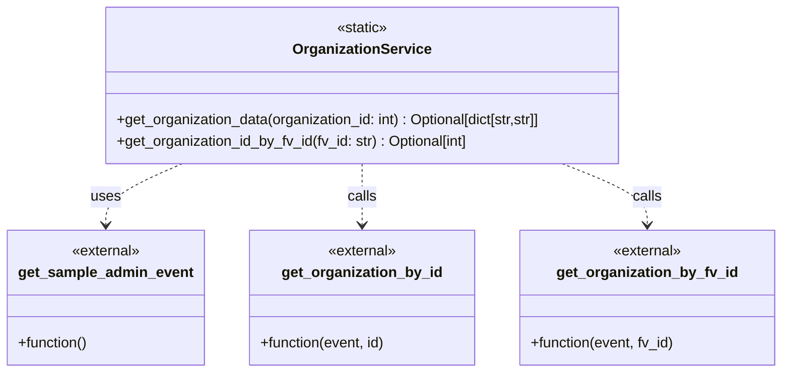

# Diagram: entity_core/entity_service/entity_inventory/entity_inventory_service/service/organization_service.py


> Auto-generated by Obscura crawlers

## Diagram 1



> SVG rendering failed for this diagram.

## Diagram 2

```mermaid
flowchart LR
    A[get_organization_data(organization_id)] --> B[get_sample_admin_event("GET", customer_id=organization_id, use_new_admin_event=True)]
    B --> C[get_organization_by_id(event, organization_id)]
    C --> D{data and isinstance(data, dict)?}
    D -- yes --> E[organization_data = {"fv_id": data.get("fv_id"), "org_type_code": data.get("org_type_code")}]
    D -- no --> F[organization_data = {}]
    E --> G[return organization_data]
    F --> G

    subgraph LookupByFvId
      H[get_organization_id_by_fv_id(fv_id)] --> I[get_sample_admin_event("GET", use_new_admin_event=True)]
      I --> J[get_organization_by_fv_id(event, fv_id)]
      J --> K[return organization_data]
    end
```

> SVG rendering failed for this diagram.
