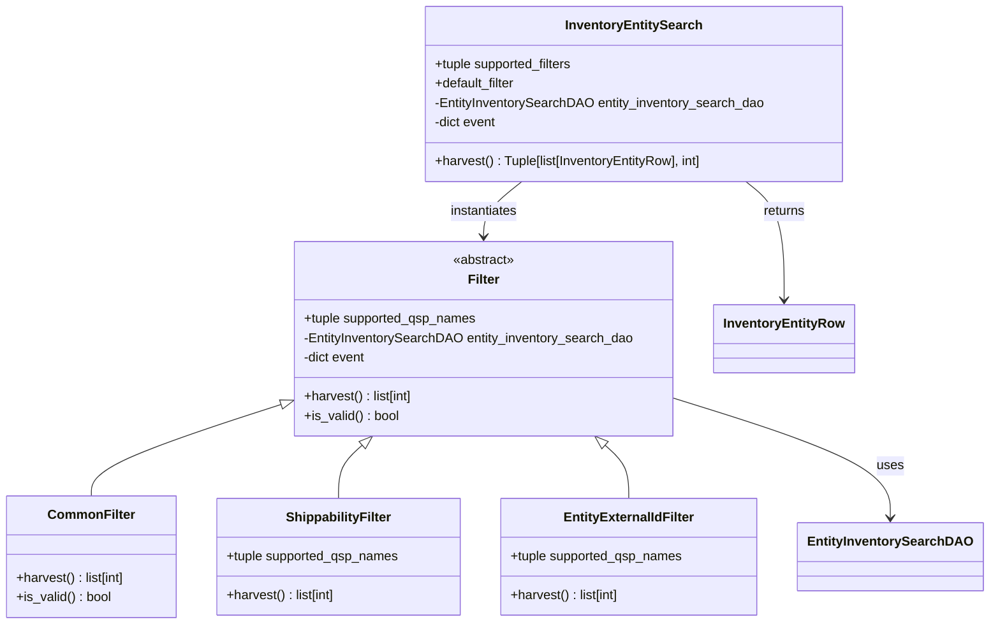

# Diagram: entity_core/entity_service/entity_inventory/entity_inventory_service/service/search_inventory/filters.py


> Auto-generated by Obscura crawlers

## Diagram 1



### SVG

<svg id="container" width="1214.515625" xmlns="http://www.w3.org/2000/svg" class="classDiagram" height="770" viewBox="0 0 1214.515625 770" role="graphics-document document" aria-roledescription="class"><style>#container{font-family:"trebuchet ms",verdana,arial,sans-serif;font-size:16px;fill:#333;}@keyframes edge-animation-frame{from{stroke-dashoffset:0;}}@keyframes dash{to{stroke-dashoffset:0;}}#container .edge-animation-slow{stroke-dasharray:9,5!important;stroke-dashoffset:900;animation:dash 50s linear infinite;stroke-linecap:round;}#container .edge-animation-fast{stroke-dasharray:9,5!important;stroke-dashoffset:900;animation:dash 20s linear infinite;stroke-linecap:round;}#container .error-icon{fill:#552222;}#container .error-text{fill:#552222;stroke:#552222;}#container .edge-thickness-normal{stroke-width:1px;}#container .edge-thickness-thick{stroke-width:3.5px;}#container .edge-pattern-solid{stroke-dasharray:0;}#container .edge-thickness-invisible{stroke-width:0;fill:none;}#container .edge-pattern-dashed{stroke-dasharray:3;}#container .edge-pattern-dotted{stroke-dasharray:2;}#container .marker{fill:#333333;stroke:#333333;}#container .marker.cross{stroke:#333333;}#container svg{font-family:"trebuchet ms",verdana,arial,sans-serif;font-size:16px;}#container p{margin:0;}#container g.classGroup text{fill:#9370DB;stroke:none;font-family:"trebuchet ms",verdana,arial,sans-serif;font-size:10px;}#container g.classGroup text .title{font-weight:bolder;}#container .nodeLabel,#container .edgeLabel{color:#131300;}#container .edgeLabel .label rect{fill:#ECECFF;}#container .label text{fill:#131300;}#container .labelBkg{background:#ECECFF;}#container .edgeLabel .label span{background:#ECECFF;}#container .classTitle{font-weight:bolder;}#container .node rect,#container .node circle,#container .node ellipse,#container .node polygon,#container .node path{fill:#ECECFF;stroke:#9370DB;stroke-width:1px;}#container .divider{stroke:#9370DB;stroke-width:1;}#container g.clickable{cursor:pointer;}#container g.classGroup rect{fill:#ECECFF;stroke:#9370DB;}#container g.classGroup line{stroke:#9370DB;stroke-width:1;}#container .classLabel .box{stroke:none;stroke-width:0;fill:#ECECFF;opacity:0.5;}#container .classLabel .label{fill:#9370DB;font-size:10px;}#container .relation{stroke:#333333;stroke-width:1;fill:none;}#container .dashed-line{stroke-dasharray:3;}#container .dotted-line{stroke-dasharray:1 2;}#container #compositionStart,#container .composition{fill:#333333!important;stroke:#333333!important;stroke-width:1;}#container #compositionEnd,#container .composition{fill:#333333!important;stroke:#333333!important;stroke-width:1;}#container #dependencyStart,#container .dependency{fill:#333333!important;stroke:#333333!important;stroke-width:1;}#container #dependencyStart,#container .dependency{fill:#333333!important;stroke:#333333!important;stroke-width:1;}#container #extensionStart,#container .extension{fill:transparent!important;stroke:#333333!important;stroke-width:1;}#container #extensionEnd,#container .extension{fill:transparent!important;stroke:#333333!important;stroke-width:1;}#container #aggregationStart,#container .aggregation{fill:transparent!important;stroke:#333333!important;stroke-width:1;}#container #aggregationEnd,#container .aggregation{fill:transparent!important;stroke:#333333!important;stroke-width:1;}#container #lollipopStart,#container .lollipop{fill:#ECECFF!important;stroke:#333333!important;stroke-width:1;}#container #lollipopEnd,#container .lollipop{fill:#ECECFF!important;stroke:#333333!important;stroke-width:1;}#container .edgeTerminals{font-size:11px;line-height:initial;}#container .classTitleText{text-anchor:middle;font-size:18px;fill:#333;}#container .label-icon{display:inline-block;height:1em;overflow:visible;vertical-align:-0.125em;}#container .node .label-icon path{fill:currentColor;stroke:revert;stroke-width:revert;}#container :root{--mermaid-font-family:"trebuchet ms",verdana,arial,sans-serif;}</style><g><defs><marker id="container_class-aggregationStart" class="marker aggregation class" refX="18" refY="7" markerWidth="190" markerHeight="240" orient="auto"><path d="M 18,7 L9,13 L1,7 L9,1 Z"></path></marker></defs><defs><marker id="container_class-aggregationEnd" class="marker aggregation class" refX="1" refY="7" markerWidth="20" markerHeight="28" orient="auto"><path d="M 18,7 L9,13 L1,7 L9,1 Z"></path></marker></defs><defs><marker id="container_class-extensionStart" class="marker extension class" refX="18" refY="7" markerWidth="190" markerHeight="240" orient="auto"><path d="M 1,7 L18,13 V 1 Z"></path></marker></defs><defs><marker id="container_class-extensionEnd" class="marker extension class" refX="1" refY="7" markerWidth="20" markerHeight="28" orient="auto"><path d="M 1,1 V 13 L18,7 Z"></path></marker></defs><defs><marker id="container_class-compositionStart" class="marker composition class" refX="18" refY="7" markerWidth="190" markerHeight="240" orient="auto"><path d="M 18,7 L9,13 L1,7 L9,1 Z"></path></marker></defs><defs><marker id="container_class-compositionEnd" class="marker composition class" refX="1" refY="7" markerWidth="20" markerHeight="28" orient="auto"><path d="M 18,7 L9,13 L1,7 L9,1 Z"></path></marker></defs><defs><marker id="container_class-dependencyStart" class="marker dependency class" refX="6" refY="7" markerWidth="190" markerHeight="240" orient="auto"><path d="M 5,7 L9,13 L1,7 L9,1 Z"></path></marker></defs><defs><marker id="container_class-dependencyEnd" class="marker dependency class" refX="13" refY="7" markerWidth="20" markerHeight="28" orient="auto"><path d="M 18,7 L9,13 L14,7 L9,1 Z"></path></marker></defs><defs><marker id="container_class-lollipopStart" class="marker lollipop class" refX="13" refY="7" markerWidth="190" markerHeight="240" orient="auto"><circle stroke="black" fill="transparent" cx="7" cy="7" r="6"></circle></marker></defs><defs><marker id="container_class-lollipopEnd" class="marker lollipop class" refX="1" refY="7" markerWidth="190" markerHeight="240" orient="auto"><circle stroke="black" fill="transparent" cx="7" cy="7" r="6"></circle></marker></defs><g class="root"><g class="clusters"></g><g class="edgePaths"><path d="M349.024,499.307L309.859,511.923C270.694,524.538,192.365,549.769,153.2,568.551C114.035,587.333,114.035,599.667,114.035,605.833L114.035,612" id="id_Filter_CommonFilter_1" class="edge-thickness-normal edge-pattern-solid relation" style=";;;" data-edge="true" data-et="edge" data-id="id_Filter_CommonFilter_1" data-points="W3sieCI6MzY1LjQ0MzM1OTM3NSwieSI6NDk0LjAxODQxNjkyOTQ2OTl9LHsieCI6MTE0LjAzNTE1NjI1LCJ5Ijo1NzV9LHsieCI6MTE0LjAzNTE1NjI1LCJ5Ijo2MTJ9XQ==" marker-start="url(#container_class-extensionStart)"></path><path d="M450.872,549.339L445.969,553.616C441.065,557.893,431.259,566.446,426.356,577.39C421.453,588.333,421.453,601.667,421.453,608.333L421.453,615" id="id_Filter_ShippabilityFilter_2" class="edge-thickness-normal edge-pattern-solid relation" style=";;;" data-edge="true" data-et="edge" data-id="id_Filter_ShippabilityFilter_2" data-points="W3sieCI6NDYzLjg3MTIwNTcxMjU3OTYsInkiOjUzOH0seyJ4Ijo0MjEuNDUzMTI1LCJ5Ijo1NzV9LHsieCI6NDIxLjQ1MzEyNSwieSI6NjE1fV0=" marker-start="url(#container_class-extensionStart)"></path><path d="M752.015,549.339L756.918,553.616C761.821,557.893,771.627,566.446,776.531,577.39C781.434,588.333,781.434,601.667,781.434,608.333L781.434,615" id="id_Filter_EntityExternalIdFilter_3" class="edge-thickness-normal edge-pattern-solid relation" style=";;;" data-edge="true" data-et="edge" data-id="id_Filter_EntityExternalIdFilter_3" data-points="W3sieCI6NzM5LjAxNTUxMzAzNzQyMDQsInkiOjUzOH0seyJ4Ijo3ODEuNDMzNTkzNzUsInkiOjU3NX0seyJ4Ijo3ODEuNDMzNTkzNzUsInkiOjYxNX1d" marker-start="url(#container_class-extensionStart)"></path><path d="M648.614,224L640.753,230.167C632.891,236.333,617.167,248.667,609.305,260C601.443,271.333,601.443,281.667,601.443,286.833L601.443,292" id="id_InventoryEntitySearch_Filter_4" class="edge-thickness-normal edge-pattern-solid relation" style=";;;" data-edge="true" data-et="edge" data-id="id_InventoryEntitySearch_Filter_4" data-points="W3sieCI6NjQ4LjYxNDM3MjMwNjAzNDUsInkiOjIyNH0seyJ4Ijo2MDEuNDQzMzU5Mzc1LCJ5IjoyNjF9LHsieCI6NjAxLjQ0MzM1OTM3NSwieSI6Mjk4fV0=" marker-end="url(#container_class-dependencyEnd)"></path><path d="M837.443,492.577L880.915,506.314C924.387,520.051,1011.33,547.526,1054.802,571.929C1098.273,596.333,1098.273,617.667,1098.273,628.333L1098.273,639" id="id_Filter_EntityInventorySearchDAO_5" class="edge-thickness-normal edge-pattern-solid relation" style=";;;" data-edge="true" data-et="edge" data-id="id_Filter_EntityInventorySearchDAO_5" data-points="W3sieCI6ODM3LjQ0MzM1OTM3NSwieSI6NDkyLjU3NjgwNTI5MjkzMTM0fSx7IngiOjEwOTguMjczNDM3NSwieSI6NTc1fSx7IngiOjEwOTguMjczNDM3NSwieSI6NjQ1fV0=" marker-end="url(#container_class-dependencyEnd)"></path><path d="M923.991,224L931.853,230.167C939.715,236.333,955.438,248.667,963.3,273C971.162,297.333,971.162,333.667,971.162,351.833L971.162,370" id="id_InventoryEntitySearch_InventoryEntityRow_6" class="edge-thickness-normal edge-pattern-solid relation" style=";;;" data-edge="true" data-et="edge" data-id="id_InventoryEntitySearch_InventoryEntityRow_6" data-points="W3sieCI6OTIzLjk5MTA5NjQ0Mzk2NTUsInkiOjIyNH0seyJ4Ijo5NzEuMTYyMTA5Mzc1LCJ5IjoyNjF9LHsieCI6OTcxLjE2MjEwOTM3NSwieSI6Mzc2fV0=" marker-end="url(#container_class-dependencyEnd)"></path></g><g class="edgeLabels"><g class="edgeLabel"><g class="label" data-id="id_Filter_CommonFilter_1" transform="translate(0, 0)"><foreignObject width="0" height="0"><div xmlns="http://www.w3.org/1999/xhtml" class="labelBkg" style="display: table-cell; white-space: nowrap; line-height: 1.5; max-width: 200px; text-align: center;"><span class="edgeLabel"></span></div></foreignObject></g></g><g class="edgeLabel"><g class="label" data-id="id_Filter_ShippabilityFilter_2" transform="translate(0, 0)"><foreignObject width="0" height="0"><div xmlns="http://www.w3.org/1999/xhtml" class="labelBkg" style="display: table-cell; white-space: nowrap; line-height: 1.5; max-width: 200px; text-align: center;"><span class="edgeLabel"></span></div></foreignObject></g></g><g class="edgeLabel"><g class="label" data-id="id_Filter_EntityExternalIdFilter_3" transform="translate(0, 0)"><foreignObject width="0" height="0"><div xmlns="http://www.w3.org/1999/xhtml" class="labelBkg" style="display: table-cell; white-space: nowrap; line-height: 1.5; max-width: 200px; text-align: center;"><span class="edgeLabel"></span></div></foreignObject></g></g><g class="edgeLabel" transform="translate(601.443359375, 261)"><g class="label" data-id="id_InventoryEntitySearch_Filter_4" transform="translate(-42.9140625, -12)"><foreignObject width="85.828125" height="24"><div xmlns="http://www.w3.org/1999/xhtml" class="labelBkg" style="display: table-cell; white-space: nowrap; line-height: 1.5; max-width: 200px; text-align: center;"><span class="edgeLabel"><p>instantiates</p></span></div></foreignObject></g></g><g class="edgeLabel" transform="translate(1098.2734375, 575)"><g class="label" data-id="id_Filter_EntityInventorySearchDAO_5" transform="translate(-16.4921875, -12)"><foreignObject width="32.984375" height="24"><div xmlns="http://www.w3.org/1999/xhtml" class="labelBkg" style="display: table-cell; white-space: nowrap; line-height: 1.5; max-width: 200px; text-align: center;"><span class="edgeLabel"><p>uses</p></span></div></foreignObject></g></g><g class="edgeLabel" transform="translate(971.162109375, 261)"><g class="label" data-id="id_InventoryEntitySearch_InventoryEntityRow_6" transform="translate(-26.265625, -12)"><foreignObject width="52.53125" height="24"><div xmlns="http://www.w3.org/1999/xhtml" class="labelBkg" style="display: table-cell; white-space: nowrap; line-height: 1.5; max-width: 200px; text-align: center;"><span class="edgeLabel"><p>returns</p></span></div></foreignObject></g></g></g><g class="nodes"><g class="node default" id="classId-Filter-0" transform="translate(601.443359375, 418)"><g class="basic label-container"><path d="M-236 -120 L236 -120 L236 120 L-236 120" stroke="none" stroke-width="0" fill="#ECECFF" style=""></path><path d="M-236 -120 C-64.75123165295275 -120, 106.49753669409449 -120, 236 -120 M-236 -120 C-86.41195530506391 -120, 63.176089389872175 -120, 236 -120 M236 -120 C236 -70.7727371801572, 236 -21.545474360314387, 236 120 M236 -120 C236 -47.644349946022515, 236 24.71130010795497, 236 120 M236 120 C128.63201079085908 120, 21.26402158171817 120, -236 120 M236 120 C98.45286169778677 120, -39.094276604426454 120, -236 120 M-236 120 C-236 34.438805606002035, -236 -51.12238878799593, -236 -120 M-236 120 C-236 52.23020380258444, -236 -15.539592394831118, -236 -120" stroke="#9370DB" stroke-width="1.3" fill="none" stroke-dasharray="0 0" style=""></path></g><g class="annotation-group text" transform="translate(-38.609375, -96)"><g class="label" style="" transform="translate(0,-12)"><foreignObject width="77.21875" height="24"><div xmlns="http://www.w3.org/1999/xhtml" style="display: table-cell; white-space: nowrap; line-height: 1.5; max-width: 127px; text-align: center;"><span class="nodeLabel markdown-node-label" style=""><p>«abstract»</p></span></div></foreignObject></g></g><g class="label-group text" transform="translate(-18.8671875, -72)"><g class="label" style="font-weight: bolder" transform="translate(0,-12)"><foreignObject width="37.734375" height="24"><div xmlns="http://www.w3.org/1999/xhtml" style="display: table-cell; white-space: nowrap; line-height: 1.5; max-width: 88px; text-align: center;"><span class="nodeLabel markdown-node-label" style=""><p>Filter</p></span></div></foreignObject></g></g><g class="members-group text" transform="translate(-224, -24)"><g class="label" style="" transform="translate(0,-12)"><foreignObject width="215.734375" height="24"><div xmlns="http://www.w3.org/1999/xhtml" style="display: table-cell; white-space: nowrap; line-height: 1.5; max-width: 273px; text-align: center;"><span class="nodeLabel markdown-node-label" style=""><p>+tuple supported_qsp_names</p></span></div></foreignObject></g><g class="label" style="" transform="translate(0,12)"><foreignObject width="409.390625" height="24"><div xmlns="http://www.w3.org/1999/xhtml" style="display: table-cell; white-space: nowrap; line-height: 1.5; max-width: 467px; text-align: center;"><span class="nodeLabel markdown-node-label" style=""><p>-EntityInventorySearchDAO entity_inventory_search_dao</p></span></div></foreignObject></g><g class="label" style="" transform="translate(0,36)"><foreignObject width="78.53125" height="24"><div xmlns="http://www.w3.org/1999/xhtml" style="display: table-cell; white-space: nowrap; line-height: 1.5; max-width: 136px; text-align: center;"><span class="nodeLabel markdown-node-label" style=""><p>-dict event</p></span></div></foreignObject></g></g><g class="methods-group text" transform="translate(-224, 72)"><g class="label" style="" transform="translate(0,-12)"><foreignObject width="137.28125" height="24"><div xmlns="http://www.w3.org/1999/xhtml" style="display: table-cell; white-space: nowrap; line-height: 1.5; max-width: 195px; text-align: center;"><span class="nodeLabel markdown-node-label" style=""><p>+harvest() : list[int]</p></span></div></foreignObject></g><g class="label" style="" transform="translate(0,12)"><foreignObject width="117.984375" height="24"><div xmlns="http://www.w3.org/1999/xhtml" style="display: table-cell; white-space: nowrap; line-height: 1.5; max-width: 176px; text-align: center;"><span class="nodeLabel markdown-node-label" style=""><p>+is_valid() : bool</p></span></div></foreignObject></g></g><g class="divider" style=""><path d="M-236 -48 C-101.34985792836389 -48, 33.30028414327222 -48, 236 -48 M-236 -48 C-59.97490890853692 -48, 116.05018218292616 -48, 236 -48" stroke="#9370DB" stroke-width="1.3" fill="none" stroke-dasharray="0 0" style=""></path></g><g class="divider" style=""><path d="M-236 48 C-87.5326821999642 48, 60.9346356000716 48, 236 48 M-236 48 C-109.72212783795928 48, 16.555744324081445 48, 236 48" stroke="#9370DB" stroke-width="1.3" fill="none" stroke-dasharray="0 0" style=""></path></g></g><g class="node default" id="classId-CommonFilter-1" transform="translate(114.03515625, 687)"><g class="basic label-container"><path d="M-106.03515625 -75 L106.03515625 -75 L106.03515625 75 L-106.03515625 75" stroke="none" stroke-width="0" fill="#ECECFF" style=""></path><path d="M-106.03515625 -75 C-50.44352528321215 -75, 5.148105683575693 -75, 106.03515625 -75 M-106.03515625 -75 C-62.386141190316664 -75, -18.737126130633328 -75, 106.03515625 -75 M106.03515625 -75 C106.03515625 -27.769561826268962, 106.03515625 19.460876347462076, 106.03515625 75 M106.03515625 -75 C106.03515625 -32.07258450193418, 106.03515625 10.85483099613164, 106.03515625 75 M106.03515625 75 C27.121224675097025 75, -51.79270689980595 75, -106.03515625 75 M106.03515625 75 C51.917492419031305 75, -2.20017141193739 75, -106.03515625 75 M-106.03515625 75 C-106.03515625 39.69549151101741, -106.03515625 4.390983022034817, -106.03515625 -75 M-106.03515625 75 C-106.03515625 38.8411267115068, -106.03515625 2.6822534230136057, -106.03515625 -75" stroke="#9370DB" stroke-width="1.3" fill="none" stroke-dasharray="0 0" style=""></path></g><g class="annotation-group text" transform="translate(0, -51)"></g><g class="label-group text" transform="translate(-50.7890625, -51)"><g class="label" style="font-weight: bolder" transform="translate(0,-12)"><foreignObject width="101.578125" height="24"><div xmlns="http://www.w3.org/1999/xhtml" style="display: table-cell; white-space: nowrap; line-height: 1.5; max-width: 152px; text-align: center;"><span class="nodeLabel markdown-node-label" style=""><p>CommonFilter</p></span></div></foreignObject></g></g><g class="members-group text" transform="translate(-94.03515625, -3)"></g><g class="methods-group text" transform="translate(-94.03515625, 27)"><g class="label" style="" transform="translate(0,-12)"><foreignObject width="137.28125" height="24"><div xmlns="http://www.w3.org/1999/xhtml" style="display: table-cell; white-space: nowrap; line-height: 1.5; max-width: 195px; text-align: center;"><span class="nodeLabel markdown-node-label" style=""><p>+harvest() : list[int]</p></span></div></foreignObject></g><g class="label" style="" transform="translate(0,12)"><foreignObject width="117.984375" height="24"><div xmlns="http://www.w3.org/1999/xhtml" style="display: table-cell; white-space: nowrap; line-height: 1.5; max-width: 176px; text-align: center;"><span class="nodeLabel markdown-node-label" style=""><p>+is_valid() : bool</p></span></div></foreignObject></g></g><g class="divider" style=""><path d="M-106.03515625 -27 C-44.29709120163621 -27, 17.440973846727573 -27, 106.03515625 -27 M-106.03515625 -27 C-57.39780185011335 -27, -8.760447450226707 -27, 106.03515625 -27" stroke="#9370DB" stroke-width="1.3" fill="none" stroke-dasharray="0 0" style=""></path></g><g class="divider" style=""><path d="M-106.03515625 -3 C-28.736942036185866 -3, 48.56127217762827 -3, 106.03515625 -3 M-106.03515625 -3 C-28.906482965839473 -3, 48.222190318321054 -3, 106.03515625 -3" stroke="#9370DB" stroke-width="1.3" fill="none" stroke-dasharray="0 0" style=""></path></g></g><g class="node default" id="classId-ShippabilityFilter-2" transform="translate(421.453125, 687)"><g class="basic label-container"><path d="M-151.3828125 -72 L151.3828125 -72 L151.3828125 72 L-151.3828125 72" stroke="none" stroke-width="0" fill="#ECECFF" style=""></path><path d="M-151.3828125 -72 C-44.5858418615758 -72, 62.2111287768484 -72, 151.3828125 -72 M-151.3828125 -72 C-60.92198114746404 -72, 29.538850205071924 -72, 151.3828125 -72 M151.3828125 -72 C151.3828125 -15.883967867976757, 151.3828125 40.232064264046485, 151.3828125 72 M151.3828125 -72 C151.3828125 -32.87137701286991, 151.3828125 6.2572459742601865, 151.3828125 72 M151.3828125 72 C72.56355073959185 72, -6.255711020816307 72, -151.3828125 72 M151.3828125 72 C52.1710970530024 72, -47.0406183939952 72, -151.3828125 72 M-151.3828125 72 C-151.3828125 32.473172805028874, -151.3828125 -7.053654389942253, -151.3828125 -72 M-151.3828125 72 C-151.3828125 36.35111703909034, -151.3828125 0.7022340781806804, -151.3828125 -72" stroke="#9370DB" stroke-width="1.3" fill="none" stroke-dasharray="0 0" style=""></path></g><g class="annotation-group text" transform="translate(0, -48)"></g><g class="label-group text" transform="translate(-63.03125, -48)"><g class="label" style="font-weight: bolder" transform="translate(0,-12)"><foreignObject width="126.0625" height="24"><div xmlns="http://www.w3.org/1999/xhtml" style="display: table-cell; white-space: nowrap; line-height: 1.5; max-width: 175px; text-align: center;"><span class="nodeLabel markdown-node-label" style=""><p>ShippabilityFilter</p></span></div></foreignObject></g></g><g class="members-group text" transform="translate(-139.3828125, 0)"><g class="label" style="" transform="translate(0,-12)"><foreignObject width="215.734375" height="24"><div xmlns="http://www.w3.org/1999/xhtml" style="display: table-cell; white-space: nowrap; line-height: 1.5; max-width: 273px; text-align: center;"><span class="nodeLabel markdown-node-label" style=""><p>+tuple supported_qsp_names</p></span></div></foreignObject></g></g><g class="methods-group text" transform="translate(-139.3828125, 48)"><g class="label" style="" transform="translate(0,-12)"><foreignObject width="137.28125" height="24"><div xmlns="http://www.w3.org/1999/xhtml" style="display: table-cell; white-space: nowrap; line-height: 1.5; max-width: 195px; text-align: center;"><span class="nodeLabel markdown-node-label" style=""><p>+harvest() : list[int]</p></span></div></foreignObject></g></g><g class="divider" style=""><path d="M-151.3828125 -24 C-52.71980393304905 -24, 45.9432046339019 -24, 151.3828125 -24 M-151.3828125 -24 C-30.660314448534834 -24, 90.06218360293033 -24, 151.3828125 -24" stroke="#9370DB" stroke-width="1.3" fill="none" stroke-dasharray="0 0" style=""></path></g><g class="divider" style=""><path d="M-151.3828125 24 C-65.06325732333553 24, 21.25629785332893 24, 151.3828125 24 M-151.3828125 24 C-39.273535525307565 24, 72.83574144938487 24, 151.3828125 24" stroke="#9370DB" stroke-width="1.3" fill="none" stroke-dasharray="0 0" style=""></path></g></g><g class="node default" id="classId-EntityExternalIdFilter-3" transform="translate(781.43359375, 687)"><g class="basic label-container"><path d="M-158.59765625 -72 L158.59765625 -72 L158.59765625 72 L-158.59765625 72" stroke="none" stroke-width="0" fill="#ECECFF" style=""></path><path d="M-158.59765625 -72 C-77.48256677903191 -72, 3.632522691936174 -72, 158.59765625 -72 M-158.59765625 -72 C-77.98393900036615 -72, 2.6297782492677015 -72, 158.59765625 -72 M158.59765625 -72 C158.59765625 -40.45027980033867, 158.59765625 -8.90055960067734, 158.59765625 72 M158.59765625 -72 C158.59765625 -24.359516512234407, 158.59765625 23.280966975531186, 158.59765625 72 M158.59765625 72 C45.21688317608759 72, -68.16388989782482 72, -158.59765625 72 M158.59765625 72 C95.01766966080233 72, 31.437683071604653 72, -158.59765625 72 M-158.59765625 72 C-158.59765625 26.12219099550184, -158.59765625 -19.755618008996322, -158.59765625 -72 M-158.59765625 72 C-158.59765625 23.88053320499492, -158.59765625 -24.238933590010163, -158.59765625 -72" stroke="#9370DB" stroke-width="1.3" fill="none" stroke-dasharray="0 0" style=""></path></g><g class="annotation-group text" transform="translate(0, -48)"></g><g class="label-group text" transform="translate(-77.4609375, -48)"><g class="label" style="font-weight: bolder" transform="translate(0,-12)"><foreignObject width="154.921875" height="24"><div xmlns="http://www.w3.org/1999/xhtml" style="display: table-cell; white-space: nowrap; line-height: 1.5; max-width: 203px; text-align: center;"><span class="nodeLabel markdown-node-label" style=""><p>EntityExternalIdFilter</p></span></div></foreignObject></g></g><g class="members-group text" transform="translate(-146.59765625, 0)"><g class="label" style="" transform="translate(0,-12)"><foreignObject width="215.734375" height="24"><div xmlns="http://www.w3.org/1999/xhtml" style="display: table-cell; white-space: nowrap; line-height: 1.5; max-width: 273px; text-align: center;"><span class="nodeLabel markdown-node-label" style=""><p>+tuple supported_qsp_names</p></span></div></foreignObject></g></g><g class="methods-group text" transform="translate(-146.59765625, 48)"><g class="label" style="" transform="translate(0,-12)"><foreignObject width="137.28125" height="24"><div xmlns="http://www.w3.org/1999/xhtml" style="display: table-cell; white-space: nowrap; line-height: 1.5; max-width: 195px; text-align: center;"><span class="nodeLabel markdown-node-label" style=""><p>+harvest() : list[int]</p></span></div></foreignObject></g></g><g class="divider" style=""><path d="M-158.59765625 -24 C-35.02412235554938 -24, 88.54941153890124 -24, 158.59765625 -24 M-158.59765625 -24 C-39.32170094500519 -24, 79.95425435998962 -24, 158.59765625 -24" stroke="#9370DB" stroke-width="1.3" fill="none" stroke-dasharray="0 0" style=""></path></g><g class="divider" style=""><path d="M-158.59765625 24 C-77.5781276263982 24, 3.4414009972036013 24, 158.59765625 24 M-158.59765625 24 C-83.8252997079871 24, -9.052943165974199 24, 158.59765625 24" stroke="#9370DB" stroke-width="1.3" fill="none" stroke-dasharray="0 0" style=""></path></g></g><g class="node default" id="classId-InventoryEntitySearch-4" transform="translate(786.302734375, 116)"><g class="basic label-container"><path d="M-257.16796875 -108 L257.16796875 -108 L257.16796875 108 L-257.16796875 108" stroke="none" stroke-width="0" fill="#ECECFF" style=""></path><path d="M-257.16796875 -108 C-69.23872547815367 -108, 118.69051779369266 -108, 257.16796875 -108 M-257.16796875 -108 C-81.86592376629969 -108, 93.43612121740063 -108, 257.16796875 -108 M257.16796875 -108 C257.16796875 -47.529998759056745, 257.16796875 12.94000248188651, 257.16796875 108 M257.16796875 -108 C257.16796875 -34.23764870303452, 257.16796875 39.524702593930954, 257.16796875 108 M257.16796875 108 C77.07424626789904 108, -103.01947621420192 108, -257.16796875 108 M257.16796875 108 C91.90026918455061 108, -73.36743038089878 108, -257.16796875 108 M-257.16796875 108 C-257.16796875 39.572410099970895, -257.16796875 -28.85517980005821, -257.16796875 -108 M-257.16796875 108 C-257.16796875 50.904735017612644, -257.16796875 -6.190529964774711, -257.16796875 -108" stroke="#9370DB" stroke-width="1.3" fill="none" stroke-dasharray="0 0" style=""></path></g><g class="annotation-group text" transform="translate(0, -84)"></g><g class="label-group text" transform="translate(-80.9453125, -84)"><g class="label" style="font-weight: bolder" transform="translate(0,-12)"><foreignObject width="161.890625" height="24"><div xmlns="http://www.w3.org/1999/xhtml" style="display: table-cell; white-space: nowrap; line-height: 1.5; max-width: 209px; text-align: center;"><span class="nodeLabel markdown-node-label" style=""><p>InventoryEntitySearch</p></span></div></foreignObject></g></g><g class="members-group text" transform="translate(-245.16796875, -36)"><g class="label" style="" transform="translate(0,-12)"><foreignObject width="174.765625" height="24"><div xmlns="http://www.w3.org/1999/xhtml" style="display: table-cell; white-space: nowrap; line-height: 1.5; max-width: 232px; text-align: center;"><span class="nodeLabel markdown-node-label" style=""><p>+tuple supported_filters</p></span></div></foreignObject></g><g class="label" style="" transform="translate(0,12)"><foreignObject width="102.09375" height="24"><div xmlns="http://www.w3.org/1999/xhtml" style="display: table-cell; white-space: nowrap; line-height: 1.5; max-width: 160px; text-align: center;"><span class="nodeLabel markdown-node-label" style=""><p>+default_filter</p></span></div></foreignObject></g><g class="label" style="" transform="translate(0,36)"><foreignObject width="409.390625" height="24"><div xmlns="http://www.w3.org/1999/xhtml" style="display: table-cell; white-space: nowrap; line-height: 1.5; max-width: 467px; text-align: center;"><span class="nodeLabel markdown-node-label" style=""><p>-EntityInventorySearchDAO entity_inventory_search_dao</p></span></div></foreignObject></g><g class="label" style="" transform="translate(0,60)"><foreignObject width="78.53125" height="24"><div xmlns="http://www.w3.org/1999/xhtml" style="display: table-cell; white-space: nowrap; line-height: 1.5; max-width: 136px; text-align: center;"><span class="nodeLabel markdown-node-label" style=""><p>-dict event</p></span></div></foreignObject></g></g><g class="methods-group text" transform="translate(-245.16796875, 84)"><g class="label" style="" transform="translate(0,-12)"><foreignObject width="336.15625" height="24"><div xmlns="http://www.w3.org/1999/xhtml" style="display: table-cell; white-space: nowrap; line-height: 1.5; max-width: 394px; text-align: center;"><span class="nodeLabel markdown-node-label" style=""><p>+harvest() : Tuple[list[InventoryEntityRow], int]</p></span></div></foreignObject></g></g><g class="divider" style=""><path d="M-257.16796875 -60 C-93.44041905105439 -60, 70.28713064789122 -60, 257.16796875 -60 M-257.16796875 -60 C-81.31168654219638 -60, 94.54459566560723 -60, 257.16796875 -60" stroke="#9370DB" stroke-width="1.3" fill="none" stroke-dasharray="0 0" style=""></path></g><g class="divider" style=""><path d="M-257.16796875 60 C-130.43504086273464 60, -3.7021129754692765 60, 257.16796875 60 M-257.16796875 60 C-63.74805573967541 60, 129.67185727064918 60, 257.16796875 60" stroke="#9370DB" stroke-width="1.3" fill="none" stroke-dasharray="0 0" style=""></path></g></g><g class="node default" id="classId-EntityInventorySearchDAO-5" transform="translate(1098.2734375, 687)"><g class="basic label-container"><path d="M-108.2421875 -42 L108.2421875 -42 L108.2421875 42 L-108.2421875 42" stroke="none" stroke-width="0" fill="#ECECFF" style=""></path><path d="M-108.2421875 -42 C-60.33399525812033 -42, -12.425803016240664 -42, 108.2421875 -42 M-108.2421875 -42 C-52.83468050863696 -42, 2.572826482726086 -42, 108.2421875 -42 M108.2421875 -42 C108.2421875 -24.246866922867724, 108.2421875 -6.4937338457354485, 108.2421875 42 M108.2421875 -42 C108.2421875 -13.486443446013809, 108.2421875 15.027113107972383, 108.2421875 42 M108.2421875 42 C53.56324401524829 42, -1.1156994695034257 42, -108.2421875 42 M108.2421875 42 C30.47729347378528 42, -47.28760055242944 42, -108.2421875 42 M-108.2421875 42 C-108.2421875 22.179996518985906, -108.2421875 2.3599930379718117, -108.2421875 -42 M-108.2421875 42 C-108.2421875 9.550388928736623, -108.2421875 -22.899222142526753, -108.2421875 -42" stroke="#9370DB" stroke-width="1.3" fill="none" stroke-dasharray="0 0" style=""></path></g><g class="annotation-group text" transform="translate(0, -18)"></g><g class="label-group text" transform="translate(-96.2421875, -18)"><g class="label" style="font-weight: bolder" transform="translate(0,-12)"><foreignObject width="192.484375" height="24"><div xmlns="http://www.w3.org/1999/xhtml" style="display: table-cell; white-space: nowrap; line-height: 1.5; max-width: 239px; text-align: center;"><span class="nodeLabel markdown-node-label" style=""><p>EntityInventorySearchDAO</p></span></div></foreignObject></g></g><g class="members-group text" transform="translate(-96.2421875, 30)"></g><g class="methods-group text" transform="translate(-96.2421875, 60)"></g><g class="divider" style=""><path d="M-108.2421875 6 C-58.08511872023414 6, -7.928049940468284 6, 108.2421875 6 M-108.2421875 6 C-22.75826971170848 6, 62.72564807658304 6, 108.2421875 6" stroke="#9370DB" stroke-width="1.3" fill="none" stroke-dasharray="0 0" style=""></path></g><g class="divider" style=""><path d="M-108.2421875 24 C-46.01847707950486 24, 16.205233340990276 24, 108.2421875 24 M-108.2421875 24 C-44.53455300389703 24, 19.173081492205938 24, 108.2421875 24" stroke="#9370DB" stroke-width="1.3" fill="none" stroke-dasharray="0 0" style=""></path></g></g><g class="node default" id="classId-InventoryEntityRow-6" transform="translate(971.162109375, 418)"><g class="basic label-container"><path d="M-83.71875 -42 L83.71875 -42 L83.71875 42 L-83.71875 42" stroke="none" stroke-width="0" fill="#ECECFF" style=""></path><path d="M-83.71875 -42 C-49.07188297293564 -42, -14.42501594587128 -42, 83.71875 -42 M-83.71875 -42 C-37.58659058324828 -42, 8.545568833503438 -42, 83.71875 -42 M83.71875 -42 C83.71875 -21.831021043692978, 83.71875 -1.6620420873859558, 83.71875 42 M83.71875 -42 C83.71875 -23.032309058909718, 83.71875 -4.064618117819435, 83.71875 42 M83.71875 42 C34.035801694913495 42, -15.64714661017301 42, -83.71875 42 M83.71875 42 C46.88439947816289 42, 10.050048956325782 42, -83.71875 42 M-83.71875 42 C-83.71875 8.677807149102371, -83.71875 -24.644385701795258, -83.71875 -42 M-83.71875 42 C-83.71875 23.7832091393396, -83.71875 5.566418278679201, -83.71875 -42" stroke="#9370DB" stroke-width="1.3" fill="none" stroke-dasharray="0 0" style=""></path></g><g class="annotation-group text" transform="translate(0, -18)"></g><g class="label-group text" transform="translate(-71.71875, -18)"><g class="label" style="font-weight: bolder" transform="translate(0,-12)"><foreignObject width="143.4375" height="24"><div xmlns="http://www.w3.org/1999/xhtml" style="display: table-cell; white-space: nowrap; line-height: 1.5; max-width: 191px; text-align: center;"><span class="nodeLabel markdown-node-label" style=""><p>InventoryEntityRow</p></span></div></foreignObject></g></g><g class="members-group text" transform="translate(-71.71875, 30)"></g><g class="methods-group text" transform="translate(-71.71875, 60)"></g><g class="divider" style=""><path d="M-83.71875 6 C-39.60236073201285 6, 4.514028535974305 6, 83.71875 6 M-83.71875 6 C-34.93381661025566 6, 13.851116779488677 6, 83.71875 6" stroke="#9370DB" stroke-width="1.3" fill="none" stroke-dasharray="0 0" style=""></path></g><g class="divider" style=""><path d="M-83.71875 24 C-32.57224346725208 24, 18.574263065495842 24, 83.71875 24 M-83.71875 24 C-18.46106521760754 24, 46.79661956478492 24, 83.71875 24" stroke="#9370DB" stroke-width="1.3" fill="none" stroke-dasharray="0 0" style=""></path></g></g></g></g></g></svg>

## Diagram 2

```mermaid
flowchart TD
    Start([Start])
    InstantiateFilters[/Instantiate supported_filters as Filter instances/]
    ValidateFilters{Any filter.is_valid() true?}
    UseDefault[/Use CommonFilter as default filter/]
    ForEachFilter["For each _filter in filter_list\nfiltered_entity_ids = set(_filter.harvest())"]
    Intersect["entity_ids = filtered_entity_ids\nif entity_ids: intersect else assign"]
    GetParams["inventory_location_id = get_int_query_parameter(event,\"inventoryLocationId\")\npage_number = get_int_query_parameter(event,\"pageNumber\", default=0)\npage_size = get_int_query_parameter(event,\"pageSize\", default=20)"]
    HasEntityIds{entity_ids is not empty?}
    GetData["data = DAO.get_inventory_entity_list(\n  entity_ids=tuple(entity_ids),\n  inventory_location_id=inventory_location_id,\n  offset=page_number*page_size,\n  limit=page_size\n)\ncount = len(entity_ids)"]
    Return["Return (data, count)"]
    Start --> InstantiateFilters --> ValidateFilters
    ValidateFilters -- No --> UseDefault --> ForEachFilter
    ValidateFilters -- Yes --> ForEachFilter
    ForEachFilter --> Intersect --> GetParams --> HasEntityIds
    HasEntityIds -- True --> GetData --> Return
    HasEntityIds -- False --> Return
```

> SVG rendering failed for this diagram.
