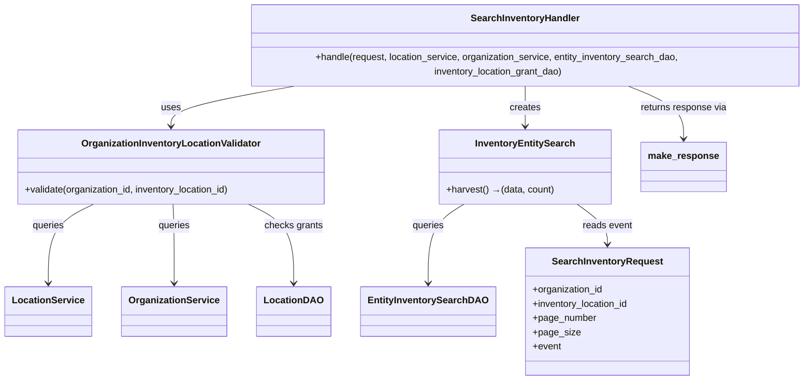

# Diagram: entity_core/entity_service/entity_inventory/entity_inventory_service/service/search_inventory/handler.py


> Auto-generated by Obscura crawlers

## Diagram 1



### SVG

<svg id="container" width="1355.537109375" xmlns="http://www.w3.org/2000/svg" class="classDiagram" height="632" viewBox="0 0 1355.537109375 632" role="graphics-document document" aria-roledescription="class"><style>#container{font-family:"trebuchet ms",verdana,arial,sans-serif;font-size:16px;fill:#333;}@keyframes edge-animation-frame{from{stroke-dashoffset:0;}}@keyframes dash{to{stroke-dashoffset:0;}}#container .edge-animation-slow{stroke-dasharray:9,5!important;stroke-dashoffset:900;animation:dash 50s linear infinite;stroke-linecap:round;}#container .edge-animation-fast{stroke-dasharray:9,5!important;stroke-dashoffset:900;animation:dash 20s linear infinite;stroke-linecap:round;}#container .error-icon{fill:#552222;}#container .error-text{fill:#552222;stroke:#552222;}#container .edge-thickness-normal{stroke-width:1px;}#container .edge-thickness-thick{stroke-width:3.5px;}#container .edge-pattern-solid{stroke-dasharray:0;}#container .edge-thickness-invisible{stroke-width:0;fill:none;}#container .edge-pattern-dashed{stroke-dasharray:3;}#container .edge-pattern-dotted{stroke-dasharray:2;}#container .marker{fill:#333333;stroke:#333333;}#container .marker.cross{stroke:#333333;}#container svg{font-family:"trebuchet ms",verdana,arial,sans-serif;font-size:16px;}#container p{margin:0;}#container g.classGroup text{fill:#9370DB;stroke:none;font-family:"trebuchet ms",verdana,arial,sans-serif;font-size:10px;}#container g.classGroup text .title{font-weight:bolder;}#container .nodeLabel,#container .edgeLabel{color:#131300;}#container .edgeLabel .label rect{fill:#ECECFF;}#container .label text{fill:#131300;}#container .labelBkg{background:#ECECFF;}#container .edgeLabel .label span{background:#ECECFF;}#container .classTitle{font-weight:bolder;}#container .node rect,#container .node circle,#container .node ellipse,#container .node polygon,#container .node path{fill:#ECECFF;stroke:#9370DB;stroke-width:1px;}#container .divider{stroke:#9370DB;stroke-width:1;}#container g.clickable{cursor:pointer;}#container g.classGroup rect{fill:#ECECFF;stroke:#9370DB;}#container g.classGroup line{stroke:#9370DB;stroke-width:1;}#container .classLabel .box{stroke:none;stroke-width:0;fill:#ECECFF;opacity:0.5;}#container .classLabel .label{fill:#9370DB;font-size:10px;}#container .relation{stroke:#333333;stroke-width:1;fill:none;}#container .dashed-line{stroke-dasharray:3;}#container .dotted-line{stroke-dasharray:1 2;}#container #compositionStart,#container .composition{fill:#333333!important;stroke:#333333!important;stroke-width:1;}#container #compositionEnd,#container .composition{fill:#333333!important;stroke:#333333!important;stroke-width:1;}#container #dependencyStart,#container .dependency{fill:#333333!important;stroke:#333333!important;stroke-width:1;}#container #dependencyStart,#container .dependency{fill:#333333!important;stroke:#333333!important;stroke-width:1;}#container #extensionStart,#container .extension{fill:transparent!important;stroke:#333333!important;stroke-width:1;}#container #extensionEnd,#container .extension{fill:transparent!important;stroke:#333333!important;stroke-width:1;}#container #aggregationStart,#container .aggregation{fill:transparent!important;stroke:#333333!important;stroke-width:1;}#container #aggregationEnd,#container .aggregation{fill:transparent!important;stroke:#333333!important;stroke-width:1;}#container #lollipopStart,#container .lollipop{fill:#ECECFF!important;stroke:#333333!important;stroke-width:1;}#container #lollipopEnd,#container .lollipop{fill:#ECECFF!important;stroke:#333333!important;stroke-width:1;}#container .edgeTerminals{font-size:11px;line-height:initial;}#container .classTitleText{text-anchor:middle;font-size:18px;fill:#333;}#container .label-icon{display:inline-block;height:1em;overflow:visible;vertical-align:-0.125em;}#container .node .label-icon path{fill:currentColor;stroke:revert;stroke-width:revert;}#container :root{--mermaid-font-family:"trebuchet ms",verdana,arial,sans-serif;}</style><g><defs><marker id="container_class-aggregationStart" class="marker aggregation class" refX="18" refY="7" markerWidth="190" markerHeight="240" orient="auto"><path d="M 18,7 L9,13 L1,7 L9,1 Z"></path></marker></defs><defs><marker id="container_class-aggregationEnd" class="marker aggregation class" refX="1" refY="7" markerWidth="20" markerHeight="28" orient="auto"><path d="M 18,7 L9,13 L1,7 L9,1 Z"></path></marker></defs><defs><marker id="container_class-extensionStart" class="marker extension class" refX="18" refY="7" markerWidth="190" markerHeight="240" orient="auto"><path d="M 1,7 L18,13 V 1 Z"></path></marker></defs><defs><marker id="container_class-extensionEnd" class="marker extension class" refX="1" refY="7" markerWidth="20" markerHeight="28" orient="auto"><path d="M 1,1 V 13 L18,7 Z"></path></marker></defs><defs><marker id="container_class-compositionStart" class="marker composition class" refX="18" refY="7" markerWidth="190" markerHeight="240" orient="auto"><path d="M 18,7 L9,13 L1,7 L9,1 Z"></path></marker></defs><defs><marker id="container_class-compositionEnd" class="marker composition class" refX="1" refY="7" markerWidth="20" markerHeight="28" orient="auto"><path d="M 18,7 L9,13 L1,7 L9,1 Z"></path></marker></defs><defs><marker id="container_class-dependencyStart" class="marker dependency class" refX="6" refY="7" markerWidth="190" markerHeight="240" orient="auto"><path d="M 5,7 L9,13 L1,7 L9,1 Z"></path></marker></defs><defs><marker id="container_class-dependencyEnd" class="marker dependency class" refX="13" refY="7" markerWidth="20" markerHeight="28" orient="auto"><path d="M 18,7 L9,13 L14,7 L9,1 Z"></path></marker></defs><defs><marker id="container_class-lollipopStart" class="marker lollipop class" refX="13" refY="7" markerWidth="190" markerHeight="240" orient="auto"><circle stroke="black" fill="transparent" cx="7" cy="7" r="6"></circle></marker></defs><defs><marker id="container_class-lollipopEnd" class="marker lollipop class" refX="1" refY="7" markerWidth="190" markerHeight="240" orient="auto"><circle stroke="black" fill="transparent" cx="7" cy="7" r="6"></circle></marker></defs><g class="root"><g class="clusters"></g><g class="edgePaths"><path d="M495.353,134L459.07,140.167C422.786,146.333,350.219,158.667,313.936,170C277.652,181.333,277.652,191.667,277.652,196.833L277.652,202" id="id_SearchInventoryHandler_OrganizationInventoryLocationValidator_1" class="edge-thickness-normal edge-pattern-solid relation" style=";;;" data-edge="true" data-et="edge" data-id="id_SearchInventoryHandler_OrganizationInventoryLocationValidator_1" data-points="W3sieCI6NDk1LjM1MzI2MTcxODc1LCJ5IjoxMzR9LHsieCI6Mjc3LjY1MjM0Mzc1LCJ5IjoxNzF9LHsieCI6Mjc3LjY1MjM0Mzc1LCJ5IjoyMDh9XQ==" marker-end="url(#container_class-dependencyEnd)"></path><path d="M866.033,134L866.033,140.167C866.033,146.333,866.033,158.667,866.033,170C866.033,181.333,866.033,191.667,866.033,196.833L866.033,202" id="id_SearchInventoryHandler_InventoryEntitySearch_2" class="edge-thickness-normal edge-pattern-solid relation" style=";;;" data-edge="true" data-et="edge" data-id="id_SearchInventoryHandler_InventoryEntitySearch_2" data-points="W3sieCI6ODY2LjAzMzIwMzEyNSwieSI6MTM0fSx7IngiOjg2Ni4wMzMyMDMxMjUsInkiOjE3MX0seyJ4Ijo4NjYuMDMzMjAzMTI1LCJ5IjoyMDh9XQ==" marker-end="url(#container_class-dependencyEnd)"></path><path d="M1032.08,134L1048.333,140.167C1064.587,146.333,1097.093,158.667,1113.346,173.5C1129.6,188.333,1129.6,205.667,1129.6,214.333L1129.6,223" id="id_SearchInventoryHandler_make_response_3" class="edge-thickness-normal edge-pattern-solid relation" style=";;;" data-edge="true" data-et="edge" data-id="id_SearchInventoryHandler_make_response_3" data-points="W3sieCI6MTAzMi4wODAwMzkwNjI1LCJ5IjoxMzR9LHsieCI6MTEyOS41OTk2MDkzNzUsInkiOjE3MX0seyJ4IjoxMTI5LjU5OTYwOTM3NSwieSI6MjI5fV0=" marker-end="url(#container_class-dependencyEnd)"></path><path d="M151.866,334L139.554,340.167C127.242,346.333,102.617,358.667,90.305,381C77.992,403.333,77.992,435.667,77.992,451.833L77.992,468" id="id_OrganizationInventoryLocationValidator_LocationService_4" class="edge-thickness-normal edge-pattern-solid relation" style=";;;" data-edge="true" data-et="edge" data-id="id_OrganizationInventoryLocationValidator_LocationService_4" data-points="W3sieCI6MTUxLjg2NjQ0NTMxMjUsInkiOjMzNH0seyJ4Ijo3Ny45OTIxODc1LCJ5IjozNzF9LHsieCI6NzcuOTkyMTg3NSwieSI6NDc0fV0=" marker-end="url(#container_class-dependencyEnd)"></path><path d="M281.228,334L281.578,340.167C281.928,346.333,282.628,358.667,282.978,381C283.328,403.333,283.328,435.667,283.328,451.833L283.328,468" id="id_OrganizationInventoryLocationValidator_OrganizationService_5" class="edge-thickness-normal edge-pattern-solid relation" style=";;;" data-edge="true" data-et="edge" data-id="id_OrganizationInventoryLocationValidator_OrganizationService_5" data-points="W3sieCI6MjgxLjIyODA4NTkzNzUsInkiOjMzNH0seyJ4IjoyODMuMzI4MTI1LCJ5IjozNzF9LHsieCI6MjgzLjMyODEyNSwieSI6NDc0fV0=" marker-end="url(#container_class-dependencyEnd)"></path><path d="M403.438,334L415.751,340.167C428.063,346.333,452.688,358.667,465,381C477.313,403.333,477.313,435.667,477.313,451.833L477.313,468" id="id_OrganizationInventoryLocationValidator_LocationDAO_6" class="edge-thickness-normal edge-pattern-solid relation" style=";;;" data-edge="true" data-et="edge" data-id="id_OrganizationInventoryLocationValidator_LocationDAO_6" data-points="W3sieCI6NDAzLjQzODI0MjE4NzUsInkiOjMzNH0seyJ4Ijo0NzcuMzEyNSwieSI6MzcxfSx7IngiOjQ3Ny4zMTI1LCJ5Ijo0NzR9XQ==" marker-end="url(#container_class-dependencyEnd)"></path><path d="M757.775,334L747.179,340.167C736.582,346.333,715.389,358.667,704.792,381C694.195,403.333,694.195,435.667,694.195,451.833L694.195,468" id="id_InventoryEntitySearch_EntityInventorySearchDAO_7" class="edge-thickness-normal edge-pattern-solid relation" style=";;;" data-edge="true" data-et="edge" data-id="id_InventoryEntitySearch_EntityInventorySearchDAO_7" data-points="W3sieCI6NzU3Ljc3NTMzMjAzMTI1LCJ5IjozMzR9LHsieCI6Njk0LjE5NTMxMjUsInkiOjM3MX0seyJ4Ijo2OTQuMTk1MzEyNSwieSI6NDc0fV0=" marker-end="url(#container_class-dependencyEnd)"></path><path d="M945.501,334L953.279,340.167C961.058,346.333,976.615,358.667,984.393,370C992.172,381.333,992.172,391.667,992.172,396.833L992.172,402" id="id_InventoryEntitySearch_SearchInventoryRequest_8" class="edge-thickness-normal edge-pattern-solid relation" style=";;;" data-edge="true" data-et="edge" data-id="id_InventoryEntitySearch_SearchInventoryRequest_8" data-points="W3sieCI6OTQ1LjUwMDU2NjQwNjI1LCJ5IjozMzR9LHsieCI6OTkyLjE3MTg3NSwieSI6MzcxfSx7IngiOjk5Mi4xNzE4NzUsInkiOjQwOH1d" marker-end="url(#container_class-dependencyEnd)"></path></g><g class="edgeLabels"><g class="edgeLabel" transform="translate(277.65234375, 171)"><g class="label" data-id="id_SearchInventoryHandler_OrganizationInventoryLocationValidator_1" transform="translate(-16.4921875, -12)"><foreignObject width="32.984375" height="24"><div xmlns="http://www.w3.org/1999/xhtml" class="labelBkg" style="display: table-cell; white-space: nowrap; line-height: 1.5; max-width: 200px; text-align: center;"><span class="edgeLabel"><p>uses</p></span></div></foreignObject></g></g><g class="edgeLabel" transform="translate(866.033203125, 171)"><g class="label" data-id="id_SearchInventoryHandler_InventoryEntitySearch_2" transform="translate(-26.171875, -12)"><foreignObject width="52.34375" height="24"><div xmlns="http://www.w3.org/1999/xhtml" class="labelBkg" style="display: table-cell; white-space: nowrap; line-height: 1.5; max-width: 200px; text-align: center;"><span class="edgeLabel"><p>creates</p></span></div></foreignObject></g></g><g class="edgeLabel" transform="translate(1129.599609375, 171)"><g class="label" data-id="id_SearchInventoryHandler_make_response_3" transform="translate(-74.203125, -12)"><foreignObject width="148.40625" height="24"><div xmlns="http://www.w3.org/1999/xhtml" class="labelBkg" style="display: table-cell; white-space: nowrap; line-height: 1.5; max-width: 200px; text-align: center;"><span class="edgeLabel"><p>returns response via</p></span></div></foreignObject></g></g><g class="edgeLabel" transform="translate(77.9921875, 371)"><g class="label" data-id="id_OrganizationInventoryLocationValidator_LocationService_4" transform="translate(-27.2421875, -12)"><foreignObject width="54.484375" height="24"><div xmlns="http://www.w3.org/1999/xhtml" class="labelBkg" style="display: table-cell; white-space: nowrap; line-height: 1.5; max-width: 200px; text-align: center;"><span class="edgeLabel"><p>queries</p></span></div></foreignObject></g></g><g class="edgeLabel" transform="translate(283.328125, 371)"><g class="label" data-id="id_OrganizationInventoryLocationValidator_OrganizationService_5" transform="translate(-27.2421875, -12)"><foreignObject width="54.484375" height="24"><div xmlns="http://www.w3.org/1999/xhtml" class="labelBkg" style="display: table-cell; white-space: nowrap; line-height: 1.5; max-width: 200px; text-align: center;"><span class="edgeLabel"><p>queries</p></span></div></foreignObject></g></g><g class="edgeLabel" transform="translate(477.3125, 371)"><g class="label" data-id="id_OrganizationInventoryLocationValidator_LocationDAO_6" transform="translate(-49.2421875, -12)"><foreignObject width="98.484375" height="24"><div xmlns="http://www.w3.org/1999/xhtml" class="labelBkg" style="display: table-cell; white-space: nowrap; line-height: 1.5; max-width: 200px; text-align: center;"><span class="edgeLabel"><p>checks grants</p></span></div></foreignObject></g></g><g class="edgeLabel" transform="translate(694.1953125, 371)"><g class="label" data-id="id_InventoryEntitySearch_EntityInventorySearchDAO_7" transform="translate(-27.2421875, -12)"><foreignObject width="54.484375" height="24"><div xmlns="http://www.w3.org/1999/xhtml" class="labelBkg" style="display: table-cell; white-space: nowrap; line-height: 1.5; max-width: 200px; text-align: center;"><span class="edgeLabel"><p>queries</p></span></div></foreignObject></g></g><g class="edgeLabel" transform="translate(992.171875, 371)"><g class="label" data-id="id_InventoryEntitySearch_SearchInventoryRequest_8" transform="translate(-42.2890625, -12)"><foreignObject width="84.578125" height="24"><div xmlns="http://www.w3.org/1999/xhtml" class="labelBkg" style="display: table-cell; white-space: nowrap; line-height: 1.5; max-width: 200px; text-align: center;"><span class="edgeLabel"><p>reads event</p></span></div></foreignObject></g></g></g><g class="nodes"><g class="node default" id="classId-SearchInventoryHandler-0" transform="translate(866.033203125, 71)"><g class="basic label-container"><path d="M-481.50390625 -63 L481.50390625 -63 L481.50390625 63 L-481.50390625 63" stroke="none" stroke-width="0" fill="#ECECFF" style=""></path><path d="M-481.50390625 -63 C-98.01972445649398 -63, 285.46445733701205 -63, 481.50390625 -63 M-481.50390625 -63 C-157.07010978721542 -63, 167.36368667556917 -63, 481.50390625 -63 M481.50390625 -63 C481.50390625 -17.30535052250852, 481.50390625 28.389298954982962, 481.50390625 63 M481.50390625 -63 C481.50390625 -36.75145068626992, 481.50390625 -10.502901372539846, 481.50390625 63 M481.50390625 63 C269.6864798349782 63, 57.8690534199564 63, -481.50390625 63 M481.50390625 63 C170.325594890278 63, -140.85271646944398 63, -481.50390625 63 M-481.50390625 63 C-481.50390625 24.35216386504201, -481.50390625 -14.295672269915983, -481.50390625 -63 M-481.50390625 63 C-481.50390625 27.228078996223466, -481.50390625 -8.543842007553067, -481.50390625 -63" stroke="#9370DB" stroke-width="1.3" fill="none" stroke-dasharray="0 0" style=""></path></g><g class="annotation-group text" transform="translate(0, -39)"></g><g class="label-group text" transform="translate(-88.7578125, -39)"><g class="label" style="font-weight: bolder" transform="translate(0,-12)"><foreignObject width="177.515625" height="24"><div xmlns="http://www.w3.org/1999/xhtml" style="display: table-cell; white-space: nowrap; line-height: 1.5; max-width: 226px; text-align: center;"><span class="nodeLabel markdown-node-label" style=""><p>SearchInventoryHandler</p></span></div></foreignObject></g></g><g class="members-group text" transform="translate(-469.50390625, 9)"></g><g class="methods-group text" transform="translate(-469.50390625, 39)"><g class="label" style="" transform="translate(0,-12)"><foreignObject width="850.25" height="24"><div xmlns="http://www.w3.org/1999/xhtml" style="display: table-cell; white-space: nowrap; line-height: 1.5; max-width: 908px; text-align: center;"><span class="nodeLabel markdown-node-label" style=""><p>+handle(request, location_service, organization_service, entity_inventory_search_dao, inventory_location_grant_dao)</p></span></div></foreignObject></g></g><g class="divider" style=""><path d="M-481.50390625 -15 C-192.6013684812977 -15, 96.3011692874046 -15, 481.50390625 -15 M-481.50390625 -15 C-208.5584231963747 -15, 64.38705985725062 -15, 481.50390625 -15" stroke="#9370DB" stroke-width="1.3" fill="none" stroke-dasharray="0 0" style=""></path></g><g class="divider" style=""><path d="M-481.50390625 9 C-111.80972014718378 9, 257.88446595563244 9, 481.50390625 9 M-481.50390625 9 C-233.22714324946622 9, 15.049619751067553 9, 481.50390625 9" stroke="#9370DB" stroke-width="1.3" fill="none" stroke-dasharray="0 0" style=""></path></g></g><g class="node default" id="classId-OrganizationInventoryLocationValidator-1" transform="translate(277.65234375, 271)"><g class="basic label-container"><path d="M-262.46875 -63 L262.46875 -63 L262.46875 63 L-262.46875 63" stroke="none" stroke-width="0" fill="#ECECFF" style=""></path><path d="M-262.46875 -63 C-113.08583141338534 -63, 36.29708717322933 -63, 262.46875 -63 M-262.46875 -63 C-73.49042948766191 -63, 115.48789102467617 -63, 262.46875 -63 M262.46875 -63 C262.46875 -36.76596488704108, 262.46875 -10.531929774082151, 262.46875 63 M262.46875 -63 C262.46875 -32.95745143858241, 262.46875 -2.9149028771648275, 262.46875 63 M262.46875 63 C61.79994693694914 63, -138.86885612610172 63, -262.46875 63 M262.46875 63 C117.66607708916837 63, -27.136595821663263 63, -262.46875 63 M-262.46875 63 C-262.46875 36.732089188697586, -262.46875 10.464178377395179, -262.46875 -63 M-262.46875 63 C-262.46875 21.970215686579856, -262.46875 -19.05956862684029, -262.46875 -63" stroke="#9370DB" stroke-width="1.3" fill="none" stroke-dasharray="0 0" style=""></path></g><g class="annotation-group text" transform="translate(0, -39)"></g><g class="label-group text" transform="translate(-146.171875, -39)"><g class="label" style="font-weight: bolder" transform="translate(0,-12)"><foreignObject width="292.34375" height="24"><div xmlns="http://www.w3.org/1999/xhtml" style="display: table-cell; white-space: nowrap; line-height: 1.5; max-width: 339px; text-align: center;"><span class="nodeLabel markdown-node-label" style=""><p>OrganizationInventoryLocationValidator</p></span></div></foreignObject></g></g><g class="members-group text" transform="translate(-250.46875, 9)"></g><g class="methods-group text" transform="translate(-250.46875, 39)"><g class="label" style="" transform="translate(0,-12)"><foreignObject width="354.765625" height="24"><div xmlns="http://www.w3.org/1999/xhtml" style="display: table-cell; white-space: nowrap; line-height: 1.5; max-width: 412px; text-align: center;"><span class="nodeLabel markdown-node-label" style=""><p>+validate(organization_id, inventory_location_id)</p></span></div></foreignObject></g></g><g class="divider" style=""><path d="M-262.46875 -15 C-85.9326590752643 -15, 90.6034318494714 -15, 262.46875 -15 M-262.46875 -15 C-61.563614760593566 -15, 139.34152047881287 -15, 262.46875 -15" stroke="#9370DB" stroke-width="1.3" fill="none" stroke-dasharray="0 0" style=""></path></g><g class="divider" style=""><path d="M-262.46875 9 C-90.067428572782 9, 82.33389285443599 9, 262.46875 9 M-262.46875 9 C-134.95668188256255 9, -7.444613765125098 9, 262.46875 9" stroke="#9370DB" stroke-width="1.3" fill="none" stroke-dasharray="0 0" style=""></path></g></g><g class="node default" id="classId-InventoryEntitySearch-2" transform="translate(866.033203125, 271)"><g class="basic label-container"><path d="M-144.09765625 -63 L144.09765625 -63 L144.09765625 63 L-144.09765625 63" stroke="none" stroke-width="0" fill="#ECECFF" style=""></path><path d="M-144.09765625 -63 C-70.8511128994422 -63, 2.395430451115601 -63, 144.09765625 -63 M-144.09765625 -63 C-40.03034446930809 -63, 64.03696731138382 -63, 144.09765625 -63 M144.09765625 -63 C144.09765625 -34.023987690347425, 144.09765625 -5.047975380694844, 144.09765625 63 M144.09765625 -63 C144.09765625 -14.01583869541529, 144.09765625 34.96832260916942, 144.09765625 63 M144.09765625 63 C30.5630235743336 63, -82.9716091013328 63, -144.09765625 63 M144.09765625 63 C40.13351859825043 63, -63.830619053499134 63, -144.09765625 63 M-144.09765625 63 C-144.09765625 22.421322269826703, -144.09765625 -18.157355460346594, -144.09765625 -63 M-144.09765625 63 C-144.09765625 17.41954837398994, -144.09765625 -28.16090325202012, -144.09765625 -63" stroke="#9370DB" stroke-width="1.3" fill="none" stroke-dasharray="0 0" style=""></path></g><g class="annotation-group text" transform="translate(0, -39)"></g><g class="label-group text" transform="translate(-80.9453125, -39)"><g class="label" style="font-weight: bolder" transform="translate(0,-12)"><foreignObject width="161.890625" height="24"><div xmlns="http://www.w3.org/1999/xhtml" style="display: table-cell; white-space: nowrap; line-height: 1.5; max-width: 209px; text-align: center;"><span class="nodeLabel markdown-node-label" style=""><p>InventoryEntitySearch</p></span></div></foreignObject></g></g><g class="members-group text" transform="translate(-132.09765625, 9)"></g><g class="methods-group text" transform="translate(-132.09765625, 39)"><g class="label" style="" transform="translate(0,-12)"><foreignObject width="183.25" height="24"><div xmlns="http://www.w3.org/1999/xhtml" style="display: table-cell; white-space: nowrap; line-height: 1.5; max-width: 241px; text-align: center;"><span class="nodeLabel markdown-node-label" style=""><p>+harvest() →(data, count)</p></span></div></foreignObject></g></g><g class="divider" style=""><path d="M-144.09765625 -15 C-51.23043122996482 -15, 41.63679379007036 -15, 144.09765625 -15 M-144.09765625 -15 C-86.32843253887086 -15, -28.559208827741728 -15, 144.09765625 -15" stroke="#9370DB" stroke-width="1.3" fill="none" stroke-dasharray="0 0" style=""></path></g><g class="divider" style=""><path d="M-144.09765625 9 C-55.26921424923724 9, 33.559227751525526 9, 144.09765625 9 M-144.09765625 9 C-31.221932156221754 9, 81.65379193755649 9, 144.09765625 9" stroke="#9370DB" stroke-width="1.3" fill="none" stroke-dasharray="0 0" style=""></path></g></g><g class="node default" id="classId-EntityInventorySearchDAO-3" transform="translate(694.1953125, 516)"><g class="basic label-container"><path d="M-108.2421875 -42 L108.2421875 -42 L108.2421875 42 L-108.2421875 42" stroke="none" stroke-width="0" fill="#ECECFF" style=""></path><path d="M-108.2421875 -42 C-57.46040603453942 -42, -6.678624569078835 -42, 108.2421875 -42 M-108.2421875 -42 C-36.06023821690539 -42, 36.12171106618922 -42, 108.2421875 -42 M108.2421875 -42 C108.2421875 -17.23380430385254, 108.2421875 7.532391392294919, 108.2421875 42 M108.2421875 -42 C108.2421875 -14.570022799359727, 108.2421875 12.859954401280547, 108.2421875 42 M108.2421875 42 C56.382002162458996 42, 4.521816824917991 42, -108.2421875 42 M108.2421875 42 C62.2227603809289 42, 16.203333261857793 42, -108.2421875 42 M-108.2421875 42 C-108.2421875 12.13849011890623, -108.2421875 -17.72301976218754, -108.2421875 -42 M-108.2421875 42 C-108.2421875 24.475569797872005, -108.2421875 6.95113959574401, -108.2421875 -42" stroke="#9370DB" stroke-width="1.3" fill="none" stroke-dasharray="0 0" style=""></path></g><g class="annotation-group text" transform="translate(0, -18)"></g><g class="label-group text" transform="translate(-96.2421875, -18)"><g class="label" style="font-weight: bolder" transform="translate(0,-12)"><foreignObject width="192.484375" height="24"><div xmlns="http://www.w3.org/1999/xhtml" style="display: table-cell; white-space: nowrap; line-height: 1.5; max-width: 239px; text-align: center;"><span class="nodeLabel markdown-node-label" style=""><p>EntityInventorySearchDAO</p></span></div></foreignObject></g></g><g class="members-group text" transform="translate(-96.2421875, 30)"></g><g class="methods-group text" transform="translate(-96.2421875, 60)"></g><g class="divider" style=""><path d="M-108.2421875 6 C-33.66036811240774 6, 40.92145127518452 6, 108.2421875 6 M-108.2421875 6 C-33.33543470339714 6, 41.57131809320572 6, 108.2421875 6" stroke="#9370DB" stroke-width="1.3" fill="none" stroke-dasharray="0 0" style=""></path></g><g class="divider" style=""><path d="M-108.2421875 24 C-61.88672920120028 24, -15.531270902400564 24, 108.2421875 24 M-108.2421875 24 C-47.592948715701446 24, 13.056290068597107 24, 108.2421875 24" stroke="#9370DB" stroke-width="1.3" fill="none" stroke-dasharray="0 0" style=""></path></g></g><g class="node default" id="classId-LocationDAO-4" transform="translate(477.3125, 516)"><g class="basic label-container"><path d="M-58.640625 -42 L58.640625 -42 L58.640625 42 L-58.640625 42" stroke="none" stroke-width="0" fill="#ECECFF" style=""></path><path d="M-58.640625 -42 C-16.464461594167055 -42, 25.71170181166589 -42, 58.640625 -42 M-58.640625 -42 C-13.147624157616583 -42, 32.34537668476683 -42, 58.640625 -42 M58.640625 -42 C58.640625 -25.13536085004179, 58.640625 -8.270721700083577, 58.640625 42 M58.640625 -42 C58.640625 -13.774809320461408, 58.640625 14.450381359077184, 58.640625 42 M58.640625 42 C19.702283008774188 42, -19.236058982451624 42, -58.640625 42 M58.640625 42 C12.342393404852096 42, -33.95583819029581 42, -58.640625 42 M-58.640625 42 C-58.640625 22.668790628667164, -58.640625 3.337581257334328, -58.640625 -42 M-58.640625 42 C-58.640625 13.926383545395609, -58.640625 -14.147232909208782, -58.640625 -42" stroke="#9370DB" stroke-width="1.3" fill="none" stroke-dasharray="0 0" style=""></path></g><g class="annotation-group text" transform="translate(0, -18)"></g><g class="label-group text" transform="translate(-46.640625, -18)"><g class="label" style="font-weight: bolder" transform="translate(0,-12)"><foreignObject width="93.28125" height="24"><div xmlns="http://www.w3.org/1999/xhtml" style="display: table-cell; white-space: nowrap; line-height: 1.5; max-width: 142px; text-align: center;"><span class="nodeLabel markdown-node-label" style=""><p>LocationDAO</p></span></div></foreignObject></g></g><g class="members-group text" transform="translate(-46.640625, 30)"></g><g class="methods-group text" transform="translate(-46.640625, 60)"></g><g class="divider" style=""><path d="M-58.640625 6 C-31.737560699483282 6, -4.834496398966564 6, 58.640625 6 M-58.640625 6 C-16.78604058321902 6, 25.06854383356196 6, 58.640625 6" stroke="#9370DB" stroke-width="1.3" fill="none" stroke-dasharray="0 0" style=""></path></g><g class="divider" style=""><path d="M-58.640625 24 C-25.19367409378976 24, 8.25327681242048 24, 58.640625 24 M-58.640625 24 C-20.66132340005411 24, 17.317978199891783 24, 58.640625 24" stroke="#9370DB" stroke-width="1.3" fill="none" stroke-dasharray="0 0" style=""></path></g></g><g class="node default" id="classId-LocationService-5" transform="translate(77.9921875, 516)"><g class="basic label-container"><path d="M-69.9921875 -42 L69.9921875 -42 L69.9921875 42 L-69.9921875 42" stroke="none" stroke-width="0" fill="#ECECFF" style=""></path><path d="M-69.9921875 -42 C-39.81509311996747 -42, -9.637998739934936 -42, 69.9921875 -42 M-69.9921875 -42 C-31.08265491531953 -42, 7.82687766936094 -42, 69.9921875 -42 M69.9921875 -42 C69.9921875 -18.787354558591954, 69.9921875 4.425290882816093, 69.9921875 42 M69.9921875 -42 C69.9921875 -17.160065367538838, 69.9921875 7.679869264922324, 69.9921875 42 M69.9921875 42 C22.435697583728768 42, -25.120792332542464 42, -69.9921875 42 M69.9921875 42 C29.287347776189392 42, -11.417491947621215 42, -69.9921875 42 M-69.9921875 42 C-69.9921875 17.66558419649699, -69.9921875 -6.66883160700602, -69.9921875 -42 M-69.9921875 42 C-69.9921875 17.41959988704463, -69.9921875 -7.160800225910741, -69.9921875 -42" stroke="#9370DB" stroke-width="1.3" fill="none" stroke-dasharray="0 0" style=""></path></g><g class="annotation-group text" transform="translate(0, -18)"></g><g class="label-group text" transform="translate(-57.9921875, -18)"><g class="label" style="font-weight: bolder" transform="translate(0,-12)"><foreignObject width="115.984375" height="24"><div xmlns="http://www.w3.org/1999/xhtml" style="display: table-cell; white-space: nowrap; line-height: 1.5; max-width: 164px; text-align: center;"><span class="nodeLabel markdown-node-label" style=""><p>LocationService</p></span></div></foreignObject></g></g><g class="members-group text" transform="translate(-57.9921875, 30)"></g><g class="methods-group text" transform="translate(-57.9921875, 60)"></g><g class="divider" style=""><path d="M-69.9921875 6 C-20.44977621507973 6, 29.09263506984054 6, 69.9921875 6 M-69.9921875 6 C-26.628413412440317 6, 16.735360675119367 6, 69.9921875 6" stroke="#9370DB" stroke-width="1.3" fill="none" stroke-dasharray="0 0" style=""></path></g><g class="divider" style=""><path d="M-69.9921875 24 C-37.547725410752065 24, -5.10326332150413 24, 69.9921875 24 M-69.9921875 24 C-20.130945934697237 24, 29.730295630605525 24, 69.9921875 24" stroke="#9370DB" stroke-width="1.3" fill="none" stroke-dasharray="0 0" style=""></path></g></g><g class="node default" id="classId-OrganizationService-6" transform="translate(283.328125, 516)"><g class="basic label-container"><path d="M-85.34375 -42 L85.34375 -42 L85.34375 42 L-85.34375 42" stroke="none" stroke-width="0" fill="#ECECFF" style=""></path><path d="M-85.34375 -42 C-30.543223516327593 -42, 24.257302967344813 -42, 85.34375 -42 M-85.34375 -42 C-39.692268658179955 -42, 5.959212683640089 -42, 85.34375 -42 M85.34375 -42 C85.34375 -24.037252095208405, 85.34375 -6.0745041904168104, 85.34375 42 M85.34375 -42 C85.34375 -12.818905960801693, 85.34375 16.362188078396613, 85.34375 42 M85.34375 42 C25.897559044637028 42, -33.548631910725945 42, -85.34375 42 M85.34375 42 C49.73508680590743 42, 14.126423611814857 42, -85.34375 42 M-85.34375 42 C-85.34375 10.326797420267837, -85.34375 -21.346405159464325, -85.34375 -42 M-85.34375 42 C-85.34375 16.741694154558964, -85.34375 -8.516611690882073, -85.34375 -42" stroke="#9370DB" stroke-width="1.3" fill="none" stroke-dasharray="0 0" style=""></path></g><g class="annotation-group text" transform="translate(0, -18)"></g><g class="label-group text" transform="translate(-73.34375, -18)"><g class="label" style="font-weight: bolder" transform="translate(0,-12)"><foreignObject width="146.6875" height="24"><div xmlns="http://www.w3.org/1999/xhtml" style="display: table-cell; white-space: nowrap; line-height: 1.5; max-width: 194px; text-align: center;"><span class="nodeLabel markdown-node-label" style=""><p>OrganizationService</p></span></div></foreignObject></g></g><g class="members-group text" transform="translate(-73.34375, 30)"></g><g class="methods-group text" transform="translate(-73.34375, 60)"></g><g class="divider" style=""><path d="M-85.34375 6 C-36.44314790535591 6, 12.457454189288185 6, 85.34375 6 M-85.34375 6 C-41.357386365748106 6, 2.628977268503789 6, 85.34375 6" stroke="#9370DB" stroke-width="1.3" fill="none" stroke-dasharray="0 0" style=""></path></g><g class="divider" style=""><path d="M-85.34375 24 C-27.65522296492957 24, 30.033304070140858 24, 85.34375 24 M-85.34375 24 C-37.303225477598296 24, 10.737299044803407 24, 85.34375 24" stroke="#9370DB" stroke-width="1.3" fill="none" stroke-dasharray="0 0" style=""></path></g></g><g class="node default" id="classId-SearchInventoryRequest-7" transform="translate(992.171875, 516)"><g class="basic label-container"><path d="M-139.734375 -108 L139.734375 -108 L139.734375 108 L-139.734375 108" stroke="none" stroke-width="0" fill="#ECECFF" style=""></path><path d="M-139.734375 -108 C-48.9452133234137 -108, 41.84394835317261 -108, 139.734375 -108 M-139.734375 -108 C-47.51440863527425 -108, 44.7055577294515 -108, 139.734375 -108 M139.734375 -108 C139.734375 -44.40401363563537, 139.734375 19.191972728729255, 139.734375 108 M139.734375 -108 C139.734375 -26.713074255498043, 139.734375 54.573851489003914, 139.734375 108 M139.734375 108 C40.7920884231126 108, -58.150198153774795 108, -139.734375 108 M139.734375 108 C58.00725269446008 108, -23.719869611079844 108, -139.734375 108 M-139.734375 108 C-139.734375 55.91848833772253, -139.734375 3.836976675445058, -139.734375 -108 M-139.734375 108 C-139.734375 43.66029954533124, -139.734375 -20.679400909337517, -139.734375 -108" stroke="#9370DB" stroke-width="1.3" fill="none" stroke-dasharray="0 0" style=""></path></g><g class="annotation-group text" transform="translate(0, -84)"></g><g class="label-group text" transform="translate(-89.640625, -84)"><g class="label" style="font-weight: bolder" transform="translate(0,-12)"><foreignObject width="179.28125" height="24"><div xmlns="http://www.w3.org/1999/xhtml" style="display: table-cell; white-space: nowrap; line-height: 1.5; max-width: 227px; text-align: center;"><span class="nodeLabel markdown-node-label" style=""><p>SearchInventoryRequest</p></span></div></foreignObject></g></g><g class="members-group text" transform="translate(-127.734375, -36)"><g class="label" style="" transform="translate(0,-12)"><foreignObject width="120.75" height="24"><div xmlns="http://www.w3.org/1999/xhtml" style="display: table-cell; white-space: nowrap; line-height: 1.5; max-width: 178px; text-align: center;"><span class="nodeLabel markdown-node-label" style=""><p>+organization_id</p></span></div></foreignObject></g><g class="label" style="" transform="translate(0,12)"><foreignObject width="165.828125" height="24"><div xmlns="http://www.w3.org/1999/xhtml" style="display: table-cell; white-space: nowrap; line-height: 1.5; max-width: 223px; text-align: center;"><span class="nodeLabel markdown-node-label" style=""><p>+inventory_location_id</p></span></div></foreignObject></g><g class="label" style="" transform="translate(0,36)"><foreignObject width="107.46875" height="24"><div xmlns="http://www.w3.org/1999/xhtml" style="display: table-cell; white-space: nowrap; line-height: 1.5; max-width: 166px; text-align: center;"><span class="nodeLabel markdown-node-label" style=""><p>+page_number</p></span></div></foreignObject></g><g class="label" style="" transform="translate(0,60)"><foreignObject width="78.25" height="24"><div xmlns="http://www.w3.org/1999/xhtml" style="display: table-cell; white-space: nowrap; line-height: 1.5; max-width: 136px; text-align: center;"><span class="nodeLabel markdown-node-label" style=""><p>+page_size</p></span></div></foreignObject></g><g class="label" style="" transform="translate(0,84)"><foreignObject width="48.328125" height="24"><div xmlns="http://www.w3.org/1999/xhtml" style="display: table-cell; white-space: nowrap; line-height: 1.5; max-width: 106px; text-align: center;"><span class="nodeLabel markdown-node-label" style=""><p>+event</p></span></div></foreignObject></g></g><g class="methods-group text" transform="translate(-127.734375, 108)"></g><g class="divider" style=""><path d="M-139.734375 -60 C-66.02396827051265 -60, 7.686438458974692 -60, 139.734375 -60 M-139.734375 -60 C-36.20748681623574 -60, 67.31940136752851 -60, 139.734375 -60" stroke="#9370DB" stroke-width="1.3" fill="none" stroke-dasharray="0 0" style=""></path></g><g class="divider" style=""><path d="M-139.734375 84 C-77.7114869826534 84, -15.688598965306795 84, 139.734375 84 M-139.734375 84 C-39.47392256365286 84, 60.786529872694274 84, 139.734375 84" stroke="#9370DB" stroke-width="1.3" fill="none" stroke-dasharray="0 0" style=""></path></g></g><g class="node default" id="classId-make_response-8" transform="translate(1129.599609375, 271)"><g class="basic label-container"><path d="M-69.46875 -42 L69.46875 -42 L69.46875 42 L-69.46875 42" stroke="none" stroke-width="0" fill="#ECECFF" style=""></path><path d="M-69.46875 -42 C-32.24441995609388 -42, 4.979910087812243 -42, 69.46875 -42 M-69.46875 -42 C-28.10341123209391 -42, 13.261927535812177 -42, 69.46875 -42 M69.46875 -42 C69.46875 -9.263324839993153, 69.46875 23.473350320013694, 69.46875 42 M69.46875 -42 C69.46875 -24.27126299361897, 69.46875 -6.542525987237937, 69.46875 42 M69.46875 42 C38.27899857532282 42, 7.089247150645626 42, -69.46875 42 M69.46875 42 C17.72764558206689 42, -34.01345883586622 42, -69.46875 42 M-69.46875 42 C-69.46875 15.747173230438882, -69.46875 -10.505653539122235, -69.46875 -42 M-69.46875 42 C-69.46875 20.590326602757173, -69.46875 -0.8193467944856536, -69.46875 -42" stroke="#9370DB" stroke-width="1.3" fill="none" stroke-dasharray="0 0" style=""></path></g><g class="annotation-group text" transform="translate(0, -18)"></g><g class="label-group text" transform="translate(-57.46875, -18)"><g class="label" style="font-weight: bolder" transform="translate(0,-12)"><foreignObject width="114.9375" height="24"><div xmlns="http://www.w3.org/1999/xhtml" style="display: table-cell; white-space: nowrap; line-height: 1.5; max-width: 164px; text-align: center;"><span class="nodeLabel markdown-node-label" style=""><p>make_response</p></span></div></foreignObject></g></g><g class="members-group text" transform="translate(-57.46875, 30)"></g><g class="methods-group text" transform="translate(-57.46875, 60)"></g><g class="divider" style=""><path d="M-69.46875 6 C-35.32241789089035 6, -1.1760857817806993 6, 69.46875 6 M-69.46875 6 C-18.026642009972633 6, 33.415465980054734 6, 69.46875 6" stroke="#9370DB" stroke-width="1.3" fill="none" stroke-dasharray="0 0" style=""></path></g><g class="divider" style=""><path d="M-69.46875 24 C-25.40077555263406 24, 18.667198894731882 24, 69.46875 24 M-69.46875 24 C-22.53671123707113 24, 24.395327525857738 24, 69.46875 24" stroke="#9370DB" stroke-width="1.3" fill="none" stroke-dasharray="0 0" style=""></path></g></g></g></g></g></svg>

## Diagram 2

```mermaid
flowchart TD
    A[Incoming SearchInventoryRequest] --> B[Validate location access]
    B --> C[Instantiate InventoryEntitySearch]
    C --> D[harvest() → (data, count)]
    D --> E[Build meta {currentPage, totalCount, totalPages}]
    D --> F[Convert rows to JSON via to_json_dict()]
    E --> G[Compose payload {"meta", "data"}]
    F --> G
    G --> H[make_response(payload)]
    H --> I[Return HTTP response]

    B ---|uses| J[OrganizationInventoryLocationValidator]
    J ---|calls| K[LocationService / OrganizationService / LocationDAO]
    C ---|uses DAO| L[EntityInventorySearchDAO]
    H ---|utility| M[make_response function]
```

> SVG rendering failed for this diagram.
