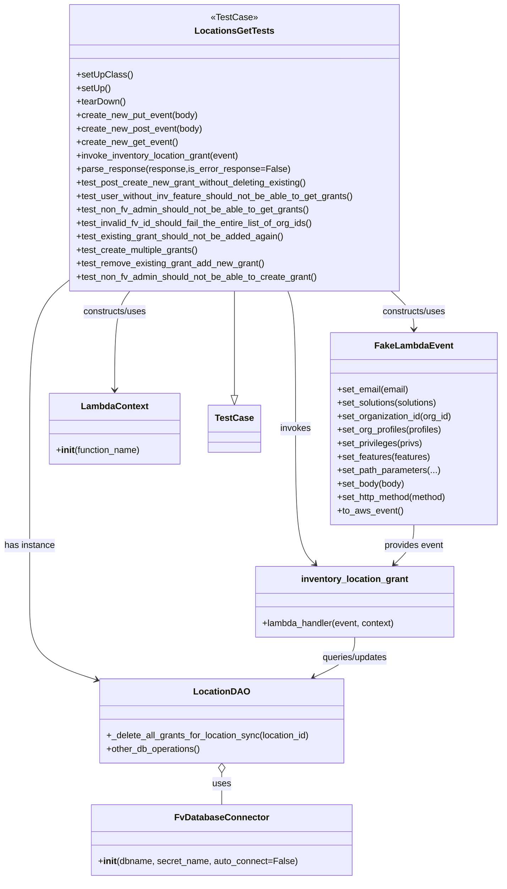

# Diagram: entity_core/entity_service/entity_inventory/entity_inventory_tests/integration/test_inventory_location_grants.py


> Auto-generated by Obscura crawlers

## Diagram 1



### SVG

<svg id="container" width="890.921875" xmlns="http://www.w3.org/2000/svg" class="classDiagram" height="1566" viewBox="0 0 890.921875 1566" role="graphics-document document" aria-roledescription="class"><style>#container{font-family:"trebuchet ms",verdana,arial,sans-serif;font-size:16px;fill:#333;}@keyframes edge-animation-frame{from{stroke-dashoffset:0;}}@keyframes dash{to{stroke-dashoffset:0;}}#container .edge-animation-slow{stroke-dasharray:9,5!important;stroke-dashoffset:900;animation:dash 50s linear infinite;stroke-linecap:round;}#container .edge-animation-fast{stroke-dasharray:9,5!important;stroke-dashoffset:900;animation:dash 20s linear infinite;stroke-linecap:round;}#container .error-icon{fill:#552222;}#container .error-text{fill:#552222;stroke:#552222;}#container .edge-thickness-normal{stroke-width:1px;}#container .edge-thickness-thick{stroke-width:3.5px;}#container .edge-pattern-solid{stroke-dasharray:0;}#container .edge-thickness-invisible{stroke-width:0;fill:none;}#container .edge-pattern-dashed{stroke-dasharray:3;}#container .edge-pattern-dotted{stroke-dasharray:2;}#container .marker{fill:#333333;stroke:#333333;}#container .marker.cross{stroke:#333333;}#container svg{font-family:"trebuchet ms",verdana,arial,sans-serif;font-size:16px;}#container p{margin:0;}#container g.classGroup text{fill:#9370DB;stroke:none;font-family:"trebuchet ms",verdana,arial,sans-serif;font-size:10px;}#container g.classGroup text .title{font-weight:bolder;}#container .nodeLabel,#container .edgeLabel{color:#131300;}#container .edgeLabel .label rect{fill:#ECECFF;}#container .label text{fill:#131300;}#container .labelBkg{background:#ECECFF;}#container .edgeLabel .label span{background:#ECECFF;}#container .classTitle{font-weight:bolder;}#container .node rect,#container .node circle,#container .node ellipse,#container .node polygon,#container .node path{fill:#ECECFF;stroke:#9370DB;stroke-width:1px;}#container .divider{stroke:#9370DB;stroke-width:1;}#container g.clickable{cursor:pointer;}#container g.classGroup rect{fill:#ECECFF;stroke:#9370DB;}#container g.classGroup line{stroke:#9370DB;stroke-width:1;}#container .classLabel .box{stroke:none;stroke-width:0;fill:#ECECFF;opacity:0.5;}#container .classLabel .label{fill:#9370DB;font-size:10px;}#container .relation{stroke:#333333;stroke-width:1;fill:none;}#container .dashed-line{stroke-dasharray:3;}#container .dotted-line{stroke-dasharray:1 2;}#container #compositionStart,#container .composition{fill:#333333!important;stroke:#333333!important;stroke-width:1;}#container #compositionEnd,#container .composition{fill:#333333!important;stroke:#333333!important;stroke-width:1;}#container #dependencyStart,#container .dependency{fill:#333333!important;stroke:#333333!important;stroke-width:1;}#container #dependencyStart,#container .dependency{fill:#333333!important;stroke:#333333!important;stroke-width:1;}#container #extensionStart,#container .extension{fill:transparent!important;stroke:#333333!important;stroke-width:1;}#container #extensionEnd,#container .extension{fill:transparent!important;stroke:#333333!important;stroke-width:1;}#container #aggregationStart,#container .aggregation{fill:transparent!important;stroke:#333333!important;stroke-width:1;}#container #aggregationEnd,#container .aggregation{fill:transparent!important;stroke:#333333!important;stroke-width:1;}#container #lollipopStart,#container .lollipop{fill:#ECECFF!important;stroke:#333333!important;stroke-width:1;}#container #lollipopEnd,#container .lollipop{fill:#ECECFF!important;stroke:#333333!important;stroke-width:1;}#container .edgeTerminals{font-size:11px;line-height:initial;}#container .classTitleText{text-anchor:middle;font-size:18px;fill:#333;}#container .label-icon{display:inline-block;height:1em;overflow:visible;vertical-align:-0.125em;}#container .node .label-icon path{fill:currentColor;stroke:revert;stroke-width:revert;}#container :root{--mermaid-font-family:"trebuchet ms",verdana,arial,sans-serif;}</style><g><defs><marker id="container_class-aggregationStart" class="marker aggregation class" refX="18" refY="7" markerWidth="190" markerHeight="240" orient="auto"><path d="M 18,7 L9,13 L1,7 L9,1 Z"></path></marker></defs><defs><marker id="container_class-aggregationEnd" class="marker aggregation class" refX="1" refY="7" markerWidth="20" markerHeight="28" orient="auto"><path d="M 18,7 L9,13 L1,7 L9,1 Z"></path></marker></defs><defs><marker id="container_class-extensionStart" class="marker extension class" refX="18" refY="7" markerWidth="190" markerHeight="240" orient="auto"><path d="M 1,7 L18,13 V 1 Z"></path></marker></defs><defs><marker id="container_class-extensionEnd" class="marker extension class" refX="1" refY="7" markerWidth="20" markerHeight="28" orient="auto"><path d="M 1,1 V 13 L18,7 Z"></path></marker></defs><defs><marker id="container_class-compositionStart" class="marker composition class" refX="18" refY="7" markerWidth="190" markerHeight="240" orient="auto"><path d="M 18,7 L9,13 L1,7 L9,1 Z"></path></marker></defs><defs><marker id="container_class-compositionEnd" class="marker composition class" refX="1" refY="7" markerWidth="20" markerHeight="28" orient="auto"><path d="M 18,7 L9,13 L1,7 L9,1 Z"></path></marker></defs><defs><marker id="container_class-dependencyStart" class="marker dependency class" refX="6" refY="7" markerWidth="190" markerHeight="240" orient="auto"><path d="M 5,7 L9,13 L1,7 L9,1 Z"></path></marker></defs><defs><marker id="container_class-dependencyEnd" class="marker dependency class" refX="13" refY="7" markerWidth="20" markerHeight="28" orient="auto"><path d="M 18,7 L9,13 L14,7 L9,1 Z"></path></marker></defs><defs><marker id="container_class-lollipopStart" class="marker lollipop class" refX="13" refY="7" markerWidth="190" markerHeight="240" orient="auto"><circle stroke="black" fill="transparent" cx="7" cy="7" r="6"></circle></marker></defs><defs><marker id="container_class-lollipopEnd" class="marker lollipop class" refX="1" refY="7" markerWidth="190" markerHeight="240" orient="auto"><circle stroke="black" fill="transparent" cx="7" cy="7" r="6"></circle></marker></defs><g class="root"><g class="clusters"></g><g class="edgePaths"><path d="M416.383,518L416.383,524.167C416.383,530.333,416.383,542.667,416.383,573.625C416.383,604.583,416.383,654.167,416.383,678.958L416.383,703.75" id="id_LocationsGetTests_TestCase_1" class="edge-thickness-normal edge-pattern-solid relation" style=";;;" data-edge="true" data-et="edge" data-id="id_LocationsGetTests_TestCase_1" data-points="W3sieCI6NDE2LjM4MjgxMjUsInkiOjUxOH0seyJ4Ijo0MTYuMzgyODEyNSwieSI6NTU1fSx7IngiOjQxNi4zODI4MTI1LCJ5Ijo3MjF9XQ==" marker-end="url(#container_class-extensionEnd)"></path><path d="M694.119,518L700.835,524.167C707.552,530.333,720.985,542.667,727.701,554C734.418,565.333,734.418,575.667,734.418,580.833L734.418,586" id="id_LocationsGetTests_FakeLambdaEvent_2" class="edge-thickness-normal edge-pattern-solid relation" style=";;;" data-edge="true" data-et="edge" data-id="id_LocationsGetTests_FakeLambdaEvent_2" data-points="W3sieCI6Njk0LjExODk5MzQ3MTc0NjUsInkiOjUxOH0seyJ4Ijo3MzQuNDE3OTY4NzUsInkiOjU1NX0seyJ4Ijo3MzQuNDE3OTY4NzUsInkiOjU5Mn1d" marker-end="url(#container_class-dependencyEnd)"></path><path d="M231.969,518L227.509,524.167C223.05,530.333,214.13,542.667,209.671,572C205.211,601.333,205.211,647.667,205.211,670.833L205.211,694" id="id_LocationsGetTests_LambdaContext_3" class="edge-thickness-normal edge-pattern-solid relation" style=";;;" data-edge="true" data-et="edge" data-id="id_LocationsGetTests_LambdaContext_3" data-points="W3sieCI6MjMxLjk2OTAxNzU1MTM2OTg2LCJ5Ijo1MTh9LHsieCI6MjA1LjIxMDkzNzUsInkiOjU1NX0seyJ4IjoyMDUuMjEwOTM3NSwieSI6NzAwfV0=" marker-end="url(#container_class-dependencyEnd)"></path><path d="M120.664,500.889L109.453,509.907C98.242,518.926,75.82,536.963,64.609,580.648C53.398,624.333,53.398,693.667,53.398,763C53.398,832.333,53.398,901.667,53.398,953C53.398,1004.333,53.398,1037.667,53.398,1071C53.398,1104.333,53.398,1137.667,72.756,1160.7C92.114,1183.734,130.829,1196.468,150.187,1202.836L169.545,1209.203" id="id_LocationsGetTests_LocationDAO_4" class="edge-thickness-normal edge-pattern-solid relation" style=";;;" data-edge="true" data-et="edge" data-id="id_LocationsGetTests_LocationDAO_4" data-points="W3sieCI6MTIwLjY2NDA2MjUsInkiOjUwMC44ODg2ODMyMjUwMDEwNX0seyJ4Ijo1My4zOTg0Mzc1LCJ5Ijo1NTV9LHsieCI6NTMuMzk4NDM3NSwieSI6NzYzfSx7IngiOjUzLjM5ODQzNzUsInkiOjk3MX0seyJ4Ijo1My4zOTg0Mzc1LCJ5IjoxMDcxfSx7IngiOjUzLjM5ODQzNzUsInkiOjExNzF9LHsieCI6MTc1LjI0NDE0MDYyNSwieSI6MTIxMS4wNzczMTk3MzU0NjF9XQ==" marker-end="url(#container_class-dependencyEnd)"></path><path d="M509.777,518L512.035,524.167C514.294,530.333,518.811,542.667,521.07,583.5C523.328,624.333,523.328,693.667,523.328,763C523.328,832.333,523.328,901.667,529.111,941.812C534.893,981.958,546.459,992.916,552.242,998.394L558.024,1003.873" id="id_LocationsGetTests_inventory_location_grant_5" class="edge-thickness-normal edge-pattern-solid relation" style=";;;" data-edge="true" data-et="edge" data-id="id_LocationsGetTests_inventory_location_grant_5" data-points="W3sieCI6NTA5Ljc3NjgzNTQwMjM5NzI0LCJ5Ijo1MTh9LHsieCI6NTIzLjMyODEyNSwieSI6NTU1fSx7IngiOjUyMy4zMjgxMjUsInkiOjc2M30seyJ4Ijo1MjMuMzI4MTI1LCJ5Ijo5NzF9LHsieCI6NTYyLjM3OTc0NjA5Mzc1LCJ5IjoxMDA4fV0=" marker-end="url(#container_class-dependencyEnd)"></path><path d="M393.908,1375.25L393.908,1378.542C393.908,1381.833,393.908,1388.417,393.908,1397.875C393.908,1407.333,393.908,1419.667,393.908,1425.833L393.908,1432" id="id_LocationDAO_FvDatabaseConnector_6" class="edge-thickness-normal edge-pattern-solid relation" style=";;;" data-edge="true" data-et="edge" data-id="id_LocationDAO_FvDatabaseConnector_6" data-points="W3sieCI6MzkzLjkwODIwMzEyNSwieSI6MTM1OH0seyJ4IjozOTMuOTA4MjAzMTI1LCJ5IjoxMzk1fSx7IngiOjM5My45MDgyMDMxMjUsInkiOjE0MzJ9XQ==" marker-start="url(#container_class-aggregationStart)"></path><path d="M628.873,1134L628.873,1140.167C628.873,1146.333,628.873,1158.667,616.839,1170.57C604.804,1182.473,580.736,1193.946,568.701,1199.682L556.667,1205.418" id="id_inventory_location_grant_LocationDAO_7" class="edge-thickness-normal edge-pattern-solid relation" style=";;;" data-edge="true" data-et="edge" data-id="id_inventory_location_grant_LocationDAO_7" data-points="W3sieCI6NjI4Ljg3MzA0Njg3NSwieSI6MTEzNH0seyJ4Ijo2MjguODczMDQ2ODc1LCJ5IjoxMTcxfSx7IngiOjU1MS4yNTA3MzI0MjE4NzUsInkiOjEyMDh9XQ==" marker-end="url(#container_class-dependencyEnd)"></path><path d="M734.418,934L734.418,940.167C734.418,946.333,734.418,958.667,728.635,970.312C722.853,981.958,711.287,992.916,705.505,998.394L699.722,1003.873" id="id_FakeLambdaEvent_inventory_location_grant_8" class="edge-thickness-normal edge-pattern-solid relation" style=";;;" data-edge="true" data-et="edge" data-id="id_FakeLambdaEvent_inventory_location_grant_8" data-points="W3sieCI6NzM0LjQxNzk2ODc1LCJ5Ijo5MzR9LHsieCI6NzM0LjQxNzk2ODc1LCJ5Ijo5NzF9LHsieCI6Njk1LjM2NjM0NzY1NjI1LCJ5IjoxMDA4fV0=" marker-end="url(#container_class-dependencyEnd)"></path></g><g class="edgeLabels"><g class="edgeLabel"><g class="label" data-id="id_LocationsGetTests_TestCase_1" transform="translate(0, 0)"><foreignObject width="0" height="0"><div xmlns="http://www.w3.org/1999/xhtml" class="labelBkg" style="display: table-cell; white-space: nowrap; line-height: 1.5; max-width: 200px; text-align: center;"><span class="edgeLabel"></span></div></foreignObject></g></g><g class="edgeLabel" transform="translate(734.41796875, 555)"><g class="label" data-id="id_LocationsGetTests_FakeLambdaEvent_2" transform="translate(-58.25, -12)"><foreignObject width="116.5" height="24"><div xmlns="http://www.w3.org/1999/xhtml" class="labelBkg" style="display: table-cell; white-space: nowrap; line-height: 1.5; max-width: 200px; text-align: center;"><span class="edgeLabel"><p>constructs/uses</p></span></div></foreignObject></g></g><g class="edgeLabel" transform="translate(205.2109375, 555)"><g class="label" data-id="id_LocationsGetTests_LambdaContext_3" transform="translate(-58.25, -12)"><foreignObject width="116.5" height="24"><div xmlns="http://www.w3.org/1999/xhtml" class="labelBkg" style="display: table-cell; white-space: nowrap; line-height: 1.5; max-width: 200px; text-align: center;"><span class="edgeLabel"><p>constructs/uses</p></span></div></foreignObject></g></g><g class="edgeLabel" transform="translate(53.3984375, 971)"><g class="label" data-id="id_LocationsGetTests_LocationDAO_4" transform="translate(-45.3984375, -12)"><foreignObject width="90.796875" height="24"><div xmlns="http://www.w3.org/1999/xhtml" class="labelBkg" style="display: table-cell; white-space: nowrap; line-height: 1.5; max-width: 200px; text-align: center;"><span class="edgeLabel"><p>has instance</p></span></div></foreignObject></g></g><g class="edgeLabel" transform="translate(523.328125, 763)"><g class="label" data-id="id_LocationsGetTests_inventory_location_grant_5" transform="translate(-27.5859375, -12)"><foreignObject width="55.171875" height="24"><div xmlns="http://www.w3.org/1999/xhtml" class="labelBkg" style="display: table-cell; white-space: nowrap; line-height: 1.5; max-width: 200px; text-align: center;"><span class="edgeLabel"><p>invokes</p></span></div></foreignObject></g></g><g class="edgeLabel" transform="translate(393.908203125, 1395)"><g class="label" data-id="id_LocationDAO_FvDatabaseConnector_6" transform="translate(-16.4921875, -12)"><foreignObject width="32.984375" height="24"><div xmlns="http://www.w3.org/1999/xhtml" class="labelBkg" style="display: table-cell; white-space: nowrap; line-height: 1.5; max-width: 200px; text-align: center;"><span class="edgeLabel"><p>uses</p></span></div></foreignObject></g></g><g class="edgeLabel" transform="translate(628.873046875, 1171)"><g class="label" data-id="id_inventory_location_grant_LocationDAO_7" transform="translate(-60.5703125, -12)"><foreignObject width="121.140625" height="24"><div xmlns="http://www.w3.org/1999/xhtml" class="labelBkg" style="display: table-cell; white-space: nowrap; line-height: 1.5; max-width: 200px; text-align: center;"><span class="edgeLabel"><p>queries/updates</p></span></div></foreignObject></g></g><g class="edgeLabel" transform="translate(734.41796875, 971)"><g class="label" data-id="id_FakeLambdaEvent_inventory_location_grant_8" transform="translate(-53.6015625, -12)"><foreignObject width="107.203125" height="24"><div xmlns="http://www.w3.org/1999/xhtml" class="labelBkg" style="display: table-cell; white-space: nowrap; line-height: 1.5; max-width: 200px; text-align: center;"><span class="edgeLabel"><p>provides event</p></span></div></foreignObject></g></g></g><g class="nodes"><g class="node default" id="classId-LocationsGetTests-0" transform="translate(416.3828125, 263)"><g class="basic label-container"><path d="M-295.71875 -255 L295.71875 -255 L295.71875 255 L-295.71875 255" stroke="none" stroke-width="0" fill="#ECECFF" style=""></path><path d="M-295.71875 -255 C-89.61207129405332 -255, 116.49460741189336 -255, 295.71875 -255 M-295.71875 -255 C-157.22061100245398 -255, -18.722472004907956 -255, 295.71875 -255 M295.71875 -255 C295.71875 -123.55097694822376, 295.71875 7.898046103552474, 295.71875 255 M295.71875 -255 C295.71875 -152.8365560648515, 295.71875 -50.673112129703014, 295.71875 255 M295.71875 255 C85.0219385194167 255, -125.67487296116661 255, -295.71875 255 M295.71875 255 C133.14601224107815 255, -29.426725517843693 255, -295.71875 255 M-295.71875 255 C-295.71875 116.608917523045, -295.71875 -21.782164953910012, -295.71875 -255 M-295.71875 255 C-295.71875 93.61792065728946, -295.71875 -67.76415868542108, -295.71875 -255" stroke="#9370DB" stroke-width="1.3" fill="none" stroke-dasharray="0 0" style=""></path></g><g class="annotation-group text" transform="translate(-40.2578125, -231)"><g class="label" style="" transform="translate(0,-12)"><foreignObject width="80.515625" height="24"><div xmlns="http://www.w3.org/1999/xhtml" style="display: table-cell; white-space: nowrap; line-height: 1.5; max-width: 131px; text-align: center;"><span class="nodeLabel markdown-node-label" style=""><p>«TestCase»</p></span></div></foreignObject></g></g><g class="label-group text" transform="translate(-66.984375, -207)"><g class="label" style="font-weight: bolder" transform="translate(0,-12)"><foreignObject width="133.96875" height="24"><div xmlns="http://www.w3.org/1999/xhtml" style="display: table-cell; white-space: nowrap; line-height: 1.5; max-width: 181px; text-align: center;"><span class="nodeLabel markdown-node-label" style=""><p>LocationsGetTests</p></span></div></foreignObject></g></g><g class="members-group text" transform="translate(-283.71875, -159)"></g><g class="methods-group text" transform="translate(-283.71875, -129)"><g class="label" style="" transform="translate(0,-12)"><foreignObject width="97.15625" height="24"><div xmlns="http://www.w3.org/1999/xhtml" style="display: table-cell; white-space: nowrap; line-height: 1.5; max-width: 155px; text-align: center;"><span class="nodeLabel markdown-node-label" style=""><p>+setUpClass()</p></span></div></foreignObject></g><g class="label" style="" transform="translate(0,12)"><foreignObject width="60.421875" height="24"><div xmlns="http://www.w3.org/1999/xhtml" style="display: table-cell; white-space: nowrap; line-height: 1.5; max-width: 118px; text-align: center;"><span class="nodeLabel markdown-node-label" style=""><p>+setUp()</p></span></div></foreignObject></g><g class="label" style="" transform="translate(0,36)"><foreignObject width="87.75" height="24"><div xmlns="http://www.w3.org/1999/xhtml" style="display: table-cell; white-space: nowrap; line-height: 1.5; max-width: 145px; text-align: center;"><span class="nodeLabel markdown-node-label" style=""><p>+tearDown()</p></span></div></foreignObject></g><g class="label" style="" transform="translate(0,60)"><foreignObject width="218.015625" height="24"><div xmlns="http://www.w3.org/1999/xhtml" style="display: table-cell; white-space: nowrap; line-height: 1.5; max-width: 275px; text-align: center;"><span class="nodeLabel markdown-node-label" style=""><p>+create_new_put_event(body)</p></span></div></foreignObject></g><g class="label" style="" transform="translate(0,84)"><foreignObject width="225.515625" height="24"><div xmlns="http://www.w3.org/1999/xhtml" style="display: table-cell; white-space: nowrap; line-height: 1.5; max-width: 283px; text-align: center;"><span class="nodeLabel markdown-node-label" style=""><p>+create_new_post_event(body)</p></span></div></foreignObject></g><g class="label" style="" transform="translate(0,108)"><foreignObject width="179.828125" height="24"><div xmlns="http://www.w3.org/1999/xhtml" style="display: table-cell; white-space: nowrap; line-height: 1.5; max-width: 237px; text-align: center;"><span class="nodeLabel markdown-node-label" style=""><p>+create_new_get_event()</p></span></div></foreignObject></g><g class="label" style="" transform="translate(0,132)"><foreignObject width="296.09375" height="24"><div xmlns="http://www.w3.org/1999/xhtml" style="display: table-cell; white-space: nowrap; line-height: 1.5; max-width: 353px; text-align: center;"><span class="nodeLabel markdown-node-label" style=""><p>+invoke_inventory_location_grant(event)</p></span></div></foreignObject></g><g class="label" style="" transform="translate(0,156)"><foreignObject width="376.265625" height="24"><div xmlns="http://www.w3.org/1999/xhtml" style="display: table-cell; white-space: nowrap; line-height: 1.5; max-width: 434px; text-align: center;"><span class="nodeLabel markdown-node-label" style=""><p>+parse_response(response,is_error_response=False)</p></span></div></foreignObject></g><g class="label" style="" transform="translate(0,180)"><foreignObject width="418.109375" height="24"><div xmlns="http://www.w3.org/1999/xhtml" style="display: table-cell; white-space: nowrap; line-height: 1.5; max-width: 475px; text-align: center;"><span class="nodeLabel markdown-node-label" style=""><p>+test_post_create_new_grant_without_deleting_existing()</p></span></div></foreignObject></g><g class="label" style="" transform="translate(0,204)"><foreignObject width="500.453125" height="24"><div xmlns="http://www.w3.org/1999/xhtml" style="display: table-cell; white-space: nowrap; line-height: 1.5; max-width: 558px; text-align: center;"><span class="nodeLabel markdown-node-label" style=""><p>+test_user_without_inv_feature_should_not_be_able_to_get_grants()</p></span></div></foreignObject></g><g class="label" style="" transform="translate(0,228)"><foreignObject width="420.390625" height="24"><div xmlns="http://www.w3.org/1999/xhtml" style="display: table-cell; white-space: nowrap; line-height: 1.5; max-width: 478px; text-align: center;"><span class="nodeLabel markdown-node-label" style=""><p>+test_non_fv_admin_should_not_be_able_to_get_grants()</p></span></div></foreignObject></g><g class="label" style="" transform="translate(0,252)"><foreignObject width="431.265625" height="24"><div xmlns="http://www.w3.org/1999/xhtml" style="display: table-cell; white-space: nowrap; line-height: 1.5; max-width: 489px; text-align: center;"><span class="nodeLabel markdown-node-label" style=""><p>+test_invalid_fv_id_should_fail_the_entire_list_of_org_ids()</p></span></div></foreignObject></g><g class="label" style="" transform="translate(0,276)"><foreignObject width="374.734375" height="24"><div xmlns="http://www.w3.org/1999/xhtml" style="display: table-cell; white-space: nowrap; line-height: 1.5; max-width: 432px; text-align: center;"><span class="nodeLabel markdown-node-label" style=""><p>+test_existing_grant_should_not_be_added_again()</p></span></div></foreignObject></g><g class="label" style="" transform="translate(0,300)"><foreignObject width="220.890625" height="24"><div xmlns="http://www.w3.org/1999/xhtml" style="display: table-cell; white-space: nowrap; line-height: 1.5; max-width: 278px; text-align: center;"><span class="nodeLabel markdown-node-label" style=""><p>+test_create_multiple_grants()</p></span></div></foreignObject></g><g class="label" style="" transform="translate(0,324)"><foreignObject width="338.015625" height="24"><div xmlns="http://www.w3.org/1999/xhtml" style="display: table-cell; white-space: nowrap; line-height: 1.5; max-width: 395px; text-align: center;"><span class="nodeLabel markdown-node-label" style=""><p>+test_remove_existing_grant_add_new_grant()</p></span></div></foreignObject></g><g class="label" style="" transform="translate(0,348)"><foreignObject width="434.4375" height="24"><div xmlns="http://www.w3.org/1999/xhtml" style="display: table-cell; white-space: nowrap; line-height: 1.5; max-width: 492px; text-align: center;"><span class="nodeLabel markdown-node-label" style=""><p>+test_non_fv_admin_should_not_be_able_to_create_grant()</p></span></div></foreignObject></g></g><g class="divider" style=""><path d="M-295.71875 -183 C-166.78871754624046 -183, -37.858685092480926 -183, 295.71875 -183 M-295.71875 -183 C-81.4732667500933 -183, 132.7722164998134 -183, 295.71875 -183" stroke="#9370DB" stroke-width="1.3" fill="none" stroke-dasharray="0 0" style=""></path></g><g class="divider" style=""><path d="M-295.71875 -159 C-94.79777503013074 -159, 106.12319993973853 -159, 295.71875 -159 M-295.71875 -159 C-99.02629336027661 -159, 97.66616327944678 -159, 295.71875 -159" stroke="#9370DB" stroke-width="1.3" fill="none" stroke-dasharray="0 0" style=""></path></g></g><g class="node default" id="classId-LocationDAO-1" transform="translate(393.908203125, 1283)"><g class="basic label-container"><path d="M-218.6640625 -75 L218.6640625 -75 L218.6640625 75 L-218.6640625 75" stroke="none" stroke-width="0" fill="#ECECFF" style=""></path><path d="M-218.6640625 -75 C-82.43019004297386 -75, 53.803682414052275 -75, 218.6640625 -75 M-218.6640625 -75 C-51.12028124728869 -75, 116.42350000542262 -75, 218.6640625 -75 M218.6640625 -75 C218.6640625 -38.21466909032729, 218.6640625 -1.4293381806545824, 218.6640625 75 M218.6640625 -75 C218.6640625 -32.85160165103712, 218.6640625 9.296796697925757, 218.6640625 75 M218.6640625 75 C97.43667502733618 75, -23.790712445327642 75, -218.6640625 75 M218.6640625 75 C89.18070536043024 75, -40.302651779139524 75, -218.6640625 75 M-218.6640625 75 C-218.6640625 26.15703779756216, -218.6640625 -22.685924404875678, -218.6640625 -75 M-218.6640625 75 C-218.6640625 44.224051078410405, -218.6640625 13.44810215682081, -218.6640625 -75" stroke="#9370DB" stroke-width="1.3" fill="none" stroke-dasharray="0 0" style=""></path></g><g class="annotation-group text" transform="translate(0, -51)"></g><g class="label-group text" transform="translate(-46.640625, -51)"><g class="label" style="font-weight: bolder" transform="translate(0,-12)"><foreignObject width="93.28125" height="24"><div xmlns="http://www.w3.org/1999/xhtml" style="display: table-cell; white-space: nowrap; line-height: 1.5; max-width: 142px; text-align: center;"><span class="nodeLabel markdown-node-label" style=""><p>LocationDAO</p></span></div></foreignObject></g></g><g class="members-group text" transform="translate(-206.6640625, -3)"></g><g class="methods-group text" transform="translate(-206.6640625, 27)"><g class="label" style="" transform="translate(0,-12)"><foreignObject width="366.6875" height="24"><div xmlns="http://www.w3.org/1999/xhtml" style="display: table-cell; white-space: nowrap; line-height: 1.5; max-width: 424px; text-align: center;"><span class="nodeLabel markdown-node-label" style=""><p>+_delete_all_grants_for_location_sync(location_id)</p></span></div></foreignObject></g><g class="label" style="" transform="translate(0,12)"><foreignObject width="169.59375" height="24"><div xmlns="http://www.w3.org/1999/xhtml" style="display: table-cell; white-space: nowrap; line-height: 1.5; max-width: 227px; text-align: center;"><span class="nodeLabel markdown-node-label" style=""><p>+other_db_operations()</p></span></div></foreignObject></g></g><g class="divider" style=""><path d="M-218.6640625 -27 C-67.16857143899742 -27, 84.32691962200516 -27, 218.6640625 -27 M-218.6640625 -27 C-64.49081085504281 -27, 89.68244078991438 -27, 218.6640625 -27" stroke="#9370DB" stroke-width="1.3" fill="none" stroke-dasharray="0 0" style=""></path></g><g class="divider" style=""><path d="M-218.6640625 -3 C-108.35678746141257 -3, 1.9504875771748686 -3, 218.6640625 -3 M-218.6640625 -3 C-93.92751401998113 -3, 30.809034460037736 -3, 218.6640625 -3" stroke="#9370DB" stroke-width="1.3" fill="none" stroke-dasharray="0 0" style=""></path></g></g><g class="node default" id="classId-FvDatabaseConnector-2" transform="translate(393.908203125, 1495)"><g class="basic label-container"><path d="M-228.42578125 -63 L228.42578125 -63 L228.42578125 63 L-228.42578125 63" stroke="none" stroke-width="0" fill="#ECECFF" style=""></path><path d="M-228.42578125 -63 C-58.702902471033724 -63, 111.01997630793255 -63, 228.42578125 -63 M-228.42578125 -63 C-126.74488634567531 -63, -25.063991441350623 -63, 228.42578125 -63 M228.42578125 -63 C228.42578125 -35.76530401652176, 228.42578125 -8.53060803304352, 228.42578125 63 M228.42578125 -63 C228.42578125 -25.696621468754053, 228.42578125 11.606757062491894, 228.42578125 63 M228.42578125 63 C121.86804483804916 63, 15.310308426098317 63, -228.42578125 63 M228.42578125 63 C118.37338229898064 63, 8.320983347961288 63, -228.42578125 63 M-228.42578125 63 C-228.42578125 36.687418255044044, -228.42578125 10.374836510088087, -228.42578125 -63 M-228.42578125 63 C-228.42578125 23.256010150617065, -228.42578125 -16.48797969876587, -228.42578125 -63" stroke="#9370DB" stroke-width="1.3" fill="none" stroke-dasharray="0 0" style=""></path></g><g class="annotation-group text" transform="translate(0, -39)"></g><g class="label-group text" transform="translate(-79.3046875, -39)"><g class="label" style="font-weight: bolder" transform="translate(0,-12)"><foreignObject width="158.609375" height="24"><div xmlns="http://www.w3.org/1999/xhtml" style="display: table-cell; white-space: nowrap; line-height: 1.5; max-width: 207px; text-align: center;"><span class="nodeLabel markdown-node-label" style=""><p>FvDatabaseConnector</p></span></div></foreignObject></g></g><g class="members-group text" transform="translate(-216.42578125, 9)"></g><g class="methods-group text" transform="translate(-216.42578125, 39)"><g class="label" style="" transform="translate(0,-12)"><foreignObject width="353.546875" height="24"><div xmlns="http://www.w3.org/1999/xhtml" style="display: table-cell; white-space: nowrap; line-height: 1.5; max-width: 442px; text-align: center;"><span class="nodeLabel markdown-node-label" style=""><p>+<strong>init</strong>(dbname, secret_name, auto_connect=False)</p></span></div></foreignObject></g></g><g class="divider" style=""><path d="M-228.42578125 -15 C-100.8801888714905 -15, 26.665403507018993 -15, 228.42578125 -15 M-228.42578125 -15 C-96.48412113858677 -15, 35.457538972826455 -15, 228.42578125 -15" stroke="#9370DB" stroke-width="1.3" fill="none" stroke-dasharray="0 0" style=""></path></g><g class="divider" style=""><path d="M-228.42578125 9 C-126.87548868643592 9, -25.32519612287183 9, 228.42578125 9 M-228.42578125 9 C-48.04631583079407 9, 132.33314958841186 9, 228.42578125 9" stroke="#9370DB" stroke-width="1.3" fill="none" stroke-dasharray="0 0" style=""></path></g></g><g class="node default" id="classId-FakeLambdaEvent-3" transform="translate(734.41796875, 763)"><g class="basic label-container"><path d="M-148.50390625 -171 L148.50390625 -171 L148.50390625 171 L-148.50390625 171" stroke="none" stroke-width="0" fill="#ECECFF" style=""></path><path d="M-148.50390625 -171 C-59.25687823300686 -171, 29.990149783986283 -171, 148.50390625 -171 M-148.50390625 -171 C-43.9507405178515 -171, 60.602425214297 -171, 148.50390625 -171 M148.50390625 -171 C148.50390625 -44.56660907170996, 148.50390625 81.86678185658008, 148.50390625 171 M148.50390625 -171 C148.50390625 -57.61400277914464, 148.50390625 55.77199444171072, 148.50390625 171 M148.50390625 171 C78.08951390230682 171, 7.675121554613639 171, -148.50390625 171 M148.50390625 171 C44.265320080523395 171, -59.97326608895321 171, -148.50390625 171 M-148.50390625 171 C-148.50390625 64.66659363832721, -148.50390625 -41.66681272334557, -148.50390625 -171 M-148.50390625 171 C-148.50390625 50.328487314759684, -148.50390625 -70.34302537048063, -148.50390625 -171" stroke="#9370DB" stroke-width="1.3" fill="none" stroke-dasharray="0 0" style=""></path></g><g class="annotation-group text" transform="translate(0, -147)"></g><g class="label-group text" transform="translate(-65.8671875, -147)"><g class="label" style="font-weight: bolder" transform="translate(0,-12)"><foreignObject width="131.734375" height="24"><div xmlns="http://www.w3.org/1999/xhtml" style="display: table-cell; white-space: nowrap; line-height: 1.5; max-width: 181px; text-align: center;"><span class="nodeLabel markdown-node-label" style=""><p>FakeLambdaEvent</p></span></div></foreignObject></g></g><g class="members-group text" transform="translate(-136.50390625, -99)"></g><g class="methods-group text" transform="translate(-136.50390625, -69)"><g class="label" style="" transform="translate(0,-12)"><foreignObject width="129" height="24"><div xmlns="http://www.w3.org/1999/xhtml" style="display: table-cell; white-space: nowrap; line-height: 1.5; max-width: 186px; text-align: center;"><span class="nodeLabel markdown-node-label" style=""><p>+set_email(email)</p></span></div></foreignObject></g><g class="label" style="" transform="translate(0,12)"><foreignObject width="183.234375" height="24"><div xmlns="http://www.w3.org/1999/xhtml" style="display: table-cell; white-space: nowrap; line-height: 1.5; max-width: 241px; text-align: center;"><span class="nodeLabel markdown-node-label" style=""><p>+set_solutions(solutions)</p></span></div></foreignObject></g><g class="label" style="" transform="translate(0,36)"><foreignObject width="207.140625" height="24"><div xmlns="http://www.w3.org/1999/xhtml" style="display: table-cell; white-space: nowrap; line-height: 1.5; max-width: 265px; text-align: center;"><span class="nodeLabel markdown-node-label" style=""><p>+set_organization_id(org_id)</p></span></div></foreignObject></g><g class="label" style="" transform="translate(0,60)"><foreignObject width="189.40625" height="24"><div xmlns="http://www.w3.org/1999/xhtml" style="display: table-cell; white-space: nowrap; line-height: 1.5; max-width: 247px; text-align: center;"><span class="nodeLabel markdown-node-label" style=""><p>+set_org_profiles(profiles)</p></span></div></foreignObject></g><g class="label" style="" transform="translate(0,84)"><foreignObject width="154.234375" height="24"><div xmlns="http://www.w3.org/1999/xhtml" style="display: table-cell; white-space: nowrap; line-height: 1.5; max-width: 212px; text-align: center;"><span class="nodeLabel markdown-node-label" style=""><p>+set_privileges(privs)</p></span></div></foreignObject></g><g class="label" style="" transform="translate(0,108)"><foreignObject width="167.203125" height="24"><div xmlns="http://www.w3.org/1999/xhtml" style="display: table-cell; white-space: nowrap; line-height: 1.5; max-width: 225px; text-align: center;"><span class="nodeLabel markdown-node-label" style=""><p>+set_features(features)</p></span></div></foreignObject></g><g class="label" style="" transform="translate(0,132)"><foreignObject width="184.15625" height="24"><div xmlns="http://www.w3.org/1999/xhtml" style="display: table-cell; white-space: nowrap; line-height: 1.5; max-width: 242px; text-align: center;"><span class="nodeLabel markdown-node-label" style=""><p>+set_path_parameters(...)</p></span></div></foreignObject></g><g class="label" style="" transform="translate(0,156)"><foreignObject width="121.21875" height="24"><div xmlns="http://www.w3.org/1999/xhtml" style="display: table-cell; white-space: nowrap; line-height: 1.5; max-width: 179px; text-align: center;"><span class="nodeLabel markdown-node-label" style=""><p>+set_body(body)</p></span></div></foreignObject></g><g class="label" style="" transform="translate(0,180)"><foreignObject width="200.078125" height="24"><div xmlns="http://www.w3.org/1999/xhtml" style="display: table-cell; white-space: nowrap; line-height: 1.5; max-width: 257px; text-align: center;"><span class="nodeLabel markdown-node-label" style=""><p>+set_http_method(method)</p></span></div></foreignObject></g><g class="label" style="" transform="translate(0,204)"><foreignObject width="116.421875" height="24"><div xmlns="http://www.w3.org/1999/xhtml" style="display: table-cell; white-space: nowrap; line-height: 1.5; max-width: 174px; text-align: center;"><span class="nodeLabel markdown-node-label" style=""><p>+to_aws_event()</p></span></div></foreignObject></g></g><g class="divider" style=""><path d="M-148.50390625 -123 C-44.72233533235557 -123, 59.05923558528886 -123, 148.50390625 -123 M-148.50390625 -123 C-57.817532205145255 -123, 32.86884183970949 -123, 148.50390625 -123" stroke="#9370DB" stroke-width="1.3" fill="none" stroke-dasharray="0 0" style=""></path></g><g class="divider" style=""><path d="M-148.50390625 -99 C-78.73548105737184 -99, -8.967055864743685 -99, 148.50390625 -99 M-148.50390625 -99 C-89.06597109814544 -99, -29.628035946290893 -99, 148.50390625 -99" stroke="#9370DB" stroke-width="1.3" fill="none" stroke-dasharray="0 0" style=""></path></g></g><g class="node default" id="classId-LambdaContext-4" transform="translate(205.2109375, 763)"><g class="basic label-container"><path d="M-116.8125 -63 L116.8125 -63 L116.8125 63 L-116.8125 63" stroke="none" stroke-width="0" fill="#ECECFF" style=""></path><path d="M-116.8125 -63 C-33.56326724815507 -63, 49.68596550368986 -63, 116.8125 -63 M-116.8125 -63 C-59.18862175256043 -63, -1.564743505120859 -63, 116.8125 -63 M116.8125 -63 C116.8125 -23.101914049158992, 116.8125 16.796171901682015, 116.8125 63 M116.8125 -63 C116.8125 -34.159775074795135, 116.8125 -5.31955014959027, 116.8125 63 M116.8125 63 C48.87824417873699 63, -19.056011642526016 63, -116.8125 63 M116.8125 63 C58.65640491422768 63, 0.5003098284553573 63, -116.8125 63 M-116.8125 63 C-116.8125 17.586770058340967, -116.8125 -27.826459883318066, -116.8125 -63 M-116.8125 63 C-116.8125 26.95942490712678, -116.8125 -9.081150185746438, -116.8125 -63" stroke="#9370DB" stroke-width="1.3" fill="none" stroke-dasharray="0 0" style=""></path></g><g class="annotation-group text" transform="translate(0, -39)"></g><g class="label-group text" transform="translate(-57.296875, -39)"><g class="label" style="font-weight: bolder" transform="translate(0,-12)"><foreignObject width="114.59375" height="24"><div xmlns="http://www.w3.org/1999/xhtml" style="display: table-cell; white-space: nowrap; line-height: 1.5; max-width: 163px; text-align: center;"><span class="nodeLabel markdown-node-label" style=""><p>LambdaContext</p></span></div></foreignObject></g></g><g class="members-group text" transform="translate(-104.8125, 9)"></g><g class="methods-group text" transform="translate(-104.8125, 39)"><g class="label" style="" transform="translate(0,-12)"><foreignObject width="152.328125" height="24"><div xmlns="http://www.w3.org/1999/xhtml" style="display: table-cell; white-space: nowrap; line-height: 1.5; max-width: 241px; text-align: center;"><span class="nodeLabel markdown-node-label" style=""><p>+<strong>init</strong>(function_name)</p></span></div></foreignObject></g></g><g class="divider" style=""><path d="M-116.8125 -15 C-32.49764797438952 -15, 51.817204051220955 -15, 116.8125 -15 M-116.8125 -15 C-68.52750695227422 -15, -20.24251390454846 -15, 116.8125 -15" stroke="#9370DB" stroke-width="1.3" fill="none" stroke-dasharray="0 0" style=""></path></g><g class="divider" style=""><path d="M-116.8125 9 C-61.7219265216649 9, -6.631353043329796 9, 116.8125 9 M-116.8125 9 C-59.33381336598391 9, -1.8551267319678146 9, 116.8125 9" stroke="#9370DB" stroke-width="1.3" fill="none" stroke-dasharray="0 0" style=""></path></g></g><g class="node default" id="classId-inventory_location_grant-5" transform="translate(628.873046875, 1071)"><g class="basic label-container"><path d="M-178.19140625 -63 L178.19140625 -63 L178.19140625 63 L-178.19140625 63" stroke="none" stroke-width="0" fill="#ECECFF" style=""></path><path d="M-178.19140625 -63 C-67.34359666775514 -63, 43.50421291448973 -63, 178.19140625 -63 M-178.19140625 -63 C-40.490923343251126 -63, 97.20955956349775 -63, 178.19140625 -63 M178.19140625 -63 C178.19140625 -20.621045028578443, 178.19140625 21.757909942843114, 178.19140625 63 M178.19140625 -63 C178.19140625 -29.135055769010002, 178.19140625 4.729888461979996, 178.19140625 63 M178.19140625 63 C63.549225008502006 63, -51.09295623299599 63, -178.19140625 63 M178.19140625 63 C63.528926883302205 63, -51.13355248339559 63, -178.19140625 63 M-178.19140625 63 C-178.19140625 36.07379644709739, -178.19140625 9.14759289419478, -178.19140625 -63 M-178.19140625 63 C-178.19140625 29.560906155794278, -178.19140625 -3.878187688411444, -178.19140625 -63" stroke="#9370DB" stroke-width="1.3" fill="none" stroke-dasharray="0 0" style=""></path></g><g class="annotation-group text" transform="translate(0, -39)"></g><g class="label-group text" transform="translate(-92.1953125, -39)"><g class="label" style="font-weight: bolder" transform="translate(0,-12)"><foreignObject width="184.390625" height="24"><div xmlns="http://www.w3.org/1999/xhtml" style="display: table-cell; white-space: nowrap; line-height: 1.5; max-width: 232px; text-align: center;"><span class="nodeLabel markdown-node-label" style=""><p>inventory_location_grant</p></span></div></foreignObject></g></g><g class="members-group text" transform="translate(-166.19140625, 9)"></g><g class="methods-group text" transform="translate(-166.19140625, 39)"><g class="label" style="" transform="translate(0,-12)"><foreignObject width="240.1875" height="24"><div xmlns="http://www.w3.org/1999/xhtml" style="display: table-cell; white-space: nowrap; line-height: 1.5; max-width: 298px; text-align: center;"><span class="nodeLabel markdown-node-label" style=""><p>+lambda_handler(event, context)</p></span></div></foreignObject></g></g><g class="divider" style=""><path d="M-178.19140625 -15 C-37.732316949749816 -15, 102.72677235050037 -15, 178.19140625 -15 M-178.19140625 -15 C-54.980831326420756 -15, 68.22974359715849 -15, 178.19140625 -15" stroke="#9370DB" stroke-width="1.3" fill="none" stroke-dasharray="0 0" style=""></path></g><g class="divider" style=""><path d="M-178.19140625 9 C-57.792398725306626 9, 62.60660879938675 9, 178.19140625 9 M-178.19140625 9 C-95.693610192299 9, -13.19581413459801 9, 178.19140625 9" stroke="#9370DB" stroke-width="1.3" fill="none" stroke-dasharray="0 0" style=""></path></g></g><g class="node default" id="classId-TestCase-6" transform="translate(416.3828125, 763)"><g class="basic label-container"><path d="M-44.359375 -42 L44.359375 -42 L44.359375 42 L-44.359375 42" stroke="none" stroke-width="0" fill="#ECECFF" style=""></path><path d="M-44.359375 -42 C-23.218286495278647 -42, -2.077197990557295 -42, 44.359375 -42 M-44.359375 -42 C-17.378295672133525 -42, 9.60278365573295 -42, 44.359375 -42 M44.359375 -42 C44.359375 -15.674671377222722, 44.359375 10.650657245554555, 44.359375 42 M44.359375 -42 C44.359375 -15.994135431827711, 44.359375 10.011729136344577, 44.359375 42 M44.359375 42 C18.175508183448517 42, -8.008358633102965 42, -44.359375 42 M44.359375 42 C15.994017686605314 42, -12.371339626789371 42, -44.359375 42 M-44.359375 42 C-44.359375 17.200605193815317, -44.359375 -7.598789612369366, -44.359375 -42 M-44.359375 42 C-44.359375 8.60742300741159, -44.359375 -24.78515398517682, -44.359375 -42" stroke="#9370DB" stroke-width="1.3" fill="none" stroke-dasharray="0 0" style=""></path></g><g class="annotation-group text" transform="translate(0, -18)"></g><g class="label-group text" transform="translate(-32.359375, -18)"><g class="label" style="font-weight: bolder" transform="translate(0,-12)"><foreignObject width="64.71875" height="24"><div xmlns="http://www.w3.org/1999/xhtml" style="display: table-cell; white-space: nowrap; line-height: 1.5; max-width: 113px; text-align: center;"><span class="nodeLabel markdown-node-label" style=""><p>TestCase</p></span></div></foreignObject></g></g><g class="members-group text" transform="translate(-32.359375, 30)"></g><g class="methods-group text" transform="translate(-32.359375, 60)"></g><g class="divider" style=""><path d="M-44.359375 6 C-24.496190125910353 6, -4.633005251820705 6, 44.359375 6 M-44.359375 6 C-23.11081856006835 6, -1.8622621201366982 6, 44.359375 6" stroke="#9370DB" stroke-width="1.3" fill="none" stroke-dasharray="0 0" style=""></path></g><g class="divider" style=""><path d="M-44.359375 24 C-10.672308710783817 24, 23.014757578432366 24, 44.359375 24 M-44.359375 24 C-19.60179847942107 24, 5.155778041157859 24, 44.359375 24" stroke="#9370DB" stroke-width="1.3" fill="none" stroke-dasharray="0 0" style=""></path></g></g></g></g></g></svg>

## Diagram 2

```mermaid
flowchart TD
    A[LocationsGetTests] --> B[setUpClass / setUp]
    B --> C[create_new_put_event(body {"orgs_fv_id": [...]})]
    C --> D[invoke_inventory_location_grant(event)]
    D --> E[inventory_location_grant.lambda_handler(event, context)]
    E --> F[LocationDAO → DB operations]
    F --> G[lambda returns response (statusCode, body)]
    G --> H[parse_response(response)]
    H --> I[assertions: status/message/added/existing/removed]

    I --> J[create_new_post_event(body)]
    J --> K[invoke_inventory_location_grant(event)]
    K --> L[inventory_location_grant.lambda_handler(event, context)]
    L --> F

    %% Error scenario: missing feature
    H --> M[modify FakeLambdaEvent features (remove "Inventory View")]
    M --> N[create_new_get_event()]
    N --> O[invoke_inventory_location_grant(event)]
    O --> P[inventory_location_grant.lambda_handler -> error 403]
    P --> Q[parse_response(is_error_response=True) -> error_message]
    Q --> R[assert 403 and expected message]
```

> SVG rendering failed for this diagram.
