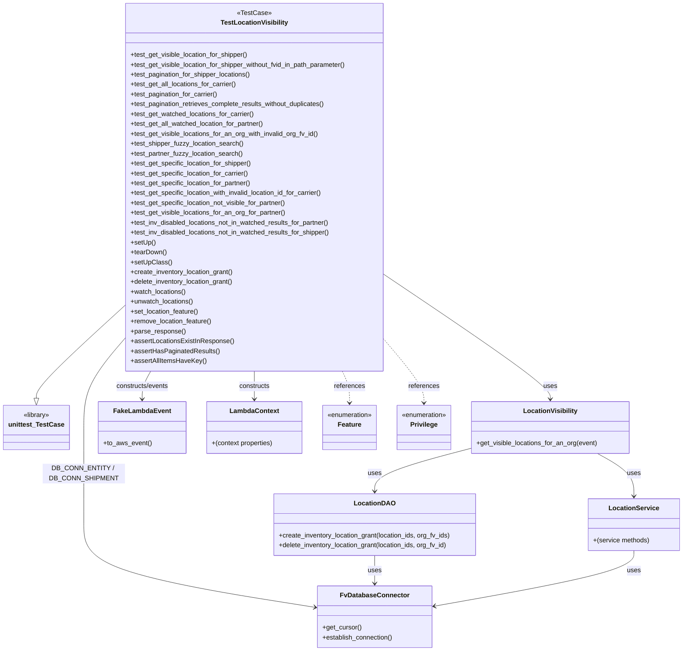
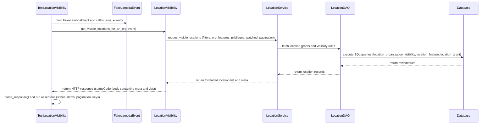

# Diagram: entity_core/entity_service/entity_inventory/entity_inventory_tests/integration/test_inventory_location_visibility.py

> Auto-generated by Obscura crawlers

## Diagram 1

### SVG

<svg id="container" width="1654.060546875" xmlns="http://www.w3.org/2000/svg" class="classDiagram" height="1582" viewBox="0 0 1654.060546875 1582" role="graphics-document document" aria-roledescription="class"><g><defs><marker id="container_class-aggregationStart" class="marker aggregation class" refX="18" refY="7" markerWidth="190" markerHeight="240" orient="auto"><path d="M 18,7 L9,13 L1,7 L9,1 Z"></path></marker></defs><defs><marker id="container_class-aggregationEnd" class="marker aggregation class" refX="1" refY="7" markerWidth="20" markerHeight="28" orient="auto"><path d="M 18,7 L9,13 L1,7 L9,1 Z"></path></marker></defs><defs><marker id="container_class-extensionStart" class="marker extension class" refX="18" refY="7" markerWidth="190" markerHeight="240" orient="auto"><path d="M 1,7 L18,13 V 1 Z"></path></marker></defs><defs><marker id="container_class-extensionEnd" class="marker extension class" refX="1" refY="7" markerWidth="20" markerHeight="28" orient="auto"><path d="M 1,1 V 13 L18,7 Z"></path></marker></defs><defs><marker id="container_class-compositionStart" class="marker composition class" refX="18" refY="7" markerWidth="190" markerHeight="240" orient="auto"><path d="M 18,7 L9,13 L1,7 L9,1 Z"></path></marker></defs><defs><marker id="container_class-compositionEnd" class="marker composition class" refX="1" refY="7" markerWidth="20" markerHeight="28" orient="auto"><path d="M 18,7 L9,13 L1,7 L9,1 Z"></path></marker></defs><defs><marker id="container_class-dependencyStart" class="marker dependency class" refX="6" refY="7" markerWidth="190" markerHeight="240" orient="auto"><path d="M 5,7 L9,13 L1,7 L9,1 Z"></path></marker></defs><defs><marker id="container_class-dependencyEnd" class="marker dependency class" refX="13" refY="7" markerWidth="20" markerHeight="28" orient="auto"><path d="M 18,7 L9,13 L14,7 L9,1 Z"></path></marker></defs><defs><marker id="container_class-lollipopStart" class="marker lollipop class" refX="13" refY="7" markerWidth="190" markerHeight="240" orient="auto"><circle stroke="black" fill="transparent" cx="7" cy="7" r="6"></circle></marker></defs><defs><marker id="container_class-lollipopEnd" class="marker lollipop class" refX="1" refY="7" markerWidth="190" markerHeight="240" orient="auto"><circle stroke="black" fill="transparent" cx="7" cy="7" r="6"></circle></marker></defs><g class="root"><g class="clusters"></g><g class="edgePaths"><path d="M286.148,751.654L252.617,782.878C219.086,814.102,152.023,876.551,118.492,912.567C84.961,948.583,84.961,958.167,84.961,962.958L84.961,967.75" id="id_TestLocationVisibility_unittest_TestCase_1" class="edge-thickness-normal edge-pattern-solid relation" style=";;;" data-edge="true" data-et="edge" data-id="id_TestLocationVisibility_unittest_TestCase_1" data-points="W3sieCI6Mjg2LjE0ODQzNzUsInkiOjc1MS42NTM2MDk3MDQwMzg5fSx7IngiOjg0Ljk2MDkzNzUsInkiOjkzOX0seyJ4Ijo4NC45NjA5Mzc1LCJ5Ijo5ODV9XQ==" marker-end="url(#container_class-extensionEnd)"></path><path d="M923.289,666.774L991.54,712.145C1059.792,757.516,1196.294,848.258,1264.546,898.796C1332.797,949.333,1332.797,959.667,1332.797,964.833L1332.797,970" id="id_TestLocationVisibility_LocationVisibility_2" class="edge-thickness-normal edge-pattern-solid relation" style=";;;" data-edge="true" data-et="edge" data-id="id_TestLocationVisibility_LocationVisibility_2" data-points="W3sieCI6OTIzLjI4OTA2MjUsInkiOjY2Ni43NzQwMTk3ODY2ODE1fSx7IngiOjEzMzIuNzk2ODc1LCJ5Ijo5Mzl9LHsieCI6MTMzMi43OTY4NzUsInkiOjk3Nn1d" marker-end="url(#container_class-dependencyEnd)"></path><path d="M355.68,902L352.245,908.167C348.809,914.333,341.938,926.667,338.502,938C335.066,949.333,335.066,959.667,335.066,964.833L335.066,970" id="id_TestLocationVisibility_FakeLambdaEvent_3" class="edge-thickness-normal edge-pattern-solid relation" style=";;;" data-edge="true" data-et="edge" data-id="id_TestLocationVisibility_FakeLambdaEvent_3" data-points="W3sieCI6MzU1LjY4MDMyNTA5MDM5MjU2LCJ5Ijo5MDJ9LHsieCI6MzM1LjA2NjQwNjI1LCJ5Ijo5Mzl9LHsieCI6MzM1LjA2NjQwNjI1LCJ5Ijo5NzZ9XQ==" marker-end="url(#container_class-dependencyEnd)"></path><path d="M604.719,902L604.719,908.167C604.719,914.333,604.719,926.667,604.719,938C604.719,949.333,604.719,959.667,604.719,964.833L604.719,970" id="id_TestLocationVisibility_LambdaContext_4" class="edge-thickness-normal edge-pattern-solid relation" style=";;;" data-edge="true" data-et="edge" data-id="id_TestLocationVisibility_LambdaContext_4" data-points="W3sieCI6NjA0LjcxODc1LCJ5Ijo5MDJ9LHsieCI6NjA0LjcxODc1LCJ5Ijo5Mzl9LHsieCI6NjA0LjcxODc1LCJ5Ijo5NzZ9XQ==" marker-end="url(#container_class-dependencyEnd)"></path><path d="M286.148,833.1L271.277,850.75C256.406,868.4,226.664,903.7,211.793,938.017C196.922,972.333,196.922,1005.667,196.922,1041C196.922,1076.333,196.922,1113.667,196.922,1153C196.922,1192.333,196.922,1233.667,196.922,1273C196.922,1312.333,196.922,1349.667,291.083,1383.204C385.243,1416.742,573.565,1446.483,667.725,1461.354L761.886,1476.225" id="id_TestLocationVisibility_FvDatabaseConnector_5" class="edge-thickness-normal edge-pattern-solid relation" style=";;;" data-edge="true" data-et="edge" data-id="id_TestLocationVisibility_FvDatabaseConnector_5" data-points="W3sieCI6Mjg2LjE0ODQzNzUsInkiOjgzMy4xMDAwODA0NjI4NTI5fSx7IngiOjE5Ni45MjE4NzUsInkiOjkzOX0seyJ4IjoxOTYuOTIxODc1LCJ5IjoxMDM5fSx7IngiOjE5Ni45MjE4NzUsInkiOjExNTF9LHsieCI6MTk2LjkyMTg3NSwieSI6MTI3NX0seyJ4IjoxOTYuOTIxODc1LCJ5IjoxMzg3fSx7IngiOjc2Ny44MTI1LCJ5IjoxNDc3LjE2MDY1MDg0MzU3Mzl9XQ==" marker-end="url(#container_class-dependencyEnd)"></path><path d="M1447.311,1102L1462.155,1110.167C1476.999,1118.333,1506.688,1134.667,1521.533,1152C1536.377,1169.333,1536.377,1187.667,1536.377,1196.833L1536.377,1206" id="id_LocationVisibility_LocationService_6" class="edge-thickness-normal edge-pattern-solid relation" style=";;;" data-edge="true" data-et="edge" data-id="id_LocationVisibility_LocationService_6" data-points="W3sieCI6MTQ0Ny4zMTA2Njg5NDUzMTI1LCJ5IjoxMTAyfSx7IngiOjE1MzYuMzc2OTUzMTI1LCJ5IjoxMTUxfSx7IngiOjE1MzYuMzc2OTUzMTI1LCJ5IjoxMjEyfV0=" marker-end="url(#container_class-dependencyEnd)"></path><path d="M1141.445,1089.226L1102.221,1099.522C1062.996,1109.817,984.547,1130.409,945.322,1147.871C906.098,1165.333,906.098,1179.667,906.098,1186.833L906.098,1194" id="id_LocationVisibility_LocationDAO_7" class="edge-thickness-normal edge-pattern-solid relation" style=";;;" data-edge="true" data-et="edge" data-id="id_LocationVisibility_LocationDAO_7" data-points="W3sieCI6MTE0MS40NDUzMTI1LCJ5IjoxMDg5LjIyNTk1MzIyMDEyMTd9LHsieCI6OTA2LjA5NzY1NjI1LCJ5IjoxMTUxfSx7IngiOjkwNi4wOTc2NTYyNSwieSI6MTIwMH1d" marker-end="url(#container_class-dependencyEnd)"></path><path d="M906.098,1350L906.098,1356.167C906.098,1362.333,906.098,1374.667,906.098,1386C906.098,1397.333,906.098,1407.667,906.098,1412.833L906.098,1418" id="id_LocationDAO_FvDatabaseConnector_8" class="edge-thickness-normal edge-pattern-solid relation" style=";;;" data-edge="true" data-et="edge" data-id="id_LocationDAO_FvDatabaseConnector_8" data-points="W3sieCI6OTA2LjA5NzY1NjI1LCJ5IjoxMzUwfSx7IngiOjkwNi4wOTc2NTYyNSwieSI6MTM4N30seyJ4Ijo5MDYuMDk3NjU2MjUsInkiOjE0MjR9XQ==" marker-end="url(#container_class-dependencyEnd)"></path><path d="M1536.377,1338L1536.377,1346.167C1536.377,1354.333,1536.377,1370.667,1455.363,1393.23C1374.348,1415.792,1212.319,1444.585,1131.305,1458.981L1050.29,1473.377" id="id_LocationService_FvDatabaseConnector_9" class="edge-thickness-normal edge-pattern-solid relation" style=";;;" data-edge="true" data-et="edge" data-id="id_LocationService_FvDatabaseConnector_9" data-points="W3sieCI6MTUzNi4zNzY5NTMxMjUsInkiOjEzMzh9LHsieCI6MTUzNi4zNzY5NTMxMjUsInkiOjEzODd9LHsieCI6MTA0NC4zODI4MTI1LCJ5IjoxNDc0LjQyNjg2NjE4OTY1NDJ9XQ==" marker-end="url(#container_class-dependencyEnd)"></path><path d="M820.888,902L823.87,908.167C826.852,914.333,832.817,926.667,835.799,939.5C838.781,952.333,838.781,965.667,838.781,972.333L838.781,979" id="id_TestLocationVisibility_Feature_10" class="edge-thickness-normal edge-pattern-dashed relation" style=";;;" data-edge="true" data-et="edge" data-id="id_TestLocationVisibility_Feature_10" data-points="W3sieCI6ODIwLjg4ODA0MjM1NTM3MTksInkiOjkwMn0seyJ4Ijo4MzguNzgxMjUsInkiOjkzOX0seyJ4Ijo4MzguNzgxMjUsInkiOjk4NX1d" marker-end="url(#container_class-dependencyEnd)"></path><path d="M923.289,822.84L940.056,842.2C956.823,861.56,990.357,900.28,1007.124,926.307C1023.891,952.333,1023.891,965.667,1023.891,972.333L1023.891,979" id="id_TestLocationVisibility_Privilege_11" class="edge-thickness-normal edge-pattern-dashed relation" style=";;;" data-edge="true" data-et="edge" data-id="id_TestLocationVisibility_Privilege_11" data-points="W3sieCI6OTIzLjI4OTA2MjUsInkiOjgyMi44Mzk2MzkxNjk0OTM1fSx7IngiOjEwMjMuODkwNjI1LCJ5Ijo5Mzl9LHsieCI6MTAyMy44OTA2MjUsInkiOjk4NX1d" marker-end="url(#container_class-dependencyEnd)"></path></g><g class="edgeLabels"><g class="edgeLabel"><g class="label" data-id="id_TestLocationVisibility_unittest_TestCase_1" transform="translate(0, 0)"><foreignObject width="0" height="0">

</foreignObject></g></g><g class="edgeLabel" transform="translate(1332.796875, 939)"><g class="label" data-id="id_TestLocationVisibility_LocationVisibility_2" transform="translate(-16.4921875, -12)"><foreignObject width="32.984375" height="24">

uses

</foreignObject></g></g><g class="edgeLabel" transform="translate(335.06640625, 939)"><g class="label" data-id="id_TestLocationVisibility_FakeLambdaEvent_3" transform="translate(-65.5078125, -12)"><foreignObject width="131.015625" height="24">

constructs/events

</foreignObject></g></g><g class="edgeLabel" transform="translate(604.71875, 939)"><g class="label" data-id="id_TestLocationVisibility_LambdaContext_4" transform="translate(-37.84375, -12)"><foreignObject width="75.6875" height="24">

constructs

</foreignObject></g></g><g class="edgeLabel" transform="translate(196.921875, 1151)"><g class="label" data-id="id_TestLocationVisibility_FvDatabaseConnector_5" transform="translate(-100, -24)"><foreignObject width="200" height="48">

DB_CONN_ENTITY / DB_CONN_SHIPMENT

</foreignObject></g></g><g class="edgeLabel" transform="translate(1536.376953125, 1151)"><g class="label" data-id="id_LocationVisibility_LocationService_6" transform="translate(-16.4921875, -12)"><foreignObject width="32.984375" height="24">

uses

</foreignObject></g></g><g class="edgeLabel" transform="translate(906.09765625, 1151)"><g class="label" data-id="id_LocationVisibility_LocationDAO_7" transform="translate(-16.4921875, -12)"><foreignObject width="32.984375" height="24">

uses

</foreignObject></g></g><g class="edgeLabel" transform="translate(906.09765625, 1387)"><g class="label" data-id="id_LocationDAO_FvDatabaseConnector_8" transform="translate(-16.4921875, -12)"><foreignObject width="32.984375" height="24">

uses

</foreignObject></g></g><g class="edgeLabel" transform="translate(1536.376953125, 1387)"><g class="label" data-id="id_LocationService_FvDatabaseConnector_9" transform="translate(-16.4921875, -12)"><foreignObject width="32.984375" height="24">

uses

</foreignObject></g></g><g class="edgeLabel" transform="translate(838.78125, 939)"><g class="label" data-id="id_TestLocationVisibility_Feature_10" transform="translate(-37.828125, -12)"><foreignObject width="75.65625" height="24">

references

</foreignObject></g></g><g class="edgeLabel" transform="translate(1023.890625, 939)"><g class="label" data-id="id_TestLocationVisibility_Privilege_11" transform="translate(-37.828125, -12)"><foreignObject width="75.65625" height="24">

references

</foreignObject></g></g></g><g class="nodes"><g class="node default" id="classId-TestLocationVisibility-0" transform="translate(604.71875, 455)"><g class="basic label-container"><path d="M-318.5703125 -447 L318.5703125 -447 L318.5703125 447 L-318.5703125 447" stroke="none" stroke-width="0" fill="#ECECFF" style=""></path><path d="M-318.5703125 -447 C-90.17995806948963 -447, 138.21039636102074 -447, 318.5703125 -447 M-318.5703125 -447 C-93.70080405488318 -447, 131.16870439023364 -447, 318.5703125 -447 M318.5703125 -447 C318.5703125 -141.30999591195666, 318.5703125 164.38000817608668, 318.5703125 447 M318.5703125 -447 C318.5703125 -256.84542669561097, 318.5703125 -66.69085339122194, 318.5703125 447 M318.5703125 447 C151.64322185504864 447, -15.283868789902726 447, -318.5703125 447 M318.5703125 447 C151.64273160016722 447, -15.284849299665552 447, -318.5703125 447 M-318.5703125 447 C-318.5703125 99.03996624953572, -318.5703125 -248.92006750092855, -318.5703125 -447 M-318.5703125 447 C-318.5703125 150.6918891395532, -318.5703125 -145.61622172089358, -318.5703125 -447" stroke="#9370DB" stroke-width="1.3" fill="none" stroke-dasharray="0 0" style=""></path></g><g class="annotation-group text" transform="translate(-40.2578125, -423)"><g class="label" style="" transform="translate(0,-12)"><foreignObject width="80.515625" height="24">

«TestCase»

</foreignObject></g></g><g class="label-group text" transform="translate(-78.390625, -399)"><g class="label" style="font-weight: bolder" transform="translate(0,-12)"><foreignObject width="156.78125" height="24">

TestLocationVisibility

</foreignObject></g></g><g class="members-group text" transform="translate(-306.5703125, -351)"></g><g class="methods-group text" transform="translate(-306.5703125, -321)"><g class="label" style="" transform="translate(0,-12)"><foreignObject width="289.859375" height="24">

+test_get_visible_location_for_shipper()

</foreignObject></g><g class="label" style="" transform="translate(0,12)"><foreignObject width="534.75" height="24">

+test_get_visible_location_for_shipper_without_fvid_in_path_parameter()

</foreignObject></g><g class="label" style="" transform="translate(0,36)"><foreignObject width="296.4375" height="24">

+test_pagination_for_shipper_locations()

</foreignObject></g><g class="label" style="" transform="translate(0,60)"><foreignObject width="260.578125" height="24">

+test_get_all_locations_for_carrier()

</foreignObject></g><g class="label" style="" transform="translate(0,84)"><foreignObject width="215.296875" height="24">

+test_pagination_for_carrier()

</foreignObject></g><g class="label" style="" transform="translate(0,108)"><foreignObject width="482.8125" height="24">

+test_pagination_retrieves_complete_results_without_duplicates()

</foreignObject></g><g class="label" style="" transform="translate(0,132)"><foreignObject width="303.5" height="24">

+test_get_watched_locations_for_carrier()

</foreignObject></g><g class="label" style="" transform="translate(0,156)"><foreignObject width="328.90625" height="24">

+test_get_all_watched_location_for_partner()

</foreignObject></g><g class="label" style="" transform="translate(0,180)"><foreignObject width="462.15625" height="24">

+test_get_visible_locations_for_an_org_with_invalid_org_fv_id()

</foreignObject></g><g class="label" style="" transform="translate(0,204)"><foreignObject width="275.21875" height="24">

+test_shipper_fuzzy_location_search()

</foreignObject></g><g class="label" style="" transform="translate(0,228)"><foreignObject width="274.234375" height="24">

+test_partner_fuzzy_location_search()

</foreignObject></g><g class="label" style="" transform="translate(0,252)"><foreignObject width="298.171875" height="24">

+test_get_specific_location_for_shipper()

</foreignObject></g><g class="label" style="" transform="translate(0,276)"><foreignObject width="290.53125" height="24">

+test_get_specific_location_for_carrier()

</foreignObject></g><g class="label" style="" transform="translate(0,300)"><foreignObject width="297.171875" height="24">

+test_get_specific_location_for_partner()

</foreignObject></g><g class="label" style="" transform="translate(0,324)"><foreignObject width="476.40625" height="24">

+test_get_specific_location_with_invalid_location_id_for_carrier()

</foreignObject></g><g class="label" style="" transform="translate(0,348)"><foreignObject width="384.71875" height="24">

+test_get_specific_location_not_visible_for_partner()

</foreignObject></g><g class="label" style="" transform="translate(0,372)"><foreignObject width="381.203125" height="24">

+test_get_visible_locations_for_an_org_for_partner()

</foreignObject></g><g class="label" style="" transform="translate(0,396)"><foreignObject width="491.25" height="24">

+test_inv_disabled_locations_not_in_watched_results_for_partner()

</foreignObject></g><g class="label" style="" transform="translate(0,420)"><foreignObject width="492.25" height="24">

+test_inv_disabled_locations_not_in_watched_results_for_shipper()

</foreignObject></g><g class="label" style="" transform="translate(0,444)"><foreignObject width="60.421875" height="24">

+setUp()

</foreignObject></g><g class="label" style="" transform="translate(0,468)"><foreignObject width="87.75" height="24">

+tearDown()

</foreignObject></g><g class="label" style="" transform="translate(0,492)"><foreignObject width="97.15625" height="24">

+setUpClass()

</foreignObject></g><g class="label" style="" transform="translate(0,516)"><foreignObject width="252.921875" height="24">

+create_inventory_location_grant()

</foreignObject></g><g class="label" style="" transform="translate(0,540)"><foreignObject width="253.921875" height="24">

+delete_inventory_location_grant()

</foreignObject></g><g class="label" style="" transform="translate(0,564)"><foreignObject width="135.6875" height="24">

+watch_locations()

</foreignObject></g><g class="label" style="" transform="translate(0,588)"><foreignObject width="154.375" height="24">

+unwatch_locations()

</foreignObject></g><g class="label" style="" transform="translate(0,612)"><foreignObject width="167.609375" height="24">

+set_location_feature()

</foreignObject></g><g class="label" style="" transform="translate(0,636)"><foreignObject width="199.25" height="24">

+remove_location_feature()

</foreignObject></g><g class="label" style="" transform="translate(0,660)"><foreignObject width="132.84375" height="24">

+parse_response()

</foreignObject></g><g class="label" style="" transform="translate(0,684)"><foreignObject width="249.921875" height="24">

+assertLocationsExistInResponse()

</foreignObject></g><g class="label" style="" transform="translate(0,708)"><foreignObject width="213.59375" height="24">

+assertHasPaginatedResults()

</foreignObject></g><g class="label" style="" transform="translate(0,732)"><foreignObject width="182.421875" height="24">

+assertAllItemsHaveKey()

</foreignObject></g></g><g class="divider" style=""><path d="M-318.5703125 -375 C-114.90645319184875 -375, 88.75740611630249 -375, 318.5703125 -375 M-318.5703125 -375 C-175.26591081275922 -375, -31.961509125518432 -375, 318.5703125 -375" stroke="#9370DB" stroke-width="1.3" fill="none" stroke-dasharray="0 0" style=""></path></g><g class="divider" style=""><path d="M-318.5703125 -351 C-181.36312820896734 -351, -44.15594391793468 -351, 318.5703125 -351 M-318.5703125 -351 C-168.22982986998335 -351, -17.889347239966696 -351, 318.5703125 -351" stroke="#9370DB" stroke-width="1.3" fill="none" stroke-dasharray="0 0" style=""></path></g></g><g class="node default" id="classId-unittest_TestCase-1" transform="translate(84.9609375, 1039)"><g class="basic label-container"><path d="M-76.9609375 -54 L76.9609375 -54 L76.9609375 54 L-76.9609375 54" stroke="none" stroke-width="0" fill="#ECECFF" style=""></path><path d="M-76.9609375 -54 C-42.384341316521265 -54, -7.8077451330425305 -54, 76.9609375 -54 M-76.9609375 -54 C-25.803759981154734 -54, 25.353417537690532 -54, 76.9609375 -54 M76.9609375 -54 C76.9609375 -17.07264530658432, 76.9609375 19.85470938683136, 76.9609375 54 M76.9609375 -54 C76.9609375 -24.67085101831661, 76.9609375 4.658297963366778, 76.9609375 54 M76.9609375 54 C45.3819743749453 54, 13.803011249890602 54, -76.9609375 54 M76.9609375 54 C44.378178297813854 54, 11.795419095627707 54, -76.9609375 54 M-76.9609375 54 C-76.9609375 30.64785485120457, -76.9609375 7.295709702409141, -76.9609375 -54 M-76.9609375 54 C-76.9609375 19.208715369464457, -76.9609375 -15.582569261071086, -76.9609375 -54" stroke="#9370DB" stroke-width="1.3" fill="none" stroke-dasharray="0 0" style=""></path></g><g class="annotation-group text" transform="translate(-32.6640625, -30)"><g class="label" style="" transform="translate(0,-12)"><foreignObject width="65.328125" height="24">

«library»

</foreignObject></g></g><g class="label-group text" transform="translate(-64.9609375, -6)"><g class="label" style="font-weight: bolder" transform="translate(0,-12)"><foreignObject width="129.921875" height="24">

unittest_TestCase

</foreignObject></g></g><g class="members-group text" transform="translate(-64.9609375, 42)"></g><g class="methods-group text" transform="translate(-64.9609375, 72)"></g><g class="divider" style=""><path d="M-76.9609375 18 C-35.79524199570319 18, 5.370453508593613 18, 76.9609375 18 M-76.9609375 18 C-39.67246490747485 18, -2.383992314949694 18, 76.9609375 18" stroke="#9370DB" stroke-width="1.3" fill="none" stroke-dasharray="0 0" style=""></path></g><g class="divider" style=""><path d="M-76.9609375 36 C-25.805620951443878 36, 25.349695597112245 36, 76.9609375 36 M-76.9609375 36 C-34.53324304127122 36, 7.89445141745756 36, 76.9609375 36" stroke="#9370DB" stroke-width="1.3" fill="none" stroke-dasharray="0 0" style=""></path></g></g><g class="node default" id="classId-LocationVisibility-2" transform="translate(1332.796875, 1039)"><g class="basic label-container"><path d="M-191.3515625 -63 L191.3515625 -63 L191.3515625 63 L-191.3515625 63" stroke="none" stroke-width="0" fill="#ECECFF" style=""></path><path d="M-191.3515625 -63 C-68.45135454467102 -63, 54.44885341065796 -63, 191.3515625 -63 M-191.3515625 -63 C-69.26433037142286 -63, 52.822901757154284 -63, 191.3515625 -63 M191.3515625 -63 C191.3515625 -33.90590666672088, 191.3515625 -4.811813333441762, 191.3515625 63 M191.3515625 -63 C191.3515625 -25.784564761504264, 191.3515625 11.430870476991473, 191.3515625 63 M191.3515625 63 C55.824823109235666 63, -79.70191628152867 63, -191.3515625 63 M191.3515625 63 C48.12999190735576 63, -95.09157868528848 63, -191.3515625 63 M-191.3515625 63 C-191.3515625 14.348301634873415, -191.3515625 -34.30339673025317, -191.3515625 -63 M-191.3515625 63 C-191.3515625 22.40992858099346, -191.3515625 -18.180142838013083, -191.3515625 -63" stroke="#9370DB" stroke-width="1.3" fill="none" stroke-dasharray="0 0" style=""></path></g><g class="annotation-group text" transform="translate(0, -39)"></g><g class="label-group text" transform="translate(-63.140625, -39)"><g class="label" style="font-weight: bolder" transform="translate(0,-12)"><foreignObject width="126.28125" height="24">

LocationVisibility

</foreignObject></g></g><g class="members-group text" transform="translate(-179.3515625, 9)"></g><g class="methods-group text" transform="translate(-179.3515625, 39)"><g class="label" style="" transform="translate(0,-12)"><foreignObject width="295.5625" height="24">

+get_visible_locations_for_an_org(event)

</foreignObject></g></g><g class="divider" style=""><path d="M-191.3515625 -15 C-82.72607845319001 -15, 25.899405593619974 -15, 191.3515625 -15 M-191.3515625 -15 C-56.38123160326012 -15, 78.58909929347976 -15, 191.3515625 -15" stroke="#9370DB" stroke-width="1.3" fill="none" stroke-dasharray="0 0" style=""></path></g><g class="divider" style=""><path d="M-191.3515625 9 C-64.14312289996228 9, 63.06531670007544 9, 191.3515625 9 M-191.3515625 9 C-74.86472403570518 9, 41.62211442858964 9, 191.3515625 9" stroke="#9370DB" stroke-width="1.3" fill="none" stroke-dasharray="0 0" style=""></path></g></g><g class="node default" id="classId-LocationService-3" transform="translate(1536.376953125, 1275)"><g class="basic label-container"><path d="M-109.68359375 -63 L109.68359375 -63 L109.68359375 63 L-109.68359375 63" stroke="none" stroke-width="0" fill="#ECECFF" style=""></path><path d="M-109.68359375 -63 C-65.22734174240969 -63, -20.77108973481937 -63, 109.68359375 -63 M-109.68359375 -63 C-46.753304132046466 -63, 16.176985485907068 -63, 109.68359375 -63 M109.68359375 -63 C109.68359375 -34.708160895438496, 109.68359375 -6.416321790876999, 109.68359375 63 M109.68359375 -63 C109.68359375 -27.275226833619875, 109.68359375 8.44954633276025, 109.68359375 63 M109.68359375 63 C33.076617661997574 63, -43.53035842600485 63, -109.68359375 63 M109.68359375 63 C35.42519348278934 63, -38.83320678442132 63, -109.68359375 63 M-109.68359375 63 C-109.68359375 32.519959096131394, -109.68359375 2.039918192262789, -109.68359375 -63 M-109.68359375 63 C-109.68359375 34.46530160151194, -109.68359375 5.930603203023871, -109.68359375 -63" stroke="#9370DB" stroke-width="1.3" fill="none" stroke-dasharray="0 0" style=""></path></g><g class="annotation-group text" transform="translate(0, -39)"></g><g class="label-group text" transform="translate(-57.9921875, -39)"><g class="label" style="font-weight: bolder" transform="translate(0,-12)"><foreignObject width="115.984375" height="24">

LocationService

</foreignObject></g></g><g class="members-group text" transform="translate(-97.68359375, 9)"></g><g class="methods-group text" transform="translate(-97.68359375, 39)"><g class="label" style="" transform="translate(0,-12)"><foreignObject width="137.375" height="24">

+(service methods)

</foreignObject></g></g><g class="divider" style=""><path d="M-109.68359375 -15 C-42.024539031532214 -15, 25.634515686935572 -15, 109.68359375 -15 M-109.68359375 -15 C-51.79920579343912 -15, 6.0851821631217575 -15, 109.68359375 -15" stroke="#9370DB" stroke-width="1.3" fill="none" stroke-dasharray="0 0" style=""></path></g><g class="divider" style=""><path d="M-109.68359375 9 C-36.67242743681717 9, 36.33873887636565 9, 109.68359375 9 M-109.68359375 9 C-36.09195725375339 9, 37.499679242493215 9, 109.68359375 9" stroke="#9370DB" stroke-width="1.3" fill="none" stroke-dasharray="0 0" style=""></path></g></g><g class="node default" id="classId-LocationDAO-4" transform="translate(906.09765625, 1275)"><g class="basic label-container"><path d="M-247.4765625 -75 L247.4765625 -75 L247.4765625 75 L-247.4765625 75" stroke="none" stroke-width="0" fill="#ECECFF" style=""></path><path d="M-247.4765625 -75 C-100.66242398309441 -75, 46.15171453381117 -75, 247.4765625 -75 M-247.4765625 -75 C-81.60789592768583 -75, 84.26077064462834 -75, 247.4765625 -75 M247.4765625 -75 C247.4765625 -44.71151157511535, 247.4765625 -14.423023150230712, 247.4765625 75 M247.4765625 -75 C247.4765625 -40.43263943631328, 247.4765625 -5.865278872626561, 247.4765625 75 M247.4765625 75 C63.18782299983175 75, -121.1009165003365 75, -247.4765625 75 M247.4765625 75 C83.58965829142755 75, -80.29724591714489 75, -247.4765625 75 M-247.4765625 75 C-247.4765625 26.13827461083956, -247.4765625 -22.72345077832088, -247.4765625 -75 M-247.4765625 75 C-247.4765625 15.0425543313238, -247.4765625 -44.9148913373524, -247.4765625 -75" stroke="#9370DB" stroke-width="1.3" fill="none" stroke-dasharray="0 0" style=""></path></g><g class="annotation-group text" transform="translate(0, -51)"></g><g class="label-group text" transform="translate(-46.640625, -51)"><g class="label" style="font-weight: bolder" transform="translate(0,-12)"><foreignObject width="93.28125" height="24">

LocationDAO

</foreignObject></g></g><g class="members-group text" transform="translate(-235.4765625, -3)"></g><g class="methods-group text" transform="translate(-235.4765625, 27)"><g class="label" style="" transform="translate(0,-12)"><foreignObject width="424.3125" height="24">

+create_inventory_location_grant(location_ids, org_fv_ids)

</foreignObject></g><g class="label" style="" transform="translate(0,12)"><foreignObject width="417.84375" height="24">

+delete_inventory_location_grant(location_ids, org_fv_id)

</foreignObject></g></g><g class="divider" style=""><path d="M-247.4765625 -27 C-92.42899214498539 -27, 62.61857821002923 -27, 247.4765625 -27 M-247.4765625 -27 C-61.94518918269523 -27, 123.58618413460954 -27, 247.4765625 -27" stroke="#9370DB" stroke-width="1.3" fill="none" stroke-dasharray="0 0" style=""></path></g><g class="divider" style=""><path d="M-247.4765625 -3 C-87.31286149470682 -3, 72.85083951058635 -3, 247.4765625 -3 M-247.4765625 -3 C-83.92895605705675 -3, 79.6186503858865 -3, 247.4765625 -3" stroke="#9370DB" stroke-width="1.3" fill="none" stroke-dasharray="0 0" style=""></path></g></g><g class="node default" id="classId-FvDatabaseConnector-5" transform="translate(906.09765625, 1499)"><g class="basic label-container"><path d="M-138.28515625 -75 L138.28515625 -75 L138.28515625 75 L-138.28515625 75" stroke="none" stroke-width="0" fill="#ECECFF" style=""></path><path d="M-138.28515625 -75 C-36.772381771058704 -75, 64.74039270788259 -75, 138.28515625 -75 M-138.28515625 -75 C-31.097312116004915 -75, 76.09053201799017 -75, 138.28515625 -75 M138.28515625 -75 C138.28515625 -30.007877026144257, 138.28515625 14.984245947711486, 138.28515625 75 M138.28515625 -75 C138.28515625 -30.693027617841835, 138.28515625 13.61394476431633, 138.28515625 75 M138.28515625 75 C40.49893614865826 75, -57.28728395268348 75, -138.28515625 75 M138.28515625 75 C39.956523828138174 75, -58.37210859372365 75, -138.28515625 75 M-138.28515625 75 C-138.28515625 35.642873153807024, -138.28515625 -3.7142536923859524, -138.28515625 -75 M-138.28515625 75 C-138.28515625 18.609476691047924, -138.28515625 -37.78104661790415, -138.28515625 -75" stroke="#9370DB" stroke-width="1.3" fill="none" stroke-dasharray="0 0" style=""></path></g><g class="annotation-group text" transform="translate(0, -51)"></g><g class="label-group text" transform="translate(-79.3046875, -51)"><g class="label" style="font-weight: bolder" transform="translate(0,-12)"><foreignObject width="158.609375" height="24">

FvDatabaseConnector

</foreignObject></g></g><g class="members-group text" transform="translate(-126.28515625, -3)"></g><g class="methods-group text" transform="translate(-126.28515625, 27)"><g class="label" style="" transform="translate(0,-12)"><foreignObject width="94.640625" height="24">

+get_cursor()

</foreignObject></g><g class="label" style="" transform="translate(0,12)"><foreignObject width="173.265625" height="24">

+establish_connection()

</foreignObject></g></g><g class="divider" style=""><path d="M-138.28515625 -27 C-30.235497680930138 -27, 77.81416088813972 -27, 138.28515625 -27 M-138.28515625 -27 C-65.92663976159555 -27, 6.431876726808895 -27, 138.28515625 -27" stroke="#9370DB" stroke-width="1.3" fill="none" stroke-dasharray="0 0" style=""></path></g><g class="divider" style=""><path d="M-138.28515625 -3 C-36.14534707725355 -3, 65.9944620954929 -3, 138.28515625 -3 M-138.28515625 -3 C-55.650195527543886 -3, 26.984765194912228 -3, 138.28515625 -3" stroke="#9370DB" stroke-width="1.3" fill="none" stroke-dasharray="0 0" style=""></path></g></g><g class="node default" id="classId-FakeLambdaEvent-6" transform="translate(335.06640625, 1039)"><g class="basic label-container"><path d="M-103.14453125 -63 L103.14453125 -63 L103.14453125 63 L-103.14453125 63" stroke="none" stroke-width="0" fill="#ECECFF" style=""></path><path d="M-103.14453125 -63 C-45.45491022519807 -63, 12.23471079960386 -63, 103.14453125 -63 M-103.14453125 -63 C-24.891807623991483 -63, 53.360916002017035 -63, 103.14453125 -63 M103.14453125 -63 C103.14453125 -23.356998944973725, 103.14453125 16.28600211005255, 103.14453125 63 M103.14453125 -63 C103.14453125 -20.593578084648854, 103.14453125 21.812843830702292, 103.14453125 63 M103.14453125 63 C53.023455472315746 63, 2.9023796946314917 63, -103.14453125 63 M103.14453125 63 C42.53401921637549 63, -18.07649281724902 63, -103.14453125 63 M-103.14453125 63 C-103.14453125 27.631586574606736, -103.14453125 -7.736826850786528, -103.14453125 -63 M-103.14453125 63 C-103.14453125 12.768809985273883, -103.14453125 -37.462380029452234, -103.14453125 -63" stroke="#9370DB" stroke-width="1.3" fill="none" stroke-dasharray="0 0" style=""></path></g><g class="annotation-group text" transform="translate(0, -39)"></g><g class="label-group text" transform="translate(-65.8671875, -39)"><g class="label" style="font-weight: bolder" transform="translate(0,-12)"><foreignObject width="131.734375" height="24">

FakeLambdaEvent

</foreignObject></g></g><g class="members-group text" transform="translate(-91.14453125, 9)"></g><g class="methods-group text" transform="translate(-91.14453125, 39)"><g class="label" style="" transform="translate(0,-12)"><foreignObject width="116.421875" height="24">

+to_aws_event()

</foreignObject></g></g><g class="divider" style=""><path d="M-103.14453125 -15 C-33.60545299142237 -15, 35.933625267155264 -15, 103.14453125 -15 M-103.14453125 -15 C-44.572489885173916 -15, 13.999551479652169 -15, 103.14453125 -15" stroke="#9370DB" stroke-width="1.3" fill="none" stroke-dasharray="0 0" style=""></path></g><g class="divider" style=""><path d="M-103.14453125 9 C-57.89784064537103 9, -12.651150040742067 9, 103.14453125 9 M-103.14453125 9 C-59.37932810522829 9, -15.614124960456579 9, 103.14453125 9" stroke="#9370DB" stroke-width="1.3" fill="none" stroke-dasharray="0 0" style=""></path></g></g><g class="node default" id="classId-LambdaContext-7" transform="translate(604.71875, 1039)"><g class="basic label-container"><path d="M-116.5078125 -63 L116.5078125 -63 L116.5078125 63 L-116.5078125 63" stroke="none" stroke-width="0" fill="#ECECFF" style=""></path><path d="M-116.5078125 -63 C-58.66465626777585 -63, -0.8215000355516935 -63, 116.5078125 -63 M-116.5078125 -63 C-59.540051078951215 -63, -2.572289657902431 -63, 116.5078125 -63 M116.5078125 -63 C116.5078125 -32.705351250529745, 116.5078125 -2.4107025010594825, 116.5078125 63 M116.5078125 -63 C116.5078125 -25.15651919902278, 116.5078125 12.686961601954437, 116.5078125 63 M116.5078125 63 C35.54229753459511 63, -45.423217430809785 63, -116.5078125 63 M116.5078125 63 C63.361541570443066 63, 10.215270640886132 63, -116.5078125 63 M-116.5078125 63 C-116.5078125 35.416317027792104, -116.5078125 7.832634055584208, -116.5078125 -63 M-116.5078125 63 C-116.5078125 23.20177146507602, -116.5078125 -16.596457069847958, -116.5078125 -63" stroke="#9370DB" stroke-width="1.3" fill="none" stroke-dasharray="0 0" style=""></path></g><g class="annotation-group text" transform="translate(0, -39)"></g><g class="label-group text" transform="translate(-57.296875, -39)"><g class="label" style="font-weight: bolder" transform="translate(0,-12)"><foreignObject width="114.59375" height="24">

LambdaContext

</foreignObject></g></g><g class="members-group text" transform="translate(-104.5078125, 9)"></g><g class="methods-group text" transform="translate(-104.5078125, 39)"><g class="label" style="" transform="translate(0,-12)"><foreignObject width="151.71875" height="24">

+(context properties)

</foreignObject></g></g><g class="divider" style=""><path d="M-116.5078125 -15 C-48.208208047269196 -15, 20.09139640546161 -15, 116.5078125 -15 M-116.5078125 -15 C-55.032983615645804 -15, 6.441845268708391 -15, 116.5078125 -15" stroke="#9370DB" stroke-width="1.3" fill="none" stroke-dasharray="0 0" style=""></path></g><g class="divider" style=""><path d="M-116.5078125 9 C-63.23355841211016 9, -9.959304324220327 9, 116.5078125 9 M-116.5078125 9 C-42.29114910497228 9, 31.925514290055446 9, 116.5078125 9" stroke="#9370DB" stroke-width="1.3" fill="none" stroke-dasharray="0 0" style=""></path></g></g><g class="node default" id="classId-Feature-8" transform="translate(838.78125, 1039)"><g class="basic label-container"><path d="M-67.5546875 -54 L67.5546875 -54 L67.5546875 54 L-67.5546875 54" stroke="none" stroke-width="0" fill="#ECECFF" style=""></path><path d="M-67.5546875 -54 C-22.161877029271686 -54, 23.230933441456628 -54, 67.5546875 -54 M-67.5546875 -54 C-32.070689982008055 -54, 3.41330753598389 -54, 67.5546875 -54 M67.5546875 -54 C67.5546875 -20.50024325571973, 67.5546875 12.999513488560538, 67.5546875 54 M67.5546875 -54 C67.5546875 -27.553120632783365, 67.5546875 -1.1062412655667302, 67.5546875 54 M67.5546875 54 C13.578322531277927 54, -40.39804243744415 54, -67.5546875 54 M67.5546875 54 C32.26041116676074 54, -3.0338651664785203 54, -67.5546875 54 M-67.5546875 54 C-67.5546875 17.98108338884547, -67.5546875 -18.03783322230906, -67.5546875 -54 M-67.5546875 54 C-67.5546875 31.303247107998228, -67.5546875 8.606494215996456, -67.5546875 -54" stroke="#9370DB" stroke-width="1.3" fill="none" stroke-dasharray="0 0" style=""></path></g><g class="annotation-group text" transform="translate(-55.5546875, -30)"><g class="label" style="" transform="translate(0,-12)"><foreignObject width="111.109375" height="24">

«enumeration»

</foreignObject></g></g><g class="label-group text" transform="translate(-27.390625, -6)"><g class="label" style="font-weight: bolder" transform="translate(0,-12)"><foreignObject width="54.78125" height="24">

Feature

</foreignObject></g></g><g class="members-group text" transform="translate(-55.5546875, 42)"></g><g class="methods-group text" transform="translate(-55.5546875, 72)"></g><g class="divider" style=""><path d="M-67.5546875 18 C-37.889905105934474 18, -8.225122711868948 18, 67.5546875 18 M-67.5546875 18 C-31.878122190332412 18, 3.7984431193351753 18, 67.5546875 18" stroke="#9370DB" stroke-width="1.3" fill="none" stroke-dasharray="0 0" style=""></path></g><g class="divider" style=""><path d="M-67.5546875 36 C-34.46369332781987 36, -1.3726991556397365 36, 67.5546875 36 M-67.5546875 36 C-25.301491804273773 36, 16.951703891452453 36, 67.5546875 36" stroke="#9370DB" stroke-width="1.3" fill="none" stroke-dasharray="0 0" style=""></path></g></g><g class="node default" id="classId-Privilege-9" transform="translate(1023.890625, 1039)"><g class="basic label-container"><path d="M-67.5546875 -54 L67.5546875 -54 L67.5546875 54 L-67.5546875 54" stroke="none" stroke-width="0" fill="#ECECFF" style=""></path><path d="M-67.5546875 -54 C-38.444726004458666 -54, -9.334764508917331 -54, 67.5546875 -54 M-67.5546875 -54 C-30.14460586569888 -54, 7.2654757686022435 -54, 67.5546875 -54 M67.5546875 -54 C67.5546875 -21.564911874829193, 67.5546875 10.870176250341615, 67.5546875 54 M67.5546875 -54 C67.5546875 -28.408510985992486, 67.5546875 -2.817021971984971, 67.5546875 54 M67.5546875 54 C17.540849534338356 54, -32.47298843132329 54, -67.5546875 54 M67.5546875 54 C36.243314200368545 54, 4.931940900737082 54, -67.5546875 54 M-67.5546875 54 C-67.5546875 10.937720413148057, -67.5546875 -32.12455917370389, -67.5546875 -54 M-67.5546875 54 C-67.5546875 27.188578554250185, -67.5546875 0.37715710850037, -67.5546875 -54" stroke="#9370DB" stroke-width="1.3" fill="none" stroke-dasharray="0 0" style=""></path></g><g class="annotation-group text" transform="translate(-55.5546875, -30)"><g class="label" style="" transform="translate(0,-12)"><foreignObject width="111.109375" height="24">

«enumeration»

</foreignObject></g></g><g class="label-group text" transform="translate(-31.8671875, -6)"><g class="label" style="font-weight: bolder" transform="translate(0,-12)"><foreignObject width="63.734375" height="24">

Privilege

</foreignObject></g></g><g class="members-group text" transform="translate(-55.5546875, 42)"></g><g class="methods-group text" transform="translate(-55.5546875, 72)"></g><g class="divider" style=""><path d="M-67.5546875 18 C-23.277352146323388 18, 20.999983207353225 18, 67.5546875 18 M-67.5546875 18 C-27.30579847434992 18, 12.943090551300159 18, 67.5546875 18" stroke="#9370DB" stroke-width="1.3" fill="none" stroke-dasharray="0 0" style=""></path></g><g class="divider" style=""><path d="M-67.5546875 36 C-36.14783852046821 36, -4.740989540936418 36, 67.5546875 36 M-67.5546875 36 C-39.26769754665624 36, -10.980707593312466 36, 67.5546875 36" stroke="#9370DB" stroke-width="1.3" fill="none" stroke-dasharray="0 0" style=""></path></g></g></g></g></g></svg>

## Diagram 2

### SVG

<svg id="container" width="2730.5" xmlns="http://www.w3.org/2000/svg" height="681" viewBox="-211 -10 2730.5 681" role="graphics-document document" aria-roledescription="sequence"><g><rect x="2319.5" y="595" fill="#eaeaea" stroke="#666" width="150" height="65" name="DB" rx="3" ry="3" class="actor actor-bottom"></rect><text x="2394.5" y="627.5" dominant-baseline="central" alignment-baseline="central" class="actor actor-box" style="text-anchor: middle; font-size: 16px; font-weight: 400;"><tspan x="2394.5" dy="0">Database</tspan></text></g><g><rect x="1621.5" y="595" fill="#eaeaea" stroke="#666" width="150" height="65" name="DAO" rx="3" ry="3" class="actor actor-bottom"></rect><text x="1696.5" y="627.5" dominant-baseline="central" alignment-baseline="central" class="actor actor-box" style="text-anchor: middle; font-size: 16px; font-weight: 400;"><tspan x="1696.5" dy="0">LocationDAO</tspan></text></g><g><rect x="1264.5" y="595" fill="#eaeaea" stroke="#666" width="150" height="65" name="LS" rx="3" ry="3" class="actor actor-bottom"></rect><text x="1339.5" y="627.5" dominant-baseline="central" alignment-baseline="central" class="actor actor-box" style="text-anchor: middle; font-size: 16px; font-weight: 400;"><tspan x="1339.5" dy="0">LocationService</tspan></text></g><g><rect x="628.5" y="595" fill="#eaeaea" stroke="#666" width="150" height="65" name="LV" rx="3" ry="3" class="actor actor-bottom"></rect><text x="703.5" y="627.5" dominant-baseline="central" alignment-baseline="central" class="actor actor-box" style="text-anchor: middle; font-size: 16px; font-weight: 400;"><tspan x="703.5" dy="0">LocationVisibility</tspan></text></g><g><rect x="427.5" y="595" fill="#eaeaea" stroke="#666" width="151" height="65" name="Event" rx="3" ry="3" class="actor actor-bottom"></rect><text x="503" y="627.5" dominant-baseline="central" alignment-baseline="central" class="actor actor-box" style="text-anchor: middle; font-size: 16px; font-weight: 400;"><tspan x="503" dy="0">FakeLambdaEvent</tspan></text></g><g><rect x="0" y="595" fill="#eaeaea" stroke="#666" width="174" height="65" name="Test" rx="3" ry="3" class="actor actor-bottom"></rect><text x="87" y="627.5" dominant-baseline="central" alignment-baseline="central" class="actor actor-box" style="text-anchor: middle; font-size: 16px; font-weight: 400;"><tspan x="87" dy="0">TestLocationVisibility</tspan></text></g><g><line id="actor5" x1="2394.5" y1="65" x2="2394.5" y2="595" class="actor-line 200" stroke-width="0.5px" stroke="#999" name="DB"></line><g id="root-5"><rect x="2319.5" y="0" fill="#eaeaea" stroke="#666" width="150" height="65" name="DB" rx="3" ry="3" class="actor actor-top"></rect><text x="2394.5" y="32.5" dominant-baseline="central" alignment-baseline="central" class="actor actor-box" style="text-anchor: middle; font-size: 16px; font-weight: 400;"><tspan x="2394.5" dy="0">Database</tspan></text></g></g><g><line id="actor4" x1="1696.5" y1="65" x2="1696.5" y2="595" class="actor-line 200" stroke-width="0.5px" stroke="#999" name="DAO"></line><g id="root-4"><rect x="1621.5" y="0" fill="#eaeaea" stroke="#666" width="150" height="65" name="DAO" rx="3" ry="3" class="actor actor-top"></rect><text x="1696.5" y="32.5" dominant-baseline="central" alignment-baseline="central" class="actor actor-box" style="text-anchor: middle; font-size: 16px; font-weight: 400;"><tspan x="1696.5" dy="0">LocationDAO</tspan></text></g></g><g><line id="actor3" x1="1339.5" y1="65" x2="1339.5" y2="595" class="actor-line 200" stroke-width="0.5px" stroke="#999" name="LS"></line><g id="root-3"><rect x="1264.5" y="0" fill="#eaeaea" stroke="#666" width="150" height="65" name="LS" rx="3" ry="3" class="actor actor-top"></rect><text x="1339.5" y="32.5" dominant-baseline="central" alignment-baseline="central" class="actor actor-box" style="text-anchor: middle; font-size: 16px; font-weight: 400;"><tspan x="1339.5" dy="0">LocationService</tspan></text></g></g><g><line id="actor2" x1="703.5" y1="65" x2="703.5" y2="595" class="actor-line 200" stroke-width="0.5px" stroke="#999" name="LV"></line><g id="root-2"><rect x="628.5" y="0" fill="#eaeaea" stroke="#666" width="150" height="65" name="LV" rx="3" ry="3" class="actor actor-top"></rect><text x="703.5" y="32.5" dominant-baseline="central" alignment-baseline="central" class="actor actor-box" style="text-anchor: middle; font-size: 16px; font-weight: 400;"><tspan x="703.5" dy="0">LocationVisibility</tspan></text></g></g><g><line id="actor1" x1="503" y1="65" x2="503" y2="595" class="actor-line 200" stroke-width="0.5px" stroke="#999" name="Event"></line><g id="root-1"><rect x="427.5" y="0" fill="#eaeaea" stroke="#666" width="151" height="65" name="Event" rx="3" ry="3" class="actor actor-top"></rect><text x="503" y="32.5" dominant-baseline="central" alignment-baseline="central" class="actor actor-box" style="text-anchor: middle; font-size: 16px; font-weight: 400;"><tspan x="503" dy="0">FakeLambdaEvent</tspan></text></g></g><g><line id="actor0" x1="87" y1="65" x2="87" y2="595" class="actor-line 200" stroke-width="0.5px" stroke="#999" name="Test"></line><g id="root-0"><rect x="0" y="0" fill="#eaeaea" stroke="#666" width="174" height="65" name="Test" rx="3" ry="3" class="actor actor-top"></rect><text x="87" y="32.5" dominant-baseline="central" alignment-baseline="central" class="actor actor-box" style="text-anchor: middle; font-size: 16px; font-weight: 400;"><tspan x="87" dy="0">TestLocationVisibility</tspan></text></g></g><g></g><defs><symbol id="computer" width="24" height="24"><path transform="scale(.5)" d="M2 2v13h20v-13h-20zm18 11h-16v-9h16v9zm-10.228 6l.466-1h3.524l.467 1h-4.457zm14.228 3h-24l2-6h2.104l-1.33 4h18.45l-1.297-4h2.073l2 6zm-5-10h-14v-7h14v7z"></path></symbol></defs><defs><symbol id="database" fill-rule="evenodd" clip-rule="evenodd"><path transform="scale(.5)" d="M12.258.001l.256.004.255.005.253.008.251.01.249.012.247.015.246.016.242.019.241.02.239.023.236.024.233.027.231.028.229.031.225.032.223.034.22.036.217.038.214.04.211.041.208.043.205.045.201.046.198.048.194.05.191.051.187.053.183.054.18.056.175.057.172.059.168.06.163.061.16.063.155.064.15.066.074.033.073.033.071.034.07.034.069.035.068.035.067.035.066.035.064.036.064.036.062.036.06.036.06.037.058.037.058.037.055.038.055.038.053.038.052.038.051.039.05.039.048.039.047.039.045.04.044.04.043.04.041.04.04.041.039.041.037.041.036.041.034.041.033.042.032.042.03.042.029.042.027.042.026.043.024.043.023.043.021.043.02.043.018.044.017.043.015.044.013.044.012.044.011.045.009.044.007.045.006.045.004.045.002.045.001.045v17l-.001.045-.002.045-.004.045-.006.045-.007.045-.009.044-.011.045-.012.044-.013.044-.015.044-.017.043-.018.044-.02.043-.021.043-.023.043-.024.043-.026.043-.027.042-.029.042-.03.042-.032.042-.033.042-.034.041-.036.041-.037.041-.039.041-.04.041-.041.04-.043.04-.044.04-.045.04-.047.039-.048.039-.05.039-.051.039-.052.038-.053.038-.055.038-.055.038-.058.037-.058.037-.06.037-.06.036-.062.036-.064.036-.064.036-.066.035-.067.035-.068.035-.069.035-.07.034-.071.034-.073.033-.074.033-.15.066-.155.064-.16.063-.163.061-.168.06-.172.059-.175.057-.18.056-.183.054-.187.053-.191.051-.194.05-.198.048-.201.046-.205.045-.208.043-.211.041-.214.04-.217.038-.22.036-.223.034-.225.032-.229.031-.231.028-.233.027-.236.024-.239.023-.241.02-.242.019-.246.016-.247.015-.249.012-.251.01-.253.008-.255.005-.256.004-.258.001-.258-.001-.256-.004-.255-.005-.253-.008-.251-.01-.249-.012-.247-.015-.245-.016-.243-.019-.241-.02-.238-.023-.236-.024-.234-.027-.231-.028-.228-.031-.226-.032-.223-.034-.22-.036-.217-.038-.214-.04-.211-.041-.208-.043-.204-.045-.201-.046-.198-.048-.195-.05-.19-.051-.187-.053-.184-.054-.179-.056-.176-.057-.172-.059-.167-.06-.164-.061-.159-.063-.155-.064-.151-.066-.074-.033-.072-.033-.072-.034-.07-.034-.069-.035-.068-.035-.067-.035-.066-.035-.064-.036-.063-.036-.062-.036-.061-.036-.06-.037-.058-.037-.057-.037-.056-.038-.055-.038-.053-.038-.052-.038-.051-.039-.049-.039-.049-.039-.046-.039-.046-.04-.044-.04-.043-.04-.041-.04-.04-.041-.039-.041-.037-.041-.036-.041-.034-.041-.033-.042-.032-.042-.03-.042-.029-.042-.027-.042-.026-.043-.024-.043-.023-.043-.021-.043-.02-.043-.018-.044-.017-.043-.015-.044-.013-.044-.012-.044-.011-.045-.009-.044-.007-.045-.006-.045-.004-.045-.002-.045-.001-.045v-17l.001-.045.002-.045.004-.045.006-.045.007-.045.009-.044.011-.045.012-.044.013-.044.015-.044.017-.043.018-.044.02-.043.021-.043.023-.043.024-.043.026-.043.027-.042.029-.042.03-.042.032-.042.033-.042.034-.041.036-.041.037-.041.039-.041.04-.041.041-.04.043-.04.044-.04.046-.04.046-.039.049-.039.049-.039.051-.039.052-.038.053-.038.055-.038.056-.038.057-.037.058-.037.06-.037.061-.036.062-.036.063-.036.064-.036.066-.035.067-.035.068-.035.069-.035.07-.034.072-.034.072-.033.074-.033.151-.066.155-.064.159-.063.164-.061.167-.06.172-.059.176-.057.179-.056.184-.054.187-.053.19-.051.195-.05.198-.048.201-.046.204-.045.208-.043.211-.041.214-.04.217-.038.22-.036.223-.034.226-.032.228-.031.231-.028.234-.027.236-.024.238-.023.241-.02.243-.019.245-.016.247-.015.249-.012.251-.01.253-.008.255-.005.256-.004.258-.001.258.001zm-9.258 20.499v.01l.001.021.003.021.004.022.005.021.006.022.007.022.009.023.01.022.011.023.012.023.013.023.015.023.016.024.017.023.018.024.019.024.021.024.022.025.023.024.024.025.052.049.056.05.061.051.066.051.07.051.075.051.079.052.084.052.088.052.092.052.097.052.102.051.105.052.11.052.114.051.119.051.123.051.127.05.131.05.135.05.139.048.144.049.147.047.152.047.155.047.16.045.163.045.167.043.171.043.176.041.178.041.183.039.187.039.19.037.194.035.197.035.202.033.204.031.209.03.212.029.216.027.219.025.222.024.226.021.23.02.233.018.236.016.24.015.243.012.246.01.249.008.253.005.256.004.259.001.26-.001.257-.004.254-.005.25-.008.247-.011.244-.012.241-.014.237-.016.233-.018.231-.021.226-.021.224-.024.22-.026.216-.027.212-.028.21-.031.205-.031.202-.034.198-.034.194-.036.191-.037.187-.039.183-.04.179-.04.175-.042.172-.043.168-.044.163-.045.16-.046.155-.046.152-.047.148-.048.143-.049.139-.049.136-.05.131-.05.126-.05.123-.051.118-.052.114-.051.11-.052.106-.052.101-.052.096-.052.092-.052.088-.053.083-.051.079-.052.074-.052.07-.051.065-.051.06-.051.056-.05.051-.05.023-.024.023-.025.021-.024.02-.024.019-.024.018-.024.017-.024.015-.023.014-.024.013-.023.012-.023.01-.023.01-.022.008-.022.006-.022.006-.022.004-.022.004-.021.001-.021.001-.021v-4.127l-.077.055-.08.053-.083.054-.085.053-.087.052-.09.052-.093.051-.095.05-.097.05-.1.049-.102.049-.105.048-.106.047-.109.047-.111.046-.114.045-.115.045-.118.044-.12.043-.122.042-.124.042-.126.041-.128.04-.13.04-.132.038-.134.038-.135.037-.138.037-.139.035-.142.035-.143.034-.144.033-.147.032-.148.031-.15.03-.151.03-.153.029-.154.027-.156.027-.158.026-.159.025-.161.024-.162.023-.163.022-.165.021-.166.02-.167.019-.169.018-.169.017-.171.016-.173.015-.173.014-.175.013-.175.012-.177.011-.178.01-.179.008-.179.008-.181.006-.182.005-.182.004-.184.003-.184.002h-.37l-.184-.002-.184-.003-.182-.004-.182-.005-.181-.006-.179-.008-.179-.008-.178-.01-.176-.011-.176-.012-.175-.013-.173-.014-.172-.015-.171-.016-.17-.017-.169-.018-.167-.019-.166-.02-.165-.021-.163-.022-.162-.023-.161-.024-.159-.025-.157-.026-.156-.027-.155-.027-.153-.029-.151-.03-.15-.03-.148-.031-.146-.032-.145-.033-.143-.034-.141-.035-.14-.035-.137-.037-.136-.037-.134-.038-.132-.038-.13-.04-.128-.04-.126-.041-.124-.042-.122-.042-.12-.044-.117-.043-.116-.045-.113-.045-.112-.046-.109-.047-.106-.047-.105-.048-.102-.049-.1-.049-.097-.05-.095-.05-.093-.052-.09-.051-.087-.052-.085-.053-.083-.054-.08-.054-.077-.054v4.127zm0-5.654v.011l.001.021.003.021.004.021.005.022.006.022.007.022.009.022.01.022.011.023.012.023.013.023.015.024.016.023.017.024.018.024.019.024.021.024.022.024.023.025.024.024.052.05.056.05.061.05.066.051.07.051.075.052.079.051.084.052.088.052.092.052.097.052.102.052.105.052.11.051.114.051.119.052.123.05.127.051.131.05.135.049.139.049.144.048.147.048.152.047.155.046.16.045.163.045.167.044.171.042.176.042.178.04.183.04.187.038.19.037.194.036.197.034.202.033.204.032.209.03.212.028.216.027.219.025.222.024.226.022.23.02.233.018.236.016.24.014.243.012.246.01.249.008.253.006.256.003.259.001.26-.001.257-.003.254-.006.25-.008.247-.01.244-.012.241-.015.237-.016.233-.018.231-.02.226-.022.224-.024.22-.025.216-.027.212-.029.21-.03.205-.032.202-.033.198-.035.194-.036.191-.037.187-.039.183-.039.179-.041.175-.042.172-.043.168-.044.163-.045.16-.045.155-.047.152-.047.148-.048.143-.048.139-.05.136-.049.131-.05.126-.051.123-.051.118-.051.114-.052.11-.052.106-.052.101-.052.096-.052.092-.052.088-.052.083-.052.079-.052.074-.051.07-.052.065-.051.06-.05.056-.051.051-.049.023-.025.023-.024.021-.025.02-.024.019-.024.018-.024.017-.024.015-.023.014-.023.013-.024.012-.022.01-.023.01-.023.008-.022.006-.022.006-.022.004-.021.004-.022.001-.021.001-.021v-4.139l-.077.054-.08.054-.083.054-.085.052-.087.053-.09.051-.093.051-.095.051-.097.05-.1.049-.102.049-.105.048-.106.047-.109.047-.111.046-.114.045-.115.044-.118.044-.12.044-.122.042-.124.042-.126.041-.128.04-.13.039-.132.039-.134.038-.135.037-.138.036-.139.036-.142.035-.143.033-.144.033-.147.033-.148.031-.15.03-.151.03-.153.028-.154.028-.156.027-.158.026-.159.025-.161.024-.162.023-.163.022-.165.021-.166.02-.167.019-.169.018-.169.017-.171.016-.173.015-.173.014-.175.013-.175.012-.177.011-.178.009-.179.009-.179.007-.181.007-.182.005-.182.004-.184.003-.184.002h-.37l-.184-.002-.184-.003-.182-.004-.182-.005-.181-.007-.179-.007-.179-.009-.178-.009-.176-.011-.176-.012-.175-.013-.173-.014-.172-.015-.171-.016-.17-.017-.169-.018-.167-.019-.166-.02-.165-.021-.163-.022-.162-.023-.161-.024-.159-.025-.157-.026-.156-.027-.155-.028-.153-.028-.151-.03-.15-.03-.148-.031-.146-.033-.145-.033-.143-.033-.141-.035-.14-.036-.137-.036-.136-.037-.134-.038-.132-.039-.13-.039-.128-.04-.126-.041-.124-.042-.122-.043-.12-.043-.117-.044-.116-.044-.113-.046-.112-.046-.109-.046-.106-.047-.105-.048-.102-.049-.1-.049-.097-.05-.095-.051-.093-.051-.09-.051-.087-.053-.085-.052-.083-.054-.08-.054-.077-.054v4.139zm0-5.666v.011l.001.02.003.022.004.021.005.022.006.021.007.022.009.023.01.022.011.023.012.023.013.023.015.023.016.024.017.024.018.023.019.024.021.025.022.024.023.024.024.025.052.05.056.05.061.05.066.051.07.051.075.052.079.051.084.052.088.052.092.052.097.052.102.052.105.051.11.052.114.051.119.051.123.051.127.05.131.05.135.05.139.049.144.048.147.048.152.047.155.046.16.045.163.045.167.043.171.043.176.042.178.04.183.04.187.038.19.037.194.036.197.034.202.033.204.032.209.03.212.028.216.027.219.025.222.024.226.021.23.02.233.018.236.017.24.014.243.012.246.01.249.008.253.006.256.003.259.001.26-.001.257-.003.254-.006.25-.008.247-.01.244-.013.241-.014.237-.016.233-.018.231-.02.226-.022.224-.024.22-.025.216-.027.212-.029.21-.03.205-.032.202-.033.198-.035.194-.036.191-.037.187-.039.183-.039.179-.041.175-.042.172-.043.168-.044.163-.045.16-.045.155-.047.152-.047.148-.048.143-.049.139-.049.136-.049.131-.051.126-.05.123-.051.118-.052.114-.051.11-.052.106-.052.101-.052.096-.052.092-.052.088-.052.083-.052.079-.052.074-.052.07-.051.065-.051.06-.051.056-.05.051-.049.023-.025.023-.025.021-.024.02-.024.019-.024.018-.024.017-.024.015-.023.014-.024.013-.023.012-.023.01-.022.01-.023.008-.022.006-.022.006-.022.004-.022.004-.021.001-.021.001-.021v-4.153l-.077.054-.08.054-.083.053-.085.053-.087.053-.09.051-.093.051-.095.051-.097.05-.1.049-.102.048-.105.048-.106.048-.109.046-.111.046-.114.046-.115.044-.118.044-.12.043-.122.043-.124.042-.126.041-.128.04-.13.039-.132.039-.134.038-.135.037-.138.036-.139.036-.142.034-.143.034-.144.033-.147.032-.148.032-.15.03-.151.03-.153.028-.154.028-.156.027-.158.026-.159.024-.161.024-.162.023-.163.023-.165.021-.166.02-.167.019-.169.018-.169.017-.171.016-.173.015-.173.014-.175.013-.175.012-.177.01-.178.01-.179.009-.179.007-.181.006-.182.006-.182.004-.184.003-.184.001-.185.001-.185-.001-.184-.001-.184-.003-.182-.004-.182-.006-.181-.006-.179-.007-.179-.009-.178-.01-.176-.01-.176-.012-.175-.013-.173-.014-.172-.015-.171-.016-.17-.017-.169-.018-.167-.019-.166-.02-.165-.021-.163-.023-.162-.023-.161-.024-.159-.024-.157-.026-.156-.027-.155-.028-.153-.028-.151-.03-.15-.03-.148-.032-.146-.032-.145-.033-.143-.034-.141-.034-.14-.036-.137-.036-.136-.037-.134-.038-.132-.039-.13-.039-.128-.041-.126-.041-.124-.041-.122-.043-.12-.043-.117-.044-.116-.044-.113-.046-.112-.046-.109-.046-.106-.048-.105-.048-.102-.048-.1-.05-.097-.049-.095-.051-.093-.051-.09-.052-.087-.052-.085-.053-.083-.053-.08-.054-.077-.054v4.153zm8.74-8.179l-.257.004-.254.005-.25.008-.247.011-.244.012-.241.014-.237.016-.233.018-.231.021-.226.022-.224.023-.22.026-.216.027-.212.028-.21.031-.205.032-.202.033-.198.034-.194.036-.191.038-.187.038-.183.04-.179.041-.175.042-.172.043-.168.043-.163.045-.16.046-.155.046-.152.048-.148.048-.143.048-.139.049-.136.05-.131.05-.126.051-.123.051-.118.051-.114.052-.11.052-.106.052-.101.052-.096.052-.092.052-.088.052-.083.052-.079.052-.074.051-.07.052-.065.051-.06.05-.056.05-.051.05-.023.025-.023.024-.021.024-.02.025-.019.024-.018.024-.017.023-.015.024-.014.023-.013.023-.012.023-.01.023-.01.022-.008.022-.006.023-.006.021-.004.022-.004.021-.001.021-.001.021.001.021.001.021.004.021.004.022.006.021.006.023.008.022.01.022.01.023.012.023.013.023.014.023.015.024.017.023.018.024.019.024.02.025.021.024.023.024.023.025.051.05.056.05.06.05.065.051.07.052.074.051.079.052.083.052.088.052.092.052.096.052.101.052.106.052.11.052.114.052.118.051.123.051.126.051.131.05.136.05.139.049.143.048.148.048.152.048.155.046.16.046.163.045.168.043.172.043.175.042.179.041.183.04.187.038.191.038.194.036.198.034.202.033.205.032.21.031.212.028.216.027.22.026.224.023.226.022.231.021.233.018.237.016.241.014.244.012.247.011.25.008.254.005.257.004.26.001.26-.001.257-.004.254-.005.25-.008.247-.011.244-.012.241-.014.237-.016.233-.018.231-.021.226-.022.224-.023.22-.026.216-.027.212-.028.21-.031.205-.032.202-.033.198-.034.194-.036.191-.038.187-.038.183-.04.179-.041.175-.042.172-.043.168-.043.163-.045.16-.046.155-.046.152-.048.148-.048.143-.048.139-.049.136-.05.131-.05.126-.051.123-.051.118-.051.114-.052.11-.052.106-.052.101-.052.096-.052.092-.052.088-.052.083-.052.079-.052.074-.051.07-.052.065-.051.06-.05.056-.05.051-.05.023-.025.023-.024.021-.024.02-.025.019-.024.018-.024.017-.023.015-.024.014-.023.013-.023.012-.023.01-.023.01-.022.008-.022.006-.023.006-.021.004-.022.004-.021.001-.021.001-.021-.001-.021-.001-.021-.004-.021-.004-.022-.006-.021-.006-.023-.008-.022-.01-.022-.01-.023-.012-.023-.013-.023-.014-.023-.015-.024-.017-.023-.018-.024-.019-.024-.02-.025-.021-.024-.023-.024-.023-.025-.051-.05-.056-.05-.06-.05-.065-.051-.07-.052-.074-.051-.079-.052-.083-.052-.088-.052-.092-.052-.096-.052-.101-.052-.106-.052-.11-.052-.114-.052-.118-.051-.123-.051-.126-.051-.131-.05-.136-.05-.139-.049-.143-.048-.148-.048-.152-.048-.155-.046-.16-.046-.163-.045-.168-.043-.172-.043-.175-.042-.179-.041-.183-.04-.187-.038-.191-.038-.194-.036-.198-.034-.202-.033-.205-.032-.21-.031-.212-.028-.216-.027-.22-.026-.224-.023-.226-.022-.231-.021-.233-.018-.237-.016-.241-.014-.244-.012-.247-.011-.25-.008-.254-.005-.257-.004-.26-.001-.26.001z"></path></symbol></defs><defs><symbol id="clock" width="24" height="24"><path transform="scale(.5)" d="M12 2c5.514 0 10 4.486 10 10s-4.486 10-10 10-10-4.486-10-10 4.486-10 10-10zm0-2c-6.627 0-12 5.373-12 12s5.373 12 12 12 12-5.373 12-12-5.373-12-12-12zm5.848 12.459c.202.038.202.333.001.372-1.907.361-6.045 1.111-6.547 1.111-.719 0-1.301-.582-1.301-1.301 0-.512.77-5.447 1.125-7.445.034-.192.312-.181.343.014l.985 6.238 5.394 1.011z"></path></symbol></defs><defs><marker id="arrowhead" refX="7.9" refY="5" markerUnits="userSpaceOnUse" markerWidth="12" markerHeight="12" orient="auto-start-reverse"><path d="M -1 0 L 10 5 L 0 10 z"></path></marker></defs><defs><marker id="crosshead" markerWidth="15" markerHeight="8" orient="auto" refX="4" refY="4.5"><path fill="none" stroke="#000000" stroke-width="1pt" d="M 1,2 L 6,7 M 6,2 L 1,7" style="stroke-dasharray: 0, 0;"></path></marker></defs><defs><marker id="filled-head" refX="15.5" refY="7" markerWidth="20" markerHeight="28" orient="auto"><path d="M 18,7 L9,13 L14,7 L9,1 Z"></path></marker></defs><defs><marker id="sequencenumber" refX="15" refY="15" markerWidth="60" markerHeight="40" orient="auto"><circle cx="15" cy="15" r="6"></circle></marker></defs><text x="294" y="80" text-anchor="middle" dominant-baseline="middle" alignment-baseline="middle" class="messageText" dy="1em" style="font-size: 16px; font-weight: 400;">build FakeLambdaEvent and call to_aws_event()</text><line x1="88" y1="113" x2="499" y2="113" class="messageLine0" stroke-width="2" stroke="none" marker-end="url(#arrowhead)" style="fill: none;"></line><text x="394" y="128" text-anchor="middle" dominant-baseline="middle" alignment-baseline="middle" class="messageText" dy="1em" style="font-size: 16px; font-weight: 400;">get_visible_locations_for_an_org(event)</text><line x1="88" y1="161" x2="699.5" y2="161" class="messageLine0" stroke-width="2" stroke="none" marker-end="url(#arrowhead)" style="fill: none;"></line><text x="1020" y="176" text-anchor="middle" dominant-baseline="middle" alignment-baseline="middle" class="messageText" dy="1em" style="font-size: 16px; font-weight: 400;">request visible locations (filters: org, features, privileges, watched, pagination)</text><line x1="704.5" y1="209" x2="1335.5" y2="209" class="messageLine0" stroke-width="2" stroke="none" marker-end="url(#arrowhead)" style="fill: none;"></line><text x="1517" y="224" text-anchor="middle" dominant-baseline="middle" alignment-baseline="middle" class="messageText" dy="1em" style="font-size: 16px; font-weight: 400;">fetch location grants and visibility rules</text><line x1="1340.5" y1="257" x2="1692.5" y2="257" class="messageLine0" stroke-width="2" stroke="none" marker-end="url(#arrowhead)" style="fill: none;"></line><text x="2044" y="272" text-anchor="middle" dominant-baseline="middle" alignment-baseline="middle" class="messageText" dy="1em" style="font-size: 16px; font-weight: 400;">execute SQL queries (location_organization_visibility, location_feature, location_grant)</text><line x1="1697.5" y1="305" x2="2390.5" y2="305" class="messageLine0" stroke-width="2" stroke="none" marker-end="url(#arrowhead)" style="fill: none;"></line><text x="2047" y="320" text-anchor="middle" dominant-baseline="middle" alignment-baseline="middle" class="messageText" dy="1em" style="font-size: 16px; font-weight: 400;">return rows/results</text><line x1="2393.5" y1="353" x2="1700.5" y2="353" class="messageLine1" stroke-width="2" stroke="none" marker-end="url(#arrowhead)" style="stroke-dasharray: 3, 3; fill: none;"></line><text x="1520" y="368" text-anchor="middle" dominant-baseline="middle" alignment-baseline="middle" class="messageText" dy="1em" style="font-size: 16px; font-weight: 400;">return location records</text><line x1="1695.5" y1="401" x2="1343.5" y2="401" class="messageLine1" stroke-width="2" stroke="none" marker-end="url(#arrowhead)" style="stroke-dasharray: 3, 3; fill: none;"></line><text x="1023" y="416" text-anchor="middle" dominant-baseline="middle" alignment-baseline="middle" class="messageText" dy="1em" style="font-size: 16px; font-weight: 400;">return formatted location list and meta</text><line x1="1338.5" y1="449" x2="707.5" y2="449" class="messageLine1" stroke-width="2" stroke="none" marker-end="url(#arrowhead)" style="stroke-dasharray: 3, 3; fill: none;"></line><text x="397" y="464" text-anchor="middle" dominant-baseline="middle" alignment-baseline="middle" class="messageText" dy="1em" style="font-size: 16px; font-weight: 400;">return HTTP response (statusCode, body containing meta and data)</text><line x1="702.5" y1="497" x2="91" y2="497" class="messageLine1" stroke-width="2" stroke="none" marker-end="url(#arrowhead)" style="stroke-dasharray: 3, 3; fill: none;"></line><text x="88" y="512" text-anchor="middle" dominant-baseline="middle" alignment-baseline="middle" class="messageText" dy="1em" style="font-size: 16px; font-weight: 400;">parse_response() and run assertions (status, items, pagination, keys)</text><path d="M 88,545 C 148,535 148,575 88,565" class="messageLine0" stroke-width="2" stroke="none" marker-end="url(#arrowhead)" style="fill: none;"></path></svg>
