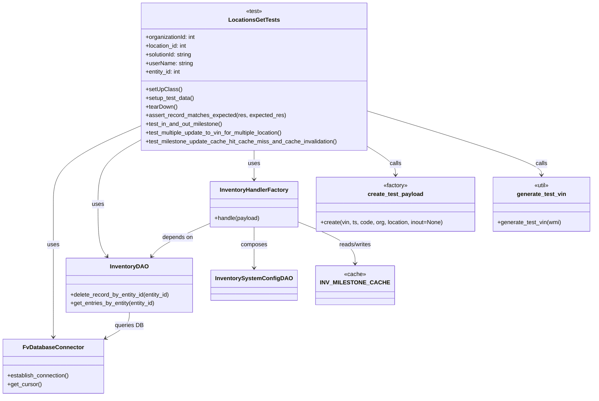
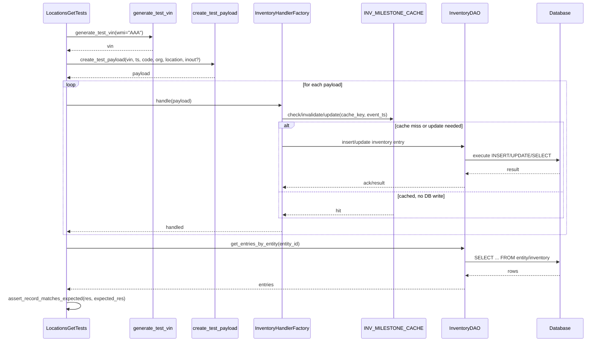

# Diagram: entity_core/entity_service/entity_inventory/entity_inventory_tests/integration/test_inventory_milestone_processor.py


> Auto-generated by Obscura crawlers

## Diagram 1



### SVG

<svg id="container" width="1630.29296875" xmlns="http://www.w3.org/2000/svg" class="classDiagram" height="1096" viewBox="0 0 1630.29296875 1096" role="graphics-document document" aria-roledescription="class"><style>#container{font-family:"trebuchet ms",verdana,arial,sans-serif;font-size:16px;fill:#333;}@keyframes edge-animation-frame{from{stroke-dashoffset:0;}}@keyframes dash{to{stroke-dashoffset:0;}}#container .edge-animation-slow{stroke-dasharray:9,5!important;stroke-dashoffset:900;animation:dash 50s linear infinite;stroke-linecap:round;}#container .edge-animation-fast{stroke-dasharray:9,5!important;stroke-dashoffset:900;animation:dash 20s linear infinite;stroke-linecap:round;}#container .error-icon{fill:#552222;}#container .error-text{fill:#552222;stroke:#552222;}#container .edge-thickness-normal{stroke-width:1px;}#container .edge-thickness-thick{stroke-width:3.5px;}#container .edge-pattern-solid{stroke-dasharray:0;}#container .edge-thickness-invisible{stroke-width:0;fill:none;}#container .edge-pattern-dashed{stroke-dasharray:3;}#container .edge-pattern-dotted{stroke-dasharray:2;}#container .marker{fill:#333333;stroke:#333333;}#container .marker.cross{stroke:#333333;}#container svg{font-family:"trebuchet ms",verdana,arial,sans-serif;font-size:16px;}#container p{margin:0;}#container g.classGroup text{fill:#9370DB;stroke:none;font-family:"trebuchet ms",verdana,arial,sans-serif;font-size:10px;}#container g.classGroup text .title{font-weight:bolder;}#container .nodeLabel,#container .edgeLabel{color:#131300;}#container .edgeLabel .label rect{fill:#ECECFF;}#container .label text{fill:#131300;}#container .labelBkg{background:#ECECFF;}#container .edgeLabel .label span{background:#ECECFF;}#container .classTitle{font-weight:bolder;}#container .node rect,#container .node circle,#container .node ellipse,#container .node polygon,#container .node path{fill:#ECECFF;stroke:#9370DB;stroke-width:1px;}#container .divider{stroke:#9370DB;stroke-width:1;}#container g.clickable{cursor:pointer;}#container g.classGroup rect{fill:#ECECFF;stroke:#9370DB;}#container g.classGroup line{stroke:#9370DB;stroke-width:1;}#container .classLabel .box{stroke:none;stroke-width:0;fill:#ECECFF;opacity:0.5;}#container .classLabel .label{fill:#9370DB;font-size:10px;}#container .relation{stroke:#333333;stroke-width:1;fill:none;}#container .dashed-line{stroke-dasharray:3;}#container .dotted-line{stroke-dasharray:1 2;}#container #compositionStart,#container .composition{fill:#333333!important;stroke:#333333!important;stroke-width:1;}#container #compositionEnd,#container .composition{fill:#333333!important;stroke:#333333!important;stroke-width:1;}#container #dependencyStart,#container .dependency{fill:#333333!important;stroke:#333333!important;stroke-width:1;}#container #dependencyStart,#container .dependency{fill:#333333!important;stroke:#333333!important;stroke-width:1;}#container #extensionStart,#container .extension{fill:transparent!important;stroke:#333333!important;stroke-width:1;}#container #extensionEnd,#container .extension{fill:transparent!important;stroke:#333333!important;stroke-width:1;}#container #aggregationStart,#container .aggregation{fill:transparent!important;stroke:#333333!important;stroke-width:1;}#container #aggregationEnd,#container .aggregation{fill:transparent!important;stroke:#333333!important;stroke-width:1;}#container #lollipopStart,#container .lollipop{fill:#ECECFF!important;stroke:#333333!important;stroke-width:1;}#container #lollipopEnd,#container .lollipop{fill:#ECECFF!important;stroke:#333333!important;stroke-width:1;}#container .edgeTerminals{font-size:11px;line-height:initial;}#container .classTitleText{text-anchor:middle;font-size:18px;fill:#333;}#container .label-icon{display:inline-block;height:1em;overflow:visible;vertical-align:-0.125em;}#container .node .label-icon path{fill:currentColor;stroke:revert;stroke-width:revert;}#container :root{--mermaid-font-family:"trebuchet ms",verdana,arial,sans-serif;}</style><g><defs><marker id="container_class-aggregationStart" class="marker aggregation class" refX="18" refY="7" markerWidth="190" markerHeight="240" orient="auto"><path d="M 18,7 L9,13 L1,7 L9,1 Z"></path></marker></defs><defs><marker id="container_class-aggregationEnd" class="marker aggregation class" refX="1" refY="7" markerWidth="20" markerHeight="28" orient="auto"><path d="M 18,7 L9,13 L1,7 L9,1 Z"></path></marker></defs><defs><marker id="container_class-extensionStart" class="marker extension class" refX="18" refY="7" markerWidth="190" markerHeight="240" orient="auto"><path d="M 1,7 L18,13 V 1 Z"></path></marker></defs><defs><marker id="container_class-extensionEnd" class="marker extension class" refX="1" refY="7" markerWidth="20" markerHeight="28" orient="auto"><path d="M 1,1 V 13 L18,7 Z"></path></marker></defs><defs><marker id="container_class-compositionStart" class="marker composition class" refX="18" refY="7" markerWidth="190" markerHeight="240" orient="auto"><path d="M 18,7 L9,13 L1,7 L9,1 Z"></path></marker></defs><defs><marker id="container_class-compositionEnd" class="marker composition class" refX="1" refY="7" markerWidth="20" markerHeight="28" orient="auto"><path d="M 18,7 L9,13 L1,7 L9,1 Z"></path></marker></defs><defs><marker id="container_class-dependencyStart" class="marker dependency class" refX="6" refY="7" markerWidth="190" markerHeight="240" orient="auto"><path d="M 5,7 L9,13 L1,7 L9,1 Z"></path></marker></defs><defs><marker id="container_class-dependencyEnd" class="marker dependency class" refX="13" refY="7" markerWidth="20" markerHeight="28" orient="auto"><path d="M 18,7 L9,13 L14,7 L9,1 Z"></path></marker></defs><defs><marker id="container_class-lollipopStart" class="marker lollipop class" refX="13" refY="7" markerWidth="190" markerHeight="240" orient="auto"><circle stroke="black" fill="transparent" cx="7" cy="7" r="6"></circle></marker></defs><defs><marker id="container_class-lollipopEnd" class="marker lollipop class" refX="1" refY="7" markerWidth="190" markerHeight="240" orient="auto"><circle stroke="black" fill="transparent" cx="7" cy="7" r="6"></circle></marker></defs><g class="root"><g class="clusters"></g><g class="edgePaths"><path d="M384.746,348.6L345.003,366C305.259,383.4,225.772,418.2,186.029,454.267C146.285,490.333,146.285,527.667,146.285,565C146.285,602.333,146.285,639.667,146.285,677C146.285,714.333,146.285,751.667,146.285,789C146.285,826.333,146.285,863.667,146.285,887.5C146.285,911.333,146.285,921.667,146.285,926.833L146.285,932" id="id_LocationsGetTests_FvDatabaseConnector_1" class="edge-thickness-normal edge-pattern-solid relation" style=";;;" data-edge="true" data-et="edge" data-id="id_LocationsGetTests_FvDatabaseConnector_1" data-points="W3sieCI6Mzg0Ljc0NjA5Mzc1LCJ5IjozNDguNTk5NzMwMzQzNDU3M30seyJ4IjoxNDYuMjg1MTU2MjUsInkiOjQ1M30seyJ4IjoxNDYuMjg1MTU2MjUsInkiOjU2NX0seyJ4IjoxNDYuMjg1MTU2MjUsInkiOjY3N30seyJ4IjoxNDYuMjg1MTU2MjUsInkiOjc4OX0seyJ4IjoxNDYuMjg1MTU2MjUsInkiOjkwMX0seyJ4IjoxNDYuMjg1MTU2MjUsInkiOjkzOH1d" marker-end="url(#container_class-dependencyEnd)"></path><path d="M384.746,388.392L365.699,399.16C346.652,409.928,308.559,431.464,289.512,460.899C270.465,490.333,270.465,527.667,270.465,565C270.465,602.333,270.465,639.667,274.676,663.713C278.888,687.759,287.311,698.517,291.523,703.896L295.734,709.276" id="id_LocationsGetTests_InventoryDAO_2" class="edge-thickness-normal edge-pattern-solid relation" style=";;;" data-edge="true" data-et="edge" data-id="id_LocationsGetTests_InventoryDAO_2" data-points="W3sieCI6Mzg0Ljc0NjA5Mzc1LCJ5IjozODguMzkxNzcxMjgxOTU3M30seyJ4IjoyNzAuNDY0ODQzNzUsInkiOjQ1M30seyJ4IjoyNzAuNDY0ODQzNzUsInkiOjU2NX0seyJ4IjoyNzAuNDY0ODQzNzUsInkiOjY3N30seyJ4IjoyOTkuNDMzMDM1NzE0Mjg1NywieSI6NzE0fV0=" marker-end="url(#container_class-dependencyEnd)"></path><path d="M696.754,416L696.754,422.167C696.754,428.333,696.754,440.667,696.754,454C696.754,467.333,696.754,481.667,696.754,488.833L696.754,496" id="id_LocationsGetTests_InventoryHandlerFactory_3" class="edge-thickness-normal edge-pattern-solid relation" style=";;;" data-edge="true" data-et="edge" data-id="id_LocationsGetTests_InventoryHandlerFactory_3" data-points="W3sieCI6Njk2Ljc1MzkwNjI1LCJ5Ijo0MTZ9LHsieCI6Njk2Ljc1MzkwNjI1LCJ5Ijo0NTN9LHsieCI6Njk2Ljc1MzkwNjI1LCJ5Ijo1MDJ9XQ==" marker-end="url(#container_class-dependencyEnd)"></path><path d="M1008.762,404.71L1021.792,412.759C1034.823,420.807,1060.884,436.903,1073.915,450.118C1086.945,463.333,1086.945,473.667,1086.945,478.833L1086.945,484" id="id_LocationsGetTests_create_test_payload_4" class="edge-thickness-normal edge-pattern-solid relation" style=";;;" data-edge="true" data-et="edge" data-id="id_LocationsGetTests_create_test_payload_4" data-points="W3sieCI6MTAwOC43NjE3MTg3NSwieSI6NDA0LjcxMDI0ODM3NTY5N30seyJ4IjoxMDg2Ljk0NTMxMjUsInkiOjQ1M30seyJ4IjoxMDg2Ljk0NTMxMjUsInkiOjQ5MH1d" marker-end="url(#container_class-dependencyEnd)"></path><path d="M1008.762,306.859L1088.875,331.216C1168.988,355.573,1329.215,404.286,1409.328,433.81C1489.441,463.333,1489.441,473.667,1489.441,478.833L1489.441,484" id="id_LocationsGetTests_generate_test_vin_5" class="edge-thickness-normal edge-pattern-solid relation" style=";;;" data-edge="true" data-et="edge" data-id="id_LocationsGetTests_generate_test_vin_5" data-points="W3sieCI6MTAwOC43NjE3MTg3NSwieSI6MzA2Ljg1OTQyNzk3NDQ1NH0seyJ4IjoxNDg5LjQ0MTQwNjI1LCJ5Ijo0NTN9LHsieCI6MTQ4OS40NDE0MDYyNSwieSI6NDkwfV0=" marker-end="url(#container_class-dependencyEnd)"></path><path d="M576.207,618.453L554.201,628.211C532.195,637.969,488.184,657.484,462.051,672.616C435.918,687.747,427.664,698.494,423.536,703.868L419.409,709.241" id="id_InventoryHandlerFactory_InventoryDAO_6" class="edge-thickness-normal edge-pattern-solid relation" style=";;;" data-edge="true" data-et="edge" data-id="id_InventoryHandlerFactory_InventoryDAO_6" data-points="W3sieCI6NTc2LjIwNzAzMTI1LCJ5Ijo2MTguNDUyOTMxNDQyNDQ2fSx7IngiOjQ0NC4xNzE4NzUsInkiOjY3N30seyJ4Ijo0MTUuNzU0NzA4NDI2MzM5MywieSI6NzE0fV0=" marker-end="url(#container_class-dependencyEnd)"></path><path d="M696.754,628L696.754,636.167C696.754,644.333,696.754,660.667,696.754,679.5C696.754,698.333,696.754,719.667,696.754,730.333L696.754,741" id="id_InventoryHandlerFactory_InventorySystemConfigDAO_7" class="edge-thickness-normal edge-pattern-solid relation" style=";;;" data-edge="true" data-et="edge" data-id="id_InventoryHandlerFactory_InventorySystemConfigDAO_7" data-points="W3sieCI6Njk2Ljc1MzkwNjI1LCJ5Ijo2Mjh9LHsieCI6Njk2Ljc1MzkwNjI1LCJ5Ijo2Nzd9LHsieCI6Njk2Ljc1MzkwNjI1LCJ5Ijo3NDd9XQ==" marker-end="url(#container_class-dependencyEnd)"></path><path d="M817.301,617.478L840.089,627.399C862.876,637.319,908.452,657.159,931.24,675.746C954.027,694.333,954.027,711.667,954.027,720.333L954.027,729" id="id_InventoryHandlerFactory_INV_MILESTONE_CACHE_8" class="edge-thickness-normal edge-pattern-solid relation" style=";;;" data-edge="true" data-et="edge" data-id="id_InventoryHandlerFactory_INV_MILESTONE_CACHE_8" data-points="W3sieCI6ODE3LjMwMDc4MTI1LCJ5Ijo2MTcuNDc4MjEyMDE5MDcwMn0seyJ4Ijo5NTQuMDI3MzQzNzUsInkiOjY3N30seyJ4Ijo5NTQuMDI3MzQzNzUsInkiOjczNX1d" marker-end="url(#container_class-dependencyEnd)"></path><path d="M358.152,864L358.152,870.167C358.152,876.333,358.152,888.667,346.773,900.849C335.393,913.031,312.634,925.063,301.254,931.078L289.875,937.094" id="id_InventoryDAO_FvDatabaseConnector_9" class="edge-thickness-normal edge-pattern-solid relation" style=";;;" data-edge="true" data-et="edge" data-id="id_InventoryDAO_FvDatabaseConnector_9" data-points="W3sieCI6MzU4LjE1MjM0Mzc1LCJ5Ijo4NjR9LHsieCI6MzU4LjE1MjM0Mzc1LCJ5Ijo5MDF9LHsieCI6Mjg0LjU3MDMxMjUsInkiOjkzOS44OTc4OTQ0NjUxMzUxfV0=" marker-end="url(#container_class-dependencyEnd)"></path></g><g class="edgeLabels"><g class="edgeLabel" transform="translate(146.28515625, 677)"><g class="label" data-id="id_LocationsGetTests_FvDatabaseConnector_1" transform="translate(-16.4921875, -12)"><foreignObject width="32.984375" height="24"><div xmlns="http://www.w3.org/1999/xhtml" class="labelBkg" style="display: table-cell; white-space: nowrap; line-height: 1.5; max-width: 200px; text-align: center;"><span class="edgeLabel"><p>uses</p></span></div></foreignObject></g></g><g class="edgeLabel" transform="translate(270.46484375, 565)"><g class="label" data-id="id_LocationsGetTests_InventoryDAO_2" transform="translate(-16.4921875, -12)"><foreignObject width="32.984375" height="24"><div xmlns="http://www.w3.org/1999/xhtml" class="labelBkg" style="display: table-cell; white-space: nowrap; line-height: 1.5; max-width: 200px; text-align: center;"><span class="edgeLabel"><p>uses</p></span></div></foreignObject></g></g><g class="edgeLabel" transform="translate(696.75390625, 453)"><g class="label" data-id="id_LocationsGetTests_InventoryHandlerFactory_3" transform="translate(-16.4921875, -12)"><foreignObject width="32.984375" height="24"><div xmlns="http://www.w3.org/1999/xhtml" class="labelBkg" style="display: table-cell; white-space: nowrap; line-height: 1.5; max-width: 200px; text-align: center;"><span class="edgeLabel"><p>uses</p></span></div></foreignObject></g></g><g class="edgeLabel" transform="translate(1086.9453125, 453)"><g class="label" data-id="id_LocationsGetTests_create_test_payload_4" transform="translate(-16.4453125, -12)"><foreignObject width="32.890625" height="24"><div xmlns="http://www.w3.org/1999/xhtml" class="labelBkg" style="display: table-cell; white-space: nowrap; line-height: 1.5; max-width: 200px; text-align: center;"><span class="edgeLabel"><p>calls</p></span></div></foreignObject></g></g><g class="edgeLabel" transform="translate(1489.44140625, 453)"><g class="label" data-id="id_LocationsGetTests_generate_test_vin_5" transform="translate(-16.4453125, -12)"><foreignObject width="32.890625" height="24"><div xmlns="http://www.w3.org/1999/xhtml" class="labelBkg" style="display: table-cell; white-space: nowrap; line-height: 1.5; max-width: 200px; text-align: center;"><span class="edgeLabel"><p>calls</p></span></div></foreignObject></g></g><g class="edgeLabel" transform="translate(488.86517, 657.18209)"><g class="label" data-id="id_InventoryHandlerFactory_InventoryDAO_6" transform="translate(-42.9453125, -12)"><foreignObject width="85.890625" height="24"><div xmlns="http://www.w3.org/1999/xhtml" class="labelBkg" style="display: table-cell; white-space: nowrap; line-height: 1.5; max-width: 200px; text-align: center;"><span class="edgeLabel"><p>depends on</p></span></div></foreignObject></g></g><g class="edgeLabel" transform="translate(696.75390625, 677)"><g class="label" data-id="id_InventoryHandlerFactory_InventorySystemConfigDAO_7" transform="translate(-36.453125, -12)"><foreignObject width="72.90625" height="24"><div xmlns="http://www.w3.org/1999/xhtml" class="labelBkg" style="display: table-cell; white-space: nowrap; line-height: 1.5; max-width: 200px; text-align: center;"><span class="edgeLabel"><p>composes</p></span></div></foreignObject></g></g><g class="edgeLabel" transform="translate(954.02734375, 677)"><g class="label" data-id="id_InventoryHandlerFactory_INV_MILESTONE_CACHE_8" transform="translate(-45.9453125, -12)"><foreignObject width="91.890625" height="24"><div xmlns="http://www.w3.org/1999/xhtml" class="labelBkg" style="display: table-cell; white-space: nowrap; line-height: 1.5; max-width: 200px; text-align: center;"><span class="edgeLabel"><p>reads/writes</p></span></div></foreignObject></g></g><g class="edgeLabel" transform="translate(358.15234375, 901)"><g class="label" data-id="id_InventoryDAO_FvDatabaseConnector_9" transform="translate(-39.3828125, -12)"><foreignObject width="78.765625" height="24"><div xmlns="http://www.w3.org/1999/xhtml" class="labelBkg" style="display: table-cell; white-space: nowrap; line-height: 1.5; max-width: 200px; text-align: center;"><span class="edgeLabel"><p>queries DB</p></span></div></foreignObject></g></g></g><g class="nodes"><g class="node default" id="classId-LocationsGetTests-0" transform="translate(696.75390625, 212)"><g class="basic label-container"><path d="M-312.0078125 -204 L312.0078125 -204 L312.0078125 204 L-312.0078125 204" stroke="none" stroke-width="0" fill="#ECECFF" style=""></path><path d="M-312.0078125 -204 C-70.05047503917777 -204, 171.90686242164446 -204, 312.0078125 -204 M-312.0078125 -204 C-117.91565362666714 -204, 76.17650524666573 -204, 312.0078125 -204 M312.0078125 -204 C312.0078125 -76.71127647633949, 312.0078125 50.577447047321016, 312.0078125 204 M312.0078125 -204 C312.0078125 -77.10374075284638, 312.0078125 49.792518494307245, 312.0078125 204 M312.0078125 204 C100.15168357405926 204, -111.70444535188147 204, -312.0078125 204 M312.0078125 204 C106.86096304331917 204, -98.28588641336165 204, -312.0078125 204 M-312.0078125 204 C-312.0078125 117.59728804883424, -312.0078125 31.194576097668488, -312.0078125 -204 M-312.0078125 204 C-312.0078125 75.073852277621, -312.0078125 -53.852295444758, -312.0078125 -204" stroke="#9370DB" stroke-width="1.3" fill="none" stroke-dasharray="0 0" style=""></path></g><g class="annotation-group text" transform="translate(-22.8828125, -180)"><g class="label" style="" transform="translate(0,-12)"><foreignObject width="45.765625" height="24"><div xmlns="http://www.w3.org/1999/xhtml" style="display: table-cell; white-space: nowrap; line-height: 1.5; max-width: 96px; text-align: center;"><span class="nodeLabel markdown-node-label" style=""><p>«test»</p></span></div></foreignObject></g></g><g class="label-group text" transform="translate(-66.984375, -156)"><g class="label" style="font-weight: bolder" transform="translate(0,-12)"><foreignObject width="133.96875" height="24"><div xmlns="http://www.w3.org/1999/xhtml" style="display: table-cell; white-space: nowrap; line-height: 1.5; max-width: 181px; text-align: center;"><span class="nodeLabel markdown-node-label" style=""><p>LocationsGetTests</p></span></div></foreignObject></g></g><g class="members-group text" transform="translate(-300.0078125, -108)"><g class="label" style="" transform="translate(0,-12)"><foreignObject width="140.375" height="24"><div xmlns="http://www.w3.org/1999/xhtml" style="display: table-cell; white-space: nowrap; line-height: 1.5; max-width: 198px; text-align: center;"><span class="nodeLabel markdown-node-label" style=""><p>+organizationId: int</p></span></div></foreignObject></g><g class="label" style="" transform="translate(0,12)"><foreignObject width="117.28125" height="24"><div xmlns="http://www.w3.org/1999/xhtml" style="display: table-cell; white-space: nowrap; line-height: 1.5; max-width: 175px; text-align: center;"><span class="nodeLabel markdown-node-label" style=""><p>+location_id: int</p></span></div></foreignObject></g><g class="label" style="" transform="translate(0,36)"><foreignObject width="131.8125" height="24"><div xmlns="http://www.w3.org/1999/xhtml" style="display: table-cell; white-space: nowrap; line-height: 1.5; max-width: 190px; text-align: center;"><span class="nodeLabel markdown-node-label" style=""><p>+solutionId: string</p></span></div></foreignObject></g><g class="label" style="" transform="translate(0,60)"><foreignObject width="131.453125" height="24"><div xmlns="http://www.w3.org/1999/xhtml" style="display: table-cell; white-space: nowrap; line-height: 1.5; max-width: 189px; text-align: center;"><span class="nodeLabel markdown-node-label" style=""><p>+userName: string</p></span></div></foreignObject></g><g class="label" style="" transform="translate(0,84)"><foreignObject width="99.609375" height="24"><div xmlns="http://www.w3.org/1999/xhtml" style="display: table-cell; white-space: nowrap; line-height: 1.5; max-width: 157px; text-align: center;"><span class="nodeLabel markdown-node-label" style=""><p>+entity_id: int</p></span></div></foreignObject></g></g><g class="methods-group text" transform="translate(-300.0078125, 36)"><g class="label" style="" transform="translate(0,-12)"><foreignObject width="97.15625" height="24"><div xmlns="http://www.w3.org/1999/xhtml" style="display: table-cell; white-space: nowrap; line-height: 1.5; max-width: 155px; text-align: center;"><span class="nodeLabel markdown-node-label" style=""><p>+setUpClass()</p></span></div></foreignObject></g><g class="label" style="" transform="translate(0,12)"><foreignObject width="134.96875" height="24"><div xmlns="http://www.w3.org/1999/xhtml" style="display: table-cell; white-space: nowrap; line-height: 1.5; max-width: 192px; text-align: center;"><span class="nodeLabel markdown-node-label" style=""><p>+setup_test_data()</p></span></div></foreignObject></g><g class="label" style="" transform="translate(0,36)"><foreignObject width="87.75" height="24"><div xmlns="http://www.w3.org/1999/xhtml" style="display: table-cell; white-space: nowrap; line-height: 1.5; max-width: 145px; text-align: center;"><span class="nodeLabel markdown-node-label" style=""><p>+tearDown()</p></span></div></foreignObject></g><g class="label" style="" transform="translate(0,60)"><foreignObject width="386.203125" height="24"><div xmlns="http://www.w3.org/1999/xhtml" style="display: table-cell; white-space: nowrap; line-height: 1.5; max-width: 444px; text-align: center;"><span class="nodeLabel markdown-node-label" style=""><p>+assert_record_matches_expected(res, expected_res)</p></span></div></foreignObject></g><g class="label" style="" transform="translate(0,84)"><foreignObject width="216.390625" height="24"><div xmlns="http://www.w3.org/1999/xhtml" style="display: table-cell; white-space: nowrap; line-height: 1.5; max-width: 274px; text-align: center;"><span class="nodeLabel markdown-node-label" style=""><p>+test_in_and_out_milestone()</p></span></div></foreignObject></g><g class="label" style="" transform="translate(0,108)"><foreignObject width="389.390625" height="24"><div xmlns="http://www.w3.org/1999/xhtml" style="display: table-cell; white-space: nowrap; line-height: 1.5; max-width: 447px; text-align: center;"><span class="nodeLabel markdown-node-label" style=""><p>+test_multiple_update_to_vin_for_multiple_location()</p></span></div></foreignObject></g><g class="label" style="" transform="translate(0,132)"><foreignObject width="533.03125" height="24"><div xmlns="http://www.w3.org/1999/xhtml" style="display: table-cell; white-space: nowrap; line-height: 1.5; max-width: 590px; text-align: center;"><span class="nodeLabel markdown-node-label" style=""><p>+test_milestone_update_cache_hit_cache_miss_and_cache_invalidation()</p></span></div></foreignObject></g></g><g class="divider" style=""><path d="M-312.0078125 -132 C-89.33535362808288 -132, 133.33710524383423 -132, 312.0078125 -132 M-312.0078125 -132 C-128.31675559330097 -132, 55.374301313398064 -132, 312.0078125 -132" stroke="#9370DB" stroke-width="1.3" fill="none" stroke-dasharray="0 0" style=""></path></g><g class="divider" style=""><path d="M-312.0078125 12 C-178.81424762371972 12, -45.620682747439446 12, 312.0078125 12 M-312.0078125 12 C-158.2906253423743 12, -4.573438184748625 12, 312.0078125 12" stroke="#9370DB" stroke-width="1.3" fill="none" stroke-dasharray="0 0" style=""></path></g></g><g class="node default" id="classId-InventoryDAO-1" transform="translate(358.15234375, 789)"><g class="basic label-container"><path d="M-176.8671875 -75 L176.8671875 -75 L176.8671875 75 L-176.8671875 75" stroke="none" stroke-width="0" fill="#ECECFF" style=""></path><path d="M-176.8671875 -75 C-50.799985707995944 -75, 75.26721608400811 -75, 176.8671875 -75 M-176.8671875 -75 C-94.33853053747426 -75, -11.809873574948512 -75, 176.8671875 -75 M176.8671875 -75 C176.8671875 -42.5763770237298, 176.8671875 -10.152754047459595, 176.8671875 75 M176.8671875 -75 C176.8671875 -40.88379214840368, 176.8671875 -6.767584296807357, 176.8671875 75 M176.8671875 75 C45.08669760186754 75, -86.69379229626492 75, -176.8671875 75 M176.8671875 75 C58.31494969842822 75, -60.237288103143555 75, -176.8671875 75 M-176.8671875 75 C-176.8671875 23.50615925831341, -176.8671875 -27.98768148337318, -176.8671875 -75 M-176.8671875 75 C-176.8671875 25.78694842679849, -176.8671875 -23.426103146403022, -176.8671875 -75" stroke="#9370DB" stroke-width="1.3" fill="none" stroke-dasharray="0 0" style=""></path></g><g class="annotation-group text" transform="translate(0, -51)"></g><g class="label-group text" transform="translate(-50.25, -51)"><g class="label" style="font-weight: bolder" transform="translate(0,-12)"><foreignObject width="100.5" height="24"><div xmlns="http://www.w3.org/1999/xhtml" style="display: table-cell; white-space: nowrap; line-height: 1.5; max-width: 149px; text-align: center;"><span class="nodeLabel markdown-node-label" style=""><p>InventoryDAO</p></span></div></foreignObject></g></g><g class="members-group text" transform="translate(-164.8671875, -3)"></g><g class="methods-group text" transform="translate(-164.8671875, 27)"><g class="label" style="" transform="translate(0,-12)"><foreignObject width="279.484375" height="24"><div xmlns="http://www.w3.org/1999/xhtml" style="display: table-cell; white-space: nowrap; line-height: 1.5; max-width: 337px; text-align: center;"><span class="nodeLabel markdown-node-label" style=""><p>+delete_record_by_entity_id(entity_id)</p></span></div></foreignObject></g><g class="label" style="" transform="translate(0,12)"><foreignObject width="238.328125" height="24"><div xmlns="http://www.w3.org/1999/xhtml" style="display: table-cell; white-space: nowrap; line-height: 1.5; max-width: 296px; text-align: center;"><span class="nodeLabel markdown-node-label" style=""><p>+get_entries_by_entity(entity_id)</p></span></div></foreignObject></g></g><g class="divider" style=""><path d="M-176.8671875 -27 C-99.36110477894688 -27, -21.855022057893763 -27, 176.8671875 -27 M-176.8671875 -27 C-53.14637905177116 -27, 70.57442939645767 -27, 176.8671875 -27" stroke="#9370DB" stroke-width="1.3" fill="none" stroke-dasharray="0 0" style=""></path></g><g class="divider" style=""><path d="M-176.8671875 -3 C-89.13255640371605 -3, -1.3979253074321036 -3, 176.8671875 -3 M-176.8671875 -3 C-37.39763533281527 -3, 102.07191683436946 -3, 176.8671875 -3" stroke="#9370DB" stroke-width="1.3" fill="none" stroke-dasharray="0 0" style=""></path></g></g><g class="node default" id="classId-InventoryHandlerFactory-2" transform="translate(696.75390625, 565)"><g class="basic label-container"><path d="M-120.546875 -63 L120.546875 -63 L120.546875 63 L-120.546875 63" stroke="none" stroke-width="0" fill="#ECECFF" style=""></path><path d="M-120.546875 -63 C-40.813951692263416 -63, 38.91897161547317 -63, 120.546875 -63 M-120.546875 -63 C-47.10871541206471 -63, 26.329444175870577 -63, 120.546875 -63 M120.546875 -63 C120.546875 -22.8896528290068, 120.546875 17.220694341986402, 120.546875 63 M120.546875 -63 C120.546875 -33.43042882928694, 120.546875 -3.8608576585738845, 120.546875 63 M120.546875 63 C44.70524642022902 63, -31.136382159541967 63, -120.546875 63 M120.546875 63 C29.943096859704568 63, -60.660681280590865 63, -120.546875 63 M-120.546875 63 C-120.546875 18.853910860029153, -120.546875 -25.292178279941695, -120.546875 -63 M-120.546875 63 C-120.546875 33.228351201934856, -120.546875 3.4567024038697056, -120.546875 -63" stroke="#9370DB" stroke-width="1.3" fill="none" stroke-dasharray="0 0" style=""></path></g><g class="annotation-group text" transform="translate(0, -39)"></g><g class="label-group text" transform="translate(-90.640625, -39)"><g class="label" style="font-weight: bolder" transform="translate(0,-12)"><foreignObject width="181.28125" height="24"><div xmlns="http://www.w3.org/1999/xhtml" style="display: table-cell; white-space: nowrap; line-height: 1.5; max-width: 229px; text-align: center;"><span class="nodeLabel markdown-node-label" style=""><p>InventoryHandlerFactory</p></span></div></foreignObject></g></g><g class="members-group text" transform="translate(-108.546875, 9)"></g><g class="methods-group text" transform="translate(-108.546875, 39)"><g class="label" style="" transform="translate(0,-12)"><foreignObject width="126.453125" height="24"><div xmlns="http://www.w3.org/1999/xhtml" style="display: table-cell; white-space: nowrap; line-height: 1.5; max-width: 184px; text-align: center;"><span class="nodeLabel markdown-node-label" style=""><p>+handle(payload)</p></span></div></foreignObject></g></g><g class="divider" style=""><path d="M-120.546875 -15 C-32.41693573222773 -15, 55.713003535544544 -15, 120.546875 -15 M-120.546875 -15 C-30.59231506928346 -15, 59.36224486143308 -15, 120.546875 -15" stroke="#9370DB" stroke-width="1.3" fill="none" stroke-dasharray="0 0" style=""></path></g><g class="divider" style=""><path d="M-120.546875 9 C-53.93619668468095 9, 12.674481630638098 9, 120.546875 9 M-120.546875 9 C-49.81173420094787 9, 20.923406598104265 9, 120.546875 9" stroke="#9370DB" stroke-width="1.3" fill="none" stroke-dasharray="0 0" style=""></path></g></g><g class="node default" id="classId-InventorySystemConfigDAO-3" transform="translate(696.75390625, 789)"><g class="basic label-container"><path d="M-111.734375 -42 L111.734375 -42 L111.734375 42 L-111.734375 42" stroke="none" stroke-width="0" fill="#ECECFF" style=""></path><path d="M-111.734375 -42 C-46.88203198703138 -42, 17.970311025937235 -42, 111.734375 -42 M-111.734375 -42 C-29.752721173731956 -42, 52.22893265253609 -42, 111.734375 -42 M111.734375 -42 C111.734375 -10.497107171373806, 111.734375 21.00578565725239, 111.734375 42 M111.734375 -42 C111.734375 -19.84375622514149, 111.734375 2.3124875497170194, 111.734375 42 M111.734375 42 C58.52898731401875 42, 5.323599628037499 42, -111.734375 42 M111.734375 42 C44.35856380413236 42, -23.017247391735282 42, -111.734375 42 M-111.734375 42 C-111.734375 12.048013891634177, -111.734375 -17.903972216731646, -111.734375 -42 M-111.734375 42 C-111.734375 19.430506977893714, -111.734375 -3.1389860442125723, -111.734375 -42" stroke="#9370DB" stroke-width="1.3" fill="none" stroke-dasharray="0 0" style=""></path></g><g class="annotation-group text" transform="translate(0, -18)"></g><g class="label-group text" transform="translate(-99.734375, -18)"><g class="label" style="font-weight: bolder" transform="translate(0,-12)"><foreignObject width="199.46875" height="24"><div xmlns="http://www.w3.org/1999/xhtml" style="display: table-cell; white-space: nowrap; line-height: 1.5; max-width: 246px; text-align: center;"><span class="nodeLabel markdown-node-label" style=""><p>InventorySystemConfigDAO</p></span></div></foreignObject></g></g><g class="members-group text" transform="translate(-99.734375, 30)"></g><g class="methods-group text" transform="translate(-99.734375, 60)"></g><g class="divider" style=""><path d="M-111.734375 6 C-40.635066308322976 6, 30.464242383354048 6, 111.734375 6 M-111.734375 6 C-58.85985536797265 6, -5.9853357359452986 6, 111.734375 6" stroke="#9370DB" stroke-width="1.3" fill="none" stroke-dasharray="0 0" style=""></path></g><g class="divider" style=""><path d="M-111.734375 24 C-37.14462460271396 24, 37.44512579457208 24, 111.734375 24 M-111.734375 24 C-38.90600303008051 24, 33.922368939838975 24, 111.734375 24" stroke="#9370DB" stroke-width="1.3" fill="none" stroke-dasharray="0 0" style=""></path></g></g><g class="node default" id="classId-FvDatabaseConnector-4" transform="translate(146.28515625, 1013)"><g class="basic label-container"><path d="M-138.28515625 -75 L138.28515625 -75 L138.28515625 75 L-138.28515625 75" stroke="none" stroke-width="0" fill="#ECECFF" style=""></path><path d="M-138.28515625 -75 C-58.86644665564033 -75, 20.552262938719338 -75, 138.28515625 -75 M-138.28515625 -75 C-77.60253837019593 -75, -16.919920490391846 -75, 138.28515625 -75 M138.28515625 -75 C138.28515625 -34.91585259722034, 138.28515625 5.168294805559313, 138.28515625 75 M138.28515625 -75 C138.28515625 -44.19748159968759, 138.28515625 -13.394963199375184, 138.28515625 75 M138.28515625 75 C81.60430929335176 75, 24.923462336703523 75, -138.28515625 75 M138.28515625 75 C69.89047664898158 75, 1.4957970479631513 75, -138.28515625 75 M-138.28515625 75 C-138.28515625 23.350558964071105, -138.28515625 -28.29888207185779, -138.28515625 -75 M-138.28515625 75 C-138.28515625 30.557625029456027, -138.28515625 -13.884749941087946, -138.28515625 -75" stroke="#9370DB" stroke-width="1.3" fill="none" stroke-dasharray="0 0" style=""></path></g><g class="annotation-group text" transform="translate(0, -51)"></g><g class="label-group text" transform="translate(-79.3046875, -51)"><g class="label" style="font-weight: bolder" transform="translate(0,-12)"><foreignObject width="158.609375" height="24"><div xmlns="http://www.w3.org/1999/xhtml" style="display: table-cell; white-space: nowrap; line-height: 1.5; max-width: 207px; text-align: center;"><span class="nodeLabel markdown-node-label" style=""><p>FvDatabaseConnector</p></span></div></foreignObject></g></g><g class="members-group text" transform="translate(-126.28515625, -3)"></g><g class="methods-group text" transform="translate(-126.28515625, 27)"><g class="label" style="" transform="translate(0,-12)"><foreignObject width="173.265625" height="24"><div xmlns="http://www.w3.org/1999/xhtml" style="display: table-cell; white-space: nowrap; line-height: 1.5; max-width: 231px; text-align: center;"><span class="nodeLabel markdown-node-label" style=""><p>+establish_connection()</p></span></div></foreignObject></g><g class="label" style="" transform="translate(0,12)"><foreignObject width="94.640625" height="24"><div xmlns="http://www.w3.org/1999/xhtml" style="display: table-cell; white-space: nowrap; line-height: 1.5; max-width: 152px; text-align: center;"><span class="nodeLabel markdown-node-label" style=""><p>+get_cursor()</p></span></div></foreignObject></g></g><g class="divider" style=""><path d="M-138.28515625 -27 C-34.34581529193014 -27, 69.59352566613973 -27, 138.28515625 -27 M-138.28515625 -27 C-64.89667349204032 -27, 8.491809265919358 -27, 138.28515625 -27" stroke="#9370DB" stroke-width="1.3" fill="none" stroke-dasharray="0 0" style=""></path></g><g class="divider" style=""><path d="M-138.28515625 -3 C-61.44647572323831 -3, 15.392204803523384 -3, 138.28515625 -3 M-138.28515625 -3 C-33.897040815331835 -3, 70.49107461933633 -3, 138.28515625 -3" stroke="#9370DB" stroke-width="1.3" fill="none" stroke-dasharray="0 0" style=""></path></g></g><g class="node default" id="classId-INV_MILESTONE_CACHE-5" transform="translate(954.02734375, 789)"><g class="basic label-container"><path d="M-95.5390625 -54 L95.5390625 -54 L95.5390625 54 L-95.5390625 54" stroke="none" stroke-width="0" fill="#ECECFF" style=""></path><path d="M-95.5390625 -54 C-21.39493363047609 -54, 52.74919523904782 -54, 95.5390625 -54 M-95.5390625 -54 C-49.04042263768293 -54, -2.54178277536586 -54, 95.5390625 -54 M95.5390625 -54 C95.5390625 -25.606384874517772, 95.5390625 2.7872302509644555, 95.5390625 54 M95.5390625 -54 C95.5390625 -21.421830041690036, 95.5390625 11.156339916619928, 95.5390625 54 M95.5390625 54 C43.83331388810984 54, -7.872434723780316 54, -95.5390625 54 M95.5390625 54 C28.026174028420357 54, -39.486714443159286 54, -95.5390625 54 M-95.5390625 54 C-95.5390625 29.315232310130963, -95.5390625 4.630464620261925, -95.5390625 -54 M-95.5390625 54 C-95.5390625 15.57256871993087, -95.5390625 -22.85486256013826, -95.5390625 -54" stroke="#9370DB" stroke-width="1.3" fill="none" stroke-dasharray="0 0" style=""></path></g><g class="annotation-group text" transform="translate(-29.78125, -30)"><g class="label" style="" transform="translate(0,-12)"><foreignObject width="59.5625" height="24"><div xmlns="http://www.w3.org/1999/xhtml" style="display: table-cell; white-space: nowrap; line-height: 1.5; max-width: 110px; text-align: center;"><span class="nodeLabel markdown-node-label" style=""><p>«cache»</p></span></div></foreignObject></g></g><g class="label-group text" transform="translate(-83.5390625, -6)"><g class="label" style="font-weight: bolder" transform="translate(0,-12)"><foreignObject width="167.078125" height="24"><div xmlns="http://www.w3.org/1999/xhtml" style="display: table-cell; white-space: nowrap; line-height: 1.5; max-width: 216px; text-align: center;"><span class="nodeLabel markdown-node-label" style=""><p>INV_MILESTONE_CACHE</p></span></div></foreignObject></g></g><g class="members-group text" transform="translate(-83.5390625, 42)"></g><g class="methods-group text" transform="translate(-83.5390625, 72)"></g><g class="divider" style=""><path d="M-95.5390625 18 C-57.187472560991196 18, -18.835882621982392 18, 95.5390625 18 M-95.5390625 18 C-55.23715317805066 18, -14.935243856101323 18, 95.5390625 18" stroke="#9370DB" stroke-width="1.3" fill="none" stroke-dasharray="0 0" style=""></path></g><g class="divider" style=""><path d="M-95.5390625 36 C-41.98640993846034 36, 11.566242623079319 36, 95.5390625 36 M-95.5390625 36 C-25.60859990234242 36, 44.32186269531516 36, 95.5390625 36" stroke="#9370DB" stroke-width="1.3" fill="none" stroke-dasharray="0 0" style=""></path></g></g><g class="node default" id="classId-create_test_payload-6" transform="translate(1086.9453125, 565)"><g class="basic label-container"><path d="M-219.64453125 -75 L219.64453125 -75 L219.64453125 75 L-219.64453125 75" stroke="none" stroke-width="0" fill="#ECECFF" style=""></path><path d="M-219.64453125 -75 C-61.39895784591653 -75, 96.84661555816695 -75, 219.64453125 -75 M-219.64453125 -75 C-96.70892479008529 -75, 26.226681669829418 -75, 219.64453125 -75 M219.64453125 -75 C219.64453125 -40.00147440484717, 219.64453125 -5.002948809694345, 219.64453125 75 M219.64453125 -75 C219.64453125 -23.566574997292008, 219.64453125 27.866850005415984, 219.64453125 75 M219.64453125 75 C97.59446813009953 75, -24.455594989800943 75, -219.64453125 75 M219.64453125 75 C88.63471194930668 75, -42.375107351386646 75, -219.64453125 75 M-219.64453125 75 C-219.64453125 36.80928358260866, -219.64453125 -1.3814328347826859, -219.64453125 -75 M-219.64453125 75 C-219.64453125 43.45670630030358, -219.64453125 11.913412600607153, -219.64453125 -75" stroke="#9370DB" stroke-width="1.3" fill="none" stroke-dasharray="0 0" style=""></path></g><g class="annotation-group text" transform="translate(-34.2734375, -51)"><g class="label" style="" transform="translate(0,-12)"><foreignObject width="68.546875" height="24"><div xmlns="http://www.w3.org/1999/xhtml" style="display: table-cell; white-space: nowrap; line-height: 1.5; max-width: 119px; text-align: center;"><span class="nodeLabel markdown-node-label" style=""><p>«factory»</p></span></div></foreignObject></g></g><g class="label-group text" transform="translate(-74.4140625, -27)"><g class="label" style="font-weight: bolder" transform="translate(0,-12)"><foreignObject width="148.828125" height="24"><div xmlns="http://www.w3.org/1999/xhtml" style="display: table-cell; white-space: nowrap; line-height: 1.5; max-width: 196px; text-align: center;"><span class="nodeLabel markdown-node-label" style=""><p>create_test_payload</p></span></div></foreignObject></g></g><g class="members-group text" transform="translate(-207.64453125, 21)"></g><g class="methods-group text" transform="translate(-207.64453125, 51)"><g class="label" style="" transform="translate(0,-12)"><foreignObject width="340.875" height="24"><div xmlns="http://www.w3.org/1999/xhtml" style="display: table-cell; white-space: nowrap; line-height: 1.5; max-width: 398px; text-align: center;"><span class="nodeLabel markdown-node-label" style=""><p>+create(vin, ts, code, org, location, inout=None)</p></span></div></foreignObject></g></g><g class="divider" style=""><path d="M-219.64453125 -3 C-52.45815336945165 -3, 114.7282245110967 -3, 219.64453125 -3 M-219.64453125 -3 C-124.4309414221758 -3, -29.217351594351612 -3, 219.64453125 -3" stroke="#9370DB" stroke-width="1.3" fill="none" stroke-dasharray="0 0" style=""></path></g><g class="divider" style=""><path d="M-219.64453125 21 C-102.41971081514285 21, 14.805109619714301 21, 219.64453125 21 M-219.64453125 21 C-126.67202236960955 21, -33.6995134892191 21, 219.64453125 21" stroke="#9370DB" stroke-width="1.3" fill="none" stroke-dasharray="0 0" style=""></path></g></g><g class="node default" id="classId-generate_test_vin-7" transform="translate(1489.44140625, 565)"><g class="basic label-container"><path d="M-132.8515625 -75 L132.8515625 -75 L132.8515625 75 L-132.8515625 75" stroke="none" stroke-width="0" fill="#ECECFF" style=""></path><path d="M-132.8515625 -75 C-70.20653159671589 -75, -7.561500693431782 -75, 132.8515625 -75 M-132.8515625 -75 C-34.231357800093306 -75, 64.38884689981339 -75, 132.8515625 -75 M132.8515625 -75 C132.8515625 -33.090224853119615, 132.8515625 8.81955029376077, 132.8515625 75 M132.8515625 -75 C132.8515625 -26.672741442950993, 132.8515625 21.654517114098013, 132.8515625 75 M132.8515625 75 C73.08883960223775 75, 13.326116704475524 75, -132.8515625 75 M132.8515625 75 C50.07971336641407 75, -32.69213576717186 75, -132.8515625 75 M-132.8515625 75 C-132.8515625 28.795480928541032, -132.8515625 -17.409038142917936, -132.8515625 -75 M-132.8515625 75 C-132.8515625 29.844194626408246, -132.8515625 -15.311610747183508, -132.8515625 -75" stroke="#9370DB" stroke-width="1.3" fill="none" stroke-dasharray="0 0" style=""></path></g><g class="annotation-group text" transform="translate(-21.2734375, -51)"><g class="label" style="" transform="translate(0,-12)"><foreignObject width="42.546875" height="24"><div xmlns="http://www.w3.org/1999/xhtml" style="display: table-cell; white-space: nowrap; line-height: 1.5; max-width: 93px; text-align: center;"><span class="nodeLabel markdown-node-label" style=""><p>«util»</p></span></div></foreignObject></g></g><g class="label-group text" transform="translate(-65.40625, -27)"><g class="label" style="font-weight: bolder" transform="translate(0,-12)"><foreignObject width="130.8125" height="24"><div xmlns="http://www.w3.org/1999/xhtml" style="display: table-cell; white-space: nowrap; line-height: 1.5; max-width: 178px; text-align: center;"><span class="nodeLabel markdown-node-label" style=""><p>generate_test_vin</p></span></div></foreignObject></g></g><g class="members-group text" transform="translate(-120.8515625, 21)"></g><g class="methods-group text" transform="translate(-120.8515625, 51)"><g class="label" style="" transform="translate(0,-12)"><foreignObject width="176.296875" height="24"><div xmlns="http://www.w3.org/1999/xhtml" style="display: table-cell; white-space: nowrap; line-height: 1.5; max-width: 234px; text-align: center;"><span class="nodeLabel markdown-node-label" style=""><p>+generate_test_vin(wmi)</p></span></div></foreignObject></g></g><g class="divider" style=""><path d="M-132.8515625 -3 C-27.06017070524193 -3, 78.73122108951614 -3, 132.8515625 -3 M-132.8515625 -3 C-55.0709922802679 -3, 22.709577939464197 -3, 132.8515625 -3" stroke="#9370DB" stroke-width="1.3" fill="none" stroke-dasharray="0 0" style=""></path></g><g class="divider" style=""><path d="M-132.8515625 21 C-78.68562685561363 21, -24.519691211227283 21, 132.8515625 21 M-132.8515625 21 C-70.14130918833287 21, -7.431055876665738 21, 132.8515625 21" stroke="#9370DB" stroke-width="1.3" fill="none" stroke-dasharray="0 0" style=""></path></g></g></g></g></g></svg>

## Diagram 2



### SVG

<svg id="container" width="2017.5" xmlns="http://www.w3.org/2000/svg" height="1172" viewBox="-162.5 -10 2017.5 1172" role="graphics-document document" aria-roledescription="sequence"><g><rect x="1655" y="1086" fill="#eaeaea" stroke="#666" width="150" height="65" name="DB" rx="3" ry="3" class="actor actor-bottom"></rect><text x="1730" y="1118.5" dominant-baseline="central" alignment-baseline="central" class="actor actor-box" style="text-anchor: middle; font-size: 16px; font-weight: 400;"><tspan x="1730" dy="0">Database</tspan></text></g><g><rect x="1350" y="1086" fill="#eaeaea" stroke="#666" width="150" height="65" name="DAO" rx="3" ry="3" class="actor actor-bottom"></rect><text x="1425" y="1118.5" dominant-baseline="central" alignment-baseline="central" class="actor actor-box" style="text-anchor: middle; font-size: 16px; font-weight: 400;"><tspan x="1425" dy="0">InventoryDAO</tspan></text></g><g><rect x="1114" y="1086" fill="#eaeaea" stroke="#666" width="186" height="65" name="Cache" rx="3" ry="3" class="actor actor-bottom"></rect><text x="1207" y="1118.5" dominant-baseline="central" alignment-baseline="central" class="actor actor-box" style="text-anchor: middle; font-size: 16px; font-weight: 400;"><tspan x="1207" dy="0">INV_MILESTONE_CACHE</tspan></text></g><g><rect x="702.5" y="1086" fill="#eaeaea" stroke="#666" width="199" height="65" name="Factory" rx="3" ry="3" class="actor actor-bottom"></rect><text x="802" y="1118.5" dominant-baseline="central" alignment-baseline="central" class="actor actor-box" style="text-anchor: middle; font-size: 16px; font-weight: 400;"><tspan x="802" dy="0">InventoryHandlerFactory</tspan></text></g><g><rect x="486.5" y="1086" fill="#eaeaea" stroke="#666" width="166" height="65" name="Payload" rx="3" ry="3" class="actor actor-bottom"></rect><text x="569.5" y="1118.5" dominant-baseline="central" alignment-baseline="central" class="actor actor-box" style="text-anchor: middle; font-size: 16px; font-weight: 400;"><tspan x="569.5" dy="0">create_test_payload</tspan></text></g><g><rect x="286.5" y="1086" fill="#eaeaea" stroke="#666" width="150" height="65" name="VIN" rx="3" ry="3" class="actor actor-bottom"></rect><text x="361.5" y="1118.5" dominant-baseline="central" alignment-baseline="central" class="actor actor-box" style="text-anchor: middle; font-size: 16px; font-weight: 400;"><tspan x="361.5" dy="0">generate_test_vin</tspan></text></g><g><rect x="0" y="1086" fill="#eaeaea" stroke="#666" width="151" height="65" name="Test" rx="3" ry="3" class="actor actor-bottom"></rect><text x="75.5" y="1118.5" dominant-baseline="central" alignment-baseline="central" class="actor actor-box" style="text-anchor: middle; font-size: 16px; font-weight: 400;"><tspan x="75.5" dy="0">LocationsGetTests</tspan></text></g><g><line id="actor6" x1="1730" y1="65" x2="1730" y2="1086" class="actor-line 200" stroke-width="0.5px" stroke="#999" name="DB"></line><g id="root-6"><rect x="1655" y="0" fill="#eaeaea" stroke="#666" width="150" height="65" name="DB" rx="3" ry="3" class="actor actor-top"></rect><text x="1730" y="32.5" dominant-baseline="central" alignment-baseline="central" class="actor actor-box" style="text-anchor: middle; font-size: 16px; font-weight: 400;"><tspan x="1730" dy="0">Database</tspan></text></g></g><g><line id="actor5" x1="1425" y1="65" x2="1425" y2="1086" class="actor-line 200" stroke-width="0.5px" stroke="#999" name="DAO"></line><g id="root-5"><rect x="1350" y="0" fill="#eaeaea" stroke="#666" width="150" height="65" name="DAO" rx="3" ry="3" class="actor actor-top"></rect><text x="1425" y="32.5" dominant-baseline="central" alignment-baseline="central" class="actor actor-box" style="text-anchor: middle; font-size: 16px; font-weight: 400;"><tspan x="1425" dy="0">InventoryDAO</tspan></text></g></g><g><line id="actor4" x1="1207" y1="65" x2="1207" y2="1086" class="actor-line 200" stroke-width="0.5px" stroke="#999" name="Cache"></line><g id="root-4"><rect x="1114" y="0" fill="#eaeaea" stroke="#666" width="186" height="65" name="Cache" rx="3" ry="3" class="actor actor-top"></rect><text x="1207" y="32.5" dominant-baseline="central" alignment-baseline="central" class="actor actor-box" style="text-anchor: middle; font-size: 16px; font-weight: 400;"><tspan x="1207" dy="0">INV_MILESTONE_CACHE</tspan></text></g></g><g><line id="actor3" x1="802" y1="65" x2="802" y2="1086" class="actor-line 200" stroke-width="0.5px" stroke="#999" name="Factory"></line><g id="root-3"><rect x="702.5" y="0" fill="#eaeaea" stroke="#666" width="199" height="65" name="Factory" rx="3" ry="3" class="actor actor-top"></rect><text x="802" y="32.5" dominant-baseline="central" alignment-baseline="central" class="actor actor-box" style="text-anchor: middle; font-size: 16px; font-weight: 400;"><tspan x="802" dy="0">InventoryHandlerFactory</tspan></text></g></g><g><line id="actor2" x1="569.5" y1="65" x2="569.5" y2="1086" class="actor-line 200" stroke-width="0.5px" stroke="#999" name="Payload"></line><g id="root-2"><rect x="486.5" y="0" fill="#eaeaea" stroke="#666" width="166" height="65" name="Payload" rx="3" ry="3" class="actor actor-top"></rect><text x="569.5" y="32.5" dominant-baseline="central" alignment-baseline="central" class="actor actor-box" style="text-anchor: middle; font-size: 16px; font-weight: 400;"><tspan x="569.5" dy="0">create_test_payload</tspan></text></g></g><g><line id="actor1" x1="361.5" y1="65" x2="361.5" y2="1086" class="actor-line 200" stroke-width="0.5px" stroke="#999" name="VIN"></line><g id="root-1"><rect x="286.5" y="0" fill="#eaeaea" stroke="#666" width="150" height="65" name="VIN" rx="3" ry="3" class="actor actor-top"></rect><text x="361.5" y="32.5" dominant-baseline="central" alignment-baseline="central" class="actor actor-box" style="text-anchor: middle; font-size: 16px; font-weight: 400;"><tspan x="361.5" dy="0">generate_test_vin</tspan></text></g></g><g><line id="actor0" x1="75.5" y1="65" x2="75.5" y2="1086" class="actor-line 200" stroke-width="0.5px" stroke="#999" name="Test"></line><g id="root-0"><rect x="0" y="0" fill="#eaeaea" stroke="#666" width="151" height="65" name="Test" rx="3" ry="3" class="actor actor-top"></rect><text x="75.5" y="32.5" dominant-baseline="central" alignment-baseline="central" class="actor actor-box" style="text-anchor: middle; font-size: 16px; font-weight: 400;"><tspan x="75.5" dy="0">LocationsGetTests</tspan></text></g></g><style>#container{font-family:"trebuchet ms",verdana,arial,sans-serif;font-size:16px;fill:#333;}@keyframes edge-animation-frame{from{stroke-dashoffset:0;}}@keyframes dash{to{stroke-dashoffset:0;}}#container .edge-animation-slow{stroke-dasharray:9,5!important;stroke-dashoffset:900;animation:dash 50s linear infinite;stroke-linecap:round;}#container .edge-animation-fast{stroke-dasharray:9,5!important;stroke-dashoffset:900;animation:dash 20s linear infinite;stroke-linecap:round;}#container .error-icon{fill:#552222;}#container .error-text{fill:#552222;stroke:#552222;}#container .edge-thickness-normal{stroke-width:1px;}#container .edge-thickness-thick{stroke-width:3.5px;}#container .edge-pattern-solid{stroke-dasharray:0;}#container .edge-thickness-invisible{stroke-width:0;fill:none;}#container .edge-pattern-dashed{stroke-dasharray:3;}#container .edge-pattern-dotted{stroke-dasharray:2;}#container .marker{fill:#333333;stroke:#333333;}#container .marker.cross{stroke:#333333;}#container svg{font-family:"trebuchet ms",verdana,arial,sans-serif;font-size:16px;}#container p{margin:0;}#container .actor{stroke:hsl(259.6261682243, 59.7765363128%, 87.9019607843%);fill:#ECECFF;}#container text.actor&gt;tspan{fill:black;stroke:none;}#container .actor-line{stroke:hsl(259.6261682243, 59.7765363128%, 87.9019607843%);}#container .innerArc{stroke-width:1.5;stroke-dasharray:none;}#container .messageLine0{stroke-width:1.5;stroke-dasharray:none;stroke:#333;}#container .messageLine1{stroke-width:1.5;stroke-dasharray:2,2;stroke:#333;}#container #arrowhead path{fill:#333;stroke:#333;}#container .sequenceNumber{fill:white;}#container #sequencenumber{fill:#333;}#container #crosshead path{fill:#333;stroke:#333;}#container .messageText{fill:#333;stroke:none;}#container .labelBox{stroke:hsl(259.6261682243, 59.7765363128%, 87.9019607843%);fill:#ECECFF;}#container .labelText,#container .labelText&gt;tspan{fill:black;stroke:none;}#container .loopText,#container .loopText&gt;tspan{fill:black;stroke:none;}#container .loopLine{stroke-width:2px;stroke-dasharray:2,2;stroke:hsl(259.6261682243, 59.7765363128%, 87.9019607843%);fill:hsl(259.6261682243, 59.7765363128%, 87.9019607843%);}#container .note{stroke:#aaaa33;fill:#fff5ad;}#container .noteText,#container .noteText&gt;tspan{fill:black;stroke:none;}#container .activation0{fill:#f4f4f4;stroke:#666;}#container .activation1{fill:#f4f4f4;stroke:#666;}#container .activation2{fill:#f4f4f4;stroke:#666;}#container .actorPopupMenu{position:absolute;}#container .actorPopupMenuPanel{position:absolute;fill:#ECECFF;box-shadow:0px 8px 16px 0px rgba(0,0,0,0.2);filter:drop-shadow(3px 5px 2px rgb(0 0 0 / 0.4));}#container .actor-man line{stroke:hsl(259.6261682243, 59.7765363128%, 87.9019607843%);fill:#ECECFF;}#container .actor-man circle,#container line{stroke:hsl(259.6261682243, 59.7765363128%, 87.9019607843%);fill:#ECECFF;stroke-width:2px;}#container :root{--mermaid-font-family:"trebuchet ms",verdana,arial,sans-serif;}</style><g></g><defs><symbol id="computer" width="24" height="24"><path transform="scale(.5)" d="M2 2v13h20v-13h-20zm18 11h-16v-9h16v9zm-10.228 6l.466-1h3.524l.467 1h-4.457zm14.228 3h-24l2-6h2.104l-1.33 4h18.45l-1.297-4h2.073l2 6zm-5-10h-14v-7h14v7z"></path></symbol></defs><defs><symbol id="database" fill-rule="evenodd" clip-rule="evenodd"><path transform="scale(.5)" d="M12.258.001l.256.004.255.005.253.008.251.01.249.012.247.015.246.016.242.019.241.02.239.023.236.024.233.027.231.028.229.031.225.032.223.034.22.036.217.038.214.04.211.041.208.043.205.045.201.046.198.048.194.05.191.051.187.053.183.054.18.056.175.057.172.059.168.06.163.061.16.063.155.064.15.066.074.033.073.033.071.034.07.034.069.035.068.035.067.035.066.035.064.036.064.036.062.036.06.036.06.037.058.037.058.037.055.038.055.038.053.038.052.038.051.039.05.039.048.039.047.039.045.04.044.04.043.04.041.04.04.041.039.041.037.041.036.041.034.041.033.042.032.042.03.042.029.042.027.042.026.043.024.043.023.043.021.043.02.043.018.044.017.043.015.044.013.044.012.044.011.045.009.044.007.045.006.045.004.045.002.045.001.045v17l-.001.045-.002.045-.004.045-.006.045-.007.045-.009.044-.011.045-.012.044-.013.044-.015.044-.017.043-.018.044-.02.043-.021.043-.023.043-.024.043-.026.043-.027.042-.029.042-.03.042-.032.042-.033.042-.034.041-.036.041-.037.041-.039.041-.04.041-.041.04-.043.04-.044.04-.045.04-.047.039-.048.039-.05.039-.051.039-.052.038-.053.038-.055.038-.055.038-.058.037-.058.037-.06.037-.06.036-.062.036-.064.036-.064.036-.066.035-.067.035-.068.035-.069.035-.07.034-.071.034-.073.033-.074.033-.15.066-.155.064-.16.063-.163.061-.168.06-.172.059-.175.057-.18.056-.183.054-.187.053-.191.051-.194.05-.198.048-.201.046-.205.045-.208.043-.211.041-.214.04-.217.038-.22.036-.223.034-.225.032-.229.031-.231.028-.233.027-.236.024-.239.023-.241.02-.242.019-.246.016-.247.015-.249.012-.251.01-.253.008-.255.005-.256.004-.258.001-.258-.001-.256-.004-.255-.005-.253-.008-.251-.01-.249-.012-.247-.015-.245-.016-.243-.019-.241-.02-.238-.023-.236-.024-.234-.027-.231-.028-.228-.031-.226-.032-.223-.034-.22-.036-.217-.038-.214-.04-.211-.041-.208-.043-.204-.045-.201-.046-.198-.048-.195-.05-.19-.051-.187-.053-.184-.054-.179-.056-.176-.057-.172-.059-.167-.06-.164-.061-.159-.063-.155-.064-.151-.066-.074-.033-.072-.033-.072-.034-.07-.034-.069-.035-.068-.035-.067-.035-.066-.035-.064-.036-.063-.036-.062-.036-.061-.036-.06-.037-.058-.037-.057-.037-.056-.038-.055-.038-.053-.038-.052-.038-.051-.039-.049-.039-.049-.039-.046-.039-.046-.04-.044-.04-.043-.04-.041-.04-.04-.041-.039-.041-.037-.041-.036-.041-.034-.041-.033-.042-.032-.042-.03-.042-.029-.042-.027-.042-.026-.043-.024-.043-.023-.043-.021-.043-.02-.043-.018-.044-.017-.043-.015-.044-.013-.044-.012-.044-.011-.045-.009-.044-.007-.045-.006-.045-.004-.045-.002-.045-.001-.045v-17l.001-.045.002-.045.004-.045.006-.045.007-.045.009-.044.011-.045.012-.044.013-.044.015-.044.017-.043.018-.044.02-.043.021-.043.023-.043.024-.043.026-.043.027-.042.029-.042.03-.042.032-.042.033-.042.034-.041.036-.041.037-.041.039-.041.04-.041.041-.04.043-.04.044-.04.046-.04.046-.039.049-.039.049-.039.051-.039.052-.038.053-.038.055-.038.056-.038.057-.037.058-.037.06-.037.061-.036.062-.036.063-.036.064-.036.066-.035.067-.035.068-.035.069-.035.07-.034.072-.034.072-.033.074-.033.151-.066.155-.064.159-.063.164-.061.167-.06.172-.059.176-.057.179-.056.184-.054.187-.053.19-.051.195-.05.198-.048.201-.046.204-.045.208-.043.211-.041.214-.04.217-.038.22-.036.223-.034.226-.032.228-.031.231-.028.234-.027.236-.024.238-.023.241-.02.243-.019.245-.016.247-.015.249-.012.251-.01.253-.008.255-.005.256-.004.258-.001.258.001zm-9.258 20.499v.01l.001.021.003.021.004.022.005.021.006.022.007.022.009.023.01.022.011.023.012.023.013.023.015.023.016.024.017.023.018.024.019.024.021.024.022.025.023.024.024.025.052.049.056.05.061.051.066.051.07.051.075.051.079.052.084.052.088.052.092.052.097.052.102.051.105.052.11.052.114.051.119.051.123.051.127.05.131.05.135.05.139.048.144.049.147.047.152.047.155.047.16.045.163.045.167.043.171.043.176.041.178.041.183.039.187.039.19.037.194.035.197.035.202.033.204.031.209.03.212.029.216.027.219.025.222.024.226.021.23.02.233.018.236.016.24.015.243.012.246.01.249.008.253.005.256.004.259.001.26-.001.257-.004.254-.005.25-.008.247-.011.244-.012.241-.014.237-.016.233-.018.231-.021.226-.021.224-.024.22-.026.216-.027.212-.028.21-.031.205-.031.202-.034.198-.034.194-.036.191-.037.187-.039.183-.04.179-.04.175-.042.172-.043.168-.044.163-.045.16-.046.155-.046.152-.047.148-.048.143-.049.139-.049.136-.05.131-.05.126-.05.123-.051.118-.052.114-.051.11-.052.106-.052.101-.052.096-.052.092-.052.088-.053.083-.051.079-.052.074-.052.07-.051.065-.051.06-.051.056-.05.051-.05.023-.024.023-.025.021-.024.02-.024.019-.024.018-.024.017-.024.015-.023.014-.024.013-.023.012-.023.01-.023.01-.022.008-.022.006-.022.006-.022.004-.022.004-.021.001-.021.001-.021v-4.127l-.077.055-.08.053-.083.054-.085.053-.087.052-.09.052-.093.051-.095.05-.097.05-.1.049-.102.049-.105.048-.106.047-.109.047-.111.046-.114.045-.115.045-.118.044-.12.043-.122.042-.124.042-.126.041-.128.04-.13.04-.132.038-.134.038-.135.037-.138.037-.139.035-.142.035-.143.034-.144.033-.147.032-.148.031-.15.03-.151.03-.153.029-.154.027-.156.027-.158.026-.159.025-.161.024-.162.023-.163.022-.165.021-.166.02-.167.019-.169.018-.169.017-.171.016-.173.015-.173.014-.175.013-.175.012-.177.011-.178.01-.179.008-.179.008-.181.006-.182.005-.182.004-.184.003-.184.002h-.37l-.184-.002-.184-.003-.182-.004-.182-.005-.181-.006-.179-.008-.179-.008-.178-.01-.176-.011-.176-.012-.175-.013-.173-.014-.172-.015-.171-.016-.17-.017-.169-.018-.167-.019-.166-.02-.165-.021-.163-.022-.162-.023-.161-.024-.159-.025-.157-.026-.156-.027-.155-.027-.153-.029-.151-.03-.15-.03-.148-.031-.146-.032-.145-.033-.143-.034-.141-.035-.14-.035-.137-.037-.136-.037-.134-.038-.132-.038-.13-.04-.128-.04-.126-.041-.124-.042-.122-.042-.12-.044-.117-.043-.116-.045-.113-.045-.112-.046-.109-.047-.106-.047-.105-.048-.102-.049-.1-.049-.097-.05-.095-.05-.093-.052-.09-.051-.087-.052-.085-.053-.083-.054-.08-.054-.077-.054v4.127zm0-5.654v.011l.001.021.003.021.004.021.005.022.006.022.007.022.009.022.01.022.011.023.012.023.013.023.015.024.016.023.017.024.018.024.019.024.021.024.022.024.023.025.024.024.052.05.056.05.061.05.066.051.07.051.075.052.079.051.084.052.088.052.092.052.097.052.102.052.105.052.11.051.114.051.119.052.123.05.127.051.131.05.135.049.139.049.144.048.147.048.152.047.155.046.16.045.163.045.167.044.171.042.176.042.178.04.183.04.187.038.19.037.194.036.197.034.202.033.204.032.209.03.212.028.216.027.219.025.222.024.226.022.23.02.233.018.236.016.24.014.243.012.246.01.249.008.253.006.256.003.259.001.26-.001.257-.003.254-.006.25-.008.247-.01.244-.012.241-.015.237-.016.233-.018.231-.02.226-.022.224-.024.22-.025.216-.027.212-.029.21-.03.205-.032.202-.033.198-.035.194-.036.191-.037.187-.039.183-.039.179-.041.175-.042.172-.043.168-.044.163-.045.16-.045.155-.047.152-.047.148-.048.143-.048.139-.05.136-.049.131-.05.126-.051.123-.051.118-.051.114-.052.11-.052.106-.052.101-.052.096-.052.092-.052.088-.052.083-.052.079-.052.074-.051.07-.052.065-.051.06-.05.056-.051.051-.049.023-.025.023-.024.021-.025.02-.024.019-.024.018-.024.017-.024.015-.023.014-.023.013-.024.012-.022.01-.023.01-.023.008-.022.006-.022.006-.022.004-.021.004-.022.001-.021.001-.021v-4.139l-.077.054-.08.054-.083.054-.085.052-.087.053-.09.051-.093.051-.095.051-.097.05-.1.049-.102.049-.105.048-.106.047-.109.047-.111.046-.114.045-.115.044-.118.044-.12.044-.122.042-.124.042-.126.041-.128.04-.13.039-.132.039-.134.038-.135.037-.138.036-.139.036-.142.035-.143.033-.144.033-.147.033-.148.031-.15.03-.151.03-.153.028-.154.028-.156.027-.158.026-.159.025-.161.024-.162.023-.163.022-.165.021-.166.02-.167.019-.169.018-.169.017-.171.016-.173.015-.173.014-.175.013-.175.012-.177.011-.178.009-.179.009-.179.007-.181.007-.182.005-.182.004-.184.003-.184.002h-.37l-.184-.002-.184-.003-.182-.004-.182-.005-.181-.007-.179-.007-.179-.009-.178-.009-.176-.011-.176-.012-.175-.013-.173-.014-.172-.015-.171-.016-.17-.017-.169-.018-.167-.019-.166-.02-.165-.021-.163-.022-.162-.023-.161-.024-.159-.025-.157-.026-.156-.027-.155-.028-.153-.028-.151-.03-.15-.03-.148-.031-.146-.033-.145-.033-.143-.033-.141-.035-.14-.036-.137-.036-.136-.037-.134-.038-.132-.039-.13-.039-.128-.04-.126-.041-.124-.042-.122-.043-.12-.043-.117-.044-.116-.044-.113-.046-.112-.046-.109-.046-.106-.047-.105-.048-.102-.049-.1-.049-.097-.05-.095-.051-.093-.051-.09-.051-.087-.053-.085-.052-.083-.054-.08-.054-.077-.054v4.139zm0-5.666v.011l.001.02.003.022.004.021.005.022.006.021.007.022.009.023.01.022.011.023.012.023.013.023.015.023.016.024.017.024.018.023.019.024.021.025.022.024.023.024.024.025.052.05.056.05.061.05.066.051.07.051.075.052.079.051.084.052.088.052.092.052.097.052.102.052.105.051.11.052.114.051.119.051.123.051.127.05.131.05.135.05.139.049.144.048.147.048.152.047.155.046.16.045.163.045.167.043.171.043.176.042.178.04.183.04.187.038.19.037.194.036.197.034.202.033.204.032.209.03.212.028.216.027.219.025.222.024.226.021.23.02.233.018.236.017.24.014.243.012.246.01.249.008.253.006.256.003.259.001.26-.001.257-.003.254-.006.25-.008.247-.01.244-.013.241-.014.237-.016.233-.018.231-.02.226-.022.224-.024.22-.025.216-.027.212-.029.21-.03.205-.032.202-.033.198-.035.194-.036.191-.037.187-.039.183-.039.179-.041.175-.042.172-.043.168-.044.163-.045.16-.045.155-.047.152-.047.148-.048.143-.049.139-.049.136-.049.131-.051.126-.05.123-.051.118-.052.114-.051.11-.052.106-.052.101-.052.096-.052.092-.052.088-.052.083-.052.079-.052.074-.052.07-.051.065-.051.06-.051.056-.05.051-.049.023-.025.023-.025.021-.024.02-.024.019-.024.018-.024.017-.024.015-.023.014-.024.013-.023.012-.023.01-.022.01-.023.008-.022.006-.022.006-.022.004-.022.004-.021.001-.021.001-.021v-4.153l-.077.054-.08.054-.083.053-.085.053-.087.053-.09.051-.093.051-.095.051-.097.05-.1.049-.102.048-.105.048-.106.048-.109.046-.111.046-.114.046-.115.044-.118.044-.12.043-.122.043-.124.042-.126.041-.128.04-.13.039-.132.039-.134.038-.135.037-.138.036-.139.036-.142.034-.143.034-.144.033-.147.032-.148.032-.15.03-.151.03-.153.028-.154.028-.156.027-.158.026-.159.024-.161.024-.162.023-.163.023-.165.021-.166.02-.167.019-.169.018-.169.017-.171.016-.173.015-.173.014-.175.013-.175.012-.177.01-.178.01-.179.009-.179.007-.181.006-.182.006-.182.004-.184.003-.184.001-.185.001-.185-.001-.184-.001-.184-.003-.182-.004-.182-.006-.181-.006-.179-.007-.179-.009-.178-.01-.176-.01-.176-.012-.175-.013-.173-.014-.172-.015-.171-.016-.17-.017-.169-.018-.167-.019-.166-.02-.165-.021-.163-.023-.162-.023-.161-.024-.159-.024-.157-.026-.156-.027-.155-.028-.153-.028-.151-.03-.15-.03-.148-.032-.146-.032-.145-.033-.143-.034-.141-.034-.14-.036-.137-.036-.136-.037-.134-.038-.132-.039-.13-.039-.128-.041-.126-.041-.124-.041-.122-.043-.12-.043-.117-.044-.116-.044-.113-.046-.112-.046-.109-.046-.106-.048-.105-.048-.102-.048-.1-.05-.097-.049-.095-.051-.093-.051-.09-.052-.087-.052-.085-.053-.083-.053-.08-.054-.077-.054v4.153zm8.74-8.179l-.257.004-.254.005-.25.008-.247.011-.244.012-.241.014-.237.016-.233.018-.231.021-.226.022-.224.023-.22.026-.216.027-.212.028-.21.031-.205.032-.202.033-.198.034-.194.036-.191.038-.187.038-.183.04-.179.041-.175.042-.172.043-.168.043-.163.045-.16.046-.155.046-.152.048-.148.048-.143.048-.139.049-.136.05-.131.05-.126.051-.123.051-.118.051-.114.052-.11.052-.106.052-.101.052-.096.052-.092.052-.088.052-.083.052-.079.052-.074.051-.07.052-.065.051-.06.05-.056.05-.051.05-.023.025-.023.024-.021.024-.02.025-.019.024-.018.024-.017.023-.015.024-.014.023-.013.023-.012.023-.01.023-.01.022-.008.022-.006.023-.006.021-.004.022-.004.021-.001.021-.001.021.001.021.001.021.004.021.004.022.006.021.006.023.008.022.01.022.01.023.012.023.013.023.014.023.015.024.017.023.018.024.019.024.02.025.021.024.023.024.023.025.051.05.056.05.06.05.065.051.07.052.074.051.079.052.083.052.088.052.092.052.096.052.101.052.106.052.11.052.114.052.118.051.123.051.126.051.131.05.136.05.139.049.143.048.148.048.152.048.155.046.16.046.163.045.168.043.172.043.175.042.179.041.183.04.187.038.191.038.194.036.198.034.202.033.205.032.21.031.212.028.216.027.22.026.224.023.226.022.231.021.233.018.237.016.241.014.244.012.247.011.25.008.254.005.257.004.26.001.26-.001.257-.004.254-.005.25-.008.247-.011.244-.012.241-.014.237-.016.233-.018.231-.021.226-.022.224-.023.22-.026.216-.027.212-.028.21-.031.205-.032.202-.033.198-.034.194-.036.191-.038.187-.038.183-.04.179-.041.175-.042.172-.043.168-.043.163-.045.16-.046.155-.046.152-.048.148-.048.143-.048.139-.049.136-.05.131-.05.126-.051.123-.051.118-.051.114-.052.11-.052.106-.052.101-.052.096-.052.092-.052.088-.052.083-.052.079-.052.074-.051.07-.052.065-.051.06-.05.056-.05.051-.05.023-.025.023-.024.021-.024.02-.025.019-.024.018-.024.017-.023.015-.024.014-.023.013-.023.012-.023.01-.023.01-.022.008-.022.006-.023.006-.021.004-.022.004-.021.001-.021.001-.021-.001-.021-.001-.021-.004-.021-.004-.022-.006-.021-.006-.023-.008-.022-.01-.022-.01-.023-.012-.023-.013-.023-.014-.023-.015-.024-.017-.023-.018-.024-.019-.024-.02-.025-.021-.024-.023-.024-.023-.025-.051-.05-.056-.05-.06-.05-.065-.051-.07-.052-.074-.051-.079-.052-.083-.052-.088-.052-.092-.052-.096-.052-.101-.052-.106-.052-.11-.052-.114-.052-.118-.051-.123-.051-.126-.051-.131-.05-.136-.05-.139-.049-.143-.048-.148-.048-.152-.048-.155-.046-.16-.046-.163-.045-.168-.043-.172-.043-.175-.042-.179-.041-.183-.04-.187-.038-.191-.038-.194-.036-.198-.034-.202-.033-.205-.032-.21-.031-.212-.028-.216-.027-.22-.026-.224-.023-.226-.022-.231-.021-.233-.018-.237-.016-.241-.014-.244-.012-.247-.011-.25-.008-.254-.005-.257-.004-.26-.001-.26.001z"></path></symbol></defs><defs><symbol id="clock" width="24" height="24"><path transform="scale(.5)" d="M12 2c5.514 0 10 4.486 10 10s-4.486 10-10 10-10-4.486-10-10 4.486-10 10-10zm0-2c-6.627 0-12 5.373-12 12s5.373 12 12 12 12-5.373 12-12-5.373-12-12-12zm5.848 12.459c.202.038.202.333.001.372-1.907.361-6.045 1.111-6.547 1.111-.719 0-1.301-.582-1.301-1.301 0-.512.77-5.447 1.125-7.445.034-.192.312-.181.343.014l.985 6.238 5.394 1.011z"></path></symbol></defs><defs><marker id="arrowhead" refX="7.9" refY="5" markerUnits="userSpaceOnUse" markerWidth="12" markerHeight="12" orient="auto-start-reverse"><path d="M -1 0 L 10 5 L 0 10 z"></path></marker></defs><defs><marker id="crosshead" markerWidth="15" markerHeight="8" orient="auto" refX="4" refY="4.5"><path fill="none" stroke="#000000" stroke-width="1pt" d="M 1,2 L 6,7 M 6,2 L 1,7" style="stroke-dasharray: 0, 0;"></path></marker></defs><defs><marker id="filled-head" refX="15.5" refY="7" markerWidth="20" markerHeight="28" orient="auto"><path d="M 18,7 L9,13 L14,7 L9,1 Z"></path></marker></defs><defs><marker id="sequencenumber" refX="15" refY="15" markerWidth="60" markerHeight="40" orient="auto"><circle cx="15" cy="15" r="6"></circle></marker></defs><g><line x1="791" y1="408" x2="1741" y2="408" class="loopLine"></line><line x1="1741" y1="408" x2="1741" y2="738" class="loopLine"></line><line x1="791" y1="738" x2="1741" y2="738" class="loopLine"></line><line x1="791" y1="408" x2="791" y2="738" class="loopLine"></line><line x1="791" y1="650" x2="1741" y2="650" class="loopLine" style="stroke-dasharray: 3, 3;"></line><polygon points="791,408 841,408 841,421 832.6,428 791,428" class="labelBox"></polygon><text x="816" y="421" text-anchor="middle" dominant-baseline="middle" alignment-baseline="middle" class="labelText" style="font-size: 16px; font-weight: 400;">alt</text><text x="1291" y="426" text-anchor="middle" class="loopText" style="font-size: 16px; font-weight: 400;"><tspan x="1291">[cache miss or update needed]</tspan></text><text x="1266" y="668" text-anchor="middle" class="loopText" style="font-size: 16px; font-weight: 400;">[cached, no DB write]</text></g><g><line x1="64.5" y1="267" x2="1751" y2="267" class="loopLine"></line><line x1="1751" y1="267" x2="1751" y2="796" class="loopLine"></line><line x1="64.5" y1="796" x2="1751" y2="796" class="loopLine"></line><line x1="64.5" y1="267" x2="64.5" y2="796" class="loopLine"></line><polygon points="64.5,267 114.5,267 114.5,280 106.1,287 64.5,287" class="labelBox"></polygon><text x="90" y="280" text-anchor="middle" dominant-baseline="middle" alignment-baseline="middle" class="labelText" style="font-size: 16px; font-weight: 400;">loop</text><text x="932.75" y="285" text-anchor="middle" class="loopText" style="font-size: 16px; font-weight: 400;"><tspan x="932.75">[for each payload]</tspan></text></g><text x="217" y="80" text-anchor="middle" dominant-baseline="middle" alignment-baseline="middle" class="messageText" dy="1em" style="font-size: 16px; font-weight: 400;">generate_test_vin(wmi="AAA")</text><line x1="76.5" y1="113" x2="357.5" y2="113" class="messageLine0" stroke-width="2" stroke="none" marker-end="url(#arrowhead)" style="fill: none;"></line><text x="220" y="128" text-anchor="middle" dominant-baseline="middle" alignment-baseline="middle" class="messageText" dy="1em" style="font-size: 16px; font-weight: 400;">vin</text><line x1="360.5" y1="161" x2="79.5" y2="161" class="messageLine1" stroke-width="2" stroke="none" marker-end="url(#arrowhead)" style="stroke-dasharray: 3, 3; fill: none;"></line><text x="321" y="176" text-anchor="middle" dominant-baseline="middle" alignment-baseline="middle" class="messageText" dy="1em" style="font-size: 16px; font-weight: 400;">create_test_payload(vin, ts, code, org, location, inout?)</text><line x1="76.5" y1="209" x2="565.5" y2="209" class="messageLine0" stroke-width="2" stroke="none" marker-end="url(#arrowhead)" style="fill: none;"></line><text x="324" y="224" text-anchor="middle" dominant-baseline="middle" alignment-baseline="middle" class="messageText" dy="1em" style="font-size: 16px; font-weight: 400;">payload</text><line x1="568.5" y1="257" x2="79.5" y2="257" class="messageLine1" stroke-width="2" stroke="none" marker-end="url(#arrowhead)" style="stroke-dasharray: 3, 3; fill: none;"></line><text x="437" y="317" text-anchor="middle" dominant-baseline="middle" alignment-baseline="middle" class="messageText" dy="1em" style="font-size: 16px; font-weight: 400;">handle(payload)</text><line x1="76.5" y1="350" x2="798" y2="350" class="messageLine0" stroke-width="2" stroke="none" marker-end="url(#arrowhead)" style="fill: none;"></line><text x="1003" y="365" text-anchor="middle" dominant-baseline="middle" alignment-baseline="middle" class="messageText" dy="1em" style="font-size: 16px; font-weight: 400;">check/invalidate/update(cache_key, event_ts)</text><line x1="803" y1="398" x2="1203" y2="398" class="messageLine0" stroke-width="2" stroke="none" marker-end="url(#arrowhead)" style="fill: none;"></line><text x="1112" y="458" text-anchor="middle" dominant-baseline="middle" alignment-baseline="middle" class="messageText" dy="1em" style="font-size: 16px; font-weight: 400;">insert/update inventory entry</text><line x1="803" y1="491" x2="1421" y2="491" class="messageLine0" stroke-width="2" stroke="none" marker-end="url(#arrowhead)" style="fill: none;"></line><text x="1576" y="506" text-anchor="middle" dominant-baseline="middle" alignment-baseline="middle" class="messageText" dy="1em" style="font-size: 16px; font-weight: 400;">execute INSERT/UPDATE/SELECT</text><line x1="1426" y1="539" x2="1726" y2="539" class="messageLine0" stroke-width="2" stroke="none" marker-end="url(#arrowhead)" style="fill: none;"></line><text x="1579" y="554" text-anchor="middle" dominant-baseline="middle" alignment-baseline="middle" class="messageText" dy="1em" style="font-size: 16px; font-weight: 400;">result</text><line x1="1729" y1="587" x2="1429" y2="587" class="messageLine1" stroke-width="2" stroke="none" marker-end="url(#arrowhead)" style="stroke-dasharray: 3, 3; fill: none;"></line><text x="1115" y="602" text-anchor="middle" dominant-baseline="middle" alignment-baseline="middle" class="messageText" dy="1em" style="font-size: 16px; font-weight: 400;">ack/result</text><line x1="1424" y1="635" x2="806" y2="635" class="messageLine1" stroke-width="2" stroke="none" marker-end="url(#arrowhead)" style="stroke-dasharray: 3, 3; fill: none;"></line><text x="1006" y="695" text-anchor="middle" dominant-baseline="middle" alignment-baseline="middle" class="messageText" dy="1em" style="font-size: 16px; font-weight: 400;">hit</text><line x1="1206" y1="728" x2="806" y2="728" class="messageLine1" stroke-width="2" stroke="none" marker-end="url(#arrowhead)" style="stroke-dasharray: 3, 3; fill: none;"></line><text x="440" y="753" text-anchor="middle" dominant-baseline="middle" alignment-baseline="middle" class="messageText" dy="1em" style="font-size: 16px; font-weight: 400;">handled</text><line x1="801" y1="786" x2="79.5" y2="786" class="messageLine1" stroke-width="2" stroke="none" marker-end="url(#arrowhead)" style="stroke-dasharray: 3, 3; fill: none;"></line><text x="749" y="811" text-anchor="middle" dominant-baseline="middle" alignment-baseline="middle" class="messageText" dy="1em" style="font-size: 16px; font-weight: 400;">get_entries_by_entity(entity_id)</text><line x1="76.5" y1="844" x2="1421" y2="844" class="messageLine0" stroke-width="2" stroke="none" marker-end="url(#arrowhead)" style="fill: none;"></line><text x="1576" y="859" text-anchor="middle" dominant-baseline="middle" alignment-baseline="middle" class="messageText" dy="1em" style="font-size: 16px; font-weight: 400;">SELECT ... FROM entity/inventory</text><line x1="1426" y1="892" x2="1726" y2="892" class="messageLine0" stroke-width="2" stroke="none" marker-end="url(#arrowhead)" style="fill: none;"></line><text x="1579" y="907" text-anchor="middle" dominant-baseline="middle" alignment-baseline="middle" class="messageText" dy="1em" style="font-size: 16px; font-weight: 400;">rows</text><line x1="1729" y1="940" x2="1429" y2="940" class="messageLine1" stroke-width="2" stroke="none" marker-end="url(#arrowhead)" style="stroke-dasharray: 3, 3; fill: none;"></line><text x="752" y="955" text-anchor="middle" dominant-baseline="middle" alignment-baseline="middle" class="messageText" dy="1em" style="font-size: 16px; font-weight: 400;">entries</text><line x1="1424" y1="988" x2="79.5" y2="988" class="messageLine1" stroke-width="2" stroke="none" marker-end="url(#arrowhead)" style="stroke-dasharray: 3, 3; fill: none;"></line><text x="77" y="1003" text-anchor="middle" dominant-baseline="middle" alignment-baseline="middle" class="messageText" dy="1em" style="font-size: 16px; font-weight: 400;">assert_record_matches_expected(res, expected_res)</text><path d="M 76.5,1036 C 136.5,1026 136.5,1066 76.5,1056" class="messageLine0" stroke-width="2" stroke="none" marker-end="url(#arrowhead)" style="fill: none;"></path></svg>

## Diagram 3

```mermaid
graph TD
A[setUpClass: DB connect & init objects] --> B[setup_test_data: insert entity row]
B --> C[create payloads using create_test_payload]
C --> D[handle each payload via InventoryHandlerFactory.handle]
D --> E{INV_MILESTONE_CACHE check}
E -->|miss or needs update| F[InventoryDAO insert/update -> DB]
E -->|hit (no DB change)| G[skip DB write]
F --> H[get_entries_by_entity -> verify entries]
G --> H
H --> I[assert_record_matches_expected]
I --> J[tearDown: delete records]
```

> SVG rendering failed for this diagram.
