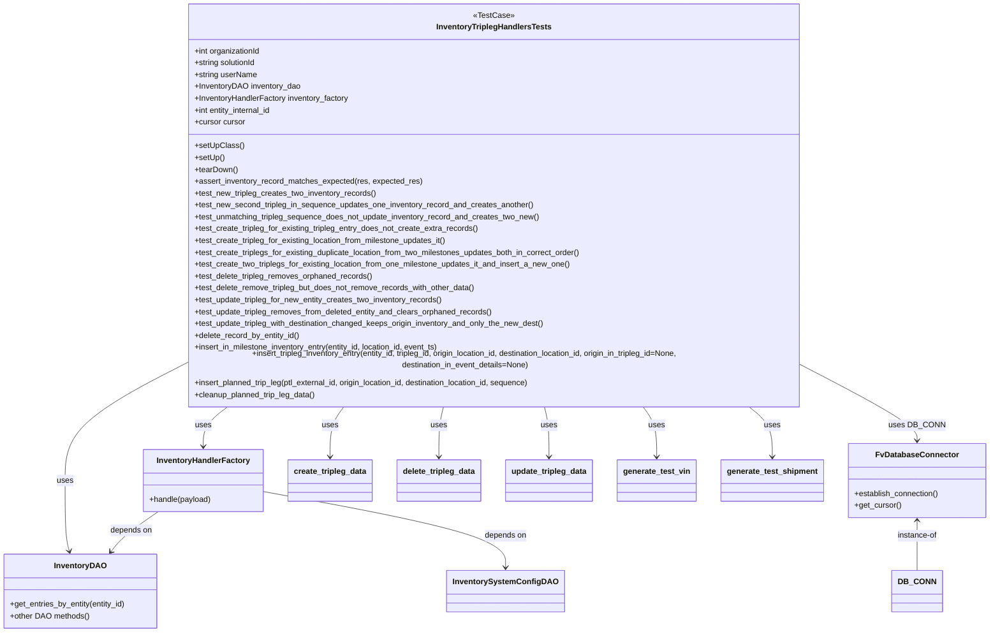

# Diagram: entity_core/entity_service/entity_inventory/entity_inventory_tests/integration/test_inventory_tripleg_processor.py


> Auto-generated by Obscura crawlers

## Diagram 1



### SVG

<svg id="container" width="1981.3125" xmlns="http://www.w3.org/2000/svg" class="classDiagram" height="1256" viewBox="0 0 1981.3125 1256" role="graphics-document document" aria-roledescription="class"><style>#container{font-family:"trebuchet ms",verdana,arial,sans-serif;font-size:16px;fill:#333;}@keyframes edge-animation-frame{from{stroke-dashoffset:0;}}@keyframes dash{to{stroke-dashoffset:0;}}#container .edge-animation-slow{stroke-dasharray:9,5!important;stroke-dashoffset:900;animation:dash 50s linear infinite;stroke-linecap:round;}#container .edge-animation-fast{stroke-dasharray:9,5!important;stroke-dashoffset:900;animation:dash 20s linear infinite;stroke-linecap:round;}#container .error-icon{fill:#552222;}#container .error-text{fill:#552222;stroke:#552222;}#container .edge-thickness-normal{stroke-width:1px;}#container .edge-thickness-thick{stroke-width:3.5px;}#container .edge-pattern-solid{stroke-dasharray:0;}#container .edge-thickness-invisible{stroke-width:0;fill:none;}#container .edge-pattern-dashed{stroke-dasharray:3;}#container .edge-pattern-dotted{stroke-dasharray:2;}#container .marker{fill:#333333;stroke:#333333;}#container .marker.cross{stroke:#333333;}#container svg{font-family:"trebuchet ms",verdana,arial,sans-serif;font-size:16px;}#container p{margin:0;}#container g.classGroup text{fill:#9370DB;stroke:none;font-family:"trebuchet ms",verdana,arial,sans-serif;font-size:10px;}#container g.classGroup text .title{font-weight:bolder;}#container .nodeLabel,#container .edgeLabel{color:#131300;}#container .edgeLabel .label rect{fill:#ECECFF;}#container .label text{fill:#131300;}#container .labelBkg{background:#ECECFF;}#container .edgeLabel .label span{background:#ECECFF;}#container .classTitle{font-weight:bolder;}#container .node rect,#container .node circle,#container .node ellipse,#container .node polygon,#container .node path{fill:#ECECFF;stroke:#9370DB;stroke-width:1px;}#container .divider{stroke:#9370DB;stroke-width:1;}#container g.clickable{cursor:pointer;}#container g.classGroup rect{fill:#ECECFF;stroke:#9370DB;}#container g.classGroup line{stroke:#9370DB;stroke-width:1;}#container .classLabel .box{stroke:none;stroke-width:0;fill:#ECECFF;opacity:0.5;}#container .classLabel .label{fill:#9370DB;font-size:10px;}#container .relation{stroke:#333333;stroke-width:1;fill:none;}#container .dashed-line{stroke-dasharray:3;}#container .dotted-line{stroke-dasharray:1 2;}#container #compositionStart,#container .composition{fill:#333333!important;stroke:#333333!important;stroke-width:1;}#container #compositionEnd,#container .composition{fill:#333333!important;stroke:#333333!important;stroke-width:1;}#container #dependencyStart,#container .dependency{fill:#333333!important;stroke:#333333!important;stroke-width:1;}#container #dependencyStart,#container .dependency{fill:#333333!important;stroke:#333333!important;stroke-width:1;}#container #extensionStart,#container .extension{fill:transparent!important;stroke:#333333!important;stroke-width:1;}#container #extensionEnd,#container .extension{fill:transparent!important;stroke:#333333!important;stroke-width:1;}#container #aggregationStart,#container .aggregation{fill:transparent!important;stroke:#333333!important;stroke-width:1;}#container #aggregationEnd,#container .aggregation{fill:transparent!important;stroke:#333333!important;stroke-width:1;}#container #lollipopStart,#container .lollipop{fill:#ECECFF!important;stroke:#333333!important;stroke-width:1;}#container #lollipopEnd,#container .lollipop{fill:#ECECFF!important;stroke:#333333!important;stroke-width:1;}#container .edgeTerminals{font-size:11px;line-height:initial;}#container .classTitleText{text-anchor:middle;font-size:18px;fill:#333;}#container .label-icon{display:inline-block;height:1em;overflow:visible;vertical-align:-0.125em;}#container .node .label-icon path{fill:currentColor;stroke:revert;stroke-width:revert;}#container :root{--mermaid-font-family:"trebuchet ms",verdana,arial,sans-serif;}</style><g><defs><marker id="container_class-aggregationStart" class="marker aggregation class" refX="18" refY="7" markerWidth="190" markerHeight="240" orient="auto"><path d="M 18,7 L9,13 L1,7 L9,1 Z"></path></marker></defs><defs><marker id="container_class-aggregationEnd" class="marker aggregation class" refX="1" refY="7" markerWidth="20" markerHeight="28" orient="auto"><path d="M 18,7 L9,13 L1,7 L9,1 Z"></path></marker></defs><defs><marker id="container_class-extensionStart" class="marker extension class" refX="18" refY="7" markerWidth="190" markerHeight="240" orient="auto"><path d="M 1,7 L18,13 V 1 Z"></path></marker></defs><defs><marker id="container_class-extensionEnd" class="marker extension class" refX="1" refY="7" markerWidth="20" markerHeight="28" orient="auto"><path d="M 1,1 V 13 L18,7 Z"></path></marker></defs><defs><marker id="container_class-compositionStart" class="marker composition class" refX="18" refY="7" markerWidth="190" markerHeight="240" orient="auto"><path d="M 18,7 L9,13 L1,7 L9,1 Z"></path></marker></defs><defs><marker id="container_class-compositionEnd" class="marker composition class" refX="1" refY="7" markerWidth="20" markerHeight="28" orient="auto"><path d="M 18,7 L9,13 L1,7 L9,1 Z"></path></marker></defs><defs><marker id="container_class-dependencyStart" class="marker dependency class" refX="6" refY="7" markerWidth="190" markerHeight="240" orient="auto"><path d="M 5,7 L9,13 L1,7 L9,1 Z"></path></marker></defs><defs><marker id="container_class-dependencyEnd" class="marker dependency class" refX="13" refY="7" markerWidth="20" markerHeight="28" orient="auto"><path d="M 18,7 L9,13 L14,7 L9,1 Z"></path></marker></defs><defs><marker id="container_class-lollipopStart" class="marker lollipop class" refX="13" refY="7" markerWidth="190" markerHeight="240" orient="auto"><circle stroke="black" fill="transparent" cx="7" cy="7" r="6"></circle></marker></defs><defs><marker id="container_class-lollipopEnd" class="marker lollipop class" refX="1" refY="7" markerWidth="190" markerHeight="240" orient="auto"><circle stroke="black" fill="transparent" cx="7" cy="7" r="6"></circle></marker></defs><g class="root"><g class="clusters"></g><g class="edgePaths"><path d="M342.332,731.459L307.413,749.049C272.493,766.639,202.655,801.82,167.736,838.076C132.816,874.333,132.816,911.667,132.816,949C132.816,986.333,132.816,1023.667,134.279,1047.537C135.741,1071.408,138.666,1081.816,140.128,1087.02L141.59,1092.224" id="id_InventoryTriplegHandlersTests_InventoryDAO_1" class="edge-thickness-normal edge-pattern-solid relation" style=";;;" data-edge="true" data-et="edge" data-id="id_InventoryTriplegHandlersTests_InventoryDAO_1" data-points="W3sieCI6MzQyLjMzMjAzMTI1LCJ5Ijo3MzEuNDU4NTg2Njg0ODQ0NH0seyJ4IjoxMzIuODE2NDA2MjUsInkiOjgzN30seyJ4IjoxMzIuODE2NDA2MjUsInkiOjk0OX0seyJ4IjoxMzIuODE2NDA2MjUsInkiOjEwNjF9LHsieCI6MTQzLjIxMzYyMzA0Njg3NSwieSI6MTA5OH1d" marker-end="url(#container_class-dependencyEnd)"></path><path d="M459.144,800L450.84,806.167C442.536,812.333,425.928,824.667,417.624,838C409.32,851.333,409.32,865.667,409.32,872.833L409.32,880" id="id_InventoryTriplegHandlersTests_InventoryHandlerFactory_2" class="edge-thickness-normal edge-pattern-solid relation" style=";;;" data-edge="true" data-et="edge" data-id="id_InventoryTriplegHandlersTests_InventoryHandlerFactory_2" data-points="W3sieCI6NDU5LjE0MzUzODkwMDExNTQ2LCJ5Ijo4MDB9LHsieCI6NDA5LjMyMDMxMjUsInkiOjgzN30seyJ4Ijo0MDkuMzIwMzEyNSwieSI6ODg2fV0=" marker-end="url(#container_class-dependencyEnd)"></path><path d="M1642.441,738.038L1674.539,754.531C1706.637,771.025,1770.832,804.013,1802.93,825.673C1835.027,847.333,1835.027,857.667,1835.027,862.833L1835.027,868" id="id_InventoryTriplegHandlersTests_FvDatabaseConnector_3" class="edge-thickness-normal edge-pattern-solid relation" style=";;;" data-edge="true" data-et="edge" data-id="id_InventoryTriplegHandlersTests_FvDatabaseConnector_3" data-points="W3sieCI6MTY0Mi40NDE0MDYyNSwieSI6NzM4LjAzNzYzMjgxMzUxNH0seyJ4IjoxODM1LjAyNzM0Mzc1LCJ5Ijo4Mzd9LHsieCI6MTgzNS4wMjczNDM3NSwieSI6ODc0fV0=" marker-end="url(#container_class-dependencyEnd)"></path><path d="M691.789,800L687.108,806.167C682.427,812.333,673.065,824.667,668.384,841.5C663.703,858.333,663.703,879.667,663.703,890.333L663.703,901" id="id_InventoryTriplegHandlersTests_create_tripleg_data_4" class="edge-thickness-normal edge-pattern-solid relation" style=";;;" data-edge="true" data-et="edge" data-id="id_InventoryTriplegHandlersTests_create_tripleg_data_4" data-points="W3sieCI6NjkxLjc4OTI1MTk0ODYxNDMsInkiOjgwMH0seyJ4Ijo2NjMuNzAzMTI1LCJ5Ijo4Mzd9LHsieCI6NjYzLjcwMzEyNSwieSI6OTA3fV0=" marker-end="url(#container_class-dependencyEnd)"></path><path d="M891.268,800L889.694,806.167C888.119,812.333,884.97,824.667,883.395,841.5C881.82,858.333,881.82,879.667,881.82,890.333L881.82,901" id="id_InventoryTriplegHandlersTests_delete_tripleg_data_5" class="edge-thickness-normal edge-pattern-solid relation" style=";;;" data-edge="true" data-et="edge" data-id="id_InventoryTriplegHandlersTests_delete_tripleg_data_5" data-points="W3sieCI6ODkxLjI2ODI1MDIxNjUxMjcsInkiOjgwMH0seyJ4Ijo4ODEuODIwMzEyNSwieSI6ODM3fSx7IngiOjg4MS44MjAzMTI1LCJ5Ijo5MDd9XQ==" marker-end="url(#container_class-dependencyEnd)"></path><path d="M1093.505,800L1095.08,806.167C1096.654,812.333,1099.804,824.667,1101.378,841.5C1102.953,858.333,1102.953,879.667,1102.953,890.333L1102.953,901" id="id_InventoryTriplegHandlersTests_update_tripleg_data_6" class="edge-thickness-normal edge-pattern-solid relation" style=";;;" data-edge="true" data-et="edge" data-id="id_InventoryTriplegHandlersTests_update_tripleg_data_6" data-points="W3sieCI6MTA5My41MDUxODcyODM0ODcyLCJ5Ijo4MDB9LHsieCI6MTEwMi45NTMxMjUsInkiOjgzN30seyJ4IjoxMTAyLjk1MzEyNSwieSI6OTA3fV0=" marker-end="url(#container_class-dependencyEnd)"></path><path d="M1289.455,800L1294.081,806.167C1298.707,812.333,1307.959,824.667,1312.585,841.5C1317.211,858.333,1317.211,879.667,1317.211,890.333L1317.211,901" id="id_InventoryTriplegHandlersTests_generate_test_vin_7" class="edge-thickness-normal edge-pattern-solid relation" style=";;;" data-edge="true" data-et="edge" data-id="id_InventoryTriplegHandlersTests_generate_test_vin_7" data-points="W3sieCI6MTI4OS40NTQ1OTU0ODIxMDE3LCJ5Ijo4MDB9LHsieCI6MTMxNy4yMTA5Mzc1LCJ5Ijo4Mzd9LHsieCI6MTMxNy4yMTA5Mzc1LCJ5Ijo5MDd9XQ==" marker-end="url(#container_class-dependencyEnd)"></path><path d="M1498.401,800L1506.28,806.167C1514.16,812.333,1529.92,824.667,1537.8,841.5C1545.68,858.333,1545.68,879.667,1545.68,890.333L1545.68,901" id="id_InventoryTriplegHandlersTests_generate_test_shipment_8" class="edge-thickness-normal edge-pattern-solid relation" style=";;;" data-edge="true" data-et="edge" data-id="id_InventoryTriplegHandlersTests_generate_test_shipment_8" data-points="W3sieCI6MTQ5OC40MDA2MTE2NDgzODMzLCJ5Ijo4MDB9LHsieCI6MTU0NS42Nzk2ODc1LCJ5Ijo4Mzd9LHsieCI6MTU0NS42Nzk2ODc1LCJ5Ijo5MDd9XQ==" marker-end="url(#container_class-dependencyEnd)"></path><path d="M319.876,1012L308.282,1020.167C296.687,1028.333,273.498,1044.667,257.776,1058.207C242.054,1071.747,233.8,1082.494,229.673,1087.868L225.546,1093.241" id="id_InventoryHandlerFactory_InventoryDAO_9" class="edge-thickness-normal edge-pattern-solid relation" style=";;;" data-edge="true" data-et="edge" data-id="id_InventoryHandlerFactory_InventoryDAO_9" data-points="W3sieCI6MzE5Ljg3NjIyMDcwMzEyNSwieSI6MTAxMn0seyJ4IjoyNTAuMzA4NTkzNzUsInkiOjEwNjF9LHsieCI6MjIxLjg5MTQyNzE3NjMzOTI4LCJ5IjoxMDk4fV0=" marker-end="url(#container_class-dependencyEnd)"></path><path d="M529.867,971.177L611.24,986.148C692.613,1001.118,855.358,1031.059,936.731,1056.696C1018.104,1082.333,1018.104,1103.667,1018.104,1114.333L1018.104,1125" id="id_InventoryHandlerFactory_InventorySystemConfigDAO_10" class="edge-thickness-normal edge-pattern-solid relation" style=";;;" data-edge="true" data-et="edge" data-id="id_InventoryHandlerFactory_InventorySystemConfigDAO_10" data-points="W3sieCI6NTI5Ljg2NzE4NzUsInkiOjk3MS4xNzc0MzUxMzczMjg5fSx7IngiOjEwMTguMTAzNTE1NjI1LCJ5IjoxMDYxfSx7IngiOjEwMTguMTAzNTE1NjI1LCJ5IjoxMTMxfV0=" marker-end="url(#container_class-dependencyEnd)"></path><path d="M1835.027,1030L1835.027,1035.167C1835.027,1040.333,1835.027,1050.667,1835.027,1067.5C1835.027,1084.333,1835.027,1107.667,1835.027,1119.333L1835.027,1131" id="id_FvDatabaseConnector_DB_CONN_11" class="edge-thickness-normal edge-pattern-solid relation" style=";;;" data-edge="true" data-et="edge" data-id="id_FvDatabaseConnector_DB_CONN_11" data-points="W3sieCI6MTgzNS4wMjczNDM3NSwieSI6MTAyNH0seyJ4IjoxODM1LjAyNzM0Mzc1LCJ5IjoxMDYxfSx7IngiOjE4MzUuMDI3MzQzNzUsInkiOjExMzF9XQ==" marker-start="url(#container_class-dependencyStart)"></path></g><g class="edgeLabels"><g class="edgeLabel" transform="translate(132.81640625, 949)"><g class="label" data-id="id_InventoryTriplegHandlersTests_InventoryDAO_1" transform="translate(-16.4921875, -12)"><foreignObject width="32.984375" height="24"><div xmlns="http://www.w3.org/1999/xhtml" class="labelBkg" style="display: table-cell; white-space: nowrap; line-height: 1.5; max-width: 200px; text-align: center;"><span class="edgeLabel"><p>uses</p></span></div></foreignObject></g></g><g class="edgeLabel" transform="translate(409.3203125, 837)"><g class="label" data-id="id_InventoryTriplegHandlersTests_InventoryHandlerFactory_2" transform="translate(-16.4921875, -12)"><foreignObject width="32.984375" height="24"><div xmlns="http://www.w3.org/1999/xhtml" class="labelBkg" style="display: table-cell; white-space: nowrap; line-height: 1.5; max-width: 200px; text-align: center;"><span class="edgeLabel"><p>uses</p></span></div></foreignObject></g></g><g class="edgeLabel" transform="translate(1835.02734375, 837)"><g class="label" data-id="id_InventoryTriplegHandlersTests_FvDatabaseConnector_3" transform="translate(-53.09375, -12)"><foreignObject width="106.1875" height="24"><div xmlns="http://www.w3.org/1999/xhtml" class="labelBkg" style="display: table-cell; white-space: nowrap; line-height: 1.5; max-width: 200px; text-align: center;"><span class="edgeLabel"><p>uses DB_CONN</p></span></div></foreignObject></g></g><g class="edgeLabel" transform="translate(663.703125, 837)"><g class="label" data-id="id_InventoryTriplegHandlersTests_create_tripleg_data_4" transform="translate(-16.4921875, -12)"><foreignObject width="32.984375" height="24"><div xmlns="http://www.w3.org/1999/xhtml" class="labelBkg" style="display: table-cell; white-space: nowrap; line-height: 1.5; max-width: 200px; text-align: center;"><span class="edgeLabel"><p>uses</p></span></div></foreignObject></g></g><g class="edgeLabel" transform="translate(881.8203125, 837)"><g class="label" data-id="id_InventoryTriplegHandlersTests_delete_tripleg_data_5" transform="translate(-16.4921875, -12)"><foreignObject width="32.984375" height="24"><div xmlns="http://www.w3.org/1999/xhtml" class="labelBkg" style="display: table-cell; white-space: nowrap; line-height: 1.5; max-width: 200px; text-align: center;"><span class="edgeLabel"><p>uses</p></span></div></foreignObject></g></g><g class="edgeLabel" transform="translate(1102.953125, 837)"><g class="label" data-id="id_InventoryTriplegHandlersTests_update_tripleg_data_6" transform="translate(-16.4921875, -12)"><foreignObject width="32.984375" height="24"><div xmlns="http://www.w3.org/1999/xhtml" class="labelBkg" style="display: table-cell; white-space: nowrap; line-height: 1.5; max-width: 200px; text-align: center;"><span class="edgeLabel"><p>uses</p></span></div></foreignObject></g></g><g class="edgeLabel" transform="translate(1317.2109375, 837)"><g class="label" data-id="id_InventoryTriplegHandlersTests_generate_test_vin_7" transform="translate(-16.4921875, -12)"><foreignObject width="32.984375" height="24"><div xmlns="http://www.w3.org/1999/xhtml" class="labelBkg" style="display: table-cell; white-space: nowrap; line-height: 1.5; max-width: 200px; text-align: center;"><span class="edgeLabel"><p>uses</p></span></div></foreignObject></g></g><g class="edgeLabel" transform="translate(1545.6796875, 837)"><g class="label" data-id="id_InventoryTriplegHandlersTests_generate_test_shipment_8" transform="translate(-16.4921875, -12)"><foreignObject width="32.984375" height="24"><div xmlns="http://www.w3.org/1999/xhtml" class="labelBkg" style="display: table-cell; white-space: nowrap; line-height: 1.5; max-width: 200px; text-align: center;"><span class="edgeLabel"><p>uses</p></span></div></foreignObject></g></g><g class="edgeLabel" transform="translate(266.02151, 1049.9326)"><g class="label" data-id="id_InventoryHandlerFactory_InventoryDAO_9" transform="translate(-42.9453125, -12)"><foreignObject width="85.890625" height="24"><div xmlns="http://www.w3.org/1999/xhtml" class="labelBkg" style="display: table-cell; white-space: nowrap; line-height: 1.5; max-width: 200px; text-align: center;"><span class="edgeLabel"><p>depends on</p></span></div></foreignObject></g></g><g class="edgeLabel" transform="translate(1018.103515625, 1061)"><g class="label" data-id="id_InventoryHandlerFactory_InventorySystemConfigDAO_10" transform="translate(-42.9453125, -12)"><foreignObject width="85.890625" height="24"><div xmlns="http://www.w3.org/1999/xhtml" class="labelBkg" style="display: table-cell; white-space: nowrap; line-height: 1.5; max-width: 200px; text-align: center;"><span class="edgeLabel"><p>depends on</p></span></div></foreignObject></g></g><g class="edgeLabel" transform="translate(1835.02734375, 1061)"><g class="label" data-id="id_FvDatabaseConnector_DB_CONN_11" transform="translate(-41.15625, -12)"><foreignObject width="82.3125" height="24"><div xmlns="http://www.w3.org/1999/xhtml" class="labelBkg" style="display: table-cell; white-space: nowrap; line-height: 1.5; max-width: 200px; text-align: center;"><span class="edgeLabel"><p>instance-of</p></span></div></foreignObject></g></g></g><g class="nodes"><g class="node default" id="classId-InventoryTriplegHandlersTests-0" transform="translate(992.38671875, 404)"><g class="basic label-container"><path d="M-650.0546875 -396 L650.0546875 -396 L650.0546875 396 L-650.0546875 396" stroke="none" stroke-width="0" fill="#ECECFF" style=""></path><path d="M-650.0546875 -396 C-252.66779567360493 -396, 144.71909615279014 -396, 650.0546875 -396 M-650.0546875 -396 C-212.47651871715237 -396, 225.10165006569525 -396, 650.0546875 -396 M650.0546875 -396 C650.0546875 -227.60037093209382, 650.0546875 -59.20074186418765, 650.0546875 396 M650.0546875 -396 C650.0546875 -149.7016686713649, 650.0546875 96.5966626572702, 650.0546875 396 M650.0546875 396 C294.5532756571803 396, -60.94813618563944 396, -650.0546875 396 M650.0546875 396 C285.63506575927806 396, -78.78455598144387 396, -650.0546875 396 M-650.0546875 396 C-650.0546875 130.86227870508424, -650.0546875 -134.27544258983153, -650.0546875 -396 M-650.0546875 396 C-650.0546875 182.86007538090553, -650.0546875 -30.279849238188945, -650.0546875 -396" stroke="#9370DB" stroke-width="1.3" fill="none" stroke-dasharray="0 0" style=""></path></g><g class="annotation-group text" transform="translate(-40.2578125, -372)"><g class="label" style="" transform="translate(0,-12)"><foreignObject width="80.515625" height="24"><div xmlns="http://www.w3.org/1999/xhtml" style="display: table-cell; white-space: nowrap; line-height: 1.5; max-width: 131px; text-align: center;"><span class="nodeLabel markdown-node-label" style=""><p>«TestCase»</p></span></div></foreignObject></g></g><g class="label-group text" transform="translate(-112.40625, -348)"><g class="label" style="font-weight: bolder" transform="translate(0,-12)"><foreignObject width="224.8125" height="24"><div xmlns="http://www.w3.org/1999/xhtml" style="display: table-cell; white-space: nowrap; line-height: 1.5; max-width: 271px; text-align: center;"><span class="nodeLabel markdown-node-label" style=""><p>InventoryTriplegHandlersTests</p></span></div></foreignObject></g></g><g class="members-group text" transform="translate(-638.0546875, -300)"><g class="label" style="" transform="translate(0,-12)"><foreignObject width="136.53125" height="24"><div xmlns="http://www.w3.org/1999/xhtml" style="display: table-cell; white-space: nowrap; line-height: 1.5; max-width: 194px; text-align: center;"><span class="nodeLabel markdown-node-label" style=""><p>+int organizationId</p></span></div></foreignObject></g><g class="label" style="" transform="translate(0,12)"><foreignObject width="127.96875" height="24"><div xmlns="http://www.w3.org/1999/xhtml" style="display: table-cell; white-space: nowrap; line-height: 1.5; max-width: 185px; text-align: center;"><span class="nodeLabel markdown-node-label" style=""><p>+string solutionId</p></span></div></foreignObject></g><g class="label" style="" transform="translate(0,36)"><foreignObject width="127.609375" height="24"><div xmlns="http://www.w3.org/1999/xhtml" style="display: table-cell; white-space: nowrap; line-height: 1.5; max-width: 185px; text-align: center;"><span class="nodeLabel markdown-node-label" style=""><p>+string userName</p></span></div></foreignObject></g><g class="label" style="" transform="translate(0,60)"><foreignObject width="215.015625" height="24"><div xmlns="http://www.w3.org/1999/xhtml" style="display: table-cell; white-space: nowrap; line-height: 1.5; max-width: 272px; text-align: center;"><span class="nodeLabel markdown-node-label" style=""><p>+InventoryDAO inventory_dao</p></span></div></foreignObject></g><g class="label" style="" transform="translate(0,84)"><foreignObject width="317.671875" height="24"><div xmlns="http://www.w3.org/1999/xhtml" style="display: table-cell; white-space: nowrap; line-height: 1.5; max-width: 375px; text-align: center;"><span class="nodeLabel markdown-node-label" style=""><p>+InventoryHandlerFactory inventory_factory</p></span></div></foreignObject></g><g class="label" style="" transform="translate(0,108)"><foreignObject width="161.015625" height="24"><div xmlns="http://www.w3.org/1999/xhtml" style="display: table-cell; white-space: nowrap; line-height: 1.5; max-width: 218px; text-align: center;"><span class="nodeLabel markdown-node-label" style=""><p>+int entity_internal_id</p></span></div></foreignObject></g><g class="label" style="" transform="translate(0,132)"><foreignObject width="103.6875" height="24"><div xmlns="http://www.w3.org/1999/xhtml" style="display: table-cell; white-space: nowrap; line-height: 1.5; max-width: 162px; text-align: center;"><span class="nodeLabel markdown-node-label" style=""><p>+cursor cursor</p></span></div></foreignObject></g></g><g class="methods-group text" transform="translate(-638.0546875, -108)"><g class="label" style="" transform="translate(0,-12)"><foreignObject width="97.15625" height="24"><div xmlns="http://www.w3.org/1999/xhtml" style="display: table-cell; white-space: nowrap; line-height: 1.5; max-width: 155px; text-align: center;"><span class="nodeLabel markdown-node-label" style=""><p>+setUpClass()</p></span></div></foreignObject></g><g class="label" style="" transform="translate(0,12)"><foreignObject width="60.421875" height="24"><div xmlns="http://www.w3.org/1999/xhtml" style="display: table-cell; white-space: nowrap; line-height: 1.5; max-width: 118px; text-align: center;"><span class="nodeLabel markdown-node-label" style=""><p>+setUp()</p></span></div></foreignObject></g><g class="label" style="" transform="translate(0,36)"><foreignObject width="87.75" height="24"><div xmlns="http://www.w3.org/1999/xhtml" style="display: table-cell; white-space: nowrap; line-height: 1.5; max-width: 145px; text-align: center;"><span class="nodeLabel markdown-node-label" style=""><p>+tearDown()</p></span></div></foreignObject></g><g class="label" style="" transform="translate(0,60)"><foreignObject width="462.65625" height="24"><div xmlns="http://www.w3.org/1999/xhtml" style="display: table-cell; white-space: nowrap; line-height: 1.5; max-width: 520px; text-align: center;"><span class="nodeLabel markdown-node-label" style=""><p>+assert_inventory_record_matches_expected(res, expected_res)</p></span></div></foreignObject></g><g class="label" style="" transform="translate(0,84)"><foreignObject width="371.90625" height="24"><div xmlns="http://www.w3.org/1999/xhtml" style="display: table-cell; white-space: nowrap; line-height: 1.5; max-width: 429px; text-align: center;"><span class="nodeLabel markdown-node-label" style=""><p>+test_new_tripleg_creates_two_inventory_records()</p></span></div></foreignObject></g><g class="label" style="" transform="translate(0,108)"><foreignObject width="692.453125" height="24"><div xmlns="http://www.w3.org/1999/xhtml" style="display: table-cell; white-space: nowrap; line-height: 1.5; max-width: 750px; text-align: center;"><span class="nodeLabel markdown-node-label" style=""><p>+test_new_second_tripleg_in_sequence_updates_one_inventory_record_and_creates_another()</p></span></div></foreignObject></g><g class="label" style="" transform="translate(0,132)"><foreignObject width="706.1875" height="24"><div xmlns="http://www.w3.org/1999/xhtml" style="display: table-cell; white-space: nowrap; line-height: 1.5; max-width: 764px; text-align: center;"><span class="nodeLabel markdown-node-label" style=""><p>+test_unmatching_tripleg_sequence_does_not_update_inventory_record_and_creates_two_new()</p></span></div></foreignObject></g><g class="label" style="" transform="translate(0,156)"><foreignObject width="581.65625" height="24"><div xmlns="http://www.w3.org/1999/xhtml" style="display: table-cell; white-space: nowrap; line-height: 1.5; max-width: 639px; text-align: center;"><span class="nodeLabel markdown-node-label" style=""><p>+test_create_tripleg_for_existing_tripleg_entry_does_not_create_extra_records()</p></span></div></foreignObject></g><g class="label" style="" transform="translate(0,180)"><foreignObject width="520.34375" height="24"><div xmlns="http://www.w3.org/1999/xhtml" style="display: table-cell; white-space: nowrap; line-height: 1.5; max-width: 578px; text-align: center;"><span class="nodeLabel markdown-node-label" style=""><p>+test_create_tripleg_for_existing_location_from_milestone_updates_it()</p></span></div></foreignObject></g><g class="label" style="" transform="translate(0,204)"><foreignObject width="796.890625" height="24"><div xmlns="http://www.w3.org/1999/xhtml" style="display: table-cell; white-space: nowrap; line-height: 1.5; max-width: 854px; text-align: center;"><span class="nodeLabel markdown-node-label" style=""><p>+test_create_triplegs_for_existing_duplicate_location_from_two_milestones_updates_both_in_correct_order()</p></span></div></foreignObject></g><g class="label" style="" transform="translate(0,228)"><foreignObject width="772.421875" height="24"><div xmlns="http://www.w3.org/1999/xhtml" style="display: table-cell; white-space: nowrap; line-height: 1.5; max-width: 830px; text-align: center;"><span class="nodeLabel markdown-node-label" style=""><p>+test_create_two_triplegs_for_existing_location_from_one_milestone_updates_it_and_insert_a_new_one()</p></span></div></foreignObject></g><g class="label" style="" transform="translate(0,252)"><foreignObject width="365.34375" height="24"><div xmlns="http://www.w3.org/1999/xhtml" style="display: table-cell; white-space: nowrap; line-height: 1.5; max-width: 423px; text-align: center;"><span class="nodeLabel markdown-node-label" style=""><p>+test_delete_tripleg_removes_orphaned_records()</p></span></div></foreignObject></g><g class="label" style="" transform="translate(0,276)"><foreignObject width="575.109375" height="24"><div xmlns="http://www.w3.org/1999/xhtml" style="display: table-cell; white-space: nowrap; line-height: 1.5; max-width: 632px; text-align: center;"><span class="nodeLabel markdown-node-label" style=""><p>+test_delete_remove_tripleg_but_does_not_remove_records_with_other_data()</p></span></div></foreignObject></g><g class="label" style="" transform="translate(0,300)"><foreignObject width="507.84375" height="24"><div xmlns="http://www.w3.org/1999/xhtml" style="display: table-cell; white-space: nowrap; line-height: 1.5; max-width: 565px; text-align: center;"><span class="nodeLabel markdown-node-label" style=""><p>+test_update_tripleg_for_new_entity_creates_two_inventory_records()</p></span></div></foreignObject></g><g class="label" style="" transform="translate(0,324)"><foreignObject width="612.09375" height="24"><div xmlns="http://www.w3.org/1999/xhtml" style="display: table-cell; white-space: nowrap; line-height: 1.5; max-width: 669px; text-align: center;"><span class="nodeLabel markdown-node-label" style=""><p>+test_update_tripleg_removes_from_deleted_entity_and_clears_orphaned_records()</p></span></div></foreignObject></g><g class="label" style="" transform="translate(0,348)"><foreignObject width="720.3125" height="24"><div xmlns="http://www.w3.org/1999/xhtml" style="display: table-cell; white-space: nowrap; line-height: 1.5; max-width: 778px; text-align: center;"><span class="nodeLabel markdown-node-label" style=""><p>+test_update_tripleg_with_destination_changed_keeps_origin_inventory_and_only_the_new_dest()</p></span></div></foreignObject></g><g class="label" style="" transform="translate(0,372)"><foreignObject width="215.609375" height="24"><div xmlns="http://www.w3.org/1999/xhtml" style="display: table-cell; white-space: nowrap; line-height: 1.5; max-width: 273px; text-align: center;"><span class="nodeLabel markdown-node-label" style=""><p>+delete_record_by_entity_id()</p></span></div></foreignObject></g><g class="label" style="" transform="translate(0,396)"><foreignObject width="508.140625" height="24"><div xmlns="http://www.w3.org/1999/xhtml" style="display: table-cell; white-space: nowrap; line-height: 1.5; max-width: 566px; text-align: center;"><span class="nodeLabel markdown-node-label" style=""><p>+insert_in_milestone_inventory_entry(entity_id, location_id, event_ts)</p></span></div></foreignObject></g><g class="label" style="" transform="translate(0,420)"><foreignObject width="1163.703125" height="24"><div xmlns="http://www.w3.org/1999/xhtml" style="display: table-cell; white-space: nowrap; line-height: 1.5; max-width: 1221px; text-align: center;"><span class="nodeLabel markdown-node-label" style=""><p>+insert_tripleg_inventory_entry(entity_id, tripleg_id, origin_location_id, destination_location_id, origin_in_tripleg_id=None, destination_in_event_details=None)</p></span></div></foreignObject></g><g class="label" style="" transform="translate(0,444)"><foreignObject width="699.859375" height="24"><div xmlns="http://www.w3.org/1999/xhtml" style="display: table-cell; white-space: nowrap; line-height: 1.5; max-width: 757px; text-align: center;"><span class="nodeLabel markdown-node-label" style=""><p>+insert_planned_trip_leg(ptl_external_id, origin_location_id, destination_location_id, sequence)</p></span></div></foreignObject></g><g class="label" style="" transform="translate(0,468)"><foreignObject width="248.09375" height="24"><div xmlns="http://www.w3.org/1999/xhtml" style="display: table-cell; white-space: nowrap; line-height: 1.5; max-width: 305px; text-align: center;"><span class="nodeLabel markdown-node-label" style=""><p>+cleanup_planned_trip_leg_data()</p></span></div></foreignObject></g></g><g class="divider" style=""><path d="M-650.0546875 -324 C-286.79191181302775 -324, 76.4708638739445 -324, 650.0546875 -324 M-650.0546875 -324 C-320.2581630845952 -324, 9.538361330809607 -324, 650.0546875 -324" stroke="#9370DB" stroke-width="1.3" fill="none" stroke-dasharray="0 0" style=""></path></g><g class="divider" style=""><path d="M-650.0546875 -132 C-247.5660594548117 -132, 154.9225685903766 -132, 650.0546875 -132 M-650.0546875 -132 C-352.54675509418905 -132, -55.038822688378104 -132, 650.0546875 -132" stroke="#9370DB" stroke-width="1.3" fill="none" stroke-dasharray="0 0" style=""></path></g></g><g class="node default" id="classId-InventoryDAO-1" transform="translate(164.2890625, 1173)"><g class="basic label-container"><path d="M-156.2890625 -75 L156.2890625 -75 L156.2890625 75 L-156.2890625 75" stroke="none" stroke-width="0" fill="#ECECFF" style=""></path><path d="M-156.2890625 -75 C-93.75880289858159 -75, -31.228543297163185 -75, 156.2890625 -75 M-156.2890625 -75 C-76.16326005708126 -75, 3.96254238583748 -75, 156.2890625 -75 M156.2890625 -75 C156.2890625 -44.502414721493814, 156.2890625 -14.004829442987628, 156.2890625 75 M156.2890625 -75 C156.2890625 -22.369634260614106, 156.2890625 30.26073147877179, 156.2890625 75 M156.2890625 75 C91.88220112219531 75, 27.475339744390624 75, -156.2890625 75 M156.2890625 75 C37.567934963576235 75, -81.15319257284753 75, -156.2890625 75 M-156.2890625 75 C-156.2890625 22.871082443409485, -156.2890625 -29.25783511318103, -156.2890625 -75 M-156.2890625 75 C-156.2890625 20.1335471534371, -156.2890625 -34.7329056931258, -156.2890625 -75" stroke="#9370DB" stroke-width="1.3" fill="none" stroke-dasharray="0 0" style=""></path></g><g class="annotation-group text" transform="translate(0, -51)"></g><g class="label-group text" transform="translate(-50.25, -51)"><g class="label" style="font-weight: bolder" transform="translate(0,-12)"><foreignObject width="100.5" height="24"><div xmlns="http://www.w3.org/1999/xhtml" style="display: table-cell; white-space: nowrap; line-height: 1.5; max-width: 149px; text-align: center;"><span class="nodeLabel markdown-node-label" style=""><p>InventoryDAO</p></span></div></foreignObject></g></g><g class="members-group text" transform="translate(-144.2890625, -3)"></g><g class="methods-group text" transform="translate(-144.2890625, 27)"><g class="label" style="" transform="translate(0,-12)"><foreignObject width="238.328125" height="24"><div xmlns="http://www.w3.org/1999/xhtml" style="display: table-cell; white-space: nowrap; line-height: 1.5; max-width: 296px; text-align: center;"><span class="nodeLabel markdown-node-label" style=""><p>+get_entries_by_entity(entity_id)</p></span></div></foreignObject></g><g class="label" style="" transform="translate(0,12)"><foreignObject width="160.421875" height="24"><div xmlns="http://www.w3.org/1999/xhtml" style="display: table-cell; white-space: nowrap; line-height: 1.5; max-width: 218px; text-align: center;"><span class="nodeLabel markdown-node-label" style=""><p>+other DAO methods()</p></span></div></foreignObject></g></g><g class="divider" style=""><path d="M-156.2890625 -27 C-52.86887940011488 -27, 50.551303699770244 -27, 156.2890625 -27 M-156.2890625 -27 C-59.2795991994342 -27, 37.7298641011316 -27, 156.2890625 -27" stroke="#9370DB" stroke-width="1.3" fill="none" stroke-dasharray="0 0" style=""></path></g><g class="divider" style=""><path d="M-156.2890625 -3 C-55.762383271912526 -3, 44.76429595617495 -3, 156.2890625 -3 M-156.2890625 -3 C-80.15899659207548 -3, -4.028930684150964 -3, 156.2890625 -3" stroke="#9370DB" stroke-width="1.3" fill="none" stroke-dasharray="0 0" style=""></path></g></g><g class="node default" id="classId-InventoryHandlerFactory-2" transform="translate(409.3203125, 949)"><g class="basic label-container"><path d="M-120.546875 -63 L120.546875 -63 L120.546875 63 L-120.546875 63" stroke="none" stroke-width="0" fill="#ECECFF" style=""></path><path d="M-120.546875 -63 C-57.899786744866006 -63, 4.747301510267988 -63, 120.546875 -63 M-120.546875 -63 C-25.825664482308724 -63, 68.89554603538255 -63, 120.546875 -63 M120.546875 -63 C120.546875 -18.182677918569908, 120.546875 26.634644162860184, 120.546875 63 M120.546875 -63 C120.546875 -28.93658914840143, 120.546875 5.1268217031971375, 120.546875 63 M120.546875 63 C40.583993082268876 63, -39.37888883546225 63, -120.546875 63 M120.546875 63 C28.309607022842044 63, -63.92766095431591 63, -120.546875 63 M-120.546875 63 C-120.546875 22.544368138076777, -120.546875 -17.911263723846446, -120.546875 -63 M-120.546875 63 C-120.546875 31.71981911476119, -120.546875 0.4396382295223802, -120.546875 -63" stroke="#9370DB" stroke-width="1.3" fill="none" stroke-dasharray="0 0" style=""></path></g><g class="annotation-group text" transform="translate(0, -39)"></g><g class="label-group text" transform="translate(-90.640625, -39)"><g class="label" style="font-weight: bolder" transform="translate(0,-12)"><foreignObject width="181.28125" height="24"><div xmlns="http://www.w3.org/1999/xhtml" style="display: table-cell; white-space: nowrap; line-height: 1.5; max-width: 229px; text-align: center;"><span class="nodeLabel markdown-node-label" style=""><p>InventoryHandlerFactory</p></span></div></foreignObject></g></g><g class="members-group text" transform="translate(-108.546875, 9)"></g><g class="methods-group text" transform="translate(-108.546875, 39)"><g class="label" style="" transform="translate(0,-12)"><foreignObject width="126.453125" height="24"><div xmlns="http://www.w3.org/1999/xhtml" style="display: table-cell; white-space: nowrap; line-height: 1.5; max-width: 184px; text-align: center;"><span class="nodeLabel markdown-node-label" style=""><p>+handle(payload)</p></span></div></foreignObject></g></g><g class="divider" style=""><path d="M-120.546875 -15 C-26.876784290333177 -15, 66.79330641933365 -15, 120.546875 -15 M-120.546875 -15 C-26.511262784961588 -15, 67.52434943007682 -15, 120.546875 -15" stroke="#9370DB" stroke-width="1.3" fill="none" stroke-dasharray="0 0" style=""></path></g><g class="divider" style=""><path d="M-120.546875 9 C-61.46030039975559 9, -2.3737257995111776 9, 120.546875 9 M-120.546875 9 C-34.041259308470586 9, 52.46435638305883 9, 120.546875 9" stroke="#9370DB" stroke-width="1.3" fill="none" stroke-dasharray="0 0" style=""></path></g></g><g class="node default" id="classId-InventorySystemConfigDAO-3" transform="translate(1018.103515625, 1173)"><g class="basic label-container"><path d="M-111.734375 -42 L111.734375 -42 L111.734375 42 L-111.734375 42" stroke="none" stroke-width="0" fill="#ECECFF" style=""></path><path d="M-111.734375 -42 C-62.82850299309909 -42, -13.922630986198186 -42, 111.734375 -42 M-111.734375 -42 C-35.187792680680374 -42, 41.35878963863925 -42, 111.734375 -42 M111.734375 -42 C111.734375 -23.727448870553882, 111.734375 -5.454897741107764, 111.734375 42 M111.734375 -42 C111.734375 -14.636675283769154, 111.734375 12.726649432461691, 111.734375 42 M111.734375 42 C44.23203846244962 42, -23.270298075100754 42, -111.734375 42 M111.734375 42 C54.71451917608331 42, -2.3053366478333857 42, -111.734375 42 M-111.734375 42 C-111.734375 10.854263021540909, -111.734375 -20.291473956918182, -111.734375 -42 M-111.734375 42 C-111.734375 20.93752691385517, -111.734375 -0.1249461722896612, -111.734375 -42" stroke="#9370DB" stroke-width="1.3" fill="none" stroke-dasharray="0 0" style=""></path></g><g class="annotation-group text" transform="translate(0, -18)"></g><g class="label-group text" transform="translate(-99.734375, -18)"><g class="label" style="font-weight: bolder" transform="translate(0,-12)"><foreignObject width="199.46875" height="24"><div xmlns="http://www.w3.org/1999/xhtml" style="display: table-cell; white-space: nowrap; line-height: 1.5; max-width: 246px; text-align: center;"><span class="nodeLabel markdown-node-label" style=""><p>InventorySystemConfigDAO</p></span></div></foreignObject></g></g><g class="members-group text" transform="translate(-99.734375, 30)"></g><g class="methods-group text" transform="translate(-99.734375, 60)"></g><g class="divider" style=""><path d="M-111.734375 6 C-55.035906395947045 6, 1.6625622081059106 6, 111.734375 6 M-111.734375 6 C-61.719810579241816 6, -11.705246158483632 6, 111.734375 6" stroke="#9370DB" stroke-width="1.3" fill="none" stroke-dasharray="0 0" style=""></path></g><g class="divider" style=""><path d="M-111.734375 24 C-23.54054708428599 24, 64.65328083142802 24, 111.734375 24 M-111.734375 24 C-49.64655028926348 24, 12.44127442147304 24, 111.734375 24" stroke="#9370DB" stroke-width="1.3" fill="none" stroke-dasharray="0 0" style=""></path></g></g><g class="node default" id="classId-FvDatabaseConnector-4" transform="translate(1835.02734375, 949)"><g class="basic label-container"><path d="M-138.28515625 -75 L138.28515625 -75 L138.28515625 75 L-138.28515625 75" stroke="none" stroke-width="0" fill="#ECECFF" style=""></path><path d="M-138.28515625 -75 C-42.710835469290444 -75, 52.86348531141911 -75, 138.28515625 -75 M-138.28515625 -75 C-79.69202837012651 -75, -21.09890049025303 -75, 138.28515625 -75 M138.28515625 -75 C138.28515625 -26.771496313957613, 138.28515625 21.457007372084774, 138.28515625 75 M138.28515625 -75 C138.28515625 -42.83900838395169, 138.28515625 -10.678016767903387, 138.28515625 75 M138.28515625 75 C45.45838200946666 75, -47.36839223106668 75, -138.28515625 75 M138.28515625 75 C49.75976157967928 75, -38.765633090641444 75, -138.28515625 75 M-138.28515625 75 C-138.28515625 41.57126660105713, -138.28515625 8.142533202114265, -138.28515625 -75 M-138.28515625 75 C-138.28515625 20.352809433447362, -138.28515625 -34.294381133105276, -138.28515625 -75" stroke="#9370DB" stroke-width="1.3" fill="none" stroke-dasharray="0 0" style=""></path></g><g class="annotation-group text" transform="translate(0, -51)"></g><g class="label-group text" transform="translate(-79.3046875, -51)"><g class="label" style="font-weight: bolder" transform="translate(0,-12)"><foreignObject width="158.609375" height="24"><div xmlns="http://www.w3.org/1999/xhtml" style="display: table-cell; white-space: nowrap; line-height: 1.5; max-width: 207px; text-align: center;"><span class="nodeLabel markdown-node-label" style=""><p>FvDatabaseConnector</p></span></div></foreignObject></g></g><g class="members-group text" transform="translate(-126.28515625, -3)"></g><g class="methods-group text" transform="translate(-126.28515625, 27)"><g class="label" style="" transform="translate(0,-12)"><foreignObject width="173.265625" height="24"><div xmlns="http://www.w3.org/1999/xhtml" style="display: table-cell; white-space: nowrap; line-height: 1.5; max-width: 231px; text-align: center;"><span class="nodeLabel markdown-node-label" style=""><p>+establish_connection()</p></span></div></foreignObject></g><g class="label" style="" transform="translate(0,12)"><foreignObject width="94.640625" height="24"><div xmlns="http://www.w3.org/1999/xhtml" style="display: table-cell; white-space: nowrap; line-height: 1.5; max-width: 152px; text-align: center;"><span class="nodeLabel markdown-node-label" style=""><p>+get_cursor()</p></span></div></foreignObject></g></g><g class="divider" style=""><path d="M-138.28515625 -27 C-38.1621724481992 -27, 61.9608113536016 -27, 138.28515625 -27 M-138.28515625 -27 C-32.41352068916146 -27, 73.45811487167708 -27, 138.28515625 -27" stroke="#9370DB" stroke-width="1.3" fill="none" stroke-dasharray="0 0" style=""></path></g><g class="divider" style=""><path d="M-138.28515625 -3 C-41.151717756203226 -3, 55.98172073759355 -3, 138.28515625 -3 M-138.28515625 -3 C-46.7630072462827 -3, 44.759141757434605 -3, 138.28515625 -3" stroke="#9370DB" stroke-width="1.3" fill="none" stroke-dasharray="0 0" style=""></path></g></g><g class="node default" id="classId-create_tripleg_data-5" transform="translate(663.703125, 949)"><g class="basic label-container"><path d="M-83.8359375 -42 L83.8359375 -42 L83.8359375 42 L-83.8359375 42" stroke="none" stroke-width="0" fill="#ECECFF" style=""></path><path d="M-83.8359375 -42 C-17.412961820629747 -42, 49.01001385874051 -42, 83.8359375 -42 M-83.8359375 -42 C-29.559423929383804 -42, 24.71708964123239 -42, 83.8359375 -42 M83.8359375 -42 C83.8359375 -15.581559854435891, 83.8359375 10.836880291128217, 83.8359375 42 M83.8359375 -42 C83.8359375 -17.20392221322963, 83.8359375 7.592155573540737, 83.8359375 42 M83.8359375 42 C47.52465333661534 42, 11.213369173230674 42, -83.8359375 42 M83.8359375 42 C18.973297905853627 42, -45.889341688292745 42, -83.8359375 42 M-83.8359375 42 C-83.8359375 24.632629938789147, -83.8359375 7.265259877578295, -83.8359375 -42 M-83.8359375 42 C-83.8359375 23.687897709885686, -83.8359375 5.3757954197713715, -83.8359375 -42" stroke="#9370DB" stroke-width="1.3" fill="none" stroke-dasharray="0 0" style=""></path></g><g class="annotation-group text" transform="translate(0, -18)"></g><g class="label-group text" transform="translate(-71.8359375, -18)"><g class="label" style="font-weight: bolder" transform="translate(0,-12)"><foreignObject width="143.671875" height="24"><div xmlns="http://www.w3.org/1999/xhtml" style="display: table-cell; white-space: nowrap; line-height: 1.5; max-width: 191px; text-align: center;"><span class="nodeLabel markdown-node-label" style=""><p>create_tripleg_data</p></span></div></foreignObject></g></g><g class="members-group text" transform="translate(-71.8359375, 30)"></g><g class="methods-group text" transform="translate(-71.8359375, 60)"></g><g class="divider" style=""><path d="M-83.8359375 6 C-30.38228175046556 6, 23.071373999068882 6, 83.8359375 6 M-83.8359375 6 C-43.57152639526516 6, -3.3071152905303194 6, 83.8359375 6" stroke="#9370DB" stroke-width="1.3" fill="none" stroke-dasharray="0 0" style=""></path></g><g class="divider" style=""><path d="M-83.8359375 24 C-46.67361608718738 24, -9.511294674374767 24, 83.8359375 24 M-83.8359375 24 C-46.862416506032176 24, -9.888895512064352 24, 83.8359375 24" stroke="#9370DB" stroke-width="1.3" fill="none" stroke-dasharray="0 0" style=""></path></g></g><g class="node default" id="classId-delete_tripleg_data-6" transform="translate(881.8203125, 949)"><g class="basic label-container"><path d="M-84.28125 -42 L84.28125 -42 L84.28125 42 L-84.28125 42" stroke="none" stroke-width="0" fill="#ECECFF" style=""></path><path d="M-84.28125 -42 C-40.84845722388283 -42, 2.584335552234336 -42, 84.28125 -42 M-84.28125 -42 C-50.34739692437228 -42, -16.413543848744567 -42, 84.28125 -42 M84.28125 -42 C84.28125 -14.772043870428426, 84.28125 12.455912259143147, 84.28125 42 M84.28125 -42 C84.28125 -23.711999617064386, 84.28125 -5.423999234128772, 84.28125 42 M84.28125 42 C40.58035227812791 42, -3.1205454437441773 42, -84.28125 42 M84.28125 42 C39.838398436397576 42, -4.604453127204849 42, -84.28125 42 M-84.28125 42 C-84.28125 22.09115616586072, -84.28125 2.182312331721441, -84.28125 -42 M-84.28125 42 C-84.28125 11.538393891445935, -84.28125 -18.92321221710813, -84.28125 -42" stroke="#9370DB" stroke-width="1.3" fill="none" stroke-dasharray="0 0" style=""></path></g><g class="annotation-group text" transform="translate(0, -18)"></g><g class="label-group text" transform="translate(-72.28125, -18)"><g class="label" style="font-weight: bolder" transform="translate(0,-12)"><foreignObject width="144.5625" height="24"><div xmlns="http://www.w3.org/1999/xhtml" style="display: table-cell; white-space: nowrap; line-height: 1.5; max-width: 192px; text-align: center;"><span class="nodeLabel markdown-node-label" style=""><p>delete_tripleg_data</p></span></div></foreignObject></g></g><g class="members-group text" transform="translate(-72.28125, 30)"></g><g class="methods-group text" transform="translate(-72.28125, 60)"></g><g class="divider" style=""><path d="M-84.28125 6 C-32.52765369455226 6, 19.225942610895487 6, 84.28125 6 M-84.28125 6 C-40.053400046488555 6, 4.17444990702289 6, 84.28125 6" stroke="#9370DB" stroke-width="1.3" fill="none" stroke-dasharray="0 0" style=""></path></g><g class="divider" style=""><path d="M-84.28125 24 C-23.691089680740994 24, 36.89907063851801 24, 84.28125 24 M-84.28125 24 C-35.61340685293529 24, 13.054436294129417 24, 84.28125 24" stroke="#9370DB" stroke-width="1.3" fill="none" stroke-dasharray="0 0" style=""></path></g></g><g class="node default" id="classId-update_tripleg_data-7" transform="translate(1102.953125, 949)"><g class="basic label-container"><path d="M-86.8515625 -42 L86.8515625 -42 L86.8515625 42 L-86.8515625 42" stroke="none" stroke-width="0" fill="#ECECFF" style=""></path><path d="M-86.8515625 -42 C-33.62162759727436 -42, 19.608307305451277 -42, 86.8515625 -42 M-86.8515625 -42 C-19.62996481820099 -42, 47.59163286359802 -42, 86.8515625 -42 M86.8515625 -42 C86.8515625 -19.81623334229984, 86.8515625 2.3675333154003226, 86.8515625 42 M86.8515625 -42 C86.8515625 -12.974333608715696, 86.8515625 16.051332782568608, 86.8515625 42 M86.8515625 42 C18.28081122495489 42, -50.28994005009022 42, -86.8515625 42 M86.8515625 42 C51.83329722279101 42, 16.81503194558202 42, -86.8515625 42 M-86.8515625 42 C-86.8515625 20.733180163043126, -86.8515625 -0.533639673913747, -86.8515625 -42 M-86.8515625 42 C-86.8515625 13.924017029522695, -86.8515625 -14.15196594095461, -86.8515625 -42" stroke="#9370DB" stroke-width="1.3" fill="none" stroke-dasharray="0 0" style=""></path></g><g class="annotation-group text" transform="translate(0, -18)"></g><g class="label-group text" transform="translate(-74.8515625, -18)"><g class="label" style="font-weight: bolder" transform="translate(0,-12)"><foreignObject width="149.703125" height="24"><div xmlns="http://www.w3.org/1999/xhtml" style="display: table-cell; white-space: nowrap; line-height: 1.5; max-width: 197px; text-align: center;"><span class="nodeLabel markdown-node-label" style=""><p>update_tripleg_data</p></span></div></foreignObject></g></g><g class="members-group text" transform="translate(-74.8515625, 30)"></g><g class="methods-group text" transform="translate(-74.8515625, 60)"></g><g class="divider" style=""><path d="M-86.8515625 6 C-37.58773233300724 6, 11.676097833985523 6, 86.8515625 6 M-86.8515625 6 C-40.74089926942077 6, 5.369763961158455 6, 86.8515625 6" stroke="#9370DB" stroke-width="1.3" fill="none" stroke-dasharray="0 0" style=""></path></g><g class="divider" style=""><path d="M-86.8515625 24 C-19.949973107373395 24, 46.95161628525321 24, 86.8515625 24 M-86.8515625 24 C-46.47096506646668 24, -6.090367632933365 24, 86.8515625 24" stroke="#9370DB" stroke-width="1.3" fill="none" stroke-dasharray="0 0" style=""></path></g></g><g class="node default" id="classId-generate_test_vin-8" transform="translate(1317.2109375, 949)"><g class="basic label-container"><path d="M-77.40625 -42 L77.40625 -42 L77.40625 42 L-77.40625 42" stroke="none" stroke-width="0" fill="#ECECFF" style=""></path><path d="M-77.40625 -42 C-34.525887808064034 -42, 8.354474383871931 -42, 77.40625 -42 M-77.40625 -42 C-45.35403482464134 -42, -13.301819649282677 -42, 77.40625 -42 M77.40625 -42 C77.40625 -9.173104063168424, 77.40625 23.653791873663153, 77.40625 42 M77.40625 -42 C77.40625 -18.397947211437153, 77.40625 5.204105577125695, 77.40625 42 M77.40625 42 C20.609058672223355 42, -36.18813265555329 42, -77.40625 42 M77.40625 42 C23.397945995742447 42, -30.610358008515107 42, -77.40625 42 M-77.40625 42 C-77.40625 8.785124888147237, -77.40625 -24.429750223705526, -77.40625 -42 M-77.40625 42 C-77.40625 13.642156162792503, -77.40625 -14.715687674414994, -77.40625 -42" stroke="#9370DB" stroke-width="1.3" fill="none" stroke-dasharray="0 0" style=""></path></g><g class="annotation-group text" transform="translate(0, -18)"></g><g class="label-group text" transform="translate(-65.40625, -18)"><g class="label" style="font-weight: bolder" transform="translate(0,-12)"><foreignObject width="130.8125" height="24"><div xmlns="http://www.w3.org/1999/xhtml" style="display: table-cell; white-space: nowrap; line-height: 1.5; max-width: 178px; text-align: center;"><span class="nodeLabel markdown-node-label" style=""><p>generate_test_vin</p></span></div></foreignObject></g></g><g class="members-group text" transform="translate(-65.40625, 30)"></g><g class="methods-group text" transform="translate(-65.40625, 60)"></g><g class="divider" style=""><path d="M-77.40625 6 C-40.5667082274935 6, -3.7271664549869996 6, 77.40625 6 M-77.40625 6 C-46.160461974489635 6, -14.914673948979278 6, 77.40625 6" stroke="#9370DB" stroke-width="1.3" fill="none" stroke-dasharray="0 0" style=""></path></g><g class="divider" style=""><path d="M-77.40625 24 C-16.57565950462567 24, 44.25493099074866 24, 77.40625 24 M-77.40625 24 C-22.33506766855617 24, 32.73611466288766 24, 77.40625 24" stroke="#9370DB" stroke-width="1.3" fill="none" stroke-dasharray="0 0" style=""></path></g></g><g class="node default" id="classId-generate_test_shipment-9" transform="translate(1545.6796875, 949)"><g class="basic label-container"><path d="M-101.0625 -42 L101.0625 -42 L101.0625 42 L-101.0625 42" stroke="none" stroke-width="0" fill="#ECECFF" style=""></path><path d="M-101.0625 -42 C-54.676801233221354 -42, -8.291102466442709 -42, 101.0625 -42 M-101.0625 -42 C-23.798469218103648 -42, 53.465561563792704 -42, 101.0625 -42 M101.0625 -42 C101.0625 -8.695154339399132, 101.0625 24.609691321201737, 101.0625 42 M101.0625 -42 C101.0625 -13.940099201707618, 101.0625 14.119801596584765, 101.0625 42 M101.0625 42 C41.97168334259824 42, -17.11913331480352 42, -101.0625 42 M101.0625 42 C27.9213782900666 42, -45.2197434198668 42, -101.0625 42 M-101.0625 42 C-101.0625 21.773082559850085, -101.0625 1.54616511970017, -101.0625 -42 M-101.0625 42 C-101.0625 23.42669381877501, -101.0625 4.853387637550021, -101.0625 -42" stroke="#9370DB" stroke-width="1.3" fill="none" stroke-dasharray="0 0" style=""></path></g><g class="annotation-group text" transform="translate(0, -18)"></g><g class="label-group text" transform="translate(-89.0625, -18)"><g class="label" style="font-weight: bolder" transform="translate(0,-12)"><foreignObject width="178.125" height="24"><div xmlns="http://www.w3.org/1999/xhtml" style="display: table-cell; white-space: nowrap; line-height: 1.5; max-width: 226px; text-align: center;"><span class="nodeLabel markdown-node-label" style=""><p>generate_test_shipment</p></span></div></foreignObject></g></g><g class="members-group text" transform="translate(-89.0625, 30)"></g><g class="methods-group text" transform="translate(-89.0625, 60)"></g><g class="divider" style=""><path d="M-101.0625 6 C-60.53173794938562 6, -20.000975898771244 6, 101.0625 6 M-101.0625 6 C-23.35346381991772 6, 54.35557236016456 6, 101.0625 6" stroke="#9370DB" stroke-width="1.3" fill="none" stroke-dasharray="0 0" style=""></path></g><g class="divider" style=""><path d="M-101.0625 24 C-57.45805486720346 24, -13.853609734406916 24, 101.0625 24 M-101.0625 24 C-52.23569928361307 24, -3.408898567226146 24, 101.0625 24" stroke="#9370DB" stroke-width="1.3" fill="none" stroke-dasharray="0 0" style=""></path></g></g><g class="node default" id="classId-DB_CONN-10" transform="translate(1835.02734375, 1173)"><g class="basic label-container"><path d="M-46.40625 -42 L46.40625 -42 L46.40625 42 L-46.40625 42" stroke="none" stroke-width="0" fill="#ECECFF" style=""></path><path d="M-46.40625 -42 C-25.947424848957507 -42, -5.488599697915014 -42, 46.40625 -42 M-46.40625 -42 C-11.667669471190322 -42, 23.070911057619355 -42, 46.40625 -42 M46.40625 -42 C46.40625 -8.86980376009955, 46.40625 24.2603924798009, 46.40625 42 M46.40625 -42 C46.40625 -11.656878535778908, 46.40625 18.686242928442184, 46.40625 42 M46.40625 42 C22.277183305743606 42, -1.851883388512789 42, -46.40625 42 M46.40625 42 C10.390912646837606 42, -25.62442470632479 42, -46.40625 42 M-46.40625 42 C-46.40625 8.882024645179555, -46.40625 -24.23595070964089, -46.40625 -42 M-46.40625 42 C-46.40625 22.395200429877132, -46.40625 2.790400859754264, -46.40625 -42" stroke="#9370DB" stroke-width="1.3" fill="none" stroke-dasharray="0 0" style=""></path></g><g class="annotation-group text" transform="translate(0, -18)"></g><g class="label-group text" transform="translate(-34.40625, -18)"><g class="label" style="font-weight: bolder" transform="translate(0,-12)"><foreignObject width="68.8125" height="24"><div xmlns="http://www.w3.org/1999/xhtml" style="display: table-cell; white-space: nowrap; line-height: 1.5; max-width: 119px; text-align: center;"><span class="nodeLabel markdown-node-label" style=""><p>DB_CONN</p></span></div></foreignObject></g></g><g class="members-group text" transform="translate(-34.40625, 30)"></g><g class="methods-group text" transform="translate(-34.40625, 60)"></g><g class="divider" style=""><path d="M-46.40625 6 C-11.06617826046147 6, 24.27389347907706 6, 46.40625 6 M-46.40625 6 C-16.99934434334678 6, 12.407561313306438 6, 46.40625 6" stroke="#9370DB" stroke-width="1.3" fill="none" stroke-dasharray="0 0" style=""></path></g><g class="divider" style=""><path d="M-46.40625 24 C-16.924252821494004 24, 12.557744357011991 24, 46.40625 24 M-46.40625 24 C-17.96074903233587 24, 10.484751935328262 24, 46.40625 24" stroke="#9370DB" stroke-width="1.3" fill="none" stroke-dasharray="0 0" style=""></path></g></g></g></g></g></svg>

## Diagram 2

```mermaid
flowchart TD
A[setUpClass: initialize DB_CONN, InventoryDAO, InventoryHandlerFactory]
B[setUp: DB_CONN.establish_connection() & create test entity row]
C[prepare payloads: create/update/delete tripleg or insert milestone entries]
D[InventoryHandlerFactory.handle(payload) => mutate inventory state]
E[InventoryDAO.get_entries_by_entity(entity_id) => query inventory rows]
F[assert_inventory_record_matches_expected(results, expected)]
G[tearDown: cleanup_planned_trip_leg_data() & delete_record_by_entity_id()]
A --> B
B --> C
C --> D
D --> E
E --> F
F --> G
G --> B loop NextTest
```

> SVG rendering failed for this diagram.
