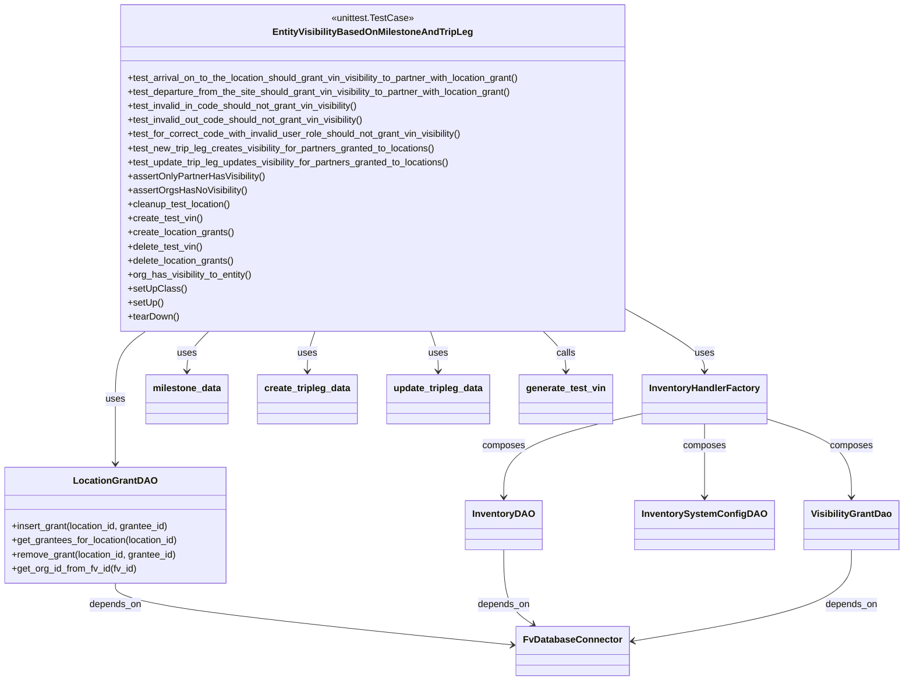

# Diagram: entity_core/entity_service/entity_inventory/entity_inventory_tests/integration/test_visibility_grant_based_on_milestone_and_tripleg.py


> Auto-generated by Obscura crawlers

## Diagram 1



### SVG

<svg id="container" width="1511.06640625" xmlns="http://www.w3.org/2000/svg" class="classDiagram" height="1162" viewBox="0 0 1511.06640625 1162" role="graphics-document document" aria-roledescription="class"><style>#container{font-family:"trebuchet ms",verdana,arial,sans-serif;font-size:16px;fill:#333;}@keyframes edge-animation-frame{from{stroke-dashoffset:0;}}@keyframes dash{to{stroke-dashoffset:0;}}#container .edge-animation-slow{stroke-dasharray:9,5!important;stroke-dashoffset:900;animation:dash 50s linear infinite;stroke-linecap:round;}#container .edge-animation-fast{stroke-dasharray:9,5!important;stroke-dashoffset:900;animation:dash 20s linear infinite;stroke-linecap:round;}#container .error-icon{fill:#552222;}#container .error-text{fill:#552222;stroke:#552222;}#container .edge-thickness-normal{stroke-width:1px;}#container .edge-thickness-thick{stroke-width:3.5px;}#container .edge-pattern-solid{stroke-dasharray:0;}#container .edge-thickness-invisible{stroke-width:0;fill:none;}#container .edge-pattern-dashed{stroke-dasharray:3;}#container .edge-pattern-dotted{stroke-dasharray:2;}#container .marker{fill:#333333;stroke:#333333;}#container .marker.cross{stroke:#333333;}#container svg{font-family:"trebuchet ms",verdana,arial,sans-serif;font-size:16px;}#container p{margin:0;}#container g.classGroup text{fill:#9370DB;stroke:none;font-family:"trebuchet ms",verdana,arial,sans-serif;font-size:10px;}#container g.classGroup text .title{font-weight:bolder;}#container .nodeLabel,#container .edgeLabel{color:#131300;}#container .edgeLabel .label rect{fill:#ECECFF;}#container .label text{fill:#131300;}#container .labelBkg{background:#ECECFF;}#container .edgeLabel .label span{background:#ECECFF;}#container .classTitle{font-weight:bolder;}#container .node rect,#container .node circle,#container .node ellipse,#container .node polygon,#container .node path{fill:#ECECFF;stroke:#9370DB;stroke-width:1px;}#container .divider{stroke:#9370DB;stroke-width:1;}#container g.clickable{cursor:pointer;}#container g.classGroup rect{fill:#ECECFF;stroke:#9370DB;}#container g.classGroup line{stroke:#9370DB;stroke-width:1;}#container .classLabel .box{stroke:none;stroke-width:0;fill:#ECECFF;opacity:0.5;}#container .classLabel .label{fill:#9370DB;font-size:10px;}#container .relation{stroke:#333333;stroke-width:1;fill:none;}#container .dashed-line{stroke-dasharray:3;}#container .dotted-line{stroke-dasharray:1 2;}#container #compositionStart,#container .composition{fill:#333333!important;stroke:#333333!important;stroke-width:1;}#container #compositionEnd,#container .composition{fill:#333333!important;stroke:#333333!important;stroke-width:1;}#container #dependencyStart,#container .dependency{fill:#333333!important;stroke:#333333!important;stroke-width:1;}#container #dependencyStart,#container .dependency{fill:#333333!important;stroke:#333333!important;stroke-width:1;}#container #extensionStart,#container .extension{fill:transparent!important;stroke:#333333!important;stroke-width:1;}#container #extensionEnd,#container .extension{fill:transparent!important;stroke:#333333!important;stroke-width:1;}#container #aggregationStart,#container .aggregation{fill:transparent!important;stroke:#333333!important;stroke-width:1;}#container #aggregationEnd,#container .aggregation{fill:transparent!important;stroke:#333333!important;stroke-width:1;}#container #lollipopStart,#container .lollipop{fill:#ECECFF!important;stroke:#333333!important;stroke-width:1;}#container #lollipopEnd,#container .lollipop{fill:#ECECFF!important;stroke:#333333!important;stroke-width:1;}#container .edgeTerminals{font-size:11px;line-height:initial;}#container .classTitleText{text-anchor:middle;font-size:18px;fill:#333;}#container .label-icon{display:inline-block;height:1em;overflow:visible;vertical-align:-0.125em;}#container .node .label-icon path{fill:currentColor;stroke:revert;stroke-width:revert;}#container :root{--mermaid-font-family:"trebuchet ms",verdana,arial,sans-serif;}</style><g><defs><marker id="container_class-aggregationStart" class="marker aggregation class" refX="18" refY="7" markerWidth="190" markerHeight="240" orient="auto"><path d="M 18,7 L9,13 L1,7 L9,1 Z"></path></marker></defs><defs><marker id="container_class-aggregationEnd" class="marker aggregation class" refX="1" refY="7" markerWidth="20" markerHeight="28" orient="auto"><path d="M 18,7 L9,13 L1,7 L9,1 Z"></path></marker></defs><defs><marker id="container_class-extensionStart" class="marker extension class" refX="18" refY="7" markerWidth="190" markerHeight="240" orient="auto"><path d="M 1,7 L18,13 V 1 Z"></path></marker></defs><defs><marker id="container_class-extensionEnd" class="marker extension class" refX="1" refY="7" markerWidth="20" markerHeight="28" orient="auto"><path d="M 1,1 V 13 L18,7 Z"></path></marker></defs><defs><marker id="container_class-compositionStart" class="marker composition class" refX="18" refY="7" markerWidth="190" markerHeight="240" orient="auto"><path d="M 18,7 L9,13 L1,7 L9,1 Z"></path></marker></defs><defs><marker id="container_class-compositionEnd" class="marker composition class" refX="1" refY="7" markerWidth="20" markerHeight="28" orient="auto"><path d="M 18,7 L9,13 L1,7 L9,1 Z"></path></marker></defs><defs><marker id="container_class-dependencyStart" class="marker dependency class" refX="6" refY="7" markerWidth="190" markerHeight="240" orient="auto"><path d="M 5,7 L9,13 L1,7 L9,1 Z"></path></marker></defs><defs><marker id="container_class-dependencyEnd" class="marker dependency class" refX="13" refY="7" markerWidth="20" markerHeight="28" orient="auto"><path d="M 18,7 L9,13 L14,7 L9,1 Z"></path></marker></defs><defs><marker id="container_class-lollipopStart" class="marker lollipop class" refX="13" refY="7" markerWidth="190" markerHeight="240" orient="auto"><circle stroke="black" fill="transparent" cx="7" cy="7" r="6"></circle></marker></defs><defs><marker id="container_class-lollipopEnd" class="marker lollipop class" refX="1" refY="7" markerWidth="190" markerHeight="240" orient="auto"><circle stroke="black" fill="transparent" cx="7" cy="7" r="6"></circle></marker></defs><g class="root"><g class="clusters"></g><g class="edgePaths"><path d="M248.029,566L239.578,572.167C231.127,578.333,214.226,590.667,205.775,610C197.324,629.333,197.324,655.667,197.324,682C197.324,708.333,197.324,734.667,197.324,753C197.324,771.333,197.324,781.667,197.324,786.833L197.324,792" id="id_EntityVisibilityBasedOnMilestoneAndTripLeg_LocationGrantDAO_1" class="edge-thickness-normal edge-pattern-solid relation" style=";;;" data-edge="true" data-et="edge" data-id="id_EntityVisibilityBasedOnMilestoneAndTripLeg_LocationGrantDAO_1" data-points="W3sieCI6MjQ4LjAyOTA3NDM2NzA4ODU4LCJ5Ijo1NjZ9LHsieCI6MTk3LjMyNDIxODc1LCJ5Ijo2MDN9LHsieCI6MTk3LjMyNDIxODc1LCJ5Ijo2ODJ9LHsieCI6MTk3LjMyNDIxODc1LCJ5Ijo3NjF9LHsieCI6MTk3LjMyNDIxODc1LCJ5Ijo3OTh9XQ==" marker-end="url(#container_class-dependencyEnd)"></path><path d="M1067.285,535.923L1086.908,547.103C1106.53,558.282,1145.775,580.641,1165.397,596.987C1185.02,613.333,1185.02,623.667,1185.02,628.833L1185.02,634" id="id_EntityVisibilityBasedOnMilestoneAndTripLeg_InventoryHandlerFactory_2" class="edge-thickness-normal edge-pattern-solid relation" style=";;;" data-edge="true" data-et="edge" data-id="id_EntityVisibilityBasedOnMilestoneAndTripLeg_InventoryHandlerFactory_2" data-points="W3sieCI6MTA2Ny4yODUxNTYyNSwieSI6NTM1LjkyMzE2MzYwMzA3MDZ9LHsieCI6MTE4NS4wMTk1MzEyNSwieSI6NjAzfSx7IngiOjExODUuMDE5NTMxMjUsInkiOjY0MH1d" marker-end="url(#container_class-dependencyEnd)"></path><path d="M354.137,566L348.032,572.167C341.926,578.333,329.715,590.667,323.609,602C317.504,613.333,317.504,623.667,317.504,628.833L317.504,634" id="id_EntityVisibilityBasedOnMilestoneAndTripLeg_milestone_data_3" class="edge-thickness-normal edge-pattern-solid relation" style=";;;" data-edge="true" data-et="edge" data-id="id_EntityVisibilityBasedOnMilestoneAndTripLeg_milestone_data_3" data-points="W3sieCI6MzU0LjEzNzA4OTU5NjUxOSwieSI6NTY2fSx7IngiOjMxNy41MDM5MDYyNSwieSI6NjAzfSx7IngiOjMxNy41MDM5MDYyNSwieSI6NjQwfV0=" marker-end="url(#container_class-dependencyEnd)"></path><path d="M532.947,566L530.794,572.167C528.641,578.333,524.334,590.667,522.181,602C520.027,613.333,520.027,623.667,520.027,628.833L520.027,634" id="id_EntityVisibilityBasedOnMilestoneAndTripLeg_create_tripleg_data_4" class="edge-thickness-normal edge-pattern-solid relation" style=";;;" data-edge="true" data-et="edge" data-id="id_EntityVisibilityBasedOnMilestoneAndTripLeg_create_tripleg_data_4" data-points="W3sieCI6NTMyLjk0NzMzOTc5NDMwMzgsInkiOjU2Nn0seyJ4Ijo1MjAuMDI3MzQzNzUsInkiOjYwM30seyJ4Ijo1MjAuMDI3MzQzNzUsInkiOjY0MH1d" marker-end="url(#container_class-dependencyEnd)"></path><path d="M727.795,566L729.948,572.167C732.102,578.333,736.408,590.667,738.562,602C740.715,613.333,740.715,623.667,740.715,628.833L740.715,634" id="id_EntityVisibilityBasedOnMilestoneAndTripLeg_update_tripleg_data_5" class="edge-thickness-normal edge-pattern-solid relation" style=";;;" data-edge="true" data-et="edge" data-id="id_EntityVisibilityBasedOnMilestoneAndTripLeg_update_tripleg_data_5" data-points="W3sieCI6NzI3Ljc5NDg0NzcwNTY5NjIsInkiOjU2Nn0seyJ4Ijo3NDAuNzE0ODQzNzUsInkiOjYwM30seyJ4Ijo3NDAuNzE0ODQzNzUsInkiOjY0MH1d" marker-end="url(#container_class-dependencyEnd)"></path><path d="M916.966,566L923.3,572.167C929.635,578.333,942.304,590.667,948.638,602C954.973,613.333,954.973,623.667,954.973,628.833L954.973,634" id="id_EntityVisibilityBasedOnMilestoneAndTripLeg_generate_test_vin_6" class="edge-thickness-normal edge-pattern-solid relation" style=";;;" data-edge="true" data-et="edge" data-id="id_EntityVisibilityBasedOnMilestoneAndTripLeg_generate_test_vin_6" data-points="W3sieCI6OTE2Ljk2NTUxMTI3MzczNDEsInkiOjU2Nn0seyJ4Ijo5NTQuOTcyNjU2MjUsInkiOjYwM30seyJ4Ijo5NTQuOTcyNjU2MjUsInkiOjY0MH1d" marker-end="url(#container_class-dependencyEnd)"></path><path d="M1082.379,706.197L1043.634,715.331C1004.89,724.465,927.401,742.732,888.657,766.533C849.912,790.333,849.912,819.667,849.912,834.333L849.912,849" id="id_InventoryHandlerFactory_InventoryDAO_7" class="edge-thickness-normal edge-pattern-solid relation" style=";;;" data-edge="true" data-et="edge" data-id="id_InventoryHandlerFactory_InventoryDAO_7" data-points="W3sieCI6MTA4Mi4zNzg5MDYyNSwieSI6NzA2LjE5NzA0NTAyNDA0MTl9LHsieCI6ODQ5LjkxMjEwOTM3NSwieSI6NzYxfSx7IngiOjg0OS45MTIxMDkzNzUsInkiOjg1NX1d" marker-end="url(#container_class-dependencyEnd)"></path><path d="M1185.02,724L1185.02,730.167C1185.02,736.333,1185.02,748.667,1185.02,769.5C1185.02,790.333,1185.02,819.667,1185.02,834.333L1185.02,849" id="id_InventoryHandlerFactory_InventorySystemConfigDAO_8" class="edge-thickness-normal edge-pattern-solid relation" style=";;;" data-edge="true" data-et="edge" data-id="id_InventoryHandlerFactory_InventorySystemConfigDAO_8" data-points="W3sieCI6MTE4NS4wMTk1MzEyNSwieSI6NzI0fSx7IngiOjExODUuMDE5NTMxMjUsInkiOjc2MX0seyJ4IjoxMTg1LjAxOTUzMTI1LCJ5Ijo4NTV9XQ==" marker-end="url(#container_class-dependencyEnd)"></path><path d="M1287.66,715.801L1310.535,723.334C1333.41,730.868,1379.16,745.934,1402.035,768.134C1424.91,790.333,1424.91,819.667,1424.91,834.333L1424.91,849" id="id_InventoryHandlerFactory_VisibilityGrantDao_9" class="edge-thickness-normal edge-pattern-solid relation" style=";;;" data-edge="true" data-et="edge" data-id="id_InventoryHandlerFactory_VisibilityGrantDao_9" data-points="W3sieCI6MTI4Ny42NjAxNTYyNSwieSI6NzE1LjgwMTI3NjYyMzQ2MTN9LHsieCI6MTQyNC45MTAxNTYyNSwieSI6NzYxfSx7IngiOjE0MjQuOTEwMTU2MjUsInkiOjg1NX1d" marker-end="url(#container_class-dependencyEnd)"></path><path d="M197.324,996L197.324,1002.167C197.324,1008.333,197.324,1020.667,308.542,1038.325C419.76,1055.983,642.196,1078.966,753.414,1090.458L864.631,1101.949" id="id_LocationGrantDAO_FvDatabaseConnector_10" class="edge-thickness-normal edge-pattern-solid relation" style=";;;" data-edge="true" data-et="edge" data-id="id_LocationGrantDAO_FvDatabaseConnector_10" data-points="W3sieCI6MTk3LjMyNDIxODc1LCJ5Ijo5OTZ9LHsieCI6MTk3LjMyNDIxODc1LCJ5IjoxMDMzfSx7IngiOjg3MC41OTk2MDkzNzUsInkiOjExMDIuNTY1OTcxNDE1MDY5fV0=" marker-end="url(#container_class-dependencyEnd)"></path><path d="M849.912,939L849.912,954.667C849.912,970.333,849.912,1001.667,857.837,1022.924C865.762,1044.18,881.612,1055.361,889.536,1060.951L897.461,1066.541" id="id_InventoryDAO_FvDatabaseConnector_11" class="edge-thickness-normal edge-pattern-solid relation" style=";;;" data-edge="true" data-et="edge" data-id="id_InventoryDAO_FvDatabaseConnector_11" data-points="W3sieCI6ODQ5LjkxMjEwOTM3NSwieSI6OTM5fSx7IngiOjg0OS45MTIxMDkzNzUsInkiOjEwMzN9LHsieCI6OTAyLjM2NDE0NjU1ODU0NDMsInkiOjEwNzB9XQ==" marker-end="url(#container_class-dependencyEnd)"></path><path d="M1424.91,939L1424.91,954.667C1424.91,970.333,1424.91,1001.667,1363.946,1027.735C1302.981,1053.804,1181.052,1074.608,1120.088,1085.01L1059.124,1095.412" id="id_VisibilityGrantDao_FvDatabaseConnector_12" class="edge-thickness-normal edge-pattern-solid relation" style=";;;" data-edge="true" data-et="edge" data-id="id_VisibilityGrantDao_FvDatabaseConnector_12" data-points="W3sieCI6MTQyNC45MTAxNTYyNSwieSI6OTM5fSx7IngiOjE0MjQuOTEwMTU2MjUsInkiOjEwMzN9LHsieCI6MTA1My4yMDg5ODQzNzUsInkiOjEwOTYuNDIxMjExNTk3MTEzfV0=" marker-end="url(#container_class-dependencyEnd)"></path></g><g class="edgeLabels"><g class="edgeLabel" transform="translate(197.32421875, 682)"><g class="label" data-id="id_EntityVisibilityBasedOnMilestoneAndTripLeg_LocationGrantDAO_1" transform="translate(-16.4921875, -12)"><foreignObject width="32.984375" height="24"><div xmlns="http://www.w3.org/1999/xhtml" class="labelBkg" style="display: table-cell; white-space: nowrap; line-height: 1.5; max-width: 200px; text-align: center;"><span class="edgeLabel"><p>uses</p></span></div></foreignObject></g></g><g class="edgeLabel" transform="translate(1185.01953125, 603)"><g class="label" data-id="id_EntityVisibilityBasedOnMilestoneAndTripLeg_InventoryHandlerFactory_2" transform="translate(-16.4921875, -12)"><foreignObject width="32.984375" height="24"><div xmlns="http://www.w3.org/1999/xhtml" class="labelBkg" style="display: table-cell; white-space: nowrap; line-height: 1.5; max-width: 200px; text-align: center;"><span class="edgeLabel"><p>uses</p></span></div></foreignObject></g></g><g class="edgeLabel" transform="translate(317.50390625, 603)"><g class="label" data-id="id_EntityVisibilityBasedOnMilestoneAndTripLeg_milestone_data_3" transform="translate(-16.4921875, -12)"><foreignObject width="32.984375" height="24"><div xmlns="http://www.w3.org/1999/xhtml" class="labelBkg" style="display: table-cell; white-space: nowrap; line-height: 1.5; max-width: 200px; text-align: center;"><span class="edgeLabel"><p>uses</p></span></div></foreignObject></g></g><g class="edgeLabel" transform="translate(520.02734375, 603)"><g class="label" data-id="id_EntityVisibilityBasedOnMilestoneAndTripLeg_create_tripleg_data_4" transform="translate(-16.4921875, -12)"><foreignObject width="32.984375" height="24"><div xmlns="http://www.w3.org/1999/xhtml" class="labelBkg" style="display: table-cell; white-space: nowrap; line-height: 1.5; max-width: 200px; text-align: center;"><span class="edgeLabel"><p>uses</p></span></div></foreignObject></g></g><g class="edgeLabel" transform="translate(740.71484375, 603)"><g class="label" data-id="id_EntityVisibilityBasedOnMilestoneAndTripLeg_update_tripleg_data_5" transform="translate(-16.4921875, -12)"><foreignObject width="32.984375" height="24"><div xmlns="http://www.w3.org/1999/xhtml" class="labelBkg" style="display: table-cell; white-space: nowrap; line-height: 1.5; max-width: 200px; text-align: center;"><span class="edgeLabel"><p>uses</p></span></div></foreignObject></g></g><g class="edgeLabel" transform="translate(954.97265625, 603)"><g class="label" data-id="id_EntityVisibilityBasedOnMilestoneAndTripLeg_generate_test_vin_6" transform="translate(-16.4453125, -12)"><foreignObject width="32.890625" height="24"><div xmlns="http://www.w3.org/1999/xhtml" class="labelBkg" style="display: table-cell; white-space: nowrap; line-height: 1.5; max-width: 200px; text-align: center;"><span class="edgeLabel"><p>calls</p></span></div></foreignObject></g></g><g class="edgeLabel" transform="translate(849.912109375, 761)"><g class="label" data-id="id_InventoryHandlerFactory_InventoryDAO_7" transform="translate(-36.453125, -12)"><foreignObject width="72.90625" height="24"><div xmlns="http://www.w3.org/1999/xhtml" class="labelBkg" style="display: table-cell; white-space: nowrap; line-height: 1.5; max-width: 200px; text-align: center;"><span class="edgeLabel"><p>composes</p></span></div></foreignObject></g></g><g class="edgeLabel" transform="translate(1185.01953125, 761)"><g class="label" data-id="id_InventoryHandlerFactory_InventorySystemConfigDAO_8" transform="translate(-36.453125, -12)"><foreignObject width="72.90625" height="24"><div xmlns="http://www.w3.org/1999/xhtml" class="labelBkg" style="display: table-cell; white-space: nowrap; line-height: 1.5; max-width: 200px; text-align: center;"><span class="edgeLabel"><p>composes</p></span></div></foreignObject></g></g><g class="edgeLabel" transform="translate(1424.91015625, 761)"><g class="label" data-id="id_InventoryHandlerFactory_VisibilityGrantDao_9" transform="translate(-36.453125, -12)"><foreignObject width="72.90625" height="24"><div xmlns="http://www.w3.org/1999/xhtml" class="labelBkg" style="display: table-cell; white-space: nowrap; line-height: 1.5; max-width: 200px; text-align: center;"><span class="edgeLabel"><p>composes</p></span></div></foreignObject></g></g><g class="edgeLabel" transform="translate(197.32421875, 1033)"><g class="label" data-id="id_LocationGrantDAO_FvDatabaseConnector_10" transform="translate(-44.671875, -12)"><foreignObject width="89.34375" height="24"><div xmlns="http://www.w3.org/1999/xhtml" class="labelBkg" style="display: table-cell; white-space: nowrap; line-height: 1.5; max-width: 200px; text-align: center;"><span class="edgeLabel"><p>depends_on</p></span></div></foreignObject></g></g><g class="edgeLabel" transform="translate(849.912109375, 1033)"><g class="label" data-id="id_InventoryDAO_FvDatabaseConnector_11" transform="translate(-44.671875, -12)"><foreignObject width="89.34375" height="24"><div xmlns="http://www.w3.org/1999/xhtml" class="labelBkg" style="display: table-cell; white-space: nowrap; line-height: 1.5; max-width: 200px; text-align: center;"><span class="edgeLabel"><p>depends_on</p></span></div></foreignObject></g></g><g class="edgeLabel" transform="translate(1424.91015625, 1033)"><g class="label" data-id="id_VisibilityGrantDao_FvDatabaseConnector_12" transform="translate(-44.671875, -12)"><foreignObject width="89.34375" height="24"><div xmlns="http://www.w3.org/1999/xhtml" class="labelBkg" style="display: table-cell; white-space: nowrap; line-height: 1.5; max-width: 200px; text-align: center;"><span class="edgeLabel"><p>depends_on</p></span></div></foreignObject></g></g></g><g class="nodes"><g class="node default" id="classId-EntityVisibilityBasedOnMilestoneAndTripLeg-0" transform="translate(630.37109375, 287)"><g class="basic label-container"><path d="M-436.9140625 -279 L436.9140625 -279 L436.9140625 279 L-436.9140625 279" stroke="none" stroke-width="0" fill="#ECECFF" style=""></path><path d="M-436.9140625 -279 C-227.7566127798319 -279, -18.599163059663795 -279, 436.9140625 -279 M-436.9140625 -279 C-106.01345791936683 -279, 224.88714666126634 -279, 436.9140625 -279 M436.9140625 -279 C436.9140625 -161.53900240574424, 436.9140625 -44.07800481148848, 436.9140625 279 M436.9140625 -279 C436.9140625 -91.97069457551669, 436.9140625 95.05861084896662, 436.9140625 279 M436.9140625 279 C116.32819467669816 279, -204.25767314660368 279, -436.9140625 279 M436.9140625 279 C169.34570577554865 279, -98.2226509489027 279, -436.9140625 279 M-436.9140625 279 C-436.9140625 60.10643278551038, -436.9140625 -158.78713442897924, -436.9140625 -279 M-436.9140625 279 C-436.9140625 78.71818126500693, -436.9140625 -121.56363746998613, -436.9140625 -279" stroke="#9370DB" stroke-width="1.3" fill="none" stroke-dasharray="0 0" style=""></path></g><g class="annotation-group text" transform="translate(-70.1328125, -255)"><g class="label" style="" transform="translate(0,-12)"><foreignObject width="140.265625" height="24"><div xmlns="http://www.w3.org/1999/xhtml" style="display: table-cell; white-space: nowrap; line-height: 1.5; max-width: 190px; text-align: center;"><span class="nodeLabel markdown-node-label" style=""><p>«unittest.TestCase»</p></span></div></foreignObject></g></g><g class="label-group text" transform="translate(-162.53125, -231)"><g class="label" style="font-weight: bolder" transform="translate(0,-12)"><foreignObject width="325.0625" height="24"><div xmlns="http://www.w3.org/1999/xhtml" style="display: table-cell; white-space: nowrap; line-height: 1.5; max-width: 370px; text-align: center;"><span class="nodeLabel markdown-node-label" style=""><p>EntityVisibilityBasedOnMilestoneAndTripLeg</p></span></div></foreignObject></g></g><g class="members-group text" transform="translate(-424.9140625, -183)"></g><g class="methods-group text" transform="translate(-424.9140625, -153)"><g class="label" style="" transform="translate(0,-12)"><foreignObject width="687.296875" height="24"><div xmlns="http://www.w3.org/1999/xhtml" style="display: table-cell; white-space: nowrap; line-height: 1.5; max-width: 745px; text-align: center;"><span class="nodeLabel markdown-node-label" style=""><p>+test_arrival_on_to_the_location_should_grant_vin_visibility_to_partner_with_location_grant()</p></span></div></foreignObject></g><g class="label" style="" transform="translate(0,12)"><foreignObject width="672.328125" height="24"><div xmlns="http://www.w3.org/1999/xhtml" style="display: table-cell; white-space: nowrap; line-height: 1.5; max-width: 730px; text-align: center;"><span class="nodeLabel markdown-node-label" style=""><p>+test_departure_from_the_site_should_grant_vin_visibility_to_partner_with_location_grant()</p></span></div></foreignObject></g><g class="label" style="" transform="translate(0,36)"><foreignObject width="403.328125" height="24"><div xmlns="http://www.w3.org/1999/xhtml" style="display: table-cell; white-space: nowrap; line-height: 1.5; max-width: 461px; text-align: center;"><span class="nodeLabel markdown-node-label" style=""><p>+test_invalid_in_code_should_not_grant_vin_visibility()</p></span></div></foreignObject></g><g class="label" style="" transform="translate(0,60)"><foreignObject width="413.546875" height="24"><div xmlns="http://www.w3.org/1999/xhtml" style="display: table-cell; white-space: nowrap; line-height: 1.5; max-width: 471px; text-align: center;"><span class="nodeLabel markdown-node-label" style=""><p>+test_invalid_out_code_should_not_grant_vin_visibility()</p></span></div></foreignObject></g><g class="label" style="" transform="translate(0,84)"><foreignObject width="581.140625" height="24"><div xmlns="http://www.w3.org/1999/xhtml" style="display: table-cell; white-space: nowrap; line-height: 1.5; max-width: 639px; text-align: center;"><span class="nodeLabel markdown-node-label" style=""><p>+test_for_correct_code_with_invalid_user_role_should_not_grant_vin_visibility()</p></span></div></foreignObject></g><g class="label" style="" transform="translate(0,108)"><foreignObject width="534" height="24"><div xmlns="http://www.w3.org/1999/xhtml" style="display: table-cell; white-space: nowrap; line-height: 1.5; max-width: 591px; text-align: center;"><span class="nodeLabel markdown-node-label" style=""><p>+test_new_trip_leg_creates_visibility_for_partners_granted_to_locations()</p></span></div></foreignObject></g><g class="label" style="" transform="translate(0,132)"><foreignObject width="561.921875" height="24"><div xmlns="http://www.w3.org/1999/xhtml" style="display: table-cell; white-space: nowrap; line-height: 1.5; max-width: 619px; text-align: center;"><span class="nodeLabel markdown-node-label" style=""><p>+test_update_trip_leg_updates_visibility_for_partners_granted_to_locations()</p></span></div></foreignObject></g><g class="label" style="" transform="translate(0,156)"><foreignObject width="237.390625" height="24"><div xmlns="http://www.w3.org/1999/xhtml" style="display: table-cell; white-space: nowrap; line-height: 1.5; max-width: 295px; text-align: center;"><span class="nodeLabel markdown-node-label" style=""><p>+assertOnlyPartnerHasVisibility()</p></span></div></foreignObject></g><g class="label" style="" transform="translate(0,180)"><foreignObject width="204.15625" height="24"><div xmlns="http://www.w3.org/1999/xhtml" style="display: table-cell; white-space: nowrap; line-height: 1.5; max-width: 262px; text-align: center;"><span class="nodeLabel markdown-node-label" style=""><p>+assertOrgsHasNoVisibility()</p></span></div></foreignObject></g><g class="label" style="" transform="translate(0,204)"><foreignObject width="178.5625" height="24"><div xmlns="http://www.w3.org/1999/xhtml" style="display: table-cell; white-space: nowrap; line-height: 1.5; max-width: 236px; text-align: center;"><span class="nodeLabel markdown-node-label" style=""><p>+cleanup_test_location()</p></span></div></foreignObject></g><g class="label" style="" transform="translate(0,228)"><foreignObject width="128.015625" height="24"><div xmlns="http://www.w3.org/1999/xhtml" style="display: table-cell; white-space: nowrap; line-height: 1.5; max-width: 185px; text-align: center;"><span class="nodeLabel markdown-node-label" style=""><p>+create_test_vin()</p></span></div></foreignObject></g><g class="label" style="" transform="translate(0,252)"><foreignObject width="183.9375" height="24"><div xmlns="http://www.w3.org/1999/xhtml" style="display: table-cell; white-space: nowrap; line-height: 1.5; max-width: 241px; text-align: center;"><span class="nodeLabel markdown-node-label" style=""><p>+create_location_grants()</p></span></div></foreignObject></g><g class="label" style="" transform="translate(0,276)"><foreignObject width="129.015625" height="24"><div xmlns="http://www.w3.org/1999/xhtml" style="display: table-cell; white-space: nowrap; line-height: 1.5; max-width: 186px; text-align: center;"><span class="nodeLabel markdown-node-label" style=""><p>+delete_test_vin()</p></span></div></foreignObject></g><g class="label" style="" transform="translate(0,300)"><foreignObject width="184.953125" height="24"><div xmlns="http://www.w3.org/1999/xhtml" style="display: table-cell; white-space: nowrap; line-height: 1.5; max-width: 242px; text-align: center;"><span class="nodeLabel markdown-node-label" style=""><p>+delete_location_grants()</p></span></div></foreignObject></g><g class="label" style="" transform="translate(0,324)"><foreignObject width="216.4375" height="24"><div xmlns="http://www.w3.org/1999/xhtml" style="display: table-cell; white-space: nowrap; line-height: 1.5; max-width: 274px; text-align: center;"><span class="nodeLabel markdown-node-label" style=""><p>+org_has_visibility_to_entity()</p></span></div></foreignObject></g><g class="label" style="" transform="translate(0,348)"><foreignObject width="97.15625" height="24"><div xmlns="http://www.w3.org/1999/xhtml" style="display: table-cell; white-space: nowrap; line-height: 1.5; max-width: 155px; text-align: center;"><span class="nodeLabel markdown-node-label" style=""><p>+setUpClass()</p></span></div></foreignObject></g><g class="label" style="" transform="translate(0,372)"><foreignObject width="60.421875" height="24"><div xmlns="http://www.w3.org/1999/xhtml" style="display: table-cell; white-space: nowrap; line-height: 1.5; max-width: 118px; text-align: center;"><span class="nodeLabel markdown-node-label" style=""><p>+setUp()</p></span></div></foreignObject></g><g class="label" style="" transform="translate(0,396)"><foreignObject width="87.75" height="24"><div xmlns="http://www.w3.org/1999/xhtml" style="display: table-cell; white-space: nowrap; line-height: 1.5; max-width: 145px; text-align: center;"><span class="nodeLabel markdown-node-label" style=""><p>+tearDown()</p></span></div></foreignObject></g></g><g class="divider" style=""><path d="M-436.9140625 -207 C-201.28931915714804 -207, 34.335424185703914 -207, 436.9140625 -207 M-436.9140625 -207 C-213.87949416853266 -207, 9.155074162934682 -207, 436.9140625 -207" stroke="#9370DB" stroke-width="1.3" fill="none" stroke-dasharray="0 0" style=""></path></g><g class="divider" style=""><path d="M-436.9140625 -183 C-255.56490531412112 -183, -74.21574812824224 -183, 436.9140625 -183 M-436.9140625 -183 C-153.31096387176115 -183, 130.2921347564777 -183, 436.9140625 -183" stroke="#9370DB" stroke-width="1.3" fill="none" stroke-dasharray="0 0" style=""></path></g></g><g class="node default" id="classId-LocationGrantDAO-1" transform="translate(197.32421875, 897)"><g class="basic label-container"><path d="M-189.32421875 -99 L189.32421875 -99 L189.32421875 99 L-189.32421875 99" stroke="none" stroke-width="0" fill="#ECECFF" style=""></path><path d="M-189.32421875 -99 C-62.89849191090197 -99, 63.527234928196066 -99, 189.32421875 -99 M-189.32421875 -99 C-64.29311676742846 -99, 60.737985215143084 -99, 189.32421875 -99 M189.32421875 -99 C189.32421875 -53.59594072704534, 189.32421875 -8.191881454090677, 189.32421875 99 M189.32421875 -99 C189.32421875 -36.12230557296938, 189.32421875 26.755388854061238, 189.32421875 99 M189.32421875 99 C90.82263109562912 99, -7.67895655874176 99, -189.32421875 99 M189.32421875 99 C70.65460843350121 99, -48.01500188299758 99, -189.32421875 99 M-189.32421875 99 C-189.32421875 43.11674098054675, -189.32421875 -12.766518038906497, -189.32421875 -99 M-189.32421875 99 C-189.32421875 38.09446666390305, -189.32421875 -22.811066672193903, -189.32421875 -99" stroke="#9370DB" stroke-width="1.3" fill="none" stroke-dasharray="0 0" style=""></path></g><g class="annotation-group text" transform="translate(0, -75)"></g><g class="label-group text" transform="translate(-66.8203125, -75)"><g class="label" style="font-weight: bolder" transform="translate(0,-12)"><foreignObject width="133.640625" height="24"><div xmlns="http://www.w3.org/1999/xhtml" style="display: table-cell; white-space: nowrap; line-height: 1.5; max-width: 182px; text-align: center;"><span class="nodeLabel markdown-node-label" style=""><p>LocationGrantDAO</p></span></div></foreignObject></g></g><g class="members-group text" transform="translate(-177.32421875, -27)"></g><g class="methods-group text" transform="translate(-177.32421875, 3)"><g class="label" style="" transform="translate(0,-12)"><foreignObject width="273.359375" height="24"><div xmlns="http://www.w3.org/1999/xhtml" style="display: table-cell; white-space: nowrap; line-height: 1.5; max-width: 331px; text-align: center;"><span class="nodeLabel markdown-node-label" style=""><p>+insert_grant(location_id, grantee_id)</p></span></div></foreignObject></g><g class="label" style="" transform="translate(0,12)"><foreignObject width="287.828125" height="24"><div xmlns="http://www.w3.org/1999/xhtml" style="display: table-cell; white-space: nowrap; line-height: 1.5; max-width: 345px; text-align: center;"><span class="nodeLabel markdown-node-label" style=""><p>+get_grantees_for_location(location_id)</p></span></div></foreignObject></g><g class="label" style="" transform="translate(0,36)"><foreignObject width="284.9375" height="24"><div xmlns="http://www.w3.org/1999/xhtml" style="display: table-cell; white-space: nowrap; line-height: 1.5; max-width: 342px; text-align: center;"><span class="nodeLabel markdown-node-label" style=""><p>+remove_grant(location_id, grantee_id)</p></span></div></foreignObject></g><g class="label" style="" transform="translate(0,60)"><foreignObject width="215.40625" height="24"><div xmlns="http://www.w3.org/1999/xhtml" style="display: table-cell; white-space: nowrap; line-height: 1.5; max-width: 273px; text-align: center;"><span class="nodeLabel markdown-node-label" style=""><p>+get_org_id_from_fv_id(fv_id)</p></span></div></foreignObject></g></g><g class="divider" style=""><path d="M-189.32421875 -51 C-110.75282965707076 -51, -32.181440564141525 -51, 189.32421875 -51 M-189.32421875 -51 C-93.30417363386526 -51, 2.7158714822694776 -51, 189.32421875 -51" stroke="#9370DB" stroke-width="1.3" fill="none" stroke-dasharray="0 0" style=""></path></g><g class="divider" style=""><path d="M-189.32421875 -27 C-69.77813525135898 -27, 49.76794824728205 -27, 189.32421875 -27 M-189.32421875 -27 C-85.13695053500925 -27, 19.050317679981504 -27, 189.32421875 -27" stroke="#9370DB" stroke-width="1.3" fill="none" stroke-dasharray="0 0" style=""></path></g></g><g class="node default" id="classId-InventoryHandlerFactory-2" transform="translate(1185.01953125, 682)"><g class="basic label-container"><path d="M-102.640625 -42 L102.640625 -42 L102.640625 42 L-102.640625 42" stroke="none" stroke-width="0" fill="#ECECFF" style=""></path><path d="M-102.640625 -42 C-52.44528312889738 -42, -2.2499412577947595 -42, 102.640625 -42 M-102.640625 -42 C-26.878705992954394 -42, 48.88321301409121 -42, 102.640625 -42 M102.640625 -42 C102.640625 -12.126497205137913, 102.640625 17.747005589724175, 102.640625 42 M102.640625 -42 C102.640625 -14.0335908496034, 102.640625 13.932818300793201, 102.640625 42 M102.640625 42 C39.908538426291685 42, -22.82354814741663 42, -102.640625 42 M102.640625 42 C25.03544019208995 42, -52.5697446158201 42, -102.640625 42 M-102.640625 42 C-102.640625 12.196822412100971, -102.640625 -17.606355175798058, -102.640625 -42 M-102.640625 42 C-102.640625 24.89457042077622, -102.640625 7.789140841552438, -102.640625 -42" stroke="#9370DB" stroke-width="1.3" fill="none" stroke-dasharray="0 0" style=""></path></g><g class="annotation-group text" transform="translate(0, -18)"></g><g class="label-group text" transform="translate(-90.640625, -18)"><g class="label" style="font-weight: bolder" transform="translate(0,-12)"><foreignObject width="181.28125" height="24"><div xmlns="http://www.w3.org/1999/xhtml" style="display: table-cell; white-space: nowrap; line-height: 1.5; max-width: 229px; text-align: center;"><span class="nodeLabel markdown-node-label" style=""><p>InventoryHandlerFactory</p></span></div></foreignObject></g></g><g class="members-group text" transform="translate(-90.640625, 30)"></g><g class="methods-group text" transform="translate(-90.640625, 60)"></g><g class="divider" style=""><path d="M-102.640625 6 C-20.797563611518598 6, 61.045497776962804 6, 102.640625 6 M-102.640625 6 C-45.04431825902101 6, 12.551988481957977 6, 102.640625 6" stroke="#9370DB" stroke-width="1.3" fill="none" stroke-dasharray="0 0" style=""></path></g><g class="divider" style=""><path d="M-102.640625 24 C-47.942378117847646 24, 6.755868764304708 24, 102.640625 24 M-102.640625 24 C-37.00125460128301 24, 28.638115797433983 24, 102.640625 24" stroke="#9370DB" stroke-width="1.3" fill="none" stroke-dasharray="0 0" style=""></path></g></g><g class="node default" id="classId-InventoryDAO-3" transform="translate(849.912109375, 897)"><g class="basic label-container"><path d="M-62.25 -42 L62.25 -42 L62.25 42 L-62.25 42" stroke="none" stroke-width="0" fill="#ECECFF" style=""></path><path d="M-62.25 -42 C-27.846403549378884 -42, 6.557192901242232 -42, 62.25 -42 M-62.25 -42 C-23.44113966528689 -42, 15.36772066942622 -42, 62.25 -42 M62.25 -42 C62.25 -12.980837680395076, 62.25 16.038324639209847, 62.25 42 M62.25 -42 C62.25 -12.828340464619146, 62.25 16.34331907076171, 62.25 42 M62.25 42 C23.234785548297168 42, -15.780428903405664 42, -62.25 42 M62.25 42 C30.958759972160706 42, -0.3324800556785874 42, -62.25 42 M-62.25 42 C-62.25 10.00027090538174, -62.25 -21.99945818923652, -62.25 -42 M-62.25 42 C-62.25 13.81456862512291, -62.25 -14.370862749754181, -62.25 -42" stroke="#9370DB" stroke-width="1.3" fill="none" stroke-dasharray="0 0" style=""></path></g><g class="annotation-group text" transform="translate(0, -18)"></g><g class="label-group text" transform="translate(-50.25, -18)"><g class="label" style="font-weight: bolder" transform="translate(0,-12)"><foreignObject width="100.5" height="24"><div xmlns="http://www.w3.org/1999/xhtml" style="display: table-cell; white-space: nowrap; line-height: 1.5; max-width: 149px; text-align: center;"><span class="nodeLabel markdown-node-label" style=""><p>InventoryDAO</p></span></div></foreignObject></g></g><g class="members-group text" transform="translate(-50.25, 30)"></g><g class="methods-group text" transform="translate(-50.25, 60)"></g><g class="divider" style=""><path d="M-62.25 6 C-14.617704610821832 6, 33.014590778356336 6, 62.25 6 M-62.25 6 C-19.748082007290854 6, 22.75383598541829 6, 62.25 6" stroke="#9370DB" stroke-width="1.3" fill="none" stroke-dasharray="0 0" style=""></path></g><g class="divider" style=""><path d="M-62.25 24 C-36.65009665997397 24, -11.05019331994793 24, 62.25 24 M-62.25 24 C-29.22804047525365 24, 3.7939190494927004 24, 62.25 24" stroke="#9370DB" stroke-width="1.3" fill="none" stroke-dasharray="0 0" style=""></path></g></g><g class="node default" id="classId-InventorySystemConfigDAO-4" transform="translate(1185.01953125, 897)"><g class="basic label-container"><path d="M-111.734375 -42 L111.734375 -42 L111.734375 42 L-111.734375 42" stroke="none" stroke-width="0" fill="#ECECFF" style=""></path><path d="M-111.734375 -42 C-33.82208360280211 -42, 44.09020779439578 -42, 111.734375 -42 M-111.734375 -42 C-63.06492742264354 -42, -14.395479845287085 -42, 111.734375 -42 M111.734375 -42 C111.734375 -17.185803208112674, 111.734375 7.628393583774653, 111.734375 42 M111.734375 -42 C111.734375 -18.215475393037956, 111.734375 5.569049213924089, 111.734375 42 M111.734375 42 C37.3050268246478 42, -37.124321350704406 42, -111.734375 42 M111.734375 42 C39.53735455327333 42, -32.65966589345334 42, -111.734375 42 M-111.734375 42 C-111.734375 24.20554067527811, -111.734375 6.411081350556223, -111.734375 -42 M-111.734375 42 C-111.734375 12.627652908865493, -111.734375 -16.744694182269015, -111.734375 -42" stroke="#9370DB" stroke-width="1.3" fill="none" stroke-dasharray="0 0" style=""></path></g><g class="annotation-group text" transform="translate(0, -18)"></g><g class="label-group text" transform="translate(-99.734375, -18)"><g class="label" style="font-weight: bolder" transform="translate(0,-12)"><foreignObject width="199.46875" height="24"><div xmlns="http://www.w3.org/1999/xhtml" style="display: table-cell; white-space: nowrap; line-height: 1.5; max-width: 246px; text-align: center;"><span class="nodeLabel markdown-node-label" style=""><p>InventorySystemConfigDAO</p></span></div></foreignObject></g></g><g class="members-group text" transform="translate(-99.734375, 30)"></g><g class="methods-group text" transform="translate(-99.734375, 60)"></g><g class="divider" style=""><path d="M-111.734375 6 C-48.465793199081375 6, 14.80278860183725 6, 111.734375 6 M-111.734375 6 C-48.80734170917807 6, 14.119691581643863 6, 111.734375 6" stroke="#9370DB" stroke-width="1.3" fill="none" stroke-dasharray="0 0" style=""></path></g><g class="divider" style=""><path d="M-111.734375 24 C-27.168851222811853 24, 57.396672554376295 24, 111.734375 24 M-111.734375 24 C-27.04701592518485 24, 57.6403431496303 24, 111.734375 24" stroke="#9370DB" stroke-width="1.3" fill="none" stroke-dasharray="0 0" style=""></path></g></g><g class="node default" id="classId-VisibilityGrantDao-5" transform="translate(1424.91015625, 897)"><g class="basic label-container"><path d="M-78.15625 -42 L78.15625 -42 L78.15625 42 L-78.15625 42" stroke="none" stroke-width="0" fill="#ECECFF" style=""></path><path d="M-78.15625 -42 C-37.30042712477441 -42, 3.555395750451183 -42, 78.15625 -42 M-78.15625 -42 C-39.13488319159235 -42, -0.11351638318470236 -42, 78.15625 -42 M78.15625 -42 C78.15625 -20.349614763091374, 78.15625 1.300770473817252, 78.15625 42 M78.15625 -42 C78.15625 -25.067373539000933, 78.15625 -8.134747078001865, 78.15625 42 M78.15625 42 C33.88396624510524 42, -10.388317509789516 42, -78.15625 42 M78.15625 42 C36.76166870121675 42, -4.632912597566502 42, -78.15625 42 M-78.15625 42 C-78.15625 20.603090233612022, -78.15625 -0.7938195327759558, -78.15625 -42 M-78.15625 42 C-78.15625 20.5699370877398, -78.15625 -0.8601258245204022, -78.15625 -42" stroke="#9370DB" stroke-width="1.3" fill="none" stroke-dasharray="0 0" style=""></path></g><g class="annotation-group text" transform="translate(0, -18)"></g><g class="label-group text" transform="translate(-66.15625, -18)"><g class="label" style="font-weight: bolder" transform="translate(0,-12)"><foreignObject width="132.3125" height="24"><div xmlns="http://www.w3.org/1999/xhtml" style="display: table-cell; white-space: nowrap; line-height: 1.5; max-width: 180px; text-align: center;"><span class="nodeLabel markdown-node-label" style=""><p>VisibilityGrantDao</p></span></div></foreignObject></g></g><g class="members-group text" transform="translate(-66.15625, 30)"></g><g class="methods-group text" transform="translate(-66.15625, 60)"></g><g class="divider" style=""><path d="M-78.15625 6 C-21.536951782916866 6, 35.08234643416627 6, 78.15625 6 M-78.15625 6 C-40.114898055314285 6, -2.0735461106285697 6, 78.15625 6" stroke="#9370DB" stroke-width="1.3" fill="none" stroke-dasharray="0 0" style=""></path></g><g class="divider" style=""><path d="M-78.15625 24 C-35.11811634498895 24, 7.920017310022104 24, 78.15625 24 M-78.15625 24 C-23.569362263597014 24, 31.01752547280597 24, 78.15625 24" stroke="#9370DB" stroke-width="1.3" fill="none" stroke-dasharray="0 0" style=""></path></g></g><g class="node default" id="classId-FvDatabaseConnector-6" transform="translate(961.904296875, 1112)"><g class="basic label-container"><path d="M-91.3046875 -42 L91.3046875 -42 L91.3046875 42 L-91.3046875 42" stroke="none" stroke-width="0" fill="#ECECFF" style=""></path><path d="M-91.3046875 -42 C-41.729839286723866 -42, 7.845008926552268 -42, 91.3046875 -42 M-91.3046875 -42 C-35.452821579581666 -42, 20.399044340836667 -42, 91.3046875 -42 M91.3046875 -42 C91.3046875 -24.096737475581804, 91.3046875 -6.1934749511636085, 91.3046875 42 M91.3046875 -42 C91.3046875 -10.041959106873833, 91.3046875 21.916081786252334, 91.3046875 42 M91.3046875 42 C43.832509097708495 42, -3.639669304583009 42, -91.3046875 42 M91.3046875 42 C37.8872364915766 42, -15.530214516846797 42, -91.3046875 42 M-91.3046875 42 C-91.3046875 10.700256240702355, -91.3046875 -20.59948751859529, -91.3046875 -42 M-91.3046875 42 C-91.3046875 10.023336925114819, -91.3046875 -21.953326149770362, -91.3046875 -42" stroke="#9370DB" stroke-width="1.3" fill="none" stroke-dasharray="0 0" style=""></path></g><g class="annotation-group text" transform="translate(0, -18)"></g><g class="label-group text" transform="translate(-79.3046875, -18)"><g class="label" style="font-weight: bolder" transform="translate(0,-12)"><foreignObject width="158.609375" height="24"><div xmlns="http://www.w3.org/1999/xhtml" style="display: table-cell; white-space: nowrap; line-height: 1.5; max-width: 207px; text-align: center;"><span class="nodeLabel markdown-node-label" style=""><p>FvDatabaseConnector</p></span></div></foreignObject></g></g><g class="members-group text" transform="translate(-79.3046875, 30)"></g><g class="methods-group text" transform="translate(-79.3046875, 60)"></g><g class="divider" style=""><path d="M-91.3046875 6 C-23.06117918636319 6, 45.18232912727362 6, 91.3046875 6 M-91.3046875 6 C-50.19573273818298 6, -9.086777976365966 6, 91.3046875 6" stroke="#9370DB" stroke-width="1.3" fill="none" stroke-dasharray="0 0" style=""></path></g><g class="divider" style=""><path d="M-91.3046875 24 C-53.353723684110406 24, -15.402759868220812 24, 91.3046875 24 M-91.3046875 24 C-18.89390360598813 24, 53.51688028802374 24, 91.3046875 24" stroke="#9370DB" stroke-width="1.3" fill="none" stroke-dasharray="0 0" style=""></path></g></g><g class="node default" id="classId-milestone_data-7" transform="translate(317.50390625, 682)"><g class="basic label-container"><path d="M-68.6875 -42 L68.6875 -42 L68.6875 42 L-68.6875 42" stroke="none" stroke-width="0" fill="#ECECFF" style=""></path><path d="M-68.6875 -42 C-40.1521571908212 -42, -11.616814381642392 -42, 68.6875 -42 M-68.6875 -42 C-39.46875858937476 -42, -10.250017178749516 -42, 68.6875 -42 M68.6875 -42 C68.6875 -17.55207373195859, 68.6875 6.8958525360828204, 68.6875 42 M68.6875 -42 C68.6875 -14.137352763033007, 68.6875 13.725294473933985, 68.6875 42 M68.6875 42 C16.115541245296562 42, -36.456417509406876 42, -68.6875 42 M68.6875 42 C33.6148038982857 42, -1.4578922034285995 42, -68.6875 42 M-68.6875 42 C-68.6875 18.116147747129986, -68.6875 -5.767704505740028, -68.6875 -42 M-68.6875 42 C-68.6875 18.742188571701014, -68.6875 -4.515622856597972, -68.6875 -42" stroke="#9370DB" stroke-width="1.3" fill="none" stroke-dasharray="0 0" style=""></path></g><g class="annotation-group text" transform="translate(0, -18)"></g><g class="label-group text" transform="translate(-56.6875, -18)"><g class="label" style="font-weight: bolder" transform="translate(0,-12)"><foreignObject width="113.375" height="24"><div xmlns="http://www.w3.org/1999/xhtml" style="display: table-cell; white-space: nowrap; line-height: 1.5; max-width: 162px; text-align: center;"><span class="nodeLabel markdown-node-label" style=""><p>milestone_data</p></span></div></foreignObject></g></g><g class="members-group text" transform="translate(-56.6875, 30)"></g><g class="methods-group text" transform="translate(-56.6875, 60)"></g><g class="divider" style=""><path d="M-68.6875 6 C-30.834353751330184 6, 7.018792497339632 6, 68.6875 6 M-68.6875 6 C-17.263314459108443 6, 34.160871081783114 6, 68.6875 6" stroke="#9370DB" stroke-width="1.3" fill="none" stroke-dasharray="0 0" style=""></path></g><g class="divider" style=""><path d="M-68.6875 24 C-21.347023345318206 24, 25.993453309363588 24, 68.6875 24 M-68.6875 24 C-31.01677807818284 24, 6.653943843634323 24, 68.6875 24" stroke="#9370DB" stroke-width="1.3" fill="none" stroke-dasharray="0 0" style=""></path></g></g><g class="node default" id="classId-create_tripleg_data-8" transform="translate(520.02734375, 682)"><g class="basic label-container"><path d="M-83.8359375 -42 L83.8359375 -42 L83.8359375 42 L-83.8359375 42" stroke="none" stroke-width="0" fill="#ECECFF" style=""></path><path d="M-83.8359375 -42 C-35.252989658981065 -42, 13.32995818203787 -42, 83.8359375 -42 M-83.8359375 -42 C-22.973583309255048 -42, 37.888770881489904 -42, 83.8359375 -42 M83.8359375 -42 C83.8359375 -24.10054274178312, 83.8359375 -6.201085483566239, 83.8359375 42 M83.8359375 -42 C83.8359375 -12.539785491383348, 83.8359375 16.920429017233303, 83.8359375 42 M83.8359375 42 C22.160344192994508 42, -39.515249114010984 42, -83.8359375 42 M83.8359375 42 C19.722903377799128 42, -44.390130744401745 42, -83.8359375 42 M-83.8359375 42 C-83.8359375 19.388794980480654, -83.8359375 -3.2224100390386923, -83.8359375 -42 M-83.8359375 42 C-83.8359375 12.44048199726867, -83.8359375 -17.11903600546266, -83.8359375 -42" stroke="#9370DB" stroke-width="1.3" fill="none" stroke-dasharray="0 0" style=""></path></g><g class="annotation-group text" transform="translate(0, -18)"></g><g class="label-group text" transform="translate(-71.8359375, -18)"><g class="label" style="font-weight: bolder" transform="translate(0,-12)"><foreignObject width="143.671875" height="24"><div xmlns="http://www.w3.org/1999/xhtml" style="display: table-cell; white-space: nowrap; line-height: 1.5; max-width: 191px; text-align: center;"><span class="nodeLabel markdown-node-label" style=""><p>create_tripleg_data</p></span></div></foreignObject></g></g><g class="members-group text" transform="translate(-71.8359375, 30)"></g><g class="methods-group text" transform="translate(-71.8359375, 60)"></g><g class="divider" style=""><path d="M-83.8359375 6 C-47.706162272260045 6, -11.57638704452009 6, 83.8359375 6 M-83.8359375 6 C-30.182119152749486 6, 23.471699194501028 6, 83.8359375 6" stroke="#9370DB" stroke-width="1.3" fill="none" stroke-dasharray="0 0" style=""></path></g><g class="divider" style=""><path d="M-83.8359375 24 C-40.07489650764936 24, 3.6861444847012734 24, 83.8359375 24 M-83.8359375 24 C-24.00089381217466 24, 35.83414987565068 24, 83.8359375 24" stroke="#9370DB" stroke-width="1.3" fill="none" stroke-dasharray="0 0" style=""></path></g></g><g class="node default" id="classId-update_tripleg_data-9" transform="translate(740.71484375, 682)"><g class="basic label-container"><path d="M-86.8515625 -42 L86.8515625 -42 L86.8515625 42 L-86.8515625 42" stroke="none" stroke-width="0" fill="#ECECFF" style=""></path><path d="M-86.8515625 -42 C-22.70846729834041 -42, 41.43462790331918 -42, 86.8515625 -42 M-86.8515625 -42 C-44.52193211733672 -42, -2.1923017346734355 -42, 86.8515625 -42 M86.8515625 -42 C86.8515625 -23.372362073657726, 86.8515625 -4.744724147315452, 86.8515625 42 M86.8515625 -42 C86.8515625 -20.69399561889357, 86.8515625 0.6120087622128594, 86.8515625 42 M86.8515625 42 C51.71849608110423 42, 16.585429662208455 42, -86.8515625 42 M86.8515625 42 C23.882287470875085 42, -39.08698755824983 42, -86.8515625 42 M-86.8515625 42 C-86.8515625 22.819943708869353, -86.8515625 3.6398874177387057, -86.8515625 -42 M-86.8515625 42 C-86.8515625 11.658997384338885, -86.8515625 -18.68200523132223, -86.8515625 -42" stroke="#9370DB" stroke-width="1.3" fill="none" stroke-dasharray="0 0" style=""></path></g><g class="annotation-group text" transform="translate(0, -18)"></g><g class="label-group text" transform="translate(-74.8515625, -18)"><g class="label" style="font-weight: bolder" transform="translate(0,-12)"><foreignObject width="149.703125" height="24"><div xmlns="http://www.w3.org/1999/xhtml" style="display: table-cell; white-space: nowrap; line-height: 1.5; max-width: 197px; text-align: center;"><span class="nodeLabel markdown-node-label" style=""><p>update_tripleg_data</p></span></div></foreignObject></g></g><g class="members-group text" transform="translate(-74.8515625, 30)"></g><g class="methods-group text" transform="translate(-74.8515625, 60)"></g><g class="divider" style=""><path d="M-86.8515625 6 C-18.728865479038262 6, 49.393831541923475 6, 86.8515625 6 M-86.8515625 6 C-47.66569433591232 6, -8.47982617182464 6, 86.8515625 6" stroke="#9370DB" stroke-width="1.3" fill="none" stroke-dasharray="0 0" style=""></path></g><g class="divider" style=""><path d="M-86.8515625 24 C-31.214616359594146 24, 24.422329780811708 24, 86.8515625 24 M-86.8515625 24 C-31.7283538382786 24, 23.3948548234428 24, 86.8515625 24" stroke="#9370DB" stroke-width="1.3" fill="none" stroke-dasharray="0 0" style=""></path></g></g><g class="node default" id="classId-generate_test_vin-10" transform="translate(954.97265625, 682)"><g class="basic label-container"><path d="M-77.40625 -42 L77.40625 -42 L77.40625 42 L-77.40625 42" stroke="none" stroke-width="0" fill="#ECECFF" style=""></path><path d="M-77.40625 -42 C-15.549514850872754 -42, 46.30722029825449 -42, 77.40625 -42 M-77.40625 -42 C-37.82755612384107 -42, 1.7511377523178595 -42, 77.40625 -42 M77.40625 -42 C77.40625 -13.47657632589231, 77.40625 15.04684734821538, 77.40625 42 M77.40625 -42 C77.40625 -14.515838011251812, 77.40625 12.968323977496375, 77.40625 42 M77.40625 42 C35.80977761099295 42, -5.786694778014095 42, -77.40625 42 M77.40625 42 C35.71601908827299 42, -5.974211823454013 42, -77.40625 42 M-77.40625 42 C-77.40625 14.566397960431345, -77.40625 -12.86720407913731, -77.40625 -42 M-77.40625 42 C-77.40625 18.181652008914924, -77.40625 -5.636695982170153, -77.40625 -42" stroke="#9370DB" stroke-width="1.3" fill="none" stroke-dasharray="0 0" style=""></path></g><g class="annotation-group text" transform="translate(0, -18)"></g><g class="label-group text" transform="translate(-65.40625, -18)"><g class="label" style="font-weight: bolder" transform="translate(0,-12)"><foreignObject width="130.8125" height="24"><div xmlns="http://www.w3.org/1999/xhtml" style="display: table-cell; white-space: nowrap; line-height: 1.5; max-width: 178px; text-align: center;"><span class="nodeLabel markdown-node-label" style=""><p>generate_test_vin</p></span></div></foreignObject></g></g><g class="members-group text" transform="translate(-65.40625, 30)"></g><g class="methods-group text" transform="translate(-65.40625, 60)"></g><g class="divider" style=""><path d="M-77.40625 6 C-34.79945514340136 6, 7.80733971319728 6, 77.40625 6 M-77.40625 6 C-25.87138722264062 6, 25.663475554718758 6, 77.40625 6" stroke="#9370DB" stroke-width="1.3" fill="none" stroke-dasharray="0 0" style=""></path></g><g class="divider" style=""><path d="M-77.40625 24 C-16.187388920266564 24, 45.03147215946687 24, 77.40625 24 M-77.40625 24 C-25.603723003750694 24, 26.19880399249861 24, 77.40625 24" stroke="#9370DB" stroke-width="1.3" fill="none" stroke-dasharray="0 0" style=""></path></g></g></g></g></g></svg>

## Diagram 2

```mermaid
sequenceDiagram
participant Test as EntityVisibilityBasedOnMilestoneAndTripLeg
participant DB_MAIN as FvDatabaseConnector(inventory_location)
participant DB_LOC as FvDatabaseConnector(location)
participant LocationDAO as LocationGrantDAO
participant InventoryDAO as InventoryDAO
participant InventorySysCfg as InventorySystemConfigDAO
participant VisibilityDAO as VisibilityGrantDao
participant InventoryFactory as InventoryHandlerFactory
participant
```

> SVG rendering failed for this diagram.
