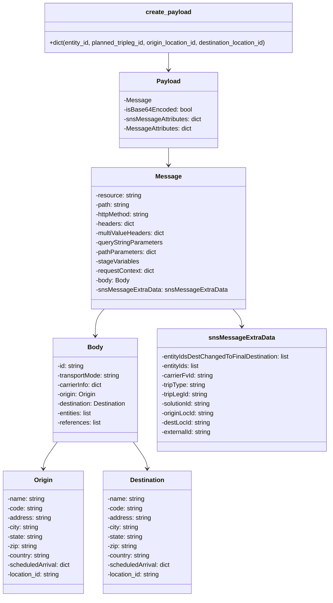

# Diagram: entity_core/entity_service/entity_inventory/entity_inventory_tests/test_data/create_tripleg_data.py


> Auto-generated by Obscura crawlers

## Diagram 1

```mermaid
flowchart LR
    In[Input params<br/>entity_id, planned_tripleg_id,<br/>origin_location_id, destination_location_id] --> Build[Build payload_dict]
    Build --> MessageNode[Populate Message object<br/>(resource, path, httpMethod,<br/>headers, multiValueHeaders,<br/>requestContext, pathParameters)]
    MessageNode --> BodyNode[Populate body<br/>(id, transportMode, carrierInfo,<br/>origin, destination, entities, references)]
    BodyNode --> OriginNode[Set origin.location_id = origin_location_id]
    BodyNode --> DestNode[Set destination.location_id = destination_location_id]
    MessageNode --> SNSNode[Populate snsMessageExtraData<br/>(entityIds, tripLegId, originLocId, destLocId, externalId)]
    Build --> JSONConv[Convert payload_dict to JSON via json.dumps]
    JSONConv --> ReturnNode[Return {"body": json_string}]
```

> SVG rendering failed for this diagram.

## Diagram 2



### SVG

<svg id="container" width="852.232421875" xmlns="http://www.w3.org/2000/svg" class="classDiagram" height="1518" viewBox="0 0 852.232421875 1518" role="graphics-document document" aria-roledescription="class"><style>#container{font-family:"trebuchet ms",verdana,arial,sans-serif;font-size:16px;fill:#333;}@keyframes edge-animation-frame{from{stroke-dashoffset:0;}}@keyframes dash{to{stroke-dashoffset:0;}}#container .edge-animation-slow{stroke-dasharray:9,5!important;stroke-dashoffset:900;animation:dash 50s linear infinite;stroke-linecap:round;}#container .edge-animation-fast{stroke-dasharray:9,5!important;stroke-dashoffset:900;animation:dash 20s linear infinite;stroke-linecap:round;}#container .error-icon{fill:#552222;}#container .error-text{fill:#552222;stroke:#552222;}#container .edge-thickness-normal{stroke-width:1px;}#container .edge-thickness-thick{stroke-width:3.5px;}#container .edge-pattern-solid{stroke-dasharray:0;}#container .edge-thickness-invisible{stroke-width:0;fill:none;}#container .edge-pattern-dashed{stroke-dasharray:3;}#container .edge-pattern-dotted{stroke-dasharray:2;}#container .marker{fill:#333333;stroke:#333333;}#container .marker.cross{stroke:#333333;}#container svg{font-family:"trebuchet ms",verdana,arial,sans-serif;font-size:16px;}#container p{margin:0;}#container g.classGroup text{fill:#9370DB;stroke:none;font-family:"trebuchet ms",verdana,arial,sans-serif;font-size:10px;}#container g.classGroup text .title{font-weight:bolder;}#container .nodeLabel,#container .edgeLabel{color:#131300;}#container .edgeLabel .label rect{fill:#ECECFF;}#container .label text{fill:#131300;}#container .labelBkg{background:#ECECFF;}#container .edgeLabel .label span{background:#ECECFF;}#container .classTitle{font-weight:bolder;}#container .node rect,#container .node circle,#container .node ellipse,#container .node polygon,#container .node path{fill:#ECECFF;stroke:#9370DB;stroke-width:1px;}#container .divider{stroke:#9370DB;stroke-width:1;}#container g.clickable{cursor:pointer;}#container g.classGroup rect{fill:#ECECFF;stroke:#9370DB;}#container g.classGroup line{stroke:#9370DB;stroke-width:1;}#container .classLabel .box{stroke:none;stroke-width:0;fill:#ECECFF;opacity:0.5;}#container .classLabel .label{fill:#9370DB;font-size:10px;}#container .relation{stroke:#333333;stroke-width:1;fill:none;}#container .dashed-line{stroke-dasharray:3;}#container .dotted-line{stroke-dasharray:1 2;}#container #compositionStart,#container .composition{fill:#333333!important;stroke:#333333!important;stroke-width:1;}#container #compositionEnd,#container .composition{fill:#333333!important;stroke:#333333!important;stroke-width:1;}#container #dependencyStart,#container .dependency{fill:#333333!important;stroke:#333333!important;stroke-width:1;}#container #dependencyStart,#container .dependency{fill:#333333!important;stroke:#333333!important;stroke-width:1;}#container #extensionStart,#container .extension{fill:transparent!important;stroke:#333333!important;stroke-width:1;}#container #extensionEnd,#container .extension{fill:transparent!important;stroke:#333333!important;stroke-width:1;}#container #aggregationStart,#container .aggregation{fill:transparent!important;stroke:#333333!important;stroke-width:1;}#container #aggregationEnd,#container .aggregation{fill:transparent!important;stroke:#333333!important;stroke-width:1;}#container #lollipopStart,#container .lollipop{fill:#ECECFF!important;stroke:#333333!important;stroke-width:1;}#container #lollipopEnd,#container .lollipop{fill:#ECECFF!important;stroke:#333333!important;stroke-width:1;}#container .edgeTerminals{font-size:11px;line-height:initial;}#container .classTitleText{text-anchor:middle;font-size:18px;fill:#333;}#container .label-icon{display:inline-block;height:1em;overflow:visible;vertical-align:-0.125em;}#container .node .label-icon path{fill:currentColor;stroke:revert;stroke-width:revert;}#container :root{--mermaid-font-family:"trebuchet ms",verdana,arial,sans-serif;}</style><g><defs><marker id="container_class-aggregationStart" class="marker aggregation class" refX="18" refY="7" markerWidth="190" markerHeight="240" orient="auto"><path d="M 18,7 L9,13 L1,7 L9,1 Z"></path></marker></defs><defs><marker id="container_class-aggregationEnd" class="marker aggregation class" refX="1" refY="7" markerWidth="20" markerHeight="28" orient="auto"><path d="M 18,7 L9,13 L1,7 L9,1 Z"></path></marker></defs><defs><marker id="container_class-extensionStart" class="marker extension class" refX="18" refY="7" markerWidth="190" markerHeight="240" orient="auto"><path d="M 1,7 L18,13 V 1 Z"></path></marker></defs><defs><marker id="container_class-extensionEnd" class="marker extension class" refX="1" refY="7" markerWidth="20" markerHeight="28" orient="auto"><path d="M 1,1 V 13 L18,7 Z"></path></marker></defs><defs><marker id="container_class-compositionStart" class="marker composition class" refX="18" refY="7" markerWidth="190" markerHeight="240" orient="auto"><path d="M 18,7 L9,13 L1,7 L9,1 Z"></path></marker></defs><defs><marker id="container_class-compositionEnd" class="marker composition class" refX="1" refY="7" markerWidth="20" markerHeight="28" orient="auto"><path d="M 18,7 L9,13 L1,7 L9,1 Z"></path></marker></defs><defs><marker id="container_class-dependencyStart" class="marker dependency class" refX="6" refY="7" markerWidth="190" markerHeight="240" orient="auto"><path d="M 5,7 L9,13 L1,7 L9,1 Z"></path></marker></defs><defs><marker id="container_class-dependencyEnd" class="marker dependency class" refX="13" refY="7" markerWidth="20" markerHeight="28" orient="auto"><path d="M 18,7 L9,13 L14,7 L9,1 Z"></path></marker></defs><defs><marker id="container_class-lollipopStart" class="marker lollipop class" refX="13" refY="7" markerWidth="190" markerHeight="240" orient="auto"><circle stroke="black" fill="transparent" cx="7" cy="7" r="6"></circle></marker></defs><defs><marker id="container_class-lollipopEnd" class="marker lollipop class" refX="1" refY="7" markerWidth="190" markerHeight="240" orient="auto"><circle stroke="black" fill="transparent" cx="7" cy="7" r="6"></circle></marker></defs><g class="root"><g class="clusters"></g><g class="edgePaths"><path d="M437.871,134L437.871,138.167C437.871,142.333,437.871,150.667,437.871,158C437.871,165.333,437.871,171.667,437.871,174.833L437.871,178" id="id_create_payload_Payload_1" class="edge-thickness-normal edge-pattern-solid relation" style=";;;" data-edge="true" data-et="edge" data-id="id_create_payload_Payload_1" data-points="W3sieCI6NDM3Ljg3MTA5Mzc1LCJ5IjoxMzR9LHsieCI6NDM3Ljg3MTA5Mzc1LCJ5IjoxNTl9LHsieCI6NDM3Ljg3MTA5Mzc1LCJ5IjoxODR9XQ==" marker-end="url(#container_class-dependencyEnd)"></path><path d="M437.871,376L437.871,380.167C437.871,384.333,437.871,392.667,437.871,400C437.871,407.333,437.871,413.667,437.871,416.833L437.871,420" id="id_Payload_Message_2" class="edge-thickness-normal edge-pattern-solid relation" style=";;;" data-edge="true" data-et="edge" data-id="id_Payload_Message_2" data-points="W3sieCI6NDM3Ljg3MTA5Mzc1LCJ5IjozNzZ9LHsieCI6NDM3Ljg3MTA5Mzc1LCJ5Ijo0MDF9LHsieCI6NDM3Ljg3MTA5Mzc1LCJ5Ijo0MjZ9XQ==" marker-end="url(#container_class-dependencyEnd)"></path><path d="M271.507,786L267.656,790.167C263.805,794.333,256.102,802.667,252.251,814C248.4,825.333,248.4,839.667,248.4,846.833L248.4,854" id="id_Message_Body_3" class="edge-thickness-normal edge-pattern-solid relation" style=";;;" data-edge="true" data-et="edge" data-id="id_Message_Body_3" data-points="W3sieCI6MjcxLjUwNjU3MzkzMjkyNjgsInkiOjc4Nn0seyJ4IjoyNDguNDAwMzkwNjI1LCJ5Ijo4MTF9LHsieCI6MjQ4LjQwMDM5MDYyNSwieSI6ODYwfV0=" marker-end="url(#container_class-dependencyEnd)"></path><path d="M149.784,1124L143.682,1132.167C137.581,1140.333,125.378,1156.667,119.277,1168C113.176,1179.333,113.176,1185.667,113.176,1188.833L113.176,1192" id="id_Body_Origin_4" class="edge-thickness-normal edge-pattern-solid relation" style=";;;" data-edge="true" data-et="edge" data-id="id_Body_Origin_4" data-points="W3sieCI6MTQ5Ljc4MzU0ODQyODg2NzQsInkiOjExMjR9LHsieCI6MTEzLjE3NTc4MTI1LCJ5IjoxMTczfSx7IngiOjExMy4xNzU3ODEyNSwieSI6MTE5OH1d" marker-end="url(#container_class-dependencyEnd)"></path><path d="M347.017,1124L353.119,1132.167C359.22,1140.333,371.422,1156.667,377.524,1168C383.625,1179.333,383.625,1185.667,383.625,1188.833L383.625,1192" id="id_Body_Destination_5" class="edge-thickness-normal edge-pattern-solid relation" style=";;;" data-edge="true" data-et="edge" data-id="id_Body_Destination_5" data-points="W3sieCI6MzQ3LjAxNzIzMjgyMTEzMjYsInkiOjExMjR9LHsieCI6MzgzLjYyNSwieSI6MTE3M30seyJ4IjozODMuNjI1LCJ5IjoxMTk4fV0=" marker-end="url(#container_class-dependencyEnd)"></path><path d="M604.236,786L608.087,790.167C611.938,794.333,619.64,802.667,623.491,810C627.342,817.333,627.342,823.667,627.342,826.833L627.342,830" id="id_Message_snsMessageExtraData_6" class="edge-thickness-normal edge-pattern-solid relation" style=";;;" data-edge="true" data-et="edge" data-id="id_Message_snsMessageExtraData_6" data-points="W3sieCI6NjA0LjIzNTYxMzU2NzA3MzIsInkiOjc4Nn0seyJ4Ijo2MjcuMzQxNzk2ODc1LCJ5Ijo4MTF9LHsieCI6NjI3LjM0MTc5Njg3NSwieSI6ODM2fV0=" marker-end="url(#container_class-dependencyEnd)"></path></g><g class="edgeLabels"><g class="edgeLabel"><g class="label" data-id="id_create_payload_Payload_1" transform="translate(0, 0)"><foreignObject width="0" height="0"><div xmlns="http://www.w3.org/1999/xhtml" class="labelBkg" style="display: table-cell; white-space: nowrap; line-height: 1.5; max-width: 200px; text-align: center;"><span class="edgeLabel"></span></div></foreignObject></g></g><g class="edgeLabel"><g class="label" data-id="id_Payload_Message_2" transform="translate(0, 0)"><foreignObject width="0" height="0"><div xmlns="http://www.w3.org/1999/xhtml" class="labelBkg" style="display: table-cell; white-space: nowrap; line-height: 1.5; max-width: 200px; text-align: center;"><span class="edgeLabel"></span></div></foreignObject></g></g><g class="edgeLabel"><g class="label" data-id="id_Message_Body_3" transform="translate(0, 0)"><foreignObject width="0" height="0"><div xmlns="http://www.w3.org/1999/xhtml" class="labelBkg" style="display: table-cell; white-space: nowrap; line-height: 1.5; max-width: 200px; text-align: center;"><span class="edgeLabel"></span></div></foreignObject></g></g><g class="edgeLabel"><g class="label" data-id="id_Body_Origin_4" transform="translate(0, 0)"><foreignObject width="0" height="0"><div xmlns="http://www.w3.org/1999/xhtml" class="labelBkg" style="display: table-cell; white-space: nowrap; line-height: 1.5; max-width: 200px; text-align: center;"><span class="edgeLabel"></span></div></foreignObject></g></g><g class="edgeLabel"><g class="label" data-id="id_Body_Destination_5" transform="translate(0, 0)"><foreignObject width="0" height="0"><div xmlns="http://www.w3.org/1999/xhtml" class="labelBkg" style="display: table-cell; white-space: nowrap; line-height: 1.5; max-width: 200px; text-align: center;"><span class="edgeLabel"></span></div></foreignObject></g></g><g class="edgeLabel"><g class="label" data-id="id_Message_snsMessageExtraData_6" transform="translate(0, 0)"><foreignObject width="0" height="0"><div xmlns="http://www.w3.org/1999/xhtml" class="labelBkg" style="display: table-cell; white-space: nowrap; line-height: 1.5; max-width: 200px; text-align: center;"><span class="edgeLabel"></span></div></foreignObject></g></g></g><g class="nodes"><g class="node default" id="classId-create_payload-0" transform="translate(437.87109375, 71)"><g class="basic label-container"><path d="M-328.41015625 -63 L328.41015625 -63 L328.41015625 63 L-328.41015625 63" stroke="none" stroke-width="0" fill="#ECECFF" style=""></path><path d="M-328.41015625 -63 C-189.067196402864 -63, -49.724236555728 -63, 328.41015625 -63 M-328.41015625 -63 C-172.64456041381808 -63, -16.878964577636168 -63, 328.41015625 -63 M328.41015625 -63 C328.41015625 -33.51788577635132, 328.41015625 -4.035771552702634, 328.41015625 63 M328.41015625 -63 C328.41015625 -31.044277458476014, 328.41015625 0.9114450830479726, 328.41015625 63 M328.41015625 63 C83.13829131640657 63, -162.13357361718687 63, -328.41015625 63 M328.41015625 63 C125.05592453126906 63, -78.29830718746189 63, -328.41015625 63 M-328.41015625 63 C-328.41015625 34.358360419133334, -328.41015625 5.716720838266667, -328.41015625 -63 M-328.41015625 63 C-328.41015625 19.51340776769382, -328.41015625 -23.97318446461236, -328.41015625 -63" stroke="#9370DB" stroke-width="1.3" fill="none" stroke-dasharray="0 0" style=""></path></g><g class="annotation-group text" transform="translate(0, -39)"></g><g class="label-group text" transform="translate(-56.1015625, -39)"><g class="label" style="font-weight: bolder" transform="translate(0,-12)"><foreignObject width="112.203125" height="24"><div xmlns="http://www.w3.org/1999/xhtml" style="display: table-cell; white-space: nowrap; line-height: 1.5; max-width: 161px; text-align: center;"><span class="nodeLabel markdown-node-label" style=""><p>create_payload</p></span></div></foreignObject></g></g><g class="members-group text" transform="translate(-316.41015625, 9)"></g><g class="methods-group text" transform="translate(-316.41015625, 39)"><g class="label" style="" transform="translate(0,-12)"><foreignObject width="576.71875" height="24"><div xmlns="http://www.w3.org/1999/xhtml" style="display: table-cell; white-space: nowrap; line-height: 1.5; max-width: 634px; text-align: center;"><span class="nodeLabel markdown-node-label" style=""><p>+dict(entity_id, planned_tripleg_id, origin_location_id, destination_location_id)</p></span></div></foreignObject></g></g><g class="divider" style=""><path d="M-328.41015625 -15 C-185.9971836113634 -15, -43.584210972726794 -15, 328.41015625 -15 M-328.41015625 -15 C-106.31777883096862 -15, 115.77459858806276 -15, 328.41015625 -15" stroke="#9370DB" stroke-width="1.3" fill="none" stroke-dasharray="0 0" style=""></path></g><g class="divider" style=""><path d="M-328.41015625 9 C-154.83341983546524 9, 18.74331657906953 9, 328.41015625 9 M-328.41015625 9 C-67.46295066068234 9, 193.48425492863532 9, 328.41015625 9" stroke="#9370DB" stroke-width="1.3" fill="none" stroke-dasharray="0 0" style=""></path></g></g><g class="node default" id="classId-Payload-1" transform="translate(437.87109375, 280)"><g class="basic label-container"><path d="M-126.171875 -96 L126.171875 -96 L126.171875 96 L-126.171875 96" stroke="none" stroke-width="0" fill="#ECECFF" style=""></path><path d="M-126.171875 -96 C-65.01647064860738 -96, -3.8610662972147622 -96, 126.171875 -96 M-126.171875 -96 C-38.71827881303672 -96, 48.73531737392656 -96, 126.171875 -96 M126.171875 -96 C126.171875 -29.981103910143446, 126.171875 36.03779217971311, 126.171875 96 M126.171875 -96 C126.171875 -54.687456068937934, 126.171875 -13.374912137875867, 126.171875 96 M126.171875 96 C34.93518064992854 96, -56.30151370014292 96, -126.171875 96 M126.171875 96 C55.185587313710116 96, -15.800700372579769 96, -126.171875 96 M-126.171875 96 C-126.171875 38.196595340337666, -126.171875 -19.606809319324668, -126.171875 -96 M-126.171875 96 C-126.171875 19.363824689053445, -126.171875 -57.27235062189311, -126.171875 -96" stroke="#9370DB" stroke-width="1.3" fill="none" stroke-dasharray="0 0" style=""></path></g><g class="annotation-group text" transform="translate(0, -72)"></g><g class="label-group text" transform="translate(-28.90625, -72)"><g class="label" style="font-weight: bolder" transform="translate(0,-12)"><foreignObject width="57.8125" height="24"><div xmlns="http://www.w3.org/1999/xhtml" style="display: table-cell; white-space: nowrap; line-height: 1.5; max-width: 107px; text-align: center;"><span class="nodeLabel markdown-node-label" style=""><p>Payload</p></span></div></foreignObject></g></g><g class="members-group text" transform="translate(-114.171875, -24)"><g class="label" style="" transform="translate(0,-12)"><foreignObject width="67.578125" height="24"><div xmlns="http://www.w3.org/1999/xhtml" style="display: table-cell; white-space: nowrap; line-height: 1.5; max-width: 125px; text-align: center;"><span class="nodeLabel markdown-node-label" style=""><p>-Message</p></span></div></foreignObject></g><g class="label" style="" transform="translate(0,12)"><foreignObject width="173.203125" height="24"><div xmlns="http://www.w3.org/1999/xhtml" style="display: table-cell; white-space: nowrap; line-height: 1.5; max-width: 231px; text-align: center;"><span class="nodeLabel markdown-node-label" style=""><p>-isBase64Encoded: bool</p></span></div></foreignObject></g><g class="label" style="" transform="translate(0,36)"><foreignObject width="199.4375" height="24"><div xmlns="http://www.w3.org/1999/xhtml" style="display: table-cell; white-space: nowrap; line-height: 1.5; max-width: 257px; text-align: center;"><span class="nodeLabel markdown-node-label" style=""><p>-snsMessageAttributes: dict</p></span></div></foreignObject></g><g class="label" style="" transform="translate(0,60)"><foreignObject width="175.109375" height="24"><div xmlns="http://www.w3.org/1999/xhtml" style="display: table-cell; white-space: nowrap; line-height: 1.5; max-width: 233px; text-align: center;"><span class="nodeLabel markdown-node-label" style=""><p>-MessageAttributes: dict</p></span></div></foreignObject></g></g><g class="methods-group text" transform="translate(-114.171875, 96)"></g><g class="divider" style=""><path d="M-126.171875 -48 C-57.76897713505586 -48, 10.633920729888274 -48, 126.171875 -48 M-126.171875 -48 C-56.38241397474994 -48, 13.407047050500125 -48, 126.171875 -48" stroke="#9370DB" stroke-width="1.3" fill="none" stroke-dasharray="0 0" style=""></path></g><g class="divider" style=""><path d="M-126.171875 72 C-58.09129590042278 72, 9.989283199154443 72, 126.171875 72 M-126.171875 72 C-54.673080915698776 72, 16.825713168602448 72, 126.171875 72" stroke="#9370DB" stroke-width="1.3" fill="none" stroke-dasharray="0 0" style=""></path></g></g><g class="node default" id="classId-Message-2" transform="translate(437.87109375, 606)"><g class="basic label-container"><path d="M-189.96875 -180 L189.96875 -180 L189.96875 180 L-189.96875 180" stroke="none" stroke-width="0" fill="#ECECFF" style=""></path><path d="M-189.96875 -180 C-56.92165907688826 -180, 76.12543184622348 -180, 189.96875 -180 M-189.96875 -180 C-112.15109262002645 -180, -34.33343524005289 -180, 189.96875 -180 M189.96875 -180 C189.96875 -54.108418806039566, 189.96875 71.78316238792087, 189.96875 180 M189.96875 -180 C189.96875 -43.25377957120233, 189.96875 93.49244085759534, 189.96875 180 M189.96875 180 C81.77144563065235 180, -26.425858738695297 180, -189.96875 180 M189.96875 180 C57.49421109161432 180, -74.98032781677136 180, -189.96875 180 M-189.96875 180 C-189.96875 106.37658769584927, -189.96875 32.753175391698534, -189.96875 -180 M-189.96875 180 C-189.96875 67.43996009190974, -189.96875 -45.12007981618052, -189.96875 -180" stroke="#9370DB" stroke-width="1.3" fill="none" stroke-dasharray="0 0" style=""></path></g><g class="annotation-group text" transform="translate(0, -156)"></g><g class="label-group text" transform="translate(-31.25, -156)"><g class="label" style="font-weight: bolder" transform="translate(0,-12)"><foreignObject width="62.5" height="24"><div xmlns="http://www.w3.org/1999/xhtml" style="display: table-cell; white-space: nowrap; line-height: 1.5; max-width: 111px; text-align: center;"><span class="nodeLabel markdown-node-label" style=""><p>Message</p></span></div></foreignObject></g></g><g class="members-group text" transform="translate(-177.96875, -108)"><g class="label" style="" transform="translate(0,-12)"><foreignObject width="118.453125" height="24"><div xmlns="http://www.w3.org/1999/xhtml" style="display: table-cell; white-space: nowrap; line-height: 1.5; max-width: 176px; text-align: center;"><span class="nodeLabel markdown-node-label" style=""><p>-resource: string</p></span></div></foreignObject></g><g class="label" style="" transform="translate(0,12)"><foreignObject width="89.375" height="24"><div xmlns="http://www.w3.org/1999/xhtml" style="display: table-cell; white-space: nowrap; line-height: 1.5; max-width: 147px; text-align: center;"><span class="nodeLabel markdown-node-label" style=""><p>-path: string</p></span></div></foreignObject></g><g class="label" style="" transform="translate(0,36)"><foreignObject width="141.828125" height="24"><div xmlns="http://www.w3.org/1999/xhtml" style="display: table-cell; white-space: nowrap; line-height: 1.5; max-width: 200px; text-align: center;"><span class="nodeLabel markdown-node-label" style=""><p>-httpMethod: string</p></span></div></foreignObject></g><g class="label" style="" transform="translate(0,60)"><foreignObject width="100.375" height="24"><div xmlns="http://www.w3.org/1999/xhtml" style="display: table-cell; white-space: nowrap; line-height: 1.5; max-width: 158px; text-align: center;"><span class="nodeLabel markdown-node-label" style=""><p>-headers: dict</p></span></div></foreignObject></g><g class="label" style="" transform="translate(0,84)"><foreignObject width="179.40625" height="24"><div xmlns="http://www.w3.org/1999/xhtml" style="display: table-cell; white-space: nowrap; line-height: 1.5; max-width: 237px; text-align: center;"><span class="nodeLabel markdown-node-label" style=""><p>-multiValueHeaders: dict</p></span></div></foreignObject></g><g class="label" style="" transform="translate(0,108)"><foreignObject width="172.515625" height="24"><div xmlns="http://www.w3.org/1999/xhtml" style="display: table-cell; white-space: nowrap; line-height: 1.5; max-width: 230px; text-align: center;"><span class="nodeLabel markdown-node-label" style=""><p>-queryStringParameters</p></span></div></foreignObject></g><g class="label" style="" transform="translate(0,132)"><foreignObject width="156.78125" height="24"><div xmlns="http://www.w3.org/1999/xhtml" style="display: table-cell; white-space: nowrap; line-height: 1.5; max-width: 214px; text-align: center;"><span class="nodeLabel markdown-node-label" style=""><p>-pathParameters: dict</p></span></div></foreignObject></g><g class="label" style="" transform="translate(0,156)"><foreignObject width="111.578125" height="24"><div xmlns="http://www.w3.org/1999/xhtml" style="display: table-cell; white-space: nowrap; line-height: 1.5; max-width: 169px; text-align: center;"><span class="nodeLabel markdown-node-label" style=""><p>-stageVariables</p></span></div></foreignObject></g><g class="label" style="" transform="translate(0,180)"><foreignObject width="152.375" height="24"><div xmlns="http://www.w3.org/1999/xhtml" style="display: table-cell; white-space: nowrap; line-height: 1.5; max-width: 210px; text-align: center;"><span class="nodeLabel markdown-node-label" style=""><p>-requestContext: dict</p></span></div></foreignObject></g><g class="label" style="" transform="translate(0,204)"><foreignObject width="87.40625" height="24"><div xmlns="http://www.w3.org/1999/xhtml" style="display: table-cell; white-space: nowrap; line-height: 1.5; max-width: 145px; text-align: center;"><span class="nodeLabel markdown-node-label" style=""><p>-body: Body</p></span></div></foreignObject></g><g class="label" style="" transform="translate(0,228)"><foreignObject width="324.6875" height="24"><div xmlns="http://www.w3.org/1999/xhtml" style="display: table-cell; white-space: nowrap; line-height: 1.5; max-width: 382px; text-align: center;"><span class="nodeLabel markdown-node-label" style=""><p>-snsMessageExtraData: snsMessageExtraData</p></span></div></foreignObject></g></g><g class="methods-group text" transform="translate(-177.96875, 180)"></g><g class="divider" style=""><path d="M-189.96875 -132 C-44.308410864217365 -132, 101.35192827156527 -132, 189.96875 -132 M-189.96875 -132 C-43.884516411648974 -132, 102.19971717670205 -132, 189.96875 -132" stroke="#9370DB" stroke-width="1.3" fill="none" stroke-dasharray="0 0" style=""></path></g><g class="divider" style=""><path d="M-189.96875 156 C-79.77921967239826 156, 30.41031065520349 156, 189.96875 156 M-189.96875 156 C-88.47066024816796 156, 13.02742950366408 156, 189.96875 156" stroke="#9370DB" stroke-width="1.3" fill="none" stroke-dasharray="0 0" style=""></path></g></g><g class="node default" id="classId-Body-3" transform="translate(248.400390625, 992)"><g class="basic label-container"><path d="M-112.05078125 -132 L112.05078125 -132 L112.05078125 132 L-112.05078125 132" stroke="none" stroke-width="0" fill="#ECECFF" style=""></path><path d="M-112.05078125 -132 C-51.3973801050678 -132, 9.256021039864393 -132, 112.05078125 -132 M-112.05078125 -132 C-54.71834425344278 -132, 2.6140927431144405 -132, 112.05078125 -132 M112.05078125 -132 C112.05078125 -43.3444102065171, 112.05078125 45.31117958696581, 112.05078125 132 M112.05078125 -132 C112.05078125 -77.52800828733236, 112.05078125 -23.05601657466471, 112.05078125 132 M112.05078125 132 C64.80912048717079 132, 17.567459724341575 132, -112.05078125 132 M112.05078125 132 C31.624974425061026 132, -48.80083239987795 132, -112.05078125 132 M-112.05078125 132 C-112.05078125 76.45366411495957, -112.05078125 20.907328229919145, -112.05078125 -132 M-112.05078125 132 C-112.05078125 54.12558820333794, -112.05078125 -23.74882359332412, -112.05078125 -132" stroke="#9370DB" stroke-width="1.3" fill="none" stroke-dasharray="0 0" style=""></path></g><g class="annotation-group text" transform="translate(0, -108)"></g><g class="label-group text" transform="translate(-18.5546875, -108)"><g class="label" style="font-weight: bolder" transform="translate(0,-12)"><foreignObject width="37.109375" height="24"><div xmlns="http://www.w3.org/1999/xhtml" style="display: table-cell; white-space: nowrap; line-height: 1.5; max-width: 87px; text-align: center;"><span class="nodeLabel markdown-node-label" style=""><p>Body</p></span></div></foreignObject></g></g><g class="members-group text" transform="translate(-100.05078125, -60)"><g class="label" style="" transform="translate(0,-12)"><foreignObject width="70.25" height="24"><div xmlns="http://www.w3.org/1999/xhtml" style="display: table-cell; white-space: nowrap; line-height: 1.5; max-width: 128px; text-align: center;"><span class="nodeLabel markdown-node-label" style=""><p>-id: string</p></span></div></foreignObject></g><g class="label" style="" transform="translate(0,12)"><foreignObject width="163.90625" height="24"><div xmlns="http://www.w3.org/1999/xhtml" style="display: table-cell; white-space: nowrap; line-height: 1.5; max-width: 222px; text-align: center;"><span class="nodeLabel markdown-node-label" style=""><p>-transportMode: string</p></span></div></foreignObject></g><g class="label" style="" transform="translate(0,36)"><foreignObject width="118.625" height="24"><div xmlns="http://www.w3.org/1999/xhtml" style="display: table-cell; white-space: nowrap; line-height: 1.5; max-width: 176px; text-align: center;"><span class="nodeLabel markdown-node-label" style=""><p>-carrierInfo: dict</p></span></div></foreignObject></g><g class="label" style="" transform="translate(0,60)"><foreignObject width="100.75" height="24"><div xmlns="http://www.w3.org/1999/xhtml" style="display: table-cell; white-space: nowrap; line-height: 1.5; max-width: 158px; text-align: center;"><span class="nodeLabel markdown-node-label" style=""><p>-origin: Origin</p></span></div></foreignObject></g><g class="label" style="" transform="translate(0,84)"><foreignObject width="181.546875" height="24"><div xmlns="http://www.w3.org/1999/xhtml" style="display: table-cell; white-space: nowrap; line-height: 1.5; max-width: 239px; text-align: center;"><span class="nodeLabel markdown-node-label" style=""><p>-destination: Destination</p></span></div></foreignObject></g><g class="label" style="" transform="translate(0,108)"><foreignObject width="91.84375" height="24"><div xmlns="http://www.w3.org/1999/xhtml" style="display: table-cell; white-space: nowrap; line-height: 1.5; max-width: 149px; text-align: center;"><span class="nodeLabel markdown-node-label" style=""><p>-entities: list</p></span></div></foreignObject></g><g class="label" style="" transform="translate(0,132)"><foreignObject width="112.625" height="24"><div xmlns="http://www.w3.org/1999/xhtml" style="display: table-cell; white-space: nowrap; line-height: 1.5; max-width: 170px; text-align: center;"><span class="nodeLabel markdown-node-label" style=""><p>-references: list</p></span></div></foreignObject></g></g><g class="methods-group text" transform="translate(-100.05078125, 132)"></g><g class="divider" style=""><path d="M-112.05078125 -84 C-64.51251350337259 -84, -16.974245756745162 -84, 112.05078125 -84 M-112.05078125 -84 C-27.373543475263645 -84, 57.30369429947271 -84, 112.05078125 -84" stroke="#9370DB" stroke-width="1.3" fill="none" stroke-dasharray="0 0" style=""></path></g><g class="divider" style=""><path d="M-112.05078125 108 C-65.07656731619994 108, -18.102353382399883 108, 112.05078125 108 M-112.05078125 108 C-35.007171924219094 108, 42.03643740156181 108, 112.05078125 108" stroke="#9370DB" stroke-width="1.3" fill="none" stroke-dasharray="0 0" style=""></path></g></g><g class="node default" id="classId-Origin-4" transform="translate(113.17578125, 1354)"><g class="basic label-container"><path d="M-105.17578125 -156 L105.17578125 -156 L105.17578125 156 L-105.17578125 156" stroke="none" stroke-width="0" fill="#ECECFF" style=""></path><path d="M-105.17578125 -156 C-37.83248987484804 -156, 29.510801500303927 -156, 105.17578125 -156 M-105.17578125 -156 C-48.76668245794406 -156, 7.642416334111886 -156, 105.17578125 -156 M105.17578125 -156 C105.17578125 -50.60695207371991, 105.17578125 54.78609585256018, 105.17578125 156 M105.17578125 -156 C105.17578125 -62.59293504221779, 105.17578125 30.814129915564422, 105.17578125 156 M105.17578125 156 C50.59117301288027 156, -3.9934352242394624 156, -105.17578125 156 M105.17578125 156 C54.364287742093 156, 3.5527942341859955 156, -105.17578125 156 M-105.17578125 156 C-105.17578125 49.86429991186874, -105.17578125 -56.27140017626252, -105.17578125 -156 M-105.17578125 156 C-105.17578125 81.1985271358662, -105.17578125 6.397054271732401, -105.17578125 -156" stroke="#9370DB" stroke-width="1.3" fill="none" stroke-dasharray="0 0" style=""></path></g><g class="annotation-group text" transform="translate(0, -132)"></g><g class="label-group text" transform="translate(-22.2734375, -132)"><g class="label" style="font-weight: bolder" transform="translate(0,-12)"><foreignObject width="44.546875" height="24"><div xmlns="http://www.w3.org/1999/xhtml" style="display: table-cell; white-space: nowrap; line-height: 1.5; max-width: 94px; text-align: center;"><span class="nodeLabel markdown-node-label" style=""><p>Origin</p></span></div></foreignObject></g></g><g class="members-group text" transform="translate(-93.17578125, -84)"><g class="label" style="" transform="translate(0,-12)"><foreignObject width="96.6875" height="24"><div xmlns="http://www.w3.org/1999/xhtml" style="display: table-cell; white-space: nowrap; line-height: 1.5; max-width: 155px; text-align: center;"><span class="nodeLabel markdown-node-label" style=""><p>-name: string</p></span></div></foreignObject></g><g class="label" style="" transform="translate(0,12)"><foreignObject width="91.125" height="24"><div xmlns="http://www.w3.org/1999/xhtml" style="display: table-cell; white-space: nowrap; line-height: 1.5; max-width: 149px; text-align: center;"><span class="nodeLabel markdown-node-label" style=""><p>-code: string</p></span></div></foreignObject></g><g class="label" style="" transform="translate(0,36)"><foreignObject width="112.96875" height="24"><div xmlns="http://www.w3.org/1999/xhtml" style="display: table-cell; white-space: nowrap; line-height: 1.5; max-width: 171px; text-align: center;"><span class="nodeLabel markdown-node-label" style=""><p>-address: string</p></span></div></foreignObject></g><g class="label" style="" transform="translate(0,60)"><foreignObject width="81.953125" height="24"><div xmlns="http://www.w3.org/1999/xhtml" style="display: table-cell; white-space: nowrap; line-height: 1.5; max-width: 140px; text-align: center;"><span class="nodeLabel markdown-node-label" style=""><p>-city: string</p></span></div></foreignObject></g><g class="label" style="" transform="translate(0,84)"><foreignObject width="92.265625" height="24"><div xmlns="http://www.w3.org/1999/xhtml" style="display: table-cell; white-space: nowrap; line-height: 1.5; max-width: 150px; text-align: center;"><span class="nodeLabel markdown-node-label" style=""><p>-state: string</p></span></div></foreignObject></g><g class="label" style="" transform="translate(0,108)"><foreignObject width="76.703125" height="24"><div xmlns="http://www.w3.org/1999/xhtml" style="display: table-cell; white-space: nowrap; line-height: 1.5; max-width: 135px; text-align: center;"><span class="nodeLabel markdown-node-label" style=""><p>-zip: string</p></span></div></foreignObject></g><g class="label" style="" transform="translate(0,132)"><foreignObject width="111.421875" height="24"><div xmlns="http://www.w3.org/1999/xhtml" style="display: table-cell; white-space: nowrap; line-height: 1.5; max-width: 169px; text-align: center;"><span class="nodeLabel markdown-node-label" style=""><p>-country: string</p></span></div></foreignObject></g><g class="label" style="" transform="translate(0,156)"><foreignObject width="164.078125" height="24"><div xmlns="http://www.w3.org/1999/xhtml" style="display: table-cell; white-space: nowrap; line-height: 1.5; max-width: 222px; text-align: center;"><span class="nodeLabel markdown-node-label" style=""><p>-scheduledArrival: dict</p></span></div></foreignObject></g><g class="label" style="" transform="translate(0,180)"><foreignObject width="137.71875" height="24"><div xmlns="http://www.w3.org/1999/xhtml" style="display: table-cell; white-space: nowrap; line-height: 1.5; max-width: 196px; text-align: center;"><span class="nodeLabel markdown-node-label" style=""><p>-location_id: string</p></span></div></foreignObject></g></g><g class="methods-group text" transform="translate(-93.17578125, 156)"></g><g class="divider" style=""><path d="M-105.17578125 -108 C-29.440872943605072 -108, 46.294035362789856 -108, 105.17578125 -108 M-105.17578125 -108 C-25.362418934688733 -108, 54.45094338062253 -108, 105.17578125 -108" stroke="#9370DB" stroke-width="1.3" fill="none" stroke-dasharray="0 0" style=""></path></g><g class="divider" style=""><path d="M-105.17578125 132 C-41.861723167257814 132, 21.45233491548437 132, 105.17578125 132 M-105.17578125 132 C-21.866657840138387 132, 61.442465569723225 132, 105.17578125 132" stroke="#9370DB" stroke-width="1.3" fill="none" stroke-dasharray="0 0" style=""></path></g></g><g class="node default" id="classId-Destination-5" transform="translate(383.625, 1354)"><g class="basic label-container"><path d="M-115.2734375 -156 L115.2734375 -156 L115.2734375 156 L-115.2734375 156" stroke="none" stroke-width="0" fill="#ECECFF" style=""></path><path d="M-115.2734375 -156 C-66.47421280122896 -156, -17.674988102457903 -156, 115.2734375 -156 M-115.2734375 -156 C-57.34525537275809 -156, 0.5829267544838217 -156, 115.2734375 -156 M115.2734375 -156 C115.2734375 -85.91550892182066, 115.2734375 -15.83101784364132, 115.2734375 156 M115.2734375 -156 C115.2734375 -51.98339763666473, 115.2734375 52.03320472667053, 115.2734375 156 M115.2734375 156 C62.228702157486524 156, 9.183966814973047 156, -115.2734375 156 M115.2734375 156 C41.28805059727772 156, -32.697336305444566 156, -115.2734375 156 M-115.2734375 156 C-115.2734375 49.68649781477259, -115.2734375 -56.62700437045481, -115.2734375 -156 M-115.2734375 156 C-115.2734375 45.385067094216325, -115.2734375 -65.22986581156735, -115.2734375 -156" stroke="#9370DB" stroke-width="1.3" fill="none" stroke-dasharray="0 0" style=""></path></g><g class="annotation-group text" transform="translate(0, -132)"></g><g class="label-group text" transform="translate(-42.46875, -132)"><g class="label" style="font-weight: bolder" transform="translate(0,-12)"><foreignObject width="84.9375" height="24"><div xmlns="http://www.w3.org/1999/xhtml" style="display: table-cell; white-space: nowrap; line-height: 1.5; max-width: 134px; text-align: center;"><span class="nodeLabel markdown-node-label" style=""><p>Destination</p></span></div></foreignObject></g></g><g class="members-group text" transform="translate(-103.2734375, -84)"><g class="label" style="" transform="translate(0,-12)"><foreignObject width="96.6875" height="24"><div xmlns="http://www.w3.org/1999/xhtml" style="display: table-cell; white-space: nowrap; line-height: 1.5; max-width: 155px; text-align: center;"><span class="nodeLabel markdown-node-label" style=""><p>-name: string</p></span></div></foreignObject></g><g class="label" style="" transform="translate(0,12)"><foreignObject width="91.125" height="24"><div xmlns="http://www.w3.org/1999/xhtml" style="display: table-cell; white-space: nowrap; line-height: 1.5; max-width: 149px; text-align: center;"><span class="nodeLabel markdown-node-label" style=""><p>-code: string</p></span></div></foreignObject></g><g class="label" style="" transform="translate(0,36)"><foreignObject width="112.96875" height="24"><div xmlns="http://www.w3.org/1999/xhtml" style="display: table-cell; white-space: nowrap; line-height: 1.5; max-width: 171px; text-align: center;"><span class="nodeLabel markdown-node-label" style=""><p>-address: string</p></span></div></foreignObject></g><g class="label" style="" transform="translate(0,60)"><foreignObject width="81.953125" height="24"><div xmlns="http://www.w3.org/1999/xhtml" style="display: table-cell; white-space: nowrap; line-height: 1.5; max-width: 140px; text-align: center;"><span class="nodeLabel markdown-node-label" style=""><p>-city: string</p></span></div></foreignObject></g><g class="label" style="" transform="translate(0,84)"><foreignObject width="92.265625" height="24"><div xmlns="http://www.w3.org/1999/xhtml" style="display: table-cell; white-space: nowrap; line-height: 1.5; max-width: 150px; text-align: center;"><span class="nodeLabel markdown-node-label" style=""><p>-state: string</p></span></div></foreignObject></g><g class="label" style="" transform="translate(0,108)"><foreignObject width="76.703125" height="24"><div xmlns="http://www.w3.org/1999/xhtml" style="display: table-cell; white-space: nowrap; line-height: 1.5; max-width: 135px; text-align: center;"><span class="nodeLabel markdown-node-label" style=""><p>-zip: string</p></span></div></foreignObject></g><g class="label" style="" transform="translate(0,132)"><foreignObject width="111.421875" height="24"><div xmlns="http://www.w3.org/1999/xhtml" style="display: table-cell; white-space: nowrap; line-height: 1.5; max-width: 169px; text-align: center;"><span class="nodeLabel markdown-node-label" style=""><p>-country: string</p></span></div></foreignObject></g><g class="label" style="" transform="translate(0,156)"><foreignObject width="164.078125" height="24"><div xmlns="http://www.w3.org/1999/xhtml" style="display: table-cell; white-space: nowrap; line-height: 1.5; max-width: 222px; text-align: center;"><span class="nodeLabel markdown-node-label" style=""><p>-scheduledArrival: dict</p></span></div></foreignObject></g><g class="label" style="" transform="translate(0,180)"><foreignObject width="137.71875" height="24"><div xmlns="http://www.w3.org/1999/xhtml" style="display: table-cell; white-space: nowrap; line-height: 1.5; max-width: 196px; text-align: center;"><span class="nodeLabel markdown-node-label" style=""><p>-location_id: string</p></span></div></foreignObject></g></g><g class="methods-group text" transform="translate(-103.2734375, 156)"></g><g class="divider" style=""><path d="M-115.2734375 -108 C-50.72275455827118 -108, 13.827928383457646 -108, 115.2734375 -108 M-115.2734375 -108 C-43.742032734915526 -108, 27.78937203016895 -108, 115.2734375 -108" stroke="#9370DB" stroke-width="1.3" fill="none" stroke-dasharray="0 0" style=""></path></g><g class="divider" style=""><path d="M-115.2734375 132 C-62.75165669317654 132, -10.229875886353085 132, 115.2734375 132 M-115.2734375 132 C-55.69550915239364 132, 3.8824191952127194 132, 115.2734375 132" stroke="#9370DB" stroke-width="1.3" fill="none" stroke-dasharray="0 0" style=""></path></g></g><g class="node default" id="classId-snsMessageExtraData-6" transform="translate(627.341796875, 992)"><g class="basic label-container"><path d="M-216.890625 -156 L216.890625 -156 L216.890625 156 L-216.890625 156" stroke="none" stroke-width="0" fill="#ECECFF" style=""></path><path d="M-216.890625 -156 C-60.40824182154236 -156, 96.07414135691528 -156, 216.890625 -156 M-216.890625 -156 C-79.03977892981425 -156, 58.811067140371506 -156, 216.890625 -156 M216.890625 -156 C216.890625 -50.65375243473274, 216.890625 54.692495130534525, 216.890625 156 M216.890625 -156 C216.890625 -44.58211887789655, 216.890625 66.8357622442069, 216.890625 156 M216.890625 156 C60.72933570798412 156, -95.43195358403176 156, -216.890625 156 M216.890625 156 C59.86318518954042 156, -97.16425462091917 156, -216.890625 156 M-216.890625 156 C-216.890625 34.7098240878649, -216.890625 -86.5803518242702, -216.890625 -156 M-216.890625 156 C-216.890625 69.80142482315078, -216.890625 -16.397150353698436, -216.890625 -156" stroke="#9370DB" stroke-width="1.3" fill="none" stroke-dasharray="0 0" style=""></path></g><g class="annotation-group text" transform="translate(0, -132)"></g><g class="label-group text" transform="translate(-79.1875, -132)"><g class="label" style="font-weight: bolder" transform="translate(0,-12)"><foreignObject width="158.375" height="24"><div xmlns="http://www.w3.org/1999/xhtml" style="display: table-cell; white-space: nowrap; line-height: 1.5; max-width: 205px; text-align: center;"><span class="nodeLabel markdown-node-label" style=""><p>snsMessageExtraData</p></span></div></foreignObject></g></g><g class="members-group text" transform="translate(-204.890625, -84)"><g class="label" style="" transform="translate(0,-12)"><foreignObject width="330.59375" height="24"><div xmlns="http://www.w3.org/1999/xhtml" style="display: table-cell; white-space: nowrap; line-height: 1.5; max-width: 388px; text-align: center;"><span class="nodeLabel markdown-node-label" style=""><p>-entityIdsDestChangedToFinalDestination: list</p></span></div></foreignObject></g><g class="label" style="" transform="translate(0,12)"><foreignObject width="100.703125" height="24"><div xmlns="http://www.w3.org/1999/xhtml" style="display: table-cell; white-space: nowrap; line-height: 1.5; max-width: 158px; text-align: center;"><span class="nodeLabel markdown-node-label" style=""><p>-entityIds: list</p></span></div></foreignObject></g><g class="label" style="" transform="translate(0,36)"><foreignObject width="133.578125" height="24"><div xmlns="http://www.w3.org/1999/xhtml" style="display: table-cell; white-space: nowrap; line-height: 1.5; max-width: 192px; text-align: center;"><span class="nodeLabel markdown-node-label" style=""><p>-carrierFvId: string</p></span></div></foreignObject></g><g class="label" style="" transform="translate(0,60)"><foreignObject width="115.78125" height="24"><div xmlns="http://www.w3.org/1999/xhtml" style="display: table-cell; white-space: nowrap; line-height: 1.5; max-width: 174px; text-align: center;"><span class="nodeLabel markdown-node-label" style=""><p>-tripType: string</p></span></div></foreignObject></g><g class="label" style="" transform="translate(0,84)"><foreignObject width="120.953125" height="24"><div xmlns="http://www.w3.org/1999/xhtml" style="display: table-cell; white-space: nowrap; line-height: 1.5; max-width: 179px; text-align: center;"><span class="nodeLabel markdown-node-label" style=""><p>-tripLegId: string</p></span></div></foreignObject></g><g class="label" style="" transform="translate(0,108)"><foreignObject width="130.28125" height="24"><div xmlns="http://www.w3.org/1999/xhtml" style="display: table-cell; white-space: nowrap; line-height: 1.5; max-width: 188px; text-align: center;"><span class="nodeLabel markdown-node-label" style=""><p>-solutionId: string</p></span></div></foreignObject></g><g class="label" style="" transform="translate(0,132)"><foreignObject width="137.25" height="24"><div xmlns="http://www.w3.org/1999/xhtml" style="display: table-cell; white-space: nowrap; line-height: 1.5; max-width: 195px; text-align: center;"><span class="nodeLabel markdown-node-label" style=""><p>-originLocId: string</p></span></div></foreignObject></g><g class="label" style="" transform="translate(0,156)"><foreignObject width="126.546875" height="24"><div xmlns="http://www.w3.org/1999/xhtml" style="display: table-cell; white-space: nowrap; line-height: 1.5; max-width: 185px; text-align: center;"><span class="nodeLabel markdown-node-label" style=""><p>-destLocId: string</p></span></div></foreignObject></g><g class="label" style="" transform="translate(0,180)"><foreignObject width="129.828125" height="24"><div xmlns="http://www.w3.org/1999/xhtml" style="display: table-cell; white-space: nowrap; line-height: 1.5; max-width: 188px; text-align: center;"><span class="nodeLabel markdown-node-label" style=""><p>-externalId: string</p></span></div></foreignObject></g></g><g class="methods-group text" transform="translate(-204.890625, 156)"></g><g class="divider" style=""><path d="M-216.890625 -108 C-90.29207132771563 -108, 36.306482344568735 -108, 216.890625 -108 M-216.890625 -108 C-64.48655627389232 -108, 87.91751245221536 -108, 216.890625 -108" stroke="#9370DB" stroke-width="1.3" fill="none" stroke-dasharray="0 0" style=""></path></g><g class="divider" style=""><path d="M-216.890625 132 C-87.58284029576305 132, 41.7249444084739 132, 216.890625 132 M-216.890625 132 C-75.21435041736896 132, 66.46192416526208 132, 216.890625 132" stroke="#9370DB" stroke-width="1.3" fill="none" stroke-dasharray="0 0" style=""></path></g></g></g></g></g></svg>
