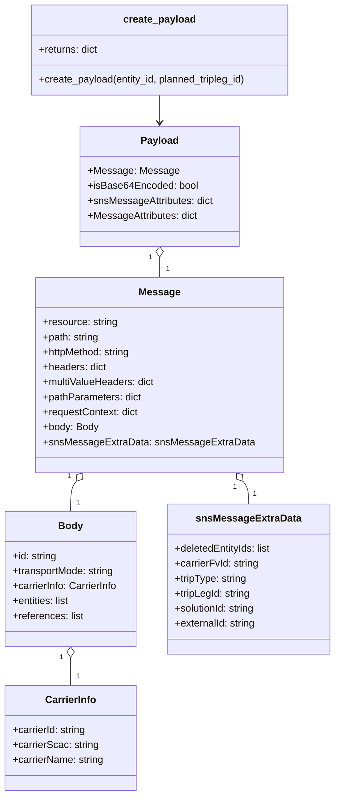

# Diagram: entity_core/entity_service/entity_inventory/entity_inventory_tests/test_data/delete_tripleg_data.py


> Auto-generated by Obscura crawlers

## Diagram 1



### SVG

<svg id="container" width="539.6640625" xmlns="http://www.w3.org/2000/svg" class="classDiagram" height="1272" viewBox="0 0 539.6640625 1272" role="graphics-document document" aria-roledescription="class"><style>#container{font-family:"trebuchet ms",verdana,arial,sans-serif;font-size:16px;fill:#333;}@keyframes edge-animation-frame{from{stroke-dashoffset:0;}}@keyframes dash{to{stroke-dashoffset:0;}}#container .edge-animation-slow{stroke-dasharray:9,5!important;stroke-dashoffset:900;animation:dash 50s linear infinite;stroke-linecap:round;}#container .edge-animation-fast{stroke-dasharray:9,5!important;stroke-dashoffset:900;animation:dash 20s linear infinite;stroke-linecap:round;}#container .error-icon{fill:#552222;}#container .error-text{fill:#552222;stroke:#552222;}#container .edge-thickness-normal{stroke-width:1px;}#container .edge-thickness-thick{stroke-width:3.5px;}#container .edge-pattern-solid{stroke-dasharray:0;}#container .edge-thickness-invisible{stroke-width:0;fill:none;}#container .edge-pattern-dashed{stroke-dasharray:3;}#container .edge-pattern-dotted{stroke-dasharray:2;}#container .marker{fill:#333333;stroke:#333333;}#container .marker.cross{stroke:#333333;}#container svg{font-family:"trebuchet ms",verdana,arial,sans-serif;font-size:16px;}#container p{margin:0;}#container g.classGroup text{fill:#9370DB;stroke:none;font-family:"trebuchet ms",verdana,arial,sans-serif;font-size:10px;}#container g.classGroup text .title{font-weight:bolder;}#container .nodeLabel,#container .edgeLabel{color:#131300;}#container .edgeLabel .label rect{fill:#ECECFF;}#container .label text{fill:#131300;}#container .labelBkg{background:#ECECFF;}#container .edgeLabel .label span{background:#ECECFF;}#container .classTitle{font-weight:bolder;}#container .node rect,#container .node circle,#container .node ellipse,#container .node polygon,#container .node path{fill:#ECECFF;stroke:#9370DB;stroke-width:1px;}#container .divider{stroke:#9370DB;stroke-width:1;}#container g.clickable{cursor:pointer;}#container g.classGroup rect{fill:#ECECFF;stroke:#9370DB;}#container g.classGroup line{stroke:#9370DB;stroke-width:1;}#container .classLabel .box{stroke:none;stroke-width:0;fill:#ECECFF;opacity:0.5;}#container .classLabel .label{fill:#9370DB;font-size:10px;}#container .relation{stroke:#333333;stroke-width:1;fill:none;}#container .dashed-line{stroke-dasharray:3;}#container .dotted-line{stroke-dasharray:1 2;}#container #compositionStart,#container .composition{fill:#333333!important;stroke:#333333!important;stroke-width:1;}#container #compositionEnd,#container .composition{fill:#333333!important;stroke:#333333!important;stroke-width:1;}#container #dependencyStart,#container .dependency{fill:#333333!important;stroke:#333333!important;stroke-width:1;}#container #dependencyStart,#container .dependency{fill:#333333!important;stroke:#333333!important;stroke-width:1;}#container #extensionStart,#container .extension{fill:transparent!important;stroke:#333333!important;stroke-width:1;}#container #extensionEnd,#container .extension{fill:transparent!important;stroke:#333333!important;stroke-width:1;}#container #aggregationStart,#container .aggregation{fill:transparent!important;stroke:#333333!important;stroke-width:1;}#container #aggregationEnd,#container .aggregation{fill:transparent!important;stroke:#333333!important;stroke-width:1;}#container #lollipopStart,#container .lollipop{fill:#ECECFF!important;stroke:#333333!important;stroke-width:1;}#container #lollipopEnd,#container .lollipop{fill:#ECECFF!important;stroke:#333333!important;stroke-width:1;}#container .edgeTerminals{font-size:11px;line-height:initial;}#container .classTitleText{text-anchor:middle;font-size:18px;fill:#333;}#container .label-icon{display:inline-block;height:1em;overflow:visible;vertical-align:-0.125em;}#container .node .label-icon path{fill:currentColor;stroke:revert;stroke-width:revert;}#container :root{--mermaid-font-family:"trebuchet ms",verdana,arial,sans-serif;}</style><g><defs><marker id="container_class-aggregationStart" class="marker aggregation class" refX="18" refY="7" markerWidth="190" markerHeight="240" orient="auto"><path d="M 18,7 L9,13 L1,7 L9,1 Z"></path></marker></defs><defs><marker id="container_class-aggregationEnd" class="marker aggregation class" refX="1" refY="7" markerWidth="20" markerHeight="28" orient="auto"><path d="M 18,7 L9,13 L1,7 L9,1 Z"></path></marker></defs><defs><marker id="container_class-extensionStart" class="marker extension class" refX="18" refY="7" markerWidth="190" markerHeight="240" orient="auto"><path d="M 1,7 L18,13 V 1 Z"></path></marker></defs><defs><marker id="container_class-extensionEnd" class="marker extension class" refX="1" refY="7" markerWidth="20" markerHeight="28" orient="auto"><path d="M 1,1 V 13 L18,7 Z"></path></marker></defs><defs><marker id="container_class-compositionStart" class="marker composition class" refX="18" refY="7" markerWidth="190" markerHeight="240" orient="auto"><path d="M 18,7 L9,13 L1,7 L9,1 Z"></path></marker></defs><defs><marker id="container_class-compositionEnd" class="marker composition class" refX="1" refY="7" markerWidth="20" markerHeight="28" orient="auto"><path d="M 18,7 L9,13 L1,7 L9,1 Z"></path></marker></defs><defs><marker id="container_class-dependencyStart" class="marker dependency class" refX="6" refY="7" markerWidth="190" markerHeight="240" orient="auto"><path d="M 5,7 L9,13 L1,7 L9,1 Z"></path></marker></defs><defs><marker id="container_class-dependencyEnd" class="marker dependency class" refX="13" refY="7" markerWidth="20" markerHeight="28" orient="auto"><path d="M 18,7 L9,13 L14,7 L9,1 Z"></path></marker></defs><defs><marker id="container_class-lollipopStart" class="marker lollipop class" refX="13" refY="7" markerWidth="190" markerHeight="240" orient="auto"><circle stroke="black" fill="transparent" cx="7" cy="7" r="6"></circle></marker></defs><defs><marker id="container_class-lollipopEnd" class="marker lollipop class" refX="1" refY="7" markerWidth="190" markerHeight="240" orient="auto"><circle stroke="black" fill="transparent" cx="7" cy="7" r="6"></circle></marker></defs><g class="root"><g class="clusters"></g><g class="edgePaths"><path d="M257.975,152L257.975,156.167C257.975,160.333,257.975,168.667,257.975,176C257.975,183.333,257.975,189.667,257.975,192.833L257.975,196" id="id_create_payload_Payload_1" class="edge-thickness-normal edge-pattern-solid relation" style=";;;" data-edge="true" data-et="edge" data-id="id_create_payload_Payload_1" data-points="W3sieCI6MjU3Ljk3NDYwOTM3NSwieSI6MTUyfSx7IngiOjI1Ny45NzQ2MDkzNzUsInkiOjE3N30seyJ4IjoyNTcuOTc0NjA5Mzc1LCJ5IjoyMDJ9XQ==" marker-end="url(#container_class-dependencyEnd)"></path><path d="M257.975,411.25L257.975,412.542C257.975,413.833,257.975,416.417,257.975,421.875C257.975,427.333,257.975,435.667,257.975,439.833L257.975,444" id="id_Payload_Message_2" class="edge-thickness-normal edge-pattern-solid relation" style=";;;" data-edge="true" data-et="edge" data-id="id_Payload_Message_2" data-points="W3sieCI6MjU3Ljk3NDYwOTM3NSwieSI6Mzk0fSx7IngiOjI1Ny45NzQ2MDkzNzUsInkiOjQxOX0seyJ4IjoyNTcuOTc0NjA5Mzc1LCJ5Ijo0NDR9XQ==" marker-start="url(#container_class-aggregationStart)"></path><path d="M123.655,769.52L122.139,771.434C120.623,773.347,117.591,777.173,116.075,785.253C114.559,793.333,114.559,805.667,114.559,811.833L114.559,818" id="id_Message_Body_3" class="edge-thickness-normal edge-pattern-solid relation" style=";;;" data-edge="true" data-et="edge" data-id="id_Message_Body_3" data-points="W3sieCI6MTM0LjM2NzQzNTY4NzE1NDY4LCJ5Ijo3NTZ9LHsieCI6MTE0LjU1ODU5Mzc1LCJ5Ijo3ODF9LHsieCI6MTE0LjU1ODU5Mzc1LCJ5Ijo4MTh9XQ==" marker-start="url(#container_class-aggregationStart)"></path><path d="M114.559,1051.25L114.559,1054.542C114.559,1057.833,114.559,1064.417,114.559,1071.875C114.559,1079.333,114.559,1087.667,114.559,1091.833L114.559,1096" id="id_Body_CarrierInfo_4" class="edge-thickness-normal edge-pattern-solid relation" style=";;;" data-edge="true" data-et="edge" data-id="id_Body_CarrierInfo_4" data-points="W3sieCI6MTE0LjU1ODU5Mzc1LCJ5IjoxMDM0fSx7IngiOjExNC41NTg1OTM3NSwieSI6MTA3MX0seyJ4IjoxMTQuNTU4NTkzNzUsInkiOjEwOTZ9XQ==" marker-start="url(#container_class-aggregationStart)"></path><path d="M392.295,769.52L393.811,771.434C395.327,773.347,398.359,777.173,399.875,783.253C401.391,789.333,401.391,797.667,401.391,801.833L401.391,806" id="id_Message_snsMessageExtraData_5" class="edge-thickness-normal edge-pattern-solid relation" style=";;;" data-edge="true" data-et="edge" data-id="id_Message_snsMessageExtraData_5" data-points="W3sieCI6MzgxLjU4MTc4MzA2Mjg0NTMsInkiOjc1Nn0seyJ4Ijo0MDEuMzkwNjI1LCJ5Ijo3ODF9LHsieCI6NDAxLjM5MDYyNSwieSI6ODA2fV0=" marker-start="url(#container_class-aggregationStart)"></path></g><g class="edgeLabels"><g class="edgeLabel"><g class="label" data-id="id_create_payload_Payload_1" transform="translate(0, 0)"><foreignObject width="0" height="0"><div xmlns="http://www.w3.org/1999/xhtml" class="labelBkg" style="display: table-cell; white-space: nowrap; line-height: 1.5; max-width: 200px; text-align: center;"><span class="edgeLabel"></span></div></foreignObject></g></g><g class="edgeLabel"><g class="label" data-id="id_Payload_Message_2" transform="translate(0, 0)"><foreignObject width="0" height="0"><div xmlns="http://www.w3.org/1999/xhtml" class="labelBkg" style="display: table-cell; white-space: nowrap; line-height: 1.5; max-width: 200px; text-align: center;"><span class="edgeLabel"></span></div></foreignObject></g></g><g class="edgeLabel"><g class="label" data-id="id_Message_Body_3" transform="translate(0, 0)"><foreignObject width="0" height="0"><div xmlns="http://www.w3.org/1999/xhtml" class="labelBkg" style="display: table-cell; white-space: nowrap; line-height: 1.5; max-width: 200px; text-align: center;"><span class="edgeLabel"></span></div></foreignObject></g></g><g class="edgeLabel"><g class="label" data-id="id_Body_CarrierInfo_4" transform="translate(0, 0)"><foreignObject width="0" height="0"><div xmlns="http://www.w3.org/1999/xhtml" class="labelBkg" style="display: table-cell; white-space: nowrap; line-height: 1.5; max-width: 200px; text-align: center;"><span class="edgeLabel"></span></div></foreignObject></g></g><g class="edgeLabel"><g class="label" data-id="id_Message_snsMessageExtraData_5" transform="translate(0, 0)"><foreignObject width="0" height="0"><div xmlns="http://www.w3.org/1999/xhtml" class="labelBkg" style="display: table-cell; white-space: nowrap; line-height: 1.5; max-width: 200px; text-align: center;"><span class="edgeLabel"></span></div></foreignObject></g></g><g class="edgeTerminals" transform="translate(242.9746096875, 411.50000026785716)"><g class="inner" transform="translate(0, 0)"><foreignObject style="width: 9px; height: 12px;"><div xmlns="http://www.w3.org/1999/xhtml" style="display: inline-block; padding-right: 1px; white-space: nowrap;"><span class="edgeLabel">1</span></div></foreignObject></g></g><g class="edgeTerminals" transform="translate(112.20256111889698, 761.409889343915)"><g class="inner" transform="translate(0, 0)"><foreignObject style="width: 9px; height: 12px;"><div xmlns="http://www.w3.org/1999/xhtml" style="display: inline-block; padding-right: 1px; white-space: nowrap;"><span class="edgeLabel">1</span></div></foreignObject></g></g><g class="edgeTerminals" transform="translate(99.55859187500008, 1051.4999983928572)"><g class="inner" transform="translate(0, 0)"><foreignObject style="width: 9px; height: 12px;"><div xmlns="http://www.w3.org/1999/xhtml" style="display: inline-block; padding-right: 1px; white-space: nowrap;"><span class="edgeLabel">1</span></div></foreignObject></g></g><g class="edgeTerminals" transform="translate(379.22575506353746, 778.6935610204087)"><g class="inner" transform="translate(0, 0)"><foreignObject style="width: 9px; height: 12px;"><div xmlns="http://www.w3.org/1999/xhtml" style="display: inline-block; padding-right: 1px; white-space: nowrap;"><span class="edgeLabel">1</span></div></foreignObject></g></g><g class="edgeTerminals" transform="translate(267.9746096875, 421.50000026785716)"><g class="inner" transform="translate(0, 0)"></g><foreignObject style="width: 9px; height: 12px;"><div xmlns="http://www.w3.org/1999/xhtml" style="display: inline-block; padding-right: 1px; white-space: nowrap;"><span class="edgeLabel">1</span></div></foreignObject></g><g class="edgeTerminals" transform="translate(124.5585918749999, 795.4999983928572)"><g class="inner" transform="translate(0, 0)"></g><foreignObject style="width: 9px; height: 12px;"><div xmlns="http://www.w3.org/1999/xhtml" style="display: inline-block; padding-right: 1px; white-space: nowrap;"><span class="edgeLabel">1</span></div></foreignObject></g><g class="edgeTerminals" transform="translate(124.5585918749999, 1073.4999983928572)"><g class="inner" transform="translate(0, 0)"></g><foreignObject style="width: 9px; height: 12px;"><div xmlns="http://www.w3.org/1999/xhtml" style="display: inline-block; padding-right: 1px; white-space: nowrap;"><span class="edgeLabel">1</span></div></foreignObject></g><g class="edgeTerminals" transform="translate(408.02419391434825, 781.7936710044692)"><g class="inner" transform="translate(0, 0)"></g><foreignObject style="width: 9px; height: 12px;"><div xmlns="http://www.w3.org/1999/xhtml" style="display: inline-block; padding-right: 1px; white-space: nowrap;"><span class="edgeLabel">1</span></div></foreignObject></g></g><g class="nodes"><g class="node default" id="classId-create_payload-0" transform="translate(257.974609375, 80)"><g class="basic label-container"><path d="M-209.48046875 -72 L209.48046875 -72 L209.48046875 72 L-209.48046875 72" stroke="none" stroke-width="0" fill="#ECECFF" style=""></path><path d="M-209.48046875 -72 C-43.67256790100251 -72, 122.13533294799498 -72, 209.48046875 -72 M-209.48046875 -72 C-74.61868434404218 -72, 60.24310006191564 -72, 209.48046875 -72 M209.48046875 -72 C209.48046875 -35.47519713430277, 209.48046875 1.0496057313944647, 209.48046875 72 M209.48046875 -72 C209.48046875 -19.500721732082674, 209.48046875 32.99855653583465, 209.48046875 72 M209.48046875 72 C87.29001921117863 72, -34.90043032764274 72, -209.48046875 72 M209.48046875 72 C110.19930144605465 72, 10.918134142109295 72, -209.48046875 72 M-209.48046875 72 C-209.48046875 16.452423109607324, -209.48046875 -39.09515378078535, -209.48046875 -72 M-209.48046875 72 C-209.48046875 39.2843763347726, -209.48046875 6.568752669545205, -209.48046875 -72" stroke="#9370DB" stroke-width="1.3" fill="none" stroke-dasharray="0 0" style=""></path></g><g class="annotation-group text" transform="translate(0, -48)"></g><g class="label-group text" transform="translate(-56.1015625, -48)"><g class="label" style="font-weight: bolder" transform="translate(0,-12)"><foreignObject width="112.203125" height="24"><div xmlns="http://www.w3.org/1999/xhtml" style="display: table-cell; white-space: nowrap; line-height: 1.5; max-width: 161px; text-align: center;"><span class="nodeLabel markdown-node-label" style=""><p>create_payload</p></span></div></foreignObject></g></g><g class="members-group text" transform="translate(-197.48046875, 0)"><g class="label" style="" transform="translate(0,-12)"><foreignObject width="96.109375" height="24"><div xmlns="http://www.w3.org/1999/xhtml" style="display: table-cell; white-space: nowrap; line-height: 1.5; max-width: 154px; text-align: center;"><span class="nodeLabel markdown-node-label" style=""><p>+returns: dict</p></span></div></foreignObject></g></g><g class="methods-group text" transform="translate(-197.48046875, 48)"><g class="label" style="" transform="translate(0,-12)"><foreignObject width="338.859375" height="24"><div xmlns="http://www.w3.org/1999/xhtml" style="display: table-cell; white-space: nowrap; line-height: 1.5; max-width: 396px; text-align: center;"><span class="nodeLabel markdown-node-label" style=""><p>+create_payload(entity_id, planned_tripleg_id)</p></span></div></foreignObject></g></g><g class="divider" style=""><path d="M-209.48046875 -24 C-81.89957089833315 -24, 45.681326953333695 -24, 209.48046875 -24 M-209.48046875 -24 C-67.16800663986197 -24, 75.14445547027606 -24, 209.48046875 -24" stroke="#9370DB" stroke-width="1.3" fill="none" stroke-dasharray="0 0" style=""></path></g><g class="divider" style=""><path d="M-209.48046875 24 C-79.8225225831514 24, 49.83542358369721 24, 209.48046875 24 M-209.48046875 24 C-67.31713473236971 24, 74.84619928526058 24, 209.48046875 24" stroke="#9370DB" stroke-width="1.3" fill="none" stroke-dasharray="0 0" style=""></path></g></g><g class="node default" id="classId-Payload-1" transform="translate(257.974609375, 298)"><g class="basic label-container"><path d="M-126.9375 -96 L126.9375 -96 L126.9375 96 L-126.9375 96" stroke="none" stroke-width="0" fill="#ECECFF" style=""></path><path d="M-126.9375 -96 C-51.326629555692875 -96, 24.28424088861425 -96, 126.9375 -96 M-126.9375 -96 C-39.146693303559175 -96, 48.64411339288165 -96, 126.9375 -96 M126.9375 -96 C126.9375 -52.09440965774217, 126.9375 -8.188819315484338, 126.9375 96 M126.9375 -96 C126.9375 -32.14462869077982, 126.9375 31.710742618440364, 126.9375 96 M126.9375 96 C58.59788927766496 96, -9.741721444670077 96, -126.9375 96 M126.9375 96 C38.65841319937047 96, -49.62067360125906 96, -126.9375 96 M-126.9375 96 C-126.9375 42.12468281094852, -126.9375 -11.750634378102959, -126.9375 -96 M-126.9375 96 C-126.9375 30.184270907832698, -126.9375 -35.631458184334605, -126.9375 -96" stroke="#9370DB" stroke-width="1.3" fill="none" stroke-dasharray="0 0" style=""></path></g><g class="annotation-group text" transform="translate(0, -72)"></g><g class="label-group text" transform="translate(-28.90625, -72)"><g class="label" style="font-weight: bolder" transform="translate(0,-12)"><foreignObject width="57.8125" height="24"><div xmlns="http://www.w3.org/1999/xhtml" style="display: table-cell; white-space: nowrap; line-height: 1.5; max-width: 107px; text-align: center;"><span class="nodeLabel markdown-node-label" style=""><p>Payload</p></span></div></foreignObject></g></g><g class="members-group text" transform="translate(-114.9375, -24)"><g class="label" style="" transform="translate(0,-12)"><foreignObject width="138.3125" height="24"><div xmlns="http://www.w3.org/1999/xhtml" style="display: table-cell; white-space: nowrap; line-height: 1.5; max-width: 196px; text-align: center;"><span class="nodeLabel markdown-node-label" style=""><p>+Message: Message</p></span></div></foreignObject></g><g class="label" style="" transform="translate(0,12)"><foreignObject width="174.75" height="24"><div xmlns="http://www.w3.org/1999/xhtml" style="display: table-cell; white-space: nowrap; line-height: 1.5; max-width: 232px; text-align: center;"><span class="nodeLabel markdown-node-label" style=""><p>+isBase64Encoded: bool</p></span></div></foreignObject></g><g class="label" style="" transform="translate(0,36)"><foreignObject width="200.96875" height="24"><div xmlns="http://www.w3.org/1999/xhtml" style="display: table-cell; white-space: nowrap; line-height: 1.5; max-width: 259px; text-align: center;"><span class="nodeLabel markdown-node-label" style=""><p>+snsMessageAttributes: dict</p></span></div></foreignObject></g><g class="label" style="" transform="translate(0,60)"><foreignObject width="176.640625" height="24"><div xmlns="http://www.w3.org/1999/xhtml" style="display: table-cell; white-space: nowrap; line-height: 1.5; max-width: 234px; text-align: center;"><span class="nodeLabel markdown-node-label" style=""><p>+MessageAttributes: dict</p></span></div></foreignObject></g></g><g class="methods-group text" transform="translate(-114.9375, 96)"></g><g class="divider" style=""><path d="M-126.9375 -48 C-29.562111873139045 -48, 67.81327625372191 -48, 126.9375 -48 M-126.9375 -48 C-47.843311656517656 -48, 31.250876686964688 -48, 126.9375 -48" stroke="#9370DB" stroke-width="1.3" fill="none" stroke-dasharray="0 0" style=""></path></g><g class="divider" style=""><path d="M-126.9375 72 C-61.9545691420432 72, 3.0283617159136043 72, 126.9375 72 M-126.9375 72 C-47.10859309190809 72, 32.72031381618382 72, 126.9375 72" stroke="#9370DB" stroke-width="1.3" fill="none" stroke-dasharray="0 0" style=""></path></g></g><g class="node default" id="classId-Message-2" transform="translate(257.974609375, 600)"><g class="basic label-container"><path d="M-190.734375 -156 L190.734375 -156 L190.734375 156 L-190.734375 156" stroke="none" stroke-width="0" fill="#ECECFF" style=""></path><path d="M-190.734375 -156 C-40.74415774011629 -156, 109.24605951976741 -156, 190.734375 -156 M-190.734375 -156 C-89.48624706736068 -156, 11.761880865278641 -156, 190.734375 -156 M190.734375 -156 C190.734375 -83.7742164396447, 190.734375 -11.548432879289408, 190.734375 156 M190.734375 -156 C190.734375 -64.1318398462436, 190.734375 27.736320307512813, 190.734375 156 M190.734375 156 C49.6069742226168 156, -91.5204265547664 156, -190.734375 156 M190.734375 156 C96.76620317729044 156, 2.7980313545808713 156, -190.734375 156 M-190.734375 156 C-190.734375 48.33852661970802, -190.734375 -59.32294676058396, -190.734375 -156 M-190.734375 156 C-190.734375 89.60928094076071, -190.734375 23.218561881521424, -190.734375 -156" stroke="#9370DB" stroke-width="1.3" fill="none" stroke-dasharray="0 0" style=""></path></g><g class="annotation-group text" transform="translate(0, -132)"></g><g class="label-group text" transform="translate(-31.25, -132)"><g class="label" style="font-weight: bolder" transform="translate(0,-12)"><foreignObject width="62.5" height="24"><div xmlns="http://www.w3.org/1999/xhtml" style="display: table-cell; white-space: nowrap; line-height: 1.5; max-width: 111px; text-align: center;"><span class="nodeLabel markdown-node-label" style=""><p>Message</p></span></div></foreignObject></g></g><g class="members-group text" transform="translate(-178.734375, -84)"><g class="label" style="" transform="translate(0,-12)"><foreignObject width="119.984375" height="24"><div xmlns="http://www.w3.org/1999/xhtml" style="display: table-cell; white-space: nowrap; line-height: 1.5; max-width: 178px; text-align: center;"><span class="nodeLabel markdown-node-label" style=""><p>+resource: string</p></span></div></foreignObject></g><g class="label" style="" transform="translate(0,12)"><foreignObject width="90.90625" height="24"><div xmlns="http://www.w3.org/1999/xhtml" style="display: table-cell; white-space: nowrap; line-height: 1.5; max-width: 149px; text-align: center;"><span class="nodeLabel markdown-node-label" style=""><p>+path: string</p></span></div></foreignObject></g><g class="label" style="" transform="translate(0,36)"><foreignObject width="143.375" height="24"><div xmlns="http://www.w3.org/1999/xhtml" style="display: table-cell; white-space: nowrap; line-height: 1.5; max-width: 201px; text-align: center;"><span class="nodeLabel markdown-node-label" style=""><p>+httpMethod: string</p></span></div></foreignObject></g><g class="label" style="" transform="translate(0,60)"><foreignObject width="101.90625" height="24"><div xmlns="http://www.w3.org/1999/xhtml" style="display: table-cell; white-space: nowrap; line-height: 1.5; max-width: 159px; text-align: center;"><span class="nodeLabel markdown-node-label" style=""><p>+headers: dict</p></span></div></foreignObject></g><g class="label" style="" transform="translate(0,84)"><foreignObject width="180.9375" height="24"><div xmlns="http://www.w3.org/1999/xhtml" style="display: table-cell; white-space: nowrap; line-height: 1.5; max-width: 239px; text-align: center;"><span class="nodeLabel markdown-node-label" style=""><p>+multiValueHeaders: dict</p></span></div></foreignObject></g><g class="label" style="" transform="translate(0,108)"><foreignObject width="158.3125" height="24"><div xmlns="http://www.w3.org/1999/xhtml" style="display: table-cell; white-space: nowrap; line-height: 1.5; max-width: 216px; text-align: center;"><span class="nodeLabel markdown-node-label" style=""><p>+pathParameters: dict</p></span></div></foreignObject></g><g class="label" style="" transform="translate(0,132)"><foreignObject width="153.90625" height="24"><div xmlns="http://www.w3.org/1999/xhtml" style="display: table-cell; white-space: nowrap; line-height: 1.5; max-width: 211px; text-align: center;"><span class="nodeLabel markdown-node-label" style=""><p>+requestContext: dict</p></span></div></foreignObject></g><g class="label" style="" transform="translate(0,156)"><foreignObject width="88.9375" height="24"><div xmlns="http://www.w3.org/1999/xhtml" style="display: table-cell; white-space: nowrap; line-height: 1.5; max-width: 146px; text-align: center;"><span class="nodeLabel markdown-node-label" style=""><p>+body: Body</p></span></div></foreignObject></g><g class="label" style="" transform="translate(0,180)"><foreignObject width="326.21875" height="24"><div xmlns="http://www.w3.org/1999/xhtml" style="display: table-cell; white-space: nowrap; line-height: 1.5; max-width: 384px; text-align: center;"><span class="nodeLabel markdown-node-label" style=""><p>+snsMessageExtraData: snsMessageExtraData</p></span></div></foreignObject></g></g><g class="methods-group text" transform="translate(-178.734375, 156)"></g><g class="divider" style=""><path d="M-190.734375 -108 C-85.6238919765329 -108, 19.486591046934194 -108, 190.734375 -108 M-190.734375 -108 C-54.33712519525787 -108, 82.06012460948426 -108, 190.734375 -108" stroke="#9370DB" stroke-width="1.3" fill="none" stroke-dasharray="0 0" style=""></path></g><g class="divider" style=""><path d="M-190.734375 132 C-101.63564749029864 132, -12.536919980597276 132, 190.734375 132 M-190.734375 132 C-78.61918588883269 132, 33.49600322233462 132, 190.734375 132" stroke="#9370DB" stroke-width="1.3" fill="none" stroke-dasharray="0 0" style=""></path></g></g><g class="node default" id="classId-Body-3" transform="translate(114.55859375, 926)"><g class="basic label-container"><path d="M-106.55859375 -108 L106.55859375 -108 L106.55859375 108 L-106.55859375 108" stroke="none" stroke-width="0" fill="#ECECFF" style=""></path><path d="M-106.55859375 -108 C-42.098265381345584 -108, 22.362062987308832 -108, 106.55859375 -108 M-106.55859375 -108 C-47.24065062457449 -108, 12.077292500851016 -108, 106.55859375 -108 M106.55859375 -108 C106.55859375 -41.96757606770895, 106.55859375 24.064847864582106, 106.55859375 108 M106.55859375 -108 C106.55859375 -55.72838994981546, 106.55859375 -3.4567798996309165, 106.55859375 108 M106.55859375 108 C39.33751214614408 108, -27.883569457711843 108, -106.55859375 108 M106.55859375 108 C28.462030936829308 108, -49.634531876341384 108, -106.55859375 108 M-106.55859375 108 C-106.55859375 24.341734671266238, -106.55859375 -59.316530657467524, -106.55859375 -108 M-106.55859375 108 C-106.55859375 31.50394683731973, -106.55859375 -44.99210632536054, -106.55859375 -108" stroke="#9370DB" stroke-width="1.3" fill="none" stroke-dasharray="0 0" style=""></path></g><g class="annotation-group text" transform="translate(0, -84)"></g><g class="label-group text" transform="translate(-18.5546875, -84)"><g class="label" style="font-weight: bolder" transform="translate(0,-12)"><foreignObject width="37.109375" height="24"><div xmlns="http://www.w3.org/1999/xhtml" style="display: table-cell; white-space: nowrap; line-height: 1.5; max-width: 87px; text-align: center;"><span class="nodeLabel markdown-node-label" style=""><p>Body</p></span></div></foreignObject></g></g><g class="members-group text" transform="translate(-94.55859375, -36)"><g class="label" style="" transform="translate(0,-12)"><foreignObject width="71.78125" height="24"><div xmlns="http://www.w3.org/1999/xhtml" style="display: table-cell; white-space: nowrap; line-height: 1.5; max-width: 130px; text-align: center;"><span class="nodeLabel markdown-node-label" style=""><p>+id: string</p></span></div></foreignObject></g><g class="label" style="" transform="translate(0,12)"><foreignObject width="165.453125" height="24"><div xmlns="http://www.w3.org/1999/xhtml" style="display: table-cell; white-space: nowrap; line-height: 1.5; max-width: 223px; text-align: center;"><span class="nodeLabel markdown-node-label" style=""><p>+transportMode: string</p></span></div></foreignObject></g><g class="label" style="" transform="translate(0,36)"><foreignObject width="170.5625" height="24"><div xmlns="http://www.w3.org/1999/xhtml" style="display: table-cell; white-space: nowrap; line-height: 1.5; max-width: 228px; text-align: center;"><span class="nodeLabel markdown-node-label" style=""><p>+carrierInfo: CarrierInfo</p></span></div></foreignObject></g><g class="label" style="" transform="translate(0,60)"><foreignObject width="93.390625" height="24"><div xmlns="http://www.w3.org/1999/xhtml" style="display: table-cell; white-space: nowrap; line-height: 1.5; max-width: 151px; text-align: center;"><span class="nodeLabel markdown-node-label" style=""><p>+entities: list</p></span></div></foreignObject></g><g class="label" style="" transform="translate(0,84)"><foreignObject width="114.171875" height="24"><div xmlns="http://www.w3.org/1999/xhtml" style="display: table-cell; white-space: nowrap; line-height: 1.5; max-width: 172px; text-align: center;"><span class="nodeLabel markdown-node-label" style=""><p>+references: list</p></span></div></foreignObject></g></g><g class="methods-group text" transform="translate(-94.55859375, 108)"></g><g class="divider" style=""><path d="M-106.55859375 -60 C-32.22623560500321 -60, 42.10612253999358 -60, 106.55859375 -60 M-106.55859375 -60 C-45.522617710632865 -60, 15.51335832873427 -60, 106.55859375 -60" stroke="#9370DB" stroke-width="1.3" fill="none" stroke-dasharray="0 0" style=""></path></g><g class="divider" style=""><path d="M-106.55859375 84 C-25.3397123122529 84, 55.8791691254942 84, 106.55859375 84 M-106.55859375 84 C-49.38079661392423 84, 7.797000522151535 84, 106.55859375 84" stroke="#9370DB" stroke-width="1.3" fill="none" stroke-dasharray="0 0" style=""></path></g></g><g class="node default" id="classId-CarrierInfo-4" transform="translate(114.55859375, 1180)"><g class="basic label-container"><path d="M-105.66015625 -84 L105.66015625 -84 L105.66015625 84 L-105.66015625 84" stroke="none" stroke-width="0" fill="#ECECFF" style=""></path><path d="M-105.66015625 -84 C-56.97046708690285 -84, -8.2807779238057 -84, 105.66015625 -84 M-105.66015625 -84 C-60.26124314649669 -84, -14.862330042993378 -84, 105.66015625 -84 M105.66015625 -84 C105.66015625 -17.91533882570141, 105.66015625 48.16932234859718, 105.66015625 84 M105.66015625 -84 C105.66015625 -37.9724035962251, 105.66015625 8.055192807549801, 105.66015625 84 M105.66015625 84 C31.331264875427934 84, -42.99762649914413 84, -105.66015625 84 M105.66015625 84 C33.28233579833291 84, -39.09548465333418 84, -105.66015625 84 M-105.66015625 84 C-105.66015625 49.77879685663038, -105.66015625 15.557593713260758, -105.66015625 -84 M-105.66015625 84 C-105.66015625 44.60718900465487, -105.66015625 5.2143780093097405, -105.66015625 -84" stroke="#9370DB" stroke-width="1.3" fill="none" stroke-dasharray="0 0" style=""></path></g><g class="annotation-group text" transform="translate(0, -60)"></g><g class="label-group text" transform="translate(-39.6015625, -60)"><g class="label" style="font-weight: bolder" transform="translate(0,-12)"><foreignObject width="79.203125" height="24"><div xmlns="http://www.w3.org/1999/xhtml" style="display: table-cell; white-space: nowrap; line-height: 1.5; max-width: 128px; text-align: center;"><span class="nodeLabel markdown-node-label" style=""><p>CarrierInfo</p></span></div></foreignObject></g></g><g class="members-group text" transform="translate(-93.66015625, -12)"><g class="label" style="" transform="translate(0,-12)"><foreignObject width="119.9375" height="24"><div xmlns="http://www.w3.org/1999/xhtml" style="display: table-cell; white-space: nowrap; line-height: 1.5; max-width: 178px; text-align: center;"><span class="nodeLabel markdown-node-label" style=""><p>+carrierId: string</p></span></div></foreignObject></g><g class="label" style="" transform="translate(0,12)"><foreignObject width="138.28125" height="24"><div xmlns="http://www.w3.org/1999/xhtml" style="display: table-cell; white-space: nowrap; line-height: 1.5; max-width: 196px; text-align: center;"><span class="nodeLabel markdown-node-label" style=""><p>+carrierScac: string</p></span></div></foreignObject></g><g class="label" style="" transform="translate(0,36)"><foreignObject width="147.71875" height="24"><div xmlns="http://www.w3.org/1999/xhtml" style="display: table-cell; white-space: nowrap; line-height: 1.5; max-width: 206px; text-align: center;"><span class="nodeLabel markdown-node-label" style=""><p>+carrierName: string</p></span></div></foreignObject></g></g><g class="methods-group text" transform="translate(-93.66015625, 84)"></g><g class="divider" style=""><path d="M-105.66015625 -36 C-55.447185123791314 -36, -5.2342139975826285 -36, 105.66015625 -36 M-105.66015625 -36 C-59.50666851721663 -36, -13.353180784433263 -36, 105.66015625 -36" stroke="#9370DB" stroke-width="1.3" fill="none" stroke-dasharray="0 0" style=""></path></g><g class="divider" style=""><path d="M-105.66015625 60 C-34.73384869115182 60, 36.19245886769636 60, 105.66015625 60 M-105.66015625 60 C-47.779899186661275 60, 10.10035787667745 60, 105.66015625 60" stroke="#9370DB" stroke-width="1.3" fill="none" stroke-dasharray="0 0" style=""></path></g></g><g class="node default" id="classId-snsMessageExtraData-5" transform="translate(401.390625, 926)"><g class="basic label-container"><path d="M-130.2734375 -120 L130.2734375 -120 L130.2734375 120 L-130.2734375 120" stroke="none" stroke-width="0" fill="#ECECFF" style=""></path><path d="M-130.2734375 -120 C-49.21712739620487 -120, 31.839182707590254 -120, 130.2734375 -120 M-130.2734375 -120 C-67.87374401556502 -120, -5.474050531130061 -120, 130.2734375 -120 M130.2734375 -120 C130.2734375 -41.42583719578087, 130.2734375 37.148325608438256, 130.2734375 120 M130.2734375 -120 C130.2734375 -42.231192575205114, 130.2734375 35.53761484958977, 130.2734375 120 M130.2734375 120 C63.78589992719998 120, -2.7016376456000444 120, -130.2734375 120 M130.2734375 120 C34.14600274702181 120, -61.98143200595638 120, -130.2734375 120 M-130.2734375 120 C-130.2734375 57.487860866984875, -130.2734375 -5.024278266030251, -130.2734375 -120 M-130.2734375 120 C-130.2734375 66.93692446568454, -130.2734375 13.873848931369082, -130.2734375 -120" stroke="#9370DB" stroke-width="1.3" fill="none" stroke-dasharray="0 0" style=""></path></g><g class="annotation-group text" transform="translate(0, -96)"></g><g class="label-group text" transform="translate(-79.1875, -96)"><g class="label" style="font-weight: bolder" transform="translate(0,-12)"><foreignObject width="158.375" height="24"><div xmlns="http://www.w3.org/1999/xhtml" style="display: table-cell; white-space: nowrap; line-height: 1.5; max-width: 205px; text-align: center;"><span class="nodeLabel markdown-node-label" style=""><p>snsMessageExtraData</p></span></div></foreignObject></g></g><g class="members-group text" transform="translate(-118.2734375, -48)"><g class="label" style="" transform="translate(0,-12)"><foreignObject width="157.359375" height="24"><div xmlns="http://www.w3.org/1999/xhtml" style="display: table-cell; white-space: nowrap; line-height: 1.5; max-width: 215px; text-align: center;"><span class="nodeLabel markdown-node-label" style=""><p>+deletedEntityIds: list</p></span></div></foreignObject></g><g class="label" style="" transform="translate(0,12)"><foreignObject width="135.109375" height="24"><div xmlns="http://www.w3.org/1999/xhtml" style="display: table-cell; white-space: nowrap; line-height: 1.5; max-width: 193px; text-align: center;"><span class="nodeLabel markdown-node-label" style=""><p>+carrierFvId: string</p></span></div></foreignObject></g><g class="label" style="" transform="translate(0,36)"><foreignObject width="117.3125" height="24"><div xmlns="http://www.w3.org/1999/xhtml" style="display: table-cell; white-space: nowrap; line-height: 1.5; max-width: 175px; text-align: center;"><span class="nodeLabel markdown-node-label" style=""><p>+tripType: string</p></span></div></foreignObject></g><g class="label" style="" transform="translate(0,60)"><foreignObject width="122.484375" height="24"><div xmlns="http://www.w3.org/1999/xhtml" style="display: table-cell; white-space: nowrap; line-height: 1.5; max-width: 181px; text-align: center;"><span class="nodeLabel markdown-node-label" style=""><p>+tripLegId: string</p></span></div></foreignObject></g><g class="label" style="" transform="translate(0,84)"><foreignObject width="131.8125" height="24"><div xmlns="http://www.w3.org/1999/xhtml" style="display: table-cell; white-space: nowrap; line-height: 1.5; max-width: 190px; text-align: center;"><span class="nodeLabel markdown-node-label" style=""><p>+solutionId: string</p></span></div></foreignObject></g><g class="label" style="" transform="translate(0,108)"><foreignObject width="131.375" height="24"><div xmlns="http://www.w3.org/1999/xhtml" style="display: table-cell; white-space: nowrap; line-height: 1.5; max-width: 189px; text-align: center;"><span class="nodeLabel markdown-node-label" style=""><p>+externalId: string</p></span></div></foreignObject></g></g><g class="methods-group text" transform="translate(-118.2734375, 120)"></g><g class="divider" style=""><path d="M-130.2734375 -72 C-41.29963454809807 -72, 47.67416840380386 -72, 130.2734375 -72 M-130.2734375 -72 C-40.260016380659735 -72, 49.75340473868053 -72, 130.2734375 -72" stroke="#9370DB" stroke-width="1.3" fill="none" stroke-dasharray="0 0" style=""></path></g><g class="divider" style=""><path d="M-130.2734375 96 C-34.1648400620835 96, 61.943757375833 96, 130.2734375 96 M-130.2734375 96 C-34.60745510714787 96, 61.05852728570426 96, 130.2734375 96" stroke="#9370DB" stroke-width="1.3" fill="none" stroke-dasharray="0 0" style=""></path></g></g></g></g></g></svg>

## Diagram 2

```mermaid
flowchart LR
    A[create_payload(entity_id, planned_tripleg_id)] --> B[Initialize payload_dict]
    B --> M[Build Message object]
    M --> H[Set headers & multiValueHeaders]
    M --> RC[Set requestContext (authorizer, identity, metadata)]
    M --> P[Set pathParameters & resource metadata]
    M --> BD[Set body fields]
    BD --> CARRIER[carrierInfo (carrierId, carrierScac, carrierName)]
    BD --> ENT[entities]
    BD --> REF[references]
    M --> SNS[snsMessageExtraData: uses entity_id & planned_tripleg_id]
    B --> SATTR[Set snsMessageAttributes & MessageAttributes]
    B --> I[Wrap isBase64Encoded, MessageAttributes]
    I --> R[Return {'body': json.dumps(payload_dict)}]
```

> SVG rendering failed for this diagram.
