# Diagram: entity_core/entity_service/entity_inventory/entity_inventory_tests/unit/test_search_inventory_handler.py

> Auto-generated by Obscura crawlers

## Mermaid

```mermaid
classDiagram
class SearchInventoryHandlerTests {
  +test_returns_search_results_when_given_location_is_enabled_for_inventory_view()
  +test_returns_bad_request_error_when_location_id_is_not_enabled_for_inventory_view()
  +test_returns_bad_request_error_when_requested_location_is_not_granted_for_the_organization()
  +test_fetch_entity_list_with_correct_pagination_parameters()
}
class SearchInventoryHandler {
  +handle(request, location_service, organization_service, search_dao, grant_dao)
}
class SearchInventoryRequest {
  +inventory_location_id
  +shippable
  +organization_id
  +request_id
  +version
  +event
}
class BadRequestError {
  +message
}
class FakeLocationServiceWithLocationConfiguration {
  +get_location_configuration(location_id, feature_code)
}
class FakeLocationServiceWithoutLocationConfiguration {
  +get_location_configuration(location_id, feature_code)
}
class FakeOrganizationService {
  +get_organization_data(organization_id)
}
class FakeEntityInventorySearchDAO {
  +invoked_offset
  +invoked_limit
  +get_inventory_entity_ids_by_location_id(location_id)
  +get_inventory_entity_list(entity_ids, inventory_location_id, offset, limit)
}
class FakeInventoryLocationGrantDAO {
  +is_organization_granted_location(organization_fv_id, location_id)
}
class FakeInventoryLocationWithoutGrantDAO {
  +is_organization_granted_location(organization_fv_id, location_id)
}

SearchInventoryHandlerTests --> SearchInventoryHandler : tests
SearchInventoryHandler --> SearchInventoryRequest : accepts
SearchInventoryHandler --> FakeLocationServiceWithLocationConfiguration : uses
SearchInventoryHandler --> FakeLocationServiceWithoutLocationConfiguration : uses_when_unavailable
SearchInventoryHandler --> FakeOrganizationService : uses
SearchInventoryHandler --> FakeEntityInventorySearchDAO : queries
SearchInventoryHandler --> FakeInventoryLocationGrantDAO : checks_grant
SearchInventoryHandler --> FakeInventoryLocationWithoutGrantDAO : checks_grant
SearchInventoryHandler ..> BadRequestError : may_raise
```

### SVG

<svg id="container" width="4348.7578125" xmlns="http://www.w3.org/2000/svg" class="classDiagram" height="728" viewBox="0 0 4348.7578125 728" role="graphics-document document" aria-roledescription="class"><g><defs><marker id="container_class-aggregationStart" class="marker aggregation class" refX="18" refY="7" markerWidth="190" markerHeight="240" orient="auto"><path d="M 18,7 L9,13 L1,7 L9,1 Z"></path></marker></defs><defs><marker id="container_class-aggregationEnd" class="marker aggregation class" refX="1" refY="7" markerWidth="20" markerHeight="28" orient="auto"><path d="M 18,7 L9,13 L1,7 L9,1 Z"></path></marker></defs><defs><marker id="container_class-extensionStart" class="marker extension class" refX="18" refY="7" markerWidth="190" markerHeight="240" orient="auto"><path d="M 1,7 L18,13 V 1 Z"></path></marker></defs><defs><marker id="container_class-extensionEnd" class="marker extension class" refX="1" refY="7" markerWidth="20" markerHeight="28" orient="auto"><path d="M 1,1 V 13 L18,7 Z"></path></marker></defs><defs><marker id="container_class-compositionStart" class="marker composition class" refX="18" refY="7" markerWidth="190" markerHeight="240" orient="auto"><path d="M 18,7 L9,13 L1,7 L9,1 Z"></path></marker></defs><defs><marker id="container_class-compositionEnd" class="marker composition class" refX="1" refY="7" markerWidth="20" markerHeight="28" orient="auto"><path d="M 18,7 L9,13 L1,7 L9,1 Z"></path></marker></defs><defs><marker id="container_class-dependencyStart" class="marker dependency class" refX="6" refY="7" markerWidth="190" markerHeight="240" orient="auto"><path d="M 5,7 L9,13 L1,7 L9,1 Z"></path></marker></defs><defs><marker id="container_class-dependencyEnd" class="marker dependency class" refX="13" refY="7" markerWidth="20" markerHeight="28" orient="auto"><path d="M 18,7 L9,13 L14,7 L9,1 Z"></path></marker></defs><defs><marker id="container_class-lollipopStart" class="marker lollipop class" refX="13" refY="7" markerWidth="190" markerHeight="240" orient="auto"><circle stroke="black" fill="transparent" cx="7" cy="7" r="6"></circle></marker></defs><defs><marker id="container_class-lollipopEnd" class="marker lollipop class" refX="1" refY="7" markerWidth="190" markerHeight="240" orient="auto"><circle stroke="black" fill="transparent" cx="7" cy="7" r="6"></circle></marker></defs><g class="root"><g class="clusters"></g><g class="edgePaths"><path d="M2130.395,206L2130.395,212.167C2130.395,218.333,2130.395,230.667,2130.395,242C2130.395,253.333,2130.395,263.667,2130.395,268.833L2130.395,274" id="id_SearchInventoryHandlerTests_SearchInventoryHandler_1" class="edge-thickness-normal edge-pattern-solid relation" style=";;;" data-edge="true" data-et="edge" data-id="id_SearchInventoryHandlerTests_SearchInventoryHandler_1" data-points="W3sieCI6MjEzMC4zOTQ1MzEyNSwieSI6MjA2fSx7IngiOjIxMzAuMzk0NTMxMjUsInkiOjI0M30seyJ4IjoyMTMwLjM5NDUzMTI1LCJ5IjoyODB9XQ==" marker-end="url(#container_class-dependencyEnd)"></path><path d="M1783.961,360.473L1511.257,374.228C1238.552,387.982,693.143,415.491,420.439,434.412C147.734,453.333,147.734,463.667,147.734,468.833L147.734,474" id="id_SearchInventoryHandler_SearchInventoryRequest_2" class="edge-thickness-normal edge-pattern-solid relation" style=";;;" data-edge="true" data-et="edge" data-id="id_SearchInventoryHandler_SearchInventoryRequest_2" data-points="W3sieCI6MTc4My45NjA5Mzc1LCJ5IjozNjAuNDczMTcwNzEyNDg1OH0seyJ4IjoxNDcuNzM0Mzc1LCJ5Ijo0NDN9LHsieCI6MTQ3LjczNDM3NSwieSI6NDgwfV0=" marker-end="url(#container_class-dependencyEnd)"></path><path d="M1783.961,366.147L1592.253,378.956C1400.544,391.764,1017.128,417.382,825.419,444.858C633.711,472.333,633.711,501.667,633.711,516.333L633.711,531" id="id_SearchInventoryHandler_FakeLocationServiceWithLocationConfiguration_3" class="edge-thickness-normal edge-pattern-solid relation" style=";;;" data-edge="true" data-et="edge" data-id="id_SearchInventoryHandler_FakeLocationServiceWithLocationConfiguration_3" data-points="W3sieCI6MTc4My45NjA5Mzc1LCJ5IjozNjYuMTQ2NzQ4OTMxODgzM30seyJ4Ijo2MzMuNzEwOTM3NSwieSI6NDQzfSx7IngiOjYzMy43MTA5Mzc1LCJ5Ijo1Mzd9XQ==" marker-end="url(#container_class-dependencyEnd)"></path><path d="M1783.961,383.852L1700.361,393.71C1616.762,403.568,1449.563,423.284,1365.963,447.809C1282.363,472.333,1282.363,501.667,1282.363,516.333L1282.363,531" id="id_SearchInventoryHandler_FakeLocationServiceWithoutLocationConfiguration_4" class="edge-thickness-normal edge-pattern-solid relation" style=";;;" data-edge="true" data-et="edge" data-id="id_SearchInventoryHandler_FakeLocationServiceWithoutLocationConfiguration_4" data-points="W3sieCI6MTc4My45NjA5Mzc1LCJ5IjozODMuODUxNTEyNjk0ODQ0N30seyJ4IjoxMjgyLjM2MzI4MTI1LCJ5Ijo0NDN9LHsieCI6MTI4Mi4zNjMyODEyNSwieSI6NTM3fV0=" marker-end="url(#container_class-dependencyEnd)"></path><path d="M1946.213,406L1928.185,412.167C1910.156,418.333,1874.1,430.667,1856.071,451.5C1838.043,472.333,1838.043,501.667,1838.043,516.333L1838.043,531" id="id_SearchInventoryHandler_FakeOrganizationService_5" class="edge-thickness-normal edge-pattern-solid relation" style=";;;" data-edge="true" data-et="edge" data-id="id_SearchInventoryHandler_FakeOrganizationService_5" data-points="W3sieCI6MTk0Ni4yMTMwNDY4NzUsInkiOjQwNn0seyJ4IjoxODM4LjA0Mjk2ODc1LCJ5Ijo0NDN9LHsieCI6MTgzOC4wNDI5Njg3NSwieSI6NTM3fV0=" marker-end="url(#container_class-dependencyEnd)"></path><path d="M2314.576,406L2332.604,412.167C2350.633,418.333,2386.689,430.667,2404.718,446C2422.746,461.333,2422.746,479.667,2422.746,488.833L2422.746,498" id="id_SearchInventoryHandler_FakeEntityInventorySearchDAO_6" class="edge-thickness-normal edge-pattern-solid relation" style=";;;" data-edge="true" data-et="edge" data-id="id_SearchInventoryHandler_FakeEntityInventorySearchDAO_6" data-points="W3sieCI6MjMxNC41NzYwMTU2MjUsInkiOjQwNn0seyJ4IjoyNDIyLjc0NjA5Mzc1LCJ5Ijo0NDN9LHsieCI6MjQyMi43NDYwOTM3NSwieSI6NTA0fV0=" marker-end="url(#container_class-dependencyEnd)"></path><path d="M2476.828,378.118L2583.505,388.931C2690.182,399.745,2903.536,421.373,3010.214,446.853C3116.891,472.333,3116.891,501.667,3116.891,516.333L3116.891,531" id="id_SearchInventoryHandler_FakeInventoryLocationGrantDAO_7" class="edge-thickness-normal edge-pattern-solid relation" style=";;;" data-edge="true" data-et="edge" data-id="id_SearchInventoryHandler_FakeInventoryLocationGrantDAO_7" data-points="W3sieCI6MjQ3Ni44MjgxMjUsInkiOjM3OC4xMTc1ODM5MzYyMDA5Nn0seyJ4IjozMTE2Ljg5MDYyNSwieSI6NDQzfSx7IngiOjMxMTYuODkwNjI1LCJ5Ijo1Mzd9XQ==" marker-end="url(#container_class-dependencyEnd)"></path><path d="M2476.828,363.665L2698.499,376.887C2920.169,390.11,3363.51,416.555,3585.181,444.444C3806.852,472.333,3806.852,501.667,3806.852,516.333L3806.852,531" id="id_SearchInventoryHandler_FakeInventoryLocationWithoutGrantDAO_8" class="edge-thickness-normal edge-pattern-solid relation" style=";;;" data-edge="true" data-et="edge" data-id="id_SearchInventoryHandler_FakeInventoryLocationWithoutGrantDAO_8" data-points="W3sieCI6MjQ3Ni44MjgxMjUsInkiOjM2My42NjQ2MjcwODUxMTQ5fSx7IngiOjM4MDYuODUxNTYyNSwieSI6NDQzfSx7IngiOjM4MDYuODUxNTYyNSwieSI6NTM3fV0=" marker-end="url(#container_class-dependencyEnd)"></path><path d="M2476.828,359.249L2774.428,373.207C3072.029,387.166,3667.229,415.083,3964.829,444.208C4262.43,473.333,4262.43,503.667,4262.43,518.833L4262.43,534" id="id_SearchInventoryHandler_BadRequestError_9" class="edge-thickness-normal edge-pattern-dashed relation" style=";;;" data-edge="true" data-et="edge" data-id="id_SearchInventoryHandler_BadRequestError_9" data-points="W3sieCI6MjQ3Ni44MjgxMjUsInkiOjM1OS4yNDg5NjI1MzM5NjM4M30seyJ4Ijo0MjYyLjQyOTY4NzUsInkiOjQ0M30seyJ4Ijo0MjYyLjQyOTY4NzUsInkiOjU0MH1d" marker-end="url(#container_class-dependencyEnd)"></path></g><g class="edgeLabels"><g class="edgeLabel" transform="translate(2130.39453125, 243)"><g class="label" data-id="id_SearchInventoryHandlerTests_SearchInventoryHandler_1" transform="translate(-17.4921875, -12)"><foreignObject width="34.984375" height="24">

tests

</foreignObject></g></g><g class="edgeLabel" transform="translate(147.734375, 443)"><g class="label" data-id="id_SearchInventoryHandler_SearchInventoryRequest_2" transform="translate(-27.421875, -12)"><foreignObject width="54.84375" height="24">

accepts

</foreignObject></g></g><g class="edgeLabel" transform="translate(633.7109375, 443)"><g class="label" data-id="id_SearchInventoryHandler_FakeLocationServiceWithLocationConfiguration_3" transform="translate(-16.4921875, -12)"><foreignObject width="32.984375" height="24">

uses

</foreignObject></g></g><g class="edgeLabel" transform="translate(1282.36328125, 443)"><g class="label" data-id="id_SearchInventoryHandler_FakeLocationServiceWithoutLocationConfiguration_4" transform="translate(-85.8671875, -12)"><foreignObject width="171.734375" height="24">

uses_when_unavailable

</foreignObject></g></g><g class="edgeLabel" transform="translate(1838.04296875, 443)"><g class="label" data-id="id_SearchInventoryHandler_FakeOrganizationService_5" transform="translate(-16.4921875, -12)"><foreignObject width="32.984375" height="24">

uses

</foreignObject></g></g><g class="edgeLabel" transform="translate(2422.74609375, 443)"><g class="label" data-id="id_SearchInventoryHandler_FakeEntityInventorySearchDAO_6" transform="translate(-27.2421875, -12)"><foreignObject width="54.484375" height="24">

queries

</foreignObject></g></g><g class="edgeLabel" transform="translate(3116.890625, 443)"><g class="label" data-id="id_SearchInventoryHandler_FakeInventoryLocationGrantDAO_7" transform="translate(-47.4609375, -12)"><foreignObject width="94.921875" height="24">

checks_grant

</foreignObject></g></g><g class="edgeLabel" transform="translate(3806.8515625, 443)"><g class="label" data-id="id_SearchInventoryHandler_FakeInventoryLocationWithoutGrantDAO_8" transform="translate(-47.4609375, -12)"><foreignObject width="94.921875" height="24">

checks_grant

</foreignObject></g></g><g class="edgeLabel" transform="translate(4262.4296875, 443)"><g class="label" data-id="id_SearchInventoryHandler_BadRequestError_9" transform="translate(-36.4609375, -12)"><foreignObject width="72.921875" height="24">

may_raise

</foreignObject></g></g></g><g class="nodes"><g class="node default" id="classId-SearchInventoryHandlerTests-0" transform="translate(2130.39453125, 107)"><g class="basic label-container"><path d="M-425.43359375 -99 L425.43359375 -99 L425.43359375 99 L-425.43359375 99" stroke="none" stroke-width="0" fill="#ECECFF" style=""></path><path d="M-425.43359375 -99 C-107.05068603566701 -99, 211.33222167866597 -99, 425.43359375 -99 M-425.43359375 -99 C-101.94343684063563 -99, 221.54672006872875 -99, 425.43359375 -99 M425.43359375 -99 C425.43359375 -21.80057236049167, 425.43359375 55.39885527901666, 425.43359375 99 M425.43359375 -99 C425.43359375 -24.282432291263177, 425.43359375 50.435135417473646, 425.43359375 99 M425.43359375 99 C88.74029301394842 99, -247.95300772210317 99, -425.43359375 99 M425.43359375 99 C86.80941683352836 99, -251.81476008294328 99, -425.43359375 99 M-425.43359375 99 C-425.43359375 58.39016724829255, -425.43359375 17.7803344965851, -425.43359375 -99 M-425.43359375 99 C-425.43359375 36.79093296998695, -425.43359375 -25.418134060026105, -425.43359375 -99" stroke="#9370DB" stroke-width="1.3" fill="none" stroke-dasharray="0 0" style=""></path></g><g class="annotation-group text" transform="translate(0, -75)"></g><g class="label-group text" transform="translate(-107.8671875, -75)"><g class="label" style="font-weight: bolder" transform="translate(0,-12)"><foreignObject width="215.734375" height="24">

SearchInventoryHandlerTests

</foreignObject></g></g><g class="members-group text" transform="translate(-413.43359375, -27)"></g><g class="methods-group text" transform="translate(-413.43359375, 3)"><g class="label" style="" transform="translate(0,-12)"><foreignObject width="612.171875" height="24">

+test_returns_search_results_when_given_location_is_enabled_for_inventory_view()

</foreignObject></g><g class="label" style="" transform="translate(0,12)"><foreignObject width="649.625" height="24">

+test_returns_bad_request_error_when_location_id_is_not_enabled_for_inventory_view()

</foreignObject></g><g class="label" style="" transform="translate(0,36)"><foreignObject width="719" height="24">

+test_returns_bad_request_error_when_requested_location_is_not_granted_for_the_organization()

</foreignObject></g><g class="label" style="" transform="translate(0,60)"><foreignObject width="445.078125" height="24">

+test_fetch_entity_list_with_correct_pagination_parameters()

</foreignObject></g></g><g class="divider" style=""><path d="M-425.43359375 -51 C-214.20292731819018 -51, -2.9722608863803543 -51, 425.43359375 -51 M-425.43359375 -51 C-232.42552490100576 -51, -39.41745605201152 -51, 425.43359375 -51" stroke="#9370DB" stroke-width="1.3" fill="none" stroke-dasharray="0 0" style=""></path></g><g class="divider" style=""><path d="M-425.43359375 -27 C-245.20349954773275 -27, -64.9734053454655 -27, 425.43359375 -27 M-425.43359375 -27 C-166.69372299209607 -27, 92.04614776580786 -27, 425.43359375 -27" stroke="#9370DB" stroke-width="1.3" fill="none" stroke-dasharray="0 0" style=""></path></g></g><g class="node default" id="classId-SearchInventoryHandler-1" transform="translate(2130.39453125, 343)"><g class="basic label-container"><path d="M-346.43359375 -63 L346.43359375 -63 L346.43359375 63 L-346.43359375 63" stroke="none" stroke-width="0" fill="#ECECFF" style=""></path><path d="M-346.43359375 -63 C-203.8863143024739 -63, -61.33903485494778 -63, 346.43359375 -63 M-346.43359375 -63 C-92.5327180567239 -63, 161.3681576365522 -63, 346.43359375 -63 M346.43359375 -63 C346.43359375 -25.554971642675504, 346.43359375 11.890056714648992, 346.43359375 63 M346.43359375 -63 C346.43359375 -29.620716355029238, 346.43359375 3.7585672899415243, 346.43359375 63 M346.43359375 63 C107.1784887106138 63, -132.0766163287724 63, -346.43359375 63 M346.43359375 63 C111.1988215450198 63, -124.0359506599604 63, -346.43359375 63 M-346.43359375 63 C-346.43359375 33.29683532348879, -346.43359375 3.5936706469775856, -346.43359375 -63 M-346.43359375 63 C-346.43359375 27.279413565037665, -346.43359375 -8.44117286992467, -346.43359375 -63" stroke="#9370DB" stroke-width="1.3" fill="none" stroke-dasharray="0 0" style=""></path></g><g class="annotation-group text" transform="translate(0, -39)"></g><g class="label-group text" transform="translate(-88.7578125, -39)"><g class="label" style="font-weight: bolder" transform="translate(0,-12)"><foreignObject width="177.515625" height="24">

SearchInventoryHandler

</foreignObject></g></g><g class="members-group text" transform="translate(-334.43359375, 9)"></g><g class="methods-group text" transform="translate(-334.43359375, 39)"><g class="label" style="" transform="translate(0,-12)"><foreignObject width="580.109375" height="24">

+handle(request, location_service, organization_service, search_dao, grant_dao)

</foreignObject></g></g><g class="divider" style=""><path d="M-346.43359375 -15 C-173.94121460761957 -15, -1.4488354652391422 -15, 346.43359375 -15 M-346.43359375 -15 C-71.67020367250205 -15, 203.0931864049959 -15, 346.43359375 -15" stroke="#9370DB" stroke-width="1.3" fill="none" stroke-dasharray="0 0" style=""></path></g><g class="divider" style=""><path d="M-346.43359375 9 C-160.88098059429566 9, 24.67163256140867 9, 346.43359375 9 M-346.43359375 9 C-192.32340191867982 9, -38.21321008735964 9, 346.43359375 9" stroke="#9370DB" stroke-width="1.3" fill="none" stroke-dasharray="0 0" style=""></path></g></g><g class="node default" id="classId-SearchInventoryRequest-2" transform="translate(147.734375, 600)"><g class="basic label-container"><path d="M-139.734375 -120 L139.734375 -120 L139.734375 120 L-139.734375 120" stroke="none" stroke-width="0" fill="#ECECFF" style=""></path><path d="M-139.734375 -120 C-67.90704327740906 -120, 3.920288445181882 -120, 139.734375 -120 M-139.734375 -120 C-42.71692999052581 -120, 54.300515018948374 -120, 139.734375 -120 M139.734375 -120 C139.734375 -46.23955337494421, 139.734375 27.520893250111584, 139.734375 120 M139.734375 -120 C139.734375 -38.17943734759757, 139.734375 43.64112530480486, 139.734375 120 M139.734375 120 C75.22262234185597 120, 10.710869683711934 120, -139.734375 120 M139.734375 120 C36.21722703218762 120, -67.29992093562475 120, -139.734375 120 M-139.734375 120 C-139.734375 71.31146078646435, -139.734375 22.62292157292869, -139.734375 -120 M-139.734375 120 C-139.734375 61.02965176541976, -139.734375 2.0593035308395145, -139.734375 -120" stroke="#9370DB" stroke-width="1.3" fill="none" stroke-dasharray="0 0" style=""></path></g><g class="annotation-group text" transform="translate(0, -96)"></g><g class="label-group text" transform="translate(-89.640625, -96)"><g class="label" style="font-weight: bolder" transform="translate(0,-12)"><foreignObject width="179.28125" height="24">

SearchInventoryRequest

</foreignObject></g></g><g class="members-group text" transform="translate(-127.734375, -48)"><g class="label" style="" transform="translate(0,-12)"><foreignObject width="165.828125" height="24">

+inventory_location_id

</foreignObject></g><g class="label" style="" transform="translate(0,12)"><foreignObject width="79.734375" height="24">

+shippable

</foreignObject></g><g class="label" style="" transform="translate(0,36)"><foreignObject width="120.75" height="24">

+organization_id

</foreignObject></g><g class="label" style="" transform="translate(0,60)"><foreignObject width="85.65625" height="24">

+request_id

</foreignObject></g><g class="label" style="" transform="translate(0,84)"><foreignObject width="61" height="24">

+version

</foreignObject></g><g class="label" style="" transform="translate(0,108)"><foreignObject width="48.328125" height="24">

+event

</foreignObject></g></g><g class="methods-group text" transform="translate(-127.734375, 120)"></g><g class="divider" style=""><path d="M-139.734375 -72 C-63.01409743501736 -72, 13.706180129965276 -72, 139.734375 -72 M-139.734375 -72 C-63.06500447727221 -72, 13.604366045455578 -72, 139.734375 -72" stroke="#9370DB" stroke-width="1.3" fill="none" stroke-dasharray="0 0" style=""></path></g><g class="divider" style=""><path d="M-139.734375 96 C-40.2226429356914 96, 59.289089128617206 96, 139.734375 96 M-139.734375 96 C-45.258012362811925 96, 49.21835027437615 96, 139.734375 96" stroke="#9370DB" stroke-width="1.3" fill="none" stroke-dasharray="0 0" style=""></path></g></g><g class="node default" id="classId-BadRequestError-3" transform="translate(4262.4296875, 600)"><g class="basic label-container"><path d="M-78.328125 -60 L78.328125 -60 L78.328125 60 L-78.328125 60" stroke="none" stroke-width="0" fill="#ECECFF" style=""></path><path d="M-78.328125 -60 C-25.238514525839484 -60, 27.85109594832103 -60, 78.328125 -60 M-78.328125 -60 C-25.156832362319484 -60, 28.01446027536103 -60, 78.328125 -60 M78.328125 -60 C78.328125 -35.48316860331626, 78.328125 -10.966337206632517, 78.328125 60 M78.328125 -60 C78.328125 -29.76439182294451, 78.328125 0.47121635411097884, 78.328125 60 M78.328125 60 C35.0539492876156 60, -8.220226424768796 60, -78.328125 60 M78.328125 60 C18.41544271493469 60, -41.49723957013062 60, -78.328125 60 M-78.328125 60 C-78.328125 14.598051031192796, -78.328125 -30.80389793761441, -78.328125 -60 M-78.328125 60 C-78.328125 20.994442315056332, -78.328125 -18.011115369887335, -78.328125 -60" stroke="#9370DB" stroke-width="1.3" fill="none" stroke-dasharray="0 0" style=""></path></g><g class="annotation-group text" transform="translate(0, -36)"></g><g class="label-group text" transform="translate(-62.28125, -36)"><g class="label" style="font-weight: bolder" transform="translate(0,-12)"><foreignObject width="124.5625" height="24">

BadRequestError

</foreignObject></g></g><g class="members-group text" transform="translate(-66.328125, 12)"><g class="label" style="" transform="translate(0,-12)"><foreignObject width="70.375" height="24">

+message

</foreignObject></g></g><g class="methods-group text" transform="translate(-66.328125, 60)"></g><g class="divider" style=""><path d="M-78.328125 -12 C-34.46313096565784 -12, 9.401863068684321 -12, 78.328125 -12 M-78.328125 -12 C-43.533241713240656 -12, -8.738358426481312 -12, 78.328125 -12" stroke="#9370DB" stroke-width="1.3" fill="none" stroke-dasharray="0 0" style=""></path></g><g class="divider" style=""><path d="M-78.328125 36 C-43.75420039268115 36, -9.180275785362298 36, 78.328125 36 M-78.328125 36 C-39.57014260404988 36, -0.8121602080997548 36, 78.328125 36" stroke="#9370DB" stroke-width="1.3" fill="none" stroke-dasharray="0 0" style=""></path></g></g><g class="node default" id="classId-FakeLocationServiceWithLocationConfiguration-4" transform="translate(633.7109375, 600)"><g class="basic label-container"><path d="M-296.2421875 -63 L296.2421875 -63 L296.2421875 63 L-296.2421875 63" stroke="none" stroke-width="0" fill="#ECECFF" style=""></path><path d="M-296.2421875 -63 C-133.6410023665775 -63, 28.96018276684498 -63, 296.2421875 -63 M-296.2421875 -63 C-140.43896872780772 -63, 15.364250044384562 -63, 296.2421875 -63 M296.2421875 -63 C296.2421875 -19.85594315056825, 296.2421875 23.288113698863498, 296.2421875 63 M296.2421875 -63 C296.2421875 -31.317915002393622, 296.2421875 0.3641699952127553, 296.2421875 63 M296.2421875 63 C115.27257859206571 63, -65.69703031586857 63, -296.2421875 63 M296.2421875 63 C138.23084189840952 63, -19.780503703180955 63, -296.2421875 63 M-296.2421875 63 C-296.2421875 33.2683472021227, -296.2421875 3.536694404245388, -296.2421875 -63 M-296.2421875 63 C-296.2421875 22.41482918779716, -296.2421875 -18.17034162440568, -296.2421875 -63" stroke="#9370DB" stroke-width="1.3" fill="none" stroke-dasharray="0 0" style=""></path></g><g class="annotation-group text" transform="translate(0, -39)"></g><g class="label-group text" transform="translate(-171.96875, -39)"><g class="label" style="font-weight: bolder" transform="translate(0,-12)"><foreignObject width="343.9375" height="24">

FakeLocationServiceWithLocationConfiguration

</foreignObject></g></g><g class="members-group text" transform="translate(-284.2421875, 9)"></g><g class="methods-group text" transform="translate(-284.2421875, 39)"><g class="label" style="" transform="translate(0,-12)"><foreignObject width="396.515625" height="24">

+get_location_configuration(location_id, feature_code)

</foreignObject></g></g><g class="divider" style=""><path d="M-296.2421875 -15 C-106.33374232196167 -15, 83.57470285607667 -15, 296.2421875 -15 M-296.2421875 -15 C-163.52136855061127 -15, -30.800549601222542 -15, 296.2421875 -15" stroke="#9370DB" stroke-width="1.3" fill="none" stroke-dasharray="0 0" style=""></path></g><g class="divider" style=""><path d="M-296.2421875 9 C-140.77819472310247 9, 14.685798053795054 9, 296.2421875 9 M-296.2421875 9 C-104.75135900070461 9, 86.73946949859078 9, 296.2421875 9" stroke="#9370DB" stroke-width="1.3" fill="none" stroke-dasharray="0 0" style=""></path></g></g><g class="node default" id="classId-FakeLocationServiceWithoutLocationConfiguration-5" transform="translate(1282.36328125, 600)"><g class="basic label-container"><path d="M-302.41015625 -63 L302.41015625 -63 L302.41015625 63 L-302.41015625 63" stroke="none" stroke-width="0" fill="#ECECFF" style=""></path><path d="M-302.41015625 -63 C-65.99263110238863 -63, 170.42489404522274 -63, 302.41015625 -63 M-302.41015625 -63 C-113.77930544334262 -63, 74.85154536331476 -63, 302.41015625 -63 M302.41015625 -63 C302.41015625 -25.148265703631246, 302.41015625 12.703468592737508, 302.41015625 63 M302.41015625 -63 C302.41015625 -34.675997533926946, 302.41015625 -6.351995067853885, 302.41015625 63 M302.41015625 63 C86.8072793575686 63, -128.7955975348628 63, -302.41015625 63 M302.41015625 63 C138.83120822732064 63, -24.74773979535871 63, -302.41015625 63 M-302.41015625 63 C-302.41015625 19.62885599511032, -302.41015625 -23.742288009779358, -302.41015625 -63 M-302.41015625 63 C-302.41015625 36.737517511527074, -302.41015625 10.475035023054147, -302.41015625 -63" stroke="#9370DB" stroke-width="1.3" fill="none" stroke-dasharray="0 0" style=""></path></g><g class="annotation-group text" transform="translate(0, -39)"></g><g class="label-group text" transform="translate(-184.3046875, -39)"><g class="label" style="font-weight: bolder" transform="translate(0,-12)"><foreignObject width="368.609375" height="24">

FakeLocationServiceWithoutLocationConfiguration

</foreignObject></g></g><g class="members-group text" transform="translate(-290.41015625, 9)"></g><g class="methods-group text" transform="translate(-290.41015625, 39)"><g class="label" style="" transform="translate(0,-12)"><foreignObject width="396.515625" height="24">

+get_location_configuration(location_id, feature_code)

</foreignObject></g></g><g class="divider" style=""><path d="M-302.41015625 -15 C-122.89866245736138 -15, 56.612831335277235 -15, 302.41015625 -15 M-302.41015625 -15 C-137.01611816990246 -15, 28.37791991019509 -15, 302.41015625 -15" stroke="#9370DB" stroke-width="1.3" fill="none" stroke-dasharray="0 0" style=""></path></g><g class="divider" style=""><path d="M-302.41015625 9 C-100.25307896990475 9, 101.9039983101905 9, 302.41015625 9 M-302.41015625 9 C-85.87264573582553 9, 130.66486477834894 9, 302.41015625 9" stroke="#9370DB" stroke-width="1.3" fill="none" stroke-dasharray="0 0" style=""></path></g></g><g class="node default" id="classId-FakeOrganizationService-6" transform="translate(1838.04296875, 600)"><g class="basic label-container"><path d="M-203.26953125 -63 L203.26953125 -63 L203.26953125 63 L-203.26953125 63" stroke="none" stroke-width="0" fill="#ECECFF" style=""></path><path d="M-203.26953125 -63 C-111.49236091713178 -63, -19.715190584263553 -63, 203.26953125 -63 M-203.26953125 -63 C-100.62445013582263 -63, 2.0206309783547454 -63, 203.26953125 -63 M203.26953125 -63 C203.26953125 -28.50429827884421, 203.26953125 5.991403442311579, 203.26953125 63 M203.26953125 -63 C203.26953125 -14.037727482208496, 203.26953125 34.92454503558301, 203.26953125 63 M203.26953125 63 C99.93201679873208 63, -3.4054976525358427 63, -203.26953125 63 M203.26953125 63 C114.80007861250506 63, 26.330625975010122 63, -203.26953125 63 M-203.26953125 63 C-203.26953125 33.98562758882397, -203.26953125 4.971255177647933, -203.26953125 -63 M-203.26953125 63 C-203.26953125 13.208010314854768, -203.26953125 -36.583979370290464, -203.26953125 -63" stroke="#9370DB" stroke-width="1.3" fill="none" stroke-dasharray="0 0" style=""></path></g><g class="annotation-group text" transform="translate(0, -39)"></g><g class="label-group text" transform="translate(-89.8671875, -39)"><g class="label" style="font-weight: bolder" transform="translate(0,-12)"><foreignObject width="179.734375" height="24">

FakeOrganizationService

</foreignObject></g></g><g class="members-group text" transform="translate(-191.26953125, 9)"></g><g class="methods-group text" transform="translate(-191.26953125, 39)"><g class="label" style="" transform="translate(0,-12)"><foreignObject width="292.671875" height="24">

+get_organization_data(organization_id)

</foreignObject></g></g><g class="divider" style=""><path d="M-203.26953125 -15 C-111.24669513835632 -15, -19.22385902671263 -15, 203.26953125 -15 M-203.26953125 -15 C-45.04190814615197 -15, 113.18571495769606 -15, 203.26953125 -15" stroke="#9370DB" stroke-width="1.3" fill="none" stroke-dasharray="0 0" style=""></path></g><g class="divider" style=""><path d="M-203.26953125 9 C-116.44648366464469 9, -29.623436079289377 9, 203.26953125 9 M-203.26953125 9 C-99.65911702492464 9, 3.9512972001507194 9, 203.26953125 9" stroke="#9370DB" stroke-width="1.3" fill="none" stroke-dasharray="0 0" style=""></path></g></g><g class="node default" id="classId-FakeEntityInventorySearchDAO-7" transform="translate(2422.74609375, 600)"><g class="basic label-container"><path d="M-331.43359375 -96 L331.43359375 -96 L331.43359375 96 L-331.43359375 96" stroke="none" stroke-width="0" fill="#ECECFF" style=""></path><path d="M-331.43359375 -96 C-133.42041371921312 -96, 64.59276631157377 -96, 331.43359375 -96 M-331.43359375 -96 C-123.44821105223397 -96, 84.53717164553206 -96, 331.43359375 -96 M331.43359375 -96 C331.43359375 -47.94012164829915, 331.43359375 0.11975670340170552, 331.43359375 96 M331.43359375 -96 C331.43359375 -25.558625028262156, 331.43359375 44.88274994347569, 331.43359375 96 M331.43359375 96 C174.2128012063496 96, 16.99200866269922 96, -331.43359375 96 M331.43359375 96 C183.2498339903896 96, 35.06607423077918 96, -331.43359375 96 M-331.43359375 96 C-331.43359375 20.553509559709596, -331.43359375 -54.89298088058081, -331.43359375 -96 M-331.43359375 96 C-331.43359375 38.93746854910596, -331.43359375 -18.125062901788084, -331.43359375 -96" stroke="#9370DB" stroke-width="1.3" fill="none" stroke-dasharray="0 0" style=""></path></g><g class="annotation-group text" transform="translate(0, -72)"></g><g class="label-group text" transform="translate(-112.7734375, -72)"><g class="label" style="font-weight: bolder" transform="translate(0,-12)"><foreignObject width="225.546875" height="24">

FakeEntityInventorySearchDAO

</foreignObject></g></g><g class="members-group text" transform="translate(-319.43359375, -24)"><g class="label" style="" transform="translate(0,-12)"><foreignObject width="115.203125" height="24">

+invoked_offset

</foreignObject></g><g class="label" style="" transform="translate(0,12)"><foreignObject width="106.609375" height="24">

+invoked_limit

</foreignObject></g></g><g class="methods-group text" transform="translate(-319.43359375, 48)"><g class="label" style="" transform="translate(0,-12)"><foreignObject width="392.8125" height="24">

+get_inventory_entity_ids_by_location_id(location_id)

</foreignObject></g><g class="label" style="" transform="translate(0,12)"><foreignObject width="526.09375" height="24">

+get_inventory_entity_list(entity_ids, inventory_location_id, offset, limit)

</foreignObject></g></g><g class="divider" style=""><path d="M-331.43359375 -48 C-90.96488662506266 -48, 149.50382049987468 -48, 331.43359375 -48 M-331.43359375 -48 C-128.55688892848764 -48, 74.31981589302472 -48, 331.43359375 -48" stroke="#9370DB" stroke-width="1.3" fill="none" stroke-dasharray="0 0" style=""></path></g><g class="divider" style=""><path d="M-331.43359375 24 C-183.2609740782476 24, -35.08835440649523 24, 331.43359375 24 M-331.43359375 24 C-194.34930485760114 24, -57.26501596520228 24, 331.43359375 24" stroke="#9370DB" stroke-width="1.3" fill="none" stroke-dasharray="0 0" style=""></path></g></g><g class="node default" id="classId-FakeInventoryLocationGrantDAO-8" transform="translate(3116.890625, 600)"><g class="basic label-container"><path d="M-312.7109375 -63 L312.7109375 -63 L312.7109375 63 L-312.7109375 63" stroke="none" stroke-width="0" fill="#ECECFF" style=""></path><path d="M-312.7109375 -63 C-84.25090776107919 -63, 144.20912197784162 -63, 312.7109375 -63 M-312.7109375 -63 C-63.25222882883392 -63, 186.20647984233216 -63, 312.7109375 -63 M312.7109375 -63 C312.7109375 -32.50852305255238, 312.7109375 -2.017046105104754, 312.7109375 63 M312.7109375 -63 C312.7109375 -18.85393592161033, 312.7109375 25.29212815677934, 312.7109375 63 M312.7109375 63 C138.96104349762112 63, -34.78885050475776 63, -312.7109375 63 M312.7109375 63 C104.06021686443788 63, -104.59050377112425 63, -312.7109375 63 M-312.7109375 63 C-312.7109375 19.54903195475122, -312.7109375 -23.901936090497557, -312.7109375 -63 M-312.7109375 63 C-312.7109375 24.81787367039437, -312.7109375 -13.36425265921126, -312.7109375 -63" stroke="#9370DB" stroke-width="1.3" fill="none" stroke-dasharray="0 0" style=""></path></g><g class="annotation-group text" transform="translate(0, -39)"></g><g class="label-group text" transform="translate(-118.296875, -39)"><g class="label" style="font-weight: bolder" transform="translate(0,-12)"><foreignObject width="236.59375" height="24">

FakeInventoryLocationGrantDAO

</foreignObject></g></g><g class="members-group text" transform="translate(-300.7109375, 9)"></g><g class="methods-group text" transform="translate(-300.7109375, 39)"><g class="label" style="" transform="translate(0,-12)"><foreignObject width="483.125" height="24">

+is_organization_granted_location(organization_fv_id, location_id)

</foreignObject></g></g><g class="divider" style=""><path d="M-312.7109375 -15 C-134.31139052722904 -15, 44.08815644554193 -15, 312.7109375 -15 M-312.7109375 -15 C-71.71307993230963 -15, 169.28477763538075 -15, 312.7109375 -15" stroke="#9370DB" stroke-width="1.3" fill="none" stroke-dasharray="0 0" style=""></path></g><g class="divider" style=""><path d="M-312.7109375 9 C-128.0795205991476 9, 56.5518963017048 9, 312.7109375 9 M-312.7109375 9 C-142.17941146305412 9, 28.352114573891754 9, 312.7109375 9" stroke="#9370DB" stroke-width="1.3" fill="none" stroke-dasharray="0 0" style=""></path></g></g><g class="node default" id="classId-FakeInventoryLocationWithoutGrantDAO-9" transform="translate(3806.8515625, 600)"><g class="basic label-container"><path d="M-327.25 -63 L327.25 -63 L327.25 63 L-327.25 63" stroke="none" stroke-width="0" fill="#ECECFF" style=""></path><path d="M-327.25 -63 C-82.7284924998801 -63, 161.7930150002398 -63, 327.25 -63 M-327.25 -63 C-79.56399073122557 -63, 168.12201853754885 -63, 327.25 -63 M327.25 -63 C327.25 -26.64514630508343, 327.25 9.709707389833142, 327.25 63 M327.25 -63 C327.25 -28.233404428253515, 327.25 6.533191143492971, 327.25 63 M327.25 63 C180.7454120217284 63, 34.240824043456826 63, -327.25 63 M327.25 63 C84.2595544577135 63, -158.730891084573 63, -327.25 63 M-327.25 63 C-327.25 29.455134052659908, -327.25 -4.089731894680185, -327.25 -63 M-327.25 63 C-327.25 28.224565301788445, -327.25 -6.55086939642311, -327.25 -63" stroke="#9370DB" stroke-width="1.3" fill="none" stroke-dasharray="0 0" style=""></path></g><g class="annotation-group text" transform="translate(0, -39)"></g><g class="label-group text" transform="translate(-147.375, -39)"><g class="label" style="font-weight: bolder" transform="translate(0,-12)"><foreignObject width="294.75" height="24">

FakeInventoryLocationWithoutGrantDAO

</foreignObject></g></g><g class="members-group text" transform="translate(-315.25, 9)"></g><g class="methods-group text" transform="translate(-315.25, 39)"><g class="label" style="" transform="translate(0,-12)"><foreignObject width="483.125" height="24">

+is_organization_granted_location(organization_fv_id, location_id)

</foreignObject></g></g><g class="divider" style=""><path d="M-327.25 -15 C-157.75143768383603 -15, 11.747124632327939 -15, 327.25 -15 M-327.25 -15 C-68.82247933196675 -15, 189.6050413360665 -15, 327.25 -15" stroke="#9370DB" stroke-width="1.3" fill="none" stroke-dasharray="0 0" style=""></path></g><g class="divider" style=""><path d="M-327.25 9 C-115.96268555865711 9, 95.32462888268577 9, 327.25 9 M-327.25 9 C-97.64446465585354 9, 131.96107068829292 9, 327.25 9" stroke="#9370DB" stroke-width="1.3" fill="none" stroke-dasharray="0 0" style=""></path></g></g></g></g></g></svg>
