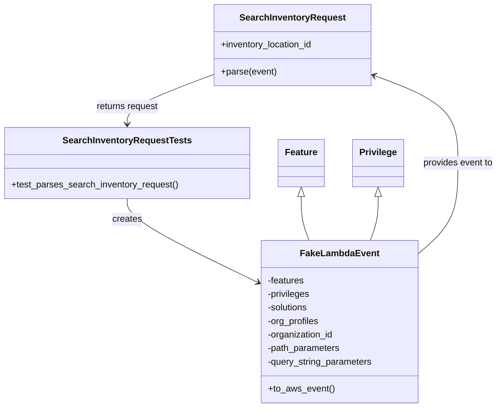
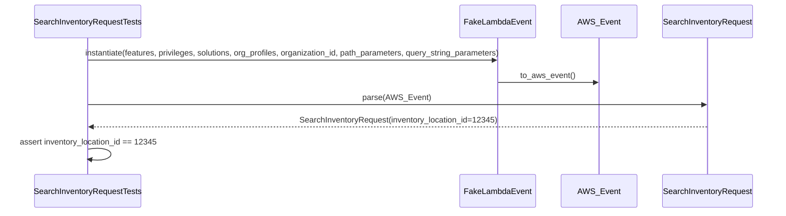

# Diagram: entity_core/entity_service/entity_inventory/entity_inventory_tests/unit/test_search_inventory_request.py

> Auto-generated by Obscura crawlers

## Diagram 1

### SVG

<svg id="container" width="873.8359375" xmlns="http://www.w3.org/2000/svg" class="classDiagram" height="722" viewBox="0 0 873.8359375 722" role="graphics-document document" aria-roledescription="class"><g><defs><marker id="container_class-aggregationStart" class="marker aggregation class" refX="18" refY="7" markerWidth="190" markerHeight="240" orient="auto"><path d="M 18,7 L9,13 L1,7 L9,1 Z"></path></marker></defs><defs><marker id="container_class-aggregationEnd" class="marker aggregation class" refX="1" refY="7" markerWidth="20" markerHeight="28" orient="auto"><path d="M 18,7 L9,13 L1,7 L9,1 Z"></path></marker></defs><defs><marker id="container_class-extensionStart" class="marker extension class" refX="18" refY="7" markerWidth="190" markerHeight="240" orient="auto"><path d="M 1,7 L18,13 V 1 Z"></path></marker></defs><defs><marker id="container_class-extensionEnd" class="marker extension class" refX="1" refY="7" markerWidth="20" markerHeight="28" orient="auto"><path d="M 1,1 V 13 L18,7 Z"></path></marker></defs><defs><marker id="container_class-compositionStart" class="marker composition class" refX="18" refY="7" markerWidth="190" markerHeight="240" orient="auto"><path d="M 18,7 L9,13 L1,7 L9,1 Z"></path></marker></defs><defs><marker id="container_class-compositionEnd" class="marker composition class" refX="1" refY="7" markerWidth="20" markerHeight="28" orient="auto"><path d="M 18,7 L9,13 L1,7 L9,1 Z"></path></marker></defs><defs><marker id="container_class-dependencyStart" class="marker dependency class" refX="6" refY="7" markerWidth="190" markerHeight="240" orient="auto"><path d="M 5,7 L9,13 L1,7 L9,1 Z"></path></marker></defs><defs><marker id="container_class-dependencyEnd" class="marker dependency class" refX="13" refY="7" markerWidth="20" markerHeight="28" orient="auto"><path d="M 18,7 L9,13 L14,7 L9,1 Z"></path></marker></defs><defs><marker id="container_class-lollipopStart" class="marker lollipop class" refX="13" refY="7" markerWidth="190" markerHeight="240" orient="auto"><circle stroke="black" fill="transparent" cx="7" cy="7" r="6"></circle></marker></defs><defs><marker id="container_class-lollipopEnd" class="marker lollipop class" refX="1" refY="7" markerWidth="190" markerHeight="240" orient="auto"><circle stroke="black" fill="transparent" cx="7" cy="7" r="6"></circle></marker></defs><g class="root"><g class="clusters"></g><g class="edgePaths"><path d="M222.996,352L222.996,358.167C222.996,364.333,222.996,376.667,260.743,401.248C298.489,425.829,373.982,462.658,411.728,481.073L449.475,499.488" id="id_SearchInventoryRequestTests_FakeLambdaEvent_1" class="edge-thickness-normal edge-pattern-solid relation" style=";;;" data-edge="true" data-et="edge" data-id="id_SearchInventoryRequestTests_FakeLambdaEvent_1" data-points="W3sieCI6MjIyLjk5NjA5Mzc1LCJ5IjozNTJ9LHsieCI6MjIyLjk5NjA5Mzc1LCJ5IjozODl9LHsieCI6NDU0Ljg2NzE4NzUsInkiOjUwMi4xMTgzMzAxNzQ3NzM2M31d" marker-end="url(#container_class-dependencyEnd)"></path><path d="M733.156,449.301L744.742,439.25C756.328,429.2,779.5,409.1,791.086,382.383C802.672,355.667,802.672,322.333,802.672,289C802.672,255.667,802.672,222.333,778.591,196.61C754.509,170.887,706.347,152.775,682.266,143.719L658.184,134.662" id="id_FakeLambdaEvent_SearchInventoryRequest_2" class="edge-thickness-normal edge-pattern-solid relation" style=";;;" data-edge="true" data-et="edge" data-id="id_FakeLambdaEvent_SearchInventoryRequest_2" data-points="W3sieCI6NzMzLjE1NjI1LCJ5Ijo0NDkuMzAwNTc4NDY3NTI5MX0seyJ4Ijo4MDIuNjcxODc1LCJ5IjozODl9LHsieCI6ODAyLjY3MTg3NSwieSI6Mjg5fSx7IngiOjgwMi42NzE4NzUsInkiOjE4OX0seyJ4Ijo2NTIuNTY4MzU5Mzc1LCJ5IjoxMzIuNTUwMjI2NzU2NjA1NTh9XQ==" marker-end="url(#container_class-dependencyEnd)"></path><path d="M373.1,132.55L348.082,141.959C323.065,151.367,273.031,170.183,248.013,184.758C222.996,199.333,222.996,209.667,222.996,214.833L222.996,220" id="id_SearchInventoryRequest_SearchInventoryRequestTests_3" class="edge-thickness-normal edge-pattern-solid relation" style=";;;" data-edge="true" data-et="edge" data-id="id_SearchInventoryRequest_SearchInventoryRequestTests_3" data-points="W3sieCI6MzczLjA5OTYwOTM3NSwieSI6MTMyLjU1MDIyNjc1NjYwNTU4fSx7IngiOjIyMi45OTYwOTM3NSwieSI6MTg5fSx7IngiOjIyMi45OTYwOTM3NSwieSI6MjI2fV0=" marker-end="url(#container_class-dependencyEnd)"></path><path d="M527.383,348.25L527.383,355.042C527.383,361.833,527.383,375.417,529.653,388.375C531.923,401.333,536.463,413.667,538.733,419.833L541.003,426" id="id_Feature_FakeLambdaEvent_4" class="edge-thickness-normal edge-pattern-solid relation" style=";;;" data-edge="true" data-et="edge" data-id="id_Feature_FakeLambdaEvent_4" data-points="W3sieCI6NTI3LjM4MjgxMjUsInkiOjMzMX0seyJ4Ijo1MjcuMzgyODEyNSwieSI6Mzg5fSx7IngiOjU0MS4wMDMwODYxNTMzMTQ5LCJ5Ijo0MjZ9XQ==" marker-start="url(#container_class-extensionStart)"></path><path d="M660.641,348.25L660.641,355.042C660.641,361.833,660.641,375.417,658.371,388.375C656.101,401.333,651.56,413.667,649.29,419.833L647.02,426" id="id_Privilege_FakeLambdaEvent_5" class="edge-thickness-normal edge-pattern-solid relation" style=";;;" data-edge="true" data-et="edge" data-id="id_Privilege_FakeLambdaEvent_5" data-points="W3sieCI6NjYwLjY0MDYyNSwieSI6MzMxfSx7IngiOjY2MC42NDA2MjUsInkiOjM4OX0seyJ4Ijo2NDcuMDIwMzUxMzQ2Njg1MSwieSI6NDI2fV0=" marker-start="url(#container_class-extensionStart)"></path></g><g class="edgeLabels"><g class="edgeLabel" transform="translate(222.99609375, 389)"><g class="label" data-id="id_SearchInventoryRequestTests_FakeLambdaEvent_1" transform="translate(-26.171875, -12)"><foreignObject width="52.34375" height="24">

creates

</foreignObject></g></g><g class="edgeLabel" transform="translate(802.671875, 289)"><g class="label" data-id="id_FakeLambdaEvent_SearchInventoryRequest_2" transform="translate(-63.1640625, -12)"><foreignObject width="126.328125" height="24">

provides event to

</foreignObject></g></g><g class="edgeLabel" transform="translate(222.99609375, 189)"><g class="label" data-id="id_SearchInventoryRequest_SearchInventoryRequestTests_3" transform="translate(-56.0234375, -12)"><foreignObject width="112.046875" height="24">

returns request

</foreignObject></g></g><g class="edgeLabel"><g class="label" data-id="id_Feature_FakeLambdaEvent_4" transform="translate(0, 0)"><foreignObject width="0" height="0">

</foreignObject></g></g><g class="edgeLabel"><g class="label" data-id="id_Privilege_FakeLambdaEvent_5" transform="translate(0, 0)"><foreignObject width="0" height="0">

</foreignObject></g></g></g><g class="nodes"><g class="node default" id="classId-SearchInventoryRequest-0" transform="translate(512.833984375, 80)"><g class="basic label-container"><path d="M-139.734375 -72 L139.734375 -72 L139.734375 72 L-139.734375 72" stroke="none" stroke-width="0" fill="#ECECFF" style=""></path><path d="M-139.734375 -72 C-69.17014294004572 -72, 1.394089119908557 -72, 139.734375 -72 M-139.734375 -72 C-37.4051651663723 -72, 64.9240446672554 -72, 139.734375 -72 M139.734375 -72 C139.734375 -38.09769208951216, 139.734375 -4.195384179024316, 139.734375 72 M139.734375 -72 C139.734375 -29.236604762528017, 139.734375 13.526790474943965, 139.734375 72 M139.734375 72 C30.38568407380164 72, -78.96300685239672 72, -139.734375 72 M139.734375 72 C28.079824124242208 72, -83.57472675151558 72, -139.734375 72 M-139.734375 72 C-139.734375 31.712276882127668, -139.734375 -8.575446235744664, -139.734375 -72 M-139.734375 72 C-139.734375 17.688545442274986, -139.734375 -36.62290911545003, -139.734375 -72" stroke="#9370DB" stroke-width="1.3" fill="none" stroke-dasharray="0 0" style=""></path></g><g class="annotation-group text" transform="translate(0, -48)"></g><g class="label-group text" transform="translate(-89.640625, -48)"><g class="label" style="font-weight: bolder" transform="translate(0,-12)"><foreignObject width="179.28125" height="24">

SearchInventoryRequest

</foreignObject></g></g><g class="members-group text" transform="translate(-127.734375, 0)"><g class="label" style="" transform="translate(0,-12)"><foreignObject width="165.828125" height="24">

+inventory_location_id

</foreignObject></g></g><g class="methods-group text" transform="translate(-127.734375, 48)"><g class="label" style="" transform="translate(0,-12)"><foreignObject width="98.875" height="24">

+parse(event)

</foreignObject></g></g><g class="divider" style=""><path d="M-139.734375 -24 C-41.636817349241454 -24, 56.46074030151709 -24, 139.734375 -24 M-139.734375 -24 C-64.91072606512536 -24, 9.91292286974928 -24, 139.734375 -24" stroke="#9370DB" stroke-width="1.3" fill="none" stroke-dasharray="0 0" style=""></path></g><g class="divider" style=""><path d="M-139.734375 24 C-74.89124870395989 24, -10.048122407919777 24, 139.734375 24 M-139.734375 24 C-55.20247452276412 24, 29.32942595447176 24, 139.734375 24" stroke="#9370DB" stroke-width="1.3" fill="none" stroke-dasharray="0 0" style=""></path></g></g><g class="node default" id="classId-FakeLambdaEvent-1" transform="translate(594.01171875, 570)"><g class="basic label-container"><path d="M-139.14453125 -144 L139.14453125 -144 L139.14453125 144 L-139.14453125 144" stroke="none" stroke-width="0" fill="#ECECFF" style=""></path><path d="M-139.14453125 -144 C-60.408508019593015 -144, 18.32751521081397 -144, 139.14453125 -144 M-139.14453125 -144 C-75.36110016876583 -144, -11.577669087531646 -144, 139.14453125 -144 M139.14453125 -144 C139.14453125 -32.893837043219776, 139.14453125 78.21232591356045, 139.14453125 144 M139.14453125 -144 C139.14453125 -49.92358665409357, 139.14453125 44.15282669181286, 139.14453125 144 M139.14453125 144 C49.913552600371986 144, -39.31742604925603 144, -139.14453125 144 M139.14453125 144 C75.47305443810615 144, 11.801577626212293 144, -139.14453125 144 M-139.14453125 144 C-139.14453125 51.50154862511809, -139.14453125 -40.99690274976382, -139.14453125 -144 M-139.14453125 144 C-139.14453125 44.43902186137457, -139.14453125 -55.12195627725086, -139.14453125 -144" stroke="#9370DB" stroke-width="1.3" fill="none" stroke-dasharray="0 0" style=""></path></g><g class="annotation-group text" transform="translate(0, -120)"></g><g class="label-group text" transform="translate(-65.8671875, -120)"><g class="label" style="font-weight: bolder" transform="translate(0,-12)"><foreignObject width="131.734375" height="24">

FakeLambdaEvent

</foreignObject></g></g><g class="members-group text" transform="translate(-127.14453125, -72)"><g class="label" style="" transform="translate(0,-12)"><foreignObject width="65.65625" height="24">

-features

</foreignObject></g><g class="label" style="" transform="translate(0,12)"><foreignObject width="76.609375" height="24">

-privileges

</foreignObject></g><g class="label" style="" transform="translate(0,36)"><foreignObject width="73.75" height="24">

-solutions

</foreignObject></g><g class="label" style="" transform="translate(0,60)"><foreignObject width="92.984375" height="24">

-org_profiles

</foreignObject></g><g class="label" style="" transform="translate(0,84)"><foreignObject width="119.203125" height="24">

-organization_id

</foreignObject></g><g class="label" style="" transform="translate(0,108)"><foreignObject width="130.4375" height="24">

-path_parameters

</foreignObject></g><g class="label" style="" transform="translate(0,132)"><foreignObject width="188.421875" height="24">

-query_string_parameters

</foreignObject></g></g><g class="methods-group text" transform="translate(-127.14453125, 120)"><g class="label" style="" transform="translate(0,-12)"><foreignObject width="116.421875" height="24">

+to_aws_event()

</foreignObject></g></g><g class="divider" style=""><path d="M-139.14453125 -96 C-59.607284999708796 -96, 19.92996125058241 -96, 139.14453125 -96 M-139.14453125 -96 C-46.46166455436165 -96, 46.221202141276706 -96, 139.14453125 -96" stroke="#9370DB" stroke-width="1.3" fill="none" stroke-dasharray="0 0" style=""></path></g><g class="divider" style=""><path d="M-139.14453125 96 C-53.011583273954926 96, 33.12136470209015 96, 139.14453125 96 M-139.14453125 96 C-53.98006125042123 96, 31.18440874915754 96, 139.14453125 96" stroke="#9370DB" stroke-width="1.3" fill="none" stroke-dasharray="0 0" style=""></path></g></g><g class="node default" id="classId-Feature-2" transform="translate(527.3828125, 289)"><g class="basic label-container"><path d="M-39.390625 -42 L39.390625 -42 L39.390625 42 L-39.390625 42" stroke="none" stroke-width="0" fill="#ECECFF" style=""></path><path d="M-39.390625 -42 C-16.988740508573944 -42, 5.413143982852112 -42, 39.390625 -42 M-39.390625 -42 C-21.599037632633262 -42, -3.8074502652665245 -42, 39.390625 -42 M39.390625 -42 C39.390625 -12.48411334760791, 39.390625 17.03177330478418, 39.390625 42 M39.390625 -42 C39.390625 -14.701055332709938, 39.390625 12.597889334580124, 39.390625 42 M39.390625 42 C18.396727949314776 42, -2.597169101370447 42, -39.390625 42 M39.390625 42 C15.150964660841709 42, -9.088695678316583 42, -39.390625 42 M-39.390625 42 C-39.390625 16.803209620578816, -39.390625 -8.393580758842369, -39.390625 -42 M-39.390625 42 C-39.390625 22.243064026156148, -39.390625 2.4861280523122957, -39.390625 -42" stroke="#9370DB" stroke-width="1.3" fill="none" stroke-dasharray="0 0" style=""></path></g><g class="annotation-group text" transform="translate(0, -18)"></g><g class="label-group text" transform="translate(-27.390625, -18)"><g class="label" style="font-weight: bolder" transform="translate(0,-12)"><foreignObject width="54.78125" height="24">

Feature

</foreignObject></g></g><g class="members-group text" transform="translate(-27.390625, 30)"></g><g class="methods-group text" transform="translate(-27.390625, 60)"></g><g class="divider" style=""><path d="M-39.390625 6 C-13.714329516997541 6, 11.961965966004918 6, 39.390625 6 M-39.390625 6 C-11.336613221986461 6, 16.717398556027078 6, 39.390625 6" stroke="#9370DB" stroke-width="1.3" fill="none" stroke-dasharray="0 0" style=""></path></g><g class="divider" style=""><path d="M-39.390625 24 C-13.719331942594437 24, 11.951961114811127 24, 39.390625 24 M-39.390625 24 C-23.264752073043464 24, -7.1388791460869285 24, 39.390625 24" stroke="#9370DB" stroke-width="1.3" fill="none" stroke-dasharray="0 0" style=""></path></g></g><g class="node default" id="classId-Privilege-3" transform="translate(660.640625, 289)"><g class="basic label-container"><path d="M-43.8671875 -42 L43.8671875 -42 L43.8671875 42 L-43.8671875 42" stroke="none" stroke-width="0" fill="#ECECFF" style=""></path><path d="M-43.8671875 -42 C-17.533188493277603 -42, 8.800810513444794 -42, 43.8671875 -42 M-43.8671875 -42 C-25.215757396242243 -42, -6.564327292484485 -42, 43.8671875 -42 M43.8671875 -42 C43.8671875 -19.219375577795855, 43.8671875 3.56124884440829, 43.8671875 42 M43.8671875 -42 C43.8671875 -21.331974178847158, 43.8671875 -0.6639483576943164, 43.8671875 42 M43.8671875 42 C12.828616904723969 42, -18.209953690552062 42, -43.8671875 42 M43.8671875 42 C12.929346770694071 42, -18.008493958611858 42, -43.8671875 42 M-43.8671875 42 C-43.8671875 11.779723425123446, -43.8671875 -18.440553149753107, -43.8671875 -42 M-43.8671875 42 C-43.8671875 18.387977827662244, -43.8671875 -5.224044344675512, -43.8671875 -42" stroke="#9370DB" stroke-width="1.3" fill="none" stroke-dasharray="0 0" style=""></path></g><g class="annotation-group text" transform="translate(0, -18)"></g><g class="label-group text" transform="translate(-31.8671875, -18)"><g class="label" style="font-weight: bolder" transform="translate(0,-12)"><foreignObject width="63.734375" height="24">

Privilege

</foreignObject></g></g><g class="members-group text" transform="translate(-31.8671875, 30)"></g><g class="methods-group text" transform="translate(-31.8671875, 60)"></g><g class="divider" style=""><path d="M-43.8671875 6 C-17.264520430879234 6, 9.338146638241533 6, 43.8671875 6 M-43.8671875 6 C-11.888329116952164 6, 20.090529266095672 6, 43.8671875 6" stroke="#9370DB" stroke-width="1.3" fill="none" stroke-dasharray="0 0" style=""></path></g><g class="divider" style=""><path d="M-43.8671875 24 C-23.265491365361367 24, -2.6637952307227337 24, 43.8671875 24 M-43.8671875 24 C-11.477421198398616 24, 20.912345103202767 24, 43.8671875 24" stroke="#9370DB" stroke-width="1.3" fill="none" stroke-dasharray="0 0" style=""></path></g></g><g class="node default" id="classId-SearchInventoryRequestTests-4" transform="translate(222.99609375, 289)"><g class="basic label-container"><path d="M-214.99609375 -63 L214.99609375 -63 L214.99609375 63 L-214.99609375 63" stroke="none" stroke-width="0" fill="#ECECFF" style=""></path><path d="M-214.99609375 -63 C-46.31099473998978 -63, 122.37410427002044 -63, 214.99609375 -63 M-214.99609375 -63 C-55.90598947086315 -63, 103.1841148082737 -63, 214.99609375 -63 M214.99609375 -63 C214.99609375 -17.198527834140428, 214.99609375 28.602944331719144, 214.99609375 63 M214.99609375 -63 C214.99609375 -37.20780719464318, 214.99609375 -11.415614389286361, 214.99609375 63 M214.99609375 63 C45.984201841659484 63, -123.02769006668103 63, -214.99609375 63 M214.99609375 63 C115.32344021489921 63, 15.650786679798415 63, -214.99609375 63 M-214.99609375 63 C-214.99609375 15.719405654898196, -214.99609375 -31.561188690203608, -214.99609375 -63 M-214.99609375 63 C-214.99609375 20.4113138328049, -214.99609375 -22.1773723343902, -214.99609375 -63" stroke="#9370DB" stroke-width="1.3" fill="none" stroke-dasharray="0 0" style=""></path></g><g class="annotation-group text" transform="translate(0, -39)"></g><g class="label-group text" transform="translate(-108.7578125, -39)"><g class="label" style="font-weight: bolder" transform="translate(0,-12)"><foreignObject width="217.515625" height="24">

SearchInventoryRequestTests

</foreignObject></g></g><g class="members-group text" transform="translate(-202.99609375, 9)"></g><g class="methods-group text" transform="translate(-202.99609375, 39)"><g class="label" style="" transform="translate(0,-12)"><foreignObject width="297.234375" height="24">

+test_parses_search_inventory_request()

</foreignObject></g></g><g class="divider" style=""><path d="M-214.99609375 -15 C-50.61259926571003 -15, 113.77089521857994 -15, 214.99609375 -15 M-214.99609375 -15 C-46.73280936523315 -15, 121.5304750195337 -15, 214.99609375 -15" stroke="#9370DB" stroke-width="1.3" fill="none" stroke-dasharray="0 0" style=""></path></g><g class="divider" style=""><path d="M-214.99609375 9 C-52.35236135897878 9, 110.29137103204243 9, 214.99609375 9 M-214.99609375 9 C-111.10762154801301 9, -7.219149346026029 9, 214.99609375 9" stroke="#9370DB" stroke-width="1.3" fill="none" stroke-dasharray="0 0" style=""></path></g></g></g></g></g></svg>

## Diagram 2

### SVG

<svg id="container" width="1665.5" xmlns="http://www.w3.org/2000/svg" height="441" viewBox="-67.5 -10 1665.5 441" role="graphics-document document" aria-roledescription="sequence"><g><rect x="1351" y="355" fill="#eaeaea" stroke="#666" width="197" height="65" name="Service" rx="3" ry="3" class="actor actor-bottom"></rect><text x="1449.5" y="387.5" dominant-baseline="central" alignment-baseline="central" class="actor actor-box" style="text-anchor: middle; font-size: 16px; font-weight: 400;"><tspan x="1449.5" dy="0">SearchInventoryRequest</tspan></text></g><g><rect x="1151" y="355" fill="#eaeaea" stroke="#666" width="150" height="65" name="AWS" rx="3" ry="3" class="actor actor-bottom"></rect><text x="1226" y="387.5" dominant-baseline="central" alignment-baseline="central" class="actor actor-box" style="text-anchor: middle; font-size: 16px; font-weight: 400;"><tspan x="1226" dy="0">AWS_Event</tspan></text></g><g><rect x="950" y="355" fill="#eaeaea" stroke="#666" width="151" height="65" name="Event" rx="3" ry="3" class="actor actor-bottom"></rect><text x="1025.5" y="387.5" dominant-baseline="central" alignment-baseline="central" class="actor actor-box" style="text-anchor: middle; font-size: 16px; font-weight: 400;"><tspan x="1025.5" dy="0">FakeLambdaEvent</tspan></text></g><g><rect x="0" y="355" fill="#eaeaea" stroke="#666" width="233" height="65" name="Test" rx="3" ry="3" class="actor actor-bottom"></rect><text x="116.5" y="387.5" dominant-baseline="central" alignment-baseline="central" class="actor actor-box" style="text-anchor: middle; font-size: 16px; font-weight: 400;"><tspan x="116.5" dy="0">SearchInventoryRequestTests</tspan></text></g><g><line id="actor3" x1="1449.5" y1="65" x2="1449.5" y2="355" class="actor-line 200" stroke-width="0.5px" stroke="#999" name="Service"></line><g id="root-3"><rect x="1351" y="0" fill="#eaeaea" stroke="#666" width="197" height="65" name="Service" rx="3" ry="3" class="actor actor-top"></rect><text x="1449.5" y="32.5" dominant-baseline="central" alignment-baseline="central" class="actor actor-box" style="text-anchor: middle; font-size: 16px; font-weight: 400;"><tspan x="1449.5" dy="0">SearchInventoryRequest</tspan></text></g></g><g><line id="actor2" x1="1226" y1="65" x2="1226" y2="355" class="actor-line 200" stroke-width="0.5px" stroke="#999" name="AWS"></line><g id="root-2"><rect x="1151" y="0" fill="#eaeaea" stroke="#666" width="150" height="65" name="AWS" rx="3" ry="3" class="actor actor-top"></rect><text x="1226" y="32.5" dominant-baseline="central" alignment-baseline="central" class="actor actor-box" style="text-anchor: middle; font-size: 16px; font-weight: 400;"><tspan x="1226" dy="0">AWS_Event</tspan></text></g></g><g><line id="actor1" x1="1025.5" y1="65" x2="1025.5" y2="355" class="actor-line 200" stroke-width="0.5px" stroke="#999" name="Event"></line><g id="root-1"><rect x="950" y="0" fill="#eaeaea" stroke="#666" width="151" height="65" name="Event" rx="3" ry="3" class="actor actor-top"></rect><text x="1025.5" y="32.5" dominant-baseline="central" alignment-baseline="central" class="actor actor-box" style="text-anchor: middle; font-size: 16px; font-weight: 400;"><tspan x="1025.5" dy="0">FakeLambdaEvent</tspan></text></g></g><g><line id="actor0" x1="116.5" y1="65" x2="116.5" y2="355" class="actor-line 200" stroke-width="0.5px" stroke="#999" name="Test"></line><g id="root-0"><rect x="0" y="0" fill="#eaeaea" stroke="#666" width="233" height="65" name="Test" rx="3" ry="3" class="actor actor-top"></rect><text x="116.5" y="32.5" dominant-baseline="central" alignment-baseline="central" class="actor actor-box" style="text-anchor: middle; font-size: 16px; font-weight: 400;"><tspan x="116.5" dy="0">SearchInventoryRequestTests</tspan></text></g></g><g></g><defs><symbol id="computer" width="24" height="24"><path transform="scale(.5)" d="M2 2v13h20v-13h-20zm18 11h-16v-9h16v9zm-10.228 6l.466-1h3.524l.467 1h-4.457zm14.228 3h-24l2-6h2.104l-1.33 4h18.45l-1.297-4h2.073l2 6zm-5-10h-14v-7h14v7z"></path></symbol></defs><defs><symbol id="database" fill-rule="evenodd" clip-rule="evenodd"><path transform="scale(.5)" d="M12.258.001l.256.004.255.005.253.008.251.01.249.012.247.015.246.016.242.019.241.02.239.023.236.024.233.027.231.028.229.031.225.032.223.034.22.036.217.038.214.04.211.041.208.043.205.045.201.046.198.048.194.05.191.051.187.053.183.054.18.056.175.057.172.059.168.06.163.061.16.063.155.064.15.066.074.033.073.033.071.034.07.034.069.035.068.035.067.035.066.035.064.036.064.036.062.036.06.036.06.037.058.037.058.037.055.038.055.038.053.038.052.038.051.039.05.039.048.039.047.039.045.04.044.04.043.04.041.04.04.041.039.041.037.041.036.041.034.041.033.042.032.042.03.042.029.042.027.042.026.043.024.043.023.043.021.043.02.043.018.044.017.043.015.044.013.044.012.044.011.045.009.044.007.045.006.045.004.045.002.045.001.045v17l-.001.045-.002.045-.004.045-.006.045-.007.045-.009.044-.011.045-.012.044-.013.044-.015.044-.017.043-.018.044-.02.043-.021.043-.023.043-.024.043-.026.043-.027.042-.029.042-.03.042-.032.042-.033.042-.034.041-.036.041-.037.041-.039.041-.04.041-.041.04-.043.04-.044.04-.045.04-.047.039-.048.039-.05.039-.051.039-.052.038-.053.038-.055.038-.055.038-.058.037-.058.037-.06.037-.06.036-.062.036-.064.036-.064.036-.066.035-.067.035-.068.035-.069.035-.07.034-.071.034-.073.033-.074.033-.15.066-.155.064-.16.063-.163.061-.168.06-.172.059-.175.057-.18.056-.183.054-.187.053-.191.051-.194.05-.198.048-.201.046-.205.045-.208.043-.211.041-.214.04-.217.038-.22.036-.223.034-.225.032-.229.031-.231.028-.233.027-.236.024-.239.023-.241.02-.242.019-.246.016-.247.015-.249.012-.251.01-.253.008-.255.005-.256.004-.258.001-.258-.001-.256-.004-.255-.005-.253-.008-.251-.01-.249-.012-.247-.015-.245-.016-.243-.019-.241-.02-.238-.023-.236-.024-.234-.027-.231-.028-.228-.031-.226-.032-.223-.034-.22-.036-.217-.038-.214-.04-.211-.041-.208-.043-.204-.045-.201-.046-.198-.048-.195-.05-.19-.051-.187-.053-.184-.054-.179-.056-.176-.057-.172-.059-.167-.06-.164-.061-.159-.063-.155-.064-.151-.066-.074-.033-.072-.033-.072-.034-.07-.034-.069-.035-.068-.035-.067-.035-.066-.035-.064-.036-.063-.036-.062-.036-.061-.036-.06-.037-.058-.037-.057-.037-.056-.038-.055-.038-.053-.038-.052-.038-.051-.039-.049-.039-.049-.039-.046-.039-.046-.04-.044-.04-.043-.04-.041-.04-.04-.041-.039-.041-.037-.041-.036-.041-.034-.041-.033-.042-.032-.042-.03-.042-.029-.042-.027-.042-.026-.043-.024-.043-.023-.043-.021-.043-.02-.043-.018-.044-.017-.043-.015-.044-.013-.044-.012-.044-.011-.045-.009-.044-.007-.045-.006-.045-.004-.045-.002-.045-.001-.045v-17l.001-.045.002-.045.004-.045.006-.045.007-.045.009-.044.011-.045.012-.044.013-.044.015-.044.017-.043.018-.044.02-.043.021-.043.023-.043.024-.043.026-.043.027-.042.029-.042.03-.042.032-.042.033-.042.034-.041.036-.041.037-.041.039-.041.04-.041.041-.04.043-.04.044-.04.046-.04.046-.039.049-.039.049-.039.051-.039.052-.038.053-.038.055-.038.056-.038.057-.037.058-.037.06-.037.061-.036.062-.036.063-.036.064-.036.066-.035.067-.035.068-.035.069-.035.07-.034.072-.034.072-.033.074-.033.151-.066.155-.064.159-.063.164-.061.167-.06.172-.059.176-.057.179-.056.184-.054.187-.053.19-.051.195-.05.198-.048.201-.046.204-.045.208-.043.211-.041.214-.04.217-.038.22-.036.223-.034.226-.032.228-.031.231-.028.234-.027.236-.024.238-.023.241-.02.243-.019.245-.016.247-.015.249-.012.251-.01.253-.008.255-.005.256-.004.258-.001.258.001zm-9.258 20.499v.01l.001.021.003.021.004.022.005.021.006.022.007.022.009.023.01.022.011.023.012.023.013.023.015.023.016.024.017.023.018.024.019.024.021.024.022.025.023.024.024.025.052.049.056.05.061.051.066.051.07.051.075.051.079.052.084.052.088.052.092.052.097.052.102.051.105.052.11.052.114.051.119.051.123.051.127.05.131.05.135.05.139.048.144.049.147.047.152.047.155.047.16.045.163.045.167.043.171.043.176.041.178.041.183.039.187.039.19.037.194.035.197.035.202.033.204.031.209.03.212.029.216.027.219.025.222.024.226.021.23.02.233.018.236.016.24.015.243.012.246.01.249.008.253.005.256.004.259.001.26-.001.257-.004.254-.005.25-.008.247-.011.244-.012.241-.014.237-.016.233-.018.231-.021.226-.021.224-.024.22-.026.216-.027.212-.028.21-.031.205-.031.202-.034.198-.034.194-.036.191-.037.187-.039.183-.04.179-.04.175-.042.172-.043.168-.044.163-.045.16-.046.155-.046.152-.047.148-.048.143-.049.139-.049.136-.05.131-.05.126-.05.123-.051.118-.052.114-.051.11-.052.106-.052.101-.052.096-.052.092-.052.088-.053.083-.051.079-.052.074-.052.07-.051.065-.051.06-.051.056-.05.051-.05.023-.024.023-.025.021-.024.02-.024.019-.024.018-.024.017-.024.015-.023.014-.024.013-.023.012-.023.01-.023.01-.022.008-.022.006-.022.006-.022.004-.022.004-.021.001-.021.001-.021v-4.127l-.077.055-.08.053-.083.054-.085.053-.087.052-.09.052-.093.051-.095.05-.097.05-.1.049-.102.049-.105.048-.106.047-.109.047-.111.046-.114.045-.115.045-.118.044-.12.043-.122.042-.124.042-.126.041-.128.04-.13.04-.132.038-.134.038-.135.037-.138.037-.139.035-.142.035-.143.034-.144.033-.147.032-.148.031-.15.03-.151.03-.153.029-.154.027-.156.027-.158.026-.159.025-.161.024-.162.023-.163.022-.165.021-.166.02-.167.019-.169.018-.169.017-.171.016-.173.015-.173.014-.175.013-.175.012-.177.011-.178.01-.179.008-.179.008-.181.006-.182.005-.182.004-.184.003-.184.002h-.37l-.184-.002-.184-.003-.182-.004-.182-.005-.181-.006-.179-.008-.179-.008-.178-.01-.176-.011-.176-.012-.175-.013-.173-.014-.172-.015-.171-.016-.17-.017-.169-.018-.167-.019-.166-.02-.165-.021-.163-.022-.162-.023-.161-.024-.159-.025-.157-.026-.156-.027-.155-.027-.153-.029-.151-.03-.15-.03-.148-.031-.146-.032-.145-.033-.143-.034-.141-.035-.14-.035-.137-.037-.136-.037-.134-.038-.132-.038-.13-.04-.128-.04-.126-.041-.124-.042-.122-.042-.12-.044-.117-.043-.116-.045-.113-.045-.112-.046-.109-.047-.106-.047-.105-.048-.102-.049-.1-.049-.097-.05-.095-.05-.093-.052-.09-.051-.087-.052-.085-.053-.083-.054-.08-.054-.077-.054v4.127zm0-5.654v.011l.001.021.003.021.004.021.005.022.006.022.007.022.009.022.01.022.011.023.012.023.013.023.015.024.016.023.017.024.018.024.019.024.021.024.022.024.023.025.024.024.052.05.056.05.061.05.066.051.07.051.075.052.079.051.084.052.088.052.092.052.097.052.102.052.105.052.11.051.114.051.119.052.123.05.127.051.131.05.135.049.139.049.144.048.147.048.152.047.155.046.16.045.163.045.167.044.171.042.176.042.178.04.183.04.187.038.19.037.194.036.197.034.202.033.204.032.209.03.212.028.216.027.219.025.222.024.226.022.23.02.233.018.236.016.24.014.243.012.246.01.249.008.253.006.256.003.259.001.26-.001.257-.003.254-.006.25-.008.247-.01.244-.012.241-.015.237-.016.233-.018.231-.02.226-.022.224-.024.22-.025.216-.027.212-.029.21-.03.205-.032.202-.033.198-.035.194-.036.191-.037.187-.039.183-.039.179-.041.175-.042.172-.043.168-.044.163-.045.16-.045.155-.047.152-.047.148-.048.143-.048.139-.05.136-.049.131-.05.126-.051.123-.051.118-.051.114-.052.11-.052.106-.052.101-.052.096-.052.092-.052.088-.052.083-.052.079-.052.074-.051.07-.052.065-.051.06-.05.056-.051.051-.049.023-.025.023-.024.021-.025.02-.024.019-.024.018-.024.017-.024.015-.023.014-.023.013-.024.012-.022.01-.023.01-.023.008-.022.006-.022.006-.022.004-.021.004-.022.001-.021.001-.021v-4.139l-.077.054-.08.054-.083.054-.085.052-.087.053-.09.051-.093.051-.095.051-.097.05-.1.049-.102.049-.105.048-.106.047-.109.047-.111.046-.114.045-.115.044-.118.044-.12.044-.122.042-.124.042-.126.041-.128.04-.13.039-.132.039-.134.038-.135.037-.138.036-.139.036-.142.035-.143.033-.144.033-.147.033-.148.031-.15.03-.151.03-.153.028-.154.028-.156.027-.158.026-.159.025-.161.024-.162.023-.163.022-.165.021-.166.02-.167.019-.169.018-.169.017-.171.016-.173.015-.173.014-.175.013-.175.012-.177.011-.178.009-.179.009-.179.007-.181.007-.182.005-.182.004-.184.003-.184.002h-.37l-.184-.002-.184-.003-.182-.004-.182-.005-.181-.007-.179-.007-.179-.009-.178-.009-.176-.011-.176-.012-.175-.013-.173-.014-.172-.015-.171-.016-.17-.017-.169-.018-.167-.019-.166-.02-.165-.021-.163-.022-.162-.023-.161-.024-.159-.025-.157-.026-.156-.027-.155-.028-.153-.028-.151-.03-.15-.03-.148-.031-.146-.033-.145-.033-.143-.033-.141-.035-.14-.036-.137-.036-.136-.037-.134-.038-.132-.039-.13-.039-.128-.04-.126-.041-.124-.042-.122-.043-.12-.043-.117-.044-.116-.044-.113-.046-.112-.046-.109-.046-.106-.047-.105-.048-.102-.049-.1-.049-.097-.05-.095-.051-.093-.051-.09-.051-.087-.053-.085-.052-.083-.054-.08-.054-.077-.054v4.139zm0-5.666v.011l.001.02.003.022.004.021.005.022.006.021.007.022.009.023.01.022.011.023.012.023.013.023.015.023.016.024.017.024.018.023.019.024.021.025.022.024.023.024.024.025.052.05.056.05.061.05.066.051.07.051.075.052.079.051.084.052.088.052.092.052.097.052.102.052.105.051.11.052.114.051.119.051.123.051.127.05.131.05.135.05.139.049.144.048.147.048.152.047.155.046.16.045.163.045.167.043.171.043.176.042.178.04.183.04.187.038.19.037.194.036.197.034.202.033.204.032.209.03.212.028.216.027.219.025.222.024.226.021.23.02.233.018.236.017.24.014.243.012.246.01.249.008.253.006.256.003.259.001.26-.001.257-.003.254-.006.25-.008.247-.01.244-.013.241-.014.237-.016.233-.018.231-.02.226-.022.224-.024.22-.025.216-.027.212-.029.21-.03.205-.032.202-.033.198-.035.194-.036.191-.037.187-.039.183-.039.179-.041.175-.042.172-.043.168-.044.163-.045.16-.045.155-.047.152-.047.148-.048.143-.049.139-.049.136-.049.131-.051.126-.05.123-.051.118-.052.114-.051.11-.052.106-.052.101-.052.096-.052.092-.052.088-.052.083-.052.079-.052.074-.052.07-.051.065-.051.06-.051.056-.05.051-.049.023-.025.023-.025.021-.024.02-.024.019-.024.018-.024.017-.024.015-.023.014-.024.013-.023.012-.023.01-.022.01-.023.008-.022.006-.022.006-.022.004-.022.004-.021.001-.021.001-.021v-4.153l-.077.054-.08.054-.083.053-.085.053-.087.053-.09.051-.093.051-.095.051-.097.05-.1.049-.102.048-.105.048-.106.048-.109.046-.111.046-.114.046-.115.044-.118.044-.12.043-.122.043-.124.042-.126.041-.128.04-.13.039-.132.039-.134.038-.135.037-.138.036-.139.036-.142.034-.143.034-.144.033-.147.032-.148.032-.15.03-.151.03-.153.028-.154.028-.156.027-.158.026-.159.024-.161.024-.162.023-.163.023-.165.021-.166.02-.167.019-.169.018-.169.017-.171.016-.173.015-.173.014-.175.013-.175.012-.177.01-.178.01-.179.009-.179.007-.181.006-.182.006-.182.004-.184.003-.184.001-.185.001-.185-.001-.184-.001-.184-.003-.182-.004-.182-.006-.181-.006-.179-.007-.179-.009-.178-.01-.176-.01-.176-.012-.175-.013-.173-.014-.172-.015-.171-.016-.17-.017-.169-.018-.167-.019-.166-.02-.165-.021-.163-.023-.162-.023-.161-.024-.159-.024-.157-.026-.156-.027-.155-.028-.153-.028-.151-.03-.15-.03-.148-.032-.146-.032-.145-.033-.143-.034-.141-.034-.14-.036-.137-.036-.136-.037-.134-.038-.132-.039-.13-.039-.128-.041-.126-.041-.124-.041-.122-.043-.12-.043-.117-.044-.116-.044-.113-.046-.112-.046-.109-.046-.106-.048-.105-.048-.102-.048-.1-.05-.097-.049-.095-.051-.093-.051-.09-.052-.087-.052-.085-.053-.083-.053-.08-.054-.077-.054v4.153zm8.74-8.179l-.257.004-.254.005-.25.008-.247.011-.244.012-.241.014-.237.016-.233.018-.231.021-.226.022-.224.023-.22.026-.216.027-.212.028-.21.031-.205.032-.202.033-.198.034-.194.036-.191.038-.187.038-.183.04-.179.041-.175.042-.172.043-.168.043-.163.045-.16.046-.155.046-.152.048-.148.048-.143.048-.139.049-.136.05-.131.05-.126.051-.123.051-.118.051-.114.052-.11.052-.106.052-.101.052-.096.052-.092.052-.088.052-.083.052-.079.052-.074.051-.07.052-.065.051-.06.05-.056.05-.051.05-.023.025-.023.024-.021.024-.02.025-.019.024-.018.024-.017.023-.015.024-.014.023-.013.023-.012.023-.01.023-.01.022-.008.022-.006.023-.006.021-.004.022-.004.021-.001.021-.001.021.001.021.001.021.004.021.004.022.006.021.006.023.008.022.01.022.01.023.012.023.013.023.014.023.015.024.017.023.018.024.019.024.02.025.021.024.023.024.023.025.051.05.056.05.06.05.065.051.07.052.074.051.079.052.083.052.088.052.092.052.096.052.101.052.106.052.11.052.114.052.118.051.123.051.126.051.131.05.136.05.139.049.143.048.148.048.152.048.155.046.16.046.163.045.168.043.172.043.175.042.179.041.183.04.187.038.191.038.194.036.198.034.202.033.205.032.21.031.212.028.216.027.22.026.224.023.226.022.231.021.233.018.237.016.241.014.244.012.247.011.25.008.254.005.257.004.26.001.26-.001.257-.004.254-.005.25-.008.247-.011.244-.012.241-.014.237-.016.233-.018.231-.021.226-.022.224-.023.22-.026.216-.027.212-.028.21-.031.205-.032.202-.033.198-.034.194-.036.191-.038.187-.038.183-.04.179-.041.175-.042.172-.043.168-.043.163-.045.16-.046.155-.046.152-.048.148-.048.143-.048.139-.049.136-.05.131-.05.126-.051.123-.051.118-.051.114-.052.11-.052.106-.052.101-.052.096-.052.092-.052.088-.052.083-.052.079-.052.074-.051.07-.052.065-.051.06-.05.056-.05.051-.05.023-.025.023-.024.021-.024.02-.025.019-.024.018-.024.017-.023.015-.024.014-.023.013-.023.012-.023.01-.023.01-.022.008-.022.006-.023.006-.021.004-.022.004-.021.001-.021.001-.021-.001-.021-.001-.021-.004-.021-.004-.022-.006-.021-.006-.023-.008-.022-.01-.022-.01-.023-.012-.023-.013-.023-.014-.023-.015-.024-.017-.023-.018-.024-.019-.024-.02-.025-.021-.024-.023-.024-.023-.025-.051-.05-.056-.05-.06-.05-.065-.051-.07-.052-.074-.051-.079-.052-.083-.052-.088-.052-.092-.052-.096-.052-.101-.052-.106-.052-.11-.052-.114-.052-.118-.051-.123-.051-.126-.051-.131-.05-.136-.05-.139-.049-.143-.048-.148-.048-.152-.048-.155-.046-.16-.046-.163-.045-.168-.043-.172-.043-.175-.042-.179-.041-.183-.04-.187-.038-.191-.038-.194-.036-.198-.034-.202-.033-.205-.032-.21-.031-.212-.028-.216-.027-.22-.026-.224-.023-.226-.022-.231-.021-.233-.018-.237-.016-.241-.014-.244-.012-.247-.011-.25-.008-.254-.005-.257-.004-.26-.001-.26.001z"></path></symbol></defs><defs><symbol id="clock" width="24" height="24"><path transform="scale(.5)" d="M12 2c5.514 0 10 4.486 10 10s-4.486 10-10 10-10-4.486-10-10 4.486-10 10-10zm0-2c-6.627 0-12 5.373-12 12s5.373 12 12 12 12-5.373 12-12-5.373-12-12-12zm5.848 12.459c.202.038.202.333.001.372-1.907.361-6.045 1.111-6.547 1.111-.719 0-1.301-.582-1.301-1.301 0-.512.77-5.447 1.125-7.445.034-.192.312-.181.343.014l.985 6.238 5.394 1.011z"></path></symbol></defs><defs><marker id="arrowhead" refX="7.9" refY="5" markerUnits="userSpaceOnUse" markerWidth="12" markerHeight="12" orient="auto-start-reverse"><path d="M -1 0 L 10 5 L 0 10 z"></path></marker></defs><defs><marker id="crosshead" markerWidth="15" markerHeight="8" orient="auto" refX="4" refY="4.5"><path fill="none" stroke="#000000" stroke-width="1pt" d="M 1,2 L 6,7 M 6,2 L 1,7" style="stroke-dasharray: 0, 0;"></path></marker></defs><defs><marker id="filled-head" refX="15.5" refY="7" markerWidth="20" markerHeight="28" orient="auto"><path d="M 18,7 L9,13 L14,7 L9,1 Z"></path></marker></defs><defs><marker id="sequencenumber" refX="15" refY="15" markerWidth="60" markerHeight="40" orient="auto"><circle cx="15" cy="15" r="6"></circle></marker></defs><text x="570" y="80" text-anchor="middle" dominant-baseline="middle" alignment-baseline="middle" class="messageText" dy="1em" style="font-size: 16px; font-weight: 400;">instantiate(features, privileges, solutions, org_profiles, organization_id, path_parameters, query_string_parameters)</text><line x1="117.5" y1="113" x2="1021.5" y2="113" class="messageLine0" stroke-width="2" stroke="none" marker-end="url(#arrowhead)" style="fill: none;"></line><text x="1124" y="128" text-anchor="middle" dominant-baseline="middle" alignment-baseline="middle" class="messageText" dy="1em" style="font-size: 16px; font-weight: 400;">to_aws_event()</text><line x1="1026.5" y1="161" x2="1222" y2="161" class="messageLine0" stroke-width="2" stroke="none" marker-end="url(#arrowhead)" style="fill: none;"></line><text x="782" y="176" text-anchor="middle" dominant-baseline="middle" alignment-baseline="middle" class="messageText" dy="1em" style="font-size: 16px; font-weight: 400;">parse(AWS_Event)</text><line x1="117.5" y1="209" x2="1445.5" y2="209" class="messageLine0" stroke-width="2" stroke="none" marker-end="url(#arrowhead)" style="fill: none;"></line><text x="785" y="224" text-anchor="middle" dominant-baseline="middle" alignment-baseline="middle" class="messageText" dy="1em" style="font-size: 16px; font-weight: 400;">SearchInventoryRequest(inventory_location_id=12345)</text><line x1="1448.5" y1="257" x2="120.5" y2="257" class="messageLine1" stroke-width="2" stroke="none" marker-end="url(#arrowhead)" style="stroke-dasharray: 3, 3; fill: none;"></line><text x="118" y="272" text-anchor="middle" dominant-baseline="middle" alignment-baseline="middle" class="messageText" dy="1em" style="font-size: 16px; font-weight: 400;">assert inventory_location_id == 12345</text><path d="M 117.5,305 C 177.5,295 177.5,335 117.5,325" class="messageLine0" stroke-width="2" stroke="none" marker-end="url(#arrowhead)" style="fill: none;"></path></svg>
