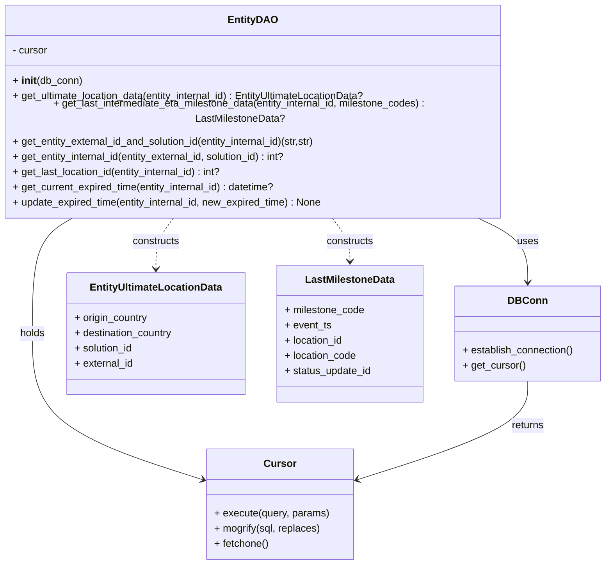
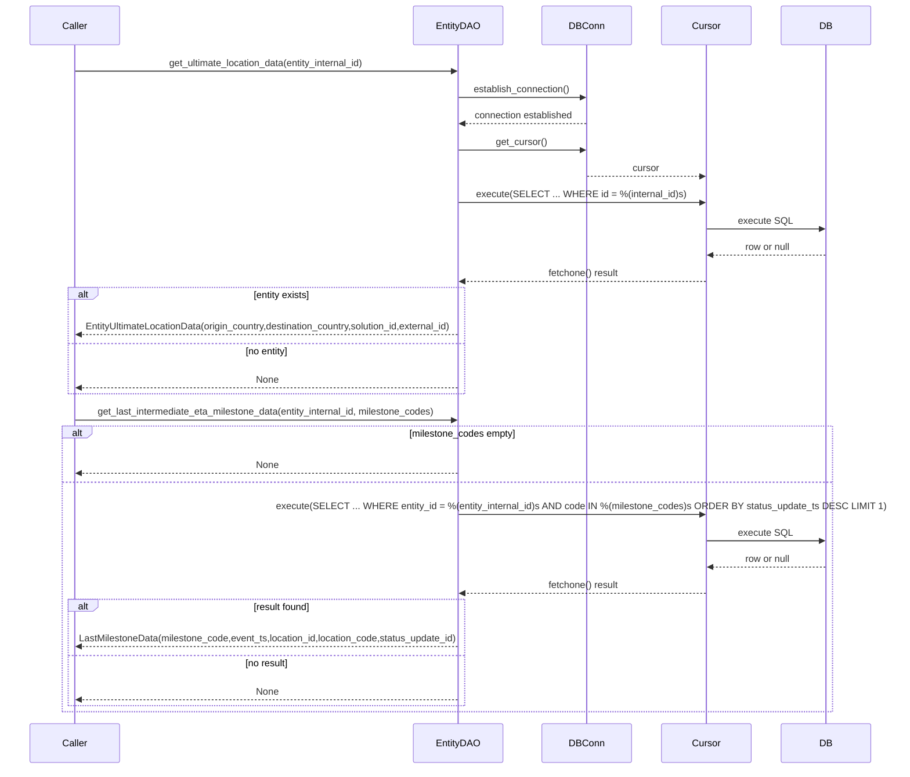

# Diagram: entity_core/entity_service/entity_listener/entity_listener_service/db/daos/entity_dao.py


> Auto-generated by Obscura crawlers

## Diagram 1



### SVG

<svg id="container" width="967.1015625" xmlns="http://www.w3.org/2000/svg" class="classDiagram" height="866" viewBox="0 0 967.1015625 866" role="graphics-document document" aria-roledescription="class"><style>#container{font-family:"trebuchet ms",verdana,arial,sans-serif;font-size:16px;fill:#333;}@keyframes edge-animation-frame{from{stroke-dashoffset:0;}}@keyframes dash{to{stroke-dashoffset:0;}}#container .edge-animation-slow{stroke-dasharray:9,5!important;stroke-dashoffset:900;animation:dash 50s linear infinite;stroke-linecap:round;}#container .edge-animation-fast{stroke-dasharray:9,5!important;stroke-dashoffset:900;animation:dash 20s linear infinite;stroke-linecap:round;}#container .error-icon{fill:#552222;}#container .error-text{fill:#552222;stroke:#552222;}#container .edge-thickness-normal{stroke-width:1px;}#container .edge-thickness-thick{stroke-width:3.5px;}#container .edge-pattern-solid{stroke-dasharray:0;}#container .edge-thickness-invisible{stroke-width:0;fill:none;}#container .edge-pattern-dashed{stroke-dasharray:3;}#container .edge-pattern-dotted{stroke-dasharray:2;}#container .marker{fill:#333333;stroke:#333333;}#container .marker.cross{stroke:#333333;}#container svg{font-family:"trebuchet ms",verdana,arial,sans-serif;font-size:16px;}#container p{margin:0;}#container g.classGroup text{fill:#9370DB;stroke:none;font-family:"trebuchet ms",verdana,arial,sans-serif;font-size:10px;}#container g.classGroup text .title{font-weight:bolder;}#container .nodeLabel,#container .edgeLabel{color:#131300;}#container .edgeLabel .label rect{fill:#ECECFF;}#container .label text{fill:#131300;}#container .labelBkg{background:#ECECFF;}#container .edgeLabel .label span{background:#ECECFF;}#container .classTitle{font-weight:bolder;}#container .node rect,#container .node circle,#container .node ellipse,#container .node polygon,#container .node path{fill:#ECECFF;stroke:#9370DB;stroke-width:1px;}#container .divider{stroke:#9370DB;stroke-width:1;}#container g.clickable{cursor:pointer;}#container g.classGroup rect{fill:#ECECFF;stroke:#9370DB;}#container g.classGroup line{stroke:#9370DB;stroke-width:1;}#container .classLabel .box{stroke:none;stroke-width:0;fill:#ECECFF;opacity:0.5;}#container .classLabel .label{fill:#9370DB;font-size:10px;}#container .relation{stroke:#333333;stroke-width:1;fill:none;}#container .dashed-line{stroke-dasharray:3;}#container .dotted-line{stroke-dasharray:1 2;}#container #compositionStart,#container .composition{fill:#333333!important;stroke:#333333!important;stroke-width:1;}#container #compositionEnd,#container .composition{fill:#333333!important;stroke:#333333!important;stroke-width:1;}#container #dependencyStart,#container .dependency{fill:#333333!important;stroke:#333333!important;stroke-width:1;}#container #dependencyStart,#container .dependency{fill:#333333!important;stroke:#333333!important;stroke-width:1;}#container #extensionStart,#container .extension{fill:transparent!important;stroke:#333333!important;stroke-width:1;}#container #extensionEnd,#container .extension{fill:transparent!important;stroke:#333333!important;stroke-width:1;}#container #aggregationStart,#container .aggregation{fill:transparent!important;stroke:#333333!important;stroke-width:1;}#container #aggregationEnd,#container .aggregation{fill:transparent!important;stroke:#333333!important;stroke-width:1;}#container #lollipopStart,#container .lollipop{fill:#ECECFF!important;stroke:#333333!important;stroke-width:1;}#container #lollipopEnd,#container .lollipop{fill:#ECECFF!important;stroke:#333333!important;stroke-width:1;}#container .edgeTerminals{font-size:11px;line-height:initial;}#container .classTitleText{text-anchor:middle;font-size:18px;fill:#333;}#container .label-icon{display:inline-block;height:1em;overflow:visible;vertical-align:-0.125em;}#container .node .label-icon path{fill:currentColor;stroke:revert;stroke-width:revert;}#container :root{--mermaid-font-family:"trebuchet ms",verdana,arial,sans-serif;}</style><g><defs><marker id="container_class-aggregationStart" class="marker aggregation class" refX="18" refY="7" markerWidth="190" markerHeight="240" orient="auto"><path d="M 18,7 L9,13 L1,7 L9,1 Z"></path></marker></defs><defs><marker id="container_class-aggregationEnd" class="marker aggregation class" refX="1" refY="7" markerWidth="20" markerHeight="28" orient="auto"><path d="M 18,7 L9,13 L1,7 L9,1 Z"></path></marker></defs><defs><marker id="container_class-extensionStart" class="marker extension class" refX="18" refY="7" markerWidth="190" markerHeight="240" orient="auto"><path d="M 1,7 L18,13 V 1 Z"></path></marker></defs><defs><marker id="container_class-extensionEnd" class="marker extension class" refX="1" refY="7" markerWidth="20" markerHeight="28" orient="auto"><path d="M 1,1 V 13 L18,7 Z"></path></marker></defs><defs><marker id="container_class-compositionStart" class="marker composition class" refX="18" refY="7" markerWidth="190" markerHeight="240" orient="auto"><path d="M 18,7 L9,13 L1,7 L9,1 Z"></path></marker></defs><defs><marker id="container_class-compositionEnd" class="marker composition class" refX="1" refY="7" markerWidth="20" markerHeight="28" orient="auto"><path d="M 18,7 L9,13 L1,7 L9,1 Z"></path></marker></defs><defs><marker id="container_class-dependencyStart" class="marker dependency class" refX="6" refY="7" markerWidth="190" markerHeight="240" orient="auto"><path d="M 5,7 L9,13 L1,7 L9,1 Z"></path></marker></defs><defs><marker id="container_class-dependencyEnd" class="marker dependency class" refX="13" refY="7" markerWidth="20" markerHeight="28" orient="auto"><path d="M 18,7 L9,13 L14,7 L9,1 Z"></path></marker></defs><defs><marker id="container_class-lollipopStart" class="marker lollipop class" refX="13" refY="7" markerWidth="190" markerHeight="240" orient="auto"><circle stroke="black" fill="transparent" cx="7" cy="7" r="6"></circle></marker></defs><defs><marker id="container_class-lollipopEnd" class="marker lollipop class" refX="1" refY="7" markerWidth="190" markerHeight="240" orient="auto"><circle stroke="black" fill="transparent" cx="7" cy="7" r="6"></circle></marker></defs><g class="root"><g class="clusters"></g><g class="edgePaths"><path d="M761.057,320L774.897,326.167C788.737,332.333,816.417,344.667,830.257,361.5C844.098,378.333,844.098,399.667,844.098,410.333L844.098,421" id="id_EntityDAO_DBConn_1" class="edge-thickness-normal edge-pattern-solid relation" style=";;;" data-edge="true" data-et="edge" data-id="id_EntityDAO_DBConn_1" data-points="W3sieCI6NzYxLjA1NjU5MDAyNTkwNjgsInkiOjMyMH0seyJ4Ijo4NDQuMDk3NjU2MjUsInkiOjM1N30seyJ4Ijo4NDQuMDk3NjU2MjUsInkiOjQyN31d" marker-end="url(#container_class-dependencyEnd)"></path><path d="M127.847,320L116.656,326.167C105.465,332.333,83.084,344.667,71.894,375C60.703,405.333,60.703,453.667,60.703,502C60.703,550.333,60.703,598.667,105.94,637.154C151.177,675.641,241.651,704.283,286.888,718.604L332.125,732.924" id="id_EntityDAO_Cursor_2" class="edge-thickness-normal edge-pattern-solid relation" style=";;;" data-edge="true" data-et="edge" data-id="id_EntityDAO_Cursor_2" data-points="W3sieCI6MTI3Ljg0NjUwMjU5MDY3MzYsInkiOjMyMH0seyJ4Ijo2MC43MDMxMjUsInkiOjM1N30seyJ4Ijo2MC43MDMxMjUsInkiOjUwMn0seyJ4Ijo2MC43MDMxMjUsInkiOjY0N30seyJ4IjozMzcuODQ1NzAzMTI1LCJ5Ijo3MzQuNzM1MzA2NTgzNDI4NX1d" marker-end="url(#container_class-dependencyEnd)"></path><path d="M844.098,577L844.098,588.667C844.098,600.333,844.098,623.667,798.861,649.654C753.624,675.641,663.149,704.283,617.912,718.604L572.675,732.924" id="id_DBConn_Cursor_3" class="edge-thickness-normal edge-pattern-solid relation" style=";;;" data-edge="true" data-et="edge" data-id="id_DBConn_Cursor_3" data-points="W3sieCI6ODQ0LjA5NzY1NjI1LCJ5Ijo1Nzd9LHsieCI6ODQ0LjA5NzY1NjI1LCJ5Ijo2NDd9LHsieCI6NTY2Ljk1NTA3ODEyNSwieSI6NzM0LjczNTMwNjU4MzQyODV9XQ==" marker-end="url(#container_class-dependencyEnd)"></path><path d="M287.026,320L282.128,326.167C277.23,332.333,267.433,344.667,262.535,358C257.637,371.333,257.637,385.667,257.637,392.833L257.637,400" id="id_EntityDAO_EntityUltimateLocationData_4" class="edge-thickness-normal edge-pattern-dashed relation" style=";;;" data-edge="true" data-et="edge" data-id="id_EntityDAO_EntityUltimateLocationData_4" data-points="W3sieCI6Mjg3LjAyNTk4NzY5NDMwMDUsInkiOjMyMH0seyJ4IjoyNTcuNjM2NzE4NzUsInkiOjM1N30seyJ4IjoyNTcuNjM2NzE4NzUsInkiOjQwNn1d" marker-end="url(#container_class-dependencyEnd)"></path><path d="M534.849,320L539.747,326.167C544.645,332.333,554.442,344.667,559.34,356C564.238,367.333,564.238,377.667,564.238,382.833L564.238,388" id="id_EntityDAO_LastMilestoneData_5" class="edge-thickness-normal edge-pattern-dashed relation" style=";;;" data-edge="true" data-et="edge" data-id="id_EntityDAO_LastMilestoneData_5" data-points="W3sieCI6NTM0Ljg0OTAxMjMwNTY5OTUsInkiOjMyMH0seyJ4Ijo1NjQuMjM4MjgxMjUsInkiOjM1N30seyJ4Ijo1NjQuMjM4MjgxMjUsInkiOjM5NH1d" marker-end="url(#container_class-dependencyEnd)"></path></g><g class="edgeLabels"><g class="edgeLabel" transform="translate(844.09765625, 357)"><g class="label" data-id="id_EntityDAO_DBConn_1" transform="translate(-16.4921875, -12)"><foreignObject width="32.984375" height="24"><div xmlns="http://www.w3.org/1999/xhtml" class="labelBkg" style="display: table-cell; white-space: nowrap; line-height: 1.5; max-width: 200px; text-align: center;"><span class="edgeLabel"><p>uses</p></span></div></foreignObject></g></g><g class="edgeLabel" transform="translate(60.703125, 502)"><g class="label" data-id="id_EntityDAO_Cursor_2" transform="translate(-20.1875, -12)"><foreignObject width="40.375" height="24"><div xmlns="http://www.w3.org/1999/xhtml" class="labelBkg" style="display: table-cell; white-space: nowrap; line-height: 1.5; max-width: 200px; text-align: center;"><span class="edgeLabel"><p>holds</p></span></div></foreignObject></g></g><g class="edgeLabel" transform="translate(844.09765625, 647)"><g class="label" data-id="id_DBConn_Cursor_3" transform="translate(-26.265625, -12)"><foreignObject width="52.53125" height="24"><div xmlns="http://www.w3.org/1999/xhtml" class="labelBkg" style="display: table-cell; white-space: nowrap; line-height: 1.5; max-width: 200px; text-align: center;"><span class="edgeLabel"><p>returns</p></span></div></foreignObject></g></g><g class="edgeLabel" transform="translate(257.63671875, 357)"><g class="label" data-id="id_EntityDAO_EntityUltimateLocationData_4" transform="translate(-37.84375, -12)"><foreignObject width="75.6875" height="24"><div xmlns="http://www.w3.org/1999/xhtml" class="labelBkg" style="display: table-cell; white-space: nowrap; line-height: 1.5; max-width: 200px; text-align: center;"><span class="edgeLabel"><p>constructs</p></span></div></foreignObject></g></g><g class="edgeLabel" transform="translate(564.23828125, 357)"><g class="label" data-id="id_EntityDAO_LastMilestoneData_5" transform="translate(-37.84375, -12)"><foreignObject width="75.6875" height="24"><div xmlns="http://www.w3.org/1999/xhtml" class="labelBkg" style="display: table-cell; white-space: nowrap; line-height: 1.5; max-width: 200px; text-align: center;"><span class="edgeLabel"><p>constructs</p></span></div></foreignObject></g></g></g><g class="nodes"><g class="node default" id="classId-EntityDAO-0" transform="translate(410.9375, 164)"><g class="basic label-container"><path d="M-402.9375 -156 L402.9375 -156 L402.9375 156 L-402.9375 156" stroke="none" stroke-width="0" fill="#ECECFF" style=""></path><path d="M-402.9375 -156 C-129.11311250447693 -156, 144.71127499104614 -156, 402.9375 -156 M-402.9375 -156 C-119.14745159604348 -156, 164.64259680791304 -156, 402.9375 -156 M402.9375 -156 C402.9375 -36.92920340709833, 402.9375 82.14159318580334, 402.9375 156 M402.9375 -156 C402.9375 -64.53150924092058, 402.9375 26.93698151815883, 402.9375 156 M402.9375 156 C236.21235267845103 156, 69.48720535690205 156, -402.9375 156 M402.9375 156 C96.92739643018831 156, -209.08270713962338 156, -402.9375 156 M-402.9375 156 C-402.9375 88.38489219162072, -402.9375 20.769784383241443, -402.9375 -156 M-402.9375 156 C-402.9375 84.36922646307164, -402.9375 12.738452926143282, -402.9375 -156" stroke="#9370DB" stroke-width="1.3" fill="none" stroke-dasharray="0 0" style=""></path></g><g class="annotation-group text" transform="translate(0, -132)"></g><g class="label-group text" transform="translate(-36.578125, -132)"><g class="label" style="font-weight: bolder" transform="translate(0,-12)"><foreignObject width="73.15625" height="24"><div xmlns="http://www.w3.org/1999/xhtml" style="display: table-cell; white-space: nowrap; line-height: 1.5; max-width: 122px; text-align: center;"><span class="nodeLabel markdown-node-label" style=""><p>EntityDAO</p></span></div></foreignObject></g></g><g class="members-group text" transform="translate(-390.9375, -84)"><g class="label" style="" transform="translate(0,-12)"><foreignObject width="56.421875" height="24"><div xmlns="http://www.w3.org/1999/xhtml" style="display: table-cell; white-space: nowrap; line-height: 1.5; max-width: 115px; text-align: center;"><span class="nodeLabel markdown-node-label" style=""><p>- cursor</p></span></div></foreignObject></g></g><g class="methods-group text" transform="translate(-390.9375, -36)"><g class="label" style="" transform="translate(0,-12)"><foreignObject width="109.21875" height="24"><div xmlns="http://www.w3.org/1999/xhtml" style="display: table-cell; white-space: nowrap; line-height: 1.5; max-width: 199px; text-align: center;"><span class="nodeLabel markdown-node-label" style=""><p>+ <strong>init</strong>(db_conn)</p></span></div></foreignObject></g><g class="label" style="" transform="translate(0,12)"><foreignObject width="569.25" height="24"><div xmlns="http://www.w3.org/1999/xhtml" style="display: table-cell; white-space: nowrap; line-height: 1.5; max-width: 627px; text-align: center;"><span class="nodeLabel markdown-node-label" style=""><p>+ get_ultimate_location_data(entity_internal_id) : EntityUltimateLocationData?</p></span></div></foreignObject></g><g class="label" style="" transform="translate(0,36)"><foreignObject width="745.296875" height="24"><div xmlns="http://www.w3.org/1999/xhtml" style="display: table-cell; white-space: nowrap; line-height: 1.5; max-width: 803px; text-align: center;"><span class="nodeLabel markdown-node-label" style=""><p>+ get_last_intermediate_eta_milestone_data(entity_internal_id, milestone_codes) : LastMilestoneData?</p></span></div></foreignObject></g><g class="label" style="" transform="translate(0,60)"><foreignObject width="491.5625" height="24"><div xmlns="http://www.w3.org/1999/xhtml" style="display: table-cell; white-space: nowrap; line-height: 1.5; max-width: 549px; text-align: center;"><span class="nodeLabel markdown-node-label" style=""><p>+ get_entity_external_id_and_solution_id(entity_internal_id)(str,str)</p></span></div></foreignObject></g><g class="label" style="" transform="translate(0,84)"><foreignObject width="442.6875" height="24"><div xmlns="http://www.w3.org/1999/xhtml" style="display: table-cell; white-space: nowrap; line-height: 1.5; max-width: 500px; text-align: center;"><span class="nodeLabel markdown-node-label" style=""><p>+ get_entity_internal_id(entity_external_id, solution_id) : int?</p></span></div></foreignObject></g><g class="label" style="" transform="translate(0,108)"><foreignObject width="337.40625" height="24"><div xmlns="http://www.w3.org/1999/xhtml" style="display: table-cell; white-space: nowrap; line-height: 1.5; max-width: 395px; text-align: center;"><span class="nodeLabel markdown-node-label" style=""><p>+ get_last_location_id(entity_internal_id) : int?</p></span></div></foreignObject></g><g class="label" style="" transform="translate(0,132)"><foreignObject width="422.15625" height="24"><div xmlns="http://www.w3.org/1999/xhtml" style="display: table-cell; white-space: nowrap; line-height: 1.5; max-width: 480px; text-align: center;"><span class="nodeLabel markdown-node-label" style=""><p>+ get_current_expired_time(entity_internal_id) : datetime?</p></span></div></foreignObject></g><g class="label" style="" transform="translate(0,156)"><foreignObject width="496.875" height="24"><div xmlns="http://www.w3.org/1999/xhtml" style="display: table-cell; white-space: nowrap; line-height: 1.5; max-width: 554px; text-align: center;"><span class="nodeLabel markdown-node-label" style=""><p>+ update_expired_time(entity_internal_id, new_expired_time) : None</p></span></div></foreignObject></g></g><g class="divider" style=""><path d="M-402.9375 -108 C-126.26898669607556 -108, 150.39952660784888 -108, 402.9375 -108 M-402.9375 -108 C-121.8885297631195 -108, 159.160440473761 -108, 402.9375 -108" stroke="#9370DB" stroke-width="1.3" fill="none" stroke-dasharray="0 0" style=""></path></g><g class="divider" style=""><path d="M-402.9375 -60 C-196.43392225286516 -60, 10.069655494269682 -60, 402.9375 -60 M-402.9375 -60 C-166.89007322131465 -60, 69.1573535573707 -60, 402.9375 -60" stroke="#9370DB" stroke-width="1.3" fill="none" stroke-dasharray="0 0" style=""></path></g></g><g class="node default" id="classId-DBConn-1" transform="translate(844.09765625, 502)"><g class="basic label-container"><path d="M-115.00390625 -75 L115.00390625 -75 L115.00390625 75 L-115.00390625 75" stroke="none" stroke-width="0" fill="#ECECFF" style=""></path><path d="M-115.00390625 -75 C-27.674119255979207 -75, 59.655667738041586 -75, 115.00390625 -75 M-115.00390625 -75 C-31.116668613905844 -75, 52.77056902218831 -75, 115.00390625 -75 M115.00390625 -75 C115.00390625 -17.78800911360358, 115.00390625 39.42398177279284, 115.00390625 75 M115.00390625 -75 C115.00390625 -40.77620027199942, 115.00390625 -6.552400543998843, 115.00390625 75 M115.00390625 75 C30.419246626807023 75, -54.16541299638595 75, -115.00390625 75 M115.00390625 75 C52.28862915403821 75, -10.426647941923576 75, -115.00390625 75 M-115.00390625 75 C-115.00390625 18.273433431036892, -115.00390625 -38.453133137926216, -115.00390625 -75 M-115.00390625 75 C-115.00390625 42.06763373120055, -115.00390625 9.135267462401103, -115.00390625 -75" stroke="#9370DB" stroke-width="1.3" fill="none" stroke-dasharray="0 0" style=""></path></g><g class="annotation-group text" transform="translate(0, -51)"></g><g class="label-group text" transform="translate(-28.4921875, -51)"><g class="label" style="font-weight: bolder" transform="translate(0,-12)"><foreignObject width="56.984375" height="24"><div xmlns="http://www.w3.org/1999/xhtml" style="display: table-cell; white-space: nowrap; line-height: 1.5; max-width: 107px; text-align: center;"><span class="nodeLabel markdown-node-label" style=""><p>DBConn</p></span></div></foreignObject></g></g><g class="members-group text" transform="translate(-103.00390625, -3)"></g><g class="methods-group text" transform="translate(-103.00390625, 27)"><g class="label" style="" transform="translate(0,-12)"><foreignObject width="177.515625" height="24"><div xmlns="http://www.w3.org/1999/xhtml" style="display: table-cell; white-space: nowrap; line-height: 1.5; max-width: 235px; text-align: center;"><span class="nodeLabel markdown-node-label" style=""><p>+ establish_connection()</p></span></div></foreignObject></g><g class="label" style="" transform="translate(0,12)"><foreignObject width="98.890625" height="24"><div xmlns="http://www.w3.org/1999/xhtml" style="display: table-cell; white-space: nowrap; line-height: 1.5; max-width: 156px; text-align: center;"><span class="nodeLabel markdown-node-label" style=""><p>+ get_cursor()</p></span></div></foreignObject></g></g><g class="divider" style=""><path d="M-115.00390625 -27 C-24.311089569947285 -27, 66.38172711010543 -27, 115.00390625 -27 M-115.00390625 -27 C-48.566338056957036 -27, 17.871230136085927 -27, 115.00390625 -27" stroke="#9370DB" stroke-width="1.3" fill="none" stroke-dasharray="0 0" style=""></path></g><g class="divider" style=""><path d="M-115.00390625 -3 C-31.463259580561754 -3, 52.07738708887649 -3, 115.00390625 -3 M-115.00390625 -3 C-31.706516065287005 -3, 51.59087411942599 -3, 115.00390625 -3" stroke="#9370DB" stroke-width="1.3" fill="none" stroke-dasharray="0 0" style=""></path></g></g><g class="node default" id="classId-Cursor-2" transform="translate(452.400390625, 771)"><g class="basic label-container"><path d="M-114.5546875 -87 L114.5546875 -87 L114.5546875 87 L-114.5546875 87" stroke="none" stroke-width="0" fill="#ECECFF" style=""></path><path d="M-114.5546875 -87 C-54.87231318358011 -87, 4.8100611328397775 -87, 114.5546875 -87 M-114.5546875 -87 C-42.03327404849894 -87, 30.488139403002123 -87, 114.5546875 -87 M114.5546875 -87 C114.5546875 -36.021064644406174, 114.5546875 14.957870711187653, 114.5546875 87 M114.5546875 -87 C114.5546875 -48.66190673796819, 114.5546875 -10.323813475936376, 114.5546875 87 M114.5546875 87 C31.64277744508128 87, -51.26913260983744 87, -114.5546875 87 M114.5546875 87 C46.9923403807676 87, -20.570006738464798 87, -114.5546875 87 M-114.5546875 87 C-114.5546875 30.993734383180595, -114.5546875 -25.01253123363881, -114.5546875 -87 M-114.5546875 87 C-114.5546875 36.93051187444261, -114.5546875 -13.138976251114784, -114.5546875 -87" stroke="#9370DB" stroke-width="1.3" fill="none" stroke-dasharray="0 0" style=""></path></g><g class="annotation-group text" transform="translate(0, -63)"></g><g class="label-group text" transform="translate(-23.90625, -63)"><g class="label" style="font-weight: bolder" transform="translate(0,-12)"><foreignObject width="47.8125" height="24"><div xmlns="http://www.w3.org/1999/xhtml" style="display: table-cell; white-space: nowrap; line-height: 1.5; max-width: 98px; text-align: center;"><span class="nodeLabel markdown-node-label" style=""><p>Cursor</p></span></div></foreignObject></g></g><g class="members-group text" transform="translate(-102.5546875, -15)"></g><g class="methods-group text" transform="translate(-102.5546875, 15)"><g class="label" style="" transform="translate(0,-12)"><foreignObject width="181.203125" height="24"><div xmlns="http://www.w3.org/1999/xhtml" style="display: table-cell; white-space: nowrap; line-height: 1.5; max-width: 239px; text-align: center;"><span class="nodeLabel markdown-node-label" style=""><p>+ execute(query, params)</p></span></div></foreignObject></g><g class="label" style="" transform="translate(0,12)"><foreignObject width="168.515625" height="24"><div xmlns="http://www.w3.org/1999/xhtml" style="display: table-cell; white-space: nowrap; line-height: 1.5; max-width: 226px; text-align: center;"><span class="nodeLabel markdown-node-label" style=""><p>+ mogrify(sql, replaces)</p></span></div></foreignObject></g><g class="label" style="" transform="translate(0,36)"><foreignObject width="86.515625" height="24"><div xmlns="http://www.w3.org/1999/xhtml" style="display: table-cell; white-space: nowrap; line-height: 1.5; max-width: 144px; text-align: center;"><span class="nodeLabel markdown-node-label" style=""><p>+ fetchone()</p></span></div></foreignObject></g></g><g class="divider" style=""><path d="M-114.5546875 -39 C-30.654322571048866 -39, 53.24604235790227 -39, 114.5546875 -39 M-114.5546875 -39 C-50.53240677856954 -39, 13.489873942860925 -39, 114.5546875 -39" stroke="#9370DB" stroke-width="1.3" fill="none" stroke-dasharray="0 0" style=""></path></g><g class="divider" style=""><path d="M-114.5546875 -15 C-37.527348925042205 -15, 39.49998964991559 -15, 114.5546875 -15 M-114.5546875 -15 C-55.22534912249212 -15, 4.103989255015762 -15, 114.5546875 -15" stroke="#9370DB" stroke-width="1.3" fill="none" stroke-dasharray="0 0" style=""></path></g></g><g class="node default" id="classId-EntityUltimateLocationData-3" transform="translate(257.63671875, 502)"><g class="basic label-container"><path d="M-141.74609375 -96 L141.74609375 -96 L141.74609375 96 L-141.74609375 96" stroke="none" stroke-width="0" fill="#ECECFF" style=""></path><path d="M-141.74609375 -96 C-69.87476944479724 -96, 1.9965548604055243 -96, 141.74609375 -96 M-141.74609375 -96 C-31.32229075726515 -96, 79.1015122354697 -96, 141.74609375 -96 M141.74609375 -96 C141.74609375 -25.60791899947027, 141.74609375 44.78416200105946, 141.74609375 96 M141.74609375 -96 C141.74609375 -24.117859555129215, 141.74609375 47.76428088974157, 141.74609375 96 M141.74609375 96 C44.28512819246656 96, -53.17583736506688 96, -141.74609375 96 M141.74609375 96 C73.24885759893407 96, 4.751621447868132 96, -141.74609375 96 M-141.74609375 96 C-141.74609375 24.54518159496972, -141.74609375 -46.90963681006056, -141.74609375 -96 M-141.74609375 96 C-141.74609375 50.08705347586589, -141.74609375 4.174106951731787, -141.74609375 -96" stroke="#9370DB" stroke-width="1.3" fill="none" stroke-dasharray="0 0" style=""></path></g><g class="annotation-group text" transform="translate(0, -72)"></g><g class="label-group text" transform="translate(-100.9453125, -72)"><g class="label" style="font-weight: bolder" transform="translate(0,-12)"><foreignObject width="201.890625" height="24"><div xmlns="http://www.w3.org/1999/xhtml" style="display: table-cell; white-space: nowrap; line-height: 1.5; max-width: 249px; text-align: center;"><span class="nodeLabel markdown-node-label" style=""><p>EntityUltimateLocationData</p></span></div></foreignObject></g></g><g class="members-group text" transform="translate(-129.74609375, -24)"><g class="label" style="" transform="translate(0,-12)"><foreignObject width="117.65625" height="24"><div xmlns="http://www.w3.org/1999/xhtml" style="display: table-cell; white-space: nowrap; line-height: 1.5; max-width: 175px; text-align: center;"><span class="nodeLabel markdown-node-label" style=""><p>+ origin_country</p></span></div></foreignObject></g><g class="label" style="" transform="translate(0,12)"><foreignObject width="158.546875" height="24"><div xmlns="http://www.w3.org/1999/xhtml" style="display: table-cell; white-space: nowrap; line-height: 1.5; max-width: 216px; text-align: center;"><span class="nodeLabel markdown-node-label" style=""><p>+ destination_country</p></span></div></foreignObject></g><g class="label" style="" transform="translate(0,36)"><foreignObject width="94.453125" height="24"><div xmlns="http://www.w3.org/1999/xhtml" style="display: table-cell; white-space: nowrap; line-height: 1.5; max-width: 152px; text-align: center;"><span class="nodeLabel markdown-node-label" style=""><p>+ solution_id</p></span></div></foreignObject></g><g class="label" style="" transform="translate(0,60)"><foreignObject width="94.015625" height="24"><div xmlns="http://www.w3.org/1999/xhtml" style="display: table-cell; white-space: nowrap; line-height: 1.5; max-width: 151px; text-align: center;"><span class="nodeLabel markdown-node-label" style=""><p>+ external_id</p></span></div></foreignObject></g></g><g class="methods-group text" transform="translate(-129.74609375, 96)"></g><g class="divider" style=""><path d="M-141.74609375 -48 C-29.291128229004272 -48, 83.16383729199146 -48, 141.74609375 -48 M-141.74609375 -48 C-79.2224995541883 -48, -16.698905358376607 -48, 141.74609375 -48" stroke="#9370DB" stroke-width="1.3" fill="none" stroke-dasharray="0 0" style=""></path></g><g class="divider" style=""><path d="M-141.74609375 72 C-66.27425156798458 72, 9.197590614030844 72, 141.74609375 72 M-141.74609375 72 C-56.41568807460719 72, 28.91471760078562 72, 141.74609375 72" stroke="#9370DB" stroke-width="1.3" fill="none" stroke-dasharray="0 0" style=""></path></g></g><g class="node default" id="classId-LastMilestoneData-4" transform="translate(564.23828125, 502)"><g class="basic label-container"><path d="M-114.85546875 -108 L114.85546875 -108 L114.85546875 108 L-114.85546875 108" stroke="none" stroke-width="0" fill="#ECECFF" style=""></path><path d="M-114.85546875 -108 C-46.54229407630113 -108, 21.770880597397735 -108, 114.85546875 -108 M-114.85546875 -108 C-31.82982432820711 -108, 51.19582009358578 -108, 114.85546875 -108 M114.85546875 -108 C114.85546875 -63.899019168940654, 114.85546875 -19.79803833788131, 114.85546875 108 M114.85546875 -108 C114.85546875 -44.56813172881048, 114.85546875 18.863736542379044, 114.85546875 108 M114.85546875 108 C41.42878904277596 108, -31.99789066444808 108, -114.85546875 108 M114.85546875 108 C43.62832152738805 108, -27.598825695223894 108, -114.85546875 108 M-114.85546875 108 C-114.85546875 27.623007578016853, -114.85546875 -52.75398484396629, -114.85546875 -108 M-114.85546875 108 C-114.85546875 61.74207185575025, -114.85546875 15.484143711500494, -114.85546875 -108" stroke="#9370DB" stroke-width="1.3" fill="none" stroke-dasharray="0 0" style=""></path></g><g class="annotation-group text" transform="translate(0, -84)"></g><g class="label-group text" transform="translate(-67.9765625, -84)"><g class="label" style="font-weight: bolder" transform="translate(0,-12)"><foreignObject width="135.953125" height="24"><div xmlns="http://www.w3.org/1999/xhtml" style="display: table-cell; white-space: nowrap; line-height: 1.5; max-width: 184px; text-align: center;"><span class="nodeLabel markdown-node-label" style=""><p>LastMilestoneData</p></span></div></foreignObject></g></g><g class="members-group text" transform="translate(-102.85546875, -36)"><g class="label" style="" transform="translate(0,-12)"><foreignObject width="126.875" height="24"><div xmlns="http://www.w3.org/1999/xhtml" style="display: table-cell; white-space: nowrap; line-height: 1.5; max-width: 184px; text-align: center;"><span class="nodeLabel markdown-node-label" style=""><p>+ milestone_code</p></span></div></foreignObject></g><g class="label" style="" transform="translate(0,12)"><foreignObject width="73.8125" height="24"><div xmlns="http://www.w3.org/1999/xhtml" style="display: table-cell; white-space: nowrap; line-height: 1.5; max-width: 131px; text-align: center;"><span class="nodeLabel markdown-node-label" style=""><p>+ event_ts</p></span></div></foreignObject></g><g class="label" style="" transform="translate(0,36)"><foreignObject width="93.78125" height="24"><div xmlns="http://www.w3.org/1999/xhtml" style="display: table-cell; white-space: nowrap; line-height: 1.5; max-width: 151px; text-align: center;"><span class="nodeLabel markdown-node-label" style=""><p>+ location_id</p></span></div></foreignObject></g><g class="label" style="" transform="translate(0,60)"><foreignObject width="114.34375" height="24"><div xmlns="http://www.w3.org/1999/xhtml" style="display: table-cell; white-space: nowrap; line-height: 1.5; max-width: 172px; text-align: center;"><span class="nodeLabel markdown-node-label" style=""><p>+ location_code</p></span></div></foreignObject></g><g class="label" style="" transform="translate(0,84)"><foreignObject width="137.734375" height="24"><div xmlns="http://www.w3.org/1999/xhtml" style="display: table-cell; white-space: nowrap; line-height: 1.5; max-width: 195px; text-align: center;"><span class="nodeLabel markdown-node-label" style=""><p>+ status_update_id</p></span></div></foreignObject></g></g><g class="methods-group text" transform="translate(-102.85546875, 108)"></g><g class="divider" style=""><path d="M-114.85546875 -60 C-56.34875772796329 -60, 2.1579532940734225 -60, 114.85546875 -60 M-114.85546875 -60 C-25.379535072959854 -60, 64.09639860408029 -60, 114.85546875 -60" stroke="#9370DB" stroke-width="1.3" fill="none" stroke-dasharray="0 0" style=""></path></g><g class="divider" style=""><path d="M-114.85546875 84 C-68.035605180121 84, -21.21574161024199 84, 114.85546875 84 M-114.85546875 84 C-32.446744619952554 84, 49.96197951009489 84, 114.85546875 84" stroke="#9370DB" stroke-width="1.3" fill="none" stroke-dasharray="0 0" style=""></path></g></g></g></g></g></svg>

## Diagram 2



### SVG

<svg id="container" width="1603" xmlns="http://www.w3.org/2000/svg" height="1363" viewBox="-50 -10 1603 1363" role="graphics-document document" aria-roledescription="sequence"><g><rect x="1353" y="1277" fill="#eaeaea" stroke="#666" width="150" height="65" name="DB" rx="3" ry="3" class="actor actor-bottom"></rect><text x="1428" y="1309.5" dominant-baseline="central" alignment-baseline="central" class="actor actor-box" style="text-anchor: middle; font-size: 16px; font-weight: 400;"><tspan x="1428" dy="0">DB</tspan></text></g><g><rect x="1153" y="1277" fill="#eaeaea" stroke="#666" width="150" height="65" name="Cursor" rx="3" ry="3" class="actor actor-bottom"></rect><text x="1228" y="1309.5" dominant-baseline="central" alignment-baseline="central" class="actor actor-box" style="text-anchor: middle; font-size: 16px; font-weight: 400;"><tspan x="1228" dy="0">Cursor</tspan></text></g><g><rect x="953" y="1277" fill="#eaeaea" stroke="#666" width="150" height="65" name="DBConn" rx="3" ry="3" class="actor actor-bottom"></rect><text x="1028" y="1309.5" dominant-baseline="central" alignment-baseline="central" class="actor actor-box" style="text-anchor: middle; font-size: 16px; font-weight: 400;"><tspan x="1028" dy="0">DBConn</tspan></text></g><g><rect x="714" y="1277" fill="#eaeaea" stroke="#666" width="150" height="65" name="EntityDAO" rx="3" ry="3" class="actor actor-bottom"></rect><text x="789" y="1309.5" dominant-baseline="central" alignment-baseline="central" class="actor actor-box" style="text-anchor: middle; font-size: 16px; font-weight: 400;"><tspan x="789" dy="0">EntityDAO</tspan></text></g><g><rect x="0" y="1277" fill="#eaeaea" stroke="#666" width="150" height="65" name="Caller" rx="3" ry="3" class="actor actor-bottom"></rect><text x="75" y="1309.5" dominant-baseline="central" alignment-baseline="central" class="actor actor-box" style="text-anchor: middle; font-size: 16px; font-weight: 400;"><tspan x="75" dy="0">Caller</tspan></text></g><g><line id="actor4" x1="1428" y1="65" x2="1428" y2="1277" class="actor-line 200" stroke-width="0.5px" stroke="#999" name="DB"></line><g id="root-4"><rect x="1353" y="0" fill="#eaeaea" stroke="#666" width="150" height="65" name="DB" rx="3" ry="3" class="actor actor-top"></rect><text x="1428" y="32.5" dominant-baseline="central" alignment-baseline="central" class="actor actor-box" style="text-anchor: middle; font-size: 16px; font-weight: 400;"><tspan x="1428" dy="0">DB</tspan></text></g></g><g><line id="actor3" x1="1228" y1="65" x2="1228" y2="1277" class="actor-line 200" stroke-width="0.5px" stroke="#999" name="Cursor"></line><g id="root-3"><rect x="1153" y="0" fill="#eaeaea" stroke="#666" width="150" height="65" name="Cursor" rx="3" ry="3" class="actor actor-top"></rect><text x="1228" y="32.5" dominant-baseline="central" alignment-baseline="central" class="actor actor-box" style="text-anchor: middle; font-size: 16px; font-weight: 400;"><tspan x="1228" dy="0">Cursor</tspan></text></g></g><g><line id="actor2" x1="1028" y1="65" x2="1028" y2="1277" class="actor-line 200" stroke-width="0.5px" stroke="#999" name="DBConn"></line><g id="root-2"><rect x="953" y="0" fill="#eaeaea" stroke="#666" width="150" height="65" name="DBConn" rx="3" ry="3" class="actor actor-top"></rect><text x="1028" y="32.5" dominant-baseline="central" alignment-baseline="central" class="actor actor-box" style="text-anchor: middle; font-size: 16px; font-weight: 400;"><tspan x="1028" dy="0">DBConn</tspan></text></g></g><g><line id="actor1" x1="789" y1="65" x2="789" y2="1277" class="actor-line 200" stroke-width="0.5px" stroke="#999" name="EntityDAO"></line><g id="root-1"><rect x="714" y="0" fill="#eaeaea" stroke="#666" width="150" height="65" name="EntityDAO" rx="3" ry="3" class="actor actor-top"></rect><text x="789" y="32.5" dominant-baseline="central" alignment-baseline="central" class="actor actor-box" style="text-anchor: middle; font-size: 16px; font-weight: 400;"><tspan x="789" dy="0">EntityDAO</tspan></text></g></g><g><line id="actor0" x1="75" y1="65" x2="75" y2="1277" class="actor-line 200" stroke-width="0.5px" stroke="#999" name="Caller"></line><g id="root-0"><rect x="0" y="0" fill="#eaeaea" stroke="#666" width="150" height="65" name="Caller" rx="3" ry="3" class="actor actor-top"></rect><text x="75" y="32.5" dominant-baseline="central" alignment-baseline="central" class="actor actor-box" style="text-anchor: middle; font-size: 16px; font-weight: 400;"><tspan x="75" dy="0">Caller</tspan></text></g></g><style>#container{font-family:"trebuchet ms",verdana,arial,sans-serif;font-size:16px;fill:#333;}@keyframes edge-animation-frame{from{stroke-dashoffset:0;}}@keyframes dash{to{stroke-dashoffset:0;}}#container .edge-animation-slow{stroke-dasharray:9,5!important;stroke-dashoffset:900;animation:dash 50s linear infinite;stroke-linecap:round;}#container .edge-animation-fast{stroke-dasharray:9,5!important;stroke-dashoffset:900;animation:dash 20s linear infinite;stroke-linecap:round;}#container .error-icon{fill:#552222;}#container .error-text{fill:#552222;stroke:#552222;}#container .edge-thickness-normal{stroke-width:1px;}#container .edge-thickness-thick{stroke-width:3.5px;}#container .edge-pattern-solid{stroke-dasharray:0;}#container .edge-thickness-invisible{stroke-width:0;fill:none;}#container .edge-pattern-dashed{stroke-dasharray:3;}#container .edge-pattern-dotted{stroke-dasharray:2;}#container .marker{fill:#333333;stroke:#333333;}#container .marker.cross{stroke:#333333;}#container svg{font-family:"trebuchet ms",verdana,arial,sans-serif;font-size:16px;}#container p{margin:0;}#container .actor{stroke:hsl(259.6261682243, 59.7765363128%, 87.9019607843%);fill:#ECECFF;}#container text.actor&gt;tspan{fill:black;stroke:none;}#container .actor-line{stroke:hsl(259.6261682243, 59.7765363128%, 87.9019607843%);}#container .innerArc{stroke-width:1.5;stroke-dasharray:none;}#container .messageLine0{stroke-width:1.5;stroke-dasharray:none;stroke:#333;}#container .messageLine1{stroke-width:1.5;stroke-dasharray:2,2;stroke:#333;}#container #arrowhead path{fill:#333;stroke:#333;}#container .sequenceNumber{fill:white;}#container #sequencenumber{fill:#333;}#container #crosshead path{fill:#333;stroke:#333;}#container .messageText{fill:#333;stroke:none;}#container .labelBox{stroke:hsl(259.6261682243, 59.7765363128%, 87.9019607843%);fill:#ECECFF;}#container .labelText,#container .labelText&gt;tspan{fill:black;stroke:none;}#container .loopText,#container .loopText&gt;tspan{fill:black;stroke:none;}#container .loopLine{stroke-width:2px;stroke-dasharray:2,2;stroke:hsl(259.6261682243, 59.7765363128%, 87.9019607843%);fill:hsl(259.6261682243, 59.7765363128%, 87.9019607843%);}#container .note{stroke:#aaaa33;fill:#fff5ad;}#container .noteText,#container .noteText&gt;tspan{fill:black;stroke:none;}#container .activation0{fill:#f4f4f4;stroke:#666;}#container .activation1{fill:#f4f4f4;stroke:#666;}#container .activation2{fill:#f4f4f4;stroke:#666;}#container .actorPopupMenu{position:absolute;}#container .actorPopupMenuPanel{position:absolute;fill:#ECECFF;box-shadow:0px 8px 16px 0px rgba(0,0,0,0.2);filter:drop-shadow(3px 5px 2px rgb(0 0 0 / 0.4));}#container .actor-man line{stroke:hsl(259.6261682243, 59.7765363128%, 87.9019607843%);fill:#ECECFF;}#container .actor-man circle,#container line{stroke:hsl(259.6261682243, 59.7765363128%, 87.9019607843%);fill:#ECECFF;stroke-width:2px;}#container :root{--mermaid-font-family:"trebuchet ms",verdana,arial,sans-serif;}</style><g></g><defs><symbol id="computer" width="24" height="24"><path transform="scale(.5)" d="M2 2v13h20v-13h-20zm18 11h-16v-9h16v9zm-10.228 6l.466-1h3.524l.467 1h-4.457zm14.228 3h-24l2-6h2.104l-1.33 4h18.45l-1.297-4h2.073l2 6zm-5-10h-14v-7h14v7z"></path></symbol></defs><defs><symbol id="database" fill-rule="evenodd" clip-rule="evenodd"><path transform="scale(.5)" d="M12.258.001l.256.004.255.005.253.008.251.01.249.012.247.015.246.016.242.019.241.02.239.023.236.024.233.027.231.028.229.031.225.032.223.034.22.036.217.038.214.04.211.041.208.043.205.045.201.046.198.048.194.05.191.051.187.053.183.054.18.056.175.057.172.059.168.06.163.061.16.063.155.064.15.066.074.033.073.033.071.034.07.034.069.035.068.035.067.035.066.035.064.036.064.036.062.036.06.036.06.037.058.037.058.037.055.038.055.038.053.038.052.038.051.039.05.039.048.039.047.039.045.04.044.04.043.04.041.04.04.041.039.041.037.041.036.041.034.041.033.042.032.042.03.042.029.042.027.042.026.043.024.043.023.043.021.043.02.043.018.044.017.043.015.044.013.044.012.044.011.045.009.044.007.045.006.045.004.045.002.045.001.045v17l-.001.045-.002.045-.004.045-.006.045-.007.045-.009.044-.011.045-.012.044-.013.044-.015.044-.017.043-.018.044-.02.043-.021.043-.023.043-.024.043-.026.043-.027.042-.029.042-.03.042-.032.042-.033.042-.034.041-.036.041-.037.041-.039.041-.04.041-.041.04-.043.04-.044.04-.045.04-.047.039-.048.039-.05.039-.051.039-.052.038-.053.038-.055.038-.055.038-.058.037-.058.037-.06.037-.06.036-.062.036-.064.036-.064.036-.066.035-.067.035-.068.035-.069.035-.07.034-.071.034-.073.033-.074.033-.15.066-.155.064-.16.063-.163.061-.168.06-.172.059-.175.057-.18.056-.183.054-.187.053-.191.051-.194.05-.198.048-.201.046-.205.045-.208.043-.211.041-.214.04-.217.038-.22.036-.223.034-.225.032-.229.031-.231.028-.233.027-.236.024-.239.023-.241.02-.242.019-.246.016-.247.015-.249.012-.251.01-.253.008-.255.005-.256.004-.258.001-.258-.001-.256-.004-.255-.005-.253-.008-.251-.01-.249-.012-.247-.015-.245-.016-.243-.019-.241-.02-.238-.023-.236-.024-.234-.027-.231-.028-.228-.031-.226-.032-.223-.034-.22-.036-.217-.038-.214-.04-.211-.041-.208-.043-.204-.045-.201-.046-.198-.048-.195-.05-.19-.051-.187-.053-.184-.054-.179-.056-.176-.057-.172-.059-.167-.06-.164-.061-.159-.063-.155-.064-.151-.066-.074-.033-.072-.033-.072-.034-.07-.034-.069-.035-.068-.035-.067-.035-.066-.035-.064-.036-.063-.036-.062-.036-.061-.036-.06-.037-.058-.037-.057-.037-.056-.038-.055-.038-.053-.038-.052-.038-.051-.039-.049-.039-.049-.039-.046-.039-.046-.04-.044-.04-.043-.04-.041-.04-.04-.041-.039-.041-.037-.041-.036-.041-.034-.041-.033-.042-.032-.042-.03-.042-.029-.042-.027-.042-.026-.043-.024-.043-.023-.043-.021-.043-.02-.043-.018-.044-.017-.043-.015-.044-.013-.044-.012-.044-.011-.045-.009-.044-.007-.045-.006-.045-.004-.045-.002-.045-.001-.045v-17l.001-.045.002-.045.004-.045.006-.045.007-.045.009-.044.011-.045.012-.044.013-.044.015-.044.017-.043.018-.044.02-.043.021-.043.023-.043.024-.043.026-.043.027-.042.029-.042.03-.042.032-.042.033-.042.034-.041.036-.041.037-.041.039-.041.04-.041.041-.04.043-.04.044-.04.046-.04.046-.039.049-.039.049-.039.051-.039.052-.038.053-.038.055-.038.056-.038.057-.037.058-.037.06-.037.061-.036.062-.036.063-.036.064-.036.066-.035.067-.035.068-.035.069-.035.07-.034.072-.034.072-.033.074-.033.151-.066.155-.064.159-.063.164-.061.167-.06.172-.059.176-.057.179-.056.184-.054.187-.053.19-.051.195-.05.198-.048.201-.046.204-.045.208-.043.211-.041.214-.04.217-.038.22-.036.223-.034.226-.032.228-.031.231-.028.234-.027.236-.024.238-.023.241-.02.243-.019.245-.016.247-.015.249-.012.251-.01.253-.008.255-.005.256-.004.258-.001.258.001zm-9.258 20.499v.01l.001.021.003.021.004.022.005.021.006.022.007.022.009.023.01.022.011.023.012.023.013.023.015.023.016.024.017.023.018.024.019.024.021.024.022.025.023.024.024.025.052.049.056.05.061.051.066.051.07.051.075.051.079.052.084.052.088.052.092.052.097.052.102.051.105.052.11.052.114.051.119.051.123.051.127.05.131.05.135.05.139.048.144.049.147.047.152.047.155.047.16.045.163.045.167.043.171.043.176.041.178.041.183.039.187.039.19.037.194.035.197.035.202.033.204.031.209.03.212.029.216.027.219.025.222.024.226.021.23.02.233.018.236.016.24.015.243.012.246.01.249.008.253.005.256.004.259.001.26-.001.257-.004.254-.005.25-.008.247-.011.244-.012.241-.014.237-.016.233-.018.231-.021.226-.021.224-.024.22-.026.216-.027.212-.028.21-.031.205-.031.202-.034.198-.034.194-.036.191-.037.187-.039.183-.04.179-.04.175-.042.172-.043.168-.044.163-.045.16-.046.155-.046.152-.047.148-.048.143-.049.139-.049.136-.05.131-.05.126-.05.123-.051.118-.052.114-.051.11-.052.106-.052.101-.052.096-.052.092-.052.088-.053.083-.051.079-.052.074-.052.07-.051.065-.051.06-.051.056-.05.051-.05.023-.024.023-.025.021-.024.02-.024.019-.024.018-.024.017-.024.015-.023.014-.024.013-.023.012-.023.01-.023.01-.022.008-.022.006-.022.006-.022.004-.022.004-.021.001-.021.001-.021v-4.127l-.077.055-.08.053-.083.054-.085.053-.087.052-.09.052-.093.051-.095.05-.097.05-.1.049-.102.049-.105.048-.106.047-.109.047-.111.046-.114.045-.115.045-.118.044-.12.043-.122.042-.124.042-.126.041-.128.04-.13.04-.132.038-.134.038-.135.037-.138.037-.139.035-.142.035-.143.034-.144.033-.147.032-.148.031-.15.03-.151.03-.153.029-.154.027-.156.027-.158.026-.159.025-.161.024-.162.023-.163.022-.165.021-.166.02-.167.019-.169.018-.169.017-.171.016-.173.015-.173.014-.175.013-.175.012-.177.011-.178.01-.179.008-.179.008-.181.006-.182.005-.182.004-.184.003-.184.002h-.37l-.184-.002-.184-.003-.182-.004-.182-.005-.181-.006-.179-.008-.179-.008-.178-.01-.176-.011-.176-.012-.175-.013-.173-.014-.172-.015-.171-.016-.17-.017-.169-.018-.167-.019-.166-.02-.165-.021-.163-.022-.162-.023-.161-.024-.159-.025-.157-.026-.156-.027-.155-.027-.153-.029-.151-.03-.15-.03-.148-.031-.146-.032-.145-.033-.143-.034-.141-.035-.14-.035-.137-.037-.136-.037-.134-.038-.132-.038-.13-.04-.128-.04-.126-.041-.124-.042-.122-.042-.12-.044-.117-.043-.116-.045-.113-.045-.112-.046-.109-.047-.106-.047-.105-.048-.102-.049-.1-.049-.097-.05-.095-.05-.093-.052-.09-.051-.087-.052-.085-.053-.083-.054-.08-.054-.077-.054v4.127zm0-5.654v.011l.001.021.003.021.004.021.005.022.006.022.007.022.009.022.01.022.011.023.012.023.013.023.015.024.016.023.017.024.018.024.019.024.021.024.022.024.023.025.024.024.052.05.056.05.061.05.066.051.07.051.075.052.079.051.084.052.088.052.092.052.097.052.102.052.105.052.11.051.114.051.119.052.123.05.127.051.131.05.135.049.139.049.144.048.147.048.152.047.155.046.16.045.163.045.167.044.171.042.176.042.178.04.183.04.187.038.19.037.194.036.197.034.202.033.204.032.209.03.212.028.216.027.219.025.222.024.226.022.23.02.233.018.236.016.24.014.243.012.246.01.249.008.253.006.256.003.259.001.26-.001.257-.003.254-.006.25-.008.247-.01.244-.012.241-.015.237-.016.233-.018.231-.02.226-.022.224-.024.22-.025.216-.027.212-.029.21-.03.205-.032.202-.033.198-.035.194-.036.191-.037.187-.039.183-.039.179-.041.175-.042.172-.043.168-.044.163-.045.16-.045.155-.047.152-.047.148-.048.143-.048.139-.05.136-.049.131-.05.126-.051.123-.051.118-.051.114-.052.11-.052.106-.052.101-.052.096-.052.092-.052.088-.052.083-.052.079-.052.074-.051.07-.052.065-.051.06-.05.056-.051.051-.049.023-.025.023-.024.021-.025.02-.024.019-.024.018-.024.017-.024.015-.023.014-.023.013-.024.012-.022.01-.023.01-.023.008-.022.006-.022.006-.022.004-.021.004-.022.001-.021.001-.021v-4.139l-.077.054-.08.054-.083.054-.085.052-.087.053-.09.051-.093.051-.095.051-.097.05-.1.049-.102.049-.105.048-.106.047-.109.047-.111.046-.114.045-.115.044-.118.044-.12.044-.122.042-.124.042-.126.041-.128.04-.13.039-.132.039-.134.038-.135.037-.138.036-.139.036-.142.035-.143.033-.144.033-.147.033-.148.031-.15.03-.151.03-.153.028-.154.028-.156.027-.158.026-.159.025-.161.024-.162.023-.163.022-.165.021-.166.02-.167.019-.169.018-.169.017-.171.016-.173.015-.173.014-.175.013-.175.012-.177.011-.178.009-.179.009-.179.007-.181.007-.182.005-.182.004-.184.003-.184.002h-.37l-.184-.002-.184-.003-.182-.004-.182-.005-.181-.007-.179-.007-.179-.009-.178-.009-.176-.011-.176-.012-.175-.013-.173-.014-.172-.015-.171-.016-.17-.017-.169-.018-.167-.019-.166-.02-.165-.021-.163-.022-.162-.023-.161-.024-.159-.025-.157-.026-.156-.027-.155-.028-.153-.028-.151-.03-.15-.03-.148-.031-.146-.033-.145-.033-.143-.033-.141-.035-.14-.036-.137-.036-.136-.037-.134-.038-.132-.039-.13-.039-.128-.04-.126-.041-.124-.042-.122-.043-.12-.043-.117-.044-.116-.044-.113-.046-.112-.046-.109-.046-.106-.047-.105-.048-.102-.049-.1-.049-.097-.05-.095-.051-.093-.051-.09-.051-.087-.053-.085-.052-.083-.054-.08-.054-.077-.054v4.139zm0-5.666v.011l.001.02.003.022.004.021.005.022.006.021.007.022.009.023.01.022.011.023.012.023.013.023.015.023.016.024.017.024.018.023.019.024.021.025.022.024.023.024.024.025.052.05.056.05.061.05.066.051.07.051.075.052.079.051.084.052.088.052.092.052.097.052.102.052.105.051.11.052.114.051.119.051.123.051.127.05.131.05.135.05.139.049.144.048.147.048.152.047.155.046.16.045.163.045.167.043.171.043.176.042.178.04.183.04.187.038.19.037.194.036.197.034.202.033.204.032.209.03.212.028.216.027.219.025.222.024.226.021.23.02.233.018.236.017.24.014.243.012.246.01.249.008.253.006.256.003.259.001.26-.001.257-.003.254-.006.25-.008.247-.01.244-.013.241-.014.237-.016.233-.018.231-.02.226-.022.224-.024.22-.025.216-.027.212-.029.21-.03.205-.032.202-.033.198-.035.194-.036.191-.037.187-.039.183-.039.179-.041.175-.042.172-.043.168-.044.163-.045.16-.045.155-.047.152-.047.148-.048.143-.049.139-.049.136-.049.131-.051.126-.05.123-.051.118-.052.114-.051.11-.052.106-.052.101-.052.096-.052.092-.052.088-.052.083-.052.079-.052.074-.052.07-.051.065-.051.06-.051.056-.05.051-.049.023-.025.023-.025.021-.024.02-.024.019-.024.018-.024.017-.024.015-.023.014-.024.013-.023.012-.023.01-.022.01-.023.008-.022.006-.022.006-.022.004-.022.004-.021.001-.021.001-.021v-4.153l-.077.054-.08.054-.083.053-.085.053-.087.053-.09.051-.093.051-.095.051-.097.05-.1.049-.102.048-.105.048-.106.048-.109.046-.111.046-.114.046-.115.044-.118.044-.12.043-.122.043-.124.042-.126.041-.128.04-.13.039-.132.039-.134.038-.135.037-.138.036-.139.036-.142.034-.143.034-.144.033-.147.032-.148.032-.15.03-.151.03-.153.028-.154.028-.156.027-.158.026-.159.024-.161.024-.162.023-.163.023-.165.021-.166.02-.167.019-.169.018-.169.017-.171.016-.173.015-.173.014-.175.013-.175.012-.177.01-.178.01-.179.009-.179.007-.181.006-.182.006-.182.004-.184.003-.184.001-.185.001-.185-.001-.184-.001-.184-.003-.182-.004-.182-.006-.181-.006-.179-.007-.179-.009-.178-.01-.176-.01-.176-.012-.175-.013-.173-.014-.172-.015-.171-.016-.17-.017-.169-.018-.167-.019-.166-.02-.165-.021-.163-.023-.162-.023-.161-.024-.159-.024-.157-.026-.156-.027-.155-.028-.153-.028-.151-.03-.15-.03-.148-.032-.146-.032-.145-.033-.143-.034-.141-.034-.14-.036-.137-.036-.136-.037-.134-.038-.132-.039-.13-.039-.128-.041-.126-.041-.124-.041-.122-.043-.12-.043-.117-.044-.116-.044-.113-.046-.112-.046-.109-.046-.106-.048-.105-.048-.102-.048-.1-.05-.097-.049-.095-.051-.093-.051-.09-.052-.087-.052-.085-.053-.083-.053-.08-.054-.077-.054v4.153zm8.74-8.179l-.257.004-.254.005-.25.008-.247.011-.244.012-.241.014-.237.016-.233.018-.231.021-.226.022-.224.023-.22.026-.216.027-.212.028-.21.031-.205.032-.202.033-.198.034-.194.036-.191.038-.187.038-.183.04-.179.041-.175.042-.172.043-.168.043-.163.045-.16.046-.155.046-.152.048-.148.048-.143.048-.139.049-.136.05-.131.05-.126.051-.123.051-.118.051-.114.052-.11.052-.106.052-.101.052-.096.052-.092.052-.088.052-.083.052-.079.052-.074.051-.07.052-.065.051-.06.05-.056.05-.051.05-.023.025-.023.024-.021.024-.02.025-.019.024-.018.024-.017.023-.015.024-.014.023-.013.023-.012.023-.01.023-.01.022-.008.022-.006.023-.006.021-.004.022-.004.021-.001.021-.001.021.001.021.001.021.004.021.004.022.006.021.006.023.008.022.01.022.01.023.012.023.013.023.014.023.015.024.017.023.018.024.019.024.02.025.021.024.023.024.023.025.051.05.056.05.06.05.065.051.07.052.074.051.079.052.083.052.088.052.092.052.096.052.101.052.106.052.11.052.114.052.118.051.123.051.126.051.131.05.136.05.139.049.143.048.148.048.152.048.155.046.16.046.163.045.168.043.172.043.175.042.179.041.183.04.187.038.191.038.194.036.198.034.202.033.205.032.21.031.212.028.216.027.22.026.224.023.226.022.231.021.233.018.237.016.241.014.244.012.247.011.25.008.254.005.257.004.26.001.26-.001.257-.004.254-.005.25-.008.247-.011.244-.012.241-.014.237-.016.233-.018.231-.021.226-.022.224-.023.22-.026.216-.027.212-.028.21-.031.205-.032.202-.033.198-.034.194-.036.191-.038.187-.038.183-.04.179-.041.175-.042.172-.043.168-.043.163-.045.16-.046.155-.046.152-.048.148-.048.143-.048.139-.049.136-.05.131-.05.126-.051.123-.051.118-.051.114-.052.11-.052.106-.052.101-.052.096-.052.092-.052.088-.052.083-.052.079-.052.074-.051.07-.052.065-.051.06-.05.056-.05.051-.05.023-.025.023-.024.021-.024.02-.025.019-.024.018-.024.017-.023.015-.024.014-.023.013-.023.012-.023.01-.023.01-.022.008-.022.006-.023.006-.021.004-.022.004-.021.001-.021.001-.021-.001-.021-.001-.021-.004-.021-.004-.022-.006-.021-.006-.023-.008-.022-.01-.022-.01-.023-.012-.023-.013-.023-.014-.023-.015-.024-.017-.023-.018-.024-.019-.024-.02-.025-.021-.024-.023-.024-.023-.025-.051-.05-.056-.05-.06-.05-.065-.051-.07-.052-.074-.051-.079-.052-.083-.052-.088-.052-.092-.052-.096-.052-.101-.052-.106-.052-.11-.052-.114-.052-.118-.051-.123-.051-.126-.051-.131-.05-.136-.05-.139-.049-.143-.048-.148-.048-.152-.048-.155-.046-.16-.046-.163-.045-.168-.043-.172-.043-.175-.042-.179-.041-.183-.04-.187-.038-.191-.038-.194-.036-.198-.034-.202-.033-.205-.032-.21-.031-.212-.028-.216-.027-.22-.026-.224-.023-.226-.022-.231-.021-.233-.018-.237-.016-.241-.014-.244-.012-.247-.011-.25-.008-.254-.005-.257-.004-.26-.001-.26.001z"></path></symbol></defs><defs><symbol id="clock" width="24" height="24"><path transform="scale(.5)" d="M12 2c5.514 0 10 4.486 10 10s-4.486 10-10 10-10-4.486-10-10 4.486-10 10-10zm0-2c-6.627 0-12 5.373-12 12s5.373 12 12 12 12-5.373 12-12-5.373-12-12-12zm5.848 12.459c.202.038.202.333.001.372-1.907.361-6.045 1.111-6.547 1.111-.719 0-1.301-.582-1.301-1.301 0-.512.77-5.447 1.125-7.445.034-.192.312-.181.343.014l.985 6.238 5.394 1.011z"></path></symbol></defs><defs><marker id="arrowhead" refX="7.9" refY="5" markerUnits="userSpaceOnUse" markerWidth="12" markerHeight="12" orient="auto-start-reverse"><path d="M -1 0 L 10 5 L 0 10 z"></path></marker></defs><defs><marker id="crosshead" markerWidth="15" markerHeight="8" orient="auto" refX="4" refY="4.5"><path fill="none" stroke="#000000" stroke-width="1pt" d="M 1,2 L 6,7 M 6,2 L 1,7" style="stroke-dasharray: 0, 0;"></path></marker></defs><defs><marker id="filled-head" refX="15.5" refY="7" markerWidth="20" markerHeight="28" orient="auto"><path d="M 18,7 L9,13 L14,7 L9,1 Z"></path></marker></defs><defs><marker id="sequencenumber" refX="15" refY="15" markerWidth="60" markerHeight="40" orient="auto"><circle cx="15" cy="15" r="6"></circle></marker></defs><g><line x1="64" y1="507" x2="800" y2="507" class="loopLine"></line><line x1="800" y1="507" x2="800" y2="693" class="loopLine"></line><line x1="64" y1="693" x2="800" y2="693" class="loopLine"></line><line x1="64" y1="507" x2="64" y2="693" class="loopLine"></line><line x1="64" y1="605" x2="800" y2="605" class="loopLine" style="stroke-dasharray: 3, 3;"></line><polygon points="64,507 114,507 114,520 105.6,527 64,527" class="labelBox"></polygon><text x="89" y="520" text-anchor="middle" dominant-baseline="middle" alignment-baseline="middle" class="labelText" style="font-size: 16px; font-weight: 400;">alt</text><text x="457" y="525" text-anchor="middle" class="loopText" style="font-size: 16px; font-weight: 400;"><tspan x="457">[entity exists]</tspan></text><text x="432" y="623" text-anchor="middle" class="loopText" style="font-size: 16px; font-weight: 400;">[no entity]</text></g><g><line x1="64" y1="1061" x2="800" y2="1061" class="loopLine"></line><line x1="800" y1="1061" x2="800" y2="1247" class="loopLine"></line><line x1="64" y1="1247" x2="800" y2="1247" class="loopLine"></line><line x1="64" y1="1061" x2="64" y2="1247" class="loopLine"></line><line x1="64" y1="1159" x2="800" y2="1159" class="loopLine" style="stroke-dasharray: 3, 3;"></line><polygon points="64,1061 114,1061 114,1074 105.6,1081 64,1081" class="labelBox"></polygon><text x="89" y="1074" text-anchor="middle" dominant-baseline="middle" alignment-baseline="middle" class="labelText" style="font-size: 16px; font-weight: 400;">alt</text><text x="457" y="1079" text-anchor="middle" class="loopText" style="font-size: 16px; font-weight: 400;"><tspan x="457">[result found]</tspan></text><text x="432" y="1177" text-anchor="middle" class="loopText" style="font-size: 16px; font-weight: 400;">[no result]</text></g><g><line x1="54" y1="751" x2="1439" y2="751" class="loopLine"></line><line x1="1439" y1="751" x2="1439" y2="1257" class="loopLine"></line><line x1="54" y1="1257" x2="1439" y2="1257" class="loopLine"></line><line x1="54" y1="751" x2="54" y2="1257" class="loopLine"></line><line x1="54" y1="849" x2="1439" y2="849" class="loopLine" style="stroke-dasharray: 3, 3;"></line><polygon points="54,751 104,751 104,764 95.6,771 54,771" class="labelBox"></polygon><text x="79" y="764" text-anchor="middle" dominant-baseline="middle" alignment-baseline="middle" class="labelText" style="font-size: 16px; font-weight: 400;">alt</text><text x="771.5" y="769" text-anchor="middle" class="loopText" style="font-size: 16px; font-weight: 400;"><tspan x="771.5">[milestone_codes empty]</tspan></text></g><text x="431" y="80" text-anchor="middle" dominant-baseline="middle" alignment-baseline="middle" class="messageText" dy="1em" style="font-size: 16px; font-weight: 400;">get_ultimate_location_data(entity_internal_id)</text><line x1="76" y1="113" x2="785" y2="113" class="messageLine0" stroke-width="2" stroke="none" marker-end="url(#arrowhead)" style="fill: none;"></line><text x="907" y="128" text-anchor="middle" dominant-baseline="middle" alignment-baseline="middle" class="messageText" dy="1em" style="font-size: 16px; font-weight: 400;">establish_connection()</text><line x1="790" y1="161" x2="1024" y2="161" class="messageLine0" stroke-width="2" stroke="none" marker-end="url(#arrowhead)" style="fill: none;"></line><text x="910" y="176" text-anchor="middle" dominant-baseline="middle" alignment-baseline="middle" class="messageText" dy="1em" style="font-size: 16px; font-weight: 400;">connection established</text><line x1="1027" y1="209" x2="793" y2="209" class="messageLine1" stroke-width="2" stroke="none" marker-end="url(#arrowhead)" style="stroke-dasharray: 3, 3; fill: none;"></line><text x="907" y="224" text-anchor="middle" dominant-baseline="middle" alignment-baseline="middle" class="messageText" dy="1em" style="font-size: 16px; font-weight: 400;">get_cursor()</text><line x1="790" y1="257" x2="1024" y2="257" class="messageLine0" stroke-width="2" stroke="none" marker-end="url(#arrowhead)" style="fill: none;"></line><text x="1127" y="272" text-anchor="middle" dominant-baseline="middle" alignment-baseline="middle" class="messageText" dy="1em" style="font-size: 16px; font-weight: 400;">cursor</text><line x1="1029" y1="305" x2="1224" y2="305" class="messageLine1" stroke-width="2" stroke="none" marker-end="url(#arrowhead)" style="stroke-dasharray: 3, 3; fill: none;"></line><text x="1007" y="320" text-anchor="middle" dominant-baseline="middle" alignment-baseline="middle" class="messageText" dy="1em" style="font-size: 16px; font-weight: 400;">execute(SELECT ... WHERE id = %(internal_id)s)</text><line x1="790" y1="353" x2="1224" y2="353" class="messageLine0" stroke-width="2" stroke="none" marker-end="url(#arrowhead)" style="fill: none;"></line><text x="1327" y="368" text-anchor="middle" dominant-baseline="middle" alignment-baseline="middle" class="messageText" dy="1em" style="font-size: 16px; font-weight: 400;">execute SQL</text><line x1="1229" y1="401" x2="1424" y2="401" class="messageLine0" stroke-width="2" stroke="none" marker-end="url(#arrowhead)" style="fill: none;"></line><text x="1330" y="416" text-anchor="middle" dominant-baseline="middle" alignment-baseline="middle" class="messageText" dy="1em" style="font-size: 16px; font-weight: 400;">row or null</text><line x1="1427" y1="449" x2="1232" y2="449" class="messageLine1" stroke-width="2" stroke="none" marker-end="url(#arrowhead)" style="stroke-dasharray: 3, 3; fill: none;"></line><text x="1010" y="464" text-anchor="middle" dominant-baseline="middle" alignment-baseline="middle" class="messageText" dy="1em" style="font-size: 16px; font-weight: 400;">fetchone() result</text><line x1="1227" y1="497" x2="793" y2="497" class="messageLine1" stroke-width="2" stroke="none" marker-end="url(#arrowhead)" style="stroke-dasharray: 3, 3; fill: none;"></line><text x="434" y="557" text-anchor="middle" dominant-baseline="middle" alignment-baseline="middle" class="messageText" dy="1em" style="font-size: 16px; font-weight: 400;">EntityUltimateLocationData(origin_country,destination_country,solution_id,external_id)</text><line x1="788" y1="590" x2="79" y2="590" class="messageLine1" stroke-width="2" stroke="none" marker-end="url(#arrowhead)" style="stroke-dasharray: 3, 3; fill: none;"></line><text x="434" y="650" text-anchor="middle" dominant-baseline="middle" alignment-baseline="middle" class="messageText" dy="1em" style="font-size: 16px; font-weight: 400;">None</text><line x1="788" y1="683" x2="79" y2="683" class="messageLine1" stroke-width="2" stroke="none" marker-end="url(#arrowhead)" style="stroke-dasharray: 3, 3; fill: none;"></line><text x="431" y="708" text-anchor="middle" dominant-baseline="middle" alignment-baseline="middle" class="messageText" dy="1em" style="font-size: 16px; font-weight: 400;">get_last_intermediate_eta_milestone_data(entity_internal_id, milestone_codes)</text><line x1="76" y1="741" x2="785" y2="741" class="messageLine0" stroke-width="2" stroke="none" marker-end="url(#arrowhead)" style="fill: none;"></line><text x="434" y="801" text-anchor="middle" dominant-baseline="middle" alignment-baseline="middle" class="messageText" dy="1em" style="font-size: 16px; font-weight: 400;">None</text><line x1="788" y1="834" x2="79" y2="834" class="messageLine1" stroke-width="2" stroke="none" marker-end="url(#arrowhead)" style="stroke-dasharray: 3, 3; fill: none;"></line><text x="1007" y="874" text-anchor="middle" dominant-baseline="middle" alignment-baseline="middle" class="messageText" dy="1em" style="font-size: 16px; font-weight: 400;">execute(SELECT ... WHERE entity_id = %(entity_internal_id)s AND code IN %(milestone_codes)s ORDER BY status_update_ts DESC LIMIT 1)</text><line x1="790" y1="907" x2="1224" y2="907" class="messageLine0" stroke-width="2" stroke="none" marker-end="url(#arrowhead)" style="fill: none;"></line><text x="1327" y="922" text-anchor="middle" dominant-baseline="middle" alignment-baseline="middle" class="messageText" dy="1em" style="font-size: 16px; font-weight: 400;">execute SQL</text><line x1="1229" y1="955" x2="1424" y2="955" class="messageLine0" stroke-width="2" stroke="none" marker-end="url(#arrowhead)" style="fill: none;"></line><text x="1330" y="970" text-anchor="middle" dominant-baseline="middle" alignment-baseline="middle" class="messageText" dy="1em" style="font-size: 16px; font-weight: 400;">row or null</text><line x1="1427" y1="1003" x2="1232" y2="1003" class="messageLine1" stroke-width="2" stroke="none" marker-end="url(#arrowhead)" style="stroke-dasharray: 3, 3; fill: none;"></line><text x="1010" y="1018" text-anchor="middle" dominant-baseline="middle" alignment-baseline="middle" class="messageText" dy="1em" style="font-size: 16px; font-weight: 400;">fetchone() result</text><line x1="1227" y1="1051" x2="793" y2="1051" class="messageLine1" stroke-width="2" stroke="none" marker-end="url(#arrowhead)" style="stroke-dasharray: 3, 3; fill: none;"></line><text x="434" y="1111" text-anchor="middle" dominant-baseline="middle" alignment-baseline="middle" class="messageText" dy="1em" style="font-size: 16px; font-weight: 400;">LastMilestoneData(milestone_code,event_ts,location_id,location_code,status_update_id)</text><line x1="788" y1="1144" x2="79" y2="1144" class="messageLine1" stroke-width="2" stroke="none" marker-end="url(#arrowhead)" style="stroke-dasharray: 3, 3; fill: none;"></line><text x="434" y="1204" text-anchor="middle" dominant-baseline="middle" alignment-baseline="middle" class="messageText" dy="1em" style="font-size: 16px; font-weight: 400;">None</text><line x1="788" y1="1237" x2="79" y2="1237" class="messageLine1" stroke-width="2" stroke="none" marker-end="url(#arrowhead)" style="stroke-dasharray: 3, 3; fill: none;"></line></svg>

## Diagram 3

```mermaid
flowchart TD
  subgraph UltimateLocation["get_ultimate_location_data(entity_internal_id)"]
    UL_Start([start])
    UL_Q[Execute SELECT external_id, solution_id, ultimate_origin#>>'{country}' AS origin_country, ultimate_destination#>>'{country}' AS destination_country FROM entity WHERE id = %(internal_id)s]
    UL_Dec{entity found?}
    UL_Yes[Return EntityUltimateLocationData(origin_country,destination_country,solution_id,external_id)]
    UL_No[Return None]
    UL_Start --> UL_Q --> UL_Dec
    UL_Dec -- yes --> UL_Yes
    UL_Dec -- no --> UL_No
  end

  subgraph LastMilestone["get_last_intermediate_eta_milestone_data(entity_internal_id, milestone_codes)"]
    LM_Start([start])
    LM_Check{milestone_codes empty?}
    LM_None[Return None]
    LM_Q[Execute SELECT code AS milestone_code, id AS status_update_id, status_update_ts, status_location_id, reference_details->'locationCode'->>'value' AS location_code FROM status_update WHERE entity_id = %(entity_internal_id)s AND code IN %(milestone_codes)s ORDER BY status_update_ts DESC LIMIT 1]
    LM_Result{result found?}
    LM_Yes[Return LastMilestoneData(milestone_code,event_ts,location_id,location_code,status_update_id)]
    LM_No[Return None]
    LM_Start --> LM_Check
    LM_Check -- yes --> LM_None
    LM_Check -- no --> LM_Q --> LM_Result
    LM_Result -- yes --> LM_Yes
    LM_Result -- no --> LM_No
  end

  subgraph EntityID["get_entity_internal_id(entity_external_id, solution_id)"]
    EI_Start([start])
    EI_Q[Prepare SQL and mogrify -> execute SELECT id FROM public.entity WHERE external_id=%(entity_external_id)s AND solution_id=%(solution_id)s]
    EI_Result{row found?}
    EI_Yes[Return result.id]
    EI_No[Return None]
    EI_Start --> EI_Q --> EI_Result
    EI_Result -- yes --> EI_Yes
    EI_Result -- no --> EI_No
  end

  subgraph LastLocation["get_last_location_id(entity_internal_id)"]
    LL_Start([start])
    LL_Q[Execute complex CASE SELECT to compute latest_location_id FROM entity WHERE id = %(entity_internal_id)s]
    LL_Result{row found?}
    LL_Yes[Return latest_location_id]
    LL_No[Return None]
    LL_Start --> LL_Q --> LL_Result
    LL_Result -- yes --> LL_Yes
    LL_Result -- no --> LL_No
  end

  subgraph ExpiredTime["get_current_expired_time / update_expired_time"]
    ET_Start([start])
    ET_Q1[SELECT expired_time FROM entity_eta_expired WHERE entity_id = %(entity_internal_id)s AND expired_time IS NOT NULL]
    ET_Result{row found?}
    ET_Yes[Return expired_time]
    ET_No[Return None]
    ET_Update[UPDATE entity_eta_expired SET expired_time = %(new_expired_time)s WHERE entity_id = %(entity_internal_id)s]
    ET_Done[Return None]
    ET_Start --> ET_Q1 --> ET_Result
    ET_Result -- yes --> ET_Yes
    ET_Result -- no --> ET_No
    ET_No --> ET_Update --> ET_Done
  end
```

> SVG rendering failed for this diagram.
