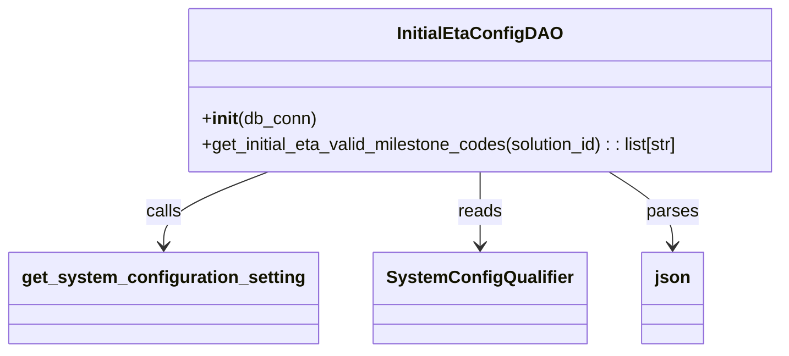

# Diagram: entity_core/entity_service/entity_listener/entity_listener_service/db/daos/initial_eta_config_dao.py


> Auto-generated by Obscura crawlers

## Diagram 1



### SVG

<svg id="container" width="703.8359375" xmlns="http://www.w3.org/2000/svg" class="classDiagram" height="324" viewBox="0 0 703.8359375 324" role="graphics-document document" aria-roledescription="class"><style>#container{font-family:"trebuchet ms",verdana,arial,sans-serif;font-size:16px;fill:#333;}@keyframes edge-animation-frame{from{stroke-dashoffset:0;}}@keyframes dash{to{stroke-dashoffset:0;}}#container .edge-animation-slow{stroke-dasharray:9,5!important;stroke-dashoffset:900;animation:dash 50s linear infinite;stroke-linecap:round;}#container .edge-animation-fast{stroke-dasharray:9,5!important;stroke-dashoffset:900;animation:dash 20s linear infinite;stroke-linecap:round;}#container .error-icon{fill:#552222;}#container .error-text{fill:#552222;stroke:#552222;}#container .edge-thickness-normal{stroke-width:1px;}#container .edge-thickness-thick{stroke-width:3.5px;}#container .edge-pattern-solid{stroke-dasharray:0;}#container .edge-thickness-invisible{stroke-width:0;fill:none;}#container .edge-pattern-dashed{stroke-dasharray:3;}#container .edge-pattern-dotted{stroke-dasharray:2;}#container .marker{fill:#333333;stroke:#333333;}#container .marker.cross{stroke:#333333;}#container svg{font-family:"trebuchet ms",verdana,arial,sans-serif;font-size:16px;}#container p{margin:0;}#container g.classGroup text{fill:#9370DB;stroke:none;font-family:"trebuchet ms",verdana,arial,sans-serif;font-size:10px;}#container g.classGroup text .title{font-weight:bolder;}#container .nodeLabel,#container .edgeLabel{color:#131300;}#container .edgeLabel .label rect{fill:#ECECFF;}#container .label text{fill:#131300;}#container .labelBkg{background:#ECECFF;}#container .edgeLabel .label span{background:#ECECFF;}#container .classTitle{font-weight:bolder;}#container .node rect,#container .node circle,#container .node ellipse,#container .node polygon,#container .node path{fill:#ECECFF;stroke:#9370DB;stroke-width:1px;}#container .divider{stroke:#9370DB;stroke-width:1;}#container g.clickable{cursor:pointer;}#container g.classGroup rect{fill:#ECECFF;stroke:#9370DB;}#container g.classGroup line{stroke:#9370DB;stroke-width:1;}#container .classLabel .box{stroke:none;stroke-width:0;fill:#ECECFF;opacity:0.5;}#container .classLabel .label{fill:#9370DB;font-size:10px;}#container .relation{stroke:#333333;stroke-width:1;fill:none;}#container .dashed-line{stroke-dasharray:3;}#container .dotted-line{stroke-dasharray:1 2;}#container #compositionStart,#container .composition{fill:#333333!important;stroke:#333333!important;stroke-width:1;}#container #compositionEnd,#container .composition{fill:#333333!important;stroke:#333333!important;stroke-width:1;}#container #dependencyStart,#container .dependency{fill:#333333!important;stroke:#333333!important;stroke-width:1;}#container #dependencyStart,#container .dependency{fill:#333333!important;stroke:#333333!important;stroke-width:1;}#container #extensionStart,#container .extension{fill:transparent!important;stroke:#333333!important;stroke-width:1;}#container #extensionEnd,#container .extension{fill:transparent!important;stroke:#333333!important;stroke-width:1;}#container #aggregationStart,#container .aggregation{fill:transparent!important;stroke:#333333!important;stroke-width:1;}#container #aggregationEnd,#container .aggregation{fill:transparent!important;stroke:#333333!important;stroke-width:1;}#container #lollipopStart,#container .lollipop{fill:#ECECFF!important;stroke:#333333!important;stroke-width:1;}#container #lollipopEnd,#container .lollipop{fill:#ECECFF!important;stroke:#333333!important;stroke-width:1;}#container .edgeTerminals{font-size:11px;line-height:initial;}#container .classTitleText{text-anchor:middle;font-size:18px;fill:#333;}#container .label-icon{display:inline-block;height:1em;overflow:visible;vertical-align:-0.125em;}#container .node .label-icon path{fill:currentColor;stroke:revert;stroke-width:revert;}#container :root{--mermaid-font-family:"trebuchet ms",verdana,arial,sans-serif;}</style><g><defs><marker id="container_class-aggregationStart" class="marker aggregation class" refX="18" refY="7" markerWidth="190" markerHeight="240" orient="auto"><path d="M 18,7 L9,13 L1,7 L9,1 Z"></path></marker></defs><defs><marker id="container_class-aggregationEnd" class="marker aggregation class" refX="1" refY="7" markerWidth="20" markerHeight="28" orient="auto"><path d="M 18,7 L9,13 L1,7 L9,1 Z"></path></marker></defs><defs><marker id="container_class-extensionStart" class="marker extension class" refX="18" refY="7" markerWidth="190" markerHeight="240" orient="auto"><path d="M 1,7 L18,13 V 1 Z"></path></marker></defs><defs><marker id="container_class-extensionEnd" class="marker extension class" refX="1" refY="7" markerWidth="20" markerHeight="28" orient="auto"><path d="M 1,1 V 13 L18,7 Z"></path></marker></defs><defs><marker id="container_class-compositionStart" class="marker composition class" refX="18" refY="7" markerWidth="190" markerHeight="240" orient="auto"><path d="M 18,7 L9,13 L1,7 L9,1 Z"></path></marker></defs><defs><marker id="container_class-compositionEnd" class="marker composition class" refX="1" refY="7" markerWidth="20" markerHeight="28" orient="auto"><path d="M 18,7 L9,13 L1,7 L9,1 Z"></path></marker></defs><defs><marker id="container_class-dependencyStart" class="marker dependency class" refX="6" refY="7" markerWidth="190" markerHeight="240" orient="auto"><path d="M 5,7 L9,13 L1,7 L9,1 Z"></path></marker></defs><defs><marker id="container_class-dependencyEnd" class="marker dependency class" refX="13" refY="7" markerWidth="20" markerHeight="28" orient="auto"><path d="M 18,7 L9,13 L14,7 L9,1 Z"></path></marker></defs><defs><marker id="container_class-lollipopStart" class="marker lollipop class" refX="13" refY="7" markerWidth="190" markerHeight="240" orient="auto"><circle stroke="black" fill="transparent" cx="7" cy="7" r="6"></circle></marker></defs><defs><marker id="container_class-lollipopEnd" class="marker lollipop class" refX="1" refY="7" markerWidth="190" markerHeight="240" orient="auto"><circle stroke="black" fill="transparent" cx="7" cy="7" r="6"></circle></marker></defs><g class="root"><g class="clusters"></g><g class="edgePaths"><path d="M236.365,158L220.998,164.167C205.631,170.333,174.898,182.667,159.531,194C144.164,205.333,144.164,215.667,144.164,220.833L144.164,226" id="id_InitialEtaConfigDAO_get_system_configuration_setting_1" class="edge-thickness-normal edge-pattern-solid relation" style=";;;" data-edge="true" data-et="edge" data-id="id_InitialEtaConfigDAO_get_system_configuration_setting_1" data-points="W3sieCI6MjM2LjM2NDY3NjMzOTI4NTcyLCJ5IjoxNTh9LHsieCI6MTQ0LjE2NDA2MjUsInkiOjE5NX0seyJ4IjoxNDQuMTY0MDYyNSwieSI6MjMyfV0=" marker-end="url(#container_class-dependencyEnd)"></path><path d="M423.258,158L423.258,164.167C423.258,170.333,423.258,182.667,423.258,194C423.258,205.333,423.258,215.667,423.258,220.833L423.258,226" id="id_InitialEtaConfigDAO_SystemConfigQualifier_2" class="edge-thickness-normal edge-pattern-solid relation" style=";;;" data-edge="true" data-et="edge" data-id="id_InitialEtaConfigDAO_SystemConfigQualifier_2" data-points="W3sieCI6NDIzLjI1NzgxMjUsInkiOjE1OH0seyJ4Ijo0MjMuMjU3ODEyNSwieSI6MTk1fSx7IngiOjQyMy4yNTc4MTI1LCJ5IjoyMzJ9XQ==" marker-end="url(#container_class-dependencyEnd)"></path><path d="M537.322,158L546.701,164.167C556.079,170.333,574.837,182.667,584.215,194C593.594,205.333,593.594,215.667,593.594,220.833L593.594,226" id="id_InitialEtaConfigDAO_json_3" class="edge-thickness-normal edge-pattern-solid relation" style=";;;" data-edge="true" data-et="edge" data-id="id_InitialEtaConfigDAO_json_3" data-points="W3sieCI6NTM3LjMyMjA1NjM2MTYwNzEsInkiOjE1OH0seyJ4Ijo1OTMuNTkzNzUsInkiOjE5NX0seyJ4Ijo1OTMuNTkzNzUsInkiOjIzMn1d" marker-end="url(#container_class-dependencyEnd)"></path></g><g class="edgeLabels"><g class="edgeLabel" transform="translate(144.1640625, 195)"><g class="label" data-id="id_InitialEtaConfigDAO_get_system_configuration_setting_1" transform="translate(-16.4453125, -12)"><foreignObject width="32.890625" height="24"><div xmlns="http://www.w3.org/1999/xhtml" class="labelBkg" style="display: table-cell; white-space: nowrap; line-height: 1.5; max-width: 200px; text-align: center;"><span class="edgeLabel"><p>calls</p></span></div></foreignObject></g></g><g class="edgeLabel" transform="translate(423.2578125, 195)"><g class="label" data-id="id_InitialEtaConfigDAO_SystemConfigQualifier_2" transform="translate(-20.0078125, -12)"><foreignObject width="40.015625" height="24"><div xmlns="http://www.w3.org/1999/xhtml" class="labelBkg" style="display: table-cell; white-space: nowrap; line-height: 1.5; max-width: 200px; text-align: center;"><span class="edgeLabel"><p>reads</p></span></div></foreignObject></g></g><g class="edgeLabel" transform="translate(593.59375, 195)"><g class="label" data-id="id_InitialEtaConfigDAO_json_3" transform="translate(-23.828125, -12)"><foreignObject width="47.65625" height="24"><div xmlns="http://www.w3.org/1999/xhtml" class="labelBkg" style="display: table-cell; white-space: nowrap; line-height: 1.5; max-width: 200px; text-align: center;"><span class="edgeLabel"><p>parses</p></span></div></foreignObject></g></g></g><g class="nodes"><g class="node default" id="classId-InitialEtaConfigDAO-0" transform="translate(423.2578125, 83)"><g class="basic label-container"><path d="M-272.578125 -75 L272.578125 -75 L272.578125 75 L-272.578125 75" stroke="none" stroke-width="0" fill="#ECECFF" style=""></path><path d="M-272.578125 -75 C-143.31497982901024 -75, -14.051834658020482 -75, 272.578125 -75 M-272.578125 -75 C-154.713325017591 -75, -36.84852503518201 -75, 272.578125 -75 M272.578125 -75 C272.578125 -18.809892144441243, 272.578125 37.380215711117515, 272.578125 75 M272.578125 -75 C272.578125 -40.5414729411687, 272.578125 -6.082945882337398, 272.578125 75 M272.578125 75 C149.65710634596024 75, 26.736087691920517 75, -272.578125 75 M272.578125 75 C112.77794618204922 75, -47.02223263590156 75, -272.578125 75 M-272.578125 75 C-272.578125 16.366036214587787, -272.578125 -42.267927570824426, -272.578125 -75 M-272.578125 75 C-272.578125 34.956495365702075, -272.578125 -5.08700926859585, -272.578125 -75" stroke="#9370DB" stroke-width="1.3" fill="none" stroke-dasharray="0 0" style=""></path></g><g class="annotation-group text" transform="translate(0, -51)"></g><g class="label-group text" transform="translate(-70.90625, -51)"><g class="label" style="font-weight: bolder" transform="translate(0,-12)"><foreignObject width="141.8125" height="24"><div xmlns="http://www.w3.org/1999/xhtml" style="display: table-cell; white-space: nowrap; line-height: 1.5; max-width: 190px; text-align: center;"><span class="nodeLabel markdown-node-label" style=""><p>InitialEtaConfigDAO</p></span></div></foreignObject></g></g><g class="members-group text" transform="translate(-260.578125, -3)"></g><g class="methods-group text" transform="translate(-260.578125, 27)"><g class="label" style="" transform="translate(0,-12)"><foreignObject width="104.96875" height="24"><div xmlns="http://www.w3.org/1999/xhtml" style="display: table-cell; white-space: nowrap; line-height: 1.5; max-width: 194px; text-align: center;"><span class="nodeLabel markdown-node-label" style=""><p>+<strong>init</strong>(db_conn)</p></span></div></foreignObject></g><g class="label" style="" transform="translate(0,12)"><foreignObject width="450.25" height="24"><div xmlns="http://www.w3.org/1999/xhtml" style="display: table-cell; white-space: nowrap; line-height: 1.5; max-width: 508px; text-align: center;"><span class="nodeLabel markdown-node-label" style=""><p>+get_initial_eta_valid_milestone_codes(solution_id) : : list[str]</p></span></div></foreignObject></g></g><g class="divider" style=""><path d="M-272.578125 -27 C-87.51975435028518 -27, 97.53861629942963 -27, 272.578125 -27 M-272.578125 -27 C-58.2874903880612 -27, 156.0031442238776 -27, 272.578125 -27" stroke="#9370DB" stroke-width="1.3" fill="none" stroke-dasharray="0 0" style=""></path></g><g class="divider" style=""><path d="M-272.578125 -3 C-69.46917753503297 -3, 133.63976992993406 -3, 272.578125 -3 M-272.578125 -3 C-113.31349575211934 -3, 45.951133495761326 -3, 272.578125 -3" stroke="#9370DB" stroke-width="1.3" fill="none" stroke-dasharray="0 0" style=""></path></g></g><g class="node default" id="classId-SystemConfigQualifier-1" transform="translate(423.2578125, 274)"><g class="basic label-container"><path d="M-92.9296875 -42 L92.9296875 -42 L92.9296875 42 L-92.9296875 42" stroke="none" stroke-width="0" fill="#ECECFF" style=""></path><path d="M-92.9296875 -42 C-40.52405891638666 -42, 11.881569667226685 -42, 92.9296875 -42 M-92.9296875 -42 C-21.97049821564096 -42, 48.98869106871808 -42, 92.9296875 -42 M92.9296875 -42 C92.9296875 -14.651513270560429, 92.9296875 12.696973458879143, 92.9296875 42 M92.9296875 -42 C92.9296875 -13.685821969117473, 92.9296875 14.628356061765054, 92.9296875 42 M92.9296875 42 C28.743942260009362 42, -35.441802979981276 42, -92.9296875 42 M92.9296875 42 C47.73084642119593 42, 2.532005342391855 42, -92.9296875 42 M-92.9296875 42 C-92.9296875 21.17346298809198, -92.9296875 0.3469259761839609, -92.9296875 -42 M-92.9296875 42 C-92.9296875 20.165281687112085, -92.9296875 -1.6694366257758304, -92.9296875 -42" stroke="#9370DB" stroke-width="1.3" fill="none" stroke-dasharray="0 0" style=""></path></g><g class="annotation-group text" transform="translate(0, -18)"></g><g class="label-group text" transform="translate(-80.9296875, -18)"><g class="label" style="font-weight: bolder" transform="translate(0,-12)"><foreignObject width="161.859375" height="24"><div xmlns="http://www.w3.org/1999/xhtml" style="display: table-cell; white-space: nowrap; line-height: 1.5; max-width: 210px; text-align: center;"><span class="nodeLabel markdown-node-label" style=""><p>SystemConfigQualifier</p></span></div></foreignObject></g></g><g class="members-group text" transform="translate(-80.9296875, 30)"></g><g class="methods-group text" transform="translate(-80.9296875, 60)"></g><g class="divider" style=""><path d="M-92.9296875 6 C-29.577589345246906 6, 33.77450880950619 6, 92.9296875 6 M-92.9296875 6 C-31.624677876680117 6, 29.680331746639766 6, 92.9296875 6" stroke="#9370DB" stroke-width="1.3" fill="none" stroke-dasharray="0 0" style=""></path></g><g class="divider" style=""><path d="M-92.9296875 24 C-23.522602981746616 24, 45.88448153650677 24, 92.9296875 24 M-92.9296875 24 C-28.551587133010045 24, 35.82651323397991 24, 92.9296875 24" stroke="#9370DB" stroke-width="1.3" fill="none" stroke-dasharray="0 0" style=""></path></g></g><g class="node default" id="classId-get_system_configuration_setting-2" transform="translate(144.1640625, 274)"><g class="basic label-container"><path d="M-136.1640625 -42 L136.1640625 -42 L136.1640625 42 L-136.1640625 42" stroke="none" stroke-width="0" fill="#ECECFF" style=""></path><path d="M-136.1640625 -42 C-55.596595269519625 -42, 24.97087196096075 -42, 136.1640625 -42 M-136.1640625 -42 C-44.162619377006024 -42, 47.83882374598795 -42, 136.1640625 -42 M136.1640625 -42 C136.1640625 -25.004032033745055, 136.1640625 -8.00806406749011, 136.1640625 42 M136.1640625 -42 C136.1640625 -12.840799281981564, 136.1640625 16.318401436036872, 136.1640625 42 M136.1640625 42 C76.401508796244 42, 16.63895509248802 42, -136.1640625 42 M136.1640625 42 C28.078163726266183 42, -80.00773504746763 42, -136.1640625 42 M-136.1640625 42 C-136.1640625 24.98631458148942, -136.1640625 7.972629162978841, -136.1640625 -42 M-136.1640625 42 C-136.1640625 20.81833440845482, -136.1640625 -0.3633311830903594, -136.1640625 -42" stroke="#9370DB" stroke-width="1.3" fill="none" stroke-dasharray="0 0" style=""></path></g><g class="annotation-group text" transform="translate(0, -18)"></g><g class="label-group text" transform="translate(-124.1640625, -18)"><g class="label" style="font-weight: bolder" transform="translate(0,-12)"><foreignObject width="248.328125" height="24"><div xmlns="http://www.w3.org/1999/xhtml" style="display: table-cell; white-space: nowrap; line-height: 1.5; max-width: 294px; text-align: center;"><span class="nodeLabel markdown-node-label" style=""><p>get_system_configuration_setting</p></span></div></foreignObject></g></g><g class="members-group text" transform="translate(-124.1640625, 30)"></g><g class="methods-group text" transform="translate(-124.1640625, 60)"></g><g class="divider" style=""><path d="M-136.1640625 6 C-56.39738658881521 6, 23.369289322369582 6, 136.1640625 6 M-136.1640625 6 C-64.14093506085432 6, 7.882192378291364 6, 136.1640625 6" stroke="#9370DB" stroke-width="1.3" fill="none" stroke-dasharray="0 0" style=""></path></g><g class="divider" style=""><path d="M-136.1640625 24 C-60.01398487945495 24, 16.136092741090096 24, 136.1640625 24 M-136.1640625 24 C-54.655040091233786 24, 26.853982317532427 24, 136.1640625 24" stroke="#9370DB" stroke-width="1.3" fill="none" stroke-dasharray="0 0" style=""></path></g></g><g class="node default" id="classId-json-3" transform="translate(593.59375, 274)"><g class="basic label-container"><path d="M-27.40625 -42 L27.40625 -42 L27.40625 42 L-27.40625 42" stroke="none" stroke-width="0" fill="#ECECFF" style=""></path><path d="M-27.40625 -42 C-16.1910009996966 -42, -4.975751999393193 -42, 27.40625 -42 M-27.40625 -42 C-11.772881608778803 -42, 3.8604867824423934 -42, 27.40625 -42 M27.40625 -42 C27.40625 -17.246667007556717, 27.40625 7.506665984886567, 27.40625 42 M27.40625 -42 C27.40625 -11.631684787726051, 27.40625 18.736630424547897, 27.40625 42 M27.40625 42 C8.309774524656358 42, -10.786700950687283 42, -27.40625 42 M27.40625 42 C15.229575761000236 42, 3.0529015220004716 42, -27.40625 42 M-27.40625 42 C-27.40625 13.59869029981326, -27.40625 -14.80261940037348, -27.40625 -42 M-27.40625 42 C-27.40625 20.32118182590796, -27.40625 -1.35763634818408, -27.40625 -42" stroke="#9370DB" stroke-width="1.3" fill="none" stroke-dasharray="0 0" style=""></path></g><g class="annotation-group text" transform="translate(0, -18)"></g><g class="label-group text" transform="translate(-15.40625, -18)"><g class="label" style="font-weight: bolder" transform="translate(0,-12)"><foreignObject width="30.8125" height="24"><div xmlns="http://www.w3.org/1999/xhtml" style="display: table-cell; white-space: nowrap; line-height: 1.5; max-width: 82px; text-align: center;"><span class="nodeLabel markdown-node-label" style=""><p>json</p></span></div></foreignObject></g></g><g class="members-group text" transform="translate(-15.40625, 30)"></g><g class="methods-group text" transform="translate(-15.40625, 60)"></g><g class="divider" style=""><path d="M-27.40625 6 C-16.303584628218523 6, -5.200919256437043 6, 27.40625 6 M-27.40625 6 C-11.08750111635473 6, 5.23124776729054 6, 27.40625 6" stroke="#9370DB" stroke-width="1.3" fill="none" stroke-dasharray="0 0" style=""></path></g><g class="divider" style=""><path d="M-27.40625 24 C-6.9944125116479015 24, 13.417424976704197 24, 27.40625 24 M-27.40625 24 C-7.028413667800855 24, 13.34942266439829 24, 27.40625 24" stroke="#9370DB" stroke-width="1.3" fill="none" stroke-dasharray="0 0" style=""></path></g></g></g></g></g></svg>

## Diagram 2

```mermaid
flowchart TD
    Start[Start] --> Establish[db_conn.establish_connection()]
    Establish --> Cursor[cursor = db_conn.get_cursor()]
    Cursor --> Qualifier[qualifier = SystemConfigQualifier.INITIAL_ETA_MILESTONES]
    Qualifier --> Config[config = get_system_configuration_setting(cursor, qualifier, solution_id)]
    Config --> HasConfig{config ?}
    HasConfig -- yes --> Parse[milestone_code_list = json.loads(config[0].get(qualifier))]
    Parse --> ReturnList[return milestone_code_list]
    HasConfig -- no --> ReturnEmpty[return []]
```

> SVG rendering failed for this diagram.
