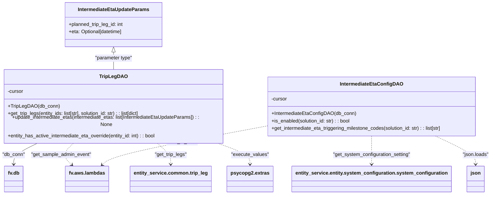

# Diagram: entity_core/entity_service/entity_listener/entity_listener_service/db/daos/intermediate_eta_dao.py


> Auto-generated by Obscura crawlers

## Diagram 1



### SVG

<svg id="container" width="1583.388671875" xmlns="http://www.w3.org/2000/svg" class="classDiagram" height="608" viewBox="0 0 1583.388671875 608" role="graphics-document document" aria-roledescription="class"><style>#container{font-family:"trebuchet ms",verdana,arial,sans-serif;font-size:16px;fill:#333;}@keyframes edge-animation-frame{from{stroke-dashoffset:0;}}@keyframes dash{to{stroke-dashoffset:0;}}#container .edge-animation-slow{stroke-dasharray:9,5!important;stroke-dashoffset:900;animation:dash 50s linear infinite;stroke-linecap:round;}#container .edge-animation-fast{stroke-dasharray:9,5!important;stroke-dashoffset:900;animation:dash 20s linear infinite;stroke-linecap:round;}#container .error-icon{fill:#552222;}#container .error-text{fill:#552222;stroke:#552222;}#container .edge-thickness-normal{stroke-width:1px;}#container .edge-thickness-thick{stroke-width:3.5px;}#container .edge-pattern-solid{stroke-dasharray:0;}#container .edge-thickness-invisible{stroke-width:0;fill:none;}#container .edge-pattern-dashed{stroke-dasharray:3;}#container .edge-pattern-dotted{stroke-dasharray:2;}#container .marker{fill:#333333;stroke:#333333;}#container .marker.cross{stroke:#333333;}#container svg{font-family:"trebuchet ms",verdana,arial,sans-serif;font-size:16px;}#container p{margin:0;}#container g.classGroup text{fill:#9370DB;stroke:none;font-family:"trebuchet ms",verdana,arial,sans-serif;font-size:10px;}#container g.classGroup text .title{font-weight:bolder;}#container .nodeLabel,#container .edgeLabel{color:#131300;}#container .edgeLabel .label rect{fill:#ECECFF;}#container .label text{fill:#131300;}#container .labelBkg{background:#ECECFF;}#container .edgeLabel .label span{background:#ECECFF;}#container .classTitle{font-weight:bolder;}#container .node rect,#container .node circle,#container .node ellipse,#container .node polygon,#container .node path{fill:#ECECFF;stroke:#9370DB;stroke-width:1px;}#container .divider{stroke:#9370DB;stroke-width:1;}#container g.clickable{cursor:pointer;}#container g.classGroup rect{fill:#ECECFF;stroke:#9370DB;}#container g.classGroup line{stroke:#9370DB;stroke-width:1;}#container .classLabel .box{stroke:none;stroke-width:0;fill:#ECECFF;opacity:0.5;}#container .classLabel .label{fill:#9370DB;font-size:10px;}#container .relation{stroke:#333333;stroke-width:1;fill:none;}#container .dashed-line{stroke-dasharray:3;}#container .dotted-line{stroke-dasharray:1 2;}#container #compositionStart,#container .composition{fill:#333333!important;stroke:#333333!important;stroke-width:1;}#container #compositionEnd,#container .composition{fill:#333333!important;stroke:#333333!important;stroke-width:1;}#container #dependencyStart,#container .dependency{fill:#333333!important;stroke:#333333!important;stroke-width:1;}#container #dependencyStart,#container .dependency{fill:#333333!important;stroke:#333333!important;stroke-width:1;}#container #extensionStart,#container .extension{fill:transparent!important;stroke:#333333!important;stroke-width:1;}#container #extensionEnd,#container .extension{fill:transparent!important;stroke:#333333!important;stroke-width:1;}#container #aggregationStart,#container .aggregation{fill:transparent!important;stroke:#333333!important;stroke-width:1;}#container #aggregationEnd,#container .aggregation{fill:transparent!important;stroke:#333333!important;stroke-width:1;}#container #lollipopStart,#container .lollipop{fill:#ECECFF!important;stroke:#333333!important;stroke-width:1;}#container #lollipopEnd,#container .lollipop{fill:#ECECFF!important;stroke:#333333!important;stroke-width:1;}#container .edgeTerminals{font-size:11px;line-height:initial;}#container .classTitleText{text-anchor:middle;font-size:18px;fill:#333;}#container .label-icon{display:inline-block;height:1em;overflow:visible;vertical-align:-0.125em;}#container .node .label-icon path{fill:currentColor;stroke:revert;stroke-width:revert;}#container :root{--mermaid-font-family:"trebuchet ms",verdana,arial,sans-serif;}</style><g><defs><marker id="container_class-aggregationStart" class="marker aggregation class" refX="18" refY="7" markerWidth="190" markerHeight="240" orient="auto"><path d="M 18,7 L9,13 L1,7 L9,1 Z"></path></marker></defs><defs><marker id="container_class-aggregationEnd" class="marker aggregation class" refX="1" refY="7" markerWidth="20" markerHeight="28" orient="auto"><path d="M 18,7 L9,13 L1,7 L9,1 Z"></path></marker></defs><defs><marker id="container_class-extensionStart" class="marker extension class" refX="18" refY="7" markerWidth="190" markerHeight="240" orient="auto"><path d="M 1,7 L18,13 V 1 Z"></path></marker></defs><defs><marker id="container_class-extensionEnd" class="marker extension class" refX="1" refY="7" markerWidth="20" markerHeight="28" orient="auto"><path d="M 1,1 V 13 L18,7 Z"></path></marker></defs><defs><marker id="container_class-compositionStart" class="marker composition class" refX="18" refY="7" markerWidth="190" markerHeight="240" orient="auto"><path d="M 18,7 L9,13 L1,7 L9,1 Z"></path></marker></defs><defs><marker id="container_class-compositionEnd" class="marker composition class" refX="1" refY="7" markerWidth="20" markerHeight="28" orient="auto"><path d="M 18,7 L9,13 L1,7 L9,1 Z"></path></marker></defs><defs><marker id="container_class-dependencyStart" class="marker dependency class" refX="6" refY="7" markerWidth="190" markerHeight="240" orient="auto"><path d="M 5,7 L9,13 L1,7 L9,1 Z"></path></marker></defs><defs><marker id="container_class-dependencyEnd" class="marker dependency class" refX="13" refY="7" markerWidth="20" markerHeight="28" orient="auto"><path d="M 18,7 L9,13 L14,7 L9,1 Z"></path></marker></defs><defs><marker id="container_class-lollipopStart" class="marker lollipop class" refX="13" refY="7" markerWidth="190" markerHeight="240" orient="auto"><circle stroke="black" fill="transparent" cx="7" cy="7" r="6"></circle></marker></defs><defs><marker id="container_class-lollipopEnd" class="marker lollipop class" refX="1" refY="7" markerWidth="190" markerHeight="240" orient="auto"><circle stroke="black" fill="transparent" cx="7" cy="7" r="6"></circle></marker></defs><g class="root"><g class="clusters"></g><g class="edgePaths"><path d="M372.676,169.25L372.676,172.542C372.676,175.833,372.676,182.417,372.676,191.875C372.676,201.333,372.676,213.667,372.676,219.833L372.676,226" id="id_IntermediateEtaUpdateParams_TripLegDAO_1" class="edge-thickness-normal edge-pattern-solid relation" style=";;;" data-edge="true" data-et="edge" data-id="id_IntermediateEtaUpdateParams_TripLegDAO_1" data-points="W3sieCI6MzcyLjY3NTc4MTI1LCJ5IjoxNTJ9LHsieCI6MzcyLjY3NTc4MTI1LCJ5IjoxODl9LHsieCI6MzcyLjY3NTc4MTI1LCJ5IjoyMjZ9XQ==" marker-start="url(#container_class-extensionStart)"></path><path d="M130.231,442L116.388,448.167C102.545,454.333,74.858,466.667,61.015,478C47.172,489.333,47.172,499.667,47.172,504.833L47.172,510" id="id_TripLegDAO_fv.db_2" class="edge-thickness-normal edge-pattern-solid relation" style=";;;" data-edge="true" data-et="edge" data-id="id_TripLegDAO_fv.db_2" data-points="W3sieCI6MTMwLjIzMTQ5MjQ1Njg5NjU1LCJ5Ijo0NDJ9LHsieCI6NDcuMTcxODc1LCJ5Ijo0Nzl9LHsieCI6NDcuMTcxODc1LCJ5Ijo1MTZ9XQ==" marker-end="url(#container_class-dependencyEnd)"></path><path d="M246.605,442L239.406,448.167C232.208,454.333,217.811,466.667,216.576,478.323C215.341,489.979,227.267,500.958,233.231,506.447L239.194,511.936" id="id_TripLegDAO_fv.aws.lambdas_3" class="edge-thickness-normal edge-pattern-dashed relation" style=";;;" data-edge="true" data-et="edge" data-id="id_TripLegDAO_fv.aws.lambdas_3" data-points="W3sieCI6MjQ2LjYwNDk4MzgzNjIwNjg4LCJ5Ijo0NDJ9LHsieCI6MjAzLjQxNDA2MjUsInkiOjQ3OX0seyJ4IjoyNDMuNjA4Mzg2MDc1OTQ5MzcsInkiOjUxNn1d" marker-end="url(#container_class-dependencyEnd)"></path><path d="M512.238,442L520.207,448.167C528.175,454.333,544.113,466.667,552.082,478C560.051,489.333,560.051,499.667,560.051,504.833L560.051,510" id="id_TripLegDAO_entity_service.common.trip_leg_4" class="edge-thickness-normal edge-pattern-dashed relation" style=";;;" data-edge="true" data-et="edge" data-id="id_TripLegDAO_entity_service.common.trip_leg_4" data-points="W3sieCI6NTEyLjIzNzg1MDIxNTUxNzMsInkiOjQ0Mn0seyJ4Ijo1NjAuMDUwNzgxMjUsInkiOjQ3OX0seyJ4Ijo1NjAuMDUwNzgxMjUsInkiOjUxNn1d" marker-end="url(#container_class-dependencyEnd)"></path><path d="M696.286,442L714.764,448.167C733.241,454.333,770.197,466.667,788.675,478C807.152,489.333,807.152,499.667,807.152,504.833L807.152,510" id="id_TripLegDAO_psycopg2.extras_5" class="edge-thickness-normal edge-pattern-dashed relation" style=";;;" data-edge="true" data-et="edge" data-id="id_TripLegDAO_psycopg2.extras_5" data-points="W3sieCI6Njk2LjI4NTkxMDU2MDM0NDcsInkiOjQ0Mn0seyJ4Ijo4MDcuMTUyMzQzNzUsInkiOjQ3OX0seyJ4Ijo4MDcuMTUyMzQzNzUsInkiOjUxNn1d" marker-end="url(#container_class-dependencyEnd)"></path><path d="M1207.553,430L1207.553,438.167C1207.553,446.333,1207.553,462.667,1207.553,476C1207.553,489.333,1207.553,499.667,1207.553,504.833L1207.553,510" id="id_IntermediateEtaConfigDAO_entity_service.entity.system_configuration.system_configuration_6" class="edge-thickness-normal edge-pattern-dashed relation" style=";;;" data-edge="true" data-et="edge" data-id="id_IntermediateEtaConfigDAO_entity_service.entity.system_configuration.system_configuration_6" data-points="W3sieCI6MTIwNy41NTI3MzQzNzUsInkiOjQzMH0seyJ4IjoxMjA3LjU1MjczNDM3NSwieSI6NDc5fSx7IngiOjEyMDcuNTUyNzM0Mzc1LCJ5Ijo1MTZ9XQ==" marker-end="url(#container_class-dependencyEnd)"></path><path d="M864.693,393.717L783.087,407.931C701.48,422.145,538.268,450.572,450.698,470.276C363.128,489.979,351.201,500.958,345.238,506.447L339.275,511.936" id="id_IntermediateEtaConfigDAO_fv.aws.lambdas_7" class="edge-thickness-normal edge-pattern-dashed relation" style=";;;" data-edge="true" data-et="edge" data-id="id_IntermediateEtaConfigDAO_fv.aws.lambdas_7" data-points="W3sieCI6ODY0LjY5MzM1OTM3NSwieSI6MzkzLjcxNzM4ODYwMTIzMDc3fSx7IngiOjM3NS4wNTQ2ODc1LCJ5Ijo0Nzl9LHsieCI6MzM0Ljg2MDM2MzkyNDA1MDYsInkiOjUxNn1d" marker-end="url(#container_class-dependencyEnd)"></path><path d="M1422.425,430L1440.704,438.167C1458.983,446.333,1495.541,462.667,1513.821,476C1532.1,489.333,1532.1,499.667,1532.1,504.833L1532.1,510" id="id_IntermediateEtaConfigDAO_json_8" class="edge-thickness-normal edge-pattern-dashed relation" style=";;;" data-edge="true" data-et="edge" data-id="id_IntermediateEtaConfigDAO_json_8" data-points="W3sieCI6MTQyMi40MjUxNDgxNjgxMDM1LCJ5Ijo0MzB9LHsieCI6MTUzMi4wOTk2MDkzNzUsInkiOjQ3OX0seyJ4IjoxNTMyLjA5OTYwOTM3NSwieSI6NTE2fV0=" marker-end="url(#container_class-dependencyEnd)"></path></g><g class="edgeLabels"><g class="edgeLabel" transform="translate(372.67578125, 189)"><g class="label" data-id="id_IntermediateEtaUpdateParams_TripLegDAO_1" transform="translate(-61.9375, -12)"><foreignObject width="123.875" height="24"><div xmlns="http://www.w3.org/1999/xhtml" class="labelBkg" style="display: table-cell; white-space: nowrap; line-height: 1.5; max-width: 200px; text-align: center;"><span class="edgeLabel"><p>"parameter type"</p></span></div></foreignObject></g></g><g class="edgeLabel" transform="translate(47.171875, 479)"><g class="label" data-id="id_TripLegDAO_fv.db_2" transform="translate(-37.3125, -12)"><foreignObject width="74.625" height="24"><div xmlns="http://www.w3.org/1999/xhtml" class="labelBkg" style="display: table-cell; white-space: nowrap; line-height: 1.5; max-width: 200px; text-align: center;"><span class="edgeLabel"><p>"db_conn"</p></span></div></foreignObject></g></g><g class="edgeLabel" transform="translate(204.26499, 478.27105)"><g class="label" data-id="id_TripLegDAO_fv.aws.lambdas_3" transform="translate(-98.9296875, -12)"><foreignObject width="197.859375" height="24"><div xmlns="http://www.w3.org/1999/xhtml" class="labelBkg" style="display: table-cell; white-space: nowrap; line-height: 1.5; max-width: 200px; text-align: center;"><span class="edgeLabel"><p>"get_sample_admin_event"</p></span></div></foreignObject></g></g><g class="edgeLabel" transform="translate(560.05078125, 479)"><g class="label" data-id="id_TripLegDAO_entity_service.common.trip_leg_4" transform="translate(-52.953125, -12)"><foreignObject width="105.90625" height="24"><div xmlns="http://www.w3.org/1999/xhtml" class="labelBkg" style="display: table-cell; white-space: nowrap; line-height: 1.5; max-width: 200px; text-align: center;"><span class="edgeLabel"><p>"get_trip_legs"</p></span></div></foreignObject></g></g><g class="edgeLabel" transform="translate(807.15234375, 479)"><g class="label" data-id="id_TripLegDAO_psycopg2.extras_5" transform="translate(-61.109375, -12)"><foreignObject width="122.21875" height="24"><div xmlns="http://www.w3.org/1999/xhtml" class="labelBkg" style="display: table-cell; white-space: nowrap; line-height: 1.5; max-width: 200px; text-align: center;"><span class="edgeLabel"><p>"execute_values"</p></span></div></foreignObject></g></g><g class="edgeLabel" transform="translate(1207.552734375, 479)"><g class="label" data-id="id_IntermediateEtaConfigDAO_entity_service.entity.system_configuration.system_configuration_6" transform="translate(-128.1875, -12)"><foreignObject width="256.375" height="24"><div xmlns="http://www.w3.org/1999/xhtml" class="labelBkg" style="display: table; white-space: break-spaces; line-height: 1.5; max-width: 200px; text-align: center; width: 200px;"><span class="edgeLabel"><p>"get_system_configuration_setting"</p></span></div></foreignObject></g></g><g class="edgeLabel" transform="translate(592.96349, 441.04582)"><g class="label" data-id="id_IntermediateEtaConfigDAO_fv.aws.lambdas_7" transform="translate(-52.7109375, -12)"><foreignObject width="105.421875" height="24"><div xmlns="http://www.w3.org/1999/xhtml" class="labelBkg" style="display: table-cell; white-space: nowrap; line-height: 1.5; max-width: 200px; text-align: center;"><span class="edgeLabel"><p>"cast_to_bool"</p></span></div></foreignObject></g></g><g class="edgeLabel" transform="translate(1532.099609375, 479)"><g class="label" data-id="id_IntermediateEtaConfigDAO_json_8" transform="translate(-43.2890625, -12)"><foreignObject width="86.578125" height="24"><div xmlns="http://www.w3.org/1999/xhtml" class="labelBkg" style="display: table-cell; white-space: nowrap; line-height: 1.5; max-width: 200px; text-align: center;"><span class="edgeLabel"><p>"json.loads"</p></span></div></foreignObject></g></g></g><g class="nodes"><g class="node default" id="classId-IntermediateEtaUpdateParams-0" transform="translate(372.67578125, 80)"><g class="basic label-container"><path d="M-158.84765625 -72 L158.84765625 -72 L158.84765625 72 L-158.84765625 72" stroke="none" stroke-width="0" fill="#ECECFF" style=""></path><path d="M-158.84765625 -72 C-62.701124084958536 -72, 33.44540808008293 -72, 158.84765625 -72 M-158.84765625 -72 C-78.96615196618964 -72, 0.9153523176207159 -72, 158.84765625 -72 M158.84765625 -72 C158.84765625 -32.53454674298467, 158.84765625 6.930906514030653, 158.84765625 72 M158.84765625 -72 C158.84765625 -30.807734495357543, 158.84765625 10.384531009284913, 158.84765625 72 M158.84765625 72 C80.5310440141173 72, 2.214431778234598 72, -158.84765625 72 M158.84765625 72 C78.13813849902844 72, -2.571379251943114 72, -158.84765625 72 M-158.84765625 72 C-158.84765625 30.06487959963679, -158.84765625 -11.870240800726421, -158.84765625 -72 M-158.84765625 72 C-158.84765625 36.38735538986925, -158.84765625 0.7747107797384984, -158.84765625 -72" stroke="#9370DB" stroke-width="1.3" fill="none" stroke-dasharray="0 0" style=""></path></g><g class="annotation-group text" transform="translate(0, -48)"></g><g class="label-group text" transform="translate(-112.1796875, -48)"><g class="label" style="font-weight: bolder" transform="translate(0,-12)"><foreignObject width="224.359375" height="24"><div xmlns="http://www.w3.org/1999/xhtml" style="display: table-cell; white-space: nowrap; line-height: 1.5; max-width: 272px; text-align: center;"><span class="nodeLabel markdown-node-label" style=""><p>IntermediateEtaUpdateParams</p></span></div></foreignObject></g></g><g class="members-group text" transform="translate(-146.84765625, 0)"><g class="label" style="" transform="translate(0,-12)"><foreignObject width="181.515625" height="24"><div xmlns="http://www.w3.org/1999/xhtml" style="display: table-cell; white-space: nowrap; line-height: 1.5; max-width: 239px; text-align: center;"><span class="nodeLabel markdown-node-label" style=""><p>+planned_trip_leg_id: int</p></span></div></foreignObject></g><g class="label" style="" transform="translate(0,12)"><foreignObject width="177.53125" height="24"><div xmlns="http://www.w3.org/1999/xhtml" style="display: table-cell; white-space: nowrap; line-height: 1.5; max-width: 235px; text-align: center;"><span class="nodeLabel markdown-node-label" style=""><p>+eta: Optional[datetime]</p></span></div></foreignObject></g></g><g class="methods-group text" transform="translate(-146.84765625, 72)"></g><g class="divider" style=""><path d="M-158.84765625 -24 C-69.30914722420096 -24, 20.22936180159809 -24, 158.84765625 -24 M-158.84765625 -24 C-68.78941248351198 -24, 21.268831282976038 -24, 158.84765625 -24" stroke="#9370DB" stroke-width="1.3" fill="none" stroke-dasharray="0 0" style=""></path></g><g class="divider" style=""><path d="M-158.84765625 48 C-90.09368195192074 48, -21.339707653841486 48, 158.84765625 48 M-158.84765625 48 C-82.4356216109272 48, -6.0235869718543995 48, 158.84765625 48" stroke="#9370DB" stroke-width="1.3" fill="none" stroke-dasharray="0 0" style=""></path></g></g><g class="node default" id="classId-TripLegDAO-1" transform="translate(372.67578125, 334)"><g class="basic label-container"><path d="M-364.67578125 -108 L364.67578125 -108 L364.67578125 108 L-364.67578125 108" stroke="none" stroke-width="0" fill="#ECECFF" style=""></path><path d="M-364.67578125 -108 C-200.70224191819426 -108, -36.72870258638852 -108, 364.67578125 -108 M-364.67578125 -108 C-109.9466302037103 -108, 144.7825208425794 -108, 364.67578125 -108 M364.67578125 -108 C364.67578125 -33.57169054024716, 364.67578125 40.85661891950568, 364.67578125 108 M364.67578125 -108 C364.67578125 -51.78257458923155, 364.67578125 4.434850821536898, 364.67578125 108 M364.67578125 108 C182.02283692586258 108, -0.6301073982748449 108, -364.67578125 108 M364.67578125 108 C155.41178932196965 108, -53.8522026060607 108, -364.67578125 108 M-364.67578125 108 C-364.67578125 48.19369786886685, -364.67578125 -11.612604262266302, -364.67578125 -108 M-364.67578125 108 C-364.67578125 54.4535786087985, -364.67578125 0.9071572175970033, -364.67578125 -108" stroke="#9370DB" stroke-width="1.3" fill="none" stroke-dasharray="0 0" style=""></path></g><g class="annotation-group text" transform="translate(0, -84)"></g><g class="label-group text" transform="translate(-42.3515625, -84)"><g class="label" style="font-weight: bolder" transform="translate(0,-12)"><foreignObject width="84.703125" height="24"><div xmlns="http://www.w3.org/1999/xhtml" style="display: table-cell; white-space: nowrap; line-height: 1.5; max-width: 133px; text-align: center;"><span class="nodeLabel markdown-node-label" style=""><p>TripLegDAO</p></span></div></foreignObject></g></g><g class="members-group text" transform="translate(-352.67578125, -36)"><g class="label" style="" transform="translate(0,-12)"><foreignObject width="52.1875" height="24"><div xmlns="http://www.w3.org/1999/xhtml" style="display: table-cell; white-space: nowrap; line-height: 1.5; max-width: 110px; text-align: center;"><span class="nodeLabel markdown-node-label" style=""><p>-cursor</p></span></div></foreignObject></g></g><g class="methods-group text" transform="translate(-352.67578125, 12)"><g class="label" style="" transform="translate(0,-12)"><foreignObject width="162.546875" height="24"><div xmlns="http://www.w3.org/1999/xhtml" style="display: table-cell; white-space: nowrap; line-height: 1.5; max-width: 220px; text-align: center;"><span class="nodeLabel markdown-node-label" style=""><p>+TripLegDAO(db_conn)</p></span></div></foreignObject></g><g class="label" style="" transform="translate(0,12)"><foreignObject width="441.953125" height="24"><div xmlns="http://www.w3.org/1999/xhtml" style="display: table-cell; white-space: nowrap; line-height: 1.5; max-width: 499px; text-align: center;"><span class="nodeLabel markdown-node-label" style=""><p>+get_trip_legs(entity_ids: list[str], solution_id: str) : : list[dict]</p></span></div></foreignObject></g><g class="label" style="" transform="translate(0,36)"><foreignObject width="663" height="24"><div xmlns="http://www.w3.org/1999/xhtml" style="display: table-cell; white-space: nowrap; line-height: 1.5; max-width: 720px; text-align: center;"><span class="nodeLabel markdown-node-label" style=""><p>+update_intermediate_etas(intermediate_etas: list[IntermediateEtaUpdateParams]) : : None</p></span></div></foreignObject></g><g class="label" style="" transform="translate(0,60)"><foreignObject width="490.8125" height="24"><div xmlns="http://www.w3.org/1999/xhtml" style="display: table-cell; white-space: nowrap; line-height: 1.5; max-width: 548px; text-align: center;"><span class="nodeLabel markdown-node-label" style=""><p>+entity_has_active_intermediate_eta_override(entity_id: int) : : bool</p></span></div></foreignObject></g></g><g class="divider" style=""><path d="M-364.67578125 -60 C-74.96224071642615 -60, 214.7512998171477 -60, 364.67578125 -60 M-364.67578125 -60 C-144.85333675827047 -60, 74.96910773345905 -60, 364.67578125 -60" stroke="#9370DB" stroke-width="1.3" fill="none" stroke-dasharray="0 0" style=""></path></g><g class="divider" style=""><path d="M-364.67578125 -12 C-129.57828365523767 -12, 105.51921393952466 -12, 364.67578125 -12 M-364.67578125 -12 C-198.83525616509033 -12, -32.99473108018066 -12, 364.67578125 -12" stroke="#9370DB" stroke-width="1.3" fill="none" stroke-dasharray="0 0" style=""></path></g></g><g class="node default" id="classId-IntermediateEtaConfigDAO-2" transform="translate(1207.552734375, 334)"><g class="basic label-container"><path d="M-342.859375 -96 L342.859375 -96 L342.859375 96 L-342.859375 96" stroke="none" stroke-width="0" fill="#ECECFF" style=""></path><path d="M-342.859375 -96 C-92.79053804565748 -96, 157.27829890868503 -96, 342.859375 -96 M-342.859375 -96 C-102.83025439003433 -96, 137.19886621993135 -96, 342.859375 -96 M342.859375 -96 C342.859375 -26.625292061804245, 342.859375 42.74941587639151, 342.859375 96 M342.859375 -96 C342.859375 -30.149251500876403, 342.859375 35.701496998247194, 342.859375 96 M342.859375 96 C202.31810459579347 96, 61.77683419158694 96, -342.859375 96 M342.859375 96 C106.8317308855874 96, -129.1959132288252 96, -342.859375 96 M-342.859375 96 C-342.859375 46.41680910020655, -342.859375 -3.166381799586901, -342.859375 -96 M-342.859375 96 C-342.859375 46.80238451060191, -342.859375 -2.395230978796178, -342.859375 -96" stroke="#9370DB" stroke-width="1.3" fill="none" stroke-dasharray="0 0" style=""></path></g><g class="annotation-group text" transform="translate(0, -72)"></g><g class="label-group text" transform="translate(-97.171875, -72)"><g class="label" style="font-weight: bolder" transform="translate(0,-12)"><foreignObject width="194.34375" height="24"><div xmlns="http://www.w3.org/1999/xhtml" style="display: table-cell; white-space: nowrap; line-height: 1.5; max-width: 242px; text-align: center;"><span class="nodeLabel markdown-node-label" style=""><p>IntermediateEtaConfigDAO</p></span></div></foreignObject></g></g><g class="members-group text" transform="translate(-330.859375, -24)"><g class="label" style="" transform="translate(0,-12)"><foreignObject width="52.1875" height="24"><div xmlns="http://www.w3.org/1999/xhtml" style="display: table-cell; white-space: nowrap; line-height: 1.5; max-width: 110px; text-align: center;"><span class="nodeLabel markdown-node-label" style=""><p>-cursor</p></span></div></foreignObject></g></g><g class="methods-group text" transform="translate(-330.859375, 24)"><g class="label" style="" transform="translate(0,-12)"><foreignObject width="272.34375" height="24"><div xmlns="http://www.w3.org/1999/xhtml" style="display: table-cell; white-space: nowrap; line-height: 1.5; max-width: 330px; text-align: center;"><span class="nodeLabel markdown-node-label" style=""><p>+IntermediateEtaConfigDAO(db_conn)</p></span></div></foreignObject></g><g class="label" style="" transform="translate(0,12)"><foreignObject width="260.234375" height="24"><div xmlns="http://www.w3.org/1999/xhtml" style="display: table-cell; white-space: nowrap; line-height: 1.5; max-width: 318px; text-align: center;"><span class="nodeLabel markdown-node-label" style=""><p>+is_enabled(solution_id: str) : : bool</p></span></div></foreignObject></g><g class="label" style="" transform="translate(0,36)"><foreignObject width="564.546875" height="24"><div xmlns="http://www.w3.org/1999/xhtml" style="display: table-cell; white-space: nowrap; line-height: 1.5; max-width: 622px; text-align: center;"><span class="nodeLabel markdown-node-label" style=""><p>+get_intermediate_eta_triggering_milestone_codes(solution_id: str) : : list[str]</p></span></div></foreignObject></g></g><g class="divider" style=""><path d="M-342.859375 -48 C-81.38476877944032 -48, 180.08983744111936 -48, 342.859375 -48 M-342.859375 -48 C-197.7506526408566 -48, -52.6419302817132 -48, 342.859375 -48" stroke="#9370DB" stroke-width="1.3" fill="none" stroke-dasharray="0 0" style=""></path></g><g class="divider" style=""><path d="M-342.859375 0 C-128.89714385880112 0, 85.06508728239777 0, 342.859375 0 M-342.859375 0 C-156.36509834711035 0, 30.129178305779305 0, 342.859375 0" stroke="#9370DB" stroke-width="1.3" fill="none" stroke-dasharray="0 0" style=""></path></g></g><g class="node default" id="classId-fv.db-3" transform="translate(47.171875, 558)"><g class="basic label-container"><path d="M-30.0546875 -42 L30.0546875 -42 L30.0546875 42 L-30.0546875 42" stroke="none" stroke-width="0" fill="#ECECFF" style=""></path><path d="M-30.0546875 -42 C-12.327611695276513 -42, 5.399464109446974 -42, 30.0546875 -42 M-30.0546875 -42 C-9.247125243805574 -42, 11.560437012388853 -42, 30.0546875 -42 M30.0546875 -42 C30.0546875 -11.973870706455173, 30.0546875 18.052258587089653, 30.0546875 42 M30.0546875 -42 C30.0546875 -11.636628915207282, 30.0546875 18.726742169585435, 30.0546875 42 M30.0546875 42 C10.315241787343336 42, -9.424203925313329 42, -30.0546875 42 M30.0546875 42 C17.20213977809889 42, 4.349592056197782 42, -30.0546875 42 M-30.0546875 42 C-30.0546875 17.741527514637816, -30.0546875 -6.516944970724367, -30.0546875 -42 M-30.0546875 42 C-30.0546875 12.83715473522199, -30.0546875 -16.32569052955602, -30.0546875 -42" stroke="#9370DB" stroke-width="1.3" fill="none" stroke-dasharray="0 0" style=""></path></g><g class="annotation-group text" transform="translate(0, -18)"></g><g class="label-group text" transform="translate(-18.0546875, -18)"><g class="label" style="font-weight: bolder" transform="translate(0,-12)"><foreignObject width="36.109375" height="24"><div xmlns="http://www.w3.org/1999/xhtml" style="display: table-cell; white-space: nowrap; line-height: 1.5; max-width: 85px; text-align: center;"><span class="nodeLabel markdown-node-label" style=""><p>fv.db</p></span></div></foreignObject></g></g><g class="members-group text" transform="translate(-18.0546875, 30)"></g><g class="methods-group text" transform="translate(-18.0546875, 60)"></g><g class="divider" style=""><path d="M-30.0546875 6 C-15.76977458715153 6, -1.4848616743030583 6, 30.0546875 6 M-30.0546875 6 C-9.219150024341058 6, 11.616387451317884 6, 30.0546875 6" stroke="#9370DB" stroke-width="1.3" fill="none" stroke-dasharray="0 0" style=""></path></g><g class="divider" style=""><path d="M-30.0546875 24 C-14.021124532894387 24, 2.0124384342112265 24, 30.0546875 24 M-30.0546875 24 C-7.1591515066831874 24, 15.736384486633625 24, 30.0546875 24" stroke="#9370DB" stroke-width="1.3" fill="none" stroke-dasharray="0 0" style=""></path></g></g><g class="node default" id="classId-fv.aws.lambdas-4" transform="translate(289.234375, 558)"><g class="basic label-container"><path d="M-67.8984375 -42 L67.8984375 -42 L67.8984375 42 L-67.8984375 42" stroke="none" stroke-width="0" fill="#ECECFF" style=""></path><path d="M-67.8984375 -42 C-32.4770989166512 -42, 2.944239666697598 -42, 67.8984375 -42 M-67.8984375 -42 C-30.094658657416424 -42, 7.709120185167151 -42, 67.8984375 -42 M67.8984375 -42 C67.8984375 -23.98286676995608, 67.8984375 -5.965733539912158, 67.8984375 42 M67.8984375 -42 C67.8984375 -8.679132991410697, 67.8984375 24.641734017178607, 67.8984375 42 M67.8984375 42 C22.153771602244873 42, -23.590894295510253 42, -67.8984375 42 M67.8984375 42 C34.62068087764331 42, 1.3429242552866185 42, -67.8984375 42 M-67.8984375 42 C-67.8984375 12.411317766370992, -67.8984375 -17.177364467258016, -67.8984375 -42 M-67.8984375 42 C-67.8984375 15.670221592497644, -67.8984375 -10.659556815004713, -67.8984375 -42" stroke="#9370DB" stroke-width="1.3" fill="none" stroke-dasharray="0 0" style=""></path></g><g class="annotation-group text" transform="translate(0, -18)"></g><g class="label-group text" transform="translate(-55.8984375, -18)"><g class="label" style="font-weight: bolder" transform="translate(0,-12)"><foreignObject width="111.796875" height="24"><div xmlns="http://www.w3.org/1999/xhtml" style="display: table-cell; white-space: nowrap; line-height: 1.5; max-width: 160px; text-align: center;"><span class="nodeLabel markdown-node-label" style=""><p>fv.aws.lambdas</p></span></div></foreignObject></g></g><g class="members-group text" transform="translate(-55.8984375, 30)"></g><g class="methods-group text" transform="translate(-55.8984375, 60)"></g><g class="divider" style=""><path d="M-67.8984375 6 C-13.65827590857971 6, 40.58188568284058 6, 67.8984375 6 M-67.8984375 6 C-34.92077831631412 6, -1.9431191326282402 6, 67.8984375 6" stroke="#9370DB" stroke-width="1.3" fill="none" stroke-dasharray="0 0" style=""></path></g><g class="divider" style=""><path d="M-67.8984375 24 C-18.613564705511067 24, 30.671308088977867 24, 67.8984375 24 M-67.8984375 24 C-34.69860028548624 24, -1.4987630709724868 24, 67.8984375 24" stroke="#9370DB" stroke-width="1.3" fill="none" stroke-dasharray="0 0" style=""></path></g></g><g class="node default" id="classId-entity_service.common.trip_leg-5" transform="translate(560.05078125, 558)"><g class="basic label-container"><path d="M-126.4296875 -42 L126.4296875 -42 L126.4296875 42 L-126.4296875 42" stroke="none" stroke-width="0" fill="#ECECFF" style=""></path><path d="M-126.4296875 -42 C-74.40017041146675 -42, -22.370653322933507 -42, 126.4296875 -42 M-126.4296875 -42 C-51.00986200976729 -42, 24.40996348046542 -42, 126.4296875 -42 M126.4296875 -42 C126.4296875 -10.94332375002595, 126.4296875 20.1133524999481, 126.4296875 42 M126.4296875 -42 C126.4296875 -23.360225850992958, 126.4296875 -4.720451701985915, 126.4296875 42 M126.4296875 42 C75.78298098509796 42, 25.136274470195943 42, -126.4296875 42 M126.4296875 42 C37.5291019350892 42, -51.3714836298216 42, -126.4296875 42 M-126.4296875 42 C-126.4296875 23.417984990322132, -126.4296875 4.835969980644265, -126.4296875 -42 M-126.4296875 42 C-126.4296875 12.607330804832937, -126.4296875 -16.785338390334125, -126.4296875 -42" stroke="#9370DB" stroke-width="1.3" fill="none" stroke-dasharray="0 0" style=""></path></g><g class="annotation-group text" transform="translate(0, -18)"></g><g class="label-group text" transform="translate(-114.4296875, -18)"><g class="label" style="font-weight: bolder" transform="translate(0,-12)"><foreignObject width="228.859375" height="24"><div xmlns="http://www.w3.org/1999/xhtml" style="display: table-cell; white-space: nowrap; line-height: 1.5; max-width: 276px; text-align: center;"><span class="nodeLabel markdown-node-label" style=""><p>entity_service.common.trip_leg</p></span></div></foreignObject></g></g><g class="members-group text" transform="translate(-114.4296875, 30)"></g><g class="methods-group text" transform="translate(-114.4296875, 60)"></g><g class="divider" style=""><path d="M-126.4296875 6 C-45.79032984732841 6, 34.849027805343184 6, 126.4296875 6 M-126.4296875 6 C-59.42194384436306 6, 7.585799811273887 6, 126.4296875 6" stroke="#9370DB" stroke-width="1.3" fill="none" stroke-dasharray="0 0" style=""></path></g><g class="divider" style=""><path d="M-126.4296875 24 C-71.7581633597838 24, -17.086639219567587 24, 126.4296875 24 M-126.4296875 24 C-30.758314553385404 24, 64.91305839322919 24, 126.4296875 24" stroke="#9370DB" stroke-width="1.3" fill="none" stroke-dasharray="0 0" style=""></path></g></g><g class="node default" id="classId-psycopg2.extras-6" transform="translate(807.15234375, 558)"><g class="basic label-container"><path d="M-70.671875 -42 L70.671875 -42 L70.671875 42 L-70.671875 42" stroke="none" stroke-width="0" fill="#ECECFF" style=""></path><path d="M-70.671875 -42 C-16.375015074544187 -42, 37.921844850911626 -42, 70.671875 -42 M-70.671875 -42 C-40.29852752918847 -42, -9.925180058376938 -42, 70.671875 -42 M70.671875 -42 C70.671875 -19.890038636768022, 70.671875 2.219922726463956, 70.671875 42 M70.671875 -42 C70.671875 -9.45224829569927, 70.671875 23.09550340860146, 70.671875 42 M70.671875 42 C21.236274183094665 42, -28.19932663381067 42, -70.671875 42 M70.671875 42 C36.817608553832386 42, 2.963342107664772 42, -70.671875 42 M-70.671875 42 C-70.671875 18.02359271424177, -70.671875 -5.952814571516463, -70.671875 -42 M-70.671875 42 C-70.671875 19.934390069221486, -70.671875 -2.131219861557028, -70.671875 -42" stroke="#9370DB" stroke-width="1.3" fill="none" stroke-dasharray="0 0" style=""></path></g><g class="annotation-group text" transform="translate(0, -18)"></g><g class="label-group text" transform="translate(-58.671875, -18)"><g class="label" style="font-weight: bolder" transform="translate(0,-12)"><foreignObject width="117.34375" height="24"><div xmlns="http://www.w3.org/1999/xhtml" style="display: table-cell; white-space: nowrap; line-height: 1.5; max-width: 164px; text-align: center;"><span class="nodeLabel markdown-node-label" style=""><p>psycopg2.extras</p></span></div></foreignObject></g></g><g class="members-group text" transform="translate(-58.671875, 30)"></g><g class="methods-group text" transform="translate(-58.671875, 60)"></g><g class="divider" style=""><path d="M-70.671875 6 C-20.294875604076942 6, 30.082123791846115 6, 70.671875 6 M-70.671875 6 C-34.78087135568586 6, 1.1101322886282787 6, 70.671875 6" stroke="#9370DB" stroke-width="1.3" fill="none" stroke-dasharray="0 0" style=""></path></g><g class="divider" style=""><path d="M-70.671875 24 C-19.011354413683264 24, 32.64916617263347 24, 70.671875 24 M-70.671875 24 C-40.49471546011547 24, -10.317555920230937 24, 70.671875 24" stroke="#9370DB" stroke-width="1.3" fill="none" stroke-dasharray="0 0" style=""></path></g></g><g class="node default" id="classId-entity_service.entity.system_configuration.system_configuration-7" transform="translate(1207.552734375, 558)"><g class="basic label-container"><path d="M-247.140625 -42 L247.140625 -42 L247.140625 42 L-247.140625 42" stroke="none" stroke-width="0" fill="#ECECFF" style=""></path><path d="M-247.140625 -42 C-127.281392668798 -42, -7.4221603375960115 -42, 247.140625 -42 M-247.140625 -42 C-146.68998210261182 -42, -46.239339205223644 -42, 247.140625 -42 M247.140625 -42 C247.140625 -20.64930566270684, 247.140625 0.7013886745863189, 247.140625 42 M247.140625 -42 C247.140625 -16.02063000085809, 247.140625 9.958739998283818, 247.140625 42 M247.140625 42 C145.96072238745649 42, 44.780819774913 42, -247.140625 42 M247.140625 42 C98.24688521486664 42, -50.646854570266726 42, -247.140625 42 M-247.140625 42 C-247.140625 13.144586482615143, -247.140625 -15.710827034769714, -247.140625 -42 M-247.140625 42 C-247.140625 17.526226436448667, -247.140625 -6.947547127102666, -247.140625 -42" stroke="#9370DB" stroke-width="1.3" fill="none" stroke-dasharray="0 0" style=""></path></g><g class="annotation-group text" transform="translate(0, -18)"></g><g class="label-group text" transform="translate(-235.140625, -18)"><g class="label" style="font-weight: bolder" transform="translate(0,-12)"><foreignObject width="470.28125" height="24"><div xmlns="http://www.w3.org/1999/xhtml" style="display: table-cell; white-space: nowrap; line-height: 1.5; max-width: 512px; text-align: center;"><span class="nodeLabel markdown-node-label" style=""><p>entity_service.entity.system_configuration.system_configuration</p></span></div></foreignObject></g></g><g class="members-group text" transform="translate(-235.140625, 30)"></g><g class="methods-group text" transform="translate(-235.140625, 60)"></g><g class="divider" style=""><path d="M-247.140625 6 C-72.979441240478 6, 101.18174251904401 6, 247.140625 6 M-247.140625 6 C-114.62202336327613 6, 17.896578273447744 6, 247.140625 6" stroke="#9370DB" stroke-width="1.3" fill="none" stroke-dasharray="0 0" style=""></path></g><g class="divider" style=""><path d="M-247.140625 24 C-71.74890712712116 24, 103.64281074575769 24, 247.140625 24 M-247.140625 24 C-54.45190441702633 24, 138.23681616594735 24, 247.140625 24" stroke="#9370DB" stroke-width="1.3" fill="none" stroke-dasharray="0 0" style=""></path></g></g><g class="node default" id="classId-json-8" transform="translate(1532.099609375, 558)"><g class="basic label-container"><path d="M-27.40625 -42 L27.40625 -42 L27.40625 42 L-27.40625 42" stroke="none" stroke-width="0" fill="#ECECFF" style=""></path><path d="M-27.40625 -42 C-12.161245608220677 -42, 3.083758783558647 -42, 27.40625 -42 M-27.40625 -42 C-7.5661189975574565 -42, 12.274012004885087 -42, 27.40625 -42 M27.40625 -42 C27.40625 -20.386380234175377, 27.40625 1.2272395316492464, 27.40625 42 M27.40625 -42 C27.40625 -22.221430077045635, 27.40625 -2.442860154091271, 27.40625 42 M27.40625 42 C9.721077615160969 42, -7.964094769678063 42, -27.40625 42 M27.40625 42 C15.492886999376116 42, 3.579523998752233 42, -27.40625 42 M-27.40625 42 C-27.40625 20.47036293059448, -27.40625 -1.0592741388110412, -27.40625 -42 M-27.40625 42 C-27.40625 14.452882749520189, -27.40625 -13.094234500959622, -27.40625 -42" stroke="#9370DB" stroke-width="1.3" fill="none" stroke-dasharray="0 0" style=""></path></g><g class="annotation-group text" transform="translate(0, -18)"></g><g class="label-group text" transform="translate(-15.40625, -18)"><g class="label" style="font-weight: bolder" transform="translate(0,-12)"><foreignObject width="30.8125" height="24"><div xmlns="http://www.w3.org/1999/xhtml" style="display: table-cell; white-space: nowrap; line-height: 1.5; max-width: 82px; text-align: center;"><span class="nodeLabel markdown-node-label" style=""><p>json</p></span></div></foreignObject></g></g><g class="members-group text" transform="translate(-15.40625, 30)"></g><g class="methods-group text" transform="translate(-15.40625, 60)"></g><g class="divider" style=""><path d="M-27.40625 6 C-7.943838446757553 6, 11.518573106484894 6, 27.40625 6 M-27.40625 6 C-10.454284837282017 6, 6.497680325435965 6, 27.40625 6" stroke="#9370DB" stroke-width="1.3" fill="none" stroke-dasharray="0 0" style=""></path></g><g class="divider" style=""><path d="M-27.40625 24 C-11.706513652382915 24, 3.99322269523417 24, 27.40625 24 M-27.40625 24 C-10.724008713578755 24, 5.9582325728424905 24, 27.40625 24" stroke="#9370DB" stroke-width="1.3" fill="none" stroke-dasharray="0 0" style=""></path></g></g></g></g></g></svg>

## Diagram 2

```mermaid
flowchart TD
    subgraph UpdateIntermediateEtas
        UI[Receive intermediate_etas list]
        UT[Prepare VALUES template "(%(planned_trip_leg_id)s, %(eta)s)"]
        EX[Call execute_values(cursor, query, intermediate_etas, template)]
        DBUPDATE[DB: UPDATE planned_trip_leg ... FROM (VALUES ...) AS updated_etas(planned_trip_leg_id, eta)]
        WHERE_CLAUSE[WHERE ptl.id = updated_etas.planned_trip_leg_id AND NOT EXISTS(override active)]
        UI --> UT --> EX --> DBUPDATE --> WHERE_CLAUSE
    end

    subgraph EntityOverrideCheck
        CHECK_FUNC[entity_has_active_intermediate_eta_override(entity_id)]
        SELECT_EXISTS[Run SELECT EXISTS(...) on planned_trip_leg_eta_override]
        COALESCE_CHECK[COALESCE(active_until, now_utc()) >= now_utc()]
        RESULT[Return boolean result]
        CHECK_FUNC --> SELECT_EXISTS --> COALESCE_CHECK --> RESULT
    end

    subgraph ConfigEnableCheck
        IS_ENABLED[is_enabled(solution_id)]
        GET_CONFIG[get_system_configuration_setting(cursor, INTERMEDIATE_ETA, solution_id)]
        CONFIG_EXISTS{config exists?}
        CAST_BOOL[cast value to bool via fv.aws.lambdas.cast_to_bool]
        RETURN_FLAG[Return is_enabled_for_solution]
        IS_ENABLED --> GET_CONFIG --> CONFIG_EXISTS
        CONFIG_EXISTS -- Yes --> CAST_BOOL --> RETURN_FLAG
        CONFIG_EXISTS -- No --> RETURN_FLAG
    end

    DBUPDATE --> CHECK_FUNC
    GET_CONFIG -->|reads| json
    CAST_BOOL -->|uses| fv.aws.lambdas
```

> SVG rendering failed for this diagram.
