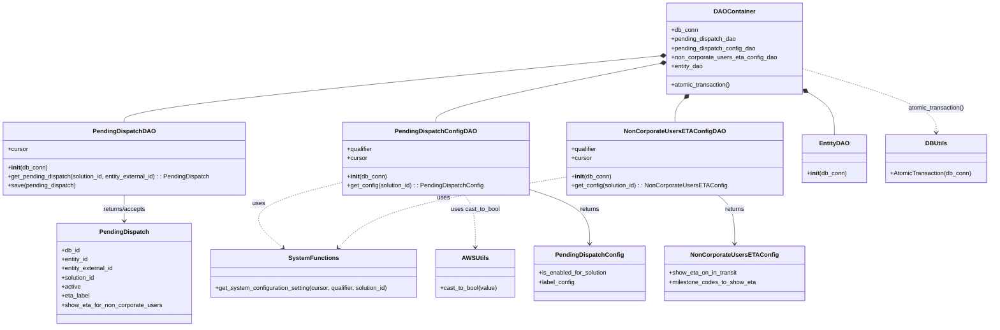

# Diagram: entity_core/entity_service/entity_listener/entity_listener_service/db/daos/pending_dispatch_dao.py

> Auto-generated by Obscura crawlers

## Mermaid

### SVG

<svg id="container" width="2588.931640625" xmlns="http://www.w3.org/2000/svg" class="classDiagram" height="860" viewBox="0 0 2588.931640625 860" role="graphics-document document" aria-roledescription="class"><g><defs><marker id="container_class-aggregationStart" class="marker aggregation class" refX="18" refY="7" markerWidth="190" markerHeight="240" orient="auto"><path d="M 18,7 L9,13 L1,7 L9,1 Z"></path></marker></defs><defs><marker id="container_class-aggregationEnd" class="marker aggregation class" refX="1" refY="7" markerWidth="20" markerHeight="28" orient="auto"><path d="M 18,7 L9,13 L1,7 L9,1 Z"></path></marker></defs><defs><marker id="container_class-extensionStart" class="marker extension class" refX="18" refY="7" markerWidth="190" markerHeight="240" orient="auto"><path d="M 1,7 L18,13 V 1 Z"></path></marker></defs><defs><marker id="container_class-extensionEnd" class="marker extension class" refX="1" refY="7" markerWidth="20" markerHeight="28" orient="auto"><path d="M 1,1 V 13 L18,7 Z"></path></marker></defs><defs><marker id="container_class-compositionStart" class="marker composition class" refX="18" refY="7" markerWidth="190" markerHeight="240" orient="auto"><path d="M 18,7 L9,13 L1,7 L9,1 Z"></path></marker></defs><defs><marker id="container_class-compositionEnd" class="marker composition class" refX="1" refY="7" markerWidth="20" markerHeight="28" orient="auto"><path d="M 18,7 L9,13 L1,7 L9,1 Z"></path></marker></defs><defs><marker id="container_class-dependencyStart" class="marker dependency class" refX="6" refY="7" markerWidth="190" markerHeight="240" orient="auto"><path d="M 5,7 L9,13 L1,7 L9,1 Z"></path></marker></defs><defs><marker id="container_class-dependencyEnd" class="marker dependency class" refX="13" refY="7" markerWidth="20" markerHeight="28" orient="auto"><path d="M 18,7 L9,13 L14,7 L9,1 Z"></path></marker></defs><defs><marker id="container_class-lollipopStart" class="marker lollipop class" refX="13" refY="7" markerWidth="190" markerHeight="240" orient="auto"><circle stroke="black" fill="transparent" cx="7" cy="7" r="6"></circle></marker></defs><defs><marker id="container_class-lollipopEnd" class="marker lollipop class" refX="1" refY="7" markerWidth="190" markerHeight="240" orient="auto"><circle stroke="black" fill="transparent" cx="7" cy="7" r="6"></circle></marker></defs><g class="root"><g class="clusters"></g><g class="edgePaths"><path d="M1738.742,147.007L1503.881,170.006C1269.02,193.005,799.297,239.002,564.436,268.168C329.574,297.333,329.574,309.667,329.574,315.833L329.574,322" id="id_DAOContainer_PendingDispatchDAO_1" class="edge-thickness-normal edge-pattern-solid relation" style=";;;" data-edge="true" data-et="edge" data-id="id_DAOContainer_PendingDispatchDAO_1" data-points="W3sieCI6MTc1NS45MTAxNTYyNSwieSI6MTQ1LjMyNjIwMzUzNDI4MTc1fSx7IngiOjMyOS41NzQyMTg3NSwieSI6Mjg1fSx7IngiOjMyOS41NzQyMTg3NSwieSI6MzIyfV0=" marker-start="url(#container_class-compositionStart)"></path><path d="M1739,167.065L1641.465,186.72C1543.93,206.376,1348.859,245.688,1251.324,271.511C1153.789,297.333,1153.789,309.667,1153.789,315.833L1153.789,322" id="id_DAOContainer_PendingDispatchConfigDAO_2" class="edge-thickness-normal edge-pattern-solid relation" style=";;;" data-edge="true" data-et="edge" data-id="id_DAOContainer_PendingDispatchConfigDAO_2" data-points="W3sieCI6MTc1NS45MTAxNTYyNSwieSI6MTYzLjY1Njc3MDUyNTE3NTc0fSx7IngiOjExNTMuNzg5MDYyNSwieSI6Mjg1fSx7IngiOjExNTMuNzg5MDYyNSwieSI6MzIyfV0=" marker-start="url(#container_class-compositionStart)"></path><path d="M1798.829,260.11L1794.621,264.258C1790.413,268.407,1781.996,276.703,1777.788,287.018C1773.58,297.333,1773.58,309.667,1773.58,315.833L1773.58,322" id="id_DAOContainer_NonCorporateUsersETAConfigDAO_3" class="edge-thickness-normal edge-pattern-solid relation" style=";;;" data-edge="true" data-et="edge" data-id="id_DAOContainer_NonCorporateUsersETAConfigDAO_3" data-points="W3sieCI6MTgxMS4xMTM1NTQ5MzYzMDU3LCJ5IjoyNDh9LHsieCI6MTc3My41ODAwNzgxMjUsInkiOjI4NX0seyJ4IjoxNzczLjU4MDA3ODEyNSwieSI6MzIyfV0=" marker-start="url(#container_class-compositionStart)"></path><path d="M2124.384,248.324L2134.115,254.437C2143.845,260.549,2163.306,272.775,2173.037,290.554C2182.768,308.333,2182.768,331.667,2182.768,343.333L2182.768,355" id="id_DAOContainer_EntityDAO_4" class="edge-thickness-normal edge-pattern-solid relation" style=";;;" data-edge="true" data-et="edge" data-id="id_DAOContainer_EntityDAO_4" data-points="W3sieCI6MjEwOS43NzczNDM3NSwieSI6MjM5LjE0ODE2MjMzMDcxMDE0fSx7IngiOjIxODIuNzY3NTc4MTI1LCJ5IjoyODV9LHsieCI6MjE4Mi43Njc1NzgxMjUsInkiOjM1NX1d" marker-start="url(#container_class-compositionStart)"></path><path d="M911.148,479.223L863.737,491.186C816.325,503.148,721.501,527.074,694.559,556.064C667.617,585.054,708.556,619.109,729.025,636.136L749.495,653.163" id="id_PendingDispatchConfigDAO_SystemFunctions_5" class="edge-thickness-normal edge-pattern-dashed relation" style=";;;" data-edge="true" data-et="edge" data-id="id_PendingDispatchConfigDAO_SystemFunctions_5" data-points="W3sieCI6OTExLjE0ODQzNzUsInkiOjQ3OS4yMjI3NDYzMjE1MjY4N30seyJ4Ijo2MjYuNjc3NzM0Mzc1LCJ5Ijo1NTF9LHsieCI6NzU0LjEwNzMwNjMwNTQ3MzMsInkiOjY1N31d" marker-end="url(#container_class-dependencyEnd)"></path><path d="M1497.166,465.114L1413.185,479.428C1329.204,493.743,1161.242,522.371,1060.871,553.633C960.5,584.896,927.72,618.791,911.33,635.739L894.94,652.687" id="id_NonCorporateUsersETAConfigDAO_SystemFunctions_6" class="edge-thickness-normal edge-pattern-dashed relation" style=";;;" data-edge="true" data-et="edge" data-id="id_NonCorporateUsersETAConfigDAO_SystemFunctions_6" data-points="W3sieCI6MTQ5Ny4xNjYwMTU2MjUsInkiOjQ2NS4xMTM5NzM0Nzc3NzU1fSx7IngiOjk5My4yNzkyOTY4NzUsInkiOjU1MX0seyJ4Ijo4OTAuNzY5NDI3MjM3NDI2LCJ5Ijo2NTd9XQ==" marker-end="url(#container_class-dependencyEnd)"></path><path d="M1229.254,514L1234.102,520.167C1238.949,526.333,1248.645,538.667,1253.492,561.5C1258.34,584.333,1258.34,617.667,1258.34,634.333L1258.34,651" id="id_PendingDispatchConfigDAO_AWSUtils_7" class="edge-thickness-normal edge-pattern-dashed relation" style=";;;" data-edge="true" data-et="edge" data-id="id_PendingDispatchConfigDAO_AWSUtils_7" data-points="W3sieCI6MTIyOS4yNTQyODgwNjM5MDk4LCJ5Ijo1MTR9LHsieCI6MTI1OC4zMzk4NDM3NSwieSI6NTUxfSx7IngiOjEyNTguMzM5ODQzNzUsInkiOjY1N31d" marker-end="url(#container_class-dependencyEnd)"></path><path d="M2109.777,181.898L2166.187,199.082C2222.597,216.265,2335.417,250.633,2391.826,278.483C2448.236,306.333,2448.236,327.667,2448.236,338.333L2448.236,349" id="id_DAOContainer_DBUtils_8" class="edge-thickness-normal edge-pattern-dashed relation" style=";;;" data-edge="true" data-et="edge" data-id="id_DAOContainer_DBUtils_8" data-points="W3sieCI6MjEwOS43NzczNDM3NSwieSI6MTgxLjg5Nzg5MzM2ODYwMTc2fSx7IngiOjI0NDguMjM2MzI4MTI1LCJ5IjoyODV9LHsieCI6MjQ0OC4yMzYzMjgxMjUsInkiOjM1NX1d" marker-end="url(#container_class-dependencyEnd)"></path><path d="M329.574,514L329.574,520.167C329.574,526.333,329.574,538.667,329.574,550C329.574,561.333,329.574,571.667,329.574,576.833L329.574,582" id="id_PendingDispatchDAO_PendingDispatch_9" class="edge-thickness-normal edge-pattern-solid relation" style=";;;" data-edge="true" data-et="edge" data-id="id_PendingDispatchDAO_PendingDispatch_9" data-points="W3sieCI6MzI5LjU3NDIxODc1LCJ5Ijo1MTR9LHsieCI6MzI5LjU3NDIxODc1LCJ5Ijo1NTF9LHsieCI6MzI5LjU3NDIxODc1LCJ5Ijo1ODh9XQ==" marker-end="url(#container_class-dependencyEnd)"></path><path d="M1396.43,497.977L1423.241,506.814C1450.052,515.651,1503.674,533.326,1530.486,557.329C1557.297,581.333,1557.297,611.667,1557.297,626.833L1557.297,642" id="id_PendingDispatchConfigDAO_PendingDispatchConfig_10" class="edge-thickness-normal edge-pattern-solid relation" style=";;;" data-edge="true" data-et="edge" data-id="id_PendingDispatchConfigDAO_PendingDispatchConfig_10" data-points="W3sieCI6MTM5Ni40Mjk2ODc1LCJ5Ijo0OTcuOTc2NjUwMDgwMzUwMDV9LHsieCI6MTU1Ny4yOTY4NzUsInkiOjU1MX0seyJ4IjoxNTU3LjI5Njg3NSwieSI6NjQ4fV0=" marker-end="url(#container_class-dependencyEnd)"></path><path d="M1888.537,514L1895.922,520.167C1903.306,526.333,1918.075,538.667,1925.459,560C1932.844,581.333,1932.844,611.667,1932.844,626.833L1932.844,642" id="id_NonCorporateUsersETAConfigDAO_NonCorporateUsersETAConfig_11" class="edge-thickness-normal edge-pattern-solid relation" style=";;;" data-edge="true" data-et="edge" data-id="id_NonCorporateUsersETAConfigDAO_NonCorporateUsersETAConfig_11" data-points="W3sieCI6MTg4OC41MzczMTQ5NjcxMDUyLCJ5Ijo1MTR9LHsieCI6MTkzMi44NDM3NSwieSI6NTUxfSx7IngiOjE5MzIuODQzNzUsInkiOjY0OH1d" marker-end="url(#container_class-dependencyEnd)"></path></g><g class="edgeLabels"><g class="edgeLabel"><g class="label" data-id="id_DAOContainer_PendingDispatchDAO_1" transform="translate(0, 0)"><foreignObject width="0" height="0">

</foreignObject></g></g><g class="edgeLabel"><g class="label" data-id="id_DAOContainer_PendingDispatchConfigDAO_2" transform="translate(0, 0)"><foreignObject width="0" height="0">

</foreignObject></g></g><g class="edgeLabel"><g class="label" data-id="id_DAOContainer_NonCorporateUsersETAConfigDAO_3" transform="translate(0, 0)"><foreignObject width="0" height="0">

</foreignObject></g></g><g class="edgeLabel"><g class="label" data-id="id_DAOContainer_EntityDAO_4" transform="translate(0, 0)"><foreignObject width="0" height="0">

</foreignObject></g></g><g class="edgeLabel" transform="translate(688.55475, 535.38728)"><g class="label" data-id="id_PendingDispatchConfigDAO_SystemFunctions_5" transform="translate(-16.4921875, -12)"><foreignObject width="32.984375" height="24">

uses

</foreignObject></g></g><g class="edgeLabel" transform="translate(1172.54118, 520.44533)"><g class="label" data-id="id_NonCorporateUsersETAConfigDAO_SystemFunctions_6" transform="translate(-16.4921875, -12)"><foreignObject width="32.984375" height="24">

uses

</foreignObject></g></g><g class="edgeLabel" transform="translate(1258.33984375, 551)"><g class="label" data-id="id_PendingDispatchConfigDAO_AWSUtils_7" transform="translate(-65.1328125, -12)"><foreignObject width="130.265625" height="24">

uses cast_to_bool

</foreignObject></g></g><g class="edgeLabel" transform="translate(2448.236328125, 285)"><g class="label" data-id="id_DAOContainer_DBUtils_8" transform="translate(-74.984375, -12)"><foreignObject width="149.96875" height="24">

atomic_transaction()

</foreignObject></g></g><g class="edgeLabel" transform="translate(329.57421875, 551)"><g class="label" data-id="id_PendingDispatchDAO_PendingDispatch_9" transform="translate(-57.4453125, -12)"><foreignObject width="114.890625" height="24">

returns/accepts

</foreignObject></g></g><g class="edgeLabel" transform="translate(1557.296875, 551)"><g class="label" data-id="id_PendingDispatchConfigDAO_PendingDispatchConfig_10" transform="translate(-26.265625, -12)"><foreignObject width="52.53125" height="24">

returns

</foreignObject></g></g><g class="edgeLabel" transform="translate(1932.84375, 551)"><g class="label" data-id="id_NonCorporateUsersETAConfigDAO_NonCorporateUsersETAConfig_11" transform="translate(-26.265625, -12)"><foreignObject width="52.53125" height="24">

returns

</foreignObject></g></g></g><g class="nodes"><g class="node default" id="classId-DAOContainer-0" transform="translate(1932.84375, 128)"><g class="basic label-container"><path d="M-176.93359375 -120 L176.93359375 -120 L176.93359375 120 L-176.93359375 120" stroke="none" stroke-width="0" fill="#ECECFF" style=""></path><path d="M-176.93359375 -120 C-59.85610968893087 -120, 57.22137437213826 -120, 176.93359375 -120 M-176.93359375 -120 C-63.80515853046306 -120, 49.32327668907388 -120, 176.93359375 -120 M176.93359375 -120 C176.93359375 -53.37526956825177, 176.93359375 13.249460863496466, 176.93359375 120 M176.93359375 -120 C176.93359375 -28.27866066691965, 176.93359375 63.4426786661607, 176.93359375 120 M176.93359375 120 C89.7866599099533 120, 2.639726069906601 120, -176.93359375 120 M176.93359375 120 C99.59259810669403 120, 22.251602463388053 120, -176.93359375 120 M-176.93359375 120 C-176.93359375 42.76998029950231, -176.93359375 -34.460039400995385, -176.93359375 -120 M-176.93359375 120 C-176.93359375 26.434434682559825, -176.93359375 -67.13113063488035, -176.93359375 -120" stroke="#9370DB" stroke-width="1.3" fill="none" stroke-dasharray="0 0" style=""></path></g><g class="annotation-group text" transform="translate(0, -96)"></g><g class="label-group text" transform="translate(-50.8984375, -96)"><g class="label" style="font-weight: bolder" transform="translate(0,-12)"><foreignObject width="101.796875" height="24">

DAOContainer

</foreignObject></g></g><g class="members-group text" transform="translate(-164.93359375, -48)"><g class="label" style="" transform="translate(0,-12)"><foreignObject width="70.171875" height="24">

+db_conn

</foreignObject></g><g class="label" style="" transform="translate(0,12)"><foreignObject width="173.203125" height="24">

+pending_dispatch_dao

</foreignObject></g><g class="label" style="" transform="translate(0,36)"><foreignObject width="224.84375" height="24">

+pending_dispatch_config_dao

</foreignObject></g><g class="label" style="" transform="translate(0,60)"><foreignObject width="278.96875" height="24">

+non_corporate_users_eta_config_dao

</foreignObject></g><g class="label" style="" transform="translate(0,84)"><foreignObject width="85.078125" height="24">

+entity_dao

</foreignObject></g></g><g class="methods-group text" transform="translate(-164.93359375, 96)"><g class="label" style="" transform="translate(0,-12)"><foreignObject width="157.71875" height="24">

+atomic_transaction()

</foreignObject></g></g><g class="divider" style=""><path d="M-176.93359375 -72 C-36.5326277987314 -72, 103.8683381525372 -72, 176.93359375 -72 M-176.93359375 -72 C-67.49072106342872 -72, 41.952151623142555 -72, 176.93359375 -72" stroke="#9370DB" stroke-width="1.3" fill="none" stroke-dasharray="0 0" style=""></path></g><g class="divider" style=""><path d="M-176.93359375 72 C-98.75273838687737 72, -20.571883023754737 72, 176.93359375 72 M-176.93359375 72 C-76.98105389186969 72, 22.971485966260616 72, 176.93359375 72" stroke="#9370DB" stroke-width="1.3" fill="none" stroke-dasharray="0 0" style=""></path></g></g><g class="node default" id="classId-PendingDispatchConfigDAO-1" transform="translate(1153.7890625, 418)"><g class="basic label-container"><path d="M-242.640625 -96 L242.640625 -96 L242.640625 96 L-242.640625 96" stroke="none" stroke-width="0" fill="#ECECFF" style=""></path><path d="M-242.640625 -96 C-112.31321397822683 -96, 18.014197043546346 -96, 242.640625 -96 M-242.640625 -96 C-131.04316330663653 -96, -19.445701613273087 -96, 242.640625 -96 M242.640625 -96 C242.640625 -38.613247293019185, 242.640625 18.77350541396163, 242.640625 96 M242.640625 -96 C242.640625 -44.50156389561615, 242.640625 6.996872208767698, 242.640625 96 M242.640625 96 C79.33386513447067 96, -83.97289473105866 96, -242.640625 96 M242.640625 96 C63.21778037854136 96, -116.20506424291727 96, -242.640625 96 M-242.640625 96 C-242.640625 21.79024152649407, -242.640625 -52.41951694701186, -242.640625 -96 M-242.640625 96 C-242.640625 56.31960426000485, -242.640625 16.639208520009703, -242.640625 -96" stroke="#9370DB" stroke-width="1.3" fill="none" stroke-dasharray="0 0" style=""></path></g><g class="annotation-group text" transform="translate(0, -72)"></g><g class="label-group text" transform="translate(-99.703125, -72)"><g class="label" style="font-weight: bolder" transform="translate(0,-12)"><foreignObject width="199.40625" height="24">

PendingDispatchConfigDAO

</foreignObject></g></g><g class="members-group text" transform="translate(-230.640625, -24)"><g class="label" style="" transform="translate(0,-12)"><foreignObject width="68.71875" height="24">

+qualifier

</foreignObject></g><g class="label" style="" transform="translate(0,12)"><foreignObject width="53.71875" height="24">

+cursor

</foreignObject></g></g><g class="methods-group text" transform="translate(-230.640625, 48)"><g class="label" style="" transform="translate(0,-12)"><foreignObject width="104.96875" height="24">

+<strong>init</strong>(db_conn)

</foreignObject></g><g class="label" style="" transform="translate(0,12)"><foreignObject width="361.578125" height="24">

+get_config(solution_id) : : PendingDispatchConfig

</foreignObject></g></g><g class="divider" style=""><path d="M-242.640625 -48 C-98.3454536294949 -48, 45.949717741010204 -48, 242.640625 -48 M-242.640625 -48 C-48.83495634823106 -48, 144.97071230353788 -48, 242.640625 -48" stroke="#9370DB" stroke-width="1.3" fill="none" stroke-dasharray="0 0" style=""></path></g><g class="divider" style=""><path d="M-242.640625 24 C-67.88066119244124 24, 106.87930261511752 24, 242.640625 24 M-242.640625 24 C-107.41443597391674 24, 27.811753052166523 24, 242.640625 24" stroke="#9370DB" stroke-width="1.3" fill="none" stroke-dasharray="0 0" style=""></path></g></g><g class="node default" id="classId-NonCorporateUsersETAConfigDAO-2" transform="translate(1773.580078125, 418)"><g class="basic label-container"><path d="M-276.4140625 -96 L276.4140625 -96 L276.4140625 96 L-276.4140625 96" stroke="none" stroke-width="0" fill="#ECECFF" style=""></path><path d="M-276.4140625 -96 C-135.16795637417155 -96, 6.078149751656895 -96, 276.4140625 -96 M-276.4140625 -96 C-75.05044191222731 -96, 126.31317867554537 -96, 276.4140625 -96 M276.4140625 -96 C276.4140625 -54.97964239277195, 276.4140625 -13.9592847855439, 276.4140625 96 M276.4140625 -96 C276.4140625 -29.10642874833465, 276.4140625 37.7871425033307, 276.4140625 96 M276.4140625 96 C80.39755839734792 96, -115.61894570530416 96, -276.4140625 96 M276.4140625 96 C105.03483971242741 96, -66.34438307514517 96, -276.4140625 96 M-276.4140625 96 C-276.4140625 22.026473045491343, -276.4140625 -51.94705390901731, -276.4140625 -96 M-276.4140625 96 C-276.4140625 28.53169332772265, -276.4140625 -38.9366133445547, -276.4140625 -96" stroke="#9370DB" stroke-width="1.3" fill="none" stroke-dasharray="0 0" style=""></path></g><g class="annotation-group text" transform="translate(0, -72)"></g><g class="label-group text" transform="translate(-122.453125, -72)"><g class="label" style="font-weight: bolder" transform="translate(0,-12)"><foreignObject width="244.90625" height="24">

NonCorporateUsersETAConfigDAO

</foreignObject></g></g><g class="members-group text" transform="translate(-264.4140625, -24)"><g class="label" style="" transform="translate(0,-12)"><foreignObject width="68.71875" height="24">

+qualifier

</foreignObject></g><g class="label" style="" transform="translate(0,12)"><foreignObject width="53.71875" height="24">

+cursor

</foreignObject></g></g><g class="methods-group text" transform="translate(-264.4140625, 48)"><g class="label" style="" transform="translate(0,-12)"><foreignObject width="104.96875" height="24">

+<strong>init</strong>(db_conn)

</foreignObject></g><g class="label" style="" transform="translate(0,12)"><foreignObject width="406.375" height="24">

+get_config(solution_id) : : NonCorporateUsersETAConfig

</foreignObject></g></g><g class="divider" style=""><path d="M-276.4140625 -48 C-116.50749670734675 -48, 43.39906908530651 -48, 276.4140625 -48 M-276.4140625 -48 C-131.6858463168761 -48, 13.042369866247782 -48, 276.4140625 -48" stroke="#9370DB" stroke-width="1.3" fill="none" stroke-dasharray="0 0" style=""></path></g><g class="divider" style=""><path d="M-276.4140625 24 C-64.3913282696493 24, 147.6314059607014 24, 276.4140625 24 M-276.4140625 24 C-78.53294938856789 24, 119.34816372286423 24, 276.4140625 24" stroke="#9370DB" stroke-width="1.3" fill="none" stroke-dasharray="0 0" style=""></path></g></g><g class="node default" id="classId-PendingDispatchDAO-3" transform="translate(329.57421875, 418)"><g class="basic label-container"><path d="M-321.57421875 -96 L321.57421875 -96 L321.57421875 96 L-321.57421875 96" stroke="none" stroke-width="0" fill="#ECECFF" style=""></path><path d="M-321.57421875 -96 C-129.93465623233294 -96, 61.70490628533412 -96, 321.57421875 -96 M-321.57421875 -96 C-192.66501266511472 -96, -63.75580658022943 -96, 321.57421875 -96 M321.57421875 -96 C321.57421875 -21.46803322831525, 321.57421875 53.0639335433695, 321.57421875 96 M321.57421875 -96 C321.57421875 -29.72448083148207, 321.57421875 36.55103833703586, 321.57421875 96 M321.57421875 96 C133.52503304894137 96, -54.524152652117266 96, -321.57421875 96 M321.57421875 96 C85.11547431862974 96, -151.34327011274053 96, -321.57421875 96 M-321.57421875 96 C-321.57421875 52.320395516220835, -321.57421875 8.640791032441669, -321.57421875 -96 M-321.57421875 96 C-321.57421875 23.471652160129494, -321.57421875 -49.05669567974101, -321.57421875 -96" stroke="#9370DB" stroke-width="1.3" fill="none" stroke-dasharray="0 0" style=""></path></g><g class="annotation-group text" transform="translate(0, -72)"></g><g class="label-group text" transform="translate(-76.7734375, -72)"><g class="label" style="font-weight: bolder" transform="translate(0,-12)"><foreignObject width="153.546875" height="24">

PendingDispatchDAO

</foreignObject></g></g><g class="members-group text" transform="translate(-309.57421875, -24)"><g class="label" style="" transform="translate(0,-12)"><foreignObject width="53.71875" height="24">

+cursor

</foreignObject></g></g><g class="methods-group text" transform="translate(-309.57421875, 24)"><g class="label" style="" transform="translate(0,-12)"><foreignObject width="104.96875" height="24">

+<strong>init</strong>(db_conn)

</foreignObject></g><g class="label" style="" transform="translate(0,12)"><foreignObject width="542.375" height="24">

+get_pending_dispatch(solution_id, entity_external_id) : : PendingDispatch

</foreignObject></g><g class="label" style="" transform="translate(0,36)"><foreignObject width="180.265625" height="24">

+save(pending_dispatch)

</foreignObject></g></g><g class="divider" style=""><path d="M-321.57421875 -48 C-190.38465933747503 -48, -59.19509992495006 -48, 321.57421875 -48 M-321.57421875 -48 C-112.52880228995389 -48, 96.51661417009223 -48, 321.57421875 -48" stroke="#9370DB" stroke-width="1.3" fill="none" stroke-dasharray="0 0" style=""></path></g><g class="divider" style=""><path d="M-321.57421875 0 C-93.85931634352008 0, 133.85558606295984 0, 321.57421875 0 M-321.57421875 0 C-134.64291483698105 0, 52.2883890760379 0, 321.57421875 0" stroke="#9370DB" stroke-width="1.3" fill="none" stroke-dasharray="0 0" style=""></path></g></g><g class="node default" id="classId-PendingDispatch-4" transform="translate(329.57421875, 720)"><g class="basic label-container"><path d="M-175.30859375 -132 L175.30859375 -132 L175.30859375 132 L-175.30859375 132" stroke="none" stroke-width="0" fill="#ECECFF" style=""></path><path d="M-175.30859375 -132 C-36.79264162128257 -132, 101.72331050743486 -132, 175.30859375 -132 M-175.30859375 -132 C-96.92051512816664 -132, -18.532436506333283 -132, 175.30859375 -132 M175.30859375 -132 C175.30859375 -38.97097024707324, 175.30859375 54.05805950585352, 175.30859375 132 M175.30859375 -132 C175.30859375 -42.245366747556105, 175.30859375 47.50926650488779, 175.30859375 132 M175.30859375 132 C38.685290924978176 132, -97.93801190004365 132, -175.30859375 132 M175.30859375 132 C53.23965084991421 132, -68.82929205017157 132, -175.30859375 132 M-175.30859375 132 C-175.30859375 33.12200483233046, -175.30859375 -65.75599033533908, -175.30859375 -132 M-175.30859375 132 C-175.30859375 62.13805563794716, -175.30859375 -7.723888724105677, -175.30859375 -132" stroke="#9370DB" stroke-width="1.3" fill="none" stroke-dasharray="0 0" style=""></path></g><g class="annotation-group text" transform="translate(0, -108)"></g><g class="label-group text" transform="translate(-61.4765625, -108)"><g class="label" style="font-weight: bolder" transform="translate(0,-12)"><foreignObject width="122.953125" height="24">

PendingDispatch

</foreignObject></g></g><g class="members-group text" transform="translate(-163.30859375, -60)"><g class="label" style="" transform="translate(0,-12)"><foreignObject width="49.140625" height="24">

+db_id

</foreignObject></g><g class="label" style="" transform="translate(0,12)"><foreignObject width="71.859375" height="24">

+entity_id

</foreignObject></g><g class="label" style="" transform="translate(0,36)"><foreignObject width="139.234375" height="24">

+entity_external_id

</foreignObject></g><g class="label" style="" transform="translate(0,60)"><foreignObject width="90.21875" height="24">

+solution_id

</foreignObject></g><g class="label" style="" transform="translate(0,84)"><foreignObject width="50.921875" height="24">

+active

</foreignObject></g><g class="label" style="" transform="translate(0,108)"><foreignObject width="75.46875" height="24">

+eta_label

</foreignObject></g><g class="label" style="" transform="translate(0,132)"><foreignObject width="265.140625" height="24">

+show_eta_for_non_corporate_users

</foreignObject></g></g><g class="methods-group text" transform="translate(-163.30859375, 132)"></g><g class="divider" style=""><path d="M-175.30859375 -84 C-101.96054988982416 -84, -28.61250602964833 -84, 175.30859375 -84 M-175.30859375 -84 C-65.0065687450304 -84, 45.295456259939186 -84, 175.30859375 -84" stroke="#9370DB" stroke-width="1.3" fill="none" stroke-dasharray="0 0" style=""></path></g><g class="divider" style=""><path d="M-175.30859375 108 C-36.093058119761736 108, 103.12247751047653 108, 175.30859375 108 M-175.30859375 108 C-81.66254163425839 108, 11.983510481483222 108, 175.30859375 108" stroke="#9370DB" stroke-width="1.3" fill="none" stroke-dasharray="0 0" style=""></path></g></g><g class="node default" id="classId-PendingDispatchConfig-5" transform="translate(1557.296875, 720)"><g class="basic label-container"><path d="M-145.421875 -72 L145.421875 -72 L145.421875 72 L-145.421875 72" stroke="none" stroke-width="0" fill="#ECECFF" style=""></path><path d="M-145.421875 -72 C-48.566898688481544 -72, 48.28807762303691 -72, 145.421875 -72 M-145.421875 -72 C-46.27834039550933 -72, 52.865194208981336 -72, 145.421875 -72 M145.421875 -72 C145.421875 -41.87977035928371, 145.421875 -11.759540718567422, 145.421875 72 M145.421875 -72 C145.421875 -26.086399029111888, 145.421875 19.827201941776224, 145.421875 72 M145.421875 72 C41.45469526785058 72, -62.512484464298836 72, -145.421875 72 M145.421875 72 C86.44681321727154 72, 27.471751434543066 72, -145.421875 72 M-145.421875 72 C-145.421875 15.823881019948644, -145.421875 -40.35223796010271, -145.421875 -72 M-145.421875 72 C-145.421875 26.143075680036148, -145.421875 -19.713848639927704, -145.421875 -72" stroke="#9370DB" stroke-width="1.3" fill="none" stroke-dasharray="0 0" style=""></path></g><g class="annotation-group text" transform="translate(0, -48)"></g><g class="label-group text" transform="translate(-84.40625, -48)"><g class="label" style="font-weight: bolder" transform="translate(0,-12)"><foreignObject width="168.8125" height="24">

PendingDispatchConfig

</foreignObject></g></g><g class="members-group text" transform="translate(-133.421875, 0)"><g class="label" style="" transform="translate(0,-12)"><foreignObject width="182.4375" height="24">

+is_enabled_for_solution

</foreignObject></g><g class="label" style="" transform="translate(0,12)"><foreignObject width="95.78125" height="24">

+label_config

</foreignObject></g></g><g class="methods-group text" transform="translate(-133.421875, 72)"></g><g class="divider" style=""><path d="M-145.421875 -24 C-76.00882302912484 -24, -6.595771058249682 -24, 145.421875 -24 M-145.421875 -24 C-52.51834025767603 -24, 40.38519448464794 -24, 145.421875 -24" stroke="#9370DB" stroke-width="1.3" fill="none" stroke-dasharray="0 0" style=""></path></g><g class="divider" style=""><path d="M-145.421875 48 C-48.30702830917082 48, 48.807818381658365 48, 145.421875 48 M-145.421875 48 C-76.1519363174533 48, -6.881997634906611 48, 145.421875 48" stroke="#9370DB" stroke-width="1.3" fill="none" stroke-dasharray="0 0" style=""></path></g></g><g class="node default" id="classId-NonCorporateUsersETAConfig-6" transform="translate(1932.84375, 720)"><g class="basic label-container"><path d="M-180.125 -72 L180.125 -72 L180.125 72 L-180.125 72" stroke="none" stroke-width="0" fill="#ECECFF" style=""></path><path d="M-180.125 -72 C-58.54225363241268 -72, 63.04049273517464 -72, 180.125 -72 M-180.125 -72 C-102.68139327402048 -72, -25.237786548040958 -72, 180.125 -72 M180.125 -72 C180.125 -31.59546067275076, 180.125 8.809078654498478, 180.125 72 M180.125 -72 C180.125 -33.061702807273775, 180.125 5.876594385452449, 180.125 72 M180.125 72 C60.22175172177097 72, -59.68149655645806 72, -180.125 72 M180.125 72 C46.250880840138905 72, -87.62323831972219 72, -180.125 72 M-180.125 72 C-180.125 34.98391152836644, -180.125 -2.0321769432671175, -180.125 -72 M-180.125 72 C-180.125 34.804925371914486, -180.125 -2.3901492561710285, -180.125 -72" stroke="#9370DB" stroke-width="1.3" fill="none" stroke-dasharray="0 0" style=""></path></g><g class="annotation-group text" transform="translate(0, -48)"></g><g class="label-group text" transform="translate(-107.15625, -48)"><g class="label" style="font-weight: bolder" transform="translate(0,-12)"><foreignObject width="214.3125" height="24">

NonCorporateUsersETAConfig

</foreignObject></g></g><g class="members-group text" transform="translate(-168.125, 0)"><g class="label" style="" transform="translate(0,-12)"><foreignObject width="180.578125" height="24">

+show_eta_on_in_transit

</foreignObject></g><g class="label" style="" transform="translate(0,12)"><foreignObject width="229.09375" height="24">

+milestone_codes_to_show_eta

</foreignObject></g></g><g class="methods-group text" transform="translate(-168.125, 72)"></g><g class="divider" style=""><path d="M-180.125 -24 C-107.59131802638719 -24, -35.05763605277437 -24, 180.125 -24 M-180.125 -24 C-58.33757146354215 -24, 63.449857072915705 -24, 180.125 -24" stroke="#9370DB" stroke-width="1.3" fill="none" stroke-dasharray="0 0" style=""></path></g><g class="divider" style=""><path d="M-180.125 48 C-102.32476784493984 48, -24.524535689879684 48, 180.125 48 M-180.125 48 C-52.633519070251324 48, 74.85796185949735 48, 180.125 48" stroke="#9370DB" stroke-width="1.3" fill="none" stroke-dasharray="0 0" style=""></path></g></g><g class="node default" id="classId-EntityDAO-7" transform="translate(2182.767578125, 418)"><g class="basic label-container"><path d="M-82.7734375 -63 L82.7734375 -63 L82.7734375 63 L-82.7734375 63" stroke="none" stroke-width="0" fill="#ECECFF" style=""></path><path d="M-82.7734375 -63 C-22.810468324071657 -63, 37.152500851856686 -63, 82.7734375 -63 M-82.7734375 -63 C-47.818761758334304 -63, -12.864086016668608 -63, 82.7734375 -63 M82.7734375 -63 C82.7734375 -29.611676107614215, 82.7734375 3.776647784771569, 82.7734375 63 M82.7734375 -63 C82.7734375 -23.000784813785167, 82.7734375 16.998430372429667, 82.7734375 63 M82.7734375 63 C18.701558223196926 63, -45.37032105360615 63, -82.7734375 63 M82.7734375 63 C49.2146023180379 63, 15.655767136075795 63, -82.7734375 63 M-82.7734375 63 C-82.7734375 15.412566552001309, -82.7734375 -32.17486689599738, -82.7734375 -63 M-82.7734375 63 C-82.7734375 13.281311599953256, -82.7734375 -36.43737680009349, -82.7734375 -63" stroke="#9370DB" stroke-width="1.3" fill="none" stroke-dasharray="0 0" style=""></path></g><g class="annotation-group text" transform="translate(0, -39)"></g><g class="label-group text" transform="translate(-36.578125, -39)"><g class="label" style="font-weight: bolder" transform="translate(0,-12)"><foreignObject width="73.15625" height="24">

EntityDAO

</foreignObject></g></g><g class="members-group text" transform="translate(-70.7734375, 9)"></g><g class="methods-group text" transform="translate(-70.7734375, 39)"><g class="label" style="" transform="translate(0,-12)"><foreignObject width="104.96875" height="24">

+<strong>init</strong>(db_conn)

</foreignObject></g></g><g class="divider" style=""><path d="M-82.7734375 -15 C-20.202184535957322 -15, 42.369068428085356 -15, 82.7734375 -15 M-82.7734375 -15 C-40.13169702259612 -15, 2.5100434548077573 -15, 82.7734375 -15" stroke="#9370DB" stroke-width="1.3" fill="none" stroke-dasharray="0 0" style=""></path></g><g class="divider" style=""><path d="M-82.7734375 9 C-29.30019274750706 9, 24.173052004985877 9, 82.7734375 9 M-82.7734375 9 C-40.900750974671894 9, 0.9719355506562124 9, 82.7734375 9" stroke="#9370DB" stroke-width="1.3" fill="none" stroke-dasharray="0 0" style=""></path></g></g><g class="node default" id="classId-SystemFunctions-8" transform="translate(829.84375, 720)"><g class="basic label-container"><path d="M-274.9609375 -63 L274.9609375 -63 L274.9609375 63 L-274.9609375 63" stroke="none" stroke-width="0" fill="#ECECFF" style=""></path><path d="M-274.9609375 -63 C-150.3315780330791 -63, -25.702218566158194 -63, 274.9609375 -63 M-274.9609375 -63 C-93.00679780966871 -63, 88.94734188066258 -63, 274.9609375 -63 M274.9609375 -63 C274.9609375 -24.820804412861115, 274.9609375 13.35839117427777, 274.9609375 63 M274.9609375 -63 C274.9609375 -16.49644792685718, 274.9609375 30.00710414628564, 274.9609375 63 M274.9609375 63 C130.2047817141221 63, -14.551374071755788 63, -274.9609375 63 M274.9609375 63 C97.51282641105726 63, -79.93528467788548 63, -274.9609375 63 M-274.9609375 63 C-274.9609375 36.77465164676339, -274.9609375 10.549303293526776, -274.9609375 -63 M-274.9609375 63 C-274.9609375 19.637368762642957, -274.9609375 -23.725262474714086, -274.9609375 -63" stroke="#9370DB" stroke-width="1.3" fill="none" stroke-dasharray="0 0" style=""></path></g><g class="annotation-group text" transform="translate(0, -39)"></g><g class="label-group text" transform="translate(-61.6875, -39)"><g class="label" style="font-weight: bolder" transform="translate(0,-12)"><foreignObject width="123.375" height="24">

SystemFunctions

</foreignObject></g></g><g class="members-group text" transform="translate(-262.9609375, 9)"></g><g class="methods-group text" transform="translate(-262.9609375, 39)"><g class="label" style="" transform="translate(0,-12)"><foreignObject width="464.234375" height="24">

+get_system_configuration_setting(cursor, qualifier, solution_id)

</foreignObject></g></g><g class="divider" style=""><path d="M-274.9609375 -15 C-73.43902852883846 -15, 128.08288044232307 -15, 274.9609375 -15 M-274.9609375 -15 C-81.7466186146346 -15, 111.4677002707308 -15, 274.9609375 -15" stroke="#9370DB" stroke-width="1.3" fill="none" stroke-dasharray="0 0" style=""></path></g><g class="divider" style=""><path d="M-274.9609375 9 C-94.0983339351545 9, 86.764269629691 9, 274.9609375 9 M-274.9609375 9 C-79.05420971972936 9, 116.85251806054129 9, 274.9609375 9" stroke="#9370DB" stroke-width="1.3" fill="none" stroke-dasharray="0 0" style=""></path></g></g><g class="node default" id="classId-AWSUtils-9" transform="translate(1258.33984375, 720)"><g class="basic label-container"><path d="M-103.53515625 -63 L103.53515625 -63 L103.53515625 63 L-103.53515625 63" stroke="none" stroke-width="0" fill="#ECECFF" style=""></path><path d="M-103.53515625 -63 C-47.673086508071314 -63, 8.188983233857371 -63, 103.53515625 -63 M-103.53515625 -63 C-57.07342916290765 -63, -10.611702075815302 -63, 103.53515625 -63 M103.53515625 -63 C103.53515625 -35.513854432722084, 103.53515625 -8.027708865444161, 103.53515625 63 M103.53515625 -63 C103.53515625 -28.16005633772056, 103.53515625 6.679887324558877, 103.53515625 63 M103.53515625 63 C39.221861654576784 63, -25.09143294084643 63, -103.53515625 63 M103.53515625 63 C53.767897434555 63, 4.000638619110006 63, -103.53515625 63 M-103.53515625 63 C-103.53515625 33.32429030679224, -103.53515625 3.6485806135844854, -103.53515625 -63 M-103.53515625 63 C-103.53515625 31.94035563810496, -103.53515625 0.8807112762099223, -103.53515625 -63" stroke="#9370DB" stroke-width="1.3" fill="none" stroke-dasharray="0 0" style=""></path></g><g class="annotation-group text" transform="translate(0, -39)"></g><g class="label-group text" transform="translate(-32.7890625, -39)"><g class="label" style="font-weight: bolder" transform="translate(0,-12)"><foreignObject width="65.578125" height="24">

AWSUtils

</foreignObject></g></g><g class="members-group text" transform="translate(-91.53515625, 9)"></g><g class="methods-group text" transform="translate(-91.53515625, 39)"><g class="label" style="" transform="translate(0,-12)"><foreignObject width="150.28125" height="24">

+cast_to_bool(value)

</foreignObject></g></g><g class="divider" style=""><path d="M-103.53515625 -15 C-41.74423024888368 -15, 20.046695752232637 -15, 103.53515625 -15 M-103.53515625 -15 C-46.96908278704251 -15, 9.59699067591498 -15, 103.53515625 -15" stroke="#9370DB" stroke-width="1.3" fill="none" stroke-dasharray="0 0" style=""></path></g><g class="divider" style=""><path d="M-103.53515625 9 C-29.38719658121842 9, 44.76076308756316 9, 103.53515625 9 M-103.53515625 9 C-25.002396295325752 9, 53.530363659348495 9, 103.53515625 9" stroke="#9370DB" stroke-width="1.3" fill="none" stroke-dasharray="0 0" style=""></path></g></g><g class="node default" id="classId-DBUtils-10" transform="translate(2448.236328125, 418)"><g class="basic label-container"><path d="M-132.6953125 -63 L132.6953125 -63 L132.6953125 63 L-132.6953125 63" stroke="none" stroke-width="0" fill="#ECECFF" style=""></path><path d="M-132.6953125 -63 C-38.38435829516655 -63, 55.9265959096669 -63, 132.6953125 -63 M-132.6953125 -63 C-60.04494153887292 -63, 12.605429422254161 -63, 132.6953125 -63 M132.6953125 -63 C132.6953125 -31.8452217827886, 132.6953125 -0.6904435655771977, 132.6953125 63 M132.6953125 -63 C132.6953125 -29.431206579906792, 132.6953125 4.137586840186415, 132.6953125 63 M132.6953125 63 C63.853699333211736 63, -4.987913833576528 63, -132.6953125 63 M132.6953125 63 C60.20778947941774 63, -12.279733541164518 63, -132.6953125 63 M-132.6953125 63 C-132.6953125 31.01878892505151, -132.6953125 -0.9624221498969803, -132.6953125 -63 M-132.6953125 63 C-132.6953125 18.963326055110258, -132.6953125 -25.073347889779484, -132.6953125 -63" stroke="#9370DB" stroke-width="1.3" fill="none" stroke-dasharray="0 0" style=""></path></g><g class="annotation-group text" transform="translate(0, -39)"></g><g class="label-group text" transform="translate(-26.9375, -39)"><g class="label" style="font-weight: bolder" transform="translate(0,-12)"><foreignObject width="53.875" height="24">

DBUtils

</foreignObject></g></g><g class="members-group text" transform="translate(-120.6953125, 9)"></g><g class="methods-group text" transform="translate(-120.6953125, 39)"><g class="label" style="" transform="translate(0,-12)"><foreignObject width="214.453125" height="24">

+AtomicTransaction(db_conn)

</foreignObject></g></g><g class="divider" style=""><path d="M-132.6953125 -15 C-52.627369572051634 -15, 27.44057335589673 -15, 132.6953125 -15 M-132.6953125 -15 C-32.334063981471616 -15, 68.02718453705677 -15, 132.6953125 -15" stroke="#9370DB" stroke-width="1.3" fill="none" stroke-dasharray="0 0" style=""></path></g><g class="divider" style=""><path d="M-132.6953125 9 C-53.03544717124832 9, 26.624418157503356 9, 132.6953125 9 M-132.6953125 9 C-60.656783525475376 9, 11.381745449049248 9, 132.6953125 9" stroke="#9370DB" stroke-width="1.3" fill="none" stroke-dasharray="0 0" style=""></path></g></g></g></g></g></svg>
