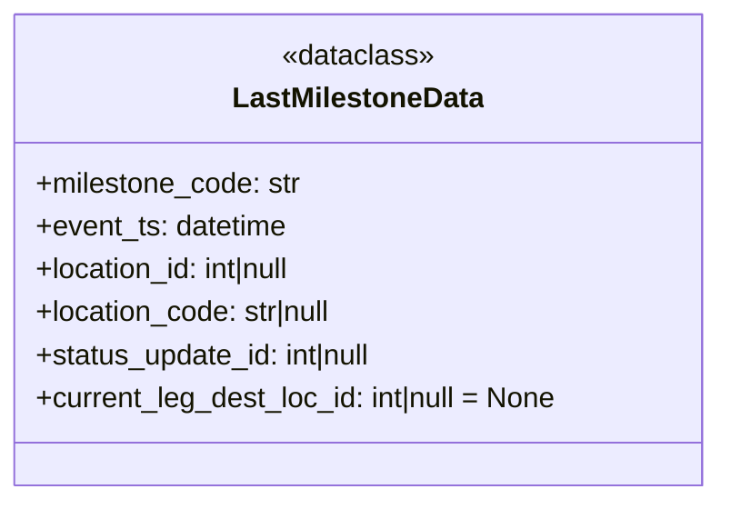

# Diagram: entity_core/entity_service/entity_listener/entity_listener_service/db/models/last_milestone_data.py

> Auto-generated by Obscura crawlers

## Mermaid

> SVG rendering failed for this diagram.
