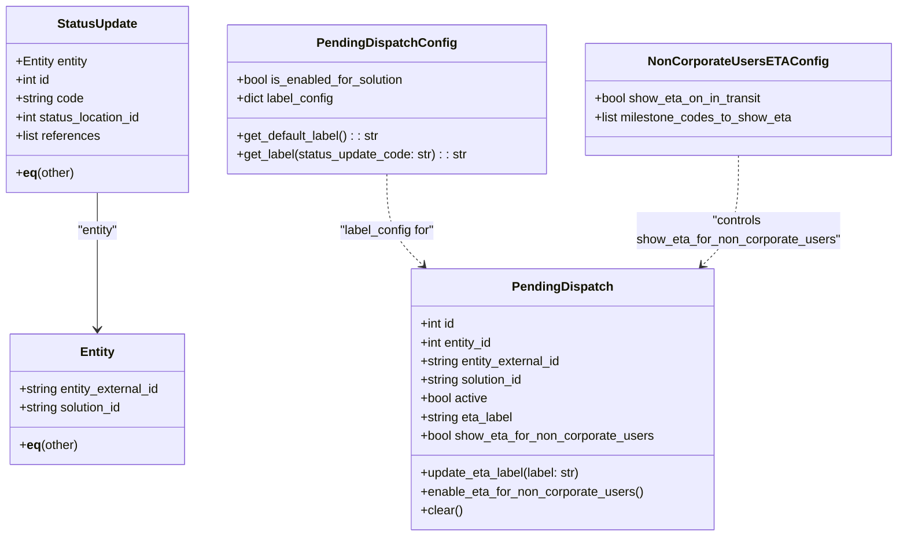

# Diagram: entity_core/entity_service/entity_listener/entity_listener_service/db/models/pending_dispatch.py

> Auto-generated by Obscura crawlers

## Mermaid

### SVG

<svg id="container" width="1149.75" xmlns="http://www.w3.org/2000/svg" class="classDiagram" height="690" viewBox="0 0 1149.75 690" role="graphics-document document" aria-roledescription="class"><g><defs><marker id="container_class-aggregationStart" class="marker aggregation class" refX="18" refY="7" markerWidth="190" markerHeight="240" orient="auto"><path d="M 18,7 L9,13 L1,7 L9,1 Z"></path></marker></defs><defs><marker id="container_class-aggregationEnd" class="marker aggregation class" refX="1" refY="7" markerWidth="20" markerHeight="28" orient="auto"><path d="M 18,7 L9,13 L1,7 L9,1 Z"></path></marker></defs><defs><marker id="container_class-extensionStart" class="marker extension class" refX="18" refY="7" markerWidth="190" markerHeight="240" orient="auto"><path d="M 1,7 L18,13 V 1 Z"></path></marker></defs><defs><marker id="container_class-extensionEnd" class="marker extension class" refX="1" refY="7" markerWidth="20" markerHeight="28" orient="auto"><path d="M 1,1 V 13 L18,7 Z"></path></marker></defs><defs><marker id="container_class-compositionStart" class="marker composition class" refX="18" refY="7" markerWidth="190" markerHeight="240" orient="auto"><path d="M 18,7 L9,13 L1,7 L9,1 Z"></path></marker></defs><defs><marker id="container_class-compositionEnd" class="marker composition class" refX="1" refY="7" markerWidth="20" markerHeight="28" orient="auto"><path d="M 18,7 L9,13 L1,7 L9,1 Z"></path></marker></defs><defs><marker id="container_class-dependencyStart" class="marker dependency class" refX="6" refY="7" markerWidth="190" markerHeight="240" orient="auto"><path d="M 5,7 L9,13 L1,7 L9,1 Z"></path></marker></defs><defs><marker id="container_class-dependencyEnd" class="marker dependency class" refX="13" refY="7" markerWidth="20" markerHeight="28" orient="auto"><path d="M 18,7 L9,13 L14,7 L9,1 Z"></path></marker></defs><defs><marker id="container_class-lollipopStart" class="marker lollipop class" refX="13" refY="7" markerWidth="190" markerHeight="240" orient="auto"><circle stroke="black" fill="transparent" cx="7" cy="7" r="6"></circle></marker></defs><defs><marker id="container_class-lollipopEnd" class="marker lollipop class" refX="1" refY="7" markerWidth="190" markerHeight="240" orient="auto"><circle stroke="black" fill="transparent" cx="7" cy="7" r="6"></circle></marker></defs><g class="root"><g class="clusters"></g><g class="edgePaths"><path d="M127.852,248L127.852,256.167C127.852,264.333,127.852,280.667,127.852,310C127.852,339.333,127.852,381.667,127.852,402.833L127.852,424" id="id_StatusUpdate_Entity_1" class="edge-thickness-normal edge-pattern-solid relation" style=";;;" data-edge="true" data-et="edge" data-id="id_StatusUpdate_Entity_1" data-points="W3sieCI6MTI3Ljg1MTU2MjUsInkiOjI0OH0seyJ4IjoxMjcuODUxNTYyNSwieSI6Mjk3fSx7IngiOjEyNy44NTE1NjI1LCJ5Ijo0MzB9XQ==" marker-end="url(#container_class-dependencyEnd)"></path><path d="M501.258,224L501.258,236.167C501.258,248.333,501.258,272.667,508.952,292.303C516.646,311.94,532.035,326.88,539.729,334.35L547.423,341.821" id="id_PendingDispatchConfig_PendingDispatch_2" class="edge-thickness-normal edge-pattern-dashed relation" style=";;;" data-edge="true" data-et="edge" data-id="id_PendingDispatchConfig_PendingDispatch_2" data-points="W3sieCI6NTAxLjI1NzgxMjUsInkiOjIyNH0seyJ4Ijo1MDEuMjU3ODEyNSwieSI6Mjk3fSx7IngiOjU1MS43MjgyMDA2MDQ4Mzg4LCJ5IjozNDZ9XQ==" marker-end="url(#container_class-dependencyEnd)"></path><path d="M948.281,200L948.281,216.167C948.281,232.333,948.281,264.667,940.587,288.303C932.893,311.94,917.504,326.88,909.81,334.35L902.116,341.821" id="id_NonCorporateUsersETAConfig_PendingDispatch_3" class="edge-thickness-normal edge-pattern-dashed relation" style=";;;" data-edge="true" data-et="edge" data-id="id_NonCorporateUsersETAConfig_PendingDispatch_3" data-points="W3sieCI6OTQ4LjI4MTI1LCJ5IjoyMDB9LHsieCI6OTQ4LjI4MTI1LCJ5IjoyOTd9LHsieCI6ODk3LjgxMDg2MTg5NTE2MTIsInkiOjM0Nn1d" marker-end="url(#container_class-dependencyEnd)"></path></g><g class="edgeLabels"><g class="edgeLabel" transform="translate(127.8515625, 297)"><g class="label" data-id="id_StatusUpdate_Entity_1" transform="translate(-27.28125, -12)"><foreignObject width="54.5625" height="24">

"entity"

</foreignObject></g></g><g class="edgeLabel" transform="translate(501.2578125, 297)"><g class="label" data-id="id_PendingDispatchConfig_PendingDispatch_2" transform="translate(-62.796875, -12)"><foreignObject width="125.59375" height="24">

"label_config for"

</foreignObject></g></g><g class="edgeLabel" transform="translate(948.28125, 297)"><g class="label" data-id="id_NonCorporateUsersETAConfig_PendingDispatch_3" transform="translate(-131.6484375, -24)"><foreignObject width="263.296875" height="48">

"controls show_eta_for_non_corporate_users"

</foreignObject></g></g></g><g class="nodes"><g class="node default" id="classId-PendingDispatch-0" transform="translate(724.76953125, 514)"><g class="basic label-container"><path d="M-193.87109375 -168 L193.87109375 -168 L193.87109375 168 L-193.87109375 168" stroke="none" stroke-width="0" fill="#ECECFF" style=""></path><path d="M-193.87109375 -168 C-73.41657373071473 -168, 47.03794628857054 -168, 193.87109375 -168 M-193.87109375 -168 C-108.48089439431051 -168, -23.09069503862102 -168, 193.87109375 -168 M193.87109375 -168 C193.87109375 -62.32403255519819, 193.87109375 43.351934889603626, 193.87109375 168 M193.87109375 -168 C193.87109375 -91.26064720543991, 193.87109375 -14.521294410879818, 193.87109375 168 M193.87109375 168 C48.04574977719 168, -97.77959419562 168, -193.87109375 168 M193.87109375 168 C75.11206022019302 168, -43.64697330961397 168, -193.87109375 168 M-193.87109375 168 C-193.87109375 100.34623853549547, -193.87109375 32.69247707099095, -193.87109375 -168 M-193.87109375 168 C-193.87109375 46.8563684932257, -193.87109375 -74.2872630135486, -193.87109375 -168" stroke="#9370DB" stroke-width="1.3" fill="none" stroke-dasharray="0 0" style=""></path></g><g class="annotation-group text" transform="translate(0, -144)"></g><g class="label-group text" transform="translate(-61.4765625, -144)"><g class="label" style="font-weight: bolder" transform="translate(0,-12)"><foreignObject width="122.953125" height="24">

PendingDispatch

</foreignObject></g></g><g class="members-group text" transform="translate(-181.87109375, -96)"><g class="label" style="" transform="translate(0,-12)"><foreignObject width="45.96875" height="24">

+int id

</foreignObject></g><g class="label" style="" transform="translate(0,12)"><foreignObject width="95.765625" height="24">

+int entity_id

</foreignObject></g><g class="label" style="" transform="translate(0,36)"><foreignObject width="185.109375" height="24">

+string entity_external_id

</foreignObject></g><g class="label" style="" transform="translate(0,60)"><foreignObject width="136.09375" height="24">

+string solution_id

</foreignObject></g><g class="label" style="" transform="translate(0,84)"><foreignObject width="88.28125" height="24">

+bool active

</foreignObject></g><g class="label" style="" transform="translate(0,108)"><foreignObject width="121.34375" height="24">

+string eta_label

</foreignObject></g><g class="label" style="" transform="translate(0,132)"><foreignObject width="302.265625" height="24">

+bool show_eta_for_non_corporate_users

</foreignObject></g></g><g class="methods-group text" transform="translate(-181.87109375, 96)"><g class="label" style="" transform="translate(0,-12)"><foreignObject width="208.75" height="24">

+update_eta_label(label: str)

</foreignObject></g><g class="label" style="" transform="translate(0,12)"><foreignObject width="287.484375" height="24">

+enable_eta_for_non_corporate_users()

</foreignObject></g><g class="label" style="" transform="translate(0,36)"><foreignObject width="54.0625" height="24">

+clear()

</foreignObject></g></g><g class="divider" style=""><path d="M-193.87109375 -120 C-85.98871097002494 -120, 21.89367180995012 -120, 193.87109375 -120 M-193.87109375 -120 C-72.28848069314168 -120, 49.29413236371664 -120, 193.87109375 -120" stroke="#9370DB" stroke-width="1.3" fill="none" stroke-dasharray="0 0" style=""></path></g><g class="divider" style=""><path d="M-193.87109375 72 C-67.10254924607212 72, 59.66599525785577 72, 193.87109375 72 M-193.87109375 72 C-57.83868399507284 72, 78.19372575985432 72, 193.87109375 72" stroke="#9370DB" stroke-width="1.3" fill="none" stroke-dasharray="0 0" style=""></path></g></g><g class="node default" id="classId-Entity-1" transform="translate(127.8515625, 514)"><g class="basic label-container"><path d="M-115.1953125 -84 L115.1953125 -84 L115.1953125 84 L-115.1953125 84" stroke="none" stroke-width="0" fill="#ECECFF" style=""></path><path d="M-115.1953125 -84 C-28.091723273073114 -84, 59.01186595385377 -84, 115.1953125 -84 M-115.1953125 -84 C-45.0376367679835 -84, 25.120038964033 -84, 115.1953125 -84 M115.1953125 -84 C115.1953125 -29.370156775351333, 115.1953125 25.259686449297334, 115.1953125 84 M115.1953125 -84 C115.1953125 -28.16393635553151, 115.1953125 27.672127288936977, 115.1953125 84 M115.1953125 84 C34.3037657200438 84, -46.5877810599124 84, -115.1953125 84 M115.1953125 84 C58.471219620152624 84, 1.747126740305248 84, -115.1953125 84 M-115.1953125 84 C-115.1953125 27.463701779212492, -115.1953125 -29.072596441575016, -115.1953125 -84 M-115.1953125 84 C-115.1953125 40.33161555871961, -115.1953125 -3.3367688825607758, -115.1953125 -84" stroke="#9370DB" stroke-width="1.3" fill="none" stroke-dasharray="0 0" style=""></path></g><g class="annotation-group text" transform="translate(0, -60)"></g><g class="label-group text" transform="translate(-21.28125, -60)"><g class="label" style="font-weight: bolder" transform="translate(0,-12)"><foreignObject width="42.5625" height="24">

Entity

</foreignObject></g></g><g class="members-group text" transform="translate(-103.1953125, -12)"><g class="label" style="" transform="translate(0,-12)"><foreignObject width="185.109375" height="24">

+string entity_external_id

</foreignObject></g><g class="label" style="" transform="translate(0,12)"><foreignObject width="136.09375" height="24">

+string solution_id

</foreignObject></g></g><g class="methods-group text" transform="translate(-103.1953125, 60)"><g class="label" style="" transform="translate(0,-12)"><foreignObject width="76.1875" height="24">

+<strong>eq</strong>(other)

</foreignObject></g></g><g class="divider" style=""><path d="M-115.1953125 -36 C-23.906364172595815 -36, 67.38258415480837 -36, 115.1953125 -36 M-115.1953125 -36 C-67.18233654111516 -36, -19.169360582230325 -36, 115.1953125 -36" stroke="#9370DB" stroke-width="1.3" fill="none" stroke-dasharray="0 0" style=""></path></g><g class="divider" style=""><path d="M-115.1953125 36 C-62.66516199855463 36, -10.13501149710926 36, 115.1953125 36 M-115.1953125 36 C-51.9345697109446 36, 11.326173078110799 36, 115.1953125 36" stroke="#9370DB" stroke-width="1.3" fill="none" stroke-dasharray="0 0" style=""></path></g></g><g class="node default" id="classId-StatusUpdate-2" transform="translate(127.8515625, 128)"><g class="basic label-container"><path d="M-119.8515625 -120 L119.8515625 -120 L119.8515625 120 L-119.8515625 120" stroke="none" stroke-width="0" fill="#ECECFF" style=""></path><path d="M-119.8515625 -120 C-55.98764817069031 -120, 7.876266158619373 -120, 119.8515625 -120 M-119.8515625 -120 C-33.12939611378948 -120, 53.592770272421035 -120, 119.8515625 -120 M119.8515625 -120 C119.8515625 -30.170648847107316, 119.8515625 59.65870230578537, 119.8515625 120 M119.8515625 -120 C119.8515625 -61.31976480534311, 119.8515625 -2.6395296106862247, 119.8515625 120 M119.8515625 120 C55.978108246288805 120, -7.89534600742239 120, -119.8515625 120 M119.8515625 120 C40.29856945353714 120, -39.25442359292572 120, -119.8515625 120 M-119.8515625 120 C-119.8515625 55.54198625509177, -119.8515625 -8.916027489816457, -119.8515625 -120 M-119.8515625 120 C-119.8515625 47.76988727380942, -119.8515625 -24.460225452381167, -119.8515625 -120" stroke="#9370DB" stroke-width="1.3" fill="none" stroke-dasharray="0 0" style=""></path></g><g class="annotation-group text" transform="translate(0, -96)"></g><g class="label-group text" transform="translate(-50.015625, -96)"><g class="label" style="font-weight: bolder" transform="translate(0,-12)"><foreignObject width="100.03125" height="24">

StatusUpdate

</foreignObject></g></g><g class="members-group text" transform="translate(-107.8515625, -48)"><g class="label" style="" transform="translate(0,-12)"><foreignObject width="95.8125" height="24">

+Entity entity

</foreignObject></g><g class="label" style="" transform="translate(0,12)"><foreignObject width="45.96875" height="24">

+int id

</foreignObject></g><g class="label" style="" transform="translate(0,36)"><foreignObject width="88.828125" height="24">

+string code

</foreignObject></g><g class="label" style="" transform="translate(0,60)"><foreignObject width="165.6875" height="24">

+int status_location_id

</foreignObject></g><g class="label" style="" transform="translate(0,84)"><foreignObject width="110.328125" height="24">

+list references

</foreignObject></g></g><g class="methods-group text" transform="translate(-107.8515625, 96)"><g class="label" style="" transform="translate(0,-12)"><foreignObject width="76.1875" height="24">

+<strong>eq</strong>(other)

</foreignObject></g></g><g class="divider" style=""><path d="M-119.8515625 -72 C-60.333754702419874 -72, -0.8159469048397483 -72, 119.8515625 -72 M-119.8515625 -72 C-40.468389301867504 -72, 38.91478389626499 -72, 119.8515625 -72" stroke="#9370DB" stroke-width="1.3" fill="none" stroke-dasharray="0 0" style=""></path></g><g class="divider" style=""><path d="M-119.8515625 72 C-56.996418668983836 72, 5.858725162032329 72, 119.8515625 72 M-119.8515625 72 C-40.06401936997504 72, 39.723523760049915 72, 119.8515625 72" stroke="#9370DB" stroke-width="1.3" fill="none" stroke-dasharray="0 0" style=""></path></g></g><g class="node default" id="classId-PendingDispatchConfig-3" transform="translate(501.2578125, 128)"><g class="basic label-container"><path d="M-203.5546875 -96 L203.5546875 -96 L203.5546875 96 L-203.5546875 96" stroke="none" stroke-width="0" fill="#ECECFF" style=""></path><path d="M-203.5546875 -96 C-42.41552428439161 -96, 118.72363893121678 -96, 203.5546875 -96 M-203.5546875 -96 C-98.85644317279683 -96, 5.84180115440634 -96, 203.5546875 -96 M203.5546875 -96 C203.5546875 -26.21705619560511, 203.5546875 43.56588760878978, 203.5546875 96 M203.5546875 -96 C203.5546875 -56.158938304857216, 203.5546875 -16.317876609714432, 203.5546875 96 M203.5546875 96 C75.60646342149224 96, -52.34176065701553 96, -203.5546875 96 M203.5546875 96 C111.37538817446824 96, 19.196088848936483 96, -203.5546875 96 M-203.5546875 96 C-203.5546875 22.373207065504673, -203.5546875 -51.253585868990655, -203.5546875 -96 M-203.5546875 96 C-203.5546875 53.205130005193595, -203.5546875 10.41026001038719, -203.5546875 -96" stroke="#9370DB" stroke-width="1.3" fill="none" stroke-dasharray="0 0" style=""></path></g><g class="annotation-group text" transform="translate(0, -72)"></g><g class="label-group text" transform="translate(-84.40625, -72)"><g class="label" style="font-weight: bolder" transform="translate(0,-12)"><foreignObject width="168.8125" height="24">

PendingDispatchConfig

</foreignObject></g></g><g class="members-group text" transform="translate(-191.5546875, -24)"><g class="label" style="" transform="translate(0,-12)"><foreignObject width="219.5625" height="24">

+bool is_enabled_for_solution

</foreignObject></g><g class="label" style="" transform="translate(0,12)"><foreignObject width="127.53125" height="24">

+dict label_config

</foreignObject></g></g><g class="methods-group text" transform="translate(-191.5546875, 48)"><g class="label" style="" transform="translate(0,-12)"><foreignObject width="184.90625" height="24">

+get_default_label() : : str

</foreignObject></g><g class="label" style="" transform="translate(0,12)"><foreignObject width="298.703125" height="24">

+get_label(status_update_code: str) : : str

</foreignObject></g></g><g class="divider" style=""><path d="M-203.5546875 -48 C-101.8250525161775 -48, -0.09541753235498618 -48, 203.5546875 -48 M-203.5546875 -48 C-87.12042680417915 -48, 29.313833891641707 -48, 203.5546875 -48" stroke="#9370DB" stroke-width="1.3" fill="none" stroke-dasharray="0 0" style=""></path></g><g class="divider" style=""><path d="M-203.5546875 24 C-50.83035673955314 24, 101.89397402089372 24, 203.5546875 24 M-203.5546875 24 C-61.57172184797929 24, 80.41124380404142 24, 203.5546875 24" stroke="#9370DB" stroke-width="1.3" fill="none" stroke-dasharray="0 0" style=""></path></g></g><g class="node default" id="classId-NonCorporateUsersETAConfig-4" transform="translate(948.28125, 128)"><g class="basic label-container"><path d="M-193.46875 -72 L193.46875 -72 L193.46875 72 L-193.46875 72" stroke="none" stroke-width="0" fill="#ECECFF" style=""></path><path d="M-193.46875 -72 C-48.05931505383754 -72, 97.35011989232493 -72, 193.46875 -72 M-193.46875 -72 C-104.80982960676344 -72, -16.150909213526887 -72, 193.46875 -72 M193.46875 -72 C193.46875 -41.61562752109853, 193.46875 -11.231255042197056, 193.46875 72 M193.46875 -72 C193.46875 -30.98634927856032, 193.46875 10.027301442879363, 193.46875 72 M193.46875 72 C97.05874590682139 72, 0.6487418136427721 72, -193.46875 72 M193.46875 72 C68.05063672596596 72, -57.36747654806808 72, -193.46875 72 M-193.46875 72 C-193.46875 21.45448432126601, -193.46875 -29.091031357467983, -193.46875 -72 M-193.46875 72 C-193.46875 26.698521617265982, -193.46875 -18.602956765468036, -193.46875 -72" stroke="#9370DB" stroke-width="1.3" fill="none" stroke-dasharray="0 0" style=""></path></g><g class="annotation-group text" transform="translate(0, -48)"></g><g class="label-group text" transform="translate(-107.15625, -48)"><g class="label" style="font-weight: bolder" transform="translate(0,-12)"><foreignObject width="214.3125" height="24">

NonCorporateUsersETAConfig

</foreignObject></g></g><g class="members-group text" transform="translate(-181.46875, 0)"><g class="label" style="" transform="translate(0,-12)"><foreignObject width="217.703125" height="24">

+bool show_eta_on_in_transit

</foreignObject></g><g class="label" style="" transform="translate(0,12)"><foreignObject width="255.78125" height="24">

+list milestone_codes_to_show_eta

</foreignObject></g></g><g class="methods-group text" transform="translate(-181.46875, 72)"></g><g class="divider" style=""><path d="M-193.46875 -24 C-86.60225571136782 -24, 20.264238577264365 -24, 193.46875 -24 M-193.46875 -24 C-42.609534245946605 -24, 108.24968150810679 -24, 193.46875 -24" stroke="#9370DB" stroke-width="1.3" fill="none" stroke-dasharray="0 0" style=""></path></g><g class="divider" style=""><path d="M-193.46875 48 C-52.77906832748047 48, 87.91061334503905 48, 193.46875 48 M-193.46875 48 C-104.43680707733435 48, -15.4048641546687 48, 193.46875 48" stroke="#9370DB" stroke-width="1.3" fill="none" stroke-dasharray="0 0" style=""></path></g></g></g></g></g></svg>
