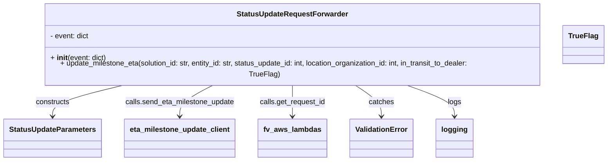
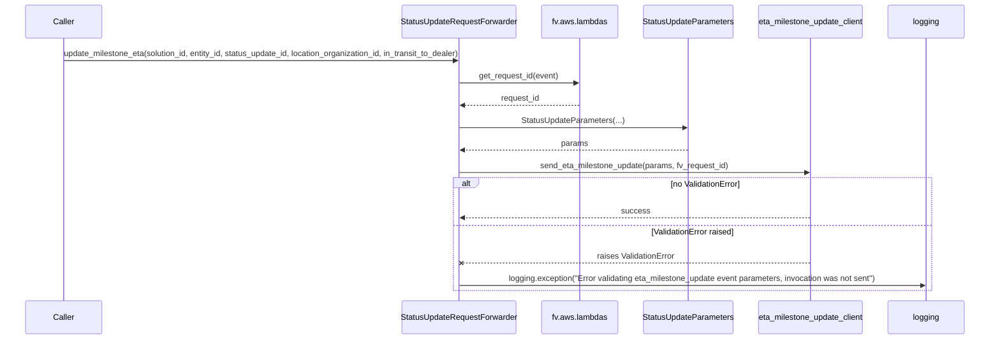

# Diagram: entity_core/entity_service/entity_listener/entity_listener_service/forwarders/status_update_forwarder.py

> Auto-generated by Obscura crawlers

## Diagram 1

### SVG

<svg id="container" width="1334.859375" xmlns="http://www.w3.org/2000/svg" class="classDiagram" height="342" viewBox="0 0 1334.859375 342" role="graphics-document document" aria-roledescription="class"><g><defs><marker id="container_class-aggregationStart" class="marker aggregation class" refX="18" refY="7" markerWidth="190" markerHeight="240" orient="auto"><path d="M 18,7 L9,13 L1,7 L9,1 Z"></path></marker></defs><defs><marker id="container_class-aggregationEnd" class="marker aggregation class" refX="1" refY="7" markerWidth="20" markerHeight="28" orient="auto"><path d="M 18,7 L9,13 L1,7 L9,1 Z"></path></marker></defs><defs><marker id="container_class-extensionStart" class="marker extension class" refX="18" refY="7" markerWidth="190" markerHeight="240" orient="auto"><path d="M 1,7 L18,13 V 1 Z"></path></marker></defs><defs><marker id="container_class-extensionEnd" class="marker extension class" refX="1" refY="7" markerWidth="20" markerHeight="28" orient="auto"><path d="M 1,1 V 13 L18,7 Z"></path></marker></defs><defs><marker id="container_class-compositionStart" class="marker composition class" refX="18" refY="7" markerWidth="190" markerHeight="240" orient="auto"><path d="M 18,7 L9,13 L1,7 L9,1 Z"></path></marker></defs><defs><marker id="container_class-compositionEnd" class="marker composition class" refX="1" refY="7" markerWidth="20" markerHeight="28" orient="auto"><path d="M 18,7 L9,13 L1,7 L9,1 Z"></path></marker></defs><defs><marker id="container_class-dependencyStart" class="marker dependency class" refX="6" refY="7" markerWidth="190" markerHeight="240" orient="auto"><path d="M 5,7 L9,13 L1,7 L9,1 Z"></path></marker></defs><defs><marker id="container_class-dependencyEnd" class="marker dependency class" refX="13" refY="7" markerWidth="20" markerHeight="28" orient="auto"><path d="M 18,7 L9,13 L14,7 L9,1 Z"></path></marker></defs><defs><marker id="container_class-lollipopStart" class="marker lollipop class" refX="13" refY="7" markerWidth="190" markerHeight="240" orient="auto"><circle stroke="black" fill="transparent" cx="7" cy="7" r="6"></circle></marker></defs><defs><marker id="container_class-lollipopEnd" class="marker lollipop class" refX="1" refY="7" markerWidth="190" markerHeight="240" orient="auto"><circle stroke="black" fill="transparent" cx="7" cy="7" r="6"></circle></marker></defs><g class="root"><g class="clusters"></g><g class="edgePaths"><path d="M268.304,176L242.187,182.167C216.07,188.333,163.836,200.667,137.719,212C111.602,223.333,111.602,233.667,111.602,238.833L111.602,244" id="id_StatusUpdateRequestForwarder_StatusUpdateParameters_1" class="edge-thickness-normal edge-pattern-solid relation" style=";;;" data-edge="true" data-et="edge" data-id="id_StatusUpdateRequestForwarder_StatusUpdateParameters_1" data-points="W3sieCI6MjY4LjMwNDQ5MzgwMTY1MjksInkiOjE3Nn0seyJ4IjoxMTEuNjAxNTYyNSwieSI6MjEzfSx7IngiOjExMS42MDE1NjI1LCJ5IjoyNTB9XQ==" marker-end="url(#container_class-dependencyEnd)"></path><path d="M457.131,176L444.876,182.167C432.621,188.333,408.111,200.667,395.856,212C383.602,223.333,383.602,233.667,383.602,238.833L383.602,244" id="id_StatusUpdateRequestForwarder_eta_milestone_update_client_2" class="edge-thickness-normal edge-pattern-solid relation" style=";;;" data-edge="true" data-et="edge" data-id="id_StatusUpdateRequestForwarder_eta_milestone_update_client_2" data-points="W3sieCI6NDU3LjEzMDk0MDA4MjY0NDY2LCJ5IjoxNzZ9LHsieCI6MzgzLjYwMTU2MjUsInkiOjIxM30seyJ4IjozODMuNjAxNTYyNSwieSI6MjUwfV0=" marker-end="url(#container_class-dependencyEnd)"></path><path d="M624.063,176L624.063,182.167C624.063,188.333,624.063,200.667,624.063,212C624.063,223.333,624.063,233.667,624.063,238.833L624.063,244" id="id_StatusUpdateRequestForwarder_fv_aws_lambdas_3" class="edge-thickness-normal edge-pattern-solid relation" style=";;;" data-edge="true" data-et="edge" data-id="id_StatusUpdateRequestForwarder_fv_aws_lambdas_3" data-points="W3sieCI6NjI0LjA2MjUsInkiOjE3Nn0seyJ4Ijo2MjQuMDYyNSwieSI6MjEzfSx7IngiOjYyNC4wNjI1LCJ5IjoyNTB9XQ==" marker-end="url(#container_class-dependencyEnd)"></path><path d="M755.437,176L765.082,182.167C774.726,188.333,794.016,200.667,803.66,212C813.305,223.333,813.305,233.667,813.305,238.833L813.305,244" id="id_StatusUpdateRequestForwarder_ValidationError_4" class="edge-thickness-normal edge-pattern-solid relation" style=";;;" data-edge="true" data-et="edge" data-id="id_StatusUpdateRequestForwarder_ValidationError_4" data-points="W3sieCI6NzU1LjQzNzI0MTczNTUzNzIsInkiOjE3Nn0seyJ4Ijo4MTMuMzA0Njg3NSwieSI6MjEzfSx7IngiOjgxMy4zMDQ2ODc1LCJ5IjoyNTB9XQ==" marker-end="url(#container_class-dependencyEnd)"></path><path d="M863.935,176L881.545,182.167C899.155,188.333,934.374,200.667,951.984,212C969.594,223.333,969.594,233.667,969.594,238.833L969.594,244" id="id_StatusUpdateRequestForwarder_logging_5" class="edge-thickness-normal edge-pattern-solid relation" style=";;;" data-edge="true" data-et="edge" data-id="id_StatusUpdateRequestForwarder_logging_5" data-points="W3sieCI6ODYzLjkzNTQzMzg4NDI5NzUsInkiOjE3Nn0seyJ4Ijo5NjkuNTkzNzUsInkiOjIxM30seyJ4Ijo5NjkuNTkzNzUsInkiOjI1MH1d" marker-end="url(#container_class-dependencyEnd)"></path></g><g class="edgeLabels"><g class="edgeLabel" transform="translate(111.6015625, 213)"><g class="label" data-id="id_StatusUpdateRequestForwarder_StatusUpdateParameters_1" transform="translate(-37.84375, -12)"><foreignObject width="75.6875" height="24">

constructs

</foreignObject></g></g><g class="edgeLabel" transform="translate(383.6015625, 213)"><g class="label" data-id="id_StatusUpdateRequestForwarder_eta_milestone_update_client_2" transform="translate(-121.1796875, -12)"><foreignObject width="242.359375" height="24">

calls.send_eta_milestone_update

</foreignObject></g></g><g class="edgeLabel" transform="translate(624.0625, 213)"><g class="label" data-id="id_StatusUpdateRequestForwarder_fv_aws_lambdas_3" transform="translate(-72.5546875, -12)"><foreignObject width="145.109375" height="24">

calls.get_request_id

</foreignObject></g></g><g class="edgeLabel" transform="translate(813.3046875, 213)"><g class="label" data-id="id_StatusUpdateRequestForwarder_ValidationError_4" transform="translate(-27.4765625, -12)"><foreignObject width="54.953125" height="24">

catches

</foreignObject></g></g><g class="edgeLabel" transform="translate(969.59375, 213)"><g class="label" data-id="id_StatusUpdateRequestForwarder_logging_5" transform="translate(-14.8203125, -12)"><foreignObject width="29.640625" height="24">

logs

</foreignObject></g></g></g><g class="nodes"><g class="node default" id="classId-StatusUpdateRequestForwarder-0" transform="translate(624.0625, 92)"><g class="basic label-container"><path d="M-566.5 -84 L566.5 -84 L566.5 84 L-566.5 84" stroke="none" stroke-width="0" fill="#ECECFF" style=""></path><path d="M-566.5 -84 C-202.00826886445918 -84, 162.48346227108163 -84, 566.5 -84 M-566.5 -84 C-218.52730856058423 -84, 129.44538287883154 -84, 566.5 -84 M566.5 -84 C566.5 -25.715377613618045, 566.5 32.56924477276391, 566.5 84 M566.5 -84 C566.5 -32.07499817562539, 566.5 19.850003648749222, 566.5 84 M566.5 84 C259.3900083996296 84, -47.719983200740785 84, -566.5 84 M566.5 84 C245.83027678229365 84, -74.8394464354127 84, -566.5 84 M-566.5 84 C-566.5 22.875753337163644, -566.5 -38.24849332567271, -566.5 -84 M-566.5 84 C-566.5 49.8641679705897, -566.5 15.728335941179395, -566.5 -84" stroke="#9370DB" stroke-width="1.3" fill="none" stroke-dasharray="0 0" style=""></path></g><g class="annotation-group text" transform="translate(0, -60)"></g><g class="label-group text" transform="translate(-117.140625, -60)"><g class="label" style="font-weight: bolder" transform="translate(0,-12)"><foreignObject width="234.28125" height="24">

StatusUpdateRequestForwarder

</foreignObject></g></g><g class="members-group text" transform="translate(-554.5, -12)"><g class="label" style="" transform="translate(0,-12)"><foreignObject width="86.6875" height="24">

- event: dict

</foreignObject></g></g><g class="methods-group text" transform="translate(-554.5, 36)"><g class="label" style="" transform="translate(0,-12)"><foreignObject width="123.03125" height="24">

+ <strong>init</strong>(event: dict)

</foreignObject></g><g class="label" style="" transform="translate(0,12)"><foreignObject width="991.859375" height="24">

+ update_milestone_eta(solution_id: str, entity_id: str, status_update_id: int, location_organization_id: int, in_transit_to_dealer: TrueFlag)

</foreignObject></g></g><g class="divider" style=""><path d="M-566.5 -36 C-203.20904484249104 -36, 160.08191031501792 -36, 566.5 -36 M-566.5 -36 C-304.7437295961514 -36, -42.98745919230282 -36, 566.5 -36" stroke="#9370DB" stroke-width="1.3" fill="none" stroke-dasharray="0 0" style=""></path></g><g class="divider" style=""><path d="M-566.5 12 C-128.20577747045854 12, 310.0884450590829 12, 566.5 12 M-566.5 12 C-278.28456130138386 12, 9.93087739723228 12, 566.5 12" stroke="#9370DB" stroke-width="1.3" fill="none" stroke-dasharray="0 0" style=""></path></g></g><g class="node default" id="classId-StatusUpdateParameters-1" transform="translate(111.6015625, 292)"><g class="basic label-container"><path d="M-103.6015625 -42 L103.6015625 -42 L103.6015625 42 L-103.6015625 42" stroke="none" stroke-width="0" fill="#ECECFF" style=""></path><path d="M-103.6015625 -42 C-58.47725434272468 -42, -13.352946185449355 -42, 103.6015625 -42 M-103.6015625 -42 C-58.9924796978701 -42, -14.383396895740205 -42, 103.6015625 -42 M103.6015625 -42 C103.6015625 -17.05812804215343, 103.6015625 7.883743915693138, 103.6015625 42 M103.6015625 -42 C103.6015625 -23.74457940276717, 103.6015625 -5.489158805534338, 103.6015625 42 M103.6015625 42 C61.61362537739093 42, 19.625688254781863 42, -103.6015625 42 M103.6015625 42 C42.69691464473876 42, -18.207733210522477 42, -103.6015625 42 M-103.6015625 42 C-103.6015625 10.58052000256141, -103.6015625 -20.83895999487718, -103.6015625 -42 M-103.6015625 42 C-103.6015625 8.62156146210652, -103.6015625 -24.75687707578696, -103.6015625 -42" stroke="#9370DB" stroke-width="1.3" fill="none" stroke-dasharray="0 0" style=""></path></g><g class="annotation-group text" transform="translate(0, -18)"></g><g class="label-group text" transform="translate(-91.6015625, -18)"><g class="label" style="font-weight: bolder" transform="translate(0,-12)"><foreignObject width="183.203125" height="24">

StatusUpdateParameters

</foreignObject></g></g><g class="members-group text" transform="translate(-91.6015625, 30)"></g><g class="methods-group text" transform="translate(-91.6015625, 60)"></g><g class="divider" style=""><path d="M-103.6015625 6 C-49.921911687407466 6, 3.7577391251850685 6, 103.6015625 6 M-103.6015625 6 C-58.306471173377005 6, -13.01137984675401 6, 103.6015625 6" stroke="#9370DB" stroke-width="1.3" fill="none" stroke-dasharray="0 0" style=""></path></g><g class="divider" style=""><path d="M-103.6015625 24 C-26.51414599493546 24, 50.57327051012908 24, 103.6015625 24 M-103.6015625 24 C-51.49039869670364 24, 0.6207651065927138 24, 103.6015625 24" stroke="#9370DB" stroke-width="1.3" fill="none" stroke-dasharray="0 0" style=""></path></g></g><g class="node default" id="classId-TrueFlag-2" transform="translate(1283.7109375, 92)"><g class="basic label-container"><path d="M-43.1484375 -42 L43.1484375 -42 L43.1484375 42 L-43.1484375 42" stroke="none" stroke-width="0" fill="#ECECFF" style=""></path><path d="M-43.1484375 -42 C-23.11261473155112 -42, -3.076791963102238 -42, 43.1484375 -42 M-43.1484375 -42 C-22.520320752243702 -42, -1.8922040044874038 -42, 43.1484375 -42 M43.1484375 -42 C43.1484375 -16.7243166254792, 43.1484375 8.551366749041598, 43.1484375 42 M43.1484375 -42 C43.1484375 -24.548490290004242, 43.1484375 -7.096980580008484, 43.1484375 42 M43.1484375 42 C13.791346229337528 42, -15.565745041324945 42, -43.1484375 42 M43.1484375 42 C22.39986963027977 42, 1.6513017605595408 42, -43.1484375 42 M-43.1484375 42 C-43.1484375 19.412031209295602, -43.1484375 -3.175937581408796, -43.1484375 -42 M-43.1484375 42 C-43.1484375 12.154567931816949, -43.1484375 -17.690864136366102, -43.1484375 -42" stroke="#9370DB" stroke-width="1.3" fill="none" stroke-dasharray="0 0" style=""></path></g><g class="annotation-group text" transform="translate(0, -18)"></g><g class="label-group text" transform="translate(-31.1484375, -18)"><g class="label" style="font-weight: bolder" transform="translate(0,-12)"><foreignObject width="62.296875" height="24">

TrueFlag

</foreignObject></g></g><g class="members-group text" transform="translate(-31.1484375, 30)"></g><g class="methods-group text" transform="translate(-31.1484375, 60)"></g><g class="divider" style=""><path d="M-43.1484375 6 C-11.762116608112798 6, 19.624204283774404 6, 43.1484375 6 M-43.1484375 6 C-22.051990460942022 6, -0.9555434218840446 6, 43.1484375 6" stroke="#9370DB" stroke-width="1.3" fill="none" stroke-dasharray="0 0" style=""></path></g><g class="divider" style=""><path d="M-43.1484375 24 C-22.216853552415884 24, -1.2852696048317682 24, 43.1484375 24 M-43.1484375 24 C-20.723093496880782 24, 1.7022505062384354 24, 43.1484375 24" stroke="#9370DB" stroke-width="1.3" fill="none" stroke-dasharray="0 0" style=""></path></g></g><g class="node default" id="classId-eta_milestone_update_client-3" transform="translate(383.6015625, 292)"><g class="basic label-container"><path d="M-118.3984375 -42 L118.3984375 -42 L118.3984375 42 L-118.3984375 42" stroke="none" stroke-width="0" fill="#ECECFF" style=""></path><path d="M-118.3984375 -42 C-51.267442944843665 -42, 15.863551610312669 -42, 118.3984375 -42 M-118.3984375 -42 C-47.60952359615935 -42, 23.179390307681302 -42, 118.3984375 -42 M118.3984375 -42 C118.3984375 -23.863710168074455, 118.3984375 -5.72742033614891, 118.3984375 42 M118.3984375 -42 C118.3984375 -15.591456704396165, 118.3984375 10.81708659120767, 118.3984375 42 M118.3984375 42 C31.443993284185737 42, -55.510450931628526 42, -118.3984375 42 M118.3984375 42 C34.662059405687344 42, -49.07431868862531 42, -118.3984375 42 M-118.3984375 42 C-118.3984375 18.30995307113346, -118.3984375 -5.38009385773308, -118.3984375 -42 M-118.3984375 42 C-118.3984375 16.502229001816172, -118.3984375 -8.995541996367656, -118.3984375 -42" stroke="#9370DB" stroke-width="1.3" fill="none" stroke-dasharray="0 0" style=""></path></g><g class="annotation-group text" transform="translate(0, -18)"></g><g class="label-group text" transform="translate(-106.3984375, -18)"><g class="label" style="font-weight: bolder" transform="translate(0,-12)"><foreignObject width="212.796875" height="24">

eta_milestone_update_client

</foreignObject></g></g><g class="members-group text" transform="translate(-106.3984375, 30)"></g><g class="methods-group text" transform="translate(-106.3984375, 60)"></g><g class="divider" style=""><path d="M-118.3984375 6 C-65.29295036279619 6, -12.187463225592381 6, 118.3984375 6 M-118.3984375 6 C-33.63474040577175 6, 51.1289566884565 6, 118.3984375 6" stroke="#9370DB" stroke-width="1.3" fill="none" stroke-dasharray="0 0" style=""></path></g><g class="divider" style=""><path d="M-118.3984375 24 C-43.2538732415444 24, 31.890691016911205 24, 118.3984375 24 M-118.3984375 24 C-45.33723197931235 24, 27.7239735413753 24, 118.3984375 24" stroke="#9370DB" stroke-width="1.3" fill="none" stroke-dasharray="0 0" style=""></path></g></g><g class="node default" id="classId-fv_aws_lambdas-4" transform="translate(624.0625, 292)"><g class="basic label-container"><path d="M-72.0625 -42 L72.0625 -42 L72.0625 42 L-72.0625 42" stroke="none" stroke-width="0" fill="#ECECFF" style=""></path><path d="M-72.0625 -42 C-38.54746418652424 -42, -5.032428373048475 -42, 72.0625 -42 M-72.0625 -42 C-34.98547737576712 -42, 2.0915452484657635 -42, 72.0625 -42 M72.0625 -42 C72.0625 -16.437119209583443, 72.0625 9.125761580833114, 72.0625 42 M72.0625 -42 C72.0625 -10.731563451733628, 72.0625 20.536873096532744, 72.0625 42 M72.0625 42 C36.27737831777816 42, 0.49225663555631627 42, -72.0625 42 M72.0625 42 C42.068667414893696 42, 12.074834829787392 42, -72.0625 42 M-72.0625 42 C-72.0625 19.644947513323018, -72.0625 -2.710104973353964, -72.0625 -42 M-72.0625 42 C-72.0625 16.803035798774665, -72.0625 -8.393928402450669, -72.0625 -42" stroke="#9370DB" stroke-width="1.3" fill="none" stroke-dasharray="0 0" style=""></path></g><g class="annotation-group text" transform="translate(0, -18)"></g><g class="label-group text" transform="translate(-60.0625, -18)"><g class="label" style="font-weight: bolder" transform="translate(0,-12)"><foreignObject width="120.125" height="24">

fv_aws_lambdas

</foreignObject></g></g><g class="members-group text" transform="translate(-60.0625, 30)"></g><g class="methods-group text" transform="translate(-60.0625, 60)"></g><g class="divider" style=""><path d="M-72.0625 6 C-32.76615534483232 6, 6.530189310335359 6, 72.0625 6 M-72.0625 6 C-26.863106214347354 6, 18.33628757130529 6, 72.0625 6" stroke="#9370DB" stroke-width="1.3" fill="none" stroke-dasharray="0 0" style=""></path></g><g class="divider" style=""><path d="M-72.0625 24 C-15.526854447089086 24, 41.00879110582183 24, 72.0625 24 M-72.0625 24 C-38.246363636662515 24, -4.4302272733250305 24, 72.0625 24" stroke="#9370DB" stroke-width="1.3" fill="none" stroke-dasharray="0 0" style=""></path></g></g><g class="node default" id="classId-ValidationError-5" transform="translate(813.3046875, 292)"><g class="basic label-container"><path d="M-67.1796875 -42 L67.1796875 -42 L67.1796875 42 L-67.1796875 42" stroke="none" stroke-width="0" fill="#ECECFF" style=""></path><path d="M-67.1796875 -42 C-36.61529870363501 -42, -6.050909907270025 -42, 67.1796875 -42 M-67.1796875 -42 C-30.993993033577084 -42, 5.191701432845832 -42, 67.1796875 -42 M67.1796875 -42 C67.1796875 -15.39125717265167, 67.1796875 11.21748565469666, 67.1796875 42 M67.1796875 -42 C67.1796875 -13.886651781488837, 67.1796875 14.226696437022326, 67.1796875 42 M67.1796875 42 C23.96233861144652 42, -19.255010277106962 42, -67.1796875 42 M67.1796875 42 C23.91262692616769 42, -19.35443364766462 42, -67.1796875 42 M-67.1796875 42 C-67.1796875 20.15715668537019, -67.1796875 -1.6856866292596209, -67.1796875 -42 M-67.1796875 42 C-67.1796875 22.745670927133197, -67.1796875 3.4913418542663948, -67.1796875 -42" stroke="#9370DB" stroke-width="1.3" fill="none" stroke-dasharray="0 0" style=""></path></g><g class="annotation-group text" transform="translate(0, -18)"></g><g class="label-group text" transform="translate(-55.1796875, -18)"><g class="label" style="font-weight: bolder" transform="translate(0,-12)"><foreignObject width="110.359375" height="24">

ValidationError

</foreignObject></g></g><g class="members-group text" transform="translate(-55.1796875, 30)"></g><g class="methods-group text" transform="translate(-55.1796875, 60)"></g><g class="divider" style=""><path d="M-67.1796875 6 C-31.448775660795384 6, 4.282136178409232 6, 67.1796875 6 M-67.1796875 6 C-39.429787051387414 6, -11.679886602774829 6, 67.1796875 6" stroke="#9370DB" stroke-width="1.3" fill="none" stroke-dasharray="0 0" style=""></path></g><g class="divider" style=""><path d="M-67.1796875 24 C-19.733272915672472 24, 27.713141668655055 24, 67.1796875 24 M-67.1796875 24 C-14.01460702767725 24, 39.1504734446455 24, 67.1796875 24" stroke="#9370DB" stroke-width="1.3" fill="none" stroke-dasharray="0 0" style=""></path></g></g><g class="node default" id="classId-logging-6" transform="translate(969.59375, 292)"><g class="basic label-container"><path d="M-39.109375 -42 L39.109375 -42 L39.109375 42 L-39.109375 42" stroke="none" stroke-width="0" fill="#ECECFF" style=""></path><path d="M-39.109375 -42 C-19.45959642694863 -42, 0.19018214610274242 -42, 39.109375 -42 M-39.109375 -42 C-23.12247645938207 -42, -7.135577918764138 -42, 39.109375 -42 M39.109375 -42 C39.109375 -23.554359203384113, 39.109375 -5.108718406768226, 39.109375 42 M39.109375 -42 C39.109375 -9.859526330442343, 39.109375 22.280947339115315, 39.109375 42 M39.109375 42 C22.914693037976157 42, 6.720011075952314 42, -39.109375 42 M39.109375 42 C21.628105184338995 42, 4.146835368677991 42, -39.109375 42 M-39.109375 42 C-39.109375 10.873980101454325, -39.109375 -20.25203979709135, -39.109375 -42 M-39.109375 42 C-39.109375 16.496215268286026, -39.109375 -9.007569463427949, -39.109375 -42" stroke="#9370DB" stroke-width="1.3" fill="none" stroke-dasharray="0 0" style=""></path></g><g class="annotation-group text" transform="translate(0, -18)"></g><g class="label-group text" transform="translate(-27.109375, -18)"><g class="label" style="font-weight: bolder" transform="translate(0,-12)"><foreignObject width="54.21875" height="24">

logging

</foreignObject></g></g><g class="members-group text" transform="translate(-27.109375, 30)"></g><g class="methods-group text" transform="translate(-27.109375, 60)"></g><g class="divider" style=""><path d="M-39.109375 6 C-16.174258583464212 6, 6.760857833071576 6, 39.109375 6 M-39.109375 6 C-14.571190451653969 6, 9.966994096692062 6, 39.109375 6" stroke="#9370DB" stroke-width="1.3" fill="none" stroke-dasharray="0 0" style=""></path></g><g class="divider" style=""><path d="M-39.109375 24 C-14.474420149274444 24, 10.160534701451112 24, 39.109375 24 M-39.109375 24 C-10.591576275913024 24, 17.926222448173952 24, 39.109375 24" stroke="#9370DB" stroke-width="1.3" fill="none" stroke-dasharray="0 0" style=""></path></g></g></g></g></g></svg>

## Diagram 2

### SVG

<svg id="container" width="2103.5" xmlns="http://www.w3.org/2000/svg" height="703" viewBox="-50 -10 2103.5 703" role="graphics-document document" aria-roledescription="sequence"><g><rect x="1853.5" y="617" fill="#eaeaea" stroke="#666" width="150" height="65" name="Logger" rx="3" ry="3" class="actor actor-bottom"></rect><text x="1928.5" y="649.5" dominant-baseline="central" alignment-baseline="central" class="actor actor-box" style="text-anchor: middle; font-size: 16px; font-weight: 400;"><tspan x="1928.5" dy="0">logging</tspan></text></g><g><rect x="1572.5" y="617" fill="#eaeaea" stroke="#666" width="231" height="65" name="ETAClient" rx="3" ry="3" class="actor actor-bottom"></rect><text x="1688" y="649.5" dominant-baseline="central" alignment-baseline="central" class="actor actor-box" style="text-anchor: middle; font-size: 16px; font-weight: 400;"><tspan x="1688" dy="0">eta_milestone_update_client</tspan></text></g><g><rect x="1322.5" y="617" fill="#eaeaea" stroke="#666" width="200" height="65" name="Params" rx="3" ry="3" class="actor actor-bottom"></rect><text x="1422.5" y="649.5" dominant-baseline="central" alignment-baseline="central" class="actor actor-box" style="text-anchor: middle; font-size: 16px; font-weight: 400;"><tspan x="1422.5" dy="0">StatusUpdateParameters</tspan></text></g><g><rect x="1122.5" y="617" fill="#eaeaea" stroke="#666" width="150" height="65" name="FVLambdas" rx="3" ry="3" class="actor actor-bottom"></rect><text x="1197.5" y="649.5" dominant-baseline="central" alignment-baseline="central" class="actor actor-box" style="text-anchor: middle; font-size: 16px; font-weight: 400;"><tspan x="1197.5" dy="0">fv.aws.lambdas</tspan></text></g><g><rect x="821.5" y="617" fill="#eaeaea" stroke="#666" width="251" height="65" name="Forwarder" rx="3" ry="3" class="actor actor-bottom"></rect><text x="947" y="649.5" dominant-baseline="central" alignment-baseline="central" class="actor actor-box" style="text-anchor: middle; font-size: 16px; font-weight: 400;"><tspan x="947" dy="0">StatusUpdateRequestForwarder</tspan></text></g><g><rect x="0" y="617" fill="#eaeaea" stroke="#666" width="150" height="65" name="Caller" rx="3" ry="3" class="actor actor-bottom"></rect><text x="75" y="649.5" dominant-baseline="central" alignment-baseline="central" class="actor actor-box" style="text-anchor: middle; font-size: 16px; font-weight: 400;"><tspan x="75" dy="0">Caller</tspan></text></g><g><line id="actor5" x1="1928.5" y1="65" x2="1928.5" y2="617" class="actor-line 200" stroke-width="0.5px" stroke="#999" name="Logger"></line><g id="root-5"><rect x="1853.5" y="0" fill="#eaeaea" stroke="#666" width="150" height="65" name="Logger" rx="3" ry="3" class="actor actor-top"></rect><text x="1928.5" y="32.5" dominant-baseline="central" alignment-baseline="central" class="actor actor-box" style="text-anchor: middle; font-size: 16px; font-weight: 400;"><tspan x="1928.5" dy="0">logging</tspan></text></g></g><g><line id="actor4" x1="1688" y1="65" x2="1688" y2="617" class="actor-line 200" stroke-width="0.5px" stroke="#999" name="ETAClient"></line><g id="root-4"><rect x="1572.5" y="0" fill="#eaeaea" stroke="#666" width="231" height="65" name="ETAClient" rx="3" ry="3" class="actor actor-top"></rect><text x="1688" y="32.5" dominant-baseline="central" alignment-baseline="central" class="actor actor-box" style="text-anchor: middle; font-size: 16px; font-weight: 400;"><tspan x="1688" dy="0">eta_milestone_update_client</tspan></text></g></g><g><line id="actor3" x1="1422.5" y1="65" x2="1422.5" y2="617" class="actor-line 200" stroke-width="0.5px" stroke="#999" name="Params"></line><g id="root-3"><rect x="1322.5" y="0" fill="#eaeaea" stroke="#666" width="200" height="65" name="Params" rx="3" ry="3" class="actor actor-top"></rect><text x="1422.5" y="32.5" dominant-baseline="central" alignment-baseline="central" class="actor actor-box" style="text-anchor: middle; font-size: 16px; font-weight: 400;"><tspan x="1422.5" dy="0">StatusUpdateParameters</tspan></text></g></g><g><line id="actor2" x1="1197.5" y1="65" x2="1197.5" y2="617" class="actor-line 200" stroke-width="0.5px" stroke="#999" name="FVLambdas"></line><g id="root-2"><rect x="1122.5" y="0" fill="#eaeaea" stroke="#666" width="150" height="65" name="FVLambdas" rx="3" ry="3" class="actor actor-top"></rect><text x="1197.5" y="32.5" dominant-baseline="central" alignment-baseline="central" class="actor actor-box" style="text-anchor: middle; font-size: 16px; font-weight: 400;"><tspan x="1197.5" dy="0">fv.aws.lambdas</tspan></text></g></g><g><line id="actor1" x1="947" y1="65" x2="947" y2="617" class="actor-line 200" stroke-width="0.5px" stroke="#999" name="Forwarder"></line><g id="root-1"><rect x="821.5" y="0" fill="#eaeaea" stroke="#666" width="251" height="65" name="Forwarder" rx="3" ry="3" class="actor actor-top"></rect><text x="947" y="32.5" dominant-baseline="central" alignment-baseline="central" class="actor actor-box" style="text-anchor: middle; font-size: 16px; font-weight: 400;"><tspan x="947" dy="0">StatusUpdateRequestForwarder</tspan></text></g></g><g><line id="actor0" x1="75" y1="65" x2="75" y2="617" class="actor-line 200" stroke-width="0.5px" stroke="#999" name="Caller"></line><g id="root-0"><rect x="0" y="0" fill="#eaeaea" stroke="#666" width="150" height="65" name="Caller" rx="3" ry="3" class="actor actor-top"></rect><text x="75" y="32.5" dominant-baseline="central" alignment-baseline="central" class="actor actor-box" style="text-anchor: middle; font-size: 16px; font-weight: 400;"><tspan x="75" dy="0">Caller</tspan></text></g></g><g></g><defs><symbol id="computer" width="24" height="24"><path transform="scale(.5)" d="M2 2v13h20v-13h-20zm18 11h-16v-9h16v9zm-10.228 6l.466-1h3.524l.467 1h-4.457zm14.228 3h-24l2-6h2.104l-1.33 4h18.45l-1.297-4h2.073l2 6zm-5-10h-14v-7h14v7z"></path></symbol></defs><defs><symbol id="database" fill-rule="evenodd" clip-rule="evenodd"><path transform="scale(.5)" d="M12.258.001l.256.004.255.005.253.008.251.01.249.012.247.015.246.016.242.019.241.02.239.023.236.024.233.027.231.028.229.031.225.032.223.034.22.036.217.038.214.04.211.041.208.043.205.045.201.046.198.048.194.05.191.051.187.053.183.054.18.056.175.057.172.059.168.06.163.061.16.063.155.064.15.066.074.033.073.033.071.034.07.034.069.035.068.035.067.035.066.035.064.036.064.036.062.036.06.036.06.037.058.037.058.037.055.038.055.038.053.038.052.038.051.039.05.039.048.039.047.039.045.04.044.04.043.04.041.04.04.041.039.041.037.041.036.041.034.041.033.042.032.042.03.042.029.042.027.042.026.043.024.043.023.043.021.043.02.043.018.044.017.043.015.044.013.044.012.044.011.045.009.044.007.045.006.045.004.045.002.045.001.045v17l-.001.045-.002.045-.004.045-.006.045-.007.045-.009.044-.011.045-.012.044-.013.044-.015.044-.017.043-.018.044-.02.043-.021.043-.023.043-.024.043-.026.043-.027.042-.029.042-.03.042-.032.042-.033.042-.034.041-.036.041-.037.041-.039.041-.04.041-.041.04-.043.04-.044.04-.045.04-.047.039-.048.039-.05.039-.051.039-.052.038-.053.038-.055.038-.055.038-.058.037-.058.037-.06.037-.06.036-.062.036-.064.036-.064.036-.066.035-.067.035-.068.035-.069.035-.07.034-.071.034-.073.033-.074.033-.15.066-.155.064-.16.063-.163.061-.168.06-.172.059-.175.057-.18.056-.183.054-.187.053-.191.051-.194.05-.198.048-.201.046-.205.045-.208.043-.211.041-.214.04-.217.038-.22.036-.223.034-.225.032-.229.031-.231.028-.233.027-.236.024-.239.023-.241.02-.242.019-.246.016-.247.015-.249.012-.251.01-.253.008-.255.005-.256.004-.258.001-.258-.001-.256-.004-.255-.005-.253-.008-.251-.01-.249-.012-.247-.015-.245-.016-.243-.019-.241-.02-.238-.023-.236-.024-.234-.027-.231-.028-.228-.031-.226-.032-.223-.034-.22-.036-.217-.038-.214-.04-.211-.041-.208-.043-.204-.045-.201-.046-.198-.048-.195-.05-.19-.051-.187-.053-.184-.054-.179-.056-.176-.057-.172-.059-.167-.06-.164-.061-.159-.063-.155-.064-.151-.066-.074-.033-.072-.033-.072-.034-.07-.034-.069-.035-.068-.035-.067-.035-.066-.035-.064-.036-.063-.036-.062-.036-.061-.036-.06-.037-.058-.037-.057-.037-.056-.038-.055-.038-.053-.038-.052-.038-.051-.039-.049-.039-.049-.039-.046-.039-.046-.04-.044-.04-.043-.04-.041-.04-.04-.041-.039-.041-.037-.041-.036-.041-.034-.041-.033-.042-.032-.042-.03-.042-.029-.042-.027-.042-.026-.043-.024-.043-.023-.043-.021-.043-.02-.043-.018-.044-.017-.043-.015-.044-.013-.044-.012-.044-.011-.045-.009-.044-.007-.045-.006-.045-.004-.045-.002-.045-.001-.045v-17l.001-.045.002-.045.004-.045.006-.045.007-.045.009-.044.011-.045.012-.044.013-.044.015-.044.017-.043.018-.044.02-.043.021-.043.023-.043.024-.043.026-.043.027-.042.029-.042.03-.042.032-.042.033-.042.034-.041.036-.041.037-.041.039-.041.04-.041.041-.04.043-.04.044-.04.046-.04.046-.039.049-.039.049-.039.051-.039.052-.038.053-.038.055-.038.056-.038.057-.037.058-.037.06-.037.061-.036.062-.036.063-.036.064-.036.066-.035.067-.035.068-.035.069-.035.07-.034.072-.034.072-.033.074-.033.151-.066.155-.064.159-.063.164-.061.167-.06.172-.059.176-.057.179-.056.184-.054.187-.053.19-.051.195-.05.198-.048.201-.046.204-.045.208-.043.211-.041.214-.04.217-.038.22-.036.223-.034.226-.032.228-.031.231-.028.234-.027.236-.024.238-.023.241-.02.243-.019.245-.016.247-.015.249-.012.251-.01.253-.008.255-.005.256-.004.258-.001.258.001zm-9.258 20.499v.01l.001.021.003.021.004.022.005.021.006.022.007.022.009.023.01.022.011.023.012.023.013.023.015.023.016.024.017.023.018.024.019.024.021.024.022.025.023.024.024.025.052.049.056.05.061.051.066.051.07.051.075.051.079.052.084.052.088.052.092.052.097.052.102.051.105.052.11.052.114.051.119.051.123.051.127.05.131.05.135.05.139.048.144.049.147.047.152.047.155.047.16.045.163.045.167.043.171.043.176.041.178.041.183.039.187.039.19.037.194.035.197.035.202.033.204.031.209.03.212.029.216.027.219.025.222.024.226.021.23.02.233.018.236.016.24.015.243.012.246.01.249.008.253.005.256.004.259.001.26-.001.257-.004.254-.005.25-.008.247-.011.244-.012.241-.014.237-.016.233-.018.231-.021.226-.021.224-.024.22-.026.216-.027.212-.028.21-.031.205-.031.202-.034.198-.034.194-.036.191-.037.187-.039.183-.04.179-.04.175-.042.172-.043.168-.044.163-.045.16-.046.155-.046.152-.047.148-.048.143-.049.139-.049.136-.05.131-.05.126-.05.123-.051.118-.052.114-.051.11-.052.106-.052.101-.052.096-.052.092-.052.088-.053.083-.051.079-.052.074-.052.07-.051.065-.051.06-.051.056-.05.051-.05.023-.024.023-.025.021-.024.02-.024.019-.024.018-.024.017-.024.015-.023.014-.024.013-.023.012-.023.01-.023.01-.022.008-.022.006-.022.006-.022.004-.022.004-.021.001-.021.001-.021v-4.127l-.077.055-.08.053-.083.054-.085.053-.087.052-.09.052-.093.051-.095.05-.097.05-.1.049-.102.049-.105.048-.106.047-.109.047-.111.046-.114.045-.115.045-.118.044-.12.043-.122.042-.124.042-.126.041-.128.04-.13.04-.132.038-.134.038-.135.037-.138.037-.139.035-.142.035-.143.034-.144.033-.147.032-.148.031-.15.03-.151.03-.153.029-.154.027-.156.027-.158.026-.159.025-.161.024-.162.023-.163.022-.165.021-.166.02-.167.019-.169.018-.169.017-.171.016-.173.015-.173.014-.175.013-.175.012-.177.011-.178.01-.179.008-.179.008-.181.006-.182.005-.182.004-.184.003-.184.002h-.37l-.184-.002-.184-.003-.182-.004-.182-.005-.181-.006-.179-.008-.179-.008-.178-.01-.176-.011-.176-.012-.175-.013-.173-.014-.172-.015-.171-.016-.17-.017-.169-.018-.167-.019-.166-.02-.165-.021-.163-.022-.162-.023-.161-.024-.159-.025-.157-.026-.156-.027-.155-.027-.153-.029-.151-.03-.15-.03-.148-.031-.146-.032-.145-.033-.143-.034-.141-.035-.14-.035-.137-.037-.136-.037-.134-.038-.132-.038-.13-.04-.128-.04-.126-.041-.124-.042-.122-.042-.12-.044-.117-.043-.116-.045-.113-.045-.112-.046-.109-.047-.106-.047-.105-.048-.102-.049-.1-.049-.097-.05-.095-.05-.093-.052-.09-.051-.087-.052-.085-.053-.083-.054-.08-.054-.077-.054v4.127zm0-5.654v.011l.001.021.003.021.004.021.005.022.006.022.007.022.009.022.01.022.011.023.012.023.013.023.015.024.016.023.017.024.018.024.019.024.021.024.022.024.023.025.024.024.052.05.056.05.061.05.066.051.07.051.075.052.079.051.084.052.088.052.092.052.097.052.102.052.105.052.11.051.114.051.119.052.123.05.127.051.131.05.135.049.139.049.144.048.147.048.152.047.155.046.16.045.163.045.167.044.171.042.176.042.178.04.183.04.187.038.19.037.194.036.197.034.202.033.204.032.209.03.212.028.216.027.219.025.222.024.226.022.23.02.233.018.236.016.24.014.243.012.246.01.249.008.253.006.256.003.259.001.26-.001.257-.003.254-.006.25-.008.247-.01.244-.012.241-.015.237-.016.233-.018.231-.02.226-.022.224-.024.22-.025.216-.027.212-.029.21-.03.205-.032.202-.033.198-.035.194-.036.191-.037.187-.039.183-.039.179-.041.175-.042.172-.043.168-.044.163-.045.16-.045.155-.047.152-.047.148-.048.143-.048.139-.05.136-.049.131-.05.126-.051.123-.051.118-.051.114-.052.11-.052.106-.052.101-.052.096-.052.092-.052.088-.052.083-.052.079-.052.074-.051.07-.052.065-.051.06-.05.056-.051.051-.049.023-.025.023-.024.021-.025.02-.024.019-.024.018-.024.017-.024.015-.023.014-.023.013-.024.012-.022.01-.023.01-.023.008-.022.006-.022.006-.022.004-.021.004-.022.001-.021.001-.021v-4.139l-.077.054-.08.054-.083.054-.085.052-.087.053-.09.051-.093.051-.095.051-.097.05-.1.049-.102.049-.105.048-.106.047-.109.047-.111.046-.114.045-.115.044-.118.044-.12.044-.122.042-.124.042-.126.041-.128.04-.13.039-.132.039-.134.038-.135.037-.138.036-.139.036-.142.035-.143.033-.144.033-.147.033-.148.031-.15.03-.151.03-.153.028-.154.028-.156.027-.158.026-.159.025-.161.024-.162.023-.163.022-.165.021-.166.02-.167.019-.169.018-.169.017-.171.016-.173.015-.173.014-.175.013-.175.012-.177.011-.178.009-.179.009-.179.007-.181.007-.182.005-.182.004-.184.003-.184.002h-.37l-.184-.002-.184-.003-.182-.004-.182-.005-.181-.007-.179-.007-.179-.009-.178-.009-.176-.011-.176-.012-.175-.013-.173-.014-.172-.015-.171-.016-.17-.017-.169-.018-.167-.019-.166-.02-.165-.021-.163-.022-.162-.023-.161-.024-.159-.025-.157-.026-.156-.027-.155-.028-.153-.028-.151-.03-.15-.03-.148-.031-.146-.033-.145-.033-.143-.033-.141-.035-.14-.036-.137-.036-.136-.037-.134-.038-.132-.039-.13-.039-.128-.04-.126-.041-.124-.042-.122-.043-.12-.043-.117-.044-.116-.044-.113-.046-.112-.046-.109-.046-.106-.047-.105-.048-.102-.049-.1-.049-.097-.05-.095-.051-.093-.051-.09-.051-.087-.053-.085-.052-.083-.054-.08-.054-.077-.054v4.139zm0-5.666v.011l.001.02.003.022.004.021.005.022.006.021.007.022.009.023.01.022.011.023.012.023.013.023.015.023.016.024.017.024.018.023.019.024.021.025.022.024.023.024.024.025.052.05.056.05.061.05.066.051.07.051.075.052.079.051.084.052.088.052.092.052.097.052.102.052.105.051.11.052.114.051.119.051.123.051.127.05.131.05.135.05.139.049.144.048.147.048.152.047.155.046.16.045.163.045.167.043.171.043.176.042.178.04.183.04.187.038.19.037.194.036.197.034.202.033.204.032.209.03.212.028.216.027.219.025.222.024.226.021.23.02.233.018.236.017.24.014.243.012.246.01.249.008.253.006.256.003.259.001.26-.001.257-.003.254-.006.25-.008.247-.01.244-.013.241-.014.237-.016.233-.018.231-.02.226-.022.224-.024.22-.025.216-.027.212-.029.21-.03.205-.032.202-.033.198-.035.194-.036.191-.037.187-.039.183-.039.179-.041.175-.042.172-.043.168-.044.163-.045.16-.045.155-.047.152-.047.148-.048.143-.049.139-.049.136-.049.131-.051.126-.05.123-.051.118-.052.114-.051.11-.052.106-.052.101-.052.096-.052.092-.052.088-.052.083-.052.079-.052.074-.052.07-.051.065-.051.06-.051.056-.05.051-.049.023-.025.023-.025.021-.024.02-.024.019-.024.018-.024.017-.024.015-.023.014-.024.013-.023.012-.023.01-.022.01-.023.008-.022.006-.022.006-.022.004-.022.004-.021.001-.021.001-.021v-4.153l-.077.054-.08.054-.083.053-.085.053-.087.053-.09.051-.093.051-.095.051-.097.05-.1.049-.102.048-.105.048-.106.048-.109.046-.111.046-.114.046-.115.044-.118.044-.12.043-.122.043-.124.042-.126.041-.128.04-.13.039-.132.039-.134.038-.135.037-.138.036-.139.036-.142.034-.143.034-.144.033-.147.032-.148.032-.15.03-.151.03-.153.028-.154.028-.156.027-.158.026-.159.024-.161.024-.162.023-.163.023-.165.021-.166.02-.167.019-.169.018-.169.017-.171.016-.173.015-.173.014-.175.013-.175.012-.177.01-.178.01-.179.009-.179.007-.181.006-.182.006-.182.004-.184.003-.184.001-.185.001-.185-.001-.184-.001-.184-.003-.182-.004-.182-.006-.181-.006-.179-.007-.179-.009-.178-.01-.176-.01-.176-.012-.175-.013-.173-.014-.172-.015-.171-.016-.17-.017-.169-.018-.167-.019-.166-.02-.165-.021-.163-.023-.162-.023-.161-.024-.159-.024-.157-.026-.156-.027-.155-.028-.153-.028-.151-.03-.15-.03-.148-.032-.146-.032-.145-.033-.143-.034-.141-.034-.14-.036-.137-.036-.136-.037-.134-.038-.132-.039-.13-.039-.128-.041-.126-.041-.124-.041-.122-.043-.12-.043-.117-.044-.116-.044-.113-.046-.112-.046-.109-.046-.106-.048-.105-.048-.102-.048-.1-.05-.097-.049-.095-.051-.093-.051-.09-.052-.087-.052-.085-.053-.083-.053-.08-.054-.077-.054v4.153zm8.74-8.179l-.257.004-.254.005-.25.008-.247.011-.244.012-.241.014-.237.016-.233.018-.231.021-.226.022-.224.023-.22.026-.216.027-.212.028-.21.031-.205.032-.202.033-.198.034-.194.036-.191.038-.187.038-.183.04-.179.041-.175.042-.172.043-.168.043-.163.045-.16.046-.155.046-.152.048-.148.048-.143.048-.139.049-.136.05-.131.05-.126.051-.123.051-.118.051-.114.052-.11.052-.106.052-.101.052-.096.052-.092.052-.088.052-.083.052-.079.052-.074.051-.07.052-.065.051-.06.05-.056.05-.051.05-.023.025-.023.024-.021.024-.02.025-.019.024-.018.024-.017.023-.015.024-.014.023-.013.023-.012.023-.01.023-.01.022-.008.022-.006.023-.006.021-.004.022-.004.021-.001.021-.001.021.001.021.001.021.004.021.004.022.006.021.006.023.008.022.01.022.01.023.012.023.013.023.014.023.015.024.017.023.018.024.019.024.02.025.021.024.023.024.023.025.051.05.056.05.06.05.065.051.07.052.074.051.079.052.083.052.088.052.092.052.096.052.101.052.106.052.11.052.114.052.118.051.123.051.126.051.131.05.136.05.139.049.143.048.148.048.152.048.155.046.16.046.163.045.168.043.172.043.175.042.179.041.183.04.187.038.191.038.194.036.198.034.202.033.205.032.21.031.212.028.216.027.22.026.224.023.226.022.231.021.233.018.237.016.241.014.244.012.247.011.25.008.254.005.257.004.26.001.26-.001.257-.004.254-.005.25-.008.247-.011.244-.012.241-.014.237-.016.233-.018.231-.021.226-.022.224-.023.22-.026.216-.027.212-.028.21-.031.205-.032.202-.033.198-.034.194-.036.191-.038.187-.038.183-.04.179-.041.175-.042.172-.043.168-.043.163-.045.16-.046.155-.046.152-.048.148-.048.143-.048.139-.049.136-.05.131-.05.126-.051.123-.051.118-.051.114-.052.11-.052.106-.052.101-.052.096-.052.092-.052.088-.052.083-.052.079-.052.074-.051.07-.052.065-.051.06-.05.056-.05.051-.05.023-.025.023-.024.021-.024.02-.025.019-.024.018-.024.017-.023.015-.024.014-.023.013-.023.012-.023.01-.023.01-.022.008-.022.006-.023.006-.021.004-.022.004-.021.001-.021.001-.021-.001-.021-.001-.021-.004-.021-.004-.022-.006-.021-.006-.023-.008-.022-.01-.022-.01-.023-.012-.023-.013-.023-.014-.023-.015-.024-.017-.023-.018-.024-.019-.024-.02-.025-.021-.024-.023-.024-.023-.025-.051-.05-.056-.05-.06-.05-.065-.051-.07-.052-.074-.051-.079-.052-.083-.052-.088-.052-.092-.052-.096-.052-.101-.052-.106-.052-.11-.052-.114-.052-.118-.051-.123-.051-.126-.051-.131-.05-.136-.05-.139-.049-.143-.048-.148-.048-.152-.048-.155-.046-.16-.046-.163-.045-.168-.043-.172-.043-.175-.042-.179-.041-.183-.04-.187-.038-.191-.038-.194-.036-.198-.034-.202-.033-.205-.032-.21-.031-.212-.028-.216-.027-.22-.026-.224-.023-.226-.022-.231-.021-.233-.018-.237-.016-.241-.014-.244-.012-.247-.011-.25-.008-.254-.005-.257-.004-.26-.001-.26.001z"></path></symbol></defs><defs><symbol id="clock" width="24" height="24"><path transform="scale(.5)" d="M12 2c5.514 0 10 4.486 10 10s-4.486 10-10 10-10-4.486-10-10 4.486-10 10-10zm0-2c-6.627 0-12 5.373-12 12s5.373 12 12 12 12-5.373 12-12-5.373-12-12-12zm5.848 12.459c.202.038.202.333.001.372-1.907.361-6.045 1.111-6.547 1.111-.719 0-1.301-.582-1.301-1.301 0-.512.77-5.447 1.125-7.445.034-.192.312-.181.343.014l.985 6.238 5.394 1.011z"></path></symbol></defs><defs><marker id="arrowhead" refX="7.9" refY="5" markerUnits="userSpaceOnUse" markerWidth="12" markerHeight="12" orient="auto-start-reverse"><path d="M -1 0 L 10 5 L 0 10 z"></path></marker></defs><defs><marker id="crosshead" markerWidth="15" markerHeight="8" orient="auto" refX="4" refY="4.5"><path fill="none" stroke="#000000" stroke-width="1pt" d="M 1,2 L 6,7 M 6,2 L 1,7" style="stroke-dasharray: 0, 0;"></path></marker></defs><defs><marker id="filled-head" refX="15.5" refY="7" markerWidth="20" markerHeight="28" orient="auto"><path d="M 18,7 L9,13 L14,7 L9,1 Z"></path></marker></defs><defs><marker id="sequencenumber" refX="15" refY="15" markerWidth="60" markerHeight="40" orient="auto"><circle cx="15" cy="15" r="6"></circle></marker></defs><g><line x1="936" y1="363" x2="1939.5" y2="363" class="loopLine"></line><line x1="1939.5" y1="363" x2="1939.5" y2="597" class="loopLine"></line><line x1="936" y1="597" x2="1939.5" y2="597" class="loopLine"></line><line x1="936" y1="363" x2="936" y2="597" class="loopLine"></line><line x1="936" y1="461" x2="1939.5" y2="461" class="loopLine" style="stroke-dasharray: 3, 3;"></line><polygon points="936,363 986,363 986,376 977.6,383 936,383" class="labelBox"></polygon><text x="961" y="376" text-anchor="middle" dominant-baseline="middle" alignment-baseline="middle" class="labelText" style="font-size: 16px; font-weight: 400;">alt</text><text x="1462.75" y="381" text-anchor="middle" class="loopText" style="font-size: 16px; font-weight: 400;"><tspan x="1462.75">[no ValidationError]</tspan></text><text x="1437.75" y="479" text-anchor="middle" class="loopText" style="font-size: 16px; font-weight: 400;">[ValidationError raised]</text></g><text x="510" y="80" text-anchor="middle" dominant-baseline="middle" alignment-baseline="middle" class="messageText" dy="1em" style="font-size: 16px; font-weight: 400;">update_milestone_eta(solution_id, entity_id, status_update_id, location_organization_id, in_transit_to_dealer)</text><line x1="76" y1="113" x2="943" y2="113" class="messageLine0" stroke-width="2" stroke="none" marker-end="url(#arrowhead)" style="fill: none;"></line><text x="1071" y="128" text-anchor="middle" dominant-baseline="middle" alignment-baseline="middle" class="messageText" dy="1em" style="font-size: 16px; font-weight: 400;">get_request_id(event)</text><line x1="948" y1="161" x2="1193.5" y2="161" class="messageLine0" stroke-width="2" stroke="none" marker-end="url(#arrowhead)" style="fill: none;"></line><text x="1074" y="176" text-anchor="middle" dominant-baseline="middle" alignment-baseline="middle" class="messageText" dy="1em" style="font-size: 16px; font-weight: 400;">request_id</text><line x1="1196.5" y1="209" x2="951" y2="209" class="messageLine1" stroke-width="2" stroke="none" marker-end="url(#arrowhead)" style="stroke-dasharray: 3, 3; fill: none;"></line><text x="1183" y="224" text-anchor="middle" dominant-baseline="middle" alignment-baseline="middle" class="messageText" dy="1em" style="font-size: 16px; font-weight: 400;">StatusUpdateParameters(...)</text><line x1="948" y1="257" x2="1418.5" y2="257" class="messageLine0" stroke-width="2" stroke="none" marker-end="url(#arrowhead)" style="fill: none;"></line><text x="1186" y="272" text-anchor="middle" dominant-baseline="middle" alignment-baseline="middle" class="messageText" dy="1em" style="font-size: 16px; font-weight: 400;">params</text><line x1="1421.5" y1="305" x2="951" y2="305" class="messageLine1" stroke-width="2" stroke="none" marker-end="url(#arrowhead)" style="stroke-dasharray: 3, 3; fill: none;"></line><text x="1316" y="320" text-anchor="middle" dominant-baseline="middle" alignment-baseline="middle" class="messageText" dy="1em" style="font-size: 16px; font-weight: 400;">send_eta_milestone_update(params, fv_request_id)</text><line x1="948" y1="353" x2="1684" y2="353" class="messageLine0" stroke-width="2" stroke="none" marker-end="url(#arrowhead)" style="fill: none;"></line><text x="1319" y="413" text-anchor="middle" dominant-baseline="middle" alignment-baseline="middle" class="messageText" dy="1em" style="font-size: 16px; font-weight: 400;">success</text><line x1="1687" y1="446" x2="951" y2="446" class="messageLine1" stroke-width="2" stroke="none" marker-end="url(#arrowhead)" style="stroke-dasharray: 3, 3; fill: none;"></line><text x="1319" y="506" text-anchor="middle" dominant-baseline="middle" alignment-baseline="middle" class="messageText" dy="1em" style="font-size: 16px; font-weight: 400;">raises ValidationError</text><line x1="1687" y1="539" x2="951" y2="539" class="messageLine1" stroke-width="2" stroke="none" marker-end="url(#crosshead)" style="stroke-dasharray: 3, 3; fill: none;"></line><text x="1436" y="554" text-anchor="middle" dominant-baseline="middle" alignment-baseline="middle" class="messageText" dy="1em" style="font-size: 16px; font-weight: 400;">logging.exception("Error validating eta_milestone_update event parameters, invocation was not sent")</text><line x1="948" y1="587" x2="1924.5" y2="587" class="messageLine0" stroke-width="2" stroke="none" marker-end="url(#arrowhead)" style="fill: none;"></line></svg>
