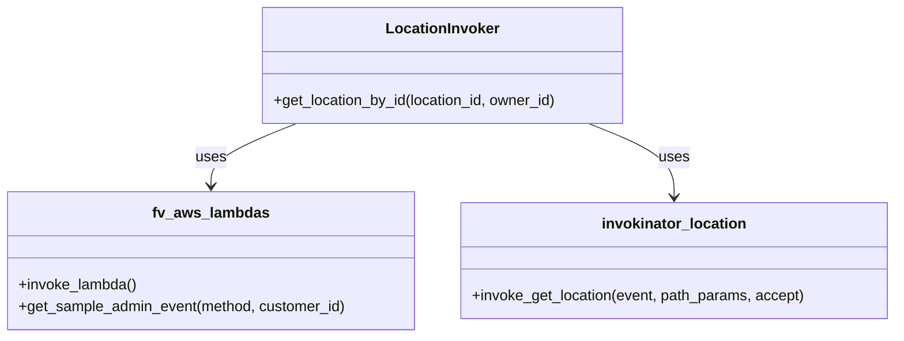

# Diagram: entity_core/entity_service/entity_listener/entity_listener_service/invokers/location_invoker.py


> Auto-generated by Obscura crawlers

## Diagram 1



### SVG

<svg id="container" width="969.515625" xmlns="http://www.w3.org/2000/svg" class="classDiagram" height="366" viewBox="0 0 969.515625 366" role="graphics-document document" aria-roledescription="class"><style>#container{font-family:"trebuchet ms",verdana,arial,sans-serif;font-size:16px;fill:#333;}@keyframes edge-animation-frame{from{stroke-dashoffset:0;}}@keyframes dash{to{stroke-dashoffset:0;}}#container .edge-animation-slow{stroke-dasharray:9,5!important;stroke-dashoffset:900;animation:dash 50s linear infinite;stroke-linecap:round;}#container .edge-animation-fast{stroke-dasharray:9,5!important;stroke-dashoffset:900;animation:dash 20s linear infinite;stroke-linecap:round;}#container .error-icon{fill:#552222;}#container .error-text{fill:#552222;stroke:#552222;}#container .edge-thickness-normal{stroke-width:1px;}#container .edge-thickness-thick{stroke-width:3.5px;}#container .edge-pattern-solid{stroke-dasharray:0;}#container .edge-thickness-invisible{stroke-width:0;fill:none;}#container .edge-pattern-dashed{stroke-dasharray:3;}#container .edge-pattern-dotted{stroke-dasharray:2;}#container .marker{fill:#333333;stroke:#333333;}#container .marker.cross{stroke:#333333;}#container svg{font-family:"trebuchet ms",verdana,arial,sans-serif;font-size:16px;}#container p{margin:0;}#container g.classGroup text{fill:#9370DB;stroke:none;font-family:"trebuchet ms",verdana,arial,sans-serif;font-size:10px;}#container g.classGroup text .title{font-weight:bolder;}#container .nodeLabel,#container .edgeLabel{color:#131300;}#container .edgeLabel .label rect{fill:#ECECFF;}#container .label text{fill:#131300;}#container .labelBkg{background:#ECECFF;}#container .edgeLabel .label span{background:#ECECFF;}#container .classTitle{font-weight:bolder;}#container .node rect,#container .node circle,#container .node ellipse,#container .node polygon,#container .node path{fill:#ECECFF;stroke:#9370DB;stroke-width:1px;}#container .divider{stroke:#9370DB;stroke-width:1;}#container g.clickable{cursor:pointer;}#container g.classGroup rect{fill:#ECECFF;stroke:#9370DB;}#container g.classGroup line{stroke:#9370DB;stroke-width:1;}#container .classLabel .box{stroke:none;stroke-width:0;fill:#ECECFF;opacity:0.5;}#container .classLabel .label{fill:#9370DB;font-size:10px;}#container .relation{stroke:#333333;stroke-width:1;fill:none;}#container .dashed-line{stroke-dasharray:3;}#container .dotted-line{stroke-dasharray:1 2;}#container #compositionStart,#container .composition{fill:#333333!important;stroke:#333333!important;stroke-width:1;}#container #compositionEnd,#container .composition{fill:#333333!important;stroke:#333333!important;stroke-width:1;}#container #dependencyStart,#container .dependency{fill:#333333!important;stroke:#333333!important;stroke-width:1;}#container #dependencyStart,#container .dependency{fill:#333333!important;stroke:#333333!important;stroke-width:1;}#container #extensionStart,#container .extension{fill:transparent!important;stroke:#333333!important;stroke-width:1;}#container #extensionEnd,#container .extension{fill:transparent!important;stroke:#333333!important;stroke-width:1;}#container #aggregationStart,#container .aggregation{fill:transparent!important;stroke:#333333!important;stroke-width:1;}#container #aggregationEnd,#container .aggregation{fill:transparent!important;stroke:#333333!important;stroke-width:1;}#container #lollipopStart,#container .lollipop{fill:#ECECFF!important;stroke:#333333!important;stroke-width:1;}#container #lollipopEnd,#container .lollipop{fill:#ECECFF!important;stroke:#333333!important;stroke-width:1;}#container .edgeTerminals{font-size:11px;line-height:initial;}#container .classTitleText{text-anchor:middle;font-size:18px;fill:#333;}#container .label-icon{display:inline-block;height:1em;overflow:visible;vertical-align:-0.125em;}#container .node .label-icon path{fill:currentColor;stroke:revert;stroke-width:revert;}#container :root{--mermaid-font-family:"trebuchet ms",verdana,arial,sans-serif;}</style><g><defs><marker id="container_class-aggregationStart" class="marker aggregation class" refX="18" refY="7" markerWidth="190" markerHeight="240" orient="auto"><path d="M 18,7 L9,13 L1,7 L9,1 Z"></path></marker></defs><defs><marker id="container_class-aggregationEnd" class="marker aggregation class" refX="1" refY="7" markerWidth="20" markerHeight="28" orient="auto"><path d="M 18,7 L9,13 L1,7 L9,1 Z"></path></marker></defs><defs><marker id="container_class-extensionStart" class="marker extension class" refX="18" refY="7" markerWidth="190" markerHeight="240" orient="auto"><path d="M 1,7 L18,13 V 1 Z"></path></marker></defs><defs><marker id="container_class-extensionEnd" class="marker extension class" refX="1" refY="7" markerWidth="20" markerHeight="28" orient="auto"><path d="M 1,1 V 13 L18,7 Z"></path></marker></defs><defs><marker id="container_class-compositionStart" class="marker composition class" refX="18" refY="7" markerWidth="190" markerHeight="240" orient="auto"><path d="M 18,7 L9,13 L1,7 L9,1 Z"></path></marker></defs><defs><marker id="container_class-compositionEnd" class="marker composition class" refX="1" refY="7" markerWidth="20" markerHeight="28" orient="auto"><path d="M 18,7 L9,13 L1,7 L9,1 Z"></path></marker></defs><defs><marker id="container_class-dependencyStart" class="marker dependency class" refX="6" refY="7" markerWidth="190" markerHeight="240" orient="auto"><path d="M 5,7 L9,13 L1,7 L9,1 Z"></path></marker></defs><defs><marker id="container_class-dependencyEnd" class="marker dependency class" refX="13" refY="7" markerWidth="20" markerHeight="28" orient="auto"><path d="M 18,7 L9,13 L14,7 L9,1 Z"></path></marker></defs><defs><marker id="container_class-lollipopStart" class="marker lollipop class" refX="13" refY="7" markerWidth="190" markerHeight="240" orient="auto"><circle stroke="black" fill="transparent" cx="7" cy="7" r="6"></circle></marker></defs><defs><marker id="container_class-lollipopEnd" class="marker lollipop class" refX="1" refY="7" markerWidth="190" markerHeight="240" orient="auto"><circle stroke="black" fill="transparent" cx="7" cy="7" r="6"></circle></marker></defs><g class="root"><g class="clusters"></g><g class="edgePaths"><path d="M321.427,134L305.956,140.167C290.485,146.333,259.543,158.667,244.072,170C228.602,181.333,228.602,191.667,228.602,196.833L228.602,202" id="id_LocationInvoker_fv_aws_lambdas_1" class="edge-thickness-normal edge-pattern-solid relation" style=";;;" data-edge="true" data-et="edge" data-id="id_LocationInvoker_fv_aws_lambdas_1" data-points="W3sieCI6MzIxLjQyNjc1NzgxMjUsInkiOjEzNH0seyJ4IjoyMjguNjAxNTYyNSwieSI6MTcxfSx7IngiOjIyOC42MDE1NjI1LCJ5IjoyMDh9XQ==" marker-end="url(#container_class-dependencyEnd)"></path><path d="M637.534,134L653.005,140.167C668.476,146.333,699.418,158.667,714.889,172C730.359,185.333,730.359,199.667,730.359,206.833L730.359,214" id="id_LocationInvoker_invokinator_location_2" class="edge-thickness-normal edge-pattern-solid relation" style=";;;" data-edge="true" data-et="edge" data-id="id_LocationInvoker_invokinator_location_2" data-points="W3sieCI6NjM3LjUzNDE3OTY4NzUsInkiOjEzNH0seyJ4Ijo3MzAuMzU5Mzc1LCJ5IjoxNzF9LHsieCI6NzMwLjM1OTM3NSwieSI6MjIwfV0=" marker-end="url(#container_class-dependencyEnd)"></path></g><g class="edgeLabels"><g class="edgeLabel" transform="translate(228.6015625, 171)"><g class="label" data-id="id_LocationInvoker_fv_aws_lambdas_1" transform="translate(-16.4921875, -12)"><foreignObject width="32.984375" height="24"><div xmlns="http://www.w3.org/1999/xhtml" class="labelBkg" style="display: table-cell; white-space: nowrap; line-height: 1.5; max-width: 200px; text-align: center;"><span class="edgeLabel"><p>uses</p></span></div></foreignObject></g></g><g class="edgeLabel" transform="translate(730.359375, 171)"><g class="label" data-id="id_LocationInvoker_invokinator_location_2" transform="translate(-16.4921875, -12)"><foreignObject width="32.984375" height="24"><div xmlns="http://www.w3.org/1999/xhtml" class="labelBkg" style="display: table-cell; white-space: nowrap; line-height: 1.5; max-width: 200px; text-align: center;"><span class="edgeLabel"><p>uses</p></span></div></foreignObject></g></g></g><g class="nodes"><g class="node default" id="classId-LocationInvoker-0" transform="translate(479.48046875, 71)"><g class="basic label-container"><path d="M-197.265625 -63 L197.265625 -63 L197.265625 63 L-197.265625 63" stroke="none" stroke-width="0" fill="#ECECFF" style=""></path><path d="M-197.265625 -63 C-115.00480824680714 -63, -32.74399149361429 -63, 197.265625 -63 M-197.265625 -63 C-41.36072233572489 -63, 114.54418032855023 -63, 197.265625 -63 M197.265625 -63 C197.265625 -16.72177546074446, 197.265625 29.55644907851108, 197.265625 63 M197.265625 -63 C197.265625 -21.134230472582736, 197.265625 20.731539054834528, 197.265625 63 M197.265625 63 C97.23914081171117 63, -2.7873433765776667 63, -197.265625 63 M197.265625 63 C72.33735692856786 63, -52.590911142864286 63, -197.265625 63 M-197.265625 63 C-197.265625 23.990611944916843, -197.265625 -15.018776110166314, -197.265625 -63 M-197.265625 63 C-197.265625 36.4814532949501, -197.265625 9.962906589900193, -197.265625 -63" stroke="#9370DB" stroke-width="1.3" fill="none" stroke-dasharray="0 0" style=""></path></g><g class="annotation-group text" transform="translate(0, -39)"></g><g class="label-group text" transform="translate(-58.90625, -39)"><g class="label" style="font-weight: bolder" transform="translate(0,-12)"><foreignObject width="117.8125" height="24"><div xmlns="http://www.w3.org/1999/xhtml" style="display: table-cell; white-space: nowrap; line-height: 1.5; max-width: 167px; text-align: center;"><span class="nodeLabel markdown-node-label" style=""><p>LocationInvoker</p></span></div></foreignObject></g></g><g class="members-group text" transform="translate(-185.265625, 9)"></g><g class="methods-group text" transform="translate(-185.265625, 39)"><g class="label" style="" transform="translate(0,-12)"><foreignObject width="311.625" height="24"><div xmlns="http://www.w3.org/1999/xhtml" style="display: table-cell; white-space: nowrap; line-height: 1.5; max-width: 369px; text-align: center;"><span class="nodeLabel markdown-node-label" style=""><p>+get_location_by_id(location_id, owner_id)</p></span></div></foreignObject></g></g><g class="divider" style=""><path d="M-197.265625 -15 C-109.66508533217214 -15, -22.06454566434428 -15, 197.265625 -15 M-197.265625 -15 C-106.76828290563887 -15, -16.27094081127774 -15, 197.265625 -15" stroke="#9370DB" stroke-width="1.3" fill="none" stroke-dasharray="0 0" style=""></path></g><g class="divider" style=""><path d="M-197.265625 9 C-42.0511606585427 9, 113.1633036829146 9, 197.265625 9 M-197.265625 9 C-55.005576603089054 9, 87.25447179382189 9, 197.265625 9" stroke="#9370DB" stroke-width="1.3" fill="none" stroke-dasharray="0 0" style=""></path></g></g><g class="node default" id="classId-fv_aws_lambdas-1" transform="translate(228.6015625, 283)"><g class="basic label-container"><path d="M-220.6015625 -75 L220.6015625 -75 L220.6015625 75 L-220.6015625 75" stroke="none" stroke-width="0" fill="#ECECFF" style=""></path><path d="M-220.6015625 -75 C-65.82276439335806 -75, 88.95603371328389 -75, 220.6015625 -75 M-220.6015625 -75 C-75.943433597406 -75, 68.714695305188 -75, 220.6015625 -75 M220.6015625 -75 C220.6015625 -19.886854086948148, 220.6015625 35.226291826103704, 220.6015625 75 M220.6015625 -75 C220.6015625 -19.767730180887654, 220.6015625 35.46453963822469, 220.6015625 75 M220.6015625 75 C114.1764901420603 75, 7.751417784120605 75, -220.6015625 75 M220.6015625 75 C119.71546795911033 75, 18.829373418220655 75, -220.6015625 75 M-220.6015625 75 C-220.6015625 42.38593118578027, -220.6015625 9.771862371560545, -220.6015625 -75 M-220.6015625 75 C-220.6015625 29.569546632026068, -220.6015625 -15.860906735947864, -220.6015625 -75" stroke="#9370DB" stroke-width="1.3" fill="none" stroke-dasharray="0 0" style=""></path></g><g class="annotation-group text" transform="translate(0, -51)"></g><g class="label-group text" transform="translate(-60.0625, -51)"><g class="label" style="font-weight: bolder" transform="translate(0,-12)"><foreignObject width="120.125" height="24"><div xmlns="http://www.w3.org/1999/xhtml" style="display: table-cell; white-space: nowrap; line-height: 1.5; max-width: 168px; text-align: center;"><span class="nodeLabel markdown-node-label" style=""><p>fv_aws_lambdas</p></span></div></foreignObject></g></g><g class="members-group text" transform="translate(-208.6015625, -3)"></g><g class="methods-group text" transform="translate(-208.6015625, 27)"><g class="label" style="" transform="translate(0,-12)"><foreignObject width="128.703125" height="24"><div xmlns="http://www.w3.org/1999/xhtml" style="display: table-cell; white-space: nowrap; line-height: 1.5; max-width: 186px; text-align: center;"><span class="nodeLabel markdown-node-label" style=""><p>+invoke_lambda()</p></span></div></foreignObject></g><g class="label" style="" transform="translate(0,12)"><foreignObject width="357.140625" height="24"><div xmlns="http://www.w3.org/1999/xhtml" style="display: table-cell; white-space: nowrap; line-height: 1.5; max-width: 415px; text-align: center;"><span class="nodeLabel markdown-node-label" style=""><p>+get_sample_admin_event(method, customer_id)</p></span></div></foreignObject></g></g><g class="divider" style=""><path d="M-220.6015625 -27 C-44.67213920123851 -27, 131.25728409752298 -27, 220.6015625 -27 M-220.6015625 -27 C-114.34475021201354 -27, -8.087937924027074 -27, 220.6015625 -27" stroke="#9370DB" stroke-width="1.3" fill="none" stroke-dasharray="0 0" style=""></path></g><g class="divider" style=""><path d="M-220.6015625 -3 C-65.80722847994872 -3, 88.98710554010256 -3, 220.6015625 -3 M-220.6015625 -3 C-113.12939190429994 -3, -5.657221308599873 -3, 220.6015625 -3" stroke="#9370DB" stroke-width="1.3" fill="none" stroke-dasharray="0 0" style=""></path></g></g><g class="node default" id="classId-invokinator_location-2" transform="translate(730.359375, 283)"><g class="basic label-container"><path d="M-231.15625 -63 L231.15625 -63 L231.15625 63 L-231.15625 63" stroke="none" stroke-width="0" fill="#ECECFF" style=""></path><path d="M-231.15625 -63 C-85.14820569538239 -63, 60.859838609235226 -63, 231.15625 -63 M-231.15625 -63 C-125.44624249124183 -63, -19.736234982483666 -63, 231.15625 -63 M231.15625 -63 C231.15625 -14.372099083596517, 231.15625 34.255801832806966, 231.15625 63 M231.15625 -63 C231.15625 -26.57077799091615, 231.15625 9.858444018167702, 231.15625 63 M231.15625 63 C103.40232052335413 63, -24.35160895329173 63, -231.15625 63 M231.15625 63 C64.49348614076578 63, -102.16927771846844 63, -231.15625 63 M-231.15625 63 C-231.15625 21.989724393710596, -231.15625 -19.02055121257881, -231.15625 -63 M-231.15625 63 C-231.15625 20.11805592761081, -231.15625 -22.763888144778377, -231.15625 -63" stroke="#9370DB" stroke-width="1.3" fill="none" stroke-dasharray="0 0" style=""></path></g><g class="annotation-group text" transform="translate(0, -39)"></g><g class="label-group text" transform="translate(-75.25, -39)"><g class="label" style="font-weight: bolder" transform="translate(0,-12)"><foreignObject width="150.5" height="24"><div xmlns="http://www.w3.org/1999/xhtml" style="display: table-cell; white-space: nowrap; line-height: 1.5; max-width: 199px; text-align: center;"><span class="nodeLabel markdown-node-label" style=""><p>invokinator_location</p></span></div></foreignObject></g></g><g class="members-group text" transform="translate(-219.15625, 9)"></g><g class="methods-group text" transform="translate(-219.15625, 39)"><g class="label" style="" transform="translate(0,-12)"><foreignObject width="363.0625" height="24"><div xmlns="http://www.w3.org/1999/xhtml" style="display: table-cell; white-space: nowrap; line-height: 1.5; max-width: 420px; text-align: center;"><span class="nodeLabel markdown-node-label" style=""><p>+invoke_get_location(event, path_params, accept)</p></span></div></foreignObject></g></g><g class="divider" style=""><path d="M-231.15625 -15 C-67.74586586408958 -15, 95.66451827182084 -15, 231.15625 -15 M-231.15625 -15 C-112.50524073797614 -15, 6.145768524047725 -15, 231.15625 -15" stroke="#9370DB" stroke-width="1.3" fill="none" stroke-dasharray="0 0" style=""></path></g><g class="divider" style=""><path d="M-231.15625 9 C-86.61130760300355 9, 57.933634793992894 9, 231.15625 9 M-231.15625 9 C-103.90386088225704 9, 23.34852823548593 9, 231.15625 9" stroke="#9370DB" stroke-width="1.3" fill="none" stroke-dasharray="0 0" style=""></path></g></g></g></g></g></svg>

## Diagram 2

```mermaid
sequenceDiagram
participant Caller
participant LocationInvoker
participant fv_aws_lambdas as AWS_Lambdas
participant invokinator_location as Invokinator
Caller->>LocationInvoker: get_location_by_id(location_id, owner_id)
LocationInvoker->>AWS_Lambdas: get_sample_admin_event("GET", customer_id=owner_id)
AWS_Lambdas-->>LocationInvoker: event
LocationInvoker->>Invokinator: invoke_get_location(event, path_params={id:location_id}, accept="application/json;version=basic")
Invokinator-->>LocationInvoker: loc_body
alt loc_body is falsy
    LocationInvoker-->>Caller: {}
else loc_body present
    LocationInvoker-->>Caller: loc_body
end
```

> SVG rendering failed for this diagram.
