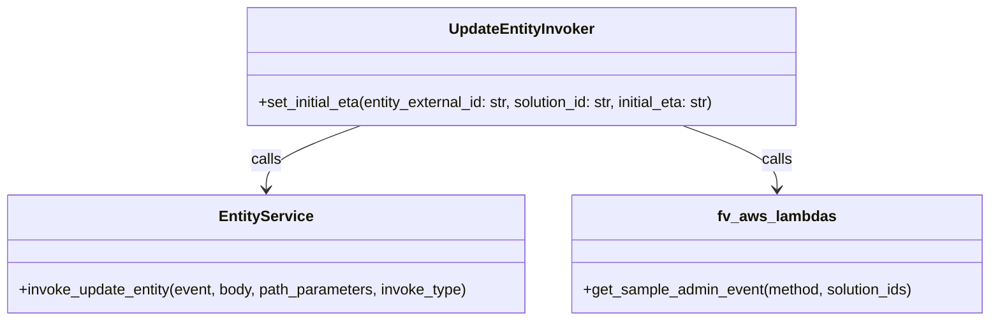

# Diagram: entity_core/entity_service/entity_listener/entity_listener_service/invokers/update_entity_invoker.py


> Auto-generated by Obscura crawlers

## Diagram 1



### SVG

<svg id="container" width="1066.1015625" xmlns="http://www.w3.org/2000/svg" class="classDiagram" height="342" viewBox="0 0 1066.1015625 342" role="graphics-document document" aria-roledescription="class"><style>#container{font-family:"trebuchet ms",verdana,arial,sans-serif;font-size:16px;fill:#333;}@keyframes edge-animation-frame{from{stroke-dashoffset:0;}}@keyframes dash{to{stroke-dashoffset:0;}}#container .edge-animation-slow{stroke-dasharray:9,5!important;stroke-dashoffset:900;animation:dash 50s linear infinite;stroke-linecap:round;}#container .edge-animation-fast{stroke-dasharray:9,5!important;stroke-dashoffset:900;animation:dash 20s linear infinite;stroke-linecap:round;}#container .error-icon{fill:#552222;}#container .error-text{fill:#552222;stroke:#552222;}#container .edge-thickness-normal{stroke-width:1px;}#container .edge-thickness-thick{stroke-width:3.5px;}#container .edge-pattern-solid{stroke-dasharray:0;}#container .edge-thickness-invisible{stroke-width:0;fill:none;}#container .edge-pattern-dashed{stroke-dasharray:3;}#container .edge-pattern-dotted{stroke-dasharray:2;}#container .marker{fill:#333333;stroke:#333333;}#container .marker.cross{stroke:#333333;}#container svg{font-family:"trebuchet ms",verdana,arial,sans-serif;font-size:16px;}#container p{margin:0;}#container g.classGroup text{fill:#9370DB;stroke:none;font-family:"trebuchet ms",verdana,arial,sans-serif;font-size:10px;}#container g.classGroup text .title{font-weight:bolder;}#container .nodeLabel,#container .edgeLabel{color:#131300;}#container .edgeLabel .label rect{fill:#ECECFF;}#container .label text{fill:#131300;}#container .labelBkg{background:#ECECFF;}#container .edgeLabel .label span{background:#ECECFF;}#container .classTitle{font-weight:bolder;}#container .node rect,#container .node circle,#container .node ellipse,#container .node polygon,#container .node path{fill:#ECECFF;stroke:#9370DB;stroke-width:1px;}#container .divider{stroke:#9370DB;stroke-width:1;}#container g.clickable{cursor:pointer;}#container g.classGroup rect{fill:#ECECFF;stroke:#9370DB;}#container g.classGroup line{stroke:#9370DB;stroke-width:1;}#container .classLabel .box{stroke:none;stroke-width:0;fill:#ECECFF;opacity:0.5;}#container .classLabel .label{fill:#9370DB;font-size:10px;}#container .relation{stroke:#333333;stroke-width:1;fill:none;}#container .dashed-line{stroke-dasharray:3;}#container .dotted-line{stroke-dasharray:1 2;}#container #compositionStart,#container .composition{fill:#333333!important;stroke:#333333!important;stroke-width:1;}#container #compositionEnd,#container .composition{fill:#333333!important;stroke:#333333!important;stroke-width:1;}#container #dependencyStart,#container .dependency{fill:#333333!important;stroke:#333333!important;stroke-width:1;}#container #dependencyStart,#container .dependency{fill:#333333!important;stroke:#333333!important;stroke-width:1;}#container #extensionStart,#container .extension{fill:transparent!important;stroke:#333333!important;stroke-width:1;}#container #extensionEnd,#container .extension{fill:transparent!important;stroke:#333333!important;stroke-width:1;}#container #aggregationStart,#container .aggregation{fill:transparent!important;stroke:#333333!important;stroke-width:1;}#container #aggregationEnd,#container .aggregation{fill:transparent!important;stroke:#333333!important;stroke-width:1;}#container #lollipopStart,#container .lollipop{fill:#ECECFF!important;stroke:#333333!important;stroke-width:1;}#container #lollipopEnd,#container .lollipop{fill:#ECECFF!important;stroke:#333333!important;stroke-width:1;}#container .edgeTerminals{font-size:11px;line-height:initial;}#container .classTitleText{text-anchor:middle;font-size:18px;fill:#333;}#container .label-icon{display:inline-block;height:1em;overflow:visible;vertical-align:-0.125em;}#container .node .label-icon path{fill:currentColor;stroke:revert;stroke-width:revert;}#container :root{--mermaid-font-family:"trebuchet ms",verdana,arial,sans-serif;}</style><g><defs><marker id="container_class-aggregationStart" class="marker aggregation class" refX="18" refY="7" markerWidth="190" markerHeight="240" orient="auto"><path d="M 18,7 L9,13 L1,7 L9,1 Z"></path></marker></defs><defs><marker id="container_class-aggregationEnd" class="marker aggregation class" refX="1" refY="7" markerWidth="20" markerHeight="28" orient="auto"><path d="M 18,7 L9,13 L1,7 L9,1 Z"></path></marker></defs><defs><marker id="container_class-extensionStart" class="marker extension class" refX="18" refY="7" markerWidth="190" markerHeight="240" orient="auto"><path d="M 1,7 L18,13 V 1 Z"></path></marker></defs><defs><marker id="container_class-extensionEnd" class="marker extension class" refX="1" refY="7" markerWidth="20" markerHeight="28" orient="auto"><path d="M 1,1 V 13 L18,7 Z"></path></marker></defs><defs><marker id="container_class-compositionStart" class="marker composition class" refX="18" refY="7" markerWidth="190" markerHeight="240" orient="auto"><path d="M 18,7 L9,13 L1,7 L9,1 Z"></path></marker></defs><defs><marker id="container_class-compositionEnd" class="marker composition class" refX="1" refY="7" markerWidth="20" markerHeight="28" orient="auto"><path d="M 18,7 L9,13 L1,7 L9,1 Z"></path></marker></defs><defs><marker id="container_class-dependencyStart" class="marker dependency class" refX="6" refY="7" markerWidth="190" markerHeight="240" orient="auto"><path d="M 5,7 L9,13 L1,7 L9,1 Z"></path></marker></defs><defs><marker id="container_class-dependencyEnd" class="marker dependency class" refX="13" refY="7" markerWidth="20" markerHeight="28" orient="auto"><path d="M 18,7 L9,13 L14,7 L9,1 Z"></path></marker></defs><defs><marker id="container_class-lollipopStart" class="marker lollipop class" refX="13" refY="7" markerWidth="190" markerHeight="240" orient="auto"><circle stroke="black" fill="transparent" cx="7" cy="7" r="6"></circle></marker></defs><defs><marker id="container_class-lollipopEnd" class="marker lollipop class" refX="1" refY="7" markerWidth="190" markerHeight="240" orient="auto"><circle stroke="black" fill="transparent" cx="7" cy="7" r="6"></circle></marker></defs><g class="root"><g class="clusters"></g><g class="edgePaths"><path d="M388.802,134L371.842,140.167C354.883,146.333,320.963,158.667,304.003,170C287.043,181.333,287.043,191.667,287.043,196.833L287.043,202" id="id_UpdateEntityInvoker_EntityService_1" class="edge-thickness-normal edge-pattern-solid relation" style=";;;" data-edge="true" data-et="edge" data-id="id_UpdateEntityInvoker_EntityService_1" data-points="W3sieCI6Mzg4LjgwMjM2MzI4MTI1LCJ5IjoxMzR9LHsieCI6Mjg3LjA0Mjk2ODc1LCJ5IjoxNzF9LHsieCI6Mjg3LjA0Mjk2ODc1LCJ5IjoyMDh9XQ==" marker-end="url(#container_class-dependencyEnd)"></path><path d="M735.334,134L752.294,140.167C769.254,146.333,803.174,158.667,820.134,170C837.094,181.333,837.094,191.667,837.094,196.833L837.094,202" id="id_UpdateEntityInvoker_fv_aws_lambdas_2" class="edge-thickness-normal edge-pattern-solid relation" style=";;;" data-edge="true" data-et="edge" data-id="id_UpdateEntityInvoker_fv_aws_lambdas_2" data-points="W3sieCI6NzM1LjMzNDM1NTQ2ODc1LCJ5IjoxMzR9LHsieCI6ODM3LjA5Mzc1LCJ5IjoxNzF9LHsieCI6ODM3LjA5Mzc1LCJ5IjoyMDh9XQ==" marker-end="url(#container_class-dependencyEnd)"></path></g><g class="edgeLabels"><g class="edgeLabel" transform="translate(287.04296875, 171)"><g class="label" data-id="id_UpdateEntityInvoker_EntityService_1" transform="translate(-16.4453125, -12)"><foreignObject width="32.890625" height="24"><div xmlns="http://www.w3.org/1999/xhtml" class="labelBkg" style="display: table-cell; white-space: nowrap; line-height: 1.5; max-width: 200px; text-align: center;"><span class="edgeLabel"><p>calls</p></span></div></foreignObject></g></g><g class="edgeLabel" transform="translate(837.09375, 171)"><g class="label" data-id="id_UpdateEntityInvoker_fv_aws_lambdas_2" transform="translate(-16.4453125, -12)"><foreignObject width="32.890625" height="24"><div xmlns="http://www.w3.org/1999/xhtml" class="labelBkg" style="display: table-cell; white-space: nowrap; line-height: 1.5; max-width: 200px; text-align: center;"><span class="edgeLabel"><p>calls</p></span></div></foreignObject></g></g></g><g class="nodes"><g class="node default" id="classId-UpdateEntityInvoker-0" transform="translate(562.068359375, 71)"><g class="basic label-container"><path d="M-301.8125 -63 L301.8125 -63 L301.8125 63 L-301.8125 63" stroke="none" stroke-width="0" fill="#ECECFF" style=""></path><path d="M-301.8125 -63 C-127.21685795007636 -63, 47.37878409984728 -63, 301.8125 -63 M-301.8125 -63 C-147.8626283929626 -63, 6.087243214074817 -63, 301.8125 -63 M301.8125 -63 C301.8125 -36.58664676688615, 301.8125 -10.173293533772302, 301.8125 63 M301.8125 -63 C301.8125 -16.52374820205806, 301.8125 29.952503595883883, 301.8125 63 M301.8125 63 C86.60040720051245 63, -128.6116855989751 63, -301.8125 63 M301.8125 63 C106.28519269012742 63, -89.24211461974517 63, -301.8125 63 M-301.8125 63 C-301.8125 29.72508741111956, -301.8125 -3.54982517776088, -301.8125 -63 M-301.8125 63 C-301.8125 28.555869446560173, -301.8125 -5.8882611068796535, -301.8125 -63" stroke="#9370DB" stroke-width="1.3" fill="none" stroke-dasharray="0 0" style=""></path></g><g class="annotation-group text" transform="translate(0, -39)"></g><g class="label-group text" transform="translate(-75.375, -39)"><g class="label" style="font-weight: bolder" transform="translate(0,-12)"><foreignObject width="150.75" height="24"><div xmlns="http://www.w3.org/1999/xhtml" style="display: table-cell; white-space: nowrap; line-height: 1.5; max-width: 199px; text-align: center;"><span class="nodeLabel markdown-node-label" style=""><p>UpdateEntityInvoker</p></span></div></foreignObject></g></g><g class="members-group text" transform="translate(-289.8125, 9)"></g><g class="methods-group text" transform="translate(-289.8125, 39)"><g class="label" style="" transform="translate(0,-12)"><foreignObject width="504.25" height="24"><div xmlns="http://www.w3.org/1999/xhtml" style="display: table-cell; white-space: nowrap; line-height: 1.5; max-width: 562px; text-align: center;"><span class="nodeLabel markdown-node-label" style=""><p>+set_initial_eta(entity_external_id: str, solution_id: str, initial_eta: str)</p></span></div></foreignObject></g></g><g class="divider" style=""><path d="M-301.8125 -15 C-117.72112695290613 -15, 66.37024609418773 -15, 301.8125 -15 M-301.8125 -15 C-118.34351186053993 -15, 65.12547627892013 -15, 301.8125 -15" stroke="#9370DB" stroke-width="1.3" fill="none" stroke-dasharray="0 0" style=""></path></g><g class="divider" style=""><path d="M-301.8125 9 C-93.85421328647635 9, 114.1040734270473 9, 301.8125 9 M-301.8125 9 C-61.90808396204662 9, 177.99633207590676 9, 301.8125 9" stroke="#9370DB" stroke-width="1.3" fill="none" stroke-dasharray="0 0" style=""></path></g></g><g class="node default" id="classId-EntityService-1" transform="translate(287.04296875, 271)"><g class="basic label-container"><path d="M-279.04296875 -63 L279.04296875 -63 L279.04296875 63 L-279.04296875 63" stroke="none" stroke-width="0" fill="#ECECFF" style=""></path><path d="M-279.04296875 -63 C-93.36119071496515 -63, 92.3205873200697 -63, 279.04296875 -63 M-279.04296875 -63 C-105.74768880853756 -63, 67.54759113292488 -63, 279.04296875 -63 M279.04296875 -63 C279.04296875 -36.292464197266526, 279.04296875 -9.584928394533051, 279.04296875 63 M279.04296875 -63 C279.04296875 -35.935665791136316, 279.04296875 -8.871331582272624, 279.04296875 63 M279.04296875 63 C84.63046645819483 63, -109.78203583361034 63, -279.04296875 63 M279.04296875 63 C121.50861237922848 63, -36.02574399154304 63, -279.04296875 63 M-279.04296875 63 C-279.04296875 13.64118507444033, -279.04296875 -35.71762985111934, -279.04296875 -63 M-279.04296875 63 C-279.04296875 15.83783059217032, -279.04296875 -31.32433881565936, -279.04296875 -63" stroke="#9370DB" stroke-width="1.3" fill="none" stroke-dasharray="0 0" style=""></path></g><g class="annotation-group text" transform="translate(0, -39)"></g><g class="label-group text" transform="translate(-47.9296875, -39)"><g class="label" style="font-weight: bolder" transform="translate(0,-12)"><foreignObject width="95.859375" height="24"><div xmlns="http://www.w3.org/1999/xhtml" style="display: table-cell; white-space: nowrap; line-height: 1.5; max-width: 144px; text-align: center;"><span class="nodeLabel markdown-node-label" style=""><p>EntityService</p></span></div></foreignObject></g></g><g class="members-group text" transform="translate(-267.04296875, 9)"></g><g class="methods-group text" transform="translate(-267.04296875, 39)"><g class="label" style="" transform="translate(0,-12)"><foreignObject width="486.15625" height="24"><div xmlns="http://www.w3.org/1999/xhtml" style="display: table-cell; white-space: nowrap; line-height: 1.5; max-width: 544px; text-align: center;"><span class="nodeLabel markdown-node-label" style=""><p>+invoke_update_entity(event, body, path_parameters, invoke_type)</p></span></div></foreignObject></g></g><g class="divider" style=""><path d="M-279.04296875 -15 C-77.28849883441276 -15, 124.46597108117447 -15, 279.04296875 -15 M-279.04296875 -15 C-105.25032586922399 -15, 68.54231701155203 -15, 279.04296875 -15" stroke="#9370DB" stroke-width="1.3" fill="none" stroke-dasharray="0 0" style=""></path></g><g class="divider" style=""><path d="M-279.04296875 9 C-95.64982670082335 9, 87.74331534835329 9, 279.04296875 9 M-279.04296875 9 C-129.9868831409104 9, 19.069202468179185 9, 279.04296875 9" stroke="#9370DB" stroke-width="1.3" fill="none" stroke-dasharray="0 0" style=""></path></g></g><g class="node default" id="classId-fv_aws_lambdas-2" transform="translate(837.09375, 271)"><g class="basic label-container"><path d="M-221.0078125 -63 L221.0078125 -63 L221.0078125 63 L-221.0078125 63" stroke="none" stroke-width="0" fill="#ECECFF" style=""></path><path d="M-221.0078125 -63 C-132.53106850150405 -63, -44.054324503008104 -63, 221.0078125 -63 M-221.0078125 -63 C-44.2478948496331 -63, 132.5120228007338 -63, 221.0078125 -63 M221.0078125 -63 C221.0078125 -14.227914239006857, 221.0078125 34.544171521986286, 221.0078125 63 M221.0078125 -63 C221.0078125 -23.527187670249, 221.0078125 15.945624659502002, 221.0078125 63 M221.0078125 63 C105.41689361354456 63, -10.174025272910882 63, -221.0078125 63 M221.0078125 63 C52.712615665442144 63, -115.58258116911571 63, -221.0078125 63 M-221.0078125 63 C-221.0078125 22.139416102648525, -221.0078125 -18.72116779470295, -221.0078125 -63 M-221.0078125 63 C-221.0078125 22.422112825296516, -221.0078125 -18.15577434940697, -221.0078125 -63" stroke="#9370DB" stroke-width="1.3" fill="none" stroke-dasharray="0 0" style=""></path></g><g class="annotation-group text" transform="translate(0, -39)"></g><g class="label-group text" transform="translate(-60.0625, -39)"><g class="label" style="font-weight: bolder" transform="translate(0,-12)"><foreignObject width="120.125" height="24"><div xmlns="http://www.w3.org/1999/xhtml" style="display: table-cell; white-space: nowrap; line-height: 1.5; max-width: 168px; text-align: center;"><span class="nodeLabel markdown-node-label" style=""><p>fv_aws_lambdas</p></span></div></foreignObject></g></g><g class="members-group text" transform="translate(-209.0078125, 9)"></g><g class="methods-group text" transform="translate(-209.0078125, 39)"><g class="label" style="" transform="translate(0,-12)"><foreignObject width="357.953125" height="24"><div xmlns="http://www.w3.org/1999/xhtml" style="display: table-cell; white-space: nowrap; line-height: 1.5; max-width: 415px; text-align: center;"><span class="nodeLabel markdown-node-label" style=""><p>+get_sample_admin_event(method, solution_ids)</p></span></div></foreignObject></g></g><g class="divider" style=""><path d="M-221.0078125 -15 C-113.04573221507 -15, -5.083651930140007 -15, 221.0078125 -15 M-221.0078125 -15 C-55.39770974723231 -15, 110.21239300553538 -15, 221.0078125 -15" stroke="#9370DB" stroke-width="1.3" fill="none" stroke-dasharray="0 0" style=""></path></g><g class="divider" style=""><path d="M-221.0078125 9 C-75.86717154003563 9, 69.27346941992874 9, 221.0078125 9 M-221.0078125 9 C-67.32154033822553 9, 86.36473182354894 9, 221.0078125 9" stroke="#9370DB" stroke-width="1.3" fill="none" stroke-dasharray="0 0" style=""></path></g></g></g></g></g></svg>

## Diagram 2

```mermaid
flowchart TD
    Caller([Caller]) --> U[UpdateEntityInvoker.set_initial_eta(entity_external_id, solution_id, initial_eta)]
    U --> GetEvent[get_sample_admin_event("PATCH", [solution_id])]
    U --> Invoke[invoke_update_entity(event, body, path_parameters, invoke_type)]
    GetEvent --> Invoke
    Invoke --> Response([Response])
```

> SVG rendering failed for this diagram.
