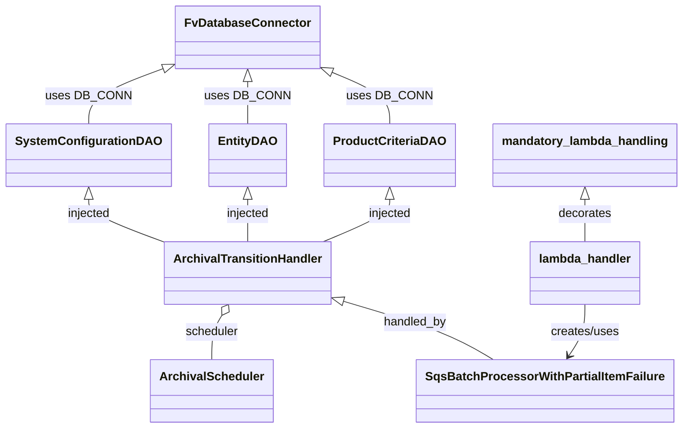
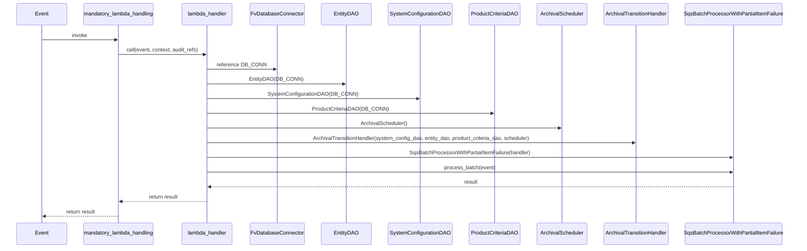

# Diagram: entity_core/entity_service/entity_listener/entity_listener_service/lambdas/archival_processor_consumer.py

> Auto-generated by Obscura crawlers

## Diagram 1

### SVG

<svg id="container" width="874.5625" xmlns="http://www.w3.org/2000/svg" class="classDiagram" height="574" viewBox="0 0 874.5625 574" role="graphics-document document" aria-roledescription="class"><g><defs><marker id="container_class-aggregationStart" class="marker aggregation class" refX="18" refY="7" markerWidth="190" markerHeight="240" orient="auto"><path d="M 18,7 L9,13 L1,7 L9,1 Z"></path></marker></defs><defs><marker id="container_class-aggregationEnd" class="marker aggregation class" refX="1" refY="7" markerWidth="20" markerHeight="28" orient="auto"><path d="M 18,7 L9,13 L1,7 L9,1 Z"></path></marker></defs><defs><marker id="container_class-extensionStart" class="marker extension class" refX="18" refY="7" markerWidth="190" markerHeight="240" orient="auto"><path d="M 1,7 L18,13 V 1 Z"></path></marker></defs><defs><marker id="container_class-extensionEnd" class="marker extension class" refX="1" refY="7" markerWidth="20" markerHeight="28" orient="auto"><path d="M 1,1 V 13 L18,7 Z"></path></marker></defs><defs><marker id="container_class-compositionStart" class="marker composition class" refX="18" refY="7" markerWidth="190" markerHeight="240" orient="auto"><path d="M 18,7 L9,13 L1,7 L9,1 Z"></path></marker></defs><defs><marker id="container_class-compositionEnd" class="marker composition class" refX="1" refY="7" markerWidth="20" markerHeight="28" orient="auto"><path d="M 18,7 L9,13 L1,7 L9,1 Z"></path></marker></defs><defs><marker id="container_class-dependencyStart" class="marker dependency class" refX="6" refY="7" markerWidth="190" markerHeight="240" orient="auto"><path d="M 5,7 L9,13 L1,7 L9,1 Z"></path></marker></defs><defs><marker id="container_class-dependencyEnd" class="marker dependency class" refX="13" refY="7" markerWidth="20" markerHeight="28" orient="auto"><path d="M 18,7 L9,13 L14,7 L9,1 Z"></path></marker></defs><defs><marker id="container_class-lollipopStart" class="marker lollipop class" refX="13" refY="7" markerWidth="190" markerHeight="240" orient="auto"><circle stroke="black" fill="transparent" cx="7" cy="7" r="6"></circle></marker></defs><defs><marker id="container_class-lollipopEnd" class="marker lollipop class" refX="1" refY="7" markerWidth="190" markerHeight="240" orient="auto"><circle stroke="black" fill="transparent" cx="7" cy="7" r="6"></circle></marker></defs><g class="root"><g class="clusters"></g><g class="edgePaths"><path d="M313.016,109.25L313.016,112.542C313.016,115.833,313.016,122.417,313.016,131.875C313.016,141.333,313.016,153.667,313.016,159.833L313.016,166" id="id_FvDatabaseConnector_EntityDAO_1" class="edge-thickness-normal edge-pattern-solid relation" style=";;;" data-edge="true" data-et="edge" data-id="id_FvDatabaseConnector_EntityDAO_1" data-points="W3sieCI6MzEzLjAxNTYyNSwieSI6OTJ9LHsieCI6MzEzLjAxNTYyNSwieSI6MTI5fSx7IngiOjMxMy4wMTU2MjUsInkiOjE2Nn1d" marker-start="url(#container_class-extensionStart)"></path><path d="M420.139,96.593L432.557,101.994C444.975,107.395,469.812,118.198,482.23,129.765C494.648,141.333,494.648,153.667,494.648,159.833L494.648,166" id="id_FvDatabaseConnector_ProductCriteriaDAO_2" class="edge-thickness-normal edge-pattern-solid relation" style=";;;" data-edge="true" data-et="edge" data-id="id_FvDatabaseConnector_ProductCriteriaDAO_2" data-points="W3sieCI6NDA0LjMyMDMxMjUsInkiOjg5LjcxMjM3NDcyNTc5NDY2fSx7IngiOjQ5NC42NDg0Mzc1LCJ5IjoxMjl9LHsieCI6NDk0LjY0ODQzNzUsInkiOjE2Nn1d" marker-start="url(#container_class-extensionStart)"></path><path d="M205.648,92.033L189.91,98.194C174.172,104.355,142.695,116.678,126.957,129.005C111.219,141.333,111.219,153.667,111.219,159.833L111.219,166" id="id_FvDatabaseConnector_SystemConfigurationDAO_3" class="edge-thickness-normal edge-pattern-solid relation" style=";;;" data-edge="true" data-et="edge" data-id="id_FvDatabaseConnector_SystemConfigurationDAO_3" data-points="W3sieCI6MjIxLjcxMDkzNzUsInkiOjg1Ljc0NDIxMjE1NjQwNzI5fSx7IngiOjExMS4yMTg3NSwieSI6MTI5fSx7IngiOjExMS4yMTg3NSwieSI6MTY2fV0=" marker-start="url(#container_class-extensionStart)"></path><path d="M111.219,267.25L111.219,270.542C111.219,273.833,111.219,280.417,127.043,289.903C142.867,299.39,174.516,311.78,190.34,317.975L206.164,324.169" id="id_SystemConfigurationDAO_ArchivalTransitionHandler_4" class="edge-thickness-normal edge-pattern-solid relation" style=";;;" data-edge="true" data-et="edge" data-id="id_SystemConfigurationDAO_ArchivalTransitionHandler_4" data-points="W3sieCI6MTExLjIxODc1LCJ5IjoyNTB9LHsieCI6MTExLjIxODc1LCJ5IjoyODd9LHsieCI6MjA2LjE2NDA2MjUsInkiOjMyNC4xNjk0NTQxMjMxMTI2NH1d" marker-start="url(#container_class-extensionStart)"></path><path d="M313.016,267.25L313.016,270.542C313.016,273.833,313.016,280.417,313.016,289.875C313.016,299.333,313.016,311.667,313.016,317.833L313.016,324" id="id_EntityDAO_ArchivalTransitionHandler_5" class="edge-thickness-normal edge-pattern-solid relation" style=";;;" data-edge="true" data-et="edge" data-id="id_EntityDAO_ArchivalTransitionHandler_5" data-points="W3sieCI6MzEzLjAxNTYyNSwieSI6MjUwfSx7IngiOjMxMy4wMTU2MjUsInkiOjI4N30seyJ4IjozMTMuMDE1NjI1LCJ5IjozMjR9XQ==" marker-start="url(#container_class-extensionStart)"></path><path d="M494.648,267.25L494.648,270.542C494.648,273.833,494.648,280.417,480.47,289.875C466.292,299.333,437.936,311.667,423.758,317.833L409.58,324" id="id_ProductCriteriaDAO_ArchivalTransitionHandler_6" class="edge-thickness-normal edge-pattern-solid relation" style=";;;" data-edge="true" data-et="edge" data-id="id_ProductCriteriaDAO_ArchivalTransitionHandler_6" data-points="W3sieCI6NDk0LjY0ODQzNzUsInkiOjI1MH0seyJ4Ijo0OTQuNjQ4NDM3NSwieSI6Mjg3fSx7IngiOjQwOS41Nzk5MDUwNjMyOTExLCJ5IjozMjR9XQ==" marker-start="url(#container_class-extensionStart)"></path><path d="M277.678,422.635L275.352,426.362C273.026,430.09,268.374,437.545,266.048,447.439C263.723,457.333,263.723,469.667,263.723,475.833L263.723,482" id="id_ArchivalTransitionHandler_ArchivalScheduler_7" class="edge-thickness-normal edge-pattern-solid relation" style=";;;" data-edge="true" data-et="edge" data-id="id_ArchivalTransitionHandler_ArchivalScheduler_7" data-points="W3sieCI6Mjg2LjgwOTIzNjU1MDYzMjkzLCJ5Ijo0MDh9LHsieCI6MjYzLjcyMjY1NjI1LCJ5Ijo0NDV9LHsieCI6MjYzLjcyMjY1NjI1LCJ5Ijo0ODJ9XQ==" marker-start="url(#container_class-aggregationStart)"></path><path d="M436.334,404.477L457.98,411.231C479.626,417.985,522.919,431.492,554.419,444.413C585.92,457.333,605.628,469.667,615.483,475.833L625.337,482" id="id_ArchivalTransitionHandler_SqsBatchProcessorWithPartialItemFailure_8" class="edge-thickness-normal edge-pattern-solid relation" style=";;;" data-edge="true" data-et="edge" data-id="id_ArchivalTransitionHandler_SqsBatchProcessorWithPartialItemFailure_8" data-points="W3sieCI6NDE5Ljg2NzE4NzUsInkiOjM5OS4zMzg5Nzk5MTI5ODcxNn0seyJ4Ijo1NjYuMjEwOTM3NSwieSI6NDQ1fSx7IngiOjYyNS4zMzcwMjUzMTY0NTU3LCJ5Ijo0ODJ9XQ==" marker-start="url(#container_class-extensionStart)"></path><path d="M747.133,267.25L747.133,270.542C747.133,273.833,747.133,280.417,747.133,289.875C747.133,299.333,747.133,311.667,747.133,317.833L747.133,324" id="id_mandatory_lambda_handling_lambda_handler_9" class="edge-thickness-normal edge-pattern-solid relation" style=";;;" data-edge="true" data-et="edge" data-id="id_mandatory_lambda_handling_lambda_handler_9" data-points="W3sieCI6NzQ3LjEzMjgxMjUsInkiOjI1MH0seyJ4Ijo3NDcuMTMyODEyNSwieSI6Mjg3fSx7IngiOjc0Ny4xMzI4MTI1LCJ5IjozMjR9XQ==" marker-start="url(#container_class-extensionStart)"></path><path d="M747.133,408L747.133,414.167C747.133,420.333,747.133,432.667,743.434,444.178C739.735,455.689,732.336,466.378,728.637,471.722L724.938,477.066" id="id_lambda_handler_SqsBatchProcessorWithPartialItemFailure_10" class="edge-thickness-normal edge-pattern-solid relation" style=";;;" data-edge="true" data-et="edge" data-id="id_lambda_handler_SqsBatchProcessorWithPartialItemFailure_10" data-points="W3sieCI6NzQ3LjEzMjgxMjUsInkiOjQwOH0seyJ4Ijo3NDcuMTMyODEyNSwieSI6NDQ1fSx7IngiOjcyMS41MjMzMzg2MDc1OTUsInkiOjQ4Mn1d" marker-end="url(#container_class-dependencyEnd)"></path></g><g class="edgeLabels"><g class="edgeLabel" transform="translate(313.015625, 129)"><g class="label" data-id="id_FvDatabaseConnector_EntityDAO_1" transform="translate(-53.09375, -12)"><foreignObject width="106.1875" height="24">

uses DB_CONN

</foreignObject></g></g><g class="edgeLabel" transform="translate(494.6484375, 129)"><g class="label" data-id="id_FvDatabaseConnector_ProductCriteriaDAO_2" transform="translate(-53.09375, -12)"><foreignObject width="106.1875" height="24">

uses DB_CONN

</foreignObject></g></g><g class="edgeLabel" transform="translate(111.21875, 129)"><g class="label" data-id="id_FvDatabaseConnector_SystemConfigurationDAO_3" transform="translate(-53.09375, -12)"><foreignObject width="106.1875" height="24">

uses DB_CONN

</foreignObject></g></g><g class="edgeLabel" transform="translate(111.21875, 287)"><g class="label" data-id="id_SystemConfigurationDAO_ArchivalTransitionHandler_4" transform="translate(-29.28125, -12)"><foreignObject width="58.5625" height="24">

injected

</foreignObject></g></g><g class="edgeLabel" transform="translate(313.015625, 287)"><g class="label" data-id="id_EntityDAO_ArchivalTransitionHandler_5" transform="translate(-29.28125, -12)"><foreignObject width="58.5625" height="24">

injected

</foreignObject></g></g><g class="edgeLabel" transform="translate(494.6484375, 287)"><g class="label" data-id="id_ProductCriteriaDAO_ArchivalTransitionHandler_6" transform="translate(-29.28125, -12)"><foreignObject width="58.5625" height="24">

injected

</foreignObject></g></g><g class="edgeLabel" transform="translate(263.72265625, 445)"><g class="label" data-id="id_ArchivalTransitionHandler_ArchivalScheduler_7" transform="translate(-35.8046875, -12)"><foreignObject width="71.609375" height="24">

scheduler

</foreignObject></g></g><g class="edgeLabel" transform="translate(526.3306, 432.55685)"><g class="label" data-id="id_ArchivalTransitionHandler_SqsBatchProcessorWithPartialItemFailure_8" transform="translate(-42.78125, -12)"><foreignObject width="85.5625" height="24">

handled_by

</foreignObject></g></g><g class="edgeLabel" transform="translate(747.1328125, 287)"><g class="label" data-id="id_mandatory_lambda_handling_lambda_handler_9" transform="translate(-35.5078125, -12)"><foreignObject width="71.015625" height="24">

decorates

</foreignObject></g></g><g class="edgeLabel" transform="translate(747.1328125, 445)"><g class="label" data-id="id_lambda_handler_SqsBatchProcessorWithPartialItemFailure_10" transform="translate(-46.578125, -12)"><foreignObject width="93.15625" height="24">

creates/uses

</foreignObject></g></g></g><g class="nodes"><g class="node default" id="classId-FvDatabaseConnector-0" transform="translate(313.015625, 50)"><g class="basic label-container"><path d="M-91.3046875 -42 L91.3046875 -42 L91.3046875 42 L-91.3046875 42" stroke="none" stroke-width="0" fill="#ECECFF" style=""></path><path d="M-91.3046875 -42 C-43.91127988196092 -42, 3.482127736078155 -42, 91.3046875 -42 M-91.3046875 -42 C-34.14806196188019 -42, 23.008563576239624 -42, 91.3046875 -42 M91.3046875 -42 C91.3046875 -13.45499068919181, 91.3046875 15.09001862161638, 91.3046875 42 M91.3046875 -42 C91.3046875 -22.977521180428667, 91.3046875 -3.955042360857334, 91.3046875 42 M91.3046875 42 C24.20842867442869 42, -42.88783015114262 42, -91.3046875 42 M91.3046875 42 C34.565401696732145 42, -22.17388410653571 42, -91.3046875 42 M-91.3046875 42 C-91.3046875 10.246231484339887, -91.3046875 -21.507537031320226, -91.3046875 -42 M-91.3046875 42 C-91.3046875 23.13233256299303, -91.3046875 4.264665125986063, -91.3046875 -42" stroke="#9370DB" stroke-width="1.3" fill="none" stroke-dasharray="0 0" style=""></path></g><g class="annotation-group text" transform="translate(0, -18)"></g><g class="label-group text" transform="translate(-79.3046875, -18)"><g class="label" style="font-weight: bolder" transform="translate(0,-12)"><foreignObject width="158.609375" height="24">

FvDatabaseConnector

</foreignObject></g></g><g class="members-group text" transform="translate(-79.3046875, 30)"></g><g class="methods-group text" transform="translate(-79.3046875, 60)"></g><g class="divider" style=""><path d="M-91.3046875 6 C-42.77547063660563 6, 5.753746226788735 6, 91.3046875 6 M-91.3046875 6 C-45.81938473776639 6, -0.33408197553278285 6, 91.3046875 6" stroke="#9370DB" stroke-width="1.3" fill="none" stroke-dasharray="0 0" style=""></path></g><g class="divider" style=""><path d="M-91.3046875 24 C-21.6695161448489 24, 47.9656552103022 24, 91.3046875 24 M-91.3046875 24 C-50.24909923608148 24, -9.193510972162954 24, 91.3046875 24" stroke="#9370DB" stroke-width="1.3" fill="none" stroke-dasharray="0 0" style=""></path></g></g><g class="node default" id="classId-EntityDAO-1" transform="translate(313.015625, 208)"><g class="basic label-container"><path d="M-48.578125 -42 L48.578125 -42 L48.578125 42 L-48.578125 42" stroke="none" stroke-width="0" fill="#ECECFF" style=""></path><path d="M-48.578125 -42 C-19.23934711275031 -42, 10.099430774499382 -42, 48.578125 -42 M-48.578125 -42 C-10.374442994798002 -42, 27.829239010403995 -42, 48.578125 -42 M48.578125 -42 C48.578125 -8.697220827763317, 48.578125 24.605558344473366, 48.578125 42 M48.578125 -42 C48.578125 -19.00932233703765, 48.578125 3.981355325924703, 48.578125 42 M48.578125 42 C17.4437955192312 42, -13.690533961537596 42, -48.578125 42 M48.578125 42 C26.059999321550784 42, 3.5418736431015674 42, -48.578125 42 M-48.578125 42 C-48.578125 19.415509376582822, -48.578125 -3.168981246834356, -48.578125 -42 M-48.578125 42 C-48.578125 23.76294477323745, -48.578125 5.5258895464749, -48.578125 -42" stroke="#9370DB" stroke-width="1.3" fill="none" stroke-dasharray="0 0" style=""></path></g><g class="annotation-group text" transform="translate(0, -18)"></g><g class="label-group text" transform="translate(-36.578125, -18)"><g class="label" style="font-weight: bolder" transform="translate(0,-12)"><foreignObject width="73.15625" height="24">

EntityDAO

</foreignObject></g></g><g class="members-group text" transform="translate(-36.578125, 30)"></g><g class="methods-group text" transform="translate(-36.578125, 60)"></g><g class="divider" style=""><path d="M-48.578125 6 C-24.714192425758643 6, -0.8502598515172863 6, 48.578125 6 M-48.578125 6 C-10.894061187707386 6, 26.790002624585227 6, 48.578125 6" stroke="#9370DB" stroke-width="1.3" fill="none" stroke-dasharray="0 0" style=""></path></g><g class="divider" style=""><path d="M-48.578125 24 C-27.640532719723254 24, -6.7029404394465075 24, 48.578125 24 M-48.578125 24 C-22.120607774892278 24, 4.336909450215444 24, 48.578125 24" stroke="#9370DB" stroke-width="1.3" fill="none" stroke-dasharray="0 0" style=""></path></g></g><g class="node default" id="classId-ProductCriteriaDAO-2" transform="translate(494.6484375, 208)"><g class="basic label-container"><path d="M-83.0546875 -42 L83.0546875 -42 L83.0546875 42 L-83.0546875 42" stroke="none" stroke-width="0" fill="#ECECFF" style=""></path><path d="M-83.0546875 -42 C-28.26388110777848 -42, 26.52692528444304 -42, 83.0546875 -42 M-83.0546875 -42 C-48.73136313250534 -42, -14.408038765010673 -42, 83.0546875 -42 M83.0546875 -42 C83.0546875 -23.343897054615653, 83.0546875 -4.687794109231305, 83.0546875 42 M83.0546875 -42 C83.0546875 -10.718741109969816, 83.0546875 20.562517780060368, 83.0546875 42 M83.0546875 42 C41.52075979668311 42, -0.013167906633782422 42, -83.0546875 42 M83.0546875 42 C32.147811470792746 42, -18.759064558414508 42, -83.0546875 42 M-83.0546875 42 C-83.0546875 20.81627195426622, -83.0546875 -0.36745609146755953, -83.0546875 -42 M-83.0546875 42 C-83.0546875 24.993134544282917, -83.0546875 7.986269088565834, -83.0546875 -42" stroke="#9370DB" stroke-width="1.3" fill="none" stroke-dasharray="0 0" style=""></path></g><g class="annotation-group text" transform="translate(0, -18)"></g><g class="label-group text" transform="translate(-71.0546875, -18)"><g class="label" style="font-weight: bolder" transform="translate(0,-12)"><foreignObject width="142.109375" height="24">

ProductCriteriaDAO

</foreignObject></g></g><g class="members-group text" transform="translate(-71.0546875, 30)"></g><g class="methods-group text" transform="translate(-71.0546875, 60)"></g><g class="divider" style=""><path d="M-83.0546875 6 C-17.424202514155155 6, 48.20628247168969 6, 83.0546875 6 M-83.0546875 6 C-19.701229173498845 6, 43.65222915300231 6, 83.0546875 6" stroke="#9370DB" stroke-width="1.3" fill="none" stroke-dasharray="0 0" style=""></path></g><g class="divider" style=""><path d="M-83.0546875 24 C-17.67134083625406 24, 47.71200582749188 24, 83.0546875 24 M-83.0546875 24 C-38.01046299589858 24, 7.0337615082028435 24, 83.0546875 24" stroke="#9370DB" stroke-width="1.3" fill="none" stroke-dasharray="0 0" style=""></path></g></g><g class="node default" id="classId-SystemConfigurationDAO-3" transform="translate(111.21875, 208)"><g class="basic label-container"><path d="M-103.21875 -42 L103.21875 -42 L103.21875 42 L-103.21875 42" stroke="none" stroke-width="0" fill="#ECECFF" style=""></path><path d="M-103.21875 -42 C-37.07199853154138 -42, 29.074752936917236 -42, 103.21875 -42 M-103.21875 -42 C-24.94382080861105 -42, 53.3311083827779 -42, 103.21875 -42 M103.21875 -42 C103.21875 -12.052501065111905, 103.21875 17.89499786977619, 103.21875 42 M103.21875 -42 C103.21875 -8.793487181327826, 103.21875 24.413025637344347, 103.21875 42 M103.21875 42 C39.74747134726138 42, -23.723807305477237 42, -103.21875 42 M103.21875 42 C49.50515317663667 42, -4.208443646726664 42, -103.21875 42 M-103.21875 42 C-103.21875 18.600363232183877, -103.21875 -4.799273535632246, -103.21875 -42 M-103.21875 42 C-103.21875 12.974708154371822, -103.21875 -16.050583691256357, -103.21875 -42" stroke="#9370DB" stroke-width="1.3" fill="none" stroke-dasharray="0 0" style=""></path></g><g class="annotation-group text" transform="translate(0, -18)"></g><g class="label-group text" transform="translate(-91.21875, -18)"><g class="label" style="font-weight: bolder" transform="translate(0,-12)"><foreignObject width="182.4375" height="24">

SystemConfigurationDAO

</foreignObject></g></g><g class="members-group text" transform="translate(-91.21875, 30)"></g><g class="methods-group text" transform="translate(-91.21875, 60)"></g><g class="divider" style=""><path d="M-103.21875 6 C-58.49295812397543 6, -13.767166247950854 6, 103.21875 6 M-103.21875 6 C-53.81872490907879 6, -4.418699818157577 6, 103.21875 6" stroke="#9370DB" stroke-width="1.3" fill="none" stroke-dasharray="0 0" style=""></path></g><g class="divider" style=""><path d="M-103.21875 24 C-22.295931272399585 24, 58.62688745520083 24, 103.21875 24 M-103.21875 24 C-21.52771504104153 24, 60.16331991791694 24, 103.21875 24" stroke="#9370DB" stroke-width="1.3" fill="none" stroke-dasharray="0 0" style=""></path></g></g><g class="node default" id="classId-ArchivalTransitionHandler-4" transform="translate(313.015625, 366)"><g class="basic label-container"><path d="M-106.8515625 -42 L106.8515625 -42 L106.8515625 42 L-106.8515625 42" stroke="none" stroke-width="0" fill="#ECECFF" style=""></path><path d="M-106.8515625 -42 C-45.205829008441235 -42, 16.43990448311753 -42, 106.8515625 -42 M-106.8515625 -42 C-46.12341783478931 -42, 14.604726830421384 -42, 106.8515625 -42 M106.8515625 -42 C106.8515625 -24.58672228941897, 106.8515625 -7.1734445788379375, 106.8515625 42 M106.8515625 -42 C106.8515625 -15.331605074752442, 106.8515625 11.336789850495116, 106.8515625 42 M106.8515625 42 C24.12687676481697 42, -58.59780897036606 42, -106.8515625 42 M106.8515625 42 C37.34588224359469 42, -32.159798012810626 42, -106.8515625 42 M-106.8515625 42 C-106.8515625 23.4423259218221, -106.8515625 4.8846518436442, -106.8515625 -42 M-106.8515625 42 C-106.8515625 24.056142953807203, -106.8515625 6.112285907614407, -106.8515625 -42" stroke="#9370DB" stroke-width="1.3" fill="none" stroke-dasharray="0 0" style=""></path></g><g class="annotation-group text" transform="translate(0, -18)"></g><g class="label-group text" transform="translate(-94.8515625, -18)"><g class="label" style="font-weight: bolder" transform="translate(0,-12)"><foreignObject width="189.703125" height="24">

ArchivalTransitionHandler

</foreignObject></g></g><g class="members-group text" transform="translate(-94.8515625, 30)"></g><g class="methods-group text" transform="translate(-94.8515625, 60)"></g><g class="divider" style=""><path d="M-106.8515625 6 C-41.86491031113421 6, 23.12174187773158 6, 106.8515625 6 M-106.8515625 6 C-62.10132824311414 6, -17.35109398622828 6, 106.8515625 6" stroke="#9370DB" stroke-width="1.3" fill="none" stroke-dasharray="0 0" style=""></path></g><g class="divider" style=""><path d="M-106.8515625 24 C-47.14945390028566 24, 12.552654699428686 24, 106.8515625 24 M-106.8515625 24 C-40.62458165950096 24, 25.602399180998077 24, 106.8515625 24" stroke="#9370DB" stroke-width="1.3" fill="none" stroke-dasharray="0 0" style=""></path></g></g><g class="node default" id="classId-ArchivalScheduler-5" transform="translate(263.72265625, 524)"><g class="basic label-container"><path d="M-77.78125 -42 L77.78125 -42 L77.78125 42 L-77.78125 42" stroke="none" stroke-width="0" fill="#ECECFF" style=""></path><path d="M-77.78125 -42 C-28.550914269429498 -42, 20.679421461141004 -42, 77.78125 -42 M-77.78125 -42 C-24.579959483668837 -42, 28.621331032662326 -42, 77.78125 -42 M77.78125 -42 C77.78125 -25.11725299846572, 77.78125 -8.23450599693144, 77.78125 42 M77.78125 -42 C77.78125 -20.1164533583362, 77.78125 1.767093283327597, 77.78125 42 M77.78125 42 C17.769145577977127 42, -42.242958844045745 42, -77.78125 42 M77.78125 42 C20.30423162421971 42, -37.17278675156058 42, -77.78125 42 M-77.78125 42 C-77.78125 22.40806116518848, -77.78125 2.816122330376963, -77.78125 -42 M-77.78125 42 C-77.78125 18.011739722721234, -77.78125 -5.976520554557531, -77.78125 -42" stroke="#9370DB" stroke-width="1.3" fill="none" stroke-dasharray="0 0" style=""></path></g><g class="annotation-group text" transform="translate(0, -18)"></g><g class="label-group text" transform="translate(-65.78125, -18)"><g class="label" style="font-weight: bolder" transform="translate(0,-12)"><foreignObject width="131.5625" height="24">

ArchivalScheduler

</foreignObject></g></g><g class="members-group text" transform="translate(-65.78125, 30)"></g><g class="methods-group text" transform="translate(-65.78125, 60)"></g><g class="divider" style=""><path d="M-77.78125 6 C-26.78102219117055 6, 24.2192056176589 6, 77.78125 6 M-77.78125 6 C-16.1166582798227 6, 45.5479334403546 6, 77.78125 6" stroke="#9370DB" stroke-width="1.3" fill="none" stroke-dasharray="0 0" style=""></path></g><g class="divider" style=""><path d="M-77.78125 24 C-38.6681133884429 24, 0.4450232231142053 24, 77.78125 24 M-77.78125 24 C-37.47166433140013 24, 2.837921337199745 24, 77.78125 24" stroke="#9370DB" stroke-width="1.3" fill="none" stroke-dasharray="0 0" style=""></path></g></g><g class="node default" id="classId-SqsBatchProcessorWithPartialItemFailure-6" transform="translate(692.453125, 524)"><g class="basic label-container"><path d="M-163.46875 -42 L163.46875 -42 L163.46875 42 L-163.46875 42" stroke="none" stroke-width="0" fill="#ECECFF" style=""></path><path d="M-163.46875 -42 C-67.01012266459917 -42, 29.44850467080167 -42, 163.46875 -42 M-163.46875 -42 C-75.3474456749158 -42, 12.773858650168393 -42, 163.46875 -42 M163.46875 -42 C163.46875 -15.393862656177266, 163.46875 11.212274687645468, 163.46875 42 M163.46875 -42 C163.46875 -15.252927464149856, 163.46875 11.494145071700288, 163.46875 42 M163.46875 42 C41.295151922605356 42, -80.87844615478929 42, -163.46875 42 M163.46875 42 C84.16657691666528 42, 4.864403833330556 42, -163.46875 42 M-163.46875 42 C-163.46875 11.327548506267085, -163.46875 -19.34490298746583, -163.46875 -42 M-163.46875 42 C-163.46875 13.090888647722412, -163.46875 -15.818222704555176, -163.46875 -42" stroke="#9370DB" stroke-width="1.3" fill="none" stroke-dasharray="0 0" style=""></path></g><g class="annotation-group text" transform="translate(0, -18)"></g><g class="label-group text" transform="translate(-151.46875, -18)"><g class="label" style="font-weight: bolder" transform="translate(0,-12)"><foreignObject width="302.9375" height="24">

SqsBatchProcessorWithPartialItemFailure

</foreignObject></g></g><g class="members-group text" transform="translate(-151.46875, 30)"></g><g class="methods-group text" transform="translate(-151.46875, 60)"></g><g class="divider" style=""><path d="M-163.46875 6 C-93.11014513546293 6, -22.751540270925858 6, 163.46875 6 M-163.46875 6 C-76.19234920670321 6, 11.084051586593574 6, 163.46875 6" stroke="#9370DB" stroke-width="1.3" fill="none" stroke-dasharray="0 0" style=""></path></g><g class="divider" style=""><path d="M-163.46875 24 C-96.15119830014388 24, -28.83364660028775 24, 163.46875 24 M-163.46875 24 C-65.77027921009672 24, 31.928191579806565 24, 163.46875 24" stroke="#9370DB" stroke-width="1.3" fill="none" stroke-dasharray="0 0" style=""></path></g></g><g class="node default" id="classId-mandatory_lambda_handling-7" transform="translate(747.1328125, 208)"><g class="basic label-container"><path d="M-119.4296875 -42 L119.4296875 -42 L119.4296875 42 L-119.4296875 42" stroke="none" stroke-width="0" fill="#ECECFF" style=""></path><path d="M-119.4296875 -42 C-48.953488134330655 -42, 21.52271123133869 -42, 119.4296875 -42 M-119.4296875 -42 C-30.93253363750462 -42, 57.56462022499076 -42, 119.4296875 -42 M119.4296875 -42 C119.4296875 -10.083625310844443, 119.4296875 21.832749378311114, 119.4296875 42 M119.4296875 -42 C119.4296875 -18.96404034525393, 119.4296875 4.071919309492138, 119.4296875 42 M119.4296875 42 C65.40552529053753 42, 11.381363081075051 42, -119.4296875 42 M119.4296875 42 C54.69145195901983 42, -10.04678358196034 42, -119.4296875 42 M-119.4296875 42 C-119.4296875 14.500050166268363, -119.4296875 -12.999899667463275, -119.4296875 -42 M-119.4296875 42 C-119.4296875 22.574851779895717, -119.4296875 3.1497035597914333, -119.4296875 -42" stroke="#9370DB" stroke-width="1.3" fill="none" stroke-dasharray="0 0" style=""></path></g><g class="annotation-group text" transform="translate(0, -18)"></g><g class="label-group text" transform="translate(-107.4296875, -18)"><g class="label" style="font-weight: bolder" transform="translate(0,-12)"><foreignObject width="214.859375" height="24">

mandatory_lambda_handling

</foreignObject></g></g><g class="members-group text" transform="translate(-107.4296875, 30)"></g><g class="methods-group text" transform="translate(-107.4296875, 60)"></g><g class="divider" style=""><path d="M-119.4296875 6 C-37.36952251320116 6, 44.69064247359768 6, 119.4296875 6 M-119.4296875 6 C-42.059396784889614 6, 35.31089393022077 6, 119.4296875 6" stroke="#9370DB" stroke-width="1.3" fill="none" stroke-dasharray="0 0" style=""></path></g><g class="divider" style=""><path d="M-119.4296875 24 C-67.40935021046474 24, -15.38901292092946 24, 119.4296875 24 M-119.4296875 24 C-65.3405986139615 24, -11.251509727923008 24, 119.4296875 24" stroke="#9370DB" stroke-width="1.3" fill="none" stroke-dasharray="0 0" style=""></path></g></g><g class="node default" id="classId-lambda_handler-8" transform="translate(747.1328125, 366)"><g class="basic label-container"><path d="M-71.9765625 -42 L71.9765625 -42 L71.9765625 42 L-71.9765625 42" stroke="none" stroke-width="0" fill="#ECECFF" style=""></path><path d="M-71.9765625 -42 C-19.59843521374699 -42, 32.77969207250602 -42, 71.9765625 -42 M-71.9765625 -42 C-29.434892406702282 -42, 13.106777686595436 -42, 71.9765625 -42 M71.9765625 -42 C71.9765625 -20.3976685678502, 71.9765625 1.2046628642995998, 71.9765625 42 M71.9765625 -42 C71.9765625 -17.472807205102058, 71.9765625 7.054385589795885, 71.9765625 42 M71.9765625 42 C40.46099333868008 42, 8.945424177360174 42, -71.9765625 42 M71.9765625 42 C31.46170190141359 42, -9.053158697172819 42, -71.9765625 42 M-71.9765625 42 C-71.9765625 17.03736935385774, -71.9765625 -7.925261292284517, -71.9765625 -42 M-71.9765625 42 C-71.9765625 19.14728027442209, -71.9765625 -3.7054394511558186, -71.9765625 -42" stroke="#9370DB" stroke-width="1.3" fill="none" stroke-dasharray="0 0" style=""></path></g><g class="annotation-group text" transform="translate(0, -18)"></g><g class="label-group text" transform="translate(-59.9765625, -18)"><g class="label" style="font-weight: bolder" transform="translate(0,-12)"><foreignObject width="119.953125" height="24">

lambda_handler

</foreignObject></g></g><g class="members-group text" transform="translate(-59.9765625, 30)"></g><g class="methods-group text" transform="translate(-59.9765625, 60)"></g><g class="divider" style=""><path d="M-71.9765625 6 C-23.787454464644796 6, 24.40165357071041 6, 71.9765625 6 M-71.9765625 6 C-25.336586849892598 6, 21.303388800214805 6, 71.9765625 6" stroke="#9370DB" stroke-width="1.3" fill="none" stroke-dasharray="0 0" style=""></path></g><g class="divider" style=""><path d="M-71.9765625 24 C-29.409047550649518 24, 13.158467398700964 24, 71.9765625 24 M-71.9765625 24 C-23.707178210149692 24, 24.562206079700616 24, 71.9765625 24" stroke="#9370DB" stroke-width="1.3" fill="none" stroke-dasharray="0 0" style=""></path></g></g></g></g></g></svg>

## Diagram 2

### SVG

<svg id="container" width="2495" xmlns="http://www.w3.org/2000/svg" height="795" viewBox="-50 -10 2495 795" role="graphics-document document" aria-roledescription="sequence"><g><rect x="2077" y="709" fill="#eaeaea" stroke="#666" width="318" height="65" name="SQSProcessor" rx="3" ry="3" class="actor actor-bottom"></rect><text x="2236" y="741.5" dominant-baseline="central" alignment-baseline="central" class="actor actor-box" style="text-anchor: middle; font-size: 16px; font-weight: 400;"><tspan x="2236" dy="0">SqsBatchProcessorWithPartialItemFailure</tspan></text></g><g><rect x="1818" y="709" fill="#eaeaea" stroke="#666" width="209" height="65" name="Handler" rx="3" ry="3" class="actor actor-bottom"></rect><text x="1922.5" y="741.5" dominant-baseline="central" alignment-baseline="central" class="actor actor-box" style="text-anchor: middle; font-size: 16px; font-weight: 400;"><tspan x="1922.5" dy="0">ArchivalTransitionHandler</tspan></text></g><g><rect x="1617" y="709" fill="#eaeaea" stroke="#666" width="151" height="65" name="Scheduler" rx="3" ry="3" class="actor actor-bottom"></rect><text x="1692.5" y="741.5" dominant-baseline="central" alignment-baseline="central" class="actor actor-box" style="text-anchor: middle; font-size: 16px; font-weight: 400;"><tspan x="1692.5" dy="0">ArchivalScheduler</tspan></text></g><g><rect x="1407" y="709" fill="#eaeaea" stroke="#666" width="160" height="65" name="ProductCriteriaDAO" rx="3" ry="3" class="actor actor-bottom"></rect><text x="1487" y="741.5" dominant-baseline="central" alignment-baseline="central" class="actor actor-box" style="text-anchor: middle; font-size: 16px; font-weight: 400;"><tspan x="1487" dy="0">ProductCriteriaDAO</tspan></text></g><g><rect x="1158" y="709" fill="#eaeaea" stroke="#666" width="199" height="65" name="SystemConfigDAO" rx="3" ry="3" class="actor actor-bottom"></rect><text x="1257.5" y="741.5" dominant-baseline="central" alignment-baseline="central" class="actor actor-box" style="text-anchor: middle; font-size: 16px; font-weight: 400;"><tspan x="1257.5" dy="0">SystemConfigurationDAO</tspan></text></g><g><rect x="958" y="709" fill="#eaeaea" stroke="#666" width="150" height="65" name="EntityDAO" rx="3" ry="3" class="actor actor-bottom"></rect><text x="1033" y="741.5" dominant-baseline="central" alignment-baseline="central" class="actor actor-box" style="text-anchor: middle; font-size: 16px; font-weight: 400;"><tspan x="1033" dy="0">EntityDAO</tspan></text></g><g><rect x="731" y="709" fill="#eaeaea" stroke="#666" width="177" height="65" name="DB" rx="3" ry="3" class="actor actor-bottom"></rect><text x="819.5" y="741.5" dominant-baseline="central" alignment-baseline="central" class="actor actor-box" style="text-anchor: middle; font-size: 16px; font-weight: 400;"><tspan x="819.5" dy="0">FvDatabaseConnector</tspan></text></g><g><rect x="531" y="709" fill="#eaeaea" stroke="#666" width="150" height="65" name="Lambda" rx="3" ry="3" class="actor actor-bottom"></rect><text x="606" y="741.5" dominant-baseline="central" alignment-baseline="central" class="actor actor-box" style="text-anchor: middle; font-size: 16px; font-weight: 400;"><tspan x="606" dy="0">lambda_handler</tspan></text></g><g><rect x="200" y="709" fill="#eaeaea" stroke="#666" width="234" height="65" name="Decorator" rx="3" ry="3" class="actor actor-bottom"></rect><text x="317" y="741.5" dominant-baseline="central" alignment-baseline="central" class="actor actor-box" style="text-anchor: middle; font-size: 16px; font-weight: 400;"><tspan x="317" dy="0">mandatory_lambda_handling</tspan></text></g><g><rect x="0" y="709" fill="#eaeaea" stroke="#666" width="150" height="65" name="Event" rx="3" ry="3" class="actor actor-bottom"></rect><text x="75" y="741.5" dominant-baseline="central" alignment-baseline="central" class="actor actor-box" style="text-anchor: middle; font-size: 16px; font-weight: 400;"><tspan x="75" dy="0">Event</tspan></text></g><g><line id="actor9" x1="2236" y1="65" x2="2236" y2="709" class="actor-line 200" stroke-width="0.5px" stroke="#999" name="SQSProcessor"></line><g id="root-9"><rect x="2077" y="0" fill="#eaeaea" stroke="#666" width="318" height="65" name="SQSProcessor" rx="3" ry="3" class="actor actor-top"></rect><text x="2236" y="32.5" dominant-baseline="central" alignment-baseline="central" class="actor actor-box" style="text-anchor: middle; font-size: 16px; font-weight: 400;"><tspan x="2236" dy="0">SqsBatchProcessorWithPartialItemFailure</tspan></text></g></g><g><line id="actor8" x1="1922.5" y1="65" x2="1922.5" y2="709" class="actor-line 200" stroke-width="0.5px" stroke="#999" name="Handler"></line><g id="root-8"><rect x="1818" y="0" fill="#eaeaea" stroke="#666" width="209" height="65" name="Handler" rx="3" ry="3" class="actor actor-top"></rect><text x="1922.5" y="32.5" dominant-baseline="central" alignment-baseline="central" class="actor actor-box" style="text-anchor: middle; font-size: 16px; font-weight: 400;"><tspan x="1922.5" dy="0">ArchivalTransitionHandler</tspan></text></g></g><g><line id="actor7" x1="1692.5" y1="65" x2="1692.5" y2="709" class="actor-line 200" stroke-width="0.5px" stroke="#999" name="Scheduler"></line><g id="root-7"><rect x="1617" y="0" fill="#eaeaea" stroke="#666" width="151" height="65" name="Scheduler" rx="3" ry="3" class="actor actor-top"></rect><text x="1692.5" y="32.5" dominant-baseline="central" alignment-baseline="central" class="actor actor-box" style="text-anchor: middle; font-size: 16px; font-weight: 400;"><tspan x="1692.5" dy="0">ArchivalScheduler</tspan></text></g></g><g><line id="actor6" x1="1487" y1="65" x2="1487" y2="709" class="actor-line 200" stroke-width="0.5px" stroke="#999" name="ProductCriteriaDAO"></line><g id="root-6"><rect x="1407" y="0" fill="#eaeaea" stroke="#666" width="160" height="65" name="ProductCriteriaDAO" rx="3" ry="3" class="actor actor-top"></rect><text x="1487" y="32.5" dominant-baseline="central" alignment-baseline="central" class="actor actor-box" style="text-anchor: middle; font-size: 16px; font-weight: 400;"><tspan x="1487" dy="0">ProductCriteriaDAO</tspan></text></g></g><g><line id="actor5" x1="1257.5" y1="65" x2="1257.5" y2="709" class="actor-line 200" stroke-width="0.5px" stroke="#999" name="SystemConfigDAO"></line><g id="root-5"><rect x="1158" y="0" fill="#eaeaea" stroke="#666" width="199" height="65" name="SystemConfigDAO" rx="3" ry="3" class="actor actor-top"></rect><text x="1257.5" y="32.5" dominant-baseline="central" alignment-baseline="central" class="actor actor-box" style="text-anchor: middle; font-size: 16px; font-weight: 400;"><tspan x="1257.5" dy="0">SystemConfigurationDAO</tspan></text></g></g><g><line id="actor4" x1="1033" y1="65" x2="1033" y2="709" class="actor-line 200" stroke-width="0.5px" stroke="#999" name="EntityDAO"></line><g id="root-4"><rect x="958" y="0" fill="#eaeaea" stroke="#666" width="150" height="65" name="EntityDAO" rx="3" ry="3" class="actor actor-top"></rect><text x="1033" y="32.5" dominant-baseline="central" alignment-baseline="central" class="actor actor-box" style="text-anchor: middle; font-size: 16px; font-weight: 400;"><tspan x="1033" dy="0">EntityDAO</tspan></text></g></g><g><line id="actor3" x1="819.5" y1="65" x2="819.5" y2="709" class="actor-line 200" stroke-width="0.5px" stroke="#999" name="DB"></line><g id="root-3"><rect x="731" y="0" fill="#eaeaea" stroke="#666" width="177" height="65" name="DB" rx="3" ry="3" class="actor actor-top"></rect><text x="819.5" y="32.5" dominant-baseline="central" alignment-baseline="central" class="actor actor-box" style="text-anchor: middle; font-size: 16px; font-weight: 400;"><tspan x="819.5" dy="0">FvDatabaseConnector</tspan></text></g></g><g><line id="actor2" x1="606" y1="65" x2="606" y2="709" class="actor-line 200" stroke-width="0.5px" stroke="#999" name="Lambda"></line><g id="root-2"><rect x="531" y="0" fill="#eaeaea" stroke="#666" width="150" height="65" name="Lambda" rx="3" ry="3" class="actor actor-top"></rect><text x="606" y="32.5" dominant-baseline="central" alignment-baseline="central" class="actor actor-box" style="text-anchor: middle; font-size: 16px; font-weight: 400;"><tspan x="606" dy="0">lambda_handler</tspan></text></g></g><g><line id="actor1" x1="317" y1="65" x2="317" y2="709" class="actor-line 200" stroke-width="0.5px" stroke="#999" name="Decorator"></line><g id="root-1"><rect x="200" y="0" fill="#eaeaea" stroke="#666" width="234" height="65" name="Decorator" rx="3" ry="3" class="actor actor-top"></rect><text x="317" y="32.5" dominant-baseline="central" alignment-baseline="central" class="actor actor-box" style="text-anchor: middle; font-size: 16px; font-weight: 400;"><tspan x="317" dy="0">mandatory_lambda_handling</tspan></text></g></g><g><line id="actor0" x1="75" y1="65" x2="75" y2="709" class="actor-line 200" stroke-width="0.5px" stroke="#999" name="Event"></line><g id="root-0"><rect x="0" y="0" fill="#eaeaea" stroke="#666" width="150" height="65" name="Event" rx="3" ry="3" class="actor actor-top"></rect><text x="75" y="32.5" dominant-baseline="central" alignment-baseline="central" class="actor actor-box" style="text-anchor: middle; font-size: 16px; font-weight: 400;"><tspan x="75" dy="0">Event</tspan></text></g></g><g></g><defs><symbol id="computer" width="24" height="24"><path transform="scale(.5)" d="M2 2v13h20v-13h-20zm18 11h-16v-9h16v9zm-10.228 6l.466-1h3.524l.467 1h-4.457zm14.228 3h-24l2-6h2.104l-1.33 4h18.45l-1.297-4h2.073l2 6zm-5-10h-14v-7h14v7z"></path></symbol></defs><defs><symbol id="database" fill-rule="evenodd" clip-rule="evenodd"><path transform="scale(.5)" d="M12.258.001l.256.004.255.005.253.008.251.01.249.012.247.015.246.016.242.019.241.02.239.023.236.024.233.027.231.028.229.031.225.032.223.034.22.036.217.038.214.04.211.041.208.043.205.045.201.046.198.048.194.05.191.051.187.053.183.054.18.056.175.057.172.059.168.06.163.061.16.063.155.064.15.066.074.033.073.033.071.034.07.034.069.035.068.035.067.035.066.035.064.036.064.036.062.036.06.036.06.037.058.037.058.037.055.038.055.038.053.038.052.038.051.039.05.039.048.039.047.039.045.04.044.04.043.04.041.04.04.041.039.041.037.041.036.041.034.041.033.042.032.042.03.042.029.042.027.042.026.043.024.043.023.043.021.043.02.043.018.044.017.043.015.044.013.044.012.044.011.045.009.044.007.045.006.045.004.045.002.045.001.045v17l-.001.045-.002.045-.004.045-.006.045-.007.045-.009.044-.011.045-.012.044-.013.044-.015.044-.017.043-.018.044-.02.043-.021.043-.023.043-.024.043-.026.043-.027.042-.029.042-.03.042-.032.042-.033.042-.034.041-.036.041-.037.041-.039.041-.04.041-.041.04-.043.04-.044.04-.045.04-.047.039-.048.039-.05.039-.051.039-.052.038-.053.038-.055.038-.055.038-.058.037-.058.037-.06.037-.06.036-.062.036-.064.036-.064.036-.066.035-.067.035-.068.035-.069.035-.07.034-.071.034-.073.033-.074.033-.15.066-.155.064-.16.063-.163.061-.168.06-.172.059-.175.057-.18.056-.183.054-.187.053-.191.051-.194.05-.198.048-.201.046-.205.045-.208.043-.211.041-.214.04-.217.038-.22.036-.223.034-.225.032-.229.031-.231.028-.233.027-.236.024-.239.023-.241.02-.242.019-.246.016-.247.015-.249.012-.251.01-.253.008-.255.005-.256.004-.258.001-.258-.001-.256-.004-.255-.005-.253-.008-.251-.01-.249-.012-.247-.015-.245-.016-.243-.019-.241-.02-.238-.023-.236-.024-.234-.027-.231-.028-.228-.031-.226-.032-.223-.034-.22-.036-.217-.038-.214-.04-.211-.041-.208-.043-.204-.045-.201-.046-.198-.048-.195-.05-.19-.051-.187-.053-.184-.054-.179-.056-.176-.057-.172-.059-.167-.06-.164-.061-.159-.063-.155-.064-.151-.066-.074-.033-.072-.033-.072-.034-.07-.034-.069-.035-.068-.035-.067-.035-.066-.035-.064-.036-.063-.036-.062-.036-.061-.036-.06-.037-.058-.037-.057-.037-.056-.038-.055-.038-.053-.038-.052-.038-.051-.039-.049-.039-.049-.039-.046-.039-.046-.04-.044-.04-.043-.04-.041-.04-.04-.041-.039-.041-.037-.041-.036-.041-.034-.041-.033-.042-.032-.042-.03-.042-.029-.042-.027-.042-.026-.043-.024-.043-.023-.043-.021-.043-.02-.043-.018-.044-.017-.043-.015-.044-.013-.044-.012-.044-.011-.045-.009-.044-.007-.045-.006-.045-.004-.045-.002-.045-.001-.045v-17l.001-.045.002-.045.004-.045.006-.045.007-.045.009-.044.011-.045.012-.044.013-.044.015-.044.017-.043.018-.044.02-.043.021-.043.023-.043.024-.043.026-.043.027-.042.029-.042.03-.042.032-.042.033-.042.034-.041.036-.041.037-.041.039-.041.04-.041.041-.04.043-.04.044-.04.046-.04.046-.039.049-.039.049-.039.051-.039.052-.038.053-.038.055-.038.056-.038.057-.037.058-.037.06-.037.061-.036.062-.036.063-.036.064-.036.066-.035.067-.035.068-.035.069-.035.07-.034.072-.034.072-.033.074-.033.151-.066.155-.064.159-.063.164-.061.167-.06.172-.059.176-.057.179-.056.184-.054.187-.053.19-.051.195-.05.198-.048.201-.046.204-.045.208-.043.211-.041.214-.04.217-.038.22-.036.223-.034.226-.032.228-.031.231-.028.234-.027.236-.024.238-.023.241-.02.243-.019.245-.016.247-.015.249-.012.251-.01.253-.008.255-.005.256-.004.258-.001.258.001zm-9.258 20.499v.01l.001.021.003.021.004.022.005.021.006.022.007.022.009.023.01.022.011.023.012.023.013.023.015.023.016.024.017.023.018.024.019.024.021.024.022.025.023.024.024.025.052.049.056.05.061.051.066.051.07.051.075.051.079.052.084.052.088.052.092.052.097.052.102.051.105.052.11.052.114.051.119.051.123.051.127.05.131.05.135.05.139.048.144.049.147.047.152.047.155.047.16.045.163.045.167.043.171.043.176.041.178.041.183.039.187.039.19.037.194.035.197.035.202.033.204.031.209.03.212.029.216.027.219.025.222.024.226.021.23.02.233.018.236.016.24.015.243.012.246.01.249.008.253.005.256.004.259.001.26-.001.257-.004.254-.005.25-.008.247-.011.244-.012.241-.014.237-.016.233-.018.231-.021.226-.021.224-.024.22-.026.216-.027.212-.028.21-.031.205-.031.202-.034.198-.034.194-.036.191-.037.187-.039.183-.04.179-.04.175-.042.172-.043.168-.044.163-.045.16-.046.155-.046.152-.047.148-.048.143-.049.139-.049.136-.05.131-.05.126-.05.123-.051.118-.052.114-.051.11-.052.106-.052.101-.052.096-.052.092-.052.088-.053.083-.051.079-.052.074-.052.07-.051.065-.051.06-.051.056-.05.051-.05.023-.024.023-.025.021-.024.02-.024.019-.024.018-.024.017-.024.015-.023.014-.024.013-.023.012-.023.01-.023.01-.022.008-.022.006-.022.006-.022.004-.022.004-.021.001-.021.001-.021v-4.127l-.077.055-.08.053-.083.054-.085.053-.087.052-.09.052-.093.051-.095.05-.097.05-.1.049-.102.049-.105.048-.106.047-.109.047-.111.046-.114.045-.115.045-.118.044-.12.043-.122.042-.124.042-.126.041-.128.04-.13.04-.132.038-.134.038-.135.037-.138.037-.139.035-.142.035-.143.034-.144.033-.147.032-.148.031-.15.03-.151.03-.153.029-.154.027-.156.027-.158.026-.159.025-.161.024-.162.023-.163.022-.165.021-.166.02-.167.019-.169.018-.169.017-.171.016-.173.015-.173.014-.175.013-.175.012-.177.011-.178.01-.179.008-.179.008-.181.006-.182.005-.182.004-.184.003-.184.002h-.37l-.184-.002-.184-.003-.182-.004-.182-.005-.181-.006-.179-.008-.179-.008-.178-.01-.176-.011-.176-.012-.175-.013-.173-.014-.172-.015-.171-.016-.17-.017-.169-.018-.167-.019-.166-.02-.165-.021-.163-.022-.162-.023-.161-.024-.159-.025-.157-.026-.156-.027-.155-.027-.153-.029-.151-.03-.15-.03-.148-.031-.146-.032-.145-.033-.143-.034-.141-.035-.14-.035-.137-.037-.136-.037-.134-.038-.132-.038-.13-.04-.128-.04-.126-.041-.124-.042-.122-.042-.12-.044-.117-.043-.116-.045-.113-.045-.112-.046-.109-.047-.106-.047-.105-.048-.102-.049-.1-.049-.097-.05-.095-.05-.093-.052-.09-.051-.087-.052-.085-.053-.083-.054-.08-.054-.077-.054v4.127zm0-5.654v.011l.001.021.003.021.004.021.005.022.006.022.007.022.009.022.01.022.011.023.012.023.013.023.015.024.016.023.017.024.018.024.019.024.021.024.022.024.023.025.024.024.052.05.056.05.061.05.066.051.07.051.075.052.079.051.084.052.088.052.092.052.097.052.102.052.105.052.11.051.114.051.119.052.123.05.127.051.131.05.135.049.139.049.144.048.147.048.152.047.155.046.16.045.163.045.167.044.171.042.176.042.178.04.183.04.187.038.19.037.194.036.197.034.202.033.204.032.209.03.212.028.216.027.219.025.222.024.226.022.23.02.233.018.236.016.24.014.243.012.246.01.249.008.253.006.256.003.259.001.26-.001.257-.003.254-.006.25-.008.247-.01.244-.012.241-.015.237-.016.233-.018.231-.02.226-.022.224-.024.22-.025.216-.027.212-.029.21-.03.205-.032.202-.033.198-.035.194-.036.191-.037.187-.039.183-.039.179-.041.175-.042.172-.043.168-.044.163-.045.16-.045.155-.047.152-.047.148-.048.143-.048.139-.05.136-.049.131-.05.126-.051.123-.051.118-.051.114-.052.11-.052.106-.052.101-.052.096-.052.092-.052.088-.052.083-.052.079-.052.074-.051.07-.052.065-.051.06-.05.056-.051.051-.049.023-.025.023-.024.021-.025.02-.024.019-.024.018-.024.017-.024.015-.023.014-.023.013-.024.012-.022.01-.023.01-.023.008-.022.006-.022.006-.022.004-.021.004-.022.001-.021.001-.021v-4.139l-.077.054-.08.054-.083.054-.085.052-.087.053-.09.051-.093.051-.095.051-.097.05-.1.049-.102.049-.105.048-.106.047-.109.047-.111.046-.114.045-.115.044-.118.044-.12.044-.122.042-.124.042-.126.041-.128.04-.13.039-.132.039-.134.038-.135.037-.138.036-.139.036-.142.035-.143.033-.144.033-.147.033-.148.031-.15.03-.151.03-.153.028-.154.028-.156.027-.158.026-.159.025-.161.024-.162.023-.163.022-.165.021-.166.02-.167.019-.169.018-.169.017-.171.016-.173.015-.173.014-.175.013-.175.012-.177.011-.178.009-.179.009-.179.007-.181.007-.182.005-.182.004-.184.003-.184.002h-.37l-.184-.002-.184-.003-.182-.004-.182-.005-.181-.007-.179-.007-.179-.009-.178-.009-.176-.011-.176-.012-.175-.013-.173-.014-.172-.015-.171-.016-.17-.017-.169-.018-.167-.019-.166-.02-.165-.021-.163-.022-.162-.023-.161-.024-.159-.025-.157-.026-.156-.027-.155-.028-.153-.028-.151-.03-.15-.03-.148-.031-.146-.033-.145-.033-.143-.033-.141-.035-.14-.036-.137-.036-.136-.037-.134-.038-.132-.039-.13-.039-.128-.04-.126-.041-.124-.042-.122-.043-.12-.043-.117-.044-.116-.044-.113-.046-.112-.046-.109-.046-.106-.047-.105-.048-.102-.049-.1-.049-.097-.05-.095-.051-.093-.051-.09-.051-.087-.053-.085-.052-.083-.054-.08-.054-.077-.054v4.139zm0-5.666v.011l.001.02.003.022.004.021.005.022.006.021.007.022.009.023.01.022.011.023.012.023.013.023.015.023.016.024.017.024.018.023.019.024.021.025.022.024.023.024.024.025.052.05.056.05.061.05.066.051.07.051.075.052.079.051.084.052.088.052.092.052.097.052.102.052.105.051.11.052.114.051.119.051.123.051.127.05.131.05.135.05.139.049.144.048.147.048.152.047.155.046.16.045.163.045.167.043.171.043.176.042.178.04.183.04.187.038.19.037.194.036.197.034.202.033.204.032.209.03.212.028.216.027.219.025.222.024.226.021.23.02.233.018.236.017.24.014.243.012.246.01.249.008.253.006.256.003.259.001.26-.001.257-.003.254-.006.25-.008.247-.01.244-.013.241-.014.237-.016.233-.018.231-.02.226-.022.224-.024.22-.025.216-.027.212-.029.21-.03.205-.032.202-.033.198-.035.194-.036.191-.037.187-.039.183-.039.179-.041.175-.042.172-.043.168-.044.163-.045.16-.045.155-.047.152-.047.148-.048.143-.049.139-.049.136-.049.131-.051.126-.05.123-.051.118-.052.114-.051.11-.052.106-.052.101-.052.096-.052.092-.052.088-.052.083-.052.079-.052.074-.052.07-.051.065-.051.06-.051.056-.05.051-.049.023-.025.023-.025.021-.024.02-.024.019-.024.018-.024.017-.024.015-.023.014-.024.013-.023.012-.023.01-.022.01-.023.008-.022.006-.022.006-.022.004-.022.004-.021.001-.021.001-.021v-4.153l-.077.054-.08.054-.083.053-.085.053-.087.053-.09.051-.093.051-.095.051-.097.05-.1.049-.102.048-.105.048-.106.048-.109.046-.111.046-.114.046-.115.044-.118.044-.12.043-.122.043-.124.042-.126.041-.128.04-.13.039-.132.039-.134.038-.135.037-.138.036-.139.036-.142.034-.143.034-.144.033-.147.032-.148.032-.15.03-.151.03-.153.028-.154.028-.156.027-.158.026-.159.024-.161.024-.162.023-.163.023-.165.021-.166.02-.167.019-.169.018-.169.017-.171.016-.173.015-.173.014-.175.013-.175.012-.177.01-.178.01-.179.009-.179.007-.181.006-.182.006-.182.004-.184.003-.184.001-.185.001-.185-.001-.184-.001-.184-.003-.182-.004-.182-.006-.181-.006-.179-.007-.179-.009-.178-.01-.176-.01-.176-.012-.175-.013-.173-.014-.172-.015-.171-.016-.17-.017-.169-.018-.167-.019-.166-.02-.165-.021-.163-.023-.162-.023-.161-.024-.159-.024-.157-.026-.156-.027-.155-.028-.153-.028-.151-.03-.15-.03-.148-.032-.146-.032-.145-.033-.143-.034-.141-.034-.14-.036-.137-.036-.136-.037-.134-.038-.132-.039-.13-.039-.128-.041-.126-.041-.124-.041-.122-.043-.12-.043-.117-.044-.116-.044-.113-.046-.112-.046-.109-.046-.106-.048-.105-.048-.102-.048-.1-.05-.097-.049-.095-.051-.093-.051-.09-.052-.087-.052-.085-.053-.083-.053-.08-.054-.077-.054v4.153zm8.74-8.179l-.257.004-.254.005-.25.008-.247.011-.244.012-.241.014-.237.016-.233.018-.231.021-.226.022-.224.023-.22.026-.216.027-.212.028-.21.031-.205.032-.202.033-.198.034-.194.036-.191.038-.187.038-.183.04-.179.041-.175.042-.172.043-.168.043-.163.045-.16.046-.155.046-.152.048-.148.048-.143.048-.139.049-.136.05-.131.05-.126.051-.123.051-.118.051-.114.052-.11.052-.106.052-.101.052-.096.052-.092.052-.088.052-.083.052-.079.052-.074.051-.07.052-.065.051-.06.05-.056.05-.051.05-.023.025-.023.024-.021.024-.02.025-.019.024-.018.024-.017.023-.015.024-.014.023-.013.023-.012.023-.01.023-.01.022-.008.022-.006.023-.006.021-.004.022-.004.021-.001.021-.001.021.001.021.001.021.004.021.004.022.006.021.006.023.008.022.01.022.01.023.012.023.013.023.014.023.015.024.017.023.018.024.019.024.02.025.021.024.023.024.023.025.051.05.056.05.06.05.065.051.07.052.074.051.079.052.083.052.088.052.092.052.096.052.101.052.106.052.11.052.114.052.118.051.123.051.126.051.131.05.136.05.139.049.143.048.148.048.152.048.155.046.16.046.163.045.168.043.172.043.175.042.179.041.183.04.187.038.191.038.194.036.198.034.202.033.205.032.21.031.212.028.216.027.22.026.224.023.226.022.231.021.233.018.237.016.241.014.244.012.247.011.25.008.254.005.257.004.26.001.26-.001.257-.004.254-.005.25-.008.247-.011.244-.012.241-.014.237-.016.233-.018.231-.021.226-.022.224-.023.22-.026.216-.027.212-.028.21-.031.205-.032.202-.033.198-.034.194-.036.191-.038.187-.038.183-.04.179-.041.175-.042.172-.043.168-.043.163-.045.16-.046.155-.046.152-.048.148-.048.143-.048.139-.049.136-.05.131-.05.126-.051.123-.051.118-.051.114-.052.11-.052.106-.052.101-.052.096-.052.092-.052.088-.052.083-.052.079-.052.074-.051.07-.052.065-.051.06-.05.056-.05.051-.05.023-.025.023-.024.021-.024.02-.025.019-.024.018-.024.017-.023.015-.024.014-.023.013-.023.012-.023.01-.023.01-.022.008-.022.006-.023.006-.021.004-.022.004-.021.001-.021.001-.021-.001-.021-.001-.021-.004-.021-.004-.022-.006-.021-.006-.023-.008-.022-.01-.022-.01-.023-.012-.023-.013-.023-.014-.023-.015-.024-.017-.023-.018-.024-.019-.024-.02-.025-.021-.024-.023-.024-.023-.025-.051-.05-.056-.05-.06-.05-.065-.051-.07-.052-.074-.051-.079-.052-.083-.052-.088-.052-.092-.052-.096-.052-.101-.052-.106-.052-.11-.052-.114-.052-.118-.051-.123-.051-.126-.051-.131-.05-.136-.05-.139-.049-.143-.048-.148-.048-.152-.048-.155-.046-.16-.046-.163-.045-.168-.043-.172-.043-.175-.042-.179-.041-.183-.04-.187-.038-.191-.038-.194-.036-.198-.034-.202-.033-.205-.032-.21-.031-.212-.028-.216-.027-.22-.026-.224-.023-.226-.022-.231-.021-.233-.018-.237-.016-.241-.014-.244-.012-.247-.011-.25-.008-.254-.005-.257-.004-.26-.001-.26.001z"></path></symbol></defs><defs><symbol id="clock" width="24" height="24"><path transform="scale(.5)" d="M12 2c5.514 0 10 4.486 10 10s-4.486 10-10 10-10-4.486-10-10 4.486-10 10-10zm0-2c-6.627 0-12 5.373-12 12s5.373 12 12 12 12-5.373 12-12-5.373-12-12-12zm5.848 12.459c.202.038.202.333.001.372-1.907.361-6.045 1.111-6.547 1.111-.719 0-1.301-.582-1.301-1.301 0-.512.77-5.447 1.125-7.445.034-.192.312-.181.343.014l.985 6.238 5.394 1.011z"></path></symbol></defs><defs><marker id="arrowhead" refX="7.9" refY="5" markerUnits="userSpaceOnUse" markerWidth="12" markerHeight="12" orient="auto-start-reverse"><path d="M -1 0 L 10 5 L 0 10 z"></path></marker></defs><defs><marker id="crosshead" markerWidth="15" markerHeight="8" orient="auto" refX="4" refY="4.5"><path fill="none" stroke="#000000" stroke-width="1pt" d="M 1,2 L 6,7 M 6,2 L 1,7" style="stroke-dasharray: 0, 0;"></path></marker></defs><defs><marker id="filled-head" refX="15.5" refY="7" markerWidth="20" markerHeight="28" orient="auto"><path d="M 18,7 L9,13 L14,7 L9,1 Z"></path></marker></defs><defs><marker id="sequencenumber" refX="15" refY="15" markerWidth="60" markerHeight="40" orient="auto"><circle cx="15" cy="15" r="6"></circle></marker></defs><text x="195" y="80" text-anchor="middle" dominant-baseline="middle" alignment-baseline="middle" class="messageText" dy="1em" style="font-size: 16px; font-weight: 400;">invoke</text><line x1="76" y1="113" x2="313" y2="113" class="messageLine0" stroke-width="2" stroke="none" marker-end="url(#arrowhead)" style="fill: none;"></line><text x="460" y="128" text-anchor="middle" dominant-baseline="middle" alignment-baseline="middle" class="messageText" dy="1em" style="font-size: 16px; font-weight: 400;">call(event, context, audit_refs)</text><line x1="318" y1="161" x2="602" y2="161" class="messageLine0" stroke-width="2" stroke="none" marker-end="url(#arrowhead)" style="fill: none;"></line><text x="711" y="176" text-anchor="middle" dominant-baseline="middle" alignment-baseline="middle" class="messageText" dy="1em" style="font-size: 16px; font-weight: 400;">reference DB_CONN</text><line x1="607" y1="209" x2="815.5" y2="209" class="messageLine0" stroke-width="2" stroke="none" marker-end="url(#arrowhead)" style="fill: none;"></line><text x="818" y="224" text-anchor="middle" dominant-baseline="middle" alignment-baseline="middle" class="messageText" dy="1em" style="font-size: 16px; font-weight: 400;">EntityDAO(DB_CONN)</text><line x1="607" y1="257" x2="1029" y2="257" class="messageLine0" stroke-width="2" stroke="none" marker-end="url(#arrowhead)" style="fill: none;"></line><text x="930" y="272" text-anchor="middle" dominant-baseline="middle" alignment-baseline="middle" class="messageText" dy="1em" style="font-size: 16px; font-weight: 400;">SystemConfigurationDAO(DB_CONN)</text><line x1="607" y1="305" x2="1253.5" y2="305" class="messageLine0" stroke-width="2" stroke="none" marker-end="url(#arrowhead)" style="fill: none;"></line><text x="1045" y="320" text-anchor="middle" dominant-baseline="middle" alignment-baseline="middle" class="messageText" dy="1em" style="font-size: 16px; font-weight: 400;">ProductCriteriaDAO(DB_CONN)</text><line x1="607" y1="353" x2="1483" y2="353" class="messageLine0" stroke-width="2" stroke="none" marker-end="url(#arrowhead)" style="fill: none;"></line><text x="1148" y="368" text-anchor="middle" dominant-baseline="middle" alignment-baseline="middle" class="messageText" dy="1em" style="font-size: 16px; font-weight: 400;">ArchivalScheduler()</text><line x1="607" y1="401" x2="1688.5" y2="401" class="messageLine0" stroke-width="2" stroke="none" marker-end="url(#arrowhead)" style="fill: none;"></line><text x="1263" y="416" text-anchor="middle" dominant-baseline="middle" alignment-baseline="middle" class="messageText" dy="1em" style="font-size: 16px; font-weight: 400;">ArchivalTransitionHandler(system_config_dao, entity_dao, product_criteria_dao, scheduler)</text><line x1="607" y1="449" x2="1918.5" y2="449" class="messageLine0" stroke-width="2" stroke="none" marker-end="url(#arrowhead)" style="fill: none;"></line><text x="1420" y="464" text-anchor="middle" dominant-baseline="middle" alignment-baseline="middle" class="messageText" dy="1em" style="font-size: 16px; font-weight: 400;">SqsBatchProcessorWithPartialItemFailure(handler)</text><line x1="607" y1="497" x2="2232" y2="497" class="messageLine0" stroke-width="2" stroke="none" marker-end="url(#arrowhead)" style="fill: none;"></line><text x="1420" y="512" text-anchor="middle" dominant-baseline="middle" alignment-baseline="middle" class="messageText" dy="1em" style="font-size: 16px; font-weight: 400;">process_batch(event)</text><line x1="607" y1="545" x2="2232" y2="545" class="messageLine0" stroke-width="2" stroke="none" marker-end="url(#arrowhead)" style="fill: none;"></line><text x="1423" y="560" text-anchor="middle" dominant-baseline="middle" alignment-baseline="middle" class="messageText" dy="1em" style="font-size: 16px; font-weight: 400;">result</text><line x1="2235" y1="593" x2="610" y2="593" class="messageLine1" stroke-width="2" stroke="none" marker-end="url(#arrowhead)" style="stroke-dasharray: 3, 3; fill: none;"></line><text x="463" y="608" text-anchor="middle" dominant-baseline="middle" alignment-baseline="middle" class="messageText" dy="1em" style="font-size: 16px; font-weight: 400;">return result</text><line x1="605" y1="641" x2="321" y2="641" class="messageLine1" stroke-width="2" stroke="none" marker-end="url(#arrowhead)" style="stroke-dasharray: 3, 3; fill: none;"></line><text x="198" y="656" text-anchor="middle" dominant-baseline="middle" alignment-baseline="middle" class="messageText" dy="1em" style="font-size: 16px; font-weight: 400;">return result</text><line x1="316" y1="689" x2="79" y2="689" class="messageLine1" stroke-width="2" stroke="none" marker-end="url(#arrowhead)" style="stroke-dasharray: 3, 3; fill: none;"></line></svg>
