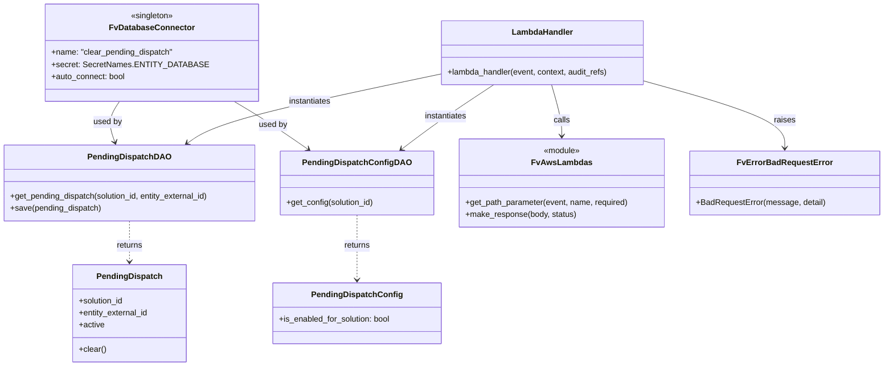
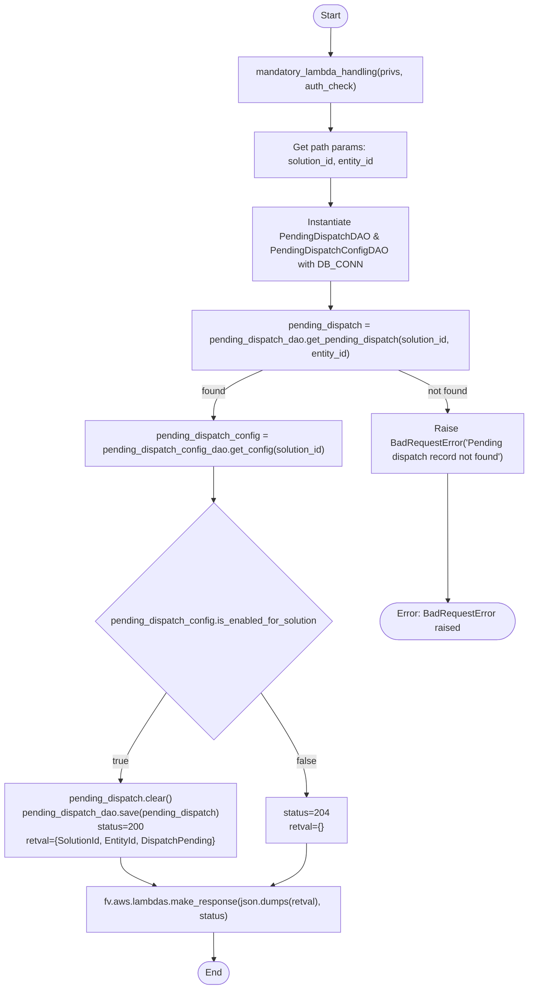

# Diagram: entity_core/entity_service/entity_listener/entity_listener_service/lambdas/clear_pending_dispatch.py

> Auto-generated by Obscura crawlers

## Diagram 1

### SVG

<svg id="container" width="1735.015625" xmlns="http://www.w3.org/2000/svg" class="classDiagram" height="722" viewBox="0 0 1735.015625 722" role="graphics-document document" aria-roledescription="class"><g><defs><marker id="container_class-aggregationStart" class="marker aggregation class" refX="18" refY="7" markerWidth="190" markerHeight="240" orient="auto"><path d="M 18,7 L9,13 L1,7 L9,1 Z"></path></marker></defs><defs><marker id="container_class-aggregationEnd" class="marker aggregation class" refX="1" refY="7" markerWidth="20" markerHeight="28" orient="auto"><path d="M 18,7 L9,13 L1,7 L9,1 Z"></path></marker></defs><defs><marker id="container_class-extensionStart" class="marker extension class" refX="18" refY="7" markerWidth="190" markerHeight="240" orient="auto"><path d="M 1,7 L18,13 V 1 Z"></path></marker></defs><defs><marker id="container_class-extensionEnd" class="marker extension class" refX="1" refY="7" markerWidth="20" markerHeight="28" orient="auto"><path d="M 1,1 V 13 L18,7 Z"></path></marker></defs><defs><marker id="container_class-compositionStart" class="marker composition class" refX="18" refY="7" markerWidth="190" markerHeight="240" orient="auto"><path d="M 18,7 L9,13 L1,7 L9,1 Z"></path></marker></defs><defs><marker id="container_class-compositionEnd" class="marker composition class" refX="1" refY="7" markerWidth="20" markerHeight="28" orient="auto"><path d="M 18,7 L9,13 L1,7 L9,1 Z"></path></marker></defs><defs><marker id="container_class-dependencyStart" class="marker dependency class" refX="6" refY="7" markerWidth="190" markerHeight="240" orient="auto"><path d="M 5,7 L9,13 L1,7 L9,1 Z"></path></marker></defs><defs><marker id="container_class-dependencyEnd" class="marker dependency class" refX="13" refY="7" markerWidth="20" markerHeight="28" orient="auto"><path d="M 18,7 L9,13 L14,7 L9,1 Z"></path></marker></defs><defs><marker id="container_class-lollipopStart" class="marker lollipop class" refX="13" refY="7" markerWidth="190" markerHeight="240" orient="auto"><circle stroke="black" fill="transparent" cx="7" cy="7" r="6"></circle></marker></defs><defs><marker id="container_class-lollipopEnd" class="marker lollipop class" refX="1" refY="7" markerWidth="190" markerHeight="240" orient="auto"><circle stroke="black" fill="transparent" cx="7" cy="7" r="6"></circle></marker></defs><g class="root"><g class="clusters"></g><g class="edgePaths"><path d="M238.348,200L234.118,206.167C229.888,212.333,221.428,224.667,219.857,238.061C218.286,251.456,223.604,265.913,226.263,273.141L228.922,280.369" id="id_FvDatabaseConnector_PendingDispatchDAO_1" class="edge-thickness-normal edge-pattern-solid relation" style=";;;" data-edge="true" data-et="edge" data-id="id_FvDatabaseConnector_PendingDispatchDAO_1" data-points="W3sieCI6MjM4LjM0NzU2ODEzOTA5Nzc1LCJ5IjoyMDB9LHsieCI6MjEyLjk2ODc1LCJ5IjoyMzd9LHsieCI6MjMwLjk5MzM1MzA3NDU5Njc3LCJ5IjoyODZ9XQ==" marker-end="url(#container_class-dependencyEnd)"></path><path d="M466.527,200L476.954,206.167C487.382,212.333,508.237,224.667,532.541,240.431C556.845,256.196,584.599,275.391,598.476,284.989L612.353,294.587" id="id_FvDatabaseConnector_PendingDispatchConfigDAO_2" class="edge-thickness-normal edge-pattern-solid relation" style=";;;" data-edge="true" data-et="edge" data-id="id_FvDatabaseConnector_PendingDispatchConfigDAO_2" data-points="W3sieCI6NDY2LjUyNjYwOTQ5MjQ4MTIsInkiOjIwMH0seyJ4Ijo1MjkuMDkxNzk2ODc1LCJ5IjoyMzd9LHsieCI6NjE3LjI4NzU2NjE1NDIzMzksInkiOjI5OH1d" marker-end="url(#container_class-dependencyEnd)"></path><path d="M258.582,436L258.582,444.167C258.582,452.333,258.582,468.667,258.582,482C258.582,495.333,258.582,505.667,258.582,510.833L258.582,516" id="id_PendingDispatchDAO_PendingDispatch_3" class="edge-thickness-normal edge-pattern-dashed relation" style=";;;" data-edge="true" data-et="edge" data-id="id_PendingDispatchDAO_PendingDispatch_3" data-points="W3sieCI6MjU4LjU4MjAzMTI1LCJ5Ijo0MzZ9LHsieCI6MjU4LjU4MjAzMTI1LCJ5Ijo0ODV9LHsieCI6MjU4LjU4MjAzMTI1LCJ5Ijo1MjJ9XQ==" marker-end="url(#container_class-dependencyEnd)"></path><path d="M708.375,424L708.375,434.167C708.375,444.333,708.375,464.667,708.375,486C708.375,507.333,708.375,529.667,708.375,540.833L708.375,552" id="id_PendingDispatchConfigDAO_PendingDispatchConfig_4" class="edge-thickness-normal edge-pattern-dashed relation" style=";;;" data-edge="true" data-et="edge" data-id="id_PendingDispatchConfigDAO_PendingDispatchConfig_4" data-points="W3sieCI6NzA4LjM3NSwieSI6NDI0fSx7IngiOjcwOC4zNzUsInkiOjQ4NX0seyJ4Ijo3MDguMzc1LCJ5Ijo1NTh9XQ==" marker-end="url(#container_class-dependencyEnd)"></path><path d="M867.91,146.5L796.236,161.583C724.562,176.667,581.214,206.833,498.554,229.514C415.895,252.196,393.925,267.391,382.939,274.989L371.954,282.587" id="id_LambdaHandler_PendingDispatchDAO_5" class="edge-thickness-normal edge-pattern-solid relation" style=";;;" data-edge="true" data-et="edge" data-id="id_LambdaHandler_PendingDispatchDAO_5" data-points="W3sieCI6ODY3LjkxMDE1NjI1LCJ5IjoxNDYuNDk5NzYwNDk0MjE2MzN9LHsieCI6NDM3Ljg2NTIzNDM3NSwieSI6MjM3fSx7IngiOjM2Ny4wMTk0NTI0OTQ5NTk3LCJ5IjoyODZ9XQ==" marker-end="url(#container_class-dependencyEnd)"></path><path d="M974.85,167L957.255,178.667C939.66,190.333,904.469,213.667,874.474,234.89C844.479,256.113,819.678,275.225,807.278,284.781L794.877,294.338" id="id_LambdaHandler_PendingDispatchConfigDAO_6" class="edge-thickness-normal edge-pattern-solid relation" style=";;;" data-edge="true" data-et="edge" data-id="id_LambdaHandler_PendingDispatchConfigDAO_6" data-points="W3sieCI6OTc0Ljg0OTgxNDk2NzEwNTIsInkiOjE2N30seyJ4Ijo4NjkuMjc5Mjk2ODc1LCJ5IjoyMzd9LHsieCI6NzkwLjEyNDc2MzczNDg3OSwieSI6Mjk4fV0=" marker-end="url(#container_class-dependencyEnd)"></path><path d="M1088.659,167L1092.14,178.667C1095.62,190.333,1102.582,213.667,1106.062,230.5C1109.543,247.333,1109.543,257.667,1109.543,262.833L1109.543,268" id="id_LambdaHandler_FvAwsLambdas_7" class="edge-thickness-normal edge-pattern-solid relation" style=";;;" data-edge="true" data-et="edge" data-id="id_LambdaHandler_FvAwsLambdas_7" data-points="W3sieCI6MTA4OC42NTg5MjI2OTczNjgzLCJ5IjoxNjd9LHsieCI6MTEwOS41NDI5Njg3NSwieSI6MjM3fSx7IngiOjExMDkuNTQyOTY4NzUsInkiOjI3NH1d" marker-end="url(#container_class-dependencyEnd)"></path><path d="M1271.816,160.619L1317.223,173.349C1362.63,186.079,1453.444,211.54,1498.851,233.437C1544.258,255.333,1544.258,273.667,1544.258,282.833L1544.258,292" id="id_LambdaHandler_FvErrorBadRequestError_8" class="edge-thickness-normal edge-pattern-solid relation" style=";;;" data-edge="true" data-et="edge" data-id="id_LambdaHandler_FvErrorBadRequestError_8" data-points="W3sieCI6MTI3MS44MTY0MDYyNSwieSI6MTYwLjYxOTA0NTY1ODUyODUzfSx7IngiOjE1NDQuMjU3ODEyNSwieSI6MjM3fSx7IngiOjE1NDQuMjU3ODEyNSwieSI6Mjk4fV0=" marker-end="url(#container_class-dependencyEnd)"></path></g><g class="edgeLabels"><g class="edgeLabel" transform="translate(214.2362, 240.44558)"><g class="label" data-id="id_FvDatabaseConnector_PendingDispatchDAO_1" transform="translate(-28.3125, -12)"><foreignObject width="56.625" height="24">

used by

</foreignObject></g></g><g class="edgeLabel" transform="translate(543.29904, 246.82634)"><g class="label" data-id="id_FvDatabaseConnector_PendingDispatchConfigDAO_2" transform="translate(-28.3125, -12)"><foreignObject width="56.625" height="24">

used by

</foreignObject></g></g><g class="edgeLabel" transform="translate(258.58203125, 485)"><g class="label" data-id="id_PendingDispatchDAO_PendingDispatch_3" transform="translate(-26.265625, -12)"><foreignObject width="52.53125" height="24">

returns

</foreignObject></g></g><g class="edgeLabel" transform="translate(708.375, 485)"><g class="label" data-id="id_PendingDispatchConfigDAO_PendingDispatchConfig_4" transform="translate(-26.265625, -12)"><foreignObject width="52.53125" height="24">

returns

</foreignObject></g></g><g class="edgeLabel" transform="translate(610.74078, 200.61943)"><g class="label" data-id="id_LambdaHandler_PendingDispatchDAO_5" transform="translate(-42.9140625, -12)"><foreignObject width="85.828125" height="24">

instantiates

</foreignObject></g></g><g class="edgeLabel" transform="translate(880.42114, 229.61224)"><g class="label" data-id="id_LambdaHandler_PendingDispatchConfigDAO_6" transform="translate(-42.9140625, -12)"><foreignObject width="85.828125" height="24">

instantiates

</foreignObject></g></g><g class="edgeLabel" transform="translate(1109.54296875, 237)"><g class="label" data-id="id_LambdaHandler_FvAwsLambdas_7" transform="translate(-16.4453125, -12)"><foreignObject width="32.890625" height="24">

calls

</foreignObject></g></g><g class="edgeLabel" transform="translate(1544.2578125, 237)"><g class="label" data-id="id_LambdaHandler_FvErrorBadRequestError_8" transform="translate(-21.25, -12)"><foreignObject width="42.5" height="24">

raises

</foreignObject></g></g></g><g class="nodes"><g class="node default" id="classId-FvDatabaseConnector-0" transform="translate(304.1953125, 104)"><g class="basic label-container"><path d="M-194.98828125 -96 L194.98828125 -96 L194.98828125 96 L-194.98828125 96" stroke="none" stroke-width="0" fill="#ECECFF" style=""></path><path d="M-194.98828125 -96 C-47.13738912784581 -96, 100.71350299430839 -96, 194.98828125 -96 M-194.98828125 -96 C-56.51656705167133 -96, 81.95514714665734 -96, 194.98828125 -96 M194.98828125 -96 C194.98828125 -22.499284248127353, 194.98828125 51.001431503745295, 194.98828125 96 M194.98828125 -96 C194.98828125 -48.9940013316376, 194.98828125 -1.9880026632751964, 194.98828125 96 M194.98828125 96 C55.18009298916775 96, -84.6280952716645 96, -194.98828125 96 M194.98828125 96 C84.40178534028992 96, -26.18471056942016 96, -194.98828125 96 M-194.98828125 96 C-194.98828125 42.01833736043203, -194.98828125 -11.963325279135944, -194.98828125 -96 M-194.98828125 96 C-194.98828125 23.42815106235153, -194.98828125 -49.14369787529694, -194.98828125 -96" stroke="#9370DB" stroke-width="1.3" fill="none" stroke-dasharray="0 0" style=""></path></g><g class="annotation-group text" transform="translate(-42.765625, -72)"><g class="label" style="" transform="translate(0,-12)"><foreignObject width="85.53125" height="24">

«singleton»

</foreignObject></g></g><g class="label-group text" transform="translate(-79.3046875, -48)"><g class="label" style="font-weight: bolder" transform="translate(0,-12)"><foreignObject width="158.609375" height="24">

FvDatabaseConnector

</foreignObject></g></g><g class="members-group text" transform="translate(-182.98828125, 0)"><g class="label" style="" transform="translate(0,-12)"><foreignObject width="241.375" height="24">

+name: "clear_pending_dispatch"

</foreignObject></g><g class="label" style="" transform="translate(0,12)"><foreignObject width="286.671875" height="24">

+secret: SecretNames.ENTITY_DATABASE

</foreignObject></g><g class="label" style="" transform="translate(0,36)"><foreignObject width="146.921875" height="24">

+auto_connect: bool

</foreignObject></g></g><g class="methods-group text" transform="translate(-182.98828125, 96)"></g><g class="divider" style=""><path d="M-194.98828125 -24 C-84.49722781266175 -24, 25.993825624676504 -24, 194.98828125 -24 M-194.98828125 -24 C-111.2673750112665 -24, -27.54646877253299 -24, 194.98828125 -24" stroke="#9370DB" stroke-width="1.3" fill="none" stroke-dasharray="0 0" style=""></path></g><g class="divider" style=""><path d="M-194.98828125 72 C-67.40838164599434 72, 60.17151795801132 72, 194.98828125 72 M-194.98828125 72 C-114.34108736634954 72, -33.69389348269908 72, 194.98828125 72" stroke="#9370DB" stroke-width="1.3" fill="none" stroke-dasharray="0 0" style=""></path></g></g><g class="node default" id="classId-PendingDispatchDAO-1" transform="translate(258.58203125, 361)"><g class="basic label-container"><path d="M-250.58203125 -75 L250.58203125 -75 L250.58203125 75 L-250.58203125 75" stroke="none" stroke-width="0" fill="#ECECFF" style=""></path><path d="M-250.58203125 -75 C-119.65257784461079 -75, 11.276875560778421 -75, 250.58203125 -75 M-250.58203125 -75 C-64.82177334372795 -75, 120.93848456254409 -75, 250.58203125 -75 M250.58203125 -75 C250.58203125 -31.26216289877182, 250.58203125 12.47567420245636, 250.58203125 75 M250.58203125 -75 C250.58203125 -25.091157742476256, 250.58203125 24.81768451504749, 250.58203125 75 M250.58203125 75 C89.42168151513911 75, -71.73866821972177 75, -250.58203125 75 M250.58203125 75 C103.24921016965465 75, -44.08361091069071 75, -250.58203125 75 M-250.58203125 75 C-250.58203125 41.26273982957658, -250.58203125 7.525479659153163, -250.58203125 -75 M-250.58203125 75 C-250.58203125 29.782805436332573, -250.58203125 -15.434389127334853, -250.58203125 -75" stroke="#9370DB" stroke-width="1.3" fill="none" stroke-dasharray="0 0" style=""></path></g><g class="annotation-group text" transform="translate(0, -51)"></g><g class="label-group text" transform="translate(-76.7734375, -51)"><g class="label" style="font-weight: bolder" transform="translate(0,-12)"><foreignObject width="153.546875" height="24">

PendingDispatchDAO

</foreignObject></g></g><g class="members-group text" transform="translate(-238.58203125, -3)"></g><g class="methods-group text" transform="translate(-238.58203125, 27)"><g class="label" style="" transform="translate(0,-12)"><foreignObject width="400.390625" height="24">

+get_pending_dispatch(solution_id, entity_external_id)

</foreignObject></g><g class="label" style="" transform="translate(0,12)"><foreignObject width="180.265625" height="24">

+save(pending_dispatch)

</foreignObject></g></g><g class="divider" style=""><path d="M-250.58203125 -27 C-125.04440077884448 -27, 0.4932296923110471 -27, 250.58203125 -27 M-250.58203125 -27 C-146.82908944310688 -27, -43.07614763621376 -27, 250.58203125 -27" stroke="#9370DB" stroke-width="1.3" fill="none" stroke-dasharray="0 0" style=""></path></g><g class="divider" style=""><path d="M-250.58203125 -3 C-129.15647282656062 -3, -7.730914403121233 -3, 250.58203125 -3 M-250.58203125 -3 C-53.45447565224222 -3, 143.67307994551555 -3, 250.58203125 -3" stroke="#9370DB" stroke-width="1.3" fill="none" stroke-dasharray="0 0" style=""></path></g></g><g class="node default" id="classId-PendingDispatchConfigDAO-2" transform="translate(708.375, 361)"><g class="basic label-container"><path d="M-149.2109375 -63 L149.2109375 -63 L149.2109375 63 L-149.2109375 63" stroke="none" stroke-width="0" fill="#ECECFF" style=""></path><path d="M-149.2109375 -63 C-66.15825593855824 -63, 16.894425622883517 -63, 149.2109375 -63 M-149.2109375 -63 C-39.602183195114776 -63, 70.00657110977045 -63, 149.2109375 -63 M149.2109375 -63 C149.2109375 -19.097612697619105, 149.2109375 24.80477460476179, 149.2109375 63 M149.2109375 -63 C149.2109375 -26.33046944295272, 149.2109375 10.339061114094562, 149.2109375 63 M149.2109375 63 C60.44323675661033 63, -28.324463986779335 63, -149.2109375 63 M149.2109375 63 C51.04768760525225 63, -47.1155622894955 63, -149.2109375 63 M-149.2109375 63 C-149.2109375 15.503499330460023, -149.2109375 -31.993001339079953, -149.2109375 -63 M-149.2109375 63 C-149.2109375 21.662772307213096, -149.2109375 -19.674455385573808, -149.2109375 -63" stroke="#9370DB" stroke-width="1.3" fill="none" stroke-dasharray="0 0" style=""></path></g><g class="annotation-group text" transform="translate(0, -39)"></g><g class="label-group text" transform="translate(-99.703125, -39)"><g class="label" style="font-weight: bolder" transform="translate(0,-12)"><foreignObject width="199.40625" height="24">

PendingDispatchConfigDAO

</foreignObject></g></g><g class="members-group text" transform="translate(-137.2109375, 9)"></g><g class="methods-group text" transform="translate(-137.2109375, 39)"><g class="label" style="" transform="translate(0,-12)"><foreignObject width="174.71875" height="24">

+get_config(solution_id)

</foreignObject></g></g><g class="divider" style=""><path d="M-149.2109375 -15 C-66.71564413110038 -15, 15.779649237799248 -15, 149.2109375 -15 M-149.2109375 -15 C-66.71394690917708 -15, 15.783043681645836 -15, 149.2109375 -15" stroke="#9370DB" stroke-width="1.3" fill="none" stroke-dasharray="0 0" style=""></path></g><g class="divider" style=""><path d="M-149.2109375 9 C-48.527479099984234 9, 52.15597930003153 9, 149.2109375 9 M-149.2109375 9 C-61.318959472811045 9, 26.57301855437791 9, 149.2109375 9" stroke="#9370DB" stroke-width="1.3" fill="none" stroke-dasharray="0 0" style=""></path></g></g><g class="node default" id="classId-PendingDispatch-3" transform="translate(258.58203125, 618)"><g class="basic label-container"><path d="M-112.35546875 -96 L112.35546875 -96 L112.35546875 96 L-112.35546875 96" stroke="none" stroke-width="0" fill="#ECECFF" style=""></path><path d="M-112.35546875 -96 C-51.88948842282845 -96, 8.5764919043431 -96, 112.35546875 -96 M-112.35546875 -96 C-35.501166434065595 -96, 41.35313588186881 -96, 112.35546875 -96 M112.35546875 -96 C112.35546875 -44.860806164651706, 112.35546875 6.278387670696588, 112.35546875 96 M112.35546875 -96 C112.35546875 -36.26005062307322, 112.35546875 23.47989875385356, 112.35546875 96 M112.35546875 96 C59.33787040221707 96, 6.320272054434142 96, -112.35546875 96 M112.35546875 96 C32.13426544481392 96, -48.08693786037216 96, -112.35546875 96 M-112.35546875 96 C-112.35546875 50.436355125550286, -112.35546875 4.872710251100571, -112.35546875 -96 M-112.35546875 96 C-112.35546875 56.41383171405068, -112.35546875 16.82766342810136, -112.35546875 -96" stroke="#9370DB" stroke-width="1.3" fill="none" stroke-dasharray="0 0" style=""></path></g><g class="annotation-group text" transform="translate(0, -72)"></g><g class="label-group text" transform="translate(-61.4765625, -72)"><g class="label" style="font-weight: bolder" transform="translate(0,-12)"><foreignObject width="122.953125" height="24">

PendingDispatch

</foreignObject></g></g><g class="members-group text" transform="translate(-100.35546875, -24)"><g class="label" style="" transform="translate(0,-12)"><foreignObject width="90.21875" height="24">

+solution_id

</foreignObject></g><g class="label" style="" transform="translate(0,12)"><foreignObject width="139.234375" height="24">

+entity_external_id

</foreignObject></g><g class="label" style="" transform="translate(0,36)"><foreignObject width="50.921875" height="24">

+active

</foreignObject></g></g><g class="methods-group text" transform="translate(-100.35546875, 72)"><g class="label" style="" transform="translate(0,-12)"><foreignObject width="54.0625" height="24">

+clear()

</foreignObject></g></g><g class="divider" style=""><path d="M-112.35546875 -48 C-36.82535683395858 -48, 38.70475508208284 -48, 112.35546875 -48 M-112.35546875 -48 C-49.65418568775949 -48, 13.047097374481027 -48, 112.35546875 -48" stroke="#9370DB" stroke-width="1.3" fill="none" stroke-dasharray="0 0" style=""></path></g><g class="divider" style=""><path d="M-112.35546875 48 C-63.0146328063806 48, -13.673796862761193 48, 112.35546875 48 M-112.35546875 48 C-48.68159728044621 48, 14.992274189107576 48, 112.35546875 48" stroke="#9370DB" stroke-width="1.3" fill="none" stroke-dasharray="0 0" style=""></path></g></g><g class="node default" id="classId-PendingDispatchConfig-4" transform="translate(708.375, 618)"><g class="basic label-container"><path d="M-165.90625 -60 L165.90625 -60 L165.90625 60 L-165.90625 60" stroke="none" stroke-width="0" fill="#ECECFF" style=""></path><path d="M-165.90625 -60 C-58.09791615362508 -60, 49.71041769274984 -60, 165.90625 -60 M-165.90625 -60 C-62.75136322380911 -60, 40.403523552381785 -60, 165.90625 -60 M165.90625 -60 C165.90625 -22.379475059467282, 165.90625 15.241049881065436, 165.90625 60 M165.90625 -60 C165.90625 -24.218516662558763, 165.90625 11.562966674882475, 165.90625 60 M165.90625 60 C65.25691164167647 60, -35.392426716647066 60, -165.90625 60 M165.90625 60 C43.289978931080654 60, -79.32629213783869 60, -165.90625 60 M-165.90625 60 C-165.90625 22.33536267882885, -165.90625 -15.329274642342298, -165.90625 -60 M-165.90625 60 C-165.90625 22.602607770989884, -165.90625 -14.794784458020231, -165.90625 -60" stroke="#9370DB" stroke-width="1.3" fill="none" stroke-dasharray="0 0" style=""></path></g><g class="annotation-group text" transform="translate(0, -36)"></g><g class="label-group text" transform="translate(-84.40625, -36)"><g class="label" style="font-weight: bolder" transform="translate(0,-12)"><foreignObject width="168.8125" height="24">

PendingDispatchConfig

</foreignObject></g></g><g class="members-group text" transform="translate(-153.90625, 12)"><g class="label" style="" transform="translate(0,-12)"><foreignObject width="223.40625" height="24">

+is_enabled_for_solution: bool

</foreignObject></g></g><g class="methods-group text" transform="translate(-153.90625, 60)"></g><g class="divider" style=""><path d="M-165.90625 -12 C-97.44603765169587 -12, -28.98582530339175 -12, 165.90625 -12 M-165.90625 -12 C-52.70467313679701 -12, 60.496903726405975 -12, 165.90625 -12" stroke="#9370DB" stroke-width="1.3" fill="none" stroke-dasharray="0 0" style=""></path></g><g class="divider" style=""><path d="M-165.90625 36 C-93.09970325128802 36, -20.29315650257604 36, 165.90625 36 M-165.90625 36 C-76.01588827338422 36, 13.874473453231559 36, 165.90625 36" stroke="#9370DB" stroke-width="1.3" fill="none" stroke-dasharray="0 0" style=""></path></g></g><g class="node default" id="classId-LambdaHandler-5" transform="translate(1069.86328125, 104)"><g class="basic label-container"><path d="M-201.953125 -63 L201.953125 -63 L201.953125 63 L-201.953125 63" stroke="none" stroke-width="0" fill="#ECECFF" style=""></path><path d="M-201.953125 -63 C-101.29892539663389 -63, -0.6447257932677815 -63, 201.953125 -63 M-201.953125 -63 C-45.2447223282972 -63, 111.4636803434056 -63, 201.953125 -63 M201.953125 -63 C201.953125 -18.503090572572255, 201.953125 25.99381885485549, 201.953125 63 M201.953125 -63 C201.953125 -33.34065534451116, 201.953125 -3.6813106890223324, 201.953125 63 M201.953125 63 C66.67800086519355 63, -68.5971232696129 63, -201.953125 63 M201.953125 63 C77.64353689889997 63, -46.666051202200066 63, -201.953125 63 M-201.953125 63 C-201.953125 15.0147477089482, -201.953125 -32.9705045821036, -201.953125 -63 M-201.953125 63 C-201.953125 19.687939157540697, -201.953125 -23.624121684918606, -201.953125 -63" stroke="#9370DB" stroke-width="1.3" fill="none" stroke-dasharray="0 0" style=""></path></g><g class="annotation-group text" transform="translate(0, -39)"></g><g class="label-group text" transform="translate(-58.21875, -39)"><g class="label" style="font-weight: bolder" transform="translate(0,-12)"><foreignObject width="116.4375" height="24">

LambdaHandler

</foreignObject></g></g><g class="members-group text" transform="translate(-189.953125, 9)"></g><g class="methods-group text" transform="translate(-189.953125, 39)"><g class="label" style="" transform="translate(0,-12)"><foreignObject width="321.6875" height="24">

+lambda_handler(event, context, audit_refs)

</foreignObject></g></g><g class="divider" style=""><path d="M-201.953125 -15 C-93.43618197755578 -15, 15.080761044888447 -15, 201.953125 -15 M-201.953125 -15 C-117.15234569193407 -15, -32.351566383868146 -15, 201.953125 -15" stroke="#9370DB" stroke-width="1.3" fill="none" stroke-dasharray="0 0" style=""></path></g><g class="divider" style=""><path d="M-201.953125 9 C-61.42664015026074 9, 79.09984469947852 9, 201.953125 9 M-201.953125 9 C-91.65696624306509 9, 18.63919251386983 9, 201.953125 9" stroke="#9370DB" stroke-width="1.3" fill="none" stroke-dasharray="0 0" style=""></path></g></g><g class="node default" id="classId-FvAwsLambdas-6" transform="translate(1109.54296875, 361)"><g class="basic label-container"><path d="M-201.95703125 -87 L201.95703125 -87 L201.95703125 87 L-201.95703125 87" stroke="none" stroke-width="0" fill="#ECECFF" style=""></path><path d="M-201.95703125 -87 C-91.96946392192652 -87, 18.018103406146963 -87, 201.95703125 -87 M-201.95703125 -87 C-110.51120447316542 -87, -19.06537769633084 -87, 201.95703125 -87 M201.95703125 -87 C201.95703125 -50.849213524728896, 201.95703125 -14.698427049457791, 201.95703125 87 M201.95703125 -87 C201.95703125 -38.697111806421766, 201.95703125 9.605776387156467, 201.95703125 87 M201.95703125 87 C95.5564757931462 87, -10.84407966370759 87, -201.95703125 87 M201.95703125 87 C73.20199318381773 87, -55.55304488236453 87, -201.95703125 87 M-201.95703125 87 C-201.95703125 44.51060628578221, -201.95703125 2.021212571564419, -201.95703125 -87 M-201.95703125 87 C-201.95703125 41.31639188134489, -201.95703125 -4.367216237310217, -201.95703125 -87" stroke="#9370DB" stroke-width="1.3" fill="none" stroke-dasharray="0 0" style=""></path></g><g class="annotation-group text" transform="translate(-36.6015625, -63)"><g class="label" style="" transform="translate(0,-12)"><foreignObject width="73.203125" height="24">

«module»

</foreignObject></g></g><g class="label-group text" transform="translate(-55.2109375, -39)"><g class="label" style="font-weight: bolder" transform="translate(0,-12)"><foreignObject width="110.421875" height="24">

FvAwsLambdas

</foreignObject></g></g><g class="members-group text" transform="translate(-189.95703125, 9)"></g><g class="methods-group text" transform="translate(-189.95703125, 39)"><g class="label" style="" transform="translate(0,-12)"><foreignObject width="324.703125" height="24">

+get_path_parameter(event, name, required)

</foreignObject></g><g class="label" style="" transform="translate(0,12)"><foreignObject width="219.96875" height="24">

+make_response(body, status)

</foreignObject></g></g><g class="divider" style=""><path d="M-201.95703125 -15 C-112.17251308547391 -15, -22.38799492094782 -15, 201.95703125 -15 M-201.95703125 -15 C-47.89582423245531 -15, 106.16538278508938 -15, 201.95703125 -15" stroke="#9370DB" stroke-width="1.3" fill="none" stroke-dasharray="0 0" style=""></path></g><g class="divider" style=""><path d="M-201.95703125 9 C-119.9821521178853 9, -38.00727298577061 9, 201.95703125 9 M-201.95703125 9 C-96.58668770826323 9, 8.783655833473546 9, 201.95703125 9" stroke="#9370DB" stroke-width="1.3" fill="none" stroke-dasharray="0 0" style=""></path></g></g><g class="node default" id="classId-FvErrorBadRequestError-7" transform="translate(1544.2578125, 361)"><g class="basic label-container"><path d="M-182.7578125 -63 L182.7578125 -63 L182.7578125 63 L-182.7578125 63" stroke="none" stroke-width="0" fill="#ECECFF" style=""></path><path d="M-182.7578125 -63 C-92.26924668503088 -63, -1.780680870061758 -63, 182.7578125 -63 M-182.7578125 -63 C-58.165773802878704 -63, 66.42626489424259 -63, 182.7578125 -63 M182.7578125 -63 C182.7578125 -13.161246564211048, 182.7578125 36.677506871577904, 182.7578125 63 M182.7578125 -63 C182.7578125 -33.19920569132317, 182.7578125 -3.398411382646337, 182.7578125 63 M182.7578125 63 C70.02665704992832 63, -42.704498400143365 63, -182.7578125 63 M182.7578125 63 C66.16683335644692 63, -50.42414578710617 63, -182.7578125 63 M-182.7578125 63 C-182.7578125 27.076325538670183, -182.7578125 -8.847348922659634, -182.7578125 -63 M-182.7578125 63 C-182.7578125 30.975204442110694, -182.7578125 -1.049591115778611, -182.7578125 -63" stroke="#9370DB" stroke-width="1.3" fill="none" stroke-dasharray="0 0" style=""></path></g><g class="annotation-group text" transform="translate(0, -39)"></g><g class="label-group text" transform="translate(-88.1875, -39)"><g class="label" style="font-weight: bolder" transform="translate(0,-12)"><foreignObject width="176.375" height="24">

FvErrorBadRequestError

</foreignObject></g></g><g class="members-group text" transform="translate(-170.7578125, 9)"></g><g class="methods-group text" transform="translate(-170.7578125, 39)"><g class="label" style="" transform="translate(0,-12)"><foreignObject width="253.328125" height="24">

+BadRequestError(message, detail)

</foreignObject></g></g><g class="divider" style=""><path d="M-182.7578125 -15 C-37.99551368580259 -15, 106.76678512839482 -15, 182.7578125 -15 M-182.7578125 -15 C-109.27219996033801 -15, -35.78658742067603 -15, 182.7578125 -15" stroke="#9370DB" stroke-width="1.3" fill="none" stroke-dasharray="0 0" style=""></path></g><g class="divider" style=""><path d="M-182.7578125 9 C-68.65845962057287 9, 45.44089325885426 9, 182.7578125 9 M-182.7578125 9 C-40.777605653463525 9, 101.20260119307295 9, 182.7578125 9" stroke="#9370DB" stroke-width="1.3" fill="none" stroke-dasharray="0 0" style=""></path></g></g></g></g></g></svg>

## Diagram 2

### SVG

<svg id="container" width="1198.51953125" xmlns="http://www.w3.org/2000/svg" class="flowchart" height="1647.46875" viewBox="0 0 1198.51953125 1647.46875" role="graphics-document document" aria-roledescription="flowchart-v2"><g><marker id="container_flowchart-v2-pointEnd" class="marker flowchart-v2" viewBox="0 0 10 10" refX="5" refY="5" markerUnits="userSpaceOnUse" markerWidth="8" markerHeight="8" orient="auto"><path d="M 0 0 L 10 5 L 0 10 z" class="arrowMarkerPath" style="stroke-width: 1; stroke-dasharray: 1, 0;"></path></marker><marker id="container_flowchart-v2-pointStart" class="marker flowchart-v2" viewBox="0 0 10 10" refX="4.5" refY="5" markerUnits="userSpaceOnUse" markerWidth="8" markerHeight="8" orient="auto"><path d="M 0 5 L 10 10 L 10 0 z" class="arrowMarkerPath" style="stroke-width: 1; stroke-dasharray: 1, 0;"></path></marker><marker id="container_flowchart-v2-circleEnd" class="marker flowchart-v2" viewBox="0 0 10 10" refX="11" refY="5" markerUnits="userSpaceOnUse" markerWidth="11" markerHeight="11" orient="auto"><circle cx="5" cy="5" r="5" class="arrowMarkerPath" style="stroke-width: 1; stroke-dasharray: 1, 0;"></circle></marker><marker id="container_flowchart-v2-circleStart" class="marker flowchart-v2" viewBox="0 0 10 10" refX="-1" refY="5" markerUnits="userSpaceOnUse" markerWidth="11" markerHeight="11" orient="auto"><circle cx="5" cy="5" r="5" class="arrowMarkerPath" style="stroke-width: 1; stroke-dasharray: 1, 0;"></circle></marker><marker id="container_flowchart-v2-crossEnd" class="marker cross flowchart-v2" viewBox="0 0 11 11" refX="12" refY="5.2" markerUnits="userSpaceOnUse" markerWidth="11" markerHeight="11" orient="auto"><path d="M 1,1 l 9,9 M 10,1 l -9,9" class="arrowMarkerPath" style="stroke-width: 2; stroke-dasharray: 1, 0;"></path></marker><marker id="container_flowchart-v2-crossStart" class="marker cross flowchart-v2" viewBox="0 0 11 11" refX="-1" refY="5.2" markerUnits="userSpaceOnUse" markerWidth="11" markerHeight="11" orient="auto"><path d="M 1,1 l 9,9 M 10,1 l -9,9" class="arrowMarkerPath" style="stroke-width: 2; stroke-dasharray: 1, 0;"></path></marker><g class="root"><g class="clusters"></g><g class="edgePaths"><path d="M859.246,47.5L859.163,51.583C859.079,55.667,858.913,63.833,858.829,71.417C858.746,79,858.746,86,858.746,89.5L858.746,93" id="L_Start_AuthCheck_0" class="edge-thickness-normal edge-pattern-solid edge-thickness-normal edge-pattern-solid flowchart-link" style=";" data-edge="true" data-et="edge" data-id="L_Start_AuthCheck_0" data-points="W3sieCI6ODU5LjI0NjA5Mzc1LCJ5Ijo0Ny41fSx7IngiOjg1OC43NDYwOTM3NSwieSI6NzJ9LHsieCI6ODU4Ljc0NjA5Mzc1LCJ5Ijo5N31d" marker-end="url(#container_flowchart-v2-pointEnd)"></path><path d="M858.746,175L858.746,179.167C858.746,183.333,858.746,191.667,858.746,199.333C858.746,207,858.746,214,858.746,217.5L858.746,221" id="L_AuthCheck_GetParams_0" class="edge-thickness-normal edge-pattern-solid edge-thickness-normal edge-pattern-solid flowchart-link" style=";" data-edge="true" data-et="edge" data-id="L_AuthCheck_GetParams_0" data-points="W3sieCI6ODU4Ljc0NjA5Mzc1LCJ5IjoxNzV9LHsieCI6ODU4Ljc0NjA5Mzc1LCJ5IjoyMDB9LHsieCI6ODU4Ljc0NjA5Mzc1LCJ5IjoyMjV9XQ==" marker-end="url(#container_flowchart-v2-pointEnd)"></path><path d="M858.746,303L858.746,307.167C858.746,311.333,858.746,319.667,858.746,327.333C858.746,335,858.746,342,858.746,345.5L858.746,349" id="L_GetParams_InitDAOs_0" class="edge-thickness-normal edge-pattern-solid edge-thickness-normal edge-pattern-solid flowchart-link" style=";" data-edge="true" data-et="edge" data-id="L_GetParams_InitDAOs_0" data-points="W3sieCI6ODU4Ljc0NjA5Mzc1LCJ5IjozMDN9LHsieCI6ODU4Ljc0NjA5Mzc1LCJ5IjozMjh9LHsieCI6ODU4Ljc0NjA5Mzc1LCJ5IjozNTN9XQ==" marker-end="url(#container_flowchart-v2-pointEnd)"></path><path d="M858.746,479L858.746,483.167C858.746,487.333,858.746,495.667,858.746,503.333C858.746,511,858.746,518,858.746,521.5L858.746,525" id="L_InitDAOs_FetchPending_0" class="edge-thickness-normal edge-pattern-solid edge-thickness-normal edge-pattern-solid flowchart-link" style=";" data-edge="true" data-et="edge" data-id="L_InitDAOs_FetchPending_0" data-points="W3sieCI6ODU4Ljc0NjA5Mzc1LCJ5Ijo0Nzl9LHsieCI6ODU4Ljc0NjA5Mzc1LCJ5Ijo1MDR9LHsieCI6ODU4Ljc0NjA5Mzc1LCJ5Ijo1Mjl9XQ==" marker-end="url(#container_flowchart-v2-pointEnd)"></path><path d="M975.683,631L989.822,637.167C1003.962,643.333,1032.241,655.667,1046.38,667.333C1060.52,679,1060.52,690,1060.52,695.5L1060.52,701" id="L_FetchPending_RaiseError_0" class="edge-thickness-normal edge-pattern-solid edge-thickness-normal edge-pattern-solid flowchart-link" style=";" data-edge="true" data-et="edge" data-id="L_FetchPending_RaiseError_0" data-points="W3sieCI6OTc1LjY4Mjk3MjMwMTEzNjQsInkiOjYzMX0seyJ4IjoxMDYwLjUxOTUzMTI1LCJ5Ijo2Njh9LHsieCI6MTA2MC41MTk1MzEyNSwieSI6NzA1fV0=" marker-end="url(#container_flowchart-v2-pointEnd)"></path><path d="M741.809,631L727.67,637.167C713.53,643.333,685.252,655.667,671.112,669.333C656.973,683,656.973,698,656.973,705.5L656.973,713" id="L_FetchPending_FetchConfig_0" class="edge-thickness-normal edge-pattern-solid edge-thickness-normal edge-pattern-solid flowchart-link" style=";" data-edge="true" data-et="edge" data-id="L_FetchPending_FetchConfig_0" data-points="W3sieCI6NzQxLjgwOTIxNTE5ODg2MzYsInkiOjYzMX0seyJ4Ijo2NTYuOTcyNjU2MjUsInkiOjY2OH0seyJ4Ijo2NTYuOTcyNjU2MjUsInkiOjcxN31d" marker-end="url(#container_flowchart-v2-pointEnd)"></path><path d="M656.973,795L656.973,801.167C656.973,807.333,656.973,819.667,656.973,829.333C656.973,839,656.973,846,656.973,849.5L656.973,853" id="L_FetchConfig_IsEnabled_0" class="edge-thickness-normal edge-pattern-solid edge-thickness-normal edge-pattern-solid flowchart-link" style=";" data-edge="true" data-et="edge" data-id="L_FetchConfig_IsEnabled_0" data-points="W3sieCI6NjU2Ljk3MjY1NjI1LCJ5Ijo3OTV9LHsieCI6NjU2Ljk3MjY1NjI1LCJ5Ijo4MzJ9LHsieCI6NjU2Ljk3MjY1NjI1LCJ5Ijo4NTd9XQ==" marker-end="url(#container_flowchart-v2-pointEnd)"></path><path d="M548.58,1162.076L521.871,1186.308C495.163,1210.54,441.745,1259.005,415.037,1288.737C388.328,1318.469,388.328,1329.469,388.328,1334.969L388.328,1340.469" id="L_IsEnabled_ClearAndSave_0" class="edge-thickness-normal edge-pattern-solid edge-thickness-normal edge-pattern-solid flowchart-link" style=";" data-edge="true" data-et="edge" data-id="L_IsEnabled_ClearAndSave_0" data-points="W3sieCI6NTQ4LjU4MDEwMDI5NjQyMSwieSI6MTE2Mi4wNzYxOTQwNDY0MjF9LHsieCI6Mzg4LjMyODEyNSwieSI6MTMwNy40Njg3NX0seyJ4IjozODguMzI4MTI1LCJ5IjoxMzQ0LjQ2ODc1fV0=" marker-end="url(#container_flowchart-v2-pointEnd)"></path><path d="M765.365,1162.076L792.074,1186.308C818.783,1210.54,872.2,1259.005,898.909,1290.737C925.617,1322.469,925.617,1337.469,925.617,1344.969L925.617,1352.469" id="L_IsEnabled_NoAction_0" class="edge-thickness-normal edge-pattern-solid edge-thickness-normal edge-pattern-solid flowchart-link" style=";" data-edge="true" data-et="edge" data-id="L_IsEnabled_NoAction_0" data-points="W3sieCI6NzY1LjM2NTIxMjIwMzU3OSwieSI6MTE2Mi4wNzYxOTQwNDY0MjF9LHsieCI6OTI1LjYxNzE4NzUsInkiOjEzMDcuNDY4NzV9LHsieCI6OTI1LjYxNzE4NzUsInkiOjEzNTYuNDY4NzV9XQ==" marker-end="url(#container_flowchart-v2-pointEnd)"></path><path d="M388.328,1422.469L388.328,1426.635C388.328,1430.802,388.328,1439.135,405.169,1447.314C422.011,1455.493,455.694,1463.517,472.535,1467.53L489.376,1471.542" id="L_ClearAndSave_MakeResponse_0" class="edge-thickness-normal edge-pattern-solid edge-thickness-normal edge-pattern-solid flowchart-link" style=";" data-edge="true" data-et="edge" data-id="L_ClearAndSave_MakeResponse_0" data-points="W3sieCI6Mzg4LjMyODEyNSwieSI6MTQyMi40Njg3NX0seyJ4IjozODguMzI4MTI1LCJ5IjoxNDQ3LjQ2ODc1fSx7IngiOjQ5My4yNjczOTUwMTk1MzEyNSwieSI6MTQ3Mi40Njg3NX1d" marker-end="url(#container_flowchart-v2-pointEnd)"></path><path d="M925.617,1410.469L925.617,1416.635C925.617,1422.802,925.617,1435.135,908.776,1445.314C891.934,1455.493,858.252,1463.517,841.41,1467.53L824.569,1471.542" id="L_NoAction_MakeResponse_0" class="edge-thickness-normal edge-pattern-solid edge-thickness-normal edge-pattern-solid flowchart-link" style=";" data-edge="true" data-et="edge" data-id="L_NoAction_MakeResponse_0" data-points="W3sieCI6OTI1LjYxNzE4NzUsInkiOjE0MTAuNDY4NzV9LHsieCI6OTI1LjYxNzE4NzUsInkiOjE0NDcuNDY4NzV9LHsieCI6ODIwLjY3NzkxNzQ4MDQ2ODgsInkiOjE0NzIuNDY4NzV9XQ==" marker-end="url(#container_flowchart-v2-pointEnd)"></path><path d="M1060.52,807L1060.52,811.167C1060.52,815.333,1060.52,823.667,1060.601,860.622C1060.683,897.578,1060.846,963.156,1060.928,995.945L1061.01,1028.734" id="L_RaiseError_ErrorEnd_0" class="edge-thickness-normal edge-pattern-solid edge-thickness-normal edge-pattern-solid flowchart-link" style=";" data-edge="true" data-et="edge" data-id="L_RaiseError_ErrorEnd_0" data-points="W3sieCI6MTA2MC41MTk1MzEyNSwieSI6ODA3fSx7IngiOjEwNjAuNTE5NTMxMjUsInkiOjgzMn0seyJ4IjoxMDYxLjAxOTUzMTI1LCJ5IjoxMDMyLjczNDM3NX1d" marker-end="url(#container_flowchart-v2-pointEnd)"></path><path d="M656.973,1550.469L656.973,1554.635C656.973,1558.802,656.973,1567.135,657.043,1574.886C657.113,1582.636,657.254,1589.803,657.324,1593.386L657.394,1596.97" id="L_MakeResponse_End_0" class="edge-thickness-normal edge-pattern-solid edge-thickness-normal edge-pattern-solid flowchart-link" style=";" data-edge="true" data-et="edge" data-id="L_MakeResponse_End_0" data-points="W3sieCI6NjU2Ljk3MjY1NjI1LCJ5IjoxNTUwLjQ2ODc1fSx7IngiOjY1Ni45NzI2NTYyNSwieSI6MTU3NS40Njg3NX0seyJ4Ijo2NTcuNDcyNjU2MjUsInkiOjE2MDAuOTY4NzQ5OTk5OTkxMX1d" marker-end="url(#container_flowchart-v2-pointEnd)"></path></g><g class="edgeLabels"><g class="edgeLabel"><g class="label" data-id="L_Start_AuthCheck_0" transform="translate(0, 0)"><foreignObject width="0" height="0">

</foreignObject></g></g><g class="edgeLabel"><g class="label" data-id="L_AuthCheck_GetParams_0" transform="translate(0, 0)"><foreignObject width="0" height="0">

</foreignObject></g></g><g class="edgeLabel"><g class="label" data-id="L_GetParams_InitDAOs_0" transform="translate(0, 0)"><foreignObject width="0" height="0">

</foreignObject></g></g><g class="edgeLabel"><g class="label" data-id="L_InitDAOs_FetchPending_0" transform="translate(0, 0)"><foreignObject width="0" height="0">

</foreignObject></g></g><g class="edgeLabel" transform="translate(1060.51953125, 668)"><g class="label" data-id="L_FetchPending_RaiseError_0" transform="translate(-35.7734375, -12)"><foreignObject width="71.546875" height="24">

not found

</foreignObject></g></g><g class="edgeLabel" transform="translate(656.97265625, 668)"><g class="label" data-id="L_FetchPending_FetchConfig_0" transform="translate(-21.40625, -12)"><foreignObject width="42.8125" height="24">

found

</foreignObject></g></g><g class="edgeLabel"><g class="label" data-id="L_FetchConfig_IsEnabled_0" transform="translate(0, 0)"><foreignObject width="0" height="0">

</foreignObject></g></g><g class="edgeLabel" transform="translate(388.328125, 1307.46875)"><g class="label" data-id="L_IsEnabled_ClearAndSave_0" transform="translate(-14.9921875, -12)"><foreignObject width="29.984375" height="24">

true

</foreignObject></g></g><g class="edgeLabel" transform="translate(925.6171875, 1307.46875)"><g class="label" data-id="L_IsEnabled_NoAction_0" transform="translate(-17.21875, -12)"><foreignObject width="34.4375" height="24">

false

</foreignObject></g></g><g class="edgeLabel"><g class="label" data-id="L_ClearAndSave_MakeResponse_0" transform="translate(0, 0)"><foreignObject width="0" height="0">

</foreignObject></g></g><g class="edgeLabel"><g class="label" data-id="L_NoAction_MakeResponse_0" transform="translate(0, 0)"><foreignObject width="0" height="0">

</foreignObject></g></g><g class="edgeLabel"><g class="label" data-id="L_RaiseError_ErrorEnd_0" transform="translate(0, 0)"><foreignObject width="0" height="0">

</foreignObject></g></g><g class="edgeLabel"><g class="label" data-id="L_MakeResponse_End_0" transform="translate(0, 0)"><foreignObject width="0" height="0">

</foreignObject></g></g></g><g class="nodes"><g class="node default" id="flowchart-Start-0" transform="translate(858.74609375, 27.5)"><g class="basic label-container outer-path"><path d="M-10.3984375 -19.5 C-3.2237827408283284 -19.5, 3.9508720183433432 -19.5, 10.3984375 -19.5 C10.3984375 -19.5, 10.3984375 -19.5, 10.398437499999998 -19.5 C10.69425439756298 -19.490513727867818, 10.990071295125961 -19.48102745573563, 11.6478067896239 -19.45993515863156 C12.017386051738994 -19.42428229169941, 12.386965313854088 -19.38862942476726, 12.892042152847864 -19.3399052695533 C13.149239577999294 -19.29832358445064, 13.406437003150725 -19.256741899347976, 14.126030759676757 -19.140403561325776 C14.37923196841487 -19.082612037723603, 14.632433177152985 -19.02482051412143, 15.34470188623539 -18.862249829261074 C15.775314422205595 -18.734446288916445, 16.2059269581758 -18.606642748571815, 16.543047751460602 -18.50658706670804 C16.867510120886894 -18.3871819154619, 17.191972490313187 -18.26777676421576, 17.716144095147794 -18.074876768247425 C18.132245622110965 -17.890680965474072, 18.54834714907414 -17.706485162700716, 18.85917041279238 -17.568892924097174 C19.092149153707194 -17.44734806419192, 19.325127894622003 -17.32580320428667, 19.967429764076783 -16.990714730406097 C20.311394990237186 -16.78220098894362, 20.65536021639759 -16.573687247481146, 21.036368073605697 -16.342718045390892 C21.359569643320345 -16.117266621528408, 21.682771213034993 -15.891815197665927, 22.061592844578712 -15.627565626425154 C22.33449971501625 -15.40992965960804, 22.607406585453788 -15.192293692790924, 23.03889120850187 -14.848196188198123 C23.301705792312966 -14.609514936873722, 23.56452037612406 -14.370833685549322, 23.964247236767985 -14.007812326905688 C24.280586587899393 -13.68116597491877, 24.5969259390308 -13.35451962293185, 24.833858442968648 -13.10986736009568 C25.084183901881186 -12.815820832134891, 25.334509360793724 -12.5217743041741, 25.644151408126582 -12.158051136245305 C25.87775350171507 -11.84504561242526, 26.111355595303557 -11.532040088605214, 26.391796464640635 -11.156274872382312 C26.554623779327457 -10.906128391767245, 26.717451094014283 -10.655981911152177, 27.073721378604247 -10.108655082055241 C27.285089546953177 -9.733349495803774, 27.496457715302103 -9.358043909552306, 27.6871239742735 -9.019496659696287 C27.86419365970827 -8.651807669206658, 28.041263345143037 -8.284118678717029, 28.22948364880834 -7.893275190886684 C28.32466423375193 -7.6581773058846005, 28.419844818695516 -7.423079420882518, 28.698571729970325 -6.734618561215508 C28.823925599103752 -6.357072679812367, 28.949279468237176 -5.979526798409227, 29.09246063421488 -5.548287939305138 C29.156466284946514 -5.304206652840912, 29.22047193567815 -5.060125366376685, 29.40953178754556 -4.339158212148133 C29.46999461785345 -4.028694357340829, 29.53045744816134 -3.7182305025335243, 29.648482276581777 -3.1121979531509023 C29.68742482205691 -2.810167260521188, 29.726367367532042 -2.5081365678914738, 29.808330202509367 -1.872449005199798 C29.839923132001136 -1.3803636270117903, 29.871516061492905 -0.8882782488237825, 29.888418715913414 -0.6250057626472757 C29.888418715913414 -0.22600876101261635, 29.888418715913414 0.172988240622043, 29.888418715913414 0.625005762647271 C29.86773100917483 0.9472334939170318, 29.847043302436248 1.2694612251867925, 29.808330202509367 1.8724490051997846 C29.76141339211343 2.236326521858542, 29.714496581717494 2.6002040385173, 29.648482276581777 3.1121979531508885 C29.56758956045373 3.5275649537868063, 29.48669684432568 3.9429319544227246, 29.40953178754556 4.339158212148129 C29.30212032858866 4.748764657571571, 29.194708869631764 5.158371102995014, 29.092460634214884 5.548287939305125 C29.002832823371993 5.8182326253115555, 28.9132050125291 6.0881773113179865, 28.69857172997033 6.734618561215495 C28.56420690752874 7.066502270413341, 28.42984208508715 7.398385979611187, 28.229483648808344 7.893275190886679 C28.06720605378572 8.230248089135458, 27.904928458763095 8.567220987384237, 27.687123974273504 9.019496659696284 C27.446923706840646 9.445996557437887, 27.20672343940779 9.87249645517949, 27.07372137860425 10.108655082055236 C26.849310535635237 10.453410399604559, 26.624899692666222 10.798165717153882, 26.39179646464064 11.156274872382301 C26.219458310937213 11.38719229801611, 26.04712015723378 11.61810972364992, 25.644151408126582 12.158051136245302 C25.36686682290451 12.483765387987019, 25.089582237682432 12.809479639728737, 24.83385844296866 13.10986736009567 C24.527735914099907 13.42596400427969, 24.22161338523115 13.74206064846371, 23.96424723676799 14.007812326905684 C23.703336344374254 14.244764696053753, 23.442425451980515 14.481717065201824, 23.038891208501887 14.848196188198111 C22.814242535431628 15.027347526819387, 22.58959386236137 15.206498865440663, 22.061592844578715 15.627565626425152 C21.798957671559847 15.810768553829714, 21.536322498540983 15.993971481234277, 21.036368073605708 16.34271804539089 C20.658160852486056 16.571989485425956, 20.279953631366403 16.801260925461026, 19.967429764076787 16.990714730406093 C19.664943365830183 17.14852169061956, 19.36245696758358 17.30632865083303, 18.859170412792388 17.56889292409717 C18.54890133726365 17.70623984002863, 18.23863226173491 17.84358675596009, 17.716144095147804 18.07487676824742 C17.43198145759342 18.17945124563806, 17.14781882003904 18.284025723028698, 16.543047751460616 18.506587066708033 C16.26324984840181 18.589629615646725, 15.983451945343003 18.672672164585414, 15.344701886235413 18.86224982926107 C15.004166621459378 18.939974781245922, 14.663631356683345 19.017699733230774, 14.126030759676766 19.140403561325773 C13.745948211916502 19.201852360063473, 13.36586566415624 19.263301158801173, 12.892042152847878 19.3399052695533 C12.520279679464785 19.375768748250778, 12.148517206081694 19.411632226948257, 11.6478067896239 19.45993515863156 C11.311980763763815 19.470704445635185, 10.97615473790373 19.481473732638815, 10.398437500000004 19.5 C10.398437500000002 19.5, 10.398437500000002 19.5, 10.3984375 19.5 C5.820753389739634 19.5, 1.2430692794792684 19.5, -10.398437499999996 19.5 C-10.688018231110078 19.490713709588, -10.97759896222016 19.481427419175997, -11.647806789623893 19.45993515863156 C-12.140772023304859 19.41237939541579, -12.633737256985825 19.36482363220002, -12.892042152847871 19.3399052695533 C-13.238546801018208 19.2838850852208, -13.585051449188546 19.227864900888296, -14.126030759676759 19.140403561325773 C-14.429402174570635 19.07116101555974, -14.732773589464513 19.001918469793704, -15.344701886235388 18.862249829261074 C-15.735903665608756 18.746143194603103, -16.127105444982124 18.630036559945133, -16.54304775146059 18.506587066708043 C-16.998486665271134 18.338981336394596, -17.453925579081677 18.17137560608115, -17.716144095147797 18.074876768247425 C-18.012041087984095 17.943891946991226, -18.307938080820392 17.812907125735023, -18.85917041279238 17.568892924097174 C-19.252051974973448 17.36392686475996, -19.644933537154515 17.15896080542275, -19.96742976407678 16.990714730406097 C-20.23966826729235 16.825682149905795, -20.511906770507913 16.660649569405493, -21.036368073605686 16.3427180453909 C-21.42241848220776 16.073425992202935, -21.808468890809834 15.80413393901497, -22.061592844578712 15.627565626425156 C-22.380343454893406 15.373370497009162, -22.699094065208097 15.119175367593169, -23.03889120850187 14.848196188198125 C-23.268451635616124 14.639715482129025, -23.49801206273038 14.431234776059924, -23.964247236767974 14.007812326905697 C-24.208696290810604 13.755398608966102, -24.453145344853233 13.502984891026507, -24.833858442968655 13.109867360095677 C-25.132683733465704 12.758850170237121, -25.431509023962754 12.407832980378565, -25.64415140812658 12.158051136245307 C-25.861577870249818 11.866719484958356, -26.079004332373056 11.575387833671405, -26.391796464640635 11.156274872382316 C-26.55608687122296 10.903880689720577, -26.72037727780528 10.651486507058838, -27.073721378604244 10.108655082055249 C-27.279798375574625 9.742744506375596, -27.485875372545003 9.376833930695943, -27.6871239742735 9.019496659696289 C-27.88306035055762 8.612630581975464, -28.07899672684174 8.20576450425464, -28.22948364880834 7.893275190886686 C-28.346620937041152 7.603943824256241, -28.463758225273963 7.314612457625797, -28.698571729970325 6.73461856121551 C-28.854903299901565 6.263772780635698, -29.01123486983281 5.792927000055886, -29.09246063421488 5.5482879393051325 C-29.179804617477483 5.21520747600302, -29.267148600740086 4.882127012700907, -29.409531787545557 4.339158212148136 C-29.494524559409168 3.9027382918572036, -29.579517331272775 3.466318371566271, -29.648482276581777 3.112197953150904 C-29.691375170245287 2.779529140056614, -29.734268063908797 2.4468603269623244, -29.808330202509364 1.872449005199809 C-29.8278429323269 1.5685224878996946, -29.847355662144434 1.2645959705995802, -29.888418715913414 0.6250057626472781 C-29.888418715913414 0.23399467450874595, -29.888418715913414 -0.15701641362978624, -29.888418715913414 -0.6250057626472687 C-29.862982738907814 -1.0211916360605824, -29.837546761902214 -1.417377509473896, -29.808330202509367 -1.8724490051997822 C-29.752025654376663 -2.309135961926406, -29.695721106243962 -2.7458229186530296, -29.648482276581777 -3.112197953150895 C-29.589578666514857 -3.4146555415621425, -29.530675056447933 -3.7171131299733897, -29.40953178754556 -4.339158212148126 C-29.331600840121997 -4.636342690160447, -29.25366989269843 -4.933527168172768, -29.092460634214884 -5.548287939305123 C-28.97939107324747 -5.888835441750949, -28.866321512280052 -6.229382944196775, -28.698571729970332 -6.734618561215485 C-28.51590433808041 -7.185810550817364, -28.333236946190485 -7.637002540419243, -28.229483648808344 -7.893275190886676 C-28.04739476232998 -8.271386659737034, -27.865305875851615 -8.649498128587393, -27.687123974273504 -9.019496659696282 C-27.446200433258188 -9.447280802922934, -27.205276892242868 -9.875064946149589, -27.073721378604247 -10.108655082055243 C-26.925273507703153 -10.336710875594125, -26.77682563680206 -10.564766669133007, -26.39179646464064 -11.156274872382308 C-26.2124439342995 -11.396590923687791, -26.033091403958363 -11.636906974993272, -25.644151408126586 -12.158051136245302 C-25.44572081754446 -12.391138998963532, -25.24729022696233 -12.624226861681764, -24.833858442968662 -13.10986736009567 C-24.571999590839802 -13.380258123930304, -24.310140738710945 -13.650648887764936, -23.964247236767996 -14.007812326905677 C-23.683531218064534 -14.262751187753313, -23.40281519936107 -14.517690048600949, -23.038891208501887 -14.848196188198107 C-22.78543970355172 -15.050317018768062, -22.531988198601553 -15.252437849338019, -22.06159284457872 -15.627565626425149 C-21.751798717903345 -15.843664598422292, -21.442004591227967 -16.059763570419435, -21.03636807360571 -16.342718045390885 C-20.74124609092346 -16.52162272562214, -20.446124108241214 -16.7005274058534, -19.96742976407679 -16.99071473040609 C-19.61331810867258 -17.17545455421113, -19.259206453268366 -17.360194378016164, -18.859170412792388 -17.56889292409717 C-18.62701570799261 -17.671660925287398, -18.394861003192833 -17.774428926477622, -17.716144095147804 -18.07487676824742 C-17.290292892788337 -18.231593947241066, -16.86444169042887 -18.38831112623471, -16.54304775146062 -18.506587066708033 C-16.081385683021704 -18.643605945307055, -15.61972361458279 -18.780624823906077, -15.344701886235413 -18.862249829261067 C-15.057728534161368 -18.927749624195837, -14.770755182087324 -18.993249419130603, -14.126030759676768 -19.140403561325773 C-13.723658538989657 -19.20545598152329, -13.321286318302544 -19.270508401720807, -12.89204215284788 -19.3399052695533 C-12.577620536510256 -19.37023714473407, -12.263198920172632 -19.400569019914844, -11.647806789623903 -19.45993515863156 C-11.186176811651315 -19.474738733516897, -10.724546833678726 -19.489542308402235, -10.398437500000005 -19.5 C-10.398437500000004 -19.5, -10.398437500000002 -19.5, -10.3984375 -19.5" stroke="none" stroke-width="0" fill="#ECECFF" style=""></path><path d="M-10.3984375 -19.5 C-3.4848998538230553 -19.5, 3.4286377923538893 -19.5, 10.3984375 -19.5 M-10.3984375 -19.5 C-3.831154241764434 -19.5, 2.736129016471132 -19.5, 10.3984375 -19.5 M10.3984375 -19.5 C10.3984375 -19.5, 10.398437499999998 -19.5, 10.398437499999998 -19.5 M10.3984375 -19.5 C10.3984375 -19.5, 10.398437499999998 -19.5, 10.398437499999998 -19.5 M10.398437499999998 -19.5 C10.832300185144744 -19.486086868149894, 11.26616287028949 -19.47217373629979, 11.6478067896239 -19.45993515863156 M10.398437499999998 -19.5 C10.71277736619702 -19.489919732316494, 11.027117232394044 -19.479839464632988, 11.6478067896239 -19.45993515863156 M11.6478067896239 -19.45993515863156 C11.966268878096711 -19.429213503963283, 12.284730966569521 -19.39849184929501, 12.892042152847864 -19.3399052695533 M11.6478067896239 -19.45993515863156 C11.973654619816367 -19.42850101034224, 12.299502450008836 -19.397066862052927, 12.892042152847864 -19.3399052695533 M12.892042152847864 -19.3399052695533 C13.143849673625603 -19.299194982390443, 13.395657194403343 -19.258484695227587, 14.126030759676757 -19.140403561325776 M12.892042152847864 -19.3399052695533 C13.252366017286443 -19.28165090150417, 13.61268988172502 -19.22339653345505, 14.126030759676757 -19.140403561325776 M14.126030759676757 -19.140403561325776 C14.383136030615315 -19.081720961002738, 14.640241301553875 -19.0230383606797, 15.34470188623539 -18.862249829261074 M14.126030759676757 -19.140403561325776 C14.57765219337947 -19.03732391618841, 15.029273627082182 -18.93424427105104, 15.34470188623539 -18.862249829261074 M15.34470188623539 -18.862249829261074 C15.7318653045901 -18.74734175895565, 16.11902872294481 -18.632433688650227, 16.543047751460602 -18.50658706670804 M15.34470188623539 -18.862249829261074 C15.725124459337598 -18.749342406443173, 16.105547032439805 -18.636434983625275, 16.543047751460602 -18.50658706670804 M16.543047751460602 -18.50658706670804 C16.94168815446173 -18.359883713412135, 17.34032855746286 -18.21318036011623, 17.716144095147794 -18.074876768247425 M16.543047751460602 -18.50658706670804 C16.91158783060867 -18.370960910834402, 17.280127909756743 -18.235334754960768, 17.716144095147794 -18.074876768247425 M17.716144095147794 -18.074876768247425 C18.006110569687102 -17.946517211518724, 18.296077044226415 -17.818157654790028, 18.85917041279238 -17.568892924097174 M17.716144095147794 -18.074876768247425 C18.12520461698818 -17.893797809577933, 18.53426513882857 -17.712718850908438, 18.85917041279238 -17.568892924097174 M18.85917041279238 -17.568892924097174 C19.290773306452095 -17.34372597092975, 19.72237620011181 -17.118559017762323, 19.967429764076783 -16.990714730406097 M18.85917041279238 -17.568892924097174 C19.227276668267372 -17.376852126399182, 19.595382923742363 -17.18481132870119, 19.967429764076783 -16.990714730406097 M19.967429764076783 -16.990714730406097 C20.363789596158913 -16.75043907092899, 20.760149428241046 -16.51016341145188, 21.036368073605697 -16.342718045390892 M19.967429764076783 -16.990714730406097 C20.230040434084668 -16.83151859897572, 20.492651104092552 -16.67232246754534, 21.036368073605697 -16.342718045390892 M21.036368073605697 -16.342718045390892 C21.24322154490362 -16.198426018355914, 21.450075016201545 -16.05413399132093, 22.061592844578712 -15.627565626425154 M21.036368073605697 -16.342718045390892 C21.31343680146831 -16.149446894945854, 21.59050552933092 -15.956175744500815, 22.061592844578712 -15.627565626425154 M22.061592844578712 -15.627565626425154 C22.36700625417122 -15.384006559667288, 22.672419663763723 -15.140447492909422, 23.03889120850187 -14.848196188198123 M22.061592844578712 -15.627565626425154 C22.27681505152439 -15.455931643689434, 22.49203725847007 -15.284297660953712, 23.03889120850187 -14.848196188198123 M23.03889120850187 -14.848196188198123 C23.24523950841726 -14.660796121891803, 23.451587808332647 -14.47339605558548, 23.964247236767985 -14.007812326905688 M23.03889120850187 -14.848196188198123 C23.25247416419745 -14.654225798930733, 23.466057119893033 -14.460255409663342, 23.964247236767985 -14.007812326905688 M23.964247236767985 -14.007812326905688 C24.227134451867965 -13.736359693873203, 24.49002166696794 -13.464907060840718, 24.833858442968648 -13.10986736009568 M23.964247236767985 -14.007812326905688 C24.215829269692662 -13.74803322264192, 24.46741130261734 -13.488254118378151, 24.833858442968648 -13.10986736009568 M24.833858442968648 -13.10986736009568 C25.023696254344433 -12.886873064776207, 25.213534065720218 -12.663878769456735, 25.644151408126582 -12.158051136245305 M24.833858442968648 -13.10986736009568 C25.129062324175774 -12.763104083653099, 25.424266205382896 -12.416340807210519, 25.644151408126582 -12.158051136245305 M25.644151408126582 -12.158051136245305 C25.91893238773949 -11.78986965662623, 26.193713367352395 -11.421688177007155, 26.391796464640635 -11.156274872382312 M25.644151408126582 -12.158051136245305 C25.93970451303281 -11.762036901112722, 26.23525761793904 -11.366022665980138, 26.391796464640635 -11.156274872382312 M26.391796464640635 -11.156274872382312 C26.664340487433556 -10.737574065054934, 26.93688451022648 -10.318873257727555, 27.073721378604247 -10.108655082055241 M26.391796464640635 -11.156274872382312 C26.60089208853205 -10.835047844048338, 26.809987712423464 -10.513820815714366, 27.073721378604247 -10.108655082055241 M27.073721378604247 -10.108655082055241 C27.305748781464253 -9.696666932955017, 27.537776184324258 -9.28467878385479, 27.6871239742735 -9.019496659696287 M27.073721378604247 -10.108655082055241 C27.306087671476064 -9.696065199422712, 27.53845396434788 -9.283475316790181, 27.6871239742735 -9.019496659696287 M27.6871239742735 -9.019496659696287 C27.87091398467703 -8.637852770617107, 28.05470399508056 -8.256208881537926, 28.22948364880834 -7.893275190886684 M27.6871239742735 -9.019496659696287 C27.87990673059952 -8.619179141295117, 28.07268948692554 -8.218861622893945, 28.22948364880834 -7.893275190886684 M28.22948364880834 -7.893275190886684 C28.35471079302384 -7.583961723572272, 28.47993793723934 -7.27464825625786, 28.698571729970325 -6.734618561215508 M28.22948364880834 -7.893275190886684 C28.41168992265247 -7.443222171773028, 28.5938961964966 -6.993169152659373, 28.698571729970325 -6.734618561215508 M28.698571729970325 -6.734618561215508 C28.799790897330293 -6.429762556211502, 28.90101006469026 -6.124906551207495, 29.09246063421488 -5.548287939305138 M28.698571729970325 -6.734618561215508 C28.82297713793233 -6.359929293743925, 28.94738254589433 -5.985240026272342, 29.09246063421488 -5.548287939305138 M29.09246063421488 -5.548287939305138 C29.211733307651524 -5.093449542387549, 29.331005981088172 -4.638611145469961, 29.40953178754556 -4.339158212148133 M29.09246063421488 -5.548287939305138 C29.192095137378026 -5.168338396877239, 29.29172964054117 -4.78838885444934, 29.40953178754556 -4.339158212148133 M29.40953178754556 -4.339158212148133 C29.470695850927147 -4.02509367371306, 29.531859914308733 -3.711029135277986, 29.648482276581777 -3.1121979531509023 M29.40953178754556 -4.339158212148133 C29.486978722677154 -3.941484568662931, 29.56442565780875 -3.5438109251777288, 29.648482276581777 -3.1121979531509023 M29.648482276581777 -3.1121979531509023 C29.703260700579857 -2.687347313845129, 29.758039124577937 -2.2624966745393555, 29.808330202509367 -1.872449005199798 M29.648482276581777 -3.1121979531509023 C29.703153087354117 -2.688181940773325, 29.757823898126457 -2.264165928395748, 29.808330202509367 -1.872449005199798 M29.808330202509367 -1.872449005199798 C29.838996000813992 -1.394804443618375, 29.869661799118617 -0.9171598820369521, 29.888418715913414 -0.6250057626472757 M29.808330202509367 -1.872449005199798 C29.831190651178307 -1.5163790645590294, 29.854051099847243 -1.1603091239182606, 29.888418715913414 -0.6250057626472757 M29.888418715913414 -0.6250057626472757 C29.888418715913414 -0.33878505273117265, 29.888418715913414 -0.05256434281506961, 29.888418715913414 0.625005762647271 M29.888418715913414 -0.6250057626472757 C29.888418715913414 -0.19680728889424248, 29.888418715913414 0.23139118485879073, 29.888418715913414 0.625005762647271 M29.888418715913414 0.625005762647271 C29.860638845613085 1.0576996660826037, 29.832858975312757 1.4903935695179364, 29.808330202509367 1.8724490051997846 M29.888418715913414 0.625005762647271 C29.863295027985234 1.0163274816045436, 29.83817134005706 1.407649200561816, 29.808330202509367 1.8724490051997846 M29.808330202509367 1.8724490051997846 C29.774169246589786 2.137394633468298, 29.740008290670207 2.4023402617368115, 29.648482276581777 3.1121979531508885 M29.808330202509367 1.8724490051997846 C29.75940296419712 2.2519190037735743, 29.710475725884866 2.6313890023473645, 29.648482276581777 3.1121979531508885 M29.648482276581777 3.1121979531508885 C29.562636566533097 3.5529975307536277, 29.476790856484413 3.9937971083563664, 29.40953178754556 4.339158212148129 M29.648482276581777 3.1121979531508885 C29.558439288799345 3.5745496648214763, 29.468396301016913 4.0369013764920645, 29.40953178754556 4.339158212148129 M29.40953178754556 4.339158212148129 C29.313108399285365 4.706862381745073, 29.216685011025174 5.074566551342017, 29.092460634214884 5.548287939305125 M29.40953178754556 4.339158212148129 C29.345350896093787 4.583907767428052, 29.281170004642014 4.828657322707975, 29.092460634214884 5.548287939305125 M29.092460634214884 5.548287939305125 C28.989503192886257 5.858379348546382, 28.886545751557634 6.168470757787638, 28.69857172997033 6.734618561215495 M29.092460634214884 5.548287939305125 C28.936463517001098 6.018126401587761, 28.780466399787315 6.487964863870396, 28.69857172997033 6.734618561215495 M28.69857172997033 6.734618561215495 C28.584766632304976 7.015719352720796, 28.470961534639624 7.296820144226098, 28.229483648808344 7.893275190886679 M28.69857172997033 6.734618561215495 C28.546280621851498 7.110780542617279, 28.39398951373267 7.486942524019064, 28.229483648808344 7.893275190886679 M28.229483648808344 7.893275190886679 C28.099719580548072 8.162733055135403, 27.969955512287804 8.432190919384128, 27.687123974273504 9.019496659696284 M28.229483648808344 7.893275190886679 C28.05220689877795 8.261394155439596, 27.874930148747556 8.629513119992515, 27.687123974273504 9.019496659696284 M27.687123974273504 9.019496659696284 C27.51963549655787 9.316889411927843, 27.35214701884224 9.614282164159404, 27.07372137860425 10.108655082055236 M27.687123974273504 9.019496659696284 C27.468838555620525 9.407084524310136, 27.25055313696755 9.79467238892399, 27.07372137860425 10.108655082055236 M27.07372137860425 10.108655082055236 C26.84489375852227 10.460195755320793, 26.616066138440292 10.81173642858635, 26.39179646464064 11.156274872382301 M27.07372137860425 10.108655082055236 C26.905143124490596 10.367636549973382, 26.73656487037694 10.626618017891525, 26.39179646464064 11.156274872382301 M26.39179646464064 11.156274872382301 C26.18494852005955 11.433432273885554, 25.978100575478454 11.710589675388807, 25.644151408126582 12.158051136245302 M26.39179646464064 11.156274872382301 C26.192447070269818 11.423384899735773, 25.99309767589899 11.690494927089242, 25.644151408126582 12.158051136245302 M25.644151408126582 12.158051136245302 C25.461448842940303 12.37266396538357, 25.278746277754028 12.587276794521838, 24.83385844296866 13.10986736009567 M25.644151408126582 12.158051136245302 C25.321229059537426 12.537374101700294, 24.99830671094827 12.916697067155285, 24.83385844296866 13.10986736009567 M24.83385844296866 13.10986736009567 C24.539697826326208 13.413612347814773, 24.24553720968376 13.717357335533878, 23.96424723676799 14.007812326905684 M24.83385844296866 13.10986736009567 C24.530368251049037 13.42324590026083, 24.22687805912941 13.736624440425992, 23.96424723676799 14.007812326905684 M23.96424723676799 14.007812326905684 C23.681078017568034 14.264979119536108, 23.39790879836808 14.522145912166529, 23.038891208501887 14.848196188198111 M23.96424723676799 14.007812326905684 C23.658561291316303 14.285428214557998, 23.352875345864618 14.563044102210313, 23.038891208501887 14.848196188198111 M23.038891208501887 14.848196188198111 C22.739677681887297 15.086811013266905, 22.440464155272704 15.325425838335699, 22.061592844578715 15.627565626425152 M23.038891208501887 14.848196188198111 C22.815001957005578 15.026741908323219, 22.591112705509264 15.205287628448328, 22.061592844578715 15.627565626425152 M22.061592844578715 15.627565626425152 C21.71533023936522 15.869103430355496, 21.369067634151723 16.11064123428584, 21.036368073605708 16.34271804539089 M22.061592844578715 15.627565626425152 C21.69983524883074 15.879912064985017, 21.33807765308277 16.132258503544882, 21.036368073605708 16.34271804539089 M21.036368073605708 16.34271804539089 C20.612862495327672 16.599449615738063, 20.189356917049636 16.856181186085237, 19.967429764076787 16.990714730406093 M21.036368073605708 16.34271804539089 C20.70182101616395 16.545522437628815, 20.367273958722194 16.748326829866745, 19.967429764076787 16.990714730406093 M19.967429764076787 16.990714730406093 C19.554167581318037 17.206313346444272, 19.140905398559283 17.42191196248245, 18.859170412792388 17.56889292409717 M19.967429764076787 16.990714730406093 C19.707422908134312 17.12636014060894, 19.44741605219184 17.262005550811793, 18.859170412792388 17.56889292409717 M18.859170412792388 17.56889292409717 C18.580910484459185 17.692070340082783, 18.30265055612598 17.81524775606839, 17.716144095147804 18.07487676824742 M18.859170412792388 17.56889292409717 C18.44302249451481 17.75310926292926, 18.026874576237233 17.937325601761355, 17.716144095147804 18.07487676824742 M17.716144095147804 18.07487676824742 C17.478526851485395 18.16232211042491, 17.24090960782299 18.249767452602395, 16.543047751460616 18.506587066708033 M17.716144095147804 18.07487676824742 C17.405925418310765 18.189040108953463, 17.095706741473727 18.303203449659506, 16.543047751460616 18.506587066708033 M16.543047751460616 18.506587066708033 C16.265035705220193 18.589099582717182, 15.987023658979773 18.671612098726328, 15.344701886235413 18.86224982926107 M16.543047751460616 18.506587066708033 C16.081373247730575 18.64360963603619, 15.619698744000532 18.780632205364345, 15.344701886235413 18.86224982926107 M15.344701886235413 18.86224982926107 C15.053927628454542 18.928617156120193, 14.76315337067367 18.994984482979316, 14.126030759676766 19.140403561325773 M15.344701886235413 18.86224982926107 C15.061883158562717 18.926801358287687, 14.779064430890019 18.991352887314306, 14.126030759676766 19.140403561325773 M14.126030759676766 19.140403561325773 C13.792026653640276 19.194402754949223, 13.458022547603786 19.248401948572678, 12.892042152847878 19.3399052695533 M14.126030759676766 19.140403561325773 C13.690614430660975 19.210798296696982, 13.255198101645185 19.281193032068195, 12.892042152847878 19.3399052695533 M12.892042152847878 19.3399052695533 C12.415460059660688 19.38588057090924, 11.938877966473498 19.431855872265185, 11.6478067896239 19.45993515863156 M12.892042152847878 19.3399052695533 C12.518889432647425 19.37590286368923, 12.145736712446972 19.411900457825165, 11.6478067896239 19.45993515863156 M11.6478067896239 19.45993515863156 C11.352062197082997 19.469419112082416, 11.056317604542095 19.478903065533277, 10.398437500000004 19.5 M11.6478067896239 19.45993515863156 C11.393871842146345 19.468078358142773, 11.139936894668788 19.47622155765399, 10.398437500000004 19.5 M10.398437500000004 19.5 C10.398437500000002 19.5, 10.398437500000002 19.5, 10.3984375 19.5 M10.398437500000004 19.5 C10.398437500000004 19.5, 10.398437500000002 19.5, 10.3984375 19.5 M10.3984375 19.5 C3.8233424057873346 19.5, -2.7517526884253307 19.5, -10.398437499999996 19.5 M10.3984375 19.5 C2.4917642104598947 19.5, -5.414909079080211 19.5, -10.398437499999996 19.5 M-10.398437499999996 19.5 C-10.873630633221525 19.48476148112491, -11.348823766443056 19.46952296224982, -11.647806789623893 19.45993515863156 M-10.398437499999996 19.5 C-10.658474728707043 19.491661112207126, -10.91851195741409 19.483322224414252, -11.647806789623893 19.45993515863156 M-11.647806789623893 19.45993515863156 C-12.003498784527485 19.42562197966542, -12.359190779431076 19.39130880069928, -12.892042152847871 19.3399052695533 M-11.647806789623893 19.45993515863156 C-12.142591368478472 19.412203885374975, -12.637375947333052 19.36447261211839, -12.892042152847871 19.3399052695533 M-12.892042152847871 19.3399052695533 C-13.17393780105086 19.29433056728524, -13.455833449253847 19.248755865017184, -14.126030759676759 19.140403561325773 M-12.892042152847871 19.3399052695533 C-13.26181116498293 19.280123883272818, -13.63158017711799 19.220342496992338, -14.126030759676759 19.140403561325773 M-14.126030759676759 19.140403561325773 C-14.561945260724622 19.040908921069562, -14.997859761772483 18.941414280813348, -15.344701886235388 18.862249829261074 M-14.126030759676759 19.140403561325773 C-14.447635625821514 19.066999349296115, -14.76924049196627 18.993595137266457, -15.344701886235388 18.862249829261074 M-15.344701886235388 18.862249829261074 C-15.670657798815991 18.765507825384653, -15.996613711396595 18.668765821508227, -16.54304775146059 18.506587066708043 M-15.344701886235388 18.862249829261074 C-15.601769668978534 18.785953460719238, -15.858837451721678 18.709657092177398, -16.54304775146059 18.506587066708043 M-16.54304775146059 18.506587066708043 C-17.010339304340043 18.334619455652643, -17.477630857219495 18.162651844597242, -17.716144095147797 18.074876768247425 M-16.54304775146059 18.506587066708043 C-16.959176232543836 18.353447939019897, -17.37530471362708 18.20030881133175, -17.716144095147797 18.074876768247425 M-17.716144095147797 18.074876768247425 C-18.035428074989433 17.93353922159428, -18.354712054831065 17.79220167494114, -18.85917041279238 17.568892924097174 M-17.716144095147797 18.074876768247425 C-18.070846533560236 17.917860520636232, -18.42554897197267 17.76084427302504, -18.85917041279238 17.568892924097174 M-18.85917041279238 17.568892924097174 C-19.2252500185817 17.377909428242063, -19.59132962437102 17.186925932386956, -19.96742976407678 16.990714730406097 M-18.85917041279238 17.568892924097174 C-19.080877923943927 17.453228257539852, -19.302585435095473 17.337563590982526, -19.96742976407678 16.990714730406097 M-19.96742976407678 16.990714730406097 C-20.202657747899508 16.848118144259686, -20.43788573172224 16.705521558113276, -21.036368073605686 16.3427180453909 M-19.96742976407678 16.990714730406097 C-20.2826682895089 16.79961528374194, -20.597906814941023 16.608515837077782, -21.036368073605686 16.3427180453909 M-21.036368073605686 16.3427180453909 C-21.42549549559521 16.071279600865612, -21.814622917584735 15.799841156340324, -22.061592844578712 15.627565626425156 M-21.036368073605686 16.3427180453909 C-21.42768326771642 16.069753505740984, -21.81899846182716 15.796788966091066, -22.061592844578712 15.627565626425156 M-22.061592844578712 15.627565626425156 C-22.26601719346112 15.464542648151822, -22.47044154234353 15.301519669878488, -23.03889120850187 14.848196188198125 M-22.061592844578712 15.627565626425156 C-22.41737134215807 15.343841742269055, -22.773149839737428 15.060117858112953, -23.03889120850187 14.848196188198125 M-23.03889120850187 14.848196188198125 C-23.359939607574542 14.55662852663548, -23.680988006647215 14.265060865072835, -23.964247236767974 14.007812326905697 M-23.03889120850187 14.848196188198125 C-23.246656627505846 14.659509131830465, -23.454422046509823 14.470822075462804, -23.964247236767974 14.007812326905697 M-23.964247236767974 14.007812326905697 C-24.263924096312795 13.69837136549793, -24.56360095585762 13.388930404090164, -24.833858442968655 13.109867360095677 M-23.964247236767974 14.007812326905697 C-24.21679782187382 13.747033112995263, -24.46934840697966 13.486253899084831, -24.833858442968655 13.109867360095677 M-24.833858442968655 13.109867360095677 C-25.086977980638824 12.812538748238584, -25.340097518308998 12.51521013638149, -25.64415140812658 12.158051136245307 M-24.833858442968655 13.109867360095677 C-25.148274609658024 12.740536239915635, -25.462690776347394 12.371205119735594, -25.64415140812658 12.158051136245307 M-25.64415140812658 12.158051136245307 C-25.89267670710272 11.82504987673779, -26.141202006078856 11.492048617230273, -26.391796464640635 11.156274872382316 M-25.64415140812658 12.158051136245307 C-25.80370620077493 11.944262249837156, -25.963260993423283 11.730473363429002, -26.391796464640635 11.156274872382316 M-26.391796464640635 11.156274872382316 C-26.565996432279157 10.888656942848526, -26.740196399917675 10.621039013314737, -27.073721378604244 10.108655082055249 M-26.391796464640635 11.156274872382316 C-26.551928582809943 10.910268937379755, -26.712060700979247 10.664263002377195, -27.073721378604244 10.108655082055249 M-27.073721378604244 10.108655082055249 C-27.287977944422963 9.728220853614209, -27.50223451024168 9.34778662517317, -27.6871239742735 9.019496659696289 M-27.073721378604244 10.108655082055249 C-27.221521565512194 9.846220883808357, -27.36932175242015 9.583786685561464, -27.6871239742735 9.019496659696289 M-27.6871239742735 9.019496659696289 C-27.860686399941773 8.659090569155126, -28.034248825610046 8.298684478613962, -28.22948364880834 7.893275190886686 M-27.6871239742735 9.019496659696289 C-27.88736179555103 8.603698539410473, -28.08759961682856 8.187900419124658, -28.22948364880834 7.893275190886686 M-28.22948364880834 7.893275190886686 C-28.384364040265066 7.5107176295799105, -28.539244431721794 7.128160068273136, -28.698571729970325 6.73461856121551 M-28.22948364880834 7.893275190886686 C-28.372690593922094 7.539551267737784, -28.515897539035848 7.185827344588883, -28.698571729970325 6.73461856121551 M-28.698571729970325 6.73461856121551 C-28.792259908242254 6.452444695444519, -28.88594808651418 6.170270829673528, -29.09246063421488 5.5482879393051325 M-28.698571729970325 6.73461856121551 C-28.811463338311945 6.394607023725679, -28.924354946653565 6.054595486235848, -29.09246063421488 5.5482879393051325 M-29.09246063421488 5.5482879393051325 C-29.17251044346464 5.243023322829013, -29.252560252714396 4.937758706352895, -29.409531787545557 4.339158212148136 M-29.09246063421488 5.5482879393051325 C-29.20644533942463 5.113614857056624, -29.320430044634378 4.678941774808115, -29.409531787545557 4.339158212148136 M-29.409531787545557 4.339158212148136 C-29.491684520919694 3.917321289258296, -29.57383725429383 3.495484366368456, -29.648482276581777 3.112197953150904 M-29.409531787545557 4.339158212148136 C-29.480788962560247 3.9732676786569754, -29.55204613757494 3.607377145165815, -29.648482276581777 3.112197953150904 M-29.648482276581777 3.112197953150904 C-29.687836996028615 2.806970520589592, -29.727191715475453 2.5017430880282796, -29.808330202509364 1.872449005199809 M-29.648482276581777 3.112197953150904 C-29.708755563053096 2.6447302455860178, -29.76902884952441 2.1772625380211315, -29.808330202509364 1.872449005199809 M-29.808330202509364 1.872449005199809 C-29.82642469481646 1.5906126819054651, -29.84451918712356 1.308776358611121, -29.888418715913414 0.6250057626472781 M-29.808330202509364 1.872449005199809 C-29.838474117402537 1.4029331990084577, -29.868618032295714 0.9334173928171061, -29.888418715913414 0.6250057626472781 M-29.888418715913414 0.6250057626472781 C-29.888418715913414 0.3115695813076536, -29.888418715913414 -0.001866600031970922, -29.888418715913414 -0.6250057626472687 M-29.888418715913414 0.6250057626472781 C-29.888418715913414 0.35988925894969326, -29.888418715913414 0.09477275525210838, -29.888418715913414 -0.6250057626472687 M-29.888418715913414 -0.6250057626472687 C-29.86870659192748 -0.932038005068254, -29.84899446794155 -1.2390702474892392, -29.808330202509367 -1.8724490051997822 M-29.888418715913414 -0.6250057626472687 C-29.863660846464846 -1.01062956350126, -29.838902977016275 -1.3962533643552515, -29.808330202509367 -1.8724490051997822 M-29.808330202509367 -1.8724490051997822 C-29.760928457084194 -2.2400875821840356, -29.713526711659025 -2.6077261591682888, -29.648482276581777 -3.112197953150895 M-29.808330202509367 -1.8724490051997822 C-29.755520113450654 -2.282033627407534, -29.70271002439194 -2.691618249615286, -29.648482276581777 -3.112197953150895 M-29.648482276581777 -3.112197953150895 C-29.553367631124647 -3.600591555085814, -29.45825298566752 -4.0889851570207325, -29.40953178754556 -4.339158212148126 M-29.648482276581777 -3.112197953150895 C-29.560381913120587 -3.564574699505707, -29.472281549659392 -4.016951445860519, -29.40953178754556 -4.339158212148126 M-29.40953178754556 -4.339158212148126 C-29.32147434753009 -4.674959395263036, -29.23341690751462 -5.010760578377946, -29.092460634214884 -5.548287939305123 M-29.40953178754556 -4.339158212148126 C-29.31544257749255 -4.697961148601847, -29.221353367439537 -5.056764085055568, -29.092460634214884 -5.548287939305123 M-29.092460634214884 -5.548287939305123 C-28.965626580281594 -5.930291901490033, -28.838792526348307 -6.312295863674944, -28.698571729970332 -6.734618561215485 M-29.092460634214884 -5.548287939305123 C-28.97534854130042 -5.901010903885463, -28.858236448385956 -6.253733868465804, -28.698571729970332 -6.734618561215485 M-28.698571729970332 -6.734618561215485 C-28.558789361521942 -7.079883713791255, -28.419006993073552 -7.425148866367026, -28.229483648808344 -7.893275190886676 M-28.698571729970332 -6.734618561215485 C-28.58149343017028 -7.023804225276555, -28.464415130370227 -7.312989889337624, -28.229483648808344 -7.893275190886676 M-28.229483648808344 -7.893275190886676 C-28.09755033617129 -8.167237537498183, -27.96561702353424 -8.441199884109691, -27.687123974273504 -9.019496659696282 M-28.229483648808344 -7.893275190886676 C-28.026513681060862 -8.314746671775918, -27.823543713313384 -8.73621815266516, -27.687123974273504 -9.019496659696282 M-27.687123974273504 -9.019496659696282 C-27.471595617820284 -9.402189081191644, -27.256067261367065 -9.784881502687005, -27.073721378604247 -10.108655082055243 M-27.687123974273504 -9.019496659696282 C-27.496817292825938 -9.357405443247568, -27.30651061137837 -9.695314226798855, -27.073721378604247 -10.108655082055243 M-27.073721378604247 -10.108655082055243 C-26.88108737398611 -10.404592642621756, -26.688453369367966 -10.700530203188269, -26.39179646464064 -11.156274872382308 M-27.073721378604247 -10.108655082055243 C-26.89631454083978 -10.381199625267694, -26.71890770307531 -10.653744168480145, -26.39179646464064 -11.156274872382308 M-26.39179646464064 -11.156274872382308 C-26.09324373728618 -11.556308328324297, -25.794691009931718 -11.956341784266284, -25.644151408126586 -12.158051136245302 M-26.39179646464064 -11.156274872382308 C-26.218587339543426 -11.388359320336665, -26.045378214446206 -11.620443768291022, -25.644151408126586 -12.158051136245302 M-25.644151408126586 -12.158051136245302 C-25.339808690962144 -12.515549409417847, -25.035465973797702 -12.873047682590391, -24.833858442968662 -13.10986736009567 M-25.644151408126586 -12.158051136245302 C-25.346218005741875 -12.508020663577234, -25.04828460335716 -12.857990190909169, -24.833858442968662 -13.10986736009567 M-24.833858442968662 -13.10986736009567 C-24.55193351394936 -13.400977995775236, -24.27000858493006 -13.692088631454801, -23.964247236767996 -14.007812326905677 M-24.833858442968662 -13.10986736009567 C-24.6241060054606 -13.326453972818129, -24.41435356795254 -13.54304058554059, -23.964247236767996 -14.007812326905677 M-23.964247236767996 -14.007812326905677 C-23.65036496661173 -14.292871899791823, -23.336482696455462 -14.577931472677967, -23.038891208501887 -14.848196188198107 M-23.964247236767996 -14.007812326905677 C-23.741545571497806 -14.210064086940893, -23.518843906227612 -14.412315846976108, -23.038891208501887 -14.848196188198107 M-23.038891208501887 -14.848196188198107 C-22.670175347589776 -15.142237275334383, -22.301459486677665 -15.43627836247066, -22.06159284457872 -15.627565626425149 M-23.038891208501887 -14.848196188198107 C-22.812279304881923 -15.028913150939013, -22.585667401261958 -15.20963011367992, -22.06159284457872 -15.627565626425149 M-22.06159284457872 -15.627565626425149 C-21.71643200577203 -15.868334885804803, -21.371271166965343 -16.109104145184457, -21.03636807360571 -16.342718045390885 M-22.06159284457872 -15.627565626425149 C-21.776874812874144 -15.826172600097317, -21.49215678116957 -16.024779573769486, -21.03636807360571 -16.342718045390885 M-21.03636807360571 -16.342718045390885 C-20.735653967079298 -16.525012703959444, -20.434939860552884 -16.707307362528, -19.96742976407679 -16.99071473040609 M-21.03636807360571 -16.342718045390885 C-20.784802795879834 -16.49521839510998, -20.533237518153957 -16.647718744829074, -19.96742976407679 -16.99071473040609 M-19.96742976407679 -16.99071473040609 C-19.65108434919055 -17.155751930723333, -19.33473893430431 -17.320789131040577, -18.859170412792388 -17.56889292409717 M-19.96742976407679 -16.99071473040609 C-19.52505138507874 -17.2215032473725, -19.08267300608069 -17.452291764338906, -18.859170412792388 -17.56889292409717 M-18.859170412792388 -17.56889292409717 C-18.48305880456953 -17.73538637610298, -18.106947196346674 -17.901879828108786, -17.716144095147804 -18.07487676824742 M-18.859170412792388 -17.56889292409717 C-18.517056151979233 -17.72033675890018, -18.17494189116608 -17.871780593703193, -17.716144095147804 -18.07487676824742 M-17.716144095147804 -18.07487676824742 C-17.322194461456604 -18.219853875076275, -16.928244827765404 -18.364830981905133, -16.54304775146062 -18.506587066708033 M-17.716144095147804 -18.07487676824742 C-17.293230631224723 -18.23051283234032, -16.870317167301646 -18.38614889643322, -16.54304775146062 -18.506587066708033 M-16.54304775146062 -18.506587066708033 C-16.264520223502824 -18.58925257498508, -15.985992695545033 -18.67191808326212, -15.344701886235413 -18.862249829261067 M-16.54304775146062 -18.506587066708033 C-16.206566021283297 -18.60645307799602, -15.870084291105975 -18.706319089284005, -15.344701886235413 -18.862249829261067 M-15.344701886235413 -18.862249829261067 C-15.078832173318245 -18.922932856272393, -14.812962460401078 -18.983615883283722, -14.126030759676768 -19.140403561325773 M-15.344701886235413 -18.862249829261067 C-15.04958319984232 -18.929608743600884, -14.754464513449228 -18.9969676579407, -14.126030759676768 -19.140403561325773 M-14.126030759676768 -19.140403561325773 C-13.820100943049818 -19.189863921556856, -13.514171126422866 -19.23932428178794, -12.89204215284788 -19.3399052695533 M-14.126030759676768 -19.140403561325773 C-13.762965434477445 -19.19910114749035, -13.399900109278125 -19.25779873365493, -12.89204215284788 -19.3399052695533 M-12.89204215284788 -19.3399052695533 C-12.585420010809269 -19.369484738828685, -12.278797868770658 -19.399064208104072, -11.647806789623903 -19.45993515863156 M-12.89204215284788 -19.3399052695533 C-12.489912099633857 -19.378698272154708, -12.087782046419836 -19.41749127475612, -11.647806789623903 -19.45993515863156 M-11.647806789623903 -19.45993515863156 C-11.377789424372109 -19.468594089978268, -11.107772059120313 -19.477253021324973, -10.398437500000005 -19.5 M-11.647806789623903 -19.45993515863156 C-11.166674987495243 -19.475364119059584, -10.685543185366583 -19.49079307948761, -10.398437500000005 -19.5 M-10.398437500000005 -19.5 C-10.398437500000004 -19.5, -10.398437500000004 -19.5, -10.3984375 -19.5 M-10.398437500000005 -19.5 C-10.398437500000004 -19.5, -10.398437500000004 -19.5, -10.3984375 -19.5" stroke="#9370DB" stroke-width="1.3" fill="none" stroke-dasharray="0 0" style=""></path></g><g class="label" style="" transform="translate(-17.5234375, -12)"><rect></rect><foreignObject width="35.046875" height="24">

Start

</foreignObject></g></g><g class="node default" id="flowchart-AuthCheck-1" transform="translate(858.74609375, 136)"><rect class="basic label-container" style="" x="-161.203125" y="-39" width="322.40625" height="78"></rect><g class="label" style="" transform="translate(-131.203125, -24)"><rect></rect><foreignObject width="262.40625" height="48">

mandatory_lambda_handling(privs, auth_check)

</foreignObject></g></g><g class="node default" id="flowchart-GetParams-3" transform="translate(858.74609375, 264)"><rect class="basic label-container" style="" x="-130" y="-39" width="260" height="78"></rect><g class="label" style="" transform="translate(-100, -24)"><rect></rect><foreignObject width="200" height="48">

Get path params: solution_id, entity_id

</foreignObject></g></g><g class="node default" id="flowchart-InitDAOs-5" transform="translate(858.74609375, 416)"><rect class="basic label-container" style="" x="-130.4609375" y="-63" width="260.921875" height="126"></rect><g class="label" style="" transform="translate(-100.4609375, -48)"><rect></rect><foreignObject width="200.921875" height="96">

Instantiate PendingDispatchDAO &amp; PendingDispatchConfigDAO with DB_CONN

</foreignObject></g></g><g class="node default" id="flowchart-FetchPending-7" transform="translate(858.74609375, 580)"><rect class="basic label-container" style="" x="-242.3515625" y="-51" width="484.703125" height="102"></rect><g class="label" style="" transform="translate(-212.3515625, -36)"><rect></rect><foreignObject width="424.703125" height="72">

pending_dispatch = pending_dispatch_dao.get_pending_dispatch(solution_id, entity_id)

</foreignObject></g></g><g class="node default" id="flowchart-RaiseError-9" transform="translate(1060.51953125, 756)"><rect class="basic label-container" style="" x="-130" y="-51" width="260" height="102"></rect><g class="label" style="" transform="translate(-100, -36)"><rect></rect><foreignObject width="200" height="72">

Raise BadRequestError('Pending dispatch record not found')

</foreignObject></g></g><g class="node default" id="flowchart-FetchConfig-11" transform="translate(656.97265625, 756)"><rect class="basic label-container" style="" x="-223.546875" y="-39" width="447.09375" height="78"></rect><g class="label" style="" transform="translate(-193.546875, -24)"><rect></rect><foreignObject width="387.09375" height="48">

pending_dispatch_config = pending_dispatch_config_dao.get_config(solution_id)

</foreignObject></g></g><g class="node default" id="flowchart-IsEnabled-13" transform="translate(656.97265625, 1063.734375)"><polygon points="206.734375,0 413.46875,-206.734375 206.734375,-413.46875 0,-206.734375" class="label-container" transform="translate(-206.234375, 206.734375)"></polygon><g class="label" style="" transform="translate(-179.734375, -12)"><rect></rect><foreignObject width="359.46875" height="24">

pending_dispatch_config.is_enabled_for_solution

</foreignObject></g></g><g class="node default" id="flowchart-ClearAndSave-15" transform="translate(388.328125, 1383.46875)"><rect class="basic label-container" style="" x="-380.328125" y="-39" width="760.65625" height="78"></rect><g class="label" style="" transform="translate(-350.328125, -24)"><rect></rect><foreignObject width="700.65625" height="48">

pending_dispatch.clear()\npending_dispatch_dao.save(pending_dispatch)\nstatus=200\nretval={SolutionId, EntityId, DispatchPending}

</foreignObject></g></g><g class="node default" id="flowchart-NoAction-17" transform="translate(925.6171875, 1383.46875)"><rect class="basic label-container" style="" x="-106.9609375" y="-27" width="213.921875" height="54"></rect><g class="label" style="" transform="translate(-76.9609375, -12)"><rect></rect><foreignObject width="153.921875" height="24">

status=204\nretval={}

</foreignObject></g></g><g class="node default" id="flowchart-MakeResponse-19" transform="translate(656.97265625, 1511.46875)"><rect class="basic label-container" style="" x="-218.1875" y="-39" width="436.375" height="78"></rect><g class="label" style="" transform="translate(-188.1875, -24)"><rect></rect><foreignObject width="376.375" height="48">

fv.aws.lambdas.make_response(json.dumps(retval), status)

</foreignObject></g></g><g class="node default" id="flowchart-ErrorEnd-23" transform="translate(1060.51953125, 1063.734375)"><g class="basic label-container outer-path"><path d="M-83.875 -31.5 C-44.986932257109515 -31.5, -6.098864514219031 -31.5, 83.875 -31.5 C83.875 -31.5, 83.875 -31.5, 83.875 -31.5 C84.34035160653872 -31.485077079730257, 84.80570321307742 -31.470154159460513, 85.89321192939245 -31.435279871635593 C86.50752984735396 -31.376017360915235, 87.1218477653155 -31.31675485019488, 87.90313059306193 -31.241385435432253 C88.5294938062481 -31.14011988864358, 89.15585701943426 -31.038854341854908, 89.89649680409322 -30.91911344521856 C90.53268734116718 -30.773907106662666, 91.16887787824112 -30.62870076810677, 91.86511939314947 -30.469788185729428 C92.29041186806263 -30.343563611580958, 92.7157043429758 -30.217339037432488, 93.80090886774406 -29.895256030836062 C94.27907416848457 -29.719286780051966, 94.75723946922507 -29.543317529267874, 95.69591065370028 -29.197877856399685 C96.15813170225225 -28.99326630950597, 96.62035275080422 -28.788654762612257, 97.54233778220308 -28.380519338926202 C98.09460503264133 -28.092401868116628, 98.64687228307956 -27.804284397307054, 99.33260288812403 -27.44653917988677 C99.90959768587312 -27.096761542693464, 100.48659248362222 -26.746983905500162, 101.05934938813228 -26.399775304092984 C101.39932904349763 -26.16262021399219, 101.73930869886297 -25.925465123891403, 102.7154817104733 -25.244529088840633 C103.2096565297736 -24.850437820992873, 103.7038313490739 -24.456346553145117, 104.29419445219533 -23.985547688627737 C104.63697076509682 -23.67424731061486, 104.9797470779983 -23.362946932601982, 105.78900034400982 -22.62800452807842 C106.11768483116158 -22.288610809595966, 106.44636931831334 -21.94921709111351, 107.19375690787243 -21.177478043231485 C107.52074360087747 -20.793380867557847, 107.8477302938825 -20.409283691884212, 108.50269169774293 -19.63992875855011 C108.97421266395283 -19.008133620272574, 109.44573363016272 -18.376338481995035, 109.7104260198041 -18.02167479384835 C110.10331289380723 -17.4180950504818, 110.49619976781035 -16.814515307115244, 110.8119970346684 -16.329365901781543 C111.05632270316107 -15.895540936716088, 111.30064837165374 -15.461715971650634, 111.8028781507495 -14.56995614258631 C112.10305443767673 -13.946633660038291, 112.40323072460396 -13.323311177490272, 112.67899762499809 -12.750675308355413 C112.96412577595406 -12.046403262916385, 113.24925392691003 -11.342131217477357, 113.43675529456745 -10.878999214271206 C113.57662051534982 -10.457747453771338, 113.7164857361322 -10.036495693271473, 114.07303737065482 -8.962618978877531 C114.19114707670755 -8.512215480628045, 114.30925678276029 -8.061811982378561, 114.58522923372745 -7.009409419623907 C114.739514538006 -6.217186990364116, 114.89379984228457 -5.424964561104325, 114.97122617755518 -5.027396693551458 C115.05258728451385 -4.3963760145478865, 115.1339483914725 -3.7653553355443155, 115.22944205789975 -3.024725316091981 C115.2760750710807 -2.2983784943078716, 115.32270808426166 -1.5720316725237617, 115.35881581032167 -1.0096246935071378 C115.35881581032167 -0.22646721688755256, 115.35881581032167 0.5566902597320327, 115.35881581032167 1.00962469350713 C115.32699724406294 1.5052245464712415, 115.29517867780422 2.000824399435353, 115.22944205789975 3.02472531609196 C115.14673512972553 3.6661839186809257, 115.06402820155131 4.307642521269892, 114.97122617755518 5.027396693551435 C114.8691726137831 5.551420174492678, 114.76711905001105 6.075443655433921, 114.58522923372745 7.0094094196239 C114.43438975823001 7.584625713937856, 114.28355028273256 8.159842008251813, 114.07303737065482 8.96261897887751 C113.82758844527957 9.701872035132329, 113.58213951990433 10.44112509138715, 113.43675529456746 10.878999214271184 C113.26488308613085 11.303526892032691, 113.09301087769425 11.728054569794198, 112.67899762499809 12.750675308355405 C112.33085499238197 13.473600934041784, 111.98271235976587 14.196526559728161, 111.8028781507495 14.569956142586303 C111.44593617022126 15.203742773309084, 111.08899418969301 15.837529404031866, 110.81199703466841 16.329365901781536 C110.37859645940779 16.995185569731643, 109.94519588414718 17.66100523768175, 109.71042601980412 18.021674793848334 C109.29776541492163 18.574602410236384, 108.88510481003914 19.127530026624434, 108.50269169774295 19.639928758550102 C108.11472609907669 20.09565522661143, 107.72676050041044 20.551381694672763, 107.19375690787246 21.177478043231467 C106.79519305654932 21.58902794242335, 106.39662920522619 22.000577841615232, 105.78900034400982 22.628004528078414 C105.28159174644479 23.088819591091177, 104.77418314887974 23.549634654103937, 104.29419445219536 23.985547688627715 C103.87774197731054 24.31765745508258, 103.46128950242571 24.649767221537445, 102.71548171047331 25.24452908884063 C102.36922641194121 25.486061795946334, 102.0229711134091 25.72759450305204, 101.05934938813229 26.399775304092973 C100.53011159111885 26.720602366789034, 100.00087379410543 27.041429429485095, 99.33260288812404 27.446539179886766 C98.86719476549726 27.68934229935303, 98.40178664287048 27.932145418819296, 97.54233778220309 28.3805193389262 C96.95426024730408 28.64084381892573, 96.36618271240505 28.901168298925267, 95.6959106537003 29.197877856399682 C94.9665557741849 29.466287194143945, 94.2372008946695 29.73469653188821, 93.80090886774407 29.895256030836055 C93.40131685186397 30.013852843647975, 93.00172483598386 30.132449656459897, 91.86511939314951 30.46978818572942 C91.44698225277175 30.565225259420803, 91.02884511239397 30.66066233311219, 89.89649680409323 30.919113445218557 C89.37769895698312 31.002988657801925, 88.85890110987302 31.086863870385294, 87.90313059306196 31.24138543543225 C87.23189190637478 31.306139024254332, 86.56065321968762 31.37089261307641, 85.89321192939245 31.435279871635593 C85.35457584282179 31.452552882540374, 84.81593975625114 31.469825893445154, 83.875 31.5 C83.875 31.5, 83.875 31.5, 83.875 31.5 C19.053655773246362 31.5, -45.767688453507276 31.5, -83.875 31.5 C-84.29051817399176 31.486675140917146, -84.70603634798353 31.47335028183429, -85.89321192939244 31.435279871635593 C-86.44366512332567 31.382178314033677, -86.99411831725891 31.329076756431757, -87.90313059306195 31.24138543543225 C-88.53515395740486 31.13920479929968, -89.16717732174779 31.03702416316711, -89.89649680409323 30.919113445218557 C-90.501243616603 30.781083931604957, -91.10599042911278 30.643054417991358, -91.86511939314947 30.469788185729428 C-92.59834184180936 30.252171611730343, -93.33156429046926 30.034555037731263, -93.80090886774403 29.89525603083607 C-94.18711122349605 29.753129993903887, -94.57331357924805 29.611003956971704, -95.69591065370028 29.197877856399685 C-96.2804693968682 28.939111041118263, -96.86502814003612 28.68034422583684, -97.54233778220308 28.380519338926206 C-98.05378678932331 28.1136967195103, -98.56523579644356 27.846874100094396, -99.33260288812403 27.446539179886773 C-100.00681357485486 27.037828699488763, -100.68102426158569 26.629118219090753, -101.05934938813226 26.399775304092994 C-101.43158947110616 26.140116736223877, -101.80382955408007 25.880458168354764, -102.7154817104733 25.244529088840636 C-103.15314863615492 24.895501362415573, -103.59081556183654 24.54647363599051, -104.29419445219533 23.98554768862774 C-104.61854221302593 23.690983634012866, -104.94288997385654 23.396419579397993, -105.7890003440098 22.628004528078435 C-106.17198517872261 22.232541242597772, -106.5549700134354 21.837077957117106, -107.19375690787244 21.177478043231478 C-107.70469572060274 20.577300240556404, -108.21563453333306 19.97712243788133, -108.50269169774293 19.639928758550113 C-108.81035302540451 19.22769060800716, -109.11801435306607 18.815452457464204, -109.7104260198041 18.021674793848355 C-110.09453322310287 17.431582982355398, -110.47864042640163 16.84149117086244, -110.8119970346684 16.329365901781557 C-111.20711310106401 15.62779731605591, -111.60222916745963 14.926228730330264, -111.8028781507495 14.569956142586314 C-112.06860467229002 14.018169334970697, -112.33433119383054 13.46638252735508, -112.67899762499809 12.750675308355417 C-112.85252750226475 12.322053156534816, -113.02605737953142 11.893431004714214, -113.43675529456745 10.878999214271209 C-113.61156122408607 10.352511606103683, -113.78636715360469 9.826023997936156, -114.07303737065482 8.962618978877522 C-114.22658028461736 8.377093302018489, -114.3801231985799 7.791567625159456, -114.58522923372743 7.009409419623911 C-114.67004812531445 6.573882337803694, -114.75486701690146 6.138355255983476, -114.97122617755518 5.027396693551461 C-115.05473586316589 4.379712062807454, -115.1382455487766 3.732027432063447, -115.22944205789975 3.024725316091999 C-115.26389592332735 2.488078551397371, -115.29834978875496 1.951431786702743, -115.35881581032167 1.0096246935071416 C-115.35881581032167 0.3285466386814515, -115.35881581032167 -0.35253141614423855, -115.35881581032167 -1.0096246935071262 C-115.31605766033859 -1.6756173932511311, -115.2732995103555 -2.341610092995136, -115.22944205789975 -3.024725316091956 C-115.15806823823976 -3.5782865670198913, -115.08669441857978 -4.131847817947826, -114.97122617755518 -5.027396693551446 C-114.85434206169599 -5.627571925021734, -114.73745794583681 -6.227747156492023, -114.58522923372745 -7.009409419623896 C-114.4479948831802 -7.5327434760043195, -114.31076053263295 -8.056077532384743, -114.07303737065482 -8.962618978877506 C-113.90845984888601 -9.45830025257807, -113.74388232711719 -9.953981526278636, -113.43675529456746 -10.878999214271168 C-113.26910778056205 -11.293091815108713, -113.10146026655664 -11.707184415946257, -112.67899762499809 -12.750675308355401 C-112.39846755890024 -13.333201992989446, -112.11793749280238 -13.915728677623491, -111.8028781507495 -14.5699561425863 C-111.48809654013552 -15.128882767325935, -111.17331492952152 -15.68780939206557, -110.8119970346684 -16.329365901781546 C-110.51904514134142 -16.779418678529773, -110.22609324801446 -17.229471455278, -109.71042601980412 -18.021674793848344 C-109.30250793823352 -18.56824786105121, -108.89458985666293 -19.114820928254076, -108.50269169774295 -19.639928758550102 C-108.1404130318106 -20.06548189379431, -107.77813436587824 -20.491035029038517, -107.19375690787246 -21.177478043231467 C-106.69706309913404 -21.69035518007396, -106.20036929039564 -22.203232316916456, -105.78900034400984 -22.628004528078403 C-105.46628029762506 -22.921090335500537, -105.14356025124029 -23.214176142922668, -104.29419445219536 -23.98554768862771 C-103.93058867159762 -24.27551362269822, -103.56698289099988 -24.565479556768732, -102.71548171047331 -25.244529088840626 C-102.28267587395355 -25.54643570453412, -101.84987003743379 -25.848342320227612, -101.0593493881323 -26.39977530409297 C-100.43007026411813 -26.78124800712497, -99.80079114010395 -27.16272071015697, -99.33260288812404 -27.446539179886763 C-98.79653922730412 -27.726203248371352, -98.2604755664842 -28.005867316855944, -97.54233778220309 -28.3805193389262 C-96.91905458814963 -28.656428319894626, -96.29577139409618 -28.932337300863058, -95.6959106537003 -29.19787785639968 C-95.25777059968716 -29.359117446398773, -94.81963054567404 -29.520357036397865, -93.80090886774407 -29.895256030836055 C-93.23501356587175 -30.063210785986705, -92.66911826399944 -30.23116554113735, -91.86511939314951 -30.469788185729417 C-91.39724393640404 -30.576577705558883, -90.92936847965856 -30.68336722538835, -89.89649680409325 -30.919113445218553 C-89.20851468113993 -31.030341059476598, -88.5205325581866 -31.141568673734646, -87.90313059306196 -31.24138543543225 C-87.4917933908786 -31.281066640621514, -87.08045618869524 -31.320747845810782, -85.89321192939246 -31.435279871635593 C-85.12160910322949 -31.46002367243685, -84.35000627706651 -31.484767473238108, -83.87500000000001 -31.5 C-83.87500000000001 -31.5, -83.87500000000001 -31.5, -83.875 -31.5" stroke="none" stroke-width="0" fill="#ECECFF" style=""></path><path d="M-83.875 -31.5 C-37.73477040247695 -31.5, 8.405459195046106 -31.5, 83.875 -31.5 M-83.875 -31.5 C-23.985359203697122 -31.5, 35.904281592605756 -31.5, 83.875 -31.5 M83.875 -31.5 C83.875 -31.5, 83.875 -31.5, 83.875 -31.5 M83.875 -31.5 C83.875 -31.5, 83.875 -31.5, 83.875 -31.5 M83.875 -31.5 C84.36496101225246 -31.48428790398832, 84.85492202450493 -31.468575807976638, 85.89321192939245 -31.435279871635593 M83.875 -31.5 C84.28032377116892 -31.487002055573473, 84.68564754233786 -31.474004111146943, 85.89321192939245 -31.435279871635593 M85.89321192939245 -31.435279871635593 C86.6814390325776 -31.35924055097311, 87.46966613576275 -31.283201230310624, 87.90313059306193 -31.241385435432253 M85.89321192939245 -31.435279871635593 C86.59038917108614 -31.36802402160771, 87.28756641277982 -31.300768171579826, 87.90313059306193 -31.241385435432253 M87.90313059306193 -31.241385435432253 C88.39371626800919 -31.162071348055512, 88.88430194295644 -31.082757260678772, 89.89649680409322 -30.91911344521856 M87.90313059306193 -31.241385435432253 C88.36908871203475 -31.166052940315907, 88.83504683100757 -31.090720445199565, 89.89649680409322 -30.91911344521856 M89.89649680409322 -30.91911344521856 C90.4119646439532 -30.80146127451253, 90.92743248381319 -30.683809103806503, 91.86511939314947 -30.469788185729428 M89.89649680409322 -30.91911344521856 C90.62994475056507 -30.751708737631503, 91.36339269703691 -30.584304030044446, 91.86511939314947 -30.469788185729428 M91.86511939314947 -30.469788185729428 C92.34236125112459 -30.328145307376047, 92.8196031090997 -30.186502429022667, 93.80090886774406 -29.895256030836062 M91.86511939314947 -30.469788185729428 C92.51660789740778 -30.276429817398505, 93.16809640166609 -30.08307144906758, 93.80090886774406 -29.895256030836062 M93.80090886774406 -29.895256030836062 C94.30528272371437 -29.70964178945817, 94.80965657968467 -29.524027548080284, 95.69591065370028 -29.197877856399685 M93.80090886774406 -29.895256030836062 C94.51112050447493 -29.633891583394696, 95.2213321412058 -29.37252713595333, 95.69591065370028 -29.197877856399685 M95.69591065370028 -29.197877856399685 C96.42518723132524 -28.875048748706163, 97.1544638089502 -28.552219641012638, 97.54233778220308 -28.380519338926202 M95.69591065370028 -29.197877856399685 C96.31972785139719 -28.921732487858957, 96.94354504909408 -28.64558711931823, 97.54233778220308 -28.380519338926202 M97.54233778220308 -28.380519338926202 C98.19832805285678 -28.038289634907986, 98.85431832351048 -27.69605993088977, 99.33260288812403 -27.44653917988677 M97.54233778220308 -28.380519338926202 C98.2156747129354 -28.02923989345604, 98.88901164366771 -27.677960447985875, 99.33260288812403 -27.44653917988677 M99.33260288812403 -27.44653917988677 C99.73108647761907 -27.204976086185376, 100.1295700671141 -26.96341299248398, 101.05934938813228 -26.399775304092984 M99.33260288812403 -27.44653917988677 C99.75353471849762 -27.19136783064429, 100.17446654887122 -26.936196481401804, 101.05934938813228 -26.399775304092984 M101.05934938813228 -26.399775304092984 C101.71374417511383 -25.943297828988403, 102.36813896209539 -25.486820353883825, 102.7154817104733 -25.244529088840633 M101.05934938813228 -26.399775304092984 C101.71872805847669 -25.939821287703314, 102.3781067288211 -25.479867271313648, 102.7154817104733 -25.244529088840633 M102.7154817104733 -25.244529088840633 C103.15168757704379 -24.896666518176286, 103.58789344361426 -24.54880394751194, 104.29419445219533 -23.985547688627737 M102.7154817104733 -25.244529088840633 C103.13958453007523 -24.906318376058103, 103.56368734967715 -24.568107663275573, 104.29419445219533 -23.985547688627737 M104.29419445219533 -23.985547688627737 C104.59427451674193 -23.71302291368994, 104.89435458128852 -23.440498138752147, 105.78900034400982 -22.62800452807842 M104.29419445219533 -23.985547688627737 C104.64611976052545 -23.66593843503573, 104.99804506885556 -23.34632918144373, 105.78900034400982 -22.62800452807842 M105.78900034400982 -22.62800452807842 C106.24751055750143 -22.154555088259723, 106.70602077099302 -21.681105648441026, 107.19375690787243 -21.177478043231485 M105.78900034400982 -22.62800452807842 C106.1024429809806 -22.30434927128701, 106.41588561795137 -21.980694014495594, 107.19375690787243 -21.177478043231485 M107.19375690787243 -21.177478043231485 C107.51066591711125 -20.8052186883461, 107.82757492635007 -20.432959333460712, 108.50269169774293 -19.63992875855011 M107.19375690787243 -21.177478043231485 C107.54943167148869 -20.75968222742045, 107.90510643510494 -20.34188641160941, 108.50269169774293 -19.63992875855011 M108.50269169774293 -19.63992875855011 C108.93477580939721 -19.060975412605735, 109.36685992105149 -18.482022066661365, 109.7104260198041 -18.02167479384835 M108.50269169774293 -19.63992875855011 C108.97055061511549 -19.01304043209509, 109.43840953248805 -18.38615210564007, 109.7104260198041 -18.02167479384835 M109.7104260198041 -18.02167479384835 C110.03940190192084 -17.516279496523595, 110.36837778403758 -17.01088419919884, 110.8119970346684 -16.329365901781543 M109.7104260198041 -18.02167479384835 C109.97477652761111 -17.61556142580617, 110.23912703541812 -17.209448057763986, 110.8119970346684 -16.329365901781543 M110.8119970346684 -16.329365901781543 C111.16894163917515 -15.695574611919222, 111.5258862436819 -15.0617833220569, 111.8028781507495 -14.56995614258631 M110.8119970346684 -16.329365901781543 C111.09171034180638 -15.832706600914362, 111.37142364894436 -15.336047300047182, 111.8028781507495 -14.56995614258631 M111.8028781507495 -14.56995614258631 C112.03051965133405 -14.097253695874691, 112.25816115191857 -13.624551249163074, 112.67899762499809 -12.750675308355413 M111.8028781507495 -14.56995614258631 C112.12788147955786 -13.895079776358536, 112.4528848083662 -13.220203410130761, 112.67899762499809 -12.750675308355413 M112.67899762499809 -12.750675308355413 C112.93962751042334 -12.10691445241902, 113.20025739584858 -11.463153596482627, 113.43675529456745 -10.878999214271206 M112.67899762499809 -12.750675308355413 C112.97919758533061 -12.00917560236271, 113.27939754566312 -11.267675896370006, 113.43675529456745 -10.878999214271206 M113.43675529456745 -10.878999214271206 C113.65147805922997 -10.232288458534242, 113.8662008238925 -9.585577702797279, 114.07303737065482 -8.962618978877531 M113.43675529456745 -10.878999214271206 C113.5722635619246 -10.470869903301843, 113.70777182928175 -10.062740592332482, 114.07303737065482 -8.962618978877531 M114.07303737065482 -8.962618978877531 C114.24239898269506 -8.316769750381077, 114.41176059473531 -7.670920521884623, 114.58522923372745 -7.009409419623907 M114.07303737065482 -8.962618978877531 C114.24786858881704 -8.29591177169571, 114.42269980697925 -7.629204564513889, 114.58522923372745 -7.009409419623907 M114.58522923372745 -7.009409419623907 C114.69601623506406 -6.440541582601432, 114.80680323640067 -5.871673745578956, 114.97122617755518 -5.027396693551458 M114.58522923372745 -7.009409419623907 C114.68559564696506 -6.49404910009771, 114.78596206020268 -5.978688780571513, 114.97122617755518 -5.027396693551458 M114.97122617755518 -5.027396693551458 C115.03871131298892 -4.503995309574709, 115.10619644842265 -3.9805939255979594, 115.22944205789975 -3.024725316091981 M114.97122617755518 -5.027396693551458 C115.06769984190963 -4.279166003698196, 115.16417350626408 -3.5309353138449353, 115.22944205789975 -3.024725316091981 M115.22944205789975 -3.024725316091981 C115.26244014027601 -2.5107535475090086, 115.29543822265227 -1.996781778926036, 115.35881581032167 -1.0096246935071378 M115.22944205789975 -3.024725316091981 C115.26366238179787 -2.4917161492303834, 115.297882705696 -1.958706982368786, 115.35881581032167 -1.0096246935071378 M115.35881581032167 -1.0096246935071378 C115.35881581032167 -0.347788421734774, 115.35881581032167 0.31404785003758984, 115.35881581032167 1.00962469350713 M115.35881581032167 -1.0096246935071378 C115.35881581032167 -0.2633376806719374, 115.35881581032167 0.48294933216326297, 115.35881581032167 1.00962469350713 M115.35881581032167 1.00962469350713 C115.32154742336007 1.5901099029344818, 115.28427903639849 2.170595112361834, 115.22944205789975 3.02472531609196 M115.35881581032167 1.00962469350713 C115.32324284247834 1.563702381649927, 115.287669874635 2.117780069792724, 115.22944205789975 3.02472531609196 M115.22944205789975 3.02472531609196 C115.1747807930816 3.4486672919338783, 115.12011952826346 3.872609267775797, 114.97122617755518 5.027396693551435 M115.22944205789975 3.02472531609196 C115.15952623660331 3.5669786196265365, 115.0896104153069 4.109231923161113, 114.97122617755518 5.027396693551435 M114.97122617755518 5.027396693551435 C114.85496539715129 5.624371229200775, 114.7387046167474 6.221345764850114, 114.58522923372745 7.0094094196239 M114.97122617755518 5.027396693551435 C114.83311097094155 5.7365890888531865, 114.69499576432791 6.445781484154939, 114.58522923372745 7.0094094196239 M114.58522923372745 7.0094094196239 C114.42566205178944 7.617908241207608, 114.26609486985144 8.226407062791315, 114.07303737065482 8.96261897887751 M114.58522923372745 7.0094094196239 C114.43648492298796 7.576635942665633, 114.28774061224847 8.143862465707366, 114.07303737065482 8.96261897887751 M114.07303737065482 8.96261897887751 C113.86406351220595 9.5920149450628, 113.65508965375706 10.22141091124809, 113.43675529456746 10.878999214271184 M114.07303737065482 8.96261897887751 C113.82990548343065 9.694893485391187, 113.58677359620647 10.427167991904863, 113.43675529456746 10.878999214271184 M113.43675529456746 10.878999214271184 C113.28511606166425 11.25355105128724, 113.13347682876103 11.628102888303294, 112.67899762499809 12.750675308355405 M113.43675529456746 10.878999214271184 C113.20190496243664 11.459084075156586, 112.96705463030582 12.039168936041989, 112.67899762499809 12.750675308355405 M112.67899762499809 12.750675308355405 C112.43672540288053 13.253758761377643, 112.19445318076298 13.756842214399882, 111.8028781507495 14.569956142586303 M112.67899762499809 12.750675308355405 C112.42128061236211 13.285830199354722, 112.16356359972613 13.82098509035404, 111.8028781507495 14.569956142586303 M111.8028781507495 14.569956142586303 C111.56978105622909 14.983843637547627, 111.33668396170866 15.397731132508953, 110.81199703466841 16.329365901781536 M111.8028781507495 14.569956142586303 C111.60420474403486 14.9227208940721, 111.40553133732021 15.275485645557897, 110.81199703466841 16.329365901781536 M110.81199703466841 16.329365901781536 C110.48337122899254 16.83422338768444, 110.15474542331667 17.339080873587342, 109.71042601980412 18.021674793848334 M110.81199703466841 16.329365901781536 C110.43436247394831 16.909513996125757, 110.05672791322823 17.48966209046998, 109.71042601980412 18.021674793848334 M109.71042601980412 18.021674793848334 C109.35011733125323 18.504455611709734, 108.98980864270233 18.98723642957113, 108.50269169774295 19.639928758550102 M109.71042601980412 18.021674793848334 C109.30439567660348 18.565718463611976, 108.89836533340282 19.10976213337562, 108.50269169774295 19.639928758550102 M108.50269169774295 19.639928758550102 C108.01624493786407 20.211336802308594, 107.5297981779852 20.782744846067082, 107.19375690787246 21.177478043231467 M108.50269169774295 19.639928758550102 C108.14086254274521 20.064953872672618, 107.77903338774748 20.489978986795133, 107.19375690787246 21.177478043231467 M107.19375690787246 21.177478043231467 C106.85745827992764 21.524733987215328, 106.52115965198283 21.871989931199188, 105.78900034400982 22.628004528078414 M107.19375690787246 21.177478043231467 C106.8336067795005 21.54936261965096, 106.47345665112853 21.921247196070457, 105.78900034400982 22.628004528078414 M105.78900034400982 22.628004528078414 C105.43507359500376 22.9494314371371, 105.08114684599768 23.27085834619579, 104.29419445219536 23.985547688627715 M105.78900034400982 22.628004528078414 C105.26538848120491 23.103534967867127, 104.7417766184 23.57906540765584, 104.29419445219536 23.985547688627715 M104.29419445219536 23.985547688627715 C103.7330795168693 24.433021917654724, 103.17196458154322 24.880496146681732, 102.71548171047331 25.24452908884063 M104.29419445219536 23.985547688627715 C103.84902446697139 24.340558905373, 103.40385448174743 24.695570122118284, 102.71548171047331 25.24452908884063 M102.71548171047331 25.24452908884063 C102.10855807211507 25.667892745658477, 101.50163443375685 26.091256402476326, 101.05934938813229 26.399775304092973 M102.71548171047331 25.24452908884063 C102.29560851453482 25.537414454309612, 101.87573531859634 25.830299819778592, 101.05934938813229 26.399775304092973 M101.05934938813229 26.399775304092973 C100.40700101160519 26.795232723568294, 99.75465263507807 27.190690143043614, 99.33260288812404 27.446539179886766 M101.05934938813229 26.399775304092973 C100.70831453349807 26.612574695882028, 100.35727967886385 26.82537408767108, 99.33260288812404 27.446539179886766 M99.33260288812404 27.446539179886766 C98.66940962813952 27.792526678825137, 98.006216368155 28.138514177763508, 97.54233778220309 28.3805193389262 M99.33260288812404 27.446539179886766 C98.8576017020212 27.69434699442384, 98.38260051591836 27.942154808960915, 97.54233778220309 28.3805193389262 M97.54233778220309 28.3805193389262 C97.1041593364872 28.57448793874286, 96.6659808907713 28.768456538559516, 95.6959106537003 29.197877856399682 M97.54233778220309 28.3805193389262 C97.13714388511518 28.55988665751712, 96.73194998802727 28.73925397610804, 95.6959106537003 29.197877856399682 M95.6959106537003 29.197877856399682 C94.95829021171527 29.469328997538796, 94.22066976973022 29.74078013867791, 93.80090886774407 29.895256030836055 M95.6959106537003 29.197877856399682 C95.00336241107641 29.452742011531047, 94.31081416845252 29.707606166662416, 93.80090886774407 29.895256030836055 M93.80090886774407 29.895256030836055 C93.16759199264068 30.083221155018627, 92.53427511753729 30.2711862792012, 91.86511939314951 30.46978818572942 M93.80090886774407 29.895256030836055 C93.03464505290076 30.12267910888071, 92.26838123805743 30.35010218692537, 91.86511939314951 30.46978818572942 M91.86511939314951 30.46978818572942 C91.44187348680039 30.566391301915953, 91.01862758045127 30.662994418102485, 89.89649680409323 30.919113445218557 M91.86511939314951 30.46978818572942 C91.3965323679559 30.576740116413756, 90.92794534276229 30.68369204709809, 89.89649680409323 30.919113445218557 M89.89649680409323 30.919113445218557 C89.1117038144316 31.045992689626516, 88.32691082476997 31.17287193403448, 87.90313059306196 31.24138543543225 M89.89649680409323 30.919113445218557 C89.2320504657814 31.0265359763385, 88.56760412746956 31.13395850745845, 87.90313059306196 31.24138543543225 M87.90313059306196 31.24138543543225 C87.34164971012437 31.29555082092968, 86.78016882718677 31.34971620642711, 85.89321192939245 31.435279871635593 M87.90313059306196 31.24138543543225 C87.4550758071873 31.28460874176086, 87.00702102131265 31.32783204808947, 85.89321192939245 31.435279871635593 M85.89321192939245 31.435279871635593 C85.20295251644366 31.45741514750042, 84.51269310349488 31.479550423365247, 83.875 31.5 M85.89321192939245 31.435279871635593 C85.3863191672584 31.451534935910324, 84.87942640512436 31.467790000185055, 83.875 31.5 M83.875 31.5 C83.875 31.5, 83.875 31.5, 83.875 31.5 M83.875 31.5 C83.875 31.5, 83.875 31.5, 83.875 31.5 M83.875 31.5 C16.84942016973993 31.5, -50.17615966052014 31.5, -83.875 31.5 M83.875 31.5 C43.9574124241718 31.5, 4.039824848343599 31.5, -83.875 31.5 M-83.875 31.5 C-84.49858186943169 31.4800029431758, -85.12216373886339 31.460005886351603, -85.89321192939244 31.435279871635593 M-83.875 31.5 C-84.45248299249812 31.48148124443304, -85.02996598499624 31.462962488866083, -85.89321192939244 31.435279871635593 M-85.89321192939244 31.435279871635593 C-86.46644873143323 31.379980406760836, -87.03968553347403 31.324680941886083, -87.90313059306195 31.24138543543225 M-85.89321192939244 31.435279871635593 C-86.30573680247612 31.395484093262958, -86.71826167555982 31.35568831489032, -87.90313059306195 31.24138543543225 M-87.90313059306195 31.24138543543225 C-88.64638720147943 31.121221471024395, -89.38964380989691 31.00105750661654, -89.89649680409323 30.919113445218557 M-87.90313059306195 31.24138543543225 C-88.33816667570358 31.17105217534596, -88.7732027583452 31.10071891525967, -89.89649680409323 30.919113445218557 M-89.89649680409323 30.919113445218557 C-90.57972110234725 30.763171957597287, -91.26294540060128 30.607230469976017, -91.86511939314947 30.469788185729428 M-89.89649680409323 30.919113445218557 C-90.31870645630976 30.8227468472756, -90.74091610852629 30.726380249332642, -91.86511939314947 30.469788185729428 M-91.86511939314947 30.469788185729428 C-92.62644911869833 30.243829519487807, -93.38777884424718 30.017870853246187, -93.80090886774403 29.89525603083607 M-91.86511939314947 30.469788185729428 C-92.59732286091575 30.252474039910826, -93.32952632868205 30.035159894092224, -93.80090886774403 29.89525603083607 M-93.80090886774403 29.89525603083607 C-94.36232642109681 29.68864918151527, -94.92374397444961 29.482042332194474, -95.69591065370028 29.197877856399685 M-93.80090886774403 29.89525603083607 C-94.26534631284315 29.72433875782691, -94.72978375794229 29.553421484817754, -95.69591065370028 29.197877856399685 M-95.69591065370028 29.197877856399685 C-96.31457043170903 28.924015524565483, -96.93323020971779 28.65015319273128, -97.54233778220308 28.380519338926206 M-95.69591065370028 29.197877856399685 C-96.09422191240377 29.021557277655337, -96.49253317110725 28.84523669891099, -97.54233778220308 28.380519338926206 M-97.54233778220308 28.380519338926206 C-98.24176073658828 28.01563083162523, -98.94118369097347 27.65074232432426, -99.33260288812403 27.446539179886773 M-97.54233778220308 28.380519338926206 C-98.21630061065487 28.028913363016702, -98.89026343910666 27.677307387107195, -99.33260288812403 27.446539179886773 M-99.33260288812403 27.446539179886773 C-99.83507418479209 27.14193812699749, -100.33754548146017 26.837337074108206, -101.05934938813226 26.399775304092994 M-99.33260288812403 27.446539179886773 C-99.6919799789577 27.228682675489196, -100.05135706979137 27.010826171091615, -101.05934938813226 26.399775304092994 M-101.05934938813226 26.399775304092994 C-101.48936201917932 26.099817107621337, -101.91937465022639 25.799858911149684, -102.7154817104733 25.244529088840636 M-101.05934938813226 26.399775304092994 C-101.63470586545861 25.99843153229061, -102.21006234278497 25.597087760488225, -102.7154817104733 25.244529088840636 M-102.7154817104733 25.244529088840636 C-103.16382551768048 24.88698683352269, -103.61216932488765 24.529444578204746, -104.29419445219533 23.98554768862774 M-102.7154817104733 25.244529088840636 C-103.2254940860437 24.837807791322543, -103.73550646161411 24.431086493804447, -104.29419445219533 23.98554768862774 M-104.29419445219533 23.98554768862774 C-104.64997725439311 23.662435161168823, -105.00576005659089 23.3393226337099, -105.7890003440098 22.628004528078435 M-104.29419445219533 23.98554768862774 C-104.88473211001808 23.449237012563334, -105.47526976784083 22.91292633649893, -105.7890003440098 22.628004528078435 M-105.7890003440098 22.628004528078435 C-106.07344224099786 22.334294916324215, -106.35788413798592 22.040585304569994, -107.19375690787244 21.177478043231478 M-105.7890003440098 22.628004528078435 C-106.0857046193812 22.32163300388342, -106.38240889475261 22.01526147968841, -107.19375690787244 21.177478043231478 M-107.19375690787244 21.177478043231478 C-107.55611374797147 20.751833080162854, -107.9184705880705 20.326188117094226, -108.50269169774293 19.639928758550113 M-107.19375690787244 21.177478043231478 C-107.45834118049083 20.86668230134231, -107.72292545310921 20.55588655945314, -108.50269169774293 19.639928758550113 M-108.50269169774293 19.639928758550113 C-108.85629044922159 19.166138645077666, -109.20988920070025 18.692348531605216, -109.7104260198041 18.021674793848355 M-108.50269169774293 19.639928758550113 C-108.89128580145633 19.119248061225296, -109.27987990516972 18.598567363900475, -109.7104260198041 18.021674793848355 M-109.7104260198041 18.021674793848355 C-110.13562592025875 17.36845356458974, -110.56082582071339 16.71523233533112, -110.8119970346684 16.329365901781557 M-109.7104260198041 18.021674793848355 C-110.0416343228068 17.51284989855382, -110.3728426258095 17.00402500325929, -110.8119970346684 16.329365901781557 M-110.8119970346684 16.329365901781557 C-111.18471506928427 15.667567289527506, -111.55743310390012 15.005768677273455, -111.8028781507495 14.569956142586314 M-110.8119970346684 16.329365901781557 C-111.03629764882936 15.931097448438686, -111.26059826299031 15.532828995095814, -111.8028781507495 14.569956142586314 M-111.8028781507495 14.569956142586314 C-111.98694652072888 14.18773423389196, -112.17101489070825 13.805512325197608, -112.67899762499809 12.750675308355417 M-111.8028781507495 14.569956142586314 C-112.04043697297271 14.076660165295298, -112.27799579519592 13.58336418800428, -112.67899762499809 12.750675308355417 M-112.67899762499809 12.750675308355417 C-112.87700920263325 12.261582883303173, -113.07502078026839 11.77249045825093, -113.43675529456745 10.878999214271209 M-112.67899762499809 12.750675308355417 C-112.94785382433446 12.08659529801359, -113.21671002367083 11.42251528767176, -113.43675529456745 10.878999214271209 M-113.43675529456745 10.878999214271209 C-113.67269717448576 10.16837986419071, -113.90863905440406 9.45776051411021, -114.07303737065482 8.962618978877522 M-113.43675529456745 10.878999214271209 C-113.64709942926308 10.245476194354595, -113.8574435639587 9.611953174437978, -114.07303737065482 8.962618978877522 M-114.07303737065482 8.962618978877522 C-114.19311753697603 8.504701261621415, -114.31319770329725 8.046783544365308, -114.58522923372743 7.009409419623911 M-114.07303737065482 8.962618978877522 C-114.17779045815432 8.563150055966606, -114.28254354565382 8.16368113305569, -114.58522923372743 7.009409419623911 M-114.58522923372743 7.009409419623911 C-114.73680247815842 6.231112844487362, -114.88837572258942 5.452816269350813, -114.97122617755518 5.027396693551461 M-114.58522923372743 7.009409419623911 C-114.66684100363487 6.590350229802898, -114.74845277354231 6.171291039981886, -114.97122617755518 5.027396693551461 M-114.97122617755518 5.027396693551461 C-115.0247753813274 4.612079643580487, -115.07832458509961 4.196762593609512, -115.22944205789975 3.024725316091999 M-114.97122617755518 5.027396693551461 C-115.07361146212357 4.233316644700375, -115.17599674669194 3.4392365958492888, -115.22944205789975 3.024725316091999 M-115.22944205789975 3.024725316091999 C-115.26428448446772 2.482026397995346, -115.29912691103569 1.9393274798986928, -115.35881581032167 1.0096246935071416 M-115.22944205789975 3.024725316091999 C-115.26150356565736 2.5253414531838407, -115.29356507341498 2.0259575902756826, -115.35881581032167 1.0096246935071416 M-115.35881581032167 1.0096246935071416 C-115.35881581032167 0.3022085779785936, -115.35881581032167 -0.4052075375499544, -115.35881581032167 -1.0096246935071262 M-115.35881581032167 1.0096246935071416 C-115.35881581032167 0.24557532594285925, -115.35881581032167 -0.5184740416214231, -115.35881581032167 -1.0096246935071262 M-115.35881581032167 -1.0096246935071262 C-115.33165894557621 -1.4326147825443667, -115.30450208083074 -1.8556048715816074, -115.22944205789975 -3.024725316091956 M-115.35881581032167 -1.0096246935071262 C-115.3316992731204 -1.431986648491634, -115.30458273591915 -1.8543486034761418, -115.22944205789975 -3.024725316091956 M-115.22944205789975 -3.024725316091956 C-115.14066082999452 -3.713294987888543, -115.05187960208927 -4.401864659685129, -114.97122617755518 -5.027396693551446 M-115.22944205789975 -3.024725316091956 C-115.1298131937018 -3.797427112866721, -115.03018432950385 -4.570128909641487, -114.97122617755518 -5.027396693551446 M-114.97122617755518 -5.027396693551446 C-114.8845739934269 -5.472337345104559, -114.79792180929863 -5.9172779966576705, -114.58522923372745 -7.009409419623896 M-114.97122617755518 -5.027396693551446 C-114.88720599528703 -5.4588225718265875, -114.80318581301889 -5.890248450101729, -114.58522923372745 -7.009409419623896 M-114.58522923372745 -7.009409419623896 C-114.4217788093907 -7.632716727481921, -114.25832838505396 -8.256024035339946, -114.07303737065482 -8.962618978877506 M-114.58522923372745 -7.009409419623896 C-114.41778294598065 -7.647954686482599, -114.25033665823386 -8.286499953341302, -114.07303737065482 -8.962618978877506 M-114.07303737065482 -8.962618978877506 C-113.9283624782239 -9.398356704065677, -113.78368758579299 -9.834094429253845, -113.43675529456746 -10.878999214271168 M-114.07303737065482 -8.962618978877506 C-113.8256816698966 -9.707614938782443, -113.57832596913838 -10.45261089868738, -113.43675529456746 -10.878999214271168 M-113.43675529456746 -10.878999214271168 C-113.16363826439706 -11.55360355915061, -112.89052123422667 -12.228207904030052, -112.67899762499809 -12.750675308355401 M-113.43675529456746 -10.878999214271168 C-113.17856254471596 -11.516740298221597, -112.92036979486446 -12.154481382172026, -112.67899762499809 -12.750675308355401 M-112.67899762499809 -12.750675308355401 C-112.48831012738134 -13.146641977215413, -112.29762262976459 -13.542608646075427, -111.8028781507495 -14.5699561425863 M-112.67899762499809 -12.750675308355401 C-112.38207949487429 -13.367232158587717, -112.08516136475049 -13.983789008820034, -111.8028781507495 -14.5699561425863 M-111.8028781507495 -14.5699561425863 C-111.49728032390014 -15.11257602929289, -111.19168249705078 -15.655195915999482, -110.8119970346684 -16.329365901781546 M-111.8028781507495 -14.5699561425863 C-111.50274009861006 -15.102881646433293, -111.20260204647062 -15.635807150280286, -110.8119970346684 -16.329365901781546 M-110.8119970346684 -16.329365901781546 C-110.41972501907128 -16.932001057523866, -110.02745300347416 -17.534636213266186, -109.71042601980412 -18.021674793848344 M-110.8119970346684 -16.329365901781546 C-110.58769162743758 -16.673959241723537, -110.36338622020676 -17.018552581665528, -109.71042601980412 -18.021674793848344 M-109.71042601980412 -18.021674793848344 C-109.23808674001882 -18.65456639776702, -108.76574746023353 -19.2874580016857, -108.50269169774295 -19.639928758550102 M-109.71042601980412 -18.021674793848344 C-109.29195368252562 -18.58238960218734, -108.8734813452471 -19.143104410526334, -108.50269169774295 -19.639928758550102 M-108.50269169774295 -19.639928758550102 C-108.13388889609999 -20.073145514833822, -107.76508609445703 -20.506362271117546, -107.19375690787246 -21.177478043231467 M-108.50269169774295 -19.639928758550102 C-108.08831853460316 -20.126675054475022, -107.67394537146338 -20.613421350399946, -107.19375690787246 -21.177478043231467 M-107.19375690787246 -21.177478043231467 C-106.82494607052132 -21.55830551272939, -106.45613523317019 -21.939132982227314, -105.78900034400984 -22.628004528078403 M-107.19375690787246 -21.177478043231467 C-106.65609155866407 -21.732661659435244, -106.11842620945568 -22.28784527563902, -105.78900034400984 -22.628004528078403 M-105.78900034400984 -22.628004528078403 C-105.34894604740857 -23.02765019705301, -104.90889175080731 -23.427295866027617, -104.29419445219536 -23.98554768862771 M-105.78900034400984 -22.628004528078403 C-105.3931875153717 -22.987471266414, -104.99737468673355 -23.3469380047496, -104.29419445219536 -23.98554768862771 M-104.29419445219536 -23.98554768862771 C-103.87272783710331 -24.321656098465965, -103.45126122201125 -24.65776450830422, -102.71548171047331 -25.244529088840626 M-104.29419445219536 -23.98554768862771 C-103.93729712296266 -24.270163811253983, -103.58039979372998 -24.554779933880255, -102.71548171047331 -25.244529088840626 M-102.71548171047331 -25.244529088840626 C-102.11347223138162 -25.66446484088466, -101.51146275228994 -26.084400592928695, -101.0593493881323 -26.39977530409297 M-102.71548171047331 -25.244529088840626 C-102.08671721503632 -25.683127982081157, -101.45795271959933 -26.121726875321684, -101.0593493881323 -26.39977530409297 M-101.0593493881323 -26.39977530409297 C-100.37294398692882 -26.815878292068398, -99.68653858572534 -27.231981280043826, -99.33260288812404 -27.446539179886763 M-101.0593493881323 -26.39977530409297 C-100.64725126935977 -26.649591605450233, -100.23515315058724 -26.8994079068075, -99.33260288812404 -27.446539179886763 M-99.33260288812404 -27.446539179886763 C-98.65026261059538 -27.802515665613665, -97.9679223330667 -28.158492151340567, -97.54233778220309 -28.3805193389262 M-99.33260288812404 -27.446539179886763 C-98.71189752926692 -27.770360768021764, -98.09119217040981 -28.094182356156768, -97.54233778220309 -28.3805193389262 M-97.54233778220309 -28.3805193389262 C-96.97743020924213 -28.630587164088254, -96.41252263628115 -28.880654989250313, -95.6959106537003 -29.19787785639968 M-97.54233778220309 -28.3805193389262 C-97.1552534351995 -28.551870096895506, -96.7681690881959 -28.723220854864817, -95.6959106537003 -29.19787785639968 M-95.6959106537003 -29.19787785639968 C-95.26349580461113 -29.35701051806354, -94.83108095552195 -29.516143179727404, -93.80090886774407 -29.895256030836055 M-95.6959106537003 -29.19787785639968 C-95.03271380806291 -29.441940426118673, -94.36951696242552 -29.686002995837672, -93.80090886774407 -29.895256030836055 M-93.80090886774407 -29.895256030836055 C-93.22258368823445 -30.066899908423693, -92.64425850872485 -30.238543786011334, -91.86511939314951 -30.469788185729417 M-93.80090886774407 -29.895256030836055 C-93.03499007396753 -30.122576708439144, -92.269071280191 -30.34989738604223, -91.86511939314951 -30.469788185729417 M-91.86511939314951 -30.469788185729417 C-91.42426082514419 -30.57041127700562, -90.98340225713886 -30.67103436828182, -89.89649680409325 -30.919113445218553 M-91.86511939314951 -30.469788185729417 C-91.37409908551513 -30.58186036674001, -90.88307877788074 -30.693932547750602, -89.89649680409325 -30.919113445218553 M-89.89649680409325 -30.919113445218553 C-89.214389832271 -31.029391210604206, -88.53228286044875 -31.139668975989856, -87.90313059306196 -31.24138543543225 M-89.89649680409325 -30.919113445218553 C-89.39506729793773 -31.00018067912988, -88.89363779178221 -31.081247913041206, -87.90313059306196 -31.24138543543225 M-87.90313059306196 -31.24138543543225 C-87.48525739438128 -31.281697160342926, -87.0673841957006 -31.322008885253602, -85.89321192939246 -31.435279871635593 M-87.90313059306196 -31.24138543543225 C-87.29485861328492 -31.300064701767255, -86.68658663350787 -31.35874396810226, -85.89321192939246 -31.435279871635593 M-85.89321192939246 -31.435279871635593 C-85.34959668812371 -31.452712554340206, -84.80598144685497 -31.470145237044818, -83.87500000000001 -31.5 M-85.89321192939246 -31.435279871635593 C-85.19139643391465 -31.457785728574574, -84.48958093843683 -31.48029158551356, -83.87500000000001 -31.5 M-83.87500000000001 -31.5 C-83.87500000000001 -31.5, -83.875 -31.5, -83.875 -31.5 M-83.87500000000001 -31.5 C-83.87500000000001 -31.5, -83.875 -31.5, -83.875 -31.5" stroke="#9370DB" stroke-width="1.3" fill="none" stroke-dasharray="0 0" style=""></path></g><g class="label" style="" transform="translate(-100, -24)"><rect></rect><foreignObject width="200" height="48">

Error: BadRequestError raised

</foreignObject></g></g><g class="node default" id="flowchart-End-25" transform="translate(656.97265625, 1619.96875)"><g class="basic label-container outer-path"><path d="M-6.5546875 -19.5 C-1.5130667835075648 -19.5, 3.5285539329848703 -19.5, 6.5546875 -19.5 C6.5546875 -19.5, 6.554687499999999 -19.5, 6.554687499999999 -19.5 C6.807847435431916 -19.49188165361662, 7.061007370863832 -19.48376330723324, 7.8040567896239 -19.45993515863156 C8.221026788223886 -19.41971056434641, 8.637996786823873 -19.37948597006126, 9.048292152847864 -19.3399052695533 C9.309392041449836 -19.29769266442401, 9.570491930051809 -19.255480059294722, 10.282280759676757 -19.140403561325776 C10.628640279078835 -19.061349261229342, 10.974999798480916 -18.982294961132908, 11.50095188623539 -18.862249829261074 C11.842055170388225 -18.76101216501219, 12.183158454541061 -18.6597745007633, 12.699297751460602 -18.50658706670804 C13.001433949270861 -18.39539815299747, 13.303570147081123 -18.284209239286895, 13.872394095147794 -18.074876768247425 C14.28191584362433 -17.893593638227912, 14.691437592100865 -17.712310508208397, 15.015420412792382 -17.568892924097174 C15.406598249342299 -17.364815697330446, 15.797776085892213 -17.160738470563718, 16.123679764076783 -16.990714730406097 C16.527752919338134 -16.745763209089226, 16.93182607459949 -16.50081168777236, 17.192618073605697 -16.342718045390892 C17.447637857416755 -16.16482728383281, 17.702657641227816 -15.986936522274732, 18.217842844578712 -15.627565626425154 C18.425771804719286 -15.461747813935055, 18.633700764859864 -15.295930001444956, 19.19514120850187 -14.848196188198123 C19.441878853676968 -14.62411558717045, 19.688616498852063 -14.40003498614278, 20.120497236767985 -14.007812326905688 C20.437914060792842 -13.680053395694113, 20.7553308848177 -13.352294464482537, 20.990108442968648 -13.10986736009568 C21.27499513440062 -12.775223241827723, 21.55988182583259 -12.440579123559765, 21.800401408126582 -12.158051136245305 C21.962817732011516 -11.940428058670992, 22.125234055896446 -11.72280498109668, 22.548046464640635 -11.156274872382312 C22.713703131180626 -10.901781747533427, 22.879359797720618 -10.647288622684542, 23.229971378604247 -10.108655082055241 C23.387821056405745 -9.828376995105556, 23.545670734207246 -9.54809890815587, 23.8433739742735 -9.019496659696287 C23.98735928769612 -8.720508075582044, 24.13134460111874 -8.421519491467802, 24.38573364880834 -7.893275190886684 C24.50087473380652 -7.608874484839742, 24.6160158188047 -7.3244737787927985, 24.854821729970325 -6.734618561215508 C24.945371713047955 -6.461896439366243, 25.035921696125584 -6.189174317516978, 25.24871063421488 -5.548287939305138 C25.360243121124554 -5.122966228232954, 25.47177560803423 -4.697644517160771, 25.56578178754556 -4.339158212148133 C25.631343585943018 -4.002512233868182, 25.69690538434048 -3.665866255588231, 25.804732276581777 -3.1121979531509023 C25.840550337055134 -2.8344001491955955, 25.876368397528495 -2.5566023452402886, 25.964580202509367 -1.872449005199798 C25.98081614049302 -1.6195611656911375, 25.997052078476674 -1.366673326182477, 26.044668715913414 -0.6250057626472757 C26.044668715913414 -0.24997658753798324, 26.044668715913414 0.12505258757130921, 26.044668715913414 0.625005762647271 C26.01409521350715 1.1012127411117916, 25.983521711100888 1.5774197195763122, 25.964580202509367 1.8724490051997846 C25.930062765576427 2.140159429812783, 25.895545328643486 2.4078698544257806, 25.804732276581777 3.1121979531508885 C25.755946163187616 3.362704334481199, 25.70716004979345 3.61321071581151, 25.56578178754556 4.339158212148129 C25.474264159456304 4.688154592043379, 25.382746531367047 5.037150971938629, 25.248710634214884 5.548287939305125 C25.138970295755605 5.878808353996017, 25.029229957296327 6.209328768686907, 24.85482172997033 6.734618561215495 C24.693538879865397 7.132990319166453, 24.532256029760468 7.531362077117411, 24.385733648808344 7.893275190886679 C24.181911106637045 8.31651706080915, 23.978088564465743 8.739758930731623, 23.843373974273504 9.019496659696284 C23.62202332150681 9.412527157867656, 23.40067266874011 9.80555765603903, 23.22997137860425 10.108655082055236 C23.092981141948385 10.319108872587858, 22.95599090529252 10.52956266312048, 22.54804646464064 11.156274872382301 C22.31042123321791 11.47467103438484, 22.072796001795172 11.793067196387378, 21.800401408126582 12.158051136245302 C21.62234304377182 12.367208622824359, 21.444284679417056 12.576366109403418, 20.99010844296866 13.10986736009567 C20.701579678695033 13.407796997860286, 20.413050914421405 13.705726635624902, 20.12049723676799 14.007812326905684 C19.78736824181599 14.310351266010882, 19.45423924686399 14.61289020511608, 19.195141208501887 14.848196188198111 C18.854323649365714 15.119989122073063, 18.513506090229544 15.391782055948017, 18.217842844578715 15.627565626425152 C17.921956996644923 15.833962785251849, 17.626071148711134 16.040359944078546, 17.192618073605708 16.34271804539089 C16.95024376060655 16.48964677828054, 16.70786944760739 16.636575511170197, 16.123679764076787 16.990714730406093 C15.713446482576586 17.20473317059779, 15.303213201076387 17.418751610789485, 15.015420412792386 17.56889292409717 C14.612318751426812 17.74733407199778, 14.209217090061237 17.925775219898387, 13.872394095147804 18.07487676824742 C13.46931641934862 18.22321307895071, 13.066238743549437 18.371549389654, 12.699297751460616 18.506587066708033 C12.366910504064116 18.60523785699905, 12.034523256667615 18.703888647290068, 11.500951886235413 18.86224982926107 C11.105526251283406 18.952503150045448, 10.710100616331399 19.042756470829826, 10.282280759676766 19.140403561325773 C9.965454362470677 19.191625596200648, 9.648627965264586 19.242847631075524, 9.048292152847878 19.3399052695533 C8.769022536402797 19.366846073580902, 8.489752919957715 19.393786877608505, 7.804056789623901 19.45993515863156 C7.334454922906611 19.474994376472598, 6.86485305618932 19.49005359431364, 6.5546875000000036 19.5 C6.554687500000003 19.5, 6.554687500000002 19.5, 6.5546875 19.5 C2.289643318366968 19.5, -1.9754008632660636 19.5, -6.5546874999999964 19.5 C-6.892140077824072 19.48917855264078, -7.229592655648148 19.478357105281557, -7.8040567896238935 19.45993515863156 C-8.119179895346981 19.429535611613435, -8.434303001070068 19.39913606459531, -9.048292152847871 19.3399052695533 C-9.425506856346558 19.278920121635345, -9.802721559845244 19.217934973717394, -10.282280759676759 19.140403561325773 C-10.577071146546244 19.073119579209866, -10.871861533415728 19.00583559709396, -11.500951886235388 18.862249829261074 C-11.834328352012358 18.76330544414725, -12.167704817789328 18.66436105903342, -12.699297751460593 18.506587066708043 C-12.951995315699198 18.41359202715756, -13.204692879937802 18.320596987607075, -13.872394095147797 18.074876768247425 C-14.284848988575485 17.892295221966688, -14.697303882003173 17.709713675685954, -15.01542041279238 17.568892924097174 C-15.323110354704884 17.408371278486236, -15.630800296617386 17.247849632875297, -16.12367976407678 16.990714730406097 C-16.538477015089022 16.73926219922326, -16.953274266101264 16.487809668040416, -17.192618073605686 16.3427180453909 C-17.53760797197951 16.10206802665732, -17.882597870353337 15.861418007923742, -18.217842844578712 15.627565626425156 C-18.555474580740178 15.358313301594222, -18.893106316901644 15.089060976763287, -19.19514120850187 14.848196188198125 C-19.530606823749572 14.543535192363954, -19.866072438997275 14.238874196529782, -20.120497236767974 14.007812326905697 C-20.43172819704736 13.686440807880182, -20.742959157326748 13.365069288854665, -20.990108442968655 13.109867360095677 C-21.156412504601732 12.914517146332285, -21.322716566234806 12.719166932568893, -21.80040140812658 12.158051136245307 C-22.062590846217013 11.806741175153316, -22.324780284307444 11.455431214061328, -22.548046464640635 11.156274872382316 C-22.69823418683623 10.925546200039587, -22.84842190903183 10.694817527696861, -23.229971378604244 10.108655082055249 C-23.361607659607145 9.87492153551573, -23.493243940610046 9.641187988976213, -23.8433739742735 9.019496659696289 C-24.022133973522546 8.64829769640439, -24.200893972771592 8.277098733112492, -24.38573364880834 7.893275190886686 C-24.524706017026638 7.550010754539536, -24.663678385244935 7.206746318192386, -24.854821729970325 6.73461856121551 C-25.011857188068564 6.26165278162605, -25.168892646166803 5.78868700203659, -25.24871063421488 5.5482879393051325 C-25.33811343002562 5.207356331461975, -25.42751622583636 4.8664247236188185, -25.565781787545557 4.339158212148136 C-25.64942968286382 3.9096439486778056, -25.73307757818208 3.4801296852074755, -25.804732276581777 3.112197953150904 C-25.840358507112796 2.835887944347279, -25.87598473764381 2.5595779355436545, -25.964580202509364 1.872449005199809 C-25.98308248259927 1.58426105802786, -26.001584762689173 1.296073110855911, -26.044668715913414 0.6250057626472781 C-26.044668715913414 0.309047154373092, -26.044668715913414 -0.006911453901094156, -26.044668715913414 -0.6250057626472687 C-26.015466377352677 -1.0798557574341658, -25.98626403879194 -1.534705752221063, -25.964580202509367 -1.8724490051997822 C-25.927450206564778 -2.1604219215989837, -25.890320210620192 -2.448394837998185, -25.804732276581777 -3.112197953150895 C-25.726937003557353 -3.5116602380945334, -25.649141730532932 -3.9111225230381717, -25.56578178754556 -4.339158212148126 C-25.464121976049775 -4.726831133022565, -25.36246216455399 -5.114504053897004, -25.248710634214884 -5.548287939305123 C-25.09513472803749 -6.010834099713741, -24.941558821860095 -6.47338026012236, -24.854821729970332 -6.734618561215485 C-24.760759565364676 -6.966953926359691, -24.66669740075902 -7.199289291503899, -24.385733648808344 -7.893275190886676 C-24.230128080803908 -8.216393482273682, -24.074522512799472 -8.539511773660687, -23.843373974273504 -9.019496659696282 C-23.70510547286513 -9.265006385150853, -23.56683697145676 -9.510516110605426, -23.229971378604247 -10.108655082055243 C-22.984449580493045 -10.485842495788171, -22.738927782381843 -10.863029909521101, -22.54804646464064 -11.156274872382308 C-22.362884916445292 -11.404374478400017, -22.177723368249943 -11.652474084417728, -21.800401408126586 -12.158051136245302 C-21.589667796110067 -12.40559082800212, -21.37893418409355 -12.65313051975894, -20.990108442968662 -13.10986736009567 C-20.815667795492672 -13.289991650458136, -20.641227148016686 -13.4701159408206, -20.120497236767996 -14.007812326905677 C-19.8523714426658 -14.251317078889533, -19.5842456485636 -14.494821830873388, -19.195141208501887 -14.848196188198107 C-18.880683577457486 -15.098967780887019, -18.566225946413088 -15.34973937357593, -18.21784284457872 -15.627565626425149 C-17.977904985995664 -15.794935889830196, -17.73796712741261 -15.962306153235243, -17.19261807360571 -16.342718045390885 C-16.855260147053063 -16.547226403002337, -16.51790222050041 -16.751734760613786, -16.12367976407679 -16.99071473040609 C-15.712512455181738 -17.20522045209141, -15.301345146286684 -17.419726173776727, -15.01542041279239 -17.56889292409717 C-14.639226686393306 -17.735422727383646, -14.263032959994222 -17.90195253067012, -13.872394095147806 -18.07487676824742 C-13.404966561193824 -18.246894421595243, -12.937539027239842 -18.418912074943066, -12.699297751460618 -18.506587066708033 C-12.331975598180113 -18.61560635368836, -11.964653444899609 -18.724625640668684, -11.500951886235413 -18.862249829261067 C-11.19020676501987 -18.933175375377093, -10.879461643804325 -19.004100921493116, -10.282280759676768 -19.140403561325773 C-9.958385339765963 -19.192768460970456, -9.634489919855158 -19.24513336061514, -9.04829215284788 -19.3399052695533 C-8.568901072215413 -19.386151550549787, -8.089509991582945 -19.43239783154627, -7.804056789623903 -19.45993515863156 C-7.416682796659146 -19.472357488608203, -7.029308803694389 -19.484779818584848, -6.554687500000006 -19.5 C-6.554687500000004 -19.5, -6.554687500000003 -19.5, -6.5546875 -19.5" stroke="none" stroke-width="0" fill="#ECECFF" style=""></path><path d="M-6.5546875 -19.5 C-3.61776478357697 -19.5, -0.6808420671539404 -19.5, 6.5546875 -19.5 M-6.5546875 -19.5 C-2.7216999587094395 -19.5, 1.111287582581121 -19.5, 6.5546875 -19.5 M6.5546875 -19.5 C6.5546875 -19.5, 6.554687499999999 -19.5, 6.554687499999999 -19.5 M6.5546875 -19.5 C6.5546875 -19.5, 6.554687499999999 -19.5, 6.554687499999999 -19.5 M6.554687499999999 -19.5 C6.928205500100455 -19.48802200474546, 7.301723500200913 -19.47604400949092, 7.8040567896239 -19.45993515863156 M6.554687499999999 -19.5 C6.825524873292256 -19.491314772591483, 7.096362246584514 -19.48262954518297, 7.8040567896239 -19.45993515863156 M7.8040567896239 -19.45993515863156 C8.169119499190666 -19.424717998091797, 8.53418220875743 -19.389500837552035, 9.048292152847864 -19.3399052695533 M7.8040567896239 -19.45993515863156 C8.093637765590499 -19.431999630152138, 8.383218741557098 -19.404064101672716, 9.048292152847864 -19.3399052695533 M9.048292152847864 -19.3399052695533 C9.339012555384008 -19.29290384944165, 9.629732957920151 -19.245902429330002, 10.282280759676757 -19.140403561325776 M9.048292152847864 -19.3399052695533 C9.444258501009404 -19.275888501147435, 9.840224849170943 -19.211871732741567, 10.282280759676757 -19.140403561325776 M10.282280759676757 -19.140403561325776 C10.643366112856556 -19.057988185764625, 11.004451466036356 -18.97557281020347, 11.50095188623539 -18.862249829261074 M10.282280759676757 -19.140403561325776 C10.570453123968807 -19.074630099676533, 10.858625488260857 -19.008856638027293, 11.50095188623539 -18.862249829261074 M11.50095188623539 -18.862249829261074 C11.832584389752597 -18.7638230429917, 12.164216893269806 -18.665396256722328, 12.699297751460602 -18.50658706670804 M11.50095188623539 -18.862249829261074 C11.784700894848713 -18.77803461293358, 12.068449903462037 -18.693819396606084, 12.699297751460602 -18.50658706670804 M12.699297751460602 -18.50658706670804 C13.020527629311555 -18.38837150224245, 13.341757507162509 -18.27015593777686, 13.872394095147794 -18.074876768247425 M12.699297751460602 -18.50658706670804 C13.013032070700978 -18.391129937099326, 13.326766389941353 -18.27567280749061, 13.872394095147794 -18.074876768247425 M13.872394095147794 -18.074876768247425 C14.270818892062941 -17.898505929504765, 14.66924368897809 -17.722135090762105, 15.015420412792382 -17.568892924097174 M13.872394095147794 -18.074876768247425 C14.201322190254619 -17.929270057848896, 14.530250285361443 -17.78366334745037, 15.015420412792382 -17.568892924097174 M15.015420412792382 -17.568892924097174 C15.273696600298331 -17.434150402509115, 15.531972787804278 -17.299407880921056, 16.123679764076783 -16.990714730406097 M15.015420412792382 -17.568892924097174 C15.323839896204232 -17.407990677153318, 15.632259379616082 -17.247088430209466, 16.123679764076783 -16.990714730406097 M16.123679764076783 -16.990714730406097 C16.36085444196309 -16.8469380468783, 16.598029119849397 -16.703161363350507, 17.192618073605697 -16.342718045390892 M16.123679764076783 -16.990714730406097 C16.360590467037312 -16.847098070029595, 16.59750116999784 -16.703481409653097, 17.192618073605697 -16.342718045390892 M17.192618073605697 -16.342718045390892 C17.47979589599834 -16.142395228217353, 17.766973718390986 -15.942072411043812, 18.217842844578712 -15.627565626425154 M17.192618073605697 -16.342718045390892 C17.517208807215766 -16.1162976009309, 17.84179954082584 -15.889877156470904, 18.217842844578712 -15.627565626425154 M18.217842844578712 -15.627565626425154 C18.41698524818633 -15.468754858950001, 18.616127651793946 -15.309944091474847, 19.19514120850187 -14.848196188198123 M18.217842844578712 -15.627565626425154 C18.43104188523114 -15.457545064969587, 18.64424092588356 -15.28752450351402, 19.19514120850187 -14.848196188198123 M19.19514120850187 -14.848196188198123 C19.49683893144354 -14.574202298706819, 19.798536654385213 -14.300208409215516, 20.120497236767985 -14.007812326905688 M19.19514120850187 -14.848196188198123 C19.49898780423478 -14.572250749293875, 19.80283439996769 -14.296305310389627, 20.120497236767985 -14.007812326905688 M20.120497236767985 -14.007812326905688 C20.40763016273487 -13.711324006793241, 20.69476308870175 -13.414835686680794, 20.990108442968648 -13.10986736009568 M20.120497236767985 -14.007812326905688 C20.330049990886295 -13.79143190367746, 20.539602745004604 -13.575051480449229, 20.990108442968648 -13.10986736009568 M20.990108442968648 -13.10986736009568 C21.173357523348297 -12.894612563113684, 21.356606603727947 -12.679357766131686, 21.800401408126582 -12.158051136245305 M20.990108442968648 -13.10986736009568 C21.24835355560444 -12.806517956230493, 21.506598668240233 -12.503168552365306, 21.800401408126582 -12.158051136245305 M21.800401408126582 -12.158051136245305 C21.994993720122327 -11.897315165895323, 22.189586032118072 -11.636579195545341, 22.548046464640635 -11.156274872382312 M21.800401408126582 -12.158051136245305 C22.07747619701042 -11.786796161173507, 22.354550985894257 -11.41554118610171, 22.548046464640635 -11.156274872382312 M22.548046464640635 -11.156274872382312 C22.76593687628736 -10.821536688324997, 22.983827287934083 -10.486798504267682, 23.229971378604247 -10.108655082055241 M22.548046464640635 -11.156274872382312 C22.716088685171407 -10.898116895992649, 22.884130905702175 -10.639958919602984, 23.229971378604247 -10.108655082055241 M23.229971378604247 -10.108655082055241 C23.474180572677703 -9.675036929115414, 23.71838976675116 -9.241418776175587, 23.8433739742735 -9.019496659696287 M23.229971378604247 -10.108655082055241 C23.41724279705298 -9.776135715312089, 23.604514215501716 -9.443616348568936, 23.8433739742735 -9.019496659696287 M23.8433739742735 -9.019496659696287 C24.046696565006375 -8.597292949632951, 24.250019155739253 -8.175089239569616, 24.38573364880834 -7.893275190886684 M23.8433739742735 -9.019496659696287 C24.003932865377426 -8.686092686909058, 24.16449175648135 -8.352688714121829, 24.38573364880834 -7.893275190886684 M24.38573364880834 -7.893275190886684 C24.55985418492643 -7.463194100283457, 24.733974721044515 -7.033113009680229, 24.854821729970325 -6.734618561215508 M24.38573364880834 -7.893275190886684 C24.49180658924556 -7.631272977225964, 24.59787952968278 -7.369270763565243, 24.854821729970325 -6.734618561215508 M24.854821729970325 -6.734618561215508 C24.937990107772467 -6.484128658356922, 25.021158485574613 -6.233638755498337, 25.24871063421488 -5.548287939305138 M24.854821729970325 -6.734618561215508 C25.00391618190938 -6.285569826950006, 25.15301063384843 -5.836521092684504, 25.24871063421488 -5.548287939305138 M25.24871063421488 -5.548287939305138 C25.34023426135168 -5.199268682441612, 25.431757888488473 -4.850249425578086, 25.56578178754556 -4.339158212148133 M25.24871063421488 -5.548287939305138 C25.364020339556404 -5.10856205729548, 25.47933004489793 -4.668836175285824, 25.56578178754556 -4.339158212148133 M25.56578178754556 -4.339158212148133 C25.640549935041843 -3.9552395770082933, 25.715318082538126 -3.571320941868453, 25.804732276581777 -3.1121979531509023 M25.56578178754556 -4.339158212148133 C25.64630720765803 -3.9256771989241663, 25.726832627770502 -3.5121961857001995, 25.804732276581777 -3.1121979531509023 M25.804732276581777 -3.1121979531509023 C25.864833530552026 -2.6460644956926433, 25.924934784522275 -2.179931038234385, 25.964580202509367 -1.872449005199798 M25.804732276581777 -3.1121979531509023 C25.857996513535383 -2.6990910495520057, 25.911260750488992 -2.285984145953109, 25.964580202509367 -1.872449005199798 M25.964580202509367 -1.872449005199798 C25.981692085737084 -1.6059176114645586, 25.9988039689648 -1.3393862177293192, 26.044668715913414 -0.6250057626472757 M25.964580202509367 -1.872449005199798 C25.993917318731864 -1.4154997395403996, 26.02325443495436 -0.9585504738810015, 26.044668715913414 -0.6250057626472757 M26.044668715913414 -0.6250057626472757 C26.044668715913414 -0.1318679964435443, 26.044668715913414 0.3612697697601871, 26.044668715913414 0.625005762647271 M26.044668715913414 -0.6250057626472757 C26.044668715913414 -0.32735940578607253, 26.044668715913414 -0.029713048924869367, 26.044668715913414 0.625005762647271 M26.044668715913414 0.625005762647271 C26.01361360182635 1.1087142317902061, 25.982558487739286 1.592422700933141, 25.964580202509367 1.8724490051997846 M26.044668715913414 0.625005762647271 C26.02658617015236 0.9066560088439379, 26.008503624391302 1.188306255040605, 25.964580202509367 1.8724490051997846 M25.964580202509367 1.8724490051997846 C25.919513881483635 2.2219744917237065, 25.8744475604579 2.571499978247629, 25.804732276581777 3.1121979531508885 M25.964580202509367 1.8724490051997846 C25.931998998162204 2.125142392229866, 25.89941779381504 2.377835779259947, 25.804732276581777 3.1121979531508885 M25.804732276581777 3.1121979531508885 C25.730015279327958 3.4958539426062956, 25.65529828207414 3.879509932061703, 25.56578178754556 4.339158212148129 M25.804732276581777 3.1121979531508885 C25.75468595936673 3.3691752147572713, 25.704639642151683 3.6261524763636537, 25.56578178754556 4.339158212148129 M25.56578178754556 4.339158212148129 C25.473533347053277 4.690941496472226, 25.381284906560992 5.0427247807963225, 25.248710634214884 5.548287939305125 M25.56578178754556 4.339158212148129 C25.4869363939599 4.639829869699991, 25.40809100037424 4.940501527251854, 25.248710634214884 5.548287939305125 M25.248710634214884 5.548287939305125 C25.11656861597793 5.9462786442634155, 24.984426597740974 6.344269349221705, 24.85482172997033 6.734618561215495 M25.248710634214884 5.548287939305125 C25.151962102408444 5.83967910232095, 25.055213570602003 6.131070265336775, 24.85482172997033 6.734618561215495 M24.85482172997033 6.734618561215495 C24.74571132708061 7.004123365859232, 24.636600924190894 7.273628170502968, 24.385733648808344 7.893275190886679 M24.85482172997033 6.734618561215495 C24.67881713922662 7.1693533031697285, 24.50281254848291 7.604088045123963, 24.385733648808344 7.893275190886679 M24.385733648808344 7.893275190886679 C24.241368622188094 8.193052257580359, 24.09700359556785 8.49282932427404, 23.843373974273504 9.019496659696284 M24.385733648808344 7.893275190886679 C24.17807865825982 8.324475221865717, 23.970423667711295 8.755675252844755, 23.843373974273504 9.019496659696284 M23.843373974273504 9.019496659696284 C23.669271843236583 9.328632623104811, 23.495169712199658 9.637768586513339, 23.22997137860425 10.108655082055236 M23.843373974273504 9.019496659696284 C23.67342850714962 9.321252045419348, 23.50348304002574 9.623007431142412, 23.22997137860425 10.108655082055236 M23.22997137860425 10.108655082055236 C23.07150112456872 10.352107947475313, 22.913030870533188 10.595560812895389, 22.54804646464064 11.156274872382301 M23.22997137860425 10.108655082055236 C22.978752965365288 10.49459402637975, 22.727534552126325 10.880532970704264, 22.54804646464064 11.156274872382301 M22.54804646464064 11.156274872382301 C22.355783853993977 11.413889255164674, 22.16352124334731 11.671503637947048, 21.800401408126582 12.158051136245302 M22.54804646464064 11.156274872382301 C22.39651125600653 11.359318246810508, 22.24497604737242 11.562361621238713, 21.800401408126582 12.158051136245302 M21.800401408126582 12.158051136245302 C21.60306313273392 12.389855903387494, 21.405724857341255 12.621660670529687, 20.99010844296866 13.10986736009567 M21.800401408126582 12.158051136245302 C21.593660781389787 12.40090044028526, 21.386920154652987 12.64374974432522, 20.99010844296866 13.10986736009567 M20.99010844296866 13.10986736009567 C20.808469514683484 13.297424466383466, 20.62683058639831 13.484981572671265, 20.12049723676799 14.007812326905684 M20.99010844296866 13.10986736009567 C20.80884926448987 13.297032343530335, 20.62759008601108 13.484197326964999, 20.12049723676799 14.007812326905684 M20.12049723676799 14.007812326905684 C19.81567047632993 14.284647925461412, 19.51084371589187 14.561483524017142, 19.195141208501887 14.848196188198111 M20.12049723676799 14.007812326905684 C19.844390546703217 14.258565117439815, 19.568283856638445 14.509317907973946, 19.195141208501887 14.848196188198111 M19.195141208501887 14.848196188198111 C18.96892474303261 15.028597799536897, 18.74270827756333 15.20899941087568, 18.217842844578715 15.627565626425152 M19.195141208501887 14.848196188198111 C18.97918949501509 15.020411932987392, 18.763237781528286 15.192627677776674, 18.217842844578715 15.627565626425152 M18.217842844578715 15.627565626425152 C17.822689950000452 15.903207179789842, 17.42753705542219 16.17884873315453, 17.192618073605708 16.34271804539089 M18.217842844578715 15.627565626425152 C17.87904549565353 15.863895990734507, 17.540248146728345 16.100226355043862, 17.192618073605708 16.34271804539089 M17.192618073605708 16.34271804539089 C16.941507534612736 16.494942729817755, 16.690396995619764 16.64716741424462, 16.123679764076787 16.990714730406093 M17.192618073605708 16.34271804539089 C16.840703809417807 16.556050540419363, 16.48878954522991 16.769383035447834, 16.123679764076787 16.990714730406093 M16.123679764076787 16.990714730406093 C15.858234790649801 17.12919720301733, 15.592789817222815 17.267679675628568, 15.015420412792386 17.56889292409717 M16.123679764076787 16.990714730406093 C15.854657321725295 17.13106356626377, 15.585634879373805 17.27141240212144, 15.015420412792386 17.56889292409717 M15.015420412792386 17.56889292409717 C14.575247730716393 17.763744313193524, 14.1350750486404 17.958595702289877, 13.872394095147804 18.07487676824742 M15.015420412792386 17.56889292409717 C14.596286553409714 17.754431050481692, 14.177152694027042 17.939969176866214, 13.872394095147804 18.07487676824742 M13.872394095147804 18.07487676824742 C13.624100167709667 18.16625122874856, 13.375806240271528 18.2576256892497, 12.699297751460616 18.506587066708033 M13.872394095147804 18.07487676824742 C13.475212496479811 18.221043268063692, 13.078030897811818 18.367209767879963, 12.699297751460616 18.506587066708033 M12.699297751460616 18.506587066708033 C12.280958480315547 18.630747966476246, 11.862619209170477 18.75490886624446, 11.500951886235413 18.86224982926107 M12.699297751460616 18.506587066708033 C12.30450049845113 18.62376081906818, 11.909703245441644 18.740934571428326, 11.500951886235413 18.86224982926107 M11.500951886235413 18.86224982926107 C11.195705066069936 18.931920424042183, 10.890458245904457 19.001591018823298, 10.282280759676766 19.140403561325773 M11.500951886235413 18.86224982926107 C11.023662557570278 18.971188003924944, 10.546373228905143 19.080126178588813, 10.282280759676766 19.140403561325773 M10.282280759676766 19.140403561325773 C9.800287417366627 19.21832850699628, 9.31829407505649 19.29625345266679, 9.048292152847878 19.3399052695533 M10.282280759676766 19.140403561325773 C9.916676103286008 19.199511686864575, 9.551071446895252 19.258619812403378, 9.048292152847878 19.3399052695533 M9.048292152847878 19.3399052695533 C8.66332939311112 19.377042163999647, 8.278366633374361 19.414179058446, 7.804056789623901 19.45993515863156 M9.048292152847878 19.3399052695533 C8.683176344875314 19.375127552432406, 8.318060536902749 19.410349835311518, 7.804056789623901 19.45993515863156 M7.804056789623901 19.45993515863156 C7.518606569369859 19.469088991599957, 7.233156349115817 19.47824282456836, 6.5546875000000036 19.5 M7.804056789623901 19.45993515863156 C7.372629848306969 19.473770180917995, 6.941202906990038 19.48760520320443, 6.5546875000000036 19.5 M6.5546875000000036 19.5 C6.554687500000003 19.5, 6.554687500000002 19.5, 6.5546875 19.5 M6.5546875000000036 19.5 C6.554687500000002 19.5, 6.554687500000001 19.5, 6.5546875 19.5 M6.5546875 19.5 C3.263202594788701 19.5, -0.028282310422597767 19.5, -6.5546874999999964 19.5 M6.5546875 19.5 C2.3518477010762293 19.5, -1.8509920978475414 19.5, -6.5546874999999964 19.5 M-6.5546874999999964 19.5 C-6.917769652933427 19.488356662051963, -7.280851805866858 19.476713324103926, -7.8040567896238935 19.45993515863156 M-6.5546874999999964 19.5 C-6.804700364329771 19.491982574061463, -7.054713228659546 19.483965148122927, -7.8040567896238935 19.45993515863156 M-7.8040567896238935 19.45993515863156 C-8.297885801717182 19.4122960677512, -8.79171481381047 19.36465697687084, -9.048292152847871 19.3399052695533 M-7.8040567896238935 19.45993515863156 C-8.259587019915871 19.415990705170547, -8.71511725020785 19.372046251709538, -9.048292152847871 19.3399052695533 M-9.048292152847871 19.3399052695533 C-9.404709732446399 19.28228243934342, -9.761127312044927 19.22465960913354, -10.282280759676759 19.140403561325773 M-9.048292152847871 19.3399052695533 C-9.446918749247768 19.275458412842788, -9.845545345647666 19.211011556132277, -10.282280759676759 19.140403561325773 M-10.282280759676759 19.140403561325773 C-10.633623731229415 19.060211820796034, -10.984966702782073 18.980020080266296, -11.500951886235388 18.862249829261074 M-10.282280759676759 19.140403561325773 C-10.738556855843617 19.036261519855476, -11.194832952010476 18.93211947838518, -11.500951886235388 18.862249829261074 M-11.500951886235388 18.862249829261074 C-11.93269051644164 18.734112070058174, -12.364429146647893 18.605974310855277, -12.699297751460593 18.506587066708043 M-11.500951886235388 18.862249829261074 C-11.74771949619213 18.789010497935532, -11.994487106148869 18.71577116660999, -12.699297751460593 18.506587066708043 M-12.699297751460593 18.506587066708043 C-12.961922089219797 18.40993888273989, -13.224546426979002 18.313290698771738, -13.872394095147797 18.074876768247425 M-12.699297751460593 18.506587066708043 C-13.016296096317312 18.389928745500193, -13.33329444117403 18.273270424292345, -13.872394095147797 18.074876768247425 M-13.872394095147797 18.074876768247425 C-14.240200383325623 17.912059835056986, -14.608006671503452 17.749242901866545, -15.01542041279238 17.568892924097174 M-13.872394095147797 18.074876768247425 C-14.283271208165123 17.892993658551163, -14.69414832118245 17.7111105488549, -15.01542041279238 17.568892924097174 M-15.01542041279238 17.568892924097174 C-15.421354278096796 17.35711748658091, -15.827288143401214 17.145342049064645, -16.12367976407678 16.990714730406097 M-15.01542041279238 17.568892924097174 C-15.416069939103927 17.35987432284871, -15.816719465415474 17.150855721600244, -16.12367976407678 16.990714730406097 M-16.12367976407678 16.990714730406097 C-16.35935625479443 16.847846256744266, -16.595032745512086 16.704977783082434, -17.192618073605686 16.3427180453909 M-16.12367976407678 16.990714730406097 C-16.345689949881358 16.856130851094694, -16.567700135685932 16.72154697178329, -17.192618073605686 16.3427180453909 M-17.192618073605686 16.3427180453909 C-17.459832632043334 16.156320736956594, -17.727047190480985 15.969923428522291, -18.217842844578712 15.627565626425156 M-17.192618073605686 16.3427180453909 C-17.589793021881643 16.065665994899994, -17.9869679701576 15.788613944409091, -18.217842844578712 15.627565626425156 M-18.217842844578712 15.627565626425156 C-18.562363415356472 15.352819639307317, -18.90688398613423 15.078073652189476, -19.19514120850187 14.848196188198125 M-18.217842844578712 15.627565626425156 C-18.471792606866813 15.425047448887383, -18.725742369154915 15.22252927134961, -19.19514120850187 14.848196188198125 M-19.19514120850187 14.848196188198125 C-19.412211253461315 14.651058916724619, -19.62928129842076 14.453921645251114, -20.120497236767974 14.007812326905697 M-19.19514120850187 14.848196188198125 C-19.47985795123026 14.589623975644406, -19.764574693958654 14.331051763090686, -20.120497236767974 14.007812326905697 M-20.120497236767974 14.007812326905697 C-20.344182338572647 13.776839094403975, -20.567867440377317 13.545865861902255, -20.990108442968655 13.109867360095677 M-20.120497236767974 14.007812326905697 C-20.366613497042866 13.753677081651112, -20.612729757317762 13.499541836396528, -20.990108442968655 13.109867360095677 M-20.990108442968655 13.109867360095677 C-21.29855549068222 12.747547906717108, -21.607002538395783 12.385228453338538, -21.80040140812658 12.158051136245307 M-20.990108442968655 13.109867360095677 C-21.267277520906642 12.784288789782398, -21.54444659884463 12.458710219469118, -21.80040140812658 12.158051136245307 M-21.80040140812658 12.158051136245307 C-22.09625571923352 11.761633312244223, -22.392110030340458 11.36521548824314, -22.548046464640635 11.156274872382316 M-21.80040140812658 12.158051136245307 C-22.072394805682755 11.7936047626283, -22.344388203238935 11.429158389011295, -22.548046464640635 11.156274872382316 M-22.548046464640635 11.156274872382316 C-22.748305869035644 10.848622650051988, -22.948565273430653 10.540970427721659, -23.229971378604244 10.108655082055249 M-22.548046464640635 11.156274872382316 C-22.73352750224561 10.871326189988611, -22.919008539850584 10.586377507594907, -23.229971378604244 10.108655082055249 M-23.229971378604244 10.108655082055249 C-23.396312413647188 9.813299730480217, -23.56265344869013 9.517944378905188, -23.8433739742735 9.019496659696289 M-23.229971378604244 10.108655082055249 C-23.393319770157206 9.818613472034698, -23.556668161710164 9.528571862014147, -23.8433739742735 9.019496659696289 M-23.8433739742735 9.019496659696289 C-23.994303329416105 8.706088624371805, -24.14523268455871 8.392680589047322, -24.38573364880834 7.893275190886686 M-23.8433739742735 9.019496659696289 C-23.963024625941955 8.771039521392918, -24.08267527761041 8.52258238308955, -24.38573364880834 7.893275190886686 M-24.38573364880834 7.893275190886686 C-24.5331845584772 7.529068593235206, -24.680635468146054 7.164861995583728, -24.854821729970325 6.73461856121551 M-24.38573364880834 7.893275190886686 C-24.507386610950274 7.592790022396097, -24.629039573092204 7.2923048539055095, -24.854821729970325 6.73461856121551 M-24.854821729970325 6.73461856121551 C-24.967817097033112 6.394294518989227, -25.0808124640959 6.053970476762945, -25.24871063421488 5.5482879393051325 M-24.854821729970325 6.73461856121551 C-24.997670520919435 6.304380762740772, -25.140519311868548 5.874142964266033, -25.24871063421488 5.5482879393051325 M-25.24871063421488 5.5482879393051325 C-25.371893342853888 5.078538883540961, -25.495076051492894 4.608789827776791, -25.565781787545557 4.339158212148136 M-25.24871063421488 5.5482879393051325 C-25.362134164748802 5.115754859310196, -25.475557695282724 4.68322177931526, -25.565781787545557 4.339158212148136 M-25.565781787545557 4.339158212148136 C-25.62274485854619 4.046664881709206, -25.679707929546826 3.754171551270276, -25.804732276581777 3.112197953150904 M-25.565781787545557 4.339158212148136 C-25.65276214627741 3.8925324533653956, -25.739742505009268 3.4459066945826553, -25.804732276581777 3.112197953150904 M-25.804732276581777 3.112197953150904 C-25.840047150927056 2.838302761439648, -25.87536202527233 2.564407569728392, -25.964580202509364 1.872449005199809 M-25.804732276581777 3.112197953150904 C-25.86580507345489 2.638529400790871, -25.926877870328006 2.164860848430837, -25.964580202509364 1.872449005199809 M-25.964580202509364 1.872449005199809 C-25.98867502770374 1.4971526538045947, -26.012769852898113 1.1218563024093802, -26.044668715913414 0.6250057626472781 M-25.964580202509364 1.872449005199809 C-25.988409837519132 1.5012832049875167, -26.012239472528897 1.1301174047752243, -26.044668715913414 0.6250057626472781 M-26.044668715913414 0.6250057626472781 C-26.044668715913414 0.15571917115774275, -26.044668715913414 -0.31356742033179263, -26.044668715913414 -0.6250057626472687 M-26.044668715913414 0.6250057626472781 C-26.044668715913414 0.19755956691723453, -26.044668715913414 -0.22988662881280908, -26.044668715913414 -0.6250057626472687 M-26.044668715913414 -0.6250057626472687 C-26.018494268461595 -1.0326939093430436, -25.99231982100978 -1.4403820560388183, -25.964580202509367 -1.8724490051997822 M-26.044668715913414 -0.6250057626472687 C-26.027913990997433 -0.8859741273842034, -26.011159266081453 -1.1469424921211382, -25.964580202509367 -1.8724490051997822 M-25.964580202509367 -1.8724490051997822 C-25.90896962751308 -2.3037536433208583, -25.853359052516794 -2.735058281441934, -25.804732276581777 -3.112197953150895 M-25.964580202509367 -1.8724490051997822 C-25.910233656085605 -2.2939500873230396, -25.85588710966184 -2.715451169446297, -25.804732276581777 -3.112197953150895 M-25.804732276581777 -3.112197953150895 C-25.71928398232501 -3.5509568846560096, -25.633835688068242 -3.989715816161124, -25.56578178754556 -4.339158212148126 M-25.804732276581777 -3.112197953150895 C-25.756264444021696 -3.3610700296668736, -25.707796611461614 -3.609942106182852, -25.56578178754556 -4.339158212148126 M-25.56578178754556 -4.339158212148126 C-25.50136798194315 -4.584795970030053, -25.436954176340745 -4.830433727911981, -25.248710634214884 -5.548287939305123 M-25.56578178754556 -4.339158212148126 C-25.465287008609682 -4.722388358943337, -25.364792229673803 -5.105618505738549, -25.248710634214884 -5.548287939305123 M-25.248710634214884 -5.548287939305123 C-25.144482191098025 -5.862207403425912, -25.04025374798116 -6.176126867546701, -24.854821729970332 -6.734618561215485 M-25.248710634214884 -5.548287939305123 C-25.096197449608052 -6.007633351664901, -24.943684265001217 -6.466978764024679, -24.854821729970332 -6.734618561215485 M-24.854821729970332 -6.734618561215485 C-24.692010512738964 -7.136765415517715, -24.529199295507592 -7.538912269819946, -24.385733648808344 -7.893275190886676 M-24.854821729970332 -6.734618561215485 C-24.75646078037565 -6.9775720083939365, -24.658099830780973 -7.220525455572388, -24.385733648808344 -7.893275190886676 M-24.385733648808344 -7.893275190886676 C-24.250425538486436 -8.174245377099886, -24.11511742816453 -8.455215563313097, -23.843373974273504 -9.019496659696282 M-24.385733648808344 -7.893275190886676 C-24.230598719856985 -8.2154161902099, -24.075463790905626 -8.537557189533127, -23.843373974273504 -9.019496659696282 M-23.843373974273504 -9.019496659696282 C-23.654023995320856 -9.355706721091213, -23.464674016368203 -9.691916782486144, -23.229971378604247 -10.108655082055243 M-23.843373974273504 -9.019496659696282 C-23.703794488094136 -9.267334171363359, -23.564215001914768 -9.515171683030434, -23.229971378604247 -10.108655082055243 M-23.229971378604247 -10.108655082055243 C-23.060355262587443 -10.369230984561572, -22.89073914657064 -10.629806887067899, -22.54804646464064 -11.156274872382308 M-23.229971378604247 -10.108655082055243 C-23.016008058374062 -10.437360199125054, -22.80204473814388 -10.766065316194865, -22.54804646464064 -11.156274872382308 M-22.54804646464064 -11.156274872382308 C-22.334792860860027 -11.442015273645362, -22.12153925707941 -11.727755674908414, -21.800401408126586 -12.158051136245302 M-22.54804646464064 -11.156274872382308 C-22.307749834889044 -11.47825046477613, -22.067453205137447 -11.80022605716995, -21.800401408126586 -12.158051136245302 M-21.800401408126586 -12.158051136245302 C-21.62609723540022 -12.362798735718089, -21.451793062673854 -12.567546335190874, -20.990108442968662 -13.10986736009567 M-21.800401408126586 -12.158051136245302 C-21.496657280279294 -12.514846272345226, -21.192913152432002 -12.871641408445152, -20.990108442968662 -13.10986736009567 M-20.990108442968662 -13.10986736009567 C-20.731270174006298 -13.377139123816406, -20.472431905043937 -13.644410887537141, -20.120497236767996 -14.007812326905677 M-20.990108442968662 -13.10986736009567 C-20.78940225623639 -13.317112976181127, -20.588696069504113 -13.524358592266585, -20.120497236767996 -14.007812326905677 M-20.120497236767996 -14.007812326905677 C-19.878229426250666 -14.22783354236251, -19.635961615733336 -14.447854757819343, -19.195141208501887 -14.848196188198107 M-20.120497236767996 -14.007812326905677 C-19.86433873615132 -14.240448699583215, -19.608180235534647 -14.473085072260751, -19.195141208501887 -14.848196188198107 M-19.195141208501887 -14.848196188198107 C-18.906542400475267 -15.078346057662518, -18.61794359244865 -15.30849592712693, -18.21784284457872 -15.627565626425149 M-19.195141208501887 -14.848196188198107 C-18.969903424057687 -15.02781732746319, -18.744665639613487 -15.207438466728272, -18.21784284457872 -15.627565626425149 M-18.21784284457872 -15.627565626425149 C-17.95925086702635 -15.807948195699394, -17.70065888947398 -15.988330764973638, -17.19261807360571 -16.342718045390885 M-18.21784284457872 -15.627565626425149 C-17.844581562262967 -15.88793653874813, -17.471320279947214 -16.148307451071112, -17.19261807360571 -16.342718045390885 M-17.19261807360571 -16.342718045390885 C-16.86268836521849 -16.5427233734974, -16.53275865683127 -16.74272870160391, -16.12367976407679 -16.99071473040609 M-17.19261807360571 -16.342718045390885 C-16.865093423652294 -16.541265412941133, -16.53756877369888 -16.73981278049138, -16.12367976407679 -16.99071473040609 M-16.12367976407679 -16.99071473040609 C-15.749169566048481 -17.18609646083223, -15.374659368020172 -17.381478191258367, -15.01542041279239 -17.56889292409717 M-16.12367976407679 -16.99071473040609 C-15.680671790311747 -17.221831706559165, -15.237663816546702 -17.45294868271224, -15.01542041279239 -17.56889292409717 M-15.01542041279239 -17.56889292409717 C-14.590237890222877 -17.757108614247286, -14.165055367653364 -17.945324304397406, -13.872394095147806 -18.07487676824742 M-15.01542041279239 -17.56889292409717 C-14.646481434342784 -17.732211265670863, -14.277542455893178 -17.895529607244555, -13.872394095147806 -18.07487676824742 M-13.872394095147806 -18.07487676824742 C-13.4286670785931 -18.23817241210713, -12.984940062038396 -18.401468055966838, -12.699297751460618 -18.506587066708033 M-13.872394095147806 -18.07487676824742 C-13.593084911195675 -18.177665129847597, -13.313775727243543 -18.280453491447776, -12.699297751460618 -18.506587066708033 M-12.699297751460618 -18.506587066708033 C-12.389781365630514 -18.598449905337745, -12.08026497980041 -18.690312743967457, -11.500951886235413 -18.862249829261067 M-12.699297751460618 -18.506587066708033 C-12.348548260132437 -18.610687674612585, -11.997798768804259 -18.71478828251714, -11.500951886235413 -18.862249829261067 M-11.500951886235413 -18.862249829261067 C-11.216332232904033 -18.92721240781714, -10.931712579572656 -18.992174986373215, -10.282280759676768 -19.140403561325773 M-11.500951886235413 -18.862249829261067 C-11.204645836363063 -18.929879751566755, -10.908339786490714 -18.99750967387244, -10.282280759676768 -19.140403561325773 M-10.282280759676768 -19.140403561325773 C-9.991049293272344 -19.187487606280285, -9.699817826867921 -19.234571651234802, -9.04829215284788 -19.3399052695533 M-10.282280759676768 -19.140403561325773 C-9.979954132779794 -19.18928138578447, -9.67762750588282 -19.238159210243165, -9.04829215284788 -19.3399052695533 M-9.04829215284788 -19.3399052695533 C-8.629516086600402 -19.38030409301229, -8.210740020352924 -19.420702916471274, -7.804056789623903 -19.45993515863156 M-9.04829215284788 -19.3399052695533 C-8.65193258252144 -19.378141600610565, -8.255573012194999 -19.41637793166783, -7.804056789623903 -19.45993515863156 M-7.804056789623903 -19.45993515863156 C-7.473722294046435 -19.470528342947638, -7.143387798468965 -19.481121527263717, -6.554687500000006 -19.5 M-7.804056789623903 -19.45993515863156 C-7.452933618664077 -19.471194995304447, -7.101810447704251 -19.48245483197734, -6.554687500000006 -19.5 M-6.554687500000006 -19.5 C-6.554687500000004 -19.5, -6.554687500000002 -19.5, -6.5546875 -19.5 M-6.554687500000006 -19.5 C-6.554687500000004 -19.5, -6.554687500000003 -19.5, -6.5546875 -19.5" stroke="#9370DB" stroke-width="1.3" fill="none" stroke-dasharray="0 0" style=""></path></g><g class="label" style="" transform="translate(-13.6796875, -12)"><rect></rect><foreignObject width="27.359375" height="24">

End

</foreignObject></g></g></g></g></g></svg>
