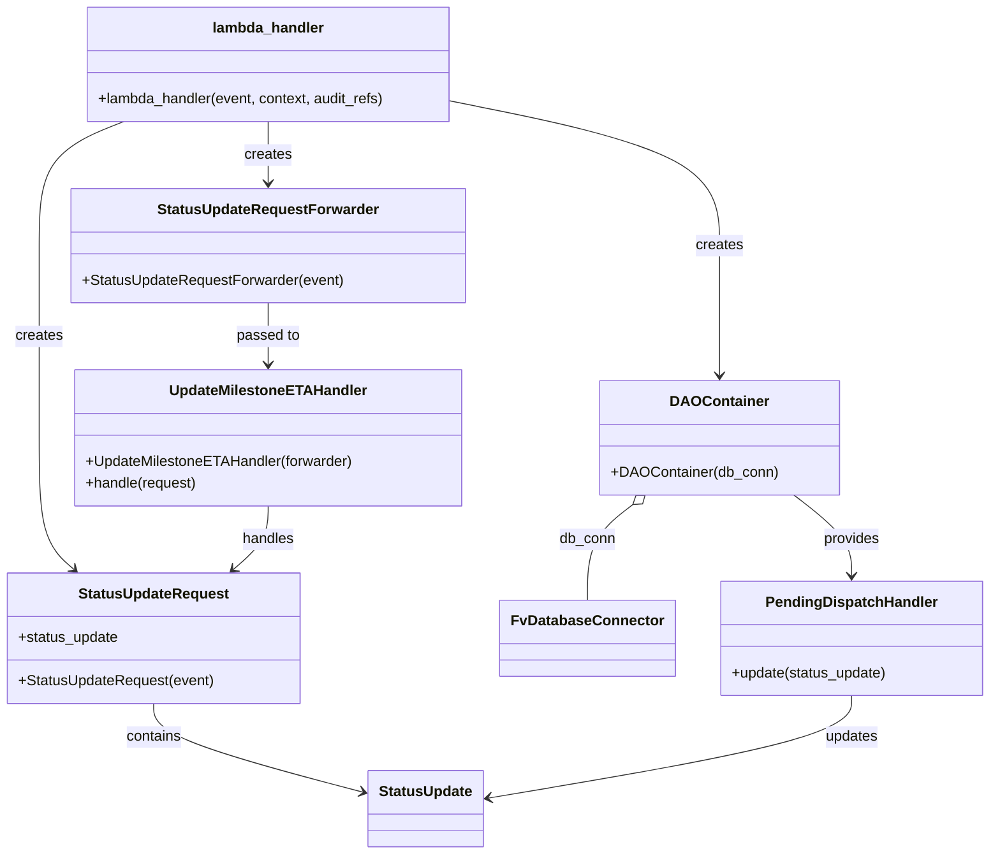

# Diagram: entity_core/entity_service/entity_listener/entity_listener_service/lambdas/create_status_update_hook.py


> Auto-generated by Obscura crawlers

## Diagram 1

```mermaid
flowchart TD
LH[lambda_handler(event, context, audit_refs)] -.-> AUTH[mandatory_lambda_handling / AUTH_CHECK]
LH --> RQ[StatusUpdateRequest(event)]
RQ --> SU[StatusUpdate<br/>(request.status_update)]
LH --> DAO[DAOContainer(DB_CONN)]
DB[DB_CONN: FvDatabaseConnector] --- DAO
DAO --> PHD[PendingDispatchHandler]
PHD --> UPD[handler.update(status_update)]
UPD -->|success| RET[retval, status]
UPD -->|exception| ERR[logging.exception → raise DatabaseError]
RET --> FWD[StatusUpdateRequestForwarder(event)]
FWD --> ETAH[UpdateMilestoneETAHandler(forwarder)]
ETAH --> HANDLE[.handle(request)]
HANDLE --> RESP[make_response(json.dumps(retval), status)]
```

> SVG rendering failed for this diagram.

## Diagram 2



### SVG

<svg id="container" width="1075.0625" xmlns="http://www.w3.org/2000/svg" class="classDiagram" height="942" viewBox="0 0 1075.0625 942" role="graphics-document document" aria-roledescription="class"><style>#container{font-family:"trebuchet ms",verdana,arial,sans-serif;font-size:16px;fill:#333;}@keyframes edge-animation-frame{from{stroke-dashoffset:0;}}@keyframes dash{to{stroke-dashoffset:0;}}#container .edge-animation-slow{stroke-dasharray:9,5!important;stroke-dashoffset:900;animation:dash 50s linear infinite;stroke-linecap:round;}#container .edge-animation-fast{stroke-dasharray:9,5!important;stroke-dashoffset:900;animation:dash 20s linear infinite;stroke-linecap:round;}#container .error-icon{fill:#552222;}#container .error-text{fill:#552222;stroke:#552222;}#container .edge-thickness-normal{stroke-width:1px;}#container .edge-thickness-thick{stroke-width:3.5px;}#container .edge-pattern-solid{stroke-dasharray:0;}#container .edge-thickness-invisible{stroke-width:0;fill:none;}#container .edge-pattern-dashed{stroke-dasharray:3;}#container .edge-pattern-dotted{stroke-dasharray:2;}#container .marker{fill:#333333;stroke:#333333;}#container .marker.cross{stroke:#333333;}#container svg{font-family:"trebuchet ms",verdana,arial,sans-serif;font-size:16px;}#container p{margin:0;}#container g.classGroup text{fill:#9370DB;stroke:none;font-family:"trebuchet ms",verdana,arial,sans-serif;font-size:10px;}#container g.classGroup text .title{font-weight:bolder;}#container .nodeLabel,#container .edgeLabel{color:#131300;}#container .edgeLabel .label rect{fill:#ECECFF;}#container .label text{fill:#131300;}#container .labelBkg{background:#ECECFF;}#container .edgeLabel .label span{background:#ECECFF;}#container .classTitle{font-weight:bolder;}#container .node rect,#container .node circle,#container .node ellipse,#container .node polygon,#container .node path{fill:#ECECFF;stroke:#9370DB;stroke-width:1px;}#container .divider{stroke:#9370DB;stroke-width:1;}#container g.clickable{cursor:pointer;}#container g.classGroup rect{fill:#ECECFF;stroke:#9370DB;}#container g.classGroup line{stroke:#9370DB;stroke-width:1;}#container .classLabel .box{stroke:none;stroke-width:0;fill:#ECECFF;opacity:0.5;}#container .classLabel .label{fill:#9370DB;font-size:10px;}#container .relation{stroke:#333333;stroke-width:1;fill:none;}#container .dashed-line{stroke-dasharray:3;}#container .dotted-line{stroke-dasharray:1 2;}#container #compositionStart,#container .composition{fill:#333333!important;stroke:#333333!important;stroke-width:1;}#container #compositionEnd,#container .composition{fill:#333333!important;stroke:#333333!important;stroke-width:1;}#container #dependencyStart,#container .dependency{fill:#333333!important;stroke:#333333!important;stroke-width:1;}#container #dependencyStart,#container .dependency{fill:#333333!important;stroke:#333333!important;stroke-width:1;}#container #extensionStart,#container .extension{fill:transparent!important;stroke:#333333!important;stroke-width:1;}#container #extensionEnd,#container .extension{fill:transparent!important;stroke:#333333!important;stroke-width:1;}#container #aggregationStart,#container .aggregation{fill:transparent!important;stroke:#333333!important;stroke-width:1;}#container #aggregationEnd,#container .aggregation{fill:transparent!important;stroke:#333333!important;stroke-width:1;}#container #lollipopStart,#container .lollipop{fill:#ECECFF!important;stroke:#333333!important;stroke-width:1;}#container #lollipopEnd,#container .lollipop{fill:#ECECFF!important;stroke:#333333!important;stroke-width:1;}#container .edgeTerminals{font-size:11px;line-height:initial;}#container .classTitleText{text-anchor:middle;font-size:18px;fill:#333;}#container .label-icon{display:inline-block;height:1em;overflow:visible;vertical-align:-0.125em;}#container .node .label-icon path{fill:currentColor;stroke:revert;stroke-width:revert;}#container :root{--mermaid-font-family:"trebuchet ms",verdana,arial,sans-serif;}</style><g><defs><marker id="container_class-aggregationStart" class="marker aggregation class" refX="18" refY="7" markerWidth="190" markerHeight="240" orient="auto"><path d="M 18,7 L9,13 L1,7 L9,1 Z"></path></marker></defs><defs><marker id="container_class-aggregationEnd" class="marker aggregation class" refX="1" refY="7" markerWidth="20" markerHeight="28" orient="auto"><path d="M 18,7 L9,13 L1,7 L9,1 Z"></path></marker></defs><defs><marker id="container_class-extensionStart" class="marker extension class" refX="18" refY="7" markerWidth="190" markerHeight="240" orient="auto"><path d="M 1,7 L18,13 V 1 Z"></path></marker></defs><defs><marker id="container_class-extensionEnd" class="marker extension class" refX="1" refY="7" markerWidth="20" markerHeight="28" orient="auto"><path d="M 1,1 V 13 L18,7 Z"></path></marker></defs><defs><marker id="container_class-compositionStart" class="marker composition class" refX="18" refY="7" markerWidth="190" markerHeight="240" orient="auto"><path d="M 18,7 L9,13 L1,7 L9,1 Z"></path></marker></defs><defs><marker id="container_class-compositionEnd" class="marker composition class" refX="1" refY="7" markerWidth="20" markerHeight="28" orient="auto"><path d="M 18,7 L9,13 L1,7 L9,1 Z"></path></marker></defs><defs><marker id="container_class-dependencyStart" class="marker dependency class" refX="6" refY="7" markerWidth="190" markerHeight="240" orient="auto"><path d="M 5,7 L9,13 L1,7 L9,1 Z"></path></marker></defs><defs><marker id="container_class-dependencyEnd" class="marker dependency class" refX="13" refY="7" markerWidth="20" markerHeight="28" orient="auto"><path d="M 18,7 L9,13 L14,7 L9,1 Z"></path></marker></defs><defs><marker id="container_class-lollipopStart" class="marker lollipop class" refX="13" refY="7" markerWidth="190" markerHeight="240" orient="auto"><circle stroke="black" fill="transparent" cx="7" cy="7" r="6"></circle></marker></defs><defs><marker id="container_class-lollipopEnd" class="marker lollipop class" refX="1" refY="7" markerWidth="190" markerHeight="240" orient="auto"><circle stroke="black" fill="transparent" cx="7" cy="7" r="6"></circle></marker></defs><g class="root"><g class="clusters"></g><g class="edgePaths"><path d="M135.201,134L119.801,140.167C104.402,146.333,73.603,158.667,58.204,181.5C42.805,204.333,42.805,237.667,42.805,271C42.805,304.333,42.805,337.667,42.805,373C42.805,408.333,42.805,445.667,42.805,483C42.805,520.333,42.805,557.667,49.115,581.842C55.426,606.018,68.047,617.036,74.358,622.545L80.668,628.054" id="id_lambda_handler_StatusUpdateRequest_1" class="edge-thickness-normal edge-pattern-solid relation" style=";;;" data-edge="true" data-et="edge" data-id="id_lambda_handler_StatusUpdateRequest_1" data-points="W3sieCI6MTM1LjIwMDYyNSwieSI6MTM0fSx7IngiOjQyLjgwNDY4NzUsInkiOjE3MX0seyJ4Ijo0Mi44MDQ2ODc1LCJ5IjoyNzF9LHsieCI6NDIuODA0Njg3NSwieSI6MzcxfSx7IngiOjQyLjgwNDY4NzUsInkiOjQ4M30seyJ4Ijo0Mi44MDQ2ODc1LCJ5Ijo1OTV9LHsieCI6ODUuMTg4MTQ1MDY4ODA3MzQsInkiOjYzMn1d" marker-end="url(#container_class-dependencyEnd)"></path><path d="M167.664,776L167.664,782.167C167.664,788.333,167.664,800.667,205.206,816.953C242.747,833.24,317.831,853.48,355.372,863.601L392.914,873.721" id="id_StatusUpdateRequest_StatusUpdate_2" class="edge-thickness-normal edge-pattern-solid relation" style=";;;" data-edge="true" data-et="edge" data-id="id_StatusUpdateRequest_StatusUpdate_2" data-points="W3sieCI6MTY3LjY2NDA2MjUsInkiOjc3Nn0seyJ4IjoxNjcuNjY0MDYyNSwieSI6ODEzfSx7IngiOjM5OC43MDcwMzEyNSwieSI6ODc1LjI4MjQwNjcyODYwMzJ9XQ==" marker-end="url(#container_class-dependencyEnd)"></path><path d="M495.355,112.554L542.904,122.295C590.452,132.036,685.548,151.518,733.096,177.926C780.645,204.333,780.645,237.667,780.645,271C780.645,304.333,780.645,337.667,780.645,361.5C780.645,385.333,780.645,399.667,780.645,406.833L780.645,414" id="id_lambda_handler_DAOContainer_3" class="edge-thickness-normal edge-pattern-solid relation" style=";;;" data-edge="true" data-et="edge" data-id="id_lambda_handler_DAOContainer_3" data-points="W3sieCI6NDk1LjM1NTQ2ODc1LCJ5IjoxMTIuNTUzNjI5NTkwNTA1N30seyJ4Ijo3ODAuNjQ0NTMxMjUsInkiOjE3MX0seyJ4Ijo3ODAuNjQ0NTMxMjUsInkiOjI3MX0seyJ4Ijo3ODAuNjQ0NTMxMjUsInkiOjM3MX0seyJ4Ijo3ODAuNjQ0NTMxMjUsInkiOjQyMH1d" marker-end="url(#container_class-dependencyEnd)"></path><path d="M686.881,556.656L678.746,563.047C670.611,569.437,654.341,582.219,646.206,599.776C638.07,617.333,638.07,639.667,638.07,650.833L638.07,662" id="id_DAOContainer_FvDatabaseConnector_4" class="edge-thickness-normal edge-pattern-solid relation" style=";;;" data-edge="true" data-et="edge" data-id="id_DAOContainer_FvDatabaseConnector_4" data-points="W3sieCI6NzAwLjQ0NjUzMzIwMzEyNSwieSI6NTQ2fSx7IngiOjYzOC4wNzAzMTI1LCJ5Ijo1OTV9LHsieCI6NjM4LjA3MDMxMjUsInkiOjY2Mn1d" marker-start="url(#container_class-aggregationStart)"></path><path d="M860.843,546L871.239,554.167C881.635,562.333,902.427,578.667,912.823,593.5C923.219,608.333,923.219,621.667,923.219,628.333L923.219,635" id="id_DAOContainer_PendingDispatchHandler_5" class="edge-thickness-normal edge-pattern-solid relation" style=";;;" data-edge="true" data-et="edge" data-id="id_DAOContainer_PendingDispatchHandler_5" data-points="W3sieCI6ODYwLjg0MjUyOTI5Njg3NSwieSI6NTQ2fSx7IngiOjkyMy4yMTg3NSwieSI6NTk1fSx7IngiOjkyMy4yMTg3NSwieSI6NjQxfV0=" marker-end="url(#container_class-dependencyEnd)"></path><path d="M923.219,767L923.219,774.667C923.219,782.333,923.219,797.667,857.458,816.566C791.697,835.466,660.175,857.931,594.414,869.164L528.653,880.397" id="id_PendingDispatchHandler_StatusUpdate_6" class="edge-thickness-normal edge-pattern-solid relation" style=";;;" data-edge="true" data-et="edge" data-id="id_PendingDispatchHandler_StatusUpdate_6" data-points="W3sieCI6OTIzLjIxODc1LCJ5Ijo3Njd9LHsieCI6OTIzLjIxODc1LCJ5Ijo4MTN9LHsieCI6NTIyLjczODI4MTI1LCJ5Ijo4ODEuNDA2OTcxMzQyNjYzNH1d" marker-end="url(#container_class-dependencyEnd)"></path><path d="M292.523,134L292.523,140.167C292.523,146.333,292.523,158.667,292.523,170C292.523,181.333,292.523,191.667,292.523,196.833L292.523,202" id="id_lambda_handler_StatusUpdateRequestForwarder_7" class="edge-thickness-normal edge-pattern-solid relation" style=";;;" data-edge="true" data-et="edge" data-id="id_lambda_handler_StatusUpdateRequestForwarder_7" data-points="W3sieCI6MjkyLjUyMzQzNzUsInkiOjEzNH0seyJ4IjoyOTIuNTIzNDM3NSwieSI6MTcxfSx7IngiOjI5Mi41MjM0Mzc1LCJ5IjoyMDh9XQ==" marker-end="url(#container_class-dependencyEnd)"></path><path d="M292.523,334L292.523,340.167C292.523,346.333,292.523,358.667,292.523,370C292.523,381.333,292.523,391.667,292.523,396.833L292.523,402" id="id_StatusUpdateRequestForwarder_UpdateMilestoneETAHandler_8" class="edge-thickness-normal edge-pattern-solid relation" style=";;;" data-edge="true" data-et="edge" data-id="id_StatusUpdateRequestForwarder_UpdateMilestoneETAHandler_8" data-points="W3sieCI6MjkyLjUyMzQzNzUsInkiOjMzNH0seyJ4IjoyOTIuNTIzNDM3NSwieSI6MzcxfSx7IngiOjI5Mi41MjM0Mzc1LCJ5Ijo0MDh9XQ==" marker-end="url(#container_class-dependencyEnd)"></path><path d="M292.523,558L292.523,564.167C292.523,570.333,292.523,582.667,286.213,594.342C279.902,606.018,267.281,617.036,260.971,622.545L254.66,628.054" id="id_UpdateMilestoneETAHandler_StatusUpdateRequest_9" class="edge-thickness-normal edge-pattern-solid relation" style=";;;" data-edge="true" data-et="edge" data-id="id_UpdateMilestoneETAHandler_StatusUpdateRequest_9" data-points="W3sieCI6MjkyLjUyMzQzNzUsInkiOjU1OH0seyJ4IjoyOTIuNTIzNDM3NSwieSI6NTk1fSx7IngiOjI1MC4xMzk5Nzk5MzExOTI2NywieSI6NjMyfV0=" marker-end="url(#container_class-dependencyEnd)"></path></g><g class="edgeLabels"><g class="edgeLabel" transform="translate(42.8046875, 371)"><g class="label" data-id="id_lambda_handler_StatusUpdateRequest_1" transform="translate(-26.171875, -12)"><foreignObject width="52.34375" height="24"><div xmlns="http://www.w3.org/1999/xhtml" class="labelBkg" style="display: table-cell; white-space: nowrap; line-height: 1.5; max-width: 200px; text-align: center;"><span class="edgeLabel"><p>creates</p></span></div></foreignObject></g></g><g class="edgeLabel" transform="translate(167.6640625, 813)"><g class="label" data-id="id_StatusUpdateRequest_StatusUpdate_2" transform="translate(-30.890625, -12)"><foreignObject width="61.78125" height="24"><div xmlns="http://www.w3.org/1999/xhtml" class="labelBkg" style="display: table-cell; white-space: nowrap; line-height: 1.5; max-width: 200px; text-align: center;"><span class="edgeLabel"><p>contains</p></span></div></foreignObject></g></g><g class="edgeLabel" transform="translate(780.64453125, 271)"><g class="label" data-id="id_lambda_handler_DAOContainer_3" transform="translate(-26.171875, -12)"><foreignObject width="52.34375" height="24"><div xmlns="http://www.w3.org/1999/xhtml" class="labelBkg" style="display: table-cell; white-space: nowrap; line-height: 1.5; max-width: 200px; text-align: center;"><span class="edgeLabel"><p>creates</p></span></div></foreignObject></g></g><g class="edgeLabel" transform="translate(638.0703125, 595)"><g class="label" data-id="id_DAOContainer_FvDatabaseConnector_4" transform="translate(-31.09375, -12)"><foreignObject width="62.1875" height="24"><div xmlns="http://www.w3.org/1999/xhtml" class="labelBkg" style="display: table-cell; white-space: nowrap; line-height: 1.5; max-width: 200px; text-align: center;"><span class="edgeLabel"><p>db_conn</p></span></div></foreignObject></g></g><g class="edgeLabel" transform="translate(923.21875, 595)"><g class="label" data-id="id_DAOContainer_PendingDispatchHandler_5" transform="translate(-31.3125, -12)"><foreignObject width="62.625" height="24"><div xmlns="http://www.w3.org/1999/xhtml" class="labelBkg" style="display: table-cell; white-space: nowrap; line-height: 1.5; max-width: 200px; text-align: center;"><span class="edgeLabel"><p>provides</p></span></div></foreignObject></g></g><g class="edgeLabel" transform="translate(923.21875, 813)"><g class="label" data-id="id_PendingDispatchHandler_StatusUpdate_6" transform="translate(-29.4140625, -12)"><foreignObject width="58.828125" height="24"><div xmlns="http://www.w3.org/1999/xhtml" class="labelBkg" style="display: table-cell; white-space: nowrap; line-height: 1.5; max-width: 200px; text-align: center;"><span class="edgeLabel"><p>updates</p></span></div></foreignObject></g></g><g class="edgeLabel" transform="translate(292.5234375, 171)"><g class="label" data-id="id_lambda_handler_StatusUpdateRequestForwarder_7" transform="translate(-26.171875, -12)"><foreignObject width="52.34375" height="24"><div xmlns="http://www.w3.org/1999/xhtml" class="labelBkg" style="display: table-cell; white-space: nowrap; line-height: 1.5; max-width: 200px; text-align: center;"><span class="edgeLabel"><p>creates</p></span></div></foreignObject></g></g><g class="edgeLabel" transform="translate(292.5234375, 371)"><g class="label" data-id="id_StatusUpdateRequestForwarder_UpdateMilestoneETAHandler_8" transform="translate(-35.046875, -12)"><foreignObject width="70.09375" height="24"><div xmlns="http://www.w3.org/1999/xhtml" class="labelBkg" style="display: table-cell; white-space: nowrap; line-height: 1.5; max-width: 200px; text-align: center;"><span class="edgeLabel"><p>passed to</p></span></div></foreignObject></g></g><g class="edgeLabel" transform="translate(292.5234375, 595)"><g class="label" data-id="id_UpdateMilestoneETAHandler_StatusUpdateRequest_9" transform="translate(-28.9140625, -12)"><foreignObject width="57.828125" height="24"><div xmlns="http://www.w3.org/1999/xhtml" class="labelBkg" style="display: table-cell; white-space: nowrap; line-height: 1.5; max-width: 200px; text-align: center;"><span class="edgeLabel"><p>handles</p></span></div></foreignObject></g></g></g><g class="nodes"><g class="node default" id="classId-lambda_handler-0" transform="translate(292.5234375, 71)"><g class="basic label-container"><path d="M-202.83203125 -63 L202.83203125 -63 L202.83203125 63 L-202.83203125 63" stroke="none" stroke-width="0" fill="#ECECFF" style=""></path><path d="M-202.83203125 -63 C-84.6841053441926 -63, 33.463820561614796 -63, 202.83203125 -63 M-202.83203125 -63 C-67.81137033419859 -63, 67.20929058160283 -63, 202.83203125 -63 M202.83203125 -63 C202.83203125 -33.73780771284751, 202.83203125 -4.475615425695025, 202.83203125 63 M202.83203125 -63 C202.83203125 -25.297588203794355, 202.83203125 12.40482359241129, 202.83203125 63 M202.83203125 63 C55.938170182743846 63, -90.95569088451231 63, -202.83203125 63 M202.83203125 63 C121.6857946238799 63, 40.5395579977598 63, -202.83203125 63 M-202.83203125 63 C-202.83203125 22.762069132218123, -202.83203125 -17.475861735563754, -202.83203125 -63 M-202.83203125 63 C-202.83203125 35.54563681643752, -202.83203125 8.091273632875051, -202.83203125 -63" stroke="#9370DB" stroke-width="1.3" fill="none" stroke-dasharray="0 0" style=""></path></g><g class="annotation-group text" transform="translate(0, -39)"></g><g class="label-group text" transform="translate(-59.9765625, -39)"><g class="label" style="font-weight: bolder" transform="translate(0,-12)"><foreignObject width="119.953125" height="24"><div xmlns="http://www.w3.org/1999/xhtml" style="display: table-cell; white-space: nowrap; line-height: 1.5; max-width: 170px; text-align: center;"><span class="nodeLabel markdown-node-label" style=""><p>lambda_handler</p></span></div></foreignObject></g></g><g class="members-group text" transform="translate(-190.83203125, 9)"></g><g class="methods-group text" transform="translate(-190.83203125, 39)"><g class="label" style="" transform="translate(0,-12)"><foreignObject width="321.6875" height="24"><div xmlns="http://www.w3.org/1999/xhtml" style="display: table-cell; white-space: nowrap; line-height: 1.5; max-width: 379px; text-align: center;"><span class="nodeLabel markdown-node-label" style=""><p>+lambda_handler(event, context, audit_refs)</p></span></div></foreignObject></g></g><g class="divider" style=""><path d="M-202.83203125 -15 C-93.55430085612399 -15, 15.723429537752025 -15, 202.83203125 -15 M-202.83203125 -15 C-104.8606429738435 -15, -6.889254697686994 -15, 202.83203125 -15" stroke="#9370DB" stroke-width="1.3" fill="none" stroke-dasharray="0 0" style=""></path></g><g class="divider" style=""><path d="M-202.83203125 9 C-43.36092311195458 9, 116.11018502609085 9, 202.83203125 9 M-202.83203125 9 C-57.70726692340298 9, 87.41749740319403 9, 202.83203125 9" stroke="#9370DB" stroke-width="1.3" fill="none" stroke-dasharray="0 0" style=""></path></g></g><g class="node default" id="classId-StatusUpdateRequest-1" transform="translate(167.6640625, 704)"><g class="basic label-container"><path d="M-159.6640625 -72 L159.6640625 -72 L159.6640625 72 L-159.6640625 72" stroke="none" stroke-width="0" fill="#ECECFF" style=""></path><path d="M-159.6640625 -72 C-57.556338212789385 -72, 44.55138607442123 -72, 159.6640625 -72 M-159.6640625 -72 C-40.070094561212386 -72, 79.52387337757523 -72, 159.6640625 -72 M159.6640625 -72 C159.6640625 -21.009662348995803, 159.6640625 29.980675302008393, 159.6640625 72 M159.6640625 -72 C159.6640625 -29.296878494934035, 159.6640625 13.40624301013193, 159.6640625 72 M159.6640625 72 C87.40056114295604 72, 15.137059785912072 72, -159.6640625 72 M159.6640625 72 C87.29566986058057 72, 14.927277221161148 72, -159.6640625 72 M-159.6640625 72 C-159.6640625 36.55817103038886, -159.6640625 1.1163420607777255, -159.6640625 -72 M-159.6640625 72 C-159.6640625 29.039397965755455, -159.6640625 -13.92120406848909, -159.6640625 -72" stroke="#9370DB" stroke-width="1.3" fill="none" stroke-dasharray="0 0" style=""></path></g><g class="annotation-group text" transform="translate(0, -48)"></g><g class="label-group text" transform="translate(-79.984375, -48)"><g class="label" style="font-weight: bolder" transform="translate(0,-12)"><foreignObject width="159.96875" height="24"><div xmlns="http://www.w3.org/1999/xhtml" style="display: table-cell; white-space: nowrap; line-height: 1.5; max-width: 208px; text-align: center;"><span class="nodeLabel markdown-node-label" style=""><p>StatusUpdateRequest</p></span></div></foreignObject></g></g><g class="members-group text" transform="translate(-147.6640625, 0)"><g class="label" style="" transform="translate(0,-12)"><foreignObject width="111.421875" height="24"><div xmlns="http://www.w3.org/1999/xhtml" style="display: table-cell; white-space: nowrap; line-height: 1.5; max-width: 169px; text-align: center;"><span class="nodeLabel markdown-node-label" style=""><p>+status_update</p></span></div></foreignObject></g></g><g class="methods-group text" transform="translate(-147.6640625, 48)"><g class="label" style="" transform="translate(0,-12)"><foreignObject width="215.34375" height="24"><div xmlns="http://www.w3.org/1999/xhtml" style="display: table-cell; white-space: nowrap; line-height: 1.5; max-width: 273px; text-align: center;"><span class="nodeLabel markdown-node-label" style=""><p>+StatusUpdateRequest(event)</p></span></div></foreignObject></g></g><g class="divider" style=""><path d="M-159.6640625 -24 C-46.04325976186287 -24, 67.57754297627426 -24, 159.6640625 -24 M-159.6640625 -24 C-59.090883087368766 -24, 41.48229632526247 -24, 159.6640625 -24" stroke="#9370DB" stroke-width="1.3" fill="none" stroke-dasharray="0 0" style=""></path></g><g class="divider" style=""><path d="M-159.6640625 24 C-52.561458597946725 24, 54.54114530410655 24, 159.6640625 24 M-159.6640625 24 C-79.81634875975404 24, 0.03136498049192937 24, 159.6640625 24" stroke="#9370DB" stroke-width="1.3" fill="none" stroke-dasharray="0 0" style=""></path></g></g><g class="node default" id="classId-StatusUpdate-2" transform="translate(460.72265625, 892)"><g class="basic label-container"><path d="M-62.015625 -42 L62.015625 -42 L62.015625 42 L-62.015625 42" stroke="none" stroke-width="0" fill="#ECECFF" style=""></path><path d="M-62.015625 -42 C-16.838052491383678 -42, 28.339520017232644 -42, 62.015625 -42 M-62.015625 -42 C-33.20913192112155 -42, -4.4026388422431 -42, 62.015625 -42 M62.015625 -42 C62.015625 -13.190902181999768, 62.015625 15.618195636000465, 62.015625 42 M62.015625 -42 C62.015625 -19.148250830836876, 62.015625 3.7034983383262485, 62.015625 42 M62.015625 42 C20.20463996647723 42, -21.606345067045538 42, -62.015625 42 M62.015625 42 C32.77283310039371 42, 3.530041200787416 42, -62.015625 42 M-62.015625 42 C-62.015625 17.25706875789162, -62.015625 -7.48586248421676, -62.015625 -42 M-62.015625 42 C-62.015625 13.788636820688467, -62.015625 -14.422726358623066, -62.015625 -42" stroke="#9370DB" stroke-width="1.3" fill="none" stroke-dasharray="0 0" style=""></path></g><g class="annotation-group text" transform="translate(0, -18)"></g><g class="label-group text" transform="translate(-50.015625, -18)"><g class="label" style="font-weight: bolder" transform="translate(0,-12)"><foreignObject width="100.03125" height="24"><div xmlns="http://www.w3.org/1999/xhtml" style="display: table-cell; white-space: nowrap; line-height: 1.5; max-width: 148px; text-align: center;"><span class="nodeLabel markdown-node-label" style=""><p>StatusUpdate</p></span></div></foreignObject></g></g><g class="members-group text" transform="translate(-50.015625, 30)"></g><g class="methods-group text" transform="translate(-50.015625, 60)"></g><g class="divider" style=""><path d="M-62.015625 6 C-24.304304546775732 6, 13.407015906448535 6, 62.015625 6 M-62.015625 6 C-13.789626960093777 6, 34.436371079812446 6, 62.015625 6" stroke="#9370DB" stroke-width="1.3" fill="none" stroke-dasharray="0 0" style=""></path></g><g class="divider" style=""><path d="M-62.015625 24 C-13.63859180586418 24, 34.73844138827164 24, 62.015625 24 M-62.015625 24 C-14.180175367196867 24, 33.655274265606266 24, 62.015625 24" stroke="#9370DB" stroke-width="1.3" fill="none" stroke-dasharray="0 0" style=""></path></g></g><g class="node default" id="classId-DAOContainer-3" transform="translate(780.64453125, 483)"><g class="basic label-container"><path d="M-128.08203125 -63 L128.08203125 -63 L128.08203125 63 L-128.08203125 63" stroke="none" stroke-width="0" fill="#ECECFF" style=""></path><path d="M-128.08203125 -63 C-32.628377762313676 -63, 62.82527572537265 -63, 128.08203125 -63 M-128.08203125 -63 C-75.34657524036044 -63, -22.61111923072086 -63, 128.08203125 -63 M128.08203125 -63 C128.08203125 -23.150539647956585, 128.08203125 16.69892070408683, 128.08203125 63 M128.08203125 -63 C128.08203125 -29.289923574233626, 128.08203125 4.420152851532748, 128.08203125 63 M128.08203125 63 C36.54952005540733 63, -54.982991139185344 63, -128.08203125 63 M128.08203125 63 C49.62879924380705 63, -28.824432762385896 63, -128.08203125 63 M-128.08203125 63 C-128.08203125 21.244032172537175, -128.08203125 -20.51193565492565, -128.08203125 -63 M-128.08203125 63 C-128.08203125 23.74875999515008, -128.08203125 -15.502480009699838, -128.08203125 -63" stroke="#9370DB" stroke-width="1.3" fill="none" stroke-dasharray="0 0" style=""></path></g><g class="annotation-group text" transform="translate(0, -39)"></g><g class="label-group text" transform="translate(-50.8984375, -39)"><g class="label" style="font-weight: bolder" transform="translate(0,-12)"><foreignObject width="101.796875" height="24"><div xmlns="http://www.w3.org/1999/xhtml" style="display: table-cell; white-space: nowrap; line-height: 1.5; max-width: 152px; text-align: center;"><span class="nodeLabel markdown-node-label" style=""><p>DAOContainer</p></span></div></foreignObject></g></g><g class="members-group text" transform="translate(-116.08203125, 9)"></g><g class="methods-group text" transform="translate(-116.08203125, 39)"><g class="label" style="" transform="translate(0,-12)"><foreignObject width="181.265625" height="24"><div xmlns="http://www.w3.org/1999/xhtml" style="display: table-cell; white-space: nowrap; line-height: 1.5; max-width: 239px; text-align: center;"><span class="nodeLabel markdown-node-label" style=""><p>+DAOContainer(db_conn)</p></span></div></foreignObject></g></g><g class="divider" style=""><path d="M-128.08203125 -15 C-60.43339538456718 -15, 7.215240480865646 -15, 128.08203125 -15 M-128.08203125 -15 C-62.624667023679734 -15, 2.8326972026405315 -15, 128.08203125 -15" stroke="#9370DB" stroke-width="1.3" fill="none" stroke-dasharray="0 0" style=""></path></g><g class="divider" style=""><path d="M-128.08203125 9 C-53.56893613989925 9, 20.9441589702015 9, 128.08203125 9 M-128.08203125 9 C-28.493034963565407 9, 71.09596132286919 9, 128.08203125 9" stroke="#9370DB" stroke-width="1.3" fill="none" stroke-dasharray="0 0" style=""></path></g></g><g class="node default" id="classId-FvDatabaseConnector-4" transform="translate(638.0703125, 704)"><g class="basic label-container"><path d="M-91.3046875 -42 L91.3046875 -42 L91.3046875 42 L-91.3046875 42" stroke="none" stroke-width="0" fill="#ECECFF" style=""></path><path d="M-91.3046875 -42 C-20.61330398007874 -42, 50.07807953984252 -42, 91.3046875 -42 M-91.3046875 -42 C-29.83927594775293 -42, 31.626135604494138 -42, 91.3046875 -42 M91.3046875 -42 C91.3046875 -24.155068421458644, 91.3046875 -6.310136842917288, 91.3046875 42 M91.3046875 -42 C91.3046875 -22.455283487871206, 91.3046875 -2.9105669757424124, 91.3046875 42 M91.3046875 42 C24.602233159746476 42, -42.10022118050705 42, -91.3046875 42 M91.3046875 42 C19.107718611973738 42, -53.089250276052525 42, -91.3046875 42 M-91.3046875 42 C-91.3046875 20.37158104522654, -91.3046875 -1.2568379095469169, -91.3046875 -42 M-91.3046875 42 C-91.3046875 15.20358638723916, -91.3046875 -11.592827225521681, -91.3046875 -42" stroke="#9370DB" stroke-width="1.3" fill="none" stroke-dasharray="0 0" style=""></path></g><g class="annotation-group text" transform="translate(0, -18)"></g><g class="label-group text" transform="translate(-79.3046875, -18)"><g class="label" style="font-weight: bolder" transform="translate(0,-12)"><foreignObject width="158.609375" height="24"><div xmlns="http://www.w3.org/1999/xhtml" style="display: table-cell; white-space: nowrap; line-height: 1.5; max-width: 207px; text-align: center;"><span class="nodeLabel markdown-node-label" style=""><p>FvDatabaseConnector</p></span></div></foreignObject></g></g><g class="members-group text" transform="translate(-79.3046875, 30)"></g><g class="methods-group text" transform="translate(-79.3046875, 60)"></g><g class="divider" style=""><path d="M-91.3046875 6 C-30.027554496022233 6, 31.249578507955533 6, 91.3046875 6 M-91.3046875 6 C-38.49618551755151 6, 14.31231646489698 6, 91.3046875 6" stroke="#9370DB" stroke-width="1.3" fill="none" stroke-dasharray="0 0" style=""></path></g><g class="divider" style=""><path d="M-91.3046875 24 C-35.092846132989045 24, 21.11899523402191 24, 91.3046875 24 M-91.3046875 24 C-24.488042574181847 24, 42.328602351636306 24, 91.3046875 24" stroke="#9370DB" stroke-width="1.3" fill="none" stroke-dasharray="0 0" style=""></path></g></g><g class="node default" id="classId-PendingDispatchHandler-5" transform="translate(923.21875, 704)"><g class="basic label-container"><path d="M-143.84375 -63 L143.84375 -63 L143.84375 63 L-143.84375 63" stroke="none" stroke-width="0" fill="#ECECFF" style=""></path><path d="M-143.84375 -63 C-69.35083924920525 -63, 5.142071501589498 -63, 143.84375 -63 M-143.84375 -63 C-55.46181174101754 -63, 32.92012651796492 -63, 143.84375 -63 M143.84375 -63 C143.84375 -20.708806527881123, 143.84375 21.582386944237754, 143.84375 63 M143.84375 -63 C143.84375 -15.04080025123848, 143.84375 32.91839949752304, 143.84375 63 M143.84375 63 C75.92109500337415 63, 7.998440006748297 63, -143.84375 63 M143.84375 63 C32.50624385169266 63, -78.83126229661468 63, -143.84375 63 M-143.84375 63 C-143.84375 21.14444844751594, -143.84375 -20.711103104968117, -143.84375 -63 M-143.84375 63 C-143.84375 27.49613743479776, -143.84375 -8.00772513040448, -143.84375 -63" stroke="#9370DB" stroke-width="1.3" fill="none" stroke-dasharray="0 0" style=""></path></g><g class="annotation-group text" transform="translate(0, -39)"></g><g class="label-group text" transform="translate(-90.5625, -39)"><g class="label" style="font-weight: bolder" transform="translate(0,-12)"><foreignObject width="181.125" height="24"><div xmlns="http://www.w3.org/1999/xhtml" style="display: table-cell; white-space: nowrap; line-height: 1.5; max-width: 230px; text-align: center;"><span class="nodeLabel markdown-node-label" style=""><p>PendingDispatchHandler</p></span></div></foreignObject></g></g><g class="members-group text" transform="translate(-131.84375, 9)"></g><g class="methods-group text" transform="translate(-131.84375, 39)"><g class="label" style="" transform="translate(0,-12)"><foreignObject width="173.125" height="24"><div xmlns="http://www.w3.org/1999/xhtml" style="display: table-cell; white-space: nowrap; line-height: 1.5; max-width: 230px; text-align: center;"><span class="nodeLabel markdown-node-label" style=""><p>+update(status_update)</p></span></div></foreignObject></g></g><g class="divider" style=""><path d="M-143.84375 -15 C-58.955183210549905 -15, 25.93338357890019 -15, 143.84375 -15 M-143.84375 -15 C-79.03714965636442 -15, -14.23054931272884 -15, 143.84375 -15" stroke="#9370DB" stroke-width="1.3" fill="none" stroke-dasharray="0 0" style=""></path></g><g class="divider" style=""><path d="M-143.84375 9 C-75.305211946389 9, -6.7666738927779875 9, 143.84375 9 M-143.84375 9 C-71.45815639378705 9, 0.9274372124259003 9, 143.84375 9" stroke="#9370DB" stroke-width="1.3" fill="none" stroke-dasharray="0 0" style=""></path></g></g><g class="node default" id="classId-StatusUpdateRequestForwarder-6" transform="translate(292.5234375, 271)"><g class="basic label-container"><path d="M-214.71875 -63 L214.71875 -63 L214.71875 63 L-214.71875 63" stroke="none" stroke-width="0" fill="#ECECFF" style=""></path><path d="M-214.71875 -63 C-66.14202983196503 -63, 82.43469033606993 -63, 214.71875 -63 M-214.71875 -63 C-112.03200951135688 -63, -9.345269022713751 -63, 214.71875 -63 M214.71875 -63 C214.71875 -35.345670240552906, 214.71875 -7.6913404811058115, 214.71875 63 M214.71875 -63 C214.71875 -14.016630319771572, 214.71875 34.966739360456856, 214.71875 63 M214.71875 63 C98.20525172160329 63, -18.30824655679342 63, -214.71875 63 M214.71875 63 C110.94483733544135 63, 7.170924670882698 63, -214.71875 63 M-214.71875 63 C-214.71875 14.835438232286023, -214.71875 -33.329123535427954, -214.71875 -63 M-214.71875 63 C-214.71875 15.112882428563744, -214.71875 -32.77423514287251, -214.71875 -63" stroke="#9370DB" stroke-width="1.3" fill="none" stroke-dasharray="0 0" style=""></path></g><g class="annotation-group text" transform="translate(0, -39)"></g><g class="label-group text" transform="translate(-117.140625, -39)"><g class="label" style="font-weight: bolder" transform="translate(0,-12)"><foreignObject width="234.28125" height="24"><div xmlns="http://www.w3.org/1999/xhtml" style="display: table-cell; white-space: nowrap; line-height: 1.5; max-width: 281px; text-align: center;"><span class="nodeLabel markdown-node-label" style=""><p>StatusUpdateRequestForwarder</p></span></div></foreignObject></g></g><g class="members-group text" transform="translate(-202.71875, 9)"></g><g class="methods-group text" transform="translate(-202.71875, 39)"><g class="label" style="" transform="translate(0,-12)"><foreignObject width="288.296875" height="24"><div xmlns="http://www.w3.org/1999/xhtml" style="display: table-cell; white-space: nowrap; line-height: 1.5; max-width: 346px; text-align: center;"><span class="nodeLabel markdown-node-label" style=""><p>+StatusUpdateRequestForwarder(event)</p></span></div></foreignObject></g></g><g class="divider" style=""><path d="M-214.71875 -15 C-72.23105264533493 -15, 70.25664470933015 -15, 214.71875 -15 M-214.71875 -15 C-127.58055067827243 -15, -40.44235135654486 -15, 214.71875 -15" stroke="#9370DB" stroke-width="1.3" fill="none" stroke-dasharray="0 0" style=""></path></g><g class="divider" style=""><path d="M-214.71875 9 C-67.89687200749918 9, 78.92500598500163 9, 214.71875 9 M-214.71875 9 C-99.92487307530702 9, 14.869003849385962 9, 214.71875 9" stroke="#9370DB" stroke-width="1.3" fill="none" stroke-dasharray="0 0" style=""></path></g></g><g class="node default" id="classId-UpdateMilestoneETAHandler-7" transform="translate(292.5234375, 483)"><g class="basic label-container"><path d="M-212.04296875 -75 L212.04296875 -75 L212.04296875 75 L-212.04296875 75" stroke="none" stroke-width="0" fill="#ECECFF" style=""></path><path d="M-212.04296875 -75 C-97.12832304088757 -75, 17.78632266822487 -75, 212.04296875 -75 M-212.04296875 -75 C-113.69945170849475 -75, -15.355934666989498 -75, 212.04296875 -75 M212.04296875 -75 C212.04296875 -41.00279724099899, 212.04296875 -7.005594481997974, 212.04296875 75 M212.04296875 -75 C212.04296875 -34.160953130926316, 212.04296875 6.678093738147368, 212.04296875 75 M212.04296875 75 C76.10503452640646 75, -59.83289969718709 75, -212.04296875 75 M212.04296875 75 C54.434306968637145 75, -103.17435481272571 75, -212.04296875 75 M-212.04296875 75 C-212.04296875 19.015593073997017, -212.04296875 -36.968813852005965, -212.04296875 -75 M-212.04296875 75 C-212.04296875 28.913769696534622, -212.04296875 -17.172460606930755, -212.04296875 -75" stroke="#9370DB" stroke-width="1.3" fill="none" stroke-dasharray="0 0" style=""></path></g><g class="annotation-group text" transform="translate(0, -51)"></g><g class="label-group text" transform="translate(-104.2734375, -51)"><g class="label" style="font-weight: bolder" transform="translate(0,-12)"><foreignObject width="208.546875" height="24"><div xmlns="http://www.w3.org/1999/xhtml" style="display: table-cell; white-space: nowrap; line-height: 1.5; max-width: 257px; text-align: center;"><span class="nodeLabel markdown-node-label" style=""><p>UpdateMilestoneETAHandler</p></span></div></foreignObject></g></g><g class="members-group text" transform="translate(-200.04296875, -3)"></g><g class="methods-group text" transform="translate(-200.04296875, 27)"><g class="label" style="" transform="translate(0,-12)"><foreignObject width="295.8125" height="24"><div xmlns="http://www.w3.org/1999/xhtml" style="display: table-cell; white-space: nowrap; line-height: 1.5; max-width: 353px; text-align: center;"><span class="nodeLabel markdown-node-label" style=""><p>+UpdateMilestoneETAHandler(forwarder)</p></span></div></foreignObject></g><g class="label" style="" transform="translate(0,12)"><foreignObject width="123.96875" height="24"><div xmlns="http://www.w3.org/1999/xhtml" style="display: table-cell; white-space: nowrap; line-height: 1.5; max-width: 181px; text-align: center;"><span class="nodeLabel markdown-node-label" style=""><p>+handle(request)</p></span></div></foreignObject></g></g><g class="divider" style=""><path d="M-212.04296875 -27 C-57.2428032290037 -27, 97.5573622919926 -27, 212.04296875 -27 M-212.04296875 -27 C-54.22321441239146 -27, 103.59653992521709 -27, 212.04296875 -27" stroke="#9370DB" stroke-width="1.3" fill="none" stroke-dasharray="0 0" style=""></path></g><g class="divider" style=""><path d="M-212.04296875 -3 C-67.81235212986306 -3, 76.41826449027388 -3, 212.04296875 -3 M-212.04296875 -3 C-54.90342632921488 -3, 102.23611609157024 -3, 212.04296875 -3" stroke="#9370DB" stroke-width="1.3" fill="none" stroke-dasharray="0 0" style=""></path></g></g></g></g></g></svg>
