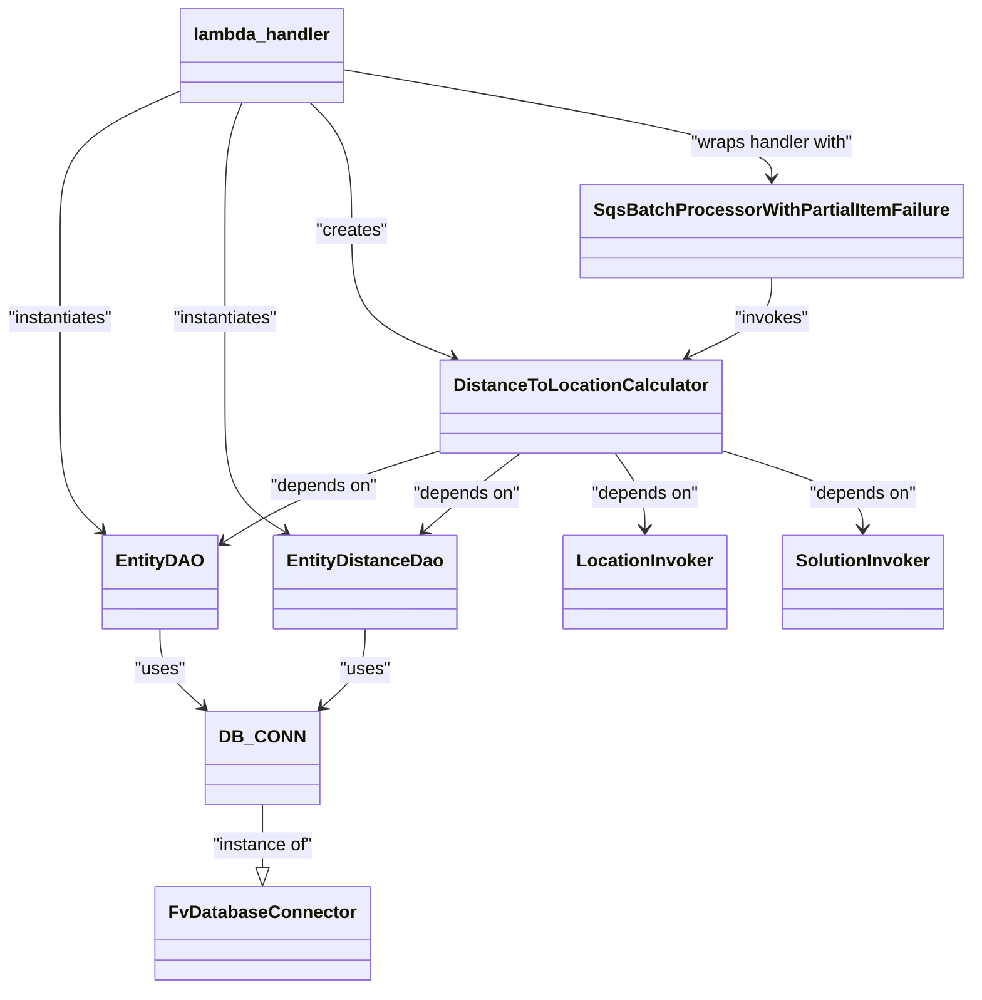

# Diagram: entity_core/entity_service/entity_listener/entity_listener_service/lambdas/distance_to_location_consumer.py


> Auto-generated by Obscura crawlers

## Diagram 1



### SVG

<svg id="container" width="850.921875" xmlns="http://www.w3.org/2000/svg" class="classDiagram" height="890" viewBox="0 0 850.921875 890" role="graphics-document document" aria-roledescription="class"><style>#container{font-family:"trebuchet ms",verdana,arial,sans-serif;font-size:16px;fill:#333;}@keyframes edge-animation-frame{from{stroke-dashoffset:0;}}@keyframes dash{to{stroke-dashoffset:0;}}#container .edge-animation-slow{stroke-dasharray:9,5!important;stroke-dashoffset:900;animation:dash 50s linear infinite;stroke-linecap:round;}#container .edge-animation-fast{stroke-dasharray:9,5!important;stroke-dashoffset:900;animation:dash 20s linear infinite;stroke-linecap:round;}#container .error-icon{fill:#552222;}#container .error-text{fill:#552222;stroke:#552222;}#container .edge-thickness-normal{stroke-width:1px;}#container .edge-thickness-thick{stroke-width:3.5px;}#container .edge-pattern-solid{stroke-dasharray:0;}#container .edge-thickness-invisible{stroke-width:0;fill:none;}#container .edge-pattern-dashed{stroke-dasharray:3;}#container .edge-pattern-dotted{stroke-dasharray:2;}#container .marker{fill:#333333;stroke:#333333;}#container .marker.cross{stroke:#333333;}#container svg{font-family:"trebuchet ms",verdana,arial,sans-serif;font-size:16px;}#container p{margin:0;}#container g.classGroup text{fill:#9370DB;stroke:none;font-family:"trebuchet ms",verdana,arial,sans-serif;font-size:10px;}#container g.classGroup text .title{font-weight:bolder;}#container .nodeLabel,#container .edgeLabel{color:#131300;}#container .edgeLabel .label rect{fill:#ECECFF;}#container .label text{fill:#131300;}#container .labelBkg{background:#ECECFF;}#container .edgeLabel .label span{background:#ECECFF;}#container .classTitle{font-weight:bolder;}#container .node rect,#container .node circle,#container .node ellipse,#container .node polygon,#container .node path{fill:#ECECFF;stroke:#9370DB;stroke-width:1px;}#container .divider{stroke:#9370DB;stroke-width:1;}#container g.clickable{cursor:pointer;}#container g.classGroup rect{fill:#ECECFF;stroke:#9370DB;}#container g.classGroup line{stroke:#9370DB;stroke-width:1;}#container .classLabel .box{stroke:none;stroke-width:0;fill:#ECECFF;opacity:0.5;}#container .classLabel .label{fill:#9370DB;font-size:10px;}#container .relation{stroke:#333333;stroke-width:1;fill:none;}#container .dashed-line{stroke-dasharray:3;}#container .dotted-line{stroke-dasharray:1 2;}#container #compositionStart,#container .composition{fill:#333333!important;stroke:#333333!important;stroke-width:1;}#container #compositionEnd,#container .composition{fill:#333333!important;stroke:#333333!important;stroke-width:1;}#container #dependencyStart,#container .dependency{fill:#333333!important;stroke:#333333!important;stroke-width:1;}#container #dependencyStart,#container .dependency{fill:#333333!important;stroke:#333333!important;stroke-width:1;}#container #extensionStart,#container .extension{fill:transparent!important;stroke:#333333!important;stroke-width:1;}#container #extensionEnd,#container .extension{fill:transparent!important;stroke:#333333!important;stroke-width:1;}#container #aggregationStart,#container .aggregation{fill:transparent!important;stroke:#333333!important;stroke-width:1;}#container #aggregationEnd,#container .aggregation{fill:transparent!important;stroke:#333333!important;stroke-width:1;}#container #lollipopStart,#container .lollipop{fill:#ECECFF!important;stroke:#333333!important;stroke-width:1;}#container #lollipopEnd,#container .lollipop{fill:#ECECFF!important;stroke:#333333!important;stroke-width:1;}#container .edgeTerminals{font-size:11px;line-height:initial;}#container .classTitleText{text-anchor:middle;font-size:18px;fill:#333;}#container .label-icon{display:inline-block;height:1em;overflow:visible;vertical-align:-0.125em;}#container .node .label-icon path{fill:currentColor;stroke:revert;stroke-width:revert;}#container :root{--mermaid-font-family:"trebuchet ms",verdana,arial,sans-serif;}</style><g><defs><marker id="container_class-aggregationStart" class="marker aggregation class" refX="18" refY="7" markerWidth="190" markerHeight="240" orient="auto"><path d="M 18,7 L9,13 L1,7 L9,1 Z"></path></marker></defs><defs><marker id="container_class-aggregationEnd" class="marker aggregation class" refX="1" refY="7" markerWidth="20" markerHeight="28" orient="auto"><path d="M 18,7 L9,13 L1,7 L9,1 Z"></path></marker></defs><defs><marker id="container_class-extensionStart" class="marker extension class" refX="18" refY="7" markerWidth="190" markerHeight="240" orient="auto"><path d="M 1,7 L18,13 V 1 Z"></path></marker></defs><defs><marker id="container_class-extensionEnd" class="marker extension class" refX="1" refY="7" markerWidth="20" markerHeight="28" orient="auto"><path d="M 1,1 V 13 L18,7 Z"></path></marker></defs><defs><marker id="container_class-compositionStart" class="marker composition class" refX="18" refY="7" markerWidth="190" markerHeight="240" orient="auto"><path d="M 18,7 L9,13 L1,7 L9,1 Z"></path></marker></defs><defs><marker id="container_class-compositionEnd" class="marker composition class" refX="1" refY="7" markerWidth="20" markerHeight="28" orient="auto"><path d="M 18,7 L9,13 L1,7 L9,1 Z"></path></marker></defs><defs><marker id="container_class-dependencyStart" class="marker dependency class" refX="6" refY="7" markerWidth="190" markerHeight="240" orient="auto"><path d="M 5,7 L9,13 L1,7 L9,1 Z"></path></marker></defs><defs><marker id="container_class-dependencyEnd" class="marker dependency class" refX="13" refY="7" markerWidth="20" markerHeight="28" orient="auto"><path d="M 18,7 L9,13 L14,7 L9,1 Z"></path></marker></defs><defs><marker id="container_class-lollipopStart" class="marker lollipop class" refX="13" refY="7" markerWidth="190" markerHeight="240" orient="auto"><circle stroke="black" fill="transparent" cx="7" cy="7" r="6"></circle></marker></defs><defs><marker id="container_class-lollipopEnd" class="marker lollipop class" refX="1" refY="7" markerWidth="190" markerHeight="240" orient="auto"><circle stroke="black" fill="transparent" cx="7" cy="7" r="6"></circle></marker></defs><g class="root"><g class="clusters"></g><g class="edgePaths"><path d="M239.672,724L239.672,730.167C239.672,736.333,239.672,748.667,239.672,758.125C239.672,767.583,239.672,774.167,239.672,777.458L239.672,780.75" id="id_DB_CONN_FvDatabaseConnector_1" class="edge-thickness-normal edge-pattern-solid relation" style=";;;" data-edge="true" data-et="edge" data-id="id_DB_CONN_FvDatabaseConnector_1" data-points="W3sieCI6MjM5LjY3MTg3NSwieSI6NzI0fSx7IngiOjIzOS42NzE4NzUsInkiOjc2MX0seyJ4IjoyMzkuNjcxODc1LCJ5Ijo3OTh9XQ==" marker-end="url(#container_class-extensionEnd)"></path><path d="M150.945,566L150.945,572.167C150.945,578.333,150.945,590.667,157.252,602.449C163.558,614.23,176.171,625.461,182.478,631.076L188.784,636.691" id="id_EntityDAO_DB_CONN_2" class="edge-thickness-normal edge-pattern-solid relation" style=";;;" data-edge="true" data-et="edge" data-id="id_EntityDAO_DB_CONN_2" data-points="W3sieCI6MTUwLjk0NTMxMjUsInkiOjU2Nn0seyJ4IjoxNTAuOTQ1MzEyNSwieSI6NjAzfSx7IngiOjE5My4yNjU2MjUsInkiOjY0MC42ODA5ODk2OTc5ODM2fV0=" marker-end="url(#container_class-dependencyEnd)"></path><path d="M328.398,566L328.398,572.167C328.398,578.333,328.398,590.667,322.092,602.449C315.785,614.23,303.172,625.461,296.866,631.076L290.559,636.691" id="id_EntityDistanceDao_DB_CONN_3" class="edge-thickness-normal edge-pattern-solid relation" style=";;;" data-edge="true" data-et="edge" data-id="id_EntityDistanceDao_DB_CONN_3" data-points="W3sieCI6MzI4LjM5ODQzNzUsInkiOjU2Nn0seyJ4IjozMjguMzk4NDM3NSwieSI6NjAzfSx7IngiOjI4Ni4wNzgxMjUsInkiOjY0MC42ODA5ODk2OTc5ODM2fV0=" marker-end="url(#container_class-dependencyEnd)"></path><path d="M401.703,404.368L380.462,411.14C359.221,417.912,316.74,431.456,283.885,445.668C251.03,459.881,227.803,474.761,216.189,482.202L204.576,489.642" id="id_DistanceToLocationCalculator_EntityDAO_4" class="edge-thickness-normal edge-pattern-solid relation" style=";;;" data-edge="true" data-et="edge" data-id="id_DistanceToLocationCalculator_EntityDAO_4" data-points="W3sieCI6NDAxLjcwMzEyNSwieSI6NDA0LjM2Nzk0MTQ4MjQ4NTd9LHsieCI6Mjc0LjI1NzgxMjUsInkiOjQ0NX0seyJ4IjoxOTkuNTIzNDM3NSwieSI6NDkyLjg3ODQ4NDU0MTMwNzY3fV0=" marker-end="url(#container_class-dependencyEnd)"></path><path d="M468.94,408L461.143,414.167C453.346,420.333,437.751,432.667,423.4,444.356C409.048,456.045,395.941,467.089,389.387,472.612L382.833,478.134" id="id_DistanceToLocationCalculator_EntityDistanceDao_5" class="edge-thickness-normal edge-pattern-solid relation" style=";;;" data-edge="true" data-et="edge" data-id="id_DistanceToLocationCalculator_EntityDistanceDao_5" data-points="W3sieCI6NDY4Ljk0MDQ2Njc3MjE1MTksInkiOjQwOH0seyJ4Ijo0MjIuMTU2MjUsInkiOjQ0NX0seyJ4IjozNzguMjQ0MzYzMTMyOTExNCwieSI6NDgyfV0=" marker-end="url(#container_class-dependencyEnd)"></path><path d="M553.505,408L558.124,414.167C562.743,420.333,571.981,432.667,576.6,444C581.219,455.333,581.219,465.667,581.219,470.833L581.219,476" id="id_DistanceToLocationCalculator_LocationInvoker_6" class="edge-thickness-normal edge-pattern-solid relation" style=";;;" data-edge="true" data-et="edge" data-id="id_DistanceToLocationCalculator_LocationInvoker_6" data-points="W3sieCI6NTUzLjUwNTM0MDE4OTg3MzQsInkiOjQwOH0seyJ4Ijo1ODEuMjE4NzUsInkiOjQ0NX0seyJ4Ijo1ODEuMjE4NzUsInkiOjQ4Mn1d" marker-end="url(#container_class-dependencyEnd)"></path><path d="M642.391,403.956L664.079,410.797C685.768,417.638,729.146,431.319,750.835,443.326C772.523,455.333,772.523,465.667,772.523,470.833L772.523,476" id="id_DistanceToLocationCalculator_SolutionInvoker_7" class="edge-thickness-normal edge-pattern-solid relation" style=";;;" data-edge="true" data-et="edge" data-id="id_DistanceToLocationCalculator_SolutionInvoker_7" data-points="W3sieCI6NjQyLjM5MDYyNSwieSI6NDAzLjk1NjI3MDg1ODY3NTd9LHsieCI6NzcyLjUyMzQzNzUsInkiOjQ0NX0seyJ4Ijo3NzIuNTIzNDM3NSwieSI6NDgyfV0=" marker-end="url(#container_class-dependencyEnd)"></path><path d="M167.699,81.158L149.279,89.131C130.859,97.105,94.02,113.053,75.6,134.193C57.18,155.333,57.18,181.667,57.18,208C57.18,234.333,57.18,260.667,57.18,287C57.18,313.333,57.18,339.667,57.18,366C57.18,392.333,57.18,418.667,63.946,437.534C70.713,456.402,84.246,467.804,91.012,473.505L97.779,479.206" id="id_lambda_handler_EntityDAO_8" class="edge-thickness-normal edge-pattern-solid relation" style=";;;" data-edge="true" data-et="edge" data-id="id_lambda_handler_EntityDAO_8" data-points="W3sieCI6MTY3LjY5OTIxODc1LCJ5Ijo4MS4xNTc2NDQ2NDEzNjY0Nn0seyJ4Ijo1Ny4xNzk2ODc1LCJ5IjoxMjl9LHsieCI6NTcuMTc5Njg3NSwieSI6MjA4fSx7IngiOjU3LjE3OTY4NzUsInkiOjI4N30seyJ4Ijo1Ny4xNzk2ODc1LCJ5IjozNjZ9LHsieCI6NTcuMTc5Njg3NSwieSI6NDQ1fSx7IngiOjEwMi4zNjcxODc1LCJ5Ijo0ODMuMDcxNjU0NzI0MjEyNjR9XQ==" marker-end="url(#container_class-dependencyEnd)"></path><path d="M221.286,92L218.586,98.167C215.886,104.333,210.486,116.667,207.786,136C205.086,155.333,205.086,181.667,205.086,208C205.086,234.333,205.086,260.667,205.086,287C205.086,313.333,205.086,339.667,205.086,366C205.086,392.333,205.086,418.667,213.87,437.461C222.653,456.254,240.22,467.509,249.004,473.136L257.788,478.763" id="id_lambda_handler_EntityDistanceDao_9" class="edge-thickness-normal edge-pattern-solid relation" style=";;;" data-edge="true" data-et="edge" data-id="id_lambda_handler_EntityDistanceDao_9" data-points="W3sieCI6MjIxLjI4NjI0NDA2NjQ1NTcsInkiOjkyfSx7IngiOjIwNS4wODU5Mzc1LCJ5IjoxMjl9LHsieCI6MjA1LjA4NTkzNzUsInkiOjIwOH0seyJ4IjoyMDUuMDg1OTM3NSwieSI6Mjg3fSx7IngiOjIwNS4wODU5Mzc1LCJ5IjozNjZ9LHsieCI6MjA1LjA4NTkzNzUsInkiOjQ0NX0seyJ4IjoyNjIuODM5ODkzMTk2MjAyNSwieSI6NDgyfV0=" marker-end="url(#container_class-dependencyEnd)"></path><path d="M280.97,92L287.033,98.167C293.096,104.333,305.222,116.667,311.285,136C317.348,155.333,317.348,181.667,317.348,208C317.348,234.333,317.348,260.667,332.393,279.64C347.439,298.613,377.53,310.226,392.576,316.033L407.622,321.84" id="id_lambda_handler_DistanceToLocationCalculator_10" class="edge-thickness-normal edge-pattern-solid relation" style=";;;" data-edge="true" data-et="edge" data-id="id_lambda_handler_DistanceToLocationCalculator_10" data-points="W3sieCI6MjgwLjk2OTY4OTQ3Nzg0ODEsInkiOjkyfSx7IngiOjMxNy4zNDc2NTYyNSwieSI6MTI5fSx7IngiOjMxNy4zNDc2NTYyNSwieSI6MjA4fSx7IngiOjMxNy4zNDc2NTYyNSwieSI6Mjg3fSx7IngiOjQxMy4yMTk0NDIyNDY4MzU0NiwieSI6MzI0fV0=" marker-end="url(#container_class-dependencyEnd)"></path><path d="M311.652,62.984L372.646,73.987C433.641,84.989,555.629,106.995,616.623,123.164C677.617,139.333,677.617,149.667,677.617,154.833L677.617,160" id="id_lambda_handler_SqsBatchProcessorWithPartialItemFailure_11" class="edge-thickness-normal edge-pattern-solid relation" style=";;;" data-edge="true" data-et="edge" data-id="id_lambda_handler_SqsBatchProcessorWithPartialItemFailure_11" data-points="W3sieCI6MzExLjY1MjM0Mzc1LCJ5Ijo2Mi45ODM4MTA5NzY0MjU1N30seyJ4Ijo2NzcuNjE3MTg3NSwieSI6MTI5fSx7IngiOjY3Ny42MTcxODc1LCJ5IjoxNjZ9XQ==" marker-end="url(#container_class-dependencyEnd)"></path><path d="M677.617,250L677.617,256.167C677.617,262.333,677.617,274.667,666.365,286.547C655.113,298.428,632.609,309.856,621.357,315.569L610.105,321.283" id="id_SqsBatchProcessorWithPartialItemFailure_DistanceToLocationCalculator_12" class="edge-thickness-normal edge-pattern-solid relation" style=";;;" data-edge="true" data-et="edge" data-id="id_SqsBatchProcessorWithPartialItemFailure_DistanceToLocationCalculator_12" data-points="W3sieCI6Njc3LjYxNzE4NzUsInkiOjI1MH0seyJ4Ijo2NzcuNjE3MTg3NSwieSI6Mjg3fSx7IngiOjYwNC43NTUxNDI0MDUwNjMzLCJ5IjozMjR9XQ==" marker-end="url(#container_class-dependencyEnd)"></path></g><g class="edgeLabels"><g class="edgeLabel" transform="translate(239.671875, 761)"><g class="label" data-id="id_DB_CONN_FvDatabaseConnector_1" transform="translate(-46.9921875, -12)"><foreignObject width="93.984375" height="24"><div xmlns="http://www.w3.org/1999/xhtml" class="labelBkg" style="display: table-cell; white-space: nowrap; line-height: 1.5; max-width: 200px; text-align: center;"><span class="edgeLabel"><p>"instance of"</p></span></div></foreignObject></g></g><g class="edgeLabel" transform="translate(150.9453125, 603)"><g class="label" data-id="id_EntityDAO_DB_CONN_2" transform="translate(-22.7578125, -12)"><foreignObject width="45.515625" height="24"><div xmlns="http://www.w3.org/1999/xhtml" class="labelBkg" style="display: table-cell; white-space: nowrap; line-height: 1.5; max-width: 200px; text-align: center;"><span class="edgeLabel"><p>"uses"</p></span></div></foreignObject></g></g><g class="edgeLabel" transform="translate(328.3984375, 603)"><g class="label" data-id="id_EntityDistanceDao_DB_CONN_3" transform="translate(-22.7578125, -12)"><foreignObject width="45.515625" height="24"><div xmlns="http://www.w3.org/1999/xhtml" class="labelBkg" style="display: table-cell; white-space: nowrap; line-height: 1.5; max-width: 200px; text-align: center;"><span class="edgeLabel"><p>"uses"</p></span></div></foreignObject></g></g><g class="edgeLabel" transform="translate(295.69946, 438.16398)"><g class="label" data-id="id_DistanceToLocationCalculator_EntityDAO_4" transform="translate(-49.171875, -12)"><foreignObject width="98.34375" height="24"><div xmlns="http://www.w3.org/1999/xhtml" class="labelBkg" style="display: table-cell; white-space: nowrap; line-height: 1.5; max-width: 200px; text-align: center;"><span class="edgeLabel"><p>"depends on"</p></span></div></foreignObject></g></g><g class="edgeLabel" transform="translate(423.02895, 444.30982)"><g class="label" data-id="id_DistanceToLocationCalculator_EntityDistanceDao_5" transform="translate(-49.171875, -12)"><foreignObject width="98.34375" height="24"><div xmlns="http://www.w3.org/1999/xhtml" class="labelBkg" style="display: table-cell; white-space: nowrap; line-height: 1.5; max-width: 200px; text-align: center;"><span class="edgeLabel"><p>"depends on"</p></span></div></foreignObject></g></g><g class="edgeLabel" transform="translate(581.21875, 445)"><g class="label" data-id="id_DistanceToLocationCalculator_LocationInvoker_6" transform="translate(-49.171875, -12)"><foreignObject width="98.34375" height="24"><div xmlns="http://www.w3.org/1999/xhtml" class="labelBkg" style="display: table-cell; white-space: nowrap; line-height: 1.5; max-width: 200px; text-align: center;"><span class="edgeLabel"><p>"depends on"</p></span></div></foreignObject></g></g><g class="edgeLabel" transform="translate(772.5234375, 445)"><g class="label" data-id="id_DistanceToLocationCalculator_SolutionInvoker_7" transform="translate(-49.171875, -12)"><foreignObject width="98.34375" height="24"><div xmlns="http://www.w3.org/1999/xhtml" class="labelBkg" style="display: table-cell; white-space: nowrap; line-height: 1.5; max-width: 200px; text-align: center;"><span class="edgeLabel"><p>"depends on"</p></span></div></foreignObject></g></g><g class="edgeLabel" transform="translate(57.1796875, 287)"><g class="label" data-id="id_lambda_handler_EntityDAO_8" transform="translate(-49.1796875, -12)"><foreignObject width="98.359375" height="24"><div xmlns="http://www.w3.org/1999/xhtml" class="labelBkg" style="display: table-cell; white-space: nowrap; line-height: 1.5; max-width: 200px; text-align: center;"><span class="edgeLabel"><p>"instantiates"</p></span></div></foreignObject></g></g><g class="edgeLabel" transform="translate(205.0859375, 287)"><g class="label" data-id="id_lambda_handler_EntityDistanceDao_9" transform="translate(-49.1796875, -12)"><foreignObject width="98.359375" height="24"><div xmlns="http://www.w3.org/1999/xhtml" class="labelBkg" style="display: table-cell; white-space: nowrap; line-height: 1.5; max-width: 200px; text-align: center;"><span class="edgeLabel"><p>"instantiates"</p></span></div></foreignObject></g></g><g class="edgeLabel" transform="translate(317.34765625, 208)"><g class="label" data-id="id_lambda_handler_DistanceToLocationCalculator_10" transform="translate(-32.359375, -12)"><foreignObject width="64.71875" height="24"><div xmlns="http://www.w3.org/1999/xhtml" class="labelBkg" style="display: table-cell; white-space: nowrap; line-height: 1.5; max-width: 200px; text-align: center;"><span class="edgeLabel"><p>"creates"</p></span></div></foreignObject></g></g><g class="edgeLabel" transform="translate(677.6171875, 129)"><g class="label" data-id="id_lambda_handler_SqsBatchProcessorWithPartialItemFailure_11" transform="translate(-75.765625, -12)"><foreignObject width="151.53125" height="24"><div xmlns="http://www.w3.org/1999/xhtml" class="labelBkg" style="display: table-cell; white-space: nowrap; line-height: 1.5; max-width: 200px; text-align: center;"><span class="edgeLabel"><p>"wraps handler with"</p></span></div></foreignObject></g></g><g class="edgeLabel" transform="translate(677.6171875, 287)"><g class="label" data-id="id_SqsBatchProcessorWithPartialItemFailure_DistanceToLocationCalculator_12" transform="translate(-33.8515625, -12)"><foreignObject width="67.703125" height="24"><div xmlns="http://www.w3.org/1999/xhtml" class="labelBkg" style="display: table-cell; white-space: nowrap; line-height: 1.5; max-width: 200px; text-align: center;"><span class="edgeLabel"><p>"invokes"</p></span></div></foreignObject></g></g></g><g class="nodes"><g class="node default" id="classId-FvDatabaseConnector-0" transform="translate(239.671875, 840)"><g class="basic label-container"><path d="M-91.3046875 -42 L91.3046875 -42 L91.3046875 42 L-91.3046875 42" stroke="none" stroke-width="0" fill="#ECECFF" style=""></path><path d="M-91.3046875 -42 C-28.163189681831753 -42, 34.978308136336494 -42, 91.3046875 -42 M-91.3046875 -42 C-43.84407552863065 -42, 3.616536442738706 -42, 91.3046875 -42 M91.3046875 -42 C91.3046875 -12.039369667996574, 91.3046875 17.92126066400685, 91.3046875 42 M91.3046875 -42 C91.3046875 -18.9503784642964, 91.3046875 4.0992430714072015, 91.3046875 42 M91.3046875 42 C22.097317706671774 42, -47.11005208665645 42, -91.3046875 42 M91.3046875 42 C32.13832153565321 42, -27.028044428693576 42, -91.3046875 42 M-91.3046875 42 C-91.3046875 17.31712552415781, -91.3046875 -7.365748951684381, -91.3046875 -42 M-91.3046875 42 C-91.3046875 15.193626319547842, -91.3046875 -11.612747360904315, -91.3046875 -42" stroke="#9370DB" stroke-width="1.3" fill="none" stroke-dasharray="0 0" style=""></path></g><g class="annotation-group text" transform="translate(0, -18)"></g><g class="label-group text" transform="translate(-79.3046875, -18)"><g class="label" style="font-weight: bolder" transform="translate(0,-12)"><foreignObject width="158.609375" height="24"><div xmlns="http://www.w3.org/1999/xhtml" style="display: table-cell; white-space: nowrap; line-height: 1.5; max-width: 207px; text-align: center;"><span class="nodeLabel markdown-node-label" style=""><p>FvDatabaseConnector</p></span></div></foreignObject></g></g><g class="members-group text" transform="translate(-79.3046875, 30)"></g><g class="methods-group text" transform="translate(-79.3046875, 60)"></g><g class="divider" style=""><path d="M-91.3046875 6 C-29.534629629595713 6, 32.235428240808574 6, 91.3046875 6 M-91.3046875 6 C-42.6923776329409 6, 5.919932234118207 6, 91.3046875 6" stroke="#9370DB" stroke-width="1.3" fill="none" stroke-dasharray="0 0" style=""></path></g><g class="divider" style=""><path d="M-91.3046875 24 C-22.297231992277815 24, 46.71022351544437 24, 91.3046875 24 M-91.3046875 24 C-32.47239844498419 24, 26.359890610031627 24, 91.3046875 24" stroke="#9370DB" stroke-width="1.3" fill="none" stroke-dasharray="0 0" style=""></path></g></g><g class="node default" id="classId-DB_CONN-1" transform="translate(239.671875, 682)"><g class="basic label-container"><path d="M-46.40625 -42 L46.40625 -42 L46.40625 42 L-46.40625 42" stroke="none" stroke-width="0" fill="#ECECFF" style=""></path><path d="M-46.40625 -42 C-16.20040351844316 -42, 14.00544296311368 -42, 46.40625 -42 M-46.40625 -42 C-11.699241457180804 -42, 23.007767085638392 -42, 46.40625 -42 M46.40625 -42 C46.40625 -22.575713061409424, 46.40625 -3.1514261228188474, 46.40625 42 M46.40625 -42 C46.40625 -20.984612816128795, 46.40625 0.030774367742409936, 46.40625 42 M46.40625 42 C10.666757752938288 42, -25.072734494123424 42, -46.40625 42 M46.40625 42 C11.737746611277224 42, -22.930756777445552 42, -46.40625 42 M-46.40625 42 C-46.40625 22.262517248089754, -46.40625 2.525034496179508, -46.40625 -42 M-46.40625 42 C-46.40625 17.87674691929211, -46.40625 -6.24650616141578, -46.40625 -42" stroke="#9370DB" stroke-width="1.3" fill="none" stroke-dasharray="0 0" style=""></path></g><g class="annotation-group text" transform="translate(0, -18)"></g><g class="label-group text" transform="translate(-34.40625, -18)"><g class="label" style="font-weight: bolder" transform="translate(0,-12)"><foreignObject width="68.8125" height="24"><div xmlns="http://www.w3.org/1999/xhtml" style="display: table-cell; white-space: nowrap; line-height: 1.5; max-width: 119px; text-align: center;"><span class="nodeLabel markdown-node-label" style=""><p>DB_CONN</p></span></div></foreignObject></g></g><g class="members-group text" transform="translate(-34.40625, 30)"></g><g class="methods-group text" transform="translate(-34.40625, 60)"></g><g class="divider" style=""><path d="M-46.40625 6 C-23.47503540667226 6, -0.5438208133445173 6, 46.40625 6 M-46.40625 6 C-22.611701616930063 6, 1.1828467661398747 6, 46.40625 6" stroke="#9370DB" stroke-width="1.3" fill="none" stroke-dasharray="0 0" style=""></path></g><g class="divider" style=""><path d="M-46.40625 24 C-21.32699450920556 24, 3.7522609815888828 24, 46.40625 24 M-46.40625 24 C-22.814232086372236 24, 0.7777858272555278 24, 46.40625 24" stroke="#9370DB" stroke-width="1.3" fill="none" stroke-dasharray="0 0" style=""></path></g></g><g class="node default" id="classId-EntityDAO-2" transform="translate(150.9453125, 524)"><g class="basic label-container"><path d="M-48.578125 -42 L48.578125 -42 L48.578125 42 L-48.578125 42" stroke="none" stroke-width="0" fill="#ECECFF" style=""></path><path d="M-48.578125 -42 C-14.105718652465072 -42, 20.366687695069857 -42, 48.578125 -42 M-48.578125 -42 C-22.63409061461916 -42, 3.3099437707616772 -42, 48.578125 -42 M48.578125 -42 C48.578125 -24.00856978150345, 48.578125 -6.0171395630069, 48.578125 42 M48.578125 -42 C48.578125 -10.268818198242457, 48.578125 21.462363603515087, 48.578125 42 M48.578125 42 C25.78279041311945 42, 2.9874558262389 42, -48.578125 42 M48.578125 42 C18.19627146192522 42, -12.185582076149558 42, -48.578125 42 M-48.578125 42 C-48.578125 24.316470210554073, -48.578125 6.632940421108145, -48.578125 -42 M-48.578125 42 C-48.578125 14.601900827375346, -48.578125 -12.796198345249309, -48.578125 -42" stroke="#9370DB" stroke-width="1.3" fill="none" stroke-dasharray="0 0" style=""></path></g><g class="annotation-group text" transform="translate(0, -18)"></g><g class="label-group text" transform="translate(-36.578125, -18)"><g class="label" style="font-weight: bolder" transform="translate(0,-12)"><foreignObject width="73.15625" height="24"><div xmlns="http://www.w3.org/1999/xhtml" style="display: table-cell; white-space: nowrap; line-height: 1.5; max-width: 122px; text-align: center;"><span class="nodeLabel markdown-node-label" style=""><p>EntityDAO</p></span></div></foreignObject></g></g><g class="members-group text" transform="translate(-36.578125, 30)"></g><g class="methods-group text" transform="translate(-36.578125, 60)"></g><g class="divider" style=""><path d="M-48.578125 6 C-12.543647005499572 6, 23.490830989000855 6, 48.578125 6 M-48.578125 6 C-16.081239416723633 6, 16.415646166552733 6, 48.578125 6" stroke="#9370DB" stroke-width="1.3" fill="none" stroke-dasharray="0 0" style=""></path></g><g class="divider" style=""><path d="M-48.578125 24 C-23.684183917374636 24, 1.2097571652507284 24, 48.578125 24 M-48.578125 24 C-18.912995761817125 24, 10.75213347636575 24, 48.578125 24" stroke="#9370DB" stroke-width="1.3" fill="none" stroke-dasharray="0 0" style=""></path></g></g><g class="node default" id="classId-EntityDistanceDao-3" transform="translate(328.3984375, 524)"><g class="basic label-container"><path d="M-78.875 -42 L78.875 -42 L78.875 42 L-78.875 42" stroke="none" stroke-width="0" fill="#ECECFF" style=""></path><path d="M-78.875 -42 C-28.047379031317327 -42, 22.780241937365346 -42, 78.875 -42 M-78.875 -42 C-39.78276606078687 -42, -0.6905321215737388 -42, 78.875 -42 M78.875 -42 C78.875 -16.264407388283246, 78.875 9.471185223433508, 78.875 42 M78.875 -42 C78.875 -18.340427377225485, 78.875 5.319145245549031, 78.875 42 M78.875 42 C27.061808148987794 42, -24.751383702024413 42, -78.875 42 M78.875 42 C40.06322656386156 42, 1.2514531277231242 42, -78.875 42 M-78.875 42 C-78.875 9.974990765948299, -78.875 -22.050018468103403, -78.875 -42 M-78.875 42 C-78.875 14.512618986481279, -78.875 -12.974762027037443, -78.875 -42" stroke="#9370DB" stroke-width="1.3" fill="none" stroke-dasharray="0 0" style=""></path></g><g class="annotation-group text" transform="translate(0, -18)"></g><g class="label-group text" transform="translate(-66.875, -18)"><g class="label" style="font-weight: bolder" transform="translate(0,-12)"><foreignObject width="133.75" height="24"><div xmlns="http://www.w3.org/1999/xhtml" style="display: table-cell; white-space: nowrap; line-height: 1.5; max-width: 182px; text-align: center;"><span class="nodeLabel markdown-node-label" style=""><p>EntityDistanceDao</p></span></div></foreignObject></g></g><g class="members-group text" transform="translate(-66.875, 30)"></g><g class="methods-group text" transform="translate(-66.875, 60)"></g><g class="divider" style=""><path d="M-78.875 6 C-42.53767994192577 6, -6.200359883851533 6, 78.875 6 M-78.875 6 C-20.145485630192297 6, 38.584028739615405 6, 78.875 6" stroke="#9370DB" stroke-width="1.3" fill="none" stroke-dasharray="0 0" style=""></path></g><g class="divider" style=""><path d="M-78.875 24 C-40.25595833186303 24, -1.6369166637260548 24, 78.875 24 M-78.875 24 C-20.09471878727156 24, 38.68556242545688 24, 78.875 24" stroke="#9370DB" stroke-width="1.3" fill="none" stroke-dasharray="0 0" style=""></path></g></g><g class="node default" id="classId-LocationInvoker-4" transform="translate(581.21875, 524)"><g class="basic label-container"><path d="M-70.90625 -42 L70.90625 -42 L70.90625 42 L-70.90625 42" stroke="none" stroke-width="0" fill="#ECECFF" style=""></path><path d="M-70.90625 -42 C-30.35263692134705 -42, 10.200976157305902 -42, 70.90625 -42 M-70.90625 -42 C-38.46858733701682 -42, -6.030924674033642 -42, 70.90625 -42 M70.90625 -42 C70.90625 -22.842504784601363, 70.90625 -3.6850095692027267, 70.90625 42 M70.90625 -42 C70.90625 -25.109742304280537, 70.90625 -8.219484608561075, 70.90625 42 M70.90625 42 C23.347809374811696 42, -24.210631250376608 42, -70.90625 42 M70.90625 42 C27.95857091208505 42, -14.989108175829898 42, -70.90625 42 M-70.90625 42 C-70.90625 20.977420222119914, -70.90625 -0.045159555760172054, -70.90625 -42 M-70.90625 42 C-70.90625 18.730060848617796, -70.90625 -4.539878302764407, -70.90625 -42" stroke="#9370DB" stroke-width="1.3" fill="none" stroke-dasharray="0 0" style=""></path></g><g class="annotation-group text" transform="translate(0, -18)"></g><g class="label-group text" transform="translate(-58.90625, -18)"><g class="label" style="font-weight: bolder" transform="translate(0,-12)"><foreignObject width="117.8125" height="24"><div xmlns="http://www.w3.org/1999/xhtml" style="display: table-cell; white-space: nowrap; line-height: 1.5; max-width: 167px; text-align: center;"><span class="nodeLabel markdown-node-label" style=""><p>LocationInvoker</p></span></div></foreignObject></g></g><g class="members-group text" transform="translate(-58.90625, 30)"></g><g class="methods-group text" transform="translate(-58.90625, 60)"></g><g class="divider" style=""><path d="M-70.90625 6 C-38.38447591646714 6, -5.8627018329342775 6, 70.90625 6 M-70.90625 6 C-17.581777248416415 6, 35.74269550316717 6, 70.90625 6" stroke="#9370DB" stroke-width="1.3" fill="none" stroke-dasharray="0 0" style=""></path></g><g class="divider" style=""><path d="M-70.90625 24 C-34.261801110747136 24, 2.382647778505728 24, 70.90625 24 M-70.90625 24 C-19.09683189528733 24, 32.71258620942534 24, 70.90625 24" stroke="#9370DB" stroke-width="1.3" fill="none" stroke-dasharray="0 0" style=""></path></g></g><g class="node default" id="classId-SolutionInvoker-5" transform="translate(772.5234375, 524)"><g class="basic label-container"><path d="M-70.3984375 -42 L70.3984375 -42 L70.3984375 42 L-70.3984375 42" stroke="none" stroke-width="0" fill="#ECECFF" style=""></path><path d="M-70.3984375 -42 C-18.15243318877748 -42, 34.09357112244504 -42, 70.3984375 -42 M-70.3984375 -42 C-30.098668996597183 -42, 10.201099506805633 -42, 70.3984375 -42 M70.3984375 -42 C70.3984375 -20.809502165469297, 70.3984375 0.3809956690614058, 70.3984375 42 M70.3984375 -42 C70.3984375 -9.573821991320521, 70.3984375 22.852356017358957, 70.3984375 42 M70.3984375 42 C35.12729528523096 42, -0.14384692953808553 42, -70.3984375 42 M70.3984375 42 C16.10978045401351 42, -38.17887659197298 42, -70.3984375 42 M-70.3984375 42 C-70.3984375 21.818540426527218, -70.3984375 1.6370808530544352, -70.3984375 -42 M-70.3984375 42 C-70.3984375 21.180014362767757, -70.3984375 0.3600287255355141, -70.3984375 -42" stroke="#9370DB" stroke-width="1.3" fill="none" stroke-dasharray="0 0" style=""></path></g><g class="annotation-group text" transform="translate(0, -18)"></g><g class="label-group text" transform="translate(-58.3984375, -18)"><g class="label" style="font-weight: bolder" transform="translate(0,-12)"><foreignObject width="116.796875" height="24"><div xmlns="http://www.w3.org/1999/xhtml" style="display: table-cell; white-space: nowrap; line-height: 1.5; max-width: 166px; text-align: center;"><span class="nodeLabel markdown-node-label" style=""><p>SolutionInvoker</p></span></div></foreignObject></g></g><g class="members-group text" transform="translate(-58.3984375, 30)"></g><g class="methods-group text" transform="translate(-58.3984375, 60)"></g><g class="divider" style=""><path d="M-70.3984375 6 C-34.0453232177608 6, 2.307791064478394 6, 70.3984375 6 M-70.3984375 6 C-33.083805569913224 6, 4.230826360173552 6, 70.3984375 6" stroke="#9370DB" stroke-width="1.3" fill="none" stroke-dasharray="0 0" style=""></path></g><g class="divider" style=""><path d="M-70.3984375 24 C-31.371873624995892 24, 7.6546902500082155 24, 70.3984375 24 M-70.3984375 24 C-20.538097710805246 24, 29.322242078389507 24, 70.3984375 24" stroke="#9370DB" stroke-width="1.3" fill="none" stroke-dasharray="0 0" style=""></path></g></g><g class="node default" id="classId-DistanceToLocationCalculator-6" transform="translate(522.046875, 366)"><g class="basic label-container"><path d="M-120.34375 -42 L120.34375 -42 L120.34375 42 L-120.34375 42" stroke="none" stroke-width="0" fill="#ECECFF" style=""></path><path d="M-120.34375 -42 C-28.86143763246386 -42, 62.62087473507228 -42, 120.34375 -42 M-120.34375 -42 C-42.11685326885316 -42, 36.110043462293675 -42, 120.34375 -42 M120.34375 -42 C120.34375 -15.438211335880329, 120.34375 11.123577328239342, 120.34375 42 M120.34375 -42 C120.34375 -15.83968911711435, 120.34375 10.3206217657713, 120.34375 42 M120.34375 42 C56.82754710271322 42, -6.688655794573563 42, -120.34375 42 M120.34375 42 C45.60549094809667 42, -29.132768103806654 42, -120.34375 42 M-120.34375 42 C-120.34375 25.13851278933209, -120.34375 8.27702557866418, -120.34375 -42 M-120.34375 42 C-120.34375 15.041289264812427, -120.34375 -11.917421470375146, -120.34375 -42" stroke="#9370DB" stroke-width="1.3" fill="none" stroke-dasharray="0 0" style=""></path></g><g class="annotation-group text" transform="translate(0, -18)"></g><g class="label-group text" transform="translate(-108.34375, -18)"><g class="label" style="font-weight: bolder" transform="translate(0,-12)"><foreignObject width="216.6875" height="24"><div xmlns="http://www.w3.org/1999/xhtml" style="display: table-cell; white-space: nowrap; line-height: 1.5; max-width: 265px; text-align: center;"><span class="nodeLabel markdown-node-label" style=""><p>DistanceToLocationCalculator</p></span></div></foreignObject></g></g><g class="members-group text" transform="translate(-108.34375, 30)"></g><g class="methods-group text" transform="translate(-108.34375, 60)"></g><g class="divider" style=""><path d="M-120.34375 6 C-65.06008848942376 6, -9.776426978847525 6, 120.34375 6 M-120.34375 6 C-27.484860299808602 6, 65.3740294003828 6, 120.34375 6" stroke="#9370DB" stroke-width="1.3" fill="none" stroke-dasharray="0 0" style=""></path></g><g class="divider" style=""><path d="M-120.34375 24 C-41.50138756510208 24, 37.34097486979584 24, 120.34375 24 M-120.34375 24 C-51.6064831061456 24, 17.130783787708793 24, 120.34375 24" stroke="#9370DB" stroke-width="1.3" fill="none" stroke-dasharray="0 0" style=""></path></g></g><g class="node default" id="classId-SqsBatchProcessorWithPartialItemFailure-7" transform="translate(677.6171875, 208)"><g class="basic label-container"><path d="M-163.46875 -42 L163.46875 -42 L163.46875 42 L-163.46875 42" stroke="none" stroke-width="0" fill="#ECECFF" style=""></path><path d="M-163.46875 -42 C-34.726165479651286 -42, 94.01641904069743 -42, 163.46875 -42 M-163.46875 -42 C-41.179933015227604 -42, 81.10888396954479 -42, 163.46875 -42 M163.46875 -42 C163.46875 -19.13437909737057, 163.46875 3.731241805258861, 163.46875 42 M163.46875 -42 C163.46875 -22.935717408702608, 163.46875 -3.8714348174052162, 163.46875 42 M163.46875 42 C58.85573922410826 42, -45.757271551783475 42, -163.46875 42 M163.46875 42 C74.67385715492014 42, -14.121035690159715 42, -163.46875 42 M-163.46875 42 C-163.46875 13.900098264722892, -163.46875 -14.199803470554215, -163.46875 -42 M-163.46875 42 C-163.46875 9.972619440728337, -163.46875 -22.054761118543325, -163.46875 -42" stroke="#9370DB" stroke-width="1.3" fill="none" stroke-dasharray="0 0" style=""></path></g><g class="annotation-group text" transform="translate(0, -18)"></g><g class="label-group text" transform="translate(-151.46875, -18)"><g class="label" style="font-weight: bolder" transform="translate(0,-12)"><foreignObject width="302.9375" height="24"><div xmlns="http://www.w3.org/1999/xhtml" style="display: table-cell; white-space: nowrap; line-height: 1.5; max-width: 348px; text-align: center;"><span class="nodeLabel markdown-node-label" style=""><p>SqsBatchProcessorWithPartialItemFailure</p></span></div></foreignObject></g></g><g class="members-group text" transform="translate(-151.46875, 30)"></g><g class="methods-group text" transform="translate(-151.46875, 60)"></g><g class="divider" style=""><path d="M-163.46875 6 C-33.48013662255187 6, 96.50847675489626 6, 163.46875 6 M-163.46875 6 C-46.237573885999694 6, 70.99360222800061 6, 163.46875 6" stroke="#9370DB" stroke-width="1.3" fill="none" stroke-dasharray="0 0" style=""></path></g><g class="divider" style=""><path d="M-163.46875 24 C-61.294297298837165 24, 40.88015540232567 24, 163.46875 24 M-163.46875 24 C-50.218017782042736 24, 63.03271443591453 24, 163.46875 24" stroke="#9370DB" stroke-width="1.3" fill="none" stroke-dasharray="0 0" style=""></path></g></g><g class="node default" id="classId-lambda_handler-8" transform="translate(239.67578125, 50)"><g class="basic label-container"><path d="M-71.9765625 -42 L71.9765625 -42 L71.9765625 42 L-71.9765625 42" stroke="none" stroke-width="0" fill="#ECECFF" style=""></path><path d="M-71.9765625 -42 C-41.741324896253836 -42, -11.506087292507672 -42, 71.9765625 -42 M-71.9765625 -42 C-32.54424346691613 -42, 6.888075566167743 -42, 71.9765625 -42 M71.9765625 -42 C71.9765625 -16.814240111961375, 71.9765625 8.37151977607725, 71.9765625 42 M71.9765625 -42 C71.9765625 -20.31128353359826, 71.9765625 1.3774329328034796, 71.9765625 42 M71.9765625 42 C15.588247757251878 42, -40.800066985496244 42, -71.9765625 42 M71.9765625 42 C36.254347782225075 42, 0.5321330644501501 42, -71.9765625 42 M-71.9765625 42 C-71.9765625 23.188856735129733, -71.9765625 4.377713470259465, -71.9765625 -42 M-71.9765625 42 C-71.9765625 21.44761070444112, -71.9765625 0.895221408882243, -71.9765625 -42" stroke="#9370DB" stroke-width="1.3" fill="none" stroke-dasharray="0 0" style=""></path></g><g class="annotation-group text" transform="translate(0, -18)"></g><g class="label-group text" transform="translate(-59.9765625, -18)"><g class="label" style="font-weight: bolder" transform="translate(0,-12)"><foreignObject width="119.953125" height="24"><div xmlns="http://www.w3.org/1999/xhtml" style="display: table-cell; white-space: nowrap; line-height: 1.5; max-width: 170px; text-align: center;"><span class="nodeLabel markdown-node-label" style=""><p>lambda_handler</p></span></div></foreignObject></g></g><g class="members-group text" transform="translate(-59.9765625, 30)"></g><g class="methods-group text" transform="translate(-59.9765625, 60)"></g><g class="divider" style=""><path d="M-71.9765625 6 C-41.72208951664699 6, -11.467616533293977 6, 71.9765625 6 M-71.9765625 6 C-21.21090700202923 6, 29.55474849594154 6, 71.9765625 6" stroke="#9370DB" stroke-width="1.3" fill="none" stroke-dasharray="0 0" style=""></path></g><g class="divider" style=""><path d="M-71.9765625 24 C-34.04975436747654 24, 3.8770537650469237 24, 71.9765625 24 M-71.9765625 24 C-41.488477416220064 24, -11.000392332440136 24, 71.9765625 24" stroke="#9370DB" stroke-width="1.3" fill="none" stroke-dasharray="0 0" style=""></path></g></g></g></g></g></svg>

## Diagram 2

```mermaid
flowchart TD
    Decorator{{mandatory_lambda_handling(fail_gracefully=False)}}
    L(lambda_handler)
    Event([SQS Event])
    SB[SqsBatchProcessorWithPartialItemFailure.process_batch(event)]
    H[DistanceToLocationCalculator.handle(event)]
    E1[EntityDAO]
    E2[EntityDistanceDao]
    LI[LocationInvoker]
    SI[SolutionInvoker]
    DB[DB_CONN : FvDatabaseConnector]

    Decorator --> L
    Event --> SB
    L --> SB
    SB --> H
    L --> E1
    L --> E2
    H --> LI
    H --> SI
    H --> E1
    H --> E2
    E1 --> DB
    E2 --> DB
```

> SVG rendering failed for this diagram.
