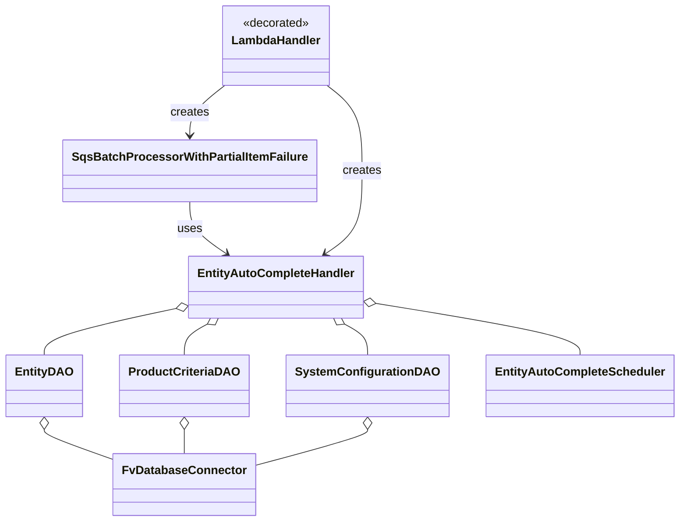

# Diagram: entity_core/entity_service/entity_listener/entity_listener_service/lambdas/entity_auto_completion_consumer.py


> Auto-generated by Obscura crawlers

## Diagram 1

```mermaid
flowchart TD
    M["@mandatory_lambda_handling(fail_gracefully=False)"] --> L[lambda_handler(event, context, audit_refs)]
    E[SQS Event (batch)] --> L
    L --> Instantiate[Construct DAOs & Handler]
    Instantiate --> SqsProc[SqsBatchProcessorWithPartialItemFailure(handler)]
    SqsProc --> Process[process_batch(event)]
    Process --> Handler[EntityAutoCompleteHandler]
    Handler --> SysDAO[SystemConfigurationDAO]
    Handler --> EntDAO[EntityDAO]
    Handler --> PCDAO[ProductCriteriaDAO]
    Handler --> Scheduler[EntityAutoCompleteScheduler]
    EntDAO --> DB[FvDatabaseConnector (DB_CONN)]
    SysDAO --> DB
    PCDAO --> DB
    DB --> Secret[SecretNames.ENTITY_DATABASE]
```

> SVG rendering failed for this diagram.

## Diagram 2



> SVG rendering failed for this diagram.
