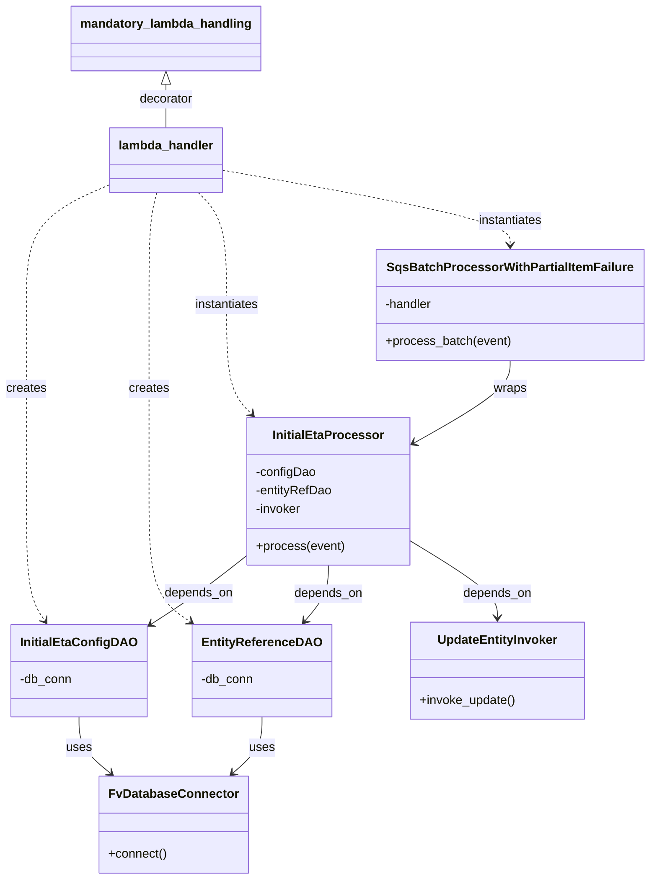

# Diagram: entity_core/entity_service/entity_listener/entity_listener_service/lambdas/entity_update_initial_eta_consumer.py


> Auto-generated by Obscura crawlers

## Diagram 1



### SVG

<svg id="container" width="827.693359375" xmlns="http://www.w3.org/2000/svg" class="classDiagram" height="1142" viewBox="0 0 827.693359375 1142" role="graphics-document document" aria-roledescription="class"><style>#container{font-family:"trebuchet ms",verdana,arial,sans-serif;font-size:16px;fill:#333;}@keyframes edge-animation-frame{from{stroke-dashoffset:0;}}@keyframes dash{to{stroke-dashoffset:0;}}#container .edge-animation-slow{stroke-dasharray:9,5!important;stroke-dashoffset:900;animation:dash 50s linear infinite;stroke-linecap:round;}#container .edge-animation-fast{stroke-dasharray:9,5!important;stroke-dashoffset:900;animation:dash 20s linear infinite;stroke-linecap:round;}#container .error-icon{fill:#552222;}#container .error-text{fill:#552222;stroke:#552222;}#container .edge-thickness-normal{stroke-width:1px;}#container .edge-thickness-thick{stroke-width:3.5px;}#container .edge-pattern-solid{stroke-dasharray:0;}#container .edge-thickness-invisible{stroke-width:0;fill:none;}#container .edge-pattern-dashed{stroke-dasharray:3;}#container .edge-pattern-dotted{stroke-dasharray:2;}#container .marker{fill:#333333;stroke:#333333;}#container .marker.cross{stroke:#333333;}#container svg{font-family:"trebuchet ms",verdana,arial,sans-serif;font-size:16px;}#container p{margin:0;}#container g.classGroup text{fill:#9370DB;stroke:none;font-family:"trebuchet ms",verdana,arial,sans-serif;font-size:10px;}#container g.classGroup text .title{font-weight:bolder;}#container .nodeLabel,#container .edgeLabel{color:#131300;}#container .edgeLabel .label rect{fill:#ECECFF;}#container .label text{fill:#131300;}#container .labelBkg{background:#ECECFF;}#container .edgeLabel .label span{background:#ECECFF;}#container .classTitle{font-weight:bolder;}#container .node rect,#container .node circle,#container .node ellipse,#container .node polygon,#container .node path{fill:#ECECFF;stroke:#9370DB;stroke-width:1px;}#container .divider{stroke:#9370DB;stroke-width:1;}#container g.clickable{cursor:pointer;}#container g.classGroup rect{fill:#ECECFF;stroke:#9370DB;}#container g.classGroup line{stroke:#9370DB;stroke-width:1;}#container .classLabel .box{stroke:none;stroke-width:0;fill:#ECECFF;opacity:0.5;}#container .classLabel .label{fill:#9370DB;font-size:10px;}#container .relation{stroke:#333333;stroke-width:1;fill:none;}#container .dashed-line{stroke-dasharray:3;}#container .dotted-line{stroke-dasharray:1 2;}#container #compositionStart,#container .composition{fill:#333333!important;stroke:#333333!important;stroke-width:1;}#container #compositionEnd,#container .composition{fill:#333333!important;stroke:#333333!important;stroke-width:1;}#container #dependencyStart,#container .dependency{fill:#333333!important;stroke:#333333!important;stroke-width:1;}#container #dependencyStart,#container .dependency{fill:#333333!important;stroke:#333333!important;stroke-width:1;}#container #extensionStart,#container .extension{fill:transparent!important;stroke:#333333!important;stroke-width:1;}#container #extensionEnd,#container .extension{fill:transparent!important;stroke:#333333!important;stroke-width:1;}#container #aggregationStart,#container .aggregation{fill:transparent!important;stroke:#333333!important;stroke-width:1;}#container #aggregationEnd,#container .aggregation{fill:transparent!important;stroke:#333333!important;stroke-width:1;}#container #lollipopStart,#container .lollipop{fill:#ECECFF!important;stroke:#333333!important;stroke-width:1;}#container #lollipopEnd,#container .lollipop{fill:#ECECFF!important;stroke:#333333!important;stroke-width:1;}#container .edgeTerminals{font-size:11px;line-height:initial;}#container .classTitleText{text-anchor:middle;font-size:18px;fill:#333;}#container .label-icon{display:inline-block;height:1em;overflow:visible;vertical-align:-0.125em;}#container .node .label-icon path{fill:currentColor;stroke:revert;stroke-width:revert;}#container :root{--mermaid-font-family:"trebuchet ms",verdana,arial,sans-serif;}</style><g><defs><marker id="container_class-aggregationStart" class="marker aggregation class" refX="18" refY="7" markerWidth="190" markerHeight="240" orient="auto"><path d="M 18,7 L9,13 L1,7 L9,1 Z"></path></marker></defs><defs><marker id="container_class-aggregationEnd" class="marker aggregation class" refX="1" refY="7" markerWidth="20" markerHeight="28" orient="auto"><path d="M 18,7 L9,13 L1,7 L9,1 Z"></path></marker></defs><defs><marker id="container_class-extensionStart" class="marker extension class" refX="18" refY="7" markerWidth="190" markerHeight="240" orient="auto"><path d="M 1,7 L18,13 V 1 Z"></path></marker></defs><defs><marker id="container_class-extensionEnd" class="marker extension class" refX="1" refY="7" markerWidth="20" markerHeight="28" orient="auto"><path d="M 1,1 V 13 L18,7 Z"></path></marker></defs><defs><marker id="container_class-compositionStart" class="marker composition class" refX="18" refY="7" markerWidth="190" markerHeight="240" orient="auto"><path d="M 18,7 L9,13 L1,7 L9,1 Z"></path></marker></defs><defs><marker id="container_class-compositionEnd" class="marker composition class" refX="1" refY="7" markerWidth="20" markerHeight="28" orient="auto"><path d="M 18,7 L9,13 L1,7 L9,1 Z"></path></marker></defs><defs><marker id="container_class-dependencyStart" class="marker dependency class" refX="6" refY="7" markerWidth="190" markerHeight="240" orient="auto"><path d="M 5,7 L9,13 L1,7 L9,1 Z"></path></marker></defs><defs><marker id="container_class-dependencyEnd" class="marker dependency class" refX="13" refY="7" markerWidth="20" markerHeight="28" orient="auto"><path d="M 18,7 L9,13 L14,7 L9,1 Z"></path></marker></defs><defs><marker id="container_class-lollipopStart" class="marker lollipop class" refX="13" refY="7" markerWidth="190" markerHeight="240" orient="auto"><circle stroke="black" fill="transparent" cx="7" cy="7" r="6"></circle></marker></defs><defs><marker id="container_class-lollipopEnd" class="marker lollipop class" refX="1" refY="7" markerWidth="190" markerHeight="240" orient="auto"><circle stroke="black" fill="transparent" cx="7" cy="7" r="6"></circle></marker></defs><g class="root"><g class="clusters"></g><g class="edgePaths"><path d="M102.68,931L102.68,937.667C102.68,944.333,102.68,957.667,109.466,969.868C116.253,982.069,129.825,993.139,136.612,998.673L143.398,1004.208" id="id_InitialEtaConfigDAO_FvDatabaseConnector_1" class="edge-thickness-normal edge-pattern-solid relation" style=";;;" data-edge="true" data-et="edge" data-id="id_InitialEtaConfigDAO_FvDatabaseConnector_1" data-points="W3sieCI6MTAyLjY3OTY4NzUsInkiOjkzMX0seyJ4IjoxMDIuNjc5Njg3NSwieSI6OTcxfSx7IngiOjE0OC4wNDgwNDY4NzUsInkiOjEwMDh9XQ==" marker-end="url(#container_class-dependencyEnd)"></path><path d="M334.293,931L334.293,937.667C334.293,944.333,334.293,957.667,328.308,969.824C322.324,981.981,310.355,992.962,304.37,998.453L298.386,1003.944" id="id_EntityReferenceDAO_FvDatabaseConnector_2" class="edge-thickness-normal edge-pattern-solid relation" style=";;;" data-edge="true" data-et="edge" data-id="id_EntityReferenceDAO_FvDatabaseConnector_2" data-points="W3sieCI6MzM0LjI5Mjk2ODc1LCJ5Ijo5MzF9LHsieCI6MzM0LjI5Mjk2ODc1LCJ5Ijo5NzF9LHsieCI6MjkzLjk2NDQxNDA2MjUsInkiOjEwMDh9XQ==" marker-end="url(#container_class-dependencyEnd)"></path><path d="M317.961,721.976L307.906,730.147C297.852,738.317,277.742,754.659,256.52,770.036C235.298,785.414,212.962,799.828,201.795,807.035L190.627,814.242" id="id_InitialEtaProcessor_InitialEtaConfigDAO_3" class="edge-thickness-normal edge-pattern-solid relation" style=";;;" data-edge="true" data-et="edge" data-id="id_InitialEtaProcessor_InitialEtaConfigDAO_3" data-points="W3sieCI6MzE3Ljk2MDkzNzUsInkiOjcyMS45NzYxMDkyMTUwMTd9LHsieCI6MjU3LjYzMjgxMjUsInkiOjc3MX0seyJ4IjoxODUuNTg1OTM3NSwieSI6ODE3LjQ5NTkxNjEwMzY2MDR9XQ==" marker-end="url(#container_class-dependencyEnd)"></path><path d="M421.301,734L421.301,740.167C421.301,746.333,421.301,758.667,416.157,770.746C411.013,782.825,400.724,794.649,395.58,800.561L390.436,806.474" id="id_InitialEtaProcessor_EntityReferenceDAO_4" class="edge-thickness-normal edge-pattern-solid relation" style=";;;" data-edge="true" data-et="edge" data-id="id_InitialEtaProcessor_EntityReferenceDAO_4" data-points="W3sieCI6NDIxLjMwMDc4MTI1LCJ5Ijo3MzR9LHsieCI6NDIxLjMwMDc4MTI1LCJ5Ijo3NzF9LHsieCI6Mzg2LjQ5NzY1NjI1LCJ5Ijo4MTF9XQ==" marker-end="url(#container_class-dependencyEnd)"></path><path d="M524.641,701.878L543.278,713.399C561.915,724.919,599.189,747.959,617.826,764.646C636.463,781.333,636.463,791.667,636.463,796.833L636.463,802" id="id_InitialEtaProcessor_UpdateEntityInvoker_5" class="edge-thickness-normal edge-pattern-solid relation" style=";;;" data-edge="true" data-et="edge" data-id="id_InitialEtaProcessor_UpdateEntityInvoker_5" data-points="W3sieCI6NTI0LjY0MDYyNSwieSI6NzAxLjg3ODM0MzkwODU3MTl9LHsieCI6NjM2LjQ2Mjg5MDYyNSwieSI6NzcxfSx7IngiOjYzNi40NjI4OTA2MjUsInkiOjgwOH1d" marker-end="url(#container_class-dependencyEnd)"></path><path d="M650.615,468L650.615,474.167C650.615,480.333,650.615,492.667,630.485,510.509C610.354,528.351,570.092,551.702,549.962,563.378L529.831,575.054" id="id_SqsBatchProcessorWithPartialItemFailure_InitialEtaProcessor_6" class="edge-thickness-normal edge-pattern-solid relation" style=";;;" data-edge="true" data-et="edge" data-id="id_SqsBatchProcessorWithPartialItemFailure_InitialEtaProcessor_6" data-points="W3sieCI6NjUwLjYxNTIzNDM3NSwieSI6NDY4fSx7IngiOjY1MC42MTUyMzQzNzUsInkiOjUwNX0seyJ4Ijo1MjQuNjQwNjI1LCJ5Ijo1NzguMDYzOTY0NDMyMDI4Mn1d" marker-end="url(#container_class-dependencyEnd)"></path><path d="M138.82,240.193L121.379,247.994C103.938,255.796,69.055,271.398,51.613,297.366C34.172,323.333,34.172,359.667,34.172,396C34.172,432.333,34.172,468.667,34.172,509C34.172,549.333,34.172,593.667,34.172,638C34.172,682.333,34.172,726.667,38.174,754.675C42.176,782.683,50.18,794.367,54.182,800.208L58.184,806.05" id="id_lambda_handler_InitialEtaConfigDAO_7" class="edge-thickness-normal edge-pattern-dashed relation" style=";;;" data-edge="true" data-et="edge" data-id="id_lambda_handler_InitialEtaConfigDAO_7" data-points="W3sieCI6MTM4LjgyMDMxMjUsInkiOjI0MC4xOTMzMzg2NDExODg5N30seyJ4IjozNC4xNzE4NzUsInkiOjI4N30seyJ4IjozNC4xNzE4NzUsInkiOjM5Nn0seyJ4IjozNC4xNzE4NzUsInkiOjUwNX0seyJ4IjozNC4xNzE4NzUsInkiOjYzOH0seyJ4IjozNC4xNzE4NzUsInkiOjc3MX0seyJ4Ijo2MS41NzUsInkiOjgxMX1d" marker-end="url(#container_class-dependencyEnd)"></path><path d="M201.314,250L199.922,256.167C198.53,262.333,195.745,274.667,194.353,299C192.961,323.333,192.961,359.667,192.961,396C192.961,432.333,192.961,468.667,192.961,509C192.961,549.333,192.961,593.667,192.961,638C192.961,682.333,192.961,726.667,201.567,754.922C210.173,783.178,227.384,795.356,235.99,801.445L244.596,807.534" id="id_lambda_handler_EntityReferenceDAO_8" class="edge-thickness-normal edge-pattern-dashed relation" style=";;;" data-edge="true" data-et="edge" data-id="id_lambda_handler_EntityReferenceDAO_8" data-points="W3sieCI6MjAxLjMxNDQ3Nzg0ODEwMTI2LCJ5IjoyNTB9LHsieCI6MTkyLjk2MDkzNzUsInkiOjI4N30seyJ4IjoxOTIuOTYwOTM3NSwieSI6Mzk2fSx7IngiOjE5Mi45NjA5Mzc1LCJ5Ijo1MDV9LHsieCI6MTkyLjk2MDkzNzUsInkiOjYzOH0seyJ4IjoxOTIuOTYwOTM3NSwieSI6NzcxfSx7IngiOjI0OS40OTM3NSwieSI6ODExfV0=" marker-end="url(#container_class-dependencyEnd)"></path><path d="M254.812,250L261.275,256.167C267.738,262.333,280.663,274.667,287.125,299C293.588,323.333,293.588,359.667,293.588,396C293.588,432.333,293.588,468.667,298.817,492.279C304.046,515.891,314.503,526.781,319.732,532.227L324.961,537.672" id="id_lambda_handler_InitialEtaProcessor_9" class="edge-thickness-normal edge-pattern-dashed relation" style=";;;" data-edge="true" data-et="edge" data-id="id_lambda_handler_InitialEtaProcessor_9" data-points="W3sieCI6MjU0LjgxMjM1MTY2MTM5MjQsInkiOjI1MH0seyJ4IjoyOTMuNTg3ODkwNjI1LCJ5IjoyODd9LHsieCI6MjkzLjU4Nzg5MDYyNSwieSI6Mzk2fSx7IngiOjI5My41ODc4OTA2MjUsInkiOjUwNX0seyJ4IjozMjkuMTE3MDQwNjQ4NDk2MjQsInkiOjU0Mn1d" marker-end="url(#container_class-dependencyEnd)"></path><path d="M282.773,220.928L344.08,231.94C405.387,242.952,528.001,264.976,589.308,281.155C650.615,297.333,650.615,307.667,650.615,312.833L650.615,318" id="id_lambda_handler_SqsBatchProcessorWithPartialItemFailure_10" class="edge-thickness-normal edge-pattern-dashed relation" style=";;;" data-edge="true" data-et="edge" data-id="id_lambda_handler_SqsBatchProcessorWithPartialItemFailure_10" data-points="W3sieCI6MjgyLjc3MzQzNzUsInkiOjIyMC45Mjg0MDE3MjgzNDEzM30seyJ4Ijo2NTAuNjE1MjM0Mzc1LCJ5IjoyODd9LHsieCI6NjUwLjYxNTIzNDM3NSwieSI6MzI0fV0=" marker-end="url(#container_class-dependencyEnd)"></path><path d="M210.797,109.25L210.797,112.542C210.797,115.833,210.797,122.417,210.797,131.875C210.797,141.333,210.797,153.667,210.797,159.833L210.797,166" id="id_mandatory_lambda_handling_lambda_handler_11" class="edge-thickness-normal edge-pattern-solid relation" style=";;;" data-edge="true" data-et="edge" data-id="id_mandatory_lambda_handling_lambda_handler_11" data-points="W3sieCI6MjEwLjc5Njg3NSwieSI6OTJ9LHsieCI6MjEwLjc5Njg3NSwieSI6MTI5fSx7IngiOjIxMC43OTY4NzUsInkiOjE2Nn1d" marker-start="url(#container_class-extensionStart)"></path></g><g class="edgeLabels"><g class="edgeLabel" transform="translate(102.6796875, 971)"><g class="label" data-id="id_InitialEtaConfigDAO_FvDatabaseConnector_1" transform="translate(-16.4921875, -12)"><foreignObject width="32.984375" height="24"><div xmlns="http://www.w3.org/1999/xhtml" class="labelBkg" style="display: table-cell; white-space: nowrap; line-height: 1.5; max-width: 200px; text-align: center;"><span class="edgeLabel"><p>uses</p></span></div></foreignObject></g></g><g class="edgeLabel" transform="translate(334.29296875, 971)"><g class="label" data-id="id_EntityReferenceDAO_FvDatabaseConnector_2" transform="translate(-16.4921875, -12)"><foreignObject width="32.984375" height="24"><div xmlns="http://www.w3.org/1999/xhtml" class="labelBkg" style="display: table-cell; white-space: nowrap; line-height: 1.5; max-width: 200px; text-align: center;"><span class="edgeLabel"><p>uses</p></span></div></foreignObject></g></g><g class="edgeLabel" transform="translate(254.26696, 773.17218)"><g class="label" data-id="id_InitialEtaProcessor_InitialEtaConfigDAO_3" transform="translate(-44.671875, -12)"><foreignObject width="89.34375" height="24"><div xmlns="http://www.w3.org/1999/xhtml" class="labelBkg" style="display: table-cell; white-space: nowrap; line-height: 1.5; max-width: 200px; text-align: center;"><span class="edgeLabel"><p>depends_on</p></span></div></foreignObject></g></g><g class="edgeLabel" transform="translate(421.30078125, 771)"><g class="label" data-id="id_InitialEtaProcessor_EntityReferenceDAO_4" transform="translate(-44.671875, -12)"><foreignObject width="89.34375" height="24"><div xmlns="http://www.w3.org/1999/xhtml" class="labelBkg" style="display: table-cell; white-space: nowrap; line-height: 1.5; max-width: 200px; text-align: center;"><span class="edgeLabel"><p>depends_on</p></span></div></foreignObject></g></g><g class="edgeLabel" transform="translate(636.462890625, 771)"><g class="label" data-id="id_InitialEtaProcessor_UpdateEntityInvoker_5" transform="translate(-44.671875, -12)"><foreignObject width="89.34375" height="24"><div xmlns="http://www.w3.org/1999/xhtml" class="labelBkg" style="display: table-cell; white-space: nowrap; line-height: 1.5; max-width: 200px; text-align: center;"><span class="edgeLabel"><p>depends_on</p></span></div></foreignObject></g></g><g class="edgeLabel" transform="translate(650.615234375, 505)"><g class="label" data-id="id_SqsBatchProcessorWithPartialItemFailure_InitialEtaProcessor_6" transform="translate(-21.390625, -12)"><foreignObject width="42.78125" height="24"><div xmlns="http://www.w3.org/1999/xhtml" class="labelBkg" style="display: table-cell; white-space: nowrap; line-height: 1.5; max-width: 200px; text-align: center;"><span class="edgeLabel"><p>wraps</p></span></div></foreignObject></g></g><g class="edgeLabel" transform="translate(34.171875, 505)"><g class="label" data-id="id_lambda_handler_InitialEtaConfigDAO_7" transform="translate(-26.171875, -12)"><foreignObject width="52.34375" height="24"><div xmlns="http://www.w3.org/1999/xhtml" class="labelBkg" style="display: table-cell; white-space: nowrap; line-height: 1.5; max-width: 200px; text-align: center;"><span class="edgeLabel"><p>creates</p></span></div></foreignObject></g></g><g class="edgeLabel" transform="translate(192.9609375, 505)"><g class="label" data-id="id_lambda_handler_EntityReferenceDAO_8" transform="translate(-26.171875, -12)"><foreignObject width="52.34375" height="24"><div xmlns="http://www.w3.org/1999/xhtml" class="labelBkg" style="display: table-cell; white-space: nowrap; line-height: 1.5; max-width: 200px; text-align: center;"><span class="edgeLabel"><p>creates</p></span></div></foreignObject></g></g><g class="edgeLabel" transform="translate(293.587890625, 396)"><g class="label" data-id="id_lambda_handler_InitialEtaProcessor_9" transform="translate(-42.9140625, -12)"><foreignObject width="85.828125" height="24"><div xmlns="http://www.w3.org/1999/xhtml" class="labelBkg" style="display: table-cell; white-space: nowrap; line-height: 1.5; max-width: 200px; text-align: center;"><span class="edgeLabel"><p>instantiates</p></span></div></foreignObject></g></g><g class="edgeLabel" transform="translate(650.615234375, 287)"><g class="label" data-id="id_lambda_handler_SqsBatchProcessorWithPartialItemFailure_10" transform="translate(-42.9140625, -12)"><foreignObject width="85.828125" height="24"><div xmlns="http://www.w3.org/1999/xhtml" class="labelBkg" style="display: table-cell; white-space: nowrap; line-height: 1.5; max-width: 200px; text-align: center;"><span class="edgeLabel"><p>instantiates</p></span></div></foreignObject></g></g><g class="edgeLabel" transform="translate(210.796875, 129)"><g class="label" data-id="id_mandatory_lambda_handling_lambda_handler_11" transform="translate(-35.171875, -12)"><foreignObject width="70.34375" height="24"><div xmlns="http://www.w3.org/1999/xhtml" class="labelBkg" style="display: table-cell; white-space: nowrap; line-height: 1.5; max-width: 200px; text-align: center;"><span class="edgeLabel"><p>decorator</p></span></div></foreignObject></g></g></g><g class="nodes"><g class="node default" id="classId-FvDatabaseConnector-0" transform="translate(225.296875, 1071)"><g class="basic label-container"><path d="M-91.3046875 -63 L91.3046875 -63 L91.3046875 63 L-91.3046875 63" stroke="none" stroke-width="0" fill="#ECECFF" style=""></path><path d="M-91.3046875 -63 C-19.05857659365695 -63, 53.1875343126861 -63, 91.3046875 -63 M-91.3046875 -63 C-36.45349617670789 -63, 18.397695146584226 -63, 91.3046875 -63 M91.3046875 -63 C91.3046875 -18.934590061830882, 91.3046875 25.130819876338236, 91.3046875 63 M91.3046875 -63 C91.3046875 -24.40968021898977, 91.3046875 14.18063956202046, 91.3046875 63 M91.3046875 63 C50.446571224099415 63, 9.58845494819883 63, -91.3046875 63 M91.3046875 63 C20.173157648992728 63, -50.958372202014544 63, -91.3046875 63 M-91.3046875 63 C-91.3046875 22.206342473887794, -91.3046875 -18.58731505222441, -91.3046875 -63 M-91.3046875 63 C-91.3046875 24.240874831114574, -91.3046875 -14.518250337770851, -91.3046875 -63" stroke="#9370DB" stroke-width="1.3" fill="none" stroke-dasharray="0 0" style=""></path></g><g class="annotation-group text" transform="translate(0, -39)"></g><g class="label-group text" transform="translate(-79.3046875, -39)"><g class="label" style="font-weight: bolder" transform="translate(0,-12)"><foreignObject width="158.609375" height="24"><div xmlns="http://www.w3.org/1999/xhtml" style="display: table-cell; white-space: nowrap; line-height: 1.5; max-width: 207px; text-align: center;"><span class="nodeLabel markdown-node-label" style=""><p>FvDatabaseConnector</p></span></div></foreignObject></g></g><g class="members-group text" transform="translate(-79.3046875, 9)"></g><g class="methods-group text" transform="translate(-79.3046875, 39)"><g class="label" style="" transform="translate(0,-12)"><foreignObject width="75.921875" height="24"><div xmlns="http://www.w3.org/1999/xhtml" style="display: table-cell; white-space: nowrap; line-height: 1.5; max-width: 133px; text-align: center;"><span class="nodeLabel markdown-node-label" style=""><p>+connect()</p></span></div></foreignObject></g></g><g class="divider" style=""><path d="M-91.3046875 -15 C-33.06100756013475 -15, 25.182672379730505 -15, 91.3046875 -15 M-91.3046875 -15 C-26.525027765709112 -15, 38.254631968581776 -15, 91.3046875 -15" stroke="#9370DB" stroke-width="1.3" fill="none" stroke-dasharray="0 0" style=""></path></g><g class="divider" style=""><path d="M-91.3046875 9 C-23.12382991337671 9, 45.05702767324658 9, 91.3046875 9 M-91.3046875 9 C-26.819032529842673 9, 37.666622440314654 9, 91.3046875 9" stroke="#9370DB" stroke-width="1.3" fill="none" stroke-dasharray="0 0" style=""></path></g></g><g class="node default" id="classId-InitialEtaConfigDAO-1" transform="translate(102.6796875, 871)"><g class="basic label-container"><path d="M-82.90625 -60 L82.90625 -60 L82.90625 60 L-82.90625 60" stroke="none" stroke-width="0" fill="#ECECFF" style=""></path><path d="M-82.90625 -60 C-48.91455106598713 -60, -14.922852131974267 -60, 82.90625 -60 M-82.90625 -60 C-27.51298221608082 -60, 27.880285567838357 -60, 82.90625 -60 M82.90625 -60 C82.90625 -21.81627263097539, 82.90625 16.36745473804922, 82.90625 60 M82.90625 -60 C82.90625 -14.809329228717111, 82.90625 30.381341542565778, 82.90625 60 M82.90625 60 C26.114475130630915 60, -30.67729973873817 60, -82.90625 60 M82.90625 60 C45.85764010753036 60, 8.809030215060716 60, -82.90625 60 M-82.90625 60 C-82.90625 24.588163039091263, -82.90625 -10.823673921817473, -82.90625 -60 M-82.90625 60 C-82.90625 16.794313878202566, -82.90625 -26.41137224359487, -82.90625 -60" stroke="#9370DB" stroke-width="1.3" fill="none" stroke-dasharray="0 0" style=""></path></g><g class="annotation-group text" transform="translate(0, -36)"></g><g class="label-group text" transform="translate(-70.90625, -36)"><g class="label" style="font-weight: bolder" transform="translate(0,-12)"><foreignObject width="141.8125" height="24"><div xmlns="http://www.w3.org/1999/xhtml" style="display: table-cell; white-space: nowrap; line-height: 1.5; max-width: 190px; text-align: center;"><span class="nodeLabel markdown-node-label" style=""><p>InitialEtaConfigDAO</p></span></div></foreignObject></g></g><g class="members-group text" transform="translate(-70.90625, 12)"><g class="label" style="" transform="translate(0,-12)"><foreignObject width="68.625" height="24"><div xmlns="http://www.w3.org/1999/xhtml" style="display: table-cell; white-space: nowrap; line-height: 1.5; max-width: 126px; text-align: center;"><span class="nodeLabel markdown-node-label" style=""><p>-db_conn</p></span></div></foreignObject></g></g><g class="methods-group text" transform="translate(-70.90625, 60)"></g><g class="divider" style=""><path d="M-82.90625 -12 C-45.61375099505986 -12, -8.32125199011972 -12, 82.90625 -12 M-82.90625 -12 C-23.68469988018083 -12, 35.53685023963834 -12, 82.90625 -12" stroke="#9370DB" stroke-width="1.3" fill="none" stroke-dasharray="0 0" style=""></path></g><g class="divider" style=""><path d="M-82.90625 36 C-44.10702531183842 36, -5.30780062367684 36, 82.90625 36 M-82.90625 36 C-33.78003614670574 36, 15.34617770658852 36, 82.90625 36" stroke="#9370DB" stroke-width="1.3" fill="none" stroke-dasharray="0 0" style=""></path></g></g><g class="node default" id="classId-EntityReferenceDAO-2" transform="translate(334.29296875, 871)"><g class="basic label-container"><path d="M-85.0859375 -60 L85.0859375 -60 L85.0859375 60 L-85.0859375 60" stroke="none" stroke-width="0" fill="#ECECFF" style=""></path><path d="M-85.0859375 -60 C-49.54313408295652 -60, -14.00033066591304 -60, 85.0859375 -60 M-85.0859375 -60 C-46.64908866838117 -60, -8.212239836762336 -60, 85.0859375 -60 M85.0859375 -60 C85.0859375 -22.067137820850654, 85.0859375 15.865724358298692, 85.0859375 60 M85.0859375 -60 C85.0859375 -24.64041578933187, 85.0859375 10.719168421336263, 85.0859375 60 M85.0859375 60 C49.767916459878435 60, 14.44989541975687 60, -85.0859375 60 M85.0859375 60 C27.35066251306302 60, -30.384612473873958 60, -85.0859375 60 M-85.0859375 60 C-85.0859375 16.157116496135117, -85.0859375 -27.685767007729766, -85.0859375 -60 M-85.0859375 60 C-85.0859375 17.884957816289408, -85.0859375 -24.230084367421185, -85.0859375 -60" stroke="#9370DB" stroke-width="1.3" fill="none" stroke-dasharray="0 0" style=""></path></g><g class="annotation-group text" transform="translate(0, -36)"></g><g class="label-group text" transform="translate(-73.0859375, -36)"><g class="label" style="font-weight: bolder" transform="translate(0,-12)"><foreignObject width="146.171875" height="24"><div xmlns="http://www.w3.org/1999/xhtml" style="display: table-cell; white-space: nowrap; line-height: 1.5; max-width: 194px; text-align: center;"><span class="nodeLabel markdown-node-label" style=""><p>EntityReferenceDAO</p></span></div></foreignObject></g></g><g class="members-group text" transform="translate(-73.0859375, 12)"><g class="label" style="" transform="translate(0,-12)"><foreignObject width="68.625" height="24"><div xmlns="http://www.w3.org/1999/xhtml" style="display: table-cell; white-space: nowrap; line-height: 1.5; max-width: 126px; text-align: center;"><span class="nodeLabel markdown-node-label" style=""><p>-db_conn</p></span></div></foreignObject></g></g><g class="methods-group text" transform="translate(-73.0859375, 60)"></g><g class="divider" style=""><path d="M-85.0859375 -12 C-49.86455491273987 -12, -14.643172325479739 -12, 85.0859375 -12 M-85.0859375 -12 C-35.12531037067746 -12, 14.835316758645078 -12, 85.0859375 -12" stroke="#9370DB" stroke-width="1.3" fill="none" stroke-dasharray="0 0" style=""></path></g><g class="divider" style=""><path d="M-85.0859375 36 C-23.327840312719225 36, 38.43025687456155 36, 85.0859375 36 M-85.0859375 36 C-25.26133230536928 36, 34.56327288926144 36, 85.0859375 36" stroke="#9370DB" stroke-width="1.3" fill="none" stroke-dasharray="0 0" style=""></path></g></g><g class="node default" id="classId-InitialEtaProcessor-3" transform="translate(421.30078125, 638)"><g class="basic label-container"><path d="M-103.33984375 -96 L103.33984375 -96 L103.33984375 96 L-103.33984375 96" stroke="none" stroke-width="0" fill="#ECECFF" style=""></path><path d="M-103.33984375 -96 C-50.51467256429566 -96, 2.3104986214086836 -96, 103.33984375 -96 M-103.33984375 -96 C-51.46160198897833 -96, 0.41663977204333946 -96, 103.33984375 -96 M103.33984375 -96 C103.33984375 -30.94984536886801, 103.33984375 34.10030926226398, 103.33984375 96 M103.33984375 -96 C103.33984375 -47.34599024477038, 103.33984375 1.3080195104592462, 103.33984375 96 M103.33984375 96 C34.95414793496204 96, -33.431547880075925 96, -103.33984375 96 M103.33984375 96 C51.60277868445881 96, -0.13428638108237578 96, -103.33984375 96 M-103.33984375 96 C-103.33984375 54.96182237749598, -103.33984375 13.923644754991955, -103.33984375 -96 M-103.33984375 96 C-103.33984375 34.93310461253336, -103.33984375 -26.133790774933274, -103.33984375 -96" stroke="#9370DB" stroke-width="1.3" fill="none" stroke-dasharray="0 0" style=""></path></g><g class="annotation-group text" transform="translate(0, -72)"></g><g class="label-group text" transform="translate(-68.6015625, -72)"><g class="label" style="font-weight: bolder" transform="translate(0,-12)"><foreignObject width="137.203125" height="24"><div xmlns="http://www.w3.org/1999/xhtml" style="display: table-cell; white-space: nowrap; line-height: 1.5; max-width: 186px; text-align: center;"><span class="nodeLabel markdown-node-label" style=""><p>InitialEtaProcessor</p></span></div></foreignObject></g></g><g class="members-group text" transform="translate(-91.33984375, -24)"><g class="label" style="" transform="translate(0,-12)"><foreignObject width="78.21875" height="24"><div xmlns="http://www.w3.org/1999/xhtml" style="display: table-cell; white-space: nowrap; line-height: 1.5; max-width: 136px; text-align: center;"><span class="nodeLabel markdown-node-label" style=""><p>-configDao</p></span></div></foreignObject></g><g class="label" style="" transform="translate(0,12)"><foreignObject width="100.125" height="24"><div xmlns="http://www.w3.org/1999/xhtml" style="display: table-cell; white-space: nowrap; line-height: 1.5; max-width: 157px; text-align: center;"><span class="nodeLabel markdown-node-label" style=""><p>-entityRefDao</p></span></div></foreignObject></g><g class="label" style="" transform="translate(0,36)"><foreignObject width="60.328125" height="24"><div xmlns="http://www.w3.org/1999/xhtml" style="display: table-cell; white-space: nowrap; line-height: 1.5; max-width: 119px; text-align: center;"><span class="nodeLabel markdown-node-label" style=""><p>-invoker</p></span></div></foreignObject></g></g><g class="methods-group text" transform="translate(-91.33984375, 72)"><g class="label" style="" transform="translate(0,-12)"><foreignObject width="114.078125" height="24"><div xmlns="http://www.w3.org/1999/xhtml" style="display: table-cell; white-space: nowrap; line-height: 1.5; max-width: 171px; text-align: center;"><span class="nodeLabel markdown-node-label" style=""><p>+process(event)</p></span></div></foreignObject></g></g><g class="divider" style=""><path d="M-103.33984375 -48 C-47.14558237092988 -48, 9.04867900814024 -48, 103.33984375 -48 M-103.33984375 -48 C-47.26482524439131 -48, 8.810193261217378 -48, 103.33984375 -48" stroke="#9370DB" stroke-width="1.3" fill="none" stroke-dasharray="0 0" style=""></path></g><g class="divider" style=""><path d="M-103.33984375 48 C-43.4059483864427 48, 16.527946977114595 48, 103.33984375 48 M-103.33984375 48 C-39.105368551768805 48, 25.12910664646239 48, 103.33984375 48" stroke="#9370DB" stroke-width="1.3" fill="none" stroke-dasharray="0 0" style=""></path></g></g><g class="node default" id="classId-UpdateEntityInvoker-4" transform="translate(636.462890625, 871)"><g class="basic label-container"><path d="M-112.2265625 -63 L112.2265625 -63 L112.2265625 63 L-112.2265625 63" stroke="none" stroke-width="0" fill="#ECECFF" style=""></path><path d="M-112.2265625 -63 C-49.64042461343009 -63, 12.945713273139816 -63, 112.2265625 -63 M-112.2265625 -63 C-37.99301884032745 -63, 36.2405248193451 -63, 112.2265625 -63 M112.2265625 -63 C112.2265625 -14.7459831696708, 112.2265625 33.5080336606584, 112.2265625 63 M112.2265625 -63 C112.2265625 -17.50242434810457, 112.2265625 27.995151303790863, 112.2265625 63 M112.2265625 63 C46.53922206299029 63, -19.14811837401942 63, -112.2265625 63 M112.2265625 63 C41.15417920014721 63, -29.918204099705576 63, -112.2265625 63 M-112.2265625 63 C-112.2265625 20.649395727889512, -112.2265625 -21.701208544220975, -112.2265625 -63 M-112.2265625 63 C-112.2265625 21.18882115025123, -112.2265625 -20.62235769949754, -112.2265625 -63" stroke="#9370DB" stroke-width="1.3" fill="none" stroke-dasharray="0 0" style=""></path></g><g class="annotation-group text" transform="translate(0, -39)"></g><g class="label-group text" transform="translate(-75.375, -39)"><g class="label" style="font-weight: bolder" transform="translate(0,-12)"><foreignObject width="150.75" height="24"><div xmlns="http://www.w3.org/1999/xhtml" style="display: table-cell; white-space: nowrap; line-height: 1.5; max-width: 199px; text-align: center;"><span class="nodeLabel markdown-node-label" style=""><p>UpdateEntityInvoker</p></span></div></foreignObject></g></g><g class="members-group text" transform="translate(-100.2265625, 9)"></g><g class="methods-group text" transform="translate(-100.2265625, 39)"><g class="label" style="" transform="translate(0,-12)"><foreignObject width="125.078125" height="24"><div xmlns="http://www.w3.org/1999/xhtml" style="display: table-cell; white-space: nowrap; line-height: 1.5; max-width: 182px; text-align: center;"><span class="nodeLabel markdown-node-label" style=""><p>+invoke_update()</p></span></div></foreignObject></g></g><g class="divider" style=""><path d="M-112.2265625 -15 C-23.953251404254146 -15, 64.3200596914917 -15, 112.2265625 -15 M-112.2265625 -15 C-45.99898920277306 -15, 20.22858409445388 -15, 112.2265625 -15" stroke="#9370DB" stroke-width="1.3" fill="none" stroke-dasharray="0 0" style=""></path></g><g class="divider" style=""><path d="M-112.2265625 9 C-48.16518727662765 9, 15.896187946744703 9, 112.2265625 9 M-112.2265625 9 C-58.231260731809954 9, -4.2359589636199075 9, 112.2265625 9" stroke="#9370DB" stroke-width="1.3" fill="none" stroke-dasharray="0 0" style=""></path></g></g><g class="node default" id="classId-SqsBatchProcessorWithPartialItemFailure-5" transform="translate(650.615234375, 396)"><g class="basic label-container"><path d="M-169.078125 -72 L169.078125 -72 L169.078125 72 L-169.078125 72" stroke="none" stroke-width="0" fill="#ECECFF" style=""></path><path d="M-169.078125 -72 C-52.44459003976068 -72, 64.18894492047863 -72, 169.078125 -72 M-169.078125 -72 C-73.9278223561886 -72, 21.2224802876228 -72, 169.078125 -72 M169.078125 -72 C169.078125 -42.47953642839665, 169.078125 -12.959072856793298, 169.078125 72 M169.078125 -72 C169.078125 -18.917764721267787, 169.078125 34.164470557464426, 169.078125 72 M169.078125 72 C61.789909384577115 72, -45.49830623084577 72, -169.078125 72 M169.078125 72 C84.06425802258052 72, -0.9496089548389648 72, -169.078125 72 M-169.078125 72 C-169.078125 33.86066136408377, -169.078125 -4.278677271832464, -169.078125 -72 M-169.078125 72 C-169.078125 14.80044612539534, -169.078125 -42.39910774920932, -169.078125 -72" stroke="#9370DB" stroke-width="1.3" fill="none" stroke-dasharray="0 0" style=""></path></g><g class="annotation-group text" transform="translate(0, -48)"></g><g class="label-group text" transform="translate(-151.46875, -48)"><g class="label" style="font-weight: bolder" transform="translate(0,-12)"><foreignObject width="302.9375" height="24"><div xmlns="http://www.w3.org/1999/xhtml" style="display: table-cell; white-space: nowrap; line-height: 1.5; max-width: 348px; text-align: center;"><span class="nodeLabel markdown-node-label" style=""><p>SqsBatchProcessorWithPartialItemFailure</p></span></div></foreignObject></g></g><g class="members-group text" transform="translate(-157.078125, 0)"><g class="label" style="" transform="translate(0,-12)"><foreignObject width="62.984375" height="24"><div xmlns="http://www.w3.org/1999/xhtml" style="display: table-cell; white-space: nowrap; line-height: 1.5; max-width: 121px; text-align: center;"><span class="nodeLabel markdown-node-label" style=""><p>-handler</p></span></div></foreignObject></g></g><g class="methods-group text" transform="translate(-157.078125, 48)"><g class="label" style="" transform="translate(0,-12)"><foreignObject width="162.6875" height="24"><div xmlns="http://www.w3.org/1999/xhtml" style="display: table-cell; white-space: nowrap; line-height: 1.5; max-width: 220px; text-align: center;"><span class="nodeLabel markdown-node-label" style=""><p>+process_batch(event)</p></span></div></foreignObject></g></g><g class="divider" style=""><path d="M-169.078125 -24 C-39.64951095613199 -24, 89.77910308773602 -24, 169.078125 -24 M-169.078125 -24 C-82.26586479294188 -24, 4.546395414116233 -24, 169.078125 -24" stroke="#9370DB" stroke-width="1.3" fill="none" stroke-dasharray="0 0" style=""></path></g><g class="divider" style=""><path d="M-169.078125 24 C-65.04619994848737 24, 38.98572510302526 24, 169.078125 24 M-169.078125 24 C-66.24082057612459 24, 36.59648384775082 24, 169.078125 24" stroke="#9370DB" stroke-width="1.3" fill="none" stroke-dasharray="0 0" style=""></path></g></g><g class="node default" id="classId-mandatory_lambda_handling-6" transform="translate(210.796875, 50)"><g class="basic label-container"><path d="M-119.4296875 -42 L119.4296875 -42 L119.4296875 42 L-119.4296875 42" stroke="none" stroke-width="0" fill="#ECECFF" style=""></path><path d="M-119.4296875 -42 C-61.01341994858586 -42, -2.597152397171726 -42, 119.4296875 -42 M-119.4296875 -42 C-53.90997517136877 -42, 11.609737157262458 -42, 119.4296875 -42 M119.4296875 -42 C119.4296875 -19.407271873576814, 119.4296875 3.1854562528463717, 119.4296875 42 M119.4296875 -42 C119.4296875 -17.73136302773272, 119.4296875 6.537273944534562, 119.4296875 42 M119.4296875 42 C45.19152294546487 42, -29.046641609070264 42, -119.4296875 42 M119.4296875 42 C68.34143488794169 42, 17.25318227588339 42, -119.4296875 42 M-119.4296875 42 C-119.4296875 22.654158884961728, -119.4296875 3.3083177699234554, -119.4296875 -42 M-119.4296875 42 C-119.4296875 15.298571473697166, -119.4296875 -11.402857052605668, -119.4296875 -42" stroke="#9370DB" stroke-width="1.3" fill="none" stroke-dasharray="0 0" style=""></path></g><g class="annotation-group text" transform="translate(0, -18)"></g><g class="label-group text" transform="translate(-107.4296875, -18)"><g class="label" style="font-weight: bolder" transform="translate(0,-12)"><foreignObject width="214.859375" height="24"><div xmlns="http://www.w3.org/1999/xhtml" style="display: table-cell; white-space: nowrap; line-height: 1.5; max-width: 264px; text-align: center;"><span class="nodeLabel markdown-node-label" style=""><p>mandatory_lambda_handling</p></span></div></foreignObject></g></g><g class="members-group text" transform="translate(-107.4296875, 30)"></g><g class="methods-group text" transform="translate(-107.4296875, 60)"></g><g class="divider" style=""><path d="M-119.4296875 6 C-27.521334017769448 6, 64.3870194644611 6, 119.4296875 6 M-119.4296875 6 C-69.93602380632072 6, -20.442360112641452 6, 119.4296875 6" stroke="#9370DB" stroke-width="1.3" fill="none" stroke-dasharray="0 0" style=""></path></g><g class="divider" style=""><path d="M-119.4296875 24 C-35.868293617696224 24, 47.69310026460755 24, 119.4296875 24 M-119.4296875 24 C-62.23517460306993 24, -5.040661706139858 24, 119.4296875 24" stroke="#9370DB" stroke-width="1.3" fill="none" stroke-dasharray="0 0" style=""></path></g></g><g class="node default" id="classId-lambda_handler-7" transform="translate(210.796875, 208)"><g class="basic label-container"><path d="M-71.9765625 -42 L71.9765625 -42 L71.9765625 42 L-71.9765625 42" stroke="none" stroke-width="0" fill="#ECECFF" style=""></path><path d="M-71.9765625 -42 C-29.171658899013522 -42, 13.633244701972956 -42, 71.9765625 -42 M-71.9765625 -42 C-27.949655040117015 -42, 16.07725241976597 -42, 71.9765625 -42 M71.9765625 -42 C71.9765625 -16.141395958958473, 71.9765625 9.717208082083054, 71.9765625 42 M71.9765625 -42 C71.9765625 -9.206694986371865, 71.9765625 23.58661002725627, 71.9765625 42 M71.9765625 42 C33.80318553877272 42, -4.370191422454553 42, -71.9765625 42 M71.9765625 42 C19.477314672011488 42, -33.021933155977024 42, -71.9765625 42 M-71.9765625 42 C-71.9765625 10.127087497098849, -71.9765625 -21.745825005802303, -71.9765625 -42 M-71.9765625 42 C-71.9765625 18.813257734289003, -71.9765625 -4.373484531421994, -71.9765625 -42" stroke="#9370DB" stroke-width="1.3" fill="none" stroke-dasharray="0 0" style=""></path></g><g class="annotation-group text" transform="translate(0, -18)"></g><g class="label-group text" transform="translate(-59.9765625, -18)"><g class="label" style="font-weight: bolder" transform="translate(0,-12)"><foreignObject width="119.953125" height="24"><div xmlns="http://www.w3.org/1999/xhtml" style="display: table-cell; white-space: nowrap; line-height: 1.5; max-width: 170px; text-align: center;"><span class="nodeLabel markdown-node-label" style=""><p>lambda_handler</p></span></div></foreignObject></g></g><g class="members-group text" transform="translate(-59.9765625, 30)"></g><g class="methods-group text" transform="translate(-59.9765625, 60)"></g><g class="divider" style=""><path d="M-71.9765625 6 C-17.03279991659158 6, 37.91096266681684 6, 71.9765625 6 M-71.9765625 6 C-21.682108418511675 6, 28.61234566297665 6, 71.9765625 6" stroke="#9370DB" stroke-width="1.3" fill="none" stroke-dasharray="0 0" style=""></path></g><g class="divider" style=""><path d="M-71.9765625 24 C-30.55332648928313 24, 10.86990952143374 24, 71.9765625 24 M-71.9765625 24 C-37.009138548466716 24, -2.0417145969334314 24, 71.9765625 24" stroke="#9370DB" stroke-width="1.3" fill="none" stroke-dasharray="0 0" style=""></path></g></g></g></g></g></svg>

## Diagram 2

```mermaid
flowchart TD
    M[DB_CONN: FvDatabaseConnector]
    Event[Event] --> Entry[lambda_handler]
    Entry --> Decorator[mandatory_lambda_handling]
    Decorator --> InitConfigDAO[Create InitialEtaConfigDAO(DB_CONN)]
    InitConfigDAO --> InitEntityDAO[Create EntityReferenceDAO(DB_CONN)]
    InitEntityDAO --> CreateInvoker[Create UpdateEntityInvoker()]
    CreateInvoker --> CreateProcessor[Create InitialEtaProcessor(configDao, entityRefDao, invoker)]
    CreateProcessor --> CreateSqs[Create SqsBatchProcessorWithPartialItemFailure(handler)]
    CreateSqs --> ProcessBatch[process_batch(event)]
    ProcessBatch --> Return[Return result]
    M --> InitConfigDAO
    M --> InitEntityDAO
```

> SVG rendering failed for this diagram.
