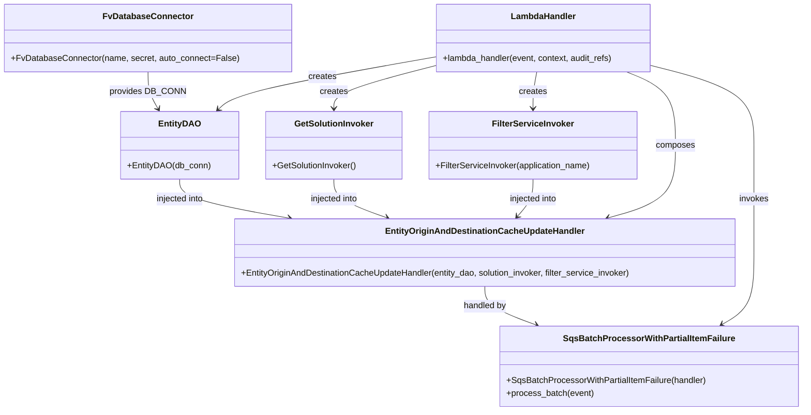

# Diagram: entity_core/entity_service/entity_listener/entity_listener_service/lambdas/update_entity_origin_and_destination_country_cache.py


> Auto-generated by Obscura crawlers

## Diagram 1



### SVG

<svg id="container" width="1479.58984375" xmlns="http://www.w3.org/2000/svg" class="classDiagram" height="766" viewBox="0 0 1479.58984375 766" role="graphics-document document" aria-roledescription="class"><style>#container{font-family:"trebuchet ms",verdana,arial,sans-serif;font-size:16px;fill:#333;}@keyframes edge-animation-frame{from{stroke-dashoffset:0;}}@keyframes dash{to{stroke-dashoffset:0;}}#container .edge-animation-slow{stroke-dasharray:9,5!important;stroke-dashoffset:900;animation:dash 50s linear infinite;stroke-linecap:round;}#container .edge-animation-fast{stroke-dasharray:9,5!important;stroke-dashoffset:900;animation:dash 20s linear infinite;stroke-linecap:round;}#container .error-icon{fill:#552222;}#container .error-text{fill:#552222;stroke:#552222;}#container .edge-thickness-normal{stroke-width:1px;}#container .edge-thickness-thick{stroke-width:3.5px;}#container .edge-pattern-solid{stroke-dasharray:0;}#container .edge-thickness-invisible{stroke-width:0;fill:none;}#container .edge-pattern-dashed{stroke-dasharray:3;}#container .edge-pattern-dotted{stroke-dasharray:2;}#container .marker{fill:#333333;stroke:#333333;}#container .marker.cross{stroke:#333333;}#container svg{font-family:"trebuchet ms",verdana,arial,sans-serif;font-size:16px;}#container p{margin:0;}#container g.classGroup text{fill:#9370DB;stroke:none;font-family:"trebuchet ms",verdana,arial,sans-serif;font-size:10px;}#container g.classGroup text .title{font-weight:bolder;}#container .nodeLabel,#container .edgeLabel{color:#131300;}#container .edgeLabel .label rect{fill:#ECECFF;}#container .label text{fill:#131300;}#container .labelBkg{background:#ECECFF;}#container .edgeLabel .label span{background:#ECECFF;}#container .classTitle{font-weight:bolder;}#container .node rect,#container .node circle,#container .node ellipse,#container .node polygon,#container .node path{fill:#ECECFF;stroke:#9370DB;stroke-width:1px;}#container .divider{stroke:#9370DB;stroke-width:1;}#container g.clickable{cursor:pointer;}#container g.classGroup rect{fill:#ECECFF;stroke:#9370DB;}#container g.classGroup line{stroke:#9370DB;stroke-width:1;}#container .classLabel .box{stroke:none;stroke-width:0;fill:#ECECFF;opacity:0.5;}#container .classLabel .label{fill:#9370DB;font-size:10px;}#container .relation{stroke:#333333;stroke-width:1;fill:none;}#container .dashed-line{stroke-dasharray:3;}#container .dotted-line{stroke-dasharray:1 2;}#container #compositionStart,#container .composition{fill:#333333!important;stroke:#333333!important;stroke-width:1;}#container #compositionEnd,#container .composition{fill:#333333!important;stroke:#333333!important;stroke-width:1;}#container #dependencyStart,#container .dependency{fill:#333333!important;stroke:#333333!important;stroke-width:1;}#container #dependencyStart,#container .dependency{fill:#333333!important;stroke:#333333!important;stroke-width:1;}#container #extensionStart,#container .extension{fill:transparent!important;stroke:#333333!important;stroke-width:1;}#container #extensionEnd,#container .extension{fill:transparent!important;stroke:#333333!important;stroke-width:1;}#container #aggregationStart,#container .aggregation{fill:transparent!important;stroke:#333333!important;stroke-width:1;}#container #aggregationEnd,#container .aggregation{fill:transparent!important;stroke:#333333!important;stroke-width:1;}#container #lollipopStart,#container .lollipop{fill:#ECECFF!important;stroke:#333333!important;stroke-width:1;}#container #lollipopEnd,#container .lollipop{fill:#ECECFF!important;stroke:#333333!important;stroke-width:1;}#container .edgeTerminals{font-size:11px;line-height:initial;}#container .classTitleText{text-anchor:middle;font-size:18px;fill:#333;}#container .label-icon{display:inline-block;height:1em;overflow:visible;vertical-align:-0.125em;}#container .node .label-icon path{fill:currentColor;stroke:revert;stroke-width:revert;}#container :root{--mermaid-font-family:"trebuchet ms",verdana,arial,sans-serif;}</style><g><defs><marker id="container_class-aggregationStart" class="marker aggregation class" refX="18" refY="7" markerWidth="190" markerHeight="240" orient="auto"><path d="M 18,7 L9,13 L1,7 L9,1 Z"></path></marker></defs><defs><marker id="container_class-aggregationEnd" class="marker aggregation class" refX="1" refY="7" markerWidth="20" markerHeight="28" orient="auto"><path d="M 18,7 L9,13 L1,7 L9,1 Z"></path></marker></defs><defs><marker id="container_class-extensionStart" class="marker extension class" refX="18" refY="7" markerWidth="190" markerHeight="240" orient="auto"><path d="M 1,7 L18,13 V 1 Z"></path></marker></defs><defs><marker id="container_class-extensionEnd" class="marker extension class" refX="1" refY="7" markerWidth="20" markerHeight="28" orient="auto"><path d="M 1,1 V 13 L18,7 Z"></path></marker></defs><defs><marker id="container_class-compositionStart" class="marker composition class" refX="18" refY="7" markerWidth="190" markerHeight="240" orient="auto"><path d="M 18,7 L9,13 L1,7 L9,1 Z"></path></marker></defs><defs><marker id="container_class-compositionEnd" class="marker composition class" refX="1" refY="7" markerWidth="20" markerHeight="28" orient="auto"><path d="M 18,7 L9,13 L1,7 L9,1 Z"></path></marker></defs><defs><marker id="container_class-dependencyStart" class="marker dependency class" refX="6" refY="7" markerWidth="190" markerHeight="240" orient="auto"><path d="M 5,7 L9,13 L1,7 L9,1 Z"></path></marker></defs><defs><marker id="container_class-dependencyEnd" class="marker dependency class" refX="13" refY="7" markerWidth="20" markerHeight="28" orient="auto"><path d="M 18,7 L9,13 L14,7 L9,1 Z"></path></marker></defs><defs><marker id="container_class-lollipopStart" class="marker lollipop class" refX="13" refY="7" markerWidth="190" markerHeight="240" orient="auto"><circle stroke="black" fill="transparent" cx="7" cy="7" r="6"></circle></marker></defs><defs><marker id="container_class-lollipopEnd" class="marker lollipop class" refX="1" refY="7" markerWidth="190" markerHeight="240" orient="auto"><circle stroke="black" fill="transparent" cx="7" cy="7" r="6"></circle></marker></defs><g class="root"><g class="clusters"></g><g class="edgePaths"><path d="M268.684,134L268.684,140.167C268.684,146.333,268.684,158.667,271.706,170.131C274.728,181.596,280.772,192.192,283.794,197.49L286.817,202.788" id="id_FvDatabaseConnector_EntityDAO_1" class="edge-thickness-normal edge-pattern-solid relation" style=";;;" data-edge="true" data-et="edge" data-id="id_FvDatabaseConnector_EntityDAO_1" data-points="W3sieCI6MjY4LjY4MzU5Mzc1LCJ5IjoxMzR9LHsieCI6MjY4LjY4MzU5Mzc1LCJ5IjoxNzF9LHsieCI6Mjg5Ljc4OTQ5MjE4NzUsInkiOjIwOH1d" marker-end="url(#container_class-dependencyEnd)"></path><path d="M325.727,334L325.727,340.167C325.727,346.333,325.727,358.667,359.484,370.825C393.241,382.984,460.754,394.968,494.511,400.959L528.268,406.951" id="id_EntityDAO_EntityOriginAndDestinationCacheUpdateHandler_2" class="edge-thickness-normal edge-pattern-solid relation" style=";;;" data-edge="true" data-et="edge" data-id="id_EntityDAO_EntityOriginAndDestinationCacheUpdateHandler_2" data-points="W3sieCI6MzI1LjcyNjU2MjUsInkiOjMzNH0seyJ4IjozMjUuNzI2NTYyNSwieSI6MzcxfSx7IngiOjUzNC4xNzYwMzUxNTYyNSwieSI6NDA4fV0=" marker-end="url(#container_class-dependencyEnd)"></path><path d="M608.797,334L608.797,340.167C608.797,346.333,608.797,358.667,625.141,370.664C641.484,382.661,674.172,394.323,690.515,400.153L706.859,405.984" id="id_GetSolutionInvoker_EntityOriginAndDestinationCacheUpdateHandler_3" class="edge-thickness-normal edge-pattern-solid relation" style=";;;" data-edge="true" data-et="edge" data-id="id_GetSolutionInvoker_EntityOriginAndDestinationCacheUpdateHandler_3" data-points="W3sieCI6NjA4Ljc5Njg3NSwieSI6MzM0fSx7IngiOjYwOC43OTY4NzUsInkiOjM3MX0seyJ4Ijo3MTIuNTEwMzMyMDMxMjUsInkiOjQwOH1d" marker-end="url(#container_class-dependencyEnd)"></path><path d="M980.102,334L980.102,340.167C980.102,346.333,980.102,358.667,975.163,370.26C970.225,381.854,960.348,392.708,955.409,398.135L950.47,403.562" id="id_FilterServiceInvoker_EntityOriginAndDestinationCacheUpdateHandler_4" class="edge-thickness-normal edge-pattern-solid relation" style=";;;" data-edge="true" data-et="edge" data-id="id_FilterServiceInvoker_EntityOriginAndDestinationCacheUpdateHandler_4" data-points="W3sieCI6OTgwLjEwMTU2MjUsInkiOjMzNH0seyJ4Ijo5ODAuMTAxNTYyNSwieSI6MzcxfSx7IngiOjk0Ni40MzIyODUxNTYyNSwieSI6NDA4fV0=" marker-end="url(#container_class-dependencyEnd)"></path><path d="M889.104,534L889.104,540.167C889.104,546.333,889.104,558.667,905.155,570.659C921.207,582.651,953.311,594.302,969.363,600.128L985.415,605.953" id="id_EntityOriginAndDestinationCacheUpdateHandler_SqsBatchProcessorWithPartialItemFailure_5" class="edge-thickness-normal edge-pattern-solid relation" style=";;;" data-edge="true" data-et="edge" data-id="id_EntityOriginAndDestinationCacheUpdateHandler_SqsBatchProcessorWithPartialItemFailure_5" data-points="W3sieCI6ODg5LjEwMzUxNTYyNSwieSI6NTM0fSx7IngiOjg4OS4xMDM1MTU2MjUsInkiOjU3MX0seyJ4Ijo5OTEuMDU1NDcyMjM3NzIzMywieSI6NjA4fV0=" marker-end="url(#container_class-dependencyEnd)"></path><path d="M798.277,106.484L737.079,117.237C675.882,127.989,553.486,149.495,486.516,165.726C419.546,181.957,408.002,192.913,402.229,198.391L396.457,203.87" id="id_LambdaHandler_EntityDAO_6" class="edge-thickness-normal edge-pattern-solid relation" style=";;;" data-edge="true" data-et="edge" data-id="id_LambdaHandler_EntityDAO_6" data-points="W3sieCI6Nzk4LjI3NzM0Mzc1LCJ5IjoxMDYuNDgzODcwOTY3NzQxOTR9LHsieCI6NDMxLjA4OTg0Mzc1LCJ5IjoxNzF9LHsieCI6MzkyLjEwNTQyOTY4NzUsInkiOjIwOH1d" marker-end="url(#container_class-dependencyEnd)"></path><path d="M798.277,122.593L766.697,130.661C735.117,138.729,671.957,154.864,640.377,168.099C608.797,181.333,608.797,191.667,608.797,196.833L608.797,202" id="id_LambdaHandler_GetSolutionInvoker_7" class="edge-thickness-normal edge-pattern-solid relation" style=";;;" data-edge="true" data-et="edge" data-id="id_LambdaHandler_GetSolutionInvoker_7" data-points="W3sieCI6Nzk4LjI3NzM0Mzc1LCJ5IjoxMjIuNTkzMjAyMDcxNzExNTZ9LHsieCI6NjA4Ljc5Njg3NSwieSI6MTcxfSx7IngiOjYwOC43OTY4NzUsInkiOjIwOH1d" marker-end="url(#container_class-dependencyEnd)"></path><path d="M987.549,134L986.308,140.167C985.067,146.333,982.584,158.667,981.343,170C980.102,181.333,980.102,191.667,980.102,196.833L980.102,202" id="id_LambdaHandler_FilterServiceInvoker_8" class="edge-thickness-normal edge-pattern-solid relation" style=";;;" data-edge="true" data-et="edge" data-id="id_LambdaHandler_FilterServiceInvoker_8" data-points="W3sieCI6OTg3LjU0OTI1NzgxMjUsInkiOjEzNH0seyJ4Ijo5ODAuMTAxNTYyNSwieSI6MTcxfSx7IngiOjk4MC4xMDE1NjI1LCJ5IjoyMDh9XQ==" marker-end="url(#container_class-dependencyEnd)"></path><path d="M1155.238,134L1170.41,140.167C1185.583,146.333,1215.928,158.667,1231.101,181.5C1246.273,204.333,1246.273,237.667,1246.273,271C1246.273,304.333,1246.273,337.667,1225.211,360.23C1204.148,382.794,1162.023,394.588,1140.961,400.485L1119.898,406.382" id="id_LambdaHandler_EntityOriginAndDestinationCacheUpdateHandler_9" class="edge-thickness-normal edge-pattern-solid relation" style=";;;" data-edge="true" data-et="edge" data-id="id_LambdaHandler_EntityOriginAndDestinationCacheUpdateHandler_9" data-points="W3sieCI6MTE1NS4yMzc1MzkwNjI1LCJ5IjoxMzR9LHsieCI6MTI0Ni4yNzM0Mzc1LCJ5IjoxNzF9LHsieCI6MTI0Ni4yNzM0Mzc1LCJ5IjoyNzF9LHsieCI6MTI0Ni4yNzM0Mzc1LCJ5IjozNzF9LHsieCI6MTExNC4xMjA1NjY0MDYyNSwieSI6NDA4fV0=" marker-end="url(#container_class-dependencyEnd)"></path><path d="M1202.184,122.323L1234.107,130.436C1266.031,138.549,1329.878,154.774,1361.801,179.554C1393.725,204.333,1393.725,237.667,1393.725,271C1393.725,304.333,1393.725,337.667,1393.725,371C1393.725,404.333,1393.725,437.667,1393.725,471C1393.725,504.333,1393.725,537.667,1383.801,560.004C1373.877,582.341,1354.029,593.682,1344.105,599.353L1334.181,605.023" id="id_LambdaHandler_SqsBatchProcessorWithPartialItemFailure_10" class="edge-thickness-normal edge-pattern-solid relation" style=";;;" data-edge="true" data-et="edge" data-id="id_LambdaHandler_SqsBatchProcessorWithPartialItemFailure_10" data-points="W3sieCI6MTIwMi4xODM1OTM3NSwieSI6MTIyLjMyMzAzMjMyNzU1NDEyfSx7IngiOjEzOTMuNzI0NjA5Mzc1LCJ5IjoxNzF9LHsieCI6MTM5My43MjQ2MDkzNzUsInkiOjI3MX0seyJ4IjoxMzkzLjcyNDYwOTM3NSwieSI6MzcxfSx7IngiOjEzOTMuNzI0NjA5Mzc1LCJ5Ijo0NzF9LHsieCI6MTM5My43MjQ2MDkzNzUsInkiOjU3MX0seyJ4IjoxMzI4Ljk3MTM4MzIzMTAyNjcsInkiOjYwOH1d" marker-end="url(#container_class-dependencyEnd)"></path></g><g class="edgeLabels"><g class="edgeLabel" transform="translate(268.68359375, 171)"><g class="label" data-id="id_FvDatabaseConnector_EntityDAO_1" transform="translate(-67.9140625, -12)"><foreignObject width="135.828125" height="24"><div xmlns="http://www.w3.org/1999/xhtml" class="labelBkg" style="display: table-cell; white-space: nowrap; line-height: 1.5; max-width: 200px; text-align: center;"><span class="edgeLabel"><p>provides DB_CONN</p></span></div></foreignObject></g></g><g class="edgeLabel" transform="translate(325.7265625, 371)"><g class="label" data-id="id_EntityDAO_EntityOriginAndDestinationCacheUpdateHandler_2" transform="translate(-45.7890625, -12)"><foreignObject width="91.578125" height="24"><div xmlns="http://www.w3.org/1999/xhtml" class="labelBkg" style="display: table-cell; white-space: nowrap; line-height: 1.5; max-width: 200px; text-align: center;"><span class="edgeLabel"><p>injected into</p></span></div></foreignObject></g></g><g class="edgeLabel" transform="translate(608.796875, 371)"><g class="label" data-id="id_GetSolutionInvoker_EntityOriginAndDestinationCacheUpdateHandler_3" transform="translate(-45.7890625, -12)"><foreignObject width="91.578125" height="24"><div xmlns="http://www.w3.org/1999/xhtml" class="labelBkg" style="display: table-cell; white-space: nowrap; line-height: 1.5; max-width: 200px; text-align: center;"><span class="edgeLabel"><p>injected into</p></span></div></foreignObject></g></g><g class="edgeLabel" transform="translate(980.1015625, 371)"><g class="label" data-id="id_FilterServiceInvoker_EntityOriginAndDestinationCacheUpdateHandler_4" transform="translate(-45.7890625, -12)"><foreignObject width="91.578125" height="24"><div xmlns="http://www.w3.org/1999/xhtml" class="labelBkg" style="display: table-cell; white-space: nowrap; line-height: 1.5; max-width: 200px; text-align: center;"><span class="edgeLabel"><p>injected into</p></span></div></foreignObject></g></g><g class="edgeLabel" transform="translate(889.103515625, 571)"><g class="label" data-id="id_EntityOriginAndDestinationCacheUpdateHandler_SqsBatchProcessorWithPartialItemFailure_5" transform="translate(-40.7421875, -12)"><foreignObject width="81.484375" height="24"><div xmlns="http://www.w3.org/1999/xhtml" class="labelBkg" style="display: table-cell; white-space: nowrap; line-height: 1.5; max-width: 200px; text-align: center;"><span class="edgeLabel"><p>handled by</p></span></div></foreignObject></g></g><g class="edgeLabel" transform="translate(588.21534, 143.3925)"><g class="label" data-id="id_LambdaHandler_EntityDAO_6" transform="translate(-26.171875, -12)"><foreignObject width="52.34375" height="24"><div xmlns="http://www.w3.org/1999/xhtml" class="labelBkg" style="display: table-cell; white-space: nowrap; line-height: 1.5; max-width: 200px; text-align: center;"><span class="edgeLabel"><p>creates</p></span></div></foreignObject></g></g><g class="edgeLabel" transform="translate(608.796875, 171)"><g class="label" data-id="id_LambdaHandler_GetSolutionInvoker_7" transform="translate(-26.171875, -12)"><foreignObject width="52.34375" height="24"><div xmlns="http://www.w3.org/1999/xhtml" class="labelBkg" style="display: table-cell; white-space: nowrap; line-height: 1.5; max-width: 200px; text-align: center;"><span class="edgeLabel"><p>creates</p></span></div></foreignObject></g></g><g class="edgeLabel" transform="translate(980.1015625, 171)"><g class="label" data-id="id_LambdaHandler_FilterServiceInvoker_8" transform="translate(-26.171875, -12)"><foreignObject width="52.34375" height="24"><div xmlns="http://www.w3.org/1999/xhtml" class="labelBkg" style="display: table-cell; white-space: nowrap; line-height: 1.5; max-width: 200px; text-align: center;"><span class="edgeLabel"><p>creates</p></span></div></foreignObject></g></g><g class="edgeLabel" transform="translate(1246.2734375, 271)"><g class="label" data-id="id_LambdaHandler_EntityOriginAndDestinationCacheUpdateHandler_9" transform="translate(-36.453125, -12)"><foreignObject width="72.90625" height="24"><div xmlns="http://www.w3.org/1999/xhtml" class="labelBkg" style="display: table-cell; white-space: nowrap; line-height: 1.5; max-width: 200px; text-align: center;"><span class="edgeLabel"><p>composes</p></span></div></foreignObject></g></g><g class="edgeLabel" transform="translate(1393.724609375, 371)"><g class="label" data-id="id_LambdaHandler_SqsBatchProcessorWithPartialItemFailure_10" transform="translate(-27.5859375, -12)"><foreignObject width="55.171875" height="24"><div xmlns="http://www.w3.org/1999/xhtml" class="labelBkg" style="display: table-cell; white-space: nowrap; line-height: 1.5; max-width: 200px; text-align: center;"><span class="edgeLabel"><p>invokes</p></span></div></foreignObject></g></g></g><g class="nodes"><g class="node default" id="classId-LambdaHandler-0" transform="translate(1000.23046875, 71)"><g class="basic label-container"><path d="M-201.953125 -63 L201.953125 -63 L201.953125 63 L-201.953125 63" stroke="none" stroke-width="0" fill="#ECECFF" style=""></path><path d="M-201.953125 -63 C-56.3863210502501 -63, 89.1804828994998 -63, 201.953125 -63 M-201.953125 -63 C-100.78087689405623 -63, 0.391371211887531 -63, 201.953125 -63 M201.953125 -63 C201.953125 -17.157292342309482, 201.953125 28.685415315381036, 201.953125 63 M201.953125 -63 C201.953125 -23.460084121636058, 201.953125 16.079831756727884, 201.953125 63 M201.953125 63 C52.392682996003515 63, -97.16775900799297 63, -201.953125 63 M201.953125 63 C83.7271658119405 63, -34.49879337611901 63, -201.953125 63 M-201.953125 63 C-201.953125 30.029566266032624, -201.953125 -2.9408674679347513, -201.953125 -63 M-201.953125 63 C-201.953125 26.886238361740965, -201.953125 -9.22752327651807, -201.953125 -63" stroke="#9370DB" stroke-width="1.3" fill="none" stroke-dasharray="0 0" style=""></path></g><g class="annotation-group text" transform="translate(0, -39)"></g><g class="label-group text" transform="translate(-58.21875, -39)"><g class="label" style="font-weight: bolder" transform="translate(0,-12)"><foreignObject width="116.4375" height="24"><div xmlns="http://www.w3.org/1999/xhtml" style="display: table-cell; white-space: nowrap; line-height: 1.5; max-width: 167px; text-align: center;"><span class="nodeLabel markdown-node-label" style=""><p>LambdaHandler</p></span></div></foreignObject></g></g><g class="members-group text" transform="translate(-189.953125, 9)"></g><g class="methods-group text" transform="translate(-189.953125, 39)"><g class="label" style="" transform="translate(0,-12)"><foreignObject width="321.6875" height="24"><div xmlns="http://www.w3.org/1999/xhtml" style="display: table-cell; white-space: nowrap; line-height: 1.5; max-width: 379px; text-align: center;"><span class="nodeLabel markdown-node-label" style=""><p>+lambda_handler(event, context, audit_refs)</p></span></div></foreignObject></g></g><g class="divider" style=""><path d="M-201.953125 -15 C-69.51252221896209 -15, 62.92808056207582 -15, 201.953125 -15 M-201.953125 -15 C-118.59071846920378 -15, -35.22831193840756 -15, 201.953125 -15" stroke="#9370DB" stroke-width="1.3" fill="none" stroke-dasharray="0 0" style=""></path></g><g class="divider" style=""><path d="M-201.953125 9 C-69.0469041050331 9, 63.859316789933814 9, 201.953125 9 M-201.953125 9 C-105.75718874010533 9, -9.561252480210669 9, 201.953125 9" stroke="#9370DB" stroke-width="1.3" fill="none" stroke-dasharray="0 0" style=""></path></g></g><g class="node default" id="classId-FvDatabaseConnector-1" transform="translate(268.68359375, 71)"><g class="basic label-container"><path d="M-260.68359375 -63 L260.68359375 -63 L260.68359375 63 L-260.68359375 63" stroke="none" stroke-width="0" fill="#ECECFF" style=""></path><path d="M-260.68359375 -63 C-141.06613728934198 -63, -21.448680828683962 -63, 260.68359375 -63 M-260.68359375 -63 C-121.99519629626957 -63, 16.693201157460862 -63, 260.68359375 -63 M260.68359375 -63 C260.68359375 -17.06044964320327, 260.68359375 28.87910071359346, 260.68359375 63 M260.68359375 -63 C260.68359375 -21.9192668169516, 260.68359375 19.161466366096803, 260.68359375 63 M260.68359375 63 C59.09704487430372 63, -142.48950400139256 63, -260.68359375 63 M260.68359375 63 C115.26141363003205 63, -30.160766489935895 63, -260.68359375 63 M-260.68359375 63 C-260.68359375 30.413839478472198, -260.68359375 -2.1723210430556037, -260.68359375 -63 M-260.68359375 63 C-260.68359375 27.040175055280905, -260.68359375 -8.91964988943819, -260.68359375 -63" stroke="#9370DB" stroke-width="1.3" fill="none" stroke-dasharray="0 0" style=""></path></g><g class="annotation-group text" transform="translate(0, -39)"></g><g class="label-group text" transform="translate(-79.3046875, -39)"><g class="label" style="font-weight: bolder" transform="translate(0,-12)"><foreignObject width="158.609375" height="24"><div xmlns="http://www.w3.org/1999/xhtml" style="display: table-cell; white-space: nowrap; line-height: 1.5; max-width: 207px; text-align: center;"><span class="nodeLabel markdown-node-label" style=""><p>FvDatabaseConnector</p></span></div></foreignObject></g></g><g class="members-group text" transform="translate(-248.68359375, 9)"></g><g class="methods-group text" transform="translate(-248.68359375, 39)"><g class="label" style="" transform="translate(0,-12)"><foreignObject width="418.0625" height="24"><div xmlns="http://www.w3.org/1999/xhtml" style="display: table-cell; white-space: nowrap; line-height: 1.5; max-width: 475px; text-align: center;"><span class="nodeLabel markdown-node-label" style=""><p>+FvDatabaseConnector(name, secret, auto_connect=False)</p></span></div></foreignObject></g></g><g class="divider" style=""><path d="M-260.68359375 -15 C-115.03280587249495 -15, 30.617982005010106 -15, 260.68359375 -15 M-260.68359375 -15 C-124.81948862355569 -15, 11.04461650288863 -15, 260.68359375 -15" stroke="#9370DB" stroke-width="1.3" fill="none" stroke-dasharray="0 0" style=""></path></g><g class="divider" style=""><path d="M-260.68359375 9 C-136.2864433864048 9, -11.889293022809596 9, 260.68359375 9 M-260.68359375 9 C-153.506472933987 9, -46.329352117974 9, 260.68359375 9" stroke="#9370DB" stroke-width="1.3" fill="none" stroke-dasharray="0 0" style=""></path></g></g><g class="node default" id="classId-EntityDAO-2" transform="translate(325.7265625, 271)"><g class="basic label-container"><path d="M-106.484375 -63 L106.484375 -63 L106.484375 63 L-106.484375 63" stroke="none" stroke-width="0" fill="#ECECFF" style=""></path><path d="M-106.484375 -63 C-41.51371689671693 -63, 23.456941206566142 -63, 106.484375 -63 M-106.484375 -63 C-62.40279799567225 -63, -18.321220991344504 -63, 106.484375 -63 M106.484375 -63 C106.484375 -26.243697457188887, 106.484375 10.512605085622226, 106.484375 63 M106.484375 -63 C106.484375 -15.3118229207384, 106.484375 32.3763541585232, 106.484375 63 M106.484375 63 C43.68721997242317 63, -19.109935055153656 63, -106.484375 63 M106.484375 63 C37.716656296309395 63, -31.05106240738121 63, -106.484375 63 M-106.484375 63 C-106.484375 27.939370821291945, -106.484375 -7.12125835741611, -106.484375 -63 M-106.484375 63 C-106.484375 24.818528608407284, -106.484375 -13.362942783185431, -106.484375 -63" stroke="#9370DB" stroke-width="1.3" fill="none" stroke-dasharray="0 0" style=""></path></g><g class="annotation-group text" transform="translate(0, -39)"></g><g class="label-group text" transform="translate(-36.578125, -39)"><g class="label" style="font-weight: bolder" transform="translate(0,-12)"><foreignObject width="73.15625" height="24"><div xmlns="http://www.w3.org/1999/xhtml" style="display: table-cell; white-space: nowrap; line-height: 1.5; max-width: 122px; text-align: center;"><span class="nodeLabel markdown-node-label" style=""><p>EntityDAO</p></span></div></foreignObject></g></g><g class="members-group text" transform="translate(-94.484375, 9)"></g><g class="methods-group text" transform="translate(-94.484375, 39)"><g class="label" style="" transform="translate(0,-12)"><foreignObject width="152.390625" height="24"><div xmlns="http://www.w3.org/1999/xhtml" style="display: table-cell; white-space: nowrap; line-height: 1.5; max-width: 210px; text-align: center;"><span class="nodeLabel markdown-node-label" style=""><p>+EntityDAO(db_conn)</p></span></div></foreignObject></g></g><g class="divider" style=""><path d="M-106.484375 -15 C-54.26102872320396 -15, -2.0376824464079135 -15, 106.484375 -15 M-106.484375 -15 C-29.11440923411692 -15, 48.25555653176616 -15, 106.484375 -15" stroke="#9370DB" stroke-width="1.3" fill="none" stroke-dasharray="0 0" style=""></path></g><g class="divider" style=""><path d="M-106.484375 9 C-38.8108277940936 9, 28.862719411812805 9, 106.484375 9 M-106.484375 9 C-55.58892000730509 9, -4.693465014610183 9, 106.484375 9" stroke="#9370DB" stroke-width="1.3" fill="none" stroke-dasharray="0 0" style=""></path></g></g><g class="node default" id="classId-GetSolutionInvoker-3" transform="translate(608.796875, 271)"><g class="basic label-container"><path d="M-126.5859375 -63 L126.5859375 -63 L126.5859375 63 L-126.5859375 63" stroke="none" stroke-width="0" fill="#ECECFF" style=""></path><path d="M-126.5859375 -63 C-75.34546317465615 -63, -24.104988849312292 -63, 126.5859375 -63 M-126.5859375 -63 C-63.92915309388085 -63, -1.2723686877616984 -63, 126.5859375 -63 M126.5859375 -63 C126.5859375 -17.129768135851556, 126.5859375 28.740463728296888, 126.5859375 63 M126.5859375 -63 C126.5859375 -34.54738130763019, 126.5859375 -6.094762615260372, 126.5859375 63 M126.5859375 63 C41.664535507370914 63, -43.25686648525817 63, -126.5859375 63 M126.5859375 63 C69.2509035931011 63, 11.915869686202214 63, -126.5859375 63 M-126.5859375 63 C-126.5859375 26.003662013829413, -126.5859375 -10.992675972341175, -126.5859375 -63 M-126.5859375 63 C-126.5859375 37.065635561618876, -126.5859375 11.131271123237752, -126.5859375 -63" stroke="#9370DB" stroke-width="1.3" fill="none" stroke-dasharray="0 0" style=""></path></g><g class="annotation-group text" transform="translate(0, -39)"></g><g class="label-group text" transform="translate(-71.0625, -39)"><g class="label" style="font-weight: bolder" transform="translate(0,-12)"><foreignObject width="142.125" height="24"><div xmlns="http://www.w3.org/1999/xhtml" style="display: table-cell; white-space: nowrap; line-height: 1.5; max-width: 191px; text-align: center;"><span class="nodeLabel markdown-node-label" style=""><p>GetSolutionInvoker</p></span></div></foreignObject></g></g><g class="members-group text" transform="translate(-114.5859375, 9)"></g><g class="methods-group text" transform="translate(-114.5859375, 39)"><g class="label" style="" transform="translate(0,-12)"><foreignObject width="158.109375" height="24"><div xmlns="http://www.w3.org/1999/xhtml" style="display: table-cell; white-space: nowrap; line-height: 1.5; max-width: 215px; text-align: center;"><span class="nodeLabel markdown-node-label" style=""><p>+GetSolutionInvoker()</p></span></div></foreignObject></g></g><g class="divider" style=""><path d="M-126.5859375 -15 C-68.44036577780633 -15, -10.294794055612655 -15, 126.5859375 -15 M-126.5859375 -15 C-66.08789568919991 -15, -5.589853878399808 -15, 126.5859375 -15" stroke="#9370DB" stroke-width="1.3" fill="none" stroke-dasharray="0 0" style=""></path></g><g class="divider" style=""><path d="M-126.5859375 9 C-29.243855377935375 9, 68.09822674412925 9, 126.5859375 9 M-126.5859375 9 C-70.22023963683998 9, -13.854541773679955 9, 126.5859375 9" stroke="#9370DB" stroke-width="1.3" fill="none" stroke-dasharray="0 0" style=""></path></g></g><g class="node default" id="classId-FilterServiceInvoker-4" transform="translate(980.1015625, 271)"><g class="basic label-container"><path d="M-194.71875 -63 L194.71875 -63 L194.71875 63 L-194.71875 63" stroke="none" stroke-width="0" fill="#ECECFF" style=""></path><path d="M-194.71875 -63 C-40.79024808806895 -63, 113.1382538238621 -63, 194.71875 -63 M-194.71875 -63 C-107.90964417051214 -63, -21.100538341024276 -63, 194.71875 -63 M194.71875 -63 C194.71875 -27.337099383416458, 194.71875 8.325801233167084, 194.71875 63 M194.71875 -63 C194.71875 -21.119280749039397, 194.71875 20.761438501921205, 194.71875 63 M194.71875 63 C41.83478409715141 63, -111.04918180569717 63, -194.71875 63 M194.71875 63 C67.69428269947245 63, -59.330184601055095 63, -194.71875 63 M-194.71875 63 C-194.71875 20.307029760153682, -194.71875 -22.385940479692636, -194.71875 -63 M-194.71875 63 C-194.71875 26.39710726108043, -194.71875 -10.205785477839143, -194.71875 -63" stroke="#9370DB" stroke-width="1.3" fill="none" stroke-dasharray="0 0" style=""></path></g><g class="annotation-group text" transform="translate(0, -39)"></g><g class="label-group text" transform="translate(-73.078125, -39)"><g class="label" style="font-weight: bolder" transform="translate(0,-12)"><foreignObject width="146.15625" height="24"><div xmlns="http://www.w3.org/1999/xhtml" style="display: table-cell; white-space: nowrap; line-height: 1.5; max-width: 194px; text-align: center;"><span class="nodeLabel markdown-node-label" style=""><p>FilterServiceInvoker</p></span></div></foreignObject></g></g><g class="members-group text" transform="translate(-182.71875, 9)"></g><g class="methods-group text" transform="translate(-182.71875, 39)"><g class="label" style="" transform="translate(0,-12)"><foreignObject width="292.359375" height="24"><div xmlns="http://www.w3.org/1999/xhtml" style="display: table-cell; white-space: nowrap; line-height: 1.5; max-width: 350px; text-align: center;"><span class="nodeLabel markdown-node-label" style=""><p>+FilterServiceInvoker(application_name)</p></span></div></foreignObject></g></g><g class="divider" style=""><path d="M-194.71875 -15 C-68.53722707545725 -15, 57.644295849085495 -15, 194.71875 -15 M-194.71875 -15 C-116.75017015940278 -15, -38.78159031880557 -15, 194.71875 -15" stroke="#9370DB" stroke-width="1.3" fill="none" stroke-dasharray="0 0" style=""></path></g><g class="divider" style=""><path d="M-194.71875 9 C-66.28042622896899 9, 62.15789754206202 9, 194.71875 9 M-194.71875 9 C-65.66654134889723 9, 63.38566730220555 9, 194.71875 9" stroke="#9370DB" stroke-width="1.3" fill="none" stroke-dasharray="0 0" style=""></path></g></g><g class="node default" id="classId-EntityOriginAndDestinationCacheUpdateHandler-5" transform="translate(889.103515625, 471)"><g class="basic label-container"><path d="M-469.62109375 -63 L469.62109375 -63 L469.62109375 63 L-469.62109375 63" stroke="none" stroke-width="0" fill="#ECECFF" style=""></path><path d="M-469.62109375 -63 C-96.44265011768357 -63, 276.73579351463286 -63, 469.62109375 -63 M-469.62109375 -63 C-214.85526623776252 -63, 39.91056127447496 -63, 469.62109375 -63 M469.62109375 -63 C469.62109375 -13.643690831325834, 469.62109375 35.71261833734833, 469.62109375 63 M469.62109375 -63 C469.62109375 -35.13758914898428, 469.62109375 -7.275178297968566, 469.62109375 63 M469.62109375 63 C220.7701053411361 63, -28.080883067727825 63, -469.62109375 63 M469.62109375 63 C171.0732149083991 63, -127.47466393320178 63, -469.62109375 63 M-469.62109375 63 C-469.62109375 12.733895262846616, -469.62109375 -37.53220947430677, -469.62109375 -63 M-469.62109375 63 C-469.62109375 34.67799279972894, -469.62109375 6.355985599457881, -469.62109375 -63" stroke="#9370DB" stroke-width="1.3" fill="none" stroke-dasharray="0 0" style=""></path></g><g class="annotation-group text" transform="translate(0, -39)"></g><g class="label-group text" transform="translate(-177.5390625, -39)"><g class="label" style="font-weight: bolder" transform="translate(0,-12)"><foreignObject width="355.078125" height="24"><div xmlns="http://www.w3.org/1999/xhtml" style="display: table-cell; white-space: nowrap; line-height: 1.5; max-width: 402px; text-align: center;"><span class="nodeLabel markdown-node-label" style=""><p>EntityOriginAndDestinationCacheUpdateHandler</p></span></div></foreignObject></g></g><g class="members-group text" transform="translate(-457.62109375, 9)"></g><g class="methods-group text" transform="translate(-457.62109375, 39)"><g class="label" style="" transform="translate(0,-12)"><foreignObject width="737.703125" height="24"><div xmlns="http://www.w3.org/1999/xhtml" style="display: table-cell; white-space: nowrap; line-height: 1.5; max-width: 795px; text-align: center;"><span class="nodeLabel markdown-node-label" style=""><p>+EntityOriginAndDestinationCacheUpdateHandler(entity_dao, solution_invoker, filter_service_invoker)</p></span></div></foreignObject></g></g><g class="divider" style=""><path d="M-469.62109375 -15 C-255.9306092809049 -15, -42.24012481180978 -15, 469.62109375 -15 M-469.62109375 -15 C-272.5329855767184 -15, -75.44487740343669 -15, 469.62109375 -15" stroke="#9370DB" stroke-width="1.3" fill="none" stroke-dasharray="0 0" style=""></path></g><g class="divider" style=""><path d="M-469.62109375 9 C-246.6490270028043 9, -23.676960255608606 9, 469.62109375 9 M-469.62109375 9 C-93.98808139461966 9, 281.6449309607607 9, 469.62109375 9" stroke="#9370DB" stroke-width="1.3" fill="none" stroke-dasharray="0 0" style=""></path></g></g><g class="node default" id="classId-SqsBatchProcessorWithPartialItemFailure-6" transform="translate(1197.71484375, 683)"><g class="basic label-container"><path d="M-273.875 -75 L273.875 -75 L273.875 75 L-273.875 75" stroke="none" stroke-width="0" fill="#ECECFF" style=""></path><path d="M-273.875 -75 C-58.30001193796426 -75, 157.2749761240715 -75, 273.875 -75 M-273.875 -75 C-160.01468797622914 -75, -46.15437595245828 -75, 273.875 -75 M273.875 -75 C273.875 -38.02637872423495, 273.875 -1.0527574484699045, 273.875 75 M273.875 -75 C273.875 -24.54339871209715, 273.875 25.9132025758057, 273.875 75 M273.875 75 C97.27216212833179 75, -79.33067574333643 75, -273.875 75 M273.875 75 C63.58636888927887 75, -146.70226222144225 75, -273.875 75 M-273.875 75 C-273.875 28.73227399289405, -273.875 -17.5354520142119, -273.875 -75 M-273.875 75 C-273.875 21.63140398603685, -273.875 -31.737192027926298, -273.875 -75" stroke="#9370DB" stroke-width="1.3" fill="none" stroke-dasharray="0 0" style=""></path></g><g class="annotation-group text" transform="translate(0, -51)"></g><g class="label-group text" transform="translate(-151.46875, -51)"><g class="label" style="font-weight: bolder" transform="translate(0,-12)"><foreignObject width="302.9375" height="24"><div xmlns="http://www.w3.org/1999/xhtml" style="display: table-cell; white-space: nowrap; line-height: 1.5; max-width: 348px; text-align: center;"><span class="nodeLabel markdown-node-label" style=""><p>SqsBatchProcessorWithPartialItemFailure</p></span></div></foreignObject></g></g><g class="members-group text" transform="translate(-261.875, -3)"></g><g class="methods-group text" transform="translate(-261.875, 27)"><g class="label" style="" transform="translate(0,-12)"><foreignObject width="372.28125" height="24"><div xmlns="http://www.w3.org/1999/xhtml" style="display: table-cell; white-space: nowrap; line-height: 1.5; max-width: 430px; text-align: center;"><span class="nodeLabel markdown-node-label" style=""><p>+SqsBatchProcessorWithPartialItemFailure(handler)</p></span></div></foreignObject></g><g class="label" style="" transform="translate(0,12)"><foreignObject width="162.6875" height="24"><div xmlns="http://www.w3.org/1999/xhtml" style="display: table-cell; white-space: nowrap; line-height: 1.5; max-width: 220px; text-align: center;"><span class="nodeLabel markdown-node-label" style=""><p>+process_batch(event)</p></span></div></foreignObject></g></g><g class="divider" style=""><path d="M-273.875 -27 C-115.35290133824486 -27, 43.169197323510275 -27, 273.875 -27 M-273.875 -27 C-107.29305120737257 -27, 59.28889758525486 -27, 273.875 -27" stroke="#9370DB" stroke-width="1.3" fill="none" stroke-dasharray="0 0" style=""></path></g><g class="divider" style=""><path d="M-273.875 -3 C-95.13489943818499 -3, 83.60520112363002 -3, 273.875 -3 M-273.875 -3 C-148.70133402956037 -3, -23.527668059120742 -3, 273.875 -3" stroke="#9370DB" stroke-width="1.3" fill="none" stroke-dasharray="0 0" style=""></path></g></g></g></g></g></svg>

## Diagram 2

```mermaid
flowchart TD
    Event[Incoming SQS Event] --> LH[lambda_handler]
    LH --> DB[FvDatabaseConnector: DB_CONN]
    DB --> EDAO[EntityDAO]
    LH --> EDAO
    LH --> SOL[GetSolutionInvoker]
    LH --> FILTER[FilterServiceInvoker(application_name="finished_vehicle")]
    EDAO --> HANDLER[EntityOriginAndDestinationCacheUpdateHandler]
    SOL --> HANDLER
    FILTER --> HANDLER
    HANDLER --> SQS[SqsBatchProcessorWithPartialItemFailure]
    SQS --> RESULT[process_batch(event) result]
    RESULT --> RETURN[lambda_handler return]
```

> SVG rendering failed for this diagram.
