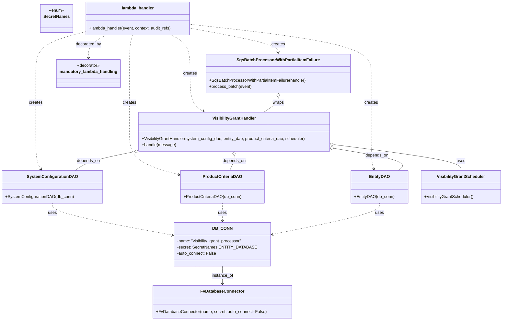

# Diagram: entity_core/entity_service/entity_listener/entity_listener_service/lambdas/visibility_grant_consumer.py


> Auto-generated by Obscura crawlers

## Diagram 1



### SVG

<svg id="container" width="1917.982421875" xmlns="http://www.w3.org/2000/svg" class="classDiagram" height="1232" viewBox="0 0 1917.982421875 1232" role="graphics-document document" aria-roledescription="class"><style>#container{font-family:"trebuchet ms",verdana,arial,sans-serif;font-size:16px;fill:#333;}@keyframes edge-animation-frame{from{stroke-dashoffset:0;}}@keyframes dash{to{stroke-dashoffset:0;}}#container .edge-animation-slow{stroke-dasharray:9,5!important;stroke-dashoffset:900;animation:dash 50s linear infinite;stroke-linecap:round;}#container .edge-animation-fast{stroke-dasharray:9,5!important;stroke-dashoffset:900;animation:dash 20s linear infinite;stroke-linecap:round;}#container .error-icon{fill:#552222;}#container .error-text{fill:#552222;stroke:#552222;}#container .edge-thickness-normal{stroke-width:1px;}#container .edge-thickness-thick{stroke-width:3.5px;}#container .edge-pattern-solid{stroke-dasharray:0;}#container .edge-thickness-invisible{stroke-width:0;fill:none;}#container .edge-pattern-dashed{stroke-dasharray:3;}#container .edge-pattern-dotted{stroke-dasharray:2;}#container .marker{fill:#333333;stroke:#333333;}#container .marker.cross{stroke:#333333;}#container svg{font-family:"trebuchet ms",verdana,arial,sans-serif;font-size:16px;}#container p{margin:0;}#container g.classGroup text{fill:#9370DB;stroke:none;font-family:"trebuchet ms",verdana,arial,sans-serif;font-size:10px;}#container g.classGroup text .title{font-weight:bolder;}#container .nodeLabel,#container .edgeLabel{color:#131300;}#container .edgeLabel .label rect{fill:#ECECFF;}#container .label text{fill:#131300;}#container .labelBkg{background:#ECECFF;}#container .edgeLabel .label span{background:#ECECFF;}#container .classTitle{font-weight:bolder;}#container .node rect,#container .node circle,#container .node ellipse,#container .node polygon,#container .node path{fill:#ECECFF;stroke:#9370DB;stroke-width:1px;}#container .divider{stroke:#9370DB;stroke-width:1;}#container g.clickable{cursor:pointer;}#container g.classGroup rect{fill:#ECECFF;stroke:#9370DB;}#container g.classGroup line{stroke:#9370DB;stroke-width:1;}#container .classLabel .box{stroke:none;stroke-width:0;fill:#ECECFF;opacity:0.5;}#container .classLabel .label{fill:#9370DB;font-size:10px;}#container .relation{stroke:#333333;stroke-width:1;fill:none;}#container .dashed-line{stroke-dasharray:3;}#container .dotted-line{stroke-dasharray:1 2;}#container #compositionStart,#container .composition{fill:#333333!important;stroke:#333333!important;stroke-width:1;}#container #compositionEnd,#container .composition{fill:#333333!important;stroke:#333333!important;stroke-width:1;}#container #dependencyStart,#container .dependency{fill:#333333!important;stroke:#333333!important;stroke-width:1;}#container #dependencyStart,#container .dependency{fill:#333333!important;stroke:#333333!important;stroke-width:1;}#container #extensionStart,#container .extension{fill:transparent!important;stroke:#333333!important;stroke-width:1;}#container #extensionEnd,#container .extension{fill:transparent!important;stroke:#333333!important;stroke-width:1;}#container #aggregationStart,#container .aggregation{fill:transparent!important;stroke:#333333!important;stroke-width:1;}#container #aggregationEnd,#container .aggregation{fill:transparent!important;stroke:#333333!important;stroke-width:1;}#container #lollipopStart,#container .lollipop{fill:#ECECFF!important;stroke:#333333!important;stroke-width:1;}#container #lollipopEnd,#container .lollipop{fill:#ECECFF!important;stroke:#333333!important;stroke-width:1;}#container .edgeTerminals{font-size:11px;line-height:initial;}#container .classTitleText{text-anchor:middle;font-size:18px;fill:#333;}#container .label-icon{display:inline-block;height:1em;overflow:visible;vertical-align:-0.125em;}#container .node .label-icon path{fill:currentColor;stroke:revert;stroke-width:revert;}#container :root{--mermaid-font-family:"trebuchet ms",verdana,arial,sans-serif;}</style><g><defs><marker id="container_class-aggregationStart" class="marker aggregation class" refX="18" refY="7" markerWidth="190" markerHeight="240" orient="auto"><path d="M 18,7 L9,13 L1,7 L9,1 Z"></path></marker></defs><defs><marker id="container_class-aggregationEnd" class="marker aggregation class" refX="1" refY="7" markerWidth="20" markerHeight="28" orient="auto"><path d="M 18,7 L9,13 L1,7 L9,1 Z"></path></marker></defs><defs><marker id="container_class-extensionStart" class="marker extension class" refX="18" refY="7" markerWidth="190" markerHeight="240" orient="auto"><path d="M 1,7 L18,13 V 1 Z"></path></marker></defs><defs><marker id="container_class-extensionEnd" class="marker extension class" refX="1" refY="7" markerWidth="20" markerHeight="28" orient="auto"><path d="M 1,1 V 13 L18,7 Z"></path></marker></defs><defs><marker id="container_class-compositionStart" class="marker composition class" refX="18" refY="7" markerWidth="190" markerHeight="240" orient="auto"><path d="M 18,7 L9,13 L1,7 L9,1 Z"></path></marker></defs><defs><marker id="container_class-compositionEnd" class="marker composition class" refX="1" refY="7" markerWidth="20" markerHeight="28" orient="auto"><path d="M 18,7 L9,13 L1,7 L9,1 Z"></path></marker></defs><defs><marker id="container_class-dependencyStart" class="marker dependency class" refX="6" refY="7" markerWidth="190" markerHeight="240" orient="auto"><path d="M 5,7 L9,13 L1,7 L9,1 Z"></path></marker></defs><defs><marker id="container_class-dependencyEnd" class="marker dependency class" refX="13" refY="7" markerWidth="20" markerHeight="28" orient="auto"><path d="M 18,7 L9,13 L14,7 L9,1 Z"></path></marker></defs><defs><marker id="container_class-lollipopStart" class="marker lollipop class" refX="13" refY="7" markerWidth="190" markerHeight="240" orient="auto"><circle stroke="black" fill="transparent" cx="7" cy="7" r="6"></circle></marker></defs><defs><marker id="container_class-lollipopEnd" class="marker lollipop class" refX="1" refY="7" markerWidth="190" markerHeight="240" orient="auto"><circle stroke="black" fill="transparent" cx="7" cy="7" r="6"></circle></marker></defs><g class="root"><g class="clusters"></g><g class="edgePaths"><path d="M842.664,1024L842.664,1030.167C842.664,1036.333,842.664,1048.667,842.664,1060C842.664,1071.333,842.664,1081.667,842.664,1086.833L842.664,1092" id="id_DB_CONN_FvDatabaseConnector_1" class="edge-thickness-normal edge-pattern-solid relation" style=";;;" data-edge="true" data-et="edge" data-id="id_DB_CONN_FvDatabaseConnector_1" data-points="W3sieCI6ODQyLjY2NDA2MjUsInkiOjEwMjR9LHsieCI6ODQyLjY2NDA2MjUsInkiOjEwNjF9LHsieCI6ODQyLjY2NDA2MjUsInkiOjEwOTh9XQ==" marker-end="url(#container_class-dependencyEnd)"></path><path d="M1448.201,782L1448.201,788.167C1448.201,794.333,1448.201,806.667,1376.887,827.084C1305.572,847.501,1162.943,876.001,1091.628,890.251L1020.313,904.502" id="id_EntityDAO_DB_CONN_2" class="edge-thickness-normal edge-pattern-dashed relation" style=";;;" data-edge="true" data-et="edge" data-id="id_EntityDAO_DB_CONN_2" data-points="W3sieCI6MTQ0OC4yMDExNzE4NzUsInkiOjc4Mn0seyJ4IjoxNDQ4LjIwMTE3MTg3NSwieSI6ODE5fSx7IngiOjEwMTQuNDI5Njg3NSwieSI6OTA1LjY3NzM0NjEwNjA4NDh9XQ==" marker-end="url(#container_class-dependencyEnd)"></path><path d="M842.664,782L842.664,788.167C842.664,794.333,842.664,806.667,842.664,818C842.664,829.333,842.664,839.667,842.664,844.833L842.664,850" id="id_ProductCriteriaDAO_DB_CONN_3" class="edge-thickness-normal edge-pattern-dashed relation" style=";;;" data-edge="true" data-et="edge" data-id="id_ProductCriteriaDAO_DB_CONN_3" data-points="W3sieCI6ODQyLjY2NDA2MjUsInkiOjc4Mn0seyJ4Ijo4NDIuNjY0MDYyNSwieSI6ODE5fSx7IngiOjg0Mi42NjQwNjI1LCJ5Ijo4NTZ9XQ==" marker-end="url(#container_class-dependencyEnd)"></path><path d="M195.227,782L195.227,788.167C195.227,794.333,195.227,806.667,273.522,827.466C351.818,848.265,508.409,877.531,586.705,892.164L665.001,906.796" id="id_SystemConfigurationDAO_DB_CONN_4" class="edge-thickness-normal edge-pattern-dashed relation" style=";;;" data-edge="true" data-et="edge" data-id="id_SystemConfigurationDAO_DB_CONN_4" data-points="W3sieCI6MTk1LjIyNjU2MjUsInkiOjc4Mn0seyJ4IjoxOTUuMjI2NTYyNSwieSI6ODE5fSx7IngiOjY3MC44OTg0Mzc1LCJ5Ijo5MDcuODk4NjE0NzMxMTUxNn1d" marker-end="url(#container_class-dependencyEnd)"></path><path d="M500.479,584.627L471.727,590.355C442.975,596.084,385.471,607.542,348.533,619.438C311.596,631.333,295.224,643.667,287.039,649.833L278.853,656" id="id_VisibilityGrantHandler_SystemConfigurationDAO_5" class="edge-thickness-normal edge-pattern-solid relation" style=";;;" data-edge="true" data-et="edge" data-id="id_VisibilityGrantHandler_SystemConfigurationDAO_5" data-points="W3sieCI6NTE3LjM5NjQ4NDM3NSwieSI6NTgxLjI1NTcwODkwNDkxODd9LHsieCI6MzI3Ljk2Njc5Njg3NSwieSI6NjE5fSx7IngiOjI3OC44NTI5MTAxNTYyNSwieSI6NjU2fV0=" marker-start="url(#container_class-aggregationStart)"></path><path d="M1279.756,571.937L1326.827,579.78C1373.899,587.624,1468.042,603.312,1508.085,617.323C1548.127,631.333,1534.069,643.667,1527.04,649.833L1520.011,656" id="id_VisibilityGrantHandler_EntityDAO_6" class="edge-thickness-normal edge-pattern-solid relation" style=";;;" data-edge="true" data-et="edge" data-id="id_VisibilityGrantHandler_EntityDAO_6" data-points="W3sieCI6MTI2Mi43NDAyMzQzNzUsInkiOjU2OS4xMDExNDk1ODU2MTQ1fSx7IngiOjE1NjIuMTg1NTQ2ODc1LCJ5Ijo2MTl9LHsieCI6MTUyMC4wMTEzMjgxMjUsInkiOjY1Nn1d" marker-start="url(#container_class-aggregationStart)"></path><path d="M890.068,599.25L890.068,602.542C890.068,605.833,890.068,612.417,887.145,621.875C884.222,631.333,878.375,643.667,875.452,649.833L872.529,656" id="id_VisibilityGrantHandler_ProductCriteriaDAO_7" class="edge-thickness-normal edge-pattern-solid relation" style=";;;" data-edge="true" data-et="edge" data-id="id_VisibilityGrantHandler_ProductCriteriaDAO_7" data-points="W3sieCI6ODkwLjA2ODM1OTM3NSwieSI6NTgyfSx7IngiOjg5MC4wNjgzNTkzNzUsInkiOjYxOX0seyJ4Ijo4NzIuNTI4NzY5NTMxMjUsInkiOjY1Nn1d" marker-start="url(#container_class-aggregationStart)"></path><path d="M1279.848,557.337L1359.429,567.614C1439.01,577.891,1598.172,598.446,1677.753,614.889C1757.334,631.333,1757.334,643.667,1757.334,649.833L1757.334,656" id="id_VisibilityGrantHandler_VisibilityGrantScheduler_8" class="edge-thickness-normal edge-pattern-solid relation" style=";;;" data-edge="true" data-et="edge" data-id="id_VisibilityGrantHandler_VisibilityGrantScheduler_8" data-points="W3sieCI6MTI2Mi43NDAyMzQzNzUsInkiOjU1NS4xMjc0MTE5NDQ4Njk5fSx7IngiOjE3NTcuMzMzOTg0Mzc1LCJ5Ijo2MTl9LHsieCI6MTc1Ny4zMzM5ODQzNzUsInkiOjY1Nn1d" marker-start="url(#container_class-aggregationStart)"></path><path d="M1057.592,375.25L1057.592,378.542C1057.592,381.833,1057.592,388.417,1048.368,397.875C1039.144,407.333,1020.697,419.667,1011.473,425.833L1002.249,432" id="id_SqsBatchProcessorWithPartialItemFailure_VisibilityGrantHandler_9" class="edge-thickness-normal edge-pattern-solid relation" style=";;;" data-edge="true" data-et="edge" data-id="id_SqsBatchProcessorWithPartialItemFailure_VisibilityGrantHandler_9" data-points="W3sieCI6MTA1Ny41OTE3OTY4NzUsInkiOjM1OH0seyJ4IjoxMDU3LjU5MTc5Njg3NSwieSI6Mzk1fSx7IngiOjEwMDIuMjQ5MjMyNzAwODkyOSwieSI6NDMyfV0=" marker-start="url(#container_class-aggregationStart)"></path><path d="M721.541,93.608L837.262,106.507C952.982,119.406,1184.424,145.203,1300.145,176.768C1415.865,208.333,1415.865,245.667,1415.865,283C1415.865,320.333,1415.865,357.667,1415.865,395C1415.865,432.333,1415.865,469.667,1415.865,507C1415.865,544.333,1415.865,581.667,1417.552,605.549C1419.238,629.43,1422.611,639.861,1424.297,645.076L1425.983,650.291" id="id_lambda_handler_EntityDAO_10" class="edge-thickness-normal edge-pattern-dashed relation" style=";;;" data-edge="true" data-et="edge" data-id="id_lambda_handler_EntityDAO_10" data-points="W3sieCI6NzIxLjU0MTAxNTYyNSwieSI6OTMuNjA4MzI4Mzk4NzU5OTd9LHsieCI6MTQxNS44NjUyMzQzNzUsInkiOjE3MX0seyJ4IjoxNDE1Ljg2NTIzNDM3NSwieSI6MjgzfSx7IngiOjE0MTUuODY1MjM0Mzc1LCJ5IjozOTV9LHsieCI6MTQxNS44NjUyMzQzNzUsInkiOjUwN30seyJ4IjoxNDE1Ljg2NTIzNDM3NSwieSI6NjE5fSx7IngiOjE0MjcuODI5NTMxMjUsInkiOjY1Nn1d" marker-end="url(#container_class-dependencyEnd)"></path><path d="M495.832,134L493.593,140.167C491.354,146.333,486.875,158.667,484.636,183.5C482.396,208.333,482.396,245.667,482.396,283C482.396,320.333,482.396,357.667,482.396,395C482.396,432.333,482.396,469.667,482.396,507C482.396,544.333,482.396,581.667,515.211,609.442C548.026,637.217,613.655,655.434,646.47,664.542L679.285,673.651" id="id_lambda_handler_ProductCriteriaDAO_11" class="edge-thickness-normal edge-pattern-dashed relation" style=";;;" data-edge="true" data-et="edge" data-id="id_lambda_handler_ProductCriteriaDAO_11" data-points="W3sieCI6NDk1LjgzMjEwOTM3NSwieSI6MTM0fSx7IngiOjQ4Mi4zOTY0ODQzNzUsInkiOjE3MX0seyJ4Ijo0ODIuMzk2NDg0Mzc1LCJ5IjoyODN9LHsieCI6NDgyLjM5NjQ4NDM3NSwieSI6Mzk1fSx7IngiOjQ4Mi4zOTY0ODQzNzUsInkiOjUwN30seyJ4Ijo0ODIuMzk2NDg0Mzc1LCJ5Ijo2MTl9LHsieCI6Njg1LjA2NjQwNjI1LCJ5Ijo2NzUuMjU1Mzg3NDM0NDY5OX1d" marker-end="url(#container_class-dependencyEnd)"></path><path d="M315.877,123.256L284.99,131.213C254.103,139.17,192.329,155.085,161.442,181.709C130.555,208.333,130.555,245.667,130.555,283C130.555,320.333,130.555,357.667,130.555,395C130.555,432.333,130.555,469.667,130.555,507C130.555,544.333,130.555,581.667,134,605.66C137.445,629.654,144.335,640.308,147.78,645.635L151.225,650.962" id="id_lambda_handler_SystemConfigurationDAO_12" class="edge-thickness-normal edge-pattern-dashed relation" style=";;;" data-edge="true" data-et="edge" data-id="id_lambda_handler_SystemConfigurationDAO_12" data-points="W3sieCI6MzE1Ljg3Njk1MzEyNSwieSI6MTIzLjI1NTUxNjEzOTU4Mjg1fSx7IngiOjEzMC41NTQ2ODc1LCJ5IjoxNzF9LHsieCI6MTMwLjU1NDY4NzUsInkiOjI4M30seyJ4IjoxMzAuNTU0Njg3NSwieSI6Mzk1fSx7IngiOjEzMC41NTQ2ODc1LCJ5Ijo1MDd9LHsieCI6MTMwLjU1NDY4NzUsInkiOjYxOX0seyJ4IjoxNTQuNDgzMjgxMjUsInkiOjY1Nn1d" marker-end="url(#container_class-dependencyEnd)"></path><path d="M647.126,134L659.696,140.167C672.265,146.333,697.405,158.667,709.975,183.5C722.545,208.333,722.545,245.667,722.545,283C722.545,320.333,722.545,357.667,730.937,381.944C739.33,406.222,756.115,417.444,764.507,423.054L772.9,428.665" id="id_lambda_handler_VisibilityGrantHandler_13" class="edge-thickness-normal edge-pattern-dashed relation" style=";;;" data-edge="true" data-et="edge" data-id="id_lambda_handler_VisibilityGrantHandler_13" data-points="W3sieCI6NjQ3LjEyNTYyNSwieSI6MTM0fSx7IngiOjcyMi41NDQ5MjE4NzUsInkiOjE3MX0seyJ4Ijo3MjIuNTQ0OTIxODc1LCJ5IjoyODN9LHsieCI6NzIyLjU0NDkyMTg3NSwieSI6Mzk1fSx7IngiOjc3Ny44ODc0ODYwNDkxMDcxLCJ5Ijo0MzJ9XQ==" marker-end="url(#container_class-dependencyEnd)"></path><path d="M721.541,108.639L777.549,119.033C833.558,129.426,945.575,150.213,1001.583,165.773C1057.592,181.333,1057.592,191.667,1057.592,196.833L1057.592,202" id="id_lambda_handler_SqsBatchProcessorWithPartialItemFailure_14" class="edge-thickness-normal edge-pattern-dashed relation" style=";;;" data-edge="true" data-et="edge" data-id="id_lambda_handler_SqsBatchProcessorWithPartialItemFailure_14" data-points="W3sieCI6NzIxLjU0MTAxNTYyNSwieSI6MTA4LjYzOTM1ODA0Njg4NTE5fSx7IngiOjEwNTcuNTkxNzk2ODc1LCJ5IjoxNzF9LHsieCI6MTA1Ny41OTE3OTY4NzUsInkiOjIwOH1d" marker-end="url(#container_class-dependencyEnd)"></path><path d="M398.541,134L386.779,140.167C375.017,146.333,351.492,158.667,339.729,173.5C327.967,188.333,327.967,205.667,327.967,214.333L327.967,223" id="id_lambda_handler_mandatory_lambda_handling_15" class="edge-thickness-normal edge-pattern-dashed relation" style=";;;" data-edge="true" data-et="edge" data-id="id_lambda_handler_mandatory_lambda_handling_15" data-points="W3sieCI6Mzk4LjU0MTQwNjI1LCJ5IjoxMzR9LHsieCI6MzI3Ljk2Njc5Njg3NSwieSI6MTcxfSx7IngiOjMyNy45NjY3OTY4NzUsInkiOjIyOX1d" marker-end="url(#container_class-dependencyEnd)"></path></g><g class="edgeLabels"><g class="edgeLabel" transform="translate(842.6640625, 1061)"><g class="label" data-id="id_DB_CONN_FvDatabaseConnector_1" transform="translate(-41.7734375, -12)"><foreignObject width="83.546875" height="24"><div xmlns="http://www.w3.org/1999/xhtml" class="labelBkg" style="display: table-cell; white-space: nowrap; line-height: 1.5; max-width: 200px; text-align: center;"><span class="edgeLabel"><p>instance_of</p></span></div></foreignObject></g></g><g class="edgeLabel" transform="translate(1448.201171875, 819)"><g class="label" data-id="id_EntityDAO_DB_CONN_2" transform="translate(-16.4921875, -12)"><foreignObject width="32.984375" height="24"><div xmlns="http://www.w3.org/1999/xhtml" class="labelBkg" style="display: table-cell; white-space: nowrap; line-height: 1.5; max-width: 200px; text-align: center;"><span class="edgeLabel"><p>uses</p></span></div></foreignObject></g></g><g class="edgeLabel" transform="translate(842.6640625, 819)"><g class="label" data-id="id_ProductCriteriaDAO_DB_CONN_3" transform="translate(-16.4921875, -12)"><foreignObject width="32.984375" height="24"><div xmlns="http://www.w3.org/1999/xhtml" class="labelBkg" style="display: table-cell; white-space: nowrap; line-height: 1.5; max-width: 200px; text-align: center;"><span class="edgeLabel"><p>uses</p></span></div></foreignObject></g></g><g class="edgeLabel" transform="translate(195.2265625, 819)"><g class="label" data-id="id_SystemConfigurationDAO_DB_CONN_4" transform="translate(-16.4921875, -12)"><foreignObject width="32.984375" height="24"><div xmlns="http://www.w3.org/1999/xhtml" class="labelBkg" style="display: table-cell; white-space: nowrap; line-height: 1.5; max-width: 200px; text-align: center;"><span class="edgeLabel"><p>uses</p></span></div></foreignObject></g></g><g class="edgeLabel" transform="translate(327.966796875, 619)"><g class="label" data-id="id_VisibilityGrantHandler_SystemConfigurationDAO_5" transform="translate(-44.671875, -12)"><foreignObject width="89.34375" height="24"><div xmlns="http://www.w3.org/1999/xhtml" class="labelBkg" style="display: table-cell; white-space: nowrap; line-height: 1.5; max-width: 200px; text-align: center;"><span class="edgeLabel"><p>depends_on</p></span></div></foreignObject></g></g><g class="edgeLabel" transform="translate(1440.13337, 598.66152)"><g class="label" data-id="id_VisibilityGrantHandler_EntityDAO_6" transform="translate(-44.671875, -12)"><foreignObject width="89.34375" height="24"><div xmlns="http://www.w3.org/1999/xhtml" class="labelBkg" style="display: table-cell; white-space: nowrap; line-height: 1.5; max-width: 200px; text-align: center;"><span class="edgeLabel"><p>depends_on</p></span></div></foreignObject></g></g><g class="edgeLabel" transform="translate(890.068359375, 619)"><g class="label" data-id="id_VisibilityGrantHandler_ProductCriteriaDAO_7" transform="translate(-44.671875, -12)"><foreignObject width="89.34375" height="24"><div xmlns="http://www.w3.org/1999/xhtml" class="labelBkg" style="display: table-cell; white-space: nowrap; line-height: 1.5; max-width: 200px; text-align: center;"><span class="edgeLabel"><p>depends_on</p></span></div></foreignObject></g></g><g class="edgeLabel" transform="translate(1757.333984375, 619)"><g class="label" data-id="id_VisibilityGrantHandler_VisibilityGrantScheduler_8" transform="translate(-16.4921875, -12)"><foreignObject width="32.984375" height="24"><div xmlns="http://www.w3.org/1999/xhtml" class="labelBkg" style="display: table-cell; white-space: nowrap; line-height: 1.5; max-width: 200px; text-align: center;"><span class="edgeLabel"><p>uses</p></span></div></foreignObject></g></g><g class="edgeLabel" transform="translate(1057.591796875, 395)"><g class="label" data-id="id_SqsBatchProcessorWithPartialItemFailure_VisibilityGrantHandler_9" transform="translate(-21.390625, -12)"><foreignObject width="42.78125" height="24"><div xmlns="http://www.w3.org/1999/xhtml" class="labelBkg" style="display: table-cell; white-space: nowrap; line-height: 1.5; max-width: 200px; text-align: center;"><span class="edgeLabel"><p>wraps</p></span></div></foreignObject></g></g><g class="edgeLabel" transform="translate(1415.865234375, 395)"><g class="label" data-id="id_lambda_handler_EntityDAO_10" transform="translate(-26.171875, -12)"><foreignObject width="52.34375" height="24"><div xmlns="http://www.w3.org/1999/xhtml" class="labelBkg" style="display: table-cell; white-space: nowrap; line-height: 1.5; max-width: 200px; text-align: center;"><span class="edgeLabel"><p>creates</p></span></div></foreignObject></g></g><g class="edgeLabel" transform="translate(482.396484375, 395)"><g class="label" data-id="id_lambda_handler_ProductCriteriaDAO_11" transform="translate(-26.171875, -12)"><foreignObject width="52.34375" height="24"><div xmlns="http://www.w3.org/1999/xhtml" class="labelBkg" style="display: table-cell; white-space: nowrap; line-height: 1.5; max-width: 200px; text-align: center;"><span class="edgeLabel"><p>creates</p></span></div></foreignObject></g></g><g class="edgeLabel" transform="translate(130.5546875, 395)"><g class="label" data-id="id_lambda_handler_SystemConfigurationDAO_12" transform="translate(-26.171875, -12)"><foreignObject width="52.34375" height="24"><div xmlns="http://www.w3.org/1999/xhtml" class="labelBkg" style="display: table-cell; white-space: nowrap; line-height: 1.5; max-width: 200px; text-align: center;"><span class="edgeLabel"><p>creates</p></span></div></foreignObject></g></g><g class="edgeLabel" transform="translate(722.544921875, 283)"><g class="label" data-id="id_lambda_handler_VisibilityGrantHandler_13" transform="translate(-26.171875, -12)"><foreignObject width="52.34375" height="24"><div xmlns="http://www.w3.org/1999/xhtml" class="labelBkg" style="display: table-cell; white-space: nowrap; line-height: 1.5; max-width: 200px; text-align: center;"><span class="edgeLabel"><p>creates</p></span></div></foreignObject></g></g><g class="edgeLabel" transform="translate(1057.591796875, 171)"><g class="label" data-id="id_lambda_handler_SqsBatchProcessorWithPartialItemFailure_14" transform="translate(-26.171875, -12)"><foreignObject width="52.34375" height="24"><div xmlns="http://www.w3.org/1999/xhtml" class="labelBkg" style="display: table-cell; white-space: nowrap; line-height: 1.5; max-width: 200px; text-align: center;"><span class="edgeLabel"><p>creates</p></span></div></foreignObject></g></g><g class="edgeLabel" transform="translate(327.966796875, 171)"><g class="label" data-id="id_lambda_handler_mandatory_lambda_handling_15" transform="translate(-49.375, -12)"><foreignObject width="98.75" height="24"><div xmlns="http://www.w3.org/1999/xhtml" class="labelBkg" style="display: table-cell; white-space: nowrap; line-height: 1.5; max-width: 200px; text-align: center;"><span class="edgeLabel"><p>decorated_by</p></span></div></foreignObject></g></g></g><g class="nodes"><g class="node default" id="classId-FvDatabaseConnector-0" transform="translate(842.6640625, 1161)"><g class="basic label-container"><path d="M-260.68359375 -63 L260.68359375 -63 L260.68359375 63 L-260.68359375 63" stroke="none" stroke-width="0" fill="#ECECFF" style=""></path><path d="M-260.68359375 -63 C-154.40713073516454 -63, -48.130667720329086 -63, 260.68359375 -63 M-260.68359375 -63 C-144.61115526820777 -63, -28.538716786415563 -63, 260.68359375 -63 M260.68359375 -63 C260.68359375 -25.722306451479696, 260.68359375 11.555387097040608, 260.68359375 63 M260.68359375 -63 C260.68359375 -22.20675320189131, 260.68359375 18.58649359621738, 260.68359375 63 M260.68359375 63 C57.12392531752036 63, -146.43574311495928 63, -260.68359375 63 M260.68359375 63 C82.6776561723959 63, -95.3282814052082 63, -260.68359375 63 M-260.68359375 63 C-260.68359375 29.8197887992634, -260.68359375 -3.360422401473201, -260.68359375 -63 M-260.68359375 63 C-260.68359375 35.82864124322179, -260.68359375 8.657282486443577, -260.68359375 -63" stroke="#9370DB" stroke-width="1.3" fill="none" stroke-dasharray="0 0" style=""></path></g><g class="annotation-group text" transform="translate(0, -39)"></g><g class="label-group text" transform="translate(-79.3046875, -39)"><g class="label" style="font-weight: bolder" transform="translate(0,-12)"><foreignObject width="158.609375" height="24"><div xmlns="http://www.w3.org/1999/xhtml" style="display: table-cell; white-space: nowrap; line-height: 1.5; max-width: 207px; text-align: center;"><span class="nodeLabel markdown-node-label" style=""><p>FvDatabaseConnector</p></span></div></foreignObject></g></g><g class="members-group text" transform="translate(-248.68359375, 9)"></g><g class="methods-group text" transform="translate(-248.68359375, 39)"><g class="label" style="" transform="translate(0,-12)"><foreignObject width="418.0625" height="24"><div xmlns="http://www.w3.org/1999/xhtml" style="display: table-cell; white-space: nowrap; line-height: 1.5; max-width: 475px; text-align: center;"><span class="nodeLabel markdown-node-label" style=""><p>+FvDatabaseConnector(name, secret, auto_connect=False)</p></span></div></foreignObject></g></g><g class="divider" style=""><path d="M-260.68359375 -15 C-97.792359783204 -15, 65.09887418359199 -15, 260.68359375 -15 M-260.68359375 -15 C-90.4198158248488 -15, 79.8439621003024 -15, 260.68359375 -15" stroke="#9370DB" stroke-width="1.3" fill="none" stroke-dasharray="0 0" style=""></path></g><g class="divider" style=""><path d="M-260.68359375 9 C-82.48377660956945 9, 95.71604053086111 9, 260.68359375 9 M-260.68359375 9 C-134.56122356122466 9, -8.438853372449302 9, 260.68359375 9" stroke="#9370DB" stroke-width="1.3" fill="none" stroke-dasharray="0 0" style=""></path></g></g><g class="node default" id="classId-DB_CONN-1" transform="translate(842.6640625, 940)"><g class="basic label-container"><path d="M-171.765625 -84 L171.765625 -84 L171.765625 84 L-171.765625 84" stroke="none" stroke-width="0" fill="#ECECFF" style=""></path><path d="M-171.765625 -84 C-69.39482966984971 -84, 32.975965660300574 -84, 171.765625 -84 M-171.765625 -84 C-57.447098330660125 -84, 56.87142833867975 -84, 171.765625 -84 M171.765625 -84 C171.765625 -17.364092883364947, 171.765625 49.271814233270106, 171.765625 84 M171.765625 -84 C171.765625 -35.11442385858116, 171.765625 13.771152282837676, 171.765625 84 M171.765625 84 C77.34584368861822 84, -17.073937622763566 84, -171.765625 84 M171.765625 84 C87.80860602515395 84, 3.8515870503078986 84, -171.765625 84 M-171.765625 84 C-171.765625 45.44809110371807, -171.765625 6.896182207436141, -171.765625 -84 M-171.765625 84 C-171.765625 24.28760845825891, -171.765625 -35.42478308348218, -171.765625 -84" stroke="#9370DB" stroke-width="1.3" fill="none" stroke-dasharray="0 0" style=""></path></g><g class="annotation-group text" transform="translate(0, -60)"></g><g class="label-group text" transform="translate(-34.40625, -60)"><g class="label" style="font-weight: bolder" transform="translate(0,-12)"><foreignObject width="68.8125" height="24"><div xmlns="http://www.w3.org/1999/xhtml" style="display: table-cell; white-space: nowrap; line-height: 1.5; max-width: 119px; text-align: center;"><span class="nodeLabel markdown-node-label" style=""><p>DB_CONN</p></span></div></foreignObject></g></g><g class="members-group text" transform="translate(-159.765625, -12)"><g class="label" style="" transform="translate(0,-12)"><foreignObject width="254.03125" height="24"><div xmlns="http://www.w3.org/1999/xhtml" style="display: table-cell; white-space: nowrap; line-height: 1.5; max-width: 311px; text-align: center;"><span class="nodeLabel markdown-node-label" style=""><p>-name: "visibility_grant_processor"</p></span></div></foreignObject></g><g class="label" style="" transform="translate(0,12)"><foreignObject width="285.125" height="24"><div xmlns="http://www.w3.org/1999/xhtml" style="display: table-cell; white-space: nowrap; line-height: 1.5; max-width: 342px; text-align: center;"><span class="nodeLabel markdown-node-label" style=""><p>-secret: SecretNames.ENTITY_DATABASE</p></span></div></foreignObject></g><g class="label" style="" transform="translate(0,36)"><foreignObject width="148.828125" height="24"><div xmlns="http://www.w3.org/1999/xhtml" style="display: table-cell; white-space: nowrap; line-height: 1.5; max-width: 206px; text-align: center;"><span class="nodeLabel markdown-node-label" style=""><p>-auto_connect: False</p></span></div></foreignObject></g></g><g class="methods-group text" transform="translate(-159.765625, 84)"></g><g class="divider" style=""><path d="M-171.765625 -36 C-91.14216424598919 -36, -10.518703491978386 -36, 171.765625 -36 M-171.765625 -36 C-49.870621333378566 -36, 72.02438233324287 -36, 171.765625 -36" stroke="#9370DB" stroke-width="1.3" fill="none" stroke-dasharray="0 0" style=""></path></g><g class="divider" style=""><path d="M-171.765625 60 C-89.93979099410775 60, -8.113956988215506 60, 171.765625 60 M-171.765625 60 C-92.85192745543549 60, -13.938229910870973 60, 171.765625 60" stroke="#9370DB" stroke-width="1.3" fill="none" stroke-dasharray="0 0" style=""></path></g></g><g class="node default" id="classId-SecretNames-2" transform="translate(205.845703125, 71)"><g class="basic label-container"><path d="M-60.03125 -54 L60.03125 -54 L60.03125 54 L-60.03125 54" stroke="none" stroke-width="0" fill="#ECECFF" style=""></path><path d="M-60.03125 -54 C-19.88742082003772 -54, 20.256408359924563 -54, 60.03125 -54 M-60.03125 -54 C-16.86866945118804 -54, 26.29391109762392 -54, 60.03125 -54 M60.03125 -54 C60.03125 -21.422105272895415, 60.03125 11.15578945420917, 60.03125 54 M60.03125 -54 C60.03125 -12.303084550282009, 60.03125 29.393830899435983, 60.03125 54 M60.03125 54 C32.89087145748941 54, 5.750492914978821 54, -60.03125 54 M60.03125 54 C28.268143799346415 54, -3.49496240130717 54, -60.03125 54 M-60.03125 54 C-60.03125 15.147737539980923, -60.03125 -23.704524920038153, -60.03125 -54 M-60.03125 54 C-60.03125 11.071832286644927, -60.03125 -31.856335426710146, -60.03125 -54" stroke="#9370DB" stroke-width="1.3" fill="none" stroke-dasharray="0 0" style=""></path></g><g class="annotation-group text" transform="translate(-29.53125, -30)"><g class="label" style="" transform="translate(0,-12)"><foreignObject width="59.0625" height="24"><div xmlns="http://www.w3.org/1999/xhtml" style="display: table-cell; white-space: nowrap; line-height: 1.5; max-width: 109px; text-align: center;"><span class="nodeLabel markdown-node-label" style=""><p>«enum»</p></span></div></foreignObject></g></g><g class="label-group text" transform="translate(-48.03125, -6)"><g class="label" style="font-weight: bolder" transform="translate(0,-12)"><foreignObject width="96.0625" height="24"><div xmlns="http://www.w3.org/1999/xhtml" style="display: table-cell; white-space: nowrap; line-height: 1.5; max-width: 145px; text-align: center;"><span class="nodeLabel markdown-node-label" style=""><p>SecretNames</p></span></div></foreignObject></g></g><g class="members-group text" transform="translate(-48.03125, 42)"></g><g class="methods-group text" transform="translate(-48.03125, 72)"></g><g class="divider" style=""><path d="M-60.03125 18 C-22.95881777926978 18, 14.113614441460442 18, 60.03125 18 M-60.03125 18 C-31.72385109315059 18, -3.4164521863011785 18, 60.03125 18" stroke="#9370DB" stroke-width="1.3" fill="none" stroke-dasharray="0 0" style=""></path></g><g class="divider" style=""><path d="M-60.03125 36 C-26.080741824555652 36, 7.869766350888696 36, 60.03125 36 M-60.03125 36 C-13.656572531012472 36, 32.718104937975056 36, 60.03125 36" stroke="#9370DB" stroke-width="1.3" fill="none" stroke-dasharray="0 0" style=""></path></g></g><g class="node default" id="classId-EntityDAO-3" transform="translate(1448.201171875, 719)"><g class="basic label-container"><path d="M-106.484375 -63 L106.484375 -63 L106.484375 63 L-106.484375 63" stroke="none" stroke-width="0" fill="#ECECFF" style=""></path><path d="M-106.484375 -63 C-38.685287717495214 -63, 29.113799565009572 -63, 106.484375 -63 M-106.484375 -63 C-57.59957510551903 -63, -8.71477521103806 -63, 106.484375 -63 M106.484375 -63 C106.484375 -22.005337148419798, 106.484375 18.989325703160404, 106.484375 63 M106.484375 -63 C106.484375 -21.13007577321381, 106.484375 20.739848453572378, 106.484375 63 M106.484375 63 C60.89525022748736 63, 15.306125454974719 63, -106.484375 63 M106.484375 63 C28.68657724910308 63, -49.11122050179384 63, -106.484375 63 M-106.484375 63 C-106.484375 29.37827631885935, -106.484375 -4.243447362281302, -106.484375 -63 M-106.484375 63 C-106.484375 29.098471870996406, -106.484375 -4.803056258007189, -106.484375 -63" stroke="#9370DB" stroke-width="1.3" fill="none" stroke-dasharray="0 0" style=""></path></g><g class="annotation-group text" transform="translate(0, -39)"></g><g class="label-group text" transform="translate(-36.578125, -39)"><g class="label" style="font-weight: bolder" transform="translate(0,-12)"><foreignObject width="73.15625" height="24"><div xmlns="http://www.w3.org/1999/xhtml" style="display: table-cell; white-space: nowrap; line-height: 1.5; max-width: 122px; text-align: center;"><span class="nodeLabel markdown-node-label" style=""><p>EntityDAO</p></span></div></foreignObject></g></g><g class="members-group text" transform="translate(-94.484375, 9)"></g><g class="methods-group text" transform="translate(-94.484375, 39)"><g class="label" style="" transform="translate(0,-12)"><foreignObject width="152.390625" height="24"><div xmlns="http://www.w3.org/1999/xhtml" style="display: table-cell; white-space: nowrap; line-height: 1.5; max-width: 210px; text-align: center;"><span class="nodeLabel markdown-node-label" style=""><p>+EntityDAO(db_conn)</p></span></div></foreignObject></g></g><g class="divider" style=""><path d="M-106.484375 -15 C-34.79444489234048 -15, 36.89548521531904 -15, 106.484375 -15 M-106.484375 -15 C-51.929828399439245 -15, 2.62471820112151 -15, 106.484375 -15" stroke="#9370DB" stroke-width="1.3" fill="none" stroke-dasharray="0 0" style=""></path></g><g class="divider" style=""><path d="M-106.484375 9 C-58.89452871226462 9, -11.304682424529247 9, 106.484375 9 M-106.484375 9 C-62.666828810149255 9, -18.84928262029851 9, 106.484375 9" stroke="#9370DB" stroke-width="1.3" fill="none" stroke-dasharray="0 0" style=""></path></g></g><g class="node default" id="classId-ProductCriteriaDAO-4" transform="translate(842.6640625, 719)"><g class="basic label-container"><path d="M-157.59765625 -63 L157.59765625 -63 L157.59765625 63 L-157.59765625 63" stroke="none" stroke-width="0" fill="#ECECFF" style=""></path><path d="M-157.59765625 -63 C-78.81538138445819 -63, -0.03310651891638372 -63, 157.59765625 -63 M-157.59765625 -63 C-34.8792437579514 -63, 87.8391687340972 -63, 157.59765625 -63 M157.59765625 -63 C157.59765625 -15.690178165141873, 157.59765625 31.619643669716254, 157.59765625 63 M157.59765625 -63 C157.59765625 -23.15210520178207, 157.59765625 16.69578959643586, 157.59765625 63 M157.59765625 63 C44.63611701243302 63, -68.32542222513396 63, -157.59765625 63 M157.59765625 63 C44.959163470036486 63, -67.67932930992703 63, -157.59765625 63 M-157.59765625 63 C-157.59765625 15.058534662977728, -157.59765625 -32.882930674044545, -157.59765625 -63 M-157.59765625 63 C-157.59765625 14.384277352000488, -157.59765625 -34.23144529599902, -157.59765625 -63" stroke="#9370DB" stroke-width="1.3" fill="none" stroke-dasharray="0 0" style=""></path></g><g class="annotation-group text" transform="translate(0, -39)"></g><g class="label-group text" transform="translate(-71.0546875, -39)"><g class="label" style="font-weight: bolder" transform="translate(0,-12)"><foreignObject width="142.109375" height="24"><div xmlns="http://www.w3.org/1999/xhtml" style="display: table-cell; white-space: nowrap; line-height: 1.5; max-width: 190px; text-align: center;"><span class="nodeLabel markdown-node-label" style=""><p>ProductCriteriaDAO</p></span></div></foreignObject></g></g><g class="members-group text" transform="translate(-145.59765625, 9)"></g><g class="methods-group text" transform="translate(-145.59765625, 39)"><g class="label" style="" transform="translate(0,-12)"><foreignObject width="220.140625" height="24"><div xmlns="http://www.w3.org/1999/xhtml" style="display: table-cell; white-space: nowrap; line-height: 1.5; max-width: 278px; text-align: center;"><span class="nodeLabel markdown-node-label" style=""><p>+ProductCriteriaDAO(db_conn)</p></span></div></foreignObject></g></g><g class="divider" style=""><path d="M-157.59765625 -15 C-90.68763851144162 -15, -23.77762077288324 -15, 157.59765625 -15 M-157.59765625 -15 C-89.16787983144 -15, -20.738103412880008 -15, 157.59765625 -15" stroke="#9370DB" stroke-width="1.3" fill="none" stroke-dasharray="0 0" style=""></path></g><g class="divider" style=""><path d="M-157.59765625 9 C-64.20003551706108 9, 29.197585215877837 9, 157.59765625 9 M-157.59765625 9 C-54.5241333976998 9, 48.5493894546004 9, 157.59765625 9" stroke="#9370DB" stroke-width="1.3" fill="none" stroke-dasharray="0 0" style=""></path></g></g><g class="node default" id="classId-SystemConfigurationDAO-5" transform="translate(195.2265625, 719)"><g class="basic label-container"><path d="M-187.2265625 -63 L187.2265625 -63 L187.2265625 63 L-187.2265625 63" stroke="none" stroke-width="0" fill="#ECECFF" style=""></path><path d="M-187.2265625 -63 C-97.62663914249997 -63, -8.026715784999936 -63, 187.2265625 -63 M-187.2265625 -63 C-96.54981281626723 -63, -5.873063132534469 -63, 187.2265625 -63 M187.2265625 -63 C187.2265625 -24.4278944818469, 187.2265625 14.144211036306203, 187.2265625 63 M187.2265625 -63 C187.2265625 -23.907274119863864, 187.2265625 15.185451760272272, 187.2265625 63 M187.2265625 63 C107.67723631998444 63, 28.12791013996889 63, -187.2265625 63 M187.2265625 63 C42.01403118477734 63, -103.19850013044532 63, -187.2265625 63 M-187.2265625 63 C-187.2265625 18.30603499211373, -187.2265625 -26.38793001577254, -187.2265625 -63 M-187.2265625 63 C-187.2265625 17.430267328663703, -187.2265625 -28.139465342672594, -187.2265625 -63" stroke="#9370DB" stroke-width="1.3" fill="none" stroke-dasharray="0 0" style=""></path></g><g class="annotation-group text" transform="translate(0, -39)"></g><g class="label-group text" transform="translate(-91.21875, -39)"><g class="label" style="font-weight: bolder" transform="translate(0,-12)"><foreignObject width="182.4375" height="24"><div xmlns="http://www.w3.org/1999/xhtml" style="display: table-cell; white-space: nowrap; line-height: 1.5; max-width: 229px; text-align: center;"><span class="nodeLabel markdown-node-label" style=""><p>SystemConfigurationDAO</p></span></div></foreignObject></g></g><g class="members-group text" transform="translate(-175.2265625, 9)"></g><g class="methods-group text" transform="translate(-175.2265625, 39)"><g class="label" style="" transform="translate(0,-12)"><foreignObject width="259.234375" height="24"><div xmlns="http://www.w3.org/1999/xhtml" style="display: table-cell; white-space: nowrap; line-height: 1.5; max-width: 317px; text-align: center;"><span class="nodeLabel markdown-node-label" style=""><p>+SystemConfigurationDAO(db_conn)</p></span></div></foreignObject></g></g><g class="divider" style=""><path d="M-187.2265625 -15 C-44.09846965026398 -15, 99.02962319947204 -15, 187.2265625 -15 M-187.2265625 -15 C-72.90435478948659 -15, 41.41785292102682 -15, 187.2265625 -15" stroke="#9370DB" stroke-width="1.3" fill="none" stroke-dasharray="0 0" style=""></path></g><g class="divider" style=""><path d="M-187.2265625 9 C-39.3834118413759 9, 108.4597388172482 9, 187.2265625 9 M-187.2265625 9 C-69.21877292297215 9, 48.7890166540557 9, 187.2265625 9" stroke="#9370DB" stroke-width="1.3" fill="none" stroke-dasharray="0 0" style=""></path></g></g><g class="node default" id="classId-VisibilityGrantHandler-6" transform="translate(890.068359375, 507)"><g class="basic label-container"><path d="M-372.671875 -75 L372.671875 -75 L372.671875 75 L-372.671875 75" stroke="none" stroke-width="0" fill="#ECECFF" style=""></path><path d="M-372.671875 -75 C-82.6906442096195 -75, 207.290586580761 -75, 372.671875 -75 M-372.671875 -75 C-138.39688971569512 -75, 95.87809556860975 -75, 372.671875 -75 M372.671875 -75 C372.671875 -21.549935871186, 372.671875 31.900128257627998, 372.671875 75 M372.671875 -75 C372.671875 -30.088024576278585, 372.671875 14.82395084744283, 372.671875 75 M372.671875 75 C95.21018058940439 75, -182.25151382119122 75, -372.671875 75 M372.671875 75 C161.17566315263278 75, -50.32054869473444 75, -372.671875 75 M-372.671875 75 C-372.671875 23.42262758007346, -372.671875 -28.15474483985308, -372.671875 -75 M-372.671875 75 C-372.671875 24.171205427377878, -372.671875 -26.657589145244245, -372.671875 -75" stroke="#9370DB" stroke-width="1.3" fill="none" stroke-dasharray="0 0" style=""></path></g><g class="annotation-group text" transform="translate(0, -51)"></g><g class="label-group text" transform="translate(-81.0625, -51)"><g class="label" style="font-weight: bolder" transform="translate(0,-12)"><foreignObject width="162.125" height="24"><div xmlns="http://www.w3.org/1999/xhtml" style="display: table-cell; white-space: nowrap; line-height: 1.5; max-width: 211px; text-align: center;"><span class="nodeLabel markdown-node-label" style=""><p>VisibilityGrantHandler</p></span></div></foreignObject></g></g><g class="members-group text" transform="translate(-360.671875, -3)"></g><g class="methods-group text" transform="translate(-360.671875, 27)"><g class="label" style="" transform="translate(0,-12)"><foreignObject width="640.28125" height="24"><div xmlns="http://www.w3.org/1999/xhtml" style="display: table-cell; white-space: nowrap; line-height: 1.5; max-width: 698px; text-align: center;"><span class="nodeLabel markdown-node-label" style=""><p>+VisibilityGrantHandler(system_config_dao, entity_dao, product_criteria_dao, scheduler)</p></span></div></foreignObject></g><g class="label" style="" transform="translate(0,12)"><foreignObject width="131.09375" height="24"><div xmlns="http://www.w3.org/1999/xhtml" style="display: table-cell; white-space: nowrap; line-height: 1.5; max-width: 188px; text-align: center;"><span class="nodeLabel markdown-node-label" style=""><p>+handle(message)</p></span></div></foreignObject></g></g><g class="divider" style=""><path d="M-372.671875 -27 C-222.65107781506416 -27, -72.63028063012831 -27, 372.671875 -27 M-372.671875 -27 C-187.88610657491137 -27, -3.1003381498227327 -27, 372.671875 -27" stroke="#9370DB" stroke-width="1.3" fill="none" stroke-dasharray="0 0" style=""></path></g><g class="divider" style=""><path d="M-372.671875 -3 C-85.6728900129529 -3, 201.3260949740942 -3, 372.671875 -3 M-372.671875 -3 C-83.36989075471973 -3, 205.93209349056053 -3, 372.671875 -3" stroke="#9370DB" stroke-width="1.3" fill="none" stroke-dasharray="0 0" style=""></path></g></g><g class="node default" id="classId-VisibilityGrantScheduler-7" transform="translate(1757.333984375, 719)"><g class="basic label-container"><path d="M-152.6484375 -63 L152.6484375 -63 L152.6484375 63 L-152.6484375 63" stroke="none" stroke-width="0" fill="#ECECFF" style=""></path><path d="M-152.6484375 -63 C-81.60376262511315 -63, -10.559087750226297 -63, 152.6484375 -63 M-152.6484375 -63 C-31.226499963645026 -63, 90.19543757270995 -63, 152.6484375 -63 M152.6484375 -63 C152.6484375 -22.946813155830796, 152.6484375 17.106373688338408, 152.6484375 63 M152.6484375 -63 C152.6484375 -16.311537673324366, 152.6484375 30.376924653351267, 152.6484375 63 M152.6484375 63 C33.4370522556963 63, -85.7743329886074 63, -152.6484375 63 M152.6484375 63 C39.182341514351364 63, -74.28375447129727 63, -152.6484375 63 M-152.6484375 63 C-152.6484375 18.14228605505008, -152.6484375 -26.715427889899843, -152.6484375 -63 M-152.6484375 63 C-152.6484375 28.58732019398039, -152.6484375 -5.825359612039222, -152.6484375 -63" stroke="#9370DB" stroke-width="1.3" fill="none" stroke-dasharray="0 0" style=""></path></g><g class="annotation-group text" transform="translate(0, -39)"></g><g class="label-group text" transform="translate(-88.75, -39)"><g class="label" style="font-weight: bolder" transform="translate(0,-12)"><foreignObject width="177.5" height="24"><div xmlns="http://www.w3.org/1999/xhtml" style="display: table-cell; white-space: nowrap; line-height: 1.5; max-width: 225px; text-align: center;"><span class="nodeLabel markdown-node-label" style=""><p>VisibilityGrantScheduler</p></span></div></foreignObject></g></g><g class="members-group text" transform="translate(-140.6484375, 9)"></g><g class="methods-group text" transform="translate(-140.6484375, 39)"><g class="label" style="" transform="translate(0,-12)"><foreignObject width="192.546875" height="24"><div xmlns="http://www.w3.org/1999/xhtml" style="display: table-cell; white-space: nowrap; line-height: 1.5; max-width: 250px; text-align: center;"><span class="nodeLabel markdown-node-label" style=""><p>+VisibilityGrantScheduler()</p></span></div></foreignObject></g></g><g class="divider" style=""><path d="M-152.6484375 -15 C-85.27837935053496 -15, -17.908321201069924 -15, 152.6484375 -15 M-152.6484375 -15 C-41.48902647464885 -15, 69.6703845507023 -15, 152.6484375 -15" stroke="#9370DB" stroke-width="1.3" fill="none" stroke-dasharray="0 0" style=""></path></g><g class="divider" style=""><path d="M-152.6484375 9 C-37.016124181755046 9, 78.61618913648991 9, 152.6484375 9 M-152.6484375 9 C-65.2689787910572 9, 22.110479917885613 9, 152.6484375 9" stroke="#9370DB" stroke-width="1.3" fill="none" stroke-dasharray="0 0" style=""></path></g></g><g class="node default" id="classId-SqsBatchProcessorWithPartialItemFailure-8" transform="translate(1057.591796875, 283)"><g class="basic label-container"><path d="M-273.875 -75 L273.875 -75 L273.875 75 L-273.875 75" stroke="none" stroke-width="0" fill="#ECECFF" style=""></path><path d="M-273.875 -75 C-78.4299117914727 -75, 117.01517641705459 -75, 273.875 -75 M-273.875 -75 C-101.45248861010867 -75, 70.97002277978265 -75, 273.875 -75 M273.875 -75 C273.875 -31.422785868006173, 273.875 12.154428263987654, 273.875 75 M273.875 -75 C273.875 -36.6958254844568, 273.875 1.608349031086405, 273.875 75 M273.875 75 C77.50733447522427 75, -118.86033104955146 75, -273.875 75 M273.875 75 C130.02052387519925 75, -13.83395224960151 75, -273.875 75 M-273.875 75 C-273.875 34.163592316657095, -273.875 -6.6728153666858105, -273.875 -75 M-273.875 75 C-273.875 15.125336221938234, -273.875 -44.74932755612353, -273.875 -75" stroke="#9370DB" stroke-width="1.3" fill="none" stroke-dasharray="0 0" style=""></path></g><g class="annotation-group text" transform="translate(0, -51)"></g><g class="label-group text" transform="translate(-151.46875, -51)"><g class="label" style="font-weight: bolder" transform="translate(0,-12)"><foreignObject width="302.9375" height="24"><div xmlns="http://www.w3.org/1999/xhtml" style="display: table-cell; white-space: nowrap; line-height: 1.5; max-width: 348px; text-align: center;"><span class="nodeLabel markdown-node-label" style=""><p>SqsBatchProcessorWithPartialItemFailure</p></span></div></foreignObject></g></g><g class="members-group text" transform="translate(-261.875, -3)"></g><g class="methods-group text" transform="translate(-261.875, 27)"><g class="label" style="" transform="translate(0,-12)"><foreignObject width="372.28125" height="24"><div xmlns="http://www.w3.org/1999/xhtml" style="display: table-cell; white-space: nowrap; line-height: 1.5; max-width: 430px; text-align: center;"><span class="nodeLabel markdown-node-label" style=""><p>+SqsBatchProcessorWithPartialItemFailure(handler)</p></span></div></foreignObject></g><g class="label" style="" transform="translate(0,12)"><foreignObject width="162.6875" height="24"><div xmlns="http://www.w3.org/1999/xhtml" style="display: table-cell; white-space: nowrap; line-height: 1.5; max-width: 220px; text-align: center;"><span class="nodeLabel markdown-node-label" style=""><p>+process_batch(event)</p></span></div></foreignObject></g></g><g class="divider" style=""><path d="M-273.875 -27 C-115.18748374979972 -27, 43.50003250040055 -27, 273.875 -27 M-273.875 -27 C-133.26050684565385 -27, 7.353986308692299 -27, 273.875 -27" stroke="#9370DB" stroke-width="1.3" fill="none" stroke-dasharray="0 0" style=""></path></g><g class="divider" style=""><path d="M-273.875 -3 C-118.21604048832145 -3, 37.44291902335709 -3, 273.875 -3 M-273.875 -3 C-99.96157866133507 -3, 73.95184267732986 -3, 273.875 -3" stroke="#9370DB" stroke-width="1.3" fill="none" stroke-dasharray="0 0" style=""></path></g></g><g class="node default" id="classId-lambda_handler-9" transform="translate(518.708984375, 71)"><g class="basic label-container"><path d="M-202.83203125 -63 L202.83203125 -63 L202.83203125 63 L-202.83203125 63" stroke="none" stroke-width="0" fill="#ECECFF" style=""></path><path d="M-202.83203125 -63 C-91.0488094566364 -63, 20.73441233672719 -63, 202.83203125 -63 M-202.83203125 -63 C-45.100404764048506 -63, 112.63122172190299 -63, 202.83203125 -63 M202.83203125 -63 C202.83203125 -15.21265642981075, 202.83203125 32.5746871403785, 202.83203125 63 M202.83203125 -63 C202.83203125 -17.116666658054278, 202.83203125 28.766666683891444, 202.83203125 63 M202.83203125 63 C114.00633125603332 63, 25.18063126206664 63, -202.83203125 63 M202.83203125 63 C68.09732066275728 63, -66.63738992448543 63, -202.83203125 63 M-202.83203125 63 C-202.83203125 32.18059019194679, -202.83203125 1.3611803838935828, -202.83203125 -63 M-202.83203125 63 C-202.83203125 23.85265758253857, -202.83203125 -15.294684834922862, -202.83203125 -63" stroke="#9370DB" stroke-width="1.3" fill="none" stroke-dasharray="0 0" style=""></path></g><g class="annotation-group text" transform="translate(0, -39)"></g><g class="label-group text" transform="translate(-59.9765625, -39)"><g class="label" style="font-weight: bolder" transform="translate(0,-12)"><foreignObject width="119.953125" height="24"><div xmlns="http://www.w3.org/1999/xhtml" style="display: table-cell; white-space: nowrap; line-height: 1.5; max-width: 170px; text-align: center;"><span class="nodeLabel markdown-node-label" style=""><p>lambda_handler</p></span></div></foreignObject></g></g><g class="members-group text" transform="translate(-190.83203125, 9)"></g><g class="methods-group text" transform="translate(-190.83203125, 39)"><g class="label" style="" transform="translate(0,-12)"><foreignObject width="321.6875" height="24"><div xmlns="http://www.w3.org/1999/xhtml" style="display: table-cell; white-space: nowrap; line-height: 1.5; max-width: 379px; text-align: center;"><span class="nodeLabel markdown-node-label" style=""><p>+lambda_handler(event, context, audit_refs)</p></span></div></foreignObject></g></g><g class="divider" style=""><path d="M-202.83203125 -15 C-107.58690318080303 -15, -12.341775111606069 -15, 202.83203125 -15 M-202.83203125 -15 C-57.12142213640686 -15, 88.58918697718627 -15, 202.83203125 -15" stroke="#9370DB" stroke-width="1.3" fill="none" stroke-dasharray="0 0" style=""></path></g><g class="divider" style=""><path d="M-202.83203125 9 C-107.84783704404528 9, -12.863642838090556 9, 202.83203125 9 M-202.83203125 9 C-104.3887613408277 9, -5.945491431655398 9, 202.83203125 9" stroke="#9370DB" stroke-width="1.3" fill="none" stroke-dasharray="0 0" style=""></path></g></g><g class="node default" id="classId-mandatory_lambda_handling-10" transform="translate(327.966796875, 283)"><g class="basic label-container"><path d="M-119.4296875 -54 L119.4296875 -54 L119.4296875 54 L-119.4296875 54" stroke="none" stroke-width="0" fill="#ECECFF" style=""></path><path d="M-119.4296875 -54 C-38.98381472731377 -54, 41.46205804537246 -54, 119.4296875 -54 M-119.4296875 -54 C-28.492084284170033 -54, 62.44551893165993 -54, 119.4296875 -54 M119.4296875 -54 C119.4296875 -22.64293760353147, 119.4296875 8.714124792937064, 119.4296875 54 M119.4296875 -54 C119.4296875 -19.494282812441725, 119.4296875 15.01143437511655, 119.4296875 54 M119.4296875 54 C38.58216994950253 54, -42.26534760099494 54, -119.4296875 54 M119.4296875 54 C28.166015234397435 54, -63.09765703120513 54, -119.4296875 54 M-119.4296875 54 C-119.4296875 14.640059297408904, -119.4296875 -24.719881405182193, -119.4296875 -54 M-119.4296875 54 C-119.4296875 11.516992164116147, -119.4296875 -30.966015671767707, -119.4296875 -54" stroke="#9370DB" stroke-width="1.3" fill="none" stroke-dasharray="0 0" style=""></path></g><g class="annotation-group text" transform="translate(-44.0625, -30)"><g class="label" style="" transform="translate(0,-12)"><foreignObject width="88.125" height="24"><div xmlns="http://www.w3.org/1999/xhtml" style="display: table-cell; white-space: nowrap; line-height: 1.5; max-width: 138px; text-align: center;"><span class="nodeLabel markdown-node-label" style=""><p>«decorator»</p></span></div></foreignObject></g></g><g class="label-group text" transform="translate(-107.4296875, -6)"><g class="label" style="font-weight: bolder" transform="translate(0,-12)"><foreignObject width="214.859375" height="24"><div xmlns="http://www.w3.org/1999/xhtml" style="display: table-cell; white-space: nowrap; line-height: 1.5; max-width: 264px; text-align: center;"><span class="nodeLabel markdown-node-label" style=""><p>mandatory_lambda_handling</p></span></div></foreignObject></g></g><g class="members-group text" transform="translate(-107.4296875, 42)"></g><g class="methods-group text" transform="translate(-107.4296875, 72)"></g><g class="divider" style=""><path d="M-119.4296875 18 C-61.69763824515066 18, -3.9655889903013133 18, 119.4296875 18 M-119.4296875 18 C-55.21196120359052 18, 9.005765092818962 18, 119.4296875 18" stroke="#9370DB" stroke-width="1.3" fill="none" stroke-dasharray="0 0" style=""></path></g><g class="divider" style=""><path d="M-119.4296875 36 C-68.27300036666564 36, -17.116313233331283 36, 119.4296875 36 M-119.4296875 36 C-45.11044162897059 36, 29.208804242058818 36, 119.4296875 36" stroke="#9370DB" stroke-width="1.3" fill="none" stroke-dasharray="0 0" style=""></path></g></g></g></g></g></svg>

## Diagram 2

```mermaid
flowchart LR
 subgraph ModuleLoad
  DB[FvDatabaseConnector: DB_CONN]
  SN[SecretNames.ENTITY_DATABASE]
  DB --> SN
 end
 Event[Incoming SQS event] --> L[lambda_handler(event, context, audit_refs)]
 L --> CreateDAOs[Instantiate DAOs\n(EntityDAO, SystemConfigurationDAO,\nProductCriteriaDAO) ]
 CreateDAOs --> DB
 CreateDAOs --> Handler[Create VisibilityGrantHandler]
 Handler --> Scheduler[VisibilityGrantScheduler()]
 Handler --> Processor[SqsBatchProcessorWithPartialItemFailure(handler)]
 Processor --> Process[process_batch(event)]
 Process --> Result[Batch processing result]
 Result --> L
 L --> Return[Return result to caller]
```

> SVG rendering failed for this diagram.
