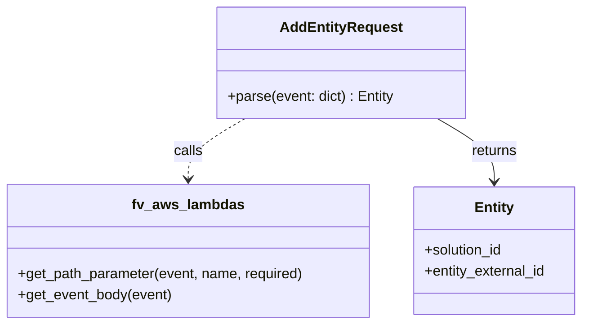

# Diagram: entity_core/entity_service/entity_listener/entity_listener_service/service/add_entity_request.py

> Auto-generated by Obscura crawlers

## Mermaid

### SVG

<svg id="container" width="659.28125" xmlns="http://www.w3.org/2000/svg" class="classDiagram" height="366" viewBox="0 0 659.28125 366" role="graphics-document document" aria-roledescription="class"><g><defs><marker id="container_class-aggregationStart" class="marker aggregation class" refX="18" refY="7" markerWidth="190" markerHeight="240" orient="auto"><path d="M 18,7 L9,13 L1,7 L9,1 Z"></path></marker></defs><defs><marker id="container_class-aggregationEnd" class="marker aggregation class" refX="1" refY="7" markerWidth="20" markerHeight="28" orient="auto"><path d="M 18,7 L9,13 L1,7 L9,1 Z"></path></marker></defs><defs><marker id="container_class-extensionStart" class="marker extension class" refX="18" refY="7" markerWidth="190" markerHeight="240" orient="auto"><path d="M 1,7 L18,13 V 1 Z"></path></marker></defs><defs><marker id="container_class-extensionEnd" class="marker extension class" refX="1" refY="7" markerWidth="20" markerHeight="28" orient="auto"><path d="M 1,1 V 13 L18,7 Z"></path></marker></defs><defs><marker id="container_class-compositionStart" class="marker composition class" refX="18" refY="7" markerWidth="190" markerHeight="240" orient="auto"><path d="M 18,7 L9,13 L1,7 L9,1 Z"></path></marker></defs><defs><marker id="container_class-compositionEnd" class="marker composition class" refX="1" refY="7" markerWidth="20" markerHeight="28" orient="auto"><path d="M 18,7 L9,13 L1,7 L9,1 Z"></path></marker></defs><defs><marker id="container_class-dependencyStart" class="marker dependency class" refX="6" refY="7" markerWidth="190" markerHeight="240" orient="auto"><path d="M 5,7 L9,13 L1,7 L9,1 Z"></path></marker></defs><defs><marker id="container_class-dependencyEnd" class="marker dependency class" refX="13" refY="7" markerWidth="20" markerHeight="28" orient="auto"><path d="M 18,7 L9,13 L14,7 L9,1 Z"></path></marker></defs><defs><marker id="container_class-lollipopStart" class="marker lollipop class" refX="13" refY="7" markerWidth="190" markerHeight="240" orient="auto"><circle stroke="black" fill="transparent" cx="7" cy="7" r="6"></circle></marker></defs><defs><marker id="container_class-lollipopEnd" class="marker lollipop class" refX="1" refY="7" markerWidth="190" markerHeight="240" orient="auto"><circle stroke="black" fill="transparent" cx="7" cy="7" r="6"></circle></marker></defs><g class="root"><g class="clusters"></g><g class="edgePaths"><path d="M276.511,134L265.823,140.167C255.135,146.333,233.759,158.667,223.071,170C212.383,181.333,212.383,191.667,212.383,196.833L212.383,202" id="id_AddEntityRequest_fv_aws_lambdas_1" class="edge-thickness-normal edge-pattern-dashed relation" style=";;;" data-edge="true" data-et="edge" data-id="id_AddEntityRequest_fv_aws_lambdas_1" data-points="W3sieCI6Mjc2LjUxMTMyODEyNSwieSI6MTM0fSx7IngiOjIxMi4zODI4MTI1LCJ5IjoxNzF9LHsieCI6MjEyLjM4MjgxMjUsInkiOjIwOH1d" marker-end="url(#container_class-dependencyEnd)"></path><path d="M494.895,134L505.583,140.167C516.271,146.333,537.647,158.667,548.335,170.5C559.023,182.333,559.023,193.667,559.023,199.333L559.023,205" id="id_AddEntityRequest_Entity_2" class="edge-thickness-normal edge-pattern-solid relation" style=";;;" data-edge="true" data-et="edge" data-id="id_AddEntityRequest_Entity_2" data-points="W3sieCI6NDk0Ljg5NDkyMTg3NSwieSI6MTM0fSx7IngiOjU1OS4wMjM0Mzc1LCJ5IjoxNzF9LHsieCI6NTU5LjAyMzQzNzUsInkiOjIxMX1d" marker-end="url(#container_class-dependencyEnd)"></path></g><g class="edgeLabels"><g class="edgeLabel" transform="translate(212.3828125, 171)"><g class="label" data-id="id_AddEntityRequest_fv_aws_lambdas_1" transform="translate(-16.4453125, -12)"><foreignObject width="32.890625" height="24">

calls

</foreignObject></g></g><g class="edgeLabel" transform="translate(559.0234375, 171)"><g class="label" data-id="id_AddEntityRequest_Entity_2" transform="translate(-26.265625, -12)"><foreignObject width="52.53125" height="24">

returns

</foreignObject></g></g></g><g class="nodes"><g class="node default" id="classId-AddEntityRequest-0" transform="translate(385.703125, 71)"><g class="basic label-container"><path d="M-139.0234375 -63 L139.0234375 -63 L139.0234375 63 L-139.0234375 63" stroke="none" stroke-width="0" fill="#ECECFF" style=""></path><path d="M-139.0234375 -63 C-78.05314359924493 -63, -17.082849698489866 -63, 139.0234375 -63 M-139.0234375 -63 C-56.90935237800399 -63, 25.204732743992025 -63, 139.0234375 -63 M139.0234375 -63 C139.0234375 -15.977041433833477, 139.0234375 31.045917132333045, 139.0234375 63 M139.0234375 -63 C139.0234375 -15.55765105941682, 139.0234375 31.88469788116636, 139.0234375 63 M139.0234375 63 C61.69381474204427 63, -15.635808015911465 63, -139.0234375 63 M139.0234375 63 C42.36055657236598 63, -54.30232435526804 63, -139.0234375 63 M-139.0234375 63 C-139.0234375 15.23698763219295, -139.0234375 -32.5260247356141, -139.0234375 -63 M-139.0234375 63 C-139.0234375 21.34792889875827, -139.0234375 -20.30414220248346, -139.0234375 -63" stroke="#9370DB" stroke-width="1.3" fill="none" stroke-dasharray="0 0" style=""></path></g><g class="annotation-group text" transform="translate(0, -39)"></g><g class="label-group text" transform="translate(-65.578125, -39)"><g class="label" style="font-weight: bolder" transform="translate(0,-12)"><foreignObject width="131.15625" height="24">

AddEntityRequest

</foreignObject></g></g><g class="members-group text" transform="translate(-127.0234375, 9)"></g><g class="methods-group text" transform="translate(-127.0234375, 39)"><g class="label" style="" transform="translate(0,-12)"><foreignObject width="188.46875" height="24">

+parse(event: dict) : Entity

</foreignObject></g></g><g class="divider" style=""><path d="M-139.0234375 -15 C-69.7221958156116 -15, -0.4209541312231977 -15, 139.0234375 -15 M-139.0234375 -15 C-38.276201940096726 -15, 62.47103361980655 -15, 139.0234375 -15" stroke="#9370DB" stroke-width="1.3" fill="none" stroke-dasharray="0 0" style=""></path></g><g class="divider" style=""><path d="M-139.0234375 9 C-60.160017399765835 9, 18.70340270046833 9, 139.0234375 9 M-139.0234375 9 C-64.69993074768199 9, 9.623576004636021 9, 139.0234375 9" stroke="#9370DB" stroke-width="1.3" fill="none" stroke-dasharray="0 0" style=""></path></g></g><g class="node default" id="classId-Entity-1" transform="translate(559.0234375, 283)"><g class="basic label-container"><path d="M-92.2578125 -72 L92.2578125 -72 L92.2578125 72 L-92.2578125 72" stroke="none" stroke-width="0" fill="#ECECFF" style=""></path><path d="M-92.2578125 -72 C-55.343833471669925 -72, -18.42985444333985 -72, 92.2578125 -72 M-92.2578125 -72 C-40.40498950368374 -72, 11.447833492632526 -72, 92.2578125 -72 M92.2578125 -72 C92.2578125 -29.385629211627844, 92.2578125 13.228741576744312, 92.2578125 72 M92.2578125 -72 C92.2578125 -38.77258041062244, 92.2578125 -5.5451608212448775, 92.2578125 72 M92.2578125 72 C53.552508309941146 72, 14.847204119882292 72, -92.2578125 72 M92.2578125 72 C48.98812740081603 72, 5.7184423016320665 72, -92.2578125 72 M-92.2578125 72 C-92.2578125 29.909084841087676, -92.2578125 -12.181830317824648, -92.2578125 -72 M-92.2578125 72 C-92.2578125 16.865151295399862, -92.2578125 -38.269697409200276, -92.2578125 -72" stroke="#9370DB" stroke-width="1.3" fill="none" stroke-dasharray="0 0" style=""></path></g><g class="annotation-group text" transform="translate(0, -48)"></g><g class="label-group text" transform="translate(-21.28125, -48)"><g class="label" style="font-weight: bolder" transform="translate(0,-12)"><foreignObject width="42.5625" height="24">

Entity

</foreignObject></g></g><g class="members-group text" transform="translate(-80.2578125, 0)"><g class="label" style="" transform="translate(0,-12)"><foreignObject width="90.21875" height="24">

+solution_id

</foreignObject></g><g class="label" style="" transform="translate(0,12)"><foreignObject width="139.234375" height="24">

+entity_external_id

</foreignObject></g></g><g class="methods-group text" transform="translate(-80.2578125, 72)"></g><g class="divider" style=""><path d="M-92.2578125 -24 C-23.352085012288356 -24, 45.55364247542329 -24, 92.2578125 -24 M-92.2578125 -24 C-45.841346140313696 -24, 0.5751202193726073 -24, 92.2578125 -24" stroke="#9370DB" stroke-width="1.3" fill="none" stroke-dasharray="0 0" style=""></path></g><g class="divider" style=""><path d="M-92.2578125 48 C-37.96915689896856 48, 16.319498702062873 48, 92.2578125 48 M-92.2578125 48 C-32.37425140129775 48, 27.509309697404504 48, 92.2578125 48" stroke="#9370DB" stroke-width="1.3" fill="none" stroke-dasharray="0 0" style=""></path></g></g><g class="node default" id="classId-fv_aws_lambdas-2" transform="translate(212.3828125, 283)"><g class="basic label-container"><path d="M-204.3828125 -75 L204.3828125 -75 L204.3828125 75 L-204.3828125 75" stroke="none" stroke-width="0" fill="#ECECFF" style=""></path><path d="M-204.3828125 -75 C-58.28699557070624 -75, 87.80882135858752 -75, 204.3828125 -75 M-204.3828125 -75 C-64.89055209439863 -75, 74.60170831120274 -75, 204.3828125 -75 M204.3828125 -75 C204.3828125 -31.46974746542751, 204.3828125 12.06050506914498, 204.3828125 75 M204.3828125 -75 C204.3828125 -33.847196298351854, 204.3828125 7.3056074032962925, 204.3828125 75 M204.3828125 75 C118.05201934241192 75, 31.72122618482385 75, -204.3828125 75 M204.3828125 75 C110.77750231327802 75, 17.17219212655604 75, -204.3828125 75 M-204.3828125 75 C-204.3828125 35.976180640742186, -204.3828125 -3.0476387185156284, -204.3828125 -75 M-204.3828125 75 C-204.3828125 34.53770180456259, -204.3828125 -5.924596390874825, -204.3828125 -75" stroke="#9370DB" stroke-width="1.3" fill="none" stroke-dasharray="0 0" style=""></path></g><g class="annotation-group text" transform="translate(0, -51)"></g><g class="label-group text" transform="translate(-60.0625, -51)"><g class="label" style="font-weight: bolder" transform="translate(0,-12)"><foreignObject width="120.125" height="24">

fv_aws_lambdas

</foreignObject></g></g><g class="members-group text" transform="translate(-192.3828125, -3)"></g><g class="methods-group text" transform="translate(-192.3828125, 27)"><g class="label" style="" transform="translate(0,-12)"><foreignObject width="324.703125" height="24">

+get_path_parameter(event, name, required)

</foreignObject></g><g class="label" style="" transform="translate(0,12)"><foreignObject width="174.203125" height="24">

+get_event_body(event)

</foreignObject></g></g><g class="divider" style=""><path d="M-204.3828125 -27 C-117.69112437353235 -27, -30.999436247064693 -27, 204.3828125 -27 M-204.3828125 -27 C-46.074729128373036 -27, 112.23335424325393 -27, 204.3828125 -27" stroke="#9370DB" stroke-width="1.3" fill="none" stroke-dasharray="0 0" style=""></path></g><g class="divider" style=""><path d="M-204.3828125 -3 C-70.12519442186786 -3, 64.13242365626428 -3, 204.3828125 -3 M-204.3828125 -3 C-60.83291943334831 -3, 82.71697363330338 -3, 204.3828125 -3" stroke="#9370DB" stroke-width="1.3" fill="none" stroke-dasharray="0 0" style=""></path></g></g></g></g></g></svg>
