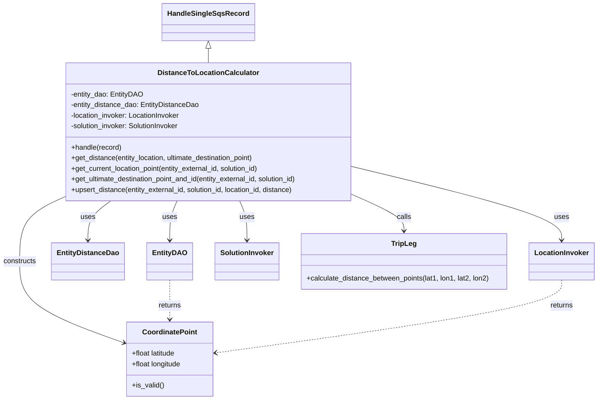

# Diagram: entity_core/entity_service/entity_listener/entity_listener_service/service/distance_to_location_calculator.py


> Auto-generated by Obscura crawlers

## Diagram 1



### SVG

<svg id="container" width="1330.2109375" xmlns="http://www.w3.org/2000/svg" class="classDiagram" height="904" viewBox="0 0 1330.2109375 904" role="graphics-document document" aria-roledescription="class"><style>#container{font-family:"trebuchet ms",verdana,arial,sans-serif;font-size:16px;fill:#333;}@keyframes edge-animation-frame{from{stroke-dashoffset:0;}}@keyframes dash{to{stroke-dashoffset:0;}}#container .edge-animation-slow{stroke-dasharray:9,5!important;stroke-dashoffset:900;animation:dash 50s linear infinite;stroke-linecap:round;}#container .edge-animation-fast{stroke-dasharray:9,5!important;stroke-dashoffset:900;animation:dash 20s linear infinite;stroke-linecap:round;}#container .error-icon{fill:#552222;}#container .error-text{fill:#552222;stroke:#552222;}#container .edge-thickness-normal{stroke-width:1px;}#container .edge-thickness-thick{stroke-width:3.5px;}#container .edge-pattern-solid{stroke-dasharray:0;}#container .edge-thickness-invisible{stroke-width:0;fill:none;}#container .edge-pattern-dashed{stroke-dasharray:3;}#container .edge-pattern-dotted{stroke-dasharray:2;}#container .marker{fill:#333333;stroke:#333333;}#container .marker.cross{stroke:#333333;}#container svg{font-family:"trebuchet ms",verdana,arial,sans-serif;font-size:16px;}#container p{margin:0;}#container g.classGroup text{fill:#9370DB;stroke:none;font-family:"trebuchet ms",verdana,arial,sans-serif;font-size:10px;}#container g.classGroup text .title{font-weight:bolder;}#container .nodeLabel,#container .edgeLabel{color:#131300;}#container .edgeLabel .label rect{fill:#ECECFF;}#container .label text{fill:#131300;}#container .labelBkg{background:#ECECFF;}#container .edgeLabel .label span{background:#ECECFF;}#container .classTitle{font-weight:bolder;}#container .node rect,#container .node circle,#container .node ellipse,#container .node polygon,#container .node path{fill:#ECECFF;stroke:#9370DB;stroke-width:1px;}#container .divider{stroke:#9370DB;stroke-width:1;}#container g.clickable{cursor:pointer;}#container g.classGroup rect{fill:#ECECFF;stroke:#9370DB;}#container g.classGroup line{stroke:#9370DB;stroke-width:1;}#container .classLabel .box{stroke:none;stroke-width:0;fill:#ECECFF;opacity:0.5;}#container .classLabel .label{fill:#9370DB;font-size:10px;}#container .relation{stroke:#333333;stroke-width:1;fill:none;}#container .dashed-line{stroke-dasharray:3;}#container .dotted-line{stroke-dasharray:1 2;}#container #compositionStart,#container .composition{fill:#333333!important;stroke:#333333!important;stroke-width:1;}#container #compositionEnd,#container .composition{fill:#333333!important;stroke:#333333!important;stroke-width:1;}#container #dependencyStart,#container .dependency{fill:#333333!important;stroke:#333333!important;stroke-width:1;}#container #dependencyStart,#container .dependency{fill:#333333!important;stroke:#333333!important;stroke-width:1;}#container #extensionStart,#container .extension{fill:transparent!important;stroke:#333333!important;stroke-width:1;}#container #extensionEnd,#container .extension{fill:transparent!important;stroke:#333333!important;stroke-width:1;}#container #aggregationStart,#container .aggregation{fill:transparent!important;stroke:#333333!important;stroke-width:1;}#container #aggregationEnd,#container .aggregation{fill:transparent!important;stroke:#333333!important;stroke-width:1;}#container #lollipopStart,#container .lollipop{fill:#ECECFF!important;stroke:#333333!important;stroke-width:1;}#container #lollipopEnd,#container .lollipop{fill:#ECECFF!important;stroke:#333333!important;stroke-width:1;}#container .edgeTerminals{font-size:11px;line-height:initial;}#container .classTitleText{text-anchor:middle;font-size:18px;fill:#333;}#container .label-icon{display:inline-block;height:1em;overflow:visible;vertical-align:-0.125em;}#container .node .label-icon path{fill:currentColor;stroke:revert;stroke-width:revert;}#container :root{--mermaid-font-family:"trebuchet ms",verdana,arial,sans-serif;}</style><g><defs><marker id="container_class-aggregationStart" class="marker aggregation class" refX="18" refY="7" markerWidth="190" markerHeight="240" orient="auto"><path d="M 18,7 L9,13 L1,7 L9,1 Z"></path></marker></defs><defs><marker id="container_class-aggregationEnd" class="marker aggregation class" refX="1" refY="7" markerWidth="20" markerHeight="28" orient="auto"><path d="M 18,7 L9,13 L1,7 L9,1 Z"></path></marker></defs><defs><marker id="container_class-extensionStart" class="marker extension class" refX="18" refY="7" markerWidth="190" markerHeight="240" orient="auto"><path d="M 1,7 L18,13 V 1 Z"></path></marker></defs><defs><marker id="container_class-extensionEnd" class="marker extension class" refX="1" refY="7" markerWidth="20" markerHeight="28" orient="auto"><path d="M 1,1 V 13 L18,7 Z"></path></marker></defs><defs><marker id="container_class-compositionStart" class="marker composition class" refX="18" refY="7" markerWidth="190" markerHeight="240" orient="auto"><path d="M 18,7 L9,13 L1,7 L9,1 Z"></path></marker></defs><defs><marker id="container_class-compositionEnd" class="marker composition class" refX="1" refY="7" markerWidth="20" markerHeight="28" orient="auto"><path d="M 18,7 L9,13 L1,7 L9,1 Z"></path></marker></defs><defs><marker id="container_class-dependencyStart" class="marker dependency class" refX="6" refY="7" markerWidth="190" markerHeight="240" orient="auto"><path d="M 5,7 L9,13 L1,7 L9,1 Z"></path></marker></defs><defs><marker id="container_class-dependencyEnd" class="marker dependency class" refX="13" refY="7" markerWidth="20" markerHeight="28" orient="auto"><path d="M 18,7 L9,13 L14,7 L9,1 Z"></path></marker></defs><defs><marker id="container_class-lollipopStart" class="marker lollipop class" refX="13" refY="7" markerWidth="190" markerHeight="240" orient="auto"><circle stroke="black" fill="transparent" cx="7" cy="7" r="6"></circle></marker></defs><defs><marker id="container_class-lollipopEnd" class="marker lollipop class" refX="1" refY="7" markerWidth="190" markerHeight="240" orient="auto"><circle stroke="black" fill="transparent" cx="7" cy="7" r="6"></circle></marker></defs><g class="root"><g class="clusters"></g><g class="edgePaths"><path d="M459.504,109.25L459.504,110.542C459.504,111.833,459.504,114.417,459.504,119.875C459.504,125.333,459.504,133.667,459.504,137.833L459.504,142" id="id_HandleSingleSqsRecord_DistanceToLocationCalculator_1" class="edge-thickness-normal edge-pattern-solid relation" style=";;;" data-edge="true" data-et="edge" data-id="id_HandleSingleSqsRecord_DistanceToLocationCalculator_1" data-points="W3sieCI6NDU5LjUwMzkwNjI1LCJ5Ijo5Mn0seyJ4Ijo0NTkuNTAzOTA2MjUsInkiOjExN30seyJ4Ijo0NTkuNTAzOTA2MjUsInkiOjE0Mn1d" marker-start="url(#container_class-extensionStart)"></path><path d="M391.213,454L388.513,460.167C385.814,466.333,380.415,478.667,377.715,493.5C375.016,508.333,375.016,525.667,375.016,534.333L375.016,543" id="id_DistanceToLocationCalculator_EntityDAO_2" class="edge-thickness-normal edge-pattern-solid relation" style=";;;" data-edge="true" data-et="edge" data-id="id_DistanceToLocationCalculator_EntityDAO_2" data-points="W3sieCI6MzkxLjIxMjg2MDI2NTU0NCwieSI6NDU0fSx7IngiOjM3NS4wMTU2MjUsInkiOjQ5MX0seyJ4IjozNzUuMDE1NjI1LCJ5Ijo1NDl9XQ==" marker-end="url(#container_class-dependencyEnd)"></path><path d="M247.779,454L239.41,460.167C231.04,466.333,214.301,478.667,205.932,493.5C197.563,508.333,197.563,525.667,197.563,534.333L197.563,543" id="id_DistanceToLocationCalculator_EntityDistanceDao_3" class="edge-thickness-normal edge-pattern-solid relation" style=";;;" data-edge="true" data-et="edge" data-id="id_DistanceToLocationCalculator_EntityDistanceDao_3" data-points="W3sieCI6MjQ3Ljc3OTI0NjI3NTkwNjczLCJ5Ijo0NTR9LHsieCI6MTk3LjU2MjUsInkiOjQ5MX0seyJ4IjoxOTcuNTYyNSwieSI6NTQ5fV0=" marker-end="url(#container_class-dependencyEnd)"></path><path d="M789.238,378.372L866.249,397.143C943.26,415.915,1097.283,453.457,1174.294,480.895C1251.305,508.333,1251.305,525.667,1251.305,534.333L1251.305,543" id="id_DistanceToLocationCalculator_LocationInvoker_4" class="edge-thickness-normal edge-pattern-solid relation" style=";;;" data-edge="true" data-et="edge" data-id="id_DistanceToLocationCalculator_LocationInvoker_4" data-points="W3sieCI6Nzg5LjIzODI4MTI1LCJ5IjozNzguMzcyMTU0MDU5NDI3NDN9LHsieCI6MTI1MS4zMDQ2ODc1LCJ5Ijo0OTF9LHsieCI6MTI1MS4zMDQ2ODc1LCJ5Ijo1NDl9XQ==" marker-end="url(#container_class-dependencyEnd)"></path><path d="M527.795,454L530.494,460.167C533.194,466.333,538.593,478.667,541.293,493.5C543.992,508.333,543.992,525.667,543.992,534.333L543.992,543" id="id_DistanceToLocationCalculator_SolutionInvoker_5" class="edge-thickness-normal edge-pattern-solid relation" style=";;;" data-edge="true" data-et="edge" data-id="id_DistanceToLocationCalculator_SolutionInvoker_5" data-points="W3sieCI6NTI3Ljc5NDk1MjIzNDQ1NiwieSI6NDU0fSx7IngiOjU0My45OTIxODc1LCJ5Ijo0OTF9LHsieCI6NTQzLjk5MjE4NzUsInkiOjU0OX1d" marker-end="url(#container_class-dependencyEnd)"></path><path d="M789.238,443.33L807.264,451.275C825.29,459.22,861.342,475.11,879.368,488.222C897.395,501.333,897.395,511.667,897.395,516.833L897.395,522" id="id_DistanceToLocationCalculator_TripLeg_6" class="edge-thickness-normal edge-pattern-solid relation" style=";;;" data-edge="true" data-et="edge" data-id="id_DistanceToLocationCalculator_TripLeg_6" data-points="W3sieCI6Nzg5LjIzODI4MTI1LCJ5Ijo0NDMuMzMwMjA1MTczOTUxODd9LHsieCI6ODk3LjM5NDUzMTI1LCJ5Ijo0OTF9LHsieCI6ODk3LjM5NDUzMTI1LCJ5Ijo1Mjh9XQ==" marker-end="url(#container_class-dependencyEnd)"></path><path d="M129.77,451.843L115.782,458.369C101.794,464.895,73.819,477.948,59.831,501.141C45.844,524.333,45.844,557.667,45.844,591C45.844,624.333,45.844,657.667,83.272,688.091C120.7,718.516,195.556,746.032,232.983,759.791L270.411,773.549" id="id_DistanceToLocationCalculator_CoordinatePoint_7" class="edge-thickness-normal edge-pattern-solid relation" style=";;;" data-edge="true" data-et="edge" data-id="id_DistanceToLocationCalculator_CoordinatePoint_7" data-points="W3sieCI6MTI5Ljc2OTUzMTI1LCJ5Ijo0NTEuODQzMDM2MTU3Nzc1OTR9LHsieCI6NDUuODQzNzUsInkiOjQ5MX0seyJ4Ijo0NS44NDM3NSwieSI6NTkxfSx7IngiOjQ1Ljg0Mzc1LCJ5Ijo2OTF9LHsieCI6Mjc2LjA0Mjk2ODc1LCJ5Ijo3NzUuNjE4NzI4MzQyOTA2fV0=" marker-end="url(#container_class-dependencyEnd)"></path><path d="M375.016,633L375.016,642.667C375.016,652.333,375.016,671.667,375.016,686.5C375.016,701.333,375.016,711.667,375.016,716.833L375.016,722" id="id_EntityDAO_CoordinatePoint_8" class="edge-thickness-normal edge-pattern-dashed relation" style=";;;" data-edge="true" data-et="edge" data-id="id_EntityDAO_CoordinatePoint_8" data-points="W3sieCI6Mzc1LjAxNTYyNSwieSI6NjMzfSx7IngiOjM3NS4wMTU2MjUsInkiOjY5MX0seyJ4IjozNzUuMDE1NjI1LCJ5Ijo3Mjh9XQ==" marker-end="url(#container_class-dependencyEnd)"></path><path d="M1251.305,633L1251.305,642.667C1251.305,652.333,1251.305,671.667,1122.743,699.085C994.18,726.504,737.056,762.009,608.494,779.761L479.932,797.513" id="id_LocationInvoker_CoordinatePoint_9" class="edge-thickness-normal edge-pattern-dashed relation" style=";;;" data-edge="true" data-et="edge" data-id="id_LocationInvoker_CoordinatePoint_9" data-points="W3sieCI6MTI1MS4zMDQ2ODc1LCJ5Ijo2MzN9LHsieCI6MTI1MS4zMDQ2ODc1LCJ5Ijo2OTF9LHsieCI6NDczLjk4ODI4MTI1LCJ5Ijo3OTguMzMzNjI5MDI4NjYzMn1d" marker-end="url(#container_class-dependencyEnd)"></path></g><g class="edgeLabels"><g class="edgeLabel"><g class="label" data-id="id_HandleSingleSqsRecord_DistanceToLocationCalculator_1" transform="translate(0, 0)"><foreignObject width="0" height="0"><div xmlns="http://www.w3.org/1999/xhtml" class="labelBkg" style="display: table-cell; white-space: nowrap; line-height: 1.5; max-width: 200px; text-align: center;"><span class="edgeLabel"></span></div></foreignObject></g></g><g class="edgeLabel" transform="translate(375.015625, 491)"><g class="label" data-id="id_DistanceToLocationCalculator_EntityDAO_2" transform="translate(-16.4921875, -12)"><foreignObject width="32.984375" height="24"><div xmlns="http://www.w3.org/1999/xhtml" class="labelBkg" style="display: table-cell; white-space: nowrap; line-height: 1.5; max-width: 200px; text-align: center;"><span class="edgeLabel"><p>uses</p></span></div></foreignObject></g></g><g class="edgeLabel" transform="translate(197.5625, 491)"><g class="label" data-id="id_DistanceToLocationCalculator_EntityDistanceDao_3" transform="translate(-16.4921875, -12)"><foreignObject width="32.984375" height="24"><div xmlns="http://www.w3.org/1999/xhtml" class="labelBkg" style="display: table-cell; white-space: nowrap; line-height: 1.5; max-width: 200px; text-align: center;"><span class="edgeLabel"><p>uses</p></span></div></foreignObject></g></g><g class="edgeLabel" transform="translate(1251.3046875, 491)"><g class="label" data-id="id_DistanceToLocationCalculator_LocationInvoker_4" transform="translate(-16.4921875, -12)"><foreignObject width="32.984375" height="24"><div xmlns="http://www.w3.org/1999/xhtml" class="labelBkg" style="display: table-cell; white-space: nowrap; line-height: 1.5; max-width: 200px; text-align: center;"><span class="edgeLabel"><p>uses</p></span></div></foreignObject></g></g><g class="edgeLabel" transform="translate(543.9921875, 491)"><g class="label" data-id="id_DistanceToLocationCalculator_SolutionInvoker_5" transform="translate(-16.4921875, -12)"><foreignObject width="32.984375" height="24"><div xmlns="http://www.w3.org/1999/xhtml" class="labelBkg" style="display: table-cell; white-space: nowrap; line-height: 1.5; max-width: 200px; text-align: center;"><span class="edgeLabel"><p>uses</p></span></div></foreignObject></g></g><g class="edgeLabel" transform="translate(897.39453125, 491)"><g class="label" data-id="id_DistanceToLocationCalculator_TripLeg_6" transform="translate(-16.4453125, -12)"><foreignObject width="32.890625" height="24"><div xmlns="http://www.w3.org/1999/xhtml" class="labelBkg" style="display: table-cell; white-space: nowrap; line-height: 1.5; max-width: 200px; text-align: center;"><span class="edgeLabel"><p>calls</p></span></div></foreignObject></g></g><g class="edgeLabel" transform="translate(45.84375, 591)"><g class="label" data-id="id_DistanceToLocationCalculator_CoordinatePoint_7" transform="translate(-37.84375, -12)"><foreignObject width="75.6875" height="24"><div xmlns="http://www.w3.org/1999/xhtml" class="labelBkg" style="display: table-cell; white-space: nowrap; line-height: 1.5; max-width: 200px; text-align: center;"><span class="edgeLabel"><p>constructs</p></span></div></foreignObject></g></g><g class="edgeLabel" transform="translate(375.015625, 691)"><g class="label" data-id="id_EntityDAO_CoordinatePoint_8" transform="translate(-26.265625, -12)"><foreignObject width="52.53125" height="24"><div xmlns="http://www.w3.org/1999/xhtml" class="labelBkg" style="display: table-cell; white-space: nowrap; line-height: 1.5; max-width: 200px; text-align: center;"><span class="edgeLabel"><p>returns</p></span></div></foreignObject></g></g><g class="edgeLabel" transform="translate(1251.3046875, 691)"><g class="label" data-id="id_LocationInvoker_CoordinatePoint_9" transform="translate(-26.265625, -12)"><foreignObject width="52.53125" height="24"><div xmlns="http://www.w3.org/1999/xhtml" class="labelBkg" style="display: table-cell; white-space: nowrap; line-height: 1.5; max-width: 200px; text-align: center;"><span class="edgeLabel"><p>returns</p></span></div></foreignObject></g></g></g><g class="nodes"><g class="node default" id="classId-HandleSingleSqsRecord-0" transform="translate(459.50390625, 50)"><g class="basic label-container"><path d="M-99.078125 -42 L99.078125 -42 L99.078125 42 L-99.078125 42" stroke="none" stroke-width="0" fill="#ECECFF" style=""></path><path d="M-99.078125 -42 C-54.44677434102767 -42, -9.81542368205534 -42, 99.078125 -42 M-99.078125 -42 C-56.665324372460155 -42, -14.25252374492031 -42, 99.078125 -42 M99.078125 -42 C99.078125 -24.93784362316824, 99.078125 -7.875687246336483, 99.078125 42 M99.078125 -42 C99.078125 -23.705285326063425, 99.078125 -5.41057065212685, 99.078125 42 M99.078125 42 C53.90047884197853 42, 8.722832683957066 42, -99.078125 42 M99.078125 42 C32.63490896584808 42, -33.80830706830383 42, -99.078125 42 M-99.078125 42 C-99.078125 20.12596754138261, -99.078125 -1.7480649172347782, -99.078125 -42 M-99.078125 42 C-99.078125 9.639358310295222, -99.078125 -22.721283379409556, -99.078125 -42" stroke="#9370DB" stroke-width="1.3" fill="none" stroke-dasharray="0 0" style=""></path></g><g class="annotation-group text" transform="translate(0, -18)"></g><g class="label-group text" transform="translate(-87.078125, -18)"><g class="label" style="font-weight: bolder" transform="translate(0,-12)"><foreignObject width="174.15625" height="24"><div xmlns="http://www.w3.org/1999/xhtml" style="display: table-cell; white-space: nowrap; line-height: 1.5; max-width: 222px; text-align: center;"><span class="nodeLabel markdown-node-label" style=""><p>HandleSingleSqsRecord</p></span></div></foreignObject></g></g><g class="members-group text" transform="translate(-87.078125, 30)"></g><g class="methods-group text" transform="translate(-87.078125, 60)"></g><g class="divider" style=""><path d="M-99.078125 6 C-52.13400609414883 6, -5.189887188297661 6, 99.078125 6 M-99.078125 6 C-56.10965702973862 6, -13.141189059477242 6, 99.078125 6" stroke="#9370DB" stroke-width="1.3" fill="none" stroke-dasharray="0 0" style=""></path></g><g class="divider" style=""><path d="M-99.078125 24 C-49.873954784248255 24, -0.6697845684965102 24, 99.078125 24 M-99.078125 24 C-44.552014857487166 24, 9.974095285025669 24, 99.078125 24" stroke="#9370DB" stroke-width="1.3" fill="none" stroke-dasharray="0 0" style=""></path></g></g><g class="node default" id="classId-CoordinatePoint-1" transform="translate(375.015625, 812)"><g class="basic label-container"><path d="M-98.97265625 -84 L98.97265625 -84 L98.97265625 84 L-98.97265625 84" stroke="none" stroke-width="0" fill="#ECECFF" style=""></path><path d="M-98.97265625 -84 C-56.124976044141015 -84, -13.27729583828203 -84, 98.97265625 -84 M-98.97265625 -84 C-40.025833304791625 -84, 18.92098964041675 -84, 98.97265625 -84 M98.97265625 -84 C98.97265625 -21.395456368125643, 98.97265625 41.209087263748714, 98.97265625 84 M98.97265625 -84 C98.97265625 -42.30785227993108, 98.97265625 -0.6157045598621664, 98.97265625 84 M98.97265625 84 C40.98182714481724 84, -17.009001960365524 84, -98.97265625 84 M98.97265625 84 C20.33158110405519 84, -58.30949404188962 84, -98.97265625 84 M-98.97265625 84 C-98.97265625 24.62915199623052, -98.97265625 -34.74169600753896, -98.97265625 -84 M-98.97265625 84 C-98.97265625 44.87568248224581, -98.97265625 5.751364964491614, -98.97265625 -84" stroke="#9370DB" stroke-width="1.3" fill="none" stroke-dasharray="0 0" style=""></path></g><g class="annotation-group text" transform="translate(0, -60)"></g><g class="label-group text" transform="translate(-59.3671875, -60)"><g class="label" style="font-weight: bolder" transform="translate(0,-12)"><foreignObject width="118.734375" height="24"><div xmlns="http://www.w3.org/1999/xhtml" style="display: table-cell; white-space: nowrap; line-height: 1.5; max-width: 167px; text-align: center;"><span class="nodeLabel markdown-node-label" style=""><p>CoordinatePoint</p></span></div></foreignObject></g></g><g class="members-group text" transform="translate(-86.97265625, -12)"><g class="label" style="" transform="translate(0,-12)"><foreignObject width="102.03125" height="24"><div xmlns="http://www.w3.org/1999/xhtml" style="display: table-cell; white-space: nowrap; line-height: 1.5; max-width: 159px; text-align: center;"><span class="nodeLabel markdown-node-label" style=""><p>+float latitude</p></span></div></foreignObject></g><g class="label" style="" transform="translate(0,12)"><foreignObject width="114.578125" height="24"><div xmlns="http://www.w3.org/1999/xhtml" style="display: table-cell; white-space: nowrap; line-height: 1.5; max-width: 172px; text-align: center;"><span class="nodeLabel markdown-node-label" style=""><p>+float longitude</p></span></div></foreignObject></g></g><g class="methods-group text" transform="translate(-86.97265625, 60)"><g class="label" style="" transform="translate(0,-12)"><foreignObject width="72.796875" height="24"><div xmlns="http://www.w3.org/1999/xhtml" style="display: table-cell; white-space: nowrap; line-height: 1.5; max-width: 130px; text-align: center;"><span class="nodeLabel markdown-node-label" style=""><p>+is_valid()</p></span></div></foreignObject></g></g><g class="divider" style=""><path d="M-98.97265625 -36 C-45.9464263193372 -36, 7.079803611325602 -36, 98.97265625 -36 M-98.97265625 -36 C-51.65070439275725 -36, -4.3287525355144965 -36, 98.97265625 -36" stroke="#9370DB" stroke-width="1.3" fill="none" stroke-dasharray="0 0" style=""></path></g><g class="divider" style=""><path d="M-98.97265625 36 C-38.058404523053674 36, 22.85584720389265 36, 98.97265625 36 M-98.97265625 36 C-57.06216908297834 36, -15.151681915956686 36, 98.97265625 36" stroke="#9370DB" stroke-width="1.3" fill="none" stroke-dasharray="0 0" style=""></path></g></g><g class="node default" id="classId-DistanceToLocationCalculator-2" transform="translate(459.50390625, 298)"><g class="basic label-container"><path d="M-329.734375 -156 L329.734375 -156 L329.734375 156 L-329.734375 156" stroke="none" stroke-width="0" fill="#ECECFF" style=""></path><path d="M-329.734375 -156 C-71.69662989554865 -156, 186.3411152089027 -156, 329.734375 -156 M-329.734375 -156 C-184.05184822724547 -156, -38.369321454490944 -156, 329.734375 -156 M329.734375 -156 C329.734375 -85.60394292368892, 329.734375 -15.207885847377838, 329.734375 156 M329.734375 -156 C329.734375 -77.99830255509279, 329.734375 0.0033948898144160466, 329.734375 156 M329.734375 156 C116.27326864275386 156, -97.18783771449228 156, -329.734375 156 M329.734375 156 C165.9551808680053 156, 2.1759867360106 156, -329.734375 156 M-329.734375 156 C-329.734375 67.03472432072627, -329.734375 -21.93055135854746, -329.734375 -156 M-329.734375 156 C-329.734375 33.13513053003621, -329.734375 -89.72973893992759, -329.734375 -156" stroke="#9370DB" stroke-width="1.3" fill="none" stroke-dasharray="0 0" style=""></path></g><g class="annotation-group text" transform="translate(0, -132)"></g><g class="label-group text" transform="translate(-108.34375, -132)"><g class="label" style="font-weight: bolder" transform="translate(0,-12)"><foreignObject width="216.6875" height="24"><div xmlns="http://www.w3.org/1999/xhtml" style="display: table-cell; white-space: nowrap; line-height: 1.5; max-width: 265px; text-align: center;"><span class="nodeLabel markdown-node-label" style=""><p>DistanceToLocationCalculator</p></span></div></foreignObject></g></g><g class="members-group text" transform="translate(-317.734375, -84)"><g class="label" style="" transform="translate(0,-12)"><foreignObject width="163.484375" height="24"><div xmlns="http://www.w3.org/1999/xhtml" style="display: table-cell; white-space: nowrap; line-height: 1.5; max-width: 221px; text-align: center;"><span class="nodeLabel markdown-node-label" style=""><p>-entity_dao: EntityDAO</p></span></div></foreignObject></g><g class="label" style="" transform="translate(0,12)"><foreignObject width="292.546875" height="24"><div xmlns="http://www.w3.org/1999/xhtml" style="display: table-cell; white-space: nowrap; line-height: 1.5; max-width: 350px; text-align: center;"><span class="nodeLabel markdown-node-label" style=""><p>-entity_distance_dao: EntityDistanceDao</p></span></div></foreignObject></g><g class="label" style="" transform="translate(0,36)"><foreignObject width="252.234375" height="24"><div xmlns="http://www.w3.org/1999/xhtml" style="display: table-cell; white-space: nowrap; line-height: 1.5; max-width: 310px; text-align: center;"><span class="nodeLabel markdown-node-label" style=""><p>-location_invoker: LocationInvoker</p></span></div></foreignObject></g><g class="label" style="" transform="translate(0,60)"><foreignObject width="251.859375" height="24"><div xmlns="http://www.w3.org/1999/xhtml" style="display: table-cell; white-space: nowrap; line-height: 1.5; max-width: 310px; text-align: center;"><span class="nodeLabel markdown-node-label" style=""><p>-solution_invoker: SolutionInvoker</p></span></div></foreignObject></g></g><g class="methods-group text" transform="translate(-317.734375, 36)"><g class="label" style="" transform="translate(0,-12)"><foreignObject width="115.0625" height="24"><div xmlns="http://www.w3.org/1999/xhtml" style="display: table-cell; white-space: nowrap; line-height: 1.5; max-width: 172px; text-align: center;"><span class="nodeLabel markdown-node-label" style=""><p>+handle(record)</p></span></div></foreignObject></g><g class="label" style="" transform="translate(0,12)"><foreignObject width="425.734375" height="24"><div xmlns="http://www.w3.org/1999/xhtml" style="display: table-cell; white-space: nowrap; line-height: 1.5; max-width: 483px; text-align: center;"><span class="nodeLabel markdown-node-label" style=""><p>+get_distance(entity_location, ultimate_destination_point)</p></span></div></foreignObject></g><g class="label" style="" transform="translate(0,36)"><foreignObject width="437.15625" height="24"><div xmlns="http://www.w3.org/1999/xhtml" style="display: table-cell; white-space: nowrap; line-height: 1.5; max-width: 495px; text-align: center;"><span class="nodeLabel markdown-node-label" style=""><p>+get_current_location_point(entity_external_id, solution_id)</p></span></div></foreignObject></g><g class="label" style="" transform="translate(0,60)"><foreignObject width="527.125" height="24"><div xmlns="http://www.w3.org/1999/xhtml" style="display: table-cell; white-space: nowrap; line-height: 1.5; max-width: 584px; text-align: center;"><span class="nodeLabel markdown-node-label" style=""><p>+get_ultimate_destination_point_and_id(entity_external_id, solution_id)</p></span></div></foreignObject></g><g class="label" style="" transform="translate(0,84)"><foreignObject width="515.265625" height="24"><div xmlns="http://www.w3.org/1999/xhtml" style="display: table-cell; white-space: nowrap; line-height: 1.5; max-width: 573px; text-align: center;"><span class="nodeLabel markdown-node-label" style=""><p>+upsert_distance(entity_external_id, solution_id, location_id, distance)</p></span></div></foreignObject></g></g><g class="divider" style=""><path d="M-329.734375 -108 C-163.62178710098314 -108, 2.4908007980337175 -108, 329.734375 -108 M-329.734375 -108 C-181.182167277175 -108, -32.62995955435002 -108, 329.734375 -108" stroke="#9370DB" stroke-width="1.3" fill="none" stroke-dasharray="0 0" style=""></path></g><g class="divider" style=""><path d="M-329.734375 12 C-195.9167712798651 12, -62.099167559730176 12, 329.734375 12 M-329.734375 12 C-164.56505075198163 12, 0.6042734960367397 12, 329.734375 12" stroke="#9370DB" stroke-width="1.3" fill="none" stroke-dasharray="0 0" style=""></path></g></g><g class="node default" id="classId-EntityDAO-3" transform="translate(375.015625, 591)"><g class="basic label-container"><path d="M-48.578125 -42 L48.578125 -42 L48.578125 42 L-48.578125 42" stroke="none" stroke-width="0" fill="#ECECFF" style=""></path><path d="M-48.578125 -42 C-17.742971142706644 -42, 13.092182714586713 -42, 48.578125 -42 M-48.578125 -42 C-27.004144511440902 -42, -5.430164022881804 -42, 48.578125 -42 M48.578125 -42 C48.578125 -19.183694734912706, 48.578125 3.6326105301745883, 48.578125 42 M48.578125 -42 C48.578125 -23.60004234900772, 48.578125 -5.200084698015438, 48.578125 42 M48.578125 42 C21.479723337434784 42, -5.618678325130432 42, -48.578125 42 M48.578125 42 C10.247528251348953 42, -28.083068497302094 42, -48.578125 42 M-48.578125 42 C-48.578125 16.643864302175487, -48.578125 -8.712271395649026, -48.578125 -42 M-48.578125 42 C-48.578125 12.261669334192998, -48.578125 -17.476661331614004, -48.578125 -42" stroke="#9370DB" stroke-width="1.3" fill="none" stroke-dasharray="0 0" style=""></path></g><g class="annotation-group text" transform="translate(0, -18)"></g><g class="label-group text" transform="translate(-36.578125, -18)"><g class="label" style="font-weight: bolder" transform="translate(0,-12)"><foreignObject width="73.15625" height="24"><div xmlns="http://www.w3.org/1999/xhtml" style="display: table-cell; white-space: nowrap; line-height: 1.5; max-width: 122px; text-align: center;"><span class="nodeLabel markdown-node-label" style=""><p>EntityDAO</p></span></div></foreignObject></g></g><g class="members-group text" transform="translate(-36.578125, 30)"></g><g class="methods-group text" transform="translate(-36.578125, 60)"></g><g class="divider" style=""><path d="M-48.578125 6 C-20.21918567899199 6, 8.139753642016018 6, 48.578125 6 M-48.578125 6 C-23.50324677216569 6, 1.5716314556686228 6, 48.578125 6" stroke="#9370DB" stroke-width="1.3" fill="none" stroke-dasharray="0 0" style=""></path></g><g class="divider" style=""><path d="M-48.578125 24 C-19.928363946177882 24, 8.721397107644236 24, 48.578125 24 M-48.578125 24 C-26.69212884785729 24, -4.806132695714581 24, 48.578125 24" stroke="#9370DB" stroke-width="1.3" fill="none" stroke-dasharray="0 0" style=""></path></g></g><g class="node default" id="classId-EntityDistanceDao-4" transform="translate(197.5625, 591)"><g class="basic label-container"><path d="M-78.875 -42 L78.875 -42 L78.875 42 L-78.875 42" stroke="none" stroke-width="0" fill="#ECECFF" style=""></path><path d="M-78.875 -42 C-28.799709490020206 -42, 21.27558101995959 -42, 78.875 -42 M-78.875 -42 C-22.557236439723475 -42, 33.76052712055305 -42, 78.875 -42 M78.875 -42 C78.875 -17.997143067322714, 78.875 6.005713865354572, 78.875 42 M78.875 -42 C78.875 -9.952870533367005, 78.875 22.09425893326599, 78.875 42 M78.875 42 C24.062598676947445 42, -30.74980264610511 42, -78.875 42 M78.875 42 C36.56694717009884 42, -5.741105659802315 42, -78.875 42 M-78.875 42 C-78.875 23.649876057891284, -78.875 5.299752115782567, -78.875 -42 M-78.875 42 C-78.875 16.7074702229815, -78.875 -8.585059554037002, -78.875 -42" stroke="#9370DB" stroke-width="1.3" fill="none" stroke-dasharray="0 0" style=""></path></g><g class="annotation-group text" transform="translate(0, -18)"></g><g class="label-group text" transform="translate(-66.875, -18)"><g class="label" style="font-weight: bolder" transform="translate(0,-12)"><foreignObject width="133.75" height="24"><div xmlns="http://www.w3.org/1999/xhtml" style="display: table-cell; white-space: nowrap; line-height: 1.5; max-width: 182px; text-align: center;"><span class="nodeLabel markdown-node-label" style=""><p>EntityDistanceDao</p></span></div></foreignObject></g></g><g class="members-group text" transform="translate(-66.875, 30)"></g><g class="methods-group text" transform="translate(-66.875, 60)"></g><g class="divider" style=""><path d="M-78.875 6 C-29.288966061593705 6, 20.29706787681259 6, 78.875 6 M-78.875 6 C-24.177155557302513 6, 30.520688885394975 6, 78.875 6" stroke="#9370DB" stroke-width="1.3" fill="none" stroke-dasharray="0 0" style=""></path></g><g class="divider" style=""><path d="M-78.875 24 C-37.30291021120933 24, 4.26917957758134 24, 78.875 24 M-78.875 24 C-36.04012916599202 24, 6.794741668015959 24, 78.875 24" stroke="#9370DB" stroke-width="1.3" fill="none" stroke-dasharray="0 0" style=""></path></g></g><g class="node default" id="classId-LocationInvoker-5" transform="translate(1251.3046875, 591)"><g class="basic label-container"><path d="M-70.90625 -42 L70.90625 -42 L70.90625 42 L-70.90625 42" stroke="none" stroke-width="0" fill="#ECECFF" style=""></path><path d="M-70.90625 -42 C-24.5331934104599 -42, 21.839863179080197 -42, 70.90625 -42 M-70.90625 -42 C-16.306338173882857 -42, 38.293573652234286 -42, 70.90625 -42 M70.90625 -42 C70.90625 -17.89833088137325, 70.90625 6.203338237253497, 70.90625 42 M70.90625 -42 C70.90625 -23.78667309129969, 70.90625 -5.57334618259938, 70.90625 42 M70.90625 42 C33.00220762767513 42, -4.901834744649733 42, -70.90625 42 M70.90625 42 C37.3350869116111 42, 3.7639238232222 42, -70.90625 42 M-70.90625 42 C-70.90625 22.505671114075806, -70.90625 3.0113422281516122, -70.90625 -42 M-70.90625 42 C-70.90625 12.711007649396542, -70.90625 -16.577984701206915, -70.90625 -42" stroke="#9370DB" stroke-width="1.3" fill="none" stroke-dasharray="0 0" style=""></path></g><g class="annotation-group text" transform="translate(0, -18)"></g><g class="label-group text" transform="translate(-58.90625, -18)"><g class="label" style="font-weight: bolder" transform="translate(0,-12)"><foreignObject width="117.8125" height="24"><div xmlns="http://www.w3.org/1999/xhtml" style="display: table-cell; white-space: nowrap; line-height: 1.5; max-width: 167px; text-align: center;"><span class="nodeLabel markdown-node-label" style=""><p>LocationInvoker</p></span></div></foreignObject></g></g><g class="members-group text" transform="translate(-58.90625, 30)"></g><g class="methods-group text" transform="translate(-58.90625, 60)"></g><g class="divider" style=""><path d="M-70.90625 6 C-32.08968470387845 6, 6.726880592243106 6, 70.90625 6 M-70.90625 6 C-18.92636070044702 6, 33.05352859910596 6, 70.90625 6" stroke="#9370DB" stroke-width="1.3" fill="none" stroke-dasharray="0 0" style=""></path></g><g class="divider" style=""><path d="M-70.90625 24 C-28.68262054001935 24, 13.5410089199613 24, 70.90625 24 M-70.90625 24 C-26.27068195697518 24, 18.364886086049637 24, 70.90625 24" stroke="#9370DB" stroke-width="1.3" fill="none" stroke-dasharray="0 0" style=""></path></g></g><g class="node default" id="classId-SolutionInvoker-6" transform="translate(543.9921875, 591)"><g class="basic label-container"><path d="M-70.3984375 -42 L70.3984375 -42 L70.3984375 42 L-70.3984375 42" stroke="none" stroke-width="0" fill="#ECECFF" style=""></path><path d="M-70.3984375 -42 C-31.94065351825006 -42, 6.517130463499882 -42, 70.3984375 -42 M-70.3984375 -42 C-38.91416106543879 -42, -7.429884630877574 -42, 70.3984375 -42 M70.3984375 -42 C70.3984375 -12.341656516560843, 70.3984375 17.316686966878315, 70.3984375 42 M70.3984375 -42 C70.3984375 -14.1932713807339, 70.3984375 13.613457238532199, 70.3984375 42 M70.3984375 42 C33.11485945388506 42, -4.1687185922298795 42, -70.3984375 42 M70.3984375 42 C40.549295255718704 42, 10.700153011437408 42, -70.3984375 42 M-70.3984375 42 C-70.3984375 18.84102311844485, -70.3984375 -4.317953763110303, -70.3984375 -42 M-70.3984375 42 C-70.3984375 11.827643096804813, -70.3984375 -18.344713806390374, -70.3984375 -42" stroke="#9370DB" stroke-width="1.3" fill="none" stroke-dasharray="0 0" style=""></path></g><g class="annotation-group text" transform="translate(0, -18)"></g><g class="label-group text" transform="translate(-58.3984375, -18)"><g class="label" style="font-weight: bolder" transform="translate(0,-12)"><foreignObject width="116.796875" height="24"><div xmlns="http://www.w3.org/1999/xhtml" style="display: table-cell; white-space: nowrap; line-height: 1.5; max-width: 166px; text-align: center;"><span class="nodeLabel markdown-node-label" style=""><p>SolutionInvoker</p></span></div></foreignObject></g></g><g class="members-group text" transform="translate(-58.3984375, 30)"></g><g class="methods-group text" transform="translate(-58.3984375, 60)"></g><g class="divider" style=""><path d="M-70.3984375 6 C-37.09786488526696 6, -3.797292270533916 6, 70.3984375 6 M-70.3984375 6 C-19.177436336904783 6, 32.04356482619043 6, 70.3984375 6" stroke="#9370DB" stroke-width="1.3" fill="none" stroke-dasharray="0 0" style=""></path></g><g class="divider" style=""><path d="M-70.3984375 24 C-23.18086164280983 24, 24.03671421438034 24, 70.3984375 24 M-70.3984375 24 C-30.888011664539093 24, 8.622414170921815 24, 70.3984375 24" stroke="#9370DB" stroke-width="1.3" fill="none" stroke-dasharray="0 0" style=""></path></g></g><g class="node default" id="classId-TripLeg-7" transform="translate(897.39453125, 591)"><g class="basic label-container"><path d="M-233.00390625 -63 L233.00390625 -63 L233.00390625 63 L-233.00390625 63" stroke="none" stroke-width="0" fill="#ECECFF" style=""></path><path d="M-233.00390625 -63 C-75.39713705524176 -63, 82.20963213951649 -63, 233.00390625 -63 M-233.00390625 -63 C-112.73689665076488 -63, 7.530112948470247 -63, 233.00390625 -63 M233.00390625 -63 C233.00390625 -29.707196484880164, 233.00390625 3.5856070302396716, 233.00390625 63 M233.00390625 -63 C233.00390625 -31.966122753603717, 233.00390625 -0.9322455072074334, 233.00390625 63 M233.00390625 63 C107.03316226298519 63, -18.937581724029627 63, -233.00390625 63 M233.00390625 63 C70.48250330693935 63, -92.0388996361213 63, -233.00390625 63 M-233.00390625 63 C-233.00390625 25.625294489831504, -233.00390625 -11.749411020336993, -233.00390625 -63 M-233.00390625 63 C-233.00390625 17.021096442182667, -233.00390625 -28.957807115634665, -233.00390625 -63" stroke="#9370DB" stroke-width="1.3" fill="none" stroke-dasharray="0 0" style=""></path></g><g class="annotation-group text" transform="translate(0, -39)"></g><g class="label-group text" transform="translate(-27.0546875, -39)"><g class="label" style="font-weight: bolder" transform="translate(0,-12)"><foreignObject width="54.109375" height="24"><div xmlns="http://www.w3.org/1999/xhtml" style="display: table-cell; white-space: nowrap; line-height: 1.5; max-width: 103px; text-align: center;"><span class="nodeLabel markdown-node-label" style=""><p>TripLeg</p></span></div></foreignObject></g></g><g class="members-group text" transform="translate(-221.00390625, 9)"></g><g class="methods-group text" transform="translate(-221.00390625, 39)"><g class="label" style="" transform="translate(0,-12)"><foreignObject width="414.953125" height="24"><div xmlns="http://www.w3.org/1999/xhtml" style="display: table-cell; white-space: nowrap; line-height: 1.5; max-width: 472px; text-align: center;"><span class="nodeLabel markdown-node-label" style=""><p>+calculate_distance_between_points(lat1, lon1, lat2, lon2)</p></span></div></foreignObject></g></g><g class="divider" style=""><path d="M-233.00390625 -15 C-95.57141071199302 -15, 41.86108482601395 -15, 233.00390625 -15 M-233.00390625 -15 C-70.21093760673355 -15, 92.5820310365329 -15, 233.00390625 -15" stroke="#9370DB" stroke-width="1.3" fill="none" stroke-dasharray="0 0" style=""></path></g><g class="divider" style=""><path d="M-233.00390625 9 C-118.25205550576943 9, -3.5002047615388676 9, 233.00390625 9 M-233.00390625 9 C-74.0484660693088 9, 84.9069741113824 9, 233.00390625 9" stroke="#9370DB" stroke-width="1.3" fill="none" stroke-dasharray="0 0" style=""></path></g></g></g></g></g></svg>

## Diagram 2

```mermaid
sequenceDiagram
participant SQS
participant Calculator as "DistanceToLocationCalculator"
participant EntityDAO
participant SolutionInvoker
participant LocationInvoker
participant TripLeg as "trip_leg.calculate_distance_between_points"
participant EntityDistanceDao

SQS->>Calculator: handle(record)
Calculator->>Calculator: parse_message(record)
Calculator->>EntityDAO: get_current_location(entity_external_id, solution_id)
EntityDAO-->>Calculator: current_location
Calculator->>EntityDAO: get_ultimate_destination(entity_external_id, solution_id)
EntityDAO-->>Calculator: ultimate_destination
alt ultimate_destination has resolvedReferenceId
Calculator->>SolutionInvoker: get_org_id_from_solution_id(solution_id)
SolutionInvoker-->>Calculator: org_id
Calculator->>LocationInvoker: get_location_by_id(location_id, org_id)
LocationInvoker-->>Calculator: location_info (geofence center)
Calculator->>Calculator: construct CoordinatePoint for entity and destination
alt entity and destination valid
Calculator->>TripLeg: calculate_distance_between_points(lat1, lon1, lat2, lon2)
TripLeg-->>Calculator: distance
Calculator->>EntityDAO: get_entity_id(entity_external_id, solution_id)
EntityDAO-->>Calculator: entity_id
Calculator->>EntityDistanceDao: does_distance_record_exist(entity_id, location_id)
EntityDistanceDao-->>Calculator: exists?
alt exists == true
Calculator->>EntityDistanceDao: update_entity_distance_to_location(entity_id, location_id, distance)
else exists == false
Calculator->>EntityDistanceDao: upsert_entity_distance_to_location(entity_id, location_id, distance)
end
else ultimate_destination missing
Calculator-->>SQS: exit (no-op)
end
```

> SVG rendering failed for this diagram.
