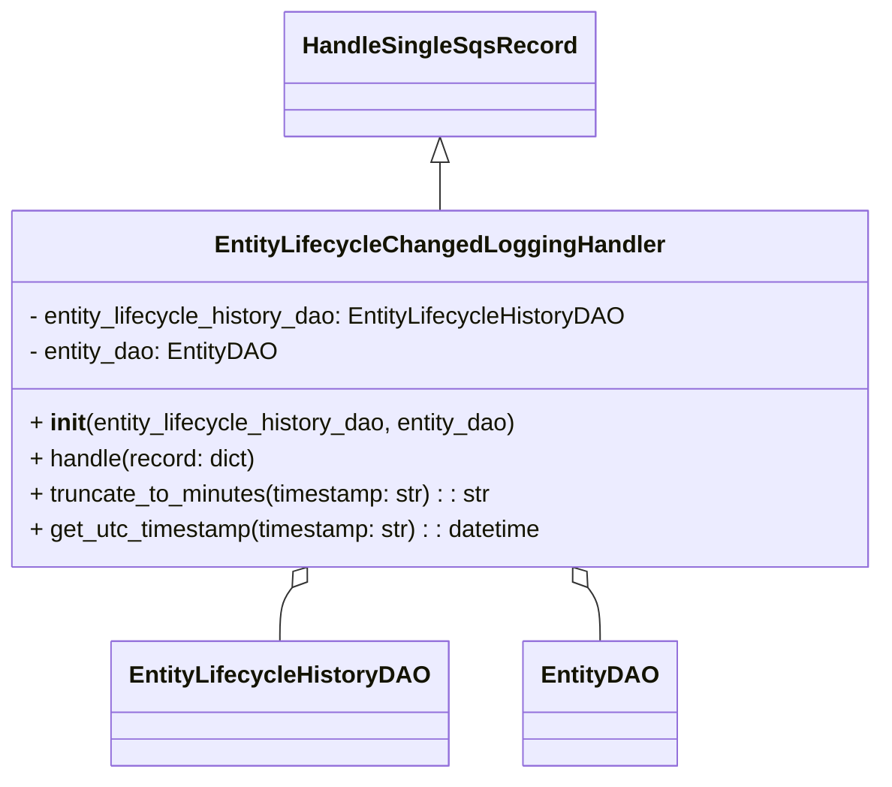

# Diagram: entity_core/entity_service/entity_listener/entity_listener_service/service/handle_process_entity_state_changed.py


> Auto-generated by Obscura crawlers

## Diagram 1



### SVG

<svg id="container" width="590.53125" xmlns="http://www.w3.org/2000/svg" class="classDiagram" height="524" viewBox="0 0 590.53125 524" role="graphics-document document" aria-roledescription="class"><style>#container{font-family:"trebuchet ms",verdana,arial,sans-serif;font-size:16px;fill:#333;}@keyframes edge-animation-frame{from{stroke-dashoffset:0;}}@keyframes dash{to{stroke-dashoffset:0;}}#container .edge-animation-slow{stroke-dasharray:9,5!important;stroke-dashoffset:900;animation:dash 50s linear infinite;stroke-linecap:round;}#container .edge-animation-fast{stroke-dasharray:9,5!important;stroke-dashoffset:900;animation:dash 20s linear infinite;stroke-linecap:round;}#container .error-icon{fill:#552222;}#container .error-text{fill:#552222;stroke:#552222;}#container .edge-thickness-normal{stroke-width:1px;}#container .edge-thickness-thick{stroke-width:3.5px;}#container .edge-pattern-solid{stroke-dasharray:0;}#container .edge-thickness-invisible{stroke-width:0;fill:none;}#container .edge-pattern-dashed{stroke-dasharray:3;}#container .edge-pattern-dotted{stroke-dasharray:2;}#container .marker{fill:#333333;stroke:#333333;}#container .marker.cross{stroke:#333333;}#container svg{font-family:"trebuchet ms",verdana,arial,sans-serif;font-size:16px;}#container p{margin:0;}#container g.classGroup text{fill:#9370DB;stroke:none;font-family:"trebuchet ms",verdana,arial,sans-serif;font-size:10px;}#container g.classGroup text .title{font-weight:bolder;}#container .nodeLabel,#container .edgeLabel{color:#131300;}#container .edgeLabel .label rect{fill:#ECECFF;}#container .label text{fill:#131300;}#container .labelBkg{background:#ECECFF;}#container .edgeLabel .label span{background:#ECECFF;}#container .classTitle{font-weight:bolder;}#container .node rect,#container .node circle,#container .node ellipse,#container .node polygon,#container .node path{fill:#ECECFF;stroke:#9370DB;stroke-width:1px;}#container .divider{stroke:#9370DB;stroke-width:1;}#container g.clickable{cursor:pointer;}#container g.classGroup rect{fill:#ECECFF;stroke:#9370DB;}#container g.classGroup line{stroke:#9370DB;stroke-width:1;}#container .classLabel .box{stroke:none;stroke-width:0;fill:#ECECFF;opacity:0.5;}#container .classLabel .label{fill:#9370DB;font-size:10px;}#container .relation{stroke:#333333;stroke-width:1;fill:none;}#container .dashed-line{stroke-dasharray:3;}#container .dotted-line{stroke-dasharray:1 2;}#container #compositionStart,#container .composition{fill:#333333!important;stroke:#333333!important;stroke-width:1;}#container #compositionEnd,#container .composition{fill:#333333!important;stroke:#333333!important;stroke-width:1;}#container #dependencyStart,#container .dependency{fill:#333333!important;stroke:#333333!important;stroke-width:1;}#container #dependencyStart,#container .dependency{fill:#333333!important;stroke:#333333!important;stroke-width:1;}#container #extensionStart,#container .extension{fill:transparent!important;stroke:#333333!important;stroke-width:1;}#container #extensionEnd,#container .extension{fill:transparent!important;stroke:#333333!important;stroke-width:1;}#container #aggregationStart,#container .aggregation{fill:transparent!important;stroke:#333333!important;stroke-width:1;}#container #aggregationEnd,#container .aggregation{fill:transparent!important;stroke:#333333!important;stroke-width:1;}#container #lollipopStart,#container .lollipop{fill:#ECECFF!important;stroke:#333333!important;stroke-width:1;}#container #lollipopEnd,#container .lollipop{fill:#ECECFF!important;stroke:#333333!important;stroke-width:1;}#container .edgeTerminals{font-size:11px;line-height:initial;}#container .classTitleText{text-anchor:middle;font-size:18px;fill:#333;}#container .label-icon{display:inline-block;height:1em;overflow:visible;vertical-align:-0.125em;}#container .node .label-icon path{fill:currentColor;stroke:revert;stroke-width:revert;}#container :root{--mermaid-font-family:"trebuchet ms",verdana,arial,sans-serif;}</style><g><defs><marker id="container_class-aggregationStart" class="marker aggregation class" refX="18" refY="7" markerWidth="190" markerHeight="240" orient="auto"><path d="M 18,7 L9,13 L1,7 L9,1 Z"></path></marker></defs><defs><marker id="container_class-aggregationEnd" class="marker aggregation class" refX="1" refY="7" markerWidth="20" markerHeight="28" orient="auto"><path d="M 18,7 L9,13 L1,7 L9,1 Z"></path></marker></defs><defs><marker id="container_class-extensionStart" class="marker extension class" refX="18" refY="7" markerWidth="190" markerHeight="240" orient="auto"><path d="M 1,7 L18,13 V 1 Z"></path></marker></defs><defs><marker id="container_class-extensionEnd" class="marker extension class" refX="1" refY="7" markerWidth="20" markerHeight="28" orient="auto"><path d="M 1,1 V 13 L18,7 Z"></path></marker></defs><defs><marker id="container_class-compositionStart" class="marker composition class" refX="18" refY="7" markerWidth="190" markerHeight="240" orient="auto"><path d="M 18,7 L9,13 L1,7 L9,1 Z"></path></marker></defs><defs><marker id="container_class-compositionEnd" class="marker composition class" refX="1" refY="7" markerWidth="20" markerHeight="28" orient="auto"><path d="M 18,7 L9,13 L1,7 L9,1 Z"></path></marker></defs><defs><marker id="container_class-dependencyStart" class="marker dependency class" refX="6" refY="7" markerWidth="190" markerHeight="240" orient="auto"><path d="M 5,7 L9,13 L1,7 L9,1 Z"></path></marker></defs><defs><marker id="container_class-dependencyEnd" class="marker dependency class" refX="13" refY="7" markerWidth="20" markerHeight="28" orient="auto"><path d="M 18,7 L9,13 L14,7 L9,1 Z"></path></marker></defs><defs><marker id="container_class-lollipopStart" class="marker lollipop class" refX="13" refY="7" markerWidth="190" markerHeight="240" orient="auto"><circle stroke="black" fill="transparent" cx="7" cy="7" r="6"></circle></marker></defs><defs><marker id="container_class-lollipopEnd" class="marker lollipop class" refX="1" refY="7" markerWidth="190" markerHeight="240" orient="auto"><circle stroke="black" fill="transparent" cx="7" cy="7" r="6"></circle></marker></defs><g class="root"><g class="clusters"></g><g class="edgePaths"><path d="M295.266,109.25L295.266,110.542C295.266,111.833,295.266,114.417,295.266,119.875C295.266,125.333,295.266,133.667,295.266,137.833L295.266,142" id="id_HandleSingleSqsRecord_EntityLifecycleChangedLoggingHandler_1" class="edge-thickness-normal edge-pattern-solid relation" style=";;;" data-edge="true" data-et="edge" data-id="id_HandleSingleSqsRecord_EntityLifecycleChangedLoggingHandler_1" data-points="W3sieCI6Mjk1LjI2NTYyNSwieSI6OTJ9LHsieCI6Mjk1LjI2NTYyNSwieSI6MTE3fSx7IngiOjI5NS4yNjU2MjUsInkiOjE0Mn1d" marker-start="url(#container_class-extensionStart)"></path><path d="M200.205,396.072L198.914,397.893C197.623,399.715,195.04,403.357,193.748,409.345C192.457,415.333,192.457,423.667,192.457,427.833L192.457,432" id="id_EntityLifecycleChangedLoggingHandler_EntityLifecycleHistoryDAO_2" class="edge-thickness-normal edge-pattern-solid relation" style=";;;" data-edge="true" data-et="edge" data-id="id_EntityLifecycleChangedLoggingHandler_EntityLifecycleHistoryDAO_2" data-points="W3sieCI6MjEwLjE4MjY1MDg2MjA2ODk1LCJ5IjozODJ9LHsieCI6MTkyLjQ1NzAzMTI1LCJ5Ijo0MDd9LHsieCI6MTkyLjQ1NzAzMTI1LCJ5Ijo0MzJ9XQ==" marker-start="url(#container_class-aggregationStart)"></path><path d="M390.326,396.072L391.617,397.893C392.909,399.715,395.491,403.357,396.783,409.345C398.074,415.333,398.074,423.667,398.074,427.833L398.074,432" id="id_EntityLifecycleChangedLoggingHandler_EntityDAO_3" class="edge-thickness-normal edge-pattern-solid relation" style=";;;" data-edge="true" data-et="edge" data-id="id_EntityLifecycleChangedLoggingHandler_EntityDAO_3" data-points="W3sieCI6MzgwLjM0ODU5OTEzNzkzMTA1LCJ5IjozODJ9LHsieCI6Mzk4LjA3NDIxODc1LCJ5Ijo0MDd9LHsieCI6Mzk4LjA3NDIxODc1LCJ5Ijo0MzJ9XQ==" marker-start="url(#container_class-aggregationStart)"></path></g><g class="edgeLabels"><g class="edgeLabel"><g class="label" data-id="id_HandleSingleSqsRecord_EntityLifecycleChangedLoggingHandler_1" transform="translate(0, 0)"><foreignObject width="0" height="0"><div xmlns="http://www.w3.org/1999/xhtml" class="labelBkg" style="display: table-cell; white-space: nowrap; line-height: 1.5; max-width: 200px; text-align: center;"><span class="edgeLabel"></span></div></foreignObject></g></g><g class="edgeLabel"><g class="label" data-id="id_EntityLifecycleChangedLoggingHandler_EntityLifecycleHistoryDAO_2" transform="translate(0, 0)"><foreignObject width="0" height="0"><div xmlns="http://www.w3.org/1999/xhtml" class="labelBkg" style="display: table-cell; white-space: nowrap; line-height: 1.5; max-width: 200px; text-align: center;"><span class="edgeLabel"></span></div></foreignObject></g></g><g class="edgeLabel"><g class="label" data-id="id_EntityLifecycleChangedLoggingHandler_EntityDAO_3" transform="translate(0, 0)"><foreignObject width="0" height="0"><div xmlns="http://www.w3.org/1999/xhtml" class="labelBkg" style="display: table-cell; white-space: nowrap; line-height: 1.5; max-width: 200px; text-align: center;"><span class="edgeLabel"></span></div></foreignObject></g></g></g><g class="nodes"><g class="node default" id="classId-HandleSingleSqsRecord-0" transform="translate(295.265625, 50)"><g class="basic label-container"><path d="M-99.078125 -42 L99.078125 -42 L99.078125 42 L-99.078125 42" stroke="none" stroke-width="0" fill="#ECECFF" style=""></path><path d="M-99.078125 -42 C-52.90247154149374 -42, -6.726818082987478 -42, 99.078125 -42 M-99.078125 -42 C-56.2227142124849 -42, -13.367303424969805 -42, 99.078125 -42 M99.078125 -42 C99.078125 -13.12003371716068, 99.078125 15.759932565678639, 99.078125 42 M99.078125 -42 C99.078125 -8.48442853816492, 99.078125 25.03114292367016, 99.078125 42 M99.078125 42 C23.35908864710568 42, -52.35994770578864 42, -99.078125 42 M99.078125 42 C23.3032232362889 42, -52.4716785274222 42, -99.078125 42 M-99.078125 42 C-99.078125 24.301932791234577, -99.078125 6.603865582469155, -99.078125 -42 M-99.078125 42 C-99.078125 12.667798499840956, -99.078125 -16.66440300031809, -99.078125 -42" stroke="#9370DB" stroke-width="1.3" fill="none" stroke-dasharray="0 0" style=""></path></g><g class="annotation-group text" transform="translate(0, -18)"></g><g class="label-group text" transform="translate(-87.078125, -18)"><g class="label" style="font-weight: bolder" transform="translate(0,-12)"><foreignObject width="174.15625" height="24"><div xmlns="http://www.w3.org/1999/xhtml" style="display: table-cell; white-space: nowrap; line-height: 1.5; max-width: 222px; text-align: center;"><span class="nodeLabel markdown-node-label" style=""><p>HandleSingleSqsRecord</p></span></div></foreignObject></g></g><g class="members-group text" transform="translate(-87.078125, 30)"></g><g class="methods-group text" transform="translate(-87.078125, 60)"></g><g class="divider" style=""><path d="M-99.078125 6 C-56.81313661029676 6, -14.548148220593518 6, 99.078125 6 M-99.078125 6 C-53.35034799908048 6, -7.622570998160967 6, 99.078125 6" stroke="#9370DB" stroke-width="1.3" fill="none" stroke-dasharray="0 0" style=""></path></g><g class="divider" style=""><path d="M-99.078125 24 C-55.55171207575169 24, -12.025299151503376 24, 99.078125 24 M-99.078125 24 C-27.763342850048645 24, 43.55143929990271 24, 99.078125 24" stroke="#9370DB" stroke-width="1.3" fill="none" stroke-dasharray="0 0" style=""></path></g></g><g class="node default" id="classId-EntityLifecycleHistoryDAO-1" transform="translate(192.45703125, 474)"><g class="basic label-container"><path d="M-107.0390625 -42 L107.0390625 -42 L107.0390625 42 L-107.0390625 42" stroke="none" stroke-width="0" fill="#ECECFF" style=""></path><path d="M-107.0390625 -42 C-61.65759934745893 -42, -16.276136194917854 -42, 107.0390625 -42 M-107.0390625 -42 C-43.7718570773058 -42, 19.495348345388393 -42, 107.0390625 -42 M107.0390625 -42 C107.0390625 -18.355392270942662, 107.0390625 5.2892154581146755, 107.0390625 42 M107.0390625 -42 C107.0390625 -13.960151046460087, 107.0390625 14.079697907079826, 107.0390625 42 M107.0390625 42 C53.419709492892366 42, -0.19964351421526771 42, -107.0390625 42 M107.0390625 42 C47.757086860054976 42, -11.524888779890048 42, -107.0390625 42 M-107.0390625 42 C-107.0390625 13.072986874073049, -107.0390625 -15.854026251853902, -107.0390625 -42 M-107.0390625 42 C-107.0390625 14.338509270670361, -107.0390625 -13.322981458659278, -107.0390625 -42" stroke="#9370DB" stroke-width="1.3" fill="none" stroke-dasharray="0 0" style=""></path></g><g class="annotation-group text" transform="translate(0, -18)"></g><g class="label-group text" transform="translate(-95.0390625, -18)"><g class="label" style="font-weight: bolder" transform="translate(0,-12)"><foreignObject width="190.078125" height="24"><div xmlns="http://www.w3.org/1999/xhtml" style="display: table-cell; white-space: nowrap; line-height: 1.5; max-width: 236px; text-align: center;"><span class="nodeLabel markdown-node-label" style=""><p>EntityLifecycleHistoryDAO</p></span></div></foreignObject></g></g><g class="members-group text" transform="translate(-95.0390625, 30)"></g><g class="methods-group text" transform="translate(-95.0390625, 60)"></g><g class="divider" style=""><path d="M-107.0390625 6 C-30.139559604640198 6, 46.759943290719605 6, 107.0390625 6 M-107.0390625 6 C-48.08886030101044 6, 10.861341897979116 6, 107.0390625 6" stroke="#9370DB" stroke-width="1.3" fill="none" stroke-dasharray="0 0" style=""></path></g><g class="divider" style=""><path d="M-107.0390625 24 C-23.949957552391922 24, 59.139147395216156 24, 107.0390625 24 M-107.0390625 24 C-35.85169549457245 24, 35.33567151085509 24, 107.0390625 24" stroke="#9370DB" stroke-width="1.3" fill="none" stroke-dasharray="0 0" style=""></path></g></g><g class="node default" id="classId-EntityDAO-2" transform="translate(398.07421875, 474)"><g class="basic label-container"><path d="M-48.578125 -42 L48.578125 -42 L48.578125 42 L-48.578125 42" stroke="none" stroke-width="0" fill="#ECECFF" style=""></path><path d="M-48.578125 -42 C-25.51342511532561 -42, -2.4487252306512204 -42, 48.578125 -42 M-48.578125 -42 C-16.489019205676442 -42, 15.600086588647116 -42, 48.578125 -42 M48.578125 -42 C48.578125 -20.927669282465928, 48.578125 0.14466143506814433, 48.578125 42 M48.578125 -42 C48.578125 -9.43320707642431, 48.578125 23.13358584715138, 48.578125 42 M48.578125 42 C28.800077803393187 42, 9.022030606786373 42, -48.578125 42 M48.578125 42 C10.73440750991054 42, -27.10930998017892 42, -48.578125 42 M-48.578125 42 C-48.578125 8.655481899515813, -48.578125 -24.689036200968374, -48.578125 -42 M-48.578125 42 C-48.578125 23.505845843392215, -48.578125 5.011691686784431, -48.578125 -42" stroke="#9370DB" stroke-width="1.3" fill="none" stroke-dasharray="0 0" style=""></path></g><g class="annotation-group text" transform="translate(0, -18)"></g><g class="label-group text" transform="translate(-36.578125, -18)"><g class="label" style="font-weight: bolder" transform="translate(0,-12)"><foreignObject width="73.15625" height="24"><div xmlns="http://www.w3.org/1999/xhtml" style="display: table-cell; white-space: nowrap; line-height: 1.5; max-width: 122px; text-align: center;"><span class="nodeLabel markdown-node-label" style=""><p>EntityDAO</p></span></div></foreignObject></g></g><g class="members-group text" transform="translate(-36.578125, 30)"></g><g class="methods-group text" transform="translate(-36.578125, 60)"></g><g class="divider" style=""><path d="M-48.578125 6 C-22.29527492960315 6, 3.9875751407937017 6, 48.578125 6 M-48.578125 6 C-11.694311579247845 6, 25.18950184150431 6, 48.578125 6" stroke="#9370DB" stroke-width="1.3" fill="none" stroke-dasharray="0 0" style=""></path></g><g class="divider" style=""><path d="M-48.578125 24 C-19.71347923085245 24, 9.1511665382951 24, 48.578125 24 M-48.578125 24 C-19.68520045371814 24, 9.207724092563723 24, 48.578125 24" stroke="#9370DB" stroke-width="1.3" fill="none" stroke-dasharray="0 0" style=""></path></g></g><g class="node default" id="classId-EntityLifecycleChangedLoggingHandler-3" transform="translate(295.265625, 262)"><g class="basic label-container"><path d="M-287.265625 -120 L287.265625 -120 L287.265625 120 L-287.265625 120" stroke="none" stroke-width="0" fill="#ECECFF" style=""></path><path d="M-287.265625 -120 C-152.3059142207441 -120, -17.34620344148823 -120, 287.265625 -120 M-287.265625 -120 C-58.61998432014272 -120, 170.02565635971456 -120, 287.265625 -120 M287.265625 -120 C287.265625 -68.3955762282186, 287.265625 -16.79115245643719, 287.265625 120 M287.265625 -120 C287.265625 -40.33930088455227, 287.265625 39.321398230895454, 287.265625 120 M287.265625 120 C99.4775077031214 120, -88.31060959375719 120, -287.265625 120 M287.265625 120 C144.1548878667778 120, 1.0441507335556253 120, -287.265625 120 M-287.265625 120 C-287.265625 57.400583095391355, -287.265625 -5.198833809217291, -287.265625 -120 M-287.265625 120 C-287.265625 61.06087947462991, -287.265625 2.1217589492598137, -287.265625 -120" stroke="#9370DB" stroke-width="1.3" fill="none" stroke-dasharray="0 0" style=""></path></g><g class="annotation-group text" transform="translate(0, -96)"></g><g class="label-group text" transform="translate(-142.671875, -96)"><g class="label" style="font-weight: bolder" transform="translate(0,-12)"><foreignObject width="285.34375" height="24"><div xmlns="http://www.w3.org/1999/xhtml" style="display: table-cell; white-space: nowrap; line-height: 1.5; max-width: 332px; text-align: center;"><span class="nodeLabel markdown-node-label" style=""><p>EntityLifecycleChangedLoggingHandler</p></span></div></foreignObject></g></g><g class="members-group text" transform="translate(-275.265625, -48)"><g class="label" style="" transform="translate(0,-12)"><foreignObject width="407.859375" height="24"><div xmlns="http://www.w3.org/1999/xhtml" style="display: table-cell; white-space: nowrap; line-height: 1.5; max-width: 465px; text-align: center;"><span class="nodeLabel markdown-node-label" style=""><p>- entity_lifecycle_history_dao: EntityLifecycleHistoryDAO</p></span></div></foreignObject></g><g class="label" style="" transform="translate(0,12)"><foreignObject width="167.71875" height="24"><div xmlns="http://www.w3.org/1999/xhtml" style="display: table-cell; white-space: nowrap; line-height: 1.5; max-width: 225px; text-align: center;"><span class="nodeLabel markdown-node-label" style=""><p>- entity_dao: EntityDAO</p></span></div></foreignObject></g></g><g class="methods-group text" transform="translate(-275.265625, 24)"><g class="label" style="" transform="translate(0,-12)"><foreignObject width="334.671875" height="24"><div xmlns="http://www.w3.org/1999/xhtml" style="display: table-cell; white-space: nowrap; line-height: 1.5; max-width: 425px; text-align: center;"><span class="nodeLabel markdown-node-label" style=""><p>+ <strong>init</strong>(entity_lifecycle_history_dao, entity_dao)</p></span></div></foreignObject></g><g class="label" style="" transform="translate(0,12)"><foreignObject width="154.890625" height="24"><div xmlns="http://www.w3.org/1999/xhtml" style="display: table-cell; white-space: nowrap; line-height: 1.5; max-width: 212px; text-align: center;"><span class="nodeLabel markdown-node-label" style=""><p>+ handle(record: dict)</p></span></div></foreignObject></g><g class="label" style="" transform="translate(0,36)"><foreignObject width="318" height="24"><div xmlns="http://www.w3.org/1999/xhtml" style="display: table-cell; white-space: nowrap; line-height: 1.5; max-width: 376px; text-align: center;"><span class="nodeLabel markdown-node-label" style=""><p>+ truncate_to_minutes(timestamp: str) : : str</p></span></div></foreignObject></g><g class="label" style="" transform="translate(0,60)"><foreignObject width="352.359375" height="24"><div xmlns="http://www.w3.org/1999/xhtml" style="display: table-cell; white-space: nowrap; line-height: 1.5; max-width: 410px; text-align: center;"><span class="nodeLabel markdown-node-label" style=""><p>+ get_utc_timestamp(timestamp: str) : : datetime</p></span></div></foreignObject></g></g><g class="divider" style=""><path d="M-287.265625 -72 C-122.09062645119553 -72, 43.084372097608934 -72, 287.265625 -72 M-287.265625 -72 C-69.73698589345511 -72, 147.79165321308977 -72, 287.265625 -72" stroke="#9370DB" stroke-width="1.3" fill="none" stroke-dasharray="0 0" style=""></path></g><g class="divider" style=""><path d="M-287.265625 0 C-109.71762541778762 0, 67.83037416442477 0, 287.265625 0 M-287.265625 0 C-59.22171904021951 0, 168.82218691956098 0, 287.265625 0" stroke="#9370DB" stroke-width="1.3" fill="none" stroke-dasharray="0 0" style=""></path></g></g></g></g></g></svg>

## Diagram 2

```mermaid
flowchart TD
    Start([handle(record)]) --> ParseRaw[Parse raw_message = json.loads(record.body).Message]
    ParseRaw --> IsStr{raw_message is a string?}
    IsStr -->|Yes| LoadRaw[message = json.loads(raw_message)]
    IsStr -->|No| UseRaw[message = raw_message]
    LoadRaw --> GetID[entity_internal_id = entity_dao.get_entity_internal_id(message.entityId, message.solutionId)]
    UseRaw --> GetID
    GetID --> IDCheck{entity_internal_id is None?}
    IDCheck -->|Yes| Error[Raised Exception: Unable to find valid entity]
    IDCheck -->|No| Extract[update = message.lifecycleUpdates]
    Extract --> LogCall[entity_lifecycle_history_dao.log_state_change(entity_internal_id, update.currentState, update.newState, truncate_to_minutes(update.stateChangeTs), update.stateChangeSource)]
    LogCall --> End([Done])
```

> SVG rendering failed for this diagram.
