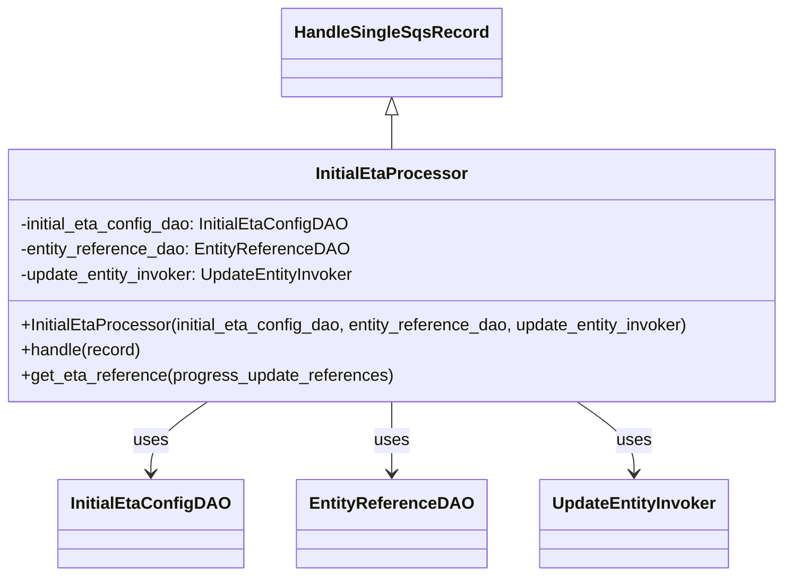
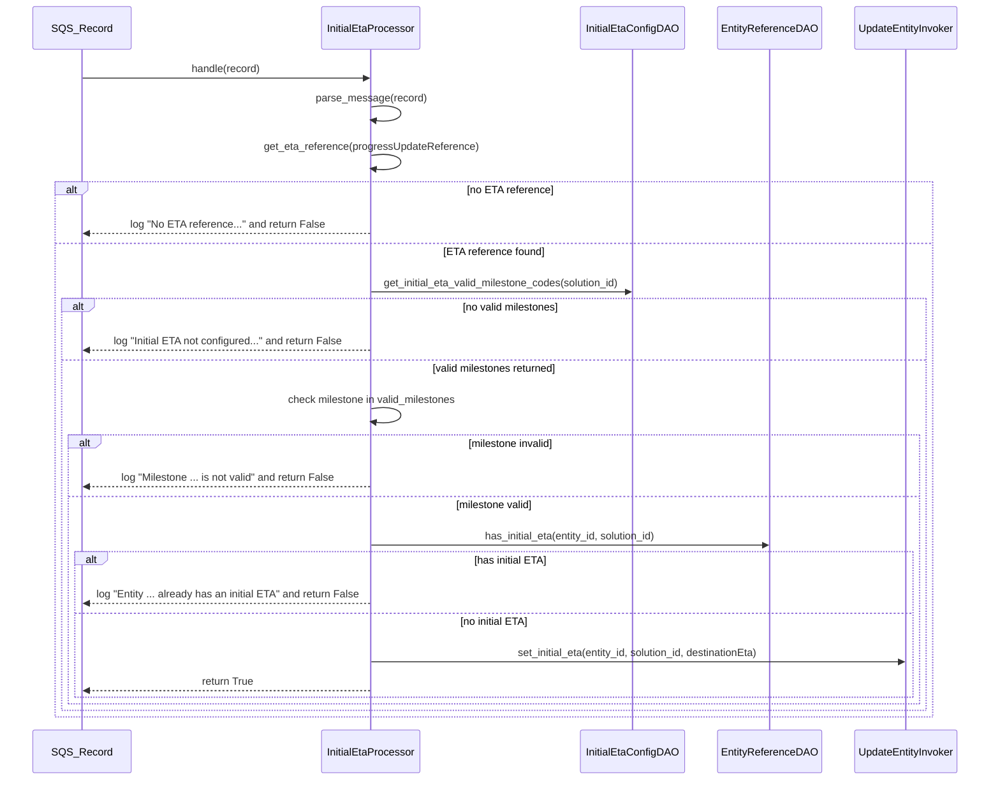

# Diagram: entity_core/entity_service/entity_listener/entity_listener_service/service/initial_eta_processor.py

> Auto-generated by Obscura crawlers

## Diagram 1

### SVG

<svg id="container" width="754.2109375" xmlns="http://www.w3.org/2000/svg" class="classDiagram" height="548" viewBox="0 0 754.2109375 548" role="graphics-document document" aria-roledescription="class"><g><defs><marker id="container_class-aggregationStart" class="marker aggregation class" refX="18" refY="7" markerWidth="190" markerHeight="240" orient="auto"><path d="M 18,7 L9,13 L1,7 L9,1 Z"></path></marker></defs><defs><marker id="container_class-aggregationEnd" class="marker aggregation class" refX="1" refY="7" markerWidth="20" markerHeight="28" orient="auto"><path d="M 18,7 L9,13 L1,7 L9,1 Z"></path></marker></defs><defs><marker id="container_class-extensionStart" class="marker extension class" refX="18" refY="7" markerWidth="190" markerHeight="240" orient="auto"><path d="M 1,7 L18,13 V 1 Z"></path></marker></defs><defs><marker id="container_class-extensionEnd" class="marker extension class" refX="1" refY="7" markerWidth="20" markerHeight="28" orient="auto"><path d="M 1,1 V 13 L18,7 Z"></path></marker></defs><defs><marker id="container_class-compositionStart" class="marker composition class" refX="18" refY="7" markerWidth="190" markerHeight="240" orient="auto"><path d="M 18,7 L9,13 L1,7 L9,1 Z"></path></marker></defs><defs><marker id="container_class-compositionEnd" class="marker composition class" refX="1" refY="7" markerWidth="20" markerHeight="28" orient="auto"><path d="M 18,7 L9,13 L1,7 L9,1 Z"></path></marker></defs><defs><marker id="container_class-dependencyStart" class="marker dependency class" refX="6" refY="7" markerWidth="190" markerHeight="240" orient="auto"><path d="M 5,7 L9,13 L1,7 L9,1 Z"></path></marker></defs><defs><marker id="container_class-dependencyEnd" class="marker dependency class" refX="13" refY="7" markerWidth="20" markerHeight="28" orient="auto"><path d="M 18,7 L9,13 L14,7 L9,1 Z"></path></marker></defs><defs><marker id="container_class-lollipopStart" class="marker lollipop class" refX="13" refY="7" markerWidth="190" markerHeight="240" orient="auto"><circle stroke="black" fill="transparent" cx="7" cy="7" r="6"></circle></marker></defs><defs><marker id="container_class-lollipopEnd" class="marker lollipop class" refX="1" refY="7" markerWidth="190" markerHeight="240" orient="auto"><circle stroke="black" fill="transparent" cx="7" cy="7" r="6"></circle></marker></defs><g class="root"><g class="clusters"></g><g class="edgePaths"><path d="M377.105,109.25L377.105,110.542C377.105,111.833,377.105,114.417,377.105,119.875C377.105,125.333,377.105,133.667,377.105,137.833L377.105,142" id="id_HandleSingleSqsRecord_InitialEtaProcessor_1" class="edge-thickness-normal edge-pattern-solid relation" style=";;;" data-edge="true" data-et="edge" data-id="id_HandleSingleSqsRecord_InitialEtaProcessor_1" data-points="W3sieCI6Mzc3LjEwNTQ2ODc1LCJ5Ijo5Mn0seyJ4IjozNzcuMTA1NDY4NzUsInkiOjExN30seyJ4IjozNzcuMTA1NDY4NzUsInkiOjE0Mn1d" marker-start="url(#container_class-extensionStart)"></path><path d="M210.487,382L201.925,388.167C193.363,394.333,176.238,406.667,167.676,418C159.113,429.333,159.113,439.667,159.113,444.833L159.113,450" id="id_InitialEtaProcessor_InitialEtaConfigDAO_2" class="edge-thickness-normal edge-pattern-solid relation" style=";;;" data-edge="true" data-et="edge" data-id="id_InitialEtaProcessor_InitialEtaConfigDAO_2" data-points="W3sieCI6MjEwLjQ4NzIzNjI2NTkyMzU3LCJ5IjozODJ9LHsieCI6MTU5LjExMzI4MTI1LCJ5Ijo0MTl9LHsieCI6MTU5LjExMzI4MTI1LCJ5Ijo0NTZ9XQ==" marker-end="url(#container_class-dependencyEnd)"></path><path d="M377.105,382L377.105,388.167C377.105,394.333,377.105,406.667,377.105,418C377.105,429.333,377.105,439.667,377.105,444.833L377.105,450" id="id_InitialEtaProcessor_EntityReferenceDAO_3" class="edge-thickness-normal edge-pattern-solid relation" style=";;;" data-edge="true" data-et="edge" data-id="id_InitialEtaProcessor_EntityReferenceDAO_3" data-points="W3sieCI6Mzc3LjEwNTQ2ODc1LCJ5IjozODJ9LHsieCI6Mzc3LjEwNTQ2ODc1LCJ5Ijo0MTl9LHsieCI6Mzc3LjEwNTQ2ODc1LCJ5Ijo0NTZ9XQ==" marker-end="url(#container_class-dependencyEnd)"></path><path d="M547.139,382L555.877,388.167C564.615,394.333,582.091,406.667,590.829,418C599.566,429.333,599.566,439.667,599.566,444.833L599.566,450" id="id_InitialEtaProcessor_UpdateEntityInvoker_4" class="edge-thickness-normal edge-pattern-solid relation" style=";;;" data-edge="true" data-et="edge" data-id="id_InitialEtaProcessor_UpdateEntityInvoker_4" data-points="W3sieCI6NTQ3LjEzOTMwNjMyOTYxNzksInkiOjM4Mn0seyJ4Ijo1OTkuNTY2NDA2MjUsInkiOjQxOX0seyJ4Ijo1OTkuNTY2NDA2MjUsInkiOjQ1Nn1d" marker-end="url(#container_class-dependencyEnd)"></path></g><g class="edgeLabels"><g class="edgeLabel"><g class="label" data-id="id_HandleSingleSqsRecord_InitialEtaProcessor_1" transform="translate(0, 0)"><foreignObject width="0" height="0">

</foreignObject></g></g><g class="edgeLabel" transform="translate(159.11328125, 419)"><g class="label" data-id="id_InitialEtaProcessor_InitialEtaConfigDAO_2" transform="translate(-16.4921875, -12)"><foreignObject width="32.984375" height="24">

uses

</foreignObject></g></g><g class="edgeLabel" transform="translate(377.10546875, 419)"><g class="label" data-id="id_InitialEtaProcessor_EntityReferenceDAO_3" transform="translate(-16.4921875, -12)"><foreignObject width="32.984375" height="24">

uses

</foreignObject></g></g><g class="edgeLabel" transform="translate(599.56640625, 419)"><g class="label" data-id="id_InitialEtaProcessor_UpdateEntityInvoker_4" transform="translate(-16.4921875, -12)"><foreignObject width="32.984375" height="24">

uses

</foreignObject></g></g></g><g class="nodes"><g class="node default" id="classId-InitialEtaProcessor-0" transform="translate(377.10546875, 262)"><g class="basic label-container"><path d="M-369.10546875 -120 L369.10546875 -120 L369.10546875 120 L-369.10546875 120" stroke="none" stroke-width="0" fill="#ECECFF" style=""></path><path d="M-369.10546875 -120 C-199.65249677156888 -120, -30.199524793137755 -120, 369.10546875 -120 M-369.10546875 -120 C-145.89334791259742 -120, 77.31877292480516 -120, 369.10546875 -120 M369.10546875 -120 C369.10546875 -69.17041187854743, 369.10546875 -18.340823757094853, 369.10546875 120 M369.10546875 -120 C369.10546875 -64.89766558644726, 369.10546875 -9.795331172894521, 369.10546875 120 M369.10546875 120 C104.34897725938453 120, -160.40751423123095 120, -369.10546875 120 M369.10546875 120 C153.22486366121097 120, -62.65574142757805 120, -369.10546875 120 M-369.10546875 120 C-369.10546875 47.13791194266379, -369.10546875 -25.724176114672417, -369.10546875 -120 M-369.10546875 120 C-369.10546875 43.60599161556604, -369.10546875 -32.78801676886792, -369.10546875 -120" stroke="#9370DB" stroke-width="1.3" fill="none" stroke-dasharray="0 0" style=""></path></g><g class="annotation-group text" transform="translate(0, -96)"></g><g class="label-group text" transform="translate(-68.6015625, -96)"><g class="label" style="font-weight: bolder" transform="translate(0,-12)"><foreignObject width="137.203125" height="24">

InitialEtaProcessor

</foreignObject></g></g><g class="members-group text" transform="translate(-357.10546875, -48)"><g class="label" style="" transform="translate(0,-12)"><foreignObject width="314.734375" height="24">

-initial_eta_config_dao: InitialEtaConfigDAO

</foreignObject></g><g class="label" style="" transform="translate(0,12)"><foreignObject width="311.578125" height="24">

-entity_reference_dao: EntityReferenceDAO

</foreignObject></g><g class="label" style="" transform="translate(0,36)"><foreignObject width="325.71875" height="24">

-update_entity_invoker: UpdateEntityInvoker

</foreignObject></g></g><g class="methods-group text" transform="translate(-357.10546875, 48)"><g class="label" style="" transform="translate(0,-12)"><foreignObject width="645.609375" height="24">

+InitialEtaProcessor(initial_eta_config_dao, entity_reference_dao, update_entity_invoker)

</foreignObject></g><g class="label" style="" transform="translate(0,12)"><foreignObject width="115.0625" height="24">

+handle(record)

</foreignObject></g><g class="label" style="" transform="translate(0,36)"><foreignObject width="353.234375" height="24">

+get_eta_reference(progress_update_references)

</foreignObject></g></g><g class="divider" style=""><path d="M-369.10546875 -72 C-140.98604803127887 -72, 87.13337268744226 -72, 369.10546875 -72 M-369.10546875 -72 C-124.0956974819153 -72, 120.91407378616941 -72, 369.10546875 -72" stroke="#9370DB" stroke-width="1.3" fill="none" stroke-dasharray="0 0" style=""></path></g><g class="divider" style=""><path d="M-369.10546875 24 C-217.6939686936067 24, -66.28246863721341 24, 369.10546875 24 M-369.10546875 24 C-169.4466661668505 24, 30.212136416299018 24, 369.10546875 24" stroke="#9370DB" stroke-width="1.3" fill="none" stroke-dasharray="0 0" style=""></path></g></g><g class="node default" id="classId-HandleSingleSqsRecord-1" transform="translate(377.10546875, 50)"><g class="basic label-container"><path d="M-99.078125 -42 L99.078125 -42 L99.078125 42 L-99.078125 42" stroke="none" stroke-width="0" fill="#ECECFF" style=""></path><path d="M-99.078125 -42 C-42.42024073649009 -42, 14.237643527019813 -42, 99.078125 -42 M-99.078125 -42 C-55.90460450256637 -42, -12.731084005132743 -42, 99.078125 -42 M99.078125 -42 C99.078125 -11.621051874755537, 99.078125 18.757896250488926, 99.078125 42 M99.078125 -42 C99.078125 -14.397842405442027, 99.078125 13.204315189115945, 99.078125 42 M99.078125 42 C53.12300873566683 42, 7.1678924713336585 42, -99.078125 42 M99.078125 42 C53.95691653146084 42, 8.835708062921682 42, -99.078125 42 M-99.078125 42 C-99.078125 24.153350627169964, -99.078125 6.306701254339927, -99.078125 -42 M-99.078125 42 C-99.078125 23.940008403416872, -99.078125 5.880016806833744, -99.078125 -42" stroke="#9370DB" stroke-width="1.3" fill="none" stroke-dasharray="0 0" style=""></path></g><g class="annotation-group text" transform="translate(0, -18)"></g><g class="label-group text" transform="translate(-87.078125, -18)"><g class="label" style="font-weight: bolder" transform="translate(0,-12)"><foreignObject width="174.15625" height="24">

HandleSingleSqsRecord

</foreignObject></g></g><g class="members-group text" transform="translate(-87.078125, 30)"></g><g class="methods-group text" transform="translate(-87.078125, 60)"></g><g class="divider" style=""><path d="M-99.078125 6 C-27.89938372056973 6, 43.27935755886054 6, 99.078125 6 M-99.078125 6 C-31.66268807171066 6, 35.75274885657868 6, 99.078125 6" stroke="#9370DB" stroke-width="1.3" fill="none" stroke-dasharray="0 0" style=""></path></g><g class="divider" style=""><path d="M-99.078125 24 C-23.773386546785602 24, 51.531351906428796 24, 99.078125 24 M-99.078125 24 C-50.70083101698421 24, -2.323537033968421 24, 99.078125 24" stroke="#9370DB" stroke-width="1.3" fill="none" stroke-dasharray="0 0" style=""></path></g></g><g class="node default" id="classId-InitialEtaConfigDAO-2" transform="translate(159.11328125, 498)"><g class="basic label-container"><path d="M-82.90625 -42 L82.90625 -42 L82.90625 42 L-82.90625 42" stroke="none" stroke-width="0" fill="#ECECFF" style=""></path><path d="M-82.90625 -42 C-38.21860560284274 -42, 6.469038794314514 -42, 82.90625 -42 M-82.90625 -42 C-39.36804212350051 -42, 4.170165752998983 -42, 82.90625 -42 M82.90625 -42 C82.90625 -19.103116406252354, 82.90625 3.793767187495291, 82.90625 42 M82.90625 -42 C82.90625 -24.334270522353854, 82.90625 -6.668541044707709, 82.90625 42 M82.90625 42 C49.13333561566908 42, 15.360421231338165 42, -82.90625 42 M82.90625 42 C38.07792044787027 42, -6.750409104259461 42, -82.90625 42 M-82.90625 42 C-82.90625 14.965234010585569, -82.90625 -12.069531978828863, -82.90625 -42 M-82.90625 42 C-82.90625 17.5526122694368, -82.90625 -6.8947754611264, -82.90625 -42" stroke="#9370DB" stroke-width="1.3" fill="none" stroke-dasharray="0 0" style=""></path></g><g class="annotation-group text" transform="translate(0, -18)"></g><g class="label-group text" transform="translate(-70.90625, -18)"><g class="label" style="font-weight: bolder" transform="translate(0,-12)"><foreignObject width="141.8125" height="24">

InitialEtaConfigDAO

</foreignObject></g></g><g class="members-group text" transform="translate(-70.90625, 30)"></g><g class="methods-group text" transform="translate(-70.90625, 60)"></g><g class="divider" style=""><path d="M-82.90625 6 C-45.67329854871958 6, -8.440347097439158 6, 82.90625 6 M-82.90625 6 C-47.937550936747705 6, -12.96885187349541 6, 82.90625 6" stroke="#9370DB" stroke-width="1.3" fill="none" stroke-dasharray="0 0" style=""></path></g><g class="divider" style=""><path d="M-82.90625 24 C-28.868097406482256 24, 25.170055187035487 24, 82.90625 24 M-82.90625 24 C-17.97636167487495 24, 46.9535266502501 24, 82.90625 24" stroke="#9370DB" stroke-width="1.3" fill="none" stroke-dasharray="0 0" style=""></path></g></g><g class="node default" id="classId-EntityReferenceDAO-3" transform="translate(377.10546875, 498)"><g class="basic label-container"><path d="M-85.0859375 -42 L85.0859375 -42 L85.0859375 42 L-85.0859375 42" stroke="none" stroke-width="0" fill="#ECECFF" style=""></path><path d="M-85.0859375 -42 C-47.713320787191016 -42, -10.340704074382032 -42, 85.0859375 -42 M-85.0859375 -42 C-29.65844243707329 -42, 25.76905262585342 -42, 85.0859375 -42 M85.0859375 -42 C85.0859375 -25.160487005428873, 85.0859375 -8.320974010857746, 85.0859375 42 M85.0859375 -42 C85.0859375 -11.345564787693725, 85.0859375 19.30887042461255, 85.0859375 42 M85.0859375 42 C46.87226113176332 42, 8.658584763526633 42, -85.0859375 42 M85.0859375 42 C23.844781016447072 42, -37.396375467105855 42, -85.0859375 42 M-85.0859375 42 C-85.0859375 21.997758691111134, -85.0859375 1.9955173822222676, -85.0859375 -42 M-85.0859375 42 C-85.0859375 19.083785458924183, -85.0859375 -3.8324290821516342, -85.0859375 -42" stroke="#9370DB" stroke-width="1.3" fill="none" stroke-dasharray="0 0" style=""></path></g><g class="annotation-group text" transform="translate(0, -18)"></g><g class="label-group text" transform="translate(-73.0859375, -18)"><g class="label" style="font-weight: bolder" transform="translate(0,-12)"><foreignObject width="146.171875" height="24">

EntityReferenceDAO

</foreignObject></g></g><g class="members-group text" transform="translate(-73.0859375, 30)"></g><g class="methods-group text" transform="translate(-73.0859375, 60)"></g><g class="divider" style=""><path d="M-85.0859375 6 C-26.243741020276126 6, 32.59845545944775 6, 85.0859375 6 M-85.0859375 6 C-33.658771537286746 6, 17.768394425426507 6, 85.0859375 6" stroke="#9370DB" stroke-width="1.3" fill="none" stroke-dasharray="0 0" style=""></path></g><g class="divider" style=""><path d="M-85.0859375 24 C-24.770060511634995 24, 35.54581647673001 24, 85.0859375 24 M-85.0859375 24 C-33.416608877898064 24, 18.252719744203873 24, 85.0859375 24" stroke="#9370DB" stroke-width="1.3" fill="none" stroke-dasharray="0 0" style=""></path></g></g><g class="node default" id="classId-UpdateEntityInvoker-4" transform="translate(599.56640625, 498)"><g class="basic label-container"><path d="M-87.375 -42 L87.375 -42 L87.375 42 L-87.375 42" stroke="none" stroke-width="0" fill="#ECECFF" style=""></path><path d="M-87.375 -42 C-38.44487169684314 -42, 10.485256606313726 -42, 87.375 -42 M-87.375 -42 C-33.55029788126436 -42, 20.274404237471273 -42, 87.375 -42 M87.375 -42 C87.375 -23.79230996203813, 87.375 -5.584619924076257, 87.375 42 M87.375 -42 C87.375 -8.771947939191143, 87.375 24.456104121617713, 87.375 42 M87.375 42 C51.22447410822078 42, 15.073948216441565 42, -87.375 42 M87.375 42 C32.063291748587055 42, -23.24841650282589 42, -87.375 42 M-87.375 42 C-87.375 9.609736028696162, -87.375 -22.780527942607677, -87.375 -42 M-87.375 42 C-87.375 9.614579769026605, -87.375 -22.77084046194679, -87.375 -42" stroke="#9370DB" stroke-width="1.3" fill="none" stroke-dasharray="0 0" style=""></path></g><g class="annotation-group text" transform="translate(0, -18)"></g><g class="label-group text" transform="translate(-75.375, -18)"><g class="label" style="font-weight: bolder" transform="translate(0,-12)"><foreignObject width="150.75" height="24">

UpdateEntityInvoker

</foreignObject></g></g><g class="members-group text" transform="translate(-75.375, 30)"></g><g class="methods-group text" transform="translate(-75.375, 60)"></g><g class="divider" style=""><path d="M-87.375 6 C-50.7908338592758 6, -14.2066677185516 6, 87.375 6 M-87.375 6 C-19.710472146825538 6, 47.954055706348925 6, 87.375 6" stroke="#9370DB" stroke-width="1.3" fill="none" stroke-dasharray="0 0" style=""></path></g><g class="divider" style=""><path d="M-87.375 24 C-30.559187559556577 24, 26.256624880886847 24, 87.375 24 M-87.375 24 C-25.836374859885154 24, 35.70225028022969 24, 87.375 24" stroke="#9370DB" stroke-width="1.3" fill="none" stroke-dasharray="0 0" style=""></path></g></g></g></g></g></svg>

## Diagram 2

### SVG

<svg id="container" width="1601" xmlns="http://www.w3.org/2000/svg" height="1237" viewBox="-50 -10 1601 1237" role="graphics-document document" aria-roledescription="sequence"><g><rect x="1332" y="1151" fill="#eaeaea" stroke="#666" width="169" height="65" name="Invoker" rx="3" ry="3" class="actor actor-bottom"></rect><text x="1416.5" y="1183.5" dominant-baseline="central" alignment-baseline="central" class="actor actor-box" style="text-anchor: middle; font-size: 16px; font-weight: 400;"><tspan x="1416.5" dy="0">UpdateEntityInvoker</tspan></text></g><g><rect x="1118" y="1151" fill="#eaeaea" stroke="#666" width="164" height="65" name="RefDAO" rx="3" ry="3" class="actor actor-bottom"></rect><text x="1200" y="1183.5" dominant-baseline="central" alignment-baseline="central" class="actor actor-box" style="text-anchor: middle; font-size: 16px; font-weight: 400;"><tspan x="1200" dy="0">EntityReferenceDAO</tspan></text></g><g><rect x="908" y="1151" fill="#eaeaea" stroke="#666" width="160" height="65" name="ConfigDAO" rx="3" ry="3" class="actor actor-bottom"></rect><text x="988" y="1183.5" dominant-baseline="central" alignment-baseline="central" class="actor actor-box" style="text-anchor: middle; font-size: 16px; font-weight: 400;"><tspan x="988" dy="0">InitialEtaConfigDAO</tspan></text></g><g><rect x="470" y="1151" fill="#eaeaea" stroke="#666" width="156" height="65" name="Processor" rx="3" ry="3" class="actor actor-bottom"></rect><text x="548" y="1183.5" dominant-baseline="central" alignment-baseline="central" class="actor actor-box" style="text-anchor: middle; font-size: 16px; font-weight: 400;"><tspan x="548" dy="0">InitialEtaProcessor</tspan></text></g><g><rect x="0" y="1151" fill="#eaeaea" stroke="#666" width="150" height="65" name="SQS" rx="3" ry="3" class="actor actor-bottom"></rect><text x="75" y="1183.5" dominant-baseline="central" alignment-baseline="central" class="actor actor-box" style="text-anchor: middle; font-size: 16px; font-weight: 400;"><tspan x="75" dy="0">SQS_Record</tspan></text></g><g><line id="actor4" x1="1416.5" y1="65" x2="1416.5" y2="1151" class="actor-line 200" stroke-width="0.5px" stroke="#999" name="Invoker"></line><g id="root-4"><rect x="1332" y="0" fill="#eaeaea" stroke="#666" width="169" height="65" name="Invoker" rx="3" ry="3" class="actor actor-top"></rect><text x="1416.5" y="32.5" dominant-baseline="central" alignment-baseline="central" class="actor actor-box" style="text-anchor: middle; font-size: 16px; font-weight: 400;"><tspan x="1416.5" dy="0">UpdateEntityInvoker</tspan></text></g></g><g><line id="actor3" x1="1200" y1="65" x2="1200" y2="1151" class="actor-line 200" stroke-width="0.5px" stroke="#999" name="RefDAO"></line><g id="root-3"><rect x="1118" y="0" fill="#eaeaea" stroke="#666" width="164" height="65" name="RefDAO" rx="3" ry="3" class="actor actor-top"></rect><text x="1200" y="32.5" dominant-baseline="central" alignment-baseline="central" class="actor actor-box" style="text-anchor: middle; font-size: 16px; font-weight: 400;"><tspan x="1200" dy="0">EntityReferenceDAO</tspan></text></g></g><g><line id="actor2" x1="988" y1="65" x2="988" y2="1151" class="actor-line 200" stroke-width="0.5px" stroke="#999" name="ConfigDAO"></line><g id="root-2"><rect x="908" y="0" fill="#eaeaea" stroke="#666" width="160" height="65" name="ConfigDAO" rx="3" ry="3" class="actor actor-top"></rect><text x="988" y="32.5" dominant-baseline="central" alignment-baseline="central" class="actor actor-box" style="text-anchor: middle; font-size: 16px; font-weight: 400;"><tspan x="988" dy="0">InitialEtaConfigDAO</tspan></text></g></g><g><line id="actor1" x1="548" y1="65" x2="548" y2="1151" class="actor-line 200" stroke-width="0.5px" stroke="#999" name="Processor"></line><g id="root-1"><rect x="470" y="0" fill="#eaeaea" stroke="#666" width="156" height="65" name="Processor" rx="3" ry="3" class="actor actor-top"></rect><text x="548" y="32.5" dominant-baseline="central" alignment-baseline="central" class="actor actor-box" style="text-anchor: middle; font-size: 16px; font-weight: 400;"><tspan x="548" dy="0">InitialEtaProcessor</tspan></text></g></g><g><line id="actor0" x1="75" y1="65" x2="75" y2="1151" class="actor-line 200" stroke-width="0.5px" stroke="#999" name="SQS"></line><g id="root-0"><rect x="0" y="0" fill="#eaeaea" stroke="#666" width="150" height="65" name="SQS" rx="3" ry="3" class="actor actor-top"></rect><text x="75" y="32.5" dominant-baseline="central" alignment-baseline="central" class="actor actor-box" style="text-anchor: middle; font-size: 16px; font-weight: 400;"><tspan x="75" dy="0">SQS_Record</tspan></text></g></g><g></g><defs><symbol id="computer" width="24" height="24"><path transform="scale(.5)" d="M2 2v13h20v-13h-20zm18 11h-16v-9h16v9zm-10.228 6l.466-1h3.524l.467 1h-4.457zm14.228 3h-24l2-6h2.104l-1.33 4h18.45l-1.297-4h2.073l2 6zm-5-10h-14v-7h14v7z"></path></symbol></defs><defs><symbol id="database" fill-rule="evenodd" clip-rule="evenodd"><path transform="scale(.5)" d="M12.258.001l.256.004.255.005.253.008.251.01.249.012.247.015.246.016.242.019.241.02.239.023.236.024.233.027.231.028.229.031.225.032.223.034.22.036.217.038.214.04.211.041.208.043.205.045.201.046.198.048.194.05.191.051.187.053.183.054.18.056.175.057.172.059.168.06.163.061.16.063.155.064.15.066.074.033.073.033.071.034.07.034.069.035.068.035.067.035.066.035.064.036.064.036.062.036.06.036.06.037.058.037.058.037.055.038.055.038.053.038.052.038.051.039.05.039.048.039.047.039.045.04.044.04.043.04.041.04.04.041.039.041.037.041.036.041.034.041.033.042.032.042.03.042.029.042.027.042.026.043.024.043.023.043.021.043.02.043.018.044.017.043.015.044.013.044.012.044.011.045.009.044.007.045.006.045.004.045.002.045.001.045v17l-.001.045-.002.045-.004.045-.006.045-.007.045-.009.044-.011.045-.012.044-.013.044-.015.044-.017.043-.018.044-.02.043-.021.043-.023.043-.024.043-.026.043-.027.042-.029.042-.03.042-.032.042-.033.042-.034.041-.036.041-.037.041-.039.041-.04.041-.041.04-.043.04-.044.04-.045.04-.047.039-.048.039-.05.039-.051.039-.052.038-.053.038-.055.038-.055.038-.058.037-.058.037-.06.037-.06.036-.062.036-.064.036-.064.036-.066.035-.067.035-.068.035-.069.035-.07.034-.071.034-.073.033-.074.033-.15.066-.155.064-.16.063-.163.061-.168.06-.172.059-.175.057-.18.056-.183.054-.187.053-.191.051-.194.05-.198.048-.201.046-.205.045-.208.043-.211.041-.214.04-.217.038-.22.036-.223.034-.225.032-.229.031-.231.028-.233.027-.236.024-.239.023-.241.02-.242.019-.246.016-.247.015-.249.012-.251.01-.253.008-.255.005-.256.004-.258.001-.258-.001-.256-.004-.255-.005-.253-.008-.251-.01-.249-.012-.247-.015-.245-.016-.243-.019-.241-.02-.238-.023-.236-.024-.234-.027-.231-.028-.228-.031-.226-.032-.223-.034-.22-.036-.217-.038-.214-.04-.211-.041-.208-.043-.204-.045-.201-.046-.198-.048-.195-.05-.19-.051-.187-.053-.184-.054-.179-.056-.176-.057-.172-.059-.167-.06-.164-.061-.159-.063-.155-.064-.151-.066-.074-.033-.072-.033-.072-.034-.07-.034-.069-.035-.068-.035-.067-.035-.066-.035-.064-.036-.063-.036-.062-.036-.061-.036-.06-.037-.058-.037-.057-.037-.056-.038-.055-.038-.053-.038-.052-.038-.051-.039-.049-.039-.049-.039-.046-.039-.046-.04-.044-.04-.043-.04-.041-.04-.04-.041-.039-.041-.037-.041-.036-.041-.034-.041-.033-.042-.032-.042-.03-.042-.029-.042-.027-.042-.026-.043-.024-.043-.023-.043-.021-.043-.02-.043-.018-.044-.017-.043-.015-.044-.013-.044-.012-.044-.011-.045-.009-.044-.007-.045-.006-.045-.004-.045-.002-.045-.001-.045v-17l.001-.045.002-.045.004-.045.006-.045.007-.045.009-.044.011-.045.012-.044.013-.044.015-.044.017-.043.018-.044.02-.043.021-.043.023-.043.024-.043.026-.043.027-.042.029-.042.03-.042.032-.042.033-.042.034-.041.036-.041.037-.041.039-.041.04-.041.041-.04.043-.04.044-.04.046-.04.046-.039.049-.039.049-.039.051-.039.052-.038.053-.038.055-.038.056-.038.057-.037.058-.037.06-.037.061-.036.062-.036.063-.036.064-.036.066-.035.067-.035.068-.035.069-.035.07-.034.072-.034.072-.033.074-.033.151-.066.155-.064.159-.063.164-.061.167-.06.172-.059.176-.057.179-.056.184-.054.187-.053.19-.051.195-.05.198-.048.201-.046.204-.045.208-.043.211-.041.214-.04.217-.038.22-.036.223-.034.226-.032.228-.031.231-.028.234-.027.236-.024.238-.023.241-.02.243-.019.245-.016.247-.015.249-.012.251-.01.253-.008.255-.005.256-.004.258-.001.258.001zm-9.258 20.499v.01l.001.021.003.021.004.022.005.021.006.022.007.022.009.023.01.022.011.023.012.023.013.023.015.023.016.024.017.023.018.024.019.024.021.024.022.025.023.024.024.025.052.049.056.05.061.051.066.051.07.051.075.051.079.052.084.052.088.052.092.052.097.052.102.051.105.052.11.052.114.051.119.051.123.051.127.05.131.05.135.05.139.048.144.049.147.047.152.047.155.047.16.045.163.045.167.043.171.043.176.041.178.041.183.039.187.039.19.037.194.035.197.035.202.033.204.031.209.03.212.029.216.027.219.025.222.024.226.021.23.02.233.018.236.016.24.015.243.012.246.01.249.008.253.005.256.004.259.001.26-.001.257-.004.254-.005.25-.008.247-.011.244-.012.241-.014.237-.016.233-.018.231-.021.226-.021.224-.024.22-.026.216-.027.212-.028.21-.031.205-.031.202-.034.198-.034.194-.036.191-.037.187-.039.183-.04.179-.04.175-.042.172-.043.168-.044.163-.045.16-.046.155-.046.152-.047.148-.048.143-.049.139-.049.136-.05.131-.05.126-.05.123-.051.118-.052.114-.051.11-.052.106-.052.101-.052.096-.052.092-.052.088-.053.083-.051.079-.052.074-.052.07-.051.065-.051.06-.051.056-.05.051-.05.023-.024.023-.025.021-.024.02-.024.019-.024.018-.024.017-.024.015-.023.014-.024.013-.023.012-.023.01-.023.01-.022.008-.022.006-.022.006-.022.004-.022.004-.021.001-.021.001-.021v-4.127l-.077.055-.08.053-.083.054-.085.053-.087.052-.09.052-.093.051-.095.05-.097.05-.1.049-.102.049-.105.048-.106.047-.109.047-.111.046-.114.045-.115.045-.118.044-.12.043-.122.042-.124.042-.126.041-.128.04-.13.04-.132.038-.134.038-.135.037-.138.037-.139.035-.142.035-.143.034-.144.033-.147.032-.148.031-.15.03-.151.03-.153.029-.154.027-.156.027-.158.026-.159.025-.161.024-.162.023-.163.022-.165.021-.166.02-.167.019-.169.018-.169.017-.171.016-.173.015-.173.014-.175.013-.175.012-.177.011-.178.01-.179.008-.179.008-.181.006-.182.005-.182.004-.184.003-.184.002h-.37l-.184-.002-.184-.003-.182-.004-.182-.005-.181-.006-.179-.008-.179-.008-.178-.01-.176-.011-.176-.012-.175-.013-.173-.014-.172-.015-.171-.016-.17-.017-.169-.018-.167-.019-.166-.02-.165-.021-.163-.022-.162-.023-.161-.024-.159-.025-.157-.026-.156-.027-.155-.027-.153-.029-.151-.03-.15-.03-.148-.031-.146-.032-.145-.033-.143-.034-.141-.035-.14-.035-.137-.037-.136-.037-.134-.038-.132-.038-.13-.04-.128-.04-.126-.041-.124-.042-.122-.042-.12-.044-.117-.043-.116-.045-.113-.045-.112-.046-.109-.047-.106-.047-.105-.048-.102-.049-.1-.049-.097-.05-.095-.05-.093-.052-.09-.051-.087-.052-.085-.053-.083-.054-.08-.054-.077-.054v4.127zm0-5.654v.011l.001.021.003.021.004.021.005.022.006.022.007.022.009.022.01.022.011.023.012.023.013.023.015.024.016.023.017.024.018.024.019.024.021.024.022.024.023.025.024.024.052.05.056.05.061.05.066.051.07.051.075.052.079.051.084.052.088.052.092.052.097.052.102.052.105.052.11.051.114.051.119.052.123.05.127.051.131.05.135.049.139.049.144.048.147.048.152.047.155.046.16.045.163.045.167.044.171.042.176.042.178.04.183.04.187.038.19.037.194.036.197.034.202.033.204.032.209.03.212.028.216.027.219.025.222.024.226.022.23.02.233.018.236.016.24.014.243.012.246.01.249.008.253.006.256.003.259.001.26-.001.257-.003.254-.006.25-.008.247-.01.244-.012.241-.015.237-.016.233-.018.231-.02.226-.022.224-.024.22-.025.216-.027.212-.029.21-.03.205-.032.202-.033.198-.035.194-.036.191-.037.187-.039.183-.039.179-.041.175-.042.172-.043.168-.044.163-.045.16-.045.155-.047.152-.047.148-.048.143-.048.139-.05.136-.049.131-.05.126-.051.123-.051.118-.051.114-.052.11-.052.106-.052.101-.052.096-.052.092-.052.088-.052.083-.052.079-.052.074-.051.07-.052.065-.051.06-.05.056-.051.051-.049.023-.025.023-.024.021-.025.02-.024.019-.024.018-.024.017-.024.015-.023.014-.023.013-.024.012-.022.01-.023.01-.023.008-.022.006-.022.006-.022.004-.021.004-.022.001-.021.001-.021v-4.139l-.077.054-.08.054-.083.054-.085.052-.087.053-.09.051-.093.051-.095.051-.097.05-.1.049-.102.049-.105.048-.106.047-.109.047-.111.046-.114.045-.115.044-.118.044-.12.044-.122.042-.124.042-.126.041-.128.04-.13.039-.132.039-.134.038-.135.037-.138.036-.139.036-.142.035-.143.033-.144.033-.147.033-.148.031-.15.03-.151.03-.153.028-.154.028-.156.027-.158.026-.159.025-.161.024-.162.023-.163.022-.165.021-.166.02-.167.019-.169.018-.169.017-.171.016-.173.015-.173.014-.175.013-.175.012-.177.011-.178.009-.179.009-.179.007-.181.007-.182.005-.182.004-.184.003-.184.002h-.37l-.184-.002-.184-.003-.182-.004-.182-.005-.181-.007-.179-.007-.179-.009-.178-.009-.176-.011-.176-.012-.175-.013-.173-.014-.172-.015-.171-.016-.17-.017-.169-.018-.167-.019-.166-.02-.165-.021-.163-.022-.162-.023-.161-.024-.159-.025-.157-.026-.156-.027-.155-.028-.153-.028-.151-.03-.15-.03-.148-.031-.146-.033-.145-.033-.143-.033-.141-.035-.14-.036-.137-.036-.136-.037-.134-.038-.132-.039-.13-.039-.128-.04-.126-.041-.124-.042-.122-.043-.12-.043-.117-.044-.116-.044-.113-.046-.112-.046-.109-.046-.106-.047-.105-.048-.102-.049-.1-.049-.097-.05-.095-.051-.093-.051-.09-.051-.087-.053-.085-.052-.083-.054-.08-.054-.077-.054v4.139zm0-5.666v.011l.001.02.003.022.004.021.005.022.006.021.007.022.009.023.01.022.011.023.012.023.013.023.015.023.016.024.017.024.018.023.019.024.021.025.022.024.023.024.024.025.052.05.056.05.061.05.066.051.07.051.075.052.079.051.084.052.088.052.092.052.097.052.102.052.105.051.11.052.114.051.119.051.123.051.127.05.131.05.135.05.139.049.144.048.147.048.152.047.155.046.16.045.163.045.167.043.171.043.176.042.178.04.183.04.187.038.19.037.194.036.197.034.202.033.204.032.209.03.212.028.216.027.219.025.222.024.226.021.23.02.233.018.236.017.24.014.243.012.246.01.249.008.253.006.256.003.259.001.26-.001.257-.003.254-.006.25-.008.247-.01.244-.013.241-.014.237-.016.233-.018.231-.02.226-.022.224-.024.22-.025.216-.027.212-.029.21-.03.205-.032.202-.033.198-.035.194-.036.191-.037.187-.039.183-.039.179-.041.175-.042.172-.043.168-.044.163-.045.16-.045.155-.047.152-.047.148-.048.143-.049.139-.049.136-.049.131-.051.126-.05.123-.051.118-.052.114-.051.11-.052.106-.052.101-.052.096-.052.092-.052.088-.052.083-.052.079-.052.074-.052.07-.051.065-.051.06-.051.056-.05.051-.049.023-.025.023-.025.021-.024.02-.024.019-.024.018-.024.017-.024.015-.023.014-.024.013-.023.012-.023.01-.022.01-.023.008-.022.006-.022.006-.022.004-.022.004-.021.001-.021.001-.021v-4.153l-.077.054-.08.054-.083.053-.085.053-.087.053-.09.051-.093.051-.095.051-.097.05-.1.049-.102.048-.105.048-.106.048-.109.046-.111.046-.114.046-.115.044-.118.044-.12.043-.122.043-.124.042-.126.041-.128.04-.13.039-.132.039-.134.038-.135.037-.138.036-.139.036-.142.034-.143.034-.144.033-.147.032-.148.032-.15.03-.151.03-.153.028-.154.028-.156.027-.158.026-.159.024-.161.024-.162.023-.163.023-.165.021-.166.02-.167.019-.169.018-.169.017-.171.016-.173.015-.173.014-.175.013-.175.012-.177.01-.178.01-.179.009-.179.007-.181.006-.182.006-.182.004-.184.003-.184.001-.185.001-.185-.001-.184-.001-.184-.003-.182-.004-.182-.006-.181-.006-.179-.007-.179-.009-.178-.01-.176-.01-.176-.012-.175-.013-.173-.014-.172-.015-.171-.016-.17-.017-.169-.018-.167-.019-.166-.02-.165-.021-.163-.023-.162-.023-.161-.024-.159-.024-.157-.026-.156-.027-.155-.028-.153-.028-.151-.03-.15-.03-.148-.032-.146-.032-.145-.033-.143-.034-.141-.034-.14-.036-.137-.036-.136-.037-.134-.038-.132-.039-.13-.039-.128-.041-.126-.041-.124-.041-.122-.043-.12-.043-.117-.044-.116-.044-.113-.046-.112-.046-.109-.046-.106-.048-.105-.048-.102-.048-.1-.05-.097-.049-.095-.051-.093-.051-.09-.052-.087-.052-.085-.053-.083-.053-.08-.054-.077-.054v4.153zm8.74-8.179l-.257.004-.254.005-.25.008-.247.011-.244.012-.241.014-.237.016-.233.018-.231.021-.226.022-.224.023-.22.026-.216.027-.212.028-.21.031-.205.032-.202.033-.198.034-.194.036-.191.038-.187.038-.183.04-.179.041-.175.042-.172.043-.168.043-.163.045-.16.046-.155.046-.152.048-.148.048-.143.048-.139.049-.136.05-.131.05-.126.051-.123.051-.118.051-.114.052-.11.052-.106.052-.101.052-.096.052-.092.052-.088.052-.083.052-.079.052-.074.051-.07.052-.065.051-.06.05-.056.05-.051.05-.023.025-.023.024-.021.024-.02.025-.019.024-.018.024-.017.023-.015.024-.014.023-.013.023-.012.023-.01.023-.01.022-.008.022-.006.023-.006.021-.004.022-.004.021-.001.021-.001.021.001.021.001.021.004.021.004.022.006.021.006.023.008.022.01.022.01.023.012.023.013.023.014.023.015.024.017.023.018.024.019.024.02.025.021.024.023.024.023.025.051.05.056.05.06.05.065.051.07.052.074.051.079.052.083.052.088.052.092.052.096.052.101.052.106.052.11.052.114.052.118.051.123.051.126.051.131.05.136.05.139.049.143.048.148.048.152.048.155.046.16.046.163.045.168.043.172.043.175.042.179.041.183.04.187.038.191.038.194.036.198.034.202.033.205.032.21.031.212.028.216.027.22.026.224.023.226.022.231.021.233.018.237.016.241.014.244.012.247.011.25.008.254.005.257.004.26.001.26-.001.257-.004.254-.005.25-.008.247-.011.244-.012.241-.014.237-.016.233-.018.231-.021.226-.022.224-.023.22-.026.216-.027.212-.028.21-.031.205-.032.202-.033.198-.034.194-.036.191-.038.187-.038.183-.04.179-.041.175-.042.172-.043.168-.043.163-.045.16-.046.155-.046.152-.048.148-.048.143-.048.139-.049.136-.05.131-.05.126-.051.123-.051.118-.051.114-.052.11-.052.106-.052.101-.052.096-.052.092-.052.088-.052.083-.052.079-.052.074-.051.07-.052.065-.051.06-.05.056-.05.051-.05.023-.025.023-.024.021-.024.02-.025.019-.024.018-.024.017-.023.015-.024.014-.023.013-.023.012-.023.01-.023.01-.022.008-.022.006-.023.006-.021.004-.022.004-.021.001-.021.001-.021-.001-.021-.001-.021-.004-.021-.004-.022-.006-.021-.006-.023-.008-.022-.01-.022-.01-.023-.012-.023-.013-.023-.014-.023-.015-.024-.017-.023-.018-.024-.019-.024-.02-.025-.021-.024-.023-.024-.023-.025-.051-.05-.056-.05-.06-.05-.065-.051-.07-.052-.074-.051-.079-.052-.083-.052-.088-.052-.092-.052-.096-.052-.101-.052-.106-.052-.11-.052-.114-.052-.118-.051-.123-.051-.126-.051-.131-.05-.136-.05-.139-.049-.143-.048-.148-.048-.152-.048-.155-.046-.16-.046-.163-.045-.168-.043-.172-.043-.175-.042-.179-.041-.183-.04-.187-.038-.191-.038-.194-.036-.198-.034-.202-.033-.205-.032-.21-.031-.212-.028-.216-.027-.22-.026-.224-.023-.226-.022-.231-.021-.233-.018-.237-.016-.241-.014-.244-.012-.247-.011-.25-.008-.254-.005-.257-.004-.26-.001-.26.001z"></path></symbol></defs><defs><symbol id="clock" width="24" height="24"><path transform="scale(.5)" d="M12 2c5.514 0 10 4.486 10 10s-4.486 10-10 10-10-4.486-10-10 4.486-10 10-10zm0-2c-6.627 0-12 5.373-12 12s5.373 12 12 12 12-5.373 12-12-5.373-12-12-12zm5.848 12.459c.202.038.202.333.001.372-1.907.361-6.045 1.111-6.547 1.111-.719 0-1.301-.582-1.301-1.301 0-.512.77-5.447 1.125-7.445.034-.192.312-.181.343.014l.985 6.238 5.394 1.011z"></path></symbol></defs><defs><marker id="arrowhead" refX="7.9" refY="5" markerUnits="userSpaceOnUse" markerWidth="12" markerHeight="12" orient="auto-start-reverse"><path d="M -1 0 L 10 5 L 0 10 z"></path></marker></defs><defs><marker id="crosshead" markerWidth="15" markerHeight="8" orient="auto" refX="4" refY="4.5"><path fill="none" stroke="#000000" stroke-width="1pt" d="M 1,2 L 6,7 M 6,2 L 1,7" style="stroke-dasharray: 0, 0;"></path></marker></defs><defs><marker id="filled-head" refX="15.5" refY="7" markerWidth="20" markerHeight="28" orient="auto"><path d="M 18,7 L9,13 L14,7 L9,1 Z"></path></marker></defs><defs><marker id="sequencenumber" refX="15" refY="15" markerWidth="60" markerHeight="40" orient="auto"><circle cx="15" cy="15" r="6"></circle></marker></defs><g><line x1="64" y1="867" x2="1427.5" y2="867" class="loopLine"></line><line x1="1427.5" y1="867" x2="1427.5" y2="1101" class="loopLine"></line><line x1="64" y1="1101" x2="1427.5" y2="1101" class="loopLine"></line><line x1="64" y1="867" x2="64" y2="1101" class="loopLine"></line><line x1="64" y1="965" x2="1427.5" y2="965" class="loopLine" style="stroke-dasharray: 3, 3;"></line><polygon points="64,867 114,867 114,880 105.6,887 64,887" class="labelBox"></polygon><text x="89" y="880" text-anchor="middle" dominant-baseline="middle" alignment-baseline="middle" class="labelText" style="font-size: 16px; font-weight: 400;">alt</text><text x="770.75" y="885" text-anchor="middle" class="loopText" style="font-size: 16px; font-weight: 400;"><tspan x="770.75">[has initial ETA]</tspan></text><text x="745.75" y="983" text-anchor="middle" class="loopText" style="font-size: 16px; font-weight: 400;">[no initial ETA]</text></g><g><line x1="54" y1="681" x2="1437.5" y2="681" class="loopLine"></line><line x1="1437.5" y1="681" x2="1437.5" y2="1111" class="loopLine"></line><line x1="54" y1="1111" x2="1437.5" y2="1111" class="loopLine"></line><line x1="54" y1="681" x2="54" y2="1111" class="loopLine"></line><line x1="54" y1="779" x2="1437.5" y2="779" class="loopLine" style="stroke-dasharray: 3, 3;"></line><polygon points="54,681 104,681 104,694 95.6,701 54,701" class="labelBox"></polygon><text x="79" y="694" text-anchor="middle" dominant-baseline="middle" alignment-baseline="middle" class="labelText" style="font-size: 16px; font-weight: 400;">alt</text><text x="770.75" y="699" text-anchor="middle" class="loopText" style="font-size: 16px; font-weight: 400;"><tspan x="770.75">[milestone invalid]</tspan></text><text x="745.75" y="797" text-anchor="middle" class="loopText" style="font-size: 16px; font-weight: 400;">[milestone valid]</text></g><g><line x1="44" y1="465" x2="1447.5" y2="465" class="loopLine"></line><line x1="1447.5" y1="465" x2="1447.5" y2="1121" class="loopLine"></line><line x1="44" y1="1121" x2="1447.5" y2="1121" class="loopLine"></line><line x1="44" y1="465" x2="44" y2="1121" class="loopLine"></line><line x1="44" y1="563" x2="1447.5" y2="563" class="loopLine" style="stroke-dasharray: 3, 3;"></line><polygon points="44,465 94,465 94,478 85.6,485 44,485" class="labelBox"></polygon><text x="69" y="478" text-anchor="middle" dominant-baseline="middle" alignment-baseline="middle" class="labelText" style="font-size: 16px; font-weight: 400;">alt</text><text x="770.75" y="483" text-anchor="middle" class="loopText" style="font-size: 16px; font-weight: 400;"><tspan x="770.75">[no valid milestones]</tspan></text><text x="745.75" y="581" text-anchor="middle" class="loopText" style="font-size: 16px; font-weight: 400;">[valid milestones returned]</text></g><g><line x1="34" y1="279" x2="1457.5" y2="279" class="loopLine"></line><line x1="1457.5" y1="279" x2="1457.5" y2="1131" class="loopLine"></line><line x1="34" y1="1131" x2="1457.5" y2="1131" class="loopLine"></line><line x1="34" y1="279" x2="34" y2="1131" class="loopLine"></line><line x1="34" y1="377" x2="1457.5" y2="377" class="loopLine" style="stroke-dasharray: 3, 3;"></line><polygon points="34,279 84,279 84,292 75.6,299 34,299" class="labelBox"></polygon><text x="59" y="292" text-anchor="middle" dominant-baseline="middle" alignment-baseline="middle" class="labelText" style="font-size: 16px; font-weight: 400;">alt</text><text x="770.75" y="297" text-anchor="middle" class="loopText" style="font-size: 16px; font-weight: 400;"><tspan x="770.75">[no ETA reference]</tspan></text><text x="745.75" y="395" text-anchor="middle" class="loopText" style="font-size: 16px; font-weight: 400;">[ETA reference found]</text></g><text x="310" y="80" text-anchor="middle" dominant-baseline="middle" alignment-baseline="middle" class="messageText" dy="1em" style="font-size: 16px; font-weight: 400;">handle(record)</text><line x1="76" y1="113" x2="544" y2="113" class="messageLine0" stroke-width="2" stroke="none" marker-end="url(#arrowhead)" style="fill: none;"></line><text x="549" y="128" text-anchor="middle" dominant-baseline="middle" alignment-baseline="middle" class="messageText" dy="1em" style="font-size: 16px; font-weight: 400;">parse_message(record)</text><path d="M 549,161 C 609,151 609,191 549,181" class="messageLine0" stroke-width="2" stroke="none" marker-end="url(#arrowhead)" style="fill: none;"></path><text x="549" y="206" text-anchor="middle" dominant-baseline="middle" alignment-baseline="middle" class="messageText" dy="1em" style="font-size: 16px; font-weight: 400;">get_eta_reference(progressUpdateReference)</text><path d="M 549,239 C 609,229 609,269 549,259" class="messageLine0" stroke-width="2" stroke="none" marker-end="url(#arrowhead)" style="fill: none;"></path><text x="313" y="329" text-anchor="middle" dominant-baseline="middle" alignment-baseline="middle" class="messageText" dy="1em" style="font-size: 16px; font-weight: 400;">log "No ETA reference..." and return False</text><line x1="547" y1="362" x2="79" y2="362" class="messageLine1" stroke-width="2" stroke="none" marker-end="url(#arrowhead)" style="stroke-dasharray: 3, 3; fill: none;"></line><text x="767" y="422" text-anchor="middle" dominant-baseline="middle" alignment-baseline="middle" class="messageText" dy="1em" style="font-size: 16px; font-weight: 400;">get_initial_eta_valid_milestone_codes(solution_id)</text><line x1="549" y1="455" x2="984" y2="455" class="messageLine0" stroke-width="2" stroke="none" marker-end="url(#arrowhead)" style="fill: none;"></line><text x="313" y="515" text-anchor="middle" dominant-baseline="middle" alignment-baseline="middle" class="messageText" dy="1em" style="font-size: 16px; font-weight: 400;">log "Initial ETA not configured..." and return False</text><line x1="547" y1="548" x2="79" y2="548" class="messageLine1" stroke-width="2" stroke="none" marker-end="url(#arrowhead)" style="stroke-dasharray: 3, 3; fill: none;"></line><text x="549" y="608" text-anchor="middle" dominant-baseline="middle" alignment-baseline="middle" class="messageText" dy="1em" style="font-size: 16px; font-weight: 400;">check milestone in valid_milestones</text><path d="M 549,641 C 609,631 609,671 549,661" class="messageLine0" stroke-width="2" stroke="none" marker-end="url(#arrowhead)" style="fill: none;"></path><text x="313" y="731" text-anchor="middle" dominant-baseline="middle" alignment-baseline="middle" class="messageText" dy="1em" style="font-size: 16px; font-weight: 400;">log "Milestone ... is not valid" and return False</text><line x1="547" y1="764" x2="79" y2="764" class="messageLine1" stroke-width="2" stroke="none" marker-end="url(#arrowhead)" style="stroke-dasharray: 3, 3; fill: none;"></line><text x="873" y="824" text-anchor="middle" dominant-baseline="middle" alignment-baseline="middle" class="messageText" dy="1em" style="font-size: 16px; font-weight: 400;">has_initial_eta(entity_id, solution_id)</text><line x1="549" y1="857" x2="1196" y2="857" class="messageLine0" stroke-width="2" stroke="none" marker-end="url(#arrowhead)" style="fill: none;"></line><text x="313" y="917" text-anchor="middle" dominant-baseline="middle" alignment-baseline="middle" class="messageText" dy="1em" style="font-size: 16px; font-weight: 400;">log "Entity ... already has an initial ETA" and return False</text><line x1="547" y1="950" x2="79" y2="950" class="messageLine1" stroke-width="2" stroke="none" marker-end="url(#arrowhead)" style="stroke-dasharray: 3, 3; fill: none;"></line><text x="981" y="1010" text-anchor="middle" dominant-baseline="middle" alignment-baseline="middle" class="messageText" dy="1em" style="font-size: 16px; font-weight: 400;">set_initial_eta(entity_id, solution_id, destinationEta)</text><line x1="549" y1="1043" x2="1412.5" y2="1043" class="messageLine0" stroke-width="2" stroke="none" marker-end="url(#arrowhead)" style="fill: none;"></line><text x="313" y="1058" text-anchor="middle" dominant-baseline="middle" alignment-baseline="middle" class="messageText" dy="1em" style="font-size: 16px; font-weight: 400;">return True</text><line x1="547" y1="1091" x2="79" y2="1091" class="messageLine1" stroke-width="2" stroke="none" marker-end="url(#arrowhead)" style="stroke-dasharray: 3, 3; fill: none;"></line></svg>
