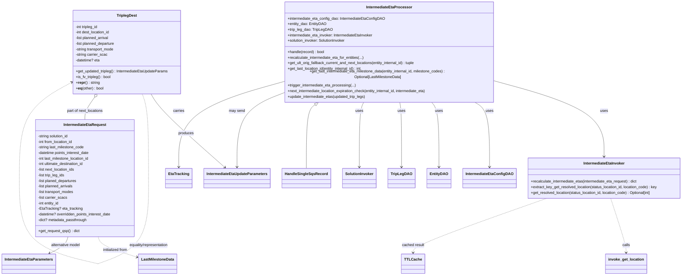
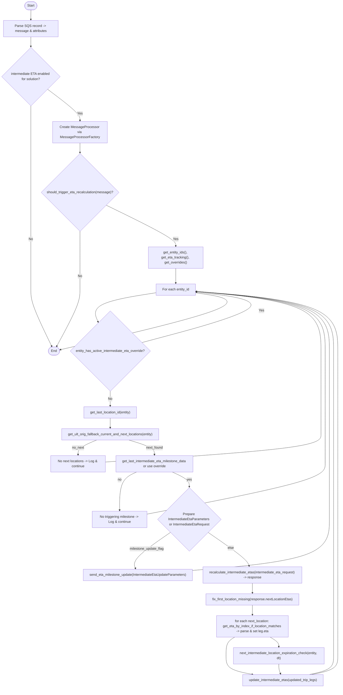

# Diagram: entity_core/entity_service/entity_listener/entity_listener_service/service/intermediate_eta_processor.py

> Auto-generated by Obscura crawlers

## Diagram 1

### SVG

<svg id="container" width="2890.89013671875" xmlns="http://www.w3.org/2000/svg" class="classDiagram" height="1160" viewBox="0 0 2890.89013671875 1160" role="graphics-document document" aria-roledescription="class"><g><defs><marker id="container_class-aggregationStart" class="marker aggregation class" refX="18" refY="7" markerWidth="190" markerHeight="240" orient="auto"><path d="M 18,7 L9,13 L1,7 L9,1 Z"></path></marker></defs><defs><marker id="container_class-aggregationEnd" class="marker aggregation class" refX="1" refY="7" markerWidth="20" markerHeight="28" orient="auto"><path d="M 18,7 L9,13 L1,7 L9,1 Z"></path></marker></defs><defs><marker id="container_class-extensionStart" class="marker extension class" refX="18" refY="7" markerWidth="190" markerHeight="240" orient="auto"><path d="M 1,7 L18,13 V 1 Z"></path></marker></defs><defs><marker id="container_class-extensionEnd" class="marker extension class" refX="1" refY="7" markerWidth="20" markerHeight="28" orient="auto"><path d="M 1,1 V 13 L18,7 Z"></path></marker></defs><defs><marker id="container_class-compositionStart" class="marker composition class" refX="18" refY="7" markerWidth="190" markerHeight="240" orient="auto"><path d="M 18,7 L9,13 L1,7 L9,1 Z"></path></marker></defs><defs><marker id="container_class-compositionEnd" class="marker composition class" refX="1" refY="7" markerWidth="20" markerHeight="28" orient="auto"><path d="M 18,7 L9,13 L1,7 L9,1 Z"></path></marker></defs><defs><marker id="container_class-dependencyStart" class="marker dependency class" refX="6" refY="7" markerWidth="190" markerHeight="240" orient="auto"><path d="M 5,7 L9,13 L1,7 L9,1 Z"></path></marker></defs><defs><marker id="container_class-dependencyEnd" class="marker dependency class" refX="13" refY="7" markerWidth="20" markerHeight="28" orient="auto"><path d="M 18,7 L9,13 L14,7 L9,1 Z"></path></marker></defs><defs><marker id="container_class-lollipopStart" class="marker lollipop class" refX="13" refY="7" markerWidth="190" markerHeight="240" orient="auto"><circle stroke="black" fill="transparent" cx="7" cy="7" r="6"></circle></marker></defs><defs><marker id="container_class-lollipopEnd" class="marker lollipop class" refX="1" refY="7" markerWidth="190" markerHeight="240" orient="auto"><circle stroke="black" fill="transparent" cx="7" cy="7" r="6"></circle></marker></defs><g class="root"><g class="clusters"></g><g class="edgePaths"><path d="M659.769,392L666.239,402.167C672.708,412.333,685.647,432.667,737.174,483.332C788.701,533.996,878.817,614.993,923.875,655.491L968.933,695.989" id="id_TriplegDest_IntermediateEtaUpdateParameters_1" class="edge-thickness-normal edge-pattern-solid relation" style=";;;" data-edge="true" data-et="edge" data-id="id_TriplegDest_IntermediateEtaUpdateParameters_1" data-points="W3sieCI6NjU5Ljc2OTMzMzUwNjY5MDgsInkiOjM5Mn0seyJ4Ijo2OTguNTg1NTQ2ODc1MzcyNSwieSI6NDUzfSx7IngiOjk3My4zOTU3NDkwODEyNTQ4LCJ5Ijo3MDB9XQ==" marker-end="url(#container_class-dependencyEnd)"></path><path d="M421.633,994L423.12,1000.167C424.608,1006.333,427.582,1018.667,456.351,1033.476C485.12,1048.284,539.683,1065.569,566.964,1074.211L594.246,1082.853" id="id_IntermediateEtaRequest_LastMilestoneData_2" class="edge-thickness-normal edge-pattern-dashed relation" style=";;;" data-edge="true" data-et="edge" data-id="id_IntermediateEtaRequest_LastMilestoneData_2" data-points="W3sieCI6NDIxLjYzMzIxMTIzNDg2MTYsInkiOjk5NH0seyJ4Ijo0MzAuNTU2NjQwNjI1LCJ5IjoxMDMxfSx7IngiOjU5OS45NjU2MjUwMDExMTc2LCJ5IjoxMDg0LjY2NTEzNzkwOTM4MTJ9XQ==" marker-end="url(#container_class-dependencyEnd)"></path><path d="M2115.454,335.97L2188.315,355.475C2261.176,374.98,2406.898,413.99,2479.76,466.162C2552.621,518.333,2552.621,583.667,2552.621,616.333L2552.621,649" id="id_IntermediateEtaProcessor_IntermediateEtaInvoker_3" class="edge-thickness-normal edge-pattern-solid relation" style=";;;" data-edge="true" data-et="edge" data-id="id_IntermediateEtaProcessor_IntermediateEtaInvoker_3" data-points="W3sieCI6MjExNS40NTM5MDYyNTExMTc2LCJ5IjozMzUuOTY5ODE4NTAyMzc4NjR9LHsieCI6MjU1Mi42MjA3MDMxMjUzNzI1LCJ5Ijo0NTN9LHsieCI6MjU1Mi42MjA3MDMxMjUzNzI1LCJ5Ijo2NTV9XQ==" marker-end="url(#container_class-dependencyEnd)"></path><path d="M2000.108,416L2010.62,422.167C2021.132,428.333,2042.156,440.667,2052.667,487C2063.179,533.333,2063.179,613.667,2063.179,653.833L2063.179,694" id="id_IntermediateEtaProcessor_IntermediateEtaConfigDAO_4" class="edge-thickness-normal edge-pattern-solid relation" style=";;;" data-edge="true" data-et="edge" data-id="id_IntermediateEtaProcessor_IntermediateEtaConfigDAO_4" data-points="W3sieCI6MjAwMC4xMDgwNzgzMTk5ODksInkiOjQxNn0seyJ4IjoyMDYzLjE3OTI5Njg3NTM3MjUsInkiOjQ1M30seyJ4IjoyMDYzLjE3OTI5Njg3NTM3MjUsInkiOjcwMH1d" marker-end="url(#container_class-dependencyEnd)"></path><path d="M1824.253,416L1829.449,422.167C1834.645,428.333,1845.037,440.667,1850.233,487C1855.429,533.333,1855.429,613.667,1855.429,653.833L1855.429,694" id="id_IntermediateEtaProcessor_EntityDAO_5" class="edge-thickness-normal edge-pattern-solid relation" style=";;;" data-edge="true" data-et="edge" data-id="id_IntermediateEtaProcessor_EntityDAO_5" data-points="W3sieCI6MTgyNC4yNTMzMDY1MzU3NTY2LCJ5Ijo0MTZ9LHsieCI6MTg1NS40MjkyOTY4NzUzNzI1LCJ5Ijo0NTN9LHsieCI6MTg1NS40MjkyOTY4NzUzNzI1LCJ5Ijo3MDB9XQ==" marker-end="url(#container_class-dependencyEnd)"></path><path d="M1694.802,416L1696.085,422.167C1697.368,428.333,1699.934,440.667,1701.217,487C1702.5,533.333,1702.5,613.667,1702.5,653.833L1702.5,694" id="id_IntermediateEtaProcessor_TripLegDAO_6" class="edge-thickness-normal edge-pattern-solid relation" style=";;;" data-edge="true" data-et="edge" data-id="id_IntermediateEtaProcessor_TripLegDAO_6" data-points="W3sieCI6MTY5NC44MDI0NTA3MjY2MjgsInkiOjQxNn0seyJ4IjoxNzAyLjQ5OTYwOTM3NTM3MjUsInkiOjQ1M30seyJ4IjoxNzAyLjQ5OTYwOTM3NTM3MjUsInkiOjcwMH1d" marker-end="url(#container_class-dependencyEnd)"></path><path d="M1546.881,416L1543.693,422.167C1540.504,428.333,1534.127,440.667,1530.938,487C1527.75,533.333,1527.75,613.667,1527.75,653.833L1527.75,694" id="id_IntermediateEtaProcessor_SolutionInvoker_7" class="edge-thickness-normal edge-pattern-solid relation" style=";;;" data-edge="true" data-et="edge" data-id="id_IntermediateEtaProcessor_SolutionInvoker_7" data-points="W3sieCI6MTU0Ni44ODEyODg5MDA5MDE4LCJ5Ijo0MTZ9LHsieCI6MTUyNy43NDk2MDkzNzUzNzI1LCJ5Ijo0NTN9LHsieCI6MTUyNy43NDk2MDkzNzUzNzI1LCJ5Ijo3MDB9XQ==" marker-end="url(#container_class-dependencyEnd)"></path><path d="M2580.04,829L2590.65,862.667C2601.261,896.333,2622.482,963.667,2633.092,1002.5C2643.703,1041.333,2643.703,1051.667,2643.703,1056.833L2643.703,1062" id="id_IntermediateEtaInvoker_invoke_get_location_8" class="edge-thickness-normal edge-pattern-dashed relation" style=";;;" data-edge="true" data-et="edge" data-id="id_IntermediateEtaInvoker_invoke_get_location_8" data-points="W3sieCI6MjU4MC4wMzk4NjEzMjE3Mzk0LCJ5Ijo4Mjl9LHsieCI6MjY0My43MDI3MzQzNzUzNzI1LCJ5IjoxMDMxfSx7IngiOjI2NDMuNzAyNzM0Mzc1MzcyNSwieSI6MTA2OH1d" marker-end="url(#container_class-dependencyEnd)"></path><path d="M1346.971,425.896L1340.521,430.413C1334.072,434.931,1321.172,443.965,1314.723,489.649C1308.273,535.333,1308.273,617.667,1308.273,658.833L1308.273,700" id="id_IntermediateEtaProcessor_HandleSingleSqsRecord_9" class="edge-thickness-normal edge-pattern-solid relation" style=";;;" data-edge="true" data-et="edge" data-id="id_IntermediateEtaProcessor_HandleSingleSqsRecord_9" data-points="W3sieCI6MTM2MS4xMDAyOTgyMzcwMDE0LCJ5Ijo0MTZ9LHsieCI6MTMwOC4yNzMwNDY4NzUzNzI1LCJ5Ijo0NTN9LHsieCI6MTMwOC4yNzMwNDY4NzUzNzI1LCJ5Ijo3MDB9XQ==" marker-start="url(#container_class-extensionStart)"></path><path d="M287.772,994L285.983,1000.167C284.195,1006.333,280.618,1018.667,267.506,1030.549C254.394,1042.432,231.746,1053.864,220.423,1059.58L209.099,1065.296" id="id_IntermediateEtaRequest_IntermediateEtaParameters_10" class="edge-thickness-normal edge-pattern-solid relation" style=";;;" data-edge="true" data-et="edge" data-id="id_IntermediateEtaRequest_IntermediateEtaParameters_10" data-points="W3sieCI6Mjg3Ljc3MTgzNTgwMjMzNTY2LCJ5Ijo5OTR9LHsieCI6Mjc3LjA0MTAxNTYyNSwieSI6MTAzMX0seyJ4IjoyMDMuNzQyNjMyNTE1ODIyNzgsInkiOjEwNjh9XQ==" marker-end="url(#container_class-dependencyEnd)"></path><path d="M1189.274,388.523L1161.083,399.269C1132.891,410.015,1076.508,431.508,1048.316,482.42C1020.125,533.333,1020.125,613.667,1020.125,653.833L1020.125,694" id="id_IntermediateEtaProcessor_IntermediateEtaUpdateParameters_11" class="edge-thickness-normal edge-pattern-solid relation" style=";;;" data-edge="true" data-et="edge" data-id="id_IntermediateEtaProcessor_IntermediateEtaUpdateParameters_11" data-points="W3sieCI6MTE4OS4yNzQyMTg3NTExMTc2LCJ5IjozODguNTIyNzU4NTcxOTA2Mzd9LHsieCI6MTAyMC4xMjQ2MDkzNzUzNzI1LCJ5Ijo0NTN9LHsieCI6MTAyMC4xMjQ2MDkzNzUzNzI1LCJ5Ijo3MDB9XQ==" marker-end="url(#container_class-dependencyEnd)"></path><path d="M1189.274,339.45L1120.51,358.375C1051.745,377.3,914.216,415.15,845.452,474.242C776.687,533.333,776.687,613.667,776.687,653.833L776.687,694" id="id_IntermediateEtaProcessor_EtaTracking_12" class="edge-thickness-normal edge-pattern-solid relation" style=";;;" data-edge="true" data-et="edge" data-id="id_IntermediateEtaProcessor_EtaTracking_12" data-points="W3sieCI6MTE4OS4yNzQyMTg3NTExMTc2LCJ5IjozMzkuNDQ5NTcxMzgwNjA0Nn0seyJ4Ijo3NzYuNjg3MTA5Mzc1MzcyNSwieSI6NDUzfSx7IngiOjc3Ni42ODcxMDkzNzUzNzI1LCJ5Ijo3MDB9XQ==" marker-end="url(#container_class-dependencyEnd)"></path><path d="M619.828,392L624.042,402.167C628.255,412.333,636.682,432.667,640.896,490.992C645.109,549.317,645.109,645.633,645.109,693.792L645.109,741.95" id="TriplegDest-cyclic-special-1" class="edge-thickness-normal edge-pattern-dashed relation" style=";;;" data-edge="true" data-et="edge" data-id="TriplegDest-cyclic-special-1" data-points="W3sieCI6NjE5LjgyODMzMjQ2OTM0NjUsInkiOjM5Mn0seyJ4Ijo2NDUuMTA4OTg0Mzc1MzcyNSwieSI6NDUzfSx7IngiOjY0NS4xMDg5ODQzNzUzNzI1LCJ5Ijo3NDEuOTQ5OTk5OTk5MjU0OX1d"></path><path d="M645.109,742.05L645.109,790.208C645.109,838.367,645.109,934.683,607.466,996.005C569.823,1057.328,494.538,1083.655,456.895,1096.819L419.252,1109.983" id="TriplegDest-cyclic-special-mid" class="edge-thickness-normal edge-pattern-dashed relation" style=";;;" data-edge="true" data-et="edge" data-id="TriplegDest-cyclic-special-mid" data-points="W3sieCI6NjQ1LjEwODk4NDM3NTM3MjUsInkiOjc0Mi4wNTAwMDAwMDA3NDUxfSx7IngiOjY0NS4xMDg5ODQzNzUzNzI1LCJ5IjoxMDMxfSx7IngiOjQxOS4yNTIzNDM3NTE0OTAxLCJ5IjoxMTA5Ljk4MjUxNDkwMDYzMzV9XQ=="></path><path d="M419.152,1109.988L362.348,1096.824C305.544,1083.659,191.936,1057.329,135.132,995.998C78.328,934.667,78.328,838.333,78.328,742C78.328,645.667,78.328,549.333,116.441,481.494C154.555,413.654,230.781,374.309,268.894,354.636L307.007,334.963" id="TriplegDest-cyclic-special-2" class="edge-thickness-normal edge-pattern-dashed relation" style=";;;" data-edge="true" data-et="edge" data-id="TriplegDest-cyclic-special-2" data-points="W3sieCI6NDE5LjE1MjM0Mzc1LCJ5IjoxMTA5Ljk4ODQxMjE0NzgyfSx7IngiOjc4LjMyODEyNSwieSI6MTAzMX0seyJ4Ijo3OC4zMjgxMjUsInkiOjc0Mn0seyJ4Ijo3OC4zMjgxMjUsInkiOjQ1M30seyJ4IjozMTIuMzM5MDYyNTAwNzQ1MDYsInkiOjMzMi4yMTA4NjQ4NDM1MDg1fV0=" marker-end="url(#container_class-dependencyEnd)"></path><path d="M397.043,405.701L391.012,413.584C384.981,421.467,372.919,437.234,366.888,451.283C360.857,465.333,360.857,477.667,360.857,483.833L360.857,490" id="id_TriplegDest_IntermediateEtaRequest_14" class="edge-thickness-normal edge-pattern-solid relation" style=";;;" data-edge="true" data-et="edge" data-id="id_TriplegDest_IntermediateEtaRequest_14" data-points="W3sieCI6NDA3LjUyNDI2MDg5MjMwNDc3LCJ5IjozOTJ9LHsieCI6MzYwLjg1NzQyMTg3NSwieSI6NDUzfSx7IngiOjM2MC44NTc0MjE4NzUsInkiOjQ5MH1d" marker-start="url(#container_class-aggregationStart)"></path><path d="M2311.59,829L2218.318,862.667C2125.046,896.333,1938.501,963.667,1845.229,1002.5C1751.956,1041.333,1751.956,1051.667,1751.956,1056.833L1751.956,1062" id="id_IntermediateEtaInvoker_TTLCache_15" class="edge-thickness-normal edge-pattern-dashed relation" style=";;;" data-edge="true" data-et="edge" data-id="id_IntermediateEtaInvoker_TTLCache_15" data-points="W3sieCI6MjMxMS41OTAyMjc2MTcyNjY1LCJ5Ijo4Mjl9LHsieCI6MTc1MS45NTYyNTAwMDA3NDUsInkiOjEwMzF9LHsieCI6MTc1MS45NTYyNTAwMDA3NDUsInkiOjEwNjh9XQ==" marker-end="url(#container_class-dependencyEnd)"></path></g><g class="edgeLabels"><g class="edgeLabel" transform="translate(809.10351, 552.33378)"><g class="label" data-id="id_TriplegDest_IntermediateEtaUpdateParameters_1" transform="translate(-33.4765625, -12)"><foreignObject width="66.953125" height="24">

produces

</foreignObject></g></g><g class="edgeLabel" transform="translate(497.11921, 1052.0856)"><g class="label" data-id="id_IntermediateEtaRequest_LastMilestoneData_2" transform="translate(-54.9765625, -12)"><foreignObject width="109.953125" height="24">

initialized from

</foreignObject></g></g><g class="edgeLabel" transform="translate(2552.6207031253725, 453)"><g class="label" data-id="id_IntermediateEtaProcessor_IntermediateEtaInvoker_3" transform="translate(-16.4921875, -12)"><foreignObject width="32.984375" height="24">

uses

</foreignObject></g></g><g class="edgeLabel" transform="translate(2063.1792968753725, 453)"><g class="label" data-id="id_IntermediateEtaProcessor_IntermediateEtaConfigDAO_4" transform="translate(-16.4921875, -12)"><foreignObject width="32.984375" height="24">

uses

</foreignObject></g></g><g class="edgeLabel" transform="translate(1855.4292968753725, 453)"><g class="label" data-id="id_IntermediateEtaProcessor_EntityDAO_5" transform="translate(-16.4921875, -12)"><foreignObject width="32.984375" height="24">

uses

</foreignObject></g></g><g class="edgeLabel" transform="translate(1702.49961, 557.60393)"><g class="label" data-id="id_IntermediateEtaProcessor_TripLegDAO_6" transform="translate(-16.4921875, -12)"><foreignObject width="32.984375" height="24">

uses

</foreignObject></g></g><g class="edgeLabel" transform="translate(1527.7496093753725, 453)"><g class="label" data-id="id_IntermediateEtaProcessor_SolutionInvoker_7" transform="translate(-16.4921875, -12)"><foreignObject width="32.984375" height="24">

uses

</foreignObject></g></g><g class="edgeLabel" transform="translate(2643.7027343753725, 1031)"><g class="label" data-id="id_IntermediateEtaInvoker_invoke_get_location_8" transform="translate(-16.4453125, -12)"><foreignObject width="32.890625" height="24">

calls

</foreignObject></g></g><g class="edgeLabel"><g class="label" data-id="id_IntermediateEtaProcessor_HandleSingleSqsRecord_9" transform="translate(0, 0)"><foreignObject width="0" height="0">

</foreignObject></g></g><g class="edgeLabel" transform="translate(277.041015625, 1031)"><g class="label" data-id="id_IntermediateEtaRequest_IntermediateEtaParameters_10" transform="translate(-64.421875, -12)"><foreignObject width="128.84375" height="24">

alternative model

</foreignObject></g></g><g class="edgeLabel" transform="translate(1020.1246093753725, 453)"><g class="label" data-id="id_IntermediateEtaProcessor_IntermediateEtaUpdateParameters_11" transform="translate(-34.71875, -12)"><foreignObject width="69.4375" height="24">

may send

</foreignObject></g></g><g class="edgeLabel" transform="translate(776.6871093753725, 453)"><g class="label" data-id="id_IntermediateEtaProcessor_EtaTracking_12" transform="translate(-24.625, -12)"><foreignObject width="49.25" height="24">

carries

</foreignObject></g></g><g class="edgeLabel"><g class="label" data-id="TriplegDest-cyclic-special-1" transform="translate(0, 0)"><foreignObject width="0" height="0">

</foreignObject></g></g><g class="edgeLabel" transform="translate(645.1089843753725, 1031)"><g class="label" data-id="TriplegDest-cyclic-special-mid" transform="translate(-87.0234375, -12)"><foreignObject width="174.046875" height="24">

equality/representation

</foreignObject></g></g><g class="edgeLabel"><g class="label" data-id="TriplegDest-cyclic-special-2" transform="translate(0, 0)"><foreignObject width="0" height="0">

</foreignObject></g></g><g class="edgeLabel" transform="translate(360.857421875, 453)"><g class="label" data-id="id_TriplegDest_IntermediateEtaRequest_14" transform="translate(-79.734375, -12)"><foreignObject width="159.46875" height="24">

part of next_locations

</foreignObject></g></g><g class="edgeLabel" transform="translate(1751.956250000745, 1031)"><g class="label" data-id="id_IntermediateEtaInvoker_TTLCache_15" transform="translate(-48.7109375, -12)"><foreignObject width="97.421875" height="24">

cached result

</foreignObject></g></g></g><g class="nodes"><g class="node default" id="classId-TriplegDest-0" transform="translate(545.2296875007451, 212)"><g class="basic label-container"><path d="M-232.890625 -180 L232.890625 -180 L232.890625 180 L-232.890625 180" stroke="none" stroke-width="0" fill="#ECECFF" style=""></path><path d="M-232.890625 -180 C-96.23910924303073 -180, 40.41240651393855 -180, 232.890625 -180 M-232.890625 -180 C-129.08242858096472 -180, -25.274232161929433 -180, 232.890625 -180 M232.890625 -180 C232.890625 -63.35279135939382, 232.890625 53.29441728121236, 232.890625 180 M232.890625 -180 C232.890625 -44.69100715782736, 232.890625 90.61798568434529, 232.890625 180 M232.890625 180 C74.33490534581253 180, -84.22081430837494 180, -232.890625 180 M232.890625 180 C105.99451229546723 180, -20.901600409065537 180, -232.890625 180 M-232.890625 180 C-232.890625 96.68406580918305, -232.890625 13.368131618366107, -232.890625 -180 M-232.890625 180 C-232.890625 59.219168624032605, -232.890625 -61.56166275193479, -232.890625 -180" stroke="#9370DB" stroke-width="1.3" fill="none" stroke-dasharray="0 0" style=""></path></g><g class="annotation-group text" transform="translate(0, -156)"></g><g class="label-group text" transform="translate(-42.0625, -156)"><g class="label" style="font-weight: bolder" transform="translate(0,-12)"><foreignObject width="84.125" height="24">

TriplegDest

</foreignObject></g></g><g class="members-group text" transform="translate(-220.890625, -108)"><g class="label" style="" transform="translate(0,-12)"><foreignObject width="100.4375" height="24">

-int tripleg_id

</foreignObject></g><g class="label" style="" transform="translate(0,12)"><foreignObject width="151.609375" height="24">

-int dest_location_id

</foreignObject></g><g class="label" style="" transform="translate(0,36)"><foreignObject width="147.421875" height="24">

-list planned_arrival

</foreignObject></g><g class="label" style="" transform="translate(0,60)"><foreignObject width="173.015625" height="24">

-list planned_departure

</foreignObject></g><g class="label" style="" transform="translate(0,84)"><foreignObject width="169.734375" height="24">

-string transport_mode

</foreignObject></g><g class="label" style="" transform="translate(0,108)"><foreignObject width="138.625" height="24">

-string carrier_scac

</foreignObject></g><g class="label" style="" transform="translate(0,132)"><foreignObject width="105.734375" height="24">

-datetime? eta

</foreignObject></g></g><g class="methods-group text" transform="translate(-220.890625, 84)"><g class="label" style="" transform="translate(0,-12)"><foreignObject width="399.71875" height="24">

+get_updated_tripleg() : IntermediateEtaUpdateParams

</foreignObject></g><g class="label" style="" transform="translate(0,12)"><foreignObject width="151.59375" height="24">

+is_fv_tripleg() : bool

</foreignObject></g><g class="label" style="" transform="translate(0,36)"><foreignObject width="103.0625" height="24">

+<strong>repr</strong>() : string

</foreignObject></g><g class="label" style="" transform="translate(0,60)"><foreignObject width="121.390625" height="24">

+<strong>eq</strong>(other) : bool

</foreignObject></g></g><g class="divider" style=""><path d="M-232.890625 -132 C-64.73242405911131 -132, 103.42577688177738 -132, 232.890625 -132 M-232.890625 -132 C-122.48900101579007 -132, -12.087377031580132 -132, 232.890625 -132" stroke="#9370DB" stroke-width="1.3" fill="none" stroke-dasharray="0 0" style=""></path></g><g class="divider" style=""><path d="M-232.890625 60 C-55.42583051594195 60, 122.0389639681161 60, 232.890625 60 M-232.890625 60 C-113.82049868211085 60, 5.249627635778296 60, 232.890625 60" stroke="#9370DB" stroke-width="1.3" fill="none" stroke-dasharray="0 0" style=""></path></g></g><g class="node default" id="classId-IntermediateEtaRequest-1" transform="translate(360.857421875, 742)"><g class="basic label-container"><path d="M-217.0546875 -252 L217.0546875 -252 L217.0546875 252 L-217.0546875 252" stroke="none" stroke-width="0" fill="#ECECFF" style=""></path><path d="M-217.0546875 -252 C-95.54455825725074 -252, 25.965570985498516 -252, 217.0546875 -252 M-217.0546875 -252 C-51.964938177416656 -252, 113.12481114516669 -252, 217.0546875 -252 M217.0546875 -252 C217.0546875 -54.41877116752261, 217.0546875 143.1624576649548, 217.0546875 252 M217.0546875 -252 C217.0546875 -84.76691120826487, 217.0546875 82.46617758347026, 217.0546875 252 M217.0546875 252 C62.70664101704753 252, -91.64140546590494 252, -217.0546875 252 M217.0546875 252 C74.90826172903513 252, -67.23816404192974 252, -217.0546875 252 M-217.0546875 252 C-217.0546875 141.98145581291294, -217.0546875 31.96291162582591, -217.0546875 -252 M-217.0546875 252 C-217.0546875 122.2712114105887, -217.0546875 -7.457577178822589, -217.0546875 -252" stroke="#9370DB" stroke-width="1.3" fill="none" stroke-dasharray="0 0" style=""></path></g><g class="annotation-group text" transform="translate(0, -228)"></g><g class="label-group text" transform="translate(-88.921875, -228)"><g class="label" style="font-weight: bolder" transform="translate(0,-12)"><foreignObject width="177.84375" height="24">

IntermediateEtaRequest

</foreignObject></g></g><g class="members-group text" transform="translate(-205.0546875, -180)"><g class="label" style="" transform="translate(0,-12)"><foreignObject width="134.546875" height="24">

-string solution_id

</foreignObject></g><g class="label" style="" transform="translate(0,12)"><foreignObject width="154.1875" height="24">

-int from_location_id

</foreignObject></g><g class="label" style="" transform="translate(0,36)"><foreignObject width="201.6875" height="24">

-string last_milestone_code

</foreignObject></g><g class="label" style="" transform="translate(0,60)"><foreignObject width="226.265625" height="24">

-datetime points_interest_date

</foreignObject></g><g class="label" style="" transform="translate(0,84)"><foreignObject width="226.46875" height="24">

-int last_milestone_location_id

</foreignObject></g><g class="label" style="" transform="translate(0,108)"><foreignObject width="204.53125" height="24">

-int ultimate_destination_id

</foreignObject></g><g class="label" style="" transform="translate(0,132)"><foreignObject width="161.8125" height="24">

-list next_location_ids

</foreignObject></g><g class="label" style="" transform="translate(0,156)"><foreignObject width="118.53125" height="24">

-list trip_leg_ids

</foreignObject></g><g class="label" style="" transform="translate(0,180)"><foreignObject width="171.109375" height="24">

-list planed_departures

</foreignObject></g><g class="label" style="" transform="translate(0,204)"><foreignObject width="154.890625" height="24">

-list planned_arrivals

</foreignObject></g><g class="label" style="" transform="translate(0,228)"><foreignObject width="158.03125" height="24">

-list transport_modes

</foreignObject></g><g class="label" style="" transform="translate(0,252)"><foreignObject width="126.921875" height="24">

-list carrier_scacs

</foreignObject></g><g class="label" style="" transform="translate(0,276)"><foreignObject width="94.234375" height="24">

-int entity_id

</foreignObject></g><g class="label" style="" transform="translate(0,300)"><foreignObject width="189.8125" height="24">

-EtaTracking? eta_tracking

</foreignObject></g><g class="label" style="" transform="translate(0,324)"><foreignObject width="321.1875" height="24">

-datetime? overridden_points_interest_date

</foreignObject></g><g class="label" style="" transform="translate(0,348)"><foreignObject width="212.703125" height="24">

-dict? metadata_passthrough

</foreignObject></g></g><g class="methods-group text" transform="translate(-205.0546875, 228)"><g class="label" style="" transform="translate(0,-12)"><foreignObject width="178.875" height="24">

+get_request_qsp() : dict

</foreignObject></g></g><g class="divider" style=""><path d="M-217.0546875 -204 C-66.63551398447552 -204, 83.78365953104895 -204, 217.0546875 -204 M-217.0546875 -204 C-58.747623904843124 -204, 99.55943969031375 -204, 217.0546875 -204" stroke="#9370DB" stroke-width="1.3" fill="none" stroke-dasharray="0 0" style=""></path></g><g class="divider" style=""><path d="M-217.0546875 204 C-128.3861006441349 204, -39.71751378826977 204, 217.0546875 204 M-217.0546875 204 C-49.14613405711867 204, 118.76241938576266 204, 217.0546875 204" stroke="#9370DB" stroke-width="1.3" fill="none" stroke-dasharray="0 0" style=""></path></g></g><g class="node default" id="classId-IntermediateEtaInvoker-2" transform="translate(2552.6207031253725, 742)"><g class="basic label-container"><path d="M-330.26953125 -87 L330.26953125 -87 L330.26953125 87 L-330.26953125 87" stroke="none" stroke-width="0" fill="#ECECFF" style=""></path><path d="M-330.26953125 -87 C-193.53695056440444 -87, -56.80436987880887 -87, 330.26953125 -87 M-330.26953125 -87 C-172.02257280242162 -87, -13.775614354843242 -87, 330.26953125 -87 M330.26953125 -87 C330.26953125 -21.55821222088467, 330.26953125 43.88357555823066, 330.26953125 87 M330.26953125 -87 C330.26953125 -43.53939061743092, 330.26953125 -0.07878123486183597, 330.26953125 87 M330.26953125 87 C158.76328109585975 87, -12.742969058280494 87, -330.26953125 87 M330.26953125 87 C123.05035092170979 87, -84.16882940658041 87, -330.26953125 87 M-330.26953125 87 C-330.26953125 41.59713529143823, -330.26953125 -3.805729417123544, -330.26953125 -87 M-330.26953125 87 C-330.26953125 37.63690811925806, -330.26953125 -11.726183761483881, -330.26953125 -87" stroke="#9370DB" stroke-width="1.3" fill="none" stroke-dasharray="0 0" style=""></path></g><g class="annotation-group text" transform="translate(0, -63)"></g><g class="label-group text" transform="translate(-86.5078125, -63)"><g class="label" style="font-weight: bolder" transform="translate(0,-12)"><foreignObject width="173.015625" height="24">

IntermediateEtaInvoker

</foreignObject></g></g><g class="members-group text" transform="translate(-318.26953125, -15)"></g><g class="methods-group text" transform="translate(-318.26953125, 15)"><g class="label" style="" transform="translate(0,-12)"><foreignObject width="465.625" height="24">

+recalculate_intermediate_etas(intermediate_eta_request) : dict

</foreignObject></g><g class="label" style="" transform="translate(0,12)"><foreignObject width="550.03125" height="24">

+extract_key_get_resolved_location(status_location_id, location_code) : key

</foreignObject></g><g class="label" style="" transform="translate(0,36)"><foreignObject width="527.65625" height="24">

+get_resolved_location(status_location_id, location_code) : Optional[int]

</foreignObject></g></g><g class="divider" style=""><path d="M-330.26953125 -39 C-105.00977633425532 -39, 120.24997858148936 -39, 330.26953125 -39 M-330.26953125 -39 C-150.80349525757092 -39, 28.66254073485817 -39, 330.26953125 -39" stroke="#9370DB" stroke-width="1.3" fill="none" stroke-dasharray="0 0" style=""></path></g><g class="divider" style=""><path d="M-330.26953125 -15 C-197.40339517590627 -15, -64.53725910181254 -15, 330.26953125 -15 M-330.26953125 -15 C-89.44676821490262 -15, 151.37599482019476 -15, 330.26953125 -15" stroke="#9370DB" stroke-width="1.3" fill="none" stroke-dasharray="0 0" style=""></path></g></g><g class="node default" id="classId-IntermediateEtaProcessor-3" transform="translate(1652.3640625011176, 212)"><g class="basic label-container"><path d="M-463.08984375 -204 L463.08984375 -204 L463.08984375 204 L-463.08984375 204" stroke="none" stroke-width="0" fill="#ECECFF" style=""></path><path d="M-463.08984375 -204 C-93.7523917069928 -204, 275.5850603360144 -204, 463.08984375 -204 M-463.08984375 -204 C-109.28011858544846 -204, 244.52960657910307 -204, 463.08984375 -204 M463.08984375 -204 C463.08984375 -106.21512639360499, 463.08984375 -8.43025278720998, 463.08984375 204 M463.08984375 -204 C463.08984375 -101.35773373839363, 463.08984375 1.2845325232127323, 463.08984375 204 M463.08984375 204 C273.61806638165467 204, 84.1462890133094 204, -463.08984375 204 M463.08984375 204 C173.6057682400496 204, -115.8783072699008 204, -463.08984375 204 M-463.08984375 204 C-463.08984375 43.756746776854214, -463.08984375 -116.48650644629157, -463.08984375 -204 M-463.08984375 204 C-463.08984375 76.08701362063613, -463.08984375 -51.825972758727744, -463.08984375 -204" stroke="#9370DB" stroke-width="1.3" fill="none" stroke-dasharray="0 0" style=""></path></g><g class="annotation-group text" transform="translate(0, -180)"></g><g class="label-group text" transform="translate(-94.8671875, -180)"><g class="label" style="font-weight: bolder" transform="translate(0,-12)"><foreignObject width="189.734375" height="24">

IntermediateEtaProcessor

</foreignObject></g></g><g class="members-group text" transform="translate(-451.08984375, -132)"><g class="label" style="" transform="translate(0,-12)"><foreignObject width="419.6875" height="24">

+intermediate_eta_config_dao: IntermediateEtaConfigDAO

</foreignObject></g><g class="label" style="" transform="translate(0,12)"><foreignObject width="165.015625" height="24">

+entity_dao: EntityDAO

</foreignObject></g><g class="label" style="" transform="translate(0,36)"><foreignObject width="189.9375" height="24">

+trip_leg_dao: TripLegDAO

</foreignObject></g><g class="label" style="" transform="translate(0,60)"><foreignObject width="373.765625" height="24">

+intermediate_eta_invoker: IntermediateEtaInvoker

</foreignObject></g><g class="label" style="" transform="translate(0,84)"><foreignObject width="253.40625" height="24">

+solution_invoker: SolutionInvoker

</foreignObject></g></g><g class="methods-group text" transform="translate(-451.08984375, 12)"><g class="label" style="" transform="translate(0,-12)"><foreignObject width="160.265625" height="24">

+handle(record) : bool

</foreignObject></g><g class="label" style="" transform="translate(0,12)"><foreignObject width="332.171875" height="24">

+recalculate_intermediate_eta_for_entities(...)

</foreignObject></g><g class="label" style="" transform="translate(0,36)"><foreignObject width="560.078125" height="24">

+get_ult_orig_fallback_current_and_next_locations(entity_internal_id) : tuple

</foreignObject></g><g class="label" style="" transform="translate(0,60)"><foreignObject width="326.296875" height="24">

+get_last_location_id(entity_internal_id) : int

</foreignObject></g><g class="label" style="" transform="translate(0,84)"><foreignObject width="807.3125" height="24">

+get_last_intermediate_eta_milestone_data(entity_internal_id, milestone_codes) : Optional[LastMilestoneData]

</foreignObject></g><g class="label" style="" transform="translate(0,108)"><foreignObject width="295.046875" height="24">

+trigger_intermediate_eta_processing(...)

</foreignObject></g><g class="label" style="" transform="translate(0,132)"><foreignObject width="611.984375" height="24">

+next_intermediate_location_expiration_check(entity_internal_id, intermediate_eta)

</foreignObject></g><g class="label" style="" transform="translate(0,156)"><foreignObject width="341.296875" height="24">

+update_intermediate_etas(updated_trip_legs)

</foreignObject></g></g><g class="divider" style=""><path d="M-463.08984375 -156 C-212.54448189304438 -156, 38.000879963911245 -156, 463.08984375 -156 M-463.08984375 -156 C-151.87927405396897 -156, 159.33129564206206 -156, 463.08984375 -156" stroke="#9370DB" stroke-width="1.3" fill="none" stroke-dasharray="0 0" style=""></path></g><g class="divider" style=""><path d="M-463.08984375 -12 C-99.21658025935244 -12, 264.6566832312951 -12, 463.08984375 -12 M-463.08984375 -12 C-227.85280700890473 -12, 7.3842297321905335 -12, 463.08984375 -12" stroke="#9370DB" stroke-width="1.3" fill="none" stroke-dasharray="0 0" style=""></path></g></g><g class="node default" id="classId-HandleSingleSqsRecord-4" transform="translate(1308.2730468753725, 742)"><g class="basic label-container"><path d="M-99.078125 -42 L99.078125 -42 L99.078125 42 L-99.078125 42" stroke="none" stroke-width="0" fill="#ECECFF" style=""></path><path d="M-99.078125 -42 C-50.19209695561416 -42, -1.3060689112283228 -42, 99.078125 -42 M-99.078125 -42 C-46.224645604649425 -42, 6.628833790701151 -42, 99.078125 -42 M99.078125 -42 C99.078125 -10.692604412121181, 99.078125 20.614791175757638, 99.078125 42 M99.078125 -42 C99.078125 -21.752366704459142, 99.078125 -1.504733408918284, 99.078125 42 M99.078125 42 C20.89185956385353 42, -57.29440587229294 42, -99.078125 42 M99.078125 42 C53.59645823239242 42, 8.114791464784844 42, -99.078125 42 M-99.078125 42 C-99.078125 10.491188220318843, -99.078125 -21.017623559362313, -99.078125 -42 M-99.078125 42 C-99.078125 16.214382900395496, -99.078125 -9.571234199209009, -99.078125 -42" stroke="#9370DB" stroke-width="1.3" fill="none" stroke-dasharray="0 0" style=""></path></g><g class="annotation-group text" transform="translate(0, -18)"></g><g class="label-group text" transform="translate(-87.078125, -18)"><g class="label" style="font-weight: bolder" transform="translate(0,-12)"><foreignObject width="174.15625" height="24">

HandleSingleSqsRecord

</foreignObject></g></g><g class="members-group text" transform="translate(-87.078125, 30)"></g><g class="methods-group text" transform="translate(-87.078125, 60)"></g><g class="divider" style=""><path d="M-99.078125 6 C-44.94227344326072 6, 9.193578113478566 6, 99.078125 6 M-99.078125 6 C-21.94295021682764 6, 55.19222456634472 6, 99.078125 6" stroke="#9370DB" stroke-width="1.3" fill="none" stroke-dasharray="0 0" style=""></path></g><g class="divider" style=""><path d="M-99.078125 24 C-23.048753333153513 24, 52.98061833369297 24, 99.078125 24 M-99.078125 24 C-29.087612005149566 24, 40.90290098970087 24, 99.078125 24" stroke="#9370DB" stroke-width="1.3" fill="none" stroke-dasharray="0 0" style=""></path></g></g><g class="node default" id="classId-IntermediateEtaConfigDAO-5" transform="translate(2063.1792968753725, 742)"><g class="basic label-container"><path d="M-109.171875 -42 L109.171875 -42 L109.171875 42 L-109.171875 42" stroke="none" stroke-width="0" fill="#ECECFF" style=""></path><path d="M-109.171875 -42 C-33.40471932835027 -42, 42.362436343299464 -42, 109.171875 -42 M-109.171875 -42 C-26.371221239116082 -42, 56.429432521767836 -42, 109.171875 -42 M109.171875 -42 C109.171875 -19.679666104831064, 109.171875 2.640667790337872, 109.171875 42 M109.171875 -42 C109.171875 -13.001092738382187, 109.171875 15.997814523235625, 109.171875 42 M109.171875 42 C44.728973128006785 42, -19.71392874398643 42, -109.171875 42 M109.171875 42 C63.39919917248272 42, 17.626523344965435 42, -109.171875 42 M-109.171875 42 C-109.171875 20.390440329742255, -109.171875 -1.2191193405154905, -109.171875 -42 M-109.171875 42 C-109.171875 22.74777074250115, -109.171875 3.495541485002299, -109.171875 -42" stroke="#9370DB" stroke-width="1.3" fill="none" stroke-dasharray="0 0" style=""></path></g><g class="annotation-group text" transform="translate(0, -18)"></g><g class="label-group text" transform="translate(-97.171875, -18)"><g class="label" style="font-weight: bolder" transform="translate(0,-12)"><foreignObject width="194.34375" height="24">

IntermediateEtaConfigDAO

</foreignObject></g></g><g class="members-group text" transform="translate(-97.171875, 30)"></g><g class="methods-group text" transform="translate(-97.171875, 60)"></g><g class="divider" style=""><path d="M-109.171875 6 C-29.787515563578893 6, 49.596843872842214 6, 109.171875 6 M-109.171875 6 C-43.14688908522501 6, 22.878096829549975 6, 109.171875 6" stroke="#9370DB" stroke-width="1.3" fill="none" stroke-dasharray="0 0" style=""></path></g><g class="divider" style=""><path d="M-109.171875 24 C-50.887264260635945 24, 7.39734647872811 24, 109.171875 24 M-109.171875 24 C-47.42789684079624 24, 14.316081318407527 24, 109.171875 24" stroke="#9370DB" stroke-width="1.3" fill="none" stroke-dasharray="0 0" style=""></path></g></g><g class="node default" id="classId-EntityDAO-6" transform="translate(1855.4292968753725, 742)"><g class="basic label-container"><path d="M-48.578125 -42 L48.578125 -42 L48.578125 42 L-48.578125 42" stroke="none" stroke-width="0" fill="#ECECFF" style=""></path><path d="M-48.578125 -42 C-24.958638565644776 -42, -1.339152131289552 -42, 48.578125 -42 M-48.578125 -42 C-13.129005551111824 -42, 22.320113897776352 -42, 48.578125 -42 M48.578125 -42 C48.578125 -10.532177793837377, 48.578125 20.935644412325246, 48.578125 42 M48.578125 -42 C48.578125 -23.661210162554525, 48.578125 -5.32242032510905, 48.578125 42 M48.578125 42 C22.320838968742855 42, -3.93644706251429 42, -48.578125 42 M48.578125 42 C26.62782463424111 42, 4.677524268482223 42, -48.578125 42 M-48.578125 42 C-48.578125 12.846444241985438, -48.578125 -16.307111516029124, -48.578125 -42 M-48.578125 42 C-48.578125 10.817048972216774, -48.578125 -20.36590205556645, -48.578125 -42" stroke="#9370DB" stroke-width="1.3" fill="none" stroke-dasharray="0 0" style=""></path></g><g class="annotation-group text" transform="translate(0, -18)"></g><g class="label-group text" transform="translate(-36.578125, -18)"><g class="label" style="font-weight: bolder" transform="translate(0,-12)"><foreignObject width="73.15625" height="24">

EntityDAO

</foreignObject></g></g><g class="members-group text" transform="translate(-36.578125, 30)"></g><g class="methods-group text" transform="translate(-36.578125, 60)"></g><g class="divider" style=""><path d="M-48.578125 6 C-13.9433567393043 6, 20.6914115213914 6, 48.578125 6 M-48.578125 6 C-10.46857559709369 6, 27.64097380581262 6, 48.578125 6" stroke="#9370DB" stroke-width="1.3" fill="none" stroke-dasharray="0 0" style=""></path></g><g class="divider" style=""><path d="M-48.578125 24 C-19.62401844610077 24, 9.33008810779846 24, 48.578125 24 M-48.578125 24 C-22.134605464363734 24, 4.3089140712725325 24, 48.578125 24" stroke="#9370DB" stroke-width="1.3" fill="none" stroke-dasharray="0 0" style=""></path></g></g><g class="node default" id="classId-TripLegDAO-7" transform="translate(1702.4996093753725, 742)"><g class="basic label-container"><path d="M-54.3515625 -42 L54.3515625 -42 L54.3515625 42 L-54.3515625 42" stroke="none" stroke-width="0" fill="#ECECFF" style=""></path><path d="M-54.3515625 -42 C-18.51721553960676 -42, 17.31713142078648 -42, 54.3515625 -42 M-54.3515625 -42 C-20.811113398076685 -42, 12.72933570384663 -42, 54.3515625 -42 M54.3515625 -42 C54.3515625 -21.839740596822985, 54.3515625 -1.6794811936459695, 54.3515625 42 M54.3515625 -42 C54.3515625 -12.519712385938771, 54.3515625 16.960575228122458, 54.3515625 42 M54.3515625 42 C11.978232877054381 42, -30.395096745891237 42, -54.3515625 42 M54.3515625 42 C11.303625800401988 42, -31.744310899196023 42, -54.3515625 42 M-54.3515625 42 C-54.3515625 16.698028724173433, -54.3515625 -8.603942551653134, -54.3515625 -42 M-54.3515625 42 C-54.3515625 17.270245444899295, -54.3515625 -7.4595091102014095, -54.3515625 -42" stroke="#9370DB" stroke-width="1.3" fill="none" stroke-dasharray="0 0" style=""></path></g><g class="annotation-group text" transform="translate(0, -18)"></g><g class="label-group text" transform="translate(-42.3515625, -18)"><g class="label" style="font-weight: bolder" transform="translate(0,-12)"><foreignObject width="84.703125" height="24">

TripLegDAO

</foreignObject></g></g><g class="members-group text" transform="translate(-42.3515625, 30)"></g><g class="methods-group text" transform="translate(-42.3515625, 60)"></g><g class="divider" style=""><path d="M-54.3515625 6 C-19.10985427907287 6, 16.13185394185426 6, 54.3515625 6 M-54.3515625 6 C-19.903705107679933 6, 14.544152284640134 6, 54.3515625 6" stroke="#9370DB" stroke-width="1.3" fill="none" stroke-dasharray="0 0" style=""></path></g><g class="divider" style=""><path d="M-54.3515625 24 C-27.464387648260722 24, -0.5772127965214437 24, 54.3515625 24 M-54.3515625 24 C-15.035352154955525 24, 24.28085819008895 24, 54.3515625 24" stroke="#9370DB" stroke-width="1.3" fill="none" stroke-dasharray="0 0" style=""></path></g></g><g class="node default" id="classId-SolutionInvoker-8" transform="translate(1527.7496093753725, 742)"><g class="basic label-container"><path d="M-70.3984375 -42 L70.3984375 -42 L70.3984375 42 L-70.3984375 42" stroke="none" stroke-width="0" fill="#ECECFF" style=""></path><path d="M-70.3984375 -42 C-25.468727819339705 -42, 19.46098186132059 -42, 70.3984375 -42 M-70.3984375 -42 C-20.699924343494843 -42, 28.998588813010315 -42, 70.3984375 -42 M70.3984375 -42 C70.3984375 -10.888354157298341, 70.3984375 20.223291685403318, 70.3984375 42 M70.3984375 -42 C70.3984375 -15.870886534865328, 70.3984375 10.258226930269345, 70.3984375 42 M70.3984375 42 C37.15002887210883 42, 3.9016202442176535 42, -70.3984375 42 M70.3984375 42 C33.34808382800682 42, -3.7022698439863575 42, -70.3984375 42 M-70.3984375 42 C-70.3984375 22.878187187519075, -70.3984375 3.756374375038149, -70.3984375 -42 M-70.3984375 42 C-70.3984375 11.916499389143663, -70.3984375 -18.167001221712674, -70.3984375 -42" stroke="#9370DB" stroke-width="1.3" fill="none" stroke-dasharray="0 0" style=""></path></g><g class="annotation-group text" transform="translate(0, -18)"></g><g class="label-group text" transform="translate(-58.3984375, -18)"><g class="label" style="font-weight: bolder" transform="translate(0,-12)"><foreignObject width="116.796875" height="24">

SolutionInvoker

</foreignObject></g></g><g class="members-group text" transform="translate(-58.3984375, 30)"></g><g class="methods-group text" transform="translate(-58.3984375, 60)"></g><g class="divider" style=""><path d="M-70.3984375 6 C-40.131805122801254 6, -9.865172745602514 6, 70.3984375 6 M-70.3984375 6 C-17.899538321195344 6, 34.59936085760931 6, 70.3984375 6" stroke="#9370DB" stroke-width="1.3" fill="none" stroke-dasharray="0 0" style=""></path></g><g class="divider" style=""><path d="M-70.3984375 24 C-36.08685833608477 24, -1.7752791721695331 24, 70.3984375 24 M-70.3984375 24 C-33.1046054231512 24, 4.189226653697602 24, 70.3984375 24" stroke="#9370DB" stroke-width="1.3" fill="none" stroke-dasharray="0 0" style=""></path></g></g><g class="node default" id="classId-LastMilestoneData-9" transform="translate(679.9421875011176, 1110)"><g class="basic label-container"><path d="M-79.9765625 -42 L79.9765625 -42 L79.9765625 42 L-79.9765625 42" stroke="none" stroke-width="0" fill="#ECECFF" style=""></path><path d="M-79.9765625 -42 C-38.68480925945639 -42, 2.606943981087227 -42, 79.9765625 -42 M-79.9765625 -42 C-43.71102071190041 -42, -7.44547892380082 -42, 79.9765625 -42 M79.9765625 -42 C79.9765625 -14.750969386664302, 79.9765625 12.498061226671396, 79.9765625 42 M79.9765625 -42 C79.9765625 -8.610938141887196, 79.9765625 24.778123716225608, 79.9765625 42 M79.9765625 42 C18.34233641763536 42, -43.29188966472928 42, -79.9765625 42 M79.9765625 42 C37.773103608573344 42, -4.430355282853313 42, -79.9765625 42 M-79.9765625 42 C-79.9765625 9.852383165330743, -79.9765625 -22.295233669338515, -79.9765625 -42 M-79.9765625 42 C-79.9765625 21.69536368935026, -79.9765625 1.390727378700518, -79.9765625 -42" stroke="#9370DB" stroke-width="1.3" fill="none" stroke-dasharray="0 0" style=""></path></g><g class="annotation-group text" transform="translate(0, -18)"></g><g class="label-group text" transform="translate(-67.9765625, -18)"><g class="label" style="font-weight: bolder" transform="translate(0,-12)"><foreignObject width="135.953125" height="24">

LastMilestoneData

</foreignObject></g></g><g class="members-group text" transform="translate(-67.9765625, 30)"></g><g class="methods-group text" transform="translate(-67.9765625, 60)"></g><g class="divider" style=""><path d="M-79.9765625 6 C-35.975420025680464 6, 8.025722448639073 6, 79.9765625 6 M-79.9765625 6 C-30.601514547394437 6, 18.773533405211126 6, 79.9765625 6" stroke="#9370DB" stroke-width="1.3" fill="none" stroke-dasharray="0 0" style=""></path></g><g class="divider" style=""><path d="M-79.9765625 24 C-29.64105502805623 24, 20.694452443887542 24, 79.9765625 24 M-79.9765625 24 C-38.67679501445127 24, 2.622972471097455 24, 79.9765625 24" stroke="#9370DB" stroke-width="1.3" fill="none" stroke-dasharray="0 0" style=""></path></g></g><g class="node default" id="classId-IntermediateEtaParameters-10" transform="translate(120.5390625, 1110)"><g class="basic label-container"><path d="M-112.5390625 -42 L112.5390625 -42 L112.5390625 42 L-112.5390625 42" stroke="none" stroke-width="0" fill="#ECECFF" style=""></path><path d="M-112.5390625 -42 C-42.64225690843503 -42, 27.25454868312994 -42, 112.5390625 -42 M-112.5390625 -42 C-56.12412722312408 -42, 0.2908080537518458 -42, 112.5390625 -42 M112.5390625 -42 C112.5390625 -9.771216750477478, 112.5390625 22.457566499045043, 112.5390625 42 M112.5390625 -42 C112.5390625 -8.79869993616461, 112.5390625 24.40260012767078, 112.5390625 42 M112.5390625 42 C50.157206000572096 42, -12.224650498855809 42, -112.5390625 42 M112.5390625 42 C58.00558573218205 42, 3.4721089643640966 42, -112.5390625 42 M-112.5390625 42 C-112.5390625 17.20806491341145, -112.5390625 -7.583870173177097, -112.5390625 -42 M-112.5390625 42 C-112.5390625 14.201523013648043, -112.5390625 -13.596953972703915, -112.5390625 -42" stroke="#9370DB" stroke-width="1.3" fill="none" stroke-dasharray="0 0" style=""></path></g><g class="annotation-group text" transform="translate(0, -18)"></g><g class="label-group text" transform="translate(-100.5390625, -18)"><g class="label" style="font-weight: bolder" transform="translate(0,-12)"><foreignObject width="201.078125" height="24">

IntermediateEtaParameters

</foreignObject></g></g><g class="members-group text" transform="translate(-100.5390625, 30)"></g><g class="methods-group text" transform="translate(-100.5390625, 60)"></g><g class="divider" style=""><path d="M-112.5390625 6 C-51.547513961465576 6, 9.444034577068848 6, 112.5390625 6 M-112.5390625 6 C-39.2546521658505 6, 34.029758168299 6, 112.5390625 6" stroke="#9370DB" stroke-width="1.3" fill="none" stroke-dasharray="0 0" style=""></path></g><g class="divider" style=""><path d="M-112.5390625 24 C-31.272159947765118 24, 49.994742604469764 24, 112.5390625 24 M-112.5390625 24 C-32.29093218560949 24, 47.957198128781016 24, 112.5390625 24" stroke="#9370DB" stroke-width="1.3" fill="none" stroke-dasharray="0 0" style=""></path></g></g><g class="node default" id="classId-IntermediateEtaUpdateParameters-11" transform="translate(1020.1246093753725, 742)"><g class="basic label-container"><path d="M-139.0703125 -42 L139.0703125 -42 L139.0703125 42 L-139.0703125 42" stroke="none" stroke-width="0" fill="#ECECFF" style=""></path><path d="M-139.0703125 -42 C-46.31067200544342 -42, 46.448968489113156 -42, 139.0703125 -42 M-139.0703125 -42 C-44.620015692349 -42, 49.830281115302 -42, 139.0703125 -42 M139.0703125 -42 C139.0703125 -23.045837438681037, 139.0703125 -4.091674877362074, 139.0703125 42 M139.0703125 -42 C139.0703125 -24.823607152033823, 139.0703125 -7.647214304067646, 139.0703125 42 M139.0703125 42 C77.9677070266653 42, 16.86510155333059 42, -139.0703125 42 M139.0703125 42 C62.43719364773273 42, -14.195925204534547 42, -139.0703125 42 M-139.0703125 42 C-139.0703125 12.275440906126299, -139.0703125 -17.449118187747402, -139.0703125 -42 M-139.0703125 42 C-139.0703125 21.897383942195955, -139.0703125 1.7947678843919093, -139.0703125 -42" stroke="#9370DB" stroke-width="1.3" fill="none" stroke-dasharray="0 0" style=""></path></g><g class="annotation-group text" transform="translate(0, -18)"></g><g class="label-group text" transform="translate(-127.0703125, -18)"><g class="label" style="font-weight: bolder" transform="translate(0,-12)"><foreignObject width="254.140625" height="24">

IntermediateEtaUpdateParameters

</foreignObject></g></g><g class="members-group text" transform="translate(-127.0703125, 30)"></g><g class="methods-group text" transform="translate(-127.0703125, 60)"></g><g class="divider" style=""><path d="M-139.0703125 6 C-73.44655654538661 6, -7.822800590773227 6, 139.0703125 6 M-139.0703125 6 C-45.57323385399282 6, 47.923844792014364 6, 139.0703125 6" stroke="#9370DB" stroke-width="1.3" fill="none" stroke-dasharray="0 0" style=""></path></g><g class="divider" style=""><path d="M-139.0703125 24 C-36.606990343568924 24, 65.85633181286215 24, 139.0703125 24 M-139.0703125 24 C-42.3651549299382 24, 54.3400026401236 24, 139.0703125 24" stroke="#9370DB" stroke-width="1.3" fill="none" stroke-dasharray="0 0" style=""></path></g></g><g class="node default" id="classId-EtaTracking-12" transform="translate(776.6871093753725, 742)"><g class="basic label-container"><path d="M-54.3671875 -42 L54.3671875 -42 L54.3671875 42 L-54.3671875 42" stroke="none" stroke-width="0" fill="#ECECFF" style=""></path><path d="M-54.3671875 -42 C-31.678174006352535 -42, -8.98916051270507 -42, 54.3671875 -42 M-54.3671875 -42 C-20.604764904593935 -42, 13.15765769081213 -42, 54.3671875 -42 M54.3671875 -42 C54.3671875 -10.179418888568247, 54.3671875 21.641162222863507, 54.3671875 42 M54.3671875 -42 C54.3671875 -13.388291032015651, 54.3671875 15.223417935968698, 54.3671875 42 M54.3671875 42 C19.91188382554172 42, -14.543419848916557 42, -54.3671875 42 M54.3671875 42 C18.321584101281445 42, -17.72401929743711 42, -54.3671875 42 M-54.3671875 42 C-54.3671875 14.222744206550573, -54.3671875 -13.554511586898855, -54.3671875 -42 M-54.3671875 42 C-54.3671875 11.703796058591198, -54.3671875 -18.592407882817604, -54.3671875 -42" stroke="#9370DB" stroke-width="1.3" fill="none" stroke-dasharray="0 0" style=""></path></g><g class="annotation-group text" transform="translate(0, -18)"></g><g class="label-group text" transform="translate(-42.3671875, -18)"><g class="label" style="font-weight: bolder" transform="translate(0,-12)"><foreignObject width="84.734375" height="24">

EtaTracking

</foreignObject></g></g><g class="members-group text" transform="translate(-42.3671875, 30)"></g><g class="methods-group text" transform="translate(-42.3671875, 60)"></g><g class="divider" style=""><path d="M-54.3671875 6 C-11.594529479328074 6, 31.178128541343852 6, 54.3671875 6 M-54.3671875 6 C-15.797869057063195 6, 22.77144938587361 6, 54.3671875 6" stroke="#9370DB" stroke-width="1.3" fill="none" stroke-dasharray="0 0" style=""></path></g><g class="divider" style=""><path d="M-54.3671875 24 C-26.125018277942093 24, 2.1171509441158136 24, 54.3671875 24 M-54.3671875 24 C-26.48665277232734 24, 1.3938819553453214 24, 54.3671875 24" stroke="#9370DB" stroke-width="1.3" fill="none" stroke-dasharray="0 0" style=""></path></g></g><g class="node default" id="classId-invoke_get_location-13" transform="translate(2643.7027343753725, 1110)"><g class="basic label-container"><path d="M-85.984375 -42 L85.984375 -42 L85.984375 42 L-85.984375 42" stroke="none" stroke-width="0" fill="#ECECFF" style=""></path><path d="M-85.984375 -42 C-34.96603944453241 -42, 16.052296110935174 -42, 85.984375 -42 M-85.984375 -42 C-47.4004266765421 -42, -8.816478353084193 -42, 85.984375 -42 M85.984375 -42 C85.984375 -13.446524196021294, 85.984375 15.106951607957413, 85.984375 42 M85.984375 -42 C85.984375 -18.794663348734, 85.984375 4.410673302531997, 85.984375 42 M85.984375 42 C19.427551891923528 42, -47.129271216152944 42, -85.984375 42 M85.984375 42 C32.11151443282868 42, -21.761346134342645 42, -85.984375 42 M-85.984375 42 C-85.984375 18.446986451189858, -85.984375 -5.106027097620284, -85.984375 -42 M-85.984375 42 C-85.984375 11.939551395302, -85.984375 -18.120897209396, -85.984375 -42" stroke="#9370DB" stroke-width="1.3" fill="none" stroke-dasharray="0 0" style=""></path></g><g class="annotation-group text" transform="translate(0, -18)"></g><g class="label-group text" transform="translate(-73.984375, -18)"><g class="label" style="font-weight: bolder" transform="translate(0,-12)"><foreignObject width="147.96875" height="24">

invoke_get_location

</foreignObject></g></g><g class="members-group text" transform="translate(-73.984375, 30)"></g><g class="methods-group text" transform="translate(-73.984375, 60)"></g><g class="divider" style=""><path d="M-85.984375 6 C-37.03181117241367 6, 11.920752655172663 6, 85.984375 6 M-85.984375 6 C-29.824512249809203 6, 26.335350500381594 6, 85.984375 6" stroke="#9370DB" stroke-width="1.3" fill="none" stroke-dasharray="0 0" style=""></path></g><g class="divider" style=""><path d="M-85.984375 24 C-39.88078316478114 24, 6.222808670437715 24, 85.984375 24 M-85.984375 24 C-43.12064016811056 24, -0.25690533622112355 24, 85.984375 24" stroke="#9370DB" stroke-width="1.3" fill="none" stroke-dasharray="0 0" style=""></path></g></g><g class="node default" id="classId-TTLCache-14" transform="translate(1751.956250000745, 1110)"><g class="basic label-container"><path d="M-46.1796875 -42 L46.1796875 -42 L46.1796875 42 L-46.1796875 42" stroke="none" stroke-width="0" fill="#ECECFF" style=""></path><path d="M-46.1796875 -42 C-15.955389280808866 -42, 14.268908938382268 -42, 46.1796875 -42 M-46.1796875 -42 C-25.178750544090946 -42, -4.177813588181891 -42, 46.1796875 -42 M46.1796875 -42 C46.1796875 -10.289676127170317, 46.1796875 21.420647745659366, 46.1796875 42 M46.1796875 -42 C46.1796875 -11.16976723651895, 46.1796875 19.6604655269621, 46.1796875 42 M46.1796875 42 C13.197905621514494 42, -19.783876256971013 42, -46.1796875 42 M46.1796875 42 C26.35758581710119 42, 6.5354841342023775 42, -46.1796875 42 M-46.1796875 42 C-46.1796875 18.369829350137906, -46.1796875 -5.260341299724189, -46.1796875 -42 M-46.1796875 42 C-46.1796875 22.427114708326066, -46.1796875 2.8542294166521316, -46.1796875 -42" stroke="#9370DB" stroke-width="1.3" fill="none" stroke-dasharray="0 0" style=""></path></g><g class="annotation-group text" transform="translate(0, -18)"></g><g class="label-group text" transform="translate(-34.1796875, -18)"><g class="label" style="font-weight: bolder" transform="translate(0,-12)"><foreignObject width="68.359375" height="24">

TTLCache

</foreignObject></g></g><g class="members-group text" transform="translate(-34.1796875, 30)"></g><g class="methods-group text" transform="translate(-34.1796875, 60)"></g><g class="divider" style=""><path d="M-46.1796875 6 C-25.637969633551666 6, -5.0962517671033325 6, 46.1796875 6 M-46.1796875 6 C-14.048058601957024 6, 18.083570296085952 6, 46.1796875 6" stroke="#9370DB" stroke-width="1.3" fill="none" stroke-dasharray="0 0" style=""></path></g><g class="divider" style=""><path d="M-46.1796875 24 C-27.076903688397476 24, -7.974119876794951 24, 46.1796875 24 M-46.1796875 24 C-18.39508516146042 24, 9.389517177079163 24, 46.1796875 24" stroke="#9370DB" stroke-width="1.3" fill="none" stroke-dasharray="0 0" style=""></path></g></g><g class="label edgeLabel" id="TriplegDest---TriplegDest---1" transform="translate(645.1089843753725, 742)"><rect width="0.1" height="0.1"></rect><g class="label" style="" transform="translate(0, 0)"><rect></rect><foreignObject width="0" height="0">

</foreignObject></g></g><g class="label edgeLabel" id="TriplegDest---TriplegDest---2" transform="translate(419.20234375074506, 1110)"><rect width="0.1" height="0.1"></rect><g class="label" style="" transform="translate(0, 0)"><rect></rect><foreignObject width="0" height="0">

</foreignObject></g></g></g></g></g></svg>

## Diagram 2

### SVG

<svg id="container" width="1638.2569580078125" xmlns="http://www.w3.org/2000/svg" class="flowchart" height="3277.5625" viewBox="0.5 0 1638.2569580078125 3277.5625" role="graphics-document document" aria-roledescription="flowchart-v2"><g><marker id="container_flowchart-v2-pointEnd" class="marker flowchart-v2" viewBox="0 0 10 10" refX="5" refY="5" markerUnits="userSpaceOnUse" markerWidth="8" markerHeight="8" orient="auto"><path d="M 0 0 L 10 5 L 0 10 z" class="arrowMarkerPath" style="stroke-width: 1; stroke-dasharray: 1, 0;"></path></marker><marker id="container_flowchart-v2-pointStart" class="marker flowchart-v2" viewBox="0 0 10 10" refX="4.5" refY="5" markerUnits="userSpaceOnUse" markerWidth="8" markerHeight="8" orient="auto"><path d="M 0 5 L 10 10 L 10 0 z" class="arrowMarkerPath" style="stroke-width: 1; stroke-dasharray: 1, 0;"></path></marker><marker id="container_flowchart-v2-circleEnd" class="marker flowchart-v2" viewBox="0 0 10 10" refX="11" refY="5" markerUnits="userSpaceOnUse" markerWidth="11" markerHeight="11" orient="auto"><circle cx="5" cy="5" r="5" class="arrowMarkerPath" style="stroke-width: 1; stroke-dasharray: 1, 0;"></circle></marker><marker id="container_flowchart-v2-circleStart" class="marker flowchart-v2" viewBox="0 0 10 10" refX="-1" refY="5" markerUnits="userSpaceOnUse" markerWidth="11" markerHeight="11" orient="auto"><circle cx="5" cy="5" r="5" class="arrowMarkerPath" style="stroke-width: 1; stroke-dasharray: 1, 0;"></circle></marker><marker id="container_flowchart-v2-crossEnd" class="marker cross flowchart-v2" viewBox="0 0 11 11" refX="12" refY="5.2" markerUnits="userSpaceOnUse" markerWidth="11" markerHeight="11" orient="auto"><path d="M 1,1 l 9,9 M 10,1 l -9,9" class="arrowMarkerPath" style="stroke-width: 2; stroke-dasharray: 1, 0;"></path></marker><marker id="container_flowchart-v2-crossStart" class="marker cross flowchart-v2" viewBox="0 0 11 11" refX="-1" refY="5.2" markerUnits="userSpaceOnUse" markerWidth="11" markerHeight="11" orient="auto"><path d="M 1,1 l 9,9 M 10,1 l -9,9" class="arrowMarkerPath" style="stroke-width: 2; stroke-dasharray: 1, 0;"></path></marker><g class="root"><g class="clusters"></g><g class="edgePaths"><path d="M147.5,47.5L147.417,51.583C147.333,55.667,147.167,63.833,147.083,71.417C147,79,147,86,147,89.5L147,93" id="L_Start_ParseRecord_0" class="edge-thickness-normal edge-pattern-solid edge-thickness-normal edge-pattern-solid flowchart-link" style=";" data-edge="true" data-et="edge" data-id="L_Start_ParseRecord_0" data-points="W3sieCI6MTQ3LjUsInkiOjQ3LjV9LHsieCI6MTQ3LCJ5Ijo3Mn0seyJ4IjoxNDcsInkiOjk3fV0=" marker-end="url(#container_flowchart-v2-pointEnd)"></path><path d="M147,175L147,179.167C147,183.333,147,191.667,147,199.333C147,207,147,214,147,217.5L147,221" id="L_ParseRecord_CheckConfig_0" class="edge-thickness-normal edge-pattern-solid edge-thickness-normal edge-pattern-solid flowchart-link" style=";" data-edge="true" data-et="edge" data-id="L_ParseRecord_CheckConfig_0" data-points="W3sieCI6MTQ3LCJ5IjoxNzV9LHsieCI6MTQ3LCJ5IjoyMDB9LHsieCI6MTQ3LCJ5IjoyMjV9XQ==" marker-end="url(#container_flowchart-v2-pointEnd)"></path><path d="M147,503L147,509.167C147,515.333,147,527.667,147,548.5C147,569.333,147,598.667,147,626C147,653.333,147,678.667,147,726.486C147,774.305,147,844.609,147,916.914C147,989.219,147,1063.523,147,1115.342C147,1167.161,147,1196.495,147,1225.828C147,1255.161,147,1284.495,147,1309.828C147,1335.161,147,1356.495,147,1377.828C147,1399.161,147,1420.495,163.667,1465.947C180.333,1511.4,213.667,1580.971,230.333,1615.757L247,1650.543" id="L_CheckConfig_End_0" class="edge-thickness-normal edge-pattern-solid edge-thickness-normal edge-pattern-solid flowchart-link" style=";" data-edge="true" data-et="edge" data-id="L_CheckConfig_End_0" data-points="W3sieCI6MTQ3LCJ5Ijo1MDN9LHsieCI6MTQ3LCJ5Ijo1NDB9LHsieCI6MTQ3LCJ5Ijo2Mjh9LHsieCI6MTQ3LCJ5Ijo3MDR9LHsieCI6MTQ3LCJ5Ijo5MTQuOTE0MDYyNX0seyJ4IjoxNDcsInkiOjExMzcuODI4MTI1fSx7IngiOjE0NywieSI6MTIyNS44MjgxMjV9LHsieCI6MTQ3LCJ5IjoxMzEzLjgyODEyNX0seyJ4IjoxNDcsInkiOjEzNzcuODI4MTI1fSx7IngiOjE0NywieSI6MTQ0MS44MjgxMjV9LHsieCI6MjQ4LjcyODUyNjMxMzY0NDcsInkiOjE2NTQuMTUwMTY3NzE5NDY2N31d" marker-end="url(#container_flowchart-v2-pointEnd)"></path><path d="M226.556,423.444L252.554,442.87C278.552,462.296,330.549,501.148,356.547,526.074C382.546,551,382.546,562,382.546,567.5L382.546,573" id="L_CheckConfig_CreateProcessor_0" class="edge-thickness-normal edge-pattern-solid edge-thickness-normal edge-pattern-solid flowchart-link" style=";" data-edge="true" data-et="edge" data-id="L_CheckConfig_CreateProcessor_0" data-points="W3sieCI6MjI2LjU1NTgyMjI0ODAwOTc1LCJ5Ijo0MjMuNDQ0MTc3NzUxOTkwMjV9LHsieCI6MzgyLjU0NTc3MTU5ODgxNTksInkiOjU0MH0seyJ4IjozODIuNTQ1NzcxNTk4ODE1OSwieSI6NTc3fV0=" marker-end="url(#container_flowchart-v2-pointEnd)"></path><path d="M382.546,679L382.546,683.167C382.546,687.333,382.546,695.667,382.546,703.333C382.546,711,382.546,718,382.546,721.5L382.546,725" id="L_CreateProcessor_ShouldTrigger_0" class="edge-thickness-normal edge-pattern-solid edge-thickness-normal edge-pattern-solid flowchart-link" style=";" data-edge="true" data-et="edge" data-id="L_CreateProcessor_ShouldTrigger_0" data-points="W3sieCI6MzgyLjU0NTc3MTU5ODgxNTksInkiOjY3OX0seyJ4IjozODIuNTQ1NzcxNTk4ODE1OSwieSI6NzA0fSx7IngiOjM4Mi41NDU3NzE1OTg4MTU5LCJ5Ijo3Mjl9XQ==" marker-end="url(#container_flowchart-v2-pointEnd)"></path><path d="M382.546,1100.828L382.546,1106.995C382.546,1113.161,382.546,1125.495,382.546,1146.328C382.546,1167.161,382.546,1196.495,382.546,1225.828C382.546,1255.161,382.546,1284.495,382.546,1309.828C382.546,1335.161,382.546,1356.495,382.546,1377.828C382.546,1399.161,382.546,1420.495,363.822,1465.992C345.098,1511.49,307.649,1581.151,288.925,1615.982L270.201,1650.813" id="L_ShouldTrigger_End_0" class="edge-thickness-normal edge-pattern-solid edge-thickness-normal edge-pattern-solid flowchart-link" style=";" data-edge="true" data-et="edge" data-id="L_ShouldTrigger_End_0" data-points="W3sieCI6MzgyLjU0NTc3MTU5ODgxNTksInkiOjExMDAuODI4MTI1fSx7IngiOjM4Mi41NDU3NzE1OTg4MTU5LCJ5IjoxMTM3LjgyODEyNX0seyJ4IjozODIuNTQ1NzcxNTk4ODE1OSwieSI6MTIyNS44MjgxMjV9LHsieCI6MzgyLjU0NTc3MTU5ODgxNTksInkiOjEzMTMuODI4MTI1fSx7IngiOjM4Mi41NDU3NzE1OTg4MTU5LCJ5IjoxMzc3LjgyODEyNX0seyJ4IjozODIuNTQ1NzcxNTk4ODE1OSwieSI6MTQ0MS44MjgxMjV9LHsieCI6MjY4LjMwNzM4MTQ2NzU4NjUsInkiOjE2NTQuMzM2MDcwMjI5OTM0Nn1d" marker-end="url(#container_flowchart-v2-pointEnd)"></path><path d="M508.074,975.3L564.385,1002.388C620.695,1029.476,733.316,1083.652,789.626,1116.24C845.936,1148.828,845.936,1159.828,845.936,1165.328L845.936,1170.828" id="L_ShouldTrigger_GetEntities_0" class="edge-thickness-normal edge-pattern-solid edge-thickness-normal edge-pattern-solid flowchart-link" style=";" data-edge="true" data-et="edge" data-id="L_ShouldTrigger_GetEntities_0" data-points="W3sieCI6NTA4LjA3NDMyMzU0ODUxMjUsInkiOjk3NS4yOTk1NzMwNTAzMDM0fSx7IngiOjg0NS45MzYzOTY1OTg4MTU5LCJ5IjoxMTM3LjgyODEyNX0seyJ4Ijo4NDUuOTM2Mzk2NTk4ODE1OSwieSI6MTE3NC44MjgxMjV9XQ==" marker-end="url(#container_flowchart-v2-pointEnd)"></path><path d="M845.936,1276.828L845.936,1282.995C845.936,1289.161,845.936,1301.495,845.936,1313.161C845.936,1324.828,845.936,1335.828,845.936,1341.328L845.936,1346.828" id="L_GetEntities_EntityLoop_0" class="edge-thickness-normal edge-pattern-solid edge-thickness-normal edge-pattern-solid flowchart-link" style=";" data-edge="true" data-et="edge" data-id="L_GetEntities_EntityLoop_0" data-points="W3sieCI6ODQ1LjkzNjM5NjU5ODgxNTksInkiOjEyNzYuODI4MTI1fSx7IngiOjg0NS45MzYzOTY1OTg4MTU5LCJ5IjoxMzEzLjgyODEyNX0seyJ4Ijo4NDUuOTM2Mzk2NTk4ODE1OSwieSI6MTM1MC44MjgxMjV9XQ==" marker-end="url(#container_flowchart-v2-pointEnd)"></path><path d="M751.202,1392.554L698.371,1400.767C645.541,1408.979,539.88,1425.403,493.056,1448.477C446.232,1471.551,458.245,1501.274,464.251,1516.136L470.258,1530.997" id="L_EntityLoop_CheckOverride_0" class="edge-thickness-normal edge-pattern-solid edge-thickness-normal edge-pattern-solid flowchart-link" style=";" data-edge="true" data-et="edge" data-id="L_EntityLoop_CheckOverride_0" data-points="W3sieCI6NzUxLjIwMjAyMTU5ODgxNTksInkiOjEzOTIuNTU0MjM2NTcyMDU5Nn0seyJ4Ijo0MzQuMjE4NzUsInkiOjE0NDEuODI4MTI1fSx7IngiOjQ3MS43NTY2OTg4MDQ5MDE2LCJ5IjoxNTM0LjcwNTkzODE0MjczMDV9XQ==" marker-end="url(#container_flowchart-v2-pointEnd)"></path><path d="M681.053,1632.246L800.639,1600.51C920.225,1568.773,1159.397,1505.301,1203.329,1464.803C1247.261,1424.305,1095.953,1406.782,1020.298,1398.021L944.644,1389.259" id="L_CheckOverride_EntityLoop_0" class="edge-thickness-normal edge-pattern-solid edge-thickness-normal edge-pattern-solid flowchart-link" style=";" data-edge="true" data-et="edge" data-id="L_CheckOverride_EntityLoop_0" data-points="W3sieCI6NjgxLjA1MjUyMDE3NDEwNTksInkiOjE2MzIuMjQ2MTMzMjI2NDczOH0seyJ4IjoxMzk4LjU2OTIwOTA5ODgxNiwieSI6MTQ0MS44MjgxMjV9LHsieCI6OTQwLjY3MDc3MTU5ODgxNTksInkiOjEzODguNzk5MjQzMzY4MDM5NX1d" marker-end="url(#container_flowchart-v2-pointEnd)"></path><path d="M527.635,1867.094L527.635,1873.26C527.635,1879.427,527.635,1891.76,527.635,1903.427C527.635,1915.094,527.635,1926.094,527.635,1931.594L527.635,1937.094" id="L_CheckOverride_GetLastLocation_0" class="edge-thickness-normal edge-pattern-solid edge-thickness-normal edge-pattern-solid flowchart-link" style=";" data-edge="true" data-et="edge" data-id="L_CheckOverride_GetLastLocation_0" data-points="W3sieCI6NTI3LjYzNDUxMTk0NzYzMTgsInkiOjE4NjcuMDkzNzV9LHsieCI6NTI3LjYzNDUxMTk0NzYzMTgsInkiOjE5MDQuMDkzNzV9LHsieCI6NTI3LjYzNDUxMTk0NzYzMTgsInkiOjE5NDEuMDkzNzV9XQ==" marker-end="url(#container_flowchart-v2-pointEnd)"></path><path d="M527.635,1995.094L527.635,1999.26C527.635,2003.427,527.635,2011.76,527.635,2019.427C527.635,2027.094,527.635,2034.094,527.635,2037.594L527.635,2041.094" id="L_GetLastLocation_GetLocations_0" class="edge-thickness-normal edge-pattern-solid edge-thickness-normal edge-pattern-solid flowchart-link" style=";" data-edge="true" data-et="edge" data-id="L_GetLastLocation_GetLocations_0" data-points="W3sieCI6NTI3LjYzNDUxMTk0NzYzMTgsInkiOjE5OTUuMDkzNzV9LHsieCI6NTI3LjYzNDUxMTk0NzYzMTgsInkiOjIwMjAuMDkzNzV9LHsieCI6NTI3LjYzNDUxMTk0NzYzMTgsInkiOjIwNDUuMDkzNzV9XQ==" marker-end="url(#container_flowchart-v2-pointEnd)"></path><path d="M463.489,2099.094L448.838,2105.26C434.187,2111.427,404.886,2123.76,390.235,2135.427C375.585,2147.094,375.585,2158.094,375.585,2163.594L375.585,2169.094" id="L_GetLocations_NoNextLocations_0" class="edge-thickness-normal edge-pattern-solid edge-thickness-normal edge-pattern-solid flowchart-link" style=";" data-edge="true" data-et="edge" data-id="L_GetLocations_NoNextLocations_0" data-points="W3sieCI6NDYzLjQ4ODU1NDEwNTE2MjYsInkiOjIwOTkuMDkzNzV9LHsieCI6Mzc1LjU4NDgzNDA5ODgxNTksInkiOjIxMzYuMDkzNzV9LHsieCI6Mzc1LjU4NDgzNDA5ODgxNTksInkiOjIxNzMuMDkzNzV9XQ==" marker-end="url(#container_flowchart-v2-pointEnd)"></path><path d="M505.585,2203.686L679.78,2192.421C853.975,2181.156,1202.366,2158.625,1376.561,2136.693C1550.757,2114.76,1550.757,2093.427,1550.757,2074.094C1550.757,2054.76,1550.757,2037.427,1550.757,2020.094C1550.757,2002.76,1550.757,1985.427,1550.757,1966.094C1550.757,1946.76,1550.757,1925.427,1550.757,1876.238C1550.757,1827.049,1550.757,1750.005,1550.757,1672.961C1550.757,1595.917,1550.757,1518.872,1449.74,1471.178C1348.723,1423.483,1146.688,1405.137,1045.671,1395.965L944.654,1386.792" id="L_NoNextLocations_EntityLoop_0" class="edge-thickness-normal edge-pattern-solid edge-thickness-normal edge-pattern-solid flowchart-link" style=";" data-edge="true" data-et="edge" data-id="L_NoNextLocations_EntityLoop_0" data-points="W3sieCI6NTA1LjU4NDgzNDA5ODgxNTksInkiOjIyMDMuNjg2NDY5MTUwMTI0fSx7IngiOjE1NTAuNzU2NzA5MDk4ODE2LCJ5IjoyMTM2LjA5Mzc1fSx7IngiOjE1NTAuNzU2NzA5MDk4ODE2LCJ5IjoyMDcyLjA5Mzc1fSx7IngiOjE1NTAuNzU2NzA5MDk4ODE2LCJ5IjoyMDIwLjA5Mzc1fSx7IngiOjE1NTAuNzU2NzA5MDk4ODE2LCJ5IjoxOTY4LjA5Mzc1fSx7IngiOjE1NTAuNzU2NzA5MDk4ODE2LCJ5IjoxOTA0LjA5Mzc1fSx7IngiOjE1NTAuNzU2NzA5MDk4ODE2LCJ5IjoxNjcyLjk2MDkzNzV9LHsieCI6MTU1MC43NTY3MDkwOTg4MTYsInkiOjE0NDEuODI4MTI1fSx7IngiOjk0MC42NzA3NzE1OTg4MTU5LCJ5IjoxMzg2LjQzMDMxNzQ5MTQzNzN9XQ==" marker-end="url(#container_flowchart-v2-pointEnd)"></path><path d="M618.505,2099.094L639.259,2105.26C660.013,2111.427,701.522,2123.76,722.276,2135.427C743.03,2147.094,743.03,2158.094,743.03,2163.594L743.03,2169.094" id="L_GetLocations_FindMilestone_0" class="edge-thickness-normal edge-pattern-solid edge-thickness-normal edge-pattern-solid flowchart-link" style=";" data-edge="true" data-et="edge" data-id="L_GetLocations_FindMilestone_0" data-points="W3sieCI6NjE4LjUwNDU0NTMxNjEwMDEsInkiOjIwOTkuMDkzNzV9LHsieCI6NzQzLjAzMDE0NjU5ODgxNTksInkiOjIxMzYuMDkzNzV9LHsieCI6NzQzLjAzMDE0NjU5ODgxNTksInkiOjIxNzMuMDkzNzV9XQ==" marker-end="url(#container_flowchart-v2-pointEnd)"></path><path d="M657.786,2251.094L644.307,2257.26C630.828,2263.427,603.871,2275.76,590.392,2306.299C576.913,2336.839,576.913,2385.583,576.913,2409.956L576.913,2434.328" id="L_FindMilestone_NoMilestone_0" class="edge-thickness-normal edge-pattern-solid edge-thickness-normal edge-pattern-solid flowchart-link" style=";" data-edge="true" data-et="edge" data-id="L_FindMilestone_NoMilestone_0" data-points="W3sieCI6NjU3Ljc4NTgwMDM4MTcxMDcsInkiOjIyNTEuMDkzNzV9LHsieCI6NTc2LjkxMjk1OTA5ODgxNTksInkiOjIyODguMDkzNzV9LHsieCI6NTc2LjkxMjk1OTA5ODgxNTksInkiOjI0MzguMzI4MTI1fV0=" marker-end="url(#container_flowchart-v2-pointEnd)"></path><path d="M706.913,2452.575L850.887,2425.162C994.861,2397.748,1282.809,2342.921,1426.783,2302.841C1570.757,2262.76,1570.757,2237.427,1570.757,2212.094C1570.757,2186.76,1570.757,2161.427,1570.757,2138.094C1570.757,2114.76,1570.757,2093.427,1570.757,2074.094C1570.757,2054.76,1570.757,2037.427,1570.757,2020.094C1570.757,2002.76,1570.757,1985.427,1570.757,1966.094C1570.757,1946.76,1570.757,1925.427,1570.757,1876.238C1570.757,1827.049,1570.757,1750.005,1570.757,1672.961C1570.757,1595.917,1570.757,1518.872,1466.406,1471.136C1362.056,1423.4,1153.356,1404.973,1049.006,1395.759L944.655,1386.545" id="L_NoMilestone_EntityLoop_0" class="edge-thickness-normal edge-pattern-solid edge-thickness-normal edge-pattern-solid flowchart-link" style=";" data-edge="true" data-et="edge" data-id="L_NoMilestone_EntityLoop_0" data-points="W3sieCI6NzA2LjkxMjk1OTA5ODgxNTksInkiOjI0NTIuNTc1MjcxNDk1NjE0fSx7IngiOjE1NzAuNzU2NzA5MDk4ODE2LCJ5IjoyMjg4LjA5Mzc1fSx7IngiOjE1NzAuNzU2NzA5MDk4ODE2LCJ5IjoyMjEyLjA5Mzc1fSx7IngiOjE1NzAuNzU2NzA5MDk4ODE2LCJ5IjoyMTM2LjA5Mzc1fSx7IngiOjE1NzAuNzU2NzA5MDk4ODE2LCJ5IjoyMDcyLjA5Mzc1fSx7IngiOjE1NzAuNzU2NzA5MDk4ODE2LCJ5IjoyMDIwLjA5Mzc1fSx7IngiOjE1NzAuNzU2NzA5MDk4ODE2LCJ5IjoxOTY4LjA5Mzc1fSx7IngiOjE1NzAuNzU2NzA5MDk4ODE2LCJ5IjoxOTA0LjA5Mzc1fSx7IngiOjE1NzAuNzU2NzA5MDk4ODE2LCJ5IjoxNjcyLjk2MDkzNzV9LHsieCI6MTU3MC43NTY3MDkwOTg4MTYsInkiOjE0NDEuODI4MTI1fSx7IngiOjk0MC42NzA3NzE1OTg4MTU5LCJ5IjoxMzg2LjE5Mjk1NjgwMDk4NTN9XQ==" marker-end="url(#container_flowchart-v2-pointEnd)"></path><path d="M828.274,2251.094L841.753,2257.26C855.232,2263.427,882.19,2275.76,895.669,2287.427C909.147,2299.094,909.147,2310.094,909.147,2315.594L909.147,2321.094" id="L_FindMilestone_PrepareRequest_0" class="edge-thickness-normal edge-pattern-solid edge-thickness-normal edge-pattern-solid flowchart-link" style=";" data-edge="true" data-et="edge" data-id="L_FindMilestone_PrepareRequest_0" data-points="W3sieCI6ODI4LjI3NDQ5MjgxNTkyMTEsInkiOjIyNTEuMDkzNzV9LHsieCI6OTA5LjE0NzMzNDA5ODgxNTksInkiOjIyODguMDkzNzV9LHsieCI6OTA5LjE0NzMzNDA5ODgxNTksInkiOjIzMjUuMDkzNzQ5OTk5OTk5NX1d" marker-end="url(#container_flowchart-v2-pointEnd)"></path><path d="M818.673,2539.088L787.549,2560.334C756.425,2581.579,694.177,2624.071,665.847,2652.858C637.517,2681.646,643.104,2696.729,645.898,2704.27L648.692,2711.812" id="L_PrepareRequest_SendMilestoneUpdate_0" class="edge-thickness-normal edge-pattern-solid edge-thickness-normal edge-pattern-solid flowchart-link" style=";" data-edge="true" data-et="edge" data-id="L_PrepareRequest_SendMilestoneUpdate_0" data-points="W3sieCI6ODE4LjY3MjU5ODUxOTQ3NzEsInkiOjI1MzkuMDg3NzY0NDIwNjYxfSx7IngiOjYzMS45Mjg1ODQwOTg4MTU5LCJ5IjoyNjY2LjU2MjV9LHsieCI6NjUwLjA4MTk1NTgwOTM0MjMsInkiOjI3MTUuNTYyNX1d" marker-end="url(#container_flowchart-v2-pointEnd)"></path><path d="M923.491,2721.052L1034.702,2711.971C1145.913,2702.889,1368.335,2684.726,1479.546,2644.105C1590.757,2603.484,1590.757,2540.406,1590.757,2477.328C1590.757,2414.25,1590.757,2351.172,1590.757,2306.966C1590.757,2262.76,1590.757,2237.427,1590.757,2212.094C1590.757,2186.76,1590.757,2161.427,1590.757,2138.094C1590.757,2114.76,1590.757,2093.427,1590.757,2074.094C1590.757,2054.76,1590.757,2037.427,1590.757,2020.094C1590.757,2002.76,1590.757,1985.427,1590.757,1966.094C1590.757,1946.76,1590.757,1925.427,1590.757,1876.238C1590.757,1827.049,1590.757,1750.005,1590.757,1672.961C1590.757,1595.917,1590.757,1518.872,1483.073,1471.097C1375.39,1423.322,1160.023,1404.817,1052.34,1395.564L944.656,1386.311" id="L_SendMilestoneUpdate_EntityLoop_0" class="edge-thickness-normal edge-pattern-solid edge-thickness-normal edge-pattern-solid flowchart-link" style=";" data-edge="true" data-et="edge" data-id="L_SendMilestoneUpdate_EntityLoop_0" data-points="W3sieCI6OTIzLjQ5MTA4NDA5ODgxNTksInkiOjI3MjEuMDUyMzY3ODcwOTkzN30seyJ4IjoxNTkwLjc1NjcwOTA5ODgxNiwieSI6MjY2Ni41NjI1fSx7IngiOjE1OTAuNzU2NzA5MDk4ODE2LCJ5IjoyNDc3LjMyODEyNX0seyJ4IjoxNTkwLjc1NjcwOTA5ODgxNiwieSI6MjI4OC4wOTM3NX0seyJ4IjoxNTkwLjc1NjcwOTA5ODgxNiwieSI6MjIxMi4wOTM3NX0seyJ4IjoxNTkwLjc1NjcwOTA5ODgxNiwieSI6MjEzNi4wOTM3NX0seyJ4IjoxNTkwLjc1NjcwOTA5ODgxNiwieSI6MjA3Mi4wOTM3NX0seyJ4IjoxNTkwLjc1NjcwOTA5ODgxNiwieSI6MjAyMC4wOTM3NX0seyJ4IjoxNTkwLjc1NjcwOTA5ODgxNiwieSI6MTk2OC4wOTM3NX0seyJ4IjoxNTkwLjc1NjcwOTA5ODgxNiwieSI6MTkwNC4wOTM3NX0seyJ4IjoxNTkwLjc1NjcwOTA5ODgxNiwieSI6MTY3Mi45NjA5Mzc1fSx7IngiOjE1OTAuNzU2NzA5MDk4ODE2LCJ5IjoxNDQxLjgyODEyNX0seyJ4Ijo5NDAuNjcwNzcxNTk4ODE1OSwieSI6MTM4NS45NjgzNDMzODMyMDl9XQ==" marker-end="url(#container_flowchart-v2-pointEnd)"></path><path d="M999.622,2539.088L1030.746,2560.334C1061.87,2581.579,1124.118,2624.071,1157.295,2650.858C1190.472,2677.646,1194.578,2688.729,1196.631,2694.27L1198.684,2699.812" id="L_PrepareRequest_Recalculate_0" class="edge-thickness-normal edge-pattern-solid edge-thickness-normal edge-pattern-solid flowchart-link" style=";" data-edge="true" data-et="edge" data-id="L_PrepareRequest_Recalculate_0" data-points="W3sieCI6OTk5LjYyMjA2OTY3ODE1NDUsInkiOjI1MzkuMDg3NzY0NDIwNjYxfSx7IngiOjExODYuMzY2MDg0MDk4ODE2LCJ5IjoyNjY2LjU2MjV9LHsieCI6MTIwMC4wNzM3MzIxMjUxMzE4LCJ5IjoyNzAzLjU2MjV9XQ==" marker-end="url(#container_flowchart-v2-pointEnd)"></path><path d="M1214.522,2781.563L1214.522,2785.729C1214.522,2789.896,1214.522,2798.229,1214.522,2805.896C1214.522,2813.563,1214.522,2820.563,1214.522,2824.063L1214.522,2827.563" id="L_Recalculate_FixMissing_0" class="edge-thickness-normal edge-pattern-solid edge-thickness-normal edge-pattern-solid flowchart-link" style=";" data-edge="true" data-et="edge" data-id="L_Recalculate_FixMissing_0" data-points="W3sieCI6MTIxNC41MjIzMzQwOTg4MTYsInkiOjI3ODEuNTYyNX0seyJ4IjoxMjE0LjUyMjMzNDA5ODgxNiwieSI6MjgwNi41NjI1fSx7IngiOjEyMTQuNTIyMzM0MDk4ODE2LCJ5IjoyODMxLjU2MjV9XQ==" marker-end="url(#container_flowchart-v2-pointEnd)"></path><path d="M1214.522,2885.563L1214.522,2889.729C1214.522,2893.896,1214.522,2902.229,1214.522,2909.896C1214.522,2917.563,1214.522,2924.563,1214.522,2928.063L1214.522,2931.563" id="L_FixMissing_AssignETAs_0" class="edge-thickness-normal edge-pattern-solid edge-thickness-normal edge-pattern-solid flowchart-link" style=";" data-edge="true" data-et="edge" data-id="L_FixMissing_AssignETAs_0" data-points="W3sieCI6MTIxNC41MjIzMzQwOTg4MTYsInkiOjI4ODUuNTYyNX0seyJ4IjoxMjE0LjUyMjMzNDA5ODgxNiwieSI6MjkxMC41NjI1fSx7IngiOjEyMTQuNTIyMzM0MDk4ODE2LCJ5IjoyOTM1LjU2MjV9XQ==" marker-end="url(#container_flowchart-v2-pointEnd)"></path><path d="M1127.883,3037.563L1120.805,3041.729C1113.726,3045.896,1099.57,3054.229,1092.491,3069.063C1085.413,3083.896,1085.413,3105.229,1085.413,3126.563C1085.413,3147.896,1085.413,3169.229,1106.963,3183.94C1128.514,3198.65,1171.614,3206.737,1193.164,3210.781L1214.715,3214.825" id="L_AssignETAs_UpdateDB_0" class="edge-thickness-normal edge-pattern-solid edge-thickness-normal edge-pattern-solid flowchart-link" style=";" data-edge="true" data-et="edge" data-id="L_AssignETAs_UpdateDB_0" data-points="W3sieCI6MTEyNy44ODMxNDgyNDM1NTI4LCJ5IjozMDM3LjU2MjV9LHsieCI6MTA4NS40MTI5NTkwOTg4MTYsInkiOjMwNjIuNTYyNX0seyJ4IjoxMDg1LjQxMjk1OTA5ODgxNiwieSI6MzEyNi41NjI1fSx7IngiOjEwODUuNDEyOTU5MDk4ODE2LCJ5IjozMTkwLjU2MjV9LHsieCI6MTIxOC42NDYxMzIxNzU3MzksInkiOjMyMTUuNTYyNX1d" marker-end="url(#container_flowchart-v2-pointEnd)"></path><path d="M1491.421,3215.563L1511.31,3211.396C1531.199,3207.229,1570.978,3198.896,1590.867,3184.063C1610.757,3169.229,1610.757,3147.896,1610.757,3126.563C1610.757,3105.229,1610.757,3083.896,1610.757,3060.563C1610.757,3037.229,1610.757,3011.896,1610.757,2986.563C1610.757,2961.229,1610.757,2935.896,1610.757,2914.563C1610.757,2893.229,1610.757,2875.896,1610.757,2858.563C1610.757,2841.229,1610.757,2823.896,1610.757,2804.563C1610.757,2785.229,1610.757,2763.896,1610.757,2740.563C1610.757,2717.229,1610.757,2691.896,1610.757,2647.69C1610.757,2603.484,1610.757,2540.406,1610.757,2477.328C1610.757,2414.25,1610.757,2351.172,1610.757,2306.966C1610.757,2262.76,1610.757,2237.427,1610.757,2212.094C1610.757,2186.76,1610.757,2161.427,1610.757,2138.094C1610.757,2114.76,1610.757,2093.427,1610.757,2074.094C1610.757,2054.76,1610.757,2037.427,1610.757,2020.094C1610.757,2002.76,1610.757,1985.427,1610.757,1966.094C1610.757,1946.76,1610.757,1925.427,1610.757,1876.238C1610.757,1827.049,1610.757,1750.005,1610.757,1672.961C1610.757,1595.917,1610.757,1518.872,1499.74,1471.06C1388.723,1423.248,1166.69,1404.669,1055.673,1395.379L944.657,1386.089" id="L_UpdateDB_EntityLoop_0" class="edge-thickness-normal edge-pattern-solid edge-thickness-normal edge-pattern-solid flowchart-link" style=";" data-edge="true" data-et="edge" data-id="L_UpdateDB_EntityLoop_0" data-points="W3sieCI6MTQ5MS40MjA3NzE1OTg4MTYsInkiOjMyMTUuNTYyNX0seyJ4IjoxNjEwLjc1NjcwOTA5ODgxNiwieSI6MzE5MC41NjI1fSx7IngiOjE2MTAuNzU2NzA5MDk4ODE2LCJ5IjozMTI2LjU2MjV9LHsieCI6MTYxMC43NTY3MDkwOTg4MTYsInkiOjMwNjIuNTYyNX0seyJ4IjoxNjEwLjc1NjcwOTA5ODgxNiwieSI6Mjk4Ni41NjI1fSx7IngiOjE2MTAuNzU2NzA5MDk4ODE2LCJ5IjoyOTEwLjU2MjV9LHsieCI6MTYxMC43NTY3MDkwOTg4MTYsInkiOjI4NTguNTYyNX0seyJ4IjoxNjEwLjc1NjcwOTA5ODgxNiwieSI6MjgwNi41NjI1fSx7IngiOjE2MTAuNzU2NzA5MDk4ODE2LCJ5IjoyNzQyLjU2MjV9LHsieCI6MTYxMC43NTY3MDkwOTg4MTYsInkiOjI2NjYuNTYyNX0seyJ4IjoxNjEwLjc1NjcwOTA5ODgxNiwieSI6MjQ3Ny4zMjgxMjV9LHsieCI6MTYxMC43NTY3MDkwOTg4MTYsInkiOjIyODguMDkzNzV9LHsieCI6MTYxMC43NTY3MDkwOTg4MTYsInkiOjIyMTIuMDkzNzV9LHsieCI6MTYxMC43NTY3MDkwOTg4MTYsInkiOjIxMzYuMDkzNzV9LHsieCI6MTYxMC43NTY3MDkwOTg4MTYsInkiOjIwNzIuMDkzNzV9LHsieCI6MTYxMC43NTY3MDkwOTg4MTYsInkiOjIwMjAuMDkzNzV9LHsieCI6MTYxMC43NTY3MDkwOTg4MTYsInkiOjE5NjguMDkzNzV9LHsieCI6MTYxMC43NTY3MDkwOTg4MTYsInkiOjE5MDQuMDkzNzV9LHsieCI6MTYxMC43NTY3MDkwOTg4MTYsInkiOjE2NzIuOTYwOTM3NX0seyJ4IjoxNjEwLjc1NjcwOTA5ODgxNiwieSI6MTQ0MS44MjgxMjV9LHsieCI6OTQwLjY3MDc3MTU5ODgxNTksInkiOjEzODUuNzU1NDc3MjE3MTI2fV0=" marker-end="url(#container_flowchart-v2-pointEnd)"></path><path d="M1301.162,3037.563L1308.24,3041.729C1315.318,3045.896,1329.475,3054.229,1336.553,3061.896C1343.632,3069.563,1343.632,3076.563,1343.632,3080.063L1343.632,3083.563" id="L_AssignETAs_ExpirationCheck_0" class="edge-thickness-normal edge-pattern-solid edge-thickness-normal edge-pattern-solid flowchart-link" style=";" data-edge="true" data-et="edge" data-id="L_AssignETAs_ExpirationCheck_0" data-points="W3sieCI6MTMwMS4xNjE1MTk5NTQwNzksInkiOjMwMzcuNTYyNX0seyJ4IjoxMzQzLjYzMTcwOTA5ODgxNiwieSI6MzA2Mi41NjI1fSx7IngiOjEzNDMuNjMxNzA5MDk4ODE2LCJ5IjozMDg3LjU2MjV9XQ==" marker-end="url(#container_flowchart-v2-pointEnd)"></path><path d="M1343.632,3165.563L1343.632,3169.729C1343.632,3173.896,1343.632,3182.229,1344.919,3189.936C1346.206,3197.643,1348.78,3204.723,1350.067,3208.263L1351.354,3211.803" id="L_ExpirationCheck_UpdateDB_0" class="edge-thickness-normal edge-pattern-solid edge-thickness-normal edge-pattern-solid flowchart-link" style=";" data-edge="true" data-et="edge" data-id="L_ExpirationCheck_UpdateDB_0" data-points="W3sieCI6MTM0My42MzE3MDkwOTg4MTYsInkiOjMxNjUuNTYyNX0seyJ4IjoxMzQzLjYzMTcwOTA5ODgxNiwieSI6MzE5MC41NjI1fSx7IngiOjEzNTIuNzIxMjUyMzY4MDQ2NiwieSI6MzIxNS41NjI1fV0=" marker-end="url(#container_flowchart-v2-pointEnd)"></path><path d="M1501.805,3215.563L1523.297,3211.396C1544.789,3207.229,1587.773,3198.896,1609.265,3184.063C1630.757,3169.229,1630.757,3147.896,1630.757,3126.563C1630.757,3105.229,1630.757,3083.896,1630.757,3060.563C1630.757,3037.229,1630.757,3011.896,1630.757,2986.563C1630.757,2961.229,1630.757,2935.896,1630.757,2914.563C1630.757,2893.229,1630.757,2875.896,1630.757,2858.563C1630.757,2841.229,1630.757,2823.896,1630.757,2804.563C1630.757,2785.229,1630.757,2763.896,1630.757,2740.563C1630.757,2717.229,1630.757,2691.896,1630.757,2647.69C1630.757,2603.484,1630.757,2540.406,1630.757,2477.328C1630.757,2414.25,1630.757,2351.172,1630.757,2306.966C1630.757,2262.76,1630.757,2237.427,1630.757,2212.094C1630.757,2186.76,1630.757,2161.427,1630.757,2138.094C1630.757,2114.76,1630.757,2093.427,1630.757,2074.094C1630.757,2054.76,1630.757,2037.427,1630.757,2020.094C1630.757,2002.76,1630.757,1985.427,1630.757,1966.094C1630.757,1946.76,1630.757,1925.427,1630.757,1876.238C1630.757,1827.049,1630.757,1750.005,1630.757,1672.961C1630.757,1595.917,1630.757,1518.872,1516.407,1471.025C1402.057,1423.178,1173.357,1404.528,1059.007,1395.203L944.658,1385.879" id="L_UpdateDB_EntityLoop_2" class="edge-thickness-normal edge-pattern-solid edge-thickness-normal edge-pattern-solid flowchart-link" style=";" data-edge="true" data-et="edge" data-id="L_UpdateDB_EntityLoop_2" data-points="W3sieCI6MTUwMS44MDUzODY5ODM0MzE0LCJ5IjozMjE1LjU2MjV9LHsieCI6MTYzMC43NTY3MDkwOTg4MTYsInkiOjMxOTAuNTYyNX0seyJ4IjoxNjMwLjc1NjcwOTA5ODgxNiwieSI6MzEyNi41NjI1fSx7IngiOjE2MzAuNzU2NzA5MDk4ODE2LCJ5IjozMDYyLjU2MjV9LHsieCI6MTYzMC43NTY3MDkwOTg4MTYsInkiOjI5ODYuNTYyNX0seyJ4IjoxNjMwLjc1NjcwOTA5ODgxNiwieSI6MjkxMC41NjI1fSx7IngiOjE2MzAuNzU2NzA5MDk4ODE2LCJ5IjoyODU4LjU2MjV9LHsieCI6MTYzMC43NTY3MDkwOTg4MTYsInkiOjI4MDYuNTYyNX0seyJ4IjoxNjMwLjc1NjcwOTA5ODgxNiwieSI6Mjc0Mi41NjI1fSx7IngiOjE2MzAuNzU2NzA5MDk4ODE2LCJ5IjoyNjY2LjU2MjV9LHsieCI6MTYzMC43NTY3MDkwOTg4MTYsInkiOjI0NzcuMzI4MTI1fSx7IngiOjE2MzAuNzU2NzA5MDk4ODE2LCJ5IjoyMjg4LjA5Mzc1fSx7IngiOjE2MzAuNzU2NzA5MDk4ODE2LCJ5IjoyMjEyLjA5Mzc1fSx7IngiOjE2MzAuNzU2NzA5MDk4ODE2LCJ5IjoyMTM2LjA5Mzc1fSx7IngiOjE2MzAuNzU2NzA5MDk4ODE2LCJ5IjoyMDcyLjA5Mzc1fSx7IngiOjE2MzAuNzU2NzA5MDk4ODE2LCJ5IjoyMDIwLjA5Mzc1fSx7IngiOjE2MzAuNzU2NzA5MDk4ODE2LCJ5IjoxOTY4LjA5Mzc1fSx7IngiOjE2MzAuNzU2NzA5MDk4ODE2LCJ5IjoxOTA0LjA5Mzc1fSx7IngiOjE2MzAuNzU2NzA5MDk4ODE2LCJ5IjoxNjcyLjk2MDkzNzV9LHsieCI6MTYzMC43NTY3MDkwOTg4MTYsInkiOjE0NDEuODI4MTI1fSx7IngiOjk0MC42NzA3NzE1OTg4MTU5LCJ5IjoxMzg1LjU1MzQ2MDIxODA1MzV9XQ==" marker-end="url(#container_flowchart-v2-pointEnd)"></path><path d="M940.671,1392.211L995.136,1400.481C1049.602,1408.75,1158.533,1425.289,1049.594,1471.055C940.654,1516.82,613.844,1591.812,450.439,1629.308L287.034,1666.805" id="L_EntityLoop_End_0" class="edge-thickness-normal edge-pattern-solid edge-thickness-normal edge-pattern-solid flowchart-link" style=";" data-edge="true" data-et="edge" data-id="L_EntityLoop_End_0" data-points="W3sieCI6OTQwLjY3MDc3MTU5ODgxNTksInkiOjEzOTIuMjExNDk1ODk5MzQ0fSx7IngiOjEyNjcuNDY0ODQzNzUsInkiOjE0NDEuODI4MTI1fSx7IngiOjI4My4xMzQ4NjQ1MzA0Mjk1LCJ5IjoxNjY3LjY5OTE3NjcwMjk2NDd9XQ==" marker-end="url(#container_flowchart-v2-pointEnd)"></path></g><g class="edgeLabels"><g class="edgeLabel"><g class="label" data-id="L_Start_ParseRecord_0" transform="translate(0, 0)"><foreignObject width="0" height="0">

</foreignObject></g></g><g class="edgeLabel"><g class="label" data-id="L_ParseRecord_CheckConfig_0" transform="translate(0, 0)"><foreignObject width="0" height="0">

</foreignObject></g></g><g class="edgeLabel" transform="translate(147, 1137.828125)"><g class="label" data-id="L_CheckConfig_End_0" transform="translate(-10.140625, -12)"><foreignObject width="20.28125" height="24">

No

</foreignObject></g></g><g class="edgeLabel" transform="translate(382.5457715988159, 540)"><g class="label" data-id="L_CheckConfig_CreateProcessor_0" transform="translate(-12.03125, -12)"><foreignObject width="24.0625" height="24">

Yes

</foreignObject></g></g><g class="edgeLabel"><g class="label" data-id="L_CreateProcessor_ShouldTrigger_0" transform="translate(0, 0)"><foreignObject width="0" height="0">

</foreignObject></g></g><g class="edgeLabel" transform="translate(382.5457715988159, 1313.828125)"><g class="label" data-id="L_ShouldTrigger_End_0" transform="translate(-10.140625, -12)"><foreignObject width="20.28125" height="24">

No

</foreignObject></g></g><g class="edgeLabel" transform="translate(845.9363965988159, 1137.828125)"><g class="label" data-id="L_ShouldTrigger_GetEntities_0" transform="translate(-12.03125, -12)"><foreignObject width="24.0625" height="24">

Yes

</foreignObject></g></g><g class="edgeLabel"><g class="label" data-id="L_GetEntities_EntityLoop_0" transform="translate(0, 0)"><foreignObject width="0" height="0">

</foreignObject></g></g><g class="edgeLabel"><g class="label" data-id="L_EntityLoop_CheckOverride_0" transform="translate(0, 0)"><foreignObject width="0" height="0">

</foreignObject></g></g><g class="edgeLabel" transform="translate(1262.57906, 1477.91784)"><g class="label" data-id="L_CheckOverride_EntityLoop_0" transform="translate(-12.03125, -12)"><foreignObject width="24.0625" height="24">

Yes

</foreignObject></g></g><g class="edgeLabel" transform="translate(527.6345119476318, 1904.09375)"><g class="label" data-id="L_CheckOverride_GetLastLocation_0" transform="translate(-10.140625, -12)"><foreignObject width="20.28125" height="24">

No

</foreignObject></g></g><g class="edgeLabel"><g class="label" data-id="L_GetLastLocation_GetLocations_0" transform="translate(0, 0)"><foreignObject width="0" height="0">

</foreignObject></g></g><g class="edgeLabel" transform="translate(375.5848340988159, 2136.09375)"><g class="label" data-id="L_GetLocations_NoNextLocations_0" transform="translate(-29.109375, -12)"><foreignObject width="58.21875" height="24">

no_next

</foreignObject></g></g><g class="edgeLabel"><g class="label" data-id="L_NoNextLocations_EntityLoop_0" transform="translate(0, 0)"><foreignObject width="0" height="0">

</foreignObject></g></g><g class="edgeLabel" transform="translate(743.0301465988159, 2136.09375)"><g class="label" data-id="L_GetLocations_FindMilestone_0" transform="translate(-41.1484375, -12)"><foreignObject width="82.296875" height="24">

next_found

</foreignObject></g></g><g class="edgeLabel" transform="translate(576.9129590988159, 2288.09375)"><g class="label" data-id="L_FindMilestone_NoMilestone_0" transform="translate(-9.3671875, -12)"><foreignObject width="18.734375" height="24">

no

</foreignObject></g></g><g class="edgeLabel"><g class="label" data-id="L_NoMilestone_EntityLoop_0" transform="translate(0, 0)"><foreignObject width="0" height="0">

</foreignObject></g></g><g class="edgeLabel" transform="translate(909.1473340988159, 2288.09375)"><g class="label" data-id="L_FindMilestone_PrepareRequest_0" transform="translate(-12.0078125, -12)"><foreignObject width="24.015625" height="24">

yes

</foreignObject></g></g><g class="edgeLabel" transform="translate(703.72153, 2617.55538)"><g class="label" data-id="L_PrepareRequest_SendMilestoneUpdate_0" transform="translate(-82.484375, -12)"><foreignObject width="164.96875" height="24">

milestone_update_flag

</foreignObject></g></g><g class="edgeLabel"><g class="label" data-id="L_SendMilestoneUpdate_EntityLoop_0" transform="translate(0, 0)"><foreignObject width="0" height="0">

</foreignObject></g></g><g class="edgeLabel" transform="translate(1109.28847, 2613.94797)"><g class="label" data-id="L_PrepareRequest_Recalculate_0" transform="translate(-14.8046875, -12)"><foreignObject width="29.609375" height="24">

else

</foreignObject></g></g><g class="edgeLabel"><g class="label" data-id="L_Recalculate_FixMissing_0" transform="translate(0, 0)"><foreignObject width="0" height="0">

</foreignObject></g></g><g class="edgeLabel"><g class="label" data-id="L_FixMissing_AssignETAs_0" transform="translate(0, 0)"><foreignObject width="0" height="0">

</foreignObject></g></g><g class="edgeLabel"><g class="label" data-id="L_AssignETAs_UpdateDB_0" transform="translate(0, 0)"><foreignObject width="0" height="0">

</foreignObject></g></g><g class="edgeLabel"><g class="label" data-id="L_UpdateDB_EntityLoop_0" transform="translate(0, 0)"><foreignObject width="0" height="0">

</foreignObject></g></g><g class="edgeLabel"><g class="label" data-id="L_AssignETAs_ExpirationCheck_0" transform="translate(0, 0)"><foreignObject width="0" height="0">

</foreignObject></g></g><g class="edgeLabel"><g class="label" data-id="L_ExpirationCheck_UpdateDB_0" transform="translate(0, 0)"><foreignObject width="0" height="0">

</foreignObject></g></g><g class="edgeLabel"><g class="label" data-id="L_UpdateDB_EntityLoop_2" transform="translate(0, 0)"><foreignObject width="0" height="0">

</foreignObject></g></g><g class="edgeLabel"><g class="label" data-id="L_EntityLoop_End_0" transform="translate(0, 0)"><foreignObject width="0" height="0">

</foreignObject></g></g></g><g class="nodes"><g class="node default" id="flowchart-Start-0" transform="translate(147, 27.5)"><g class="basic label-container outer-path"><path d="M-10.3984375 -19.5 C-3.389938920571452 -19.5, 3.6185596588570963 -19.5, 10.3984375 -19.5 C10.3984375 -19.5, 10.3984375 -19.5, 10.398437499999998 -19.5 C10.818830916010512 -19.486518801394688, 11.239224332021028 -19.473037602789375, 11.6478067896239 -19.45993515863156 C11.954542698645168 -19.43034471439218, 12.261278607666435 -19.400754270152802, 12.892042152847864 -19.3399052695533 C13.197972254638568 -19.29044486321915, 13.503902356429274 -19.240984456885005, 14.126030759676757 -19.140403561325776 C14.507083336855649 -19.053430797185143, 14.888135914034542 -18.966458033044514, 15.34470188623539 -18.862249829261074 C15.772264155285667 -18.7353515921271, 16.199826424335946 -18.608453354993127, 16.543047751460602 -18.50658706670804 C16.819525081074563 -18.404840853681684, 17.09600241068852 -18.303094640655328, 17.716144095147794 -18.074876768247425 C18.122324694868137 -17.89507266567062, 18.528505294588484 -17.715268563093815, 18.85917041279238 -17.568892924097174 C19.260695550325167 -17.359417517035446, 19.662220687857953 -17.149942109973715, 19.967429764076783 -16.990714730406097 C20.18334809563359 -16.8598237689394, 20.399266427190398 -16.728932807472702, 21.036368073605697 -16.342718045390892 C21.412715006370306 -16.080194716890443, 21.789061939134918 -15.817671388389995, 22.061592844578712 -15.627565626425154 C22.264456575880473 -15.465787199142609, 22.467320307182234 -15.304008771860065, 23.03889120850187 -14.848196188198123 C23.25995937526994 -14.647427928282532, 23.48102754203801 -14.44665966836694, 23.964247236767985 -14.007812326905688 C24.150683012971452 -13.815302081313714, 24.337118789174923 -13.622791835721742, 24.833858442968648 -13.10986736009568 C25.01621518515996 -12.895660754325183, 25.198571927351278 -12.681454148554685, 25.644151408126582 -12.158051136245305 C25.802479036159387 -11.94590653862499, 25.960806664192187 -11.733761941004676, 26.391796464640635 -11.156274872382312 C26.652435820403905 -10.75586283046318, 26.913075176167172 -10.355450788544047, 27.073721378604247 -10.108655082055241 C27.21200088032459 -9.863125824432863, 27.350280382044936 -9.617596566810485, 27.6871239742735 -9.019496659696287 C27.88797780248767 -8.602419387826103, 28.088831630701836 -8.185342115955919, 28.22948364880834 -7.893275190886684 C28.3928019579899 -7.489875809663534, 28.55612026717146 -7.086476428440384, 28.698571729970325 -6.734618561215508 C28.847502006350126 -6.286064297576654, 28.996432282729927 -5.837510033937799, 29.09246063421488 -5.548287939305138 C29.193219093097177 -5.164052266594625, 29.293977551979474 -4.779816593884113, 29.40953178754556 -4.339158212148133 C29.48622941043185 -3.9453321286753655, 29.562927033318143 -3.551506045202598, 29.648482276581777 -3.1121979531509023 C29.681197018810447 -2.8584688726819056, 29.713911761039114 -2.604739792212909, 29.808330202509367 -1.872449005199798 C29.83415100324606 -1.470269191550575, 29.859971803982752 -1.068089377901352, 29.888418715913414 -0.6250057626472757 C29.888418715913414 -0.16788253701067352, 29.888418715913414 0.28924068862592867, 29.888418715913414 0.625005762647271 C29.86190625033841 1.0379588144550016, 29.835393784763404 1.450911866262732, 29.808330202509367 1.8724490051997846 C29.75381727522114 2.2952405044521877, 29.699304347932916 2.718032003704591, 29.648482276581777 3.1121979531508885 C29.567191839665583 3.529607165975631, 29.485901402749384 3.947016378800374, 29.40953178754556 4.339158212148129 C29.2866964761365 4.80758249171161, 29.163861164727436 5.2760067712750915, 29.092460634214884 5.548287939305125 C29.00398932705105 5.814749420494074, 28.915518019887212 6.081210901683023, 28.69857172997033 6.734618561215495 C28.571271578333114 7.049052396940418, 28.4439714266959 7.363486232665341, 28.229483648808344 7.893275190886679 C28.10910389360389 8.143246328282864, 27.98872413839944 8.393217465679049, 27.687123974273504 9.019496659696284 C27.51905432674694 9.317921337776976, 27.350984679220375 9.616346015857669, 27.07372137860425 10.108655082055236 C26.899823527360542 10.375808879676981, 26.725925676116834 10.642962677298728, 26.39179646464064 11.156274872382301 C26.182540775386677 11.436658432397149, 25.973285086132712 11.717041992411996, 25.644151408126582 12.158051136245302 C25.40363271129688 12.440578083443025, 25.163114014467176 12.723105030640749, 24.83385844296866 13.10986736009567 C24.488793282321684 13.466175468840236, 24.143728121674705 13.822483577584801, 23.96424723676799 14.007812326905684 C23.713722236774416 14.235332503371579, 23.463197236780847 14.462852679837473, 23.038891208501887 14.848196188198111 C22.69255943192205 15.124386563744899, 22.34622765534221 15.400576939291685, 22.061592844578715 15.627565626425152 C21.764976968802166 15.83447202107256, 21.468361093025617 16.04137841571997, 21.036368073605708 16.34271804539089 C20.61285768335439 16.599452532784543, 20.189347293103076 16.8561870201782, 19.967429764076787 16.990714730406093 C19.732943758606453 17.113045929264512, 19.49845775313612 17.23537712812293, 18.859170412792388 17.56889292409717 C18.468442019881937 17.741856793092662, 18.07771362697149 17.914820662088157, 17.716144095147804 18.07487676824742 C17.376302648986666 18.19994156189461, 17.036461202825528 18.3250063555418, 16.543047751460616 18.506587066708033 C16.21269841178085 18.60463301668592, 15.882349072101082 18.702678966663807, 15.344701886235413 18.86224982926107 C15.018515060551746 18.936699843655404, 14.692328234868079 19.011149858049738, 14.126030759676766 19.140403561325773 C13.716325064699038 19.206641600774653, 13.30661936972131 19.272879640223536, 12.892042152847878 19.3399052695533 C12.628375104906684 19.365340912562168, 12.36470805696549 19.390776555571033, 11.6478067896239 19.45993515863156 C11.243740681451959 19.472892772253665, 10.839674573280016 19.48585038587577, 10.398437500000004 19.5 C10.398437500000002 19.5, 10.398437500000002 19.5, 10.3984375 19.5 C4.952216338290422 19.5, -0.4940048234191554 19.5, -10.398437499999996 19.5 C-10.856938161148316 19.48529677621437, -11.315438822296635 19.470593552428742, -11.647806789623893 19.45993515863156 C-11.9396423041269 19.431782137531012, -12.231477818629909 19.403629116430462, -12.892042152847871 19.3399052695533 C-13.271828347895124 19.27850438282399, -13.651614542942378 19.21710349609468, -14.126030759676759 19.140403561325773 C-14.427200628827501 19.07166350400918, -14.728370497978243 19.002923446692588, -15.344701886235388 18.862249829261074 C-15.726629870156401 18.748895608414216, -16.108557854077414 18.635541387567358, -16.54304775146059 18.506587066708043 C-16.82780172269281 18.401794973057733, -17.112555693925028 18.29700287940742, -17.716144095147797 18.074876768247425 C-17.98011550605141 17.958024455074085, -18.244086916955016 17.841172141900746, -18.85917041279238 17.568892924097174 C-19.113425878479102 17.43624801050681, -19.36768134416582 17.303603096916447, -19.96742976407678 16.990714730406097 C-20.30944099751104 16.783385510817148, -20.6514522309453 16.5760562912282, -21.036368073605686 16.3427180453909 C-21.273180943718966 16.177527638663797, -21.50999381383225 16.012337231936698, -22.061592844578712 15.627565626425156 C-22.40447576507966 15.35412562182337, -22.747358685580604 15.080685617221583, -23.03889120850187 14.848196188198125 C-23.376792891702433 14.541322819903991, -23.714694574902996 14.234449451609859, -23.964247236767974 14.007812326905697 C-24.2606626615124 13.701739064698119, -24.55707808625682 13.395665802490543, -24.833858442968655 13.109867360095677 C-25.12486833363085 12.76803058359199, -25.415878224293042 12.426193807088303, -25.64415140812658 12.158051136245307 C-25.92985776860659 11.77523064158699, -26.215564129086594 11.392410146928674, -26.391796464640635 11.156274872382316 C-26.541475899841313 10.926327065357954, -26.69115533504199 10.696379258333593, -27.073721378604244 10.108655082055249 C-27.21022030705864 9.866287412569152, -27.34671923551304 9.623919743083054, -27.6871239742735 9.019496659696289 C-27.804357505427575 8.776058723859123, -27.921591036581653 8.532620788021955, -28.22948364880834 7.893275190886686 C-28.392544662751828 7.490511333876036, -28.555605676695315 7.087747476865386, -28.698571729970325 6.73461856121551 C-28.805453373742107 6.4127080794522096, -28.912335017513893 6.090797597688908, -29.09246063421488 5.5482879393051325 C-29.21751708268897 5.071393501465803, -29.34257353116306 4.594499063626474, -29.409531787545557 4.339158212148136 C-29.496717864160093 3.8914761355163257, -29.583903940774626 3.4437940588845155, -29.648482276581777 3.112197953150904 C-29.7025195099585 2.69309584193974, -29.756556743335217 2.2739937307285762, -29.808330202509364 1.872449005199809 C-29.835881555742446 1.443314439542496, -29.86343290897553 1.0141798738851828, -29.888418715913414 0.6250057626472781 C-29.888418715913414 0.3422445768936284, -29.888418715913414 0.05948339113997869, -29.888418715913414 -0.6250057626472687 C-29.86076991118129 -1.055658214063596, -29.833121106449166 -1.4863106654799232, -29.808330202509367 -1.8724490051997822 C-29.774449397681 -2.1352218369269447, -29.740568592852632 -2.397994668654107, -29.648482276581777 -3.112197953150895 C-29.575524189977017 -3.486822308169279, -29.502566103372256 -3.861446663187663, -29.40953178754556 -4.339158212148126 C-29.345143868472377 -4.584697253474821, -29.280755949399197 -4.830236294801516, -29.092460634214884 -5.548287939305123 C-28.942225045702983 -6.000773595112623, -28.79198945719108 -6.453259250920124, -28.698571729970332 -6.734618561215485 C-28.53303103310454 -7.143507282985638, -28.36749033623875 -7.55239600475579, -28.229483648808344 -7.893275190886676 C-28.09707910965963 -8.168216049432276, -27.96467457051092 -8.443156907977876, -27.687123974273504 -9.019496659696282 C-27.55014684967187 -9.262713414864411, -27.413169725070233 -9.505930170032538, -27.073721378604247 -10.108655082055243 C-26.80564912174347 -10.520486056073564, -26.53757686488269 -10.932317030091886, -26.39179646464064 -11.156274872382308 C-26.138533897020892 -11.495623640298211, -25.885271329401146 -11.834972408214114, -25.644151408126586 -12.158051136245302 C-25.422873993335248 -12.417976178700798, -25.20159657854391 -12.677901221156292, -24.833858442968662 -13.10986736009567 C-24.648019968152703 -13.301760842965681, -24.462181493336747 -13.493654325835694, -23.964247236767996 -14.007812326905677 C-23.684615572354712 -14.261766405877415, -23.40498390794143 -14.515720484849153, -23.038891208501887 -14.848196188198107 C-22.758551342534986 -15.071759771149573, -22.478211476568084 -15.295323354101036, -22.06159284457872 -15.627565626425149 C-21.800826875685473 -15.80946467794822, -21.54006090679223 -15.99136372947129, -21.03636807360571 -16.342718045390885 C-20.7912874443267 -16.491287363113464, -20.54620681504769 -16.639856680836044, -19.96742976407679 -16.99071473040609 C-19.528205460689374 -17.21985776814671, -19.08898115730196 -17.449000805887334, -18.859170412792388 -17.56889292409717 C-18.47079240032278 -17.74081634939306, -18.082414387853174 -17.91273977468895, -17.716144095147804 -18.07487676824742 C-17.45080244327223 -18.172524948928974, -17.185460791396657 -18.270173129610527, -16.54304775146062 -18.506587066708033 C-16.212352697855593 -18.604735622764245, -15.88165764425057 -18.702884178820458, -15.344701886235413 -18.862249829261067 C-15.000474780876514 -18.94081741976745, -14.656247675517617 -19.019385010273826, -14.126030759676768 -19.140403561325773 C-13.636398438393064 -19.21956351787556, -13.146766117109362 -19.298723474425348, -12.89204215284788 -19.3399052695533 C-12.641900759417483 -19.36403610893849, -12.391759365987088 -19.38816694832368, -11.647806789623903 -19.45993515863156 C-11.341175816060751 -19.469768217132746, -11.034544842497601 -19.479601275633932, -10.398437500000005 -19.5 C-10.398437500000004 -19.5, -10.398437500000004 -19.5, -10.3984375 -19.5" stroke="none" stroke-width="0" fill="#ECECFF" style=""></path><path d="M-10.3984375 -19.5 C-3.927015208591796 -19.5, 2.5444070828164076 -19.5, 10.3984375 -19.5 M-10.3984375 -19.5 C-5.566542460230183 -19.5, -0.7346474204603659 -19.5, 10.3984375 -19.5 M10.3984375 -19.5 C10.3984375 -19.5, 10.398437499999998 -19.5, 10.398437499999998 -19.5 M10.3984375 -19.5 C10.3984375 -19.5, 10.398437499999998 -19.5, 10.398437499999998 -19.5 M10.398437499999998 -19.5 C10.742040338911782 -19.488981325738454, 11.085643177823565 -19.477962651476904, 11.6478067896239 -19.45993515863156 M10.398437499999998 -19.5 C10.828959828032744 -19.486193986900865, 11.25948215606549 -19.47238797380173, 11.6478067896239 -19.45993515863156 M11.6478067896239 -19.45993515863156 C12.133811353690659 -19.413050882842043, 12.619815917757416 -19.366166607052527, 12.892042152847864 -19.3399052695533 M11.6478067896239 -19.45993515863156 C11.9703575116545 -19.428819078401265, 12.292908233685099 -19.39770299817097, 12.892042152847864 -19.3399052695533 M12.892042152847864 -19.3399052695533 C13.163127158766402 -19.29607834809201, 13.434212164684938 -19.252251426630718, 14.126030759676757 -19.140403561325776 M12.892042152847864 -19.3399052695533 C13.278680712022888 -19.27739654573269, 13.66531927119791 -19.214887821912082, 14.126030759676757 -19.140403561325776 M14.126030759676757 -19.140403561325776 C14.58235366110705 -19.03625083685953, 15.038676562537342 -18.932098112393287, 15.34470188623539 -18.862249829261074 M14.126030759676757 -19.140403561325776 C14.392520644442 -19.079578984137125, 14.65901052920724 -19.018754406948478, 15.34470188623539 -18.862249829261074 M15.34470188623539 -18.862249829261074 C15.701157626840642 -18.7564556365238, 16.057613367445896 -18.650661443786525, 16.543047751460602 -18.50658706670804 M15.34470188623539 -18.862249829261074 C15.819549510421556 -18.721317546928663, 16.29439713460772 -18.580385264596252, 16.543047751460602 -18.50658706670804 M16.543047751460602 -18.50658706670804 C16.96589639553348 -18.3509748569192, 17.388745039606363 -18.195362647130366, 17.716144095147794 -18.074876768247425 M16.543047751460602 -18.50658706670804 C16.90089608170628 -18.374895573263927, 17.25874441195196 -18.243204079819815, 17.716144095147794 -18.074876768247425 M17.716144095147794 -18.074876768247425 C18.049948802826126 -17.92711132612306, 18.38375351050446 -17.7793458839987, 18.85917041279238 -17.568892924097174 M17.716144095147794 -18.074876768247425 C18.11012069772274 -17.900475013188178, 18.50409730029768 -17.726073258128928, 18.85917041279238 -17.568892924097174 M18.85917041279238 -17.568892924097174 C19.2339243047172 -17.37338405872132, 19.608678196642018 -17.177875193345468, 19.967429764076783 -16.990714730406097 M18.85917041279238 -17.568892924097174 C19.11946653762463 -17.433096602499816, 19.379762662456876 -17.29730028090246, 19.967429764076783 -16.990714730406097 M19.967429764076783 -16.990714730406097 C20.308048636332003 -16.7842295683463, 20.648667508587224 -16.57774440628651, 21.036368073605697 -16.342718045390892 M19.967429764076783 -16.990714730406097 C20.348078294101082 -16.759963354566306, 20.72872682412538 -16.529211978726515, 21.036368073605697 -16.342718045390892 M21.036368073605697 -16.342718045390892 C21.431767169004818 -16.066904752991437, 21.82716626440394 -15.791091460591979, 22.061592844578712 -15.627565626425154 M21.036368073605697 -16.342718045390892 C21.357351681274352 -16.118813775837666, 21.678335288943007 -15.894909506284439, 22.061592844578712 -15.627565626425154 M22.061592844578712 -15.627565626425154 C22.286496872457796 -15.448210649139119, 22.511400900336877 -15.268855671853084, 23.03889120850187 -14.848196188198123 M22.061592844578712 -15.627565626425154 C22.317619567095072 -15.423391128375577, 22.573646289611432 -15.219216630326, 23.03889120850187 -14.848196188198123 M23.03889120850187 -14.848196188198123 C23.30901862313537 -14.602873617407718, 23.579146037768865 -14.357551046617314, 23.964247236767985 -14.007812326905688 M23.03889120850187 -14.848196188198123 C23.32607646681093 -14.587382135107383, 23.613261725119994 -14.326568082016644, 23.964247236767985 -14.007812326905688 M23.964247236767985 -14.007812326905688 C24.167611216614002 -13.797822321221417, 24.37097519646002 -13.587832315537147, 24.833858442968648 -13.10986736009568 M23.964247236767985 -14.007812326905688 C24.157815811683257 -13.807936881030113, 24.35138438659853 -13.608061435154537, 24.833858442968648 -13.10986736009568 M24.833858442968648 -13.10986736009568 C25.077159454320938 -12.824072147941546, 25.32046046567323 -12.53827693578741, 25.644151408126582 -12.158051136245305 M24.833858442968648 -13.10986736009568 C25.036653602664003 -12.871652626146036, 25.23944876235936 -12.63343789219639, 25.644151408126582 -12.158051136245305 M25.644151408126582 -12.158051136245305 C25.87403651804014 -11.850026031925486, 26.1039216279537 -11.542000927605667, 26.391796464640635 -11.156274872382312 M25.644151408126582 -12.158051136245305 C25.825470330214443 -11.91510029914119, 26.006789252302305 -11.672149462037076, 26.391796464640635 -11.156274872382312 M26.391796464640635 -11.156274872382312 C26.56731694494387 -10.886628280788223, 26.742837425247103 -10.616981689194134, 27.073721378604247 -10.108655082055241 M26.391796464640635 -11.156274872382312 C26.642663299794926 -10.770876046407789, 26.893530134949216 -10.385477220433268, 27.073721378604247 -10.108655082055241 M27.073721378604247 -10.108655082055241 C27.23493288221081 -9.822407732966889, 27.396144385817372 -9.536160383878537, 27.6871239742735 -9.019496659696287 M27.073721378604247 -10.108655082055241 C27.285096251015695 -9.733337592061911, 27.496471123427142 -9.35802010206858, 27.6871239742735 -9.019496659696287 M27.6871239742735 -9.019496659696287 C27.83656647463604 -8.709176110136209, 27.986008974998576 -8.39885556057613, 28.22948364880834 -7.893275190886684 M27.6871239742735 -9.019496659696287 C27.80293820185343 -8.77900593809907, 27.918752429433354 -8.538515216501855, 28.22948364880834 -7.893275190886684 M28.22948364880834 -7.893275190886684 C28.397065034329085 -7.479345928684768, 28.564646419849833 -7.065416666482851, 28.698571729970325 -6.734618561215508 M28.22948364880834 -7.893275190886684 C28.386796614060955 -7.504709125273454, 28.544109579313567 -7.1161430596602235, 28.698571729970325 -6.734618561215508 M28.698571729970325 -6.734618561215508 C28.780924929536187 -6.486583845323589, 28.86327812910205 -6.23854912943167, 29.09246063421488 -5.548287939305138 M28.698571729970325 -6.734618561215508 C28.7986894888523 -6.433079823061608, 28.898807247734275 -6.13154108490771, 29.09246063421488 -5.548287939305138 M29.09246063421488 -5.548287939305138 C29.193457390084227 -5.1631435369044425, 29.294454145953573 -4.777999134503746, 29.40953178754556 -4.339158212148133 M29.09246063421488 -5.548287939305138 C29.189374172236597 -5.178714616235259, 29.286287710258314 -4.809141293165379, 29.40953178754556 -4.339158212148133 M29.40953178754556 -4.339158212148133 C29.46915193514891 -4.033021354927579, 29.528772082752266 -3.7268844977070232, 29.648482276581777 -3.1121979531509023 M29.40953178754556 -4.339158212148133 C29.50147404455993 -3.867054154382249, 29.593416301574297 -3.3949500966163653, 29.648482276581777 -3.1121979531509023 M29.648482276581777 -3.1121979531509023 C29.700550986975895 -2.708363317463998, 29.752619697370008 -2.304528681777094, 29.808330202509367 -1.872449005199798 M29.648482276581777 -3.1121979531509023 C29.695534582476597 -2.7472695601594177, 29.74258688837142 -2.382341167167933, 29.808330202509367 -1.872449005199798 M29.808330202509367 -1.872449005199798 C29.833220132980284 -1.484768247325015, 29.858110063451196 -1.0970874894502323, 29.888418715913414 -0.6250057626472757 M29.808330202509367 -1.872449005199798 C29.83538224912969 -1.4510915430692195, 29.862434295750017 -1.029734080938641, 29.888418715913414 -0.6250057626472757 M29.888418715913414 -0.6250057626472757 C29.888418715913414 -0.29961974744426423, 29.888418715913414 0.02576626775874724, 29.888418715913414 0.625005762647271 M29.888418715913414 -0.6250057626472757 C29.888418715913414 -0.31288491846343963, 29.888418715913414 -0.000764074279603566, 29.888418715913414 0.625005762647271 M29.888418715913414 0.625005762647271 C29.858992378492356 1.0833447204922935, 29.8295660410713 1.541683678337316, 29.808330202509367 1.8724490051997846 M29.888418715913414 0.625005762647271 C29.862069393913554 1.0354177215849856, 29.835720071913695 1.4458296805227002, 29.808330202509367 1.8724490051997846 M29.808330202509367 1.8724490051997846 C29.765758917063522 2.2026234884665956, 29.723187631617677 2.5327979717334066, 29.648482276581777 3.1121979531508885 M29.808330202509367 1.8724490051997846 C29.7507091184084 2.319346754916846, 29.69308803430743 2.7662445046339066, 29.648482276581777 3.1121979531508885 M29.648482276581777 3.1121979531508885 C29.578590759159173 3.47107612353852, 29.508699241736572 3.8299542939261517, 29.40953178754556 4.339158212148129 M29.648482276581777 3.1121979531508885 C29.577658056500766 3.475865354562665, 29.506833836419755 3.8395327559744423, 29.40953178754556 4.339158212148129 M29.40953178754556 4.339158212148129 C29.328307392660033 4.648902032722076, 29.247082997774502 4.958645853296025, 29.092460634214884 5.548287939305125 M29.40953178754556 4.339158212148129 C29.346085772263745 4.581105366094658, 29.28263975698193 4.823052520041187, 29.092460634214884 5.548287939305125 M29.092460634214884 5.548287939305125 C28.955616348399577 5.960441125004816, 28.81877206258427 6.372594310704506, 28.69857172997033 6.734618561215495 M29.092460634214884 5.548287939305125 C29.00500311217219 5.81169606123392, 28.917545590129496 6.075104183162714, 28.69857172997033 6.734618561215495 M28.69857172997033 6.734618561215495 C28.530836348108654 7.1489281973568275, 28.36310096624698 7.56323783349816, 28.229483648808344 7.893275190886679 M28.69857172997033 6.734618561215495 C28.562109011107253 7.071684115134474, 28.42564629224418 7.408749669053454, 28.229483648808344 7.893275190886679 M28.229483648808344 7.893275190886679 C28.094390230053808 8.173799565466583, 27.959296811299268 8.454323940046486, 27.687123974273504 9.019496659696284 M28.229483648808344 7.893275190886679 C28.06984278250066 8.22477286554193, 27.910201916192975 8.55627054019718, 27.687123974273504 9.019496659696284 M27.687123974273504 9.019496659696284 C27.48294513352496 9.382036866794907, 27.278766292776414 9.744577073893531, 27.07372137860425 10.108655082055236 M27.687123974273504 9.019496659696284 C27.530854217215705 9.296969437381208, 27.374584460157905 9.574442215066131, 27.07372137860425 10.108655082055236 M27.07372137860425 10.108655082055236 C26.827136689401154 10.487475381931533, 26.580552000198058 10.86629568180783, 26.39179646464064 11.156274872382301 M27.07372137860425 10.108655082055236 C26.891059909448447 10.389272150150871, 26.708398440292644 10.669889218246508, 26.39179646464064 11.156274872382301 M26.39179646464064 11.156274872382301 C26.20211882166862 11.410425633976056, 26.012441178696594 11.66457639556981, 25.644151408126582 12.158051136245302 M26.39179646464064 11.156274872382301 C26.182032732582897 11.437339163470565, 25.97226900052515 11.718403454558828, 25.644151408126582 12.158051136245302 M25.644151408126582 12.158051136245302 C25.377364144193304 12.471434637086695, 25.11057688026003 12.784818137928086, 24.83385844296866 13.10986736009567 M25.644151408126582 12.158051136245302 C25.32705665612779 12.53052867514561, 25.009961904129003 12.90300621404592, 24.83385844296866 13.10986736009567 M24.83385844296866 13.10986736009567 C24.50895746587629 13.445354293809846, 24.184056488783924 13.78084122752402, 23.96424723676799 14.007812326905684 M24.83385844296866 13.10986736009567 C24.646807011740265 13.303013320047096, 24.45975558051187 13.496159279998523, 23.96424723676799 14.007812326905684 M23.96424723676799 14.007812326905684 C23.74126250818425 14.210321157552823, 23.518277779600506 14.41282998819996, 23.038891208501887 14.848196188198111 M23.96424723676799 14.007812326905684 C23.776347277919715 14.178458097971209, 23.58844731907144 14.349103869036734, 23.038891208501887 14.848196188198111 M23.038891208501887 14.848196188198111 C22.67132162568776 15.141323149054985, 22.303752042873633 15.434450109911857, 22.061592844578715 15.627565626425152 M23.038891208501887 14.848196188198111 C22.656064822697456 15.153490043439174, 22.273238436893028 15.458783898680235, 22.061592844578715 15.627565626425152 M22.061592844578715 15.627565626425152 C21.693481125536362 15.884344426329614, 21.325369406494005 16.141123226234075, 21.036368073605708 16.34271804539089 M22.061592844578715 15.627565626425152 C21.759658126702142 15.838182215072573, 21.457723408825572 16.048798803719993, 21.036368073605708 16.34271804539089 M21.036368073605708 16.34271804539089 C20.82140305096203 16.47303110539218, 20.606438028318355 16.60334416539347, 19.967429764076787 16.990714730406093 M21.036368073605708 16.34271804539089 C20.708256871800575 16.54162098412061, 20.380145669995443 16.74052392285033, 19.967429764076787 16.990714730406093 M19.967429764076787 16.990714730406093 C19.601921294795655 17.18140026471071, 19.236412825514527 17.372085799015327, 18.859170412792388 17.56889292409717 M19.967429764076787 16.990714730406093 C19.68798615139716 17.13650028414888, 19.40854253871753 17.282285837891667, 18.859170412792388 17.56889292409717 M18.859170412792388 17.56889292409717 C18.57863201860884 17.69307894932644, 18.29809362442529 17.81726497455571, 17.716144095147804 18.07487676824742 M18.859170412792388 17.56889292409717 C18.5769998676832 17.693801454125186, 18.294829322574007 17.818709984153198, 17.716144095147804 18.07487676824742 M17.716144095147804 18.07487676824742 C17.452054513884868 18.17206417536951, 17.187964932621927 18.2692515824916, 16.543047751460616 18.506587066708033 M17.716144095147804 18.07487676824742 C17.4197884405799 18.18393838861005, 17.123432786011993 18.29300000897268, 16.543047751460616 18.506587066708033 M16.543047751460616 18.506587066708033 C16.287331409328097 18.582482334770493, 16.031615067195577 18.658377602832957, 15.344701886235413 18.86224982926107 M16.543047751460616 18.506587066708033 C16.1023884311374 18.637372439911992, 15.661729110814182 18.768157813115952, 15.344701886235413 18.86224982926107 M15.344701886235413 18.86224982926107 C14.923081547730527 18.958481920194977, 14.501461209225644 19.05471401112888, 14.126030759676766 19.140403561325773 M15.344701886235413 18.86224982926107 C14.999088622881054 18.941133801284387, 14.653475359526693 19.020017773307703, 14.126030759676766 19.140403561325773 M14.126030759676766 19.140403561325773 C13.730913259619873 19.204283094552995, 13.33579575956298 19.268162627780217, 12.892042152847878 19.3399052695533 M14.126030759676766 19.140403561325773 C13.689727436087754 19.210941699100836, 13.253424112498744 19.2814798368759, 12.892042152847878 19.3399052695533 M12.892042152847878 19.3399052695533 C12.481379913930033 19.379521361848102, 12.070717675012185 19.419137454142906, 11.6478067896239 19.45993515863156 M12.892042152847878 19.3399052695533 C12.523890504917501 19.375420416262006, 12.155738856987123 19.410935562970714, 11.6478067896239 19.45993515863156 M11.6478067896239 19.45993515863156 C11.197264244108103 19.474383181138386, 10.746721698592308 19.488831203645212, 10.398437500000004 19.5 M11.6478067896239 19.45993515863156 C11.392739684740187 19.46811466422718, 11.137672579856472 19.476294169822797, 10.398437500000004 19.5 M10.398437500000004 19.5 C10.398437500000002 19.5, 10.398437500000002 19.5, 10.3984375 19.5 M10.398437500000004 19.5 C10.398437500000002 19.5, 10.398437500000002 19.5, 10.3984375 19.5 M10.3984375 19.5 C4.466098303619264 19.5, -1.4662408927614727 19.5, -10.398437499999996 19.5 M10.3984375 19.5 C3.7193769304912037 19.5, -2.9596836390175927 19.5, -10.398437499999996 19.5 M-10.398437499999996 19.5 C-10.810384876155686 19.486789649453613, -11.222332252311377 19.473579298907225, -11.647806789623893 19.45993515863156 M-10.398437499999996 19.5 C-10.7717040059133 19.48803006967454, -11.144970511826601 19.476060139349077, -11.647806789623893 19.45993515863156 M-11.647806789623893 19.45993515863156 C-11.91263799149648 19.43438721109303, -12.177469193369067 19.4088392635545, -12.892042152847871 19.3399052695533 M-11.647806789623893 19.45993515863156 C-11.91422657813279 19.43423396205078, -12.180646366641687 19.40853276547, -12.892042152847871 19.3399052695533 M-12.892042152847871 19.3399052695533 C-13.21205318116091 19.288168368218237, -13.532064209473948 19.23643146688317, -14.126030759676759 19.140403561325773 M-12.892042152847871 19.3399052695533 C-13.335459369111767 19.268217012779623, -13.778876585375665 19.196528756005943, -14.126030759676759 19.140403561325773 M-14.126030759676759 19.140403561325773 C-14.572460121351552 19.03850897274734, -15.018889483026346 18.93661438416891, -15.344701886235388 18.862249829261074 M-14.126030759676759 19.140403561325773 C-14.532557788534195 19.047616419825847, -14.939084817391631 18.95482927832592, -15.344701886235388 18.862249829261074 M-15.344701886235388 18.862249829261074 C-15.69313183844392 18.758837648391722, -16.04156179065245 18.655425467522374, -16.54304775146059 18.506587066708043 M-15.344701886235388 18.862249829261074 C-15.7746445140015 18.734645114155, -16.20458714176761 18.607040399048927, -16.54304775146059 18.506587066708043 M-16.54304775146059 18.506587066708043 C-16.870312502833606 18.386150613000577, -17.197577254206617 18.265714159293108, -17.716144095147797 18.074876768247425 M-16.54304775146059 18.506587066708043 C-16.784361944364445 18.41778121303548, -17.025676137268295 18.328975359362914, -17.716144095147797 18.074876768247425 M-17.716144095147797 18.074876768247425 C-18.021978242209318 17.939493063590923, -18.327812389270843 17.804109358934422, -18.85917041279238 17.568892924097174 M-17.716144095147797 18.074876768247425 C-18.170045432262135 17.87394811081168, -18.623946769376474 17.673019453375932, -18.85917041279238 17.568892924097174 M-18.85917041279238 17.568892924097174 C-19.10902170740061 17.43854566373745, -19.358873002008842 17.30819840337773, -19.96742976407678 16.990714730406097 M-18.85917041279238 17.568892924097174 C-19.19736566240771 17.392456678997252, -19.535560912023037 17.21602043389733, -19.96742976407678 16.990714730406097 M-19.96742976407678 16.990714730406097 C-20.218857842749205 16.838297551559478, -20.47028592142163 16.685880372712855, -21.036368073605686 16.3427180453909 M-19.96742976407678 16.990714730406097 C-20.27231398617776 16.805892123269917, -20.577198208278737 16.62106951613374, -21.036368073605686 16.3427180453909 M-21.036368073605686 16.3427180453909 C-21.302994102840664 16.15673126945136, -21.56962013207564 15.970744493511821, -22.061592844578712 15.627565626425156 M-21.036368073605686 16.3427180453909 C-21.318208750344095 16.146118189984442, -21.600049427082503 15.949518334577986, -22.061592844578712 15.627565626425156 M-22.061592844578712 15.627565626425156 C-22.400002054989663 15.357693286569715, -22.738411265400618 15.087820946714274, -23.03889120850187 14.848196188198125 M-22.061592844578712 15.627565626425156 C-22.354449782141103 15.394020011969554, -22.647306719703494 15.160474397513951, -23.03889120850187 14.848196188198125 M-23.03889120850187 14.848196188198125 C-23.230404652920534 14.674268745145161, -23.421918097339198 14.500341302092197, -23.964247236767974 14.007812326905697 M-23.03889120850187 14.848196188198125 C-23.388371009360423 14.530807879787211, -23.73785081021898 14.213419571376297, -23.964247236767974 14.007812326905697 M-23.964247236767974 14.007812326905697 C-24.239922625161235 13.723154855019345, -24.515598013554495 13.438497383132994, -24.833858442968655 13.109867360095677 M-23.964247236767974 14.007812326905697 C-24.224764154283356 13.73880722073436, -24.485281071798738 13.469802114563024, -24.833858442968655 13.109867360095677 M-24.833858442968655 13.109867360095677 C-25.03086973835974 12.878446682269029, -25.227881033750823 12.64702600444238, -25.64415140812658 12.158051136245307 M-24.833858442968655 13.109867360095677 C-25.12883852609598 12.763366969612095, -25.423818609223307 12.416866579128515, -25.64415140812658 12.158051136245307 M-25.64415140812658 12.158051136245307 C-25.912237800337287 11.798839793855722, -26.180324192547996 11.439628451466136, -26.391796464640635 11.156274872382316 M-25.64415140812658 12.158051136245307 C-25.83875223075414 11.897303762424029, -26.0333530533817 11.63655638860275, -26.391796464640635 11.156274872382316 M-26.391796464640635 11.156274872382316 C-26.588627051337642 10.85389023480259, -26.785457638034647 10.551505597222866, -27.073721378604244 10.108655082055249 M-26.391796464640635 11.156274872382316 C-26.597609364377835 10.840090989884075, -26.803422264115035 10.523907107385837, -27.073721378604244 10.108655082055249 M-27.073721378604244 10.108655082055249 C-27.301480830857688 9.704245111433838, -27.52924028311113 9.29983514081243, -27.6871239742735 9.019496659696289 M-27.073721378604244 10.108655082055249 C-27.26820538653706 9.763329032329231, -27.46268939446987 9.418002982603214, -27.6871239742735 9.019496659696289 M-27.6871239742735 9.019496659696289 C-27.836199608811384 8.709937914870778, -27.985275243349264 8.400379170045268, -28.22948364880834 7.893275190886686 M-27.6871239742735 9.019496659696289 C-27.85436615386325 8.672214695368785, -28.021608333452996 8.324932731041281, -28.22948364880834 7.893275190886686 M-28.22948364880834 7.893275190886686 C-28.36064662043746 7.569300115099218, -28.49180959206658 7.245325039311751, -28.698571729970325 6.73461856121551 M-28.22948364880834 7.893275190886686 C-28.374852232743027 7.534211978057641, -28.52022081667771 7.175148765228597, -28.698571729970325 6.73461856121551 M-28.698571729970325 6.73461856121551 C-28.800523353228222 6.427556515747937, -28.902474976486122 6.120494470280364, -29.09246063421488 5.5482879393051325 M-28.698571729970325 6.73461856121551 C-28.814773761911553 6.384636555288035, -28.930975793852777 6.034654549360559, -29.09246063421488 5.5482879393051325 M-29.09246063421488 5.5482879393051325 C-29.16471498983471 5.272750766090906, -29.23696934545454 4.997213592876679, -29.409531787545557 4.339158212148136 M-29.09246063421488 5.5482879393051325 C-29.195912609122292 5.15378072261363, -29.299364584029703 4.759273505922127, -29.409531787545557 4.339158212148136 M-29.409531787545557 4.339158212148136 C-29.484025567730004 3.956648395167024, -29.55851934791445 3.5741385781859125, -29.648482276581777 3.112197953150904 M-29.409531787545557 4.339158212148136 C-29.486183930669306 3.9455656576438844, -29.56283607379305 3.551973103139633, -29.648482276581777 3.112197953150904 M-29.648482276581777 3.112197953150904 C-29.693796592907955 2.7607490640489436, -29.739110909234135 2.409300174946983, -29.808330202509364 1.872449005199809 M-29.648482276581777 3.112197953150904 C-29.69509569274349 2.7506735022608355, -29.741709108905198 2.3891490513707665, -29.808330202509364 1.872449005199809 M-29.808330202509364 1.872449005199809 C-29.83060384034861 1.5255191168967108, -29.852877478187853 1.1785892285936126, -29.888418715913414 0.6250057626472781 M-29.808330202509364 1.872449005199809 C-29.83943425674509 1.3879782537376717, -29.87053831098082 0.9035075022755341, -29.888418715913414 0.6250057626472781 M-29.888418715913414 0.6250057626472781 C-29.888418715913414 0.25629926871146097, -29.888418715913414 -0.1124072252243562, -29.888418715913414 -0.6250057626472687 M-29.888418715913414 0.6250057626472781 C-29.888418715913414 0.3211602533736636, -29.888418715913414 0.017314744100049073, -29.888418715913414 -0.6250057626472687 M-29.888418715913414 -0.6250057626472687 C-29.859315909598656 -1.0783054623620392, -29.830213103283903 -1.5316051620768096, -29.808330202509367 -1.8724490051997822 M-29.888418715913414 -0.6250057626472687 C-29.86056582873642 -1.0588369628748324, -29.832712941559425 -1.4926681631023961, -29.808330202509367 -1.8724490051997822 M-29.808330202509367 -1.8724490051997822 C-29.7660273395978 -2.200541656296741, -29.723724476686236 -2.5286343073937, -29.648482276581777 -3.112197953150895 M-29.808330202509367 -1.8724490051997822 C-29.75857881861629 -2.258310914152507, -29.708827434723215 -2.6441728231052317, -29.648482276581777 -3.112197953150895 M-29.648482276581777 -3.112197953150895 C-29.57148810020348 -3.507546776128503, -29.494493923825186 -3.9028955991061105, -29.40953178754556 -4.339158212148126 M-29.648482276581777 -3.112197953150895 C-29.57843408564779 -3.471880608906525, -29.508385894713804 -3.8315632646621545, -29.40953178754556 -4.339158212148126 M-29.40953178754556 -4.339158212148126 C-29.304921646801574 -4.738082017126745, -29.200311506057584 -5.137005822105363, -29.092460634214884 -5.548287939305123 M-29.40953178754556 -4.339158212148126 C-29.28913896943517 -4.798268206180469, -29.168746151324786 -5.257378200212813, -29.092460634214884 -5.548287939305123 M-29.092460634214884 -5.548287939305123 C-28.940181190783147 -6.006929360487109, -28.78790174735141 -6.465570781669094, -28.698571729970332 -6.734618561215485 M-29.092460634214884 -5.548287939305123 C-28.95384900476987 -5.965764082429524, -28.815237375324855 -6.383240225553924, -28.698571729970332 -6.734618561215485 M-28.698571729970332 -6.734618561215485 C-28.58150920569738 -7.023765259419615, -28.46444668142443 -7.3129119576237445, -28.229483648808344 -7.893275190886676 M-28.698571729970332 -6.734618561215485 C-28.517772323981045 -7.1811965895277385, -28.336972917991762 -7.627774617839993, -28.229483648808344 -7.893275190886676 M-28.229483648808344 -7.893275190886676 C-28.032356073263884 -8.302614819359178, -27.835228497719424 -8.711954447831681, -27.687123974273504 -9.019496659696282 M-28.229483648808344 -7.893275190886676 C-28.07249595085935 -8.2192635046764, -27.915508252910353 -8.545251818466125, -27.687123974273504 -9.019496659696282 M-27.687123974273504 -9.019496659696282 C-27.55490001707519 -9.254273684829423, -27.422676059876874 -9.489050709962562, -27.073721378604247 -10.108655082055243 M-27.687123974273504 -9.019496659696282 C-27.562747290157386 -9.24034005684942, -27.438370606041268 -9.461183454002557, -27.073721378604247 -10.108655082055243 M-27.073721378604247 -10.108655082055243 C-26.842846365697394 -10.463341100501765, -26.611971352790537 -10.818027118948285, -26.39179646464064 -11.156274872382308 M-27.073721378604247 -10.108655082055243 C-26.92840342301282 -10.331902485178535, -26.78308546742139 -10.555149888301829, -26.39179646464064 -11.156274872382308 M-26.39179646464064 -11.156274872382308 C-26.23710780179767 -11.363543588164797, -26.082419138954698 -11.570812303947283, -25.644151408126586 -12.158051136245302 M-26.39179646464064 -11.156274872382308 C-26.17161255510773 -11.4513012519896, -25.95142864557481 -11.746327631596891, -25.644151408126586 -12.158051136245302 M-25.644151408126586 -12.158051136245302 C-25.459813040503256 -12.374585472005927, -25.275474672879923 -12.591119807766555, -24.833858442968662 -13.10986736009567 M-25.644151408126586 -12.158051136245302 C-25.467675950034177 -12.365349251058682, -25.291200491941765 -12.572647365872061, -24.833858442968662 -13.10986736009567 M-24.833858442968662 -13.10986736009567 C-24.646309845541744 -13.303526684965176, -24.458761248114826 -13.497186009834683, -23.964247236767996 -14.007812326905677 M-24.833858442968662 -13.10986736009567 C-24.63814565823798 -13.311956878648555, -24.442432873507297 -13.51404639720144, -23.964247236767996 -14.007812326905677 M-23.964247236767996 -14.007812326905677 C-23.600847466492457 -14.337842383238888, -23.23744769621692 -14.667872439572099, -23.038891208501887 -14.848196188198107 M-23.964247236767996 -14.007812326905677 C-23.754868215229113 -14.197964814401958, -23.545489193690226 -14.388117301898237, -23.038891208501887 -14.848196188198107 M-23.038891208501887 -14.848196188198107 C-22.656707847045293 -15.152977248633366, -22.274524485588703 -15.457758309068625, -22.06159284457872 -15.627565626425149 M-23.038891208501887 -14.848196188198107 C-22.843010502303592 -15.004405838786742, -22.647129796105293 -15.160615489375378, -22.06159284457872 -15.627565626425149 M-22.06159284457872 -15.627565626425149 C-21.84373366865968 -15.779534756574543, -21.625874492740646 -15.93150388672394, -21.03636807360571 -16.342718045390885 M-22.06159284457872 -15.627565626425149 C-21.72840835401785 -15.859980703716277, -21.395223863456984 -16.092395781007404, -21.03636807360571 -16.342718045390885 M-21.03636807360571 -16.342718045390885 C-20.630151279240657 -16.58896905332984, -20.2239344848756 -16.835220061268796, -19.96742976407679 -16.99071473040609 M-21.03636807360571 -16.342718045390885 C-20.812103435990657 -16.47866858663843, -20.5878387983756 -16.614619127885973, -19.96742976407679 -16.99071473040609 M-19.96742976407679 -16.99071473040609 C-19.688900345094428 -17.13602334988258, -19.41037092611207 -17.281331969359073, -18.859170412792388 -17.56889292409717 M-19.96742976407679 -16.99071473040609 C-19.72532171184529 -17.117022346177656, -19.483213659613792 -17.243329961949218, -18.859170412792388 -17.56889292409717 M-18.859170412792388 -17.56889292409717 C-18.488146488016284 -17.733134209561868, -18.11712256324018 -17.897375495026566, -17.716144095147804 -18.07487676824742 M-18.859170412792388 -17.56889292409717 C-18.433322527085913 -17.757403150770724, -18.007474641379442 -17.945913377444278, -17.716144095147804 -18.07487676824742 M-17.716144095147804 -18.07487676824742 C-17.407484968182363 -18.188466180184395, -17.09882584121692 -18.30205559212137, -16.54304775146062 -18.506587066708033 M-17.716144095147804 -18.07487676824742 C-17.255774584402875 -18.24429700381066, -16.795405073657943 -18.413717239373902, -16.54304775146062 -18.506587066708033 M-16.54304775146062 -18.506587066708033 C-16.295807222980628 -18.579966757768876, -16.048566694500636 -18.653346448829723, -15.344701886235413 -18.862249829261067 M-16.54304775146062 -18.506587066708033 C-16.174764092547008 -18.61589172351322, -15.806480433633398 -18.725196380318405, -15.344701886235413 -18.862249829261067 M-15.344701886235413 -18.862249829261067 C-14.939259072410554 -18.954789505754974, -14.533816258585697 -19.047329182248877, -14.126030759676768 -19.140403561325773 M-15.344701886235413 -18.862249829261067 C-14.965139636496875 -18.948882435888734, -14.585577386758336 -19.0355150425164, -14.126030759676768 -19.140403561325773 M-14.126030759676768 -19.140403561325773 C-13.710327138517645 -19.20761129896505, -13.294623517358522 -19.274819036604327, -12.89204215284788 -19.3399052695533 M-14.126030759676768 -19.140403561325773 C-13.740404072252556 -19.202748693568893, -13.354777384828344 -19.265093825812016, -12.89204215284788 -19.3399052695533 M-12.89204215284788 -19.3399052695533 C-12.55940291002385 -19.371994577251314, -12.226763667199823 -19.404083884949326, -11.647806789623903 -19.45993515863156 M-12.89204215284788 -19.3399052695533 C-12.603062070891827 -19.3677828305102, -12.314081988935772 -19.395660391467107, -11.647806789623903 -19.45993515863156 M-11.647806789623903 -19.45993515863156 C-11.168813933325433 -19.475295527230017, -10.689821077026963 -19.49065589582847, -10.398437500000005 -19.5 M-11.647806789623903 -19.45993515863156 C-11.377886951088014 -19.46859096248631, -11.107967112552126 -19.477246766341064, -10.398437500000005 -19.5 M-10.398437500000005 -19.5 C-10.398437500000004 -19.5, -10.398437500000002 -19.5, -10.3984375 -19.5 M-10.398437500000005 -19.5 C-10.398437500000004 -19.5, -10.398437500000002 -19.5, -10.3984375 -19.5" stroke="#9370DB" stroke-width="1.3" fill="none" stroke-dasharray="0 0" style=""></path></g><g class="label" style="" transform="translate(-17.5234375, -12)"><rect></rect><foreignObject width="35.046875" height="24">

Start

</foreignObject></g></g><g class="node default" id="flowchart-ParseRecord-1" transform="translate(147, 136)"><rect class="basic label-container" style="" x="-130" y="-39" width="260" height="78"></rect><g class="label" style="" transform="translate(-100, -24)"><rect></rect><foreignObject width="200" height="48">

Parse SQS record -&gt; message &amp; attributes

</foreignObject></g></g><g class="node default" id="flowchart-CheckConfig-2" transform="translate(147, 364)"><polygon points="139,0 278,-139 139,-278 0,-139" class="label-container" transform="translate(-138.5, 139)"></polygon><g class="label" style="" transform="translate(-100, -24)"><rect></rect><foreignObject width="200" height="48">

intermediate ETA enabled for solution?

</foreignObject></g></g><g class="node default" id="flowchart-CreateProcessor-3" transform="translate(382.5457715988159, 628)"><rect class="basic label-container" style="" x="-130" y="-51" width="260" height="102"></rect><g class="label" style="" transform="translate(-100, -36)"><rect></rect><foreignObject width="200" height="72">

Create MessageProcessor via MessageProcessorFactory

</foreignObject></g></g><g class="node default" id="flowchart-ShouldTrigger-4" transform="translate(382.5457715988159, 914.9140625)"><polygon points="185.9140625,0 371.828125,-185.9140625 185.9140625,-371.828125 0,-185.9140625" class="label-container" transform="translate(-185.4140625, 185.9140625)"></polygon><g class="label" style="" transform="translate(-158.9140625, -12)"><rect></rect><foreignObject width="317.828125" height="24">

should_trigger_eta_recalculation(message)?

</foreignObject></g></g><g class="node default" id="flowchart-GetEntities-5" transform="translate(845.9363965988159, 1225.828125)"><rect class="basic label-container" style="" x="-130" y="-51" width="260" height="102"></rect><g class="label" style="" transform="translate(-100, -36)"><rect></rect><foreignObject width="200" height="72">

get_entity_ids(), get_eta_tracking(), get_overrides()

</foreignObject></g></g><g class="node default" id="flowchart-EntityLoop-6" transform="translate(845.9363965988159, 1377.828125)"><rect class="basic label-container" style="" x="-94.734375" y="-27" width="189.46875" height="54"></rect><g class="label" style="" transform="translate(-64.734375, -12)"><rect></rect><foreignObject width="129.46875" height="24">

For each entity_id

</foreignObject></g></g><g class="node default" id="flowchart-CheckOverride-7" transform="translate(527.6345119476318, 1672.9609375)"><polygon points="194.1328125,0 388.265625,-194.1328125 194.1328125,-388.265625 0,-194.1328125" class="label-container" transform="translate(-193.6328125, 194.1328125)"></polygon><g class="label" style="" transform="translate(-167.1328125, -12)"><rect></rect><foreignObject width="334.265625" height="24">

entity_has_active_intermediate_eta_override?

</foreignObject></g></g><g class="node default" id="flowchart-GetLastLocation-8" transform="translate(527.6345119476318, 1968.09375)"><rect class="basic label-container" style="" x="-129.578125" y="-27" width="259.15625" height="54"></rect><g class="label" style="" transform="translate(-99.578125, -12)"><rect></rect><foreignObject width="199.15625" height="24">

get_last_location_id(entity)

</foreignObject></g></g><g class="node default" id="flowchart-GetLocations-9" transform="translate(527.6345119476318, 2072.09375)"><rect class="basic label-container" style="" x="-237.34375" y="-27" width="474.6875" height="54"></rect><g class="label" style="" transform="translate(-207.34375, -12)"><rect></rect><foreignObject width="414.6875" height="24">

get_ult_orig_fallback_current_and_next_locations(entity)

</foreignObject></g></g><g class="node default" id="flowchart-NoNextLocations-10" transform="translate(375.5848340988159, 2212.09375)"><rect class="basic label-container" style="" x="-130" y="-39" width="260" height="78"></rect><g class="label" style="" transform="translate(-100, -24)"><rect></rect><foreignObject width="200" height="48">

No next locations -&gt; Log &amp; continue

</foreignObject></g></g><g class="node default" id="flowchart-FindMilestone-11" transform="translate(743.0301465988159, 2212.09375)"><rect class="basic label-container" style="" x="-187.4453125" y="-39" width="374.890625" height="78"></rect><g class="label" style="" transform="translate(-157.4453125, -24)"><rect></rect><foreignObject width="314.890625" height="48">

get_last_intermediate_eta_milestone_data or use override

</foreignObject></g></g><g class="node default" id="flowchart-NoMilestone-12" transform="translate(576.9129590988159, 2477.328125)"><rect class="basic label-container" style="" x="-130" y="-39" width="260" height="78"></rect><g class="label" style="" transform="translate(-100, -24)"><rect></rect><foreignObject width="200" height="48">

No triggering milestone -&gt; Log &amp; continue

</foreignObject></g></g><g class="node default" id="flowchart-PrepareRequest-13" transform="translate(909.1473340988159, 2477.328125)"><polygon points="152.234375,0 304.46875,-152.234375 152.234375,-304.46875 0,-152.234375" class="label-container" transform="translate(-151.734375, 152.234375)"></polygon><g class="label" style="" transform="translate(-101.234375, -36)"><rect></rect><foreignObject width="202.46875" height="72">

Prepare IntermediateEtaParameters or IntermediateEtaRequest

</foreignObject></g></g><g class="node default" id="flowchart-SendMilestoneUpdate-14" transform="translate(660.0848340988159, 2742.5625)"><rect class="basic label-container" style="" x="-263.40625" y="-27" width="526.8125" height="54"></rect><g class="label" style="" transform="translate(-233.40625, -12)"><rect></rect><foreignObject width="466.8125" height="24">

send_eta_milestone_update(IntermediateEtaUpdateParameters)

</foreignObject></g></g><g class="node default" id="flowchart-Recalculate-15" transform="translate(1214.522334098816, 2742.5625)"><rect class="basic label-container" style="" x="-241.03125" y="-39" width="482.0625" height="78"></rect><g class="label" style="" transform="translate(-211.03125, -24)"><rect></rect><foreignObject width="422.0625" height="48">

recalculate_intermediate_etas(intermediate_eta_request) -&gt; response

</foreignObject></g></g><g class="node default" id="flowchart-FixMissing-16" transform="translate(1214.522334098816, 2858.5625)"><rect class="basic label-container" style="" x="-224.0859375" y="-27" width="448.171875" height="54"></rect><g class="label" style="" transform="translate(-194.0859375, -12)"><rect></rect><foreignObject width="388.171875" height="24">

fix_first_location_missing(response.nextLocationEtas)

</foreignObject></g></g><g class="node default" id="flowchart-AssignETAs-17" transform="translate(1214.522334098816, 2986.5625)"><rect class="basic label-container" style="" x="-172.8359375" y="-51" width="345.671875" height="102"></rect><g class="label" style="" transform="translate(-142.8359375, -36)"><rect></rect><foreignObject width="285.671875" height="72">

for each next_location: get_eta_by_index_if_location_matches -&gt; parse &amp; set leg.eta

</foreignObject></g></g><g class="node default" id="flowchart-ExpirationCheck-18" transform="translate(1343.631709098816, 3126.5625)"><rect class="basic label-container" style="" x="-223.21875" y="-39" width="446.4375" height="78"></rect><g class="label" style="" transform="translate(-193.21875, -24)"><rect></rect><foreignObject width="386.4375" height="48">

next_intermediate_location_expiration_check(entity, dt)

</foreignObject></g></g><g class="node default" id="flowchart-UpdateDB-19" transform="translate(1362.537959098816, 3242.5625)"><rect class="basic label-container" style="" x="-196.6640625" y="-27" width="393.328125" height="54"></rect><g class="label" style="" transform="translate(-166.6640625, -12)"><rect></rect><foreignObject width="333.328125" height="24">

update_intermediate_etas(updated_trip_legs)

</foreignObject></g></g><g class="node default" id="flowchart-End-20" transform="translate(257.45703125, 1672.9609375)"><g class="basic label-container outer-path"><path d="M-6.5546875 -19.5 C-3.2347442240608983 -19.5, 0.08519905187820331 -19.5, 6.5546875 -19.5 C6.5546875 -19.5, 6.554687499999999 -19.5, 6.554687499999999 -19.5 C6.817186837367955 -19.491582157174573, 7.079686174735911 -19.48316431434915, 7.8040567896239 -19.45993515863156 C8.239679520888506 -19.417911157659447, 8.675302252153115 -19.375887156687337, 9.048292152847864 -19.3399052695533 C9.31057832512294 -19.29750087527951, 9.572864497398017 -19.255096481005722, 10.282280759676757 -19.140403561325776 C10.615580471009464 -19.064330077197965, 10.94888018234217 -18.988256593070155, 11.50095188623539 -18.862249829261074 C11.950039768998822 -18.72896290296729, 12.399127651762253 -18.595675976673505, 12.699297751460602 -18.50658706670804 C12.997066080268874 -18.397005569166335, 13.294834409077147 -18.287424071624635, 13.872394095147794 -18.074876768247425 C14.13810029410921 -17.957256515861555, 14.403806493070627 -17.839636263475683, 15.015420412792382 -17.568892924097174 C15.333638409852309 -17.402878798859366, 15.651856406912236 -17.236864673621557, 16.123679764076783 -16.990714730406097 C16.428628766510993 -16.805852853051224, 16.7335777689452 -16.620990975696348, 17.192618073605697 -16.342718045390892 C17.399069126471964 -16.19870672803342, 17.605520179338228 -16.054695410675954, 18.217842844578712 -15.627565626425154 C18.590263639887933 -15.33056995269963, 18.96268443519715 -15.033574278974106, 19.19514120850187 -14.848196188198123 C19.46359799874762 -14.604390834274373, 19.73205478899337 -14.36058548035062, 20.120497236767985 -14.007812326905688 C20.36568322019101 -13.754637668877807, 20.610869203614033 -13.501463010849927, 20.990108442968648 -13.10986736009568 C21.272404322775376 -12.778266556584093, 21.5547002025821 -12.446665753072505, 21.800401408126582 -12.158051136245305 C22.062905524468594 -11.806319534963976, 22.325409640810605 -11.454587933682648, 22.548046464640635 -11.156274872382312 C22.732472771968638 -10.87294653892877, 22.916899079296645 -10.58961820547523, 23.229971378604247 -10.108655082055241 C23.433609063014103 -9.747075752833982, 23.637246747423955 -9.385496423612723, 23.8433739742735 -9.019496659696287 C24.0391173566927 -8.61303133786538, 24.234860739111898 -8.206566016034474, 24.38573364880834 -7.893275190886684 C24.50960273702899 -7.587316148135777, 24.633471825249643 -7.2813571053848705, 24.854821729970325 -6.734618561215508 C24.958914918561415 -6.421106462176458, 25.063008107152505 -6.107594363137408, 25.24871063421488 -5.548287939305138 C25.32209969822832 -5.268423631200353, 25.395488762241758 -4.988559323095567, 25.56578178754556 -4.339158212148133 C25.661123745761792 -3.849597407237788, 25.756465703978023 -3.360036602327443, 25.804732276581777 -3.1121979531509023 C25.859016536481395 -2.6911799530090725, 25.91330079638101 -2.2701619528672428, 25.964580202509367 -1.872449005199798 C25.9924399795079 -1.4385104904404042, 26.020299756506432 -1.0045719756810105, 26.044668715913414 -0.6250057626472757 C26.044668715913414 -0.23858316429194126, 26.044668715913414 0.14783943406339317, 26.044668715913414 0.625005762647271 C26.01349143062376 1.1106171468853574, 25.982314145334108 1.5962285311234437, 25.964580202509367 1.8724490051997846 C25.91354015334482 2.2683055475223135, 25.862500104180267 2.664162089844842, 25.804732276581777 3.1121979531508885 C25.719796759510803 3.5483238821824488, 25.634861242439833 3.9844498112140094, 25.56578178754556 4.339158212148129 C25.491268396907838 4.623310064957554, 25.416755006270115 4.9074619177669785, 25.248710634214884 5.548287939305125 C25.154502597920295 5.832027534612243, 25.060294561625707 6.1157671299193614, 24.85482172997033 6.734618561215495 C24.720227533430155 7.067068828871492, 24.58563333688998 7.39951909652749, 24.385733648808344 7.893275190886679 C24.176606505826083 8.327532177893389, 23.967479362843818 8.761789164900101, 23.843373974273504 9.019496659696284 C23.712971064974585 9.25104022988295, 23.582568155675666 9.482583800069618, 23.22997137860425 10.108655082055236 C23.002659131105464 10.457867736098494, 22.775346883606677 10.807080390141753, 22.54804646464064 11.156274872382301 C22.249946450627125 11.555701733690455, 21.95184643661361 11.955128594998609, 21.800401408126582 12.158051136245302 C21.60998657315131 12.381723236318305, 21.419571738176042 12.605395336391307, 20.99010844296866 13.10986736009567 C20.79539191155389 13.310928165305958, 20.60067538013912 13.511988970516244, 20.12049723676799 14.007812326905684 C19.875021075966092 14.230747281202666, 19.629544915164193 14.453682235499647, 19.195141208501887 14.848196188198111 C18.865337009194196 15.111206260687663, 18.535532809886504 15.374216333177216, 18.217842844578715 15.627565626425152 C17.869394014636196 15.87062844608632, 17.520945184693677 16.113691265747487, 17.192618073605708 16.34271804539089 C16.862543144163524 16.542811407354332, 16.53246821472134 16.74290476931778, 16.123679764076787 16.990714730406093 C15.897931592075842 17.10848740714038, 15.672183420074898 17.226260083874667, 15.015420412792386 17.56889292409717 C14.758589062964397 17.682584544034718, 14.501757713136408 17.79627616397227, 13.872394095147804 18.07487676824742 C13.518906947023288 18.20496330635662, 13.165419798898773 18.335049844465818, 12.699297751460616 18.506587066708033 C12.229323848040917 18.646072854299643, 11.759349944621215 18.78555864189125, 11.500951886235413 18.86224982926107 C11.07104569193091 18.960373112710975, 10.641139497626407 19.058496396160884, 10.282280759676766 19.140403561325773 C9.898240195192423 19.202492261512543, 9.51419963070808 19.264580961699313, 9.048292152847878 19.3399052695533 C8.56363572557598 19.386659492207585, 8.07897929830408 19.433413714861874, 7.804056789623901 19.45993515863156 C7.310445801152265 19.475764302276342, 6.8168348126806295 19.491593445921122, 6.5546875000000036 19.5 C6.554687500000003 19.5, 6.554687500000002 19.5, 6.5546875 19.5 C3.14439904919029 19.5, -0.26588940161942 19.5, -6.5546874999999964 19.5 C-6.879969458612305 19.489568840710227, -7.205251417224613 19.479137681420454, -7.8040567896238935 19.45993515863156 C-8.120471908703658 19.42941097263879, -8.436887027783422 19.39888678664602, -9.048292152847871 19.3399052695533 C-9.509974300361323 19.26526408034185, -9.971656447874775 19.190622891130403, -10.282280759676759 19.140403561325773 C-10.72931896729284 19.038370007634335, -11.176357174908922 18.936336453942893, -11.500951886235388 18.862249829261074 C-11.798052591149252 18.774071899556063, -12.095153296063117 18.685893969851055, -12.699297751460593 18.506587066708043 C-13.005930484800338 18.3937433863571, -13.312563218140085 18.28089970600616, -13.872394095147797 18.074876768247425 C-14.226982396002766 17.91791104594715, -14.581570696857735 17.76094532364688, -15.01542041279238 17.568892924097174 C-15.34062777359278 17.399232452272862, -15.66583513439318 17.22957198044855, -16.12367976407678 16.990714730406097 C-16.428223721562798 16.806098393679125, -16.73276767904882 16.62148205695215, -17.192618073605686 16.3427180453909 C-17.455603080960838 16.15927108869743, -17.71858808831599 15.975824132003963, -18.217842844578712 15.627565626425156 C-18.48170115258277 15.417145647356383, -18.745559460586826 15.206725668287609, -19.19514120850187 14.848196188198125 C-19.515195068745516 14.557531740485945, -19.835248928989166 14.266867292773764, -20.120497236767974 14.007812326905697 C-20.436370263222102 13.681647493434038, -20.752243289676233 13.355482659962378, -20.990108442968655 13.109867360095677 C-21.26945703789575 12.78172860510896, -21.548805632822848 12.453589850122244, -21.80040140812658 12.158051136245307 C-21.99245291854409 11.900719608538374, -22.1845044289616 11.643388080831441, -22.548046464640635 11.156274872382316 C-22.773479628758864 10.80994899501613, -22.998912792877093 10.463623117649947, -23.229971378604244 10.108655082055249 C-23.35351008784513 9.889299594147246, -23.477048797086017 9.669944106239242, -23.8433739742735 9.019496659696289 C-23.98610328440048 8.72311619329961, -24.128832594527456 8.426735726902931, -24.38573364880834 7.893275190886686 C-24.51733017021295 7.5682292387716465, -24.648926691617557 7.243183286656606, -24.854821729970325 6.73461856121551 C-24.968682107625337 6.39168924490617, -25.08254248528035 6.048759928596832, -25.24871063421488 5.5482879393051325 C-25.37398568162685 5.070559888974298, -25.499260729038816 4.592831838643463, -25.565781787545557 4.339158212148136 C-25.62342539515555 4.043170470051617, -25.68106900276554 3.7471827279550984, -25.804732276581777 3.112197953150904 C-25.860197672274417 2.6820192970400263, -25.915663067967056 2.2518406409291485, -25.964580202509364 1.872449005199809 C-25.985272492673374 1.550149883379329, -26.00596478283739 1.2278507615588492, -26.044668715913414 0.6250057626472781 C-26.044668715913414 0.14767929761010445, -26.044668715913414 -0.32964716742706923, -26.044668715913414 -0.6250057626472687 C-26.015596637824586 -1.077826845439812, -25.98652455973576 -1.5306479282323555, -25.964580202509367 -1.8724490051997822 C-25.916637122023914 -2.2442860700128717, -25.86869404153846 -2.616123134825961, -25.804732276581777 -3.112197953150895 C-25.721455924596416 -3.539804420132508, -25.63817957261105 -3.967410887114121, -25.56578178754556 -4.339158212148126 C-25.448724584199056 -4.785548061421203, -25.33166738085255 -5.23193791069428, -25.248710634214884 -5.548287939305123 C-25.11242207997423 -5.9587673500457585, -24.976133525733577 -6.369246760786394, -24.854821729970332 -6.734618561215485 C-24.712714343987138 -7.0856265520533785, -24.570606958003943 -7.436634542891272, -24.385733648808344 -7.893275190886676 C-24.231673982325383 -8.213183384687348, -24.077614315842418 -8.533091578488019, -23.843373974273504 -9.019496659696282 C-23.621956653012496 -9.412645534530224, -23.400539331751485 -9.805794409364166, -23.229971378604247 -10.108655082055243 C-23.023739280777765 -10.425482965389069, -22.81750718295128 -10.742310848722894, -22.54804646464064 -11.156274872382308 C-22.39075063498898 -11.36703695417066, -22.233454805337317 -11.57779903595901, -21.800401408126586 -12.158051136245302 C-21.514755534941308 -12.49358703259936, -21.229109661756034 -12.829122928953415, -20.990108442968662 -13.10986736009567 C-20.69579282652062 -13.413772397839768, -20.401477210072578 -13.717677435583864, -20.120497236767996 -14.007812326905677 C-19.839472196645534 -14.263031832829789, -19.558447156523073 -14.5182513387539, -19.195141208501887 -14.848196188198107 C-18.90487448197794 -15.07967617827896, -18.614607755454 -15.311156168359812, -18.21784284457872 -15.627565626425149 C-17.854680369741786 -15.880892047821236, -17.491517894904852 -16.134218469217323, -17.19261807360571 -16.342718045390885 C-16.787427595926545 -16.588346894123546, -16.382237118247378 -16.83397574285621, -16.12367976407679 -16.99071473040609 C-15.734164948426775 -17.193924360234558, -15.34465013277676 -17.397133990063022, -15.01542041279239 -17.56889292409717 C-14.677398839154787 -17.718525047692818, -14.339377265517182 -17.868157171288463, -13.872394095147806 -18.07487676824742 C-13.542827427854892 -18.19616034829209, -13.213260760561978 -18.317443928336758, -12.699297751460618 -18.506587066708033 C-12.25700073824004 -18.637858498567503, -11.814703725019461 -18.76912993042697, -11.500951886235413 -18.862249829261067 C-11.178111269915126 -18.93593609320427, -10.85527065359484 -19.009622357147467, -10.282280759676768 -19.140403561325773 C-9.827935224361731 -19.21385862397326, -9.373589689046693 -19.287313686620745, -9.04829215284788 -19.3399052695533 C-8.556288275102734 -19.38736829191814, -8.064284397357588 -19.434831314282977, -7.804056789623903 -19.45993515863156 C-7.524074416994109 -19.468913648369167, -7.244092044364315 -19.477892138106778, -6.554687500000006 -19.5 C-6.5546875000000036 -19.5, -6.554687500000002 -19.5, -6.5546875 -19.5" stroke="none" stroke-width="0" fill="#ECECFF" style=""></path><path d="M-6.5546875 -19.5 C-1.6004003207584994 -19.5, 3.3538868584830013 -19.5, 6.5546875 -19.5 M-6.5546875 -19.5 C-3.1265349975244736 -19.5, 0.3016175049510528 -19.5, 6.5546875 -19.5 M6.5546875 -19.5 C6.5546875 -19.5, 6.554687499999999 -19.5, 6.554687499999999 -19.5 M6.5546875 -19.5 C6.5546875 -19.5, 6.5546875 -19.5, 6.554687499999999 -19.5 M6.554687499999999 -19.5 C6.925436302390035 -19.488110807526116, 7.296185104780072 -19.476221615052236, 7.8040567896239 -19.45993515863156 M6.554687499999999 -19.5 C6.93910963664125 -19.48767233031021, 7.3235317732825 -19.475344660620422, 7.8040567896239 -19.45993515863156 M7.8040567896239 -19.45993515863156 C8.213583965480534 -19.42042856450516, 8.623111141337167 -19.380921970378758, 9.048292152847864 -19.3399052695533 M7.8040567896239 -19.45993515863156 C8.159490150353554 -19.42564692979313, 8.514923511083207 -19.391358700954694, 9.048292152847864 -19.3399052695533 M9.048292152847864 -19.3399052695533 C9.379671264825403 -19.286330464612167, 9.71105037680294 -19.23275565967103, 10.282280759676757 -19.140403561325776 M9.048292152847864 -19.3399052695533 C9.351128917183203 -19.290944970029745, 9.653965681518542 -19.24198467050619, 10.282280759676757 -19.140403561325776 M10.282280759676757 -19.140403561325776 C10.543363873670272 -19.080813044283296, 10.804446987663786 -19.021222527240816, 11.50095188623539 -18.862249829261074 M10.282280759676757 -19.140403561325776 C10.752243549048139 -19.033137621445565, 11.22220633841952 -18.925871681565354, 11.50095188623539 -18.862249829261074 M11.50095188623539 -18.862249829261074 C11.96823500577998 -18.723562652199387, 12.435518125324569 -18.5848754751377, 12.699297751460602 -18.50658706670804 M11.50095188623539 -18.862249829261074 C11.978191386348326 -18.72060765070881, 12.455430886461263 -18.578965472156547, 12.699297751460602 -18.50658706670804 M12.699297751460602 -18.50658706670804 C13.027830449636857 -18.385683996856205, 13.356363147813113 -18.264780927004374, 13.872394095147794 -18.074876768247425 M12.699297751460602 -18.50658706670804 C13.16525640894583 -18.33510997347886, 13.631215066431057 -18.163632880249686, 13.872394095147794 -18.074876768247425 M13.872394095147794 -18.074876768247425 C14.199954833329903 -17.929875346198266, 14.527515571512012 -17.78487392414911, 15.015420412792382 -17.568892924097174 M13.872394095147794 -18.074876768247425 C14.165896409221897 -17.944952000243624, 14.459398723296001 -17.815027232239828, 15.015420412792382 -17.568892924097174 M15.015420412792382 -17.568892924097174 C15.433537794873798 -17.350761353682266, 15.851655176955216 -17.132629783267355, 16.123679764076783 -16.990714730406097 M15.015420412792382 -17.568892924097174 C15.420917411320755 -17.357345399698147, 15.826414409849125 -17.14579787529912, 16.123679764076783 -16.990714730406097 M16.123679764076783 -16.990714730406097 C16.537746464507883 -16.739705063278738, 16.951813164938983 -16.488695396151375, 17.192618073605697 -16.342718045390892 M16.123679764076783 -16.990714730406097 C16.438832170626025 -16.79966748951483, 16.753984577175263 -16.608620248623566, 17.192618073605697 -16.342718045390892 M17.192618073605697 -16.342718045390892 C17.57552380096182 -16.075619585709042, 17.95842952831795 -15.808521126027193, 18.217842844578712 -15.627565626425154 M17.192618073605697 -16.342718045390892 C17.456053159339465 -16.158957133504078, 17.719488245073233 -15.975196221617265, 18.217842844578712 -15.627565626425154 M18.217842844578712 -15.627565626425154 C18.427069716230285 -15.46071276404391, 18.63629658788186 -15.293859901662668, 19.19514120850187 -14.848196188198123 M18.217842844578712 -15.627565626425154 C18.49924058340807 -15.40315841801706, 18.78063832223743 -15.178751209608965, 19.19514120850187 -14.848196188198123 M19.19514120850187 -14.848196188198123 C19.538676710347936 -14.53620633487282, 19.882212212194002 -14.224216481547515, 20.120497236767985 -14.007812326905688 M19.19514120850187 -14.848196188198123 C19.47065410166972 -14.597982668294774, 19.74616699483757 -14.347769148391425, 20.120497236767985 -14.007812326905688 M20.120497236767985 -14.007812326905688 C20.299380112417268 -13.823101071240577, 20.478262988066554 -13.638389815575469, 20.990108442968648 -13.10986736009568 M20.120497236767985 -14.007812326905688 C20.419115874360724 -13.699464066545083, 20.717734511953463 -13.39111580618448, 20.990108442968648 -13.10986736009568 M20.990108442968648 -13.10986736009568 C21.155478498726282 -12.915614282780023, 21.320848554483916 -12.721361205464367, 21.800401408126582 -12.158051136245305 M20.990108442968648 -13.10986736009568 C21.182417015937627 -12.883970767618527, 21.374725588906603 -12.658074175141373, 21.800401408126582 -12.158051136245305 M21.800401408126582 -12.158051136245305 C22.011050799179735 -11.875800142788393, 22.221700190232884 -11.593549149331482, 22.548046464640635 -11.156274872382312 M21.800401408126582 -12.158051136245305 C21.979553106447725 -11.918004181550447, 22.158704804768867 -11.67795722685559, 22.548046464640635 -11.156274872382312 M22.548046464640635 -11.156274872382312 C22.76427436945157 -10.824090745270361, 22.980502274262506 -10.491906618158412, 23.229971378604247 -10.108655082055241 M22.548046464640635 -11.156274872382312 C22.806822979396685 -10.75872465449312, 23.065599494152735 -10.361174436603928, 23.229971378604247 -10.108655082055241 M23.229971378604247 -10.108655082055241 C23.38598670708296 -9.831634068076177, 23.54200203556167 -9.55461305409711, 23.8433739742735 -9.019496659696287 M23.229971378604247 -10.108655082055241 C23.430288680332474 -9.75297142851042, 23.630605982060697 -9.397287774965601, 23.8433739742735 -9.019496659696287 M23.8433739742735 -9.019496659696287 C24.016108803110487 -8.66080909168302, 24.188843631947478 -8.302121523669754, 24.38573364880834 -7.893275190886684 M23.8433739742735 -9.019496659696287 C24.019035146252875 -8.654732477534145, 24.19469631823225 -8.289968295372002, 24.38573364880834 -7.893275190886684 M24.38573364880834 -7.893275190886684 C24.56714110231224 -7.445195273457536, 24.748548555816143 -6.997115356028387, 24.854821729970325 -6.734618561215508 M24.38573364880834 -7.893275190886684 C24.537380905606724 -7.518703534694425, 24.689028162405105 -7.144131878502166, 24.854821729970325 -6.734618561215508 M24.854821729970325 -6.734618561215508 C24.962542998058165 -6.410179264788212, 25.07026426614601 -6.085739968360916, 25.24871063421488 -5.548287939305138 M24.854821729970325 -6.734618561215508 C24.9565042594669 -6.428366983282771, 25.058186788963475 -6.122115405350035, 25.24871063421488 -5.548287939305138 M25.24871063421488 -5.548287939305138 C25.339222911541466 -5.203125397589735, 25.429735188868047 -4.857962855874334, 25.56578178754556 -4.339158212148133 M25.24871063421488 -5.548287939305138 C25.326196715777694 -5.252799927625951, 25.403682797340508 -4.957311915946763, 25.56578178754556 -4.339158212148133 M25.56578178754556 -4.339158212148133 C25.613728040196555 -4.09296433822936, 25.66167429284755 -3.8467704643105876, 25.804732276581777 -3.1121979531509023 M25.56578178754556 -4.339158212148133 C25.619240641287536 -4.064658296715831, 25.672699495029512 -3.7901583812835287, 25.804732276581777 -3.1121979531509023 M25.804732276581777 -3.1121979531509023 C25.85014735762202 -2.7599675528248913, 25.895562438662267 -2.40773715249888, 25.964580202509367 -1.872449005199798 M25.804732276581777 -3.1121979531509023 C25.843979190798507 -2.8078066366657533, 25.88322610501524 -2.5034153201806046, 25.964580202509367 -1.872449005199798 M25.964580202509367 -1.872449005199798 C25.986996802836284 -1.5232923607539397, 26.0094134031632 -1.1741357163080812, 26.044668715913414 -0.6250057626472757 M25.964580202509367 -1.872449005199798 C25.991164065341408 -1.458383883482864, 26.017747928173453 -1.04431876176593, 26.044668715913414 -0.6250057626472757 M26.044668715913414 -0.6250057626472757 C26.044668715913414 -0.29440799744527757, 26.044668715913414 0.03618976775672056, 26.044668715913414 0.625005762647271 M26.044668715913414 -0.6250057626472757 C26.044668715913414 -0.30489018366831144, 26.044668715913414 0.015225395310652812, 26.044668715913414 0.625005762647271 M26.044668715913414 0.625005762647271 C26.025449441963445 0.9243614679367385, 26.006230168013477 1.2237171732262058, 25.964580202509367 1.8724490051997846 M26.044668715913414 0.625005762647271 C26.020377422401193 1.0033622666793072, 25.996086128888976 1.3817187707113434, 25.964580202509367 1.8724490051997846 M25.964580202509367 1.8724490051997846 C25.928433884874828 2.1527927068754926, 25.89228756724029 2.4331364085512006, 25.804732276581777 3.1121979531508885 M25.964580202509367 1.8724490051997846 C25.930941875747163 2.1333412249284898, 25.897303548984958 2.3942334446571953, 25.804732276581777 3.1121979531508885 M25.804732276581777 3.1121979531508885 C25.724215119358366 3.5256365381859083, 25.643697962134954 3.939075123220928, 25.56578178754556 4.339158212148129 M25.804732276581777 3.1121979531508885 C25.73170139884544 3.487196075245502, 25.658670521109105 3.8621941973401146, 25.56578178754556 4.339158212148129 M25.56578178754556 4.339158212148129 C25.449111428512627 4.784072856394178, 25.33244106947969 5.228987500640228, 25.248710634214884 5.548287939305125 M25.56578178754556 4.339158212148129 C25.500072677145024 4.589735528613963, 25.43436356674449 4.840312845079798, 25.248710634214884 5.548287939305125 M25.248710634214884 5.548287939305125 C25.11481481351072 5.951560817864176, 24.980918992806554 6.354833696423226, 24.85482172997033 6.734618561215495 M25.248710634214884 5.548287939305125 C25.148915683914886 5.848854429442675, 25.049120733614888 6.149420919580225, 24.85482172997033 6.734618561215495 M24.85482172997033 6.734618561215495 C24.693439118455284 7.1332367317781875, 24.532056506940243 7.53185490234088, 24.385733648808344 7.893275190886679 M24.85482172997033 6.734618561215495 C24.707937323975134 7.09742588384043, 24.561052917979936 7.4602332064653645, 24.385733648808344 7.893275190886679 M24.385733648808344 7.893275190886679 C24.273037692600496 8.127290755259454, 24.16034173639265 8.361306319632227, 23.843373974273504 9.019496659696284 M24.385733648808344 7.893275190886679 C24.238894107657327 8.198190639949631, 24.09205456650631 8.503106089012585, 23.843373974273504 9.019496659696284 M23.843373974273504 9.019496659696284 C23.5997384644417 9.452096178173232, 23.35610295460989 9.884695696650178, 23.22997137860425 10.108655082055236 M23.843373974273504 9.019496659696284 C23.705432119652905 9.264426390702589, 23.567490265032305 9.509356121708894, 23.22997137860425 10.108655082055236 M23.22997137860425 10.108655082055236 C23.017069233181324 10.435729949655764, 22.804167087758398 10.76280481725629, 22.54804646464064 11.156274872382301 M23.22997137860425 10.108655082055236 C23.01560524959047 10.43797902158595, 22.801239120576696 10.767302961116663, 22.54804646464064 11.156274872382301 M22.54804646464064 11.156274872382301 C22.25787876560896 11.545073154263555, 21.96771106657728 11.93387143614481, 21.800401408126582 12.158051136245302 M22.54804646464064 11.156274872382301 C22.365103520322158 11.401401751323982, 22.18216057600367 11.646528630265665, 21.800401408126582 12.158051136245302 M21.800401408126582 12.158051136245302 C21.523188104528582 12.48368165653534, 21.245974800930583 12.809312176825381, 20.99010844296866 13.10986736009567 M21.800401408126582 12.158051136245302 C21.552429917166574 12.449332559504484, 21.304458426206562 12.740613982763664, 20.99010844296866 13.10986736009567 M20.99010844296866 13.10986736009567 C20.651761084791914 13.45923878624788, 20.31341372661517 13.808610212400092, 20.12049723676799 14.007812326905684 M20.99010844296866 13.10986736009567 C20.809439493030556 13.29642288410341, 20.628770543092454 13.482978408111151, 20.12049723676799 14.007812326905684 M20.12049723676799 14.007812326905684 C19.895229190457076 14.212394806299361, 19.669961144146168 14.416977285693038, 19.195141208501887 14.848196188198111 M20.12049723676799 14.007812326905684 C19.772500404419315 14.323853842553122, 19.42450357207064 14.639895358200558, 19.195141208501887 14.848196188198111 M19.195141208501887 14.848196188198111 C18.90523009605662 15.079392585514507, 18.615318983611353 15.310588982830902, 18.217842844578715 15.627565626425152 M19.195141208501887 14.848196188198111 C18.973282414385203 15.025122672595707, 18.751423620268522 15.2020491569933, 18.217842844578715 15.627565626425152 M18.217842844578715 15.627565626425152 C17.908687257261413 15.843219181008028, 17.599531669944106 16.058872735590903, 17.192618073605708 16.34271804539089 M18.217842844578715 15.627565626425152 C17.820543243303412 15.904704629452262, 17.42324364202811 16.18184363247937, 17.192618073605708 16.34271804539089 M17.192618073605708 16.34271804539089 C16.797174715519603 16.582438132945803, 16.401731357433498 16.82215822050072, 16.123679764076787 16.990714730406093 M17.192618073605708 16.34271804539089 C16.88752011767666 16.52767021922968, 16.582422161747616 16.71262239306847, 16.123679764076787 16.990714730406093 M16.123679764076787 16.990714730406093 C15.698478505091746 17.212541954864186, 15.273277246106705 17.434369179322275, 15.015420412792386 17.56889292409717 M16.123679764076787 16.990714730406093 C15.885559413268284 17.114941964899526, 15.64743906245978 17.239169199392958, 15.015420412792386 17.56889292409717 M15.015420412792386 17.56889292409717 C14.596218435769824 17.754461204140235, 14.177016458747262 17.940029484183295, 13.872394095147804 18.07487676824742 M15.015420412792386 17.56889292409717 C14.590486056380687 17.756998758450813, 14.165551699968988 17.94510459280445, 13.872394095147804 18.07487676824742 M13.872394095147804 18.07487676824742 C13.486128674504117 18.217026013642705, 13.099863253860429 18.35917525903799, 12.699297751460616 18.506587066708033 M13.872394095147804 18.07487676824742 C13.466758544220689 18.22415440064253, 13.061122993293571 18.373432033037634, 12.699297751460616 18.506587066708033 M12.699297751460616 18.506587066708033 C12.285063380107172 18.62952965376515, 11.870829008753727 18.752472240822268, 11.500951886235413 18.86224982926107 M12.699297751460616 18.506587066708033 C12.375245322309734 18.602764126694105, 12.051192893158854 18.698941186680177, 11.500951886235413 18.86224982926107 M11.500951886235413 18.86224982926107 C11.042103516913023 18.96697897529347, 10.583255147590634 19.071708121325862, 10.282280759676766 19.140403561325773 M11.500951886235413 18.86224982926107 C11.166410834010549 18.93860664134701, 10.831869781785683 19.014963453432948, 10.282280759676766 19.140403561325773 M10.282280759676766 19.140403561325773 C9.906739434893728 19.201118170350224, 9.53119811011069 19.261832779374675, 9.048292152847878 19.3399052695533 M10.282280759676766 19.140403561325773 C9.842967206687508 19.211428369645592, 9.403653653698248 19.282453177965408, 9.048292152847878 19.3399052695533 M9.048292152847878 19.3399052695533 C8.725764577802945 19.371019116821724, 8.403237002758011 19.402132964090146, 7.804056789623901 19.45993515863156 M9.048292152847878 19.3399052695533 C8.683034862221724 19.375141201093843, 8.317777571595569 19.410377132634384, 7.804056789623901 19.45993515863156 M7.804056789623901 19.45993515863156 C7.450541743605844 19.471271698082063, 7.097026697587786 19.48260823753257, 6.5546875000000036 19.5 M7.804056789623901 19.45993515863156 C7.519564847075781 19.469058261499104, 7.235072904527662 19.478181364366648, 6.5546875000000036 19.5 M6.5546875000000036 19.5 C6.554687500000003 19.5, 6.554687500000002 19.5, 6.5546875 19.5 M6.5546875000000036 19.5 C6.554687500000002 19.5, 6.554687500000001 19.5, 6.5546875 19.5 M6.5546875 19.5 C2.6806290816548075 19.5, -1.193429336690385 19.5, -6.5546874999999964 19.5 M6.5546875 19.5 C1.8937801879430598 19.5, -2.7671271241138804 19.5, -6.5546874999999964 19.5 M-6.5546874999999964 19.5 C-6.935729682633501 19.48778071885656, -7.316771865267006 19.475561437713118, -7.8040567896238935 19.45993515863156 M-6.5546874999999964 19.5 C-6.849180391052217 19.490556186179596, -7.143673282104437 19.48111237235919, -7.8040567896238935 19.45993515863156 M-7.8040567896238935 19.45993515863156 C-8.16556577262257 19.42506082181984, -8.527074755621245 19.39018648500812, -9.048292152847871 19.3399052695533 M-7.8040567896238935 19.45993515863156 C-8.112306506917545 19.430198679128765, -8.420556224211197 19.40046219962597, -9.048292152847871 19.3399052695533 M-9.048292152847871 19.3399052695533 C-9.363488446674811 19.288946777151125, -9.67868474050175 19.23798828474895, -10.282280759676759 19.140403561325773 M-9.048292152847871 19.3399052695533 C-9.499411061991415 19.26697186280236, -9.950529971134959 19.194038456051423, -10.282280759676759 19.140403561325773 M-10.282280759676759 19.140403561325773 C-10.740330299303855 19.035856742958476, -11.198379838930952 18.93130992459118, -11.500951886235388 18.862249829261074 M-10.282280759676759 19.140403561325773 C-10.57926893124285 19.07261794919475, -10.876257102808943 19.00483233706373, -11.500951886235388 18.862249829261074 M-11.500951886235388 18.862249829261074 C-11.785124425494567 18.777908911261047, -12.069296964753748 18.69356799326102, -12.699297751460593 18.506587066708043 M-11.500951886235388 18.862249829261074 C-11.852209642601354 18.757998370961246, -12.20346739896732 18.653746912661415, -12.699297751460593 18.506587066708043 M-12.699297751460593 18.506587066708043 C-13.165144909147159 18.335151006435467, -13.630992066833727 18.16371494616289, -13.872394095147797 18.074876768247425 M-12.699297751460593 18.506587066708043 C-12.978436239478745 18.403861522789466, -13.257574727496895 18.30113597887089, -13.872394095147797 18.074876768247425 M-13.872394095147797 18.074876768247425 C-14.25916327007432 17.903665527607387, -14.64593244500084 17.73245428696735, -15.01542041279238 17.568892924097174 M-13.872394095147797 18.074876768247425 C-14.294747743531854 17.887913336783637, -14.717101391915909 17.70094990531985, -15.01542041279238 17.568892924097174 M-15.01542041279238 17.568892924097174 C-15.358858389324679 17.389721551722797, -15.702296365856979 17.21055017934842, -16.12367976407678 16.990714730406097 M-15.01542041279238 17.568892924097174 C-15.30584427882929 17.417378979211083, -15.5962681448662 17.265865034324992, -16.12367976407678 16.990714730406097 M-16.12367976407678 16.990714730406097 C-16.37994083814929 16.83536776134611, -16.6362019122218 16.680020792286125, -17.192618073605686 16.3427180453909 M-16.12367976407678 16.990714730406097 C-16.48945165756637 16.76898165905847, -16.85522355105596 16.54724858771084, -17.192618073605686 16.3427180453909 M-17.192618073605686 16.3427180453909 C-17.464402771250494 16.15313280568382, -17.7361874688953 15.963547565976741, -18.217842844578712 15.627565626425156 M-17.192618073605686 16.3427180453909 C-17.584138646080277 16.069610242685044, -17.97565921855487 15.796502439979188, -18.217842844578712 15.627565626425156 M-18.217842844578712 15.627565626425156 C-18.428401155193267 15.459650976902013, -18.63895946580782 15.291736327378871, -19.19514120850187 14.848196188198125 M-18.217842844578712 15.627565626425156 C-18.45940326176154 15.434927621914516, -18.700963678944373 15.242289617403877, -19.19514120850187 14.848196188198125 M-19.19514120850187 14.848196188198125 C-19.455896462442723 14.611385165774994, -19.71665171638358 14.374574143351863, -20.120497236767974 14.007812326905697 M-19.19514120850187 14.848196188198125 C-19.492680860851788 14.577978548401733, -19.790220513201707 14.30776090860534, -20.120497236767974 14.007812326905697 M-20.120497236767974 14.007812326905697 C-20.440893151814073 13.67697723962677, -20.761289066860172 13.346142152347843, -20.990108442968655 13.109867360095677 M-20.120497236767974 14.007812326905697 C-20.442251146939686 13.675574998166102, -20.764005057111397 13.343337669426507, -20.990108442968655 13.109867360095677 M-20.990108442968655 13.109867360095677 C-21.25215586046866 12.802051552579707, -21.514203277968665 12.494235745063738, -21.80040140812658 12.158051136245307 M-20.990108442968655 13.109867360095677 C-21.202056082906658 12.860901602062134, -21.414003722844665 12.611935844028592, -21.80040140812658 12.158051136245307 M-21.80040140812658 12.158051136245307 C-21.95881699909985 11.945788676298355, -22.117232590073122 11.733526216351402, -22.548046464640635 11.156274872382316 M-21.80040140812658 12.158051136245307 C-22.08230479187433 11.78032628394991, -22.36420817562208 11.402601431654514, -22.548046464640635 11.156274872382316 M-22.548046464640635 11.156274872382316 C-22.82070266153187 10.737401735516961, -23.093358858423112 10.318528598651605, -23.229971378604244 10.108655082055249 M-22.548046464640635 11.156274872382316 C-22.705497094718456 10.91438842316865, -22.86294772479628 10.672501973954983, -23.229971378604244 10.108655082055249 M-23.229971378604244 10.108655082055249 C-23.415123179957114 9.779899310100305, -23.600274981309987 9.451143538145363, -23.8433739742735 9.019496659696289 M-23.229971378604244 10.108655082055249 C-23.436825345424296 9.741364917730772, -23.64367931224435 9.374074753406298, -23.8433739742735 9.019496659696289 M-23.8433739742735 9.019496659696289 C-24.055386411151936 8.579248298178777, -24.26739884803037 8.138999936661264, -24.38573364880834 7.893275190886686 M-23.8433739742735 9.019496659696289 C-24.040901848450893 8.609325802547481, -24.23842972262829 8.199154945398675, -24.38573364880834 7.893275190886686 M-24.38573364880834 7.893275190886686 C-24.48588523589402 7.64589883448585, -24.586036822979697 7.398522478085014, -24.854821729970325 6.73461856121551 M-24.38573364880834 7.893275190886686 C-24.55762113406863 7.468709779075325, -24.729508619328918 7.0441443672639625, -24.854821729970325 6.73461856121551 M-24.854821729970325 6.73461856121551 C-24.989633498026443 6.328586995168768, -25.12444526608256 5.922555429122028, -25.24871063421488 5.5482879393051325 M-24.854821729970325 6.73461856121551 C-24.939027231380024 6.481005007294177, -25.02323273278972 6.227391453372845, -25.24871063421488 5.5482879393051325 M-25.24871063421488 5.5482879393051325 C-25.312829879529616 5.303773467463337, -25.37694912484435 5.059258995621542, -25.565781787545557 4.339158212148136 M-25.24871063421488 5.5482879393051325 C-25.316637165099174 5.289254637498618, -25.384563695983463 5.030221335692103, -25.565781787545557 4.339158212148136 M-25.565781787545557 4.339158212148136 C-25.624450272797784 4.037907939966699, -25.683118758050014 3.736657667785262, -25.804732276581777 3.112197953150904 M-25.565781787545557 4.339158212148136 C-25.64268201345228 3.9442918049856153, -25.719582239359006 3.5494253978230947, -25.804732276581777 3.112197953150904 M-25.804732276581777 3.112197953150904 C-25.849775023345952 2.7628553039443613, -25.89481777011013 2.413512654737818, -25.964580202509364 1.872449005199809 M-25.804732276581777 3.112197953150904 C-25.8419614365346 2.823455940285974, -25.879190596487422 2.5347139274210435, -25.964580202509364 1.872449005199809 M-25.964580202509364 1.872449005199809 C-25.99254392542002 1.4368914489554963, -26.020507648330675 1.0013338927111834, -26.044668715913414 0.6250057626472781 M-25.964580202509364 1.872449005199809 C-25.990495598789803 1.4687957896006238, -26.01641099507024 1.0651425740014386, -26.044668715913414 0.6250057626472781 M-26.044668715913414 0.6250057626472781 C-26.044668715913414 0.35418085213648204, -26.044668715913414 0.08335594162568594, -26.044668715913414 -0.6250057626472687 M-26.044668715913414 0.6250057626472781 C-26.044668715913414 0.21144792124236328, -26.044668715913414 -0.20210992016255158, -26.044668715913414 -0.6250057626472687 M-26.044668715913414 -0.6250057626472687 C-26.020458268476325 -1.0021030238013795, -25.996247821039233 -1.3792002849554903, -25.964580202509367 -1.8724490051997822 M-26.044668715913414 -0.6250057626472687 C-26.01691574936855 -1.0572806183749137, -25.989162782823687 -1.4895554741025587, -25.964580202509367 -1.8724490051997822 M-25.964580202509367 -1.8724490051997822 C-25.903560645293847 -2.3457046412888745, -25.842541088078328 -2.8189602773779665, -25.804732276581777 -3.112197953150895 M-25.964580202509367 -1.8724490051997822 C-25.91381756716438 -2.266153980719337, -25.863054931819395 -2.6598589562388915, -25.804732276581777 -3.112197953150895 M-25.804732276581777 -3.112197953150895 C-25.749807080065153 -3.394227228819372, -25.694881883548526 -3.6762565044878492, -25.56578178754556 -4.339158212148126 M-25.804732276581777 -3.112197953150895 C-25.73361887962278 -3.477350216713565, -25.662505482663786 -3.842502480276235, -25.56578178754556 -4.339158212148126 M-25.56578178754556 -4.339158212148126 C-25.461346233214353 -4.73741624346858, -25.35691067888315 -5.135674274789034, -25.248710634214884 -5.548287939305123 M-25.56578178754556 -4.339158212148126 C-25.455193106963648 -4.760880780644304, -25.34460442638174 -5.182603349140483, -25.248710634214884 -5.548287939305123 M-25.248710634214884 -5.548287939305123 C-25.09378141955476 -6.014910049243306, -24.93885220489463 -6.481532159181489, -24.854821729970332 -6.734618561215485 M-25.248710634214884 -5.548287939305123 C-25.14794367406057 -5.851781968255132, -25.047176713906257 -6.15527599720514, -24.854821729970332 -6.734618561215485 M-24.854821729970332 -6.734618561215485 C-24.73256162326101 -7.036603388525871, -24.610301516551687 -7.338588215836257, -24.385733648808344 -7.893275190886676 M-24.854821729970332 -6.734618561215485 C-24.721991484191932 -7.062711836386233, -24.589161238413528 -7.390805111556982, -24.385733648808344 -7.893275190886676 M-24.385733648808344 -7.893275190886676 C-24.26036252562402 -8.153611010691227, -24.134991402439702 -8.413946830495778, -23.843373974273504 -9.019496659696282 M-24.385733648808344 -7.893275190886676 C-24.209361059284358 -8.259516646802101, -24.032988469760372 -8.625758102717526, -23.843373974273504 -9.019496659696282 M-23.843373974273504 -9.019496659696282 C-23.620711738534855 -9.414856006246538, -23.3980495027962 -9.810215352796794, -23.229971378604247 -10.108655082055243 M-23.843373974273504 -9.019496659696282 C-23.72061590463686 -9.237466042938628, -23.59785783500021 -9.455435426180975, -23.229971378604247 -10.108655082055243 M-23.229971378604247 -10.108655082055243 C-23.050497665711525 -10.384374900498372, -22.871023952818806 -10.660094718941503, -22.54804646464064 -11.156274872382308 M-23.229971378604247 -10.108655082055243 C-22.993955433518774 -10.471238952861704, -22.757939488433305 -10.833822823668163, -22.54804646464064 -11.156274872382308 M-22.54804646464064 -11.156274872382308 C-22.320067713657366 -11.46174562940842, -22.09208896267409 -11.767216386434532, -21.800401408126586 -12.158051136245302 M-22.54804646464064 -11.156274872382308 C-22.298572091441603 -11.490547804886072, -22.049097718242564 -11.824820737389835, -21.800401408126586 -12.158051136245302 M-21.800401408126586 -12.158051136245302 C-21.50806101163766 -12.501450800600992, -21.215720615148737 -12.844850464956682, -20.990108442968662 -13.10986736009567 M-21.800401408126586 -12.158051136245302 C-21.50837575731638 -12.501081082417231, -21.216350106506177 -12.844111028589161, -20.990108442968662 -13.10986736009567 M-20.990108442968662 -13.10986736009567 C-20.677710924292963 -13.432443446441606, -20.365313405617265 -13.755019532787541, -20.120497236767996 -14.007812326905677 M-20.990108442968662 -13.10986736009567 C-20.81524490410551 -13.290428320535412, -20.640381365242355 -13.470989280975154, -20.120497236767996 -14.007812326905677 M-20.120497236767996 -14.007812326905677 C-19.821686976097627 -14.279183899560248, -19.52287671542726 -14.550555472214821, -19.195141208501887 -14.848196188198107 M-20.120497236767996 -14.007812326905677 C-19.907194818691465 -14.201527939330061, -19.69389240061494 -14.395243551754447, -19.195141208501887 -14.848196188198107 M-19.195141208501887 -14.848196188198107 C-18.857405473020414 -15.117531449719209, -18.519669737538944 -15.386866711240312, -18.21784284457872 -15.627565626425149 M-19.195141208501887 -14.848196188198107 C-18.997321806605296 -15.005951897015274, -18.7995024047087 -15.16370760583244, -18.21784284457872 -15.627565626425149 M-18.21784284457872 -15.627565626425149 C-17.90181158535768 -15.848015352085028, -17.585780326136643 -16.068465077744907, -17.19261807360571 -16.342718045390885 M-18.21784284457872 -15.627565626425149 C-17.95865720426545 -15.80836230914215, -17.699471563952184 -15.989158991859151, -17.19261807360571 -16.342718045390885 M-17.19261807360571 -16.342718045390885 C-16.860426412307945 -16.544094582644483, -16.528234751010178 -16.745471119898077, -16.12367976407679 -16.99071473040609 M-17.19261807360571 -16.342718045390885 C-16.97862723995465 -16.472440546299882, -16.76463640630359 -16.60216304720888, -16.12367976407679 -16.99071473040609 M-16.12367976407679 -16.99071473040609 C-15.772720744569668 -17.173809826082977, -15.421761725062543 -17.356904921759863, -15.01542041279239 -17.56889292409717 M-16.12367976407679 -16.99071473040609 C-15.746942840042461 -17.187258142363284, -15.370205916008132 -17.383801554320478, -15.01542041279239 -17.56889292409717 M-15.01542041279239 -17.56889292409717 C-14.569316345770632 -17.76636996136073, -14.123212278748877 -17.96384699862429, -13.872394095147806 -18.07487676824742 M-15.01542041279239 -17.56889292409717 C-14.67100276347049 -17.72135640066541, -14.32658511414859 -17.873819877233654, -13.872394095147806 -18.07487676824742 M-13.872394095147806 -18.07487676824742 C-13.446257204645814 -18.23169908311839, -13.02012031414382 -18.388521397989354, -12.699297751460618 -18.506587066708033 M-13.872394095147806 -18.07487676824742 C-13.523587910639243 -18.203240668475594, -13.174781726130682 -18.33160456870377, -12.699297751460618 -18.506587066708033 M-12.699297751460618 -18.506587066708033 C-12.401864941975663 -18.59486356330649, -12.10443213249071 -18.68314005990495, -11.500951886235413 -18.862249829261067 M-12.699297751460618 -18.506587066708033 C-12.227328418499386 -18.646665087313345, -11.755359085538155 -18.786743107918653, -11.500951886235413 -18.862249829261067 M-11.500951886235413 -18.862249829261067 C-11.171185669263737 -18.937516816359178, -10.841419452292062 -19.01278380345729, -10.282280759676768 -19.140403561325773 M-11.500951886235413 -18.862249829261067 C-11.146796872955214 -18.94308339996483, -10.792641859675017 -19.023916970668594, -10.282280759676768 -19.140403561325773 M-10.282280759676768 -19.140403561325773 C-9.826200768523531 -19.21413903734227, -9.370120777370296 -19.287874513358773, -9.04829215284788 -19.3399052695533 M-10.282280759676768 -19.140403561325773 C-9.988151202177562 -19.18795614717346, -9.694021644678356 -19.235508733021145, -9.04829215284788 -19.3399052695533 M-9.04829215284788 -19.3399052695533 C-8.578169137391734 -19.385257471448707, -8.108046121935589 -19.43060967334411, -7.804056789623903 -19.45993515863156 M-9.04829215284788 -19.3399052695533 C-8.68874450822528 -19.37459039841073, -8.32919686360268 -19.409275527268168, -7.804056789623903 -19.45993515863156 M-7.804056789623903 -19.45993515863156 C-7.439036204648642 -19.471640658322247, -7.074015619673381 -19.48334615801294, -6.554687500000006 -19.5 M-7.804056789623903 -19.45993515863156 C-7.360185769962803 -19.474169238289562, -6.916314750301703 -19.488403317947565, -6.554687500000006 -19.5 M-6.554687500000006 -19.5 C-6.554687500000004 -19.5, -6.554687500000003 -19.5, -6.5546875 -19.5 M-6.554687500000006 -19.5 C-6.554687500000004 -19.5, -6.554687500000003 -19.5, -6.5546875 -19.5" stroke="#9370DB" stroke-width="1.3" fill="none" stroke-dasharray="0 0" style=""></path></g><g class="label" style="" transform="translate(-13.6796875, -12)"><rect></rect><foreignObject width="27.359375" height="24">

End

</foreignObject></g></g></g></g></g></svg>
