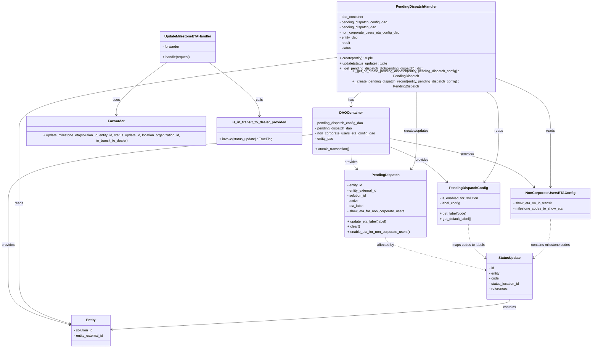

# Diagram: entity_core/entity_service/entity_listener/entity_listener_service/service/pending_dispatch_handler.py

> Auto-generated by Obscura crawlers

## Mermaid

### SVG

<svg id="container" width="2786.126953125" xmlns="http://www.w3.org/2000/svg" class="classDiagram" height="1584" viewBox="0 0 2786.126953125 1584" role="graphics-document document" aria-roledescription="class"><g><defs><marker id="container_class-aggregationStart" class="marker aggregation class" refX="18" refY="7" markerWidth="190" markerHeight="240" orient="auto"><path d="M 18,7 L9,13 L1,7 L9,1 Z"></path></marker></defs><defs><marker id="container_class-aggregationEnd" class="marker aggregation class" refX="1" refY="7" markerWidth="20" markerHeight="28" orient="auto"><path d="M 18,7 L9,13 L1,7 L9,1 Z"></path></marker></defs><defs><marker id="container_class-extensionStart" class="marker extension class" refX="18" refY="7" markerWidth="190" markerHeight="240" orient="auto"><path d="M 1,7 L18,13 V 1 Z"></path></marker></defs><defs><marker id="container_class-extensionEnd" class="marker extension class" refX="1" refY="7" markerWidth="20" markerHeight="28" orient="auto"><path d="M 1,1 V 13 L18,7 Z"></path></marker></defs><defs><marker id="container_class-compositionStart" class="marker composition class" refX="18" refY="7" markerWidth="190" markerHeight="240" orient="auto"><path d="M 18,7 L9,13 L1,7 L9,1 Z"></path></marker></defs><defs><marker id="container_class-compositionEnd" class="marker composition class" refX="1" refY="7" markerWidth="20" markerHeight="28" orient="auto"><path d="M 18,7 L9,13 L1,7 L9,1 Z"></path></marker></defs><defs><marker id="container_class-dependencyStart" class="marker dependency class" refX="6" refY="7" markerWidth="190" markerHeight="240" orient="auto"><path d="M 5,7 L9,13 L1,7 L9,1 Z"></path></marker></defs><defs><marker id="container_class-dependencyEnd" class="marker dependency class" refX="13" refY="7" markerWidth="20" markerHeight="28" orient="auto"><path d="M 18,7 L9,13 L14,7 L9,1 Z"></path></marker></defs><defs><marker id="container_class-lollipopStart" class="marker lollipop class" refX="13" refY="7" markerWidth="190" markerHeight="240" orient="auto"><circle stroke="black" fill="transparent" cx="7" cy="7" r="6"></circle></marker></defs><defs><marker id="container_class-lollipopEnd" class="marker lollipop class" refX="1" refY="7" markerWidth="190" markerHeight="240" orient="auto"><circle stroke="black" fill="transparent" cx="7" cy="7" r="6"></circle></marker></defs><g class="root"><g class="clusters"></g><g class="edgePaths"><path d="M1720.005,392L1711.834,398.167C1703.663,404.333,1687.322,416.667,1679.151,428C1670.98,439.333,1670.98,449.667,1670.98,454.833L1670.98,460" id="id_PendingDispatchHandler_DAOContainer_1" class="edge-thickness-normal edge-pattern-solid relation" style=";;;" data-edge="true" data-et="edge" data-id="id_PendingDispatchHandler_DAOContainer_1" data-points="W3sieCI6MTcyMC4wMDQ5NjM4MzczMzYyLCJ5IjozOTJ9LHsieCI6MTY3MC45ODA0Njg3NSwieSI6NDI5fSx7IngiOjE2NzAuOTgwNDY4NzUsInkiOjQ2Nn1d" marker-end="url(#container_class-dependencyEnd)"></path><path d="M1849.266,646.875L1878.674,658.896C1908.082,670.917,1966.898,694.958,2011.74,722.438C2056.582,749.918,2087.45,780.836,2102.884,796.295L2118.318,811.754" id="id_DAOContainer_PendingDispatchConfig_2" class="edge-thickness-normal edge-pattern-solid relation" style=";;;" data-edge="true" data-et="edge" data-id="id_DAOContainer_PendingDispatchConfig_2" data-points="W3sieCI6MTg0OS4yNjU2MjUsInkiOjY0Ni44NzUyMjU3NDEwOTE1fSx7IngiOjIwMjUuNzE0ODQzNzUsInkiOjcxOX0seyJ4IjoyMTIyLjU1NjgwMjU0MjA5ODUsInkiOjgxNn1d" marker-end="url(#container_class-dependencyEnd)"></path><path d="M1670.98,682L1670.98,688.167C1670.98,694.333,1670.98,706.667,1675.515,718.234C1680.05,729.802,1689.119,740.603,1693.654,746.004L1698.189,751.405" id="id_DAOContainer_PendingDispatch_3" class="edge-thickness-normal edge-pattern-solid relation" style=";;;" data-edge="true" data-et="edge" data-id="id_DAOContainer_PendingDispatch_3" data-points="W3sieCI6MTY3MC45ODA0Njg3NSwieSI6NjgyfSx7IngiOjE2NzAuOTgwNDY4NzUsInkiOjcxOX0seyJ4IjoxNzAyLjA0NjgyNDQwMDkwNjYsInkiOjc1Nn1d" marker-end="url(#container_class-dependencyEnd)"></path><path d="M1849.266,609.098L1942.309,627.415C2035.352,645.732,2221.439,682.366,2333.544,720.135C2445.649,757.905,2483.773,796.81,2502.835,816.262L2521.897,835.715" id="id_DAOContainer_NonCorporateUsersETAConfig_4" class="edge-thickness-normal edge-pattern-solid relation" style=";;;" data-edge="true" data-et="edge" data-id="id_DAOContainer_NonCorporateUsersETAConfig_4" data-points="W3sieCI6MTg0OS4yNjU2MjUsInkiOjYwOS4wOTgxMjc2MDY5OTF9LHsieCI6MjQwNy41MjUzOTA2MjUsInkiOjcxOX0seyJ4IjoyNTI2LjA5NTk4NjQ3OTkyMjQsInkiOjg0MH1d" marker-end="url(#container_class-dependencyEnd)"></path><path d="M1492.695,589.844L1250.465,611.37C1008.234,632.896,523.773,675.948,281.543,729.641C39.313,783.333,39.313,847.667,39.313,912C39.313,976.333,39.313,1040.667,39.313,1097C39.313,1153.333,39.313,1201.667,39.313,1250C39.313,1298.333,39.313,1346.667,87.174,1384.329C135.035,1421.992,230.757,1448.984,278.618,1462.48L326.479,1475.976" id="id_DAOContainer_Entity_5" class="edge-thickness-normal edge-pattern-solid relation" style=";;;" data-edge="true" data-et="edge" data-id="id_DAOContainer_Entity_5" data-points="W3sieCI6MTQ5Mi42OTUzMTI1LCJ5Ijo1ODkuODQzNTA5OTI0NDIwN30seyJ4IjozOS4zMTI1LCJ5Ijo3MTl9LHsieCI6MzkuMzEyNSwieSI6OTEyfSx7IngiOjM5LjMxMjUsInkiOjExMDV9LHsieCI6MzkuMzEyNSwieSI6MTI1MH0seyJ4IjozOS4zMTI1LCJ5IjoxMzk1fSx7IngiOjMzMi4yNTM5MDYyNSwieSI6MTQ3Ny42MDM5Mjg5NzkyNTM2fV0=" marker-end="url(#container_class-dependencyEnd)"></path><path d="M1974.402,392L1974.402,398.167C1974.402,404.333,1974.402,416.667,1974.402,447C1974.402,477.333,1974.402,525.667,1974.402,574C1974.402,622.333,1974.402,670.667,1970.476,700.193C1966.55,729.72,1958.698,740.44,1954.771,745.8L1950.845,751.16" id="id_PendingDispatchHandler_PendingDispatch_6" class="edge-thickness-normal edge-pattern-solid relation" style=";;;" data-edge="true" data-et="edge" data-id="id_PendingDispatchHandler_PendingDispatch_6" data-points="W3sieCI6MTk3NC40MDIzNDM3NSwieSI6MzkyfSx7IngiOjE5NzQuNDAyMzQzNzUsInkiOjQyOX0seyJ4IjoxOTc0LjQwMjM0Mzc1LCJ5Ijo1NzR9LHsieCI6MTk3NC40MDIzNDM3NSwieSI6NzE5fSx7IngiOjE5NDcuMjk5NzM4OTA4Njc4OCwieSI6NzU2fV0=" marker-end="url(#container_class-dependencyEnd)"></path><path d="M2294.523,392L2304.805,398.167C2315.086,404.333,2335.65,416.667,2345.931,447C2356.213,477.333,2356.213,525.667,2356.213,574C2356.213,622.333,2356.213,670.667,2345.25,710.186C2334.287,749.706,2312.362,780.411,2301.399,795.764L2290.436,811.117" id="id_PendingDispatchHandler_PendingDispatchConfig_7" class="edge-thickness-normal edge-pattern-solid relation" style=";;;" data-edge="true" data-et="edge" data-id="id_PendingDispatchHandler_PendingDispatchConfig_7" data-points="W3sieCI6MjI5NC41MjI5NzY5Mzc3NzMsInkiOjM5Mn0seyJ4IjoyMzU2LjIxMjg5MDYyNSwieSI6NDI5fSx7IngiOjIzNTYuMjEyODkwNjI1LCJ5Ijo1NzR9LHsieCI6MjM1Ni4yMTI4OTA2MjUsInkiOjcxOX0seyJ4IjoyMjg2Ljk0OTYxMzQyMjkyNzUsInkiOjgxNn1d" marker-end="url(#container_class-dependencyEnd)"></path><path d="M2347.785,337.413L2389.263,352.677C2430.74,367.942,2513.695,398.471,2555.173,437.902C2596.65,477.333,2596.65,525.667,2596.65,574C2596.65,622.333,2596.65,670.667,2596.65,714C2596.65,757.333,2596.65,795.667,2596.65,814.833L2596.65,834" id="id_PendingDispatchHandler_NonCorporateUsersETAConfig_8" class="edge-thickness-normal edge-pattern-solid relation" style=";;;" data-edge="true" data-et="edge" data-id="id_PendingDispatchHandler_NonCorporateUsersETAConfig_8" data-points="W3sieCI6MjM0Ny43ODUxNTYyNSwieSI6MzM3LjQxMjUwNjk0NDY0MDY1fSx7IngiOjI1OTYuNjUwMzkwNjI1LCJ5Ijo0Mjl9LHsieCI6MjU5Ni42NTAzOTA2MjUsInkiOjU3NH0seyJ4IjoyNTk2LjY1MDM5MDYyNSwieSI6NzE5fSx7IngiOjI1OTYuNjUwMzkwNjI1LCJ5Ijo4NDB9XQ==" marker-end="url(#container_class-dependencyEnd)"></path><path d="M1601.02,245.39L1349.287,275.992C1097.555,306.593,594.09,367.797,342.357,422.565C90.625,477.333,90.625,525.667,90.625,574C90.625,622.333,90.625,670.667,90.625,727C90.625,783.333,90.625,847.667,90.625,912C90.625,976.333,90.625,1040.667,90.625,1097C90.625,1153.333,90.625,1201.667,90.625,1250C90.625,1298.333,90.625,1346.667,129.945,1383.618C169.266,1420.569,247.907,1446.139,287.227,1458.924L326.548,1471.708" id="id_PendingDispatchHandler_Entity_9" class="edge-thickness-normal edge-pattern-solid relation" style=";;;" data-edge="true" data-et="edge" data-id="id_PendingDispatchHandler_Entity_9" data-points="W3sieCI6MTYwMS4wMTk1MzEyNSwieSI6MjQ1LjM5MDAwNTUzNjU4MTg3fSx7IngiOjkwLjYyNSwieSI6NDI5fSx7IngiOjkwLjYyNSwieSI6NTc0fSx7IngiOjkwLjYyNSwieSI6NzE5fSx7IngiOjkwLjYyNSwieSI6OTEyfSx7IngiOjkwLjYyNSwieSI6MTEwNX0seyJ4Ijo5MC42MjUsInkiOjEyNTB9LHsieCI6OTAuNjI1LCJ5IjoxMzk1fSx7IngiOjMzMi4yNTM5MDYyNSwieSI6MTQ3My41NjM2NzMyMjY4MzI2fV0=" marker-end="url(#container_class-dependencyEnd)"></path><path d="M797.711,272L758.659,298.167C719.607,324.333,641.503,376.667,602.45,415.5C563.398,454.333,563.398,479.667,563.398,492.333L563.398,505" id="id_UpdateMilestoneETAHandler_Forwarder_10" class="edge-thickness-normal edge-pattern-solid relation" style=";;;" data-edge="true" data-et="edge" data-id="id_UpdateMilestoneETAHandler_Forwarder_10" data-points="W3sieCI6Nzk3LjcxMDcwNzIxODg4NjUsInkiOjI3Mn0seyJ4Ijo1NjMuMzk4NDM3NSwieSI6NDI5fSx7IngiOjU2My4zOTg0Mzc1LCJ5Ijo1MTF9XQ==" marker-end="url(#container_class-dependencyEnd)"></path><path d="M1012.621,272L1051.673,298.167C1090.725,324.333,1168.83,376.667,1207.882,415.5C1246.934,454.333,1246.934,479.667,1246.934,492.333L1246.934,505" id="id_UpdateMilestoneETAHandler_is_in_transit_to_dealer_provided_11" class="edge-thickness-normal edge-pattern-solid relation" style=";;;" data-edge="true" data-et="edge" data-id="id_UpdateMilestoneETAHandler_is_in_transit_to_dealer_provided_11" data-points="W3sieCI6MTAxMi42MjEzMjQwMzExMTM1LCJ5IjoyNzJ9LHsieCI6MTI0Ni45MzM1OTM3NSwieSI6NDI5fSx7IngiOjEyNDYuOTMzNTkzNzUsInkiOjUxMX1d" marker-end="url(#container_class-dependencyEnd)"></path><path d="M2407.525,1358L2407.525,1364.167C2407.525,1370.333,2407.525,1382.667,2093.848,1406.087C1780.171,1429.507,1152.818,1464.014,839.141,1481.268L525.464,1498.522" id="id_StatusUpdate_Entity_12" class="edge-thickness-normal edge-pattern-solid relation" style=";;;" data-edge="true" data-et="edge" data-id="id_StatusUpdate_Entity_12" data-points="W3sieCI6MjQwNy41MjUzOTA2MjUsInkiOjEzNTh9LHsieCI6MjQwNy41MjUzOTA2MjUsInkiOjEzOTV9LHsieCI6NTE5LjQ3MjY1NjI1LCJ5IjoxNDk4Ljg1MTA3ODg4NjM5MX1d" marker-end="url(#container_class-dependencyEnd)"></path><path d="M1833.029,1068L1833.029,1074.167C1833.029,1080.333,1833.029,1092.667,1909.601,1118.16C1986.172,1143.653,2139.315,1182.305,2215.886,1201.631L2292.458,1220.958" id="id_PendingDispatch_StatusUpdate_13" class="edge-thickness-normal edge-pattern-dashed relation" style=";;;" data-edge="true" data-et="edge" data-id="id_PendingDispatch_StatusUpdate_13" data-points="W3sieCI6MTgzMy4wMjkyOTY4NzUsInkiOjEwNjh9LHsieCI6MTgzMy4wMjkyOTY4NzUsInkiOjExMDV9LHsieCI6MjI5OC4yNzUzOTA2MjUsInkiOjEyMjIuNDI1ODM1MTQwODUwM31d" marker-end="url(#container_class-dependencyEnd)"></path><path d="M2218.4,1008L2218.4,1024.167C2218.4,1040.333,2218.4,1072.667,2230.919,1098.431C2243.438,1124.196,2268.476,1143.392,2280.995,1152.991L2293.514,1162.589" id="id_PendingDispatchConfig_StatusUpdate_14" class="edge-thickness-normal edge-pattern-dashed relation" style=";;;" data-edge="true" data-et="edge" data-id="id_PendingDispatchConfig_StatusUpdate_14" data-points="W3sieCI6MjIxOC40MDAzOTA2MjUsInkiOjEwMDh9LHsieCI6MjIxOC40MDAzOTA2MjUsInkiOjExMDV9LHsieCI6MjI5OC4yNzUzOTA2MjUsInkiOjExNjYuMjM5MjU5NzQ4ODQzM31d" marker-end="url(#container_class-dependencyEnd)"></path><path d="M2596.65,984L2596.65,1004.167C2596.65,1024.333,2596.65,1064.667,2584.131,1094.431C2571.613,1124.196,2546.575,1143.392,2534.056,1152.991L2521.537,1162.589" id="id_NonCorporateUsersETAConfig_StatusUpdate_15" class="edge-thickness-normal edge-pattern-dashed relation" style=";;;" data-edge="true" data-et="edge" data-id="id_NonCorporateUsersETAConfig_StatusUpdate_15" data-points="W3sieCI6MjU5Ni42NTAzOTA2MjUsInkiOjk4NH0seyJ4IjoyNTk2LjY1MDM5MDYyNSwieSI6MTEwNX0seyJ4IjoyNTE2Ljc3NTM5MDYyNSwieSI6MTE2Ni4yMzkyNTk3NDg4NDMzfV0=" marker-end="url(#container_class-dependencyEnd)"></path></g><g class="edgeLabels"><g class="edgeLabel" transform="translate(1670.98046875, 429)"><g class="label" data-id="id_PendingDispatchHandler_DAOContainer_1" transform="translate(-12.703125, -12)"><foreignObject width="25.40625" height="24">

has

</foreignObject></g></g><g class="edgeLabel" transform="translate(2000.92864, 708.86848)"><g class="label" data-id="id_DAOContainer_PendingDispatchConfig_2" transform="translate(-31.3125, -12)"><foreignObject width="62.625" height="24">

provides

</foreignObject></g></g><g class="edgeLabel" transform="translate(1670.98046875, 719)"><g class="label" data-id="id_DAOContainer_PendingDispatch_3" transform="translate(-31.3125, -12)"><foreignObject width="62.625" height="24">

provides

</foreignObject></g></g><g class="edgeLabel" transform="translate(2211.50566, 680.41055)"><g class="label" data-id="id_DAOContainer_NonCorporateUsersETAConfig_4" transform="translate(-31.3125, -12)"><foreignObject width="62.625" height="24">

provides

</foreignObject></g></g><g class="edgeLabel" transform="translate(39.3125, 1105)"><g class="label" data-id="id_DAOContainer_Entity_5" transform="translate(-31.3125, -12)"><foreignObject width="62.625" height="24">

provides

</foreignObject></g></g><g class="edgeLabel" transform="translate(1974.40234375, 574)"><g class="label" data-id="id_PendingDispatchHandler_PendingDispatch_6" transform="translate(-59.5, -12)"><foreignObject width="119" height="24">

creates/updates

</foreignObject></g></g><g class="edgeLabel" transform="translate(2356.212890625, 574)"><g class="label" data-id="id_PendingDispatchHandler_PendingDispatchConfig_7" transform="translate(-20.0078125, -12)"><foreignObject width="40.015625" height="24">

reads

</foreignObject></g></g><g class="edgeLabel" transform="translate(2596.650390625, 574)"><g class="label" data-id="id_PendingDispatchHandler_NonCorporateUsersETAConfig_8" transform="translate(-20.0078125, -12)"><foreignObject width="40.015625" height="24">

reads

</foreignObject></g></g><g class="edgeLabel" transform="translate(90.625, 912)"><g class="label" data-id="id_PendingDispatchHandler_Entity_9" transform="translate(-20.0078125, -12)"><foreignObject width="40.015625" height="24">

reads

</foreignObject></g></g><g class="edgeLabel" transform="translate(563.3984375, 429)"><g class="label" data-id="id_UpdateMilestoneETAHandler_Forwarder_10" transform="translate(-16.4921875, -12)"><foreignObject width="32.984375" height="24">

uses

</foreignObject></g></g><g class="edgeLabel" transform="translate(1246.93359375, 429)"><g class="label" data-id="id_UpdateMilestoneETAHandler_is_in_transit_to_dealer_provided_11" transform="translate(-16.4453125, -12)"><foreignObject width="32.890625" height="24">

calls

</foreignObject></g></g><g class="edgeLabel" transform="translate(2407.525390625, 1395)"><g class="label" data-id="id_StatusUpdate_Entity_12" transform="translate(-30.890625, -12)"><foreignObject width="61.78125" height="24">

contains

</foreignObject></g></g><g class="edgeLabel" transform="translate(1833.029296875, 1105)"><g class="label" data-id="id_PendingDispatch_StatusUpdate_13" transform="translate(-40.5078125, -12)"><foreignObject width="81.015625" height="24">

affected by

</foreignObject></g></g><g class="edgeLabel" transform="translate(2218.400390625, 1105)"><g class="label" data-id="id_PendingDispatchConfig_StatusUpdate_14" transform="translate(-76.5625, -12)"><foreignObject width="153.125" height="24">

maps codes to labels

</foreignObject></g></g><g class="edgeLabel" transform="translate(2596.650390625, 1105)"><g class="label" data-id="id_NonCorporateUsersETAConfig_StatusUpdate_15" transform="translate(-92.3515625, -12)"><foreignObject width="184.703125" height="24">

contains milestone codes

</foreignObject></g></g></g><g class="nodes"><g class="node default" id="classId-PendingDispatchHandler-0" transform="translate(1974.40234375, 200)"><g class="basic label-container"><path d="M-373.3828125 -192 L373.3828125 -192 L373.3828125 192 L-373.3828125 192" stroke="none" stroke-width="0" fill="#ECECFF" style=""></path><path d="M-373.3828125 -192 C-181.45982888407917 -192, 10.463154731841655 -192, 373.3828125 -192 M-373.3828125 -192 C-139.0203335852691 -192, 95.3421453294618 -192, 373.3828125 -192 M373.3828125 -192 C373.3828125 -105.45278022161351, 373.3828125 -18.905560443227017, 373.3828125 192 M373.3828125 -192 C373.3828125 -63.40380757444822, 373.3828125 65.19238485110355, 373.3828125 192 M373.3828125 192 C202.57300766266422 192, 31.76320282532845 192, -373.3828125 192 M373.3828125 192 C94.78326497071407 192, -183.81628255857186 192, -373.3828125 192 M-373.3828125 192 C-373.3828125 99.6100054108463, -373.3828125 7.220010821692597, -373.3828125 -192 M-373.3828125 192 C-373.3828125 43.988678892187295, -373.3828125 -104.02264221562541, -373.3828125 -192" stroke="#9370DB" stroke-width="1.3" fill="none" stroke-dasharray="0 0" style=""></path></g><g class="annotation-group text" transform="translate(0, -168)"></g><g class="label-group text" transform="translate(-90.5625, -168)"><g class="label" style="font-weight: bolder" transform="translate(0,-12)"><foreignObject width="181.125" height="24">

PendingDispatchHandler

</foreignObject></g></g><g class="members-group text" transform="translate(-361.3828125, -120)"><g class="label" style="" transform="translate(0,-12)"><foreignObject width="115.1875" height="24">

- dao_container

</foreignObject></g><g class="label" style="" transform="translate(0,12)"><foreignObject width="227.546875" height="24">

- pending_dispatch_config_dao

</foreignObject></g><g class="label" style="" transform="translate(0,36)"><foreignObject width="175.90625" height="24">

- pending_dispatch_dao

</foreignObject></g><g class="label" style="" transform="translate(0,60)"><foreignObject width="281.671875" height="24">

- non_corporate_users_eta_config_dao

</foreignObject></g><g class="label" style="" transform="translate(0,84)"><foreignObject width="87.78125" height="24">

- entity_dao

</foreignObject></g><g class="label" style="" transform="translate(0,108)"><foreignObject width="52.359375" height="24">

- result

</foreignObject></g><g class="label" style="" transform="translate(0,132)"><foreignObject width="55.09375" height="24">

- status

</foreignObject></g></g><g class="methods-group text" transform="translate(-361.3828125, 72)"><g class="label" style="" transform="translate(0,-12)"><foreignObject width="159.65625" height="24">

+ create(entity) : tuple

</foreignObject></g><g class="label" style="" transform="translate(0,12)"><foreignObject width="227.609375" height="24">

+ update(status_update) : tuple

</foreignObject></g><g class="label" style="" transform="translate(0,36)"><foreignObject width="396.46875" height="24">

+ _get_pending_dispatch_dict(pending_dispatch) : dict

</foreignObject></g><g class="label" style="" transform="translate(0,60)"><foreignObject width="630.796875" height="24">

+ _get_or_create_pending_dispatch(entity, pending_dispatch_config) : PendingDispatch

</foreignObject></g><g class="label" style="" transform="translate(0,84)"><foreignObject width="632.203125" height="24">

+ _create_pending_dispatch_record(entity, pending_dispatch_config) : PendingDispatch

</foreignObject></g></g><g class="divider" style=""><path d="M-373.3828125 -144 C-77.16426853050473 -144, 219.05427543899054 -144, 373.3828125 -144 M-373.3828125 -144 C-136.98959210438818 -144, 99.40362829122364 -144, 373.3828125 -144" stroke="#9370DB" stroke-width="1.3" fill="none" stroke-dasharray="0 0" style=""></path></g><g class="divider" style=""><path d="M-373.3828125 48 C-129.1236430011633 48, 115.13552649767342 48, 373.3828125 48 M-373.3828125 48 C-97.99784374809292 48, 177.38712500381416 48, 373.3828125 48" stroke="#9370DB" stroke-width="1.3" fill="none" stroke-dasharray="0 0" style=""></path></g></g><g class="node default" id="classId-UpdateMilestoneETAHandler-1" transform="translate(905.166015625, 200)"><g class="basic label-container"><path d="M-128.24609375 -72 L128.24609375 -72 L128.24609375 72 L-128.24609375 72" stroke="none" stroke-width="0" fill="#ECECFF" style=""></path><path d="M-128.24609375 -72 C-35.106744746738684 -72, 58.03260425652263 -72, 128.24609375 -72 M-128.24609375 -72 C-58.1358105871347 -72, 11.974472575730601 -72, 128.24609375 -72 M128.24609375 -72 C128.24609375 -28.849034216447663, 128.24609375 14.301931567104674, 128.24609375 72 M128.24609375 -72 C128.24609375 -26.995190327531816, 128.24609375 18.009619344936368, 128.24609375 72 M128.24609375 72 C51.663522776901715 72, -24.91904819619657 72, -128.24609375 72 M128.24609375 72 C66.49620579748273 72, 4.746317844965446 72, -128.24609375 72 M-128.24609375 72 C-128.24609375 34.03426444655271, -128.24609375 -3.931471106894577, -128.24609375 -72 M-128.24609375 72 C-128.24609375 22.61261301344365, -128.24609375 -26.7747739731127, -128.24609375 -72" stroke="#9370DB" stroke-width="1.3" fill="none" stroke-dasharray="0 0" style=""></path></g><g class="annotation-group text" transform="translate(0, -48)"></g><g class="label-group text" transform="translate(-104.2734375, -48)"><g class="label" style="font-weight: bolder" transform="translate(0,-12)"><foreignObject width="208.546875" height="24">

UpdateMilestoneETAHandler

</foreignObject></g></g><g class="members-group text" transform="translate(-116.24609375, 0)"><g class="label" style="" transform="translate(0,-12)"><foreignObject width="81.5625" height="24">

- forwarder

</foreignObject></g></g><g class="methods-group text" transform="translate(-116.24609375, 48)"><g class="label" style="" transform="translate(0,-12)"><foreignObject width="128.21875" height="24">

+ handle(request)

</foreignObject></g></g><g class="divider" style=""><path d="M-128.24609375 -24 C-32.01606953784085 -24, 64.2139546743183 -24, 128.24609375 -24 M-128.24609375 -24 C-54.411553889296286 -24, 19.422985971407428 -24, 128.24609375 -24" stroke="#9370DB" stroke-width="1.3" fill="none" stroke-dasharray="0 0" style=""></path></g><g class="divider" style=""><path d="M-128.24609375 24 C-50.63445288924943 24, 26.977187971501138 24, 128.24609375 24 M-128.24609375 24 C-44.34813898253462 24, 39.54981578493076 24, 128.24609375 24" stroke="#9370DB" stroke-width="1.3" fill="none" stroke-dasharray="0 0" style=""></path></g></g><g class="node default" id="classId-PendingDispatch-2" transform="translate(1833.029296875, 912)"><g class="basic label-container"><path d="M-188.59765625 -156 L188.59765625 -156 L188.59765625 156 L-188.59765625 156" stroke="none" stroke-width="0" fill="#ECECFF" style=""></path><path d="M-188.59765625 -156 C-61.90057438343058 -156, 64.79650748313884 -156, 188.59765625 -156 M-188.59765625 -156 C-91.40499377520153 -156, 5.787668699596935 -156, 188.59765625 -156 M188.59765625 -156 C188.59765625 -85.05938839959093, 188.59765625 -14.118776799181859, 188.59765625 156 M188.59765625 -156 C188.59765625 -61.776988633641, 188.59765625 32.446022732718006, 188.59765625 156 M188.59765625 156 C55.82100964254681 156, -76.95563696490638 156, -188.59765625 156 M188.59765625 156 C81.08336823605208 156, -26.430919777895838 156, -188.59765625 156 M-188.59765625 156 C-188.59765625 88.76554255100764, -188.59765625 21.531085102015282, -188.59765625 -156 M-188.59765625 156 C-188.59765625 93.20763219517647, -188.59765625 30.41526439035296, -188.59765625 -156" stroke="#9370DB" stroke-width="1.3" fill="none" stroke-dasharray="0 0" style=""></path></g><g class="annotation-group text" transform="translate(0, -132)"></g><g class="label-group text" transform="translate(-61.4765625, -132)"><g class="label" style="font-weight: bolder" transform="translate(0,-12)"><foreignObject width="122.953125" height="24">

PendingDispatch

</foreignObject></g></g><g class="members-group text" transform="translate(-176.59765625, -84)"><g class="label" style="" transform="translate(0,-12)"><foreignObject width="74.5625" height="24">

- entity_id

</foreignObject></g><g class="label" style="" transform="translate(0,12)"><foreignObject width="141.9375" height="24">

- entity_external_id

</foreignObject></g><g class="label" style="" transform="translate(0,36)"><foreignObject width="92.921875" height="24">

- solution_id

</foreignObject></g><g class="label" style="" transform="translate(0,60)"><foreignObject width="53.859375" height="24">

- active

</foreignObject></g><g class="label" style="" transform="translate(0,84)"><foreignObject width="78.171875" height="24">

- eta_label

</foreignObject></g><g class="label" style="" transform="translate(0,108)"><foreignObject width="267.84375" height="24">

- show_eta_for_non_corporate_users

</foreignObject></g></g><g class="methods-group text" transform="translate(-176.59765625, 84)"><g class="label" style="" transform="translate(0,-12)"><foreignObject width="185.3125" height="24">

+ update_eta_label(label)

</foreignObject></g><g class="label" style="" transform="translate(0,12)"><foreignObject width="58.296875" height="24">

+ clear()

</foreignObject></g><g class="label" style="" transform="translate(0,36)"><foreignObject width="291.71875" height="24">

+ enable_eta_for_non_corporate_users()

</foreignObject></g></g><g class="divider" style=""><path d="M-188.59765625 -108 C-96.71131696735374 -108, -4.824977684707477 -108, 188.59765625 -108 M-188.59765625 -108 C-49.14374381320758 -108, 90.31016862358484 -108, 188.59765625 -108" stroke="#9370DB" stroke-width="1.3" fill="none" stroke-dasharray="0 0" style=""></path></g><g class="divider" style=""><path d="M-188.59765625 60 C-86.59376021110836 60, 15.410135827783279 60, 188.59765625 60 M-188.59765625 60 C-110.79666381611536 60, -32.99567138223071 60, 188.59765625 60" stroke="#9370DB" stroke-width="1.3" fill="none" stroke-dasharray="0 0" style=""></path></g></g><g class="node default" id="classId-Entity-3" transform="translate(425.86328125, 1504)"><g class="basic label-container"><path d="M-93.609375 -72 L93.609375 -72 L93.609375 72 L-93.609375 72" stroke="none" stroke-width="0" fill="#ECECFF" style=""></path><path d="M-93.609375 -72 C-30.250963828705913 -72, 33.10744734258817 -72, 93.609375 -72 M-93.609375 -72 C-41.576183790582576 -72, 10.457007418834849 -72, 93.609375 -72 M93.609375 -72 C93.609375 -27.2867795309501, 93.609375 17.4264409380998, 93.609375 72 M93.609375 -72 C93.609375 -39.49630998800204, 93.609375 -6.992619976004079, 93.609375 72 M93.609375 72 C46.270720406522926 72, -1.0679341869541474 72, -93.609375 72 M93.609375 72 C20.83596421508578 72, -51.93744656982844 72, -93.609375 72 M-93.609375 72 C-93.609375 38.43065080153088, -93.609375 4.8613016030617615, -93.609375 -72 M-93.609375 72 C-93.609375 26.984304490256946, -93.609375 -18.031391019486108, -93.609375 -72" stroke="#9370DB" stroke-width="1.3" fill="none" stroke-dasharray="0 0" style=""></path></g><g class="annotation-group text" transform="translate(0, -48)"></g><g class="label-group text" transform="translate(-21.28125, -48)"><g class="label" style="font-weight: bolder" transform="translate(0,-12)"><foreignObject width="42.5625" height="24">

Entity

</foreignObject></g></g><g class="members-group text" transform="translate(-81.609375, 0)"><g class="label" style="" transform="translate(0,-12)"><foreignObject width="92.921875" height="24">

- solution_id

</foreignObject></g><g class="label" style="" transform="translate(0,12)"><foreignObject width="141.9375" height="24">

- entity_external_id

</foreignObject></g></g><g class="methods-group text" transform="translate(-81.609375, 72)"></g><g class="divider" style=""><path d="M-93.609375 -24 C-21.862540107274256 -24, 49.88429478545149 -24, 93.609375 -24 M-93.609375 -24 C-35.243507546928065 -24, 23.12235990614387 -24, 93.609375 -24" stroke="#9370DB" stroke-width="1.3" fill="none" stroke-dasharray="0 0" style=""></path></g><g class="divider" style=""><path d="M-93.609375 48 C-49.653800540248994 48, -5.698226080497989 48, 93.609375 48 M-93.609375 48 C-54.31694343551467 48, -15.024511871029347 48, 93.609375 48" stroke="#9370DB" stroke-width="1.3" fill="none" stroke-dasharray="0 0" style=""></path></g></g><g class="node default" id="classId-StatusUpdate-4" transform="translate(2407.525390625, 1250)"><g class="basic label-container"><path d="M-109.25 -108 L109.25 -108 L109.25 108 L-109.25 108" stroke="none" stroke-width="0" fill="#ECECFF" style=""></path><path d="M-109.25 -108 C-38.27713609065637 -108, 32.69572781868726 -108, 109.25 -108 M-109.25 -108 C-60.800204410436905 -108, -12.35040882087381 -108, 109.25 -108 M109.25 -108 C109.25 -25.70871459654728, 109.25 56.58257080690544, 109.25 108 M109.25 -108 C109.25 -27.656453854583617, 109.25 52.687092290832766, 109.25 108 M109.25 108 C49.49087624122012 108, -10.268247517559757 108, -109.25 108 M109.25 108 C32.00886279598859 108, -45.23227440802282 108, -109.25 108 M-109.25 108 C-109.25 60.58229460824124, -109.25 13.164589216482483, -109.25 -108 M-109.25 108 C-109.25 54.374472990234125, -109.25 0.7489459804682497, -109.25 -108" stroke="#9370DB" stroke-width="1.3" fill="none" stroke-dasharray="0 0" style=""></path></g><g class="annotation-group text" transform="translate(0, -84)"></g><g class="label-group text" transform="translate(-50.015625, -84)"><g class="label" style="font-weight: bolder" transform="translate(0,-12)"><foreignObject width="100.03125" height="24">

StatusUpdate

</foreignObject></g></g><g class="members-group text" transform="translate(-97.25, -36)"><g class="label" style="" transform="translate(0,-12)"><foreignObject width="24.78125" height="24">

- id

</foreignObject></g><g class="label" style="" transform="translate(0,12)"><foreignObject width="52.640625" height="24">

- entity

</foreignObject></g><g class="label" style="" transform="translate(0,36)"><foreignObject width="45.65625" height="24">

- code

</foreignObject></g><g class="label" style="" transform="translate(0,60)"><foreignObject width="144.484375" height="24">

- status_location_id

</foreignObject></g><g class="label" style="" transform="translate(0,84)"><foreignObject width="86.34375" height="24">

- references

</foreignObject></g></g><g class="methods-group text" transform="translate(-97.25, 108)"></g><g class="divider" style=""><path d="M-109.25 -60 C-49.21839941304613 -60, 10.813201173907743 -60, 109.25 -60 M-109.25 -60 C-22.687202743658716 -60, 63.87559451268257 -60, 109.25 -60" stroke="#9370DB" stroke-width="1.3" fill="none" stroke-dasharray="0 0" style=""></path></g><g class="divider" style=""><path d="M-109.25 84 C-27.845046623769036 84, 53.55990675246193 84, 109.25 84 M-109.25 84 C-26.178113955946003 84, 56.893772088107994 84, 109.25 84" stroke="#9370DB" stroke-width="1.3" fill="none" stroke-dasharray="0 0" style=""></path></g></g><g class="node default" id="classId-PendingDispatchConfig-5" transform="translate(2218.400390625, 912)"><g class="basic label-container"><path d="M-146.7734375 -96 L146.7734375 -96 L146.7734375 96 L-146.7734375 96" stroke="none" stroke-width="0" fill="#ECECFF" style=""></path><path d="M-146.7734375 -96 C-30.630294438104755 -96, 85.51284862379049 -96, 146.7734375 -96 M-146.7734375 -96 C-49.69240452771203 -96, 47.38862844457594 -96, 146.7734375 -96 M146.7734375 -96 C146.7734375 -53.78541530203447, 146.7734375 -11.570830604068945, 146.7734375 96 M146.7734375 -96 C146.7734375 -57.34091495955091, 146.7734375 -18.681829919101816, 146.7734375 96 M146.7734375 96 C61.32202419897358 96, -24.12938910205284 96, -146.7734375 96 M146.7734375 96 C85.95279116342078 96, 25.132144826841554 96, -146.7734375 96 M-146.7734375 96 C-146.7734375 56.31174202570163, -146.7734375 16.623484051403267, -146.7734375 -96 M-146.7734375 96 C-146.7734375 31.295345218386814, -146.7734375 -33.40930956322637, -146.7734375 -96" stroke="#9370DB" stroke-width="1.3" fill="none" stroke-dasharray="0 0" style=""></path></g><g class="annotation-group text" transform="translate(0, -72)"></g><g class="label-group text" transform="translate(-84.40625, -72)"><g class="label" style="font-weight: bolder" transform="translate(0,-12)"><foreignObject width="168.8125" height="24">

PendingDispatchConfig

</foreignObject></g></g><g class="members-group text" transform="translate(-134.7734375, -24)"><g class="label" style="" transform="translate(0,-12)"><foreignObject width="185.140625" height="24">

- is_enabled_for_solution

</foreignObject></g><g class="label" style="" transform="translate(0,12)"><foreignObject width="98.484375" height="24">

- label_config

</foreignObject></g></g><g class="methods-group text" transform="translate(-134.7734375, 48)"><g class="label" style="" transform="translate(0,-12)"><foreignObject width="124.5" height="24">

+ get_label(code)

</foreignObject></g><g class="label" style="" transform="translate(0,12)"><foreignObject width="149.3125" height="24">

+ get_default_label()

</foreignObject></g></g><g class="divider" style=""><path d="M-146.7734375 -48 C-61.924877871739014 -48, 22.923681756521972 -48, 146.7734375 -48 M-146.7734375 -48 C-58.5723681539055 -48, 29.628701192189 -48, 146.7734375 -48" stroke="#9370DB" stroke-width="1.3" fill="none" stroke-dasharray="0 0" style=""></path></g><g class="divider" style=""><path d="M-146.7734375 24 C-70.09651435760784 24, 6.580408784784311 24, 146.7734375 24 M-146.7734375 24 C-42.797747468699825 24, 61.17794256260035 24, 146.7734375 24" stroke="#9370DB" stroke-width="1.3" fill="none" stroke-dasharray="0 0" style=""></path></g></g><g class="node default" id="classId-NonCorporateUsersETAConfig-6" transform="translate(2596.650390625, 912)"><g class="basic label-container"><path d="M-181.4765625 -72 L181.4765625 -72 L181.4765625 72 L-181.4765625 72" stroke="none" stroke-width="0" fill="#ECECFF" style=""></path><path d="M-181.4765625 -72 C-72.80288983404765 -72, 35.870782831904705 -72, 181.4765625 -72 M-181.4765625 -72 C-52.50654905566839 -72, 76.46346438866323 -72, 181.4765625 -72 M181.4765625 -72 C181.4765625 -32.93463145188701, 181.4765625 6.130737096225985, 181.4765625 72 M181.4765625 -72 C181.4765625 -29.90779990431878, 181.4765625 12.184400191362442, 181.4765625 72 M181.4765625 72 C70.4294067568272 72, -40.61774898634559 72, -181.4765625 72 M181.4765625 72 C63.623190794451844 72, -54.23018091109631 72, -181.4765625 72 M-181.4765625 72 C-181.4765625 22.464895986206372, -181.4765625 -27.070208027587256, -181.4765625 -72 M-181.4765625 72 C-181.4765625 33.08496390216634, -181.4765625 -5.830072195667313, -181.4765625 -72" stroke="#9370DB" stroke-width="1.3" fill="none" stroke-dasharray="0 0" style=""></path></g><g class="annotation-group text" transform="translate(0, -48)"></g><g class="label-group text" transform="translate(-107.15625, -48)"><g class="label" style="font-weight: bolder" transform="translate(0,-12)"><foreignObject width="214.3125" height="24">

NonCorporateUsersETAConfig

</foreignObject></g></g><g class="members-group text" transform="translate(-169.4765625, 0)"><g class="label" style="" transform="translate(0,-12)"><foreignObject width="183.28125" height="24">

- show_eta_on_in_transit

</foreignObject></g><g class="label" style="" transform="translate(0,12)"><foreignObject width="231.796875" height="24">

- milestone_codes_to_show_eta

</foreignObject></g></g><g class="methods-group text" transform="translate(-169.4765625, 72)"></g><g class="divider" style=""><path d="M-181.4765625 -24 C-77.81714463220194 -24, 25.84227323559611 -24, 181.4765625 -24 M-181.4765625 -24 C-103.78420011123805 -24, -26.0918377224761 -24, 181.4765625 -24" stroke="#9370DB" stroke-width="1.3" fill="none" stroke-dasharray="0 0" style=""></path></g><g class="divider" style=""><path d="M-181.4765625 48 C-87.12933898995885 48, 7.217884520082293 48, 181.4765625 48 M-181.4765625 48 C-106.98099487677453 48, -32.48542725354906 48, 181.4765625 48" stroke="#9370DB" stroke-width="1.3" fill="none" stroke-dasharray="0 0" style=""></path></g></g><g class="node default" id="classId-DAOContainer-7" transform="translate(1670.98046875, 574)"><g class="basic label-container"><path d="M-178.28515625 -108 L178.28515625 -108 L178.28515625 108 L-178.28515625 108" stroke="none" stroke-width="0" fill="#ECECFF" style=""></path><path d="M-178.28515625 -108 C-88.6276966200914 -108, 1.0297630098172021 -108, 178.28515625 -108 M-178.28515625 -108 C-58.21009906319256 -108, 61.86495812361488 -108, 178.28515625 -108 M178.28515625 -108 C178.28515625 -23.436336788773914, 178.28515625 61.12732642245217, 178.28515625 108 M178.28515625 -108 C178.28515625 -43.68134639932751, 178.28515625 20.63730720134498, 178.28515625 108 M178.28515625 108 C50.146049151196394 108, -77.99305794760721 108, -178.28515625 108 M178.28515625 108 C42.76628898165578 108, -92.75257828668845 108, -178.28515625 108 M-178.28515625 108 C-178.28515625 28.903847278596118, -178.28515625 -50.192305442807765, -178.28515625 -108 M-178.28515625 108 C-178.28515625 44.5777477964323, -178.28515625 -18.844504407135403, -178.28515625 -108" stroke="#9370DB" stroke-width="1.3" fill="none" stroke-dasharray="0 0" style=""></path></g><g class="annotation-group text" transform="translate(0, -84)"></g><g class="label-group text" transform="translate(-50.8984375, -84)"><g class="label" style="font-weight: bolder" transform="translate(0,-12)"><foreignObject width="101.796875" height="24">

DAOContainer

</foreignObject></g></g><g class="members-group text" transform="translate(-166.28515625, -36)"><g class="label" style="" transform="translate(0,-12)"><foreignObject width="227.546875" height="24">

- pending_dispatch_config_dao

</foreignObject></g><g class="label" style="" transform="translate(0,12)"><foreignObject width="175.90625" height="24">

- pending_dispatch_dao

</foreignObject></g><g class="label" style="" transform="translate(0,36)"><foreignObject width="281.671875" height="24">

- non_corporate_users_eta_config_dao

</foreignObject></g><g class="label" style="" transform="translate(0,60)"><foreignObject width="87.78125" height="24">

- entity_dao

</foreignObject></g></g><g class="methods-group text" transform="translate(-166.28515625, 84)"><g class="label" style="" transform="translate(0,-12)"><foreignObject width="162.203125" height="24">

+ atomic_transaction()

</foreignObject></g></g><g class="divider" style=""><path d="M-178.28515625 -60 C-62.81276925861194 -60, 52.65961773277613 -60, 178.28515625 -60 M-178.28515625 -60 C-45.52265812455053 -60, 87.23984000089894 -60, 178.28515625 -60" stroke="#9370DB" stroke-width="1.3" fill="none" stroke-dasharray="0 0" style=""></path></g><g class="divider" style=""><path d="M-178.28515625 60 C-103.57641937758046 60, -28.86768250516093 60, 178.28515625 60 M-178.28515625 60 C-63.32268830090017 60, 51.639779648199664 60, 178.28515625 60" stroke="#9370DB" stroke-width="1.3" fill="none" stroke-dasharray="0 0" style=""></path></g></g><g class="node default" id="classId-Forwarder-8" transform="translate(563.3984375, 574)"><g class="basic label-container"><path d="M-437.7734375 -63 L437.7734375 -63 L437.7734375 63 L-437.7734375 63" stroke="none" stroke-width="0" fill="#ECECFF" style=""></path><path d="M-437.7734375 -63 C-185.6240313659701 -63, 66.5253747680598 -63, 437.7734375 -63 M-437.7734375 -63 C-219.13593207452683 -63, -0.49842664905366973 -63, 437.7734375 -63 M437.7734375 -63 C437.7734375 -20.829682577982148, 437.7734375 21.340634844035705, 437.7734375 63 M437.7734375 -63 C437.7734375 -29.42476989589204, 437.7734375 4.150460208215918, 437.7734375 63 M437.7734375 63 C102.89518115775962 63, -231.98307518448075 63, -437.7734375 63 M437.7734375 63 C243.51105975366104 63, 49.24868200732209 63, -437.7734375 63 M-437.7734375 63 C-437.7734375 15.677336984587129, -437.7734375 -31.645326030825743, -437.7734375 -63 M-437.7734375 63 C-437.7734375 15.402474534258936, -437.7734375 -32.19505093148213, -437.7734375 -63" stroke="#9370DB" stroke-width="1.3" fill="none" stroke-dasharray="0 0" style=""></path></g><g class="annotation-group text" transform="translate(0, -39)"></g><g class="label-group text" transform="translate(-37.15625, -39)"><g class="label" style="font-weight: bolder" transform="translate(0,-12)"><foreignObject width="74.3125" height="24">

Forwarder

</foreignObject></g></g><g class="members-group text" transform="translate(-425.7734375, 9)"></g><g class="methods-group text" transform="translate(-425.7734375, 39)"><g class="label" style="" transform="translate(0,-12)"><foreignObject width="814.390625" height="24">

+ update_milestone_eta(solution_id, entity_id, status_update_id, location_organization_id, in_transit_to_dealer)

</foreignObject></g></g><g class="divider" style=""><path d="M-437.7734375 -15 C-238.8639438141743 -15, -39.95445012834858 -15, 437.7734375 -15 M-437.7734375 -15 C-133.28640474525076 -15, 171.20062800949847 -15, 437.7734375 -15" stroke="#9370DB" stroke-width="1.3" fill="none" stroke-dasharray="0 0" style=""></path></g><g class="divider" style=""><path d="M-437.7734375 9 C-215.7840422032002 9, 6.205353093599626 9, 437.7734375 9 M-437.7734375 9 C-155.65092404453685 9, 126.4715894109263 9, 437.7734375 9" stroke="#9370DB" stroke-width="1.3" fill="none" stroke-dasharray="0 0" style=""></path></g></g><g class="node default" id="classId-is_in_transit_to_dealer_provided-9" transform="translate(1246.93359375, 574)"><g class="basic label-container"><path d="M-195.76171875 -63 L195.76171875 -63 L195.76171875 63 L-195.76171875 63" stroke="none" stroke-width="0" fill="#ECECFF" style=""></path><path d="M-195.76171875 -63 C-80.01153068107695 -63, 35.738657387846104 -63, 195.76171875 -63 M-195.76171875 -63 C-58.12125312156448 -63, 79.51921250687104 -63, 195.76171875 -63 M195.76171875 -63 C195.76171875 -14.867818849114023, 195.76171875 33.26436230177195, 195.76171875 63 M195.76171875 -63 C195.76171875 -35.89155356671854, 195.76171875 -8.783107133437078, 195.76171875 63 M195.76171875 63 C70.48190510288345 63, -54.79790854423311 63, -195.76171875 63 M195.76171875 63 C65.6896544621871 63, -64.38240982562581 63, -195.76171875 63 M-195.76171875 63 C-195.76171875 31.925579624698234, -195.76171875 0.851159249396467, -195.76171875 -63 M-195.76171875 63 C-195.76171875 33.88513479501239, -195.76171875 4.770269590024782, -195.76171875 -63" stroke="#9370DB" stroke-width="1.3" fill="none" stroke-dasharray="0 0" style=""></path></g><g class="annotation-group text" transform="translate(0, -39)"></g><g class="label-group text" transform="translate(-120.3203125, -39)"><g class="label" style="font-weight: bolder" transform="translate(0,-12)"><foreignObject width="240.640625" height="24">

is_in_transit_to_dealer_provided

</foreignObject></g></g><g class="members-group text" transform="translate(-183.76171875, 9)"></g><g class="methods-group text" transform="translate(-183.76171875, 39)"><g class="label" style="" transform="translate(0,-12)"><foreignObject width="247.203125" height="24">

+ invoke(status_update) : TrueFlag

</foreignObject></g></g><g class="divider" style=""><path d="M-195.76171875 -15 C-44.039095278553106 -15, 107.68352819289379 -15, 195.76171875 -15 M-195.76171875 -15 C-115.43368344000622 -15, -35.10564813001244 -15, 195.76171875 -15" stroke="#9370DB" stroke-width="1.3" fill="none" stroke-dasharray="0 0" style=""></path></g><g class="divider" style=""><path d="M-195.76171875 9 C-98.6814770253307 9, -1.6012353006613864 9, 195.76171875 9 M-195.76171875 9 C-54.636722722287345 9, 86.48827330542531 9, 195.76171875 9" stroke="#9370DB" stroke-width="1.3" fill="none" stroke-dasharray="0 0" style=""></path></g></g></g></g></g></svg>
