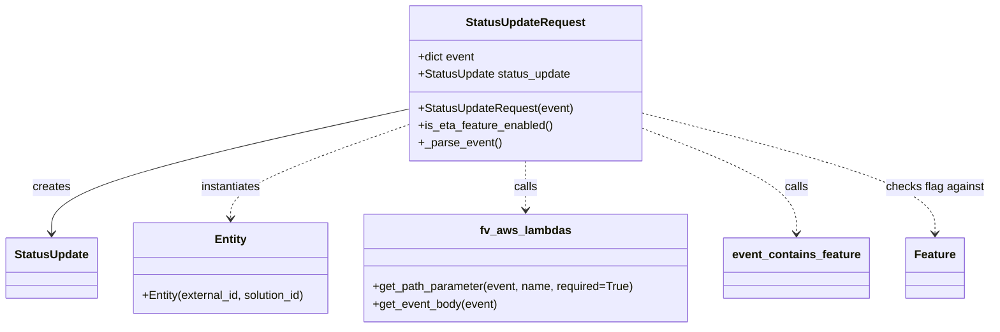

# Diagram: entity_core/entity_service/entity_listener/entity_listener_service/service/status_update_request.py

> Auto-generated by Obscura crawlers

## Mermaid

### SVG

<svg id="container" width="1369.53125" xmlns="http://www.w3.org/2000/svg" class="classDiagram" height="456" viewBox="0 0 1369.53125 456" role="graphics-document document" aria-roledescription="class"><g><defs><marker id="container_class-aggregationStart" class="marker aggregation class" refX="18" refY="7" markerWidth="190" markerHeight="240" orient="auto"><path d="M 18,7 L9,13 L1,7 L9,1 Z"></path></marker></defs><defs><marker id="container_class-aggregationEnd" class="marker aggregation class" refX="1" refY="7" markerWidth="20" markerHeight="28" orient="auto"><path d="M 18,7 L9,13 L1,7 L9,1 Z"></path></marker></defs><defs><marker id="container_class-extensionStart" class="marker extension class" refX="18" refY="7" markerWidth="190" markerHeight="240" orient="auto"><path d="M 1,7 L18,13 V 1 Z"></path></marker></defs><defs><marker id="container_class-extensionEnd" class="marker extension class" refX="1" refY="7" markerWidth="20" markerHeight="28" orient="auto"><path d="M 1,1 V 13 L18,7 Z"></path></marker></defs><defs><marker id="container_class-compositionStart" class="marker composition class" refX="18" refY="7" markerWidth="190" markerHeight="240" orient="auto"><path d="M 18,7 L9,13 L1,7 L9,1 Z"></path></marker></defs><defs><marker id="container_class-compositionEnd" class="marker composition class" refX="1" refY="7" markerWidth="20" markerHeight="28" orient="auto"><path d="M 18,7 L9,13 L1,7 L9,1 Z"></path></marker></defs><defs><marker id="container_class-dependencyStart" class="marker dependency class" refX="6" refY="7" markerWidth="190" markerHeight="240" orient="auto"><path d="M 5,7 L9,13 L1,7 L9,1 Z"></path></marker></defs><defs><marker id="container_class-dependencyEnd" class="marker dependency class" refX="13" refY="7" markerWidth="20" markerHeight="28" orient="auto"><path d="M 18,7 L9,13 L14,7 L9,1 Z"></path></marker></defs><defs><marker id="container_class-lollipopStart" class="marker lollipop class" refX="13" refY="7" markerWidth="190" markerHeight="240" orient="auto"><circle stroke="black" fill="transparent" cx="7" cy="7" r="6"></circle></marker></defs><defs><marker id="container_class-lollipopEnd" class="marker lollipop class" refX="1" refY="7" markerWidth="190" markerHeight="240" orient="auto"><circle stroke="black" fill="transparent" cx="7" cy="7" r="6"></circle></marker></defs><g class="root"><g class="clusters"></g><g class="edgePaths"><path d="M574.109,150.879L490.094,169.233C406.078,187.586,238.047,224.293,154.031,253.313C70.016,282.333,70.016,303.667,70.016,314.333L70.016,325" id="id_StatusUpdateRequest_StatusUpdate_1" class="edge-thickness-normal edge-pattern-solid relation" style=";;;" data-edge="true" data-et="edge" data-id="id_StatusUpdateRequest_StatusUpdate_1" data-points="W3sieCI6NTc0LjEwOTM3NSwieSI6MTUwLjg3OTEyMTAwODQ2Mjd9LHsieCI6NzAuMDE1NjI1LCJ5IjoyNjF9LHsieCI6NzAuMDE1NjI1LCJ5IjozMzF9XQ==" marker-end="url(#container_class-dependencyEnd)"></path><path d="M574.109,172.048L531.876,186.873C489.643,201.699,405.177,231.349,362.944,253.341C320.711,275.333,320.711,289.667,320.711,296.833L320.711,304" id="id_StatusUpdateRequest_Entity_2" class="edge-thickness-normal edge-pattern-dashed relation" style=";;;" data-edge="true" data-et="edge" data-id="id_StatusUpdateRequest_Entity_2" data-points="W3sieCI6NTc0LjEwOTM3NSwieSI6MTcyLjA0NzkwODE1NTU0NTQ5fSx7IngiOjMyMC43MTA5Mzc1LCJ5IjoyNjF9LHsieCI6MzIwLjcxMDkzNzUsInkiOjMxMH1d" marker-end="url(#container_class-dependencyEnd)"></path><path d="M733.773,224L733.773,230.167C733.773,236.333,733.773,248.667,733.773,260C733.773,271.333,733.773,281.667,733.773,286.833L733.773,292" id="id_StatusUpdateRequest_fv_aws_lambdas_3" class="edge-thickness-normal edge-pattern-dashed relation" style=";;;" data-edge="true" data-et="edge" data-id="id_StatusUpdateRequest_fv_aws_lambdas_3" data-points="W3sieCI6NzMzLjc3MzQzNzUsInkiOjIyNH0seyJ4Ijo3MzMuNzczNDM3NSwieSI6MjYxfSx7IngiOjczMy43NzM0Mzc1LCJ5IjoyOTh9XQ==" marker-end="url(#container_class-dependencyEnd)"></path><path d="M893.438,178.177L928.884,191.981C964.331,205.785,1035.224,233.392,1070.671,257.863C1106.117,282.333,1106.117,303.667,1106.117,314.333L1106.117,325" id="id_StatusUpdateRequest_event_contains_feature_4" class="edge-thickness-normal edge-pattern-dashed relation" style=";;;" data-edge="true" data-et="edge" data-id="id_StatusUpdateRequest_event_contains_feature_4" data-points="W3sieCI6ODkzLjQzNzUsInkiOjE3OC4xNzcxOTI2MTQzNTE2N30seyJ4IjoxMTA2LjExNzE4NzUsInkiOjI2MX0seyJ4IjoxMTA2LjExNzE4NzUsInkiOjMzMX1d" marker-end="url(#container_class-dependencyEnd)"></path><path d="M893.438,157.364L960.109,174.637C1026.781,191.909,1160.125,226.455,1226.797,254.394C1293.469,282.333,1293.469,303.667,1293.469,314.333L1293.469,325" id="id_StatusUpdateRequest_Feature_5" class="edge-thickness-normal edge-pattern-dashed relation" style=";;;" data-edge="true" data-et="edge" data-id="id_StatusUpdateRequest_Feature_5" data-points="W3sieCI6ODkzLjQzNzUsInkiOjE1Ny4zNjQwOTMxODY4NjIyOH0seyJ4IjoxMjkzLjQ2ODc1LCJ5IjoyNjF9LHsieCI6MTI5My40Njg3NSwieSI6MzMxfV0=" marker-end="url(#container_class-dependencyEnd)"></path></g><g class="edgeLabels"><g class="edgeLabel" transform="translate(70.015625, 261)"><g class="label" data-id="id_StatusUpdateRequest_StatusUpdate_1" transform="translate(-26.171875, -12)"><foreignObject width="52.34375" height="24">

creates

</foreignObject></g></g><g class="edgeLabel" transform="translate(320.7109375, 261)"><g class="label" data-id="id_StatusUpdateRequest_Entity_2" transform="translate(-42.9140625, -12)"><foreignObject width="85.828125" height="24">

instantiates

</foreignObject></g></g><g class="edgeLabel" transform="translate(733.7734375, 261)"><g class="label" data-id="id_StatusUpdateRequest_fv_aws_lambdas_3" transform="translate(-16.4453125, -12)"><foreignObject width="32.890625" height="24">

calls

</foreignObject></g></g><g class="edgeLabel" transform="translate(1106.1171875, 261)"><g class="label" data-id="id_StatusUpdateRequest_event_contains_feature_4" transform="translate(-16.4453125, -12)"><foreignObject width="32.890625" height="24">

calls

</foreignObject></g></g><g class="edgeLabel" transform="translate(1293.46875, 261)"><g class="label" data-id="id_StatusUpdateRequest_Feature_5" transform="translate(-68.0625, -12)"><foreignObject width="136.125" height="24">

checks flag against

</foreignObject></g></g></g><g class="nodes"><g class="node default" id="classId-StatusUpdateRequest-0" transform="translate(733.7734375, 116)"><g class="basic label-container"><path d="M-159.6640625 -108 L159.6640625 -108 L159.6640625 108 L-159.6640625 108" stroke="none" stroke-width="0" fill="#ECECFF" style=""></path><path d="M-159.6640625 -108 C-37.28206096871983 -108, 85.09994056256033 -108, 159.6640625 -108 M-159.6640625 -108 C-37.97965092070278 -108, 83.70476065859444 -108, 159.6640625 -108 M159.6640625 -108 C159.6640625 -51.5411042211698, 159.6640625 4.917791557660394, 159.6640625 108 M159.6640625 -108 C159.6640625 -43.6547187029374, 159.6640625 20.690562594125197, 159.6640625 108 M159.6640625 108 C73.66783585113082 108, -12.328390797738365 108, -159.6640625 108 M159.6640625 108 C79.40102259320854 108, -0.8620173135829248 108, -159.6640625 108 M-159.6640625 108 C-159.6640625 46.25154667223629, -159.6640625 -15.496906655527425, -159.6640625 -108 M-159.6640625 108 C-159.6640625 47.27382833598438, -159.6640625 -13.452343328031233, -159.6640625 -108" stroke="#9370DB" stroke-width="1.3" fill="none" stroke-dasharray="0 0" style=""></path></g><g class="annotation-group text" transform="translate(0, -84)"></g><g class="label-group text" transform="translate(-79.984375, -84)"><g class="label" style="font-weight: bolder" transform="translate(0,-12)"><foreignObject width="159.96875" height="24">

StatusUpdateRequest

</foreignObject></g></g><g class="members-group text" transform="translate(-147.6640625, -36)"><g class="label" style="" transform="translate(0,-12)"><foreignObject width="80.078125" height="24">

+dict event

</foreignObject></g><g class="label" style="" transform="translate(0,12)"><foreignObject width="213.28125" height="24">

+StatusUpdate status_update

</foreignObject></g></g><g class="methods-group text" transform="translate(-147.6640625, 36)"><g class="label" style="" transform="translate(0,-12)"><foreignObject width="215.34375" height="24">

+StatusUpdateRequest(event)

</foreignObject></g><g class="label" style="" transform="translate(0,12)"><foreignObject width="187.953125" height="24">

+is_eta_feature_enabled()

</foreignObject></g><g class="label" style="" transform="translate(0,36)"><foreignObject width="113.59375" height="24">

+_parse_event()

</foreignObject></g></g><g class="divider" style=""><path d="M-159.6640625 -60 C-85.32053114387757 -60, -10.976999787755148 -60, 159.6640625 -60 M-159.6640625 -60 C-82.87585318549584 -60, -6.087643870991684 -60, 159.6640625 -60" stroke="#9370DB" stroke-width="1.3" fill="none" stroke-dasharray="0 0" style=""></path></g><g class="divider" style=""><path d="M-159.6640625 12 C-34.251342490596684 12, 91.16137751880663 12, 159.6640625 12 M-159.6640625 12 C-60.90308623909387 12, 37.85789002181227 12, 159.6640625 12" stroke="#9370DB" stroke-width="1.3" fill="none" stroke-dasharray="0 0" style=""></path></g></g><g class="node default" id="classId-StatusUpdate-1" transform="translate(70.015625, 373)"><g class="basic label-container"><path d="M-62.015625 -42 L62.015625 -42 L62.015625 42 L-62.015625 42" stroke="none" stroke-width="0" fill="#ECECFF" style=""></path><path d="M-62.015625 -42 C-33.372314406763266 -42, -4.729003813526532 -42, 62.015625 -42 M-62.015625 -42 C-17.639326537146715 -42, 26.73697192570657 -42, 62.015625 -42 M62.015625 -42 C62.015625 -15.143566992583718, 62.015625 11.712866014832564, 62.015625 42 M62.015625 -42 C62.015625 -15.39339786907906, 62.015625 11.21320426184188, 62.015625 42 M62.015625 42 C35.73081216804946 42, 9.445999336098922 42, -62.015625 42 M62.015625 42 C24.476478695632892 42, -13.062667608734216 42, -62.015625 42 M-62.015625 42 C-62.015625 15.683944418378235, -62.015625 -10.632111163243529, -62.015625 -42 M-62.015625 42 C-62.015625 21.730796811779932, -62.015625 1.4615936235598639, -62.015625 -42" stroke="#9370DB" stroke-width="1.3" fill="none" stroke-dasharray="0 0" style=""></path></g><g class="annotation-group text" transform="translate(0, -18)"></g><g class="label-group text" transform="translate(-50.015625, -18)"><g class="label" style="font-weight: bolder" transform="translate(0,-12)"><foreignObject width="100.03125" height="24">

StatusUpdate

</foreignObject></g></g><g class="members-group text" transform="translate(-50.015625, 30)"></g><g class="methods-group text" transform="translate(-50.015625, 60)"></g><g class="divider" style=""><path d="M-62.015625 6 C-25.719644869470194 6, 10.576335261059612 6, 62.015625 6 M-62.015625 6 C-20.045570397379976 6, 21.92448420524005 6, 62.015625 6" stroke="#9370DB" stroke-width="1.3" fill="none" stroke-dasharray="0 0" style=""></path></g><g class="divider" style=""><path d="M-62.015625 24 C-32.25405391444361 24, -2.492482828887219 24, 62.015625 24 M-62.015625 24 C-20.340573981436464 24, 21.334477037127073 24, 62.015625 24" stroke="#9370DB" stroke-width="1.3" fill="none" stroke-dasharray="0 0" style=""></path></g></g><g class="node default" id="classId-Entity-2" transform="translate(320.7109375, 373)"><g class="basic label-container"><path d="M-138.6796875 -63 L138.6796875 -63 L138.6796875 63 L-138.6796875 63" stroke="none" stroke-width="0" fill="#ECECFF" style=""></path><path d="M-138.6796875 -63 C-44.624638308369086 -63, 49.43041088326183 -63, 138.6796875 -63 M-138.6796875 -63 C-29.6237652752898 -63, 79.4321569494204 -63, 138.6796875 -63 M138.6796875 -63 C138.6796875 -31.659209409357317, 138.6796875 -0.3184188187146333, 138.6796875 63 M138.6796875 -63 C138.6796875 -34.30173076871999, 138.6796875 -5.603461537439976, 138.6796875 63 M138.6796875 63 C67.92690023128945 63, -2.825887037421097 63, -138.6796875 63 M138.6796875 63 C72.70380379428983 63, 6.727920088579651 63, -138.6796875 63 M-138.6796875 63 C-138.6796875 33.92299512602038, -138.6796875 4.845990252040764, -138.6796875 -63 M-138.6796875 63 C-138.6796875 19.51826478150838, -138.6796875 -23.963470436983243, -138.6796875 -63" stroke="#9370DB" stroke-width="1.3" fill="none" stroke-dasharray="0 0" style=""></path></g><g class="annotation-group text" transform="translate(0, -39)"></g><g class="label-group text" transform="translate(-21.28125, -39)"><g class="label" style="font-weight: bolder" transform="translate(0,-12)"><foreignObject width="42.5625" height="24">

Entity

</foreignObject></g></g><g class="members-group text" transform="translate(-126.6796875, 9)"></g><g class="methods-group text" transform="translate(-126.6796875, 39)"><g class="label" style="" transform="translate(0,-12)"><foreignObject width="232.078125" height="24">

+Entity(external_id, solution_id)

</foreignObject></g></g><g class="divider" style=""><path d="M-138.6796875 -15 C-55.46043857969812 -15, 27.75881034060376 -15, 138.6796875 -15 M-138.6796875 -15 C-64.6468173112887 -15, 9.3860528774226 -15, 138.6796875 -15" stroke="#9370DB" stroke-width="1.3" fill="none" stroke-dasharray="0 0" style=""></path></g><g class="divider" style=""><path d="M-138.6796875 9 C-66.77892763055483 9, 5.121832238890335 9, 138.6796875 9 M-138.6796875 9 C-56.23235683555406 9, 26.214973828891885 9, 138.6796875 9" stroke="#9370DB" stroke-width="1.3" fill="none" stroke-dasharray="0 0" style=""></path></g></g><g class="node default" id="classId-Feature-3" transform="translate(1293.46875, 373)"><g class="basic label-container"><path d="M-39.390625 -42 L39.390625 -42 L39.390625 42 L-39.390625 42" stroke="none" stroke-width="0" fill="#ECECFF" style=""></path><path d="M-39.390625 -42 C-16.34207988866067 -42, 6.706465222678659 -42, 39.390625 -42 M-39.390625 -42 C-11.162087994740745 -42, 17.06644901051851 -42, 39.390625 -42 M39.390625 -42 C39.390625 -19.682919087421958, 39.390625 2.6341618251560845, 39.390625 42 M39.390625 -42 C39.390625 -11.300700203583045, 39.390625 19.39859959283391, 39.390625 42 M39.390625 42 C20.763472441368926 42, 2.136319882737851 42, -39.390625 42 M39.390625 42 C22.213852448653984 42, 5.037079897307969 42, -39.390625 42 M-39.390625 42 C-39.390625 12.488704447885848, -39.390625 -17.022591104228304, -39.390625 -42 M-39.390625 42 C-39.390625 10.738876882146538, -39.390625 -20.522246235706923, -39.390625 -42" stroke="#9370DB" stroke-width="1.3" fill="none" stroke-dasharray="0 0" style=""></path></g><g class="annotation-group text" transform="translate(0, -18)"></g><g class="label-group text" transform="translate(-27.390625, -18)"><g class="label" style="font-weight: bolder" transform="translate(0,-12)"><foreignObject width="54.78125" height="24">

Feature

</foreignObject></g></g><g class="members-group text" transform="translate(-27.390625, 30)"></g><g class="methods-group text" transform="translate(-27.390625, 60)"></g><g class="divider" style=""><path d="M-39.390625 6 C-19.594323425000027 6, 0.20197814999994534 6, 39.390625 6 M-39.390625 6 C-14.466919552885045 6, 10.45678589422991 6, 39.390625 6" stroke="#9370DB" stroke-width="1.3" fill="none" stroke-dasharray="0 0" style=""></path></g><g class="divider" style=""><path d="M-39.390625 24 C-9.790139048351804 24, 19.81034690329639 24, 39.390625 24 M-39.390625 24 C-18.803391189061465 24, 1.7838426218770707 24, 39.390625 24" stroke="#9370DB" stroke-width="1.3" fill="none" stroke-dasharray="0 0" style=""></path></g></g><g class="node default" id="classId-fv_aws_lambdas-4" transform="translate(733.7734375, 373)"><g class="basic label-container"><path d="M-224.3828125 -75 L224.3828125 -75 L224.3828125 75 L-224.3828125 75" stroke="none" stroke-width="0" fill="#ECECFF" style=""></path><path d="M-224.3828125 -75 C-91.97848144511673 -75, 40.425849609766544 -75, 224.3828125 -75 M-224.3828125 -75 C-74.01971980593703 -75, 76.34337288812594 -75, 224.3828125 -75 M224.3828125 -75 C224.3828125 -21.377096441838297, 224.3828125 32.245807116323405, 224.3828125 75 M224.3828125 -75 C224.3828125 -24.879670538217034, 224.3828125 25.24065892356593, 224.3828125 75 M224.3828125 75 C126.2623138855002 75, 28.14181527100041 75, -224.3828125 75 M224.3828125 75 C95.50990405454078 75, -33.363004390918434 75, -224.3828125 75 M-224.3828125 75 C-224.3828125 19.691156823847237, -224.3828125 -35.617686352305526, -224.3828125 -75 M-224.3828125 75 C-224.3828125 30.791297182914256, -224.3828125 -13.417405634171487, -224.3828125 -75" stroke="#9370DB" stroke-width="1.3" fill="none" stroke-dasharray="0 0" style=""></path></g><g class="annotation-group text" transform="translate(0, -51)"></g><g class="label-group text" transform="translate(-60.0625, -51)"><g class="label" style="font-weight: bolder" transform="translate(0,-12)"><foreignObject width="120.125" height="24">

fv_aws_lambdas

</foreignObject></g></g><g class="members-group text" transform="translate(-212.3828125, -3)"></g><g class="methods-group text" transform="translate(-212.3828125, 27)"><g class="label" style="" transform="translate(0,-12)"><foreignObject width="364.703125" height="24">

+get_path_parameter(event, name, required=True)

</foreignObject></g><g class="label" style="" transform="translate(0,12)"><foreignObject width="174.203125" height="24">

+get_event_body(event)

</foreignObject></g></g><g class="divider" style=""><path d="M-224.3828125 -27 C-67.79845649394125 -27, 88.78589951211751 -27, 224.3828125 -27 M-224.3828125 -27 C-65.14549231210503 -27, 94.09182787578993 -27, 224.3828125 -27" stroke="#9370DB" stroke-width="1.3" fill="none" stroke-dasharray="0 0" style=""></path></g><g class="divider" style=""><path d="M-224.3828125 -3 C-104.89905541257819 -3, 14.584701674843615 -3, 224.3828125 -3 M-224.3828125 -3 C-111.28940519431684 -3, 1.8040021113663158 -3, 224.3828125 -3" stroke="#9370DB" stroke-width="1.3" fill="none" stroke-dasharray="0 0" style=""></path></g></g><g class="node default" id="classId-event_contains_feature-5" transform="translate(1106.1171875, 373)"><g class="basic label-container"><path d="M-97.9609375 -42 L97.9609375 -42 L97.9609375 42 L-97.9609375 42" stroke="none" stroke-width="0" fill="#ECECFF" style=""></path><path d="M-97.9609375 -42 C-34.51636506276326 -42, 28.928207374473473 -42, 97.9609375 -42 M-97.9609375 -42 C-26.01539611816058 -42, 45.93014526367884 -42, 97.9609375 -42 M97.9609375 -42 C97.9609375 -14.93241020746984, 97.9609375 12.135179585060321, 97.9609375 42 M97.9609375 -42 C97.9609375 -18.422639317736206, 97.9609375 5.154721364527589, 97.9609375 42 M97.9609375 42 C50.97194310114228 42, 3.9829487022845598 42, -97.9609375 42 M97.9609375 42 C57.42170712574436 42, 16.882476751488724 42, -97.9609375 42 M-97.9609375 42 C-97.9609375 24.994389508321053, -97.9609375 7.9887790166421055, -97.9609375 -42 M-97.9609375 42 C-97.9609375 23.260840973098162, -97.9609375 4.521681946196324, -97.9609375 -42" stroke="#9370DB" stroke-width="1.3" fill="none" stroke-dasharray="0 0" style=""></path></g><g class="annotation-group text" transform="translate(0, -18)"></g><g class="label-group text" transform="translate(-85.9609375, -18)"><g class="label" style="font-weight: bolder" transform="translate(0,-12)"><foreignObject width="171.921875" height="24">

event_contains_feature

</foreignObject></g></g><g class="members-group text" transform="translate(-85.9609375, 30)"></g><g class="methods-group text" transform="translate(-85.9609375, 60)"></g><g class="divider" style=""><path d="M-97.9609375 6 C-26.907033709620578 6, 44.146870080758845 6, 97.9609375 6 M-97.9609375 6 C-41.08695162380108 6, 15.787034252397845 6, 97.9609375 6" stroke="#9370DB" stroke-width="1.3" fill="none" stroke-dasharray="0 0" style=""></path></g><g class="divider" style=""><path d="M-97.9609375 24 C-54.66380098861807 24, -11.366664477236142 24, 97.9609375 24 M-97.9609375 24 C-46.859619283538144 24, 4.241698932923711 24, 97.9609375 24" stroke="#9370DB" stroke-width="1.3" fill="none" stroke-dasharray="0 0" style=""></path></g></g></g></g></g></svg>
