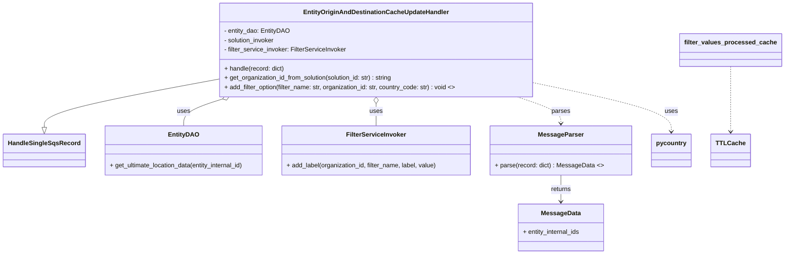

# Diagram: entity_core/entity_service/entity_listener/entity_listener_service/service/update_entity_origin_and_destination_cache.py


> Auto-generated by Obscura crawlers

## Diagram 1



### SVG

<svg id="container" width="1978.21875" xmlns="http://www.w3.org/2000/svg" class="classDiagram" height="650" viewBox="0 0 1978.21875 650" role="graphics-document document" aria-roledescription="class"><style>#container{font-family:"trebuchet ms",verdana,arial,sans-serif;font-size:16px;fill:#333;}@keyframes edge-animation-frame{from{stroke-dashoffset:0;}}@keyframes dash{to{stroke-dashoffset:0;}}#container .edge-animation-slow{stroke-dasharray:9,5!important;stroke-dashoffset:900;animation:dash 50s linear infinite;stroke-linecap:round;}#container .edge-animation-fast{stroke-dasharray:9,5!important;stroke-dashoffset:900;animation:dash 20s linear infinite;stroke-linecap:round;}#container .error-icon{fill:#552222;}#container .error-text{fill:#552222;stroke:#552222;}#container .edge-thickness-normal{stroke-width:1px;}#container .edge-thickness-thick{stroke-width:3.5px;}#container .edge-pattern-solid{stroke-dasharray:0;}#container .edge-thickness-invisible{stroke-width:0;fill:none;}#container .edge-pattern-dashed{stroke-dasharray:3;}#container .edge-pattern-dotted{stroke-dasharray:2;}#container .marker{fill:#333333;stroke:#333333;}#container .marker.cross{stroke:#333333;}#container svg{font-family:"trebuchet ms",verdana,arial,sans-serif;font-size:16px;}#container p{margin:0;}#container g.classGroup text{fill:#9370DB;stroke:none;font-family:"trebuchet ms",verdana,arial,sans-serif;font-size:10px;}#container g.classGroup text .title{font-weight:bolder;}#container .nodeLabel,#container .edgeLabel{color:#131300;}#container .edgeLabel .label rect{fill:#ECECFF;}#container .label text{fill:#131300;}#container .labelBkg{background:#ECECFF;}#container .edgeLabel .label span{background:#ECECFF;}#container .classTitle{font-weight:bolder;}#container .node rect,#container .node circle,#container .node ellipse,#container .node polygon,#container .node path{fill:#ECECFF;stroke:#9370DB;stroke-width:1px;}#container .divider{stroke:#9370DB;stroke-width:1;}#container g.clickable{cursor:pointer;}#container g.classGroup rect{fill:#ECECFF;stroke:#9370DB;}#container g.classGroup line{stroke:#9370DB;stroke-width:1;}#container .classLabel .box{stroke:none;stroke-width:0;fill:#ECECFF;opacity:0.5;}#container .classLabel .label{fill:#9370DB;font-size:10px;}#container .relation{stroke:#333333;stroke-width:1;fill:none;}#container .dashed-line{stroke-dasharray:3;}#container .dotted-line{stroke-dasharray:1 2;}#container #compositionStart,#container .composition{fill:#333333!important;stroke:#333333!important;stroke-width:1;}#container #compositionEnd,#container .composition{fill:#333333!important;stroke:#333333!important;stroke-width:1;}#container #dependencyStart,#container .dependency{fill:#333333!important;stroke:#333333!important;stroke-width:1;}#container #dependencyStart,#container .dependency{fill:#333333!important;stroke:#333333!important;stroke-width:1;}#container #extensionStart,#container .extension{fill:transparent!important;stroke:#333333!important;stroke-width:1;}#container #extensionEnd,#container .extension{fill:transparent!important;stroke:#333333!important;stroke-width:1;}#container #aggregationStart,#container .aggregation{fill:transparent!important;stroke:#333333!important;stroke-width:1;}#container #aggregationEnd,#container .aggregation{fill:transparent!important;stroke:#333333!important;stroke-width:1;}#container #lollipopStart,#container .lollipop{fill:#ECECFF!important;stroke:#333333!important;stroke-width:1;}#container #lollipopEnd,#container .lollipop{fill:#ECECFF!important;stroke:#333333!important;stroke-width:1;}#container .edgeTerminals{font-size:11px;line-height:initial;}#container .classTitleText{text-anchor:middle;font-size:18px;fill:#333;}#container .label-icon{display:inline-block;height:1em;overflow:visible;vertical-align:-0.125em;}#container .node .label-icon path{fill:currentColor;stroke:revert;stroke-width:revert;}#container :root{--mermaid-font-family:"trebuchet ms",verdana,arial,sans-serif;}</style><g><defs><marker id="container_class-aggregationStart" class="marker aggregation class" refX="18" refY="7" markerWidth="190" markerHeight="240" orient="auto"><path d="M 18,7 L9,13 L1,7 L9,1 Z"></path></marker></defs><defs><marker id="container_class-aggregationEnd" class="marker aggregation class" refX="1" refY="7" markerWidth="20" markerHeight="28" orient="auto"><path d="M 18,7 L9,13 L1,7 L9,1 Z"></path></marker></defs><defs><marker id="container_class-extensionStart" class="marker extension class" refX="18" refY="7" markerWidth="190" markerHeight="240" orient="auto"><path d="M 1,7 L18,13 V 1 Z"></path></marker></defs><defs><marker id="container_class-extensionEnd" class="marker extension class" refX="1" refY="7" markerWidth="20" markerHeight="28" orient="auto"><path d="M 1,1 V 13 L18,7 Z"></path></marker></defs><defs><marker id="container_class-compositionStart" class="marker composition class" refX="18" refY="7" markerWidth="190" markerHeight="240" orient="auto"><path d="M 18,7 L9,13 L1,7 L9,1 Z"></path></marker></defs><defs><marker id="container_class-compositionEnd" class="marker composition class" refX="1" refY="7" markerWidth="20" markerHeight="28" orient="auto"><path d="M 18,7 L9,13 L1,7 L9,1 Z"></path></marker></defs><defs><marker id="container_class-dependencyStart" class="marker dependency class" refX="6" refY="7" markerWidth="190" markerHeight="240" orient="auto"><path d="M 5,7 L9,13 L1,7 L9,1 Z"></path></marker></defs><defs><marker id="container_class-dependencyEnd" class="marker dependency class" refX="13" refY="7" markerWidth="20" markerHeight="28" orient="auto"><path d="M 18,7 L9,13 L14,7 L9,1 Z"></path></marker></defs><defs><marker id="container_class-lollipopStart" class="marker lollipop class" refX="13" refY="7" markerWidth="190" markerHeight="240" orient="auto"><circle stroke="black" fill="transparent" cx="7" cy="7" r="6"></circle></marker></defs><defs><marker id="container_class-lollipopEnd" class="marker lollipop class" refX="1" refY="7" markerWidth="190" markerHeight="240" orient="auto"><circle stroke="black" fill="transparent" cx="7" cy="7" r="6"></circle></marker></defs><g class="root"><g class="clusters"></g><g class="edgePaths"><path d="M559.965,201.685L484.484,215.57C409.003,229.456,258.04,257.228,182.559,277.906C107.078,298.583,107.078,312.167,107.078,318.958L107.078,325.75" id="id_EntityOriginAndDestinationCacheUpdateHandler_HandleSingleSqsRecord_1" class="edge-thickness-normal edge-pattern-solid relation" style=";;;" data-edge="true" data-et="edge" data-id="id_EntityOriginAndDestinationCacheUpdateHandler_HandleSingleSqsRecord_1" data-points="W3sieCI6NTU5Ljk2NDg0Mzc1LCJ5IjoyMDEuNjg0NTY0ODk0OTk5OX0seyJ4IjoxMDcuMDc4MTI1LCJ5IjoyODV9LHsieCI6MTA3LjA3ODEyNSwieSI6MzQzfV0=" marker-end="url(#container_class-extensionEnd)"></path><path d="M562.938,253.181L546.095,258.484C529.253,263.787,495.568,274.394,478.725,285.863C461.883,297.333,461.883,309.667,461.883,315.833L461.883,322" id="id_EntityOriginAndDestinationCacheUpdateHandler_EntityDAO_2" class="edge-thickness-normal edge-pattern-solid relation" style=";;;" data-edge="true" data-et="edge" data-id="id_EntityOriginAndDestinationCacheUpdateHandler_EntityDAO_2" data-points="W3sieCI6NTc5LjM5MTMyMTY1NjA1MDksInkiOjI0OH0seyJ4Ijo0NjEuODgyODEyNSwieSI6Mjg1fSx7IngiOjQ2MS44ODI4MTI1LCJ5IjozMjJ9XQ==" marker-start="url(#container_class-aggregationStart)"></path><path d="M960.5,265.25L960.5,268.542C960.5,271.833,960.5,278.417,960.5,287.875C960.5,297.333,960.5,309.667,960.5,315.833L960.5,322" id="id_EntityOriginAndDestinationCacheUpdateHandler_FilterServiceInvoker_3" class="edge-thickness-normal edge-pattern-solid relation" style=";;;" data-edge="true" data-et="edge" data-id="id_EntityOriginAndDestinationCacheUpdateHandler_FilterServiceInvoker_3" data-points="W3sieCI6OTYwLjUsInkiOjI0OH0seyJ4Ijo5NjAuNSwieSI6Mjg1fSx7IngiOjk2MC41LCJ5IjozMjJ9XQ==" marker-start="url(#container_class-aggregationStart)"></path><path d="M1318.21,248L1336.592,254.167C1354.975,260.333,1391.739,272.667,1410.122,284C1428.504,295.333,1428.504,305.667,1428.504,310.833L1428.504,316" id="id_EntityOriginAndDestinationCacheUpdateHandler_MessageParser_4" class="edge-thickness-normal edge-pattern-dashed relation" style=";;;" data-edge="true" data-et="edge" data-id="id_EntityOriginAndDestinationCacheUpdateHandler_MessageParser_4" data-points="W3sieCI6MTMxOC4yMDk5OTIwMzgyMTY2LCJ5IjoyNDh9LHsieCI6MTQyOC41MDM5MDYyNSwieSI6Mjg1fSx7IngiOjE0MjguNTAzOTA2MjUsInkiOjMyMn1d" marker-end="url(#container_class-dependencyEnd)"></path><path d="M1428.504,448L1428.504,454.167C1428.504,460.333,1428.504,472.667,1428.504,484C1428.504,495.333,1428.504,505.667,1428.504,510.833L1428.504,516" id="id_MessageParser_MessageData_5" class="edge-thickness-normal edge-pattern-solid relation" style=";;;" data-edge="true" data-et="edge" data-id="id_MessageParser_MessageData_5" data-points="W3sieCI6MTQyOC41MDM5MDYyNSwieSI6NDQ4fSx7IngiOjE0MjguNTAzOTA2MjUsInkiOjQ4NX0seyJ4IjoxNDI4LjUwMzkwNjI1LCJ5Ijo1MjJ9XQ==" marker-end="url(#container_class-dependencyEnd)"></path><path d="M1847.344,170L1847.344,189.167C1847.344,208.333,1847.344,246.667,1847.344,274.5C1847.344,302.333,1847.344,319.667,1847.344,328.333L1847.344,337" id="id_filter_values_processed_cache_TTLCache_6" class="edge-thickness-normal edge-pattern-dashed relation" style=";;;" data-edge="true" data-et="edge" data-id="id_filter_values_processed_cache_TTLCache_6" data-points="W3sieCI6MTg0Ny4zNDM3NSwieSI6MTcwfSx7IngiOjE4NDcuMzQzNzUsInkiOjI4NX0seyJ4IjoxODQ3LjM0Mzc1LCJ5IjozNDN9XQ==" marker-end="url(#container_class-dependencyEnd)"></path><path d="M1361.035,212.762L1417.928,224.802C1474.82,236.841,1588.605,260.921,1645.498,281.627C1702.391,302.333,1702.391,319.667,1702.391,328.333L1702.391,337" id="id_EntityOriginAndDestinationCacheUpdateHandler_pycountry_7" class="edge-thickness-normal edge-pattern-dashed relation" style=";;;" data-edge="true" data-et="edge" data-id="id_EntityOriginAndDestinationCacheUpdateHandler_pycountry_7" data-points="W3sieCI6MTM2MS4wMzUxNTYyNSwieSI6MjEyLjc2MTg0Njg0NDAwMDc2fSx7IngiOjE3MDIuMzkwNjI1LCJ5IjoyODV9LHsieCI6MTcwMi4zOTA2MjUsInkiOjM0M31d" marker-end="url(#container_class-dependencyEnd)"></path></g><g class="edgeLabels"><g class="edgeLabel"><g class="label" data-id="id_EntityOriginAndDestinationCacheUpdateHandler_HandleSingleSqsRecord_1" transform="translate(0, 0)"><foreignObject width="0" height="0"><div xmlns="http://www.w3.org/1999/xhtml" class="labelBkg" style="display: table-cell; white-space: nowrap; line-height: 1.5; max-width: 200px; text-align: center;"><span class="edgeLabel"></span></div></foreignObject></g></g><g class="edgeLabel" transform="translate(461.8828125, 285)"><g class="label" data-id="id_EntityOriginAndDestinationCacheUpdateHandler_EntityDAO_2" transform="translate(-16.4921875, -12)"><foreignObject width="32.984375" height="24"><div xmlns="http://www.w3.org/1999/xhtml" class="labelBkg" style="display: table-cell; white-space: nowrap; line-height: 1.5; max-width: 200px; text-align: center;"><span class="edgeLabel"><p>uses</p></span></div></foreignObject></g></g><g class="edgeLabel" transform="translate(960.5, 285)"><g class="label" data-id="id_EntityOriginAndDestinationCacheUpdateHandler_FilterServiceInvoker_3" transform="translate(-16.4921875, -12)"><foreignObject width="32.984375" height="24"><div xmlns="http://www.w3.org/1999/xhtml" class="labelBkg" style="display: table-cell; white-space: nowrap; line-height: 1.5; max-width: 200px; text-align: center;"><span class="edgeLabel"><p>uses</p></span></div></foreignObject></g></g><g class="edgeLabel" transform="translate(1428.50390625, 285)"><g class="label" data-id="id_EntityOriginAndDestinationCacheUpdateHandler_MessageParser_4" transform="translate(-23.828125, -12)"><foreignObject width="47.65625" height="24"><div xmlns="http://www.w3.org/1999/xhtml" class="labelBkg" style="display: table-cell; white-space: nowrap; line-height: 1.5; max-width: 200px; text-align: center;"><span class="edgeLabel"><p>parses</p></span></div></foreignObject></g></g><g class="edgeLabel" transform="translate(1428.50390625, 485)"><g class="label" data-id="id_MessageParser_MessageData_5" transform="translate(-26.265625, -12)"><foreignObject width="52.53125" height="24"><div xmlns="http://www.w3.org/1999/xhtml" class="labelBkg" style="display: table-cell; white-space: nowrap; line-height: 1.5; max-width: 200px; text-align: center;"><span class="edgeLabel"><p>returns</p></span></div></foreignObject></g></g><g class="edgeLabel"><g class="label" data-id="id_filter_values_processed_cache_TTLCache_6" transform="translate(0, 0)"><foreignObject width="0" height="0"><div xmlns="http://www.w3.org/1999/xhtml" class="labelBkg" style="display: table-cell; white-space: nowrap; line-height: 1.5; max-width: 200px; text-align: center;"><span class="edgeLabel"></span></div></foreignObject></g></g><g class="edgeLabel" transform="translate(1702.390625, 285)"><g class="label" data-id="id_EntityOriginAndDestinationCacheUpdateHandler_pycountry_7" transform="translate(-16.4921875, -12)"><foreignObject width="32.984375" height="24"><div xmlns="http://www.w3.org/1999/xhtml" class="labelBkg" style="display: table-cell; white-space: nowrap; line-height: 1.5; max-width: 200px; text-align: center;"><span class="edgeLabel"><p>uses</p></span></div></foreignObject></g></g></g><g class="nodes"><g class="node default" id="classId-HandleSingleSqsRecord-0" transform="translate(107.078125, 385)"><g class="basic label-container"><path d="M-99.078125 -42 L99.078125 -42 L99.078125 42 L-99.078125 42" stroke="none" stroke-width="0" fill="#ECECFF" style=""></path><path d="M-99.078125 -42 C-57.916810833271796 -42, -16.755496666543593 -42, 99.078125 -42 M-99.078125 -42 C-46.4741216578972 -42, 6.1298816842056 -42, 99.078125 -42 M99.078125 -42 C99.078125 -9.013608677839585, 99.078125 23.97278264432083, 99.078125 42 M99.078125 -42 C99.078125 -12.928189800158759, 99.078125 16.143620399682483, 99.078125 42 M99.078125 42 C44.254221839650874 42, -10.569681320698251 42, -99.078125 42 M99.078125 42 C51.4657769198895 42, 3.8534288397789993 42, -99.078125 42 M-99.078125 42 C-99.078125 15.148676864816554, -99.078125 -11.702646270366891, -99.078125 -42 M-99.078125 42 C-99.078125 19.41509941994221, -99.078125 -3.1698011601155827, -99.078125 -42" stroke="#9370DB" stroke-width="1.3" fill="none" stroke-dasharray="0 0" style=""></path></g><g class="annotation-group text" transform="translate(0, -18)"></g><g class="label-group text" transform="translate(-87.078125, -18)"><g class="label" style="font-weight: bolder" transform="translate(0,-12)"><foreignObject width="174.15625" height="24"><div xmlns="http://www.w3.org/1999/xhtml" style="display: table-cell; white-space: nowrap; line-height: 1.5; max-width: 222px; text-align: center;"><span class="nodeLabel markdown-node-label" style=""><p>HandleSingleSqsRecord</p></span></div></foreignObject></g></g><g class="members-group text" transform="translate(-87.078125, 30)"></g><g class="methods-group text" transform="translate(-87.078125, 60)"></g><g class="divider" style=""><path d="M-99.078125 6 C-31.049626488930784 6, 36.97887202213843 6, 99.078125 6 M-99.078125 6 C-19.93775869891003 6, 59.20260760217994 6, 99.078125 6" stroke="#9370DB" stroke-width="1.3" fill="none" stroke-dasharray="0 0" style=""></path></g><g class="divider" style=""><path d="M-99.078125 24 C-53.48281335031551 24, -7.88750170063102 24, 99.078125 24 M-99.078125 24 C-59.05841522426269 24, -19.038705448525377 24, 99.078125 24" stroke="#9370DB" stroke-width="1.3" fill="none" stroke-dasharray="0 0" style=""></path></g></g><g class="node default" id="classId-EntityOriginAndDestinationCacheUpdateHandler-1" transform="translate(960.5, 128)"><g class="basic label-container"><path d="M-400.53515625 -120 L400.53515625 -120 L400.53515625 120 L-400.53515625 120" stroke="none" stroke-width="0" fill="#ECECFF" style=""></path><path d="M-400.53515625 -120 C-96.97366085451216 -120, 206.58783454097568 -120, 400.53515625 -120 M-400.53515625 -120 C-139.14040679053664 -120, 122.25434266892671 -120, 400.53515625 -120 M400.53515625 -120 C400.53515625 -59.54795487926437, 400.53515625 0.9040902414712662, 400.53515625 120 M400.53515625 -120 C400.53515625 -66.11800725607154, 400.53515625 -12.236014512143086, 400.53515625 120 M400.53515625 120 C125.45914607507933 120, -149.61686409984134 120, -400.53515625 120 M400.53515625 120 C170.6231608856005 120, -59.288834478799004 120, -400.53515625 120 M-400.53515625 120 C-400.53515625 56.84455325240589, -400.53515625 -6.310893495188225, -400.53515625 -120 M-400.53515625 120 C-400.53515625 61.13223092907561, -400.53515625 2.264461858151222, -400.53515625 -120" stroke="#9370DB" stroke-width="1.3" fill="none" stroke-dasharray="0 0" style=""></path></g><g class="annotation-group text" transform="translate(0, -96)"></g><g class="label-group text" transform="translate(-177.5390625, -96)"><g class="label" style="font-weight: bolder" transform="translate(0,-12)"><foreignObject width="355.078125" height="24"><div xmlns="http://www.w3.org/1999/xhtml" style="display: table-cell; white-space: nowrap; line-height: 1.5; max-width: 402px; text-align: center;"><span class="nodeLabel markdown-node-label" style=""><p>EntityOriginAndDestinationCacheUpdateHandler</p></span></div></foreignObject></g></g><g class="members-group text" transform="translate(-388.53515625, -48)"><g class="label" style="" transform="translate(0,-12)"><foreignObject width="167.71875" height="24"><div xmlns="http://www.w3.org/1999/xhtml" style="display: table-cell; white-space: nowrap; line-height: 1.5; max-width: 225px; text-align: center;"><span class="nodeLabel markdown-node-label" style=""><p>- entity_dao: EntityDAO</p></span></div></foreignObject></g><g class="label" style="" transform="translate(0,12)"><foreignObject width="132.71875" height="24"><div xmlns="http://www.w3.org/1999/xhtml" style="display: table-cell; white-space: nowrap; line-height: 1.5; max-width: 191px; text-align: center;"><span class="nodeLabel markdown-node-label" style=""><p>- solution_invoker</p></span></div></foreignObject></g><g class="label" style="" transform="translate(0,36)"><foreignObject width="316.03125" height="24"><div xmlns="http://www.w3.org/1999/xhtml" style="display: table-cell; white-space: nowrap; line-height: 1.5; max-width: 374px; text-align: center;"><span class="nodeLabel markdown-node-label" style=""><p>- filter_service_invoker: FilterServiceInvoker</p></span></div></foreignObject></g></g><g class="methods-group text" transform="translate(-388.53515625, 48)"><g class="label" style="" transform="translate(0,-12)"><foreignObject width="154.890625" height="24"><div xmlns="http://www.w3.org/1999/xhtml" style="display: table-cell; white-space: nowrap; line-height: 1.5; max-width: 212px; text-align: center;"><span class="nodeLabel markdown-node-label" style=""><p>+ handle(record: dict)</p></span></div></foreignObject></g><g class="label" style="" transform="translate(0,12)"><foreignObject width="439.84375" height="24"><div xmlns="http://www.w3.org/1999/xhtml" style="display: table-cell; white-space: nowrap; line-height: 1.5; max-width: 498px; text-align: center;"><span class="nodeLabel markdown-node-label" style=""><p>+ get_organization_id_from_solution(solution_id: str) : string</p></span></div></foreignObject></g><g class="label" style="" transform="translate(0,36)"><foreignObject width="599.53125" height="24"><div xmlns="http://www.w3.org/1999/xhtml" style="display: table-cell; white-space: nowrap; line-height: 1.5; max-width: 697px; text-align: center;"><span class="nodeLabel markdown-node-label" style=""><p>+ add_filter_option(filter_name: str, organization_id: str, country_code: str) : void &lt;&gt;</p></span></div></foreignObject></g></g><g class="divider" style=""><path d="M-400.53515625 -72 C-93.46336999603989 -72, 213.60841625792023 -72, 400.53515625 -72 M-400.53515625 -72 C-207.38747066100484 -72, -14.239785072009681 -72, 400.53515625 -72" stroke="#9370DB" stroke-width="1.3" fill="none" stroke-dasharray="0 0" style=""></path></g><g class="divider" style=""><path d="M-400.53515625 24 C-168.4798328324997 24, 63.57549058500058 24, 400.53515625 24 M-400.53515625 24 C-81.17047546652844 24, 238.1942053169431 24, 400.53515625 24" stroke="#9370DB" stroke-width="1.3" fill="none" stroke-dasharray="0 0" style=""></path></g></g><g class="node default" id="classId-EntityDAO-2" transform="translate(461.8828125, 385)"><g class="basic label-container"><path d="M-205.7265625 -63 L205.7265625 -63 L205.7265625 63 L-205.7265625 63" stroke="none" stroke-width="0" fill="#ECECFF" style=""></path><path d="M-205.7265625 -63 C-52.75548203233282 -63, 100.21559843533436 -63, 205.7265625 -63 M-205.7265625 -63 C-96.48356124645304 -63, 12.759440007093929 -63, 205.7265625 -63 M205.7265625 -63 C205.7265625 -16.73705916476993, 205.7265625 29.525881670460137, 205.7265625 63 M205.7265625 -63 C205.7265625 -15.79144733343302, 205.7265625 31.41710533313396, 205.7265625 63 M205.7265625 63 C96.0389935092396 63, -13.648575481520794 63, -205.7265625 63 M205.7265625 63 C45.61994572289677 63, -114.48667105420645 63, -205.7265625 63 M-205.7265625 63 C-205.7265625 34.886074617342956, -205.7265625 6.772149234685919, -205.7265625 -63 M-205.7265625 63 C-205.7265625 26.029323096428797, -205.7265625 -10.941353807142406, -205.7265625 -63" stroke="#9370DB" stroke-width="1.3" fill="none" stroke-dasharray="0 0" style=""></path></g><g class="annotation-group text" transform="translate(0, -39)"></g><g class="label-group text" transform="translate(-36.578125, -39)"><g class="label" style="font-weight: bolder" transform="translate(0,-12)"><foreignObject width="73.15625" height="24"><div xmlns="http://www.w3.org/1999/xhtml" style="display: table-cell; white-space: nowrap; line-height: 1.5; max-width: 122px; text-align: center;"><span class="nodeLabel markdown-node-label" style=""><p>EntityDAO</p></span></div></foreignObject></g></g><g class="members-group text" transform="translate(-193.7265625, 9)"></g><g class="methods-group text" transform="translate(-193.7265625, 39)"><g class="label" style="" transform="translate(0,-12)"><foreignObject width="350.875" height="24"><div xmlns="http://www.w3.org/1999/xhtml" style="display: table-cell; white-space: nowrap; line-height: 1.5; max-width: 408px; text-align: center;"><span class="nodeLabel markdown-node-label" style=""><p>+ get_ultimate_location_data(entity_internal_id)</p></span></div></foreignObject></g></g><g class="divider" style=""><path d="M-205.7265625 -15 C-88.39361115815672 -15, 28.939340183686568 -15, 205.7265625 -15 M-205.7265625 -15 C-78.58070671369212 -15, 48.56514907261575 -15, 205.7265625 -15" stroke="#9370DB" stroke-width="1.3" fill="none" stroke-dasharray="0 0" style=""></path></g><g class="divider" style=""><path d="M-205.7265625 9 C-95.0970331933535 9, 15.532496113293007 9, 205.7265625 9 M-205.7265625 9 C-80.11711011790555 9, 45.49234226418889 9, 205.7265625 9" stroke="#9370DB" stroke-width="1.3" fill="none" stroke-dasharray="0 0" style=""></path></g></g><g class="node default" id="classId-FilterServiceInvoker-3" transform="translate(960.5, 385)"><g class="basic label-container"><path d="M-242.890625 -63 L242.890625 -63 L242.890625 63 L-242.890625 63" stroke="none" stroke-width="0" fill="#ECECFF" style=""></path><path d="M-242.890625 -63 C-126.14328094129232 -63, -9.395936882584635 -63, 242.890625 -63 M-242.890625 -63 C-77.83315446806239 -63, 87.22431606387522 -63, 242.890625 -63 M242.890625 -63 C242.890625 -28.92542578249529, 242.890625 5.1491484350094225, 242.890625 63 M242.890625 -63 C242.890625 -14.408037633041353, 242.890625 34.183924733917294, 242.890625 63 M242.890625 63 C128.85697082411133 63, 14.82331664822263 63, -242.890625 63 M242.890625 63 C94.6985588985759 63, -53.49350720284821 63, -242.890625 63 M-242.890625 63 C-242.890625 22.06613719587721, -242.890625 -18.86772560824558, -242.890625 -63 M-242.890625 63 C-242.890625 21.95044508876523, -242.890625 -19.099109822469543, -242.890625 -63" stroke="#9370DB" stroke-width="1.3" fill="none" stroke-dasharray="0 0" style=""></path></g><g class="annotation-group text" transform="translate(0, -39)"></g><g class="label-group text" transform="translate(-73.078125, -39)"><g class="label" style="font-weight: bolder" transform="translate(0,-12)"><foreignObject width="146.15625" height="24"><div xmlns="http://www.w3.org/1999/xhtml" style="display: table-cell; white-space: nowrap; line-height: 1.5; max-width: 194px; text-align: center;"><span class="nodeLabel markdown-node-label" style=""><p>FilterServiceInvoker</p></span></div></foreignObject></g></g><g class="members-group text" transform="translate(-230.890625, 9)"></g><g class="methods-group text" transform="translate(-230.890625, 39)"><g class="label" style="" transform="translate(0,-12)"><foreignObject width="388.703125" height="24"><div xmlns="http://www.w3.org/1999/xhtml" style="display: table-cell; white-space: nowrap; line-height: 1.5; max-width: 446px; text-align: center;"><span class="nodeLabel markdown-node-label" style=""><p>+ add_label(organization_id, filter_name, label, value)</p></span></div></foreignObject></g></g><g class="divider" style=""><path d="M-242.890625 -15 C-52.915335502457225 -15, 137.05995399508555 -15, 242.890625 -15 M-242.890625 -15 C-98.85570153285823 -15, 45.17922193428353 -15, 242.890625 -15" stroke="#9370DB" stroke-width="1.3" fill="none" stroke-dasharray="0 0" style=""></path></g><g class="divider" style=""><path d="M-242.890625 9 C-76.70384610309733 9, 89.48293279380533 9, 242.890625 9 M-242.890625 9 C-125.98586587944435 9, -9.081106758888694 9, 242.890625 9" stroke="#9370DB" stroke-width="1.3" fill="none" stroke-dasharray="0 0" style=""></path></g></g><g class="node default" id="classId-MessageParser-4" transform="translate(1428.50390625, 385)"><g class="basic label-container"><path d="M-175.11328125 -63 L175.11328125 -63 L175.11328125 63 L-175.11328125 63" stroke="none" stroke-width="0" fill="#ECECFF" style=""></path><path d="M-175.11328125 -63 C-100.28806412644174 -63, -25.46284700288348 -63, 175.11328125 -63 M-175.11328125 -63 C-58.85404105402196 -63, 57.405199141956075 -63, 175.11328125 -63 M175.11328125 -63 C175.11328125 -24.063224017609215, 175.11328125 14.87355196478157, 175.11328125 63 M175.11328125 -63 C175.11328125 -36.478888455847326, 175.11328125 -9.957776911694644, 175.11328125 63 M175.11328125 63 C80.35197252914976 63, -14.409336191700476 63, -175.11328125 63 M175.11328125 63 C74.61478187584439 63, -25.883717498311228 63, -175.11328125 63 M-175.11328125 63 C-175.11328125 35.84470900534824, -175.11328125 8.689418010696485, -175.11328125 -63 M-175.11328125 63 C-175.11328125 20.48648247695145, -175.11328125 -22.027035046097097, -175.11328125 -63" stroke="#9370DB" stroke-width="1.3" fill="none" stroke-dasharray="0 0" style=""></path></g><g class="annotation-group text" transform="translate(0, -39)"></g><g class="label-group text" transform="translate(-54.6171875, -39)"><g class="label" style="font-weight: bolder" transform="translate(0,-12)"><foreignObject width="109.234375" height="24"><div xmlns="http://www.w3.org/1999/xhtml" style="display: table-cell; white-space: nowrap; line-height: 1.5; max-width: 157px; text-align: center;"><span class="nodeLabel markdown-node-label" style=""><p>MessageParser</p></span></div></foreignObject></g></g><g class="members-group text" transform="translate(-163.11328125, 9)"></g><g class="methods-group text" transform="translate(-163.11328125, 39)"><g class="label" style="" transform="translate(0,-12)"><foreignObject width="271.609375" height="24"><div xmlns="http://www.w3.org/1999/xhtml" style="display: table-cell; white-space: nowrap; line-height: 1.5; max-width: 369px; text-align: center;"><span class="nodeLabel markdown-node-label" style=""><p>+ parse(record: dict) : MessageData &lt;&gt;</p></span></div></foreignObject></g></g><g class="divider" style=""><path d="M-175.11328125 -15 C-97.39981314616968 -15, -19.686345042339354 -15, 175.11328125 -15 M-175.11328125 -15 C-91.48342863385848 -15, -7.853576017716961 -15, 175.11328125 -15" stroke="#9370DB" stroke-width="1.3" fill="none" stroke-dasharray="0 0" style=""></path></g><g class="divider" style=""><path d="M-175.11328125 9 C-45.53685640971821 9, 84.03956843056358 9, 175.11328125 9 M-175.11328125 9 C-98.43039194702192 9, -21.747502644043834 9, 175.11328125 9" stroke="#9370DB" stroke-width="1.3" fill="none" stroke-dasharray="0 0" style=""></path></g></g><g class="node default" id="classId-MessageData-5" transform="translate(1428.50390625, 582)"><g class="basic label-container"><path d="M-110.484375 -60 L110.484375 -60 L110.484375 60 L-110.484375 60" stroke="none" stroke-width="0" fill="#ECECFF" style=""></path><path d="M-110.484375 -60 C-41.41646499965401 -60, 27.65144500069198 -60, 110.484375 -60 M-110.484375 -60 C-34.54343772318502 -60, 41.397499553629956 -60, 110.484375 -60 M110.484375 -60 C110.484375 -18.62514259421191, 110.484375 22.749714811576183, 110.484375 60 M110.484375 -60 C110.484375 -12.899253315411656, 110.484375 34.20149336917669, 110.484375 60 M110.484375 60 C34.3898347803695 60, -41.704705439261005 60, -110.484375 60 M110.484375 60 C39.69205007664296 60, -31.100274846714086 60, -110.484375 60 M-110.484375 60 C-110.484375 33.58838982547435, -110.484375 7.176779650948696, -110.484375 -60 M-110.484375 60 C-110.484375 19.332607164043708, -110.484375 -21.334785671912584, -110.484375 -60" stroke="#9370DB" stroke-width="1.3" fill="none" stroke-dasharray="0 0" style=""></path></g><g class="annotation-group text" transform="translate(0, -36)"></g><g class="label-group text" transform="translate(-48.140625, -36)"><g class="label" style="font-weight: bolder" transform="translate(0,-12)"><foreignObject width="96.28125" height="24"><div xmlns="http://www.w3.org/1999/xhtml" style="display: table-cell; white-space: nowrap; line-height: 1.5; max-width: 144px; text-align: center;"><span class="nodeLabel markdown-node-label" style=""><p>MessageData</p></span></div></foreignObject></g></g><g class="members-group text" transform="translate(-98.484375, 12)"><g class="label" style="" transform="translate(0,-12)"><foreignObject width="148.828125" height="24"><div xmlns="http://www.w3.org/1999/xhtml" style="display: table-cell; white-space: nowrap; line-height: 1.5; max-width: 206px; text-align: center;"><span class="nodeLabel markdown-node-label" style=""><p>+ entity_internal_ids</p></span></div></foreignObject></g></g><g class="methods-group text" transform="translate(-98.484375, 60)"></g><g class="divider" style=""><path d="M-110.484375 -12 C-47.360103526335195 -12, 15.76416794732961 -12, 110.484375 -12 M-110.484375 -12 C-36.33754015571061 -12, 37.809294688578774 -12, 110.484375 -12" stroke="#9370DB" stroke-width="1.3" fill="none" stroke-dasharray="0 0" style=""></path></g><g class="divider" style=""><path d="M-110.484375 36 C-53.849863692305334 36, 2.784647615389332 36, 110.484375 36 M-110.484375 36 C-46.6573060142531 36, 17.169762971493796 36, 110.484375 36" stroke="#9370DB" stroke-width="1.3" fill="none" stroke-dasharray="0 0" style=""></path></g></g><g class="node default" id="classId-TTLCache-6" transform="translate(1847.34375, 385)"><g class="basic label-container"><path d="M-46.1796875 -42 L46.1796875 -42 L46.1796875 42 L-46.1796875 42" stroke="none" stroke-width="0" fill="#ECECFF" style=""></path><path d="M-46.1796875 -42 C-11.551744056672213 -42, 23.076199386655574 -42, 46.1796875 -42 M-46.1796875 -42 C-16.589638633665786 -42, 13.000410232668429 -42, 46.1796875 -42 M46.1796875 -42 C46.1796875 -13.486271059061853, 46.1796875 15.027457881876295, 46.1796875 42 M46.1796875 -42 C46.1796875 -8.441572030911992, 46.1796875 25.116855938176016, 46.1796875 42 M46.1796875 42 C22.975703023005273 42, -0.2282814539894531 42, -46.1796875 42 M46.1796875 42 C25.183443954206503 42, 4.1872004084130054 42, -46.1796875 42 M-46.1796875 42 C-46.1796875 22.0567141995021, -46.1796875 2.1134283990041993, -46.1796875 -42 M-46.1796875 42 C-46.1796875 9.067238791824693, -46.1796875 -23.865522416350615, -46.1796875 -42" stroke="#9370DB" stroke-width="1.3" fill="none" stroke-dasharray="0 0" style=""></path></g><g class="annotation-group text" transform="translate(0, -18)"></g><g class="label-group text" transform="translate(-34.1796875, -18)"><g class="label" style="font-weight: bolder" transform="translate(0,-12)"><foreignObject width="68.359375" height="24"><div xmlns="http://www.w3.org/1999/xhtml" style="display: table-cell; white-space: nowrap; line-height: 1.5; max-width: 117px; text-align: center;"><span class="nodeLabel markdown-node-label" style=""><p>TTLCache</p></span></div></foreignObject></g></g><g class="members-group text" transform="translate(-34.1796875, 30)"></g><g class="methods-group text" transform="translate(-34.1796875, 60)"></g><g class="divider" style=""><path d="M-46.1796875 6 C-10.688572646596548 6, 24.802542206806905 6, 46.1796875 6 M-46.1796875 6 C-25.05547024616647 6, -3.9312529923329365 6, 46.1796875 6" stroke="#9370DB" stroke-width="1.3" fill="none" stroke-dasharray="0 0" style=""></path></g><g class="divider" style=""><path d="M-46.1796875 24 C-26.902526735108804 24, -7.625365970217608 24, 46.1796875 24 M-46.1796875 24 C-17.835257899446542 24, 10.509171701106915 24, 46.1796875 24" stroke="#9370DB" stroke-width="1.3" fill="none" stroke-dasharray="0 0" style=""></path></g></g><g class="node default" id="classId-pycountry-7" transform="translate(1702.390625, 385)"><g class="basic label-container"><path d="M-48.7734375 -42 L48.7734375 -42 L48.7734375 42 L-48.7734375 42" stroke="none" stroke-width="0" fill="#ECECFF" style=""></path><path d="M-48.7734375 -42 C-17.881594195811854 -42, 13.010249108376293 -42, 48.7734375 -42 M-48.7734375 -42 C-27.499813792969604 -42, -6.2261900859392085 -42, 48.7734375 -42 M48.7734375 -42 C48.7734375 -18.181996245300986, 48.7734375 5.636007509398027, 48.7734375 42 M48.7734375 -42 C48.7734375 -11.790253928275934, 48.7734375 18.41949214344813, 48.7734375 42 M48.7734375 42 C20.542122764988576 42, -7.689191970022847 42, -48.7734375 42 M48.7734375 42 C12.989861605124368 42, -22.793714289751264 42, -48.7734375 42 M-48.7734375 42 C-48.7734375 21.30966510216159, -48.7734375 0.6193302043231768, -48.7734375 -42 M-48.7734375 42 C-48.7734375 16.342046200270545, -48.7734375 -9.31590759945891, -48.7734375 -42" stroke="#9370DB" stroke-width="1.3" fill="none" stroke-dasharray="0 0" style=""></path></g><g class="annotation-group text" transform="translate(0, -18)"></g><g class="label-group text" transform="translate(-36.7734375, -18)"><g class="label" style="font-weight: bolder" transform="translate(0,-12)"><foreignObject width="73.546875" height="24"><div xmlns="http://www.w3.org/1999/xhtml" style="display: table-cell; white-space: nowrap; line-height: 1.5; max-width: 123px; text-align: center;"><span class="nodeLabel markdown-node-label" style=""><p>pycountry</p></span></div></foreignObject></g></g><g class="members-group text" transform="translate(-36.7734375, 30)"></g><g class="methods-group text" transform="translate(-36.7734375, 60)"></g><g class="divider" style=""><path d="M-48.7734375 6 C-27.20593995319939 6, -5.638442406398781 6, 48.7734375 6 M-48.7734375 6 C-12.947850713425069 6, 22.877736073149862 6, 48.7734375 6" stroke="#9370DB" stroke-width="1.3" fill="none" stroke-dasharray="0 0" style=""></path></g><g class="divider" style=""><path d="M-48.7734375 24 C-28.397270778785614 24, -8.021104057571229 24, 48.7734375 24 M-48.7734375 24 C-16.613933511585472 24, 15.545570476829056 24, 48.7734375 24" stroke="#9370DB" stroke-width="1.3" fill="none" stroke-dasharray="0 0" style=""></path></g></g><g class="node default" id="classId-filter_values_processed_cache-8" transform="translate(1847.34375, 128)"><g class="basic label-container"><path d="M-122.875 -42 L122.875 -42 L122.875 42 L-122.875 42" stroke="none" stroke-width="0" fill="#ECECFF" style=""></path><path d="M-122.875 -42 C-68.6294153165188 -42, -14.383830633037604 -42, 122.875 -42 M-122.875 -42 C-33.75619515035821 -42, 55.36260969928358 -42, 122.875 -42 M122.875 -42 C122.875 -23.678643924235555, 122.875 -5.35728784847111, 122.875 42 M122.875 -42 C122.875 -18.386452595090624, 122.875 5.227094809818752, 122.875 42 M122.875 42 C69.5061587543448 42, 16.137317508689605 42, -122.875 42 M122.875 42 C58.33433099630243 42, -6.206338007395146 42, -122.875 42 M-122.875 42 C-122.875 9.290780551464827, -122.875 -23.418438897070345, -122.875 -42 M-122.875 42 C-122.875 10.229817449993085, -122.875 -21.54036510001383, -122.875 -42" stroke="#9370DB" stroke-width="1.3" fill="none" stroke-dasharray="0 0" style=""></path></g><g class="annotation-group text" transform="translate(0, -18)"></g><g class="label-group text" transform="translate(-110.875, -18)"><g class="label" style="font-weight: bolder" transform="translate(0,-12)"><foreignObject width="221.75" height="24"><div xmlns="http://www.w3.org/1999/xhtml" style="display: table-cell; white-space: nowrap; line-height: 1.5; max-width: 269px; text-align: center;"><span class="nodeLabel markdown-node-label" style=""><p>filter_values_processed_cache</p></span></div></foreignObject></g></g><g class="members-group text" transform="translate(-110.875, 30)"></g><g class="methods-group text" transform="translate(-110.875, 60)"></g><g class="divider" style=""><path d="M-122.875 6 C-28.58748396878663 6, 65.70003206242674 6, 122.875 6 M-122.875 6 C-25.247760825230444 6, 72.37947834953911 6, 122.875 6" stroke="#9370DB" stroke-width="1.3" fill="none" stroke-dasharray="0 0" style=""></path></g><g class="divider" style=""><path d="M-122.875 24 C-63.05472609620872 24, -3.234452192417436 24, 122.875 24 M-122.875 24 C-71.59147899845627 24, -20.30795799691255 24, 122.875 24" stroke="#9370DB" stroke-width="1.3" fill="none" stroke-dasharray="0 0" style=""></path></g></g></g></g></g></svg>

## Diagram 2

```mermaid
flowchart TD
    A[Incoming SQS record] --> B[MessageParser.parse(record)]
    B --> C{tripType == "planned" and\nmessage_source in (create, update, delete)?}
    C -->|No| D[Raise Exception: Invalid message]
    C -->|Yes| E[MessageData(entity_internal_ids)]
    E --> F[entity_dao.get_ultimate_location_data(entity_internal_id)]
    F --> G{entity_data found?}
    G -->|No| H[Raise Exception: Unable to find valid entity]
    G -->|Yes| I[solution_invoker.get_solution_data(solution_id)]
    I --> J[organization_id = solution_data.customer_id]
    J --> K{entity_data.origin_country present?}
    K -->|Yes| L1[add_filter_option("originCountry", org, origin_country)]
    K -->|No| M1[skip origin]
    J --> N{entity_data.destination_country present?}
    N -->|Yes| L2[add_filter_option("destinationCountry", org, destination_country)]
    N -->|No| M2[skip destination]
    L1 --> O1[pycountry.countries.get(alpha_2=country_code)]
    L2 --> O2[pycountry.countries.get(alpha_2=country_code)]
    O1 --> P1{country found?}
    O2 --> P2{country found?}
    P1 -->|Yes| Q1[filter_service_invoker.add_label(org, filterName, label, value)]
    P1 -->|No| R1[skip adding origin label]
    P2 -->|Yes| Q2[filter_service_invoker.add_label(org, filterName, label, value)]
    P2 -->|No| R2[skip adding destination label]
    Q1 --> S[Done]
    Q2 --> S
    R1 --> S
    R2 --> S
```

> SVG rendering failed for this diagram.
