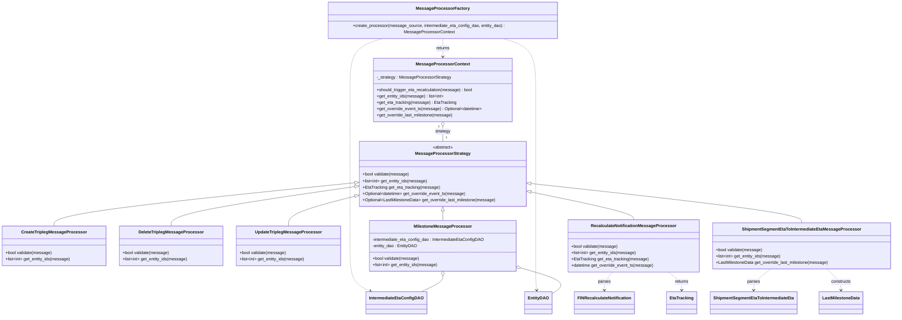

# Diagram: entity_core/entity_service/entity_listener/entity_listener_service/support/intermediate_eta_message_validator.py

> Auto-generated by Obscura crawlers

## Mermaid

### SVG

<svg id="container" width="3320.134765625" xmlns="http://www.w3.org/2000/svg" class="classDiagram" height="1182" viewBox="0 0 3320.134765625 1182" role="graphics-document document" aria-roledescription="class"><g><defs><marker id="container_class-aggregationStart" class="marker aggregation class" refX="18" refY="7" markerWidth="190" markerHeight="240" orient="auto"><path d="M 18,7 L9,13 L1,7 L9,1 Z"></path></marker></defs><defs><marker id="container_class-aggregationEnd" class="marker aggregation class" refX="1" refY="7" markerWidth="20" markerHeight="28" orient="auto"><path d="M 18,7 L9,13 L1,7 L9,1 Z"></path></marker></defs><defs><marker id="container_class-extensionStart" class="marker extension class" refX="18" refY="7" markerWidth="190" markerHeight="240" orient="auto"><path d="M 1,7 L18,13 V 1 Z"></path></marker></defs><defs><marker id="container_class-extensionEnd" class="marker extension class" refX="1" refY="7" markerWidth="20" markerHeight="28" orient="auto"><path d="M 1,1 V 13 L18,7 Z"></path></marker></defs><defs><marker id="container_class-compositionStart" class="marker composition class" refX="18" refY="7" markerWidth="190" markerHeight="240" orient="auto"><path d="M 18,7 L9,13 L1,7 L9,1 Z"></path></marker></defs><defs><marker id="container_class-compositionEnd" class="marker composition class" refX="1" refY="7" markerWidth="20" markerHeight="28" orient="auto"><path d="M 18,7 L9,13 L1,7 L9,1 Z"></path></marker></defs><defs><marker id="container_class-dependencyStart" class="marker dependency class" refX="6" refY="7" markerWidth="190" markerHeight="240" orient="auto"><path d="M 5,7 L9,13 L1,7 L9,1 Z"></path></marker></defs><defs><marker id="container_class-dependencyEnd" class="marker dependency class" refX="13" refY="7" markerWidth="20" markerHeight="28" orient="auto"><path d="M 18,7 L9,13 L14,7 L9,1 Z"></path></marker></defs><defs><marker id="container_class-lollipopStart" class="marker lollipop class" refX="13" refY="7" markerWidth="190" markerHeight="240" orient="auto"><circle stroke="black" fill="transparent" cx="7" cy="7" r="6"></circle></marker></defs><defs><marker id="container_class-lollipopEnd" class="marker lollipop class" refX="1" refY="7" markerWidth="190" markerHeight="240" orient="auto"><circle stroke="black" fill="transparent" cx="7" cy="7" r="6"></circle></marker></defs><g class="root"><g class="clusters"></g><g class="edgePaths"><path d="M1319.613,678.699L1133.111,697.749C946.609,716.799,573.605,754.9,387.103,782.116C200.602,809.333,200.602,825.667,200.602,833.833L200.602,842" id="id_MessageProcessorStrategy_CreateTriplegMessageProcessor_1" class="edge-thickness-normal edge-pattern-solid relation" style=";;;" data-edge="true" data-et="edge" data-id="id_MessageProcessorStrategy_CreateTriplegMessageProcessor_1" data-points="W3sieCI6MTMzNi43NzM0Mzc1LCJ5Ijo2NzYuOTQ1ODIxNzg1NTk1fSx7IngiOjIwMC42MDE1NjI1LCJ5Ijo3OTN9LHsieCI6MjAwLjYwMTU2MjUsInkiOjg0Mn1d" marker-start="url(#container_class-extensionStart)"></path><path d="M1319.704,693.157L1205.737,709.798C1091.769,726.438,863.834,759.719,749.866,784.526C635.898,809.333,635.898,825.667,635.898,833.833L635.898,842" id="id_MessageProcessorStrategy_DeleteTriplegMessageProcessor_2" class="edge-thickness-normal edge-pattern-solid relation" style=";;;" data-edge="true" data-et="edge" data-id="id_MessageProcessorStrategy_DeleteTriplegMessageProcessor_2" data-points="W3sieCI6MTMzNi43NzM0Mzc1LCJ5Ijo2OTAuNjY0ODE2ODcwMTQ0M30seyJ4Ijo2MzUuODk4NDM3NSwieSI6NzkzfSx7IngiOjYzNS44OTg0Mzc1LCJ5Ijo4NDJ9XQ==" marker-start="url(#container_class-extensionStart)"></path><path d="M1320.065,729.529L1278.834,740.108C1237.604,750.686,1155.144,771.843,1113.914,790.588C1072.684,809.333,1072.684,825.667,1072.684,833.833L1072.684,842" id="id_MessageProcessorStrategy_UpdateTriplegMessageProcessor_3" class="edge-thickness-normal edge-pattern-solid relation" style=";;;" data-edge="true" data-et="edge" data-id="id_MessageProcessorStrategy_UpdateTriplegMessageProcessor_3" data-points="W3sieCI6MTMzNi43NzM0Mzc1LCJ5Ijo3MjUuMjQyMzc2NjM0NTQ1N30seyJ4IjoxMDcyLjY4MzU5Mzc1LCJ5Ijo3OTN9LHsieCI6MTA3Mi42ODM1OTM3NSwieSI6ODQyfV0=" marker-start="url(#container_class-extensionStart)"></path><path d="M1649.523,785.25L1649.523,786.542C1649.523,787.833,1649.523,790.417,1649.523,796.375C1649.523,802.333,1649.523,811.667,1649.523,816.333L1649.523,821" id="id_MessageProcessorStrategy_MilestoneMessageProcessor_4" class="edge-thickness-normal edge-pattern-solid relation" style=";;;" data-edge="true" data-et="edge" data-id="id_MessageProcessorStrategy_MilestoneMessageProcessor_4" data-points="W3sieCI6MTY0OS41MjM0Mzc1LCJ5Ijo3Njh9LHsieCI6MTY0OS41MjM0Mzc1LCJ5Ijo3OTN9LHsieCI6MTY0OS41MjM0Mzc1LCJ5Ijo4MjF9XQ==" marker-start="url(#container_class-extensionStart)"></path><path d="M1979.157,714.008L2042.045,727.173C2104.932,740.339,2230.707,766.669,2293.595,784.001C2356.482,801.333,2356.482,809.667,2356.482,813.833L2356.482,818" id="id_MessageProcessorStrategy_RecalculateNotificationMessageProcessor_5" class="edge-thickness-normal edge-pattern-solid relation" style=";;;" data-edge="true" data-et="edge" data-id="id_MessageProcessorStrategy_RecalculateNotificationMessageProcessor_5" data-points="W3sieCI6MTk2Mi4yNzM0Mzc1LCJ5Ijo3MTAuNDczMzg4MTYzOTgzNn0seyJ4IjoyMzU2LjQ4MjQyMTg3NSwieSI6NzkzfSx7IngiOjIzNTYuNDgyNDIxODc1LCJ5Ijo4MTh9XQ==" marker-start="url(#container_class-extensionStart)"></path><path d="M1979.418,681.667L2146.362,700.223C2313.307,718.778,2647.195,755.889,2814.14,780.611C2981.084,805.333,2981.084,817.667,2981.084,823.833L2981.084,830" id="id_MessageProcessorStrategy_ShipmentSegmentEtaToIntermediateEtaMessageProcessor_6" class="edge-thickness-normal edge-pattern-solid relation" style=";;;" data-edge="true" data-et="edge" data-id="id_MessageProcessorStrategy_ShipmentSegmentEtaToIntermediateEtaMessageProcessor_6" data-points="W3sieCI6MTk2Mi4yNzM0Mzc1LCJ5Ijo2NzkuNzYxNDY4NDk1NDY1NH0seyJ4IjoyOTgxLjA4Mzk4NDM3NSwieSI6NzkzfSx7IngiOjI5ODEuMDgzOTg0Mzc1LCJ5Ijo4MzB9XQ==" marker-start="url(#container_class-extensionStart)"></path><path d="M1649.523,465.25L1649.523,468.542C1649.523,471.833,1649.523,478.417,1649.523,487.875C1649.523,497.333,1649.523,509.667,1649.523,515.833L1649.523,522" id="id_MessageProcessorContext_MessageProcessorStrategy_7" class="edge-thickness-normal edge-pattern-solid relation" style=";;;" data-edge="true" data-et="edge" data-id="id_MessageProcessorContext_MessageProcessorStrategy_7" data-points="W3sieCI6MTY0OS41MjM0Mzc1LCJ5Ijo0NDh9LHsieCI6MTY0OS41MjM0Mzc1LCJ5Ijo0ODV9LHsieCI6MTY0OS41MjM0Mzc1LCJ5Ijo1MjJ9XQ==" marker-start="url(#container_class-aggregationStart)"></path><path d="M1649.523,134L1649.523,140.167C1649.523,146.333,1649.523,158.667,1649.523,170C1649.523,181.333,1649.523,191.667,1649.523,196.833L1649.523,202" id="id_MessageProcessorFactory_MessageProcessorContext_8" class="edge-thickness-normal edge-pattern-dashed relation" style=";;;" data-edge="true" data-et="edge" data-id="id_MessageProcessorFactory_MessageProcessorContext_8" data-points="W3sieCI6MTY0OS41MjM0Mzc1LCJ5IjoxMzR9LHsieCI6MTY0OS41MjM0Mzc1LCJ5IjoxNzF9LHsieCI6MTY0OS41MjM0Mzc1LCJ5IjoyMDh9XQ==" marker-end="url(#container_class-dependencyEnd)"></path><path d="M1430.441,134L1408.996,140.167C1387.552,146.333,1344.663,158.667,1323.218,191C1301.773,223.333,1301.773,275.667,1301.773,328C1301.773,380.333,1301.773,432.667,1301.773,485.5C1301.773,538.333,1301.773,591.667,1301.773,643C1301.773,694.333,1301.773,743.667,1301.773,789C1301.773,834.333,1301.773,875.667,1301.773,919C1301.773,962.333,1301.773,1007.667,1314.436,1036.086C1327.098,1064.506,1352.422,1076.012,1365.084,1081.765L1377.746,1087.518" id="id_MessageProcessorFactory_IntermediateEtaConfigDAO_9" class="edge-thickness-normal edge-pattern-dashed relation" style=";;;" data-edge="true" data-et="edge" data-id="id_MessageProcessorFactory_IntermediateEtaConfigDAO_9" data-points="W3sieCI6MTQzMC40NDA5Mzc1LCJ5IjoxMzR9LHsieCI6MTMwMS43NzM0Mzc1LCJ5IjoxNzF9LHsieCI6MTMwMS43NzM0Mzc1LCJ5IjozMjh9LHsieCI6MTMwMS43NzM0Mzc1LCJ5Ijo0ODV9LHsieCI6MTMwMS43NzM0Mzc1LCJ5Ijo2NDV9LHsieCI6MTMwMS43NzM0Mzc1LCJ5Ijo3OTN9LHsieCI6MTMwMS43NzM0Mzc1LCJ5Ijo5MTd9LHsieCI6MTMwMS43NzM0Mzc1LCJ5IjoxMDUzfSx7IngiOjEzODMuMjA4NTY0MDgyMjc4NCwieSI6MTA5MH1d" marker-end="url(#container_class-dependencyEnd)"></path><path d="M1868.606,134L1890.051,140.167C1911.495,146.333,1954.384,158.667,1975.829,191C1997.273,223.333,1997.273,275.667,1997.273,328C1997.273,380.333,1997.273,432.667,1997.273,485.5C1997.273,538.333,1997.273,591.667,1997.273,643C1997.273,694.333,1997.273,743.667,1997.273,789C1997.273,834.333,1997.273,875.667,1997.273,919C1997.273,962.333,1997.273,1007.667,1997.928,1035.508C1998.583,1063.349,1999.893,1073.698,2000.548,1078.873L2001.204,1084.047" id="id_MessageProcessorFactory_EntityDAO_10" class="edge-thickness-normal edge-pattern-dashed relation" style=";;;" data-edge="true" data-et="edge" data-id="id_MessageProcessorFactory_EntityDAO_10" data-points="W3sieCI6MTg2OC42MDU5Mzc1LCJ5IjoxMzR9LHsieCI6MTk5Ny4yNzM0Mzc1LCJ5IjoxNzF9LHsieCI6MTk5Ny4yNzM0Mzc1LCJ5IjozMjh9LHsieCI6MTk5Ny4yNzM0Mzc1LCJ5Ijo0ODV9LHsieCI6MTk5Ny4yNzM0Mzc1LCJ5Ijo2NDV9LHsieCI6MTk5Ny4yNzM0Mzc1LCJ5Ijo3OTN9LHsieCI6MTk5Ny4yNzM0Mzc1LCJ5Ijo5MTd9LHsieCI6MTk5Ny4yNzM0Mzc1LCJ5IjoxMDUzfSx7IngiOjIwMDEuOTU2OTgxODAzNzk3NCwieSI6MTA5MH1d" marker-end="url(#container_class-dependencyEnd)"></path><path d="M1649.523,1030.25L1649.523,1034.042C1649.523,1037.833,1649.523,1045.417,1635.951,1055.375C1622.378,1065.333,1595.233,1077.667,1581.661,1083.833L1568.088,1090" id="id_MilestoneMessageProcessor_IntermediateEtaConfigDAO_11" class="edge-thickness-normal edge-pattern-solid relation" style=";;;" data-edge="true" data-et="edge" data-id="id_MilestoneMessageProcessor_IntermediateEtaConfigDAO_11" data-points="W3sieCI6MTY0OS41MjM0Mzc1LCJ5IjoxMDEzfSx7IngiOjE2NDkuNTIzNDM3NSwieSI6MTA1M30seyJ4IjoxNTY4LjA4ODMxMDkxNzcyMTYsInkiOjEwOTB9XQ==" marker-start="url(#container_class-aggregationStart)"></path><path d="M1940.791,1000.375L1971.432,1009.146C2002.072,1017.917,2063.354,1035.458,2082.53,1051.946C2101.707,1068.433,2078.779,1083.867,2067.315,1091.584L2055.852,1099.3" id="id_MilestoneMessageProcessor_EntityDAO_12" class="edge-thickness-normal edge-pattern-solid relation" style=";;;" data-edge="true" data-et="edge" data-id="id_MilestoneMessageProcessor_EntityDAO_12" data-points="W3sieCI6MTkyNC4yMDcwMzEyNSwieSI6OTk1LjYyNzgyMTYwNDMxMTV9LHsieCI6MjEyNC42MzQ3NjU2MjUsInkiOjEwNTN9LHsieCI6MjA1NS44NTE1NjI1LCJ5IjoxMDk5LjMwMDM3MTExNjE3Nzh9XQ==" marker-start="url(#container_class-aggregationStart)"></path><path d="M2279.019,1016L2274.194,1022.167C2269.369,1028.333,2259.719,1040.667,2254.894,1052C2250.068,1063.333,2250.068,1073.667,2250.068,1078.833L2250.068,1084" id="id_RecalculateNotificationMessageProcessor_FINRecalculateNotification_13" class="edge-thickness-normal edge-pattern-dashed relation" style=";;;" data-edge="true" data-et="edge" data-id="id_RecalculateNotificationMessageProcessor_FINRecalculateNotification_13" data-points="W3sieCI6MjI3OS4wMTkyNDQwMjU3MzUsInkiOjEwMTZ9LHsieCI6MjI1MC4wNjgzNTkzNzUsInkiOjEwNTN9LHsieCI6MjI1MC4wNjgzNTkzNzUsInkiOjEwOTB9XQ==" marker-end="url(#container_class-dependencyEnd)"></path><path d="M2488.206,1016L2496.411,1022.167C2504.616,1028.333,2521.026,1040.667,2529.231,1052C2537.436,1063.333,2537.436,1073.667,2537.436,1078.833L2537.436,1084" id="id_RecalculateNotificationMessageProcessor_EtaTracking_14" class="edge-thickness-normal edge-pattern-dashed relation" style=";;;" data-edge="true" data-et="edge" data-id="id_RecalculateNotificationMessageProcessor_EtaTracking_14" data-points="W3sieCI6MjQ4OC4yMDU2NTI1NzM1MjkzLCJ5IjoxMDE2fSx7IngiOjI1MzcuNDM1NTQ2ODc1LCJ5IjoxMDUzfSx7IngiOjI1MzcuNDM1NTQ2ODc1LCJ5IjoxMDkwfV0=" marker-end="url(#container_class-dependencyEnd)"></path><path d="M2865.327,1004L2854.461,1012.167C2843.595,1020.333,2821.863,1036.667,2810.997,1050C2800.131,1063.333,2800.131,1073.667,2800.131,1078.833L2800.131,1084" id="id_ShipmentSegmentEtaToIntermediateEtaMessageProcessor_ShipmentSegmentEtaToIntermediateEta_15" class="edge-thickness-normal edge-pattern-dashed relation" style=";;;" data-edge="true" data-et="edge" data-id="id_ShipmentSegmentEtaToIntermediateEtaMessageProcessor_ShipmentSegmentEtaToIntermediateEta_15" data-points="W3sieCI6Mjg2NS4zMjcyMDU4ODIzNTMsInkiOjEwMDR9LHsieCI6MjgwMC4xMzA4NTkzNzUsInkiOjEwNTN9LHsieCI6MjgwMC4xMzA4NTkzNzUsInkiOjEwOTB9XQ==" marker-end="url(#container_class-dependencyEnd)"></path><path d="M3073.299,1004L3081.955,1012.167C3090.612,1020.333,3107.924,1036.667,3116.58,1050C3125.236,1063.333,3125.236,1073.667,3125.236,1078.833L3125.236,1084" id="id_ShipmentSegmentEtaToIntermediateEtaMessageProcessor_LastMilestoneData_16" class="edge-thickness-normal edge-pattern-dashed relation" style=";;;" data-edge="true" data-et="edge" data-id="id_ShipmentSegmentEtaToIntermediateEtaMessageProcessor_LastMilestoneData_16" data-points="W3sieCI6MzA3My4yOTkwODY2MjY4MzgzLCJ5IjoxMDA0fSx7IngiOjMxMjUuMjM2MzI4MTI1LCJ5IjoxMDUzfSx7IngiOjMxMjUuMjM2MzI4MTI1LCJ5IjoxMDkwfV0=" marker-end="url(#container_class-dependencyEnd)"></path></g><g class="edgeLabels"><g class="edgeLabel"><g class="label" data-id="id_MessageProcessorStrategy_CreateTriplegMessageProcessor_1" transform="translate(0, 0)"><foreignObject width="0" height="0">

</foreignObject></g></g><g class="edgeLabel"><g class="label" data-id="id_MessageProcessorStrategy_DeleteTriplegMessageProcessor_2" transform="translate(0, 0)"><foreignObject width="0" height="0">

</foreignObject></g></g><g class="edgeLabel"><g class="label" data-id="id_MessageProcessorStrategy_UpdateTriplegMessageProcessor_3" transform="translate(0, 0)"><foreignObject width="0" height="0">

</foreignObject></g></g><g class="edgeLabel"><g class="label" data-id="id_MessageProcessorStrategy_MilestoneMessageProcessor_4" transform="translate(0, 0)"><foreignObject width="0" height="0">

</foreignObject></g></g><g class="edgeLabel"><g class="label" data-id="id_MessageProcessorStrategy_RecalculateNotificationMessageProcessor_5" transform="translate(0, 0)"><foreignObject width="0" height="0">

</foreignObject></g></g><g class="edgeLabel"><g class="label" data-id="id_MessageProcessorStrategy_ShipmentSegmentEtaToIntermediateEtaMessageProcessor_6" transform="translate(0, 0)"><foreignObject width="0" height="0">

</foreignObject></g></g><g class="edgeLabel" transform="translate(1649.5234375, 485)"><g class="label" data-id="id_MessageProcessorContext_MessageProcessorStrategy_7" transform="translate(-29.015625, -12)"><foreignObject width="58.03125" height="24">

strategy

</foreignObject></g></g><g class="edgeLabel" transform="translate(1649.5234375, 171)"><g class="label" data-id="id_MessageProcessorFactory_MessageProcessorContext_8" transform="translate(-26.265625, -12)"><foreignObject width="52.53125" height="24">

returns

</foreignObject></g></g><g class="edgeLabel"><g class="label" data-id="id_MessageProcessorFactory_IntermediateEtaConfigDAO_9" transform="translate(0, 0)"><foreignObject width="0" height="0">

</foreignObject></g></g><g class="edgeLabel"><g class="label" data-id="id_MessageProcessorFactory_EntityDAO_10" transform="translate(0, 0)"><foreignObject width="0" height="0">

</foreignObject></g></g><g class="edgeLabel"><g class="label" data-id="id_MilestoneMessageProcessor_IntermediateEtaConfigDAO_11" transform="translate(0, 0)"><foreignObject width="0" height="0">

</foreignObject></g></g><g class="edgeLabel"><g class="label" data-id="id_MilestoneMessageProcessor_EntityDAO_12" transform="translate(0, 0)"><foreignObject width="0" height="0">

</foreignObject></g></g><g class="edgeLabel" transform="translate(2250.068359375, 1053)"><g class="label" data-id="id_RecalculateNotificationMessageProcessor_FINRecalculateNotification_13" transform="translate(-23.828125, -12)"><foreignObject width="47.65625" height="24">

parses

</foreignObject></g></g><g class="edgeLabel" transform="translate(2537.435546875, 1053)"><g class="label" data-id="id_RecalculateNotificationMessageProcessor_EtaTracking_14" transform="translate(-26.265625, -12)"><foreignObject width="52.53125" height="24">

returns

</foreignObject></g></g><g class="edgeLabel" transform="translate(2800.130859375, 1053)"><g class="label" data-id="id_ShipmentSegmentEtaToIntermediateEtaMessageProcessor_ShipmentSegmentEtaToIntermediateEta_15" transform="translate(-23.828125, -12)"><foreignObject width="47.65625" height="24">

parses

</foreignObject></g></g><g class="edgeLabel" transform="translate(3125.236328125, 1053)"><g class="label" data-id="id_ShipmentSegmentEtaToIntermediateEtaMessageProcessor_LastMilestoneData_16" transform="translate(-37.84375, -12)"><foreignObject width="75.6875" height="24">

constructs

</foreignObject></g></g><g class="edgeTerminals" transform="translate(1634.52343875, 465.5000010714285)"><g class="inner" transform="translate(0, 0)"><foreignObject style="width: 9px; height: 12px;">
1
</foreignObject></g></g><g class="edgeTerminals" transform="translate(1659.52343875, 499.5000010714285)"><g class="inner" transform="translate(0, 0)"></g><foreignObject style="width: 9px; height: 12px;">
1
</foreignObject></g></g><g class="nodes"><g class="node default" id="classId-MessageProcessorStrategy-0" transform="translate(1649.5234375, 645)"><g class="basic label-container"><path d="M-312.75 -123 L312.75 -123 L312.75 123 L-312.75 123" stroke="none" stroke-width="0" fill="#ECECFF" style=""></path><path d="M-312.75 -123 C-147.36352811373527 -123, 18.02294377252946 -123, 312.75 -123 M-312.75 -123 C-108.28966056543462 -123, 96.17067886913077 -123, 312.75 -123 M312.75 -123 C312.75 -48.2283583132578, 312.75 26.5432833734844, 312.75 123 M312.75 -123 C312.75 -44.18100989462202, 312.75 34.637980210755956, 312.75 123 M312.75 123 C148.450469226371 123, -15.849061547257975 123, -312.75 123 M312.75 123 C110.21599546118313 123, -92.31800907763375 123, -312.75 123 M-312.75 123 C-312.75 35.07313582982766, -312.75 -52.853728340344674, -312.75 -123 M-312.75 123 C-312.75 42.66990384211705, -312.75 -37.6601923157659, -312.75 -123" stroke="#9370DB" stroke-width="1.3" fill="none" stroke-dasharray="0 0" style=""></path></g><g class="annotation-group text" transform="translate(-38.609375, -99)"><g class="label" style="" transform="translate(0,-12)"><foreignObject width="77.21875" height="24">

«abstract»

</foreignObject></g></g><g class="label-group text" transform="translate(-98.0625, -75)"><g class="label" style="font-weight: bolder" transform="translate(0,-12)"><foreignObject width="196.125" height="24">

MessageProcessorStrategy

</foreignObject></g></g><g class="members-group text" transform="translate(-300.75, -27)"></g><g class="methods-group text" transform="translate(-300.75, 3)"><g class="label" style="" transform="translate(0,-12)"><foreignObject width="175.75" height="24">

+bool validate(message)

</foreignObject></g><g class="label" style="" transform="translate(0,12)"><foreignObject width="245" height="24">

+list&lt;int&gt; get_entity_ids(message)

</foreignObject></g><g class="label" style="" transform="translate(0,36)"><foreignObject width="287.640625" height="24">

+EtaTracking get_eta_tracking(message)

</foreignObject></g><g class="label" style="" transform="translate(0,60)"><foreignObject width="389.828125" height="24">

+Optional&lt;datetime&gt; get_override_event_ts(message)

</foreignObject></g><g class="label" style="" transform="translate(0,84)"><foreignObject width="503.4375" height="24">

+Optional&lt;LastMilestoneData&gt; get_override_last_milestone(message)

</foreignObject></g></g><g class="divider" style=""><path d="M-312.75 -51 C-94.5132123752513 -51, 123.7235752494974 -51, 312.75 -51 M-312.75 -51 C-80.84548085569935 -51, 151.0590382886013 -51, 312.75 -51" stroke="#9370DB" stroke-width="1.3" fill="none" stroke-dasharray="0 0" style=""></path></g><g class="divider" style=""><path d="M-312.75 -27 C-159.09723405500134 -27, -5.444468110002674 -27, 312.75 -27 M-312.75 -27 C-76.93878663846183 -27, 158.87242672307633 -27, 312.75 -27" stroke="#9370DB" stroke-width="1.3" fill="none" stroke-dasharray="0 0" style=""></path></g></g><g class="node default" id="classId-CreateTriplegMessageProcessor-1" transform="translate(200.6015625, 917)"><g class="basic label-container"><path d="M-192.6015625 -75 L192.6015625 -75 L192.6015625 75 L-192.6015625 75" stroke="none" stroke-width="0" fill="#ECECFF" style=""></path><path d="M-192.6015625 -75 C-40.66215432882177 -75, 111.27725384235646 -75, 192.6015625 -75 M-192.6015625 -75 C-88.76520125401078 -75, 15.071159991978448 -75, 192.6015625 -75 M192.6015625 -75 C192.6015625 -39.987638166400096, 192.6015625 -4.975276332800192, 192.6015625 75 M192.6015625 -75 C192.6015625 -41.627212204324515, 192.6015625 -8.25442440864903, 192.6015625 75 M192.6015625 75 C86.82695050855989 75, -18.94766148288022 75, -192.6015625 75 M192.6015625 75 C70.70535448740692 75, -51.19085352518616 75, -192.6015625 75 M-192.6015625 75 C-192.6015625 29.149094485535414, -192.6015625 -16.70181102892917, -192.6015625 -75 M-192.6015625 75 C-192.6015625 17.598807930384723, -192.6015625 -39.802384139230554, -192.6015625 -75" stroke="#9370DB" stroke-width="1.3" fill="none" stroke-dasharray="0 0" style=""></path></g><g class="annotation-group text" transform="translate(0, -51)"></g><g class="label-group text" transform="translate(-116.203125, -51)"><g class="label" style="font-weight: bolder" transform="translate(0,-12)"><foreignObject width="232.40625" height="24">

CreateTriplegMessageProcessor

</foreignObject></g></g><g class="members-group text" transform="translate(-180.6015625, -3)"></g><g class="methods-group text" transform="translate(-180.6015625, 27)"><g class="label" style="" transform="translate(0,-12)"><foreignObject width="175.75" height="24">

+bool validate(message)

</foreignObject></g><g class="label" style="" transform="translate(0,12)"><foreignObject width="245" height="24">

+list&lt;int&gt; get_entity_ids(message)

</foreignObject></g></g><g class="divider" style=""><path d="M-192.6015625 -27 C-108.45758803607933 -27, -24.31361357215866 -27, 192.6015625 -27 M-192.6015625 -27 C-76.77549801496237 -27, 39.05056647007527 -27, 192.6015625 -27" stroke="#9370DB" stroke-width="1.3" fill="none" stroke-dasharray="0 0" style=""></path></g><g class="divider" style=""><path d="M-192.6015625 -3 C-45.5551491490491 -3, 101.4912642019018 -3, 192.6015625 -3 M-192.6015625 -3 C-68.33587244311703 -3, 55.92981761376595 -3, 192.6015625 -3" stroke="#9370DB" stroke-width="1.3" fill="none" stroke-dasharray="0 0" style=""></path></g></g><g class="node default" id="classId-DeleteTriplegMessageProcessor-2" transform="translate(635.8984375, 917)"><g class="basic label-container"><path d="M-192.6953125 -75 L192.6953125 -75 L192.6953125 75 L-192.6953125 75" stroke="none" stroke-width="0" fill="#ECECFF" style=""></path><path d="M-192.6953125 -75 C-67.09355567256982 -75, 58.50820115486036 -75, 192.6953125 -75 M-192.6953125 -75 C-54.6211096079349 -75, 83.4530932841302 -75, 192.6953125 -75 M192.6953125 -75 C192.6953125 -36.81389221432898, 192.6953125 1.3722155713420392, 192.6953125 75 M192.6953125 -75 C192.6953125 -42.33458498021128, 192.6953125 -9.669169960422565, 192.6953125 75 M192.6953125 75 C42.889313086830555 75, -106.91668632633889 75, -192.6953125 75 M192.6953125 75 C113.02605258173652 75, 33.356792663473044 75, -192.6953125 75 M-192.6953125 75 C-192.6953125 26.991576808872658, -192.6953125 -21.016846382254684, -192.6953125 -75 M-192.6953125 75 C-192.6953125 34.118613758785585, -192.6953125 -6.762772482428829, -192.6953125 -75" stroke="#9370DB" stroke-width="1.3" fill="none" stroke-dasharray="0 0" style=""></path></g><g class="annotation-group text" transform="translate(0, -51)"></g><g class="label-group text" transform="translate(-116.390625, -51)"><g class="label" style="font-weight: bolder" transform="translate(0,-12)"><foreignObject width="232.78125" height="24">

DeleteTriplegMessageProcessor

</foreignObject></g></g><g class="members-group text" transform="translate(-180.6953125, -3)"></g><g class="methods-group text" transform="translate(-180.6953125, 27)"><g class="label" style="" transform="translate(0,-12)"><foreignObject width="175.75" height="24">

+bool validate(message)

</foreignObject></g><g class="label" style="" transform="translate(0,12)"><foreignObject width="245" height="24">

+list&lt;int&gt; get_entity_ids(message)

</foreignObject></g></g><g class="divider" style=""><path d="M-192.6953125 -27 C-110.60697003333493 -27, -28.518627566669863 -27, 192.6953125 -27 M-192.6953125 -27 C-73.71509598662259 -27, 45.26512052675483 -27, 192.6953125 -27" stroke="#9370DB" stroke-width="1.3" fill="none" stroke-dasharray="0 0" style=""></path></g><g class="divider" style=""><path d="M-192.6953125 -3 C-60.78852541007228 -3, 71.11826167985544 -3, 192.6953125 -3 M-192.6953125 -3 C-73.96413950302932 -3, 44.76703349394137 -3, 192.6953125 -3" stroke="#9370DB" stroke-width="1.3" fill="none" stroke-dasharray="0 0" style=""></path></g></g><g class="node default" id="classId-UpdateTriplegMessageProcessor-3" transform="translate(1072.68359375, 917)"><g class="basic label-container"><path d="M-194.08984375 -75 L194.08984375 -75 L194.08984375 75 L-194.08984375 75" stroke="none" stroke-width="0" fill="#ECECFF" style=""></path><path d="M-194.08984375 -75 C-69.94106926459644 -75, 54.20770522080713 -75, 194.08984375 -75 M-194.08984375 -75 C-104.16778014941924 -75, -14.245716548838487 -75, 194.08984375 -75 M194.08984375 -75 C194.08984375 -31.911478674740728, 194.08984375 11.177042650518544, 194.08984375 75 M194.08984375 -75 C194.08984375 -15.011565081519855, 194.08984375 44.97686983696029, 194.08984375 75 M194.08984375 75 C82.7339109373597 75, -28.62202187528061 75, -194.08984375 75 M194.08984375 75 C75.62894778445776 75, -42.83194818108447 75, -194.08984375 75 M-194.08984375 75 C-194.08984375 22.692166015367867, -194.08984375 -29.615667969264265, -194.08984375 -75 M-194.08984375 75 C-194.08984375 40.56577320470724, -194.08984375 6.131546409414483, -194.08984375 -75" stroke="#9370DB" stroke-width="1.3" fill="none" stroke-dasharray="0 0" style=""></path></g><g class="annotation-group text" transform="translate(0, -51)"></g><g class="label-group text" transform="translate(-119.1796875, -51)"><g class="label" style="font-weight: bolder" transform="translate(0,-12)"><foreignObject width="238.359375" height="24">

UpdateTriplegMessageProcessor

</foreignObject></g></g><g class="members-group text" transform="translate(-182.08984375, -3)"></g><g class="methods-group text" transform="translate(-182.08984375, 27)"><g class="label" style="" transform="translate(0,-12)"><foreignObject width="175.75" height="24">

+bool validate(message)

</foreignObject></g><g class="label" style="" transform="translate(0,12)"><foreignObject width="245" height="24">

+list&lt;int&gt; get_entity_ids(message)

</foreignObject></g></g><g class="divider" style=""><path d="M-194.08984375 -27 C-91.46482372081948 -27, 11.160196308361037 -27, 194.08984375 -27 M-194.08984375 -27 C-43.32975605531925 -27, 107.4303316393615 -27, 194.08984375 -27" stroke="#9370DB" stroke-width="1.3" fill="none" stroke-dasharray="0 0" style=""></path></g><g class="divider" style=""><path d="M-194.08984375 -3 C-53.75999167306071 -3, 86.56986040387858 -3, 194.08984375 -3 M-194.08984375 -3 C-101.9323492993083 -3, -9.774854848616599 -3, 194.08984375 -3" stroke="#9370DB" stroke-width="1.3" fill="none" stroke-dasharray="0 0" style=""></path></g></g><g class="node default" id="classId-MilestoneMessageProcessor-4" transform="translate(1649.5234375, 917)"><g class="basic label-container"><path d="M-274.68359375 -96 L274.68359375 -96 L274.68359375 96 L-274.68359375 96" stroke="none" stroke-width="0" fill="#ECECFF" style=""></path><path d="M-274.68359375 -96 C-89.6585721547358 -96, 95.36644944052841 -96, 274.68359375 -96 M-274.68359375 -96 C-128.1282324090886 -96, 18.42712893182278 -96, 274.68359375 -96 M274.68359375 -96 C274.68359375 -32.0098051578186, 274.68359375 31.980389684362805, 274.68359375 96 M274.68359375 -96 C274.68359375 -27.09076275115268, 274.68359375 41.81847449769464, 274.68359375 96 M274.68359375 96 C130.8294272861629 96, -13.024739177674178 96, -274.68359375 96 M274.68359375 96 C62.46450844355044 96, -149.7545768628991 96, -274.68359375 96 M-274.68359375 96 C-274.68359375 50.84807508385862, -274.68359375 5.696150167717235, -274.68359375 -96 M-274.68359375 96 C-274.68359375 36.450053098639444, -274.68359375 -23.099893802721112, -274.68359375 -96" stroke="#9370DB" stroke-width="1.3" fill="none" stroke-dasharray="0 0" style=""></path></g><g class="annotation-group text" transform="translate(0, -72)"></g><g class="label-group text" transform="translate(-102.9765625, -72)"><g class="label" style="font-weight: bolder" transform="translate(0,-12)"><foreignObject width="205.953125" height="24">

MilestoneMessageProcessor

</foreignObject></g></g><g class="members-group text" transform="translate(-262.68359375, -24)"><g class="label" style="" transform="translate(0,-12)"><foreignObject width="422.390625" height="24">

-intermediate_eta_config_dao : IntermediateEtaConfigDAO

</foreignObject></g><g class="label" style="" transform="translate(0,12)"><foreignObject width="167.71875" height="24">

-entity_dao : EntityDAO

</foreignObject></g></g><g class="methods-group text" transform="translate(-262.68359375, 48)"><g class="label" style="" transform="translate(0,-12)"><foreignObject width="175.75" height="24">

+bool validate(message)

</foreignObject></g><g class="label" style="" transform="translate(0,12)"><foreignObject width="245" height="24">

+list&lt;int&gt; get_entity_ids(message)

</foreignObject></g></g><g class="divider" style=""><path d="M-274.68359375 -48 C-100.5957733508466 -48, 73.4920470483068 -48, 274.68359375 -48 M-274.68359375 -48 C-107.48424639568691 -48, 59.71510095862618 -48, 274.68359375 -48" stroke="#9370DB" stroke-width="1.3" fill="none" stroke-dasharray="0 0" style=""></path></g><g class="divider" style=""><path d="M-274.68359375 24 C-95.39350099672728 24, 83.89659175654543 24, 274.68359375 24 M-274.68359375 24 C-60.85644164891454 24, 152.97071045217092 24, 274.68359375 24" stroke="#9370DB" stroke-width="1.3" fill="none" stroke-dasharray="0 0" style=""></path></g></g><g class="node default" id="classId-RecalculateNotificationMessageProcessor-5" transform="translate(2356.482421875, 917)"><g class="basic label-container"><path d="M-243.55078125 -99 L243.55078125 -99 L243.55078125 99 L-243.55078125 99" stroke="none" stroke-width="0" fill="#ECECFF" style=""></path><path d="M-243.55078125 -99 C-132.12853030735425 -99, -20.706279364708536 -99, 243.55078125 -99 M-243.55078125 -99 C-89.921497899712 -99, 63.70778545057601 -99, 243.55078125 -99 M243.55078125 -99 C243.55078125 -57.28751073417288, 243.55078125 -15.575021468345767, 243.55078125 99 M243.55078125 -99 C243.55078125 -28.374762408202997, 243.55078125 42.250475183594006, 243.55078125 99 M243.55078125 99 C111.27128644639114 99, -21.00820835721771 99, -243.55078125 99 M243.55078125 99 C54.40618783832542 99, -134.73840557334916 99, -243.55078125 99 M-243.55078125 99 C-243.55078125 30.12607369316335, -243.55078125 -38.7478526136733, -243.55078125 -99 M-243.55078125 99 C-243.55078125 38.11895907088685, -243.55078125 -22.762081858226296, -243.55078125 -99" stroke="#9370DB" stroke-width="1.3" fill="none" stroke-dasharray="0 0" style=""></path></g><g class="annotation-group text" transform="translate(0, -75)"></g><g class="label-group text" transform="translate(-152.0859375, -75)"><g class="label" style="font-weight: bolder" transform="translate(0,-12)"><foreignObject width="304.171875" height="24">

RecalculateNotificationMessageProcessor

</foreignObject></g></g><g class="members-group text" transform="translate(-231.55078125, -27)"></g><g class="methods-group text" transform="translate(-231.55078125, 3)"><g class="label" style="" transform="translate(0,-12)"><foreignObject width="175.75" height="24">

+bool validate(message)

</foreignObject></g><g class="label" style="" transform="translate(0,12)"><foreignObject width="245" height="24">

+list&lt;int&gt; get_entity_ids(message)

</foreignObject></g><g class="label" style="" transform="translate(0,36)"><foreignObject width="287.640625" height="24">

+EtaTracking get_eta_tracking(message)

</foreignObject></g><g class="label" style="" transform="translate(0,60)"><foreignObject width="311.015625" height="24">

+datetime get_override_event_ts(message)

</foreignObject></g></g><g class="divider" style=""><path d="M-243.55078125 -51 C-141.93630384882258 -51, -40.32182644764515 -51, 243.55078125 -51 M-243.55078125 -51 C-136.59582881470362 -51, -29.640876379407274 -51, 243.55078125 -51" stroke="#9370DB" stroke-width="1.3" fill="none" stroke-dasharray="0 0" style=""></path></g><g class="divider" style=""><path d="M-243.55078125 -27 C-59.83814954516197 -27, 123.87448215967606 -27, 243.55078125 -27 M-243.55078125 -27 C-91.80304805277248 -27, 59.944685144455036 -27, 243.55078125 -27" stroke="#9370DB" stroke-width="1.3" fill="none" stroke-dasharray="0 0" style=""></path></g></g><g class="node default" id="classId-ShipmentSegmentEtaToIntermediateEtaMessageProcessor-6" transform="translate(2981.083984375, 917)"><g class="basic label-container"><path d="M-331.05078125 -87 L331.05078125 -87 L331.05078125 87 L-331.05078125 87" stroke="none" stroke-width="0" fill="#ECECFF" style=""></path><path d="M-331.05078125 -87 C-168.74390377722372 -87, -6.437026304447443 -87, 331.05078125 -87 M-331.05078125 -87 C-75.89878463298646 -87, 179.25321198402708 -87, 331.05078125 -87 M331.05078125 -87 C331.05078125 -31.824985401253564, 331.05078125 23.350029197492873, 331.05078125 87 M331.05078125 -87 C331.05078125 -25.53703823581658, 331.05078125 35.92592352836684, 331.05078125 87 M331.05078125 87 C79.75252148260466 87, -171.54573828479067 87, -331.05078125 87 M331.05078125 87 C170.43496551572963 87, 9.81914978145926 87, -331.05078125 87 M-331.05078125 87 C-331.05078125 41.86163941690067, -331.05078125 -3.276721166198655, -331.05078125 -87 M-331.05078125 87 C-331.05078125 35.257841101493405, -331.05078125 -16.48431779701319, -331.05078125 -87" stroke="#9370DB" stroke-width="1.3" fill="none" stroke-dasharray="0 0" style=""></path></g><g class="annotation-group text" transform="translate(0, -63)"></g><g class="label-group text" transform="translate(-213.4921875, -63)"><g class="label" style="font-weight: bolder" transform="translate(0,-12)"><foreignObject width="426.984375" height="24">

ShipmentSegmentEtaToIntermediateEtaMessageProcessor

</foreignObject></g></g><g class="members-group text" transform="translate(-319.05078125, -15)"></g><g class="methods-group text" transform="translate(-319.05078125, 15)"><g class="label" style="" transform="translate(0,-12)"><foreignObject width="175.75" height="24">

+bool validate(message)

</foreignObject></g><g class="label" style="" transform="translate(0,12)"><foreignObject width="245" height="24">

+list&lt;int&gt; get_entity_ids(message)

</foreignObject></g><g class="label" style="" transform="translate(0,36)"><foreignObject width="424.609375" height="24">

+LastMilestoneData get_override_last_milestone(message)

</foreignObject></g></g><g class="divider" style=""><path d="M-331.05078125 -39 C-104.58589787000608 -39, 121.87898550998784 -39, 331.05078125 -39 M-331.05078125 -39 C-71.29732678120843 -39, 188.45612768758315 -39, 331.05078125 -39" stroke="#9370DB" stroke-width="1.3" fill="none" stroke-dasharray="0 0" style=""></path></g><g class="divider" style=""><path d="M-331.05078125 -15 C-135.99800187299263 -15, 59.05477750401474 -15, 331.05078125 -15 M-331.05078125 -15 C-147.8259150537267 -15, 35.39895114254659 -15, 331.05078125 -15" stroke="#9370DB" stroke-width="1.3" fill="none" stroke-dasharray="0 0" style=""></path></g></g><g class="node default" id="classId-MessageProcessorContext-7" transform="translate(1649.5234375, 328)"><g class="basic label-container"><path d="M-258.625 -120 L258.625 -120 L258.625 120 L-258.625 120" stroke="none" stroke-width="0" fill="#ECECFF" style=""></path><path d="M-258.625 -120 C-146.92233193064868 -120, -35.21966386129736 -120, 258.625 -120 M-258.625 -120 C-136.56787179374868 -120, -14.510743587497359 -120, 258.625 -120 M258.625 -120 C258.625 -26.6962499963509, 258.625 66.6075000072982, 258.625 120 M258.625 -120 C258.625 -51.3880655863159, 258.625 17.223868827368193, 258.625 120 M258.625 120 C140.29082290715166 120, 21.956645814303357 120, -258.625 120 M258.625 120 C92.52785723281579 120, -73.56928553436842 120, -258.625 120 M-258.625 120 C-258.625 40.907380906391694, -258.625 -38.18523818721661, -258.625 -120 M-258.625 120 C-258.625 71.64238137971331, -258.625 23.284762759426627, -258.625 -120" stroke="#9370DB" stroke-width="1.3" fill="none" stroke-dasharray="0 0" style=""></path></g><g class="annotation-group text" transform="translate(0, -96)"></g><g class="label-group text" transform="translate(-95.34375, -96)"><g class="label" style="font-weight: bolder" transform="translate(0,-12)"><foreignObject width="190.6875" height="24">

MessageProcessorContext

</foreignObject></g></g><g class="members-group text" transform="translate(-246.625, -48)"><g class="label" style="" transform="translate(0,-12)"><foreignObject width="274.578125" height="24">

-_strategy : MessageProcessorStrategy

</foreignObject></g></g><g class="methods-group text" transform="translate(-246.625, 0)"><g class="label" style="" transform="translate(0,-12)"><foreignObject width="363.671875" height="24">

+should_trigger_eta_recalculation(message) : bool

</foreignObject></g><g class="label" style="" transform="translate(0,12)"><foreignObject width="253.078125" height="24">

+get_entity_ids(message) : list&lt;int&gt;

</foreignObject></g><g class="label" style="" transform="translate(0,36)"><foreignObject width="295.71875" height="24">

+get_eta_tracking(message) : EtaTracking

</foreignObject></g><g class="label" style="" transform="translate(0,60)"><foreignObject width="397.90625" height="24">

+get_override_event_ts(message) : Optional&lt;datetime&gt;

</foreignObject></g><g class="label" style="" transform="translate(0,84)"><foreignObject width="286.828125" height="24">

+get_override_last_milestone(message)

</foreignObject></g></g><g class="divider" style=""><path d="M-258.625 -72 C-141.79969429696388 -72, -24.974388593927785 -72, 258.625 -72 M-258.625 -72 C-91.46834466196259 -72, 75.68831067607482 -72, 258.625 -72" stroke="#9370DB" stroke-width="1.3" fill="none" stroke-dasharray="0 0" style=""></path></g><g class="divider" style=""><path d="M-258.625 -24 C-115.11321680583106 -24, 28.398566388337883 -24, 258.625 -24 M-258.625 -24 C-122.44326573827215 -24, 13.738468523455708 -24, 258.625 -24" stroke="#9370DB" stroke-width="1.3" fill="none" stroke-dasharray="0 0" style=""></path></g></g><g class="node default" id="classId-MessageProcessorFactory-8" transform="translate(1649.5234375, 71)"><g class="basic label-container"><path d="M-440.84765625 -63 L440.84765625 -63 L440.84765625 63 L-440.84765625 63" stroke="none" stroke-width="0" fill="#ECECFF" style=""></path><path d="M-440.84765625 -63 C-136.9508278222733 -63, 166.94600060545338 -63, 440.84765625 -63 M-440.84765625 -63 C-114.93705077595547 -63, 210.97355469808906 -63, 440.84765625 -63 M440.84765625 -63 C440.84765625 -34.84136882670896, 440.84765625 -6.682737653417924, 440.84765625 63 M440.84765625 -63 C440.84765625 -28.691840245370486, 440.84765625 5.616319509259029, 440.84765625 63 M440.84765625 63 C92.08963888690727 63, -256.66837847618547 63, -440.84765625 63 M440.84765625 63 C186.4856417096202 63, -67.87637283075958 63, -440.84765625 63 M-440.84765625 63 C-440.84765625 15.080895237097131, -440.84765625 -32.83820952580574, -440.84765625 -63 M-440.84765625 63 C-440.84765625 19.36121547553762, -440.84765625 -24.27756904892476, -440.84765625 -63" stroke="#9370DB" stroke-width="1.3" fill="none" stroke-dasharray="0 0" style=""></path></g><g class="annotation-group text" transform="translate(0, -39)"></g><g class="label-group text" transform="translate(-93.7734375, -39)"><g class="label" style="font-weight: bolder" transform="translate(0,-12)"><foreignObject width="187.546875" height="24">

MessageProcessorFactory

</foreignObject></g></g><g class="members-group text" transform="translate(-428.84765625, 9)"></g><g class="methods-group text" transform="translate(-428.84765625, 39)"><g class="label" style="" transform="translate(0,-12)"><foreignObject width="763.921875" height="24">

+create_processor(message_source, intermediate_eta_config_dao, entity_dao) : MessageProcessorContext

</foreignObject></g></g><g class="divider" style=""><path d="M-440.84765625 -15 C-238.5906899478673 -15, -36.33372364573461 -15, 440.84765625 -15 M-440.84765625 -15 C-211.68031117659953 -15, 17.487033896800938 -15, 440.84765625 -15" stroke="#9370DB" stroke-width="1.3" fill="none" stroke-dasharray="0 0" style=""></path></g><g class="divider" style=""><path d="M-440.84765625 9 C-162.44748095644582 9, 115.95269433710837 9, 440.84765625 9 M-440.84765625 9 C-121.65422788375884 9, 197.53920048248233 9, 440.84765625 9" stroke="#9370DB" stroke-width="1.3" fill="none" stroke-dasharray="0 0" style=""></path></g></g><g class="node default" id="classId-IntermediateEtaConfigDAO-9" transform="translate(1475.6484375, 1132)"><g class="basic label-container"><path d="M-109.171875 -42 L109.171875 -42 L109.171875 42 L-109.171875 42" stroke="none" stroke-width="0" fill="#ECECFF" style=""></path><path d="M-109.171875 -42 C-33.00325084898178 -42, 43.16537330203644 -42, 109.171875 -42 M-109.171875 -42 C-33.473291134429786 -42, 42.22529273114043 -42, 109.171875 -42 M109.171875 -42 C109.171875 -12.690438221089245, 109.171875 16.61912355782151, 109.171875 42 M109.171875 -42 C109.171875 -24.566398907610576, 109.171875 -7.132797815221153, 109.171875 42 M109.171875 42 C44.086702224641726 42, -20.998470550716547 42, -109.171875 42 M109.171875 42 C50.312760650389976 42, -8.546353699220049 42, -109.171875 42 M-109.171875 42 C-109.171875 8.857385593339956, -109.171875 -24.28522881332009, -109.171875 -42 M-109.171875 42 C-109.171875 13.550142286367226, -109.171875 -14.899715427265548, -109.171875 -42" stroke="#9370DB" stroke-width="1.3" fill="none" stroke-dasharray="0 0" style=""></path></g><g class="annotation-group text" transform="translate(0, -18)"></g><g class="label-group text" transform="translate(-97.171875, -18)"><g class="label" style="font-weight: bolder" transform="translate(0,-12)"><foreignObject width="194.34375" height="24">

IntermediateEtaConfigDAO

</foreignObject></g></g><g class="members-group text" transform="translate(-97.171875, 30)"></g><g class="methods-group text" transform="translate(-97.171875, 60)"></g><g class="divider" style=""><path d="M-109.171875 6 C-35.87633886016988 6, 37.41919727966024 6, 109.171875 6 M-109.171875 6 C-27.855079510923545 6, 53.46171597815291 6, 109.171875 6" stroke="#9370DB" stroke-width="1.3" fill="none" stroke-dasharray="0 0" style=""></path></g><g class="divider" style=""><path d="M-109.171875 24 C-63.92261180213313 24, -18.673348604266266 24, 109.171875 24 M-109.171875 24 C-23.52176452208235 24, 62.1283459558353 24, 109.171875 24" stroke="#9370DB" stroke-width="1.3" fill="none" stroke-dasharray="0 0" style=""></path></g></g><g class="node default" id="classId-EntityDAO-10" transform="translate(2007.2734375, 1132)"><g class="basic label-container"><path d="M-48.578125 -42 L48.578125 -42 L48.578125 42 L-48.578125 42" stroke="none" stroke-width="0" fill="#ECECFF" style=""></path><path d="M-48.578125 -42 C-27.53221848706562 -42, -6.48631197413124 -42, 48.578125 -42 M-48.578125 -42 C-23.869302387669183 -42, 0.8395202246616336 -42, 48.578125 -42 M48.578125 -42 C48.578125 -10.089009604721266, 48.578125 21.82198079055747, 48.578125 42 M48.578125 -42 C48.578125 -15.361631213500925, 48.578125 11.276737572998151, 48.578125 42 M48.578125 42 C22.27145571738903 42, -4.035213565221937 42, -48.578125 42 M48.578125 42 C24.385137231491473 42, 0.19214946298294677 42, -48.578125 42 M-48.578125 42 C-48.578125 17.73645203269256, -48.578125 -6.527095934614877, -48.578125 -42 M-48.578125 42 C-48.578125 12.793732535276074, -48.578125 -16.41253492944785, -48.578125 -42" stroke="#9370DB" stroke-width="1.3" fill="none" stroke-dasharray="0 0" style=""></path></g><g class="annotation-group text" transform="translate(0, -18)"></g><g class="label-group text" transform="translate(-36.578125, -18)"><g class="label" style="font-weight: bolder" transform="translate(0,-12)"><foreignObject width="73.15625" height="24">

EntityDAO

</foreignObject></g></g><g class="members-group text" transform="translate(-36.578125, 30)"></g><g class="methods-group text" transform="translate(-36.578125, 60)"></g><g class="divider" style=""><path d="M-48.578125 6 C-27.230702284672333 6, -5.883279569344666 6, 48.578125 6 M-48.578125 6 C-21.205218438243346 6, 6.167688123513308 6, 48.578125 6" stroke="#9370DB" stroke-width="1.3" fill="none" stroke-dasharray="0 0" style=""></path></g><g class="divider" style=""><path d="M-48.578125 24 C-28.644498032339257 24, -8.710871064678514 24, 48.578125 24 M-48.578125 24 C-10.176525754227953 24, 28.225073491544094 24, 48.578125 24" stroke="#9370DB" stroke-width="1.3" fill="none" stroke-dasharray="0 0" style=""></path></g></g><g class="node default" id="classId-LastMilestoneData-11" transform="translate(3125.236328125, 1132)"><g class="basic label-container"><path d="M-79.9765625 -42 L79.9765625 -42 L79.9765625 42 L-79.9765625 42" stroke="none" stroke-width="0" fill="#ECECFF" style=""></path><path d="M-79.9765625 -42 C-27.938583101418352 -42, 24.099396297163295 -42, 79.9765625 -42 M-79.9765625 -42 C-43.9984985703271 -42, -8.020434640654202 -42, 79.9765625 -42 M79.9765625 -42 C79.9765625 -18.022461444833603, 79.9765625 5.955077110332795, 79.9765625 42 M79.9765625 -42 C79.9765625 -8.85032239941097, 79.9765625 24.29935520117806, 79.9765625 42 M79.9765625 42 C23.270460083929017 42, -33.43564233214197 42, -79.9765625 42 M79.9765625 42 C32.05117144722678 42, -15.874219605546443 42, -79.9765625 42 M-79.9765625 42 C-79.9765625 15.51927843545636, -79.9765625 -10.961443129087279, -79.9765625 -42 M-79.9765625 42 C-79.9765625 16.176628029653966, -79.9765625 -9.646743940692069, -79.9765625 -42" stroke="#9370DB" stroke-width="1.3" fill="none" stroke-dasharray="0 0" style=""></path></g><g class="annotation-group text" transform="translate(0, -18)"></g><g class="label-group text" transform="translate(-67.9765625, -18)"><g class="label" style="font-weight: bolder" transform="translate(0,-12)"><foreignObject width="135.953125" height="24">

LastMilestoneData

</foreignObject></g></g><g class="members-group text" transform="translate(-67.9765625, 30)"></g><g class="methods-group text" transform="translate(-67.9765625, 60)"></g><g class="divider" style=""><path d="M-79.9765625 6 C-34.50173788661187 6, 10.973086726776259 6, 79.9765625 6 M-79.9765625 6 C-23.7933532083631 6, 32.3898560832738 6, 79.9765625 6" stroke="#9370DB" stroke-width="1.3" fill="none" stroke-dasharray="0 0" style=""></path></g><g class="divider" style=""><path d="M-79.9765625 24 C-27.56555600387282 24, 24.845450492254358 24, 79.9765625 24 M-79.9765625 24 C-32.979041808916215 24, 14.018478882167571 24, 79.9765625 24" stroke="#9370DB" stroke-width="1.3" fill="none" stroke-dasharray="0 0" style=""></path></g></g><g class="node default" id="classId-EtaTracking-12" transform="translate(2537.435546875, 1132)"><g class="basic label-container"><path d="M-54.3671875 -42 L54.3671875 -42 L54.3671875 42 L-54.3671875 42" stroke="none" stroke-width="0" fill="#ECECFF" style=""></path><path d="M-54.3671875 -42 C-13.237411120625069 -42, 27.892365258749862 -42, 54.3671875 -42 M-54.3671875 -42 C-18.625906472361365 -42, 17.11537455527727 -42, 54.3671875 -42 M54.3671875 -42 C54.3671875 -12.666296942086081, 54.3671875 16.667406115827838, 54.3671875 42 M54.3671875 -42 C54.3671875 -9.77165227199204, 54.3671875 22.45669545601592, 54.3671875 42 M54.3671875 42 C18.78269020418005 42, -16.8018070916399 42, -54.3671875 42 M54.3671875 42 C27.092083036961395 42, -0.18302142607721095 42, -54.3671875 42 M-54.3671875 42 C-54.3671875 21.05319076295445, -54.3671875 0.10638152590890115, -54.3671875 -42 M-54.3671875 42 C-54.3671875 17.747985483006484, -54.3671875 -6.504029033987031, -54.3671875 -42" stroke="#9370DB" stroke-width="1.3" fill="none" stroke-dasharray="0 0" style=""></path></g><g class="annotation-group text" transform="translate(0, -18)"></g><g class="label-group text" transform="translate(-42.3671875, -18)"><g class="label" style="font-weight: bolder" transform="translate(0,-12)"><foreignObject width="84.734375" height="24">

EtaTracking

</foreignObject></g></g><g class="members-group text" transform="translate(-42.3671875, 30)"></g><g class="methods-group text" transform="translate(-42.3671875, 60)"></g><g class="divider" style=""><path d="M-54.3671875 6 C-29.70432913148047 6, -5.041470762960941 6, 54.3671875 6 M-54.3671875 6 C-19.366211169937316 6, 15.634765160125369 6, 54.3671875 6" stroke="#9370DB" stroke-width="1.3" fill="none" stroke-dasharray="0 0" style=""></path></g><g class="divider" style=""><path d="M-54.3671875 24 C-16.558603807337306 24, 21.249979885325388 24, 54.3671875 24 M-54.3671875 24 C-14.855587280896032 24, 24.656012938207937 24, 54.3671875 24" stroke="#9370DB" stroke-width="1.3" fill="none" stroke-dasharray="0 0" style=""></path></g></g><g class="node default" id="classId-FINRecalculateNotification-13" transform="translate(2250.068359375, 1132)"><g class="basic label-container"><path d="M-108.4609375 -42 L108.4609375 -42 L108.4609375 42 L-108.4609375 42" stroke="none" stroke-width="0" fill="#ECECFF" style=""></path><path d="M-108.4609375 -42 C-58.017607988749916 -42, -7.574278477499831 -42, 108.4609375 -42 M-108.4609375 -42 C-47.19784850213895 -42, 14.065240495722094 -42, 108.4609375 -42 M108.4609375 -42 C108.4609375 -14.081669710675111, 108.4609375 13.836660578649777, 108.4609375 42 M108.4609375 -42 C108.4609375 -16.653880455316155, 108.4609375 8.692239089367689, 108.4609375 42 M108.4609375 42 C26.076470174464575 42, -56.30799715107085 42, -108.4609375 42 M108.4609375 42 C33.300593727194695 42, -41.85975004561061 42, -108.4609375 42 M-108.4609375 42 C-108.4609375 21.198995162570792, -108.4609375 0.39799032514158483, -108.4609375 -42 M-108.4609375 42 C-108.4609375 18.044411446266636, -108.4609375 -5.911177107466727, -108.4609375 -42" stroke="#9370DB" stroke-width="1.3" fill="none" stroke-dasharray="0 0" style=""></path></g><g class="annotation-group text" transform="translate(0, -18)"></g><g class="label-group text" transform="translate(-96.4609375, -18)"><g class="label" style="font-weight: bolder" transform="translate(0,-12)"><foreignObject width="192.921875" height="24">

FINRecalculateNotification

</foreignObject></g></g><g class="members-group text" transform="translate(-96.4609375, 30)"></g><g class="methods-group text" transform="translate(-96.4609375, 60)"></g><g class="divider" style=""><path d="M-108.4609375 6 C-51.21966322823302 6, 6.021611043533966 6, 108.4609375 6 M-108.4609375 6 C-37.43833155537369 6, 33.58427438925261 6, 108.4609375 6" stroke="#9370DB" stroke-width="1.3" fill="none" stroke-dasharray="0 0" style=""></path></g><g class="divider" style=""><path d="M-108.4609375 24 C-50.27727152265082 24, 7.906394454698358 24, 108.4609375 24 M-108.4609375 24 C-56.68384045959036 24, -4.906743419180714 24, 108.4609375 24" stroke="#9370DB" stroke-width="1.3" fill="none" stroke-dasharray="0 0" style=""></path></g></g><g class="node default" id="classId-ShipmentSegmentEtaToIntermediateEta-14" transform="translate(2800.130859375, 1132)"><g class="basic label-container"><path d="M-158.328125 -42 L158.328125 -42 L158.328125 42 L-158.328125 42" stroke="none" stroke-width="0" fill="#ECECFF" style=""></path><path d="M-158.328125 -42 C-59.05728941740058 -42, 40.213546165198835 -42, 158.328125 -42 M-158.328125 -42 C-52.91047222528189 -42, 52.507180549436214 -42, 158.328125 -42 M158.328125 -42 C158.328125 -9.880898906387479, 158.328125 22.238202187225042, 158.328125 42 M158.328125 -42 C158.328125 -8.609161364559021, 158.328125 24.781677270881957, 158.328125 42 M158.328125 42 C70.53073796191599 42, -17.266649076168022 42, -158.328125 42 M158.328125 42 C60.07849849039795 42, -38.171128019204104 42, -158.328125 42 M-158.328125 42 C-158.328125 9.676526045718369, -158.328125 -22.646947908563263, -158.328125 -42 M-158.328125 42 C-158.328125 10.967852285006444, -158.328125 -20.064295429987112, -158.328125 -42" stroke="#9370DB" stroke-width="1.3" fill="none" stroke-dasharray="0 0" style=""></path></g><g class="annotation-group text" transform="translate(0, -18)"></g><g class="label-group text" transform="translate(-146.328125, -18)"><g class="label" style="font-weight: bolder" transform="translate(0,-12)"><foreignObject width="292.65625" height="24">

ShipmentSegmentEtaToIntermediateEta

</foreignObject></g></g><g class="members-group text" transform="translate(-146.328125, 30)"></g><g class="methods-group text" transform="translate(-146.328125, 60)"></g><g class="divider" style=""><path d="M-158.328125 6 C-58.7084750469232 6, 40.911174906153605 6, 158.328125 6 M-158.328125 6 C-36.817629455457336 6, 84.69286608908533 6, 158.328125 6" stroke="#9370DB" stroke-width="1.3" fill="none" stroke-dasharray="0 0" style=""></path></g><g class="divider" style=""><path d="M-158.328125 24 C-50.212595326071394 24, 57.90293434785721 24, 158.328125 24 M-158.328125 24 C-62.91573658116542 24, 32.49665183766916 24, 158.328125 24" stroke="#9370DB" stroke-width="1.3" fill="none" stroke-dasharray="0 0" style=""></path></g></g></g></g></g></svg>
