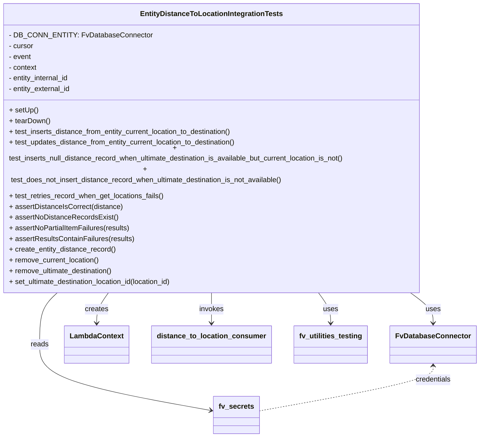

# Diagram: entity_core/entity_service/entity_listener/tests/integration/test_distance_to_location_lambda_handler.py


> Auto-generated by Obscura crawlers

## Diagram 1



### SVG

<svg id="container" width="1065.9140625" xmlns="http://www.w3.org/2000/svg" class="classDiagram" height="932" viewBox="0 0 1065.9140625 932" role="graphics-document document" aria-roledescription="class"><style>#container{font-family:"trebuchet ms",verdana,arial,sans-serif;font-size:16px;fill:#333;}@keyframes edge-animation-frame{from{stroke-dashoffset:0;}}@keyframes dash{to{stroke-dashoffset:0;}}#container .edge-animation-slow{stroke-dasharray:9,5!important;stroke-dashoffset:900;animation:dash 50s linear infinite;stroke-linecap:round;}#container .edge-animation-fast{stroke-dasharray:9,5!important;stroke-dashoffset:900;animation:dash 20s linear infinite;stroke-linecap:round;}#container .error-icon{fill:#552222;}#container .error-text{fill:#552222;stroke:#552222;}#container .edge-thickness-normal{stroke-width:1px;}#container .edge-thickness-thick{stroke-width:3.5px;}#container .edge-pattern-solid{stroke-dasharray:0;}#container .edge-thickness-invisible{stroke-width:0;fill:none;}#container .edge-pattern-dashed{stroke-dasharray:3;}#container .edge-pattern-dotted{stroke-dasharray:2;}#container .marker{fill:#333333;stroke:#333333;}#container .marker.cross{stroke:#333333;}#container svg{font-family:"trebuchet ms",verdana,arial,sans-serif;font-size:16px;}#container p{margin:0;}#container g.classGroup text{fill:#9370DB;stroke:none;font-family:"trebuchet ms",verdana,arial,sans-serif;font-size:10px;}#container g.classGroup text .title{font-weight:bolder;}#container .nodeLabel,#container .edgeLabel{color:#131300;}#container .edgeLabel .label rect{fill:#ECECFF;}#container .label text{fill:#131300;}#container .labelBkg{background:#ECECFF;}#container .edgeLabel .label span{background:#ECECFF;}#container .classTitle{font-weight:bolder;}#container .node rect,#container .node circle,#container .node ellipse,#container .node polygon,#container .node path{fill:#ECECFF;stroke:#9370DB;stroke-width:1px;}#container .divider{stroke:#9370DB;stroke-width:1;}#container g.clickable{cursor:pointer;}#container g.classGroup rect{fill:#ECECFF;stroke:#9370DB;}#container g.classGroup line{stroke:#9370DB;stroke-width:1;}#container .classLabel .box{stroke:none;stroke-width:0;fill:#ECECFF;opacity:0.5;}#container .classLabel .label{fill:#9370DB;font-size:10px;}#container .relation{stroke:#333333;stroke-width:1;fill:none;}#container .dashed-line{stroke-dasharray:3;}#container .dotted-line{stroke-dasharray:1 2;}#container #compositionStart,#container .composition{fill:#333333!important;stroke:#333333!important;stroke-width:1;}#container #compositionEnd,#container .composition{fill:#333333!important;stroke:#333333!important;stroke-width:1;}#container #dependencyStart,#container .dependency{fill:#333333!important;stroke:#333333!important;stroke-width:1;}#container #dependencyStart,#container .dependency{fill:#333333!important;stroke:#333333!important;stroke-width:1;}#container #extensionStart,#container .extension{fill:transparent!important;stroke:#333333!important;stroke-width:1;}#container #extensionEnd,#container .extension{fill:transparent!important;stroke:#333333!important;stroke-width:1;}#container #aggregationStart,#container .aggregation{fill:transparent!important;stroke:#333333!important;stroke-width:1;}#container #aggregationEnd,#container .aggregation{fill:transparent!important;stroke:#333333!important;stroke-width:1;}#container #lollipopStart,#container .lollipop{fill:#ECECFF!important;stroke:#333333!important;stroke-width:1;}#container #lollipopEnd,#container .lollipop{fill:#ECECFF!important;stroke:#333333!important;stroke-width:1;}#container .edgeTerminals{font-size:11px;line-height:initial;}#container .classTitleText{text-anchor:middle;font-size:18px;fill:#333;}#container .label-icon{display:inline-block;height:1em;overflow:visible;vertical-align:-0.125em;}#container .node .label-icon path{fill:currentColor;stroke:revert;stroke-width:revert;}#container :root{--mermaid-font-family:"trebuchet ms",verdana,arial,sans-serif;}</style><g><defs><marker id="container_class-aggregationStart" class="marker aggregation class" refX="18" refY="7" markerWidth="190" markerHeight="240" orient="auto"><path d="M 18,7 L9,13 L1,7 L9,1 Z"></path></marker></defs><defs><marker id="container_class-aggregationEnd" class="marker aggregation class" refX="1" refY="7" markerWidth="20" markerHeight="28" orient="auto"><path d="M 18,7 L9,13 L1,7 L9,1 Z"></path></marker></defs><defs><marker id="container_class-extensionStart" class="marker extension class" refX="18" refY="7" markerWidth="190" markerHeight="240" orient="auto"><path d="M 1,7 L18,13 V 1 Z"></path></marker></defs><defs><marker id="container_class-extensionEnd" class="marker extension class" refX="1" refY="7" markerWidth="20" markerHeight="28" orient="auto"><path d="M 1,1 V 13 L18,7 Z"></path></marker></defs><defs><marker id="container_class-compositionStart" class="marker composition class" refX="18" refY="7" markerWidth="190" markerHeight="240" orient="auto"><path d="M 18,7 L9,13 L1,7 L9,1 Z"></path></marker></defs><defs><marker id="container_class-compositionEnd" class="marker composition class" refX="1" refY="7" markerWidth="20" markerHeight="28" orient="auto"><path d="M 18,7 L9,13 L1,7 L9,1 Z"></path></marker></defs><defs><marker id="container_class-dependencyStart" class="marker dependency class" refX="6" refY="7" markerWidth="190" markerHeight="240" orient="auto"><path d="M 5,7 L9,13 L1,7 L9,1 Z"></path></marker></defs><defs><marker id="container_class-dependencyEnd" class="marker dependency class" refX="13" refY="7" markerWidth="20" markerHeight="28" orient="auto"><path d="M 18,7 L9,13 L14,7 L9,1 Z"></path></marker></defs><defs><marker id="container_class-lollipopStart" class="marker lollipop class" refX="13" refY="7" markerWidth="190" markerHeight="240" orient="auto"><circle stroke="black" fill="transparent" cx="7" cy="7" r="6"></circle></marker></defs><defs><marker id="container_class-lollipopEnd" class="marker lollipop class" refX="1" refY="7" markerWidth="190" markerHeight="240" orient="auto"><circle stroke="black" fill="transparent" cx="7" cy="7" r="6"></circle></marker></defs><g class="root"><g class="clusters"></g><g class="edgePaths"><path d="M913.922,608L922.703,614.167C931.484,620.333,949.047,632.667,957.828,644C966.609,655.333,966.609,665.667,966.609,670.833L966.609,676" id="id_EntityDistanceToLocationIntegrationTests_FvDatabaseConnector_1" class="edge-thickness-normal edge-pattern-solid relation" style=";;;" data-edge="true" data-et="edge" data-id="id_EntityDistanceToLocationIntegrationTests_FvDatabaseConnector_1" data-points="W3sieCI6OTEzLjkyMTk0NDU0NzQ3NzgsInkiOjYwOH0seyJ4Ijo5NjYuNjA5Mzc1LCJ5Ijo2NDV9LHsieCI6OTY2LjYwOTM3NSwieSI6NjgyfV0=" marker-end="url(#container_class-dependencyEnd)"></path><path d="M486.727,608L486.727,614.167C486.727,620.333,486.727,632.667,486.727,644C486.727,655.333,486.727,665.667,486.727,670.833L486.727,676" id="id_EntityDistanceToLocationIntegrationTests_distance_to_location_consumer_2" class="edge-thickness-normal edge-pattern-solid relation" style=";;;" data-edge="true" data-et="edge" data-id="id_EntityDistanceToLocationIntegrationTests_distance_to_location_consumer_2" data-points="W3sieCI6NDg2LjcyNjU2MjUsInkiOjYwOH0seyJ4Ijo0ODYuNzI2NTYyNSwieSI6NjQ1fSx7IngiOjQ4Ni43MjY1NjI1LCJ5Ijo2ODJ9XQ==" marker-end="url(#container_class-dependencyEnd)"></path><path d="M266.637,608L262.113,614.167C257.588,620.333,248.54,632.667,244.016,644C239.492,655.333,239.492,665.667,239.492,670.833L239.492,676" id="id_EntityDistanceToLocationIntegrationTests_LambdaContext_3" class="edge-thickness-normal edge-pattern-solid relation" style=";;;" data-edge="true" data-et="edge" data-id="id_EntityDistanceToLocationIntegrationTests_LambdaContext_3" data-points="W3sieCI6MjY2LjYzNjYxNDQyODc4MzQsInkiOjYwOH0seyJ4IjoyMzkuNDkyMTg3NSwieSI6NjQ1fSx7IngiOjIzOS40OTIxODc1LCJ5Ijo2ODJ9XQ==" marker-end="url(#container_class-dependencyEnd)"></path><path d="M155.98,608L149.181,614.167C142.382,620.333,128.785,632.667,121.986,652C115.188,671.333,115.188,697.667,115.188,724C115.188,750.333,115.188,776.667,176.936,801.292C238.685,825.918,362.182,848.835,423.93,860.294L485.679,871.753" id="id_EntityDistanceToLocationIntegrationTests_fv_secrets_4" class="edge-thickness-normal edge-pattern-solid relation" style=";;;" data-edge="true" data-et="edge" data-id="id_EntityDistanceToLocationIntegrationTests_fv_secrets_4" data-points="W3sieCI6MTU1Ljk3OTYyMjU4OTAyMDc4LCJ5Ijo2MDh9LHsieCI6MTE1LjE4NzUsInkiOjY0NX0seyJ4IjoxMTUuMTg3NSwieSI6NzI0fSx7IngiOjExNS4xODc1LCJ5Ijo4MDN9LHsieCI6NDkxLjU3ODEyNSwieSI6ODcyLjg0NzUzNDQ1NTIzMTF9XQ==" marker-end="url(#container_class-dependencyEnd)"></path><path d="M716.63,608L721.355,614.167C726.081,620.333,735.533,632.667,740.259,644C744.984,655.333,744.984,665.667,744.984,670.833L744.984,676" id="id_EntityDistanceToLocationIntegrationTests_fv_utilities_testing_5" class="edge-thickness-normal edge-pattern-solid relation" style=";;;" data-edge="true" data-et="edge" data-id="id_EntityDistanceToLocationIntegrationTests_fv_utilities_testing_5" data-points="W3sieCI6NzE2LjYyOTY1OTY4MTAwODksInkiOjYwOH0seyJ4Ijo3NDQuOTg0Mzc1LCJ5Ijo2NDV9LHsieCI6NzQ0Ljk4NDM3NSwieSI6NjgyfV0=" marker-end="url(#container_class-dependencyEnd)"></path><path d="M966.609,772L966.609,777.167C966.609,782.333,966.609,792.667,903.878,809.475C841.146,826.283,715.682,849.565,652.951,861.206L590.219,872.848" id="id_FvDatabaseConnector_fv_secrets_6" class="edge-thickness-normal edge-pattern-dashed relation" style=";;;" data-edge="true" data-et="edge" data-id="id_FvDatabaseConnector_fv_secrets_6" data-points="W3sieCI6OTY2LjYwOTM3NSwieSI6NzY2fSx7IngiOjk2Ni42MDkzNzUsInkiOjgwM30seyJ4Ijo1OTAuMjE4NzUsInkiOjg3Mi44NDc1MzQ0NTUyMzExfV0=" marker-start="url(#container_class-dependencyStart)"></path></g><g class="edgeLabels"><g class="edgeLabel" transform="translate(966.609375, 645)"><g class="label" data-id="id_EntityDistanceToLocationIntegrationTests_FvDatabaseConnector_1" transform="translate(-16.4921875, -12)"><foreignObject width="32.984375" height="24"><div xmlns="http://www.w3.org/1999/xhtml" class="labelBkg" style="display: table-cell; white-space: nowrap; line-height: 1.5; max-width: 200px; text-align: center;"><span class="edgeLabel"><p>uses</p></span></div></foreignObject></g></g><g class="edgeLabel" transform="translate(486.7265625, 645)"><g class="label" data-id="id_EntityDistanceToLocationIntegrationTests_distance_to_location_consumer_2" transform="translate(-27.5859375, -12)"><foreignObject width="55.171875" height="24"><div xmlns="http://www.w3.org/1999/xhtml" class="labelBkg" style="display: table-cell; white-space: nowrap; line-height: 1.5; max-width: 200px; text-align: center;"><span class="edgeLabel"><p>invokes</p></span></div></foreignObject></g></g><g class="edgeLabel" transform="translate(239.4921875, 645)"><g class="label" data-id="id_EntityDistanceToLocationIntegrationTests_LambdaContext_3" transform="translate(-26.171875, -12)"><foreignObject width="52.34375" height="24"><div xmlns="http://www.w3.org/1999/xhtml" class="labelBkg" style="display: table-cell; white-space: nowrap; line-height: 1.5; max-width: 200px; text-align: center;"><span class="edgeLabel"><p>creates</p></span></div></foreignObject></g></g><g class="edgeLabel" transform="translate(115.1875, 724)"><g class="label" data-id="id_EntityDistanceToLocationIntegrationTests_fv_secrets_4" transform="translate(-20.0078125, -12)"><foreignObject width="40.015625" height="24"><div xmlns="http://www.w3.org/1999/xhtml" class="labelBkg" style="display: table-cell; white-space: nowrap; line-height: 1.5; max-width: 200px; text-align: center;"><span class="edgeLabel"><p>reads</p></span></div></foreignObject></g></g><g class="edgeLabel" transform="translate(744.984375, 645)"><g class="label" data-id="id_EntityDistanceToLocationIntegrationTests_fv_utilities_testing_5" transform="translate(-16.4921875, -12)"><foreignObject width="32.984375" height="24"><div xmlns="http://www.w3.org/1999/xhtml" class="labelBkg" style="display: table-cell; white-space: nowrap; line-height: 1.5; max-width: 200px; text-align: center;"><span class="edgeLabel"><p>uses</p></span></div></foreignObject></g></g><g class="edgeLabel" transform="translate(966.609375, 803)"><g class="label" data-id="id_FvDatabaseConnector_fv_secrets_6" transform="translate(-40.3671875, -12)"><foreignObject width="80.734375" height="24"><div xmlns="http://www.w3.org/1999/xhtml" class="labelBkg" style="display: table-cell; white-space: nowrap; line-height: 1.5; max-width: 200px; text-align: center;"><span class="edgeLabel"><p>credentials</p></span></div></foreignObject></g></g></g><g class="nodes"><g class="node default" id="classId-EntityDistanceToLocationIntegrationTests-0" transform="translate(486.7265625, 308)"><g class="basic label-container"><path d="M-478.7265625 -300 L478.7265625 -300 L478.7265625 300 L-478.7265625 300" stroke="none" stroke-width="0" fill="#ECECFF" style=""></path><path d="M-478.7265625 -300 C-180.5900300063604 -300, 117.54650248727921 -300, 478.7265625 -300 M-478.7265625 -300 C-230.28391868547232 -300, 18.15872512905537 -300, 478.7265625 -300 M478.7265625 -300 C478.7265625 -106.31650735625394, 478.7265625 87.36698528749213, 478.7265625 300 M478.7265625 -300 C478.7265625 -89.71347214859401, 478.7265625 120.57305570281198, 478.7265625 300 M478.7265625 300 C274.29861339493607 300, 69.87066428987214 300, -478.7265625 300 M478.7265625 300 C97.48114375427792 300, -283.76427499144415 300, -478.7265625 300 M-478.7265625 300 C-478.7265625 85.39283225237335, -478.7265625 -129.2143354952533, -478.7265625 -300 M-478.7265625 300 C-478.7265625 169.78973715905457, -478.7265625 39.579474318109135, -478.7265625 -300" stroke="#9370DB" stroke-width="1.3" fill="none" stroke-dasharray="0 0" style=""></path></g><g class="annotation-group text" transform="translate(0, -276)"></g><g class="label-group text" transform="translate(-152.375, -276)"><g class="label" style="font-weight: bolder" transform="translate(0,-12)"><foreignObject width="304.75" height="24"><div xmlns="http://www.w3.org/1999/xhtml" style="display: table-cell; white-space: nowrap; line-height: 1.5; max-width: 349px; text-align: center;"><span class="nodeLabel markdown-node-label" style=""><p>EntityDistanceToLocationIntegrationTests</p></span></div></foreignObject></g></g><g class="members-group text" transform="translate(-466.7265625, -228)"><g class="label" style="" transform="translate(0,-12)"><foreignObject width="301.375" height="24"><div xmlns="http://www.w3.org/1999/xhtml" style="display: table-cell; white-space: nowrap; line-height: 1.5; max-width: 360px; text-align: center;"><span class="nodeLabel markdown-node-label" style=""><p>- DB_CONN_ENTITY: FvDatabaseConnector</p></span></div></foreignObject></g><g class="label" style="" transform="translate(0,12)"><foreignObject width="56.421875" height="24"><div xmlns="http://www.w3.org/1999/xhtml" style="display: table-cell; white-space: nowrap; line-height: 1.5; max-width: 115px; text-align: center;"><span class="nodeLabel markdown-node-label" style=""><p>- cursor</p></span></div></foreignObject></g><g class="label" style="" transform="translate(0,36)"><foreignObject width="51.03125" height="24"><div xmlns="http://www.w3.org/1999/xhtml" style="display: table-cell; white-space: nowrap; line-height: 1.5; max-width: 109px; text-align: center;"><span class="nodeLabel markdown-node-label" style=""><p>- event</p></span></div></foreignObject></g><g class="label" style="" transform="translate(0,60)"><foreignObject width="64.390625" height="24"><div xmlns="http://www.w3.org/1999/xhtml" style="display: table-cell; white-space: nowrap; line-height: 1.5; max-width: 122px; text-align: center;"><span class="nodeLabel markdown-node-label" style=""><p>- context</p></span></div></foreignObject></g><g class="label" style="" transform="translate(0,84)"><foreignObject width="139.8125" height="24"><div xmlns="http://www.w3.org/1999/xhtml" style="display: table-cell; white-space: nowrap; line-height: 1.5; max-width: 197px; text-align: center;"><span class="nodeLabel markdown-node-label" style=""><p>- entity_internal_id</p></span></div></foreignObject></g><g class="label" style="" transform="translate(0,108)"><foreignObject width="141.9375" height="24"><div xmlns="http://www.w3.org/1999/xhtml" style="display: table-cell; white-space: nowrap; line-height: 1.5; max-width: 199px; text-align: center;"><span class="nodeLabel markdown-node-label" style=""><p>- entity_external_id</p></span></div></foreignObject></g></g><g class="methods-group text" transform="translate(-466.7265625, -60)"><g class="label" style="" transform="translate(0,-12)"><foreignObject width="64.65625" height="24"><div xmlns="http://www.w3.org/1999/xhtml" style="display: table-cell; white-space: nowrap; line-height: 1.5; max-width: 122px; text-align: center;"><span class="nodeLabel markdown-node-label" style=""><p>+ setUp()</p></span></div></foreignObject></g><g class="label" style="" transform="translate(0,12)"><foreignObject width="92.078125" height="24"><div xmlns="http://www.w3.org/1999/xhtml" style="display: table-cell; white-space: nowrap; line-height: 1.5; max-width: 149px; text-align: center;"><span class="nodeLabel markdown-node-label" style=""><p>+ tearDown()</p></span></div></foreignObject></g><g class="label" style="" transform="translate(0,36)"><foreignObject width="509.765625" height="24"><div xmlns="http://www.w3.org/1999/xhtml" style="display: table-cell; white-space: nowrap; line-height: 1.5; max-width: 567px; text-align: center;"><span class="nodeLabel markdown-node-label" style=""><p>+ test_inserts_distance_from_entity_current_location_to_destination()</p></span></div></foreignObject></g><g class="label" style="" transform="translate(0,60)"><foreignObject width="518.765625" height="24"><div xmlns="http://www.w3.org/1999/xhtml" style="display: table-cell; white-space: nowrap; line-height: 1.5; max-width: 576px; text-align: center;"><span class="nodeLabel markdown-node-label" style=""><p>+ test_updates_distance_from_entity_current_location_to_destination()</p></span></div></foreignObject></g><g class="label" style="" transform="translate(0,84)"><foreignObject width="781.078125" height="24"><div xmlns="http://www.w3.org/1999/xhtml" style="display: table-cell; white-space: nowrap; line-height: 1.5; max-width: 838px; text-align: center;"><span class="nodeLabel markdown-node-label" style=""><p>+ test_inserts_null_distance_record_when_ultimate_destination_is_available_but_current_location_is_not()</p></span></div></foreignObject></g><g class="label" style="" transform="translate(0,108)"><foreignObject width="632.71875" height="24"><div xmlns="http://www.w3.org/1999/xhtml" style="display: table-cell; white-space: nowrap; line-height: 1.5; max-width: 690px; text-align: center;"><span class="nodeLabel markdown-node-label" style=""><p>+ test_does_not_insert_distance_record_when_ultimate_destination_is_not_available()</p></span></div></foreignObject></g><g class="label" style="" transform="translate(0,132)"><foreignObject width="350.671875" height="24"><div xmlns="http://www.w3.org/1999/xhtml" style="display: table-cell; white-space: nowrap; line-height: 1.5; max-width: 408px; text-align: center;"><span class="nodeLabel markdown-node-label" style=""><p>+ test_retries_record_when_get_locations_fails()</p></span></div></foreignObject></g><g class="label" style="" transform="translate(0,156)"><foreignObject width="254.21875" height="24"><div xmlns="http://www.w3.org/1999/xhtml" style="display: table-cell; white-space: nowrap; line-height: 1.5; max-width: 312px; text-align: center;"><span class="nodeLabel markdown-node-label" style=""><p>+ assertDistanceIsCorrect(distance)</p></span></div></foreignObject></g><g class="label" style="" transform="translate(0,180)"><foreignObject width="240.59375" height="24"><div xmlns="http://www.w3.org/1999/xhtml" style="display: table-cell; white-space: nowrap; line-height: 1.5; max-width: 298px; text-align: center;"><span class="nodeLabel markdown-node-label" style=""><p>+ assertNoDistanceRecordsExist()</p></span></div></foreignObject></g><g class="label" style="" transform="translate(0,204)"><foreignObject width="271.515625" height="24"><div xmlns="http://www.w3.org/1999/xhtml" style="display: table-cell; white-space: nowrap; line-height: 1.5; max-width: 329px; text-align: center;"><span class="nodeLabel markdown-node-label" style=""><p>+ assertNoPartialItemFailures(results)</p></span></div></foreignObject></g><g class="label" style="" transform="translate(0,228)"><foreignObject width="280.234375" height="24"><div xmlns="http://www.w3.org/1999/xhtml" style="display: table-cell; white-space: nowrap; line-height: 1.5; max-width: 338px; text-align: center;"><span class="nodeLabel markdown-node-label" style=""><p>+ assertResultsContainFailures(results)</p></span></div></foreignObject></g><g class="label" style="" transform="translate(0,252)"><foreignObject width="240.3125" height="24"><div xmlns="http://www.w3.org/1999/xhtml" style="display: table-cell; white-space: nowrap; line-height: 1.5; max-width: 298px; text-align: center;"><span class="nodeLabel markdown-node-label" style=""><p>+ create_entity_distance_record()</p></span></div></foreignObject></g><g class="label" style="" transform="translate(0,276)"><foreignObject width="204.078125" height="24"><div xmlns="http://www.w3.org/1999/xhtml" style="display: table-cell; white-space: nowrap; line-height: 1.5; max-width: 261px; text-align: center;"><span class="nodeLabel markdown-node-label" style=""><p>+ remove_current_location()</p></span></div></foreignObject></g><g class="label" style="" transform="translate(0,300)"><foreignObject width="236" height="24"><div xmlns="http://www.w3.org/1999/xhtml" style="display: table-cell; white-space: nowrap; line-height: 1.5; max-width: 293px; text-align: center;"><span class="nodeLabel markdown-node-label" style=""><p>+ remove_ultimate_destination()</p></span></div></foreignObject></g><g class="label" style="" transform="translate(0,324)"><foreignObject width="375.609375" height="24"><div xmlns="http://www.w3.org/1999/xhtml" style="display: table-cell; white-space: nowrap; line-height: 1.5; max-width: 433px; text-align: center;"><span class="nodeLabel markdown-node-label" style=""><p>+ set_ultimate_destination_location_id(location_id)</p></span></div></foreignObject></g></g><g class="divider" style=""><path d="M-478.7265625 -252 C-169.5918106358472 -252, 139.5429412283056 -252, 478.7265625 -252 M-478.7265625 -252 C-157.872748224391 -252, 162.98106605121802 -252, 478.7265625 -252" stroke="#9370DB" stroke-width="1.3" fill="none" stroke-dasharray="0 0" style=""></path></g><g class="divider" style=""><path d="M-478.7265625 -84 C-146.53367532956202 -84, 185.65921184087597 -84, 478.7265625 -84 M-478.7265625 -84 C-208.7968158743435 -84, 61.13293075131298 -84, 478.7265625 -84" stroke="#9370DB" stroke-width="1.3" fill="none" stroke-dasharray="0 0" style=""></path></g></g><g class="node default" id="classId-FvDatabaseConnector-1" transform="translate(966.609375, 724)"><g class="basic label-container"><path d="M-91.3046875 -42 L91.3046875 -42 L91.3046875 42 L-91.3046875 42" stroke="none" stroke-width="0" fill="#ECECFF" style=""></path><path d="M-91.3046875 -42 C-45.66192544423424 -42, -0.019163388468484754 -42, 91.3046875 -42 M-91.3046875 -42 C-19.263187575894193 -42, 52.778312348211614 -42, 91.3046875 -42 M91.3046875 -42 C91.3046875 -17.0023483312274, 91.3046875 7.995303337545202, 91.3046875 42 M91.3046875 -42 C91.3046875 -10.19811959250449, 91.3046875 21.60376081499102, 91.3046875 42 M91.3046875 42 C47.482837339899056 42, 3.660987179798113 42, -91.3046875 42 M91.3046875 42 C29.636402172735018 42, -32.031883154529964 42, -91.3046875 42 M-91.3046875 42 C-91.3046875 16.95362005445153, -91.3046875 -8.09275989109694, -91.3046875 -42 M-91.3046875 42 C-91.3046875 14.606289594762856, -91.3046875 -12.787420810474288, -91.3046875 -42" stroke="#9370DB" stroke-width="1.3" fill="none" stroke-dasharray="0 0" style=""></path></g><g class="annotation-group text" transform="translate(0, -18)"></g><g class="label-group text" transform="translate(-79.3046875, -18)"><g class="label" style="font-weight: bolder" transform="translate(0,-12)"><foreignObject width="158.609375" height="24"><div xmlns="http://www.w3.org/1999/xhtml" style="display: table-cell; white-space: nowrap; line-height: 1.5; max-width: 207px; text-align: center;"><span class="nodeLabel markdown-node-label" style=""><p>FvDatabaseConnector</p></span></div></foreignObject></g></g><g class="members-group text" transform="translate(-79.3046875, 30)"></g><g class="methods-group text" transform="translate(-79.3046875, 60)"></g><g class="divider" style=""><path d="M-91.3046875 6 C-34.99872847184707 6, 21.307230556305853 6, 91.3046875 6 M-91.3046875 6 C-45.58830497075441 6, 0.12807755849118507 6, 91.3046875 6" stroke="#9370DB" stroke-width="1.3" fill="none" stroke-dasharray="0 0" style=""></path></g><g class="divider" style=""><path d="M-91.3046875 24 C-31.246830029497936 24, 28.81102744100413 24, 91.3046875 24 M-91.3046875 24 C-26.5089157787026 24, 38.2868559425948 24, 91.3046875 24" stroke="#9370DB" stroke-width="1.3" fill="none" stroke-dasharray="0 0" style=""></path></g></g><g class="node default" id="classId-LambdaContext-2" transform="translate(239.4921875, 724)"><g class="basic label-container"><path d="M-69.296875 -42 L69.296875 -42 L69.296875 42 L-69.296875 42" stroke="none" stroke-width="0" fill="#ECECFF" style=""></path><path d="M-69.296875 -42 C-41.07567619483307 -42, -12.854477389666144 -42, 69.296875 -42 M-69.296875 -42 C-21.355011491914176 -42, 26.586852016171648 -42, 69.296875 -42 M69.296875 -42 C69.296875 -14.809350956789029, 69.296875 12.381298086421943, 69.296875 42 M69.296875 -42 C69.296875 -24.882698926926913, 69.296875 -7.765397853853827, 69.296875 42 M69.296875 42 C29.173174636914545 42, -10.950525726170909 42, -69.296875 42 M69.296875 42 C30.604915553110466 42, -8.087043893779068 42, -69.296875 42 M-69.296875 42 C-69.296875 24.68218162866747, -69.296875 7.3643632573349365, -69.296875 -42 M-69.296875 42 C-69.296875 18.966385201051786, -69.296875 -4.067229597896429, -69.296875 -42" stroke="#9370DB" stroke-width="1.3" fill="none" stroke-dasharray="0 0" style=""></path></g><g class="annotation-group text" transform="translate(0, -18)"></g><g class="label-group text" transform="translate(-57.296875, -18)"><g class="label" style="font-weight: bolder" transform="translate(0,-12)"><foreignObject width="114.59375" height="24"><div xmlns="http://www.w3.org/1999/xhtml" style="display: table-cell; white-space: nowrap; line-height: 1.5; max-width: 163px; text-align: center;"><span class="nodeLabel markdown-node-label" style=""><p>LambdaContext</p></span></div></foreignObject></g></g><g class="members-group text" transform="translate(-57.296875, 30)"></g><g class="methods-group text" transform="translate(-57.296875, 60)"></g><g class="divider" style=""><path d="M-69.296875 6 C-21.84142974649795 6, 25.614015507004098 6, 69.296875 6 M-69.296875 6 C-19.684316845927448 6, 29.928241308145104 6, 69.296875 6" stroke="#9370DB" stroke-width="1.3" fill="none" stroke-dasharray="0 0" style=""></path></g><g class="divider" style=""><path d="M-69.296875 24 C-20.939718082528117 24, 27.417438834943766 24, 69.296875 24 M-69.296875 24 C-16.27721612418327 24, 36.74244275163346 24, 69.296875 24" stroke="#9370DB" stroke-width="1.3" fill="none" stroke-dasharray="0 0" style=""></path></g></g><g class="node default" id="classId-distance_to_location_consumer-3" transform="translate(486.7265625, 724)"><g class="basic label-container"><path d="M-127.9375 -42 L127.9375 -42 L127.9375 42 L-127.9375 42" stroke="none" stroke-width="0" fill="#ECECFF" style=""></path><path d="M-127.9375 -42 C-57.99779291048905 -42, 11.941914179021893 -42, 127.9375 -42 M-127.9375 -42 C-37.23387820016802 -42, 53.46974359966396 -42, 127.9375 -42 M127.9375 -42 C127.9375 -9.020776169844645, 127.9375 23.95844766031071, 127.9375 42 M127.9375 -42 C127.9375 -19.801815249901686, 127.9375 2.396369500196627, 127.9375 42 M127.9375 42 C35.58271210154322 42, -56.772075796913555 42, -127.9375 42 M127.9375 42 C43.48550097051495 42, -40.9664980589701 42, -127.9375 42 M-127.9375 42 C-127.9375 22.214803173441503, -127.9375 2.4296063468830056, -127.9375 -42 M-127.9375 42 C-127.9375 8.609197507034153, -127.9375 -24.781604985931693, -127.9375 -42" stroke="#9370DB" stroke-width="1.3" fill="none" stroke-dasharray="0 0" style=""></path></g><g class="annotation-group text" transform="translate(0, -18)"></g><g class="label-group text" transform="translate(-115.9375, -18)"><g class="label" style="font-weight: bolder" transform="translate(0,-12)"><foreignObject width="231.875" height="24"><div xmlns="http://www.w3.org/1999/xhtml" style="display: table-cell; white-space: nowrap; line-height: 1.5; max-width: 281px; text-align: center;"><span class="nodeLabel markdown-node-label" style=""><p>distance_to_location_consumer</p></span></div></foreignObject></g></g><g class="members-group text" transform="translate(-115.9375, 30)"></g><g class="methods-group text" transform="translate(-115.9375, 60)"></g><g class="divider" style=""><path d="M-127.9375 6 C-27.93373399747317 6, 72.07003200505366 6, 127.9375 6 M-127.9375 6 C-68.91981906504873 6, -9.902138130097455 6, 127.9375 6" stroke="#9370DB" stroke-width="1.3" fill="none" stroke-dasharray="0 0" style=""></path></g><g class="divider" style=""><path d="M-127.9375 24 C-73.67872640499883 24, -19.419952809997667 24, 127.9375 24 M-127.9375 24 C-57.38404219958993 24, 13.169415600820145 24, 127.9375 24" stroke="#9370DB" stroke-width="1.3" fill="none" stroke-dasharray="0 0" style=""></path></g></g><g class="node default" id="classId-fv_secrets-4" transform="translate(540.8984375, 882)"><g class="basic label-container"><path d="M-49.3203125 -42 L49.3203125 -42 L49.3203125 42 L-49.3203125 42" stroke="none" stroke-width="0" fill="#ECECFF" style=""></path><path d="M-49.3203125 -42 C-19.453261754045663 -42, 10.413788991908675 -42, 49.3203125 -42 M-49.3203125 -42 C-16.85551575210294 -42, 15.609280995794123 -42, 49.3203125 -42 M49.3203125 -42 C49.3203125 -10.862150740029612, 49.3203125 20.275698519940775, 49.3203125 42 M49.3203125 -42 C49.3203125 -9.430477455747337, 49.3203125 23.139045088505327, 49.3203125 42 M49.3203125 42 C11.311840055837934 42, -26.696632388324133 42, -49.3203125 42 M49.3203125 42 C22.02043818920006 42, -5.279436121599879 42, -49.3203125 42 M-49.3203125 42 C-49.3203125 23.419524453878516, -49.3203125 4.839048907757032, -49.3203125 -42 M-49.3203125 42 C-49.3203125 23.98055531091657, -49.3203125 5.961110621833143, -49.3203125 -42" stroke="#9370DB" stroke-width="1.3" fill="none" stroke-dasharray="0 0" style=""></path></g><g class="annotation-group text" transform="translate(0, -18)"></g><g class="label-group text" transform="translate(-37.3203125, -18)"><g class="label" style="font-weight: bolder" transform="translate(0,-12)"><foreignObject width="74.640625" height="24"><div xmlns="http://www.w3.org/1999/xhtml" style="display: table-cell; white-space: nowrap; line-height: 1.5; max-width: 123px; text-align: center;"><span class="nodeLabel markdown-node-label" style=""><p>fv_secrets</p></span></div></foreignObject></g></g><g class="members-group text" transform="translate(-37.3203125, 30)"></g><g class="methods-group text" transform="translate(-37.3203125, 60)"></g><g class="divider" style=""><path d="M-49.3203125 6 C-10.49744491185293 6, 28.32542267629414 6, 49.3203125 6 M-49.3203125 6 C-26.754869104530126 6, -4.189425709060252 6, 49.3203125 6" stroke="#9370DB" stroke-width="1.3" fill="none" stroke-dasharray="0 0" style=""></path></g><g class="divider" style=""><path d="M-49.3203125 24 C-28.892543556454328 24, -8.464774612908656 24, 49.3203125 24 M-49.3203125 24 C-13.218225430450858 24, 22.883861639098285 24, 49.3203125 24" stroke="#9370DB" stroke-width="1.3" fill="none" stroke-dasharray="0 0" style=""></path></g></g><g class="node default" id="classId-fv_utilities_testing-5" transform="translate(744.984375, 724)"><g class="basic label-container"><path d="M-80.3203125 -42 L80.3203125 -42 L80.3203125 42 L-80.3203125 42" stroke="none" stroke-width="0" fill="#ECECFF" style=""></path><path d="M-80.3203125 -42 C-33.45451166124923 -42, 13.411289177501544 -42, 80.3203125 -42 M-80.3203125 -42 C-42.12305805020255 -42, -3.9258036004051036 -42, 80.3203125 -42 M80.3203125 -42 C80.3203125 -20.606843124759518, 80.3203125 0.7863137504809643, 80.3203125 42 M80.3203125 -42 C80.3203125 -11.909265898379708, 80.3203125 18.181468203240584, 80.3203125 42 M80.3203125 42 C35.343724775420576 42, -9.632862949158849 42, -80.3203125 42 M80.3203125 42 C30.186076508702712 42, -19.948159482594576 42, -80.3203125 42 M-80.3203125 42 C-80.3203125 20.004600072579997, -80.3203125 -1.9907998548400059, -80.3203125 -42 M-80.3203125 42 C-80.3203125 24.782531648012903, -80.3203125 7.565063296025805, -80.3203125 -42" stroke="#9370DB" stroke-width="1.3" fill="none" stroke-dasharray="0 0" style=""></path></g><g class="annotation-group text" transform="translate(0, -18)"></g><g class="label-group text" transform="translate(-68.3203125, -18)"><g class="label" style="font-weight: bolder" transform="translate(0,-12)"><foreignObject width="136.640625" height="24"><div xmlns="http://www.w3.org/1999/xhtml" style="display: table-cell; white-space: nowrap; line-height: 1.5; max-width: 184px; text-align: center;"><span class="nodeLabel markdown-node-label" style=""><p>fv_utilities_testing</p></span></div></foreignObject></g></g><g class="members-group text" transform="translate(-68.3203125, 30)"></g><g class="methods-group text" transform="translate(-68.3203125, 60)"></g><g class="divider" style=""><path d="M-80.3203125 6 C-23.36156486202664 6, 33.59718277594672 6, 80.3203125 6 M-80.3203125 6 C-41.89553780497435 6, -3.470763109948706 6, 80.3203125 6" stroke="#9370DB" stroke-width="1.3" fill="none" stroke-dasharray="0 0" style=""></path></g><g class="divider" style=""><path d="M-80.3203125 24 C-16.331672701955334 24, 47.65696709608933 24, 80.3203125 24 M-80.3203125 24 C-36.209823541020924 24, 7.900665417958152 24, 80.3203125 24" stroke="#9370DB" stroke-width="1.3" fill="none" stroke-dasharray="0 0" style=""></path></g></g></g></g></g></svg>

## Diagram 2

```mermaid
flowchart TD
    A[setUp: establish DB connection & create entity] --> B{Select test case}
    B --> B1[Test: insert distance]
    B --> B2[Test: update distance]
    B --> B3[Test: insert null distance when current location missing]
    B --> B4[Test: do not insert when ultimate destination missing]
    B --> B5[Test: retry when get_locations fails]
    B1 --> C[Invoke distance_to_location_consumer.lambda_handler(event, context)]
    B2 --> C
    B3 --> C
    B4 --> C
    B5 --> C
    C --> D{Lambda: resolve ultimate destination & current location}
    D -->|destination & current location| E[Insert/Update entity_distance_to_location with miles 3631.1]
    D -->|destination present, current missing| F[Insert entity_distance_to_location with miles = NULL]
    D -->|destination missing| G[No insert performed]
    D -->|get_locations fails| H[Return batchItemFailures]
    E --> I[Return success results]
    F --> I
    G --> I
    H --> I
    I --> J[Assertions: assertDistanceIsCorrect/assertNoDistanceRecordsExist/assertResultsContainFailures/assertNoPartialItemFailures]
    J --> K[tearDown: delete entity and related records]
```

> SVG rendering failed for this diagram.

## Diagram 3

```mermaid
sequenceDiagram
    participant Runner as TestRunner
    participant TestCase as EntityDistanceToLocationIntegrationTests
    participant Lambda as distance_to_location_consumer
    participant DB as Database
    participant Secrets as fv.secrets
    Runner->>TestCase: setUp()
    TestCase->>DB: DB_CONN_ENTITY.establish_connection(); insert entity/active_entity
    Runner->>TestCase: run test
    TestCase->>Lambda: lambda_handler(event, context)
    Lambda->>DB: query entity, active_entity, ultimate_destination, last_position_update
    alt ultimate destination and current location present
        DB-->>Lambda: return locations
        Lambda->>DB: insert/update entity_distance_to_location (miles 3631.1)
        DB-->>Lambda: ack
        Lambda-->>TestCase: results (no batchItemFailures)
    else current location missing
        DB-->>Lambda: ultimate destination present, current location NULL
        Lambda->>DB: insert entity_distance_to_location (miles NULL)
        Lambda-->>TestCase: results (no batchItemFailures)
    else ultimate destination missing
        DB-->>Lambda: ultimate destination NULL
        Lambda-->>TestCase: results (no insert)
    else get_locations fails
        DB-->>Lambda: error
        Lambda-->>TestCase: results (batchItemFailures)
    end
    TestCase->>Runner: perform assertions
    TestCase->>DB: tearDown: delete entity, active_entity, entity_distance_to_location
    DB-->>TestCase: ack
```

> SVG rendering failed for this diagram.
