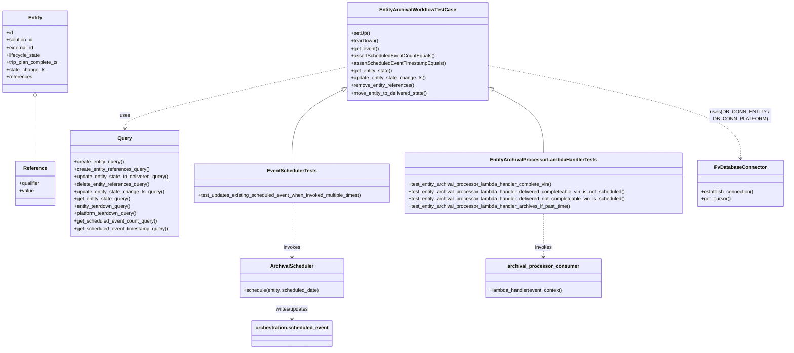

# Diagram: entity_core/entity_service/entity_listener/tests/integration/test_entity_archival_processor_lambda_handler.py


> Auto-generated by Obscura crawlers

## Diagram 1



### SVG

<svg id="container" width="2560.30859375" xmlns="http://www.w3.org/2000/svg" class="classDiagram" height="1132" viewBox="0 0 2560.30859375 1132" role="graphics-document document" aria-roledescription="class"><style>#container{font-family:"trebuchet ms",verdana,arial,sans-serif;font-size:16px;fill:#333;}@keyframes edge-animation-frame{from{stroke-dashoffset:0;}}@keyframes dash{to{stroke-dashoffset:0;}}#container .edge-animation-slow{stroke-dasharray:9,5!important;stroke-dashoffset:900;animation:dash 50s linear infinite;stroke-linecap:round;}#container .edge-animation-fast{stroke-dasharray:9,5!important;stroke-dashoffset:900;animation:dash 20s linear infinite;stroke-linecap:round;}#container .error-icon{fill:#552222;}#container .error-text{fill:#552222;stroke:#552222;}#container .edge-thickness-normal{stroke-width:1px;}#container .edge-thickness-thick{stroke-width:3.5px;}#container .edge-pattern-solid{stroke-dasharray:0;}#container .edge-thickness-invisible{stroke-width:0;fill:none;}#container .edge-pattern-dashed{stroke-dasharray:3;}#container .edge-pattern-dotted{stroke-dasharray:2;}#container .marker{fill:#333333;stroke:#333333;}#container .marker.cross{stroke:#333333;}#container svg{font-family:"trebuchet ms",verdana,arial,sans-serif;font-size:16px;}#container p{margin:0;}#container g.classGroup text{fill:#9370DB;stroke:none;font-family:"trebuchet ms",verdana,arial,sans-serif;font-size:10px;}#container g.classGroup text .title{font-weight:bolder;}#container .nodeLabel,#container .edgeLabel{color:#131300;}#container .edgeLabel .label rect{fill:#ECECFF;}#container .label text{fill:#131300;}#container .labelBkg{background:#ECECFF;}#container .edgeLabel .label span{background:#ECECFF;}#container .classTitle{font-weight:bolder;}#container .node rect,#container .node circle,#container .node ellipse,#container .node polygon,#container .node path{fill:#ECECFF;stroke:#9370DB;stroke-width:1px;}#container .divider{stroke:#9370DB;stroke-width:1;}#container g.clickable{cursor:pointer;}#container g.classGroup rect{fill:#ECECFF;stroke:#9370DB;}#container g.classGroup line{stroke:#9370DB;stroke-width:1;}#container .classLabel .box{stroke:none;stroke-width:0;fill:#ECECFF;opacity:0.5;}#container .classLabel .label{fill:#9370DB;font-size:10px;}#container .relation{stroke:#333333;stroke-width:1;fill:none;}#container .dashed-line{stroke-dasharray:3;}#container .dotted-line{stroke-dasharray:1 2;}#container #compositionStart,#container .composition{fill:#333333!important;stroke:#333333!important;stroke-width:1;}#container #compositionEnd,#container .composition{fill:#333333!important;stroke:#333333!important;stroke-width:1;}#container #dependencyStart,#container .dependency{fill:#333333!important;stroke:#333333!important;stroke-width:1;}#container #dependencyStart,#container .dependency{fill:#333333!important;stroke:#333333!important;stroke-width:1;}#container #extensionStart,#container .extension{fill:transparent!important;stroke:#333333!important;stroke-width:1;}#container #extensionEnd,#container .extension{fill:transparent!important;stroke:#333333!important;stroke-width:1;}#container #aggregationStart,#container .aggregation{fill:transparent!important;stroke:#333333!important;stroke-width:1;}#container #aggregationEnd,#container .aggregation{fill:transparent!important;stroke:#333333!important;stroke-width:1;}#container #lollipopStart,#container .lollipop{fill:#ECECFF!important;stroke:#333333!important;stroke-width:1;}#container #lollipopEnd,#container .lollipop{fill:#ECECFF!important;stroke:#333333!important;stroke-width:1;}#container .edgeTerminals{font-size:11px;line-height:initial;}#container .classTitleText{text-anchor:middle;font-size:18px;fill:#333;}#container .label-icon{display:inline-block;height:1em;overflow:visible;vertical-align:-0.125em;}#container .node .label-icon path{fill:currentColor;stroke:revert;stroke-width:revert;}#container :root{--mermaid-font-family:"trebuchet ms",verdana,arial,sans-serif;}</style><g><defs><marker id="container_class-aggregationStart" class="marker aggregation class" refX="18" refY="7" markerWidth="190" markerHeight="240" orient="auto"><path d="M 18,7 L9,13 L1,7 L9,1 Z"></path></marker></defs><defs><marker id="container_class-aggregationEnd" class="marker aggregation class" refX="1" refY="7" markerWidth="20" markerHeight="28" orient="auto"><path d="M 18,7 L9,13 L1,7 L9,1 Z"></path></marker></defs><defs><marker id="container_class-extensionStart" class="marker extension class" refX="18" refY="7" markerWidth="190" markerHeight="240" orient="auto"><path d="M 1,7 L18,13 V 1 Z"></path></marker></defs><defs><marker id="container_class-extensionEnd" class="marker extension class" refX="1" refY="7" markerWidth="20" markerHeight="28" orient="auto"><path d="M 1,1 V 13 L18,7 Z"></path></marker></defs><defs><marker id="container_class-compositionStart" class="marker composition class" refX="18" refY="7" markerWidth="190" markerHeight="240" orient="auto"><path d="M 18,7 L9,13 L1,7 L9,1 Z"></path></marker></defs><defs><marker id="container_class-compositionEnd" class="marker composition class" refX="1" refY="7" markerWidth="20" markerHeight="28" orient="auto"><path d="M 18,7 L9,13 L1,7 L9,1 Z"></path></marker></defs><defs><marker id="container_class-dependencyStart" class="marker dependency class" refX="6" refY="7" markerWidth="190" markerHeight="240" orient="auto"><path d="M 5,7 L9,13 L1,7 L9,1 Z"></path></marker></defs><defs><marker id="container_class-dependencyEnd" class="marker dependency class" refX="13" refY="7" markerWidth="20" markerHeight="28" orient="auto"><path d="M 18,7 L9,13 L14,7 L9,1 Z"></path></marker></defs><defs><marker id="container_class-lollipopStart" class="marker lollipop class" refX="13" refY="7" markerWidth="190" markerHeight="240" orient="auto"><circle stroke="black" fill="transparent" cx="7" cy="7" r="6"></circle></marker></defs><defs><marker id="container_class-lollipopEnd" class="marker lollipop class" refX="1" refY="7" markerWidth="190" markerHeight="240" orient="auto"><circle stroke="black" fill="transparent" cx="7" cy="7" r="6"></circle></marker></defs><g class="root"><g class="clusters"></g><g class="edgePaths"><path d="M115.875,316.25L115.875,326.042C115.875,335.833,115.875,355.417,115.875,389.875C115.875,424.333,115.875,473.667,115.875,498.333L115.875,523" id="id_Entity_Reference_1" class="edge-thickness-normal edge-pattern-solid relation" style=";;;" data-edge="true" data-et="edge" data-id="id_Entity_Reference_1" data-points="W3sieCI6MTE1Ljg3NSwieSI6Mjk5fSx7IngiOjExNS44NzUsInkiOjM3NX0seyJ4IjoxMTUuODc1LCJ5Ijo1MjN9XQ==" marker-start="url(#container_class-aggregationStart)"></path><path d="M1605.257,288.49L1633.647,302.908C1662.037,317.327,1718.817,346.163,1747.208,380.748C1775.598,415.333,1775.598,455.667,1775.598,475.833L1775.598,496" id="id_EntityArchivalWorkflowTestCase_EntityArchivalProcessorLambdaHandlerTests_2" class="edge-thickness-normal edge-pattern-solid relation" style=";;;" data-edge="true" data-et="edge" data-id="id_EntityArchivalWorkflowTestCase_EntityArchivalProcessorLambdaHandlerTests_2" data-points="W3sieCI6MTU4OS44NzY5NTMxMjUsInkiOjI4MC42Nzg3MjA3OTY1OTMxfSx7IngiOjE3NzUuNTk3NjU2MjUsInkiOjM3NX0seyJ4IjoxNzc1LjU5NzY1NjI1LCJ5Ijo0OTZ9XQ==" marker-start="url(#container_class-extensionStart)"></path><path d="M1126.825,288.49L1098.435,302.908C1070.045,317.327,1013.265,346.163,984.874,386.748C956.484,427.333,956.484,479.667,956.484,505.833L956.484,532" id="id_EntityArchivalWorkflowTestCase_EventSchedulerTests_3" class="edge-thickness-normal edge-pattern-solid relation" style=";;;" data-edge="true" data-et="edge" data-id="id_EntityArchivalWorkflowTestCase_EventSchedulerTests_3" data-points="W3sieCI6MTE0Mi4yMDUwNzgxMjUsInkiOjI4MC42Nzg3MjA3OTY1OTMxfSx7IngiOjk1Ni40ODQzNzUsInkiOjM3NX0seyJ4Ijo5NTYuNDg0Mzc1LCJ5Ijo1MzJ9XQ==" marker-start="url(#container_class-extensionStart)"></path><path d="M1142.205,215.648L1020.004,242.206C897.803,268.765,653.402,321.883,531.201,355.608C409,389.333,409,403.667,409,410.833L409,418" id="id_EntityArchivalWorkflowTestCase_Query_4" class="edge-thickness-normal edge-pattern-dashed relation" style=";;;" data-edge="true" data-et="edge" data-id="id_EntityArchivalWorkflowTestCase_Query_4" data-points="W3sieCI6MTE0Mi4yMDUwNzgxMjUsInkiOjIxNS42NDc3MzIxNjU5OTgzMn0seyJ4Ijo0MDksInkiOjM3NX0seyJ4Ijo0MDksInkiOjQyNH1d" marker-end="url(#container_class-dependencyEnd)"></path><path d="M1589.877,211.426L1727.235,238.688C1864.592,265.951,2139.308,320.475,2276.666,370.904C2414.023,421.333,2414.023,467.667,2414.023,490.833L2414.023,514" id="id_EntityArchivalWorkflowTestCase_FvDatabaseConnector_5" class="edge-thickness-normal edge-pattern-dashed relation" style=";;;" data-edge="true" data-et="edge" data-id="id_EntityArchivalWorkflowTestCase_FvDatabaseConnector_5" data-points="W3sieCI6MTU4OS44NzY5NTMxMjUsInkiOjIxMS40MjYxOTg0MDU3OTA5fSx7IngiOjI0MTQuMDIzNDM3NSwieSI6Mzc1fSx7IngiOjI0MTQuMDIzNDM3NSwieSI6NTIwfV0=" marker-end="url(#container_class-dependencyEnd)"></path><path d="M956.484,658L956.484,682.167C956.484,706.333,956.484,754.667,956.484,784C956.484,813.333,956.484,823.667,956.484,828.833L956.484,834" id="id_EventSchedulerTests_ArchivalScheduler_6" class="edge-thickness-normal edge-pattern-dashed relation" style=";;;" data-edge="true" data-et="edge" data-id="id_EventSchedulerTests_ArchivalScheduler_6" data-points="W3sieCI6OTU2LjQ4NDM3NSwieSI6NjU4fSx7IngiOjk1Ni40ODQzNzUsInkiOjgwM30seyJ4Ijo5NTYuNDg0Mzc1LCJ5Ijo4NDB9XQ==" marker-end="url(#container_class-dependencyEnd)"></path><path d="M1775.598,694L1775.598,712.167C1775.598,730.333,1775.598,766.667,1775.598,790C1775.598,813.333,1775.598,823.667,1775.598,828.833L1775.598,834" id="id_EntityArchivalProcessorLambdaHandlerTests_archival_processor_consumer_7" class="edge-thickness-normal edge-pattern-dashed relation" style=";;;" data-edge="true" data-et="edge" data-id="id_EntityArchivalProcessorLambdaHandlerTests_archival_processor_consumer_7" data-points="W3sieCI6MTc3NS41OTc2NTYyNSwieSI6Njk0fSx7IngiOjE3NzUuNTk3NjU2MjUsInkiOjgwM30seyJ4IjoxNzc1LjU5NzY1NjI1LCJ5Ijo4NDB9XQ==" marker-end="url(#container_class-dependencyEnd)"></path><path d="M956.484,966L956.484,972.167C956.484,978.333,956.484,990.667,956.484,1002C956.484,1013.333,956.484,1023.667,956.484,1028.833L956.484,1034" id="id_ArchivalScheduler_orchestration.scheduled_event_8" class="edge-thickness-normal edge-pattern-dashed relation" style=";;;" data-edge="true" data-et="edge" data-id="id_ArchivalScheduler_orchestration.scheduled_event_8" data-points="W3sieCI6OTU2LjQ4NDM3NSwieSI6OTY2fSx7IngiOjk1Ni40ODQzNzUsInkiOjEwMDN9LHsieCI6OTU2LjQ4NDM3NSwieSI6MTA0MH1d" marker-end="url(#container_class-dependencyEnd)"></path></g><g class="edgeLabels"><g class="edgeLabel"><g class="label" data-id="id_Entity_Reference_1" transform="translate(0, 0)"><foreignObject width="0" height="0"><div xmlns="http://www.w3.org/1999/xhtml" class="labelBkg" style="display: table-cell; white-space: nowrap; line-height: 1.5; max-width: 200px; text-align: center;"><span class="edgeLabel"></span></div></foreignObject></g></g><g class="edgeLabel"><g class="label" data-id="id_EntityArchivalWorkflowTestCase_EntityArchivalProcessorLambdaHandlerTests_2" transform="translate(0, 0)"><foreignObject width="0" height="0"><div xmlns="http://www.w3.org/1999/xhtml" class="labelBkg" style="display: table-cell; white-space: nowrap; line-height: 1.5; max-width: 200px; text-align: center;"><span class="edgeLabel"></span></div></foreignObject></g></g><g class="edgeLabel"><g class="label" data-id="id_EntityArchivalWorkflowTestCase_EventSchedulerTests_3" transform="translate(0, 0)"><foreignObject width="0" height="0"><div xmlns="http://www.w3.org/1999/xhtml" class="labelBkg" style="display: table-cell; white-space: nowrap; line-height: 1.5; max-width: 200px; text-align: center;"><span class="edgeLabel"></span></div></foreignObject></g></g><g class="edgeLabel" transform="translate(409, 375)"><g class="label" data-id="id_EntityArchivalWorkflowTestCase_Query_4" transform="translate(-16.4921875, -12)"><foreignObject width="32.984375" height="24"><div xmlns="http://www.w3.org/1999/xhtml" class="labelBkg" style="display: table-cell; white-space: nowrap; line-height: 1.5; max-width: 200px; text-align: center;"><span class="edgeLabel"><p>uses</p></span></div></foreignObject></g></g><g class="edgeLabel" transform="translate(2414.0234375, 375)"><g class="label" data-id="id_EntityArchivalWorkflowTestCase_FvDatabaseConnector_5" transform="translate(-100, -24)"><foreignObject width="200" height="48"><div xmlns="http://www.w3.org/1999/xhtml" class="labelBkg" style="display: table; white-space: break-spaces; line-height: 1.5; max-width: 200px; text-align: center; width: 200px;"><span class="edgeLabel"><p>uses(DB_CONN_ENTITY / DB_CONN_PLATFORM)</p></span></div></foreignObject></g></g><g class="edgeLabel" transform="translate(956.484375, 803)"><g class="label" data-id="id_EventSchedulerTests_ArchivalScheduler_6" transform="translate(-27.5859375, -12)"><foreignObject width="55.171875" height="24"><div xmlns="http://www.w3.org/1999/xhtml" class="labelBkg" style="display: table-cell; white-space: nowrap; line-height: 1.5; max-width: 200px; text-align: center;"><span class="edgeLabel"><p>invokes</p></span></div></foreignObject></g></g><g class="edgeLabel" transform="translate(1775.59765625, 803)"><g class="label" data-id="id_EntityArchivalProcessorLambdaHandlerTests_archival_processor_consumer_7" transform="translate(-27.5859375, -12)"><foreignObject width="55.171875" height="24"><div xmlns="http://www.w3.org/1999/xhtml" class="labelBkg" style="display: table-cell; white-space: nowrap; line-height: 1.5; max-width: 200px; text-align: center;"><span class="edgeLabel"><p>invokes</p></span></div></foreignObject></g></g><g class="edgeLabel" transform="translate(956.484375, 1003)"><g class="label" data-id="id_ArchivalScheduler_orchestration.scheduled_event_8" transform="translate(-55.2734375, -12)"><foreignObject width="110.546875" height="24"><div xmlns="http://www.w3.org/1999/xhtml" class="labelBkg" style="display: table-cell; white-space: nowrap; line-height: 1.5; max-width: 200px; text-align: center;"><span class="edgeLabel"><p>writes/updates</p></span></div></foreignObject></g></g></g><g class="nodes"><g class="node default" id="classId-Entity-0" transform="translate(115.875, 167)"><g class="basic label-container"><path d="M-107.875 -132 L107.875 -132 L107.875 132 L-107.875 132" stroke="none" stroke-width="0" fill="#ECECFF" style=""></path><path d="M-107.875 -132 C-25.780801441707567 -132, 56.313397116584866 -132, 107.875 -132 M-107.875 -132 C-31.23144289713801 -132, 45.41211420572398 -132, 107.875 -132 M107.875 -132 C107.875 -35.16268082888048, 107.875 61.674638342239035, 107.875 132 M107.875 -132 C107.875 -29.76970866529004, 107.875 72.46058266941992, 107.875 132 M107.875 132 C21.592129013856862 132, -64.69074197228628 132, -107.875 132 M107.875 132 C52.674153180950476 132, -2.5266936380990472 132, -107.875 132 M-107.875 132 C-107.875 63.102826798063035, -107.875 -5.794346403873931, -107.875 -132 M-107.875 132 C-107.875 58.71255314540443, -107.875 -14.574893709191144, -107.875 -132" stroke="#9370DB" stroke-width="1.3" fill="none" stroke-dasharray="0 0" style=""></path></g><g class="annotation-group text" transform="translate(0, -108)"></g><g class="label-group text" transform="translate(-21.28125, -108)"><g class="label" style="font-weight: bolder" transform="translate(0,-12)"><foreignObject width="42.5625" height="24"><div xmlns="http://www.w3.org/1999/xhtml" style="display: table-cell; white-space: nowrap; line-height: 1.5; max-width: 92px; text-align: center;"><span class="nodeLabel markdown-node-label" style=""><p>Entity</p></span></div></foreignObject></g></g><g class="members-group text" transform="translate(-95.875, -60)"><g class="label" style="" transform="translate(0,-12)"><foreignObject width="22.078125" height="24"><div xmlns="http://www.w3.org/1999/xhtml" style="display: table-cell; white-space: nowrap; line-height: 1.5; max-width: 79px; text-align: center;"><span class="nodeLabel markdown-node-label" style=""><p>+id</p></span></div></foreignObject></g><g class="label" style="" transform="translate(0,12)"><foreignObject width="90.21875" height="24"><div xmlns="http://www.w3.org/1999/xhtml" style="display: table-cell; white-space: nowrap; line-height: 1.5; max-width: 148px; text-align: center;"><span class="nodeLabel markdown-node-label" style=""><p>+solution_id</p></span></div></foreignObject></g><g class="label" style="" transform="translate(0,36)"><foreignObject width="89.765625" height="24"><div xmlns="http://www.w3.org/1999/xhtml" style="display: table-cell; white-space: nowrap; line-height: 1.5; max-width: 147px; text-align: center;"><span class="nodeLabel markdown-node-label" style=""><p>+external_id</p></span></div></foreignObject></g><g class="label" style="" transform="translate(0,60)"><foreignObject width="111.640625" height="24"><div xmlns="http://www.w3.org/1999/xhtml" style="display: table-cell; white-space: nowrap; line-height: 1.5; max-width: 169px; text-align: center;"><span class="nodeLabel markdown-node-label" style=""><p>+lifecycle_state</p></span></div></foreignObject></g><g class="label" style="" transform="translate(0,84)"><foreignObject width="170.46875" height="24"><div xmlns="http://www.w3.org/1999/xhtml" style="display: table-cell; white-space: nowrap; line-height: 1.5; max-width: 228px; text-align: center;"><span class="nodeLabel markdown-node-label" style=""><p>+trip_plan_complete_ts</p></span></div></foreignObject></g><g class="label" style="" transform="translate(0,108)"><foreignObject width="124.578125" height="24"><div xmlns="http://www.w3.org/1999/xhtml" style="display: table-cell; white-space: nowrap; line-height: 1.5; max-width: 182px; text-align: center;"><span class="nodeLabel markdown-node-label" style=""><p>+state_change_ts</p></span></div></foreignObject></g><g class="label" style="" transform="translate(0,132)"><foreignObject width="83.640625" height="24"><div xmlns="http://www.w3.org/1999/xhtml" style="display: table-cell; white-space: nowrap; line-height: 1.5; max-width: 141px; text-align: center;"><span class="nodeLabel markdown-node-label" style=""><p>+references</p></span></div></foreignObject></g></g><g class="methods-group text" transform="translate(-95.875, 132)"></g><g class="divider" style=""><path d="M-107.875 -84 C-41.373885338327156 -84, 25.127229323345688 -84, 107.875 -84 M-107.875 -84 C-31.04260473181101 -84, 45.78979053637798 -84, 107.875 -84" stroke="#9370DB" stroke-width="1.3" fill="none" stroke-dasharray="0 0" style=""></path></g><g class="divider" style=""><path d="M-107.875 108 C-51.791267300036246 108, 4.292465399927508 108, 107.875 108 M-107.875 108 C-37.30210717789147 108, 33.27078564421706 108, 107.875 108" stroke="#9370DB" stroke-width="1.3" fill="none" stroke-dasharray="0 0" style=""></path></g></g><g class="node default" id="classId-Reference-1" transform="translate(115.875, 595)"><g class="basic label-container"><path d="M-64.61328125 -72 L64.61328125 -72 L64.61328125 72 L-64.61328125 72" stroke="none" stroke-width="0" fill="#ECECFF" style=""></path><path d="M-64.61328125 -72 C-36.88823760386322 -72, -9.163193957726428 -72, 64.61328125 -72 M-64.61328125 -72 C-15.79320223620386 -72, 33.02687677759228 -72, 64.61328125 -72 M64.61328125 -72 C64.61328125 -28.14678249141408, 64.61328125 15.706435017171842, 64.61328125 72 M64.61328125 -72 C64.61328125 -22.569049583544384, 64.61328125 26.861900832911232, 64.61328125 72 M64.61328125 72 C21.54628371895027 72, -21.52071381209946 72, -64.61328125 72 M64.61328125 72 C35.93708771374023 72, 7.260894177480466 72, -64.61328125 72 M-64.61328125 72 C-64.61328125 39.4737783175039, -64.61328125 6.9475566350078, -64.61328125 -72 M-64.61328125 72 C-64.61328125 42.97582721626536, -64.61328125 13.95165443253071, -64.61328125 -72" stroke="#9370DB" stroke-width="1.3" fill="none" stroke-dasharray="0 0" style=""></path></g><g class="annotation-group text" transform="translate(0, -48)"></g><g class="label-group text" transform="translate(-36.5078125, -48)"><g class="label" style="font-weight: bolder" transform="translate(0,-12)"><foreignObject width="73.015625" height="24"><div xmlns="http://www.w3.org/1999/xhtml" style="display: table-cell; white-space: nowrap; line-height: 1.5; max-width: 122px; text-align: center;"><span class="nodeLabel markdown-node-label" style=""><p>Reference</p></span></div></foreignObject></g></g><g class="members-group text" transform="translate(-52.61328125, 0)"><g class="label" style="" transform="translate(0,-12)"><foreignObject width="68.71875" height="24"><div xmlns="http://www.w3.org/1999/xhtml" style="display: table-cell; white-space: nowrap; line-height: 1.5; max-width: 127px; text-align: center;"><span class="nodeLabel markdown-node-label" style=""><p>+qualifier</p></span></div></foreignObject></g><g class="label" style="" transform="translate(0,12)"><foreignObject width="46.71875" height="24"><div xmlns="http://www.w3.org/1999/xhtml" style="display: table-cell; white-space: nowrap; line-height: 1.5; max-width: 104px; text-align: center;"><span class="nodeLabel markdown-node-label" style=""><p>+value</p></span></div></foreignObject></g></g><g class="methods-group text" transform="translate(-52.61328125, 72)"></g><g class="divider" style=""><path d="M-64.61328125 -24 C-14.026957995672284 -24, 36.55936525865543 -24, 64.61328125 -24 M-64.61328125 -24 C-16.23350262399378 -24, 32.14627600201244 -24, 64.61328125 -24" stroke="#9370DB" stroke-width="1.3" fill="none" stroke-dasharray="0 0" style=""></path></g><g class="divider" style=""><path d="M-64.61328125 48 C-26.33795565424124 48, 11.937369941517517 48, 64.61328125 48 M-64.61328125 48 C-28.13511904422807 48, 8.34304316154386 48, 64.61328125 48" stroke="#9370DB" stroke-width="1.3" fill="none" stroke-dasharray="0 0" style=""></path></g></g><g class="node default" id="classId-ArchivalScheduler-2" transform="translate(956.484375, 903)"><g class="basic label-container"><path d="M-169.2421875 -63 L169.2421875 -63 L169.2421875 63 L-169.2421875 63" stroke="none" stroke-width="0" fill="#ECECFF" style=""></path><path d="M-169.2421875 -63 C-51.86796358604826 -63, 65.50626032790348 -63, 169.2421875 -63 M-169.2421875 -63 C-51.535252513315186 -63, 66.17168247336963 -63, 169.2421875 -63 M169.2421875 -63 C169.2421875 -25.605516857116037, 169.2421875 11.788966285767927, 169.2421875 63 M169.2421875 -63 C169.2421875 -35.560597272304996, 169.2421875 -8.121194544609992, 169.2421875 63 M169.2421875 63 C48.20708842781312 63, -72.82801064437376 63, -169.2421875 63 M169.2421875 63 C92.89275486280484 63, 16.54332222560967 63, -169.2421875 63 M-169.2421875 63 C-169.2421875 36.059310469485865, -169.2421875 9.118620938971738, -169.2421875 -63 M-169.2421875 63 C-169.2421875 34.14215131428107, -169.2421875 5.284302628562145, -169.2421875 -63" stroke="#9370DB" stroke-width="1.3" fill="none" stroke-dasharray="0 0" style=""></path></g><g class="annotation-group text" transform="translate(0, -39)"></g><g class="label-group text" transform="translate(-65.78125, -39)"><g class="label" style="font-weight: bolder" transform="translate(0,-12)"><foreignObject width="131.5625" height="24"><div xmlns="http://www.w3.org/1999/xhtml" style="display: table-cell; white-space: nowrap; line-height: 1.5; max-width: 181px; text-align: center;"><span class="nodeLabel markdown-node-label" style=""><p>ArchivalScheduler</p></span></div></foreignObject></g></g><g class="members-group text" transform="translate(-157.2421875, 9)"></g><g class="methods-group text" transform="translate(-157.2421875, 39)"><g class="label" style="" transform="translate(0,-12)"><foreignObject width="248.703125" height="24"><div xmlns="http://www.w3.org/1999/xhtml" style="display: table-cell; white-space: nowrap; line-height: 1.5; max-width: 306px; text-align: center;"><span class="nodeLabel markdown-node-label" style=""><p>+schedule(entity, scheduled_date)</p></span></div></foreignObject></g></g><g class="divider" style=""><path d="M-169.2421875 -15 C-63.2900387206263 -15, 42.6621100587474 -15, 169.2421875 -15 M-169.2421875 -15 C-87.83709907511508 -15, -6.432010650230154 -15, 169.2421875 -15" stroke="#9370DB" stroke-width="1.3" fill="none" stroke-dasharray="0 0" style=""></path></g><g class="divider" style=""><path d="M-169.2421875 9 C-48.789579254014285 9, 71.66302899197143 9, 169.2421875 9 M-169.2421875 9 C-52.388608478393465 9, 64.46497054321307 9, 169.2421875 9" stroke="#9370DB" stroke-width="1.3" fill="none" stroke-dasharray="0 0" style=""></path></g></g><g class="node default" id="classId-Query-3" transform="translate(409, 595)"><g class="basic label-container"><path d="M-178.51171875 -171 L178.51171875 -171 L178.51171875 171 L-178.51171875 171" stroke="none" stroke-width="0" fill="#ECECFF" style=""></path><path d="M-178.51171875 -171 C-81.049983526591 -171, 16.411751696817987 -171, 178.51171875 -171 M-178.51171875 -171 C-74.69713860657286 -171, 29.117441536854272 -171, 178.51171875 -171 M178.51171875 -171 C178.51171875 -87.20884151486557, 178.51171875 -3.417683029731137, 178.51171875 171 M178.51171875 -171 C178.51171875 -83.09881055961311, 178.51171875 4.802378880773773, 178.51171875 171 M178.51171875 171 C101.58230903658615 171, 24.652899323172306 171, -178.51171875 171 M178.51171875 171 C80.77859098316775 171, -16.95453678366451 171, -178.51171875 171 M-178.51171875 171 C-178.51171875 78.28632822953897, -178.51171875 -14.427343540922067, -178.51171875 -171 M-178.51171875 171 C-178.51171875 73.75681453035844, -178.51171875 -23.48637093928312, -178.51171875 -171" stroke="#9370DB" stroke-width="1.3" fill="none" stroke-dasharray="0 0" style=""></path></g><g class="annotation-group text" transform="translate(0, -147)"></g><g class="label-group text" transform="translate(-21.8671875, -147)"><g class="label" style="font-weight: bolder" transform="translate(0,-12)"><foreignObject width="43.734375" height="24"><div xmlns="http://www.w3.org/1999/xhtml" style="display: table-cell; white-space: nowrap; line-height: 1.5; max-width: 93px; text-align: center;"><span class="nodeLabel markdown-node-label" style=""><p>Query</p></span></div></foreignObject></g></g><g class="members-group text" transform="translate(-166.51171875, -99)"></g><g class="methods-group text" transform="translate(-166.51171875, -69)"><g class="label" style="" transform="translate(0,-12)"><foreignObject width="162.03125" height="24"><div xmlns="http://www.w3.org/1999/xhtml" style="display: table-cell; white-space: nowrap; line-height: 1.5; max-width: 219px; text-align: center;"><span class="nodeLabel markdown-node-label" style=""><p>+create_entity_query()</p></span></div></foreignObject></g><g class="label" style="" transform="translate(0,12)"><foreignObject width="245.671875" height="24"><div xmlns="http://www.w3.org/1999/xhtml" style="display: table-cell; white-space: nowrap; line-height: 1.5; max-width: 303px; text-align: center;"><span class="nodeLabel markdown-node-label" style=""><p>+create_entity_references_query()</p></span></div></foreignObject></g><g class="label" style="" transform="translate(0,36)"><foreignObject width="311.15625" height="24"><div xmlns="http://www.w3.org/1999/xhtml" style="display: table-cell; white-space: nowrap; line-height: 1.5; max-width: 369px; text-align: center;"><span class="nodeLabel markdown-node-label" style=""><p>+update_entity_state_to_delivered_query()</p></span></div></foreignObject></g><g class="label" style="" transform="translate(0,60)"><foreignObject width="246.6875" height="24"><div xmlns="http://www.w3.org/1999/xhtml" style="display: table-cell; white-space: nowrap; line-height: 1.5; max-width: 304px; text-align: center;"><span class="nodeLabel markdown-node-label" style=""><p>+delete_entity_references_query()</p></span></div></foreignObject></g><g class="label" style="" transform="translate(0,84)"><foreignObject width="293.09375" height="24"><div xmlns="http://www.w3.org/1999/xhtml" style="display: table-cell; white-space: nowrap; line-height: 1.5; max-width: 350px; text-align: center;"><span class="nodeLabel markdown-node-label" style=""><p>+update_entity_state_change_ts_query()</p></span></div></foreignObject></g><g class="label" style="" transform="translate(0,108)"><foreignObject width="184.140625" height="24"><div xmlns="http://www.w3.org/1999/xhtml" style="display: table-cell; white-space: nowrap; line-height: 1.5; max-width: 242px; text-align: center;"><span class="nodeLabel markdown-node-label" style=""><p>+get_entity_state_query()</p></span></div></foreignObject></g><g class="label" style="" transform="translate(0,132)"><foreignObject width="185.734375" height="24"><div xmlns="http://www.w3.org/1999/xhtml" style="display: table-cell; white-space: nowrap; line-height: 1.5; max-width: 243px; text-align: center;"><span class="nodeLabel markdown-node-label" style=""><p>+entity_teardown_query()</p></span></div></foreignObject></g><g class="label" style="" transform="translate(0,156)"><foreignObject width="207.28125" height="24"><div xmlns="http://www.w3.org/1999/xhtml" style="display: table-cell; white-space: nowrap; line-height: 1.5; max-width: 265px; text-align: center;"><span class="nodeLabel markdown-node-label" style=""><p>+platform_teardown_query()</p></span></div></foreignObject></g><g class="label" style="" transform="translate(0,180)"><foreignObject width="271.359375" height="24"><div xmlns="http://www.w3.org/1999/xhtml" style="display: table-cell; white-space: nowrap; line-height: 1.5; max-width: 329px; text-align: center;"><span class="nodeLabel markdown-node-label" style=""><p>+get_scheduled_event_count_query()</p></span></div></foreignObject></g><g class="label" style="" transform="translate(0,204)"><foreignObject width="307.671875" height="24"><div xmlns="http://www.w3.org/1999/xhtml" style="display: table-cell; white-space: nowrap; line-height: 1.5; max-width: 365px; text-align: center;"><span class="nodeLabel markdown-node-label" style=""><p>+get_scheduled_event_timestamp_query()</p></span></div></foreignObject></g></g><g class="divider" style=""><path d="M-178.51171875 -123 C-72.84159437453518 -123, 32.828530000929646 -123, 178.51171875 -123 M-178.51171875 -123 C-78.46249830203097 -123, 21.58672214593807 -123, 178.51171875 -123" stroke="#9370DB" stroke-width="1.3" fill="none" stroke-dasharray="0 0" style=""></path></g><g class="divider" style=""><path d="M-178.51171875 -99 C-88.27504285604559 -99, 1.9616330379088254 -99, 178.51171875 -99 M-178.51171875 -99 C-70.025779624853 -99, 38.460159500294 -99, 178.51171875 -99" stroke="#9370DB" stroke-width="1.3" fill="none" stroke-dasharray="0 0" style=""></path></g></g><g class="node default" id="classId-EntityArchivalWorkflowTestCase-4" transform="translate(1366.041015625, 167)"><g class="basic label-container"><path d="M-223.8359375 -159 L223.8359375 -159 L223.8359375 159 L-223.8359375 159" stroke="none" stroke-width="0" fill="#ECECFF" style=""></path><path d="M-223.8359375 -159 C-97.27833844175508 -159, 29.279260616489836 -159, 223.8359375 -159 M-223.8359375 -159 C-63.66270151828925 -159, 96.5105344634215 -159, 223.8359375 -159 M223.8359375 -159 C223.8359375 -71.81530075079691, 223.8359375 15.369398498406184, 223.8359375 159 M223.8359375 -159 C223.8359375 -83.80178957978929, 223.8359375 -8.603579159578572, 223.8359375 159 M223.8359375 159 C125.15531004062326 159, 26.474682581246526 159, -223.8359375 159 M223.8359375 159 C75.93878821628763 159, -71.95836106742473 159, -223.8359375 159 M-223.8359375 159 C-223.8359375 90.97865290199769, -223.8359375 22.957305803995382, -223.8359375 -159 M-223.8359375 159 C-223.8359375 84.49234477756802, -223.8359375 9.984689555136043, -223.8359375 -159" stroke="#9370DB" stroke-width="1.3" fill="none" stroke-dasharray="0 0" style=""></path></g><g class="annotation-group text" transform="translate(0, -135)"></g><g class="label-group text" transform="translate(-117.296875, -135)"><g class="label" style="font-weight: bolder" transform="translate(0,-12)"><foreignObject width="234.59375" height="24"><div xmlns="http://www.w3.org/1999/xhtml" style="display: table-cell; white-space: nowrap; line-height: 1.5; max-width: 279px; text-align: center;"><span class="nodeLabel markdown-node-label" style=""><p>EntityArchivalWorkflowTestCase</p></span></div></foreignObject></g></g><g class="members-group text" transform="translate(-211.8359375, -87)"></g><g class="methods-group text" transform="translate(-211.8359375, -57)"><g class="label" style="" transform="translate(0,-12)"><foreignObject width="60.421875" height="24"><div xmlns="http://www.w3.org/1999/xhtml" style="display: table-cell; white-space: nowrap; line-height: 1.5; max-width: 118px; text-align: center;"><span class="nodeLabel markdown-node-label" style=""><p>+setUp()</p></span></div></foreignObject></g><g class="label" style="" transform="translate(0,12)"><foreignObject width="87.75" height="24"><div xmlns="http://www.w3.org/1999/xhtml" style="display: table-cell; white-space: nowrap; line-height: 1.5; max-width: 145px; text-align: center;"><span class="nodeLabel markdown-node-label" style=""><p>+tearDown()</p></span></div></foreignObject></g><g class="label" style="" transform="translate(0,36)"><foreignObject width="89.25" height="24"><div xmlns="http://www.w3.org/1999/xhtml" style="display: table-cell; white-space: nowrap; line-height: 1.5; max-width: 147px; text-align: center;"><span class="nodeLabel markdown-node-label" style=""><p>+get_event()</p></span></div></foreignObject></g><g class="label" style="" transform="translate(0,60)"><foreignObject width="268.546875" height="24"><div xmlns="http://www.w3.org/1999/xhtml" style="display: table-cell; white-space: nowrap; line-height: 1.5; max-width: 326px; text-align: center;"><span class="nodeLabel markdown-node-label" style=""><p>+assertScheduledEventCountEquals()</p></span></div></foreignObject></g><g class="label" style="" transform="translate(0,84)"><foreignObject width="306.375" height="24"><div xmlns="http://www.w3.org/1999/xhtml" style="display: table-cell; white-space: nowrap; line-height: 1.5; max-width: 364px; text-align: center;"><span class="nodeLabel markdown-node-label" style=""><p>+assertScheduledEventTimestampEquals()</p></span></div></foreignObject></g><g class="label" style="" transform="translate(0,108)"><foreignObject width="134.8125" height="24"><div xmlns="http://www.w3.org/1999/xhtml" style="display: table-cell; white-space: nowrap; line-height: 1.5; max-width: 192px; text-align: center;"><span class="nodeLabel markdown-node-label" style=""><p>+get_entity_state()</p></span></div></foreignObject></g><g class="label" style="" transform="translate(0,132)"><foreignObject width="243.765625" height="24"><div xmlns="http://www.w3.org/1999/xhtml" style="display: table-cell; white-space: nowrap; line-height: 1.5; max-width: 301px; text-align: center;"><span class="nodeLabel markdown-node-label" style=""><p>+update_entity_state_change_ts()</p></span></div></foreignObject></g><g class="label" style="" transform="translate(0,156)"><foreignObject width="205.421875" height="24"><div xmlns="http://www.w3.org/1999/xhtml" style="display: table-cell; white-space: nowrap; line-height: 1.5; max-width: 263px; text-align: center;"><span class="nodeLabel markdown-node-label" style=""><p>+remove_entity_references()</p></span></div></foreignObject></g><g class="label" style="" transform="translate(0,180)"><foreignObject width="250.015625" height="24"><div xmlns="http://www.w3.org/1999/xhtml" style="display: table-cell; white-space: nowrap; line-height: 1.5; max-width: 307px; text-align: center;"><span class="nodeLabel markdown-node-label" style=""><p>+move_entity_to_delivered_state()</p></span></div></foreignObject></g></g><g class="divider" style=""><path d="M-223.8359375 -111 C-112.00722796870468 -111, -0.17851843740936602 -111, 223.8359375 -111 M-223.8359375 -111 C-116.87079820196777 -111, -9.905658903935546 -111, 223.8359375 -111" stroke="#9370DB" stroke-width="1.3" fill="none" stroke-dasharray="0 0" style=""></path></g><g class="divider" style=""><path d="M-223.8359375 -87 C-100.9119457830144 -87, 22.012045933971194 -87, 223.8359375 -87 M-223.8359375 -87 C-109.65142147454881 -87, 4.533094550902376 -87, 223.8359375 -87" stroke="#9370DB" stroke-width="1.3" fill="none" stroke-dasharray="0 0" style=""></path></g></g><g class="node default" id="classId-EntityArchivalProcessorLambdaHandlerTests-5" transform="translate(1775.59765625, 595)"><g class="basic label-container"><path d="M-450.140625 -99 L450.140625 -99 L450.140625 99 L-450.140625 99" stroke="none" stroke-width="0" fill="#ECECFF" style=""></path><path d="M-450.140625 -99 C-141.79629024999565 -99, 166.5480445000087 -99, 450.140625 -99 M-450.140625 -99 C-158.998960466712 -99, 132.14270406657602 -99, 450.140625 -99 M450.140625 -99 C450.140625 -51.789777797137646, 450.140625 -4.579555594275291, 450.140625 99 M450.140625 -99 C450.140625 -47.8062051126208, 450.140625 3.3875897747583963, 450.140625 99 M450.140625 99 C255.38714325262504 99, 60.633661505250075 99, -450.140625 99 M450.140625 99 C233.4486638355591 99, 16.756702671118205 99, -450.140625 99 M-450.140625 99 C-450.140625 46.59847096826288, -450.140625 -5.803058063474239, -450.140625 -99 M-450.140625 99 C-450.140625 25.79971136876304, -450.140625 -47.40057726247392, -450.140625 -99" stroke="#9370DB" stroke-width="1.3" fill="none" stroke-dasharray="0 0" style=""></path></g><g class="annotation-group text" transform="translate(0, -75)"></g><g class="label-group text" transform="translate(-163.53125, -75)"><g class="label" style="font-weight: bolder" transform="translate(0,-12)"><foreignObject width="327.0625" height="24"><div xmlns="http://www.w3.org/1999/xhtml" style="display: table-cell; white-space: nowrap; line-height: 1.5; max-width: 372px; text-align: center;"><span class="nodeLabel markdown-node-label" style=""><p>EntityArchivalProcessorLambdaHandlerTests</p></span></div></foreignObject></g></g><g class="members-group text" transform="translate(-438.140625, -27)"></g><g class="methods-group text" transform="translate(-438.140625, 3)"><g class="label" style="" transform="translate(0,-12)"><foreignObject width="469.25" height="24"><div xmlns="http://www.w3.org/1999/xhtml" style="display: table-cell; white-space: nowrap; line-height: 1.5; max-width: 527px; text-align: center;"><span class="nodeLabel markdown-node-label" style=""><p>+test_entity_archival_processor_lambda_handler_complete_vin()</p></span></div></foreignObject></g><g class="label" style="" transform="translate(0,12)"><foreignObject width="712.75" height="24"><div xmlns="http://www.w3.org/1999/xhtml" style="display: table-cell; white-space: nowrap; line-height: 1.5; max-width: 770px; text-align: center;"><span class="nodeLabel markdown-node-label" style=""><p>+test_entity_archival_processor_lambda_handler_delivered_completeable_vin_is_not_scheduled()</p></span></div></foreignObject></g><g class="label" style="" transform="translate(0,36)"><foreignObject width="712.75" height="24"><div xmlns="http://www.w3.org/1999/xhtml" style="display: table-cell; white-space: nowrap; line-height: 1.5; max-width: 770px; text-align: center;"><span class="nodeLabel markdown-node-label" style=""><p>+test_entity_archival_processor_lambda_handler_delivered_not_completeable_vin_is_scheduled()</p></span></div></foreignObject></g><g class="label" style="" transform="translate(0,60)"><foreignObject width="530.015625" height="24"><div xmlns="http://www.w3.org/1999/xhtml" style="display: table-cell; white-space: nowrap; line-height: 1.5; max-width: 587px; text-align: center;"><span class="nodeLabel markdown-node-label" style=""><p>+test_entity_archival_processor_lambda_handler_archives_if_past_time()</p></span></div></foreignObject></g></g><g class="divider" style=""><path d="M-450.140625 -51 C-119.3445240815098 -51, 211.4515768369804 -51, 450.140625 -51 M-450.140625 -51 C-232.21031419687708 -51, -14.280003393754157 -51, 450.140625 -51" stroke="#9370DB" stroke-width="1.3" fill="none" stroke-dasharray="0 0" style=""></path></g><g class="divider" style=""><path d="M-450.140625 -27 C-176.3096031545614 -27, 97.52141869087723 -27, 450.140625 -27 M-450.140625 -27 C-196.71570276980404 -27, 56.70921946039192 -27, 450.140625 -27" stroke="#9370DB" stroke-width="1.3" fill="none" stroke-dasharray="0 0" style=""></path></g></g><g class="node default" id="classId-EventSchedulerTests-6" transform="translate(956.484375, 595)"><g class="basic label-container"><path d="M-318.97265625 -63 L318.97265625 -63 L318.97265625 63 L-318.97265625 63" stroke="none" stroke-width="0" fill="#ECECFF" style=""></path><path d="M-318.97265625 -63 C-145.27590307432797 -63, 28.420850101344058 -63, 318.97265625 -63 M-318.97265625 -63 C-132.88603300479315 -63, 53.2005902404137 -63, 318.97265625 -63 M318.97265625 -63 C318.97265625 -24.058973238225413, 318.97265625 14.882053523549175, 318.97265625 63 M318.97265625 -63 C318.97265625 -25.43441912149904, 318.97265625 12.13116175700192, 318.97265625 63 M318.97265625 63 C186.47394367667016 63, 53.97523110334032 63, -318.97265625 63 M318.97265625 63 C140.4093605007207 63, -38.15393524855858 63, -318.97265625 63 M-318.97265625 63 C-318.97265625 23.68783416419977, -318.97265625 -15.624331671600459, -318.97265625 -63 M-318.97265625 63 C-318.97265625 19.42520817235119, -318.97265625 -24.14958365529762, -318.97265625 -63" stroke="#9370DB" stroke-width="1.3" fill="none" stroke-dasharray="0 0" style=""></path></g><g class="annotation-group text" transform="translate(0, -39)"></g><g class="label-group text" transform="translate(-76.1015625, -39)"><g class="label" style="font-weight: bolder" transform="translate(0,-12)"><foreignObject width="152.203125" height="24"><div xmlns="http://www.w3.org/1999/xhtml" style="display: table-cell; white-space: nowrap; line-height: 1.5; max-width: 200px; text-align: center;"><span class="nodeLabel markdown-node-label" style=""><p>EventSchedulerTests</p></span></div></foreignObject></g></g><g class="members-group text" transform="translate(-306.97265625, 9)"></g><g class="methods-group text" transform="translate(-306.97265625, 39)"><g class="label" style="" transform="translate(0,-12)"><foreignObject width="537.84375" height="24"><div xmlns="http://www.w3.org/1999/xhtml" style="display: table-cell; white-space: nowrap; line-height: 1.5; max-width: 595px; text-align: center;"><span class="nodeLabel markdown-node-label" style=""><p>+test_updates_existing_scheduled_event_when_invoked_multiple_times()</p></span></div></foreignObject></g></g><g class="divider" style=""><path d="M-318.97265625 -15 C-108.07966248745626 -15, 102.81333127508748 -15, 318.97265625 -15 M-318.97265625 -15 C-128.75113993647514 -15, 61.47037637704972 -15, 318.97265625 -15" stroke="#9370DB" stroke-width="1.3" fill="none" stroke-dasharray="0 0" style=""></path></g><g class="divider" style=""><path d="M-318.97265625 9 C-101.64127218026621 9, 115.69011188946757 9, 318.97265625 9 M-318.97265625 9 C-175.93208585052483 9, -32.891515451049656 9, 318.97265625 9" stroke="#9370DB" stroke-width="1.3" fill="none" stroke-dasharray="0 0" style=""></path></g></g><g class="node default" id="classId-FvDatabaseConnector-7" transform="translate(2414.0234375, 595)"><g class="basic label-container"><path d="M-138.28515625 -75 L138.28515625 -75 L138.28515625 75 L-138.28515625 75" stroke="none" stroke-width="0" fill="#ECECFF" style=""></path><path d="M-138.28515625 -75 C-36.23811170589981 -75, 65.80893283820038 -75, 138.28515625 -75 M-138.28515625 -75 C-43.63301864419256 -75, 51.01911896161488 -75, 138.28515625 -75 M138.28515625 -75 C138.28515625 -21.762707505982696, 138.28515625 31.474584988034607, 138.28515625 75 M138.28515625 -75 C138.28515625 -37.736295268382314, 138.28515625 -0.4725905367646277, 138.28515625 75 M138.28515625 75 C44.27981306026783 75, -49.725530129464346 75, -138.28515625 75 M138.28515625 75 C46.82201358424348 75, -44.64112908151304 75, -138.28515625 75 M-138.28515625 75 C-138.28515625 43.48144226905531, -138.28515625 11.962884538110607, -138.28515625 -75 M-138.28515625 75 C-138.28515625 40.15938558654887, -138.28515625 5.318771173097744, -138.28515625 -75" stroke="#9370DB" stroke-width="1.3" fill="none" stroke-dasharray="0 0" style=""></path></g><g class="annotation-group text" transform="translate(0, -51)"></g><g class="label-group text" transform="translate(-79.3046875, -51)"><g class="label" style="font-weight: bolder" transform="translate(0,-12)"><foreignObject width="158.609375" height="24"><div xmlns="http://www.w3.org/1999/xhtml" style="display: table-cell; white-space: nowrap; line-height: 1.5; max-width: 207px; text-align: center;"><span class="nodeLabel markdown-node-label" style=""><p>FvDatabaseConnector</p></span></div></foreignObject></g></g><g class="members-group text" transform="translate(-126.28515625, -3)"></g><g class="methods-group text" transform="translate(-126.28515625, 27)"><g class="label" style="" transform="translate(0,-12)"><foreignObject width="173.265625" height="24"><div xmlns="http://www.w3.org/1999/xhtml" style="display: table-cell; white-space: nowrap; line-height: 1.5; max-width: 231px; text-align: center;"><span class="nodeLabel markdown-node-label" style=""><p>+establish_connection()</p></span></div></foreignObject></g><g class="label" style="" transform="translate(0,12)"><foreignObject width="94.640625" height="24"><div xmlns="http://www.w3.org/1999/xhtml" style="display: table-cell; white-space: nowrap; line-height: 1.5; max-width: 152px; text-align: center;"><span class="nodeLabel markdown-node-label" style=""><p>+get_cursor()</p></span></div></foreignObject></g></g><g class="divider" style=""><path d="M-138.28515625 -27 C-49.569346654699714 -27, 39.14646294060057 -27, 138.28515625 -27 M-138.28515625 -27 C-63.37568275427682 -27, 11.533790741446353 -27, 138.28515625 -27" stroke="#9370DB" stroke-width="1.3" fill="none" stroke-dasharray="0 0" style=""></path></g><g class="divider" style=""><path d="M-138.28515625 -3 C-65.57975237904223 -3, 7.125651491915534 -3, 138.28515625 -3 M-138.28515625 -3 C-73.0885580315333 -3, -7.891959813066592 -3, 138.28515625 -3" stroke="#9370DB" stroke-width="1.3" fill="none" stroke-dasharray="0 0" style=""></path></g></g><g class="node default" id="classId-archival_processor_consumer-8" transform="translate(1775.59765625, 903)"><g class="basic label-container"><path d="M-186.109375 -63 L186.109375 -63 L186.109375 63 L-186.109375 63" stroke="none" stroke-width="0" fill="#ECECFF" style=""></path><path d="M-186.109375 -63 C-59.696284915920316 -63, 66.71680516815937 -63, 186.109375 -63 M-186.109375 -63 C-75.01269912334206 -63, 36.08397675331588 -63, 186.109375 -63 M186.109375 -63 C186.109375 -12.703555189327489, 186.109375 37.59288962134502, 186.109375 63 M186.109375 -63 C186.109375 -14.258845696006013, 186.109375 34.482308607987974, 186.109375 63 M186.109375 63 C93.23780153208406 63, 0.36622806416812637 63, -186.109375 63 M186.109375 63 C83.26512948956255 63, -19.579116020874892 63, -186.109375 63 M-186.109375 63 C-186.109375 20.082968108040312, -186.109375 -22.834063783919376, -186.109375 -63 M-186.109375 63 C-186.109375 13.11444709717533, -186.109375 -36.77110580564934, -186.109375 -63" stroke="#9370DB" stroke-width="1.3" fill="none" stroke-dasharray="0 0" style=""></path></g><g class="annotation-group text" transform="translate(0, -39)"></g><g class="label-group text" transform="translate(-108.03125, -39)"><g class="label" style="font-weight: bolder" transform="translate(0,-12)"><foreignObject width="216.0625" height="24"><div xmlns="http://www.w3.org/1999/xhtml" style="display: table-cell; white-space: nowrap; line-height: 1.5; max-width: 265px; text-align: center;"><span class="nodeLabel markdown-node-label" style=""><p>archival_processor_consumer</p></span></div></foreignObject></g></g><g class="members-group text" transform="translate(-174.109375, 9)"></g><g class="methods-group text" transform="translate(-174.109375, 39)"><g class="label" style="" transform="translate(0,-12)"><foreignObject width="240.1875" height="24"><div xmlns="http://www.w3.org/1999/xhtml" style="display: table-cell; white-space: nowrap; line-height: 1.5; max-width: 298px; text-align: center;"><span class="nodeLabel markdown-node-label" style=""><p>+lambda_handler(event, context)</p></span></div></foreignObject></g></g><g class="divider" style=""><path d="M-186.109375 -15 C-40.906137538071846 -15, 104.29709992385631 -15, 186.109375 -15 M-186.109375 -15 C-92.08512126633572 -15, 1.9391324673285624 -15, 186.109375 -15" stroke="#9370DB" stroke-width="1.3" fill="none" stroke-dasharray="0 0" style=""></path></g><g class="divider" style=""><path d="M-186.109375 9 C-40.40096324780316 9, 105.30744850439368 9, 186.109375 9 M-186.109375 9 C-106.40606135915962 9, -26.702747718319245 9, 186.109375 9" stroke="#9370DB" stroke-width="1.3" fill="none" stroke-dasharray="0 0" style=""></path></g></g><g class="node default" id="classId-orchestration.scheduled_event-9" transform="translate(956.484375, 1082)"><g class="basic label-container"><path d="M-125.5546875 -42 L125.5546875 -42 L125.5546875 42 L-125.5546875 42" stroke="none" stroke-width="0" fill="#ECECFF" style=""></path><path d="M-125.5546875 -42 C-62.455335626051316 -42, 0.644016247897369 -42, 125.5546875 -42 M-125.5546875 -42 C-63.48786069005854 -42, -1.4210338801170792 -42, 125.5546875 -42 M125.5546875 -42 C125.5546875 -17.383775028998482, 125.5546875 7.232449942003036, 125.5546875 42 M125.5546875 -42 C125.5546875 -21.335307178062855, 125.5546875 -0.6706143561257107, 125.5546875 42 M125.5546875 42 C25.57639917582361 42, -74.40188914835278 42, -125.5546875 42 M125.5546875 42 C68.92750454107704 42, 12.300321582154083 42, -125.5546875 42 M-125.5546875 42 C-125.5546875 14.263702903258217, -125.5546875 -13.472594193483566, -125.5546875 -42 M-125.5546875 42 C-125.5546875 13.259391710269313, -125.5546875 -15.481216579461375, -125.5546875 -42" stroke="#9370DB" stroke-width="1.3" fill="none" stroke-dasharray="0 0" style=""></path></g><g class="annotation-group text" transform="translate(0, -18)"></g><g class="label-group text" transform="translate(-113.5546875, -18)"><g class="label" style="font-weight: bolder" transform="translate(0,-12)"><foreignObject width="227.109375" height="24"><div xmlns="http://www.w3.org/1999/xhtml" style="display: table-cell; white-space: nowrap; line-height: 1.5; max-width: 275px; text-align: center;"><span class="nodeLabel markdown-node-label" style=""><p>orchestration.scheduled_event</p></span></div></foreignObject></g></g><g class="members-group text" transform="translate(-113.5546875, 30)"></g><g class="methods-group text" transform="translate(-113.5546875, 60)"></g><g class="divider" style=""><path d="M-125.5546875 6 C-60.80011424542219 6, 3.954459009155613 6, 125.5546875 6 M-125.5546875 6 C-57.04233517978234 6, 11.470017140435317 6, 125.5546875 6" stroke="#9370DB" stroke-width="1.3" fill="none" stroke-dasharray="0 0" style=""></path></g><g class="divider" style=""><path d="M-125.5546875 24 C-52.22916289278423 24, 21.096361714431538 24, 125.5546875 24 M-125.5546875 24 C-50.009536250502364 24, 25.53561499899527 24, 125.5546875 24" stroke="#9370DB" stroke-width="1.3" fill="none" stroke-dasharray="0 0" style=""></path></g></g></g></g></g></svg>

## Diagram 2

```mermaid
flowchart TD
    A[Receive SQS/SNS Event] --> B[Parse message and extract entityId, solutionId, updated fields]
    B --> C{Retrieve entity state from DB}
    C -->|Complete| D[Entity is Complete -> Schedule archival event]
    C -->|Delivered| E{Is entity completeable (has references)?}
    E -->|Yes| F[Do NOT schedule archival event]
    E -->|No| D
    B --> G[Check entity state_change_ts age]
    G -->|Older than 60 days| H[Archive entity -> set state = "Archived"]
    G -->|Not older| I[Keep current state]
    D --> J[Upsert orchestration.scheduled_event (process=SYSTEM_LIFECYCLE_STATE)]
    H --> K[Update entity.state in DB and remove scheduled events if any]
    J --> L[Event scheduled for future send_at timestamp]
    F --> M[No DB scheduled_event change]
```

> SVG rendering failed for this diagram.
