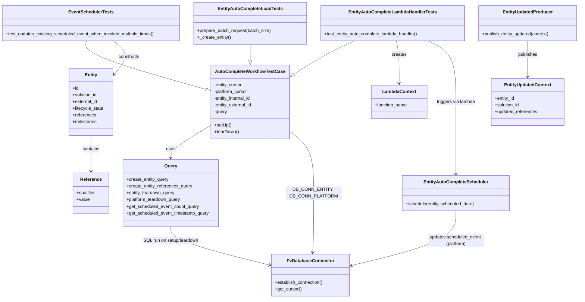
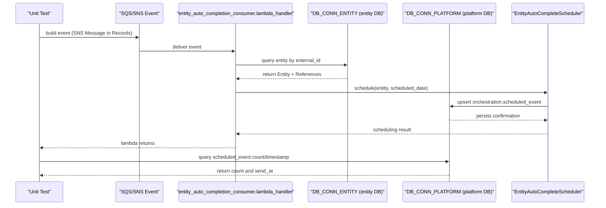
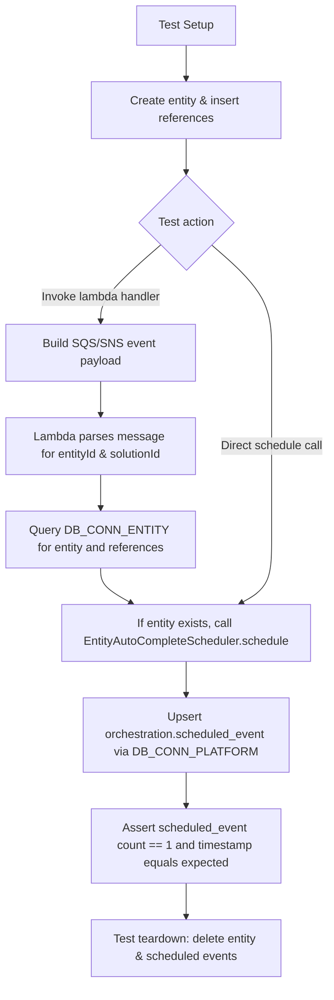

# Diagram: entity_core/entity_service/entity_listener/tests/integration/test_entity_auto_complete_lambda_handler.py

> Auto-generated by Obscura crawlers

## Diagram 1

### SVG

<svg id="container" width="2068.6015625" xmlns="http://www.w3.org/2000/svg" class="classDiagram" height="1066" viewBox="0 0 2068.6015625 1066" role="graphics-document document" aria-roledescription="class"><g><defs><marker id="container_class-aggregationStart" class="marker aggregation class" refX="18" refY="7" markerWidth="190" markerHeight="240" orient="auto"><path d="M 18,7 L9,13 L1,7 L9,1 Z"></path></marker></defs><defs><marker id="container_class-aggregationEnd" class="marker aggregation class" refX="1" refY="7" markerWidth="20" markerHeight="28" orient="auto"><path d="M 18,7 L9,13 L1,7 L9,1 Z"></path></marker></defs><defs><marker id="container_class-extensionStart" class="marker extension class" refX="18" refY="7" markerWidth="190" markerHeight="240" orient="auto"><path d="M 1,7 L18,13 V 1 Z"></path></marker></defs><defs><marker id="container_class-extensionEnd" class="marker extension class" refX="1" refY="7" markerWidth="20" markerHeight="28" orient="auto"><path d="M 1,1 V 13 L18,7 Z"></path></marker></defs><defs><marker id="container_class-compositionStart" class="marker composition class" refX="18" refY="7" markerWidth="190" markerHeight="240" orient="auto"><path d="M 18,7 L9,13 L1,7 L9,1 Z"></path></marker></defs><defs><marker id="container_class-compositionEnd" class="marker composition class" refX="1" refY="7" markerWidth="20" markerHeight="28" orient="auto"><path d="M 18,7 L9,13 L1,7 L9,1 Z"></path></marker></defs><defs><marker id="container_class-dependencyStart" class="marker dependency class" refX="6" refY="7" markerWidth="190" markerHeight="240" orient="auto"><path d="M 5,7 L9,13 L1,7 L9,1 Z"></path></marker></defs><defs><marker id="container_class-dependencyEnd" class="marker dependency class" refX="13" refY="7" markerWidth="20" markerHeight="28" orient="auto"><path d="M 18,7 L9,13 L14,7 L9,1 Z"></path></marker></defs><defs><marker id="container_class-lollipopStart" class="marker lollipop class" refX="13" refY="7" markerWidth="190" markerHeight="240" orient="auto"><circle stroke="black" fill="transparent" cx="7" cy="7" r="6"></circle></marker></defs><defs><marker id="container_class-lollipopEnd" class="marker lollipop class" refX="1" refY="7" markerWidth="190" markerHeight="240" orient="auto"><circle stroke="black" fill="transparent" cx="7" cy="7" r="6"></circle></marker></defs><g class="root"><g class="clusters"></g><g class="edgePaths"><path d="M754.348,448.206L730.818,462.338C707.288,476.47,660.228,504.735,636.698,524.034C613.168,543.333,613.168,553.667,613.168,558.833L613.168,564" id="id_AutoCompleteWorkflowTestCase_Query_1" class="edge-thickness-normal edge-pattern-solid relation" style=";;;" data-edge="true" data-et="edge" data-id="id_AutoCompleteWorkflowTestCase_Query_1" data-points="W3sieCI6NzU0LjM0NzY1NjI1LCJ5Ijo0NDguMjA1NTU4NTYzNDM2MTd9LHsieCI6NjEzLjE2Nzk2ODc1LCJ5Ijo1MzN9LHsieCI6NjEzLjE2Nzk2ODc1LCJ5Ijo1NzB9XQ==" marker-end="url(#container_class-dependencyEnd)"></path><path d="M1034.746,468.298L1049.242,479.082C1063.737,489.866,1092.728,511.433,1107.223,548.383C1121.719,585.333,1121.719,637.667,1121.719,692C1121.719,746.333,1121.719,802.667,1120.99,838.005C1120.261,873.344,1118.803,887.687,1118.075,894.859L1117.346,902.031" id="id_AutoCompleteWorkflowTestCase_FvDatabaseConnector_2" class="edge-thickness-normal edge-pattern-solid relation" style=";;;" data-edge="true" data-et="edge" data-id="id_AutoCompleteWorkflowTestCase_FvDatabaseConnector_2" data-points="W3sieCI6MTAzNC43NDYwOTM3NSwieSI6NDY4LjI5ODQyMTQ4NzAzNDl9LHsieCI6MTEyMS43MTg3NSwieSI6NTMzfSx7IngiOjExMjEuNzE4NzUsInkiOjY5MH0seyJ4IjoxMTIxLjcxODc1LCJ5Ijo4NTl9LHsieCI6MTExNi43MzkxMDAzMDI0MTkzLCJ5Ijo5MDh9XQ==" marker-end="url(#container_class-dependencyEnd)"></path><path d="M1264.705,146L1247.207,154.167C1229.71,162.333,1194.714,178.667,1158.812,198.563C1122.91,218.459,1086.102,241.918,1067.697,253.647L1049.293,265.377" id="id_EntityAutoCompleteLambdaHandlerTests_AutoCompleteWorkflowTestCase_3" class="edge-thickness-normal edge-pattern-solid relation" style=";;;" data-edge="true" data-et="edge" data-id="id_EntityAutoCompleteLambdaHandlerTests_AutoCompleteWorkflowTestCase_3" data-points="W3sieCI6MTI2NC43MDUwNzgxMjUsInkiOjE0Nn0seyJ4IjoxMTU5LjcxODc1LCJ5IjoxOTV9LHsieCI6MTAzNC43NDYwOTM3NSwieSI6Mjc0LjY0Nzg4NDYyNjcxNjJ9XQ==" marker-end="url(#container_class-extensionEnd)"></path><path d="M310.704,146L308.595,154.167C306.486,162.333,302.269,178.667,373.443,207.596C444.617,236.525,591.184,278.051,664.468,298.814L737.751,319.576" id="id_EventSchedulerTests_AutoCompleteWorkflowTestCase_4" class="edge-thickness-normal edge-pattern-solid relation" style=";;;" data-edge="true" data-et="edge" data-id="id_EventSchedulerTests_AutoCompleteWorkflowTestCase_4" data-points="W3sieCI6MzEwLjcwNDEwMTU2MjUsInkiOjE0Nn0seyJ4IjoyOTguMDUwNzgxMjUsInkiOjE5NX0seyJ4Ijo3NTQuMzQ3NjU2MjUsInkiOjMyNC4yNzg1ODY1MzcyNjUxNH1d" marker-end="url(#container_class-extensionEnd)"></path><path d="M894.547,158L894.547,164.167C894.547,170.333,894.547,182.667,894.547,192.125C894.547,201.583,894.547,208.167,894.547,211.458L894.547,214.75" id="id_EntityAutoCompleteLoadTests_AutoCompleteWorkflowTestCase_5" class="edge-thickness-normal edge-pattern-solid relation" style=";;;" data-edge="true" data-et="edge" data-id="id_EntityAutoCompleteLoadTests_AutoCompleteWorkflowTestCase_5" data-points="W3sieCI6ODk0LjU0Njg3NSwieSI6MTU4fSx7IngiOjg5NC41NDY4NzUsInkiOjE5NX0seyJ4Ijo4OTQuNTQ2ODc1LCJ5IjoyMzJ9XQ==" marker-end="url(#container_class-extensionEnd)"></path><path d="M406.11,146L416.369,154.167C426.628,162.333,447.145,178.667,447.672,198.523C448.199,218.38,428.736,241.76,419.004,253.449L409.272,265.139" id="id_EventSchedulerTests_Entity_6" class="edge-thickness-normal edge-pattern-solid relation" style=";;;" data-edge="true" data-et="edge" data-id="id_EventSchedulerTests_Entity_6" data-points="W3sieCI6NDA2LjExMDQ3MzYzMjgxMjUsInkiOjE0Nn0seyJ4Ijo0NjcuNjYyMTA5Mzc1LCJ5IjoxOTV9LHsieCI6NDA1LjQzMzU5Mzc1LCJ5IjoyNjkuNzUwNTg2NTM2NzI2MjV9XQ==" marker-end="url(#container_class-dependencyEnd)"></path><path d="M326.973,484L326.973,492.167C326.973,500.333,326.973,516.667,326.973,538C326.973,559.333,326.973,585.667,326.973,598.833L326.973,612" id="id_Entity_Reference_7" class="edge-thickness-normal edge-pattern-solid relation" style=";;;" data-edge="true" data-et="edge" data-id="id_Entity_Reference_7" data-points="W3sieCI6MzI2Ljk3MjY1NjI1LCJ5Ijo0ODR9LHsieCI6MzI2Ljk3MjY1NjI1LCJ5Ijo1MzN9LHsieCI6MzI2Ljk3MjY1NjI1LCJ5Ijo2MTh9XQ==" marker-end="url(#container_class-dependencyEnd)"></path><path d="M1412.695,146L1414.382,154.167C1416.068,162.333,1419.44,178.667,1421.126,204C1422.813,229.333,1422.813,263.667,1422.813,280.833L1422.813,298" id="id_EntityAutoCompleteLambdaHandlerTests_LambdaContext_8" class="edge-thickness-normal edge-pattern-solid relation" style=";;;" data-edge="true" data-et="edge" data-id="id_EntityAutoCompleteLambdaHandlerTests_LambdaContext_8" data-points="W3sieCI6MTQxMi42OTUzMTI1LCJ5IjoxNDZ9LHsieCI6MTQyMi44MTI1LCJ5IjoxOTV9LHsieCI6MTQyMi44MTI1LCJ5IjozMDR9XQ==" marker-end="url(#container_class-dependencyEnd)"></path><path d="M1527.428,146L1543.987,154.167C1560.546,162.333,1593.663,178.667,1610.222,215C1626.781,251.333,1626.781,307.667,1626.781,364C1626.781,420.333,1626.781,476.667,1626.781,519.5C1626.781,562.333,1626.781,591.667,1626.781,606.333L1626.781,621" id="id_EntityAutoCompleteLambdaHandlerTests_EntityAutoCompleteScheduler_9" class="edge-thickness-normal edge-pattern-solid relation" style=";;;" data-edge="true" data-et="edge" data-id="id_EntityAutoCompleteLambdaHandlerTests_EntityAutoCompleteScheduler_9" data-points="W3sieCI6MTUyNy40Mjc3MzQzNzUsInkiOjE0Nn0seyJ4IjoxNjI2Ljc4MTI1LCJ5IjoxOTV9LHsieCI6MTYyNi43ODEyNSwieSI6MzY0fSx7IngiOjE2MjYuNzgxMjUsInkiOjUzM30seyJ4IjoxNjI2Ljc4MTI1LCJ5Ijo2Mjd9XQ==" marker-end="url(#container_class-dependencyEnd)"></path><path d="M1626.781,753L1626.781,770.667C1626.781,788.333,1626.781,823.667,1564.524,856.246C1502.267,888.826,1377.752,918.652,1315.495,933.565L1253.237,948.478" id="id_EntityAutoCompleteScheduler_FvDatabaseConnector_10" class="edge-thickness-normal edge-pattern-solid relation" style=";;;" data-edge="true" data-et="edge" data-id="id_EntityAutoCompleteScheduler_FvDatabaseConnector_10" data-points="W3sieCI6MTYyNi43ODEyNSwieSI6NzUzfSx7IngiOjE2MjYuNzgxMjUsInkiOjg1OX0seyJ4IjoxMjQ3LjQwMjM0Mzc1LCJ5Ijo5NDkuODc1NTA3NDYyOTExOX1d" marker-end="url(#container_class-dependencyEnd)"></path><path d="M1883.414,146L1883.414,154.167C1883.414,162.333,1883.414,178.667,1883.414,200C1883.414,221.333,1883.414,247.667,1883.414,260.833L1883.414,274" id="id_EntityUpdatedProducer_EntityUpdatedContext_11" class="edge-thickness-normal edge-pattern-solid relation" style=";;;" data-edge="true" data-et="edge" data-id="id_EntityUpdatedProducer_EntityUpdatedContext_11" data-points="W3sieCI6MTg4My40MTQwNjI1LCJ5IjoxNDZ9LHsieCI6MTg4My40MTQwNjI1LCJ5IjoxOTV9LHsieCI6MTg4My40MTQwNjI1LCJ5IjoyODB9XQ==" marker-end="url(#container_class-dependencyEnd)"></path><path d="M613.168,810L613.168,818.167C613.168,826.333,613.168,842.667,671.809,865.495C730.449,888.323,847.73,917.647,906.371,932.308L965.011,946.97" id="id_Query_FvDatabaseConnector_12" class="edge-thickness-normal edge-pattern-solid relation" style=";;;" data-edge="true" data-et="edge" data-id="id_Query_FvDatabaseConnector_12" data-points="W3sieCI6NjEzLjE2Nzk2ODc1LCJ5Ijo4MTB9LHsieCI6NjEzLjE2Nzk2ODc1LCJ5Ijo4NTl9LHsieCI6OTcwLjgzMjAzMTI1LCJ5Ijo5NDguNDI1MTcxMTEyODQzOX1d" marker-end="url(#container_class-dependencyEnd)"></path></g><g class="edgeLabels"><g class="edgeLabel" transform="translate(613.16796875, 533)"><g class="label" data-id="id_AutoCompleteWorkflowTestCase_Query_1" transform="translate(-16.4921875, -12)"><foreignObject width="32.984375" height="24">

uses

</foreignObject></g></g><g class="edgeLabel" transform="translate(1121.71875, 690)"><g class="label" data-id="id_AutoCompleteWorkflowTestCase_FvDatabaseConnector_2" transform="translate(-100, -24)"><foreignObject width="200" height="48">

DB_CONN_ENTITY, DB_CONN_PLATFORM

</foreignObject></g></g><g class="edgeLabel"><g class="label" data-id="id_EntityAutoCompleteLambdaHandlerTests_AutoCompleteWorkflowTestCase_3" transform="translate(0, 0)"><foreignObject width="0" height="0">

</foreignObject></g></g><g class="edgeLabel"><g class="label" data-id="id_EventSchedulerTests_AutoCompleteWorkflowTestCase_4" transform="translate(0, 0)"><foreignObject width="0" height="0">

</foreignObject></g></g><g class="edgeLabel"><g class="label" data-id="id_EntityAutoCompleteLoadTests_AutoCompleteWorkflowTestCase_5" transform="translate(0, 0)"><foreignObject width="0" height="0">

</foreignObject></g></g><g class="edgeLabel" transform="translate(461.7156, 202.1431)"><g class="label" data-id="id_EventSchedulerTests_Entity_6" transform="translate(-37.84375, -12)"><foreignObject width="75.6875" height="24">

constructs

</foreignObject></g></g><g class="edgeLabel" transform="translate(326.97265625, 533)"><g class="label" data-id="id_Entity_Reference_7" transform="translate(-30.890625, -12)"><foreignObject width="61.78125" height="24">

contains

</foreignObject></g></g><g class="edgeLabel" transform="translate(1422.8125, 195)"><g class="label" data-id="id_EntityAutoCompleteLambdaHandlerTests_LambdaContext_8" transform="translate(-26.171875, -12)"><foreignObject width="52.34375" height="24">

creates

</foreignObject></g></g><g class="edgeLabel" transform="translate(1626.78125, 364)"><g class="label" data-id="id_EntityAutoCompleteLambdaHandlerTests_EntityAutoCompleteScheduler_9" transform="translate(-69.6796875, -12)"><foreignObject width="139.359375" height="24">

triggers via lambda

</foreignObject></g></g><g class="edgeLabel" transform="translate(1626.78125, 859)"><g class="label" data-id="id_EntityAutoCompleteScheduler_FvDatabaseConnector_10" transform="translate(-100, -24)"><foreignObject width="200" height="48">

updates scheduled_event (platform)

</foreignObject></g></g><g class="edgeLabel" transform="translate(1883.4140625, 195)"><g class="label" data-id="id_EntityUpdatedProducer_EntityUpdatedContext_11" transform="translate(-35.28125, -12)"><foreignObject width="70.5625" height="24">

publishes

</foreignObject></g></g><g class="edgeLabel" transform="translate(613.16796875, 859)"><g class="label" data-id="id_Query_FvDatabaseConnector_12" transform="translate(-100, -24)"><foreignObject width="200" height="48">

SQL run on setup/teardown

</foreignObject></g></g></g><g class="nodes"><g class="node default" id="classId-AutoCompleteWorkflowTestCase-0" transform="translate(894.546875, 364)"><g class="basic label-container"><path d="M-140.19921875 -132 L140.19921875 -132 L140.19921875 132 L-140.19921875 132" stroke="none" stroke-width="0" fill="#ECECFF" style=""></path><path d="M-140.19921875 -132 C-76.21734811547451 -132, -12.235477480949015 -132, 140.19921875 -132 M-140.19921875 -132 C-38.33708099125974 -132, 63.52505676748052 -132, 140.19921875 -132 M140.19921875 -132 C140.19921875 -78.6973921229583, 140.19921875 -25.39478424591661, 140.19921875 132 M140.19921875 -132 C140.19921875 -57.39068616888048, 140.19921875 17.218627662239044, 140.19921875 132 M140.19921875 132 C51.24292278876062 132, -37.713373172478754 132, -140.19921875 132 M140.19921875 132 C43.32572001777068 132, -53.547778714458644 132, -140.19921875 132 M-140.19921875 132 C-140.19921875 36.30180327864714, -140.19921875 -59.396393442705715, -140.19921875 -132 M-140.19921875 132 C-140.19921875 41.37255345877574, -140.19921875 -49.25489308244852, -140.19921875 -132" stroke="#9370DB" stroke-width="1.3" fill="none" stroke-dasharray="0 0" style=""></path></g><g class="annotation-group text" transform="translate(0, -108)"></g><g class="label-group text" transform="translate(-118.6953125, -108)"><g class="label" style="font-weight: bolder" transform="translate(0,-12)"><foreignObject width="237.390625" height="24">

AutoCompleteWorkflowTestCase

</foreignObject></g></g><g class="members-group text" transform="translate(-128.19921875, -60)"><g class="label" style="" transform="translate(0,-12)"><foreignObject width="101.65625" height="24">

-entity_cursor

</foreignObject></g><g class="label" style="" transform="translate(0,12)"><foreignObject width="123.203125" height="24">

-platform_cursor

</foreignObject></g><g class="label" style="" transform="translate(0,36)"><foreignObject width="135.578125" height="24">

-entity_internal_id

</foreignObject></g><g class="label" style="" transform="translate(0,60)"><foreignObject width="137.703125" height="24">

-entity_external_id

</foreignObject></g><g class="label" style="" transform="translate(0,84)"><foreignObject width="48.109375" height="24">

-query

</foreignObject></g></g><g class="methods-group text" transform="translate(-128.19921875, 84)"><g class="label" style="" transform="translate(0,-12)"><foreignObject width="60.421875" height="24">

+setUp()

</foreignObject></g><g class="label" style="" transform="translate(0,12)"><foreignObject width="87.75" height="24">

+tearDown()

</foreignObject></g></g><g class="divider" style=""><path d="M-140.19921875 -84 C-33.06555233831273 -84, 74.06811407337455 -84, 140.19921875 -84 M-140.19921875 -84 C-31.37932945920322 -84, 77.44055983159356 -84, 140.19921875 -84" stroke="#9370DB" stroke-width="1.3" fill="none" stroke-dasharray="0 0" style=""></path></g><g class="divider" style=""><path d="M-140.19921875 60 C-74.60411891012524 60, -9.009019070250474 60, 140.19921875 60 M-140.19921875 60 C-33.33317699022574 60, 73.53286476954852 60, 140.19921875 60" stroke="#9370DB" stroke-width="1.3" fill="none" stroke-dasharray="0 0" style=""></path></g></g><g class="node default" id="classId-EntityAutoCompleteLambdaHandlerTests-1" transform="translate(1399.6875, 83)"><g class="basic label-container"><path d="M-256.5390625 -63 L256.5390625 -63 L256.5390625 63 L-256.5390625 63" stroke="none" stroke-width="0" fill="#ECECFF" style=""></path><path d="M-256.5390625 -63 C-116.03276823866813 -63, 24.473526022663748 -63, 256.5390625 -63 M-256.5390625 -63 C-65.27010280387302 -63, 125.99885689225397 -63, 256.5390625 -63 M256.5390625 -63 C256.5390625 -29.60806586120605, 256.5390625 3.7838682775878993, 256.5390625 63 M256.5390625 -63 C256.5390625 -37.29881891638196, 256.5390625 -11.59763783276393, 256.5390625 63 M256.5390625 63 C75.32127024987358 63, -105.89652200025284 63, -256.5390625 63 M256.5390625 63 C127.35687578771623 63, -1.8253109245675319 63, -256.5390625 63 M-256.5390625 63 C-256.5390625 29.137673392158362, -256.5390625 -4.724653215683276, -256.5390625 -63 M-256.5390625 63 C-256.5390625 28.699693836799568, -256.5390625 -5.600612326400864, -256.5390625 -63" stroke="#9370DB" stroke-width="1.3" fill="none" stroke-dasharray="0 0" style=""></path></g><g class="annotation-group text" transform="translate(0, -39)"></g><g class="label-group text" transform="translate(-150.28125, -39)"><g class="label" style="font-weight: bolder" transform="translate(0,-12)"><foreignObject width="300.5625" height="24">

EntityAutoCompleteLambdaHandlerTests

</foreignObject></g></g><g class="members-group text" transform="translate(-244.5390625, 9)"></g><g class="methods-group text" transform="translate(-244.5390625, 39)"><g class="label" style="" transform="translate(0,-12)"><foreignObject width="338.796875" height="24">

+test_entity_auto_complete_lambda_handler()

</foreignObject></g></g><g class="divider" style=""><path d="M-256.5390625 -15 C-114.35046293019025 -15, 27.838136639619506 -15, 256.5390625 -15 M-256.5390625 -15 C-113.90497365250113 -15, 28.729115194997746 -15, 256.5390625 -15" stroke="#9370DB" stroke-width="1.3" fill="none" stroke-dasharray="0 0" style=""></path></g><g class="divider" style=""><path d="M-256.5390625 9 C-98.50693406690536 9, 59.52519436618928 9, 256.5390625 9 M-256.5390625 9 C-67.81911701242211 9, 120.90082847515578 9, 256.5390625 9" stroke="#9370DB" stroke-width="1.3" fill="none" stroke-dasharray="0 0" style=""></path></g></g><g class="node default" id="classId-EventSchedulerTests-2" transform="translate(326.97265625, 83)"><g class="basic label-container"><path d="M-318.97265625 -63 L318.97265625 -63 L318.97265625 63 L-318.97265625 63" stroke="none" stroke-width="0" fill="#ECECFF" style=""></path><path d="M-318.97265625 -63 C-153.90802184200166 -63, 11.156612565996681 -63, 318.97265625 -63 M-318.97265625 -63 C-169.74588011284408 -63, -20.519103975688154 -63, 318.97265625 -63 M318.97265625 -63 C318.97265625 -23.251494561805735, 318.97265625 16.49701087638853, 318.97265625 63 M318.97265625 -63 C318.97265625 -15.509615287321274, 318.97265625 31.98076942535745, 318.97265625 63 M318.97265625 63 C92.27739166552396 63, -134.41787291895207 63, -318.97265625 63 M318.97265625 63 C172.0349925191996 63, 25.09732878839918 63, -318.97265625 63 M-318.97265625 63 C-318.97265625 36.55534947755849, -318.97265625 10.110698955116973, -318.97265625 -63 M-318.97265625 63 C-318.97265625 30.132331923534977, -318.97265625 -2.7353361529300457, -318.97265625 -63" stroke="#9370DB" stroke-width="1.3" fill="none" stroke-dasharray="0 0" style=""></path></g><g class="annotation-group text" transform="translate(0, -39)"></g><g class="label-group text" transform="translate(-76.1015625, -39)"><g class="label" style="font-weight: bolder" transform="translate(0,-12)"><foreignObject width="152.203125" height="24">

EventSchedulerTests

</foreignObject></g></g><g class="members-group text" transform="translate(-306.97265625, 9)"></g><g class="methods-group text" transform="translate(-306.97265625, 39)"><g class="label" style="" transform="translate(0,-12)"><foreignObject width="537.84375" height="24">

+test_updates_existing_scheduled_event_when_invoked_multiple_times()

</foreignObject></g></g><g class="divider" style=""><path d="M-318.97265625 -15 C-112.2640917403582 -15, 94.4444727692836 -15, 318.97265625 -15 M-318.97265625 -15 C-160.21292090832208 -15, -1.4531855666441515 -15, 318.97265625 -15" stroke="#9370DB" stroke-width="1.3" fill="none" stroke-dasharray="0 0" style=""></path></g><g class="divider" style=""><path d="M-318.97265625 9 C-111.09395285275241 9, 96.78475054449518 9, 318.97265625 9 M-318.97265625 9 C-139.49334440928712 9, 39.98596743142576 9, 318.97265625 9" stroke="#9370DB" stroke-width="1.3" fill="none" stroke-dasharray="0 0" style=""></path></g></g><g class="node default" id="classId-EntityAutoCompleteLoadTests-3" transform="translate(894.546875, 83)"><g class="basic label-container"><path d="M-198.6015625 -75 L198.6015625 -75 L198.6015625 75 L-198.6015625 75" stroke="none" stroke-width="0" fill="#ECECFF" style=""></path><path d="M-198.6015625 -75 C-52.06870874673962 -75, 94.46414500652077 -75, 198.6015625 -75 M-198.6015625 -75 C-101.79554069355173 -75, -4.989518887103458 -75, 198.6015625 -75 M198.6015625 -75 C198.6015625 -24.949210620520418, 198.6015625 25.101578758959164, 198.6015625 75 M198.6015625 -75 C198.6015625 -41.340834114170654, 198.6015625 -7.681668228341309, 198.6015625 75 M198.6015625 75 C76.34194538893728 75, -45.91767172212545 75, -198.6015625 75 M198.6015625 75 C115.04061336262328 75, 31.47966422524655 75, -198.6015625 75 M-198.6015625 75 C-198.6015625 30.114886083517753, -198.6015625 -14.770227832964494, -198.6015625 -75 M-198.6015625 75 C-198.6015625 26.0229560030955, -198.6015625 -22.954087993808997, -198.6015625 -75" stroke="#9370DB" stroke-width="1.3" fill="none" stroke-dasharray="0 0" style=""></path></g><g class="annotation-group text" transform="translate(0, -51)"></g><g class="label-group text" transform="translate(-109.75, -51)"><g class="label" style="font-weight: bolder" transform="translate(0,-12)"><foreignObject width="219.5" height="24">

EntityAutoCompleteLoadTests

</foreignObject></g></g><g class="members-group text" transform="translate(-186.6015625, -3)"></g><g class="methods-group text" transform="translate(-186.6015625, 27)"><g class="label" style="" transform="translate(0,-12)"><foreignObject width="263.453125" height="24">

+prepare_batch_request(batch_size)

</foreignObject></g><g class="label" style="" transform="translate(0,12)"><foreignObject width="119.578125" height="24">

+_create_entity()

</foreignObject></g></g><g class="divider" style=""><path d="M-198.6015625 -27 C-75.84089007601796 -27, 46.91978234796409 -27, 198.6015625 -27 M-198.6015625 -27 C-69.77433579570865 -27, 59.0528909085827 -27, 198.6015625 -27" stroke="#9370DB" stroke-width="1.3" fill="none" stroke-dasharray="0 0" style=""></path></g><g class="divider" style=""><path d="M-198.6015625 -3 C-96.26551661043149 -3, 6.07052927913702 -3, 198.6015625 -3 M-198.6015625 -3 C-86.36209770984586 -3, 25.87736708030829 -3, 198.6015625 -3" stroke="#9370DB" stroke-width="1.3" fill="none" stroke-dasharray="0 0" style=""></path></g></g><g class="node default" id="classId-Query-4" transform="translate(613.16796875, 690)"><g class="basic label-container"><path d="M-171.58203125 -120 L171.58203125 -120 L171.58203125 120 L-171.58203125 120" stroke="none" stroke-width="0" fill="#ECECFF" style=""></path><path d="M-171.58203125 -120 C-66.48087364492233 -120, 38.62028396015535 -120, 171.58203125 -120 M-171.58203125 -120 C-61.29715367735393 -120, 48.987723895292135 -120, 171.58203125 -120 M171.58203125 -120 C171.58203125 -69.80798090937192, 171.58203125 -19.61596181874384, 171.58203125 120 M171.58203125 -120 C171.58203125 -51.33963760477748, 171.58203125 17.32072479044504, 171.58203125 120 M171.58203125 120 C46.77065225776035 120, -78.0407267344793 120, -171.58203125 120 M171.58203125 120 C57.60355869269513 120, -56.37491386460974 120, -171.58203125 120 M-171.58203125 120 C-171.58203125 71.52754214121356, -171.58203125 23.055084282427117, -171.58203125 -120 M-171.58203125 120 C-171.58203125 38.87028975737806, -171.58203125 -42.25942048524388, -171.58203125 -120" stroke="#9370DB" stroke-width="1.3" fill="none" stroke-dasharray="0 0" style=""></path></g><g class="annotation-group text" transform="translate(0, -96)"></g><g class="label-group text" transform="translate(-21.8671875, -96)"><g class="label" style="font-weight: bolder" transform="translate(0,-12)"><foreignObject width="43.734375" height="24">

Query

</foreignObject></g></g><g class="members-group text" transform="translate(-159.58203125, -48)"><g class="label" style="" transform="translate(0,-12)"><foreignObject width="151.65625" height="24">

+create_entity_query

</foreignObject></g><g class="label" style="" transform="translate(0,12)"><foreignObject width="235.296875" height="24">

+create_entity_references_query

</foreignObject></g><g class="label" style="" transform="translate(0,36)"><foreignObject width="175.375" height="24">

+entity_teardown_query

</foreignObject></g><g class="label" style="" transform="translate(0,60)"><foreignObject width="196.921875" height="24">

+platform_teardown_query

</foreignObject></g><g class="label" style="" transform="translate(0,84)"><foreignObject width="260.984375" height="24">

+get_scheduled_event_count_query

</foreignObject></g><g class="label" style="" transform="translate(0,108)"><foreignObject width="297.296875" height="24">

+get_scheduled_event_timestamp_query

</foreignObject></g></g><g class="methods-group text" transform="translate(-159.58203125, 120)"></g><g class="divider" style=""><path d="M-171.58203125 -72 C-72.20030828704922 -72, 27.18141467590155 -72, 171.58203125 -72 M-171.58203125 -72 C-36.51976315968679 -72, 98.54250493062642 -72, 171.58203125 -72" stroke="#9370DB" stroke-width="1.3" fill="none" stroke-dasharray="0 0" style=""></path></g><g class="divider" style=""><path d="M-171.58203125 96 C-87.71866776390716 96, -3.8553042778143265 96, 171.58203125 96 M-171.58203125 96 C-75.2990977107992 96, 20.983835828401595 96, 171.58203125 96" stroke="#9370DB" stroke-width="1.3" fill="none" stroke-dasharray="0 0" style=""></path></g></g><g class="node default" id="classId-FvDatabaseConnector-5" transform="translate(1109.1171875, 983)"><g class="basic label-container"><path d="M-138.28515625 -75 L138.28515625 -75 L138.28515625 75 L-138.28515625 75" stroke="none" stroke-width="0" fill="#ECECFF" style=""></path><path d="M-138.28515625 -75 C-36.691445118323244 -75, 64.90226601335351 -75, 138.28515625 -75 M-138.28515625 -75 C-55.93439908342708 -75, 26.416358083145838 -75, 138.28515625 -75 M138.28515625 -75 C138.28515625 -35.71665915059947, 138.28515625 3.5666816988010623, 138.28515625 75 M138.28515625 -75 C138.28515625 -34.02302404072012, 138.28515625 6.953951918559767, 138.28515625 75 M138.28515625 75 C52.12306359562636 75, -34.039029058747275 75, -138.28515625 75 M138.28515625 75 C40.78294243125835 75, -56.7192713874833 75, -138.28515625 75 M-138.28515625 75 C-138.28515625 25.36315522482186, -138.28515625 -24.27368955035628, -138.28515625 -75 M-138.28515625 75 C-138.28515625 36.421277624308004, -138.28515625 -2.1574447513839914, -138.28515625 -75" stroke="#9370DB" stroke-width="1.3" fill="none" stroke-dasharray="0 0" style=""></path></g><g class="annotation-group text" transform="translate(0, -51)"></g><g class="label-group text" transform="translate(-79.3046875, -51)"><g class="label" style="font-weight: bolder" transform="translate(0,-12)"><foreignObject width="158.609375" height="24">

FvDatabaseConnector

</foreignObject></g></g><g class="members-group text" transform="translate(-126.28515625, -3)"></g><g class="methods-group text" transform="translate(-126.28515625, 27)"><g class="label" style="" transform="translate(0,-12)"><foreignObject width="173.265625" height="24">

+establish_connection()

</foreignObject></g><g class="label" style="" transform="translate(0,12)"><foreignObject width="94.640625" height="24">

+get_cursor()

</foreignObject></g></g><g class="divider" style=""><path d="M-138.28515625 -27 C-44.28297482817504 -27, 49.719206593649915 -27, 138.28515625 -27 M-138.28515625 -27 C-33.44412674451098 -27, 71.39690276097804 -27, 138.28515625 -27" stroke="#9370DB" stroke-width="1.3" fill="none" stroke-dasharray="0 0" style=""></path></g><g class="divider" style=""><path d="M-138.28515625 -3 C-57.29262390994931 -3, 23.699908430101374 -3, 138.28515625 -3 M-138.28515625 -3 C-42.8679831668812 -3, 52.549189916237594 -3, 138.28515625 -3" stroke="#9370DB" stroke-width="1.3" fill="none" stroke-dasharray="0 0" style=""></path></g></g><g class="node default" id="classId-Entity-6" transform="translate(326.97265625, 364)"><g class="basic label-container"><path d="M-78.4609375 -120 L78.4609375 -120 L78.4609375 120 L-78.4609375 120" stroke="none" stroke-width="0" fill="#ECECFF" style=""></path><path d="M-78.4609375 -120 C-31.872645501008087 -120, 14.715646497983826 -120, 78.4609375 -120 M-78.4609375 -120 C-18.442769574128306 -120, 41.57539835174339 -120, 78.4609375 -120 M78.4609375 -120 C78.4609375 -61.257251024824996, 78.4609375 -2.514502049649991, 78.4609375 120 M78.4609375 -120 C78.4609375 -37.45350364150782, 78.4609375 45.092992716984355, 78.4609375 120 M78.4609375 120 C26.418968065689498 120, -25.623001368621004 120, -78.4609375 120 M78.4609375 120 C24.347220530443593 120, -29.766496439112814 120, -78.4609375 120 M-78.4609375 120 C-78.4609375 69.41818828808721, -78.4609375 18.836376576174402, -78.4609375 -120 M-78.4609375 120 C-78.4609375 28.68307707636025, -78.4609375 -62.6338458472795, -78.4609375 -120" stroke="#9370DB" stroke-width="1.3" fill="none" stroke-dasharray="0 0" style=""></path></g><g class="annotation-group text" transform="translate(0, -96)"></g><g class="label-group text" transform="translate(-21.28125, -96)"><g class="label" style="font-weight: bolder" transform="translate(0,-12)"><foreignObject width="42.5625" height="24">

Entity

</foreignObject></g></g><g class="members-group text" transform="translate(-66.4609375, -48)"><g class="label" style="" transform="translate(0,-12)"><foreignObject width="22.078125" height="24">

+id

</foreignObject></g><g class="label" style="" transform="translate(0,12)"><foreignObject width="90.21875" height="24">

+solution_id

</foreignObject></g><g class="label" style="" transform="translate(0,36)"><foreignObject width="89.765625" height="24">

+external_id

</foreignObject></g><g class="label" style="" transform="translate(0,60)"><foreignObject width="111.640625" height="24">

+lifecycle_state

</foreignObject></g><g class="label" style="" transform="translate(0,84)"><foreignObject width="83.640625" height="24">

+references

</foreignObject></g><g class="label" style="" transform="translate(0,108)"><foreignObject width="87.46875" height="24">

+milestones

</foreignObject></g></g><g class="methods-group text" transform="translate(-66.4609375, 120)"></g><g class="divider" style=""><path d="M-78.4609375 -72 C-40.252246760110005 -72, -2.0435560202200094 -72, 78.4609375 -72 M-78.4609375 -72 C-21.482552187348183 -72, 35.49583312530363 -72, 78.4609375 -72" stroke="#9370DB" stroke-width="1.3" fill="none" stroke-dasharray="0 0" style=""></path></g><g class="divider" style=""><path d="M-78.4609375 96 C-29.10343677781548 96, 20.254063944369037 96, 78.4609375 96 M-78.4609375 96 C-19.683033710846722 96, 39.094870078306556 96, 78.4609375 96" stroke="#9370DB" stroke-width="1.3" fill="none" stroke-dasharray="0 0" style=""></path></g></g><g class="node default" id="classId-Reference-7" transform="translate(326.97265625, 690)"><g class="basic label-container"><path d="M-64.61328125 -72 L64.61328125 -72 L64.61328125 72 L-64.61328125 72" stroke="none" stroke-width="0" fill="#ECECFF" style=""></path><path d="M-64.61328125 -72 C-24.01791946265771 -72, 16.577442324684583 -72, 64.61328125 -72 M-64.61328125 -72 C-18.321078893331908 -72, 27.971123463336184 -72, 64.61328125 -72 M64.61328125 -72 C64.61328125 -38.93210538777674, 64.61328125 -5.864210775553474, 64.61328125 72 M64.61328125 -72 C64.61328125 -14.596762452034405, 64.61328125 42.80647509593119, 64.61328125 72 M64.61328125 72 C23.460899156659018 72, -17.691482936681965 72, -64.61328125 72 M64.61328125 72 C26.704126451472227 72, -11.205028347055546 72, -64.61328125 72 M-64.61328125 72 C-64.61328125 23.978406570911687, -64.61328125 -24.043186858176625, -64.61328125 -72 M-64.61328125 72 C-64.61328125 30.85182164036103, -64.61328125 -10.296356719277938, -64.61328125 -72" stroke="#9370DB" stroke-width="1.3" fill="none" stroke-dasharray="0 0" style=""></path></g><g class="annotation-group text" transform="translate(0, -48)"></g><g class="label-group text" transform="translate(-36.5078125, -48)"><g class="label" style="font-weight: bolder" transform="translate(0,-12)"><foreignObject width="73.015625" height="24">

Reference

</foreignObject></g></g><g class="members-group text" transform="translate(-52.61328125, 0)"><g class="label" style="" transform="translate(0,-12)"><foreignObject width="68.71875" height="24">

+qualifier

</foreignObject></g><g class="label" style="" transform="translate(0,12)"><foreignObject width="46.71875" height="24">

+value

</foreignObject></g></g><g class="methods-group text" transform="translate(-52.61328125, 72)"></g><g class="divider" style=""><path d="M-64.61328125 -24 C-18.059732504298793 -24, 28.493816241402413 -24, 64.61328125 -24 M-64.61328125 -24 C-21.903825619339003 -24, 20.805630011321995 -24, 64.61328125 -24" stroke="#9370DB" stroke-width="1.3" fill="none" stroke-dasharray="0 0" style=""></path></g><g class="divider" style=""><path d="M-64.61328125 48 C-22.917621627678294 48, 18.778037994643412 48, 64.61328125 48 M-64.61328125 48 C-14.626955883095114 48, 35.35936948380977 48, 64.61328125 48" stroke="#9370DB" stroke-width="1.3" fill="none" stroke-dasharray="0 0" style=""></path></g></g><g class="node default" id="classId-EntityAutoCompleteScheduler-8" transform="translate(1626.78125, 690)"><g class="basic label-container"><path d="M-191.21875 -63 L191.21875 -63 L191.21875 63 L-191.21875 63" stroke="none" stroke-width="0" fill="#ECECFF" style=""></path><path d="M-191.21875 -63 C-74.9127741640541 -63, 41.3932016718918 -63, 191.21875 -63 M-191.21875 -63 C-67.467570108449 -63, 56.28360978310201 -63, 191.21875 -63 M191.21875 -63 C191.21875 -21.139001666154016, 191.21875 20.72199666769197, 191.21875 63 M191.21875 -63 C191.21875 -21.05891509685977, 191.21875 20.88216980628046, 191.21875 63 M191.21875 63 C88.56276421408596 63, -14.093221571828082 63, -191.21875 63 M191.21875 63 C38.33705099959343 63, -114.54464800081314 63, -191.21875 63 M-191.21875 63 C-191.21875 16.712226316212536, -191.21875 -29.575547367574927, -191.21875 -63 M-191.21875 63 C-191.21875 12.600478329376237, -191.21875 -37.799043341247526, -191.21875 -63" stroke="#9370DB" stroke-width="1.3" fill="none" stroke-dasharray="0 0" style=""></path></g><g class="annotation-group text" transform="translate(0, -39)"></g><g class="label-group text" transform="translate(-109.734375, -39)"><g class="label" style="font-weight: bolder" transform="translate(0,-12)"><foreignObject width="219.46875" height="24">

EntityAutoCompleteScheduler

</foreignObject></g></g><g class="members-group text" transform="translate(-179.21875, 9)"></g><g class="methods-group text" transform="translate(-179.21875, 39)"><g class="label" style="" transform="translate(0,-12)"><foreignObject width="248.703125" height="24">

+schedule(entity, scheduled_date)

</foreignObject></g></g><g class="divider" style=""><path d="M-191.21875 -15 C-79.55947008876493 -15, 32.09980982247015 -15, 191.21875 -15 M-191.21875 -15 C-38.7784884658997 -15, 113.6617730682006 -15, 191.21875 -15" stroke="#9370DB" stroke-width="1.3" fill="none" stroke-dasharray="0 0" style=""></path></g><g class="divider" style=""><path d="M-191.21875 9 C-50.2332382498866 9, 90.7522735002268 9, 191.21875 9 M-191.21875 9 C-88.7381786678042 9, 13.742392664391588 9, 191.21875 9" stroke="#9370DB" stroke-width="1.3" fill="none" stroke-dasharray="0 0" style=""></path></g></g><g class="node default" id="classId-EntityUpdatedProducer-9" transform="translate(1883.4140625, 83)"><g class="basic label-container"><path d="M-177.1875 -63 L177.1875 -63 L177.1875 63 L-177.1875 63" stroke="none" stroke-width="0" fill="#ECECFF" style=""></path><path d="M-177.1875 -63 C-62.90132484751901 -63, 51.38485030496199 -63, 177.1875 -63 M-177.1875 -63 C-50.47282790452823 -63, 76.24184419094354 -63, 177.1875 -63 M177.1875 -63 C177.1875 -15.166236676317283, 177.1875 32.667526647365435, 177.1875 63 M177.1875 -63 C177.1875 -31.06940035679112, 177.1875 0.861199286417758, 177.1875 63 M177.1875 63 C87.33685133004809 63, -2.5137973399038174 63, -177.1875 63 M177.1875 63 C100.27576617813617 63, 23.364032356272332 63, -177.1875 63 M-177.1875 63 C-177.1875 33.52896685751777, -177.1875 4.057933715035546, -177.1875 -63 M-177.1875 63 C-177.1875 37.361636210029275, -177.1875 11.72327242005855, -177.1875 -63" stroke="#9370DB" stroke-width="1.3" fill="none" stroke-dasharray="0 0" style=""></path></g><g class="annotation-group text" transform="translate(0, -39)"></g><g class="label-group text" transform="translate(-85.5625, -39)"><g class="label" style="font-weight: bolder" transform="translate(0,-12)"><foreignObject width="171.125" height="24">

EntityUpdatedProducer

</foreignObject></g></g><g class="members-group text" transform="translate(-165.1875, 9)"></g><g class="methods-group text" transform="translate(-165.1875, 39)"><g class="label" style="" transform="translate(0,-12)"><foreignObject width="244.8125" height="24">

+publish_entity_updated(context)

</foreignObject></g></g><g class="divider" style=""><path d="M-177.1875 -15 C-90.1138444066075 -15, -3.0401888132149963 -15, 177.1875 -15 M-177.1875 -15 C-99.63157417984489 -15, -22.07564835968978 -15, 177.1875 -15" stroke="#9370DB" stroke-width="1.3" fill="none" stroke-dasharray="0 0" style=""></path></g><g class="divider" style=""><path d="M-177.1875 9 C-87.75473387630832 9, 1.6780322473833564 9, 177.1875 9 M-177.1875 9 C-59.84268047294351 9, 57.50213905411297 9, 177.1875 9" stroke="#9370DB" stroke-width="1.3" fill="none" stroke-dasharray="0 0" style=""></path></g></g><g class="node default" id="classId-EntityUpdatedContext-10" transform="translate(1883.4140625, 364)"><g class="basic label-container"><path d="M-128.828125 -84 L128.828125 -84 L128.828125 84 L-128.828125 84" stroke="none" stroke-width="0" fill="#ECECFF" style=""></path><path d="M-128.828125 -84 C-26.465594097261658 -84, 75.89693680547668 -84, 128.828125 -84 M-128.828125 -84 C-47.491439599239314 -84, 33.84524580152137 -84, 128.828125 -84 M128.828125 -84 C128.828125 -49.713802672972456, 128.828125 -15.427605345944912, 128.828125 84 M128.828125 -84 C128.828125 -20.748531478215156, 128.828125 42.50293704356969, 128.828125 84 M128.828125 84 C71.1264906653768 84, 13.424856330753613 84, -128.828125 84 M128.828125 84 C44.96598640548956 84, -38.89615218902088 84, -128.828125 84 M-128.828125 84 C-128.828125 46.875481532715014, -128.828125 9.750963065430028, -128.828125 -84 M-128.828125 84 C-128.828125 47.570087971092995, -128.828125 11.14017594218599, -128.828125 -84" stroke="#9370DB" stroke-width="1.3" fill="none" stroke-dasharray="0 0" style=""></path></g><g class="annotation-group text" transform="translate(0, -60)"></g><g class="label-group text" transform="translate(-80.78125, -60)"><g class="label" style="font-weight: bolder" transform="translate(0,-12)"><foreignObject width="161.5625" height="24">

EntityUpdatedContext

</foreignObject></g></g><g class="members-group text" transform="translate(-116.828125, -12)"><g class="label" style="" transform="translate(0,-12)"><foreignObject width="71.859375" height="24">

+entity_id

</foreignObject></g><g class="label" style="" transform="translate(0,12)"><foreignObject width="90.21875" height="24">

+solution_id

</foreignObject></g><g class="label" style="" transform="translate(0,36)"><foreignObject width="152.875" height="24">

+updated_references

</foreignObject></g></g><g class="methods-group text" transform="translate(-116.828125, 84)"></g><g class="divider" style=""><path d="M-128.828125 -36 C-52.64643568210245 -36, 23.5352536357951 -36, 128.828125 -36 M-128.828125 -36 C-54.949854240217604 -36, 18.92841651956479 -36, 128.828125 -36" stroke="#9370DB" stroke-width="1.3" fill="none" stroke-dasharray="0 0" style=""></path></g><g class="divider" style=""><path d="M-128.828125 60 C-44.128727253876136 60, 40.57067049224773 60, 128.828125 60 M-128.828125 60 C-30.1333447670913 60, 68.5614354658174 60, 128.828125 60" stroke="#9370DB" stroke-width="1.3" fill="none" stroke-dasharray="0 0" style=""></path></g></g><g class="node default" id="classId-LambdaContext-11" transform="translate(1422.8125, 364)"><g class="basic label-container"><path d="M-99.2890625 -60 L99.2890625 -60 L99.2890625 60 L-99.2890625 60" stroke="none" stroke-width="0" fill="#ECECFF" style=""></path><path d="M-99.2890625 -60 C-49.38350585020519 -60, 0.5220507995896213 -60, 99.2890625 -60 M-99.2890625 -60 C-35.53927517151279 -60, 28.210512156974417 -60, 99.2890625 -60 M99.2890625 -60 C99.2890625 -22.374987722595726, 99.2890625 15.250024554808547, 99.2890625 60 M99.2890625 -60 C99.2890625 -27.148113122124116, 99.2890625 5.703773755751769, 99.2890625 60 M99.2890625 60 C58.22048419767819 60, 17.15190589535638 60, -99.2890625 60 M99.2890625 60 C44.166484254739785 60, -10.95609399052043 60, -99.2890625 60 M-99.2890625 60 C-99.2890625 24.380833839267112, -99.2890625 -11.238332321465776, -99.2890625 -60 M-99.2890625 60 C-99.2890625 25.08594156621063, -99.2890625 -9.828116867578743, -99.2890625 -60" stroke="#9370DB" stroke-width="1.3" fill="none" stroke-dasharray="0 0" style=""></path></g><g class="annotation-group text" transform="translate(0, -36)"></g><g class="label-group text" transform="translate(-57.296875, -36)"><g class="label" style="font-weight: bolder" transform="translate(0,-12)"><foreignObject width="114.59375" height="24">

LambdaContext

</foreignObject></g></g><g class="members-group text" transform="translate(-87.2890625, 12)"><g class="label" style="" transform="translate(0,-12)"><foreignObject width="117.28125" height="24">

+function_name

</foreignObject></g></g><g class="methods-group text" transform="translate(-87.2890625, 60)"></g><g class="divider" style=""><path d="M-99.2890625 -12 C-35.21856637921441 -12, 28.851929741571183 -12, 99.2890625 -12 M-99.2890625 -12 C-24.956863414904745 -12, 49.37533567019051 -12, 99.2890625 -12" stroke="#9370DB" stroke-width="1.3" fill="none" stroke-dasharray="0 0" style=""></path></g><g class="divider" style=""><path d="M-99.2890625 36 C-35.34311242271758 36, 28.602837654564837 36, 99.2890625 36 M-99.2890625 36 C-36.13793175550118 36, 27.013198988997644 36, 99.2890625 36" stroke="#9370DB" stroke-width="1.3" fill="none" stroke-dasharray="0 0" style=""></path></g></g></g></g></g></svg>

## Diagram 2

### SVG

<svg id="container" width="2001" xmlns="http://www.w3.org/2000/svg" height="699" viewBox="-50 -10 2001 699" role="graphics-document document" aria-roledescription="sequence"><g><rect x="1652" y="613" fill="#eaeaea" stroke="#666" width="249" height="65" name="Scheduler" rx="3" ry="3" class="actor actor-bottom"></rect><text x="1776.5" y="645.5" dominant-baseline="central" alignment-baseline="central" class="actor actor-box" style="text-anchor: middle; font-size: 16px; font-weight: 400;"><tspan x="1776.5" dy="0">"EntityAutoCompleteScheduler"</tspan></text></g><g><rect x="1287" y="613" fill="#eaeaea" stroke="#666" width="287" height="65" name="DBP" rx="3" ry="3" class="actor actor-bottom"></rect><text x="1430.5" y="645.5" dominant-baseline="central" alignment-baseline="central" class="actor actor-box" style="text-anchor: middle; font-size: 16px; font-weight: 400;"><tspan x="1430.5" dy="0">"DB_CONN_PLATFORM (platform DB)"</tspan></text></g><g><rect x="997" y="613" fill="#eaeaea" stroke="#666" width="240" height="65" name="DBE" rx="3" ry="3" class="actor actor-bottom"></rect><text x="1117" y="645.5" dominant-baseline="central" alignment-baseline="central" class="actor actor-box" style="text-anchor: middle; font-size: 16px; font-weight: 400;"><tspan x="1117" dy="0">"DB_CONN_ENTITY (entity DB)"</tspan></text></g><g><rect x="540" y="613" fill="#eaeaea" stroke="#666" width="407" height="65" name="Lambda" rx="3" ry="3" class="actor actor-bottom"></rect><text x="743.5" y="645.5" dominant-baseline="central" alignment-baseline="central" class="actor actor-box" style="text-anchor: middle; font-size: 16px; font-weight: 400;"><tspan x="743.5" dy="0">"entity_auto_completion_consumer.lambda_handler"</tspan></text></g><g><rect x="340" y="613" fill="#eaeaea" stroke="#666" width="150" height="65" name="SQS" rx="3" ry="3" class="actor actor-bottom"></rect><text x="415" y="645.5" dominant-baseline="central" alignment-baseline="central" class="actor actor-box" style="text-anchor: middle; font-size: 16px; font-weight: 400;"><tspan x="415" dy="0">"SQS/SNS Event"</tspan></text></g><g><rect x="0" y="613" fill="#eaeaea" stroke="#666" width="150" height="65" name="Test" rx="3" ry="3" class="actor actor-bottom"></rect><text x="75" y="645.5" dominant-baseline="central" alignment-baseline="central" class="actor actor-box" style="text-anchor: middle; font-size: 16px; font-weight: 400;"><tspan x="75" dy="0">"Unit Test"</tspan></text></g><g><line id="actor5" x1="1776.5" y1="65" x2="1776.5" y2="613" class="actor-line 200" stroke-width="0.5px" stroke="#999" name="Scheduler"></line><g id="root-5"><rect x="1652" y="0" fill="#eaeaea" stroke="#666" width="249" height="65" name="Scheduler" rx="3" ry="3" class="actor actor-top"></rect><text x="1776.5" y="32.5" dominant-baseline="central" alignment-baseline="central" class="actor actor-box" style="text-anchor: middle; font-size: 16px; font-weight: 400;"><tspan x="1776.5" dy="0">"EntityAutoCompleteScheduler"</tspan></text></g></g><g><line id="actor4" x1="1430.5" y1="65" x2="1430.5" y2="613" class="actor-line 200" stroke-width="0.5px" stroke="#999" name="DBP"></line><g id="root-4"><rect x="1287" y="0" fill="#eaeaea" stroke="#666" width="287" height="65" name="DBP" rx="3" ry="3" class="actor actor-top"></rect><text x="1430.5" y="32.5" dominant-baseline="central" alignment-baseline="central" class="actor actor-box" style="text-anchor: middle; font-size: 16px; font-weight: 400;"><tspan x="1430.5" dy="0">"DB_CONN_PLATFORM (platform DB)"</tspan></text></g></g><g><line id="actor3" x1="1117" y1="65" x2="1117" y2="613" class="actor-line 200" stroke-width="0.5px" stroke="#999" name="DBE"></line><g id="root-3"><rect x="997" y="0" fill="#eaeaea" stroke="#666" width="240" height="65" name="DBE" rx="3" ry="3" class="actor actor-top"></rect><text x="1117" y="32.5" dominant-baseline="central" alignment-baseline="central" class="actor actor-box" style="text-anchor: middle; font-size: 16px; font-weight: 400;"><tspan x="1117" dy="0">"DB_CONN_ENTITY (entity DB)"</tspan></text></g></g><g><line id="actor2" x1="743.5" y1="65" x2="743.5" y2="613" class="actor-line 200" stroke-width="0.5px" stroke="#999" name="Lambda"></line><g id="root-2"><rect x="540" y="0" fill="#eaeaea" stroke="#666" width="407" height="65" name="Lambda" rx="3" ry="3" class="actor actor-top"></rect><text x="743.5" y="32.5" dominant-baseline="central" alignment-baseline="central" class="actor actor-box" style="text-anchor: middle; font-size: 16px; font-weight: 400;"><tspan x="743.5" dy="0">"entity_auto_completion_consumer.lambda_handler"</tspan></text></g></g><g><line id="actor1" x1="415" y1="65" x2="415" y2="613" class="actor-line 200" stroke-width="0.5px" stroke="#999" name="SQS"></line><g id="root-1"><rect x="340" y="0" fill="#eaeaea" stroke="#666" width="150" height="65" name="SQS" rx="3" ry="3" class="actor actor-top"></rect><text x="415" y="32.5" dominant-baseline="central" alignment-baseline="central" class="actor actor-box" style="text-anchor: middle; font-size: 16px; font-weight: 400;"><tspan x="415" dy="0">"SQS/SNS Event"</tspan></text></g></g><g><line id="actor0" x1="75" y1="65" x2="75" y2="613" class="actor-line 200" stroke-width="0.5px" stroke="#999" name="Test"></line><g id="root-0"><rect x="0" y="0" fill="#eaeaea" stroke="#666" width="150" height="65" name="Test" rx="3" ry="3" class="actor actor-top"></rect><text x="75" y="32.5" dominant-baseline="central" alignment-baseline="central" class="actor actor-box" style="text-anchor: middle; font-size: 16px; font-weight: 400;"><tspan x="75" dy="0">"Unit Test"</tspan></text></g></g><g></g><defs><symbol id="computer" width="24" height="24"><path transform="scale(.5)" d="M2 2v13h20v-13h-20zm18 11h-16v-9h16v9zm-10.228 6l.466-1h3.524l.467 1h-4.457zm14.228 3h-24l2-6h2.104l-1.33 4h18.45l-1.297-4h2.073l2 6zm-5-10h-14v-7h14v7z"></path></symbol></defs><defs><symbol id="database" fill-rule="evenodd" clip-rule="evenodd"><path transform="scale(.5)" d="M12.258.001l.256.004.255.005.253.008.251.01.249.012.247.015.246.016.242.019.241.02.239.023.236.024.233.027.231.028.229.031.225.032.223.034.22.036.217.038.214.04.211.041.208.043.205.045.201.046.198.048.194.05.191.051.187.053.183.054.18.056.175.057.172.059.168.06.163.061.16.063.155.064.15.066.074.033.073.033.071.034.07.034.069.035.068.035.067.035.066.035.064.036.064.036.062.036.06.036.06.037.058.037.058.037.055.038.055.038.053.038.052.038.051.039.05.039.048.039.047.039.045.04.044.04.043.04.041.04.04.041.039.041.037.041.036.041.034.041.033.042.032.042.03.042.029.042.027.042.026.043.024.043.023.043.021.043.02.043.018.044.017.043.015.044.013.044.012.044.011.045.009.044.007.045.006.045.004.045.002.045.001.045v17l-.001.045-.002.045-.004.045-.006.045-.007.045-.009.044-.011.045-.012.044-.013.044-.015.044-.017.043-.018.044-.02.043-.021.043-.023.043-.024.043-.026.043-.027.042-.029.042-.03.042-.032.042-.033.042-.034.041-.036.041-.037.041-.039.041-.04.041-.041.04-.043.04-.044.04-.045.04-.047.039-.048.039-.05.039-.051.039-.052.038-.053.038-.055.038-.055.038-.058.037-.058.037-.06.037-.06.036-.062.036-.064.036-.064.036-.066.035-.067.035-.068.035-.069.035-.07.034-.071.034-.073.033-.074.033-.15.066-.155.064-.16.063-.163.061-.168.06-.172.059-.175.057-.18.056-.183.054-.187.053-.191.051-.194.05-.198.048-.201.046-.205.045-.208.043-.211.041-.214.04-.217.038-.22.036-.223.034-.225.032-.229.031-.231.028-.233.027-.236.024-.239.023-.241.02-.242.019-.246.016-.247.015-.249.012-.251.01-.253.008-.255.005-.256.004-.258.001-.258-.001-.256-.004-.255-.005-.253-.008-.251-.01-.249-.012-.247-.015-.245-.016-.243-.019-.241-.02-.238-.023-.236-.024-.234-.027-.231-.028-.228-.031-.226-.032-.223-.034-.22-.036-.217-.038-.214-.04-.211-.041-.208-.043-.204-.045-.201-.046-.198-.048-.195-.05-.19-.051-.187-.053-.184-.054-.179-.056-.176-.057-.172-.059-.167-.06-.164-.061-.159-.063-.155-.064-.151-.066-.074-.033-.072-.033-.072-.034-.07-.034-.069-.035-.068-.035-.067-.035-.066-.035-.064-.036-.063-.036-.062-.036-.061-.036-.06-.037-.058-.037-.057-.037-.056-.038-.055-.038-.053-.038-.052-.038-.051-.039-.049-.039-.049-.039-.046-.039-.046-.04-.044-.04-.043-.04-.041-.04-.04-.041-.039-.041-.037-.041-.036-.041-.034-.041-.033-.042-.032-.042-.03-.042-.029-.042-.027-.042-.026-.043-.024-.043-.023-.043-.021-.043-.02-.043-.018-.044-.017-.043-.015-.044-.013-.044-.012-.044-.011-.045-.009-.044-.007-.045-.006-.045-.004-.045-.002-.045-.001-.045v-17l.001-.045.002-.045.004-.045.006-.045.007-.045.009-.044.011-.045.012-.044.013-.044.015-.044.017-.043.018-.044.02-.043.021-.043.023-.043.024-.043.026-.043.027-.042.029-.042.03-.042.032-.042.033-.042.034-.041.036-.041.037-.041.039-.041.04-.041.041-.04.043-.04.044-.04.046-.04.046-.039.049-.039.049-.039.051-.039.052-.038.053-.038.055-.038.056-.038.057-.037.058-.037.06-.037.061-.036.062-.036.063-.036.064-.036.066-.035.067-.035.068-.035.069-.035.07-.034.072-.034.072-.033.074-.033.151-.066.155-.064.159-.063.164-.061.167-.06.172-.059.176-.057.179-.056.184-.054.187-.053.19-.051.195-.05.198-.048.201-.046.204-.045.208-.043.211-.041.214-.04.217-.038.22-.036.223-.034.226-.032.228-.031.231-.028.234-.027.236-.024.238-.023.241-.02.243-.019.245-.016.247-.015.249-.012.251-.01.253-.008.255-.005.256-.004.258-.001.258.001zm-9.258 20.499v.01l.001.021.003.021.004.022.005.021.006.022.007.022.009.023.01.022.011.023.012.023.013.023.015.023.016.024.017.023.018.024.019.024.021.024.022.025.023.024.024.025.052.049.056.05.061.051.066.051.07.051.075.051.079.052.084.052.088.052.092.052.097.052.102.051.105.052.11.052.114.051.119.051.123.051.127.05.131.05.135.05.139.048.144.049.147.047.152.047.155.047.16.045.163.045.167.043.171.043.176.041.178.041.183.039.187.039.19.037.194.035.197.035.202.033.204.031.209.03.212.029.216.027.219.025.222.024.226.021.23.02.233.018.236.016.24.015.243.012.246.01.249.008.253.005.256.004.259.001.26-.001.257-.004.254-.005.25-.008.247-.011.244-.012.241-.014.237-.016.233-.018.231-.021.226-.021.224-.024.22-.026.216-.027.212-.028.21-.031.205-.031.202-.034.198-.034.194-.036.191-.037.187-.039.183-.04.179-.04.175-.042.172-.043.168-.044.163-.045.16-.046.155-.046.152-.047.148-.048.143-.049.139-.049.136-.05.131-.05.126-.05.123-.051.118-.052.114-.051.11-.052.106-.052.101-.052.096-.052.092-.052.088-.053.083-.051.079-.052.074-.052.07-.051.065-.051.06-.051.056-.05.051-.05.023-.024.023-.025.021-.024.02-.024.019-.024.018-.024.017-.024.015-.023.014-.024.013-.023.012-.023.01-.023.01-.022.008-.022.006-.022.006-.022.004-.022.004-.021.001-.021.001-.021v-4.127l-.077.055-.08.053-.083.054-.085.053-.087.052-.09.052-.093.051-.095.05-.097.05-.1.049-.102.049-.105.048-.106.047-.109.047-.111.046-.114.045-.115.045-.118.044-.12.043-.122.042-.124.042-.126.041-.128.04-.13.04-.132.038-.134.038-.135.037-.138.037-.139.035-.142.035-.143.034-.144.033-.147.032-.148.031-.15.03-.151.03-.153.029-.154.027-.156.027-.158.026-.159.025-.161.024-.162.023-.163.022-.165.021-.166.02-.167.019-.169.018-.169.017-.171.016-.173.015-.173.014-.175.013-.175.012-.177.011-.178.01-.179.008-.179.008-.181.006-.182.005-.182.004-.184.003-.184.002h-.37l-.184-.002-.184-.003-.182-.004-.182-.005-.181-.006-.179-.008-.179-.008-.178-.01-.176-.011-.176-.012-.175-.013-.173-.014-.172-.015-.171-.016-.17-.017-.169-.018-.167-.019-.166-.02-.165-.021-.163-.022-.162-.023-.161-.024-.159-.025-.157-.026-.156-.027-.155-.027-.153-.029-.151-.03-.15-.03-.148-.031-.146-.032-.145-.033-.143-.034-.141-.035-.14-.035-.137-.037-.136-.037-.134-.038-.132-.038-.13-.04-.128-.04-.126-.041-.124-.042-.122-.042-.12-.044-.117-.043-.116-.045-.113-.045-.112-.046-.109-.047-.106-.047-.105-.048-.102-.049-.1-.049-.097-.05-.095-.05-.093-.052-.09-.051-.087-.052-.085-.053-.083-.054-.08-.054-.077-.054v4.127zm0-5.654v.011l.001.021.003.021.004.021.005.022.006.022.007.022.009.022.01.022.011.023.012.023.013.023.015.024.016.023.017.024.018.024.019.024.021.024.022.024.023.025.024.024.052.05.056.05.061.05.066.051.07.051.075.052.079.051.084.052.088.052.092.052.097.052.102.052.105.052.11.051.114.051.119.052.123.05.127.051.131.05.135.049.139.049.144.048.147.048.152.047.155.046.16.045.163.045.167.044.171.042.176.042.178.04.183.04.187.038.19.037.194.036.197.034.202.033.204.032.209.03.212.028.216.027.219.025.222.024.226.022.23.02.233.018.236.016.24.014.243.012.246.01.249.008.253.006.256.003.259.001.26-.001.257-.003.254-.006.25-.008.247-.01.244-.012.241-.015.237-.016.233-.018.231-.02.226-.022.224-.024.22-.025.216-.027.212-.029.21-.03.205-.032.202-.033.198-.035.194-.036.191-.037.187-.039.183-.039.179-.041.175-.042.172-.043.168-.044.163-.045.16-.045.155-.047.152-.047.148-.048.143-.048.139-.05.136-.049.131-.05.126-.051.123-.051.118-.051.114-.052.11-.052.106-.052.101-.052.096-.052.092-.052.088-.052.083-.052.079-.052.074-.051.07-.052.065-.051.06-.05.056-.051.051-.049.023-.025.023-.024.021-.025.02-.024.019-.024.018-.024.017-.024.015-.023.014-.023.013-.024.012-.022.01-.023.01-.023.008-.022.006-.022.006-.022.004-.021.004-.022.001-.021.001-.021v-4.139l-.077.054-.08.054-.083.054-.085.052-.087.053-.09.051-.093.051-.095.051-.097.05-.1.049-.102.049-.105.048-.106.047-.109.047-.111.046-.114.045-.115.044-.118.044-.12.044-.122.042-.124.042-.126.041-.128.04-.13.039-.132.039-.134.038-.135.037-.138.036-.139.036-.142.035-.143.033-.144.033-.147.033-.148.031-.15.03-.151.03-.153.028-.154.028-.156.027-.158.026-.159.025-.161.024-.162.023-.163.022-.165.021-.166.02-.167.019-.169.018-.169.017-.171.016-.173.015-.173.014-.175.013-.175.012-.177.011-.178.009-.179.009-.179.007-.181.007-.182.005-.182.004-.184.003-.184.002h-.37l-.184-.002-.184-.003-.182-.004-.182-.005-.181-.007-.179-.007-.179-.009-.178-.009-.176-.011-.176-.012-.175-.013-.173-.014-.172-.015-.171-.016-.17-.017-.169-.018-.167-.019-.166-.02-.165-.021-.163-.022-.162-.023-.161-.024-.159-.025-.157-.026-.156-.027-.155-.028-.153-.028-.151-.03-.15-.03-.148-.031-.146-.033-.145-.033-.143-.033-.141-.035-.14-.036-.137-.036-.136-.037-.134-.038-.132-.039-.13-.039-.128-.04-.126-.041-.124-.042-.122-.043-.12-.043-.117-.044-.116-.044-.113-.046-.112-.046-.109-.046-.106-.047-.105-.048-.102-.049-.1-.049-.097-.05-.095-.051-.093-.051-.09-.051-.087-.053-.085-.052-.083-.054-.08-.054-.077-.054v4.139zm0-5.666v.011l.001.02.003.022.004.021.005.022.006.021.007.022.009.023.01.022.011.023.012.023.013.023.015.023.016.024.017.024.018.023.019.024.021.025.022.024.023.024.024.025.052.05.056.05.061.05.066.051.07.051.075.052.079.051.084.052.088.052.092.052.097.052.102.052.105.051.11.052.114.051.119.051.123.051.127.05.131.05.135.05.139.049.144.048.147.048.152.047.155.046.16.045.163.045.167.043.171.043.176.042.178.04.183.04.187.038.19.037.194.036.197.034.202.033.204.032.209.03.212.028.216.027.219.025.222.024.226.021.23.02.233.018.236.017.24.014.243.012.246.01.249.008.253.006.256.003.259.001.26-.001.257-.003.254-.006.25-.008.247-.01.244-.013.241-.014.237-.016.233-.018.231-.02.226-.022.224-.024.22-.025.216-.027.212-.029.21-.03.205-.032.202-.033.198-.035.194-.036.191-.037.187-.039.183-.039.179-.041.175-.042.172-.043.168-.044.163-.045.16-.045.155-.047.152-.047.148-.048.143-.049.139-.049.136-.049.131-.051.126-.05.123-.051.118-.052.114-.051.11-.052.106-.052.101-.052.096-.052.092-.052.088-.052.083-.052.079-.052.074-.052.07-.051.065-.051.06-.051.056-.05.051-.049.023-.025.023-.025.021-.024.02-.024.019-.024.018-.024.017-.024.015-.023.014-.024.013-.023.012-.023.01-.022.01-.023.008-.022.006-.022.006-.022.004-.022.004-.021.001-.021.001-.021v-4.153l-.077.054-.08.054-.083.053-.085.053-.087.053-.09.051-.093.051-.095.051-.097.05-.1.049-.102.048-.105.048-.106.048-.109.046-.111.046-.114.046-.115.044-.118.044-.12.043-.122.043-.124.042-.126.041-.128.04-.13.039-.132.039-.134.038-.135.037-.138.036-.139.036-.142.034-.143.034-.144.033-.147.032-.148.032-.15.03-.151.03-.153.028-.154.028-.156.027-.158.026-.159.024-.161.024-.162.023-.163.023-.165.021-.166.02-.167.019-.169.018-.169.017-.171.016-.173.015-.173.014-.175.013-.175.012-.177.01-.178.01-.179.009-.179.007-.181.006-.182.006-.182.004-.184.003-.184.001-.185.001-.185-.001-.184-.001-.184-.003-.182-.004-.182-.006-.181-.006-.179-.007-.179-.009-.178-.01-.176-.01-.176-.012-.175-.013-.173-.014-.172-.015-.171-.016-.17-.017-.169-.018-.167-.019-.166-.02-.165-.021-.163-.023-.162-.023-.161-.024-.159-.024-.157-.026-.156-.027-.155-.028-.153-.028-.151-.03-.15-.03-.148-.032-.146-.032-.145-.033-.143-.034-.141-.034-.14-.036-.137-.036-.136-.037-.134-.038-.132-.039-.13-.039-.128-.041-.126-.041-.124-.041-.122-.043-.12-.043-.117-.044-.116-.044-.113-.046-.112-.046-.109-.046-.106-.048-.105-.048-.102-.048-.1-.05-.097-.049-.095-.051-.093-.051-.09-.052-.087-.052-.085-.053-.083-.053-.08-.054-.077-.054v4.153zm8.74-8.179l-.257.004-.254.005-.25.008-.247.011-.244.012-.241.014-.237.016-.233.018-.231.021-.226.022-.224.023-.22.026-.216.027-.212.028-.21.031-.205.032-.202.033-.198.034-.194.036-.191.038-.187.038-.183.04-.179.041-.175.042-.172.043-.168.043-.163.045-.16.046-.155.046-.152.048-.148.048-.143.048-.139.049-.136.05-.131.05-.126.051-.123.051-.118.051-.114.052-.11.052-.106.052-.101.052-.096.052-.092.052-.088.052-.083.052-.079.052-.074.051-.07.052-.065.051-.06.05-.056.05-.051.05-.023.025-.023.024-.021.024-.02.025-.019.024-.018.024-.017.023-.015.024-.014.023-.013.023-.012.023-.01.023-.01.022-.008.022-.006.023-.006.021-.004.022-.004.021-.001.021-.001.021.001.021.001.021.004.021.004.022.006.021.006.023.008.022.01.022.01.023.012.023.013.023.014.023.015.024.017.023.018.024.019.024.02.025.021.024.023.024.023.025.051.05.056.05.06.05.065.051.07.052.074.051.079.052.083.052.088.052.092.052.096.052.101.052.106.052.11.052.114.052.118.051.123.051.126.051.131.05.136.05.139.049.143.048.148.048.152.048.155.046.16.046.163.045.168.043.172.043.175.042.179.041.183.04.187.038.191.038.194.036.198.034.202.033.205.032.21.031.212.028.216.027.22.026.224.023.226.022.231.021.233.018.237.016.241.014.244.012.247.011.25.008.254.005.257.004.26.001.26-.001.257-.004.254-.005.25-.008.247-.011.244-.012.241-.014.237-.016.233-.018.231-.021.226-.022.224-.023.22-.026.216-.027.212-.028.21-.031.205-.032.202-.033.198-.034.194-.036.191-.038.187-.038.183-.04.179-.041.175-.042.172-.043.168-.043.163-.045.16-.046.155-.046.152-.048.148-.048.143-.048.139-.049.136-.05.131-.05.126-.051.123-.051.118-.051.114-.052.11-.052.106-.052.101-.052.096-.052.092-.052.088-.052.083-.052.079-.052.074-.051.07-.052.065-.051.06-.05.056-.05.051-.05.023-.025.023-.024.021-.024.02-.025.019-.024.018-.024.017-.023.015-.024.014-.023.013-.023.012-.023.01-.023.01-.022.008-.022.006-.023.006-.021.004-.022.004-.021.001-.021.001-.021-.001-.021-.001-.021-.004-.021-.004-.022-.006-.021-.006-.023-.008-.022-.01-.022-.01-.023-.012-.023-.013-.023-.014-.023-.015-.024-.017-.023-.018-.024-.019-.024-.02-.025-.021-.024-.023-.024-.023-.025-.051-.05-.056-.05-.06-.05-.065-.051-.07-.052-.074-.051-.079-.052-.083-.052-.088-.052-.092-.052-.096-.052-.101-.052-.106-.052-.11-.052-.114-.052-.118-.051-.123-.051-.126-.051-.131-.05-.136-.05-.139-.049-.143-.048-.148-.048-.152-.048-.155-.046-.16-.046-.163-.045-.168-.043-.172-.043-.175-.042-.179-.041-.183-.04-.187-.038-.191-.038-.194-.036-.198-.034-.202-.033-.205-.032-.21-.031-.212-.028-.216-.027-.22-.026-.224-.023-.226-.022-.231-.021-.233-.018-.237-.016-.241-.014-.244-.012-.247-.011-.25-.008-.254-.005-.257-.004-.26-.001-.26.001z"></path></symbol></defs><defs><symbol id="clock" width="24" height="24"><path transform="scale(.5)" d="M12 2c5.514 0 10 4.486 10 10s-4.486 10-10 10-10-4.486-10-10 4.486-10 10-10zm0-2c-6.627 0-12 5.373-12 12s5.373 12 12 12 12-5.373 12-12-5.373-12-12-12zm5.848 12.459c.202.038.202.333.001.372-1.907.361-6.045 1.111-6.547 1.111-.719 0-1.301-.582-1.301-1.301 0-.512.77-5.447 1.125-7.445.034-.192.312-.181.343.014l.985 6.238 5.394 1.011z"></path></symbol></defs><defs><marker id="arrowhead" refX="7.9" refY="5" markerUnits="userSpaceOnUse" markerWidth="12" markerHeight="12" orient="auto-start-reverse"><path d="M -1 0 L 10 5 L 0 10 z"></path></marker></defs><defs><marker id="crosshead" markerWidth="15" markerHeight="8" orient="auto" refX="4" refY="4.5"><path fill="none" stroke="#000000" stroke-width="1pt" d="M 1,2 L 6,7 M 6,2 L 1,7" style="stroke-dasharray: 0, 0;"></path></marker></defs><defs><marker id="filled-head" refX="15.5" refY="7" markerWidth="20" markerHeight="28" orient="auto"><path d="M 18,7 L9,13 L14,7 L9,1 Z"></path></marker></defs><defs><marker id="sequencenumber" refX="15" refY="15" markerWidth="60" markerHeight="40" orient="auto"><circle cx="15" cy="15" r="6"></circle></marker></defs><text x="244" y="80" text-anchor="middle" dominant-baseline="middle" alignment-baseline="middle" class="messageText" dy="1em" style="font-size: 16px; font-weight: 400;">build event (SNS Message in Records)</text><line x1="76" y1="113" x2="411" y2="113" class="messageLine0" stroke-width="2" stroke="none" marker-end="url(#arrowhead)" style="fill: none;"></line><text x="578" y="128" text-anchor="middle" dominant-baseline="middle" alignment-baseline="middle" class="messageText" dy="1em" style="font-size: 16px; font-weight: 400;">deliver event</text><line x1="416" y1="161" x2="739.5" y2="161" class="messageLine0" stroke-width="2" stroke="none" marker-end="url(#arrowhead)" style="fill: none;"></line><text x="929" y="176" text-anchor="middle" dominant-baseline="middle" alignment-baseline="middle" class="messageText" dy="1em" style="font-size: 16px; font-weight: 400;">query entity by external_id</text><line x1="744.5" y1="209" x2="1113" y2="209" class="messageLine0" stroke-width="2" stroke="none" marker-end="url(#arrowhead)" style="fill: none;"></line><text x="932" y="224" text-anchor="middle" dominant-baseline="middle" alignment-baseline="middle" class="messageText" dy="1em" style="font-size: 16px; font-weight: 400;">return Entity + References</text><line x1="1116" y1="257" x2="747.5" y2="257" class="messageLine1" stroke-width="2" stroke="none" marker-end="url(#arrowhead)" style="stroke-dasharray: 3, 3; fill: none;"></line><text x="1259" y="272" text-anchor="middle" dominant-baseline="middle" alignment-baseline="middle" class="messageText" dy="1em" style="font-size: 16px; font-weight: 400;">schedule(entity, scheduled_date)</text><line x1="744.5" y1="305" x2="1772.5" y2="305" class="messageLine0" stroke-width="2" stroke="none" marker-end="url(#arrowhead)" style="fill: none;"></line><text x="1605" y="320" text-anchor="middle" dominant-baseline="middle" alignment-baseline="middle" class="messageText" dy="1em" style="font-size: 16px; font-weight: 400;">upsert orchestration.scheduled_event</text><line x1="1775.5" y1="353" x2="1434.5" y2="353" class="messageLine0" stroke-width="2" stroke="none" marker-end="url(#arrowhead)" style="fill: none;"></line><text x="1602" y="368" text-anchor="middle" dominant-baseline="middle" alignment-baseline="middle" class="messageText" dy="1em" style="font-size: 16px; font-weight: 400;">persist confirmation</text><line x1="1431.5" y1="401" x2="1772.5" y2="401" class="messageLine1" stroke-width="2" stroke="none" marker-end="url(#arrowhead)" style="stroke-dasharray: 3, 3; fill: none;"></line><text x="1262" y="416" text-anchor="middle" dominant-baseline="middle" alignment-baseline="middle" class="messageText" dy="1em" style="font-size: 16px; font-weight: 400;">scheduling result</text><line x1="1775.5" y1="449" x2="747.5" y2="449" class="messageLine1" stroke-width="2" stroke="none" marker-end="url(#arrowhead)" style="stroke-dasharray: 3, 3; fill: none;"></line><text x="411" y="464" text-anchor="middle" dominant-baseline="middle" alignment-baseline="middle" class="messageText" dy="1em" style="font-size: 16px; font-weight: 400;">lambda returns</text><line x1="742.5" y1="497" x2="79" y2="497" class="messageLine1" stroke-width="2" stroke="none" marker-end="url(#arrowhead)" style="stroke-dasharray: 3, 3; fill: none;"></line><text x="751" y="512" text-anchor="middle" dominant-baseline="middle" alignment-baseline="middle" class="messageText" dy="1em" style="font-size: 16px; font-weight: 400;">query scheduled_event count/timestamp</text><line x1="76" y1="545" x2="1426.5" y2="545" class="messageLine0" stroke-width="2" stroke="none" marker-end="url(#arrowhead)" style="fill: none;"></line><text x="754" y="560" text-anchor="middle" dominant-baseline="middle" alignment-baseline="middle" class="messageText" dy="1em" style="font-size: 16px; font-weight: 400;">return count and send_at</text><line x1="1429.5" y1="593" x2="79" y2="593" class="messageLine1" stroke-width="2" stroke="none" marker-end="url(#arrowhead)" style="stroke-dasharray: 3, 3; fill: none;"></line></svg>

## Diagram 3

### SVG

<svg id="container" width="452.96875" xmlns="http://www.w3.org/2000/svg" class="flowchart" height="1348.96875" viewBox="0 0 452.96875 1348.96875" role="graphics-document document" aria-roledescription="flowchart-v2"><g><marker id="container_flowchart-v2-pointEnd" class="marker flowchart-v2" viewBox="0 0 10 10" refX="5" refY="5" markerUnits="userSpaceOnUse" markerWidth="8" markerHeight="8" orient="auto"><path d="M 0 0 L 10 5 L 0 10 z" class="arrowMarkerPath" style="stroke-width: 1; stroke-dasharray: 1, 0;"></path></marker><marker id="container_flowchart-v2-pointStart" class="marker flowchart-v2" viewBox="0 0 10 10" refX="4.5" refY="5" markerUnits="userSpaceOnUse" markerWidth="8" markerHeight="8" orient="auto"><path d="M 0 5 L 10 10 L 10 0 z" class="arrowMarkerPath" style="stroke-width: 1; stroke-dasharray: 1, 0;"></path></marker><marker id="container_flowchart-v2-circleEnd" class="marker flowchart-v2" viewBox="0 0 10 10" refX="11" refY="5" markerUnits="userSpaceOnUse" markerWidth="11" markerHeight="11" orient="auto"><circle cx="5" cy="5" r="5" class="arrowMarkerPath" style="stroke-width: 1; stroke-dasharray: 1, 0;"></circle></marker><marker id="container_flowchart-v2-circleStart" class="marker flowchart-v2" viewBox="0 0 10 10" refX="-1" refY="5" markerUnits="userSpaceOnUse" markerWidth="11" markerHeight="11" orient="auto"><circle cx="5" cy="5" r="5" class="arrowMarkerPath" style="stroke-width: 1; stroke-dasharray: 1, 0;"></circle></marker><marker id="container_flowchart-v2-crossEnd" class="marker cross flowchart-v2" viewBox="0 0 11 11" refX="12" refY="5.2" markerUnits="userSpaceOnUse" markerWidth="11" markerHeight="11" orient="auto"><path d="M 1,1 l 9,9 M 10,1 l -9,9" class="arrowMarkerPath" style="stroke-width: 2; stroke-dasharray: 1, 0;"></path></marker><marker id="container_flowchart-v2-crossStart" class="marker cross flowchart-v2" viewBox="0 0 11 11" refX="-1" refY="5.2" markerUnits="userSpaceOnUse" markerWidth="11" markerHeight="11" orient="auto"><path d="M 1,1 l 9,9 M 10,1 l -9,9" class="arrowMarkerPath" style="stroke-width: 2; stroke-dasharray: 1, 0;"></path></marker><g class="root"><g class="clusters"></g><g class="edgePaths"><path d="M255.992,62L255.992,66.167C255.992,70.333,255.992,78.667,255.992,86.333C255.992,94,255.992,101,255.992,104.5L255.992,108" id="L_A_B_0" class="edge-thickness-normal edge-pattern-solid edge-thickness-normal edge-pattern-solid flowchart-link" style=";" data-edge="true" data-et="edge" data-id="L_A_B_0" data-points="W3sieCI6MjU1Ljk5MjE4NzUsInkiOjYyfSx7IngiOjI1NS45OTIxODc1LCJ5Ijo4N30seyJ4IjoyNTUuOTkyMTg3NSwieSI6MTEyfV0=" marker-end="url(#container_flowchart-v2-pointEnd)"></path><path d="M255.992,190L255.992,194.167C255.992,198.333,255.992,206.667,255.992,214.333C255.992,222,255.992,229,255.992,232.5L255.992,236" id="L_B_C_0" class="edge-thickness-normal edge-pattern-solid edge-thickness-normal edge-pattern-solid flowchart-link" style=";" data-edge="true" data-et="edge" data-id="L_B_C_0" data-points="W3sieCI6MjU1Ljk5MjE4NzUsInkiOjE5MH0seyJ4IjoyNTUuOTkyMTg3NSwieSI6MjE1fSx7IngiOjI1NS45OTIxODc1LCJ5IjoyNDB9XQ==" marker-end="url(#container_flowchart-v2-pointEnd)"></path><path d="M220.572,337.549L206.81,349.619C193.048,361.689,165.524,385.829,151.762,403.399C138,420.969,138,431.969,138,437.469L138,442.969" id="L_C_D_0" class="edge-thickness-normal edge-pattern-solid edge-thickness-normal edge-pattern-solid flowchart-link" style=";" data-edge="true" data-et="edge" data-id="L_C_D_0" data-points="W3sieCI6MjIwLjU3MjQ3MTk2NzcwNjEsInkiOjMzNy41NDkwMzQ0Njc3MDYwNn0seyJ4IjoxMzgsInkiOjQwOS45Njg3NX0seyJ4IjoxMzgsInkiOjQ0Ni45Njg3NX1d" marker-end="url(#container_flowchart-v2-pointEnd)"></path><path d="M138,524.969L138,529.135C138,533.302,138,541.635,138,549.302C138,556.969,138,563.969,138,567.469L138,570.969" id="L_D_E_0" class="edge-thickness-normal edge-pattern-solid edge-thickness-normal edge-pattern-solid flowchart-link" style=";" data-edge="true" data-et="edge" data-id="L_D_E_0" data-points="W3sieCI6MTM4LCJ5Ijo1MjQuOTY4NzV9LHsieCI6MTM4LCJ5Ijo1NDkuOTY4NzV9LHsieCI6MTM4LCJ5Ijo1NzQuOTY4NzV9XQ==" marker-end="url(#container_flowchart-v2-pointEnd)"></path><path d="M138,652.969L138,657.135C138,661.302,138,669.635,138,677.302C138,684.969,138,691.969,138,695.469L138,698.969" id="L_E_F_0" class="edge-thickness-normal edge-pattern-solid edge-thickness-normal edge-pattern-solid flowchart-link" style=";" data-edge="true" data-et="edge" data-id="L_E_F_0" data-points="W3sieCI6MTM4LCJ5Ijo2NTIuOTY4NzV9LHsieCI6MTM4LCJ5Ijo2NzcuOTY4NzV9LHsieCI6MTM4LCJ5Ijo3MDIuOTY4NzV9XQ==" marker-end="url(#container_flowchart-v2-pointEnd)"></path><path d="M138,780.969L138,785.135C138,789.302,138,797.635,145.096,805.651C152.192,813.666,166.383,821.364,173.479,825.213L180.575,829.062" id="L_F_G_0" class="edge-thickness-normal edge-pattern-solid edge-thickness-normal edge-pattern-solid flowchart-link" style=";" data-edge="true" data-et="edge" data-id="L_F_G_0" data-points="W3sieCI6MTM4LCJ5Ijo3ODAuOTY4NzV9LHsieCI6MTM4LCJ5Ijo4MDUuOTY4NzV9LHsieCI6MTg0LjA5MDY5ODI0MjE4NzUsInkiOjgzMC45Njg3NX1d" marker-end="url(#container_flowchart-v2-pointEnd)"></path><path d="M291.412,337.549L305.174,349.619C318.936,361.689,346.46,385.829,360.222,410.565C373.984,435.302,373.984,460.635,373.984,483.969C373.984,507.302,373.984,528.635,373.984,549.969C373.984,571.302,373.984,592.635,373.984,613.969C373.984,635.302,373.984,656.635,373.984,677.969C373.984,699.302,373.984,720.635,373.984,741.969C373.984,763.302,373.984,784.635,366.889,799.151C359.793,813.666,345.601,821.364,338.506,825.213L331.41,829.062" id="L_C_G_0" class="edge-thickness-normal edge-pattern-solid edge-thickness-normal edge-pattern-solid flowchart-link" style=";" data-edge="true" data-et="edge" data-id="L_C_G_0" data-points="W3sieCI6MjkxLjQxMTkwMzAzMjI5Mzk0LCJ5IjozMzcuNTQ5MDM0NDY3NzA2MDZ9LHsieCI6MzczLjk4NDM3NSwieSI6NDA5Ljk2ODc1fSx7IngiOjM3My45ODQzNzUsInkiOjQ4NS45Njg3NX0seyJ4IjozNzMuOTg0Mzc1LCJ5Ijo1NDkuOTY4NzV9LHsieCI6MzczLjk4NDM3NSwieSI6NjEzLjk2ODc1fSx7IngiOjM3My45ODQzNzUsInkiOjY3Ny45Njg3NX0seyJ4IjozNzMuOTg0Mzc1LCJ5Ijo3NDEuOTY4NzV9LHsieCI6MzczLjk4NDM3NSwieSI6ODA1Ljk2ODc1fSx7IngiOjMyNy44OTM2NzY3NTc4MTI1LCJ5Ijo4MzAuOTY4NzV9XQ==" marker-end="url(#container_flowchart-v2-pointEnd)"></path><path d="M255.992,908.969L255.992,913.135C255.992,917.302,255.992,925.635,255.992,933.302C255.992,940.969,255.992,947.969,255.992,951.469L255.992,954.969" id="L_G_H_0" class="edge-thickness-normal edge-pattern-solid edge-thickness-normal edge-pattern-solid flowchart-link" style=";" data-edge="true" data-et="edge" data-id="L_G_H_0" data-points="W3sieCI6MjU1Ljk5MjE4NzUsInkiOjkwOC45Njg3NX0seyJ4IjoyNTUuOTkyMTg3NSwieSI6OTMzLjk2ODc1fSx7IngiOjI1NS45OTIxODc1LCJ5Ijo5NTguOTY4NzV9XQ==" marker-end="url(#container_flowchart-v2-pointEnd)"></path><path d="M255.992,1060.969L255.992,1065.135C255.992,1069.302,255.992,1077.635,255.992,1085.302C255.992,1092.969,255.992,1099.969,255.992,1103.469L255.992,1106.969" id="L_H_I_0" class="edge-thickness-normal edge-pattern-solid edge-thickness-normal edge-pattern-solid flowchart-link" style=";" data-edge="true" data-et="edge" data-id="L_H_I_0" data-points="W3sieCI6MjU1Ljk5MjE4NzUsInkiOjEwNjAuOTY4NzV9LHsieCI6MjU1Ljk5MjE4NzUsInkiOjEwODUuOTY4NzV9LHsieCI6MjU1Ljk5MjE4NzUsInkiOjExMTAuOTY4NzV9XQ==" marker-end="url(#container_flowchart-v2-pointEnd)"></path><path d="M255.992,1212.969L255.992,1217.135C255.992,1221.302,255.992,1229.635,255.992,1237.302C255.992,1244.969,255.992,1251.969,255.992,1255.469L255.992,1258.969" id="L_I_J_0" class="edge-thickness-normal edge-pattern-solid edge-thickness-normal edge-pattern-solid flowchart-link" style=";" data-edge="true" data-et="edge" data-id="L_I_J_0" data-points="W3sieCI6MjU1Ljk5MjE4NzUsInkiOjEyMTIuOTY4NzV9LHsieCI6MjU1Ljk5MjE4NzUsInkiOjEyMzcuOTY4NzV9LHsieCI6MjU1Ljk5MjE4NzUsInkiOjEyNjIuOTY4NzV9XQ==" marker-end="url(#container_flowchart-v2-pointEnd)"></path></g><g class="edgeLabels"><g class="edgeLabel"><g class="label" data-id="L_A_B_0" transform="translate(0, 0)"><foreignObject width="0" height="0">

</foreignObject></g></g><g class="edgeLabel"><g class="label" data-id="L_B_C_0" transform="translate(0, 0)"><foreignObject width="0" height="0">

</foreignObject></g></g><g class="edgeLabel" transform="translate(138, 409.96875)"><g class="label" data-id="L_C_D_0" transform="translate(-83.859375, -12)"><foreignObject width="167.71875" height="24">

Invoke lambda handler

</foreignObject></g></g><g class="edgeLabel"><g class="label" data-id="L_D_E_0" transform="translate(0, 0)"><foreignObject width="0" height="0">

</foreignObject></g></g><g class="edgeLabel"><g class="label" data-id="L_E_F_0" transform="translate(0, 0)"><foreignObject width="0" height="0">

</foreignObject></g></g><g class="edgeLabel"><g class="label" data-id="L_F_G_0" transform="translate(0, 0)"><foreignObject width="0" height="0">

</foreignObject></g></g><g class="edgeLabel" transform="translate(373.984375, 613.96875)"><g class="label" data-id="L_C_G_0" transform="translate(-70.984375, -12)"><foreignObject width="141.96875" height="24">

Direct schedule call

</foreignObject></g></g><g class="edgeLabel"><g class="label" data-id="L_G_H_0" transform="translate(0, 0)"><foreignObject width="0" height="0">

</foreignObject></g></g><g class="edgeLabel"><g class="label" data-id="L_H_I_0" transform="translate(0, 0)"><foreignObject width="0" height="0">

</foreignObject></g></g><g class="edgeLabel"><g class="label" data-id="L_I_J_0" transform="translate(0, 0)"><foreignObject width="0" height="0">

</foreignObject></g></g></g><g class="nodes"><g class="node default" id="flowchart-A-0" transform="translate(255.9921875, 35)"><rect class="basic label-container" style="" x="-67.8203125" y="-27" width="135.640625" height="54"></rect><g class="label" style="" transform="translate(-37.8203125, -12)"><rect></rect><foreignObject width="75.640625" height="24">

Test Setup

</foreignObject></g></g><g class="node default" id="flowchart-B-1" transform="translate(255.9921875, 151)"><rect class="basic label-container" style="" x="-130" y="-39" width="260" height="78"></rect><g class="label" style="" transform="translate(-100, -24)"><rect></rect><foreignObject width="200" height="48">

Create entity &amp; insert references

</foreignObject></g></g><g class="node default" id="flowchart-C-3" transform="translate(255.9921875, 306.484375)"><polygon points="66.484375,0 132.96875,-66.484375 66.484375,-132.96875 0,-66.484375" class="label-container" transform="translate(-65.984375, 66.484375)"></polygon><g class="label" style="" transform="translate(-39.484375, -12)"><rect></rect><foreignObject width="78.96875" height="24">

Test action

</foreignObject></g></g><g class="node default" id="flowchart-D-5" transform="translate(138, 485.96875)"><rect class="basic label-container" style="" x="-130" y="-39" width="260" height="78"></rect><g class="label" style="" transform="translate(-100, -24)"><rect></rect><foreignObject width="200" height="48">

Build SQS/SNS event payload

</foreignObject></g></g><g class="node default" id="flowchart-E-7" transform="translate(138, 613.96875)"><rect class="basic label-container" style="" x="-130" y="-39" width="260" height="78"></rect><g class="label" style="" transform="translate(-100, -24)"><rect></rect><foreignObject width="200" height="48">

Lambda parses message for entityId &amp; solutionId

</foreignObject></g></g><g class="node default" id="flowchart-F-9" transform="translate(138, 741.96875)"><rect class="basic label-container" style="" x="-130" y="-39" width="260" height="78"></rect><g class="label" style="" transform="translate(-100, -24)"><rect></rect><foreignObject width="200" height="48">

Query DB_CONN_ENTITY for entity and references

</foreignObject></g></g><g class="node default" id="flowchart-G-11" transform="translate(255.9921875, 869.96875)"><rect class="basic label-container" style="" x="-172.3359375" y="-39" width="344.671875" height="78"></rect><g class="label" style="" transform="translate(-142.3359375, -24)"><rect></rect><foreignObject width="284.671875" height="48">

If entity exists, call EntityAutoCompleteScheduler.schedule

</foreignObject></g></g><g class="node default" id="flowchart-H-15" transform="translate(255.9921875, 1009.96875)"><rect class="basic label-container" style="" x="-144.421875" y="-51" width="288.84375" height="102"></rect><g class="label" style="" transform="translate(-114.421875, -36)"><rect></rect><foreignObject width="228.84375" height="72">

Upsert orchestration.scheduled_event via DB_CONN_PLATFORM

</foreignObject></g></g><g class="node default" id="flowchart-I-17" transform="translate(255.9921875, 1161.96875)"><rect class="basic label-container" style="" x="-130" y="-51" width="260" height="102"></rect><g class="label" style="" transform="translate(-100, -36)"><rect></rect><foreignObject width="200" height="72">

Assert scheduled_event count == 1 and timestamp equals expected

</foreignObject></g></g><g class="node default" id="flowchart-J-19" transform="translate(255.9921875, 1301.96875)"><rect class="basic label-container" style="" x="-130" y="-39" width="260" height="78"></rect><g class="label" style="" transform="translate(-100, -24)"><rect></rect><foreignObject width="200" height="48">

Test teardown: delete entity &amp; scheduled events

</foreignObject></g></g></g></g></g></svg>
