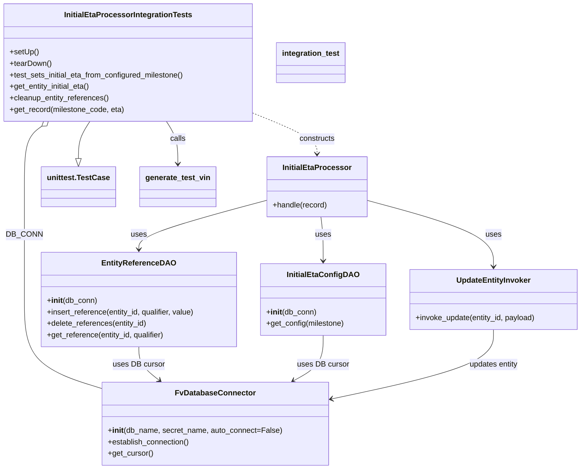
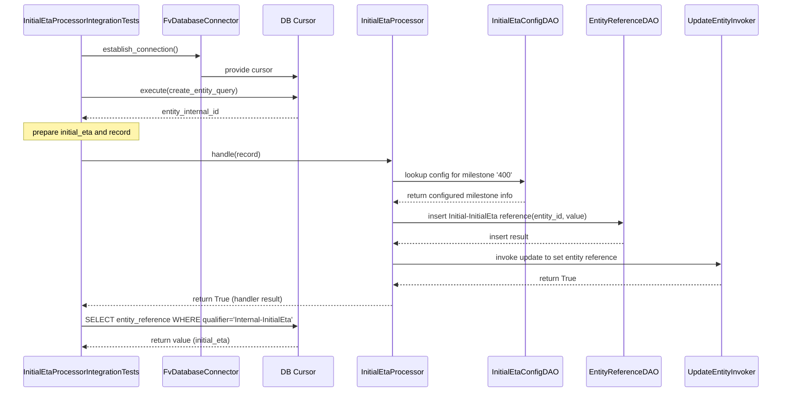

# Diagram: entity_core/entity_service/entity_listener/tests/integration/test_initial_eta_processor.py

> Auto-generated by Obscura crawlers

## Diagram 1

### SVG

<svg id="container" width="1228.13671875" xmlns="http://www.w3.org/2000/svg" class="classDiagram" height="982" viewBox="0 0 1228.13671875 982" role="graphics-document document" aria-roledescription="class"><g><defs><marker id="container_class-aggregationStart" class="marker aggregation class" refX="18" refY="7" markerWidth="190" markerHeight="240" orient="auto"><path d="M 18,7 L9,13 L1,7 L9,1 Z"></path></marker></defs><defs><marker id="container_class-aggregationEnd" class="marker aggregation class" refX="1" refY="7" markerWidth="20" markerHeight="28" orient="auto"><path d="M 18,7 L9,13 L1,7 L9,1 Z"></path></marker></defs><defs><marker id="container_class-extensionStart" class="marker extension class" refX="18" refY="7" markerWidth="190" markerHeight="240" orient="auto"><path d="M 1,7 L18,13 V 1 Z"></path></marker></defs><defs><marker id="container_class-extensionEnd" class="marker extension class" refX="1" refY="7" markerWidth="20" markerHeight="28" orient="auto"><path d="M 1,1 V 13 L18,7 Z"></path></marker></defs><defs><marker id="container_class-compositionStart" class="marker composition class" refX="18" refY="7" markerWidth="190" markerHeight="240" orient="auto"><path d="M 18,7 L9,13 L1,7 L9,1 Z"></path></marker></defs><defs><marker id="container_class-compositionEnd" class="marker composition class" refX="1" refY="7" markerWidth="20" markerHeight="28" orient="auto"><path d="M 18,7 L9,13 L1,7 L9,1 Z"></path></marker></defs><defs><marker id="container_class-dependencyStart" class="marker dependency class" refX="6" refY="7" markerWidth="190" markerHeight="240" orient="auto"><path d="M 5,7 L9,13 L1,7 L9,1 Z"></path></marker></defs><defs><marker id="container_class-dependencyEnd" class="marker dependency class" refX="13" refY="7" markerWidth="20" markerHeight="28" orient="auto"><path d="M 18,7 L9,13 L14,7 L9,1 Z"></path></marker></defs><defs><marker id="container_class-lollipopStart" class="marker lollipop class" refX="13" refY="7" markerWidth="190" markerHeight="240" orient="auto"><circle stroke="black" fill="transparent" cx="7" cy="7" r="6"></circle></marker></defs><defs><marker id="container_class-lollipopEnd" class="marker lollipop class" refX="1" refY="7" markerWidth="190" markerHeight="240" orient="auto"><circle stroke="black" fill="transparent" cx="7" cy="7" r="6"></circle></marker></defs><g class="root"><g class="clusters"></g><g class="edgePaths"><path d="M681.445,454L682.252,460.167C683.058,466.333,684.672,478.667,685.478,494C686.285,509.333,686.285,527.667,686.285,536.833L686.285,546" id="id_InitialEtaProcessor_InitialEtaConfigDAO_1" class="edge-thickness-normal edge-pattern-solid relation" style=";;;" data-edge="true" data-et="edge" data-id="id_InitialEtaProcessor_InitialEtaConfigDAO_1" data-points="W3sieCI6NjgxLjQ0NDgwNDY4NzUsInkiOjQ1NH0seyJ4Ijo2ODYuMjg1MTU2MjUsInkiOjQ5MX0seyJ4Ijo2ODYuMjg1MTU2MjUsInkiOjU1Mn1d" marker-end="url(#container_class-dependencyEnd)"></path><path d="M569.371,418.854L524.548,430.878C479.724,442.903,390.077,466.951,345.253,484.142C300.43,501.333,300.43,511.667,300.43,516.833L300.43,522" id="id_InitialEtaProcessor_EntityReferenceDAO_2" class="edge-thickness-normal edge-pattern-solid relation" style=";;;" data-edge="true" data-et="edge" data-id="id_InitialEtaProcessor_EntityReferenceDAO_2" data-points="W3sieCI6NTY5LjM3MTA5Mzc1LCJ5Ijo0MTguODUzOTI0MzQyNDQ5OTR9LHsieCI6MzAwLjQyOTY4NzUsInkiOjQ5MX0seyJ4IjozMDAuNDI5Njg3NSwieSI6NTI4fV0=" marker-end="url(#container_class-dependencyEnd)"></path><path d="M777.035,419.074L821.372,431.061C865.71,443.049,954.384,467.025,998.721,490.179C1043.059,513.333,1043.059,535.667,1043.059,546.833L1043.059,558" id="id_InitialEtaProcessor_UpdateEntityInvoker_3" class="edge-thickness-normal edge-pattern-solid relation" style=";;;" data-edge="true" data-et="edge" data-id="id_InitialEtaProcessor_UpdateEntityInvoker_3" data-points="W3sieCI6Nzc3LjAzNTE1NjI1LCJ5Ijo0MTkuMDczNjc3NDI4ODk0M30seyJ4IjoxMDQzLjA1ODU5Mzc1LCJ5Ijo0OTF9LHsieCI6MTA0My4wNTg1OTM3NSwieSI6NTY0fV0=" marker-end="url(#container_class-dependencyEnd)"></path><path d="M94.27,264.43L88.437,268.858C82.603,273.287,70.936,282.143,65.103,303.238C59.27,324.333,59.27,357.667,59.27,391C59.27,424.333,59.27,457.667,59.27,497C59.27,536.333,59.27,581.667,59.27,627C59.27,672.333,59.27,717.667,86.127,748.795C112.985,779.924,166.701,796.848,193.558,805.309L220.416,813.771" id="id_InitialEtaProcessorIntegrationTests_FvDatabaseConnector_4" class="edge-thickness-normal edge-pattern-solid relation" style=";;;" data-edge="true" data-et="edge" data-id="id_InitialEtaProcessorIntegrationTests_FvDatabaseConnector_4" data-points="W3sieCI6MTA4LjAwOTk4NTM1MTU2MjUsInkiOjI1NH0seyJ4Ijo1OS4yNjk1MzEyNSwieSI6MjkxfSx7IngiOjU5LjI2OTUzMTI1LCJ5IjozOTF9LHsieCI6NTkuMjY5NTMxMjUsInkiOjQ5MX0seyJ4Ijo1OS4yNjk1MzEyNSwieSI6NjI3fSx7IngiOjU5LjI2OTUzMTI1LCJ5Ijo3NjN9LHsieCI6MjIwLjQxNjAxNTYyNSwieSI6ODEzLjc3MTI3MDc2MjA5OTl9XQ==" marker-start="url(#container_class-aggregationStart)"></path><path d="M347.728,254L351.623,260.167C355.518,266.333,363.308,278.667,367.203,293.5C371.098,308.333,371.098,325.667,371.098,334.333L371.098,343" id="id_InitialEtaProcessorIntegrationTests_generate_test_vin_5" class="edge-thickness-normal edge-pattern-solid relation" style=";;;" data-edge="true" data-et="edge" data-id="id_InitialEtaProcessorIntegrationTests_generate_test_vin_5" data-points="W3sieCI6MzQ3LjcyNzg1NjQ0NTMxMjUsInkiOjI1NH0seyJ4IjozNzEuMDk3NjU2MjUsInkiOjI5MX0seyJ4IjozNzEuMDk3NjU2MjUsInkiOjM0OX1d" marker-end="url(#container_class-dependencyEnd)"></path><path d="M192.35,254L188.455,260.167C184.56,266.333,176.77,278.667,172.875,291.625C168.98,304.583,168.98,318.167,168.98,324.958L168.98,331.75" id="id_InitialEtaProcessorIntegrationTests_unittest.TestCase_6" class="edge-thickness-normal edge-pattern-solid relation" style=";;;" data-edge="true" data-et="edge" data-id="id_InitialEtaProcessorIntegrationTests_unittest.TestCase_6" data-points="W3sieCI6MTkyLjM1MDI2ODU1NDY4NzUsInkiOjI1NH0seyJ4IjoxNjguOTgwNDY4NzUsInkiOjI5MX0seyJ4IjoxNjguOTgwNDY4NzUsInkiOjM0OX1d" marker-end="url(#container_class-extensionEnd)"></path><path d="M532.078,234.993L555.599,244.328C579.12,253.662,626.161,272.331,649.682,286.832C673.203,301.333,673.203,311.667,673.203,316.833L673.203,322" id="id_InitialEtaProcessorIntegrationTests_InitialEtaProcessor_7" class="edge-thickness-normal edge-pattern-dashed relation" style=";;;" data-edge="true" data-et="edge" data-id="id_InitialEtaProcessorIntegrationTests_InitialEtaProcessor_7" data-points="W3sieCI6NTMyLjA3ODEyNSwieSI6MjM0Ljk5MzAyMzkzMTc4OTU0fSx7IngiOjY3My4yMDMxMjUsInkiOjI5MX0seyJ4Ijo2NzMuMjAzMTI1LCJ5IjozMjh9XQ==" marker-end="url(#container_class-dependencyEnd)"></path><path d="M300.43,726L300.43,732.167C300.43,738.333,300.43,750.667,307.234,762.369C314.038,774.071,327.645,785.142,334.449,790.678L341.253,796.213" id="id_EntityReferenceDAO_FvDatabaseConnector_8" class="edge-thickness-normal edge-pattern-solid relation" style=";;;" data-edge="true" data-et="edge" data-id="id_EntityReferenceDAO_FvDatabaseConnector_8" data-points="W3sieCI6MzAwLjQyOTY4NzUsInkiOjcyNn0seyJ4IjozMDAuNDI5Njg3NSwieSI6NzYzfSx7IngiOjM0NS45MDc0OTQzMjk2MzcxLCJ5Ijo4MDB9XQ==" marker-end="url(#container_class-dependencyEnd)"></path><path d="M686.285,702L686.285,712.167C686.285,722.333,686.285,742.667,675.559,758.531C664.833,774.395,643.38,785.79,632.654,791.488L621.928,797.185" id="id_InitialEtaConfigDAO_FvDatabaseConnector_9" class="edge-thickness-normal edge-pattern-solid relation" style=";;;" data-edge="true" data-et="edge" data-id="id_InitialEtaConfigDAO_FvDatabaseConnector_9" data-points="W3sieCI6Njg2LjI4NTE1NjI1LCJ5Ijo3MDJ9LHsieCI6Njg2LjI4NTE1NjI1LCJ5Ijo3NjN9LHsieCI6NjE2LjYyODY2OTk4NDg3OSwieSI6ODAwfV0=" marker-end="url(#container_class-dependencyEnd)"></path><path d="M1043.059,690L1043.059,702.167C1043.059,714.333,1043.059,738.667,984.405,763.156C925.752,787.645,808.446,812.29,749.793,824.613L691.139,836.936" id="id_UpdateEntityInvoker_FvDatabaseConnector_10" class="edge-thickness-normal edge-pattern-solid relation" style=";;;" data-edge="true" data-et="edge" data-id="id_UpdateEntityInvoker_FvDatabaseConnector_10" data-points="W3sieCI6MTA0My4wNTg1OTM3NSwieSI6NjkwfSx7IngiOjEwNDMuMDU4NTkzNzUsInkiOjc2M30seyJ4Ijo2ODUuMjY3NTc4MTI1LCJ5Ijo4MzguMTY5MTM0NzUyNTI0MX1d" marker-end="url(#container_class-dependencyEnd)"></path></g><g class="edgeLabels"><g class="edgeLabel" transform="translate(686.28515625, 491)"><g class="label" data-id="id_InitialEtaProcessor_InitialEtaConfigDAO_1" transform="translate(-16.4921875, -12)"><foreignObject width="32.984375" height="24">

uses

</foreignObject></g></g><g class="edgeLabel" transform="translate(300.4296875, 491)"><g class="label" data-id="id_InitialEtaProcessor_EntityReferenceDAO_2" transform="translate(-16.4921875, -12)"><foreignObject width="32.984375" height="24">

uses

</foreignObject></g></g><g class="edgeLabel" transform="translate(1043.05859375, 491)"><g class="label" data-id="id_InitialEtaProcessor_UpdateEntityInvoker_3" transform="translate(-16.4921875, -12)"><foreignObject width="32.984375" height="24">

uses

</foreignObject></g></g><g class="edgeLabel" transform="translate(59.26953125, 491)"><g class="label" data-id="id_InitialEtaProcessorIntegrationTests_FvDatabaseConnector_4" transform="translate(-34.484375, -12)"><foreignObject width="68.96875" height="24">

DB_CONN

</foreignObject></g></g><g class="edgeLabel" transform="translate(371.09765625, 291)"><g class="label" data-id="id_InitialEtaProcessorIntegrationTests_generate_test_vin_5" transform="translate(-16.4453125, -12)"><foreignObject width="32.890625" height="24">

calls

</foreignObject></g></g><g class="edgeLabel"><g class="label" data-id="id_InitialEtaProcessorIntegrationTests_unittest.TestCase_6" transform="translate(0, 0)"><foreignObject width="0" height="0">

</foreignObject></g></g><g class="edgeLabel" transform="translate(673.203125, 291)"><g class="label" data-id="id_InitialEtaProcessorIntegrationTests_InitialEtaProcessor_7" transform="translate(-37.84375, -12)"><foreignObject width="75.6875" height="24">

constructs

</foreignObject></g></g><g class="edgeLabel" transform="translate(300.4296875, 763)"><g class="label" data-id="id_EntityReferenceDAO_FvDatabaseConnector_8" transform="translate(-53.609375, -12)"><foreignObject width="107.21875" height="24">

uses DB cursor

</foreignObject></g></g><g class="edgeLabel" transform="translate(686.28515625, 763)"><g class="label" data-id="id_InitialEtaConfigDAO_FvDatabaseConnector_9" transform="translate(-53.609375, -12)"><foreignObject width="107.21875" height="24">

uses DB cursor

</foreignObject></g></g><g class="edgeLabel" transform="translate(1043.05859375, 763)"><g class="label" data-id="id_UpdateEntityInvoker_FvDatabaseConnector_10" transform="translate(-52.5078125, -12)"><foreignObject width="105.015625" height="24">

updates entity

</foreignObject></g></g></g><g class="nodes"><g class="node default" id="classId-InitialEtaProcessor-0" transform="translate(673.203125, 391)"><g class="basic label-container"><path d="M-103.83203125 -63 L103.83203125 -63 L103.83203125 63 L-103.83203125 63" stroke="none" stroke-width="0" fill="#ECECFF" style=""></path><path d="M-103.83203125 -63 C-54.62154232787817 -63, -5.411053405756334 -63, 103.83203125 -63 M-103.83203125 -63 C-42.58650152703361 -63, 18.659028195932777 -63, 103.83203125 -63 M103.83203125 -63 C103.83203125 -21.223942201234856, 103.83203125 20.55211559753029, 103.83203125 63 M103.83203125 -63 C103.83203125 -26.035651836036507, 103.83203125 10.928696327926986, 103.83203125 63 M103.83203125 63 C37.949862499586416 63, -27.932306250827168 63, -103.83203125 63 M103.83203125 63 C30.285252133775472 63, -43.261526982449055 63, -103.83203125 63 M-103.83203125 63 C-103.83203125 20.256236523527335, -103.83203125 -22.48752695294533, -103.83203125 -63 M-103.83203125 63 C-103.83203125 22.907691589783056, -103.83203125 -17.184616820433888, -103.83203125 -63" stroke="#9370DB" stroke-width="1.3" fill="none" stroke-dasharray="0 0" style=""></path></g><g class="annotation-group text" transform="translate(0, -39)"></g><g class="label-group text" transform="translate(-68.6015625, -39)"><g class="label" style="font-weight: bolder" transform="translate(0,-12)"><foreignObject width="137.203125" height="24">

InitialEtaProcessor

</foreignObject></g></g><g class="members-group text" transform="translate(-91.83203125, 9)"></g><g class="methods-group text" transform="translate(-91.83203125, 39)"><g class="label" style="" transform="translate(0,-12)"><foreignObject width="115.0625" height="24">

+handle(record)

</foreignObject></g></g><g class="divider" style=""><path d="M-103.83203125 -15 C-41.305522847399935 -15, 21.22098555520013 -15, 103.83203125 -15 M-103.83203125 -15 C-22.137768812114388 -15, 59.556493625771225 -15, 103.83203125 -15" stroke="#9370DB" stroke-width="1.3" fill="none" stroke-dasharray="0 0" style=""></path></g><g class="divider" style=""><path d="M-103.83203125 9 C-21.18955539924896 9, 61.45292045150208 9, 103.83203125 9 M-103.83203125 9 C-61.49939470276488 9, -19.166758155529763 9, 103.83203125 9" stroke="#9370DB" stroke-width="1.3" fill="none" stroke-dasharray="0 0" style=""></path></g></g><g class="node default" id="classId-InitialEtaConfigDAO-1" transform="translate(686.28515625, 627)"><g class="basic label-container"><path d="M-129.6953125 -75 L129.6953125 -75 L129.6953125 75 L-129.6953125 75" stroke="none" stroke-width="0" fill="#ECECFF" style=""></path><path d="M-129.6953125 -75 C-46.36309232013569 -75, 36.969127859728616 -75, 129.6953125 -75 M-129.6953125 -75 C-58.84852399001106 -75, 11.99826451997788 -75, 129.6953125 -75 M129.6953125 -75 C129.6953125 -25.628944073780794, 129.6953125 23.742111852438413, 129.6953125 75 M129.6953125 -75 C129.6953125 -23.738665424151336, 129.6953125 27.52266915169733, 129.6953125 75 M129.6953125 75 C50.88197855185845 75, -27.931355396283095 75, -129.6953125 75 M129.6953125 75 C67.27952909000687 75, 4.86374568001375 75, -129.6953125 75 M-129.6953125 75 C-129.6953125 43.507332116636945, -129.6953125 12.014664233273884, -129.6953125 -75 M-129.6953125 75 C-129.6953125 19.85873887173141, -129.6953125 -35.28252225653718, -129.6953125 -75" stroke="#9370DB" stroke-width="1.3" fill="none" stroke-dasharray="0 0" style=""></path></g><g class="annotation-group text" transform="translate(0, -51)"></g><g class="label-group text" transform="translate(-70.90625, -51)"><g class="label" style="font-weight: bolder" transform="translate(0,-12)"><foreignObject width="141.8125" height="24">

InitialEtaConfigDAO

</foreignObject></g></g><g class="members-group text" transform="translate(-117.6953125, -3)"></g><g class="methods-group text" transform="translate(-117.6953125, 27)"><g class="label" style="" transform="translate(0,-12)"><foreignObject width="104.96875" height="24">

+<strong>init</strong>(db_conn)

</foreignObject></g><g class="label" style="" transform="translate(0,12)"><foreignObject width="164.484375" height="24">

+get_config(milestone)

</foreignObject></g></g><g class="divider" style=""><path d="M-129.6953125 -27 C-28.47036926829398 -27, 72.75457396341204 -27, 129.6953125 -27 M-129.6953125 -27 C-51.46748145164385 -27, 26.760349596712302 -27, 129.6953125 -27" stroke="#9370DB" stroke-width="1.3" fill="none" stroke-dasharray="0 0" style=""></path></g><g class="divider" style=""><path d="M-129.6953125 -3 C-32.87489367934697 -3, 63.945525141306064 -3, 129.6953125 -3 M-129.6953125 -3 C-58.5273243966227 -3, 12.640663706754594 -3, 129.6953125 -3" stroke="#9370DB" stroke-width="1.3" fill="none" stroke-dasharray="0 0" style=""></path></g></g><g class="node default" id="classId-EntityReferenceDAO-2" transform="translate(300.4296875, 627)"><g class="basic label-container"><path d="M-206.16015625 -99 L206.16015625 -99 L206.16015625 99 L-206.16015625 99" stroke="none" stroke-width="0" fill="#ECECFF" style=""></path><path d="M-206.16015625 -99 C-45.84994457767576 -99, 114.46026709464849 -99, 206.16015625 -99 M-206.16015625 -99 C-72.9751634595145 -99, 60.20982933097099 -99, 206.16015625 -99 M206.16015625 -99 C206.16015625 -31.420056695572327, 206.16015625 36.159886608855345, 206.16015625 99 M206.16015625 -99 C206.16015625 -22.396812680832696, 206.16015625 54.20637463833461, 206.16015625 99 M206.16015625 99 C110.54203017887669 99, 14.923904107753373 99, -206.16015625 99 M206.16015625 99 C99.75376879519017 99, -6.652618659619662 99, -206.16015625 99 M-206.16015625 99 C-206.16015625 56.22282687276883, -206.16015625 13.445653745537655, -206.16015625 -99 M-206.16015625 99 C-206.16015625 36.66124041596962, -206.16015625 -25.677519168060755, -206.16015625 -99" stroke="#9370DB" stroke-width="1.3" fill="none" stroke-dasharray="0 0" style=""></path></g><g class="annotation-group text" transform="translate(0, -75)"></g><g class="label-group text" transform="translate(-73.0859375, -75)"><g class="label" style="font-weight: bolder" transform="translate(0,-12)"><foreignObject width="146.171875" height="24">

EntityReferenceDAO

</foreignObject></g></g><g class="members-group text" transform="translate(-194.16015625, -27)"></g><g class="methods-group text" transform="translate(-194.16015625, 3)"><g class="label" style="" transform="translate(0,-12)"><foreignObject width="104.96875" height="24">

+<strong>init</strong>(db_conn)

</foreignObject></g><g class="label" style="" transform="translate(0,12)"><foreignObject width="315.234375" height="24">

+insert_reference(entity_id, qualifier, value)

</foreignObject></g><g class="label" style="" transform="translate(0,36)"><foreignObject width="211.75" height="24">

+delete_references(entity_id)

</foreignObject></g><g class="label" style="" transform="translate(0,60)"><foreignObject width="250.09375" height="24">

+get_reference(entity_id, qualifier)

</foreignObject></g></g><g class="divider" style=""><path d="M-206.16015625 -51 C-122.18189417271925 -51, -38.20363209543851 -51, 206.16015625 -51 M-206.16015625 -51 C-72.15497207257513 -51, 61.85021210484973 -51, 206.16015625 -51" stroke="#9370DB" stroke-width="1.3" fill="none" stroke-dasharray="0 0" style=""></path></g><g class="divider" style=""><path d="M-206.16015625 -27 C-42.72826462495934 -27, 120.70362700008133 -27, 206.16015625 -27 M-206.16015625 -27 C-68.14012657699428 -27, 69.87990309601145 -27, 206.16015625 -27" stroke="#9370DB" stroke-width="1.3" fill="none" stroke-dasharray="0 0" style=""></path></g></g><g class="node default" id="classId-UpdateEntityInvoker-3" transform="translate(1043.05859375, 627)"><g class="basic label-container"><path d="M-177.078125 -63 L177.078125 -63 L177.078125 63 L-177.078125 63" stroke="none" stroke-width="0" fill="#ECECFF" style=""></path><path d="M-177.078125 -63 C-41.76967116293571 -63, 93.53878267412858 -63, 177.078125 -63 M-177.078125 -63 C-48.323304796732685 -63, 80.43151540653463 -63, 177.078125 -63 M177.078125 -63 C177.078125 -16.104504318458346, 177.078125 30.790991363083307, 177.078125 63 M177.078125 -63 C177.078125 -33.51035771656531, 177.078125 -4.020715433130626, 177.078125 63 M177.078125 63 C82.40458243499583 63, -12.268960130008338 63, -177.078125 63 M177.078125 63 C69.17696120263952 63, -38.724202594720964 63, -177.078125 63 M-177.078125 63 C-177.078125 35.45629376223243, -177.078125 7.912587524464854, -177.078125 -63 M-177.078125 63 C-177.078125 15.031626930412834, -177.078125 -32.93674613917433, -177.078125 -63" stroke="#9370DB" stroke-width="1.3" fill="none" stroke-dasharray="0 0" style=""></path></g><g class="annotation-group text" transform="translate(0, -39)"></g><g class="label-group text" transform="translate(-75.375, -39)"><g class="label" style="font-weight: bolder" transform="translate(0,-12)"><foreignObject width="150.75" height="24">

UpdateEntityInvoker

</foreignObject></g></g><g class="members-group text" transform="translate(-165.078125, 9)"></g><g class="methods-group text" transform="translate(-165.078125, 39)"><g class="label" style="" transform="translate(0,-12)"><foreignObject width="254.78125" height="24">

+invoke_update(entity_id, payload)

</foreignObject></g></g><g class="divider" style=""><path d="M-177.078125 -15 C-44.53170072155899 -15, 88.01472355688202 -15, 177.078125 -15 M-177.078125 -15 C-78.83174313717112 -15, 19.414638725657767 -15, 177.078125 -15" stroke="#9370DB" stroke-width="1.3" fill="none" stroke-dasharray="0 0" style=""></path></g><g class="divider" style=""><path d="M-177.078125 9 C-104.35491283966574 9, -31.631700679331487 9, 177.078125 9 M-177.078125 9 C-89.22462716996853 9, -1.371129339937056 9, 177.078125 9" stroke="#9370DB" stroke-width="1.3" fill="none" stroke-dasharray="0 0" style=""></path></g></g><g class="node default" id="classId-FvDatabaseConnector-4" transform="translate(452.841796875, 887)"><g class="basic label-container"><path d="M-232.42578125 -87 L232.42578125 -87 L232.42578125 87 L-232.42578125 87" stroke="none" stroke-width="0" fill="#ECECFF" style=""></path><path d="M-232.42578125 -87 C-99.98138752773687 -87, 32.46300619452626 -87, 232.42578125 -87 M-232.42578125 -87 C-96.70213464875928 -87, 39.02151195248143 -87, 232.42578125 -87 M232.42578125 -87 C232.42578125 -37.5424359754293, 232.42578125 11.915128049141401, 232.42578125 87 M232.42578125 -87 C232.42578125 -20.36841334296652, 232.42578125 46.26317331406696, 232.42578125 87 M232.42578125 87 C110.56113683118491 87, -11.303507587630179 87, -232.42578125 87 M232.42578125 87 C135.03033966043077 87, 37.63489807086154 87, -232.42578125 87 M-232.42578125 87 C-232.42578125 33.33116370736837, -232.42578125 -20.337672585263263, -232.42578125 -87 M-232.42578125 87 C-232.42578125 33.80972622740922, -232.42578125 -19.380547545181557, -232.42578125 -87" stroke="#9370DB" stroke-width="1.3" fill="none" stroke-dasharray="0 0" style=""></path></g><g class="annotation-group text" transform="translate(0, -63)"></g><g class="label-group text" transform="translate(-79.3046875, -63)"><g class="label" style="font-weight: bolder" transform="translate(0,-12)"><foreignObject width="158.609375" height="24">

FvDatabaseConnector

</foreignObject></g></g><g class="members-group text" transform="translate(-220.42578125, -15)"></g><g class="methods-group text" transform="translate(-220.42578125, 15)"><g class="label" style="" transform="translate(0,-12)"><foreignObject width="361.546875" height="24">

+<strong>init</strong>(db_name, secret_name, auto_connect=False)

</foreignObject></g><g class="label" style="" transform="translate(0,12)"><foreignObject width="173.265625" height="24">

+establish_connection()

</foreignObject></g><g class="label" style="" transform="translate(0,36)"><foreignObject width="94.640625" height="24">

+get_cursor()

</foreignObject></g></g><g class="divider" style=""><path d="M-232.42578125 -39 C-139.3817696234497 -39, -46.3377579968994 -39, 232.42578125 -39 M-232.42578125 -39 C-77.96481432199022 -39, 76.49615260601956 -39, 232.42578125 -39" stroke="#9370DB" stroke-width="1.3" fill="none" stroke-dasharray="0 0" style=""></path></g><g class="divider" style=""><path d="M-232.42578125 -15 C-92.44736154998074 -15, 47.53105815003852 -15, 232.42578125 -15 M-232.42578125 -15 C-134.9983970108318 -15, -37.571012771663646 -15, 232.42578125 -15" stroke="#9370DB" stroke-width="1.3" fill="none" stroke-dasharray="0 0" style=""></path></g></g><g class="node default" id="classId-InitialEtaProcessorIntegrationTests-5" transform="translate(270.0390625, 131)"><g class="basic label-container"><path d="M-262.0390625 -123 L262.0390625 -123 L262.0390625 123 L-262.0390625 123" stroke="none" stroke-width="0" fill="#ECECFF" style=""></path><path d="M-262.0390625 -123 C-148.9854292617606 -123, -35.93179602352123 -123, 262.0390625 -123 M-262.0390625 -123 C-114.72415130903158 -123, 32.59075988193683 -123, 262.0390625 -123 M262.0390625 -123 C262.0390625 -46.7212991378926, 262.0390625 29.5574017242148, 262.0390625 123 M262.0390625 -123 C262.0390625 -38.46838430670411, 262.0390625 46.06323138659178, 262.0390625 123 M262.0390625 123 C70.56643094965943 123, -120.90620060068113 123, -262.0390625 123 M262.0390625 123 C91.07529337758208 123, -79.88847574483583 123, -262.0390625 123 M-262.0390625 123 C-262.0390625 57.35264732265995, -262.0390625 -8.294705354680104, -262.0390625 -123 M-262.0390625 123 C-262.0390625 69.48680162353918, -262.0390625 15.973603247078373, -262.0390625 -123" stroke="#9370DB" stroke-width="1.3" fill="none" stroke-dasharray="0 0" style=""></path></g><g class="annotation-group text" transform="translate(0, -99)"></g><g class="label-group text" transform="translate(-128.390625, -99)"><g class="label" style="font-weight: bolder" transform="translate(0,-12)"><foreignObject width="256.78125" height="24">

InitialEtaProcessorIntegrationTests

</foreignObject></g></g><g class="members-group text" transform="translate(-250.0390625, -51)"></g><g class="methods-group text" transform="translate(-250.0390625, -21)"><g class="label" style="" transform="translate(0,-12)"><foreignObject width="60.421875" height="24">

+setUp()

</foreignObject></g><g class="label" style="" transform="translate(0,12)"><foreignObject width="87.75" height="24">

+tearDown()

</foreignObject></g><g class="label" style="" transform="translate(0,36)"><foreignObject width="371.6875" height="24">

+test_sets_initial_eta_from_configured_milestone()

</foreignObject></g><g class="label" style="" transform="translate(0,60)"><foreignObject width="171.71875" height="24">

+get_entity_initial_eta()

</foreignObject></g><g class="label" style="" transform="translate(0,84)"><foreignObject width="209.1875" height="24">

+cleanup_entity_references()

</foreignObject></g><g class="label" style="" transform="translate(0,108)"><foreignObject width="241.234375" height="24">

+get_record(milestone_code, eta)

</foreignObject></g></g><g class="divider" style=""><path d="M-262.0390625 -75 C-151.13706534483828 -75, -40.235068189676554 -75, 262.0390625 -75 M-262.0390625 -75 C-94.83293025400857 -75, 72.37320199198285 -75, 262.0390625 -75" stroke="#9370DB" stroke-width="1.3" fill="none" stroke-dasharray="0 0" style=""></path></g><g class="divider" style=""><path d="M-262.0390625 -51 C-133.60445619712752 -51, -5.169849894255037 -51, 262.0390625 -51 M-262.0390625 -51 C-143.43823426328106 -51, -24.837406026562093 -51, 262.0390625 -51" stroke="#9370DB" stroke-width="1.3" fill="none" stroke-dasharray="0 0" style=""></path></g></g><g class="node default" id="classId-unittest.TestCase-6" transform="translate(168.98046875, 391)"><g class="basic label-container"><path d="M-74.7109375 -42 L74.7109375 -42 L74.7109375 42 L-74.7109375 42" stroke="none" stroke-width="0" fill="#ECECFF" style=""></path><path d="M-74.7109375 -42 C-17.375515037525766 -42, 39.95990742494847 -42, 74.7109375 -42 M-74.7109375 -42 C-24.292907834778568 -42, 26.125121830442865 -42, 74.7109375 -42 M74.7109375 -42 C74.7109375 -16.609694119668223, 74.7109375 8.780611760663554, 74.7109375 42 M74.7109375 -42 C74.7109375 -13.99703947231341, 74.7109375 14.005921055373179, 74.7109375 42 M74.7109375 42 C35.47949497029038 42, -3.7519475594192357 42, -74.7109375 42 M74.7109375 42 C33.636059214981614 42, -7.438819070036772 42, -74.7109375 42 M-74.7109375 42 C-74.7109375 23.07832504821031, -74.7109375 4.15665009642062, -74.7109375 -42 M-74.7109375 42 C-74.7109375 21.158037987139842, -74.7109375 0.31607597427968415, -74.7109375 -42" stroke="#9370DB" stroke-width="1.3" fill="none" stroke-dasharray="0 0" style=""></path></g><g class="annotation-group text" transform="translate(0, -18)"></g><g class="label-group text" transform="translate(-62.7109375, -18)"><g class="label" style="font-weight: bolder" transform="translate(0,-12)"><foreignObject width="125.421875" height="24">

unittest.TestCase

</foreignObject></g></g><g class="members-group text" transform="translate(-62.7109375, 30)"></g><g class="methods-group text" transform="translate(-62.7109375, 60)"></g><g class="divider" style=""><path d="M-74.7109375 6 C-31.04389527897748 6, 12.62314694204504 6, 74.7109375 6 M-74.7109375 6 C-26.589457212770753 6, 21.532023074458493 6, 74.7109375 6" stroke="#9370DB" stroke-width="1.3" fill="none" stroke-dasharray="0 0" style=""></path></g><g class="divider" style=""><path d="M-74.7109375 24 C-26.02890814807226 24, 22.653121203855477 24, 74.7109375 24 M-74.7109375 24 C-29.123876272532925 24, 16.46318495493415 24, 74.7109375 24" stroke="#9370DB" stroke-width="1.3" fill="none" stroke-dasharray="0 0" style=""></path></g></g><g class="node default" id="classId-integration_test-7" transform="translate(652.9765625, 131)"><g class="basic label-container"><path d="M-70.8984375 -42 L70.8984375 -42 L70.8984375 42 L-70.8984375 42" stroke="none" stroke-width="0" fill="#ECECFF" style=""></path><path d="M-70.8984375 -42 C-35.545145750257106 -42, -0.19185400051421198 -42, 70.8984375 -42 M-70.8984375 -42 C-40.64972590807748 -42, -10.401014316154956 -42, 70.8984375 -42 M70.8984375 -42 C70.8984375 -24.986288865636983, 70.8984375 -7.972577731273965, 70.8984375 42 M70.8984375 -42 C70.8984375 -20.71811753485823, 70.8984375 0.5637649302835399, 70.8984375 42 M70.8984375 42 C22.43212754426527 42, -26.03418241146946 42, -70.8984375 42 M70.8984375 42 C23.625679587378464 42, -23.647078325243072 42, -70.8984375 42 M-70.8984375 42 C-70.8984375 9.378944538974388, -70.8984375 -23.242110922051225, -70.8984375 -42 M-70.8984375 42 C-70.8984375 25.06699077480694, -70.8984375 8.133981549613878, -70.8984375 -42" stroke="#9370DB" stroke-width="1.3" fill="none" stroke-dasharray="0 0" style=""></path></g><g class="annotation-group text" transform="translate(0, -18)"></g><g class="label-group text" transform="translate(-58.8984375, -18)"><g class="label" style="font-weight: bolder" transform="translate(0,-12)"><foreignObject width="117.796875" height="24">

integration_test

</foreignObject></g></g><g class="members-group text" transform="translate(-58.8984375, 30)"></g><g class="methods-group text" transform="translate(-58.8984375, 60)"></g><g class="divider" style=""><path d="M-70.8984375 6 C-35.16392510588777 6, 0.5705872882244591 6, 70.8984375 6 M-70.8984375 6 C-16.798121499522253 6, 37.302194500955494 6, 70.8984375 6" stroke="#9370DB" stroke-width="1.3" fill="none" stroke-dasharray="0 0" style=""></path></g><g class="divider" style=""><path d="M-70.8984375 24 C-29.466166251046943 24, 11.966104997906115 24, 70.8984375 24 M-70.8984375 24 C-36.24922344182619 24, -1.6000093836523774 24, 70.8984375 24" stroke="#9370DB" stroke-width="1.3" fill="none" stroke-dasharray="0 0" style=""></path></g></g><g class="node default" id="classId-generate_test_vin-8" transform="translate(371.09765625, 391)"><g class="basic label-container"><path d="M-77.40625 -42 L77.40625 -42 L77.40625 42 L-77.40625 42" stroke="none" stroke-width="0" fill="#ECECFF" style=""></path><path d="M-77.40625 -42 C-15.935905535470106 -42, 45.53443892905979 -42, 77.40625 -42 M-77.40625 -42 C-15.733762858515206 -42, 45.93872428296959 -42, 77.40625 -42 M77.40625 -42 C77.40625 -11.929046009902557, 77.40625 18.141907980194887, 77.40625 42 M77.40625 -42 C77.40625 -20.267437076497004, 77.40625 1.465125847005993, 77.40625 42 M77.40625 42 C38.86135939544598 42, 0.31646879089196034 42, -77.40625 42 M77.40625 42 C39.98687167960404 42, 2.567493359208086 42, -77.40625 42 M-77.40625 42 C-77.40625 24.783481928639063, -77.40625 7.566963857278125, -77.40625 -42 M-77.40625 42 C-77.40625 24.031189516392068, -77.40625 6.062379032784136, -77.40625 -42" stroke="#9370DB" stroke-width="1.3" fill="none" stroke-dasharray="0 0" style=""></path></g><g class="annotation-group text" transform="translate(0, -18)"></g><g class="label-group text" transform="translate(-65.40625, -18)"><g class="label" style="font-weight: bolder" transform="translate(0,-12)"><foreignObject width="130.8125" height="24">

generate_test_vin

</foreignObject></g></g><g class="members-group text" transform="translate(-65.40625, 30)"></g><g class="methods-group text" transform="translate(-65.40625, 60)"></g><g class="divider" style=""><path d="M-77.40625 6 C-39.88708666378796 6, -2.367923327575923 6, 77.40625 6 M-77.40625 6 C-33.16114269319999 6, 11.083964613600017 6, 77.40625 6" stroke="#9370DB" stroke-width="1.3" fill="none" stroke-dasharray="0 0" style=""></path></g><g class="divider" style=""><path d="M-77.40625 24 C-41.04797597155048 24, -4.689701943100957 24, 77.40625 24 M-77.40625 24 C-28.474205405437814 24, 20.45783918912437 24, 77.40625 24" stroke="#9370DB" stroke-width="1.3" fill="none" stroke-dasharray="0 0" style=""></path></g></g></g></g></g></svg>

## Diagram 2

### SVG

<svg id="container" width="1746" xmlns="http://www.w3.org/2000/svg" height="892" viewBox="-50 -10 1746 892" role="graphics-document document" aria-roledescription="sequence"><g><rect x="1477" y="806" fill="#eaeaea" stroke="#666" width="169" height="65" name="Invoker" rx="3" ry="3" class="actor actor-bottom"></rect><text x="1561.5" y="838.5" dominant-baseline="central" alignment-baseline="central" class="actor actor-box" style="text-anchor: middle; font-size: 16px; font-weight: 400;"><tspan x="1561.5" dy="0">UpdateEntityInvoker</tspan></text></g><g><rect x="1263" y="806" fill="#eaeaea" stroke="#666" width="164" height="65" name="RefDAO" rx="3" ry="3" class="actor actor-bottom"></rect><text x="1345" y="838.5" dominant-baseline="central" alignment-baseline="central" class="actor actor-box" style="text-anchor: middle; font-size: 16px; font-weight: 400;"><tspan x="1345" dy="0">EntityReferenceDAO</tspan></text></g><g><rect x="1053" y="806" fill="#eaeaea" stroke="#666" width="160" height="65" name="ConfigDAO" rx="3" ry="3" class="actor actor-bottom"></rect><text x="1133" y="838.5" dominant-baseline="central" alignment-baseline="central" class="actor actor-box" style="text-anchor: middle; font-size: 16px; font-weight: 400;"><tspan x="1133" dy="0">InitialEtaConfigDAO</tspan></text></g><g><rect x="749" y="806" fill="#eaeaea" stroke="#666" width="156" height="65" name="Processor" rx="3" ry="3" class="actor actor-bottom"></rect><text x="827" y="838.5" dominant-baseline="central" alignment-baseline="central" class="actor actor-box" style="text-anchor: middle; font-size: 16px; font-weight: 400;"><tspan x="827" dy="0">InitialEtaProcessor</tspan></text></g><g><rect x="549" y="806" fill="#eaeaea" stroke="#666" width="150" height="65" name="Cursor" rx="3" ry="3" class="actor actor-bottom"></rect><text x="624" y="838.5" dominant-baseline="central" alignment-baseline="central" class="actor actor-box" style="text-anchor: middle; font-size: 16px; font-weight: 400;"><tspan x="624" dy="0">DB Cursor</tspan></text></g><g><rect x="322" y="806" fill="#eaeaea" stroke="#666" width="177" height="65" name="DB" rx="3" ry="3" class="actor actor-bottom"></rect><text x="410.5" y="838.5" dominant-baseline="central" alignment-baseline="central" class="actor actor-box" style="text-anchor: middle; font-size: 16px; font-weight: 400;"><tspan x="410.5" dy="0">FvDatabaseConnector</tspan></text></g><g><rect x="0" y="806" fill="#eaeaea" stroke="#666" width="272" height="65" name="Test" rx="3" ry="3" class="actor actor-bottom"></rect><text x="136" y="838.5" dominant-baseline="central" alignment-baseline="central" class="actor actor-box" style="text-anchor: middle; font-size: 16px; font-weight: 400;"><tspan x="136" dy="0">InitialEtaProcessorIntegrationTests</tspan></text></g><g><line id="actor6" x1="1561.5" y1="65" x2="1561.5" y2="806" class="actor-line 200" stroke-width="0.5px" stroke="#999" name="Invoker"></line><g id="root-6"><rect x="1477" y="0" fill="#eaeaea" stroke="#666" width="169" height="65" name="Invoker" rx="3" ry="3" class="actor actor-top"></rect><text x="1561.5" y="32.5" dominant-baseline="central" alignment-baseline="central" class="actor actor-box" style="text-anchor: middle; font-size: 16px; font-weight: 400;"><tspan x="1561.5" dy="0">UpdateEntityInvoker</tspan></text></g></g><g><line id="actor5" x1="1345" y1="65" x2="1345" y2="806" class="actor-line 200" stroke-width="0.5px" stroke="#999" name="RefDAO"></line><g id="root-5"><rect x="1263" y="0" fill="#eaeaea" stroke="#666" width="164" height="65" name="RefDAO" rx="3" ry="3" class="actor actor-top"></rect><text x="1345" y="32.5" dominant-baseline="central" alignment-baseline="central" class="actor actor-box" style="text-anchor: middle; font-size: 16px; font-weight: 400;"><tspan x="1345" dy="0">EntityReferenceDAO</tspan></text></g></g><g><line id="actor4" x1="1133" y1="65" x2="1133" y2="806" class="actor-line 200" stroke-width="0.5px" stroke="#999" name="ConfigDAO"></line><g id="root-4"><rect x="1053" y="0" fill="#eaeaea" stroke="#666" width="160" height="65" name="ConfigDAO" rx="3" ry="3" class="actor actor-top"></rect><text x="1133" y="32.5" dominant-baseline="central" alignment-baseline="central" class="actor actor-box" style="text-anchor: middle; font-size: 16px; font-weight: 400;"><tspan x="1133" dy="0">InitialEtaConfigDAO</tspan></text></g></g><g><line id="actor3" x1="827" y1="65" x2="827" y2="806" class="actor-line 200" stroke-width="0.5px" stroke="#999" name="Processor"></line><g id="root-3"><rect x="749" y="0" fill="#eaeaea" stroke="#666" width="156" height="65" name="Processor" rx="3" ry="3" class="actor actor-top"></rect><text x="827" y="32.5" dominant-baseline="central" alignment-baseline="central" class="actor actor-box" style="text-anchor: middle; font-size: 16px; font-weight: 400;"><tspan x="827" dy="0">InitialEtaProcessor</tspan></text></g></g><g><line id="actor2" x1="624" y1="65" x2="624" y2="806" class="actor-line 200" stroke-width="0.5px" stroke="#999" name="Cursor"></line><g id="root-2"><rect x="549" y="0" fill="#eaeaea" stroke="#666" width="150" height="65" name="Cursor" rx="3" ry="3" class="actor actor-top"></rect><text x="624" y="32.5" dominant-baseline="central" alignment-baseline="central" class="actor actor-box" style="text-anchor: middle; font-size: 16px; font-weight: 400;"><tspan x="624" dy="0">DB Cursor</tspan></text></g></g><g><line id="actor1" x1="410.5" y1="65" x2="410.5" y2="806" class="actor-line 200" stroke-width="0.5px" stroke="#999" name="DB"></line><g id="root-1"><rect x="322" y="0" fill="#eaeaea" stroke="#666" width="177" height="65" name="DB" rx="3" ry="3" class="actor actor-top"></rect><text x="410.5" y="32.5" dominant-baseline="central" alignment-baseline="central" class="actor actor-box" style="text-anchor: middle; font-size: 16px; font-weight: 400;"><tspan x="410.5" dy="0">FvDatabaseConnector</tspan></text></g></g><g><line id="actor0" x1="136" y1="65" x2="136" y2="806" class="actor-line 200" stroke-width="0.5px" stroke="#999" name="Test"></line><g id="root-0"><rect x="0" y="0" fill="#eaeaea" stroke="#666" width="272" height="65" name="Test" rx="3" ry="3" class="actor actor-top"></rect><text x="136" y="32.5" dominant-baseline="central" alignment-baseline="central" class="actor actor-box" style="text-anchor: middle; font-size: 16px; font-weight: 400;"><tspan x="136" dy="0">InitialEtaProcessorIntegrationTests</tspan></text></g></g><g></g><defs><symbol id="computer" width="24" height="24"><path transform="scale(.5)" d="M2 2v13h20v-13h-20zm18 11h-16v-9h16v9zm-10.228 6l.466-1h3.524l.467 1h-4.457zm14.228 3h-24l2-6h2.104l-1.33 4h18.45l-1.297-4h2.073l2 6zm-5-10h-14v-7h14v7z"></path></symbol></defs><defs><symbol id="database" fill-rule="evenodd" clip-rule="evenodd"><path transform="scale(.5)" d="M12.258.001l.256.004.255.005.253.008.251.01.249.012.247.015.246.016.242.019.241.02.239.023.236.024.233.027.231.028.229.031.225.032.223.034.22.036.217.038.214.04.211.041.208.043.205.045.201.046.198.048.194.05.191.051.187.053.183.054.18.056.175.057.172.059.168.06.163.061.16.063.155.064.15.066.074.033.073.033.071.034.07.034.069.035.068.035.067.035.066.035.064.036.064.036.062.036.06.036.06.037.058.037.058.037.055.038.055.038.053.038.052.038.051.039.05.039.048.039.047.039.045.04.044.04.043.04.041.04.04.041.039.041.037.041.036.041.034.041.033.042.032.042.03.042.029.042.027.042.026.043.024.043.023.043.021.043.02.043.018.044.017.043.015.044.013.044.012.044.011.045.009.044.007.045.006.045.004.045.002.045.001.045v17l-.001.045-.002.045-.004.045-.006.045-.007.045-.009.044-.011.045-.012.044-.013.044-.015.044-.017.043-.018.044-.02.043-.021.043-.023.043-.024.043-.026.043-.027.042-.029.042-.03.042-.032.042-.033.042-.034.041-.036.041-.037.041-.039.041-.04.041-.041.04-.043.04-.044.04-.045.04-.047.039-.048.039-.05.039-.051.039-.052.038-.053.038-.055.038-.055.038-.058.037-.058.037-.06.037-.06.036-.062.036-.064.036-.064.036-.066.035-.067.035-.068.035-.069.035-.07.034-.071.034-.073.033-.074.033-.15.066-.155.064-.16.063-.163.061-.168.06-.172.059-.175.057-.18.056-.183.054-.187.053-.191.051-.194.05-.198.048-.201.046-.205.045-.208.043-.211.041-.214.04-.217.038-.22.036-.223.034-.225.032-.229.031-.231.028-.233.027-.236.024-.239.023-.241.02-.242.019-.246.016-.247.015-.249.012-.251.01-.253.008-.255.005-.256.004-.258.001-.258-.001-.256-.004-.255-.005-.253-.008-.251-.01-.249-.012-.247-.015-.245-.016-.243-.019-.241-.02-.238-.023-.236-.024-.234-.027-.231-.028-.228-.031-.226-.032-.223-.034-.22-.036-.217-.038-.214-.04-.211-.041-.208-.043-.204-.045-.201-.046-.198-.048-.195-.05-.19-.051-.187-.053-.184-.054-.179-.056-.176-.057-.172-.059-.167-.06-.164-.061-.159-.063-.155-.064-.151-.066-.074-.033-.072-.033-.072-.034-.07-.034-.069-.035-.068-.035-.067-.035-.066-.035-.064-.036-.063-.036-.062-.036-.061-.036-.06-.037-.058-.037-.057-.037-.056-.038-.055-.038-.053-.038-.052-.038-.051-.039-.049-.039-.049-.039-.046-.039-.046-.04-.044-.04-.043-.04-.041-.04-.04-.041-.039-.041-.037-.041-.036-.041-.034-.041-.033-.042-.032-.042-.03-.042-.029-.042-.027-.042-.026-.043-.024-.043-.023-.043-.021-.043-.02-.043-.018-.044-.017-.043-.015-.044-.013-.044-.012-.044-.011-.045-.009-.044-.007-.045-.006-.045-.004-.045-.002-.045-.001-.045v-17l.001-.045.002-.045.004-.045.006-.045.007-.045.009-.044.011-.045.012-.044.013-.044.015-.044.017-.043.018-.044.02-.043.021-.043.023-.043.024-.043.026-.043.027-.042.029-.042.03-.042.032-.042.033-.042.034-.041.036-.041.037-.041.039-.041.04-.041.041-.04.043-.04.044-.04.046-.04.046-.039.049-.039.049-.039.051-.039.052-.038.053-.038.055-.038.056-.038.057-.037.058-.037.06-.037.061-.036.062-.036.063-.036.064-.036.066-.035.067-.035.068-.035.069-.035.07-.034.072-.034.072-.033.074-.033.151-.066.155-.064.159-.063.164-.061.167-.06.172-.059.176-.057.179-.056.184-.054.187-.053.19-.051.195-.05.198-.048.201-.046.204-.045.208-.043.211-.041.214-.04.217-.038.22-.036.223-.034.226-.032.228-.031.231-.028.234-.027.236-.024.238-.023.241-.02.243-.019.245-.016.247-.015.249-.012.251-.01.253-.008.255-.005.256-.004.258-.001.258.001zm-9.258 20.499v.01l.001.021.003.021.004.022.005.021.006.022.007.022.009.023.01.022.011.023.012.023.013.023.015.023.016.024.017.023.018.024.019.024.021.024.022.025.023.024.024.025.052.049.056.05.061.051.066.051.07.051.075.051.079.052.084.052.088.052.092.052.097.052.102.051.105.052.11.052.114.051.119.051.123.051.127.05.131.05.135.05.139.048.144.049.147.047.152.047.155.047.16.045.163.045.167.043.171.043.176.041.178.041.183.039.187.039.19.037.194.035.197.035.202.033.204.031.209.03.212.029.216.027.219.025.222.024.226.021.23.02.233.018.236.016.24.015.243.012.246.01.249.008.253.005.256.004.259.001.26-.001.257-.004.254-.005.25-.008.247-.011.244-.012.241-.014.237-.016.233-.018.231-.021.226-.021.224-.024.22-.026.216-.027.212-.028.21-.031.205-.031.202-.034.198-.034.194-.036.191-.037.187-.039.183-.04.179-.04.175-.042.172-.043.168-.044.163-.045.16-.046.155-.046.152-.047.148-.048.143-.049.139-.049.136-.05.131-.05.126-.05.123-.051.118-.052.114-.051.11-.052.106-.052.101-.052.096-.052.092-.052.088-.053.083-.051.079-.052.074-.052.07-.051.065-.051.06-.051.056-.05.051-.05.023-.024.023-.025.021-.024.02-.024.019-.024.018-.024.017-.024.015-.023.014-.024.013-.023.012-.023.01-.023.01-.022.008-.022.006-.022.006-.022.004-.022.004-.021.001-.021.001-.021v-4.127l-.077.055-.08.053-.083.054-.085.053-.087.052-.09.052-.093.051-.095.05-.097.05-.1.049-.102.049-.105.048-.106.047-.109.047-.111.046-.114.045-.115.045-.118.044-.12.043-.122.042-.124.042-.126.041-.128.04-.13.04-.132.038-.134.038-.135.037-.138.037-.139.035-.142.035-.143.034-.144.033-.147.032-.148.031-.15.03-.151.03-.153.029-.154.027-.156.027-.158.026-.159.025-.161.024-.162.023-.163.022-.165.021-.166.02-.167.019-.169.018-.169.017-.171.016-.173.015-.173.014-.175.013-.175.012-.177.011-.178.01-.179.008-.179.008-.181.006-.182.005-.182.004-.184.003-.184.002h-.37l-.184-.002-.184-.003-.182-.004-.182-.005-.181-.006-.179-.008-.179-.008-.178-.01-.176-.011-.176-.012-.175-.013-.173-.014-.172-.015-.171-.016-.17-.017-.169-.018-.167-.019-.166-.02-.165-.021-.163-.022-.162-.023-.161-.024-.159-.025-.157-.026-.156-.027-.155-.027-.153-.029-.151-.03-.15-.03-.148-.031-.146-.032-.145-.033-.143-.034-.141-.035-.14-.035-.137-.037-.136-.037-.134-.038-.132-.038-.13-.04-.128-.04-.126-.041-.124-.042-.122-.042-.12-.044-.117-.043-.116-.045-.113-.045-.112-.046-.109-.047-.106-.047-.105-.048-.102-.049-.1-.049-.097-.05-.095-.05-.093-.052-.09-.051-.087-.052-.085-.053-.083-.054-.08-.054-.077-.054v4.127zm0-5.654v.011l.001.021.003.021.004.021.005.022.006.022.007.022.009.022.01.022.011.023.012.023.013.023.015.024.016.023.017.024.018.024.019.024.021.024.022.024.023.025.024.024.052.05.056.05.061.05.066.051.07.051.075.052.079.051.084.052.088.052.092.052.097.052.102.052.105.052.11.051.114.051.119.052.123.05.127.051.131.05.135.049.139.049.144.048.147.048.152.047.155.046.16.045.163.045.167.044.171.042.176.042.178.04.183.04.187.038.19.037.194.036.197.034.202.033.204.032.209.03.212.028.216.027.219.025.222.024.226.022.23.02.233.018.236.016.24.014.243.012.246.01.249.008.253.006.256.003.259.001.26-.001.257-.003.254-.006.25-.008.247-.01.244-.012.241-.015.237-.016.233-.018.231-.02.226-.022.224-.024.22-.025.216-.027.212-.029.21-.03.205-.032.202-.033.198-.035.194-.036.191-.037.187-.039.183-.039.179-.041.175-.042.172-.043.168-.044.163-.045.16-.045.155-.047.152-.047.148-.048.143-.048.139-.05.136-.049.131-.05.126-.051.123-.051.118-.051.114-.052.11-.052.106-.052.101-.052.096-.052.092-.052.088-.052.083-.052.079-.052.074-.051.07-.052.065-.051.06-.05.056-.051.051-.049.023-.025.023-.024.021-.025.02-.024.019-.024.018-.024.017-.024.015-.023.014-.023.013-.024.012-.022.01-.023.01-.023.008-.022.006-.022.006-.022.004-.021.004-.022.001-.021.001-.021v-4.139l-.077.054-.08.054-.083.054-.085.052-.087.053-.09.051-.093.051-.095.051-.097.05-.1.049-.102.049-.105.048-.106.047-.109.047-.111.046-.114.045-.115.044-.118.044-.12.044-.122.042-.124.042-.126.041-.128.04-.13.039-.132.039-.134.038-.135.037-.138.036-.139.036-.142.035-.143.033-.144.033-.147.033-.148.031-.15.03-.151.03-.153.028-.154.028-.156.027-.158.026-.159.025-.161.024-.162.023-.163.022-.165.021-.166.02-.167.019-.169.018-.169.017-.171.016-.173.015-.173.014-.175.013-.175.012-.177.011-.178.009-.179.009-.179.007-.181.007-.182.005-.182.004-.184.003-.184.002h-.37l-.184-.002-.184-.003-.182-.004-.182-.005-.181-.007-.179-.007-.179-.009-.178-.009-.176-.011-.176-.012-.175-.013-.173-.014-.172-.015-.171-.016-.17-.017-.169-.018-.167-.019-.166-.02-.165-.021-.163-.022-.162-.023-.161-.024-.159-.025-.157-.026-.156-.027-.155-.028-.153-.028-.151-.03-.15-.03-.148-.031-.146-.033-.145-.033-.143-.033-.141-.035-.14-.036-.137-.036-.136-.037-.134-.038-.132-.039-.13-.039-.128-.04-.126-.041-.124-.042-.122-.043-.12-.043-.117-.044-.116-.044-.113-.046-.112-.046-.109-.046-.106-.047-.105-.048-.102-.049-.1-.049-.097-.05-.095-.051-.093-.051-.09-.051-.087-.053-.085-.052-.083-.054-.08-.054-.077-.054v4.139zm0-5.666v.011l.001.02.003.022.004.021.005.022.006.021.007.022.009.023.01.022.011.023.012.023.013.023.015.023.016.024.017.024.018.023.019.024.021.025.022.024.023.024.024.025.052.05.056.05.061.05.066.051.07.051.075.052.079.051.084.052.088.052.092.052.097.052.102.052.105.051.11.052.114.051.119.051.123.051.127.05.131.05.135.05.139.049.144.048.147.048.152.047.155.046.16.045.163.045.167.043.171.043.176.042.178.04.183.04.187.038.19.037.194.036.197.034.202.033.204.032.209.03.212.028.216.027.219.025.222.024.226.021.23.02.233.018.236.017.24.014.243.012.246.01.249.008.253.006.256.003.259.001.26-.001.257-.003.254-.006.25-.008.247-.01.244-.013.241-.014.237-.016.233-.018.231-.02.226-.022.224-.024.22-.025.216-.027.212-.029.21-.03.205-.032.202-.033.198-.035.194-.036.191-.037.187-.039.183-.039.179-.041.175-.042.172-.043.168-.044.163-.045.16-.045.155-.047.152-.047.148-.048.143-.049.139-.049.136-.049.131-.051.126-.05.123-.051.118-.052.114-.051.11-.052.106-.052.101-.052.096-.052.092-.052.088-.052.083-.052.079-.052.074-.052.07-.051.065-.051.06-.051.056-.05.051-.049.023-.025.023-.025.021-.024.02-.024.019-.024.018-.024.017-.024.015-.023.014-.024.013-.023.012-.023.01-.022.01-.023.008-.022.006-.022.006-.022.004-.022.004-.021.001-.021.001-.021v-4.153l-.077.054-.08.054-.083.053-.085.053-.087.053-.09.051-.093.051-.095.051-.097.05-.1.049-.102.048-.105.048-.106.048-.109.046-.111.046-.114.046-.115.044-.118.044-.12.043-.122.043-.124.042-.126.041-.128.04-.13.039-.132.039-.134.038-.135.037-.138.036-.139.036-.142.034-.143.034-.144.033-.147.032-.148.032-.15.03-.151.03-.153.028-.154.028-.156.027-.158.026-.159.024-.161.024-.162.023-.163.023-.165.021-.166.02-.167.019-.169.018-.169.017-.171.016-.173.015-.173.014-.175.013-.175.012-.177.01-.178.01-.179.009-.179.007-.181.006-.182.006-.182.004-.184.003-.184.001-.185.001-.185-.001-.184-.001-.184-.003-.182-.004-.182-.006-.181-.006-.179-.007-.179-.009-.178-.01-.176-.01-.176-.012-.175-.013-.173-.014-.172-.015-.171-.016-.17-.017-.169-.018-.167-.019-.166-.02-.165-.021-.163-.023-.162-.023-.161-.024-.159-.024-.157-.026-.156-.027-.155-.028-.153-.028-.151-.03-.15-.03-.148-.032-.146-.032-.145-.033-.143-.034-.141-.034-.14-.036-.137-.036-.136-.037-.134-.038-.132-.039-.13-.039-.128-.041-.126-.041-.124-.041-.122-.043-.12-.043-.117-.044-.116-.044-.113-.046-.112-.046-.109-.046-.106-.048-.105-.048-.102-.048-.1-.05-.097-.049-.095-.051-.093-.051-.09-.052-.087-.052-.085-.053-.083-.053-.08-.054-.077-.054v4.153zm8.74-8.179l-.257.004-.254.005-.25.008-.247.011-.244.012-.241.014-.237.016-.233.018-.231.021-.226.022-.224.023-.22.026-.216.027-.212.028-.21.031-.205.032-.202.033-.198.034-.194.036-.191.038-.187.038-.183.04-.179.041-.175.042-.172.043-.168.043-.163.045-.16.046-.155.046-.152.048-.148.048-.143.048-.139.049-.136.05-.131.05-.126.051-.123.051-.118.051-.114.052-.11.052-.106.052-.101.052-.096.052-.092.052-.088.052-.083.052-.079.052-.074.051-.07.052-.065.051-.06.05-.056.05-.051.05-.023.025-.023.024-.021.024-.02.025-.019.024-.018.024-.017.023-.015.024-.014.023-.013.023-.012.023-.01.023-.01.022-.008.022-.006.023-.006.021-.004.022-.004.021-.001.021-.001.021.001.021.001.021.004.021.004.022.006.021.006.023.008.022.01.022.01.023.012.023.013.023.014.023.015.024.017.023.018.024.019.024.02.025.021.024.023.024.023.025.051.05.056.05.06.05.065.051.07.052.074.051.079.052.083.052.088.052.092.052.096.052.101.052.106.052.11.052.114.052.118.051.123.051.126.051.131.05.136.05.139.049.143.048.148.048.152.048.155.046.16.046.163.045.168.043.172.043.175.042.179.041.183.04.187.038.191.038.194.036.198.034.202.033.205.032.21.031.212.028.216.027.22.026.224.023.226.022.231.021.233.018.237.016.241.014.244.012.247.011.25.008.254.005.257.004.26.001.26-.001.257-.004.254-.005.25-.008.247-.011.244-.012.241-.014.237-.016.233-.018.231-.021.226-.022.224-.023.22-.026.216-.027.212-.028.21-.031.205-.032.202-.033.198-.034.194-.036.191-.038.187-.038.183-.04.179-.041.175-.042.172-.043.168-.043.163-.045.16-.046.155-.046.152-.048.148-.048.143-.048.139-.049.136-.05.131-.05.126-.051.123-.051.118-.051.114-.052.11-.052.106-.052.101-.052.096-.052.092-.052.088-.052.083-.052.079-.052.074-.051.07-.052.065-.051.06-.05.056-.05.051-.05.023-.025.023-.024.021-.024.02-.025.019-.024.018-.024.017-.023.015-.024.014-.023.013-.023.012-.023.01-.023.01-.022.008-.022.006-.023.006-.021.004-.022.004-.021.001-.021.001-.021-.001-.021-.001-.021-.004-.021-.004-.022-.006-.021-.006-.023-.008-.022-.01-.022-.01-.023-.012-.023-.013-.023-.014-.023-.015-.024-.017-.023-.018-.024-.019-.024-.02-.025-.021-.024-.023-.024-.023-.025-.051-.05-.056-.05-.06-.05-.065-.051-.07-.052-.074-.051-.079-.052-.083-.052-.088-.052-.092-.052-.096-.052-.101-.052-.106-.052-.11-.052-.114-.052-.118-.051-.123-.051-.126-.051-.131-.05-.136-.05-.139-.049-.143-.048-.148-.048-.152-.048-.155-.046-.16-.046-.163-.045-.168-.043-.172-.043-.175-.042-.179-.041-.183-.04-.187-.038-.191-.038-.194-.036-.198-.034-.202-.033-.205-.032-.21-.031-.212-.028-.216-.027-.22-.026-.224-.023-.226-.022-.231-.021-.233-.018-.237-.016-.241-.014-.244-.012-.247-.011-.25-.008-.254-.005-.257-.004-.26-.001-.26.001z"></path></symbol></defs><defs><symbol id="clock" width="24" height="24"><path transform="scale(.5)" d="M12 2c5.514 0 10 4.486 10 10s-4.486 10-10 10-10-4.486-10-10 4.486-10 10-10zm0-2c-6.627 0-12 5.373-12 12s5.373 12 12 12 12-5.373 12-12-5.373-12-12-12zm5.848 12.459c.202.038.202.333.001.372-1.907.361-6.045 1.111-6.547 1.111-.719 0-1.301-.582-1.301-1.301 0-.512.77-5.447 1.125-7.445.034-.192.312-.181.343.014l.985 6.238 5.394 1.011z"></path></symbol></defs><defs><marker id="arrowhead" refX="7.9" refY="5" markerUnits="userSpaceOnUse" markerWidth="12" markerHeight="12" orient="auto-start-reverse"><path d="M -1 0 L 10 5 L 0 10 z"></path></marker></defs><defs><marker id="crosshead" markerWidth="15" markerHeight="8" orient="auto" refX="4" refY="4.5"><path fill="none" stroke="#000000" stroke-width="1pt" d="M 1,2 L 6,7 M 6,2 L 1,7" style="stroke-dasharray: 0, 0;"></path></marker></defs><defs><marker id="filled-head" refX="15.5" refY="7" markerWidth="20" markerHeight="28" orient="auto"><path d="M 18,7 L9,13 L14,7 L9,1 Z"></path></marker></defs><defs><marker id="sequencenumber" refX="15" refY="15" markerWidth="60" markerHeight="40" orient="auto"><circle cx="15" cy="15" r="6"></circle></marker></defs><g><rect x="0" y="267" fill="#EDF2AE" stroke="#666" width="272" height="39" class="note"></rect><text x="136" y="272" text-anchor="middle" dominant-baseline="middle" alignment-baseline="middle" class="noteText" dy="1em" style="font-size: 16px; font-weight: 400;"><tspan x="136">prepare initial_eta and record</tspan></text></g><text x="272" y="80" text-anchor="middle" dominant-baseline="middle" alignment-baseline="middle" class="messageText" dy="1em" style="font-size: 16px; font-weight: 400;">establish_connection()</text><line x1="137" y1="113" x2="406.5" y2="113" class="messageLine0" stroke-width="2" stroke="none" marker-end="url(#arrowhead)" style="fill: none;"></line><text x="516" y="128" text-anchor="middle" dominant-baseline="middle" alignment-baseline="middle" class="messageText" dy="1em" style="font-size: 16px; font-weight: 400;">provide cursor</text><line x1="411.5" y1="161" x2="620" y2="161" class="messageLine0" stroke-width="2" stroke="none" marker-end="url(#arrowhead)" style="fill: none;"></line><text x="379" y="176" text-anchor="middle" dominant-baseline="middle" alignment-baseline="middle" class="messageText" dy="1em" style="font-size: 16px; font-weight: 400;">execute(create_entity_query)</text><line x1="137" y1="209" x2="620" y2="209" class="messageLine0" stroke-width="2" stroke="none" marker-end="url(#arrowhead)" style="fill: none;"></line><text x="382" y="224" text-anchor="middle" dominant-baseline="middle" alignment-baseline="middle" class="messageText" dy="1em" style="font-size: 16px; font-weight: 400;">entity_internal_id</text><line x1="623" y1="257" x2="140" y2="257" class="messageLine1" stroke-width="2" stroke="none" marker-end="url(#arrowhead)" style="stroke-dasharray: 3, 3; fill: none;"></line><text x="480" y="321" text-anchor="middle" dominant-baseline="middle" alignment-baseline="middle" class="messageText" dy="1em" style="font-size: 16px; font-weight: 400;">handle(record)</text><line x1="137" y1="354" x2="823" y2="354" class="messageLine0" stroke-width="2" stroke="none" marker-end="url(#arrowhead)" style="fill: none;"></line><text x="979" y="369" text-anchor="middle" dominant-baseline="middle" alignment-baseline="middle" class="messageText" dy="1em" style="font-size: 16px; font-weight: 400;">lookup config for milestone '400'</text><line x1="828" y1="402" x2="1129" y2="402" class="messageLine0" stroke-width="2" stroke="none" marker-end="url(#arrowhead)" style="fill: none;"></line><text x="982" y="417" text-anchor="middle" dominant-baseline="middle" alignment-baseline="middle" class="messageText" dy="1em" style="font-size: 16px; font-weight: 400;">return configured milestone info</text><line x1="1132" y1="450" x2="831" y2="450" class="messageLine1" stroke-width="2" stroke="none" marker-end="url(#arrowhead)" style="stroke-dasharray: 3, 3; fill: none;"></line><text x="1085" y="465" text-anchor="middle" dominant-baseline="middle" alignment-baseline="middle" class="messageText" dy="1em" style="font-size: 16px; font-weight: 400;">insert Initial-InitialEta reference(entity_id, value)</text><line x1="828" y1="498" x2="1341" y2="498" class="messageLine0" stroke-width="2" stroke="none" marker-end="url(#arrowhead)" style="fill: none;"></line><text x="1088" y="513" text-anchor="middle" dominant-baseline="middle" alignment-baseline="middle" class="messageText" dy="1em" style="font-size: 16px; font-weight: 400;">insert result</text><line x1="1344" y1="546" x2="831" y2="546" class="messageLine1" stroke-width="2" stroke="none" marker-end="url(#arrowhead)" style="stroke-dasharray: 3, 3; fill: none;"></line><text x="1193" y="561" text-anchor="middle" dominant-baseline="middle" alignment-baseline="middle" class="messageText" dy="1em" style="font-size: 16px; font-weight: 400;">invoke update to set entity reference</text><line x1="828" y1="594" x2="1557.5" y2="594" class="messageLine0" stroke-width="2" stroke="none" marker-end="url(#arrowhead)" style="fill: none;"></line><text x="1196" y="609" text-anchor="middle" dominant-baseline="middle" alignment-baseline="middle" class="messageText" dy="1em" style="font-size: 16px; font-weight: 400;">return True</text><line x1="1560.5" y1="642" x2="831" y2="642" class="messageLine1" stroke-width="2" stroke="none" marker-end="url(#arrowhead)" style="stroke-dasharray: 3, 3; fill: none;"></line><text x="483" y="657" text-anchor="middle" dominant-baseline="middle" alignment-baseline="middle" class="messageText" dy="1em" style="font-size: 16px; font-weight: 400;">return True (handler result)</text><line x1="826" y1="690" x2="140" y2="690" class="messageLine1" stroke-width="2" stroke="none" marker-end="url(#arrowhead)" style="stroke-dasharray: 3, 3; fill: none;"></line><text x="379" y="705" text-anchor="middle" dominant-baseline="middle" alignment-baseline="middle" class="messageText" dy="1em" style="font-size: 16px; font-weight: 400;">SELECT entity_reference WHERE qualifier='Internal-InitialEta'</text><line x1="137" y1="738" x2="620" y2="738" class="messageLine0" stroke-width="2" stroke="none" marker-end="url(#arrowhead)" style="fill: none;"></line><text x="382" y="753" text-anchor="middle" dominant-baseline="middle" alignment-baseline="middle" class="messageText" dy="1em" style="font-size: 16px; font-weight: 400;">return value (initial_eta)</text><line x1="623" y1="786" x2="140" y2="786" class="messageLine1" stroke-width="2" stroke="none" marker-end="url(#arrowhead)" style="stroke-dasharray: 3, 3; fill: none;"></line></svg>
