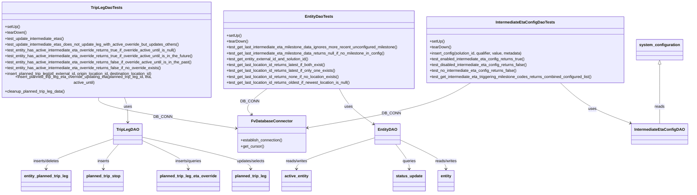

# Diagram: entity_core/entity_service/entity_listener/tests/integration/test_intermediate_eta_dao.py


> Auto-generated by Obscura crawlers

## Diagram 1



### SVG

<svg id="container" width="2834.8203125" xmlns="http://www.w3.org/2000/svg" class="classDiagram" height="764" viewBox="0 0 2834.8203125 764" role="graphics-document document" aria-roledescription="class"><style>#container{font-family:"trebuchet ms",verdana,arial,sans-serif;font-size:16px;fill:#333;}@keyframes edge-animation-frame{from{stroke-dashoffset:0;}}@keyframes dash{to{stroke-dashoffset:0;}}#container .edge-animation-slow{stroke-dasharray:9,5!important;stroke-dashoffset:900;animation:dash 50s linear infinite;stroke-linecap:round;}#container .edge-animation-fast{stroke-dasharray:9,5!important;stroke-dashoffset:900;animation:dash 20s linear infinite;stroke-linecap:round;}#container .error-icon{fill:#552222;}#container .error-text{fill:#552222;stroke:#552222;}#container .edge-thickness-normal{stroke-width:1px;}#container .edge-thickness-thick{stroke-width:3.5px;}#container .edge-pattern-solid{stroke-dasharray:0;}#container .edge-thickness-invisible{stroke-width:0;fill:none;}#container .edge-pattern-dashed{stroke-dasharray:3;}#container .edge-pattern-dotted{stroke-dasharray:2;}#container .marker{fill:#333333;stroke:#333333;}#container .marker.cross{stroke:#333333;}#container svg{font-family:"trebuchet ms",verdana,arial,sans-serif;font-size:16px;}#container p{margin:0;}#container g.classGroup text{fill:#9370DB;stroke:none;font-family:"trebuchet ms",verdana,arial,sans-serif;font-size:10px;}#container g.classGroup text .title{font-weight:bolder;}#container .nodeLabel,#container .edgeLabel{color:#131300;}#container .edgeLabel .label rect{fill:#ECECFF;}#container .label text{fill:#131300;}#container .labelBkg{background:#ECECFF;}#container .edgeLabel .label span{background:#ECECFF;}#container .classTitle{font-weight:bolder;}#container .node rect,#container .node circle,#container .node ellipse,#container .node polygon,#container .node path{fill:#ECECFF;stroke:#9370DB;stroke-width:1px;}#container .divider{stroke:#9370DB;stroke-width:1;}#container g.clickable{cursor:pointer;}#container g.classGroup rect{fill:#ECECFF;stroke:#9370DB;}#container g.classGroup line{stroke:#9370DB;stroke-width:1;}#container .classLabel .box{stroke:none;stroke-width:0;fill:#ECECFF;opacity:0.5;}#container .classLabel .label{fill:#9370DB;font-size:10px;}#container .relation{stroke:#333333;stroke-width:1;fill:none;}#container .dashed-line{stroke-dasharray:3;}#container .dotted-line{stroke-dasharray:1 2;}#container #compositionStart,#container .composition{fill:#333333!important;stroke:#333333!important;stroke-width:1;}#container #compositionEnd,#container .composition{fill:#333333!important;stroke:#333333!important;stroke-width:1;}#container #dependencyStart,#container .dependency{fill:#333333!important;stroke:#333333!important;stroke-width:1;}#container #dependencyStart,#container .dependency{fill:#333333!important;stroke:#333333!important;stroke-width:1;}#container #extensionStart,#container .extension{fill:transparent!important;stroke:#333333!important;stroke-width:1;}#container #extensionEnd,#container .extension{fill:transparent!important;stroke:#333333!important;stroke-width:1;}#container #aggregationStart,#container .aggregation{fill:transparent!important;stroke:#333333!important;stroke-width:1;}#container #aggregationEnd,#container .aggregation{fill:transparent!important;stroke:#333333!important;stroke-width:1;}#container #lollipopStart,#container .lollipop{fill:#ECECFF!important;stroke:#333333!important;stroke-width:1;}#container #lollipopEnd,#container .lollipop{fill:#ECECFF!important;stroke:#333333!important;stroke-width:1;}#container .edgeTerminals{font-size:11px;line-height:initial;}#container .classTitleText{text-anchor:middle;font-size:18px;fill:#333;}#container .label-icon{display:inline-block;height:1em;overflow:visible;vertical-align:-0.125em;}#container .node .label-icon path{fill:currentColor;stroke:revert;stroke-width:revert;}#container :root{--mermaid-font-family:"trebuchet ms",verdana,arial,sans-serif;}</style><g><defs><marker id="container_class-aggregationStart" class="marker aggregation class" refX="18" refY="7" markerWidth="190" markerHeight="240" orient="auto"><path d="M 18,7 L9,13 L1,7 L9,1 Z"></path></marker></defs><defs><marker id="container_class-aggregationEnd" class="marker aggregation class" refX="1" refY="7" markerWidth="20" markerHeight="28" orient="auto"><path d="M 18,7 L9,13 L1,7 L9,1 Z"></path></marker></defs><defs><marker id="container_class-extensionStart" class="marker extension class" refX="18" refY="7" markerWidth="190" markerHeight="240" orient="auto"><path d="M 1,7 L18,13 V 1 Z"></path></marker></defs><defs><marker id="container_class-extensionEnd" class="marker extension class" refX="1" refY="7" markerWidth="20" markerHeight="28" orient="auto"><path d="M 1,1 V 13 L18,7 Z"></path></marker></defs><defs><marker id="container_class-compositionStart" class="marker composition class" refX="18" refY="7" markerWidth="190" markerHeight="240" orient="auto"><path d="M 18,7 L9,13 L1,7 L9,1 Z"></path></marker></defs><defs><marker id="container_class-compositionEnd" class="marker composition class" refX="1" refY="7" markerWidth="20" markerHeight="28" orient="auto"><path d="M 18,7 L9,13 L1,7 L9,1 Z"></path></marker></defs><defs><marker id="container_class-dependencyStart" class="marker dependency class" refX="6" refY="7" markerWidth="190" markerHeight="240" orient="auto"><path d="M 5,7 L9,13 L1,7 L9,1 Z"></path></marker></defs><defs><marker id="container_class-dependencyEnd" class="marker dependency class" refX="13" refY="7" markerWidth="20" markerHeight="28" orient="auto"><path d="M 18,7 L9,13 L14,7 L9,1 Z"></path></marker></defs><defs><marker id="container_class-lollipopStart" class="marker lollipop class" refX="13" refY="7" markerWidth="190" markerHeight="240" orient="auto"><circle stroke="black" fill="transparent" cx="7" cy="7" r="6"></circle></marker></defs><defs><marker id="container_class-lollipopEnd" class="marker lollipop class" refX="1" refY="7" markerWidth="190" markerHeight="240" orient="auto"><circle stroke="black" fill="transparent" cx="7" cy="7" r="6"></circle></marker></defs><g class="root"><g class="clusters"></g><g class="edgePaths"><path d="M2321.267,326L2337.054,340.167C2352.841,354.333,2384.415,382.667,2431.345,408.396C2478.276,434.126,2540.564,457.252,2571.708,468.815L2602.852,480.378" id="id_IntermediateEtaConfigDaoTests_IntermediateEtaConfigDAO_1" class="edge-thickness-normal edge-pattern-solid relation" style=";;;" data-edge="true" data-et="edge" data-id="id_IntermediateEtaConfigDaoTests_IntermediateEtaConfigDAO_1" data-points="W3sieCI6MjMyMS4yNjczMTE3ODk3NzI1LCJ5IjozMjZ9LHsieCI6MjQxNS45ODgyODEyNSwieSI6NDExfSx7IngiOjI2MDguNDc2NTYyNSwieSI6NDgyLjQ2NjgwNDc5MTE5NDZ9XQ==" marker-end="url(#container_class-dependencyEnd)"></path><path d="M1405.961,350L1411.434,360.167C1416.907,370.333,1427.853,390.667,1450.074,413.02C1472.296,435.374,1505.792,459.748,1522.541,471.935L1539.289,484.122" id="id_EntityDaoTests_EntityDAO_2" class="edge-thickness-normal edge-pattern-solid relation" style=";;;" data-edge="true" data-et="edge" data-id="id_EntityDaoTests_EntityDAO_2" data-points="W3sieCI6MTQwNS45NjA5NjQxMzM1MjI4LCJ5IjozNTB9LHsieCI6MTQzOC43OTg4MjgxMjUsInkiOjQxMX0seyJ4IjoxNTQ0LjE0MDYyNSwieSI6NDg3LjY1MjA3NDA1NDMzNTN9XQ==" marker-end="url(#container_class-dependencyEnd)"></path><path d="M524.389,374L527.16,380.167C529.93,386.333,535.471,398.667,538.241,415.5C541.012,432.333,541.012,453.667,541.012,464.333L541.012,475" id="id_TripLegDaoTests_TripLegDAO_3" class="edge-thickness-normal edge-pattern-solid relation" style=";;;" data-edge="true" data-et="edge" data-id="id_TripLegDaoTests_TripLegDAO_3" data-points="W3sieCI6NTI0LjM4OTMxMTA3OTU0NTUsInkiOjM3NH0seyJ4Ijo1NDEuMDExNzE4NzUsInkiOjQxMX0seyJ4Ijo1NDEuMDExNzE4NzUsInkiOjQ4MX1d" marker-end="url(#container_class-dependencyEnd)"></path><path d="M1931.668,326L1906.571,340.167C1881.474,354.333,1831.28,382.667,1719.582,411.445C1607.884,440.223,1434.681,469.447,1348.08,484.058L1261.479,498.67" id="id_IntermediateEtaConfigDaoTests_FvDatabaseConnector_4" class="edge-thickness-normal edge-pattern-solid relation" style=";;;" data-edge="true" data-et="edge" data-id="id_IntermediateEtaConfigDaoTests_FvDatabaseConnector_4" data-points="W3sieCI6MTkzMS42NjgxNDYzMDY4MTgyLCJ5IjozMjZ9LHsieCI6MTc4MS4wODU5Mzc1LCJ5Ijo0MTF9LHsieCI6MTI1NS41NjI1LCJ5Ijo0OTkuNjY4MDY3MjAyMTY1NTZ9XQ==" marker-end="url(#container_class-dependencyEnd)"></path><path d="M1090.701,350L1076.016,360.167C1061.331,370.333,1031.96,390.667,1022.874,406.301C1013.788,421.936,1024.987,432.872,1030.586,438.34L1036.185,443.808" id="id_EntityDaoTests_FvDatabaseConnector_5" class="edge-thickness-normal edge-pattern-solid relation" style=";;;" data-edge="true" data-et="edge" data-id="id_EntityDaoTests_FvDatabaseConnector_5" data-points="W3sieCI6MTA5MC43MDA4MzQ1MTcwNDU1LCJ5IjozNTB9LHsieCI6MTAwMi41ODk4NDM3NSwieSI6NDExfSx7IngiOjEwNDAuNDc3Njc4NTcxNDI4NywieSI6NDQ4fV0=" marker-end="url(#container_class-dependencyEnd)"></path><path d="M412.656,374L411.661,380.167C410.666,386.333,408.677,398.667,502.079,419.712C595.48,440.757,784.273,470.513,878.669,485.392L973.065,500.27" id="id_TripLegDaoTests_FvDatabaseConnector_6" class="edge-thickness-normal edge-pattern-solid relation" style=";;;" data-edge="true" data-et="edge" data-id="id_TripLegDaoTests_FvDatabaseConnector_6" data-points="W3sieCI6NDEyLjY1NTk4MzY2NDc3Mjc1LCJ5IjozNzR9LHsieCI6NDA2LjY4NzUsInkiOjQxMX0seyJ4Ijo5NzguOTkyMTg3NSwieSI6NTAxLjIwNDExMDgwMTQzNTl9XQ==" marker-end="url(#container_class-dependencyEnd)"></path><path d="M1641.297,546.148L1672.375,560.956C1703.453,575.765,1765.609,605.383,1796.688,625.358C1827.766,645.333,1827.766,655.667,1827.766,660.833L1827.766,666" id="id_EntityDAO_entity_7" class="edge-thickness-normal edge-pattern-solid relation" style=";;;" data-edge="true" data-et="edge" data-id="id_EntityDAO_entity_7" data-points="W3sieCI6MTY0MS4yOTY4NzUsInkiOjU0Ni4xNDc1MTA0Njk5ODYxfSx7IngiOjE4MjcuNzY1NjI1LCJ5Ijo2MzV9LHsieCI6MTgyNy43NjU2MjUsInkiOjY3Mn1d" marker-end="url(#container_class-dependencyEnd)"></path><path d="M1625.332,565L1634.391,576.667C1643.451,588.333,1661.569,611.667,1670.628,628.5C1679.688,645.333,1679.688,655.667,1679.688,660.833L1679.688,666" id="id_EntityDAO_status_update_8" class="edge-thickness-normal edge-pattern-solid relation" style=";;;" data-edge="true" data-et="edge" data-id="id_EntityDAO_status_update_8" data-points="W3sieCI6MTYyNS4zMzIwMzEyNSwieSI6NTY1fSx7IngiOjE2NzkuNjg3NSwieSI6NjM1fSx7IngiOjE2NzkuNjg3NSwieSI6NjcyfV0=" marker-end="url(#container_class-dependencyEnd)"></path><path d="M1544.141,537.456L1489.51,553.714C1434.88,569.971,1325.62,602.485,1270.99,623.909C1216.359,645.333,1216.359,655.667,1216.359,660.833L1216.359,666" id="id_EntityDAO_active_entity_9" class="edge-thickness-normal edge-pattern-solid relation" style=";;;" data-edge="true" data-et="edge" data-id="id_EntityDAO_active_entity_9" data-points="W3sieCI6MTU0NC4xNDA2MjUsInkiOjUzNy40NTYyNjI3MTQzMjcyfSx7IngiOjEyMTYuMzU5Mzc1LCJ5Ijo2MzV9LHsieCI6MTIxNi4zNTkzNzUsInkiOjY3Mn1d" marker-end="url(#container_class-dependencyEnd)"></path><path d="M595.363,535.384L668.231,551.987C741.099,568.589,886.835,601.795,959.702,623.564C1032.57,645.333,1032.57,655.667,1032.57,660.833L1032.57,666" id="id_TripLegDAO_planned_trip_leg_10" class="edge-thickness-normal edge-pattern-solid relation" style=";;;" data-edge="true" data-et="edge" data-id="id_TripLegDAO_planned_trip_leg_10" data-points="W3sieCI6NTk1LjM2MzI4MTI1LCJ5Ijo1MzUuMzgzODIzNzc0ODIzNH0seyJ4IjoxMDMyLjU3MDMxMjUsInkiOjYzNX0seyJ4IjoxMDMyLjU3MDMxMjUsInkiOjY3Mn1d" marker-end="url(#container_class-dependencyEnd)"></path><path d="M595.363,548.151L626.644,562.626C657.924,577.101,720.486,606.05,751.766,625.692C783.047,645.333,783.047,655.667,783.047,660.833L783.047,666" id="id_TripLegDAO_planned_trip_leg_eta_override_11" class="edge-thickness-normal edge-pattern-solid relation" style=";;;" data-edge="true" data-et="edge" data-id="id_TripLegDAO_planned_trip_leg_eta_override_11" data-points="W3sieCI6NTk1LjM2MzI4MTI1LCJ5Ijo1NDguMTUwNzg4Mzk5MTU0M30seyJ4Ijo3ODMuMDQ2ODc1LCJ5Ijo2MzV9LHsieCI6NzgzLjA0Njg3NSwieSI6NjcyfV0=" marker-end="url(#container_class-dependencyEnd)"></path><path d="M499.201,565L487.587,576.667C475.972,588.333,452.744,611.667,441.13,628.5C429.516,645.333,429.516,655.667,429.516,660.833L429.516,666" id="id_TripLegDAO_planned_trip_stop_12" class="edge-thickness-normal edge-pattern-solid relation" style=";;;" data-edge="true" data-et="edge" data-id="id_TripLegDAO_planned_trip_stop_12" data-points="W3sieCI6NDk5LjIwMDY4MzU5Mzc1LCJ5Ijo1NjV9LHsieCI6NDI5LjUxNTYyNSwieSI6NjM1fSx7IngiOjQyOS41MTU2MjUsInkiOjY3Mn1d" marker-end="url(#container_class-dependencyEnd)"></path><path d="M486.66,540.858L438.907,556.549C391.154,572.239,295.647,603.619,247.894,624.476C200.141,645.333,200.141,655.667,200.141,660.833L200.141,666" id="id_TripLegDAO_entity_planned_trip_leg_13" class="edge-thickness-normal edge-pattern-solid relation" style=";;;" data-edge="true" data-et="edge" data-id="id_TripLegDAO_entity_planned_trip_leg_13" data-points="W3sieCI6NDg2LjY2MDE1NjI1LCJ5Ijo1NDAuODU4MjkwNDU1MjkwM30seyJ4IjoyMDAuMTQwNjI1LCJ5Ijo2MzV9LHsieCI6MjAwLjE0MDYyNSwieSI6NjcyfV0=" marker-end="url(#container_class-dependencyEnd)"></path><path d="M2717.648,250.25L2717.648,277.042C2717.648,303.833,2717.648,357.417,2717.648,395.875C2717.648,434.333,2717.648,457.667,2717.648,469.333L2717.648,481" id="id_system_configuration_IntermediateEtaConfigDAO_14" class="edge-thickness-normal edge-pattern-solid relation" style=";;;" data-edge="true" data-et="edge" data-id="id_system_configuration_IntermediateEtaConfigDAO_14" data-points="W3sieCI6MjcxNy42NDg0Mzc1LCJ5IjoyMzN9LHsieCI6MjcxNy42NDg0Mzc1LCJ5Ijo0MTF9LHsieCI6MjcxNy42NDg0Mzc1LCJ5Ijo0ODF9XQ==" marker-start="url(#container_class-extensionStart)"></path></g><g class="edgeLabels"><g class="edgeLabel" transform="translate(2452.57754, 424.58481)"><g class="label" data-id="id_IntermediateEtaConfigDaoTests_IntermediateEtaConfigDAO_1" transform="translate(-16.4921875, -12)"><foreignObject width="32.984375" height="24"><div xmlns="http://www.w3.org/1999/xhtml" class="labelBkg" style="display: table-cell; white-space: nowrap; line-height: 1.5; max-width: 200px; text-align: center;"><span class="edgeLabel"><p>uses</p></span></div></foreignObject></g></g><g class="edgeLabel" transform="translate(1438.798828125, 411)"><g class="label" data-id="id_EntityDaoTests_EntityDAO_2" transform="translate(-16.4921875, -12)"><foreignObject width="32.984375" height="24"><div xmlns="http://www.w3.org/1999/xhtml" class="labelBkg" style="display: table-cell; white-space: nowrap; line-height: 1.5; max-width: 200px; text-align: center;"><span class="edgeLabel"><p>uses</p></span></div></foreignObject></g></g><g class="edgeLabel" transform="translate(541.01171875, 411)"><g class="label" data-id="id_TripLegDaoTests_TripLegDAO_3" transform="translate(-16.4921875, -12)"><foreignObject width="32.984375" height="24"><div xmlns="http://www.w3.org/1999/xhtml" class="labelBkg" style="display: table-cell; white-space: nowrap; line-height: 1.5; max-width: 200px; text-align: center;"><span class="edgeLabel"><p>uses</p></span></div></foreignObject></g></g><g class="edgeLabel" transform="translate(1781.0859375, 411)"><g class="label" data-id="id_IntermediateEtaConfigDaoTests_FvDatabaseConnector_4" transform="translate(-34.484375, -12)"><foreignObject width="68.96875" height="24"><div xmlns="http://www.w3.org/1999/xhtml" class="labelBkg" style="display: table-cell; white-space: nowrap; line-height: 1.5; max-width: 200px; text-align: center;"><span class="edgeLabel"><p>DB_CONN</p></span></div></foreignObject></g></g><g class="edgeLabel" transform="translate(1024.87476, 395.57196)"><g class="label" data-id="id_EntityDaoTests_FvDatabaseConnector_5" transform="translate(-34.484375, -12)"><foreignObject width="68.96875" height="24"><div xmlns="http://www.w3.org/1999/xhtml" class="labelBkg" style="display: table-cell; white-space: nowrap; line-height: 1.5; max-width: 200px; text-align: center;"><span class="edgeLabel"><p>DB_CONN</p></span></div></foreignObject></g></g><g class="edgeLabel" transform="translate(406.6875, 411)"><g class="label" data-id="id_TripLegDaoTests_FvDatabaseConnector_6" transform="translate(-34.484375, -12)"><foreignObject width="68.96875" height="24"><div xmlns="http://www.w3.org/1999/xhtml" class="labelBkg" style="display: table-cell; white-space: nowrap; line-height: 1.5; max-width: 200px; text-align: center;"><span class="edgeLabel"><p>DB_CONN</p></span></div></foreignObject></g></g><g class="edgeLabel" transform="translate(1827.765625, 635)"><g class="label" data-id="id_EntityDAO_entity_7" transform="translate(-45.9453125, -12)"><foreignObject width="91.890625" height="24"><div xmlns="http://www.w3.org/1999/xhtml" class="labelBkg" style="display: table-cell; white-space: nowrap; line-height: 1.5; max-width: 200px; text-align: center;"><span class="edgeLabel"><p>reads/writes</p></span></div></foreignObject></g></g><g class="edgeLabel" transform="translate(1679.6875, 635)"><g class="label" data-id="id_EntityDAO_status_update_8" transform="translate(-27.2421875, -12)"><foreignObject width="54.484375" height="24"><div xmlns="http://www.w3.org/1999/xhtml" class="labelBkg" style="display: table-cell; white-space: nowrap; line-height: 1.5; max-width: 200px; text-align: center;"><span class="edgeLabel"><p>queries</p></span></div></foreignObject></g></g><g class="edgeLabel" transform="translate(1216.359375, 635)"><g class="label" data-id="id_EntityDAO_active_entity_9" transform="translate(-45.9453125, -12)"><foreignObject width="91.890625" height="24"><div xmlns="http://www.w3.org/1999/xhtml" class="labelBkg" style="display: table-cell; white-space: nowrap; line-height: 1.5; max-width: 200px; text-align: center;"><span class="edgeLabel"><p>reads/writes</p></span></div></foreignObject></g></g><g class="edgeLabel" transform="translate(1032.5703125, 635)"><g class="label" data-id="id_TripLegDAO_planned_trip_leg_10" transform="translate(-58.5390625, -12)"><foreignObject width="117.078125" height="24"><div xmlns="http://www.w3.org/1999/xhtml" class="labelBkg" style="display: table-cell; white-space: nowrap; line-height: 1.5; max-width: 200px; text-align: center;"><span class="edgeLabel"><p>updates/selects</p></span></div></foreignObject></g></g><g class="edgeLabel" transform="translate(783.046875, 635)"><g class="label" data-id="id_TripLegDAO_planned_trip_leg_eta_override_11" transform="translate(-55.7578125, -12)"><foreignObject width="111.515625" height="24"><div xmlns="http://www.w3.org/1999/xhtml" class="labelBkg" style="display: table-cell; white-space: nowrap; line-height: 1.5; max-width: 200px; text-align: center;"><span class="edgeLabel"><p>inserts/queries</p></span></div></foreignObject></g></g><g class="edgeLabel" transform="translate(429.515625, 635)"><g class="label" data-id="id_TripLegDAO_planned_trip_stop_12" transform="translate(-24.7578125, -12)"><foreignObject width="49.515625" height="24"><div xmlns="http://www.w3.org/1999/xhtml" class="labelBkg" style="display: table-cell; white-space: nowrap; line-height: 1.5; max-width: 200px; text-align: center;"><span class="edgeLabel"><p>inserts</p></span></div></foreignObject></g></g><g class="edgeLabel" transform="translate(200.140625, 635)"><g class="label" data-id="id_TripLegDAO_entity_planned_trip_leg_13" transform="translate(-55.1875, -12)"><foreignObject width="110.375" height="24"><div xmlns="http://www.w3.org/1999/xhtml" class="labelBkg" style="display: table-cell; white-space: nowrap; line-height: 1.5; max-width: 200px; text-align: center;"><span class="edgeLabel"><p>inserts/deletes</p></span></div></foreignObject></g></g><g class="edgeLabel" transform="translate(2717.6484375, 411)"><g class="label" data-id="id_system_configuration_IntermediateEtaConfigDAO_14" transform="translate(-20.0078125, -12)"><foreignObject width="40.015625" height="24"><div xmlns="http://www.w3.org/1999/xhtml" class="labelBkg" style="display: table-cell; white-space: nowrap; line-height: 1.5; max-width: 200px; text-align: center;"><span class="edgeLabel"><p>reads</p></span></div></foreignObject></g></g></g><g class="nodes"><g class="node default" id="classId-FvDatabaseConnector-0" transform="translate(1117.27734375, 523)"><g class="basic label-container"><path d="M-138.28515625 -75 L138.28515625 -75 L138.28515625 75 L-138.28515625 75" stroke="none" stroke-width="0" fill="#ECECFF" style=""></path><path d="M-138.28515625 -75 C-44.589574939522976 -75, 49.10600637095405 -75, 138.28515625 -75 M-138.28515625 -75 C-74.3899251177739 -75, -10.494693985547798 -75, 138.28515625 -75 M138.28515625 -75 C138.28515625 -40.82865340759854, 138.28515625 -6.6573068151970745, 138.28515625 75 M138.28515625 -75 C138.28515625 -36.34910153669003, 138.28515625 2.301796926619943, 138.28515625 75 M138.28515625 75 C44.150620391953865 75, -49.98391546609227 75, -138.28515625 75 M138.28515625 75 C35.71073141430655 75, -66.8636934213869 75, -138.28515625 75 M-138.28515625 75 C-138.28515625 15.609399913670877, -138.28515625 -43.781200172658245, -138.28515625 -75 M-138.28515625 75 C-138.28515625 19.571082553244914, -138.28515625 -35.85783489351017, -138.28515625 -75" stroke="#9370DB" stroke-width="1.3" fill="none" stroke-dasharray="0 0" style=""></path></g><g class="annotation-group text" transform="translate(0, -51)"></g><g class="label-group text" transform="translate(-79.3046875, -51)"><g class="label" style="font-weight: bolder" transform="translate(0,-12)"><foreignObject width="158.609375" height="24"><div xmlns="http://www.w3.org/1999/xhtml" style="display: table-cell; white-space: nowrap; line-height: 1.5; max-width: 207px; text-align: center;"><span class="nodeLabel markdown-node-label" style=""><p>FvDatabaseConnector</p></span></div></foreignObject></g></g><g class="members-group text" transform="translate(-126.28515625, -3)"></g><g class="methods-group text" transform="translate(-126.28515625, 27)"><g class="label" style="" transform="translate(0,-12)"><foreignObject width="173.265625" height="24"><div xmlns="http://www.w3.org/1999/xhtml" style="display: table-cell; white-space: nowrap; line-height: 1.5; max-width: 231px; text-align: center;"><span class="nodeLabel markdown-node-label" style=""><p>+establish_connection()</p></span></div></foreignObject></g><g class="label" style="" transform="translate(0,12)"><foreignObject width="94.640625" height="24"><div xmlns="http://www.w3.org/1999/xhtml" style="display: table-cell; white-space: nowrap; line-height: 1.5; max-width: 152px; text-align: center;"><span class="nodeLabel markdown-node-label" style=""><p>+get_cursor()</p></span></div></foreignObject></g></g><g class="divider" style=""><path d="M-138.28515625 -27 C-33.842581837077034 -27, 70.59999257584593 -27, 138.28515625 -27 M-138.28515625 -27 C-54.81166154159962 -27, 28.66183316680076 -27, 138.28515625 -27" stroke="#9370DB" stroke-width="1.3" fill="none" stroke-dasharray="0 0" style=""></path></g><g class="divider" style=""><path d="M-138.28515625 -3 C-81.2563670390644 -3, -24.2275778281288 -3, 138.28515625 -3 M-138.28515625 -3 C-63.979505163297276 -3, 10.326145923405448 -3, 138.28515625 -3" stroke="#9370DB" stroke-width="1.3" fill="none" stroke-dasharray="0 0" style=""></path></g></g><g class="node default" id="classId-IntermediateEtaConfigDAO-1" transform="translate(2717.6484375, 523)"><g class="basic label-container"><path d="M-109.171875 -42 L109.171875 -42 L109.171875 42 L-109.171875 42" stroke="none" stroke-width="0" fill="#ECECFF" style=""></path><path d="M-109.171875 -42 C-54.88055309399591 -42, -0.589231187991814 -42, 109.171875 -42 M-109.171875 -42 C-25.11344285051615 -42, 58.9449892989677 -42, 109.171875 -42 M109.171875 -42 C109.171875 -9.91558475847767, 109.171875 22.16883048304466, 109.171875 42 M109.171875 -42 C109.171875 -17.804471544309482, 109.171875 6.391056911381035, 109.171875 42 M109.171875 42 C58.311723888189604 42, 7.451572776379209 42, -109.171875 42 M109.171875 42 C50.9401167263702 42, -7.2916415472596015 42, -109.171875 42 M-109.171875 42 C-109.171875 11.112867958985877, -109.171875 -19.774264082028246, -109.171875 -42 M-109.171875 42 C-109.171875 19.084545749779426, -109.171875 -3.830908500441147, -109.171875 -42" stroke="#9370DB" stroke-width="1.3" fill="none" stroke-dasharray="0 0" style=""></path></g><g class="annotation-group text" transform="translate(0, -18)"></g><g class="label-group text" transform="translate(-97.171875, -18)"><g class="label" style="font-weight: bolder" transform="translate(0,-12)"><foreignObject width="194.34375" height="24"><div xmlns="http://www.w3.org/1999/xhtml" style="display: table-cell; white-space: nowrap; line-height: 1.5; max-width: 242px; text-align: center;"><span class="nodeLabel markdown-node-label" style=""><p>IntermediateEtaConfigDAO</p></span></div></foreignObject></g></g><g class="members-group text" transform="translate(-97.171875, 30)"></g><g class="methods-group text" transform="translate(-97.171875, 60)"></g><g class="divider" style=""><path d="M-109.171875 6 C-63.275599412701204 6, -17.37932382540241 6, 109.171875 6 M-109.171875 6 C-39.995088180782204 6, 29.18169863843559 6, 109.171875 6" stroke="#9370DB" stroke-width="1.3" fill="none" stroke-dasharray="0 0" style=""></path></g><g class="divider" style=""><path d="M-109.171875 24 C-26.060181503284696 24, 57.05151199343061 24, 109.171875 24 M-109.171875 24 C-36.30019410923809 24, 36.57148678152382 24, 109.171875 24" stroke="#9370DB" stroke-width="1.3" fill="none" stroke-dasharray="0 0" style=""></path></g></g><g class="node default" id="classId-EntityDAO-2" transform="translate(1592.71875, 523)"><g class="basic label-container"><path d="M-48.578125 -42 L48.578125 -42 L48.578125 42 L-48.578125 42" stroke="none" stroke-width="0" fill="#ECECFF" style=""></path><path d="M-48.578125 -42 C-22.183942479877746 -42, 4.210240040244507 -42, 48.578125 -42 M-48.578125 -42 C-11.04316207752489 -42, 26.49180084495022 -42, 48.578125 -42 M48.578125 -42 C48.578125 -21.140718167681644, 48.578125 -0.2814363353632885, 48.578125 42 M48.578125 -42 C48.578125 -13.992180187450327, 48.578125 14.015639625099347, 48.578125 42 M48.578125 42 C12.180891722511625 42, -24.21634155497675 42, -48.578125 42 M48.578125 42 C12.320586140040916 42, -23.936952719918168 42, -48.578125 42 M-48.578125 42 C-48.578125 9.183086146634068, -48.578125 -23.633827706731864, -48.578125 -42 M-48.578125 42 C-48.578125 13.46937951098662, -48.578125 -15.06124097802676, -48.578125 -42" stroke="#9370DB" stroke-width="1.3" fill="none" stroke-dasharray="0 0" style=""></path></g><g class="annotation-group text" transform="translate(0, -18)"></g><g class="label-group text" transform="translate(-36.578125, -18)"><g class="label" style="font-weight: bolder" transform="translate(0,-12)"><foreignObject width="73.15625" height="24"><div xmlns="http://www.w3.org/1999/xhtml" style="display: table-cell; white-space: nowrap; line-height: 1.5; max-width: 122px; text-align: center;"><span class="nodeLabel markdown-node-label" style=""><p>EntityDAO</p></span></div></foreignObject></g></g><g class="members-group text" transform="translate(-36.578125, 30)"></g><g class="methods-group text" transform="translate(-36.578125, 60)"></g><g class="divider" style=""><path d="M-48.578125 6 C-17.24871417720644 6, 14.080696645587118 6, 48.578125 6 M-48.578125 6 C-18.320172906232184 6, 11.937779187535632 6, 48.578125 6" stroke="#9370DB" stroke-width="1.3" fill="none" stroke-dasharray="0 0" style=""></path></g><g class="divider" style=""><path d="M-48.578125 24 C-13.5395674512001 24, 21.4989900975998 24, 48.578125 24 M-48.578125 24 C-24.585000012000872 24, -0.5918750240017445 24, 48.578125 24" stroke="#9370DB" stroke-width="1.3" fill="none" stroke-dasharray="0 0" style=""></path></g></g><g class="node default" id="classId-TripLegDAO-3" transform="translate(541.01171875, 523)"><g class="basic label-container"><path d="M-54.3515625 -42 L54.3515625 -42 L54.3515625 42 L-54.3515625 42" stroke="none" stroke-width="0" fill="#ECECFF" style=""></path><path d="M-54.3515625 -42 C-18.39134992496566 -42, 17.56886265006868 -42, 54.3515625 -42 M-54.3515625 -42 C-25.014054248237116 -42, 4.323454003525768 -42, 54.3515625 -42 M54.3515625 -42 C54.3515625 -14.105108675066237, 54.3515625 13.789782649867526, 54.3515625 42 M54.3515625 -42 C54.3515625 -23.885533040507706, 54.3515625 -5.771066081015412, 54.3515625 42 M54.3515625 42 C21.48558874602994 42, -11.38038500794012 42, -54.3515625 42 M54.3515625 42 C31.21483556004252 42, 8.07810862008504 42, -54.3515625 42 M-54.3515625 42 C-54.3515625 20.090968479504973, -54.3515625 -1.8180630409900544, -54.3515625 -42 M-54.3515625 42 C-54.3515625 14.996660110017746, -54.3515625 -12.006679779964507, -54.3515625 -42" stroke="#9370DB" stroke-width="1.3" fill="none" stroke-dasharray="0 0" style=""></path></g><g class="annotation-group text" transform="translate(0, -18)"></g><g class="label-group text" transform="translate(-42.3515625, -18)"><g class="label" style="font-weight: bolder" transform="translate(0,-12)"><foreignObject width="84.703125" height="24"><div xmlns="http://www.w3.org/1999/xhtml" style="display: table-cell; white-space: nowrap; line-height: 1.5; max-width: 133px; text-align: center;"><span class="nodeLabel markdown-node-label" style=""><p>TripLegDAO</p></span></div></foreignObject></g></g><g class="members-group text" transform="translate(-42.3515625, 30)"></g><g class="methods-group text" transform="translate(-42.3515625, 60)"></g><g class="divider" style=""><path d="M-54.3515625 6 C-28.82757557379106 6, -3.3035886475821172 6, 54.3515625 6 M-54.3515625 6 C-10.899812748418803 6, 32.551937003162394 6, 54.3515625 6" stroke="#9370DB" stroke-width="1.3" fill="none" stroke-dasharray="0 0" style=""></path></g><g class="divider" style=""><path d="M-54.3515625 24 C-27.89569619587915 24, -1.4398298917583006 24, 54.3515625 24 M-54.3515625 24 C-23.57547980274504 24, 7.20060289450992 24, 54.3515625 24" stroke="#9370DB" stroke-width="1.3" fill="none" stroke-dasharray="0 0" style=""></path></g></g><g class="node default" id="classId-system_configuration-4" transform="translate(2717.6484375, 191)"><g class="basic label-container"><path d="M-90.375 -42 L90.375 -42 L90.375 42 L-90.375 42" stroke="none" stroke-width="0" fill="#ECECFF" style=""></path><path d="M-90.375 -42 C-26.129976854884063 -42, 38.115046290231874 -42, 90.375 -42 M-90.375 -42 C-44.39885470542985 -42, 1.5772905891403042 -42, 90.375 -42 M90.375 -42 C90.375 -8.618248215238332, 90.375 24.763503569523337, 90.375 42 M90.375 -42 C90.375 -23.674532998877456, 90.375 -5.349065997754913, 90.375 42 M90.375 42 C26.80516008169718 42, -36.76467983660564 42, -90.375 42 M90.375 42 C39.93129464000105 42, -10.512410719997902 42, -90.375 42 M-90.375 42 C-90.375 20.197240253638185, -90.375 -1.60551949272363, -90.375 -42 M-90.375 42 C-90.375 13.84653801567525, -90.375 -14.3069239686495, -90.375 -42" stroke="#9370DB" stroke-width="1.3" fill="none" stroke-dasharray="0 0" style=""></path></g><g class="annotation-group text" transform="translate(0, -18)"></g><g class="label-group text" transform="translate(-78.375, -18)"><g class="label" style="font-weight: bolder" transform="translate(0,-12)"><foreignObject width="156.75" height="24"><div xmlns="http://www.w3.org/1999/xhtml" style="display: table-cell; white-space: nowrap; line-height: 1.5; max-width: 204px; text-align: center;"><span class="nodeLabel markdown-node-label" style=""><p>system_configuration</p></span></div></foreignObject></g></g><g class="members-group text" transform="translate(-78.375, 30)"></g><g class="methods-group text" transform="translate(-78.375, 60)"></g><g class="divider" style=""><path d="M-90.375 6 C-45.728806229412314 6, -1.0826124588246273 6, 90.375 6 M-90.375 6 C-23.440794829309098 6, 43.493410341381804 6, 90.375 6" stroke="#9370DB" stroke-width="1.3" fill="none" stroke-dasharray="0 0" style=""></path></g><g class="divider" style=""><path d="M-90.375 24 C-27.99822764390393 24, 34.37854471219214 24, 90.375 24 M-90.375 24 C-39.92691575158074 24, 10.521168496838527 24, 90.375 24" stroke="#9370DB" stroke-width="1.3" fill="none" stroke-dasharray="0 0" style=""></path></g></g><g class="node default" id="classId-entity-5" transform="translate(1827.765625, 714)"><g class="basic label-container"><path d="M-33.5703125 -42 L33.5703125 -42 L33.5703125 42 L-33.5703125 42" stroke="none" stroke-width="0" fill="#ECECFF" style=""></path><path d="M-33.5703125 -42 C-10.84290966601759 -42, 11.88449316796482 -42, 33.5703125 -42 M-33.5703125 -42 C-17.075280823420687 -42, -0.5802491468413749 -42, 33.5703125 -42 M33.5703125 -42 C33.5703125 -13.686599562822014, 33.5703125 14.626800874355972, 33.5703125 42 M33.5703125 -42 C33.5703125 -11.76242195573166, 33.5703125 18.47515608853668, 33.5703125 42 M33.5703125 42 C9.976327102726845 42, -13.61765829454631 42, -33.5703125 42 M33.5703125 42 C19.95658914120314 42, 6.342865782406275 42, -33.5703125 42 M-33.5703125 42 C-33.5703125 11.107870485141696, -33.5703125 -19.78425902971661, -33.5703125 -42 M-33.5703125 42 C-33.5703125 21.35539406460658, -33.5703125 0.7107881292131566, -33.5703125 -42" stroke="#9370DB" stroke-width="1.3" fill="none" stroke-dasharray="0 0" style=""></path></g><g class="annotation-group text" transform="translate(0, -18)"></g><g class="label-group text" transform="translate(-21.5703125, -18)"><g class="label" style="font-weight: bolder" transform="translate(0,-12)"><foreignObject width="43.140625" height="24"><div xmlns="http://www.w3.org/1999/xhtml" style="display: table-cell; white-space: nowrap; line-height: 1.5; max-width: 92px; text-align: center;"><span class="nodeLabel markdown-node-label" style=""><p>entity</p></span></div></foreignObject></g></g><g class="members-group text" transform="translate(-21.5703125, 30)"></g><g class="methods-group text" transform="translate(-21.5703125, 60)"></g><g class="divider" style=""><path d="M-33.5703125 6 C-8.378865988861389 6, 16.812580522277223 6, 33.5703125 6 M-33.5703125 6 C-9.048008043830013 6, 15.474296412339974 6, 33.5703125 6" stroke="#9370DB" stroke-width="1.3" fill="none" stroke-dasharray="0 0" style=""></path></g><g class="divider" style=""><path d="M-33.5703125 24 C-14.17217149308793 24, 5.22596951382414 24, 33.5703125 24 M-33.5703125 24 C-10.08669443457929 24, 13.396923630841421 24, 33.5703125 24" stroke="#9370DB" stroke-width="1.3" fill="none" stroke-dasharray="0 0" style=""></path></g></g><g class="node default" id="classId-status_update-6" transform="translate(1679.6875, 714)"><g class="basic label-container"><path d="M-64.5078125 -42 L64.5078125 -42 L64.5078125 42 L-64.5078125 42" stroke="none" stroke-width="0" fill="#ECECFF" style=""></path><path d="M-64.5078125 -42 C-32.63644324530766 -42, -0.7650739906153206 -42, 64.5078125 -42 M-64.5078125 -42 C-17.72308583774604 -42, 29.06164082450792 -42, 64.5078125 -42 M64.5078125 -42 C64.5078125 -14.568534453411086, 64.5078125 12.862931093177828, 64.5078125 42 M64.5078125 -42 C64.5078125 -11.77607880285916, 64.5078125 18.44784239428168, 64.5078125 42 M64.5078125 42 C23.400021591063762 42, -17.707769317872476 42, -64.5078125 42 M64.5078125 42 C28.63631216757991 42, -7.2351881648401815 42, -64.5078125 42 M-64.5078125 42 C-64.5078125 24.68322085630125, -64.5078125 7.3664417126025015, -64.5078125 -42 M-64.5078125 42 C-64.5078125 13.431143529730669, -64.5078125 -15.137712940538663, -64.5078125 -42" stroke="#9370DB" stroke-width="1.3" fill="none" stroke-dasharray="0 0" style=""></path></g><g class="annotation-group text" transform="translate(0, -18)"></g><g class="label-group text" transform="translate(-52.5078125, -18)"><g class="label" style="font-weight: bolder" transform="translate(0,-12)"><foreignObject width="105.015625" height="24"><div xmlns="http://www.w3.org/1999/xhtml" style="display: table-cell; white-space: nowrap; line-height: 1.5; max-width: 153px; text-align: center;"><span class="nodeLabel markdown-node-label" style=""><p>status_update</p></span></div></foreignObject></g></g><g class="members-group text" transform="translate(-52.5078125, 30)"></g><g class="methods-group text" transform="translate(-52.5078125, 60)"></g><g class="divider" style=""><path d="M-64.5078125 6 C-24.227563656189183 6, 16.052685187621634 6, 64.5078125 6 M-64.5078125 6 C-36.790572987519504 6, -9.073333475039007 6, 64.5078125 6" stroke="#9370DB" stroke-width="1.3" fill="none" stroke-dasharray="0 0" style=""></path></g><g class="divider" style=""><path d="M-64.5078125 24 C-17.040785879366574 24, 30.426240741266852 24, 64.5078125 24 M-64.5078125 24 C-27.728369836490543 24, 9.051072827018913 24, 64.5078125 24" stroke="#9370DB" stroke-width="1.3" fill="none" stroke-dasharray="0 0" style=""></path></g></g><g class="node default" id="classId-planned_trip_leg-7" transform="translate(1032.5703125, 714)"><g class="basic label-container"><path d="M-74.359375 -42 L74.359375 -42 L74.359375 42 L-74.359375 42" stroke="none" stroke-width="0" fill="#ECECFF" style=""></path><path d="M-74.359375 -42 C-26.86872452461794 -42, 20.621925950764123 -42, 74.359375 -42 M-74.359375 -42 C-43.827615116790966 -42, -13.295855233581925 -42, 74.359375 -42 M74.359375 -42 C74.359375 -14.021121902395972, 74.359375 13.957756195208056, 74.359375 42 M74.359375 -42 C74.359375 -14.139381023048237, 74.359375 13.721237953903525, 74.359375 42 M74.359375 42 C31.71439390597343 42, -10.930587188053138 42, -74.359375 42 M74.359375 42 C42.452785297281615 42, 10.54619559456323 42, -74.359375 42 M-74.359375 42 C-74.359375 24.641741985462538, -74.359375 7.283483970925076, -74.359375 -42 M-74.359375 42 C-74.359375 12.952746030132431, -74.359375 -16.094507939735138, -74.359375 -42" stroke="#9370DB" stroke-width="1.3" fill="none" stroke-dasharray="0 0" style=""></path></g><g class="annotation-group text" transform="translate(0, -18)"></g><g class="label-group text" transform="translate(-62.359375, -18)"><g class="label" style="font-weight: bolder" transform="translate(0,-12)"><foreignObject width="124.71875" height="24"><div xmlns="http://www.w3.org/1999/xhtml" style="display: table-cell; white-space: nowrap; line-height: 1.5; max-width: 174px; text-align: center;"><span class="nodeLabel markdown-node-label" style=""><p>planned_trip_leg</p></span></div></foreignObject></g></g><g class="members-group text" transform="translate(-62.359375, 30)"></g><g class="methods-group text" transform="translate(-62.359375, 60)"></g><g class="divider" style=""><path d="M-74.359375 6 C-15.492184252295445 6, 43.37500649540911 6, 74.359375 6 M-74.359375 6 C-21.391531427275694 6, 31.57631214544861 6, 74.359375 6" stroke="#9370DB" stroke-width="1.3" fill="none" stroke-dasharray="0 0" style=""></path></g><g class="divider" style=""><path d="M-74.359375 24 C-34.02678282507133 24, 6.305809349857341 24, 74.359375 24 M-74.359375 24 C-43.802527972949306 24, -13.24568094589862 24, 74.359375 24" stroke="#9370DB" stroke-width="1.3" fill="none" stroke-dasharray="0 0" style=""></path></g></g><g class="node default" id="classId-planned_trip_leg_eta_override-8" transform="translate(783.046875, 714)"><g class="basic label-container"><path d="M-125.1640625 -42 L125.1640625 -42 L125.1640625 42 L-125.1640625 42" stroke="none" stroke-width="0" fill="#ECECFF" style=""></path><path d="M-125.1640625 -42 C-31.06028149324905 -42, 63.0434995135019 -42, 125.1640625 -42 M-125.1640625 -42 C-43.18530521525096 -42, 38.79345206949807 -42, 125.1640625 -42 M125.1640625 -42 C125.1640625 -10.69243873527283, 125.1640625 20.61512252945434, 125.1640625 42 M125.1640625 -42 C125.1640625 -23.204108662902815, 125.1640625 -4.40821732580563, 125.1640625 42 M125.1640625 42 C47.99396414693656 42, -29.176134206126875 42, -125.1640625 42 M125.1640625 42 C61.11392860454079 42, -2.936205290918423 42, -125.1640625 42 M-125.1640625 42 C-125.1640625 17.64898656790067, -125.1640625 -6.702026864198658, -125.1640625 -42 M-125.1640625 42 C-125.1640625 17.630771427217272, -125.1640625 -6.738457145565455, -125.1640625 -42" stroke="#9370DB" stroke-width="1.3" fill="none" stroke-dasharray="0 0" style=""></path></g><g class="annotation-group text" transform="translate(0, -18)"></g><g class="label-group text" transform="translate(-113.1640625, -18)"><g class="label" style="font-weight: bolder" transform="translate(0,-12)"><foreignObject width="226.328125" height="24"><div xmlns="http://www.w3.org/1999/xhtml" style="display: table-cell; white-space: nowrap; line-height: 1.5; max-width: 273px; text-align: center;"><span class="nodeLabel markdown-node-label" style=""><p>planned_trip_leg_eta_override</p></span></div></foreignObject></g></g><g class="members-group text" transform="translate(-113.1640625, 30)"></g><g class="methods-group text" transform="translate(-113.1640625, 60)"></g><g class="divider" style=""><path d="M-125.1640625 6 C-45.62832366559152 6, 33.907415168816954 6, 125.1640625 6 M-125.1640625 6 C-60.37151929755797 6, 4.421023904884066 6, 125.1640625 6" stroke="#9370DB" stroke-width="1.3" fill="none" stroke-dasharray="0 0" style=""></path></g><g class="divider" style=""><path d="M-125.1640625 24 C-50.991244177577684 24, 23.18157414484463 24, 125.1640625 24 M-125.1640625 24 C-29.46516003164291 24, 66.23374243671418 24, 125.1640625 24" stroke="#9370DB" stroke-width="1.3" fill="none" stroke-dasharray="0 0" style=""></path></g></g><g class="node default" id="classId-planned_trip_stop-9" transform="translate(429.515625, 714)"><g class="basic label-container"><path d="M-79.53125 -42 L79.53125 -42 L79.53125 42 L-79.53125 42" stroke="none" stroke-width="0" fill="#ECECFF" style=""></path><path d="M-79.53125 -42 C-21.04297910287204 -42, 37.44529179425592 -42, 79.53125 -42 M-79.53125 -42 C-16.73512758761617 -42, 46.06099482476766 -42, 79.53125 -42 M79.53125 -42 C79.53125 -21.744223971799197, 79.53125 -1.4884479435983948, 79.53125 42 M79.53125 -42 C79.53125 -10.097506469517448, 79.53125 21.804987060965104, 79.53125 42 M79.53125 42 C41.442379598226395 42, 3.3535091964527908 42, -79.53125 42 M79.53125 42 C31.7761847184235 42, -15.978880563152998 42, -79.53125 42 M-79.53125 42 C-79.53125 21.91009239079153, -79.53125 1.820184781583059, -79.53125 -42 M-79.53125 42 C-79.53125 23.701320456324147, -79.53125 5.402640912648295, -79.53125 -42" stroke="#9370DB" stroke-width="1.3" fill="none" stroke-dasharray="0 0" style=""></path></g><g class="annotation-group text" transform="translate(0, -18)"></g><g class="label-group text" transform="translate(-67.53125, -18)"><g class="label" style="font-weight: bolder" transform="translate(0,-12)"><foreignObject width="135.0625" height="24"><div xmlns="http://www.w3.org/1999/xhtml" style="display: table-cell; white-space: nowrap; line-height: 1.5; max-width: 184px; text-align: center;"><span class="nodeLabel markdown-node-label" style=""><p>planned_trip_stop</p></span></div></foreignObject></g></g><g class="members-group text" transform="translate(-67.53125, 30)"></g><g class="methods-group text" transform="translate(-67.53125, 60)"></g><g class="divider" style=""><path d="M-79.53125 6 C-27.49200735382027 6, 24.54723529235946 6, 79.53125 6 M-79.53125 6 C-18.026605075741678 6, 43.478039848516644 6, 79.53125 6" stroke="#9370DB" stroke-width="1.3" fill="none" stroke-dasharray="0 0" style=""></path></g><g class="divider" style=""><path d="M-79.53125 24 C-27.228793269165486 24, 25.073663461669028 24, 79.53125 24 M-79.53125 24 C-26.808569487194966 24, 25.91411102561007 24, 79.53125 24" stroke="#9370DB" stroke-width="1.3" fill="none" stroke-dasharray="0 0" style=""></path></g></g><g class="node default" id="classId-entity_planned_trip_leg-10" transform="translate(200.140625, 714)"><g class="basic label-container"><path d="M-99.84375 -42 L99.84375 -42 L99.84375 42 L-99.84375 42" stroke="none" stroke-width="0" fill="#ECECFF" style=""></path><path d="M-99.84375 -42 C-41.078564378218 -42, 17.686621243564005 -42, 99.84375 -42 M-99.84375 -42 C-58.47444054207831 -42, -17.105131084156625 -42, 99.84375 -42 M99.84375 -42 C99.84375 -17.258085115760444, 99.84375 7.4838297684791115, 99.84375 42 M99.84375 -42 C99.84375 -23.172347328774528, 99.84375 -4.344694657549056, 99.84375 42 M99.84375 42 C47.11754633706787 42, -5.608657325864257 42, -99.84375 42 M99.84375 42 C52.158953310232846 42, 4.474156620465692 42, -99.84375 42 M-99.84375 42 C-99.84375 16.37806770471785, -99.84375 -9.2438645905643, -99.84375 -42 M-99.84375 42 C-99.84375 12.32562030893834, -99.84375 -17.34875938212332, -99.84375 -42" stroke="#9370DB" stroke-width="1.3" fill="none" stroke-dasharray="0 0" style=""></path></g><g class="annotation-group text" transform="translate(0, -18)"></g><g class="label-group text" transform="translate(-87.84375, -18)"><g class="label" style="font-weight: bolder" transform="translate(0,-12)"><foreignObject width="175.6875" height="24"><div xmlns="http://www.w3.org/1999/xhtml" style="display: table-cell; white-space: nowrap; line-height: 1.5; max-width: 224px; text-align: center;"><span class="nodeLabel markdown-node-label" style=""><p>entity_planned_trip_leg</p></span></div></foreignObject></g></g><g class="members-group text" transform="translate(-87.84375, 30)"></g><g class="methods-group text" transform="translate(-87.84375, 60)"></g><g class="divider" style=""><path d="M-99.84375 6 C-59.84267330347774 6, -19.841596606955477 6, 99.84375 6 M-99.84375 6 C-47.66747712066664 6, 4.5087957586667216 6, 99.84375 6" stroke="#9370DB" stroke-width="1.3" fill="none" stroke-dasharray="0 0" style=""></path></g><g class="divider" style=""><path d="M-99.84375 24 C-46.97288635834541 24, 5.897977283309174 24, 99.84375 24 M-99.84375 24 C-29.825879406520173 24, 40.191991186959655 24, 99.84375 24" stroke="#9370DB" stroke-width="1.3" fill="none" stroke-dasharray="0 0" style=""></path></g></g><g class="node default" id="classId-active_entity-11" transform="translate(1216.359375, 714)"><g class="basic label-container"><path d="M-59.4296875 -42 L59.4296875 -42 L59.4296875 42 L-59.4296875 42" stroke="none" stroke-width="0" fill="#ECECFF" style=""></path><path d="M-59.4296875 -42 C-33.62323514805061 -42, -7.816782796101222 -42, 59.4296875 -42 M-59.4296875 -42 C-13.383628687715692 -42, 32.662430124568615 -42, 59.4296875 -42 M59.4296875 -42 C59.4296875 -24.563020483106627, 59.4296875 -7.126040966213253, 59.4296875 42 M59.4296875 -42 C59.4296875 -21.32287752031655, 59.4296875 -0.6457550406330981, 59.4296875 42 M59.4296875 42 C13.863708109576251 42, -31.702271280847498 42, -59.4296875 42 M59.4296875 42 C33.90550225850325 42, 8.381317017006502 42, -59.4296875 42 M-59.4296875 42 C-59.4296875 14.71984874201651, -59.4296875 -12.560302515966981, -59.4296875 -42 M-59.4296875 42 C-59.4296875 20.99680900719767, -59.4296875 -0.006381985604662077, -59.4296875 -42" stroke="#9370DB" stroke-width="1.3" fill="none" stroke-dasharray="0 0" style=""></path></g><g class="annotation-group text" transform="translate(0, -18)"></g><g class="label-group text" transform="translate(-47.4296875, -18)"><g class="label" style="font-weight: bolder" transform="translate(0,-12)"><foreignObject width="94.859375" height="24"><div xmlns="http://www.w3.org/1999/xhtml" style="display: table-cell; white-space: nowrap; line-height: 1.5; max-width: 143px; text-align: center;"><span class="nodeLabel markdown-node-label" style=""><p>active_entity</p></span></div></foreignObject></g></g><g class="members-group text" transform="translate(-47.4296875, 30)"></g><g class="methods-group text" transform="translate(-47.4296875, 60)"></g><g class="divider" style=""><path d="M-59.4296875 6 C-12.35692400456854 6, 34.71583949086292 6, 59.4296875 6 M-59.4296875 6 C-21.160796656009666 6, 17.10809418798067 6, 59.4296875 6" stroke="#9370DB" stroke-width="1.3" fill="none" stroke-dasharray="0 0" style=""></path></g><g class="divider" style=""><path d="M-59.4296875 24 C-29.249694156514234 24, 0.9302991869715314 24, 59.4296875 24 M-59.4296875 24 C-35.12187790359853 24, -10.814068307197068 24, 59.4296875 24" stroke="#9370DB" stroke-width="1.3" fill="none" stroke-dasharray="0 0" style=""></path></g></g><g class="node default" id="classId-IntermediateEtaConfigDaoTests-12" transform="translate(2170.828125, 191)"><g class="basic label-container"><path d="M-406.4453125 -135 L406.4453125 -135 L406.4453125 135 L-406.4453125 135" stroke="none" stroke-width="0" fill="#ECECFF" style=""></path><path d="M-406.4453125 -135 C-230.5608660263651 -135, -54.67641955273018 -135, 406.4453125 -135 M-406.4453125 -135 C-219.94287071069235 -135, -33.440428921384694 -135, 406.4453125 -135 M406.4453125 -135 C406.4453125 -50.73755156387202, 406.4453125 33.524896872255965, 406.4453125 135 M406.4453125 -135 C406.4453125 -52.439347714768274, 406.4453125 30.12130457046345, 406.4453125 135 M406.4453125 135 C115.70155160347764 135, -175.04220929304472 135, -406.4453125 135 M406.4453125 135 C235.04483077590473 135, 63.644349051809456 135, -406.4453125 135 M-406.4453125 135 C-406.4453125 69.76645052062273, -406.4453125 4.532901041245452, -406.4453125 -135 M-406.4453125 135 C-406.4453125 54.389056370653606, -406.4453125 -26.22188725869279, -406.4453125 -135" stroke="#9370DB" stroke-width="1.3" fill="none" stroke-dasharray="0 0" style=""></path></g><g class="annotation-group text" transform="translate(0, -111)"></g><g class="label-group text" transform="translate(-115.171875, -111)"><g class="label" style="font-weight: bolder" transform="translate(0,-12)"><foreignObject width="230.34375" height="24"><div xmlns="http://www.w3.org/1999/xhtml" style="display: table-cell; white-space: nowrap; line-height: 1.5; max-width: 277px; text-align: center;"><span class="nodeLabel markdown-node-label" style=""><p>IntermediateEtaConfigDaoTests</p></span></div></foreignObject></g></g><g class="members-group text" transform="translate(-394.4453125, -63)"></g><g class="methods-group text" transform="translate(-394.4453125, -33)"><g class="label" style="" transform="translate(0,-12)"><foreignObject width="60.421875" height="24"><div xmlns="http://www.w3.org/1999/xhtml" style="display: table-cell; white-space: nowrap; line-height: 1.5; max-width: 118px; text-align: center;"><span class="nodeLabel markdown-node-label" style=""><p>+setUp()</p></span></div></foreignObject></g><g class="label" style="" transform="translate(0,12)"><foreignObject width="87.75" height="24"><div xmlns="http://www.w3.org/1999/xhtml" style="display: table-cell; white-space: nowrap; line-height: 1.5; max-width: 145px; text-align: center;"><span class="nodeLabel markdown-node-label" style=""><p>+tearDown()</p></span></div></foreignObject></g><g class="label" style="" transform="translate(0,36)"><foreignObject width="386.03125" height="24"><div xmlns="http://www.w3.org/1999/xhtml" style="display: table-cell; white-space: nowrap; line-height: 1.5; max-width: 443px; text-align: center;"><span class="nodeLabel markdown-node-label" style=""><p>+insert_config(solution_id, qualifier, value, metadata)</p></span></div></foreignObject></g><g class="label" style="" transform="translate(0,60)"><foreignObject width="396.015625" height="24"><div xmlns="http://www.w3.org/1999/xhtml" style="display: table-cell; white-space: nowrap; line-height: 1.5; max-width: 453px; text-align: center;"><span class="nodeLabel markdown-node-label" style=""><p>+test_enabled_intermediate_eta_config_returns_true()</p></span></div></foreignObject></g><g class="label" style="" transform="translate(0,84)"><foreignObject width="403.75" height="24"><div xmlns="http://www.w3.org/1999/xhtml" style="display: table-cell; white-space: nowrap; line-height: 1.5; max-width: 461px; text-align: center;"><span class="nodeLabel markdown-node-label" style=""><p>+test_disabled_intermediate_eta_config_returns_false()</p></span></div></foreignObject></g><g class="label" style="" transform="translate(0,108)"><foreignObject width="359.96875" height="24"><div xmlns="http://www.w3.org/1999/xhtml" style="display: table-cell; white-space: nowrap; line-height: 1.5; max-width: 417px; text-align: center;"><span class="nodeLabel markdown-node-label" style=""><p>+test_no_intermediate_eta_config_returns_false()</p></span></div></foreignObject></g><g class="label" style="" transform="translate(0,132)"><foreignObject width="673.71875" height="24"><div xmlns="http://www.w3.org/1999/xhtml" style="display: table-cell; white-space: nowrap; line-height: 1.5; max-width: 731px; text-align: center;"><span class="nodeLabel markdown-node-label" style=""><p>+test_get_intermediate_eta_triggering_milestone_codes_returns_combined_configured_list()</p></span></div></foreignObject></g></g><g class="divider" style=""><path d="M-406.4453125 -87 C-110.32271553599219 -87, 185.79988142801562 -87, 406.4453125 -87 M-406.4453125 -87 C-182.51982040654477 -87, 41.405671686910466 -87, 406.4453125 -87" stroke="#9370DB" stroke-width="1.3" fill="none" stroke-dasharray="0 0" style=""></path></g><g class="divider" style=""><path d="M-406.4453125 -63 C-134.14764947128134 -63, 138.15001355743732 -63, 406.4453125 -63 M-406.4453125 -63 C-241.68936027859056 -63, -76.93340805718111 -63, 406.4453125 -63" stroke="#9370DB" stroke-width="1.3" fill="none" stroke-dasharray="0 0" style=""></path></g></g><g class="node default" id="classId-EntityDaoTests-13" transform="translate(1320.3671875, 191)"><g class="basic label-container"><path d="M-394.015625 -159 L394.015625 -159 L394.015625 159 L-394.015625 159" stroke="none" stroke-width="0" fill="#ECECFF" style=""></path><path d="M-394.015625 -159 C-176.1677021823855 -159, 41.68022063522898 -159, 394.015625 -159 M-394.015625 -159 C-187.03546085069908 -159, 19.944703298601837 -159, 394.015625 -159 M394.015625 -159 C394.015625 -56.97936221542729, 394.015625 45.04127556914543, 394.015625 159 M394.015625 -159 C394.015625 -32.557554725527865, 394.015625 93.88489054894427, 394.015625 159 M394.015625 159 C206.25569262934212 159, 18.495760258684243 159, -394.015625 159 M394.015625 159 C154.66099373966608 159, -84.69363752066783 159, -394.015625 159 M-394.015625 159 C-394.015625 52.306932525493394, -394.015625 -54.38613494901321, -394.015625 -159 M-394.015625 159 C-394.015625 75.09245522343663, -394.015625 -8.81508955312674, -394.015625 -159" stroke="#9370DB" stroke-width="1.3" fill="none" stroke-dasharray="0 0" style=""></path></g><g class="annotation-group text" transform="translate(0, -135)"></g><g class="label-group text" transform="translate(-54.578125, -135)"><g class="label" style="font-weight: bolder" transform="translate(0,-12)"><foreignObject width="109.15625" height="24"><div xmlns="http://www.w3.org/1999/xhtml" style="display: table-cell; white-space: nowrap; line-height: 1.5; max-width: 157px; text-align: center;"><span class="nodeLabel markdown-node-label" style=""><p>EntityDaoTests</p></span></div></foreignObject></g></g><g class="members-group text" transform="translate(-382.015625, -87)"></g><g class="methods-group text" transform="translate(-382.015625, -57)"><g class="label" style="" transform="translate(0,-12)"><foreignObject width="60.421875" height="24"><div xmlns="http://www.w3.org/1999/xhtml" style="display: table-cell; white-space: nowrap; line-height: 1.5; max-width: 118px; text-align: center;"><span class="nodeLabel markdown-node-label" style=""><p>+setUp()</p></span></div></foreignObject></g><g class="label" style="" transform="translate(0,12)"><foreignObject width="87.75" height="24"><div xmlns="http://www.w3.org/1999/xhtml" style="display: table-cell; white-space: nowrap; line-height: 1.5; max-width: 145px; text-align: center;"><span class="nodeLabel markdown-node-label" style=""><p>+tearDown()</p></span></div></foreignObject></g><g class="label" style="" transform="translate(0,36)"><foreignObject width="709.453125" height="24"><div xmlns="http://www.w3.org/1999/xhtml" style="display: table-cell; white-space: nowrap; line-height: 1.5; max-width: 767px; text-align: center;"><span class="nodeLabel markdown-node-label" style=""><p>+test_get_last_intermediate_eta_milestone_data_ignores_more_recent_unconfigured_milestone()</p></span></div></foreignObject></g><g class="label" style="" transform="translate(0,60)"><foreignObject width="660.015625" height="24"><div xmlns="http://www.w3.org/1999/xhtml" style="display: table-cell; white-space: nowrap; line-height: 1.5; max-width: 717px; text-align: center;"><span class="nodeLabel markdown-node-label" style=""><p>+test_get_last_intermediate_eta_milestone_data_returns_null_if_no_milestone_in_config()</p></span></div></foreignObject></g><g class="label" style="" transform="translate(0,84)"><foreignObject width="342.25" height="24"><div xmlns="http://www.w3.org/1999/xhtml" style="display: table-cell; white-space: nowrap; line-height: 1.5; max-width: 400px; text-align: center;"><span class="nodeLabel markdown-node-label" style=""><p>+test_get_entity_external_id_and_solution_id()</p></span></div></foreignObject></g><g class="label" style="" transform="translate(0,108)"><foreignObject width="412.71875" height="24"><div xmlns="http://www.w3.org/1999/xhtml" style="display: table-cell; white-space: nowrap; line-height: 1.5; max-width: 470px; text-align: center;"><span class="nodeLabel markdown-node-label" style=""><p>+test_get_last_location_id_returns_latest_if_both_exist()</p></span></div></foreignObject></g><g class="label" style="" transform="translate(0,132)"><foreignObject width="451.625" height="24"><div xmlns="http://www.w3.org/1999/xhtml" style="display: table-cell; white-space: nowrap; line-height: 1.5; max-width: 509px; text-align: center;"><span class="nodeLabel markdown-node-label" style=""><p>+test_get_last_location_id_returns_latest_if_only_one_exists()</p></span></div></foreignObject></g><g class="label" style="" transform="translate(0,156)"><foreignObject width="467.734375" height="24"><div xmlns="http://www.w3.org/1999/xhtml" style="display: table-cell; white-space: nowrap; line-height: 1.5; max-width: 525px; text-align: center;"><span class="nodeLabel markdown-node-label" style=""><p>+test_get_last_location_id_returns_none_if_no_location_exists()</p></span></div></foreignObject></g><g class="label" style="" transform="translate(0,180)"><foreignObject width="516.34375" height="24"><div xmlns="http://www.w3.org/1999/xhtml" style="display: table-cell; white-space: nowrap; line-height: 1.5; max-width: 574px; text-align: center;"><span class="nodeLabel markdown-node-label" style=""><p>+test_get_last_location_id_returns_oldest_if_newest_location_is_null()</p></span></div></foreignObject></g></g><g class="divider" style=""><path d="M-394.015625 -111 C-203.29536359856215 -111, -12.575102197124295 -111, 394.015625 -111 M-394.015625 -111 C-98.03503538672038 -111, 197.94555422655924 -111, 394.015625 -111" stroke="#9370DB" stroke-width="1.3" fill="none" stroke-dasharray="0 0" style=""></path></g><g class="divider" style=""><path d="M-394.015625 -87 C-210.73319478000434 -87, -27.45076456000868 -87, 394.015625 -87 M-394.015625 -87 C-222.82721369807106 -87, -51.638802396142125 -87, 394.015625 -87" stroke="#9370DB" stroke-width="1.3" fill="none" stroke-dasharray="0 0" style=""></path></g></g><g class="node default" id="classId-TripLegDaoTests-14" transform="translate(442.17578125, 191)"><g class="basic label-container"><path d="M-434.17578125 -183 L434.17578125 -183 L434.17578125 183 L-434.17578125 183" stroke="none" stroke-width="0" fill="#ECECFF" style=""></path><path d="M-434.17578125 -183 C-228.60142248311772 -183, -23.027063716235432 -183, 434.17578125 -183 M-434.17578125 -183 C-102.58128310913088 -183, 229.01321503173824 -183, 434.17578125 -183 M434.17578125 -183 C434.17578125 -72.9455050873564, 434.17578125 37.10898982528721, 434.17578125 183 M434.17578125 -183 C434.17578125 -109.78429146978506, 434.17578125 -36.56858293957012, 434.17578125 183 M434.17578125 183 C178.28227647423003 183, -77.61122830153994 183, -434.17578125 183 M434.17578125 183 C139.30331635312916 183, -155.56914854374168 183, -434.17578125 183 M-434.17578125 183 C-434.17578125 105.91130694768002, -434.17578125 28.822613895360035, -434.17578125 -183 M-434.17578125 183 C-434.17578125 106.24307700726244, -434.17578125 29.486154014524885, -434.17578125 -183" stroke="#9370DB" stroke-width="1.3" fill="none" stroke-dasharray="0 0" style=""></path></g><g class="annotation-group text" transform="translate(0, -159)"></g><g class="label-group text" transform="translate(-60.3515625, -159)"><g class="label" style="font-weight: bolder" transform="translate(0,-12)"><foreignObject width="120.703125" height="24"><div xmlns="http://www.w3.org/1999/xhtml" style="display: table-cell; white-space: nowrap; line-height: 1.5; max-width: 168px; text-align: center;"><span class="nodeLabel markdown-node-label" style=""><p>TripLegDaoTests</p></span></div></foreignObject></g></g><g class="members-group text" transform="translate(-422.17578125, -111)"></g><g class="methods-group text" transform="translate(-422.17578125, -81)"><g class="label" style="" transform="translate(0,-12)"><foreignObject width="60.421875" height="24"><div xmlns="http://www.w3.org/1999/xhtml" style="display: table-cell; white-space: nowrap; line-height: 1.5; max-width: 118px; text-align: center;"><span class="nodeLabel markdown-node-label" style=""><p>+setUp()</p></span></div></foreignObject></g><g class="label" style="" transform="translate(0,12)"><foreignObject width="87.75" height="24"><div xmlns="http://www.w3.org/1999/xhtml" style="display: table-cell; white-space: nowrap; line-height: 1.5; max-width: 145px; text-align: center;"><span class="nodeLabel markdown-node-label" style=""><p>+tearDown()</p></span></div></foreignObject></g><g class="label" style="" transform="translate(0,36)"><foreignObject width="245" height="24"><div xmlns="http://www.w3.org/1999/xhtml" style="display: table-cell; white-space: nowrap; line-height: 1.5; max-width: 302px; text-align: center;"><span class="nodeLabel markdown-node-label" style=""><p>+test_update_intermediate_etas()</p></span></div></foreignObject></g><g class="label" style="" transform="translate(0,60)"><foreignObject width="721.828125" height="24"><div xmlns="http://www.w3.org/1999/xhtml" style="display: table-cell; white-space: nowrap; line-height: 1.5; max-width: 779px; text-align: center;"><span class="nodeLabel markdown-node-label" style=""><p>+test_update_intermediate_etas_does_not_update_leg_with_active_override_but_updates_others()</p></span></div></foreignObject></g><g class="label" style="" transform="translate(0,84)"><foreignObject width="714.4375" height="24"><div xmlns="http://www.w3.org/1999/xhtml" style="display: table-cell; white-space: nowrap; line-height: 1.5; max-width: 772px; text-align: center;"><span class="nodeLabel markdown-node-label" style=""><p>+test_entity_has_active_intermediate_eta_override_returns_true_if_override_active_until_is_null()</p></span></div></foreignObject></g><g class="label" style="" transform="translate(0,108)"><foreignObject width="784" height="24"><div xmlns="http://www.w3.org/1999/xhtml" style="display: table-cell; white-space: nowrap; line-height: 1.5; max-width: 841px; text-align: center;"><span class="nodeLabel markdown-node-label" style=""><p>+test_entity_has_active_intermediate_eta_override_returns_true_if_override_active_until_is_in_the_future()</p></span></div></foreignObject></g><g class="label" style="" transform="translate(0,132)"><foreignObject width="775.71875" height="24"><div xmlns="http://www.w3.org/1999/xhtml" style="display: table-cell; white-space: nowrap; line-height: 1.5; max-width: 833px; text-align: center;"><span class="nodeLabel markdown-node-label" style=""><p>+test_entity_has_active_intermediate_eta_override_returns_false_if_override_active_until_is_in_the_past()</p></span></div></foreignObject></g><g class="label" style="" transform="translate(0,156)"><foreignObject width="646.296875" height="24"><div xmlns="http://www.w3.org/1999/xhtml" style="display: table-cell; white-space: nowrap; line-height: 1.5; max-width: 704px; text-align: center;"><span class="nodeLabel markdown-node-label" style=""><p>+test_entity_has_active_intermediate_eta_override_returns_false_if_no_override_exists()</p></span></div></foreignObject></g><g class="label" style="" transform="translate(0,180)"><foreignObject width="622.5625" height="24"><div xmlns="http://www.w3.org/1999/xhtml" style="display: table-cell; white-space: nowrap; line-height: 1.5; max-width: 680px; text-align: center;"><span class="nodeLabel markdown-node-label" style=""><p>+insert_planned_trip_leg(ptl_external_id, origin_location_id, destination_location_id)</p></span></div></foreignObject></g><g class="label" style="" transform="translate(0,204)"><foreignObject width="665.578125" height="24"><div xmlns="http://www.w3.org/1999/xhtml" style="display: table-cell; white-space: nowrap; line-height: 1.5; max-width: 723px; text-align: center;"><span class="nodeLabel markdown-node-label" style=""><p>+insert_planned_trip_leg_eta_override_updating_eta(planned_trip_leg_id, eta, active_until)</p></span></div></foreignObject></g><g class="label" style="" transform="translate(0,228)"><foreignObject width="248.09375" height="24"><div xmlns="http://www.w3.org/1999/xhtml" style="display: table-cell; white-space: nowrap; line-height: 1.5; max-width: 305px; text-align: center;"><span class="nodeLabel markdown-node-label" style=""><p>+cleanup_planned_trip_leg_data()</p></span></div></foreignObject></g></g><g class="divider" style=""><path d="M-434.17578125 -135 C-101.4564290071869 -135, 231.2629232356262 -135, 434.17578125 -135 M-434.17578125 -135 C-103.19016809707932 -135, 227.79544505584136 -135, 434.17578125 -135" stroke="#9370DB" stroke-width="1.3" fill="none" stroke-dasharray="0 0" style=""></path></g><g class="divider" style=""><path d="M-434.17578125 -111 C-139.15505398167647 -111, 155.86567328664705 -111, 434.17578125 -111 M-434.17578125 -111 C-214.44041055302804 -111, 5.294960143943911 -111, 434.17578125 -111" stroke="#9370DB" stroke-width="1.3" fill="none" stroke-dasharray="0 0" style=""></path></g></g></g></g></g></svg>

## Diagram 2

```mermaid
sequenceDiagram
participant Test as TripLegDaoTests
participant Helper as TestHelper (insert_planned_trip_leg)
participant DAO as TripLegDAO
participant DB as Database

Test->>Helper: insert_planned_trip_leg(ptl_external_id, origin, dest)
Helper->>DB: INSERT planned_trip_stop; INSERT planned_trip_leg; INSERT entity_planned_trip_leg
DB-->>Helper: planned_trip_leg_id
Helper-->>Test: planned_trip_leg_id
Test->>DAO: update_intermediate_etas([{planned_trip_leg_id, eta}])
DAO->>DB: UPDATE planned_trip_leg SET eta = eta WHERE id = planned_trip_leg_id
DB-->>DAO: update result
Test->>DB: SELECT eta FROM planned_trip_leg WHERE id = planned_trip_leg_id
DB-->>Test: eta
Test->>Test: assertEqual(expected_eta, returned_eta)
```

> SVG rendering failed for this diagram.
