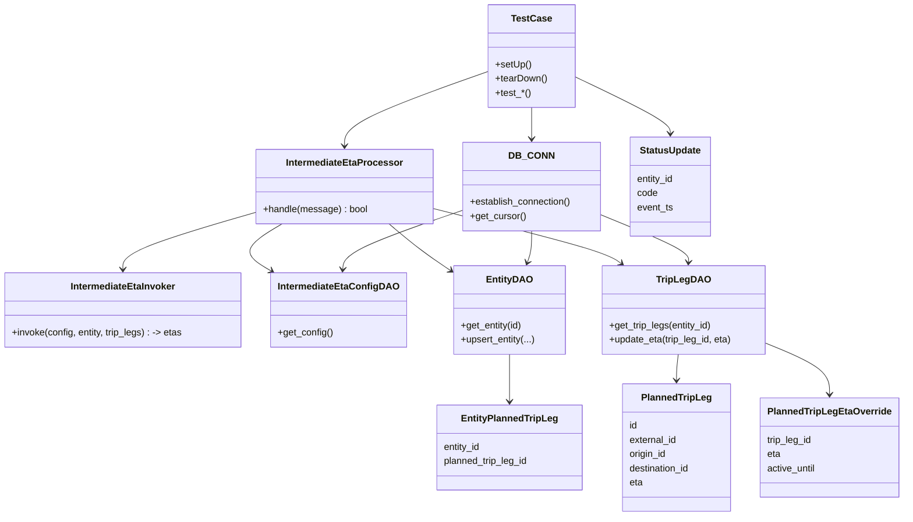
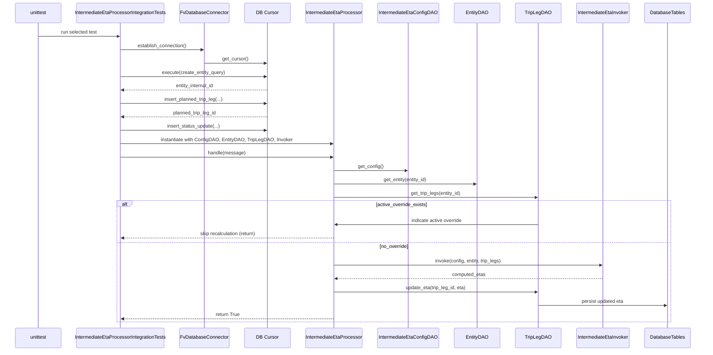
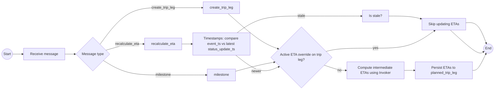

# Diagram: entity_core/entity_service/entity_listener/tests/integration/test_intermediate_eta_processor.py

> Auto-generated by Obscura crawlers

## Diagram 1

### SVG

<svg id="container" width="1512.33203125" xmlns="http://www.w3.org/2000/svg" class="classDiagram" height="874" viewBox="0 0 1512.33203125 874" role="graphics-document document" aria-roledescription="class"><g><defs><marker id="container_class-aggregationStart" class="marker aggregation class" refX="18" refY="7" markerWidth="190" markerHeight="240" orient="auto"><path d="M 18,7 L9,13 L1,7 L9,1 Z"></path></marker></defs><defs><marker id="container_class-aggregationEnd" class="marker aggregation class" refX="1" refY="7" markerWidth="20" markerHeight="28" orient="auto"><path d="M 18,7 L9,13 L1,7 L9,1 Z"></path></marker></defs><defs><marker id="container_class-extensionStart" class="marker extension class" refX="18" refY="7" markerWidth="190" markerHeight="240" orient="auto"><path d="M 1,7 L18,13 V 1 Z"></path></marker></defs><defs><marker id="container_class-extensionEnd" class="marker extension class" refX="1" refY="7" markerWidth="20" markerHeight="28" orient="auto"><path d="M 1,1 V 13 L18,7 Z"></path></marker></defs><defs><marker id="container_class-compositionStart" class="marker composition class" refX="18" refY="7" markerWidth="190" markerHeight="240" orient="auto"><path d="M 18,7 L9,13 L1,7 L9,1 Z"></path></marker></defs><defs><marker id="container_class-compositionEnd" class="marker composition class" refX="1" refY="7" markerWidth="20" markerHeight="28" orient="auto"><path d="M 18,7 L9,13 L1,7 L9,1 Z"></path></marker></defs><defs><marker id="container_class-dependencyStart" class="marker dependency class" refX="6" refY="7" markerWidth="190" markerHeight="240" orient="auto"><path d="M 5,7 L9,13 L1,7 L9,1 Z"></path></marker></defs><defs><marker id="container_class-dependencyEnd" class="marker dependency class" refX="13" refY="7" markerWidth="20" markerHeight="28" orient="auto"><path d="M 18,7 L9,13 L14,7 L9,1 Z"></path></marker></defs><defs><marker id="container_class-lollipopStart" class="marker lollipop class" refX="13" refY="7" markerWidth="190" markerHeight="240" orient="auto"><circle stroke="black" fill="transparent" cx="7" cy="7" r="6"></circle></marker></defs><defs><marker id="container_class-lollipopEnd" class="marker lollipop class" refX="1" refY="7" markerWidth="190" markerHeight="240" orient="auto"><circle stroke="black" fill="transparent" cx="7" cy="7" r="6"></circle></marker></defs><g class="root"><g class="clusters"></g><g class="edgePaths"><path d="M431.426,359.466L394.341,370.389C357.257,381.311,283.087,403.155,246.003,419.244C208.918,435.333,208.918,445.667,208.918,450.833L208.918,456" id="id_IntermediateEtaProcessor_IntermediateEtaInvoker_1" class="edge-thickness-normal edge-pattern-solid relation" style=";;;" data-edge="true" data-et="edge" data-id="id_IntermediateEtaProcessor_IntermediateEtaInvoker_1" data-points="W3sieCI6NDMxLjQyNTc4MTI1LCJ5IjozNTkuNDY2MzE0MTM0MDI1N30seyJ4IjoyMDguOTE3OTY4NzUsInkiOjQyNX0seyJ4IjoyMDguOTE3OTY4NzUsInkiOjQ2Mn1d" marker-end="url(#container_class-dependencyEnd)"></path><path d="M474.945,379L462.281,386.667C449.618,394.333,424.29,409.667,421.251,422.993C418.211,436.319,437.459,447.639,447.083,453.299L456.708,458.958" id="id_IntermediateEtaProcessor_IntermediateEtaConfigDAO_2" class="edge-thickness-normal edge-pattern-solid relation" style=";;;" data-edge="true" data-et="edge" data-id="id_IntermediateEtaProcessor_IntermediateEtaConfigDAO_2" data-points="W3sieCI6NDc0Ljk0NTE1MTIzMjc5ODE0LCJ5IjozNzl9LHsieCI6Mzk4Ljk2Mjg5MDYyNSwieSI6NDI1fSx7IngiOjQ2MS44Nzk1MTE3MTg3NSwieSI6NDYyfV0=" marker-end="url(#container_class-dependencyEnd)"></path><path d="M652.082,379L660.974,386.667C669.867,394.333,687.652,409.667,705.017,423C722.382,436.333,739.326,447.667,747.798,453.334L756.271,459" id="id_IntermediateEtaProcessor_EntityDAO_3" class="edge-thickness-normal edge-pattern-solid relation" style=";;;" data-edge="true" data-et="edge" data-id="id_IntermediateEtaProcessor_EntityDAO_3" data-points="W3sieCI6NjUyLjA4MTg1MjA2NDIyMDEsInkiOjM3OX0seyJ4Ijo3MDUuNDM3NSwieSI6NDI1fSx7IngiOjc2MS4yNTc4MTI1LCJ5Ijo0NjIuMzM2MDUwNTgyNjQwOTV9XQ==" marker-end="url(#container_class-dependencyEnd)"></path><path d="M726.59,353.069L774.32,365.057C822.049,377.046,917.509,401.023,970.02,416.58C1022.531,432.137,1032.093,439.274,1036.874,442.843L1041.655,446.411" id="id_IntermediateEtaProcessor_TripLegDAO_4" class="edge-thickness-normal edge-pattern-solid relation" style=";;;" data-edge="true" data-et="edge" data-id="id_IntermediateEtaProcessor_TripLegDAO_4" data-points="W3sieCI6NzI2LjU4OTg0Mzc1LCJ5IjozNTMuMDY4ODY5NjA1OTE5M30seyJ4IjoxMDEyLjk2ODc1LCJ5Ijo0MjV9LHsieCI6MTA0Ni40NjI4OTA2MjUsInkiOjQ1MH1d" marker-end="url(#container_class-dependencyEnd)"></path><path d="M892.426,182L892.426,186.167C892.426,190.333,892.426,198.667,892.426,207.5C892.426,216.333,892.426,225.667,892.426,230.333L892.426,235" id="id_TestCase_DB_CONN_5" class="edge-thickness-normal edge-pattern-solid relation" style=";;;" data-edge="true" data-et="edge" data-id="id_TestCase_DB_CONN_5" data-points="W3sieCI6ODkyLjQyNTc4MTI1LCJ5IjoxODJ9LHsieCI6ODkyLjQyNTc4MTI1LCJ5IjoyMDd9LHsieCI6ODkyLjQyNTc4MTI1LCJ5IjoyNDF9XQ==" marker-end="url(#container_class-dependencyEnd)"></path><path d="M820.371,120.749L780.144,135.124C739.917,149.499,659.462,178.25,619.235,199.291C579.008,220.333,579.008,233.667,579.008,240.333L579.008,247" id="id_TestCase_IntermediateEtaProcessor_6" class="edge-thickness-normal edge-pattern-solid relation" style=";;;" data-edge="true" data-et="edge" data-id="id_TestCase_IntermediateEtaProcessor_6" data-points="W3sieCI6ODIwLjM3MTA5Mzc1LCJ5IjoxMjAuNzQ4NzYzMDA4NjYyMDV9LHsieCI6NTc5LjAwNzgxMjUsInkiOjIwN30seyJ4Ijo1NzkuMDA3ODEyNSwieSI6MjUzfV0=" marker-end="url(#container_class-dependencyEnd)"></path><path d="M892.426,391L892.426,396.667C892.426,402.333,892.426,413.667,891.215,422.564C890.004,431.461,887.583,437.921,886.372,441.151L885.161,444.382" id="id_DB_CONN_EntityDAO_7" class="edge-thickness-normal edge-pattern-solid relation" style=";;;" data-edge="true" data-et="edge" data-id="id_DB_CONN_EntityDAO_7" data-points="W3sieCI6ODkyLjQyNTc4MTI1LCJ5IjozOTF9LHsieCI6ODkyLjQyNTc4MTI1LCJ5Ijo0MjV9LHsieCI6ODgzLjA1NTY2NDA2MjUsInkiOjQ1MH1d" marker-end="url(#container_class-dependencyEnd)"></path><path d="M1008.262,363.732L1033.042,373.944C1057.823,384.155,1107.384,404.577,1131.848,417.96C1156.311,431.343,1155.677,437.687,1155.359,440.858L1155.042,444.03" id="id_DB_CONN_TripLegDAO_8" class="edge-thickness-normal edge-pattern-solid relation" style=";;;" data-edge="true" data-et="edge" data-id="id_DB_CONN_TripLegDAO_8" data-points="W3sieCI6MTAwOC4yNjE3MTg3NSwieSI6MzYzLjczMjI2ODExNTgzNTA0fSx7IngiOjExNTYuOTQ1MzEyNSwieSI6NDI1fSx7IngiOjExNTQuNDQ1MzEyNSwieSI6NDUwfV0=" marker-end="url(#container_class-dependencyEnd)"></path><path d="M776.59,356.285L743.66,367.738C710.729,379.19,644.868,402.095,611.421,418.719C577.973,435.343,576.939,445.687,576.422,450.858L575.905,456.03" id="id_DB_CONN_IntermediateEtaConfigDAO_9" class="edge-thickness-normal edge-pattern-solid relation" style=";;;" data-edge="true" data-et="edge" data-id="id_DB_CONN_IntermediateEtaConfigDAO_9" data-points="W3sieCI6Nzc2LjU4OTg0Mzc1LCJ5IjozNTYuMjg1MjM3MTE1OTcxOH0seyJ4Ijo1NzkuMDA3ODEyNSwieSI6NDI1fSx7IngiOjU3NS4zMDc4MTI1LCJ5Ijo0NjJ9XQ==" marker-end="url(#container_class-dependencyEnd)"></path><path d="M1139.179,600L1138.747,604.167C1138.316,608.333,1137.453,616.667,1137.021,624C1136.59,631.333,1136.59,637.667,1136.59,640.833L1136.59,644" id="id_TripLegDAO_PlannedTripLeg_10" class="edge-thickness-normal edge-pattern-solid relation" style=";;;" data-edge="true" data-et="edge" data-id="id_TripLegDAO_PlannedTripLeg_10" data-points="W3sieCI6MTEzOS4xNzg3MTA5Mzc1LCJ5Ijo2MDB9LHsieCI6MTEzNi41ODk4NDM3NSwieSI6NjI1fSx7IngiOjExMzYuNTg5ODQzNzUsInkiOjY1MH1d" marker-end="url(#container_class-dependencyEnd)"></path><path d="M1284.902,581.278L1302.766,588.565C1320.629,595.852,1356.355,610.426,1374.219,624.88C1392.082,639.333,1392.082,653.667,1392.082,660.833L1392.082,668" id="id_TripLegDAO_PlannedTripLegEtaOverride_11" class="edge-thickness-normal edge-pattern-solid relation" style=";;;" data-edge="true" data-et="edge" data-id="id_TripLegDAO_PlannedTripLegEtaOverride_11" data-points="W3sieCI6MTI4NC45MDIzNDM3NSwieSI6NTgxLjI3NzU4NzQ0MzIzMTZ9LHsieCI6MTM5Mi4wODIwMzEyNSwieSI6NjI1fSx7IngiOjEzOTIuMDgyMDMxMjUsInkiOjY3NH1d" marker-end="url(#container_class-dependencyEnd)"></path><path d="M854.945,600L854.945,604.167C854.945,608.333,854.945,616.667,854.945,630C854.945,643.333,854.945,661.667,854.945,670.833L854.945,680" id="id_EntityDAO_EntityPlannedTripLeg_12" class="edge-thickness-normal edge-pattern-solid relation" style=";;;" data-edge="true" data-et="edge" data-id="id_EntityDAO_EntityPlannedTripLeg_12" data-points="W3sieCI6ODU0Ljk0NTMxMjUsInkiOjYwMH0seyJ4Ijo4NTQuOTQ1MzEyNSwieSI6NjI1fSx7IngiOjg1NC45NDUzMTI1LCJ5Ijo2ODZ9XQ==" marker-end="url(#container_class-dependencyEnd)"></path><path d="M964.48,129.373L991.602,142.311C1018.723,155.249,1072.965,181.124,1100.086,197.229C1127.207,213.333,1127.207,219.667,1127.207,222.833L1127.207,226" id="id_TestCase_StatusUpdate_13" class="edge-thickness-normal edge-pattern-solid relation" style=";;;" data-edge="true" data-et="edge" data-id="id_TestCase_StatusUpdate_13" data-points="W3sieCI6OTY0LjQ4MDQ2ODc1LCJ5IjoxMjkuMzcyOTUzNTQ3MTg0ODZ9LHsieCI6MTEyNy4yMDcwMzEyNSwieSI6MjA3fSx7IngiOjExMjcuMjA3MDMxMjUsInkiOjIzMn1d" marker-end="url(#container_class-dependencyEnd)"></path></g><g class="edgeLabels"><g class="edgeLabel"><g class="label" data-id="id_IntermediateEtaProcessor_IntermediateEtaInvoker_1" transform="translate(0, 0)"><foreignObject width="0" height="0">

</foreignObject></g></g><g class="edgeLabel"><g class="label" data-id="id_IntermediateEtaProcessor_IntermediateEtaConfigDAO_2" transform="translate(0, 0)"><foreignObject width="0" height="0">

</foreignObject></g></g><g class="edgeLabel"><g class="label" data-id="id_IntermediateEtaProcessor_EntityDAO_3" transform="translate(0, 0)"><foreignObject width="0" height="0">

</foreignObject></g></g><g class="edgeLabel"><g class="label" data-id="id_IntermediateEtaProcessor_TripLegDAO_4" transform="translate(0, 0)"><foreignObject width="0" height="0">

</foreignObject></g></g><g class="edgeLabel"><g class="label" data-id="id_TestCase_DB_CONN_5" transform="translate(0, 0)"><foreignObject width="0" height="0">

</foreignObject></g></g><g class="edgeLabel"><g class="label" data-id="id_TestCase_IntermediateEtaProcessor_6" transform="translate(0, 0)"><foreignObject width="0" height="0">

</foreignObject></g></g><g class="edgeLabel"><g class="label" data-id="id_DB_CONN_EntityDAO_7" transform="translate(0, 0)"><foreignObject width="0" height="0">

</foreignObject></g></g><g class="edgeLabel"><g class="label" data-id="id_DB_CONN_TripLegDAO_8" transform="translate(0, 0)"><foreignObject width="0" height="0">

</foreignObject></g></g><g class="edgeLabel"><g class="label" data-id="id_DB_CONN_IntermediateEtaConfigDAO_9" transform="translate(0, 0)"><foreignObject width="0" height="0">

</foreignObject></g></g><g class="edgeLabel"><g class="label" data-id="id_TripLegDAO_PlannedTripLeg_10" transform="translate(0, 0)"><foreignObject width="0" height="0">

</foreignObject></g></g><g class="edgeLabel"><g class="label" data-id="id_TripLegDAO_PlannedTripLegEtaOverride_11" transform="translate(0, 0)"><foreignObject width="0" height="0">

</foreignObject></g></g><g class="edgeLabel"><g class="label" data-id="id_EntityDAO_EntityPlannedTripLeg_12" transform="translate(0, 0)"><foreignObject width="0" height="0">

</foreignObject></g></g><g class="edgeLabel"><g class="label" data-id="id_TestCase_StatusUpdate_13" transform="translate(0, 0)"><foreignObject width="0" height="0">

</foreignObject></g></g></g><g class="nodes"><g class="node default" id="classId-IntermediateEtaProcessor-0" transform="translate(579.0078125, 316)"><g class="basic label-container"><path d="M-147.58203125 -63 L147.58203125 -63 L147.58203125 63 L-147.58203125 63" stroke="none" stroke-width="0" fill="#ECECFF" style=""></path><path d="M-147.58203125 -63 C-56.97944812187538 -63, 33.62313500624924 -63, 147.58203125 -63 M-147.58203125 -63 C-87.9142352973233 -63, -28.246439344646618 -63, 147.58203125 -63 M147.58203125 -63 C147.58203125 -33.45685364278758, 147.58203125 -3.91370728557515, 147.58203125 63 M147.58203125 -63 C147.58203125 -25.73137720735763, 147.58203125 11.537245585284737, 147.58203125 63 M147.58203125 63 C41.389616057496184 63, -64.80279913500763 63, -147.58203125 63 M147.58203125 63 C84.09496079538283 63, 20.607890340765664 63, -147.58203125 63 M-147.58203125 63 C-147.58203125 21.9737048604605, -147.58203125 -19.052590279079, -147.58203125 -63 M-147.58203125 63 C-147.58203125 21.049509083246065, -147.58203125 -20.90098183350787, -147.58203125 -63" stroke="#9370DB" stroke-width="1.3" fill="none" stroke-dasharray="0 0" style=""></path></g><g class="annotation-group text" transform="translate(0, -39)"></g><g class="label-group text" transform="translate(-94.8671875, -39)"><g class="label" style="font-weight: bolder" transform="translate(0,-12)"><foreignObject width="189.734375" height="24">

IntermediateEtaProcessor

</foreignObject></g></g><g class="members-group text" transform="translate(-135.58203125, 9)"></g><g class="methods-group text" transform="translate(-135.58203125, 39)"><g class="label" style="" transform="translate(0,-12)"><foreignObject width="176.296875" height="24">

+handle(message) : bool

</foreignObject></g></g><g class="divider" style=""><path d="M-147.58203125 -15 C-78.87319192808846 -15, -10.16435260617692 -15, 147.58203125 -15 M-147.58203125 -15 C-41.26271081201209 -15, 65.05660962597582 -15, 147.58203125 -15" stroke="#9370DB" stroke-width="1.3" fill="none" stroke-dasharray="0 0" style=""></path></g><g class="divider" style=""><path d="M-147.58203125 9 C-37.17053997278889 9, 73.24095130442223 9, 147.58203125 9 M-147.58203125 9 C-73.29158108136663 9, 0.9988690872667405 9, 147.58203125 9" stroke="#9370DB" stroke-width="1.3" fill="none" stroke-dasharray="0 0" style=""></path></g></g><g class="node default" id="classId-IntermediateEtaInvoker-1" transform="translate(208.91796875, 525)"><g class="basic label-container"><path d="M-200.91796875 -63 L200.91796875 -63 L200.91796875 63 L-200.91796875 63" stroke="none" stroke-width="0" fill="#ECECFF" style=""></path><path d="M-200.91796875 -63 C-120.25565519082814 -63, -39.59334163165627 -63, 200.91796875 -63 M-200.91796875 -63 C-64.5296960011988 -63, 71.8585767476024 -63, 200.91796875 -63 M200.91796875 -63 C200.91796875 -14.200121928104672, 200.91796875 34.59975614379066, 200.91796875 63 M200.91796875 -63 C200.91796875 -26.86943042177073, 200.91796875 9.26113915645854, 200.91796875 63 M200.91796875 63 C79.0974136267527 63, -42.723141496494605 63, -200.91796875 63 M200.91796875 63 C79.81871381775824 63, -41.280541114483526 63, -200.91796875 63 M-200.91796875 63 C-200.91796875 29.650084439399663, -200.91796875 -3.699831121200674, -200.91796875 -63 M-200.91796875 63 C-200.91796875 22.971810817575737, -200.91796875 -17.056378364848527, -200.91796875 -63" stroke="#9370DB" stroke-width="1.3" fill="none" stroke-dasharray="0 0" style=""></path></g><g class="annotation-group text" transform="translate(0, -39)"></g><g class="label-group text" transform="translate(-86.5078125, -39)"><g class="label" style="font-weight: bolder" transform="translate(0,-12)"><foreignObject width="173.015625" height="24">

IntermediateEtaInvoker

</foreignObject></g></g><g class="members-group text" transform="translate(-188.91796875, 9)"></g><g class="methods-group text" transform="translate(-188.91796875, 39)"><g class="label" style="" transform="translate(0,-12)"><foreignObject width="291.328125" height="24">

+invoke(config, entity, trip_legs) : -&gt; etas

</foreignObject></g></g><g class="divider" style=""><path d="M-200.91796875 -15 C-108.05753572355685 -15, -15.197102697113706 -15, 200.91796875 -15 M-200.91796875 -15 C-70.48660974814408 -15, 59.94474925371185 -15, 200.91796875 -15" stroke="#9370DB" stroke-width="1.3" fill="none" stroke-dasharray="0 0" style=""></path></g><g class="divider" style=""><path d="M-200.91796875 9 C-68.59233383508004 9, 63.73330107983992 9, 200.91796875 9 M-200.91796875 9 C-100.81155709973964 9, -0.7051454494792893 9, 200.91796875 9" stroke="#9370DB" stroke-width="1.3" fill="none" stroke-dasharray="0 0" style=""></path></g></g><g class="node default" id="classId-IntermediateEtaConfigDAO-2" transform="translate(569.0078125, 525)"><g class="basic label-container"><path d="M-109.171875 -63 L109.171875 -63 L109.171875 63 L-109.171875 63" stroke="none" stroke-width="0" fill="#ECECFF" style=""></path><path d="M-109.171875 -63 C-62.44953347294514 -63, -15.727191945890283 -63, 109.171875 -63 M-109.171875 -63 C-42.660520447178 -63, 23.850834105643997 -63, 109.171875 -63 M109.171875 -63 C109.171875 -18.4889629842419, 109.171875 26.022074031516198, 109.171875 63 M109.171875 -63 C109.171875 -17.784281313857555, 109.171875 27.43143737228489, 109.171875 63 M109.171875 63 C62.84299038661087 63, 16.514105773221743 63, -109.171875 63 M109.171875 63 C37.667443492631676 63, -33.83698801473665 63, -109.171875 63 M-109.171875 63 C-109.171875 27.466507520112984, -109.171875 -8.066984959774032, -109.171875 -63 M-109.171875 63 C-109.171875 37.492629213445085, -109.171875 11.985258426890162, -109.171875 -63" stroke="#9370DB" stroke-width="1.3" fill="none" stroke-dasharray="0 0" style=""></path></g><g class="annotation-group text" transform="translate(0, -39)"></g><g class="label-group text" transform="translate(-97.171875, -39)"><g class="label" style="font-weight: bolder" transform="translate(0,-12)"><foreignObject width="194.34375" height="24">

IntermediateEtaConfigDAO

</foreignObject></g></g><g class="members-group text" transform="translate(-97.171875, 9)"></g><g class="methods-group text" transform="translate(-97.171875, 39)"><g class="label" style="" transform="translate(0,-12)"><foreignObject width="92.484375" height="24">

+get_config()

</foreignObject></g></g><g class="divider" style=""><path d="M-109.171875 -15 C-51.65066172787703 -15, 5.8705515442459415 -15, 109.171875 -15 M-109.171875 -15 C-34.1083371041873 -15, 40.9552007916254 -15, 109.171875 -15" stroke="#9370DB" stroke-width="1.3" fill="none" stroke-dasharray="0 0" style=""></path></g><g class="divider" style=""><path d="M-109.171875 9 C-36.0215062269763 9, 37.1288625460474 9, 109.171875 9 M-109.171875 9 C-44.177204487472 9, 20.817466025056007 9, 109.171875 9" stroke="#9370DB" stroke-width="1.3" fill="none" stroke-dasharray="0 0" style=""></path></g></g><g class="node default" id="classId-EntityDAO-3" transform="translate(854.9453125, 525)"><g class="basic label-container"><path d="M-93.6875 -75 L93.6875 -75 L93.6875 75 L-93.6875 75" stroke="none" stroke-width="0" fill="#ECECFF" style=""></path><path d="M-93.6875 -75 C-27.557013026106958 -75, 38.573473947786084 -75, 93.6875 -75 M-93.6875 -75 C-36.290440829776756 -75, 21.106618340446488 -75, 93.6875 -75 M93.6875 -75 C93.6875 -23.49271383789143, 93.6875 28.01457232421714, 93.6875 75 M93.6875 -75 C93.6875 -31.30181090944729, 93.6875 12.396378181105419, 93.6875 75 M93.6875 75 C44.895066178189786 75, -3.897367643620427 75, -93.6875 75 M93.6875 75 C46.206779743262125 75, -1.2739405134757504 75, -93.6875 75 M-93.6875 75 C-93.6875 33.76818987900351, -93.6875 -7.4636202419929845, -93.6875 -75 M-93.6875 75 C-93.6875 23.449486429007216, -93.6875 -28.10102714198557, -93.6875 -75" stroke="#9370DB" stroke-width="1.3" fill="none" stroke-dasharray="0 0" style=""></path></g><g class="annotation-group text" transform="translate(0, -51)"></g><g class="label-group text" transform="translate(-36.578125, -51)"><g class="label" style="font-weight: bolder" transform="translate(0,-12)"><foreignObject width="73.15625" height="24">

EntityDAO

</foreignObject></g></g><g class="members-group text" transform="translate(-81.6875, -3)"></g><g class="methods-group text" transform="translate(-81.6875, 27)"><g class="label" style="" transform="translate(0,-12)"><foreignObject width="104.953125" height="24">

+get_entity(id)

</foreignObject></g><g class="label" style="" transform="translate(0,12)"><foreignObject width="126.796875" height="24">

+upsert_entity(...)

</foreignObject></g></g><g class="divider" style=""><path d="M-93.6875 -27 C-35.56839114777458 -27, 22.550717704450847 -27, 93.6875 -27 M-93.6875 -27 C-32.560118786961596 -27, 28.56726242607681 -27, 93.6875 -27" stroke="#9370DB" stroke-width="1.3" fill="none" stroke-dasharray="0 0" style=""></path></g><g class="divider" style=""><path d="M-93.6875 -3 C-51.800801845150694 -3, -9.914103690301388 -3, 93.6875 -3 M-93.6875 -3 C-51.52068665354766 -3, -9.353873307095327 -3, 93.6875 -3" stroke="#9370DB" stroke-width="1.3" fill="none" stroke-dasharray="0 0" style=""></path></g></g><g class="node default" id="classId-TripLegDAO-4" transform="translate(1146.9453125, 525)"><g class="basic label-container"><path d="M-137.95703125 -75 L137.95703125 -75 L137.95703125 75 L-137.95703125 75" stroke="none" stroke-width="0" fill="#ECECFF" style=""></path><path d="M-137.95703125 -75 C-53.05077331594383 -75, 31.855484618112342 -75, 137.95703125 -75 M-137.95703125 -75 C-74.86582246884947 -75, -11.77461368769896 -75, 137.95703125 -75 M137.95703125 -75 C137.95703125 -41.63540120487652, 137.95703125 -8.270802409753045, 137.95703125 75 M137.95703125 -75 C137.95703125 -33.68364347871772, 137.95703125 7.632713042564561, 137.95703125 75 M137.95703125 75 C61.60508859996796 75, -14.746854050064087 75, -137.95703125 75 M137.95703125 75 C75.69923310753546 75, 13.441434965070926 75, -137.95703125 75 M-137.95703125 75 C-137.95703125 16.45962590482698, -137.95703125 -42.08074819034604, -137.95703125 -75 M-137.95703125 75 C-137.95703125 43.19238792469346, -137.95703125 11.384775849386926, -137.95703125 -75" stroke="#9370DB" stroke-width="1.3" fill="none" stroke-dasharray="0 0" style=""></path></g><g class="annotation-group text" transform="translate(0, -51)"></g><g class="label-group text" transform="translate(-42.3515625, -51)"><g class="label" style="font-weight: bolder" transform="translate(0,-12)"><foreignObject width="84.703125" height="24">

TripLegDAO

</foreignObject></g></g><g class="members-group text" transform="translate(-125.95703125, -3)"></g><g class="methods-group text" transform="translate(-125.95703125, 27)"><g class="label" style="" transform="translate(0,-12)"><foreignObject width="175.609375" height="24">

+get_trip_legs(entity_id)

</foreignObject></g><g class="label" style="" transform="translate(0,12)"><foreignObject width="209.5625" height="24">

+update_eta(trip_leg_id, eta)

</foreignObject></g></g><g class="divider" style=""><path d="M-137.95703125 -27 C-69.33177771081502 -27, -0.7065241716300363 -27, 137.95703125 -27 M-137.95703125 -27 C-81.74723898702555 -27, -25.537446724051122 -27, 137.95703125 -27" stroke="#9370DB" stroke-width="1.3" fill="none" stroke-dasharray="0 0" style=""></path></g><g class="divider" style=""><path d="M-137.95703125 -3 C-72.66820904080313 -3, -7.3793868316062685 -3, 137.95703125 -3 M-137.95703125 -3 C-42.312987279402876 -3, 53.33105669119425 -3, 137.95703125 -3" stroke="#9370DB" stroke-width="1.3" fill="none" stroke-dasharray="0 0" style=""></path></g></g><g class="node default" id="classId-DB_CONN-5" transform="translate(892.42578125, 316)"><g class="basic label-container"><path d="M-115.8359375 -75 L115.8359375 -75 L115.8359375 75 L-115.8359375 75" stroke="none" stroke-width="0" fill="#ECECFF" style=""></path><path d="M-115.8359375 -75 C-59.394859852186286 -75, -2.9537822043725726 -75, 115.8359375 -75 M-115.8359375 -75 C-25.3920446354861 -75, 65.0518482290278 -75, 115.8359375 -75 M115.8359375 -75 C115.8359375 -20.32327085078108, 115.8359375 34.35345829843784, 115.8359375 75 M115.8359375 -75 C115.8359375 -24.53283294442449, 115.8359375 25.934334111151017, 115.8359375 75 M115.8359375 75 C26.08638936535766 75, -63.66315876928468 75, -115.8359375 75 M115.8359375 75 C24.026342465228836 75, -67.78325256954233 75, -115.8359375 75 M-115.8359375 75 C-115.8359375 44.45827397309772, -115.8359375 13.916547946195443, -115.8359375 -75 M-115.8359375 75 C-115.8359375 40.17161245623275, -115.8359375 5.343224912465502, -115.8359375 -75" stroke="#9370DB" stroke-width="1.3" fill="none" stroke-dasharray="0 0" style=""></path></g><g class="annotation-group text" transform="translate(0, -51)"></g><g class="label-group text" transform="translate(-34.40625, -51)"><g class="label" style="font-weight: bolder" transform="translate(0,-12)"><foreignObject width="68.8125" height="24">

DB_CONN

</foreignObject></g></g><g class="members-group text" transform="translate(-103.8359375, -3)"></g><g class="methods-group text" transform="translate(-103.8359375, 27)"><g class="label" style="" transform="translate(0,-12)"><foreignObject width="173.265625" height="24">

+establish_connection()

</foreignObject></g><g class="label" style="" transform="translate(0,12)"><foreignObject width="94.640625" height="24">

+get_cursor()

</foreignObject></g></g><g class="divider" style=""><path d="M-115.8359375 -27 C-25.196319202014365 -27, 65.44329909597127 -27, 115.8359375 -27 M-115.8359375 -27 C-36.9254727969913 -27, 41.9849919060174 -27, 115.8359375 -27" stroke="#9370DB" stroke-width="1.3" fill="none" stroke-dasharray="0 0" style=""></path></g><g class="divider" style=""><path d="M-115.8359375 -3 C-33.24500736868774 -3, 49.345922762624525 -3, 115.8359375 -3 M-115.8359375 -3 C-68.48316927799183 -3, -21.13040105598367 -3, 115.8359375 -3" stroke="#9370DB" stroke-width="1.3" fill="none" stroke-dasharray="0 0" style=""></path></g></g><g class="node default" id="classId-TestCase-6" transform="translate(892.42578125, 95)"><g class="basic label-container"><path d="M-72.0546875 -87 L72.0546875 -87 L72.0546875 87 L-72.0546875 87" stroke="none" stroke-width="0" fill="#ECECFF" style=""></path><path d="M-72.0546875 -87 C-23.534047842908436 -87, 24.98659181418313 -87, 72.0546875 -87 M-72.0546875 -87 C-33.07478068578558 -87, 5.905126128428833 -87, 72.0546875 -87 M72.0546875 -87 C72.0546875 -35.209829885008595, 72.0546875 16.58034022998281, 72.0546875 87 M72.0546875 -87 C72.0546875 -33.246659318045786, 72.0546875 20.506681363908427, 72.0546875 87 M72.0546875 87 C16.265058870920747 87, -39.524569758158506 87, -72.0546875 87 M72.0546875 87 C33.737156220957125 87, -4.58037505808575 87, -72.0546875 87 M-72.0546875 87 C-72.0546875 38.64734324870197, -72.0546875 -9.705313502596056, -72.0546875 -87 M-72.0546875 87 C-72.0546875 35.343682241876955, -72.0546875 -16.31263551624609, -72.0546875 -87" stroke="#9370DB" stroke-width="1.3" fill="none" stroke-dasharray="0 0" style=""></path></g><g class="annotation-group text" transform="translate(0, -63)"></g><g class="label-group text" transform="translate(-32.359375, -63)"><g class="label" style="font-weight: bolder" transform="translate(0,-12)"><foreignObject width="64.71875" height="24">

TestCase

</foreignObject></g></g><g class="members-group text" transform="translate(-60.0546875, -15)"></g><g class="methods-group text" transform="translate(-60.0546875, 15)"><g class="label" style="" transform="translate(0,-12)"><foreignObject width="60.421875" height="24">

+setUp()

</foreignObject></g><g class="label" style="" transform="translate(0,12)"><foreignObject width="87.75" height="24">

+tearDown()

</foreignObject></g><g class="label" style="" transform="translate(0,36)"><foreignObject width="59.53125" height="24">

+test_*()

</foreignObject></g></g><g class="divider" style=""><path d="M-72.0546875 -39 C-16.1974906140698 -39, 39.6597062718604 -39, 72.0546875 -39 M-72.0546875 -39 C-39.5188274507481 -39, -6.982967401496197 -39, 72.0546875 -39" stroke="#9370DB" stroke-width="1.3" fill="none" stroke-dasharray="0 0" style=""></path></g><g class="divider" style=""><path d="M-72.0546875 -15 C-22.035925449839574 -15, 27.98283660032085 -15, 72.0546875 -15 M-72.0546875 -15 C-20.92843586084185 -15, 30.197815778316297 -15, 72.0546875 -15" stroke="#9370DB" stroke-width="1.3" fill="none" stroke-dasharray="0 0" style=""></path></g></g><g class="node default" id="classId-PlannedTripLeg-7" transform="translate(1136.58984375, 758)"><g class="basic label-container"><path d="M-93.2421875 -108 L93.2421875 -108 L93.2421875 108 L-93.2421875 108" stroke="none" stroke-width="0" fill="#ECECFF" style=""></path><path d="M-93.2421875 -108 C-47.54695015520155 -108, -1.8517128104031002 -108, 93.2421875 -108 M-93.2421875 -108 C-30.929191678753206 -108, 31.383804142493588 -108, 93.2421875 -108 M93.2421875 -108 C93.2421875 -54.51642144451735, 93.2421875 -1.032842889034697, 93.2421875 108 M93.2421875 -108 C93.2421875 -22.09545852758346, 93.2421875 63.80908294483308, 93.2421875 108 M93.2421875 108 C27.897904066265014 108, -37.44637936746997 108, -93.2421875 108 M93.2421875 108 C45.48453255627872 108, -2.2731223874425552 108, -93.2421875 108 M-93.2421875 108 C-93.2421875 55.7659225695256, -93.2421875 3.5318451390511996, -93.2421875 -108 M-93.2421875 108 C-93.2421875 44.40886583939564, -93.2421875 -19.182268321208724, -93.2421875 -108" stroke="#9370DB" stroke-width="1.3" fill="none" stroke-dasharray="0 0" style=""></path></g><g class="annotation-group text" transform="translate(0, -84)"></g><g class="label-group text" transform="translate(-56.9375, -84)"><g class="label" style="font-weight: bolder" transform="translate(0,-12)"><foreignObject width="113.875" height="24">

PlannedTripLeg

</foreignObject></g></g><g class="members-group text" transform="translate(-81.2421875, -36)"><g class="label" style="" transform="translate(0,-12)"><foreignObject width="14.09375" height="24">

id

</foreignObject></g><g class="label" style="" transform="translate(0,12)"><foreignObject width="81.78125" height="24">

external_id

</foreignObject></g><g class="label" style="" transform="translate(0,36)"><foreignObject width="64.640625" height="24">

origin_id

</foreignObject></g><g class="label" style="" transform="translate(0,60)"><foreignObject width="105.546875" height="24">

destination_id

</foreignObject></g><g class="label" style="" transform="translate(0,84)"><foreignObject width="23.09375" height="24">

eta

</foreignObject></g></g><g class="methods-group text" transform="translate(-81.2421875, 108)"></g><g class="divider" style=""><path d="M-93.2421875 -60 C-32.9450758297051 -60, 27.352035840589807 -60, 93.2421875 -60 M-93.2421875 -60 C-37.362592054582116 -60, 18.517003390835768 -60, 93.2421875 -60" stroke="#9370DB" stroke-width="1.3" fill="none" stroke-dasharray="0 0" style=""></path></g><g class="divider" style=""><path d="M-93.2421875 84 C-21.23191807344098 84, 50.77835135311804 84, 93.2421875 84 M-93.2421875 84 C-34.59337133074685 84, 24.055444838506304 84, 93.2421875 84" stroke="#9370DB" stroke-width="1.3" fill="none" stroke-dasharray="0 0" style=""></path></g></g><g class="node default" id="classId-PlannedTripLegEtaOverride-8" transform="translate(1392.08203125, 758)"><g class="basic label-container"><path d="M-112.25 -84 L112.25 -84 L112.25 84 L-112.25 84" stroke="none" stroke-width="0" fill="#ECECFF" style=""></path><path d="M-112.25 -84 C-29.086657491967742 -84, 54.076685016064516 -84, 112.25 -84 M-112.25 -84 C-29.76935858183076 -84, 52.71128283633848 -84, 112.25 -84 M112.25 -84 C112.25 -31.04210042448303, 112.25 21.915799151033937, 112.25 84 M112.25 -84 C112.25 -18.411879466456924, 112.25 47.17624106708615, 112.25 84 M112.25 84 C33.62145616267982 84, -45.00708767464036 84, -112.25 84 M112.25 84 C42.51995129307424 84, -27.210097413851514 84, -112.25 84 M-112.25 84 C-112.25 22.13969704759569, -112.25 -39.72060590480862, -112.25 -84 M-112.25 84 C-112.25 33.312610605123474, -112.25 -17.37477878975305, -112.25 -84" stroke="#9370DB" stroke-width="1.3" fill="none" stroke-dasharray="0 0" style=""></path></g><g class="annotation-group text" transform="translate(0, -60)"></g><g class="label-group text" transform="translate(-100.25, -60)"><g class="label" style="font-weight: bolder" transform="translate(0,-12)"><foreignObject width="200.5" height="24">

PlannedTripLegEtaOverride

</foreignObject></g></g><g class="members-group text" transform="translate(-100.25, -12)"><g class="label" style="" transform="translate(0,-12)"><foreignObject width="77.921875" height="24">

trip_leg_id

</foreignObject></g><g class="label" style="" transform="translate(0,12)"><foreignObject width="23.09375" height="24">

eta

</foreignObject></g><g class="label" style="" transform="translate(0,36)"><foreignObject width="84.515625" height="24">

active_until

</foreignObject></g></g><g class="methods-group text" transform="translate(-100.25, 84)"></g><g class="divider" style=""><path d="M-112.25 -36 C-26.087550357480595 -36, 60.07489928503881 -36, 112.25 -36 M-112.25 -36 C-47.080809648371655 -36, 18.08838070325669 -36, 112.25 -36" stroke="#9370DB" stroke-width="1.3" fill="none" stroke-dasharray="0 0" style=""></path></g><g class="divider" style=""><path d="M-112.25 60 C-22.707125409475893 60, 66.83574918104821 60, 112.25 60 M-112.25 60 C-53.03900289638491 60, 6.171994207230185 60, 112.25 60" stroke="#9370DB" stroke-width="1.3" fill="none" stroke-dasharray="0 0" style=""></path></g></g><g class="node default" id="classId-EntityPlannedTripLeg-9" transform="translate(854.9453125, 758)"><g class="basic label-container"><path d="M-124 -72 L124 -72 L124 72 L-124 72" stroke="none" stroke-width="0" fill="#ECECFF" style=""></path><path d="M-124 -72 C-50.04409368901899 -72, 23.911812621962014 -72, 124 -72 M-124 -72 C-54.16689145380742 -72, 15.666217092385153 -72, 124 -72 M124 -72 C124 -32.61269092290508, 124 6.774618154189838, 124 72 M124 -72 C124 -33.46567433884412, 124 5.068651322311766, 124 72 M124 72 C25.658731415768216 72, -72.68253716846357 72, -124 72 M124 72 C69.4924066739213 72, 14.984813347842604 72, -124 72 M-124 72 C-124 25.926314086860188, -124 -20.147371826279624, -124 -72 M-124 72 C-124 21.324655862638018, -124 -29.350688274723964, -124 -72" stroke="#9370DB" stroke-width="1.3" fill="none" stroke-dasharray="0 0" style=""></path></g><g class="annotation-group text" transform="translate(0, -48)"></g><g class="label-group text" transform="translate(-78.21875, -48)"><g class="label" style="font-weight: bolder" transform="translate(0,-12)"><foreignObject width="156.4375" height="24">

EntityPlannedTripLeg

</foreignObject></g></g><g class="members-group text" transform="translate(-112, 0)"><g class="label" style="" transform="translate(0,-12)"><foreignObject width="63.875" height="24">

entity_id

</foreignObject></g><g class="label" style="" transform="translate(0,12)"><foreignObject width="145.78125" height="24">

planned_trip_leg_id

</foreignObject></g></g><g class="methods-group text" transform="translate(-112, 72)"></g><g class="divider" style=""><path d="M-124 -24 C-50.20537972405697 -24, 23.589240551886064 -24, 124 -24 M-124 -24 C-29.670580553624617 -24, 64.65883889275077 -24, 124 -24" stroke="#9370DB" stroke-width="1.3" fill="none" stroke-dasharray="0 0" style=""></path></g><g class="divider" style=""><path d="M-124 48 C-69.74656648677697 48, -15.493132973553926 48, 124 48 M-124 48 C-26.566526722032066 48, 70.86694655593587 48, 124 48" stroke="#9370DB" stroke-width="1.3" fill="none" stroke-dasharray="0 0" style=""></path></g></g><g class="node default" id="classId-StatusUpdate-10" transform="translate(1127.20703125, 316)"><g class="basic label-container"><path d="M-68.9453125 -84 L68.9453125 -84 L68.9453125 84 L-68.9453125 84" stroke="none" stroke-width="0" fill="#ECECFF" style=""></path><path d="M-68.9453125 -84 C-21.440129433932604 -84, 26.06505363213479 -84, 68.9453125 -84 M-68.9453125 -84 C-27.093140863644372 -84, 14.759030772711256 -84, 68.9453125 -84 M68.9453125 -84 C68.9453125 -40.0597005296392, 68.9453125 3.8805989407215975, 68.9453125 84 M68.9453125 -84 C68.9453125 -28.890721589114868, 68.9453125 26.218556821770264, 68.9453125 84 M68.9453125 84 C16.336353372155962 84, -36.272605755688076 84, -68.9453125 84 M68.9453125 84 C18.619576413520335 84, -31.70615967295933 84, -68.9453125 84 M-68.9453125 84 C-68.9453125 31.59060311564845, -68.9453125 -20.818793768703102, -68.9453125 -84 M-68.9453125 84 C-68.9453125 33.490688924538496, -68.9453125 -17.018622150923008, -68.9453125 -84" stroke="#9370DB" stroke-width="1.3" fill="none" stroke-dasharray="0 0" style=""></path></g><g class="annotation-group text" transform="translate(0, -60)"></g><g class="label-group text" transform="translate(-50.015625, -60)"><g class="label" style="font-weight: bolder" transform="translate(0,-12)"><foreignObject width="100.03125" height="24">

StatusUpdate

</foreignObject></g></g><g class="members-group text" transform="translate(-56.9453125, -12)"><g class="label" style="" transform="translate(0,-12)"><foreignObject width="63.875" height="24">

entity_id

</foreignObject></g><g class="label" style="" transform="translate(0,12)"><foreignObject width="34.96875" height="24">

code

</foreignObject></g><g class="label" style="" transform="translate(0,36)"><foreignObject width="61.59375" height="24">

event_ts

</foreignObject></g></g><g class="methods-group text" transform="translate(-56.9453125, 84)"></g><g class="divider" style=""><path d="M-68.9453125 -36 C-31.625740809409805 -36, 5.693830881180389 -36, 68.9453125 -36 M-68.9453125 -36 C-40.10237395808201 -36, -11.259435416164017 -36, 68.9453125 -36" stroke="#9370DB" stroke-width="1.3" fill="none" stroke-dasharray="0 0" style=""></path></g><g class="divider" style=""><path d="M-68.9453125 60 C-17.6268886223259 60, 33.6915352553482 60, 68.9453125 60 M-68.9453125 60 C-35.32484298611415 60, -1.7043734722282977 60, 68.9453125 60" stroke="#9370DB" stroke-width="1.3" fill="none" stroke-dasharray="0 0" style=""></path></g></g></g></g></g></svg>

## Diagram 2

### SVG

<svg id="container" width="2413" xmlns="http://www.w3.org/2000/svg" height="1231" viewBox="-50 -10 2413 1231" role="graphics-document document" aria-roledescription="sequence"><g><rect x="2163" y="1145" fill="#eaeaea" stroke="#666" width="150" height="65" name="DBTables" rx="3" ry="3" class="actor actor-bottom"></rect><text x="2238" y="1177.5" dominant-baseline="central" alignment-baseline="central" class="actor actor-box" style="text-anchor: middle; font-size: 16px; font-weight: 400;"><tspan x="2238" dy="0">DatabaseTables</tspan></text></g><g><rect x="1921" y="1145" fill="#eaeaea" stroke="#666" width="192" height="65" name="Invoker" rx="3" ry="3" class="actor actor-bottom"></rect><text x="2017" y="1177.5" dominant-baseline="central" alignment-baseline="central" class="actor actor-box" style="text-anchor: middle; font-size: 16px; font-weight: 400;"><tspan x="2017" dy="0">IntermediateEtaInvoker</tspan></text></g><g><rect x="1721" y="1145" fill="#eaeaea" stroke="#666" width="150" height="65" name="TripLegDAO" rx="3" ry="3" class="actor actor-bottom"></rect><text x="1796" y="1177.5" dominant-baseline="central" alignment-baseline="central" class="actor actor-box" style="text-anchor: middle; font-size: 16px; font-weight: 400;"><tspan x="1796" dy="0">TripLegDAO</tspan></text></g><g><rect x="1521" y="1145" fill="#eaeaea" stroke="#666" width="150" height="65" name="EntityDAO" rx="3" ry="3" class="actor actor-bottom"></rect><text x="1596" y="1177.5" dominant-baseline="central" alignment-baseline="central" class="actor actor-box" style="text-anchor: middle; font-size: 16px; font-weight: 400;"><tspan x="1596" dy="0">EntityDAO</tspan></text></g><g><rect x="1259" y="1145" fill="#eaeaea" stroke="#666" width="212" height="65" name="ConfigDAO" rx="3" ry="3" class="actor actor-bottom"></rect><text x="1365" y="1177.5" dominant-baseline="central" alignment-baseline="central" class="actor actor-box" style="text-anchor: middle; font-size: 16px; font-weight: 400;"><tspan x="1365" dy="0">IntermediateEtaConfigDAO</tspan></text></g><g><rect x="1001" y="1145" fill="#eaeaea" stroke="#666" width="208" height="65" name="Processor" rx="3" ry="3" class="actor actor-bottom"></rect><text x="1105" y="1177.5" dominant-baseline="central" alignment-baseline="central" class="actor actor-box" style="text-anchor: middle; font-size: 16px; font-weight: 400;"><tspan x="1105" dy="0">IntermediateEtaProcessor</tspan></text></g><g><rect x="801" y="1145" fill="#eaeaea" stroke="#666" width="150" height="65" name="Cursor" rx="3" ry="3" class="actor actor-bottom"></rect><text x="876" y="1177.5" dominant-baseline="central" alignment-baseline="central" class="actor actor-box" style="text-anchor: middle; font-size: 16px; font-weight: 400;"><tspan x="876" dy="0">DB Cursor</tspan></text></g><g><rect x="574" y="1145" fill="#eaeaea" stroke="#666" width="177" height="65" name="DB" rx="3" ry="3" class="actor actor-bottom"></rect><text x="662.5" y="1177.5" dominant-baseline="central" alignment-baseline="central" class="actor actor-box" style="text-anchor: middle; font-size: 16px; font-weight: 400;"><tspan x="662.5" dy="0">FvDatabaseConnector</tspan></text></g><g><rect x="200" y="1145" fill="#eaeaea" stroke="#666" width="324" height="65" name="Test" rx="3" ry="3" class="actor actor-bottom"></rect><text x="362" y="1177.5" dominant-baseline="central" alignment-baseline="central" class="actor actor-box" style="text-anchor: middle; font-size: 16px; font-weight: 400;"><tspan x="362" dy="0">IntermediateEtaProcessorIntegrationTests</tspan></text></g><g><rect x="0" y="1145" fill="#eaeaea" stroke="#666" width="150" height="65" name="Runner" rx="3" ry="3" class="actor actor-bottom"></rect><text x="75" y="1177.5" dominant-baseline="central" alignment-baseline="central" class="actor actor-box" style="text-anchor: middle; font-size: 16px; font-weight: 400;"><tspan x="75" dy="0">unittest</tspan></text></g><g><line id="actor9" x1="2238" y1="65" x2="2238" y2="1145" class="actor-line 200" stroke-width="0.5px" stroke="#999" name="DBTables"></line><g id="root-9"><rect x="2163" y="0" fill="#eaeaea" stroke="#666" width="150" height="65" name="DBTables" rx="3" ry="3" class="actor actor-top"></rect><text x="2238" y="32.5" dominant-baseline="central" alignment-baseline="central" class="actor actor-box" style="text-anchor: middle; font-size: 16px; font-weight: 400;"><tspan x="2238" dy="0">DatabaseTables</tspan></text></g></g><g><line id="actor8" x1="2017" y1="65" x2="2017" y2="1145" class="actor-line 200" stroke-width="0.5px" stroke="#999" name="Invoker"></line><g id="root-8"><rect x="1921" y="0" fill="#eaeaea" stroke="#666" width="192" height="65" name="Invoker" rx="3" ry="3" class="actor actor-top"></rect><text x="2017" y="32.5" dominant-baseline="central" alignment-baseline="central" class="actor actor-box" style="text-anchor: middle; font-size: 16px; font-weight: 400;"><tspan x="2017" dy="0">IntermediateEtaInvoker</tspan></text></g></g><g><line id="actor7" x1="1796" y1="65" x2="1796" y2="1145" class="actor-line 200" stroke-width="0.5px" stroke="#999" name="TripLegDAO"></line><g id="root-7"><rect x="1721" y="0" fill="#eaeaea" stroke="#666" width="150" height="65" name="TripLegDAO" rx="3" ry="3" class="actor actor-top"></rect><text x="1796" y="32.5" dominant-baseline="central" alignment-baseline="central" class="actor actor-box" style="text-anchor: middle; font-size: 16px; font-weight: 400;"><tspan x="1796" dy="0">TripLegDAO</tspan></text></g></g><g><line id="actor6" x1="1596" y1="65" x2="1596" y2="1145" class="actor-line 200" stroke-width="0.5px" stroke="#999" name="EntityDAO"></line><g id="root-6"><rect x="1521" y="0" fill="#eaeaea" stroke="#666" width="150" height="65" name="EntityDAO" rx="3" ry="3" class="actor actor-top"></rect><text x="1596" y="32.5" dominant-baseline="central" alignment-baseline="central" class="actor actor-box" style="text-anchor: middle; font-size: 16px; font-weight: 400;"><tspan x="1596" dy="0">EntityDAO</tspan></text></g></g><g><line id="actor5" x1="1365" y1="65" x2="1365" y2="1145" class="actor-line 200" stroke-width="0.5px" stroke="#999" name="ConfigDAO"></line><g id="root-5"><rect x="1259" y="0" fill="#eaeaea" stroke="#666" width="212" height="65" name="ConfigDAO" rx="3" ry="3" class="actor actor-top"></rect><text x="1365" y="32.5" dominant-baseline="central" alignment-baseline="central" class="actor actor-box" style="text-anchor: middle; font-size: 16px; font-weight: 400;"><tspan x="1365" dy="0">IntermediateEtaConfigDAO</tspan></text></g></g><g><line id="actor4" x1="1105" y1="65" x2="1105" y2="1145" class="actor-line 200" stroke-width="0.5px" stroke="#999" name="Processor"></line><g id="root-4"><rect x="1001" y="0" fill="#eaeaea" stroke="#666" width="208" height="65" name="Processor" rx="3" ry="3" class="actor actor-top"></rect><text x="1105" y="32.5" dominant-baseline="central" alignment-baseline="central" class="actor actor-box" style="text-anchor: middle; font-size: 16px; font-weight: 400;"><tspan x="1105" dy="0">IntermediateEtaProcessor</tspan></text></g></g><g><line id="actor3" x1="876" y1="65" x2="876" y2="1145" class="actor-line 200" stroke-width="0.5px" stroke="#999" name="Cursor"></line><g id="root-3"><rect x="801" y="0" fill="#eaeaea" stroke="#666" width="150" height="65" name="Cursor" rx="3" ry="3" class="actor actor-top"></rect><text x="876" y="32.5" dominant-baseline="central" alignment-baseline="central" class="actor actor-box" style="text-anchor: middle; font-size: 16px; font-weight: 400;"><tspan x="876" dy="0">DB Cursor</tspan></text></g></g><g><line id="actor2" x1="662.5" y1="65" x2="662.5" y2="1145" class="actor-line 200" stroke-width="0.5px" stroke="#999" name="DB"></line><g id="root-2"><rect x="574" y="0" fill="#eaeaea" stroke="#666" width="177" height="65" name="DB" rx="3" ry="3" class="actor actor-top"></rect><text x="662.5" y="32.5" dominant-baseline="central" alignment-baseline="central" class="actor actor-box" style="text-anchor: middle; font-size: 16px; font-weight: 400;"><tspan x="662.5" dy="0">FvDatabaseConnector</tspan></text></g></g><g><line id="actor1" x1="362" y1="65" x2="362" y2="1145" class="actor-line 200" stroke-width="0.5px" stroke="#999" name="Test"></line><g id="root-1"><rect x="200" y="0" fill="#eaeaea" stroke="#666" width="324" height="65" name="Test" rx="3" ry="3" class="actor actor-top"></rect><text x="362" y="32.5" dominant-baseline="central" alignment-baseline="central" class="actor actor-box" style="text-anchor: middle; font-size: 16px; font-weight: 400;"><tspan x="362" dy="0">IntermediateEtaProcessorIntegrationTests</tspan></text></g></g><g><line id="actor0" x1="75" y1="65" x2="75" y2="1145" class="actor-line 200" stroke-width="0.5px" stroke="#999" name="Runner"></line><g id="root-0"><rect x="0" y="0" fill="#eaeaea" stroke="#666" width="150" height="65" name="Runner" rx="3" ry="3" class="actor actor-top"></rect><text x="75" y="32.5" dominant-baseline="central" alignment-baseline="central" class="actor actor-box" style="text-anchor: middle; font-size: 16px; font-weight: 400;"><tspan x="75" dy="0">unittest</tspan></text></g></g><g></g><defs><symbol id="computer" width="24" height="24"><path transform="scale(.5)" d="M2 2v13h20v-13h-20zm18 11h-16v-9h16v9zm-10.228 6l.466-1h3.524l.467 1h-4.457zm14.228 3h-24l2-6h2.104l-1.33 4h18.45l-1.297-4h2.073l2 6zm-5-10h-14v-7h14v7z"></path></symbol></defs><defs><symbol id="database" fill-rule="evenodd" clip-rule="evenodd"><path transform="scale(.5)" d="M12.258.001l.256.004.255.005.253.008.251.01.249.012.247.015.246.016.242.019.241.02.239.023.236.024.233.027.231.028.229.031.225.032.223.034.22.036.217.038.214.04.211.041.208.043.205.045.201.046.198.048.194.05.191.051.187.053.183.054.18.056.175.057.172.059.168.06.163.061.16.063.155.064.15.066.074.033.073.033.071.034.07.034.069.035.068.035.067.035.066.035.064.036.064.036.062.036.06.036.06.037.058.037.058.037.055.038.055.038.053.038.052.038.051.039.05.039.048.039.047.039.045.04.044.04.043.04.041.04.04.041.039.041.037.041.036.041.034.041.033.042.032.042.03.042.029.042.027.042.026.043.024.043.023.043.021.043.02.043.018.044.017.043.015.044.013.044.012.044.011.045.009.044.007.045.006.045.004.045.002.045.001.045v17l-.001.045-.002.045-.004.045-.006.045-.007.045-.009.044-.011.045-.012.044-.013.044-.015.044-.017.043-.018.044-.02.043-.021.043-.023.043-.024.043-.026.043-.027.042-.029.042-.03.042-.032.042-.033.042-.034.041-.036.041-.037.041-.039.041-.04.041-.041.04-.043.04-.044.04-.045.04-.047.039-.048.039-.05.039-.051.039-.052.038-.053.038-.055.038-.055.038-.058.037-.058.037-.06.037-.06.036-.062.036-.064.036-.064.036-.066.035-.067.035-.068.035-.069.035-.07.034-.071.034-.073.033-.074.033-.15.066-.155.064-.16.063-.163.061-.168.06-.172.059-.175.057-.18.056-.183.054-.187.053-.191.051-.194.05-.198.048-.201.046-.205.045-.208.043-.211.041-.214.04-.217.038-.22.036-.223.034-.225.032-.229.031-.231.028-.233.027-.236.024-.239.023-.241.02-.242.019-.246.016-.247.015-.249.012-.251.01-.253.008-.255.005-.256.004-.258.001-.258-.001-.256-.004-.255-.005-.253-.008-.251-.01-.249-.012-.247-.015-.245-.016-.243-.019-.241-.02-.238-.023-.236-.024-.234-.027-.231-.028-.228-.031-.226-.032-.223-.034-.22-.036-.217-.038-.214-.04-.211-.041-.208-.043-.204-.045-.201-.046-.198-.048-.195-.05-.19-.051-.187-.053-.184-.054-.179-.056-.176-.057-.172-.059-.167-.06-.164-.061-.159-.063-.155-.064-.151-.066-.074-.033-.072-.033-.072-.034-.07-.034-.069-.035-.068-.035-.067-.035-.066-.035-.064-.036-.063-.036-.062-.036-.061-.036-.06-.037-.058-.037-.057-.037-.056-.038-.055-.038-.053-.038-.052-.038-.051-.039-.049-.039-.049-.039-.046-.039-.046-.04-.044-.04-.043-.04-.041-.04-.04-.041-.039-.041-.037-.041-.036-.041-.034-.041-.033-.042-.032-.042-.03-.042-.029-.042-.027-.042-.026-.043-.024-.043-.023-.043-.021-.043-.02-.043-.018-.044-.017-.043-.015-.044-.013-.044-.012-.044-.011-.045-.009-.044-.007-.045-.006-.045-.004-.045-.002-.045-.001-.045v-17l.001-.045.002-.045.004-.045.006-.045.007-.045.009-.044.011-.045.012-.044.013-.044.015-.044.017-.043.018-.044.02-.043.021-.043.023-.043.024-.043.026-.043.027-.042.029-.042.03-.042.032-.042.033-.042.034-.041.036-.041.037-.041.039-.041.04-.041.041-.04.043-.04.044-.04.046-.04.046-.039.049-.039.049-.039.051-.039.052-.038.053-.038.055-.038.056-.038.057-.037.058-.037.06-.037.061-.036.062-.036.063-.036.064-.036.066-.035.067-.035.068-.035.069-.035.07-.034.072-.034.072-.033.074-.033.151-.066.155-.064.159-.063.164-.061.167-.06.172-.059.176-.057.179-.056.184-.054.187-.053.19-.051.195-.05.198-.048.201-.046.204-.045.208-.043.211-.041.214-.04.217-.038.22-.036.223-.034.226-.032.228-.031.231-.028.234-.027.236-.024.238-.023.241-.02.243-.019.245-.016.247-.015.249-.012.251-.01.253-.008.255-.005.256-.004.258-.001.258.001zm-9.258 20.499v.01l.001.021.003.021.004.022.005.021.006.022.007.022.009.023.01.022.011.023.012.023.013.023.015.023.016.024.017.023.018.024.019.024.021.024.022.025.023.024.024.025.052.049.056.05.061.051.066.051.07.051.075.051.079.052.084.052.088.052.092.052.097.052.102.051.105.052.11.052.114.051.119.051.123.051.127.05.131.05.135.05.139.048.144.049.147.047.152.047.155.047.16.045.163.045.167.043.171.043.176.041.178.041.183.039.187.039.19.037.194.035.197.035.202.033.204.031.209.03.212.029.216.027.219.025.222.024.226.021.23.02.233.018.236.016.24.015.243.012.246.01.249.008.253.005.256.004.259.001.26-.001.257-.004.254-.005.25-.008.247-.011.244-.012.241-.014.237-.016.233-.018.231-.021.226-.021.224-.024.22-.026.216-.027.212-.028.21-.031.205-.031.202-.034.198-.034.194-.036.191-.037.187-.039.183-.04.179-.04.175-.042.172-.043.168-.044.163-.045.16-.046.155-.046.152-.047.148-.048.143-.049.139-.049.136-.05.131-.05.126-.05.123-.051.118-.052.114-.051.11-.052.106-.052.101-.052.096-.052.092-.052.088-.053.083-.051.079-.052.074-.052.07-.051.065-.051.06-.051.056-.05.051-.05.023-.024.023-.025.021-.024.02-.024.019-.024.018-.024.017-.024.015-.023.014-.024.013-.023.012-.023.01-.023.01-.022.008-.022.006-.022.006-.022.004-.022.004-.021.001-.021.001-.021v-4.127l-.077.055-.08.053-.083.054-.085.053-.087.052-.09.052-.093.051-.095.05-.097.05-.1.049-.102.049-.105.048-.106.047-.109.047-.111.046-.114.045-.115.045-.118.044-.12.043-.122.042-.124.042-.126.041-.128.04-.13.04-.132.038-.134.038-.135.037-.138.037-.139.035-.142.035-.143.034-.144.033-.147.032-.148.031-.15.03-.151.03-.153.029-.154.027-.156.027-.158.026-.159.025-.161.024-.162.023-.163.022-.165.021-.166.02-.167.019-.169.018-.169.017-.171.016-.173.015-.173.014-.175.013-.175.012-.177.011-.178.01-.179.008-.179.008-.181.006-.182.005-.182.004-.184.003-.184.002h-.37l-.184-.002-.184-.003-.182-.004-.182-.005-.181-.006-.179-.008-.179-.008-.178-.01-.176-.011-.176-.012-.175-.013-.173-.014-.172-.015-.171-.016-.17-.017-.169-.018-.167-.019-.166-.02-.165-.021-.163-.022-.162-.023-.161-.024-.159-.025-.157-.026-.156-.027-.155-.027-.153-.029-.151-.03-.15-.03-.148-.031-.146-.032-.145-.033-.143-.034-.141-.035-.14-.035-.137-.037-.136-.037-.134-.038-.132-.038-.13-.04-.128-.04-.126-.041-.124-.042-.122-.042-.12-.044-.117-.043-.116-.045-.113-.045-.112-.046-.109-.047-.106-.047-.105-.048-.102-.049-.1-.049-.097-.05-.095-.05-.093-.052-.09-.051-.087-.052-.085-.053-.083-.054-.08-.054-.077-.054v4.127zm0-5.654v.011l.001.021.003.021.004.021.005.022.006.022.007.022.009.022.01.022.011.023.012.023.013.023.015.024.016.023.017.024.018.024.019.024.021.024.022.024.023.025.024.024.052.05.056.05.061.05.066.051.07.051.075.052.079.051.084.052.088.052.092.052.097.052.102.052.105.052.11.051.114.051.119.052.123.05.127.051.131.05.135.049.139.049.144.048.147.048.152.047.155.046.16.045.163.045.167.044.171.042.176.042.178.04.183.04.187.038.19.037.194.036.197.034.202.033.204.032.209.03.212.028.216.027.219.025.222.024.226.022.23.02.233.018.236.016.24.014.243.012.246.01.249.008.253.006.256.003.259.001.26-.001.257-.003.254-.006.25-.008.247-.01.244-.012.241-.015.237-.016.233-.018.231-.02.226-.022.224-.024.22-.025.216-.027.212-.029.21-.03.205-.032.202-.033.198-.035.194-.036.191-.037.187-.039.183-.039.179-.041.175-.042.172-.043.168-.044.163-.045.16-.045.155-.047.152-.047.148-.048.143-.048.139-.05.136-.049.131-.05.126-.051.123-.051.118-.051.114-.052.11-.052.106-.052.101-.052.096-.052.092-.052.088-.052.083-.052.079-.052.074-.051.07-.052.065-.051.06-.05.056-.051.051-.049.023-.025.023-.024.021-.025.02-.024.019-.024.018-.024.017-.024.015-.023.014-.023.013-.024.012-.022.01-.023.01-.023.008-.022.006-.022.006-.022.004-.021.004-.022.001-.021.001-.021v-4.139l-.077.054-.08.054-.083.054-.085.052-.087.053-.09.051-.093.051-.095.051-.097.05-.1.049-.102.049-.105.048-.106.047-.109.047-.111.046-.114.045-.115.044-.118.044-.12.044-.122.042-.124.042-.126.041-.128.04-.13.039-.132.039-.134.038-.135.037-.138.036-.139.036-.142.035-.143.033-.144.033-.147.033-.148.031-.15.03-.151.03-.153.028-.154.028-.156.027-.158.026-.159.025-.161.024-.162.023-.163.022-.165.021-.166.02-.167.019-.169.018-.169.017-.171.016-.173.015-.173.014-.175.013-.175.012-.177.011-.178.009-.179.009-.179.007-.181.007-.182.005-.182.004-.184.003-.184.002h-.37l-.184-.002-.184-.003-.182-.004-.182-.005-.181-.007-.179-.007-.179-.009-.178-.009-.176-.011-.176-.012-.175-.013-.173-.014-.172-.015-.171-.016-.17-.017-.169-.018-.167-.019-.166-.02-.165-.021-.163-.022-.162-.023-.161-.024-.159-.025-.157-.026-.156-.027-.155-.028-.153-.028-.151-.03-.15-.03-.148-.031-.146-.033-.145-.033-.143-.033-.141-.035-.14-.036-.137-.036-.136-.037-.134-.038-.132-.039-.13-.039-.128-.04-.126-.041-.124-.042-.122-.043-.12-.043-.117-.044-.116-.044-.113-.046-.112-.046-.109-.046-.106-.047-.105-.048-.102-.049-.1-.049-.097-.05-.095-.051-.093-.051-.09-.051-.087-.053-.085-.052-.083-.054-.08-.054-.077-.054v4.139zm0-5.666v.011l.001.02.003.022.004.021.005.022.006.021.007.022.009.023.01.022.011.023.012.023.013.023.015.023.016.024.017.024.018.023.019.024.021.025.022.024.023.024.024.025.052.05.056.05.061.05.066.051.07.051.075.052.079.051.084.052.088.052.092.052.097.052.102.052.105.051.11.052.114.051.119.051.123.051.127.05.131.05.135.05.139.049.144.048.147.048.152.047.155.046.16.045.163.045.167.043.171.043.176.042.178.04.183.04.187.038.19.037.194.036.197.034.202.033.204.032.209.03.212.028.216.027.219.025.222.024.226.021.23.02.233.018.236.017.24.014.243.012.246.01.249.008.253.006.256.003.259.001.26-.001.257-.003.254-.006.25-.008.247-.01.244-.013.241-.014.237-.016.233-.018.231-.02.226-.022.224-.024.22-.025.216-.027.212-.029.21-.03.205-.032.202-.033.198-.035.194-.036.191-.037.187-.039.183-.039.179-.041.175-.042.172-.043.168-.044.163-.045.16-.045.155-.047.152-.047.148-.048.143-.049.139-.049.136-.049.131-.051.126-.05.123-.051.118-.052.114-.051.11-.052.106-.052.101-.052.096-.052.092-.052.088-.052.083-.052.079-.052.074-.052.07-.051.065-.051.06-.051.056-.05.051-.049.023-.025.023-.025.021-.024.02-.024.019-.024.018-.024.017-.024.015-.023.014-.024.013-.023.012-.023.01-.022.01-.023.008-.022.006-.022.006-.022.004-.022.004-.021.001-.021.001-.021v-4.153l-.077.054-.08.054-.083.053-.085.053-.087.053-.09.051-.093.051-.095.051-.097.05-.1.049-.102.048-.105.048-.106.048-.109.046-.111.046-.114.046-.115.044-.118.044-.12.043-.122.043-.124.042-.126.041-.128.04-.13.039-.132.039-.134.038-.135.037-.138.036-.139.036-.142.034-.143.034-.144.033-.147.032-.148.032-.15.03-.151.03-.153.028-.154.028-.156.027-.158.026-.159.024-.161.024-.162.023-.163.023-.165.021-.166.02-.167.019-.169.018-.169.017-.171.016-.173.015-.173.014-.175.013-.175.012-.177.01-.178.01-.179.009-.179.007-.181.006-.182.006-.182.004-.184.003-.184.001-.185.001-.185-.001-.184-.001-.184-.003-.182-.004-.182-.006-.181-.006-.179-.007-.179-.009-.178-.01-.176-.01-.176-.012-.175-.013-.173-.014-.172-.015-.171-.016-.17-.017-.169-.018-.167-.019-.166-.02-.165-.021-.163-.023-.162-.023-.161-.024-.159-.024-.157-.026-.156-.027-.155-.028-.153-.028-.151-.03-.15-.03-.148-.032-.146-.032-.145-.033-.143-.034-.141-.034-.14-.036-.137-.036-.136-.037-.134-.038-.132-.039-.13-.039-.128-.041-.126-.041-.124-.041-.122-.043-.12-.043-.117-.044-.116-.044-.113-.046-.112-.046-.109-.046-.106-.048-.105-.048-.102-.048-.1-.05-.097-.049-.095-.051-.093-.051-.09-.052-.087-.052-.085-.053-.083-.053-.08-.054-.077-.054v4.153zm8.74-8.179l-.257.004-.254.005-.25.008-.247.011-.244.012-.241.014-.237.016-.233.018-.231.021-.226.022-.224.023-.22.026-.216.027-.212.028-.21.031-.205.032-.202.033-.198.034-.194.036-.191.038-.187.038-.183.04-.179.041-.175.042-.172.043-.168.043-.163.045-.16.046-.155.046-.152.048-.148.048-.143.048-.139.049-.136.05-.131.05-.126.051-.123.051-.118.051-.114.052-.11.052-.106.052-.101.052-.096.052-.092.052-.088.052-.083.052-.079.052-.074.051-.07.052-.065.051-.06.05-.056.05-.051.05-.023.025-.023.024-.021.024-.02.025-.019.024-.018.024-.017.023-.015.024-.014.023-.013.023-.012.023-.01.023-.01.022-.008.022-.006.023-.006.021-.004.022-.004.021-.001.021-.001.021.001.021.001.021.004.021.004.022.006.021.006.023.008.022.01.022.01.023.012.023.013.023.014.023.015.024.017.023.018.024.019.024.02.025.021.024.023.024.023.025.051.05.056.05.06.05.065.051.07.052.074.051.079.052.083.052.088.052.092.052.096.052.101.052.106.052.11.052.114.052.118.051.123.051.126.051.131.05.136.05.139.049.143.048.148.048.152.048.155.046.16.046.163.045.168.043.172.043.175.042.179.041.183.04.187.038.191.038.194.036.198.034.202.033.205.032.21.031.212.028.216.027.22.026.224.023.226.022.231.021.233.018.237.016.241.014.244.012.247.011.25.008.254.005.257.004.26.001.26-.001.257-.004.254-.005.25-.008.247-.011.244-.012.241-.014.237-.016.233-.018.231-.021.226-.022.224-.023.22-.026.216-.027.212-.028.21-.031.205-.032.202-.033.198-.034.194-.036.191-.038.187-.038.183-.04.179-.041.175-.042.172-.043.168-.043.163-.045.16-.046.155-.046.152-.048.148-.048.143-.048.139-.049.136-.05.131-.05.126-.051.123-.051.118-.051.114-.052.11-.052.106-.052.101-.052.096-.052.092-.052.088-.052.083-.052.079-.052.074-.051.07-.052.065-.051.06-.05.056-.05.051-.05.023-.025.023-.024.021-.024.02-.025.019-.024.018-.024.017-.023.015-.024.014-.023.013-.023.012-.023.01-.023.01-.022.008-.022.006-.023.006-.021.004-.022.004-.021.001-.021.001-.021-.001-.021-.001-.021-.004-.021-.004-.022-.006-.021-.006-.023-.008-.022-.01-.022-.01-.023-.012-.023-.013-.023-.014-.023-.015-.024-.017-.023-.018-.024-.019-.024-.02-.025-.021-.024-.023-.024-.023-.025-.051-.05-.056-.05-.06-.05-.065-.051-.07-.052-.074-.051-.079-.052-.083-.052-.088-.052-.092-.052-.096-.052-.101-.052-.106-.052-.11-.052-.114-.052-.118-.051-.123-.051-.126-.051-.131-.05-.136-.05-.139-.049-.143-.048-.148-.048-.152-.048-.155-.046-.16-.046-.163-.045-.168-.043-.172-.043-.175-.042-.179-.041-.183-.04-.187-.038-.191-.038-.194-.036-.198-.034-.202-.033-.205-.032-.21-.031-.212-.028-.216-.027-.22-.026-.224-.023-.226-.022-.231-.021-.233-.018-.237-.016-.241-.014-.244-.012-.247-.011-.25-.008-.254-.005-.257-.004-.26-.001-.26.001z"></path></symbol></defs><defs><symbol id="clock" width="24" height="24"><path transform="scale(.5)" d="M12 2c5.514 0 10 4.486 10 10s-4.486 10-10 10-10-4.486-10-10 4.486-10 10-10zm0-2c-6.627 0-12 5.373-12 12s5.373 12 12 12 12-5.373 12-12-5.373-12-12-12zm5.848 12.459c.202.038.202.333.001.372-1.907.361-6.045 1.111-6.547 1.111-.719 0-1.301-.582-1.301-1.301 0-.512.77-5.447 1.125-7.445.034-.192.312-.181.343.014l.985 6.238 5.394 1.011z"></path></symbol></defs><defs><marker id="arrowhead" refX="7.9" refY="5" markerUnits="userSpaceOnUse" markerWidth="12" markerHeight="12" orient="auto-start-reverse"><path d="M -1 0 L 10 5 L 0 10 z"></path></marker></defs><defs><marker id="crosshead" markerWidth="15" markerHeight="8" orient="auto" refX="4" refY="4.5"><path fill="none" stroke="#000000" stroke-width="1pt" d="M 1,2 L 6,7 M 6,2 L 1,7" style="stroke-dasharray: 0, 0;"></path></marker></defs><defs><marker id="filled-head" refX="15.5" refY="7" markerWidth="20" markerHeight="28" orient="auto"><path d="M 18,7 L9,13 L14,7 L9,1 Z"></path></marker></defs><defs><marker id="sequencenumber" refX="15" refY="15" markerWidth="60" markerHeight="40" orient="auto"><circle cx="15" cy="15" r="6"></circle></marker></defs><g><line x1="351" y1="699" x2="2249" y2="699" class="loopLine"></line><line x1="2249" y1="699" x2="2249" y2="1125" class="loopLine"></line><line x1="351" y1="1125" x2="2249" y2="1125" class="loopLine"></line><line x1="351" y1="699" x2="351" y2="1125" class="loopLine"></line><line x1="351" y1="845" x2="2249" y2="845" class="loopLine" style="stroke-dasharray: 3, 3;"></line><polygon points="351,699 401,699 401,712 392.6,719 351,719" class="labelBox"></polygon><text x="376" y="712" text-anchor="middle" dominant-baseline="middle" alignment-baseline="middle" class="labelText" style="font-size: 16px; font-weight: 400;">alt</text><text x="1325" y="717" text-anchor="middle" class="loopText" style="font-size: 16px; font-weight: 400;"><tspan x="1325">[active_override_exists]</tspan></text><text x="1300" y="863" text-anchor="middle" class="loopText" style="font-size: 16px; font-weight: 400;">[no_override]</text></g><text x="217" y="80" text-anchor="middle" dominant-baseline="middle" alignment-baseline="middle" class="messageText" dy="1em" style="font-size: 16px; font-weight: 400;">run selected test</text><line x1="76" y1="113" x2="358" y2="113" class="messageLine0" stroke-width="2" stroke="none" marker-end="url(#arrowhead)" style="fill: none;"></line><text x="511" y="128" text-anchor="middle" dominant-baseline="middle" alignment-baseline="middle" class="messageText" dy="1em" style="font-size: 16px; font-weight: 400;">establish_connection()</text><line x1="363" y1="161" x2="658.5" y2="161" class="messageLine0" stroke-width="2" stroke="none" marker-end="url(#arrowhead)" style="fill: none;"></line><text x="768" y="176" text-anchor="middle" dominant-baseline="middle" alignment-baseline="middle" class="messageText" dy="1em" style="font-size: 16px; font-weight: 400;">get_cursor()</text><line x1="663.5" y1="209" x2="872" y2="209" class="messageLine0" stroke-width="2" stroke="none" marker-end="url(#arrowhead)" style="fill: none;"></line><text x="618" y="224" text-anchor="middle" dominant-baseline="middle" alignment-baseline="middle" class="messageText" dy="1em" style="font-size: 16px; font-weight: 400;">execute(create_entity_query)</text><line x1="363" y1="257" x2="872" y2="257" class="messageLine0" stroke-width="2" stroke="none" marker-end="url(#arrowhead)" style="fill: none;"></line><text x="621" y="272" text-anchor="middle" dominant-baseline="middle" alignment-baseline="middle" class="messageText" dy="1em" style="font-size: 16px; font-weight: 400;">entity_internal_id</text><line x1="875" y1="305" x2="366" y2="305" class="messageLine1" stroke-width="2" stroke="none" marker-end="url(#arrowhead)" style="stroke-dasharray: 3, 3; fill: none;"></line><text x="618" y="320" text-anchor="middle" dominant-baseline="middle" alignment-baseline="middle" class="messageText" dy="1em" style="font-size: 16px; font-weight: 400;">insert_planned_trip_leg(...)</text><line x1="363" y1="353" x2="872" y2="353" class="messageLine0" stroke-width="2" stroke="none" marker-end="url(#arrowhead)" style="fill: none;"></line><text x="621" y="368" text-anchor="middle" dominant-baseline="middle" alignment-baseline="middle" class="messageText" dy="1em" style="font-size: 16px; font-weight: 400;">planned_trip_leg_id</text><line x1="875" y1="401" x2="366" y2="401" class="messageLine1" stroke-width="2" stroke="none" marker-end="url(#arrowhead)" style="stroke-dasharray: 3, 3; fill: none;"></line><text x="618" y="416" text-anchor="middle" dominant-baseline="middle" alignment-baseline="middle" class="messageText" dy="1em" style="font-size: 16px; font-weight: 400;">insert_status_update(...)</text><line x1="363" y1="449" x2="872" y2="449" class="messageLine0" stroke-width="2" stroke="none" marker-end="url(#arrowhead)" style="fill: none;"></line><text x="732" y="464" text-anchor="middle" dominant-baseline="middle" alignment-baseline="middle" class="messageText" dy="1em" style="font-size: 16px; font-weight: 400;">instantiate with ConfigDAO, EntityDAO, TripLegDAO, Invoker</text><line x1="363" y1="497" x2="1101" y2="497" class="messageLine0" stroke-width="2" stroke="none" marker-end="url(#arrowhead)" style="fill: none;"></line><text x="732" y="512" text-anchor="middle" dominant-baseline="middle" alignment-baseline="middle" class="messageText" dy="1em" style="font-size: 16px; font-weight: 400;">handle(message)</text><line x1="363" y1="545" x2="1101" y2="545" class="messageLine0" stroke-width="2" stroke="none" marker-end="url(#arrowhead)" style="fill: none;"></line><text x="1234" y="560" text-anchor="middle" dominant-baseline="middle" alignment-baseline="middle" class="messageText" dy="1em" style="font-size: 16px; font-weight: 400;">get_config()</text><line x1="1106" y1="593" x2="1361" y2="593" class="messageLine0" stroke-width="2" stroke="none" marker-end="url(#arrowhead)" style="fill: none;"></line><text x="1349" y="608" text-anchor="middle" dominant-baseline="middle" alignment-baseline="middle" class="messageText" dy="1em" style="font-size: 16px; font-weight: 400;">get_entity(entity_id)</text><line x1="1106" y1="641" x2="1592" y2="641" class="messageLine0" stroke-width="2" stroke="none" marker-end="url(#arrowhead)" style="fill: none;"></line><text x="1449" y="656" text-anchor="middle" dominant-baseline="middle" alignment-baseline="middle" class="messageText" dy="1em" style="font-size: 16px; font-weight: 400;">get_trip_legs(entity_id)</text><line x1="1106" y1="689" x2="1792" y2="689" class="messageLine0" stroke-width="2" stroke="none" marker-end="url(#arrowhead)" style="fill: none;"></line><text x="1452" y="749" text-anchor="middle" dominant-baseline="middle" alignment-baseline="middle" class="messageText" dy="1em" style="font-size: 16px; font-weight: 400;">indicate active override</text><line x1="1795" y1="782" x2="1109" y2="782" class="messageLine0" stroke-width="2" stroke="none" marker-end="url(#arrowhead)" style="fill: none;"></line><text x="735" y="797" text-anchor="middle" dominant-baseline="middle" alignment-baseline="middle" class="messageText" dy="1em" style="font-size: 16px; font-weight: 400;">skip recalculation (return)</text><line x1="1104" y1="830" x2="366" y2="830" class="messageLine1" stroke-width="2" stroke="none" marker-end="url(#arrowhead)" style="stroke-dasharray: 3, 3; fill: none;"></line><text x="1560" y="890" text-anchor="middle" dominant-baseline="middle" alignment-baseline="middle" class="messageText" dy="1em" style="font-size: 16px; font-weight: 400;">invoke(config, entity, trip_legs)</text><line x1="1106" y1="923" x2="2013" y2="923" class="messageLine0" stroke-width="2" stroke="none" marker-end="url(#arrowhead)" style="fill: none;"></line><text x="1563" y="938" text-anchor="middle" dominant-baseline="middle" alignment-baseline="middle" class="messageText" dy="1em" style="font-size: 16px; font-weight: 400;">computed_etas</text><line x1="2016" y1="971" x2="1109" y2="971" class="messageLine1" stroke-width="2" stroke="none" marker-end="url(#arrowhead)" style="stroke-dasharray: 3, 3; fill: none;"></line><text x="1449" y="986" text-anchor="middle" dominant-baseline="middle" alignment-baseline="middle" class="messageText" dy="1em" style="font-size: 16px; font-weight: 400;">update_eta(trip_leg_id, eta)</text><line x1="1106" y1="1019" x2="1792" y2="1019" class="messageLine0" stroke-width="2" stroke="none" marker-end="url(#arrowhead)" style="fill: none;"></line><text x="2016" y="1034" text-anchor="middle" dominant-baseline="middle" alignment-baseline="middle" class="messageText" dy="1em" style="font-size: 16px; font-weight: 400;">persist updated eta</text><line x1="1797" y1="1067" x2="2234" y2="1067" class="messageLine0" stroke-width="2" stroke="none" marker-end="url(#arrowhead)" style="fill: none;"></line><text x="735" y="1082" text-anchor="middle" dominant-baseline="middle" alignment-baseline="middle" class="messageText" dy="1em" style="font-size: 16px; font-weight: 400;">return True</text><line x1="1104" y1="1115" x2="366" y2="1115" class="messageLine1" stroke-width="2" stroke="none" marker-end="url(#arrowhead)" style="stroke-dasharray: 3, 3; fill: none;"></line></svg>

## Diagram 3

### SVG

<svg id="container" width="2243.046875" xmlns="http://www.w3.org/2000/svg" class="flowchart" height="408" viewBox="0 0 2243.046875 408" role="graphics-document document" aria-roledescription="flowchart-v2"><g><marker id="container_flowchart-v2-pointEnd" class="marker flowchart-v2" viewBox="0 0 10 10" refX="5" refY="5" markerUnits="userSpaceOnUse" markerWidth="8" markerHeight="8" orient="auto"><path d="M 0 0 L 10 5 L 0 10 z" class="arrowMarkerPath" style="stroke-width: 1; stroke-dasharray: 1, 0;"></path></marker><marker id="container_flowchart-v2-pointStart" class="marker flowchart-v2" viewBox="0 0 10 10" refX="4.5" refY="5" markerUnits="userSpaceOnUse" markerWidth="8" markerHeight="8" orient="auto"><path d="M 0 5 L 10 10 L 10 0 z" class="arrowMarkerPath" style="stroke-width: 1; stroke-dasharray: 1, 0;"></path></marker><marker id="container_flowchart-v2-circleEnd" class="marker flowchart-v2" viewBox="0 0 10 10" refX="11" refY="5" markerUnits="userSpaceOnUse" markerWidth="11" markerHeight="11" orient="auto"><circle cx="5" cy="5" r="5" class="arrowMarkerPath" style="stroke-width: 1; stroke-dasharray: 1, 0;"></circle></marker><marker id="container_flowchart-v2-circleStart" class="marker flowchart-v2" viewBox="0 0 10 10" refX="-1" refY="5" markerUnits="userSpaceOnUse" markerWidth="11" markerHeight="11" orient="auto"><circle cx="5" cy="5" r="5" class="arrowMarkerPath" style="stroke-width: 1; stroke-dasharray: 1, 0;"></circle></marker><marker id="container_flowchart-v2-crossEnd" class="marker cross flowchart-v2" viewBox="0 0 11 11" refX="12" refY="5.2" markerUnits="userSpaceOnUse" markerWidth="11" markerHeight="11" orient="auto"><path d="M 1,1 l 9,9 M 10,1 l -9,9" class="arrowMarkerPath" style="stroke-width: 2; stroke-dasharray: 1, 0;"></path></marker><marker id="container_flowchart-v2-crossStart" class="marker cross flowchart-v2" viewBox="0 0 11 11" refX="-1" refY="5.2" markerUnits="userSpaceOnUse" markerWidth="11" markerHeight="11" orient="auto"><path d="M 1,1 l 9,9 M 10,1 l -9,9" class="arrowMarkerPath" style="stroke-width: 2; stroke-dasharray: 1, 0;"></path></marker><g class="root"><g class="clusters"></g><g class="edgePaths"><path d="M58.047,246L62.214,246C66.38,246,74.714,246,82.38,246C90.047,246,97.047,246,100.547,246L104.047,246" id="L_Start_Msg_0" class="edge-thickness-normal edge-pattern-solid edge-thickness-normal edge-pattern-solid flowchart-link" style=";" data-edge="true" data-et="edge" data-id="L_Start_Msg_0" data-points="W3sieCI6NTguMDQ2ODc1LCJ5IjoyNDZ9LHsieCI6ODMuMDQ2ODc1LCJ5IjoyNDZ9LHsieCI6MTA4LjA0Njg3NSwieSI6MjQ2fV0=" marker-end="url(#container_flowchart-v2-pointEnd)"></path><path d="M289.922,246L294.089,246C298.255,246,306.589,246,314.255,246C321.922,246,328.922,246,332.422,246L335.922,246" id="L_Msg_TypeCheck_0" class="edge-thickness-normal edge-pattern-solid edge-thickness-normal edge-pattern-solid flowchart-link" style=";" data-edge="true" data-et="edge" data-id="L_Msg_TypeCheck_0" data-points="W3sieCI6Mjg5LjkyMTg3NSwieSI6MjQ2fSx7IngiOjMxNC45MjE4NzUsInkiOjI0Nn0seyJ4IjozMzkuOTIxODc1LCJ5IjoyNDZ9XQ==" marker-end="url(#container_flowchart-v2-pointEnd)"></path><path d="M447.588,202.51L468.187,174.591C488.785,146.673,529.982,90.837,578.115,62.918C626.247,35,681.315,35,727.199,35C773.083,35,809.784,35,839.299,35C868.815,35,891.146,35,902.311,35L913.477,35" id="L_TypeCheck_Create_0" class="edge-thickness-normal edge-pattern-solid edge-thickness-normal edge-pattern-solid flowchart-link" style=";" data-edge="true" data-et="edge" data-id="L_TypeCheck_Create_0" data-points="W3sieCI6NDQ3LjU4Nzg5MzgyOTIzMTksInkiOjIwMi41MDk3Njg4MjkyMzE5Mn0seyJ4Ijo1NzEuMTc5Njg3NSwieSI6MzV9LHsieCI6NzM2LjM4MjgxMjUsInkiOjM1fSx7IngiOjg0Ni40ODQzNzUsInkiOjM1fSx7IngiOjkxNy40NzY1NjI1LCJ5IjozNX1d" marker-end="url(#container_flowchart-v2-pointEnd)"></path><path d="M1031.964,62L1056.423,83.667C1080.882,105.333,1129.801,148.667,1167.77,175.339C1205.739,202.011,1232.759,212.022,1246.269,217.028L1259.78,222.033" id="L_Create_ActiveOverride_0" class="edge-thickness-normal edge-pattern-solid edge-thickness-normal edge-pattern-solid flowchart-link" style=";" data-edge="true" data-et="edge" data-id="L_Create_ActiveOverride_0" data-points="W3sieCI6MTAzMS45NjQxNzE5NzQ1MjIzLCJ5Ijo2Mn0seyJ4IjoxMTc4LjcxODc1LCJ5IjoxOTJ9LHsieCI6MTI2My41MzAzNTE4MTM1OTA0LCJ5IjoyMjMuNDIyNzczMTg2NDA5NTZ9XQ==" marker-end="url(#container_flowchart-v2-pointEnd)"></path><path d="M462.436,274.642L480.56,285.702C498.684,296.761,534.932,318.881,580.59,329.94C626.247,341,681.315,341,727.199,341C773.083,341,809.784,341,842.299,341C874.815,341,903.146,341,917.311,341L931.477,341" id="L_TypeCheck_Milestone_0" class="edge-thickness-normal edge-pattern-solid edge-thickness-normal edge-pattern-solid flowchart-link" style=";" data-edge="true" data-et="edge" data-id="L_TypeCheck_Milestone_0" data-points="W3sieCI6NDYyLjQzNjMwNzQ0MTQ4NzIsInkiOjI3NC42NDE4MTc1NTg1MTI4fSx7IngiOjU3MS4xNzk2ODc1LCJ5IjozNDF9LHsieCI6NzM2LjM4MjgxMjUsInkiOjM0MX0seyJ4Ijo4NDYuNDg0Mzc1LCJ5IjozNDF9LHsieCI6OTM1LjQ3NjU2MjUsInkiOjM0MX1d" marker-end="url(#container_flowchart-v2-pointEnd)"></path><path d="M1067.492,323.496L1086.03,318.58C1104.568,313.664,1141.643,303.832,1170.884,297.019C1200.125,290.207,1221.531,286.414,1232.234,284.517L1242.937,282.621" id="L_Milestone_ActiveOverride_0" class="edge-thickness-normal edge-pattern-solid edge-thickness-normal edge-pattern-solid flowchart-link" style=";" data-edge="true" data-et="edge" data-id="L_Milestone_ActiveOverride_0" data-points="W3sieCI6MTA2Ny40OTIxODc1LCJ5IjozMjMuNDk1NjgwMTU1MTYxOH0seyJ4IjoxMTc4LjcxODc1LCJ5IjoyOTR9LHsieCI6MTI0Ni44NzU5Mzg3Njk1MTA0LCJ5IjoyODEuOTIyODEzNzY5NTEwMzZ9XQ==" marker-end="url(#container_flowchart-v2-pointEnd)"></path><path d="M473.84,228.762L490.063,223.968C506.287,219.175,538.733,209.587,567.64,204.794C596.547,200,621.914,200,634.598,200L647.281,200" id="L_TypeCheck_Recalculate_0" class="edge-thickness-normal edge-pattern-solid edge-thickness-normal edge-pattern-solid flowchart-link" style=";" data-edge="true" data-et="edge" data-id="L_TypeCheck_Recalculate_0" data-points="W3sieCI6NDczLjgzOTkzMDE1MjA0MzQsInkiOjIyOC43NjE4MDUxNTIwNDM0fSx7IngiOjU3MS4xNzk2ODc1LCJ5IjoyMDB9LHsieCI6NjUxLjI4MTI1LCJ5IjoyMDB9XQ==" marker-end="url(#container_flowchart-v2-pointEnd)"></path><path d="M821.484,200L825.651,200C829.818,200,838.151,200,845.818,200C853.484,200,860.484,200,863.984,200L867.484,200" id="L_Recalculate_CheckStatusUpdate_0" class="edge-thickness-normal edge-pattern-solid edge-thickness-normal edge-pattern-solid flowchart-link" style=";" data-edge="true" data-et="edge" data-id="L_Recalculate_CheckStatusUpdate_0" data-points="W3sieCI6ODIxLjQ4NDM3NSwieSI6MjAwfSx7IngiOjg0Ni40ODQzNzUsInkiOjIwMH0seyJ4Ijo4NzEuNDg0Mzc1LCJ5IjoyMDB9XQ==" marker-end="url(#container_flowchart-v2-pointEnd)"></path><path d="M1072.657,149L1090.334,136.333C1108.011,123.667,1143.365,98.333,1192.081,85.667C1240.797,73,1302.875,73,1362.809,73C1422.742,73,1480.531,73,1526.307,73C1572.083,73,1605.846,73,1622.728,73L1639.609,73" id="L_CheckStatusUpdate_Stale_0" class="edge-thickness-normal edge-pattern-solid edge-thickness-normal edge-pattern-solid flowchart-link" style=";" data-edge="true" data-et="edge" data-id="L_CheckStatusUpdate_Stale_0" data-points="W3sieCI6MTA3Mi42NTcyMzQyNTE5Njg1LCJ5IjoxNDl9LHsieCI6MTE3OC43MTg3NSwieSI6NzN9LHsieCI6MTM2NC45NTMxMjUsInkiOjczfSx7IngiOjE1MzguMzIwMzEyNSwieSI6NzN9LHsieCI6MTY0My42MDkzNzUsInkiOjczfV0=" marker-end="url(#container_flowchart-v2-pointEnd)"></path><path d="M1761.766,73L1777.753,73C1793.74,73,1825.714,73,1850.456,75.09C1875.198,77.18,1892.708,81.36,1901.463,83.45L1910.219,85.54" id="L_Stale_SkipUpdate_0" class="edge-thickness-normal edge-pattern-solid edge-thickness-normal edge-pattern-solid flowchart-link" style=";" data-edge="true" data-et="edge" data-id="L_Stale_SkipUpdate_0" data-points="W3sieCI6MTc2MS43NjU2MjUsInkiOjczfSx7IngiOjE4NTcuNjg3NSwieSI6NzN9LHsieCI6MTkxNC4xMDkzNzUsInkiOjg2LjQ2ODQ0NzU4MDY0NTE2fV0=" marker-end="url(#container_flowchart-v2-pointEnd)"></path><path d="M2111.266,103.64L2120.669,103.033C2130.073,102.427,2148.88,101.213,2164.484,116.853C2180.088,132.492,2192.489,164.984,2198.689,181.229L2204.889,197.475" id="L_SkipUpdate_End_0" class="edge-thickness-normal edge-pattern-solid edge-thickness-normal edge-pattern-solid flowchart-link" style=";" data-edge="true" data-et="edge" data-id="L_SkipUpdate_End_0" data-points="W3sieCI6MjExMS4yNjU2MjUsInkiOjEwMy42NDAxMjA5Njc3NDE5NH0seyJ4IjoyMTY3LjY4NzUsInkiOjEwMH0seyJ4IjoyMjA2LjMxNTI1OTAxNjE1OSwieSI6MjAxLjIxMjQzOTc5NzM3MjU1fV0=" marker-end="url(#container_flowchart-v2-pointEnd)"></path><path d="M1066.513,251L1085.214,265.667C1103.915,280.333,1141.317,309.667,1174.114,318.43C1206.911,327.192,1235.103,315.385,1249.199,309.481L1263.295,303.577" id="L_CheckStatusUpdate_ActiveOverride_0" class="edge-thickness-normal edge-pattern-solid edge-thickness-normal edge-pattern-solid flowchart-link" style=";" data-edge="true" data-et="edge" data-id="L_CheckStatusUpdate_ActiveOverride_0" data-points="W3sieCI6MTA2Ni41MTI4MTQ3NDgyMDE0LCJ5IjoyNTF9LHsieCI6MTE3OC43MTg3NSwieSI6MzM5fSx7IngiOjEyNjYuOTg0ODc5NDc5MzMzLCJ5IjozMDIuMDMxNzU0NDc5MzMyOTZ9XQ==" marker-end="url(#container_flowchart-v2-pointEnd)"></path><path d="M1476.846,233.893L1487.092,231.411C1497.337,228.929,1517.829,223.964,1555.469,221.482C1593.109,219,1647.898,219,1701.126,219C1754.354,219,1806.021,219,1850.743,205.717C1895.465,192.434,1933.243,165.867,1952.132,152.584L1971.021,139.301" id="L_ActiveOverride_SkipUpdate_0" class="edge-thickness-normal edge-pattern-solid edge-thickness-normal edge-pattern-solid flowchart-link" style=";" data-edge="true" data-et="edge" data-id="L_ActiveOverride_SkipUpdate_0" data-points="W3sieCI6MTQ3Ni44NDU5MzE2MTY2MDY4LCJ5IjoyMzMuODkyODA2NjE2NjA2OH0seyJ4IjoxNTM4LjMyMDMxMjUsInkiOjIxOX0seyJ4IjoxNzAyLjY4NzUsInkiOjIxOX0seyJ4IjoxODU3LjY4NzUsInkiOjIxOX0seyJ4IjoxOTc0LjI5MzAwNDU4NzE1NiwieSI6MTM3fV0=" marker-end="url(#container_flowchart-v2-pointEnd)"></path><path d="M2042.159,137L2063.081,156.167C2084.002,175.333,2125.845,213.667,2150.978,230.006C2176.112,246.345,2184.537,240.689,2188.749,237.862L2192.961,235.034" id="L_SkipUpdate_End_2" class="edge-thickness-normal edge-pattern-solid edge-thickness-normal edge-pattern-solid flowchart-link" style=";" data-edge="true" data-et="edge" data-id="L_SkipUpdate_End_2" data-points="W3sieCI6MjA0Mi4xNTkzMzA5ODU5MTU0LCJ5IjoxMzd9LHsieCI6MjE2Ny42ODc1LCJ5IjoyNTJ9LHsieCI6MjE5Ni4yODIyNDIzNzEzNTIsInkiOjIzMi44MDQ2MTIxMjQ5MzIzfV0=" marker-end="url(#container_flowchart-v2-pointEnd)"></path><path d="M1468.66,296.293L1480.27,300.244C1491.88,304.196,1515.1,312.098,1531.771,316.049C1548.443,320,1558.565,320,1563.626,320L1568.688,320" id="L_ActiveOverride_Compute_0" class="edge-thickness-normal edge-pattern-solid edge-thickness-normal edge-pattern-solid flowchart-link" style=";" data-edge="true" data-et="edge" data-id="L_ActiveOverride_Compute_0" data-points="W3sieCI6MTQ2OC42NTk4NDU5MDkxMjE1LCJ5IjoyOTYuMjkzMjc5MDkwODc4NX0seyJ4IjoxNTM4LjMyMDMxMjUsInkiOjMyMH0seyJ4IjoxNTcyLjY4NzUsInkiOjMyMH1d" marker-end="url(#container_flowchart-v2-pointEnd)"></path><path d="M1832.688,320L1836.854,320C1841.021,320,1849.354,320,1857.021,320C1864.688,320,1871.688,320,1875.188,320L1878.688,320" id="L_Compute_Persist_0" class="edge-thickness-normal edge-pattern-solid edge-thickness-normal edge-pattern-solid flowchart-link" style=";" data-edge="true" data-et="edge" data-id="L_Compute_Persist_0" data-points="W3sieCI6MTgzMi42ODc1LCJ5IjozMjB9LHsieCI6MTg1Ny42ODc1LCJ5IjozMjB9LHsieCI6MTg4Mi42ODc1LCJ5IjozMjB9XQ==" marker-end="url(#container_flowchart-v2-pointEnd)"></path><path d="M2142.688,320L2146.854,320C2151.021,320,2159.354,320,2169.443,307.303C2179.533,294.606,2191.378,269.213,2197.3,256.516L2203.223,243.819" id="L_Persist_End_0" class="edge-thickness-normal edge-pattern-solid edge-thickness-normal edge-pattern-solid flowchart-link" style=";" data-edge="true" data-et="edge" data-id="L_Persist_End_0" data-points="W3sieCI6MjE0Mi42ODc1LCJ5IjozMjB9LHsieCI6MjE2Ny42ODc1LCJ5IjozMjB9LHsieCI6MjIwNC45MTM4Mzk1NDcxMiwieSI6MjQwLjE5NDE4NDYxNDkzNzc3fV0=" marker-end="url(#container_flowchart-v2-pointEnd)"></path></g><g class="edgeLabels"><g class="edgeLabel"><g class="label" data-id="L_Start_Msg_0" transform="translate(0, 0)"><foreignObject width="0" height="0">

</foreignObject></g></g><g class="edgeLabel"><g class="label" data-id="L_Msg_TypeCheck_0" transform="translate(0, 0)"><foreignObject width="0" height="0">

</foreignObject></g></g><g class="edgeLabel" transform="translate(736.3828125, 35)"><g class="label" data-id="L_TypeCheck_Create_0" transform="translate(-54.0078125, -12)"><foreignObject width="108.015625" height="24">

create_trip_leg

</foreignObject></g></g><g class="edgeLabel"><g class="label" data-id="L_Create_ActiveOverride_0" transform="translate(0, 0)"><foreignObject width="0" height="0">

</foreignObject></g></g><g class="edgeLabel" transform="translate(736.3828125, 341)"><g class="label" data-id="L_TypeCheck_Milestone_0" transform="translate(-36.0078125, -12)"><foreignObject width="72.015625" height="24">

milestone

</foreignObject></g></g><g class="edgeLabel"><g class="label" data-id="L_Milestone_ActiveOverride_0" transform="translate(0, 0)"><foreignObject width="0" height="0">

</foreignObject></g></g><g class="edgeLabel" transform="translate(571.1796875, 200)"><g class="label" data-id="L_TypeCheck_Recalculate_0" transform="translate(-55.1015625, -12)"><foreignObject width="110.203125" height="24">

recalculate_eta

</foreignObject></g></g><g class="edgeLabel"><g class="label" data-id="L_Recalculate_CheckStatusUpdate_0" transform="translate(0, 0)"><foreignObject width="0" height="0">

</foreignObject></g></g><g class="edgeLabel" transform="translate(1364.953125, 73)"><g class="label" data-id="L_CheckStatusUpdate_Stale_0" transform="translate(-17.5078125, -12)"><foreignObject width="35.015625" height="24">

stale

</foreignObject></g></g><g class="edgeLabel"><g class="label" data-id="L_Stale_SkipUpdate_0" transform="translate(0, 0)"><foreignObject width="0" height="0">

</foreignObject></g></g><g class="edgeLabel"><g class="label" data-id="L_SkipUpdate_End_0" transform="translate(0, 0)"><foreignObject width="0" height="0">

</foreignObject></g></g><g class="edgeLabel" transform="translate(1160.26557, 324.52768)"><g class="label" data-id="L_CheckStatusUpdate_ActiveOverride_0" transform="translate(-22.234375, -12)"><foreignObject width="44.46875" height="24">

newer

</foreignObject></g></g><g class="edgeLabel" transform="translate(1702.6875, 219)"><g class="label" data-id="L_ActiveOverride_SkipUpdate_0" transform="translate(-12.0078125, -12)"><foreignObject width="24.015625" height="24">

yes

</foreignObject></g></g><g class="edgeLabel"><g class="label" data-id="L_SkipUpdate_End_2" transform="translate(0, 0)"><foreignObject width="0" height="0">

</foreignObject></g></g><g class="edgeLabel" transform="translate(1538.3203125, 320)"><g class="label" data-id="L_ActiveOverride_Compute_0" transform="translate(-9.3671875, -12)"><foreignObject width="18.734375" height="24">

no

</foreignObject></g></g><g class="edgeLabel"><g class="label" data-id="L_Compute_Persist_0" transform="translate(0, 0)"><foreignObject width="0" height="0">

</foreignObject></g></g><g class="edgeLabel"><g class="label" data-id="L_Persist_End_0" transform="translate(0, 0)"><foreignObject width="0" height="0">

</foreignObject></g></g></g><g class="nodes"><g class="node default" id="flowchart-Start-0" transform="translate(33.0234375, 246)"><circle class="basic label-container" style="" r="25.0234375" cx="0" cy="0"></circle><g class="label" style="" transform="translate(-17.5234375, -12)"><rect></rect><foreignObject width="35.046875" height="24">

Start

</foreignObject></g></g><g class="node default" id="flowchart-Msg-1" transform="translate(198.984375, 246)"><rect class="basic label-container" style="" x="-90.9375" y="-27" width="181.875" height="54"></rect><g class="label" style="" transform="translate(-60.9375, -12)"><rect></rect><foreignObject width="121.875" height="24">

Receive message

</foreignObject></g></g><g class="node default" id="flowchart-TypeCheck-2" transform="translate(415.5, 246)"><polygon points="75.578125,0 151.15625,-75.578125 75.578125,-151.15625 0,-75.578125" class="label-container" transform="translate(-75.078125, 75.578125)"></polygon><g class="label" style="" transform="translate(-48.578125, -12)"><rect></rect><foreignObject width="97.15625" height="24">

Message type

</foreignObject></g></g><g class="node default" id="flowchart-Create-3" transform="translate(1001.484375, 35)"><rect class="basic label-container" style="" x="-84.0078125" y="-27" width="168.015625" height="54"></rect><g class="label" style="" transform="translate(-54.0078125, -12)"><rect></rect><foreignObject width="108.015625" height="24">

create_trip_leg

</foreignObject></g></g><g class="node default" id="flowchart-Milestone-4" transform="translate(1001.484375, 341)"><rect class="basic label-container" style="" x="-66.0078125" y="-27" width="132.015625" height="54"></rect><g class="label" style="" transform="translate(-36.0078125, -12)"><rect></rect><foreignObject width="72.015625" height="24">

milestone

</foreignObject></g></g><g class="node default" id="flowchart-Recalculate-5" transform="translate(736.3828125, 200)"><rect class="basic label-container" style="" x="-85.1015625" y="-27" width="170.203125" height="54"></rect><g class="label" style="" transform="translate(-55.1015625, -12)"><rect></rect><foreignObject width="110.203125" height="24">

recalculate_eta

</foreignObject></g></g><g class="node default" id="flowchart-CheckStatusUpdate-6" transform="translate(1001.484375, 200)"><rect class="basic label-container" style="" x="-130" y="-51" width="260" height="102"></rect><g class="label" style="" transform="translate(-100, -36)"><rect></rect><foreignObject width="200" height="72">

Timestamps: compare event_ts vs latest status_update_ts

</foreignObject></g></g><g class="node default" id="flowchart-Stale-7" transform="translate(1702.6875, 73)"><rect class="basic label-container" style="" x="-59.078125" y="-27" width="118.15625" height="54"></rect><g class="label" style="" transform="translate(-29.078125, -12)"><rect></rect><foreignObject width="58.15625" height="24">

Is stale?

</foreignObject></g></g><g class="node default" id="flowchart-ActiveOverride-8" transform="translate(1364.953125, 261)"><polygon points="139,0 278,-139 139,-278 0,-139" class="label-container" transform="translate(-138.5, 139)"></polygon><g class="label" style="" transform="translate(-100, -24)"><rect></rect><foreignObject width="200" height="48">

Active ETA override on trip leg?

</foreignObject></g></g><g class="node default" id="flowchart-SkipUpdate-9" transform="translate(2012.6875, 110)"><rect class="basic label-container" style="" x="-98.578125" y="-27" width="197.15625" height="54"></rect><g class="label" style="" transform="translate(-68.578125, -12)"><rect></rect><foreignObject width="137.15625" height="24">

Skip updating ETAs

</foreignObject></g></g><g class="node default" id="flowchart-Compute-10" transform="translate(1702.6875, 320)"><rect class="basic label-container" style="" x="-130" y="-39" width="260" height="78"></rect><g class="label" style="" transform="translate(-100, -24)"><rect></rect><foreignObject width="200" height="48">

Compute intermediate ETAs using Invoker

</foreignObject></g></g><g class="node default" id="flowchart-Persist-11" transform="translate(2012.6875, 320)"><rect class="basic label-container" style="" x="-130" y="-39" width="260" height="78"></rect><g class="label" style="" transform="translate(-100, -24)"><rect></rect><foreignObject width="200" height="48">

Persist ETAs to planned_trip_leg

</foreignObject></g></g><g class="node default" id="flowchart-End-12" transform="translate(2213.8671875, 221)"><circle class="basic label-container" style="" r="21.1796875" cx="0" cy="0"></circle><g class="label" style="" transform="translate(-13.6796875, -12)"><rect></rect><foreignObject width="27.359375" height="24">

End

</foreignObject></g></g></g></g></g></svg>
